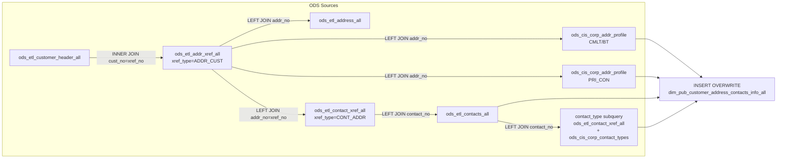

# DIM: Customer Address & Contact Full Snapshot (`dim_pub_customer_address_contacts_info_all`)

- artifact_type: etl_table
- artifact_id: dim_us.dim_pub_customer_address_contacts_info_all
- domain: customer
- one_line_purpose: This dimension table provides a complete cross-product of every customer address and its associated contacts for a given country entity. It is the foundational staging layer for customer address/contact data, combining raw address records, ...
- layer_type: DIM
- source_kind: etl_sql
- evidence_source: source/etl/sql/customer/source/etl/flows/public_order_tools/ingest/public_customer_dimension/script/dim_pub_customer_address_contacts_info_all.sql

---

## L1 Data Foundation

### Identity and physical mapping
- **Table:** `dim_us.dim_pub_customer_address_contacts_info_all`
- **Layer type:** DIM
- **Canonical / derived:** Derived / ETL-loaded (see L3)
- **Owner team:** not registered in metadata catalog

### Grain, scope, exclusions
- **Grain:** one row per customer × address cross-reference × contact cross-reference combination.
- **Scope:** See L2 business purpose / L3 filters
- **Partition:** none explicit — full overwrite each run. - resolved from pipeline (see L4)
- **Natural key:** `cust_no`, `addr_xref_seq` (`ax.xref_seq`), `contact_xref_seq` (`cx.xref_seq`), `contact_no`.
- **Exclusions:** Not documented in repository

#### Grain detail (preserved)

- **Grain:** one row per customer × address cross-reference × contact cross-reference combination.
- **Partition:** none explicit — full overwrite each run.
- **Natural key:** `cust_no`, `addr_xref_seq` (`ax.xref_seq`), `contact_xref_seq` (`cx.xref_seq`), `contact_no`.

---

### Cross-engine presence
| Engine | Present | Canonical FQN | Notes |
|--------|---------|---------------|-------|
| Hive | yes | `dim_pub_customer_address_contacts_info_all` | ETL target / intermediate per evidence script |
| Vertica | pending | `dim_pub_customer_address_contacts_info_all` | Confirm via hive2vertica flow evidence / MCP |

### Physical schema reference

Pointer block only - full column catalog lives in WKB L1 storage JSON.

| Field | Value |
|-------|-------|
| **Authoritative catalog** | WKB L1 storage seed (not duplicated in this file) |
| **entity_id** | `dim_us.dim_pub_customer_address_contacts_info_all` |
| **l1_catalog_seed** | `target/storage/wkb/snapshots/_snapshot_id_template/l1_catalog/{engine}_{schema}_{table}.json` |
| **column_count** | pending (run ddl_seed_writer) |
| **partition_keys** | `none explicit — full overwrite each run.` |
| **ddl_source** | pending Bitbucket DDL / Vertica metadata ingest |
| **retrieval** | `python -m tools.wkb.indexing.run_query --query "customer dim_pub_customer_address_contacts_info_all schema" --intent find_table_schema` |

### Lineage
| Object | Role |
|--------|------|
| `ods_${country_code}.ods_etl_customer_header_all` | Primary source |
| `ods_${country_code}.ods_etl_addr_xref_all` | Address cross-reference |
| `ods_${country_code}.ods_etl_address_all` | Address detail |
| `ods_${country_code}.ods_etl_contact_xref_all` | Contact cross-reference |
| `ods_${country_code}.ods_etl_contacts_all` | Contact detail |
| `ods_${country_code}.ods_cis_corp_contact_types` | Contact type lookup |
| `ods_${country_code}.ods_cis_corp_addr_profile` | Bill-to and primary contact profile flags |

---

### Freshness and load path
| Item | Value |
|------|-------|
| Load pattern | See L3 end-to-end / INSERT pattern in evidence script |
| Schedule | Not documented in repository |
| Parameters | `${country_code}` — determines the ODS/DIM schema prefix (e.g., `us`, `ca`, `mx`) |


---

## L2 Declarative Knowledge

### Business purpose
This dimension table provides a complete cross-product of every customer address and its associated contacts for a given country entity. It is the foundational staging layer for customer address/contact data, combining raw address records, contact details, contact types, and profile flags (bill-to, primary contact, EI/EDI indicator) into a single denormalized structure. Downstream jobs and reporting dimensions consume this table rather than the raw ODS sources directly.

---

### Audience and use cases
| Audience | How they benefit |
|----------|-----------------|
| **ETL / downstream dims** | `dim_pub_customer_address_contacts_info` and `dim_pub_customer_info` read this table to avoid repeated ODS joins |
| **Sales & CRM teams** | Complete address and contact details per customer for outreach and territory management |
| **Credit & collections** | Bill-to flag identifies the billing address for invoicing and collections workflows |
| **E-commerce / EDI teams** | EI flag (`ei_flag`) and contact type list support routing decisions for electronic order channels |

---

### Identifier search profile
- Primary lookup keys: see natural key under L1 Grain.
- Use latest snapshot / active flags when documented in L3 filters.

### Time field semantics
- **date_flag / partition columns:** none explicit — full overwrite each run.
- Primary reporting filter should use the partition column(s) documented in L1; resolve values via L4.


### Metrics served

| Category | Column | Logical metric | Business reading |
|----------|--------|----------------|------------------|
| Measures | — | — | No measure columns mapped for this table. |

### Metric serving map

**Formula authority:** [`source/contracts/customer/metric-index.md`](../../source/contracts/customer/metric-index.md)

N/A — no measure columns mapped for this table.

### etl_metrics

No governed logical metrics from `source/contracts/customer/metric-index.md` are mapped on this table.

---

### Metric serving map
N/A - not a `*_comb_mtd` / multi-period wide serving table (or map not present in legacy doc).


### Data products and column groups (preserved)

### Identifiers and relationships

- **Customer:** `cust_no`, `cust_name`, `website_address`
- **Address:** `addr_no`, `addr_xref_seq`, `xref_no`
- **Contact:** `contact_no`, `contact_xref_seq`, `xref_seq`, `xref1`

### Dimension columns (reporting-ready)

Use these for **filters, group-bys, and star-schema joins**:

- `address1` — combined address line (uses `address1a` alone if `address1b` is null, otherwise concatenates both)
- `address1a`, `address1b`, `address2`, `address3a`, `address3b` — raw address lines
- `city1a`, `city1b`, `state`, `country`, `zip_code` — geographic address fields
- `addr_name1a`, `addr_name1b`, `addr_name2a`, `addr_name2b` — address name lines
- `store_no`, `drop_ship` — fulfilment routing attributes
- `contact_name`, `title`, `prefer_lang` — contact identification and language preference
- `email_address`, `stop_email`, `bad_email`, `bad_email_desc` — email contact and validity flags
- `phone_no`, `fax_no`, `cell_no`, `phone_no2`, `ext_no`, `ext_no2` — raw phone fields
- `format_phone_no`, `format_phone_no2`, `format_cell_no` — digits-only phone strings
- `stop_call`, `comments` — contact preference flags
- `contact_type` — semicolon-separated list of contact type descriptions
- `xref_type` (addr, trimmed), `xref_type` (contact, trimmed) — cross-reference type codes

### Flag columns

| Column | Logic | Meaning |
|--------|-------|---------|
| `bill_to_flag` | `profile_cat='LOCA'`, `profile_type='CMLT'`, `active='Y'`, `profile_c='BT'` | Address is the bill-to location |
| `primary_contact_flag` | `profile_type='PRI_CON'`, `profile_cat='LOCA'`, `active='Y'`, contact not deleted | Contact is the primary contact for this address |
| `ei_flag` | `cx.active='Y'`, `cx.xref_no=5050`, `cx.xref_type='CONT_ADDR'` | Address/contact linked to EI (electronic interface) channel |

### Audit columns

- `etl_timestamp` — LA-timezone capture time
- `active` (addr xref), `active` (contact xref) — record active status
- `entry_datetime`, `update_datetime`, `delete_datetime` — for both address xref and contact xref

---

### etl_metrics

#### `address1`
- **Source:** [metric-index.md](../../source/contracts/customer/metric-index.md#address1)
- **Business definition:** Single combined address line 1
```sql
IF(address1b IS NULL, address1a, CONCAT(NVL(address1a,''), ' ', NVL(address1b,'')))
```

#### `format_phone_no`
- **Source:** [metric-index.md](../../source/contracts/customer/metric-index.md#format_phone_no)
- **Business definition:** Digits-only primary phone
```sql
CASE WHEN phone_no IS NOT NULL THEN regexp_replace(phone_no, '[^0-9]', '') END
```

#### `format_phone_no2`
- **Source:** [metric-index.md](../../source/contracts/customer/metric-index.md#format_phone_no2)
- **Business definition:** Digits-only secondary phone
```sql
CASE WHEN phone_no2 IS NOT NULL THEN regexp_replace(phone_no2, '[^0-9]', '') END
```

#### `format_cell_no`
- **Source:** [metric-index.md](../../source/contracts/customer/metric-index.md#format_cell_no)
- **Business definition:** Digits-only mobile number
```sql
CASE WHEN cell_no IS NOT NULL THEN regexp_replace(cell_no, '[^0-9]', '') END
```

#### `etl_timestamp`
- **Source:** [metric-index.md](../../source/contracts/customer/metric-index.md#etl_timestamp)
- **Business definition:** LA-timezone load timestamp
```sql
from_utc_timestamp(current_timestamp(), 'America/Los_Angeles')
```


---

## L3 Procedural Knowledge

### Query and routing rules
**Business filters:** Use partition / date keys from L1 grain for reporting scope.
**Technical predicates (load only):** See Key filters and step-by-step logic below.

### Dimension join patterns
| Dimension FQN | Join keys | Purpose | Evidence |
|---------------|-----------|---------|----------|
| See step-by-step / base tables | See L3 steps | Dimension enrichment | `source/etl/sql/customer/source/etl/flows/public_order_tools/ingest/public_customer_dimension/script/dim_pub_customer_address_contacts_info_all.sql` |

### Key filters and ETL business logic
### Step 1 — Contact type aggregation subquery (inline, aliased `ct`)

**Source:** `ods_${country_code}.ods_etl_contact_xref_all` + `ods_${country_code}.ods_cis_corp_contact_types`

**Filter:**
- `trim(cx2.xref_type) = 'CONT_TYPE'` — keeps only contact-type cross-references

**What happens:**
- Groups by `contact_no`
- Collects distinct `contact_desc` values into a set, then concatenated with `;` at the outer SELECT via `CONCAT_WS`

**Derived columns:**

| Column | Formula | Plain language |
|--------|---------|----------------|
| `contact_type_list` | `collect_set(ct.contact_desc)` grouped by `contact_no` | Array of distinct contact type descriptions per contact |
| `contact_type` (outer) | `CONCAT_WS(';', ct.contact_type_list)` | Semicolon-delimited string of all contact types |

---

### Step 2 — Bill-to address profile subquery (inline, aliased `ap`)

**Source:** `ods_${country_code}.ods_cis_corp_addr_profile`

**Filter:**
- `profile_cat = 'LOCA'`, `profile_type = 'CMLT'`, `active = 'Y'`, `profile_c = 'BT'`

**Derived column:**

| Column | Formula | Plain language |
|--------|---------|----------------|
| `bill_to_flag` | `CASE WHEN ap.profile_cat='LOCA' AND ... THEN 'Y' ELSE null END` | Marks address as a bill-to location |

---

### Step 3 — Primary contact profile subquery (inline, aliased `ap1`)

**Source:** `ods_${country_code}.ods_cis_corp_addr_profile`

**Filter:**
- `profile_type = 'PRI_CON'`, `profile_cat = 'LOCA'`, `active = 'Y'`

**Derived column:**

| Column |...

### Standard time-filter SQL
```sql
-- relative period filter using resolved partition value (see L4)
SELECT *
FROM dim_pub_customer_address_contacts_info_all
WHERE /* partition predicate */ date_flag = '${partition_value}';
```

### End-to-end flow
**Runtime parameters:** `${country_code}`
**Target table:** `dim_${country_code}.dim_pub_customer_address_contacts_info_all`, full overwrite.

1. **Read** `ods_etl_customer_header_all` as the customer anchor.
2. **INNER JOIN** `ods_etl_addr_xref_all` on `cust_no = xref_no` where `xref_type = 'ADDR_CUST'` — attaches address cross-references.
3. **LEFT JOIN** `ods_etl_address_all` on `addr_no` — pulls full address fields.
4. **LEFT JOIN** `ods_etl_contact_xref_all` on `addr_no = xref_no` where `xref_type = 'CONT_ADDR'` — links contacts to addresses.
5. **LEFT JOIN** `ods_etl_contacts_all` on `contact_no` — pulls contact detail fields.
6. **LEFT JOIN** subquery aggregating `contact_type_list` from `ods_etl_contact_xref_all` + `ods_cis_corp_contact_types` — produces semicolon-delimited contact type per contact.
7. **LEFT JOIN** `ods_cis_corp_addr_profile` (filtered to CMLT/BT) — drives `bill_to_flag`.
8. **LEFT JOIN** `ods_cis_corp_addr_profile` (filtered to PRI_CON) — drives `primary_contact_flag`.
9. **Compute** `address1` merge, `format_phone_no/2/cell`, flag columns.
10. **INSERT OVERWRITE** target table.



---


#### High-level stages (preserved)

| Stage | Business meaning |
|-------|-----------------|
| **Customer–Address join** | Anchors each customer (`cust_no`) to all their address cross-references (`xref_type = 'ADDR_CUST'`), pulling full address fields |
| **Contact cross-reference** | For each address, locates all associated contacts (`xref_type = 'CONT_ADDR'`) and their detail records |
| **Contact type aggregation** | Collects all contact type descriptions per contact from `ods_cis_corp_contact_types` into a semicolon-delimited list |
| **Profile flag derivation** | Derives three binary flags — bill-to (`CMLT/BT`), primary contact (`PRI_CON`), and EI flag (`xref_no=5050`) — from address-profile records |
| **Phone normalization** | Strips all non-numeric characters from `phone_no`, `phone_no2`, and `cell_no` to produce clean `format_*` columns |
| **INSERT overwrite** | Fully overwrites the target table on every run |

**Parameters:** `${country_code}` — determines the ODS/DIM schema prefix (e.g., `us`, `ca`, `mx`)

---


### Base tables register
| Object | Role in this job |
|--------|-----------------|
| `ods_${country_code}.ods_etl_customer_header_all` | Primary source — customer identity (`cust_no`, `cust_name`, `website_address`) |
| `ods_${country_code}.ods_etl_addr_xref_all` | Address cross-reference — links customers to address records; provides `xref_seq`, `xref_no`, `xref_type`, active/datetime flags |
| `ods_${country_code}.ods_etl_address_all` | Address detail — all address line, city, state, country, zip, drop_ship, store_no, addr_name fields |
| `ods_${country_code}.ods_etl_contact_xref_all` | Contact cross-reference — links address records to contact records; provides `xref_seq`, `xref1`, active/datetime flags |
| `ods_${country_code}.ods_etl_contacts_all` | Contact detail — name, title, phone, fax, email, cell, language preference, stop flags |
| `ods_${country_code}.ods_cis_corp_contact_types` | Contact type lookup — maps `contact_id` to `contact_desc` for contact classification |
| `ods_${country_code}.ods_cis_corp_addr_profile` | Address profile — used twice: once for `bill_to_flag` (CMLT/BT), once for `primary_contact_flag` (PRI_CON) |

**Temporary tables (inside the job only):** inline subquery for contact type aggregation (no named temp table)

---

### Step-by-step logic
### Step 1 — Contact type aggregation subquery (inline, aliased `ct`)

**Source:** `ods_${country_code}.ods_etl_contact_xref_all` + `ods_${country_code}.ods_cis_corp_contact_types`

**Filter:**
- `trim(cx2.xref_type) = 'CONT_TYPE'` — keeps only contact-type cross-references

**What happens:**
- Groups by `contact_no`
- Collects distinct `contact_desc` values into a set, then concatenated with `;` at the outer SELECT via `CONCAT_WS`

**Derived columns:**

| Column | Formula | Plain language |
|--------|---------|----------------|
| `contact_type_list` | `collect_set(ct.contact_desc)` grouped by `contact_no` | Array of distinct contact type descriptions per contact |
| `contact_type` (outer) | `CONCAT_WS(';', ct.contact_type_list)` | Semicolon-delimited string of all contact types |

---

### Step 2 — Bill-to address profile subquery (inline, aliased `ap`)

**Source:** `ods_${country_code}.ods_cis_corp_addr_profile`

**Filter:**
- `profile_cat = 'LOCA'`, `profile_type = 'CMLT'`, `active = 'Y'`, `profile_c = 'BT'`

**Derived column:**

| Column | Formula | Plain language |
|--------|---------|----------------|
| `bill_to_flag` | `CASE WHEN ap.profile_cat='LOCA' AND ... THEN 'Y' ELSE null END` | Marks address as a bill-to location |

---

### Step 3 — Primary contact profile subquery (inline, aliased `ap1`)

**Source:** `ods_${country_code}.ods_cis_corp_addr_profile`

**Filter:**
- `profile_type = 'PRI_CON'`, `profile_cat = 'LOCA'`, `active = 'Y'`

**Derived column:**

| Column | Formula | Plain language |
|--------|---------|----------------|
| `primary_contact_flag` | `CASE WHEN ap1 conditions AND cx.active='Y' AND cx.delete_datetime IS NULL AND c.delete_datetime IS NULL THEN 'Y' ELSE null END` | Contact is the designated primary contact for the address |

---

### Step 4 — Final SELECT + INSERT OVERWRITE

**From:** all joins described above

**Derived columns computed at SELECT:**

| Column | Formula | Plain language |
|--------|---------|----------------|
| `address1` | `IF(address1b IS NULL, address1a, CONCAT(NVL(address1a,''), ' ', NVL(address1b,'')))` | Single combined address line 1 |
| `format_phone_no` | `CASE WHEN phone_no IS NOT NULL THEN regexp_replace(phone_no, '[^0-9]', '') END` | Digits-only primary phone |
| `format_phone_no2` | `CASE WHEN phone_no2 IS NOT NULL THEN regexp_replace(phone_no2, '[^0-9]', '') END` | Digits-only secondary phone |
| `format_cell_no` | `CASE WHEN cell_no IS NOT NULL THEN regexp_replace(cell_no, '[^0-9]', '') END` | Digits-only mobile number |
| `etl_timestamp` | `from_utc_timestamp(current_timestamp(), 'America/Los_Angeles')` | LA-timezone load timestamp |
| `ei_flag` | `CASE WHEN cx.active='Y' AND cx.xref_no=5050 AND cx.xref_type='CONT_ADDR' THEN 'Y' ELSE null END` | EI channel indicator |

---

### Relationship map (embedded)

| from_fqn | to_fqn | cardinality | join_keys | provenance |
|----------|--------|-------------|-----------|------------|
| `ods_${country_code}.ods_etl_customer_header_all` | `ods_${country_code}.ods_etl_addr_xref_all` | many:1 | `ch.cust_no = ax.xref_no AND trim(ax.xref_type) = 'ADDR_CUST'` | etl_sql (source/etl/sql/customer/public_order_scripts/public_customer_dimension/script/dim_pub_customer_address_contacts_info_all.sql:1) |
| `ods_${country_code}.ods_etl_addr_xref_all` | `ods_${country_code}.ods_etl_address_all` | many:1 | `a.addr_no = ax.addr_no` | etl_sql (source/etl/sql/customer/public_order_scripts/public_customer_dimension/script/dim_pub_customer_address_contacts_info_all.sql:1) |
| `ods_${country_code}.ods_etl_addr_xref_all` | `ods_${country_code}.ods_etl_contact_xref_all` | many:1 | `ax.addr_no = cx.xref_no AND trim(cx.xref_type) = 'CONT_ADDR'` | etl_sql (source/etl/sql/customer/public_order_scripts/public_customer_dimension/script/dim_pub_customer_address_contacts_info_all.sql:1) |
| `ods_${country_code}.ods_etl_contact_xref_all` | `ods_${country_code}.ods_etl_contacts_all` | many:1 | `c.contact_no = cx.contact_no` | etl_sql (source/etl/sql/customer/public_order_scripts/public_customer_dimension/script/dim_pub_customer_address_contacts_info_all.sql:1) |
| `ods_${country_code}.ods_etl_contact_xref_all` | `ods_${country_code}.ods_cis_corp_contact_types` | many:1 | `cx2.xref_no=ct.contact_id` | etl_sql (source/etl/sql/customer/public_order_scripts/public_customer_dimension/script/dim_pub_customer_address_contacts_info_all.sql:1) |

`source/ref/customer/table relationship.txt`: Not documented in repository.

### Special logic (embedded)

Not documented in repository

### Column / field derivations (from ETL SQL)

| target_column | expression_sql | upstream_columns | upstream_tables | transform_kind | evidence |
|---------------|----------------|------------------|-----------------|----------------|----------|
| `cust_no` | `ch.cust_no` | `cust_no` | `ods_${country_code}.ods_etl_customer_header_all`, `ods_${country_code}.ods_etl_addr_xref_all`, `ods_${country_code}.ods_etl_address_all`, `ods_${country_code}.ods_etl_contact_xref_all`, `ods_${country_code}.ods_etl_contacts_all`, `ods_${country_code}.ods_cis_corp_contact_types`, `ods_${country_code}.ods_cis_corp_addr_profile` | passthrough | `source/etl/sql/customer/public_order_scripts/public_customer_dimension/script/dim_pub_customer_address_contacts_info_all.sql:4` |
| `cust_name` | `ch.cust_name` | `cust_name` | `ods_${country_code}.ods_etl_customer_header_all`, `ods_${country_code}.ods_etl_addr_xref_all`, `ods_${country_code}.ods_etl_address_all`, `ods_${country_code}.ods_etl_contact_xref_all`, `ods_${country_code}.ods_etl_contacts_all`, `ods_${country_code}.ods_cis_corp_contact_types`, `ods_${country_code}.ods_cis_corp_addr_profile` | passthrough | `source/etl/sql/customer/public_order_scripts/public_customer_dimension/script/dim_pub_customer_address_contacts_info_all.sql:5` |
| `addr_xref_seq` | `ax.xref_seq` | `xref_seq` | `ods_${country_code}.ods_etl_customer_header_all`, `ods_${country_code}.ods_etl_addr_xref_all`, `ods_${country_code}.ods_etl_address_all`, `ods_${country_code}.ods_etl_contact_xref_all`, `ods_${country_code}.ods_etl_contacts_all`, `ods_${country_code}.ods_cis_corp_contact_types`, `ods_${country_code}.ods_cis_corp_addr_profile` | rename | `source/etl/sql/customer/public_order_scripts/public_customer_dimension/script/dim_pub_customer_address_contacts_info_all.sql:6` |
| `addr_no` | `a.addr_no` | `addr_no` | `ods_${country_code}.ods_etl_customer_header_all`, `ods_${country_code}.ods_etl_addr_xref_all`, `ods_${country_code}.ods_etl_address_all`, `ods_${country_code}.ods_etl_contact_xref_all`, `ods_${country_code}.ods_etl_contacts_all`, `ods_${country_code}.ods_cis_corp_contact_types`, `ods_${country_code}.ods_cis_corp_addr_profile` | passthrough | `source/etl/sql/customer/public_order_scripts/public_customer_dimension/script/dim_pub_customer_address_contacts_info_all.sql:7` |
| `address1a` | `a.address1a` | `address1a` | `ods_${country_code}.ods_etl_customer_header_all`, `ods_${country_code}.ods_etl_addr_xref_all`, `ods_${country_code}.ods_etl_address_all`, `ods_${country_code}.ods_etl_contact_xref_all`, `ods_${country_code}.ods_etl_contacts_all`, `ods_${country_code}.ods_cis_corp_contact_types`, `ods_${country_code}.ods_cis_corp_addr_profile` | passthrough | `source/etl/sql/customer/public_order_scripts/public_customer_dimension/script/dim_pub_customer_address_contacts_info_all.sql:8` |
| `address1b` | `a.address1b` | `address1b` | `ods_${country_code}.ods_etl_customer_header_all`, `ods_${country_code}.ods_etl_addr_xref_all`, `ods_${country_code}.ods_etl_address_all`, `ods_${country_code}.ods_etl_contact_xref_all`, `ods_${country_code}.ods_etl_contacts_all`, `ods_${country_code}.ods_cis_corp_contact_types`, `ods_${country_code}.ods_cis_corp_addr_profile` | passthrough | `source/etl/sql/customer/public_order_scripts/public_customer_dimension/script/dim_pub_customer_address_contacts_info_all.sql:9` |
| `address1` | `if(a.address1b is null, a.address1a, concat( nvl(address1a, ''), ' ', nvl(address1b, '')))` | `address1b`, `address1a` | `ods_${country_code}.ods_etl_customer_header_all`, `ods_${country_code}.ods_etl_addr_xref_all`, `ods_${country_code}.ods_etl_address_all`, `ods_${country_code}.ods_etl_contact_xref_all`, `ods_${country_code}.ods_etl_contacts_all`, `ods_${country_code}.ods_cis_corp_contact_types`, `ods_${country_code}.ods_cis_corp_addr_profile` | coalesce | `source/etl/sql/customer/public_order_scripts/public_customer_dimension/script/dim_pub_customer_address_contacts_info_all.sql:3` |
| `address2` | `a.address2` | `address2` | `ods_${country_code}.ods_etl_customer_header_all`, `ods_${country_code}.ods_etl_addr_xref_all`, `ods_${country_code}.ods_etl_address_all`, `ods_${country_code}.ods_etl_contact_xref_all`, `ods_${country_code}.ods_etl_contacts_all`, `ods_${country_code}.ods_cis_corp_contact_types`, `ods_${country_code}.ods_cis_corp_addr_profile` | passthrough | `source/etl/sql/customer/public_order_scripts/public_customer_dimension/script/dim_pub_customer_address_contacts_info_all.sql:13` |
| `address3a` | `a.address3a` | `address3a` | `ods_${country_code}.ods_etl_customer_header_all`, `ods_${country_code}.ods_etl_addr_xref_all`, `ods_${country_code}.ods_etl_address_all`, `ods_${country_code}.ods_etl_contact_xref_all`, `ods_${country_code}.ods_etl_contacts_all`, `ods_${country_code}.ods_cis_corp_contact_types`, `ods_${country_code}.ods_cis_corp_addr_profile` | passthrough | `source/etl/sql/customer/public_order_scripts/public_customer_dimension/script/dim_pub_customer_address_contacts_info_all.sql:14` |
| `address3b` | `a.address3b` | `address3b` | `ods_${country_code}.ods_etl_customer_header_all`, `ods_${country_code}.ods_etl_addr_xref_all`, `ods_${country_code}.ods_etl_address_all`, `ods_${country_code}.ods_etl_contact_xref_all`, `ods_${country_code}.ods_etl_contacts_all`, `ods_${country_code}.ods_cis_corp_contact_types`, `ods_${country_code}.ods_cis_corp_addr_profile` | passthrough | `source/etl/sql/customer/public_order_scripts/public_customer_dimension/script/dim_pub_customer_address_contacts_info_all.sql:15` |
| `city1a` | `a.city1a` | `city1a` | `ods_${country_code}.ods_etl_customer_header_all`, `ods_${country_code}.ods_etl_addr_xref_all`, `ods_${country_code}.ods_etl_address_all`, `ods_${country_code}.ods_etl_contact_xref_all`, `ods_${country_code}.ods_etl_contacts_all`, `ods_${country_code}.ods_cis_corp_contact_types`, `ods_${country_code}.ods_cis_corp_addr_profile` | passthrough | `source/etl/sql/customer/public_order_scripts/public_customer_dimension/script/dim_pub_customer_address_contacts_info_all.sql:16` |
| `city1b` | `a.city1b` | `city1b` | `ods_${country_code}.ods_etl_customer_header_all`, `ods_${country_code}.ods_etl_addr_xref_all`, `ods_${country_code}.ods_etl_address_all`, `ods_${country_code}.ods_etl_contact_xref_all`, `ods_${country_code}.ods_etl_contacts_all`, `ods_${country_code}.ods_cis_corp_contact_types`, `ods_${country_code}.ods_cis_corp_addr_profile` | passthrough | `source/etl/sql/customer/public_order_scripts/public_customer_dimension/script/dim_pub_customer_address_contacts_info_all.sql:17` |
| `state` | `a.state` | `state` | `ods_${country_code}.ods_etl_customer_header_all`, `ods_${country_code}.ods_etl_addr_xref_all`, `ods_${country_code}.ods_etl_address_all`, `ods_${country_code}.ods_etl_contact_xref_all`, `ods_${country_code}.ods_etl_contacts_all`, `ods_${country_code}.ods_cis_corp_contact_types`, `ods_${country_code}.ods_cis_corp_addr_profile` | passthrough | `source/etl/sql/customer/public_order_scripts/public_customer_dimension/script/dim_pub_customer_address_contacts_info_all.sql:18` |
| `country` | `a.country` | `country` | `ods_${country_code}.ods_etl_customer_header_all`, `ods_${country_code}.ods_etl_addr_xref_all`, `ods_${country_code}.ods_etl_address_all`, `ods_${country_code}.ods_etl_contact_xref_all`, `ods_${country_code}.ods_etl_contacts_all`, `ods_${country_code}.ods_cis_corp_contact_types`, `ods_${country_code}.ods_cis_corp_addr_profile` | passthrough | `source/etl/sql/customer/public_order_scripts/public_customer_dimension/script/dim_pub_customer_address_contacts_info_all.sql:19` |
| `zip_code` | `a.zip_code` | `zip_code` | `ods_${country_code}.ods_etl_customer_header_all`, `ods_${country_code}.ods_etl_addr_xref_all`, `ods_${country_code}.ods_etl_address_all`, `ods_${country_code}.ods_etl_contact_xref_all`, `ods_${country_code}.ods_etl_contacts_all`, `ods_${country_code}.ods_cis_corp_contact_types`, `ods_${country_code}.ods_cis_corp_addr_profile` | passthrough | `source/etl/sql/customer/public_order_scripts/public_customer_dimension/script/dim_pub_customer_address_contacts_info_all.sql:20` |
| `drop_ship` | `a.drop_ship` | `drop_ship` | `ods_${country_code}.ods_etl_customer_header_all`, `ods_${country_code}.ods_etl_addr_xref_all`, `ods_${country_code}.ods_etl_address_all`, `ods_${country_code}.ods_etl_contact_xref_all`, `ods_${country_code}.ods_etl_contacts_all`, `ods_${country_code}.ods_cis_corp_contact_types`, `ods_${country_code}.ods_cis_corp_addr_profile` | passthrough | `source/etl/sql/customer/public_order_scripts/public_customer_dimension/script/dim_pub_customer_address_contacts_info_all.sql:21` |
| `store_no` | `a.store_no` | `store_no` | `ods_${country_code}.ods_etl_customer_header_all`, `ods_${country_code}.ods_etl_addr_xref_all`, `ods_${country_code}.ods_etl_address_all`, `ods_${country_code}.ods_etl_contact_xref_all`, `ods_${country_code}.ods_etl_contacts_all`, `ods_${country_code}.ods_cis_corp_contact_types`, `ods_${country_code}.ods_cis_corp_addr_profile` | passthrough | `source/etl/sql/customer/public_order_scripts/public_customer_dimension/script/dim_pub_customer_address_contacts_info_all.sql:22` |
| `contact_xref_seq` | `cx.xref_seq` | `xref_seq` | `ods_${country_code}.ods_etl_customer_header_all`, `ods_${country_code}.ods_etl_addr_xref_all`, `ods_${country_code}.ods_etl_address_all`, `ods_${country_code}.ods_etl_contact_xref_all`, `ods_${country_code}.ods_etl_contacts_all`, `ods_${country_code}.ods_cis_corp_contact_types`, `ods_${country_code}.ods_cis_corp_addr_profile` | rename | `source/etl/sql/customer/public_order_scripts/public_customer_dimension/script/dim_pub_customer_address_contacts_info_all.sql:23` |
| `contact_no` | `c.contact_no` | `contact_no` | `ods_${country_code}.ods_etl_customer_header_all`, `ods_${country_code}.ods_etl_addr_xref_all`, `ods_${country_code}.ods_etl_address_all`, `ods_${country_code}.ods_etl_contact_xref_all`, `ods_${country_code}.ods_etl_contacts_all`, `ods_${country_code}.ods_cis_corp_contact_types`, `ods_${country_code}.ods_cis_corp_addr_profile` | passthrough | `source/etl/sql/customer/public_order_scripts/public_customer_dimension/script/dim_pub_customer_address_contacts_info_all.sql:24` |
| `contact_name` | `c.contact_name` | `contact_name` | `ods_${country_code}.ods_etl_customer_header_all`, `ods_${country_code}.ods_etl_addr_xref_all`, `ods_${country_code}.ods_etl_address_all`, `ods_${country_code}.ods_etl_contact_xref_all`, `ods_${country_code}.ods_etl_contacts_all`, `ods_${country_code}.ods_cis_corp_contact_types`, `ods_${country_code}.ods_cis_corp_addr_profile` | passthrough | `source/etl/sql/customer/public_order_scripts/public_customer_dimension/script/dim_pub_customer_address_contacts_info_all.sql:25` |
| `title` | `c.title` | `title` | `ods_${country_code}.ods_etl_customer_header_all`, `ods_${country_code}.ods_etl_addr_xref_all`, `ods_${country_code}.ods_etl_address_all`, `ods_${country_code}.ods_etl_contact_xref_all`, `ods_${country_code}.ods_etl_contacts_all`, `ods_${country_code}.ods_cis_corp_contact_types`, `ods_${country_code}.ods_cis_corp_addr_profile` | passthrough | `source/etl/sql/customer/public_order_scripts/public_customer_dimension/script/dim_pub_customer_address_contacts_info_all.sql:26` |
| `phone_no` | `c.phone_no` | `phone_no` | `ods_${country_code}.ods_etl_customer_header_all`, `ods_${country_code}.ods_etl_addr_xref_all`, `ods_${country_code}.ods_etl_address_all`, `ods_${country_code}.ods_etl_contact_xref_all`, `ods_${country_code}.ods_etl_contacts_all`, `ods_${country_code}.ods_cis_corp_contact_types`, `ods_${country_code}.ods_cis_corp_addr_profile` | passthrough | `source/etl/sql/customer/public_order_scripts/public_customer_dimension/script/dim_pub_customer_address_contacts_info_all.sql:27` |
| `fax_no` | `c.fax_no` | `fax_no` | `ods_${country_code}.ods_etl_customer_header_all`, `ods_${country_code}.ods_etl_addr_xref_all`, `ods_${country_code}.ods_etl_address_all`, `ods_${country_code}.ods_etl_contact_xref_all`, `ods_${country_code}.ods_etl_contacts_all`, `ods_${country_code}.ods_cis_corp_contact_types`, `ods_${country_code}.ods_cis_corp_addr_profile` | passthrough | `source/etl/sql/customer/public_order_scripts/public_customer_dimension/script/dim_pub_customer_address_contacts_info_all.sql:28` |
| `email_address` | `c.email_address` | `email_address` | `ods_${country_code}.ods_etl_customer_header_all`, `ods_${country_code}.ods_etl_addr_xref_all`, `ods_${country_code}.ods_etl_address_all`, `ods_${country_code}.ods_etl_contact_xref_all`, `ods_${country_code}.ods_etl_contacts_all`, `ods_${country_code}.ods_cis_corp_contact_types`, `ods_${country_code}.ods_cis_corp_addr_profile` | passthrough | `source/etl/sql/customer/public_order_scripts/public_customer_dimension/script/dim_pub_customer_address_contacts_info_all.sql:29` |
| `stop_email` | `c.stop_email` | `stop_email` | `ods_${country_code}.ods_etl_customer_header_all`, `ods_${country_code}.ods_etl_addr_xref_all`, `ods_${country_code}.ods_etl_address_all`, `ods_${country_code}.ods_etl_contact_xref_all`, `ods_${country_code}.ods_etl_contacts_all`, `ods_${country_code}.ods_cis_corp_contact_types`, `ods_${country_code}.ods_cis_corp_addr_profile` | passthrough | `source/etl/sql/customer/public_order_scripts/public_customer_dimension/script/dim_pub_customer_address_contacts_info_all.sql:30` |
| `cell_no` | `c.cell_no` | `cell_no` | `ods_${country_code}.ods_etl_customer_header_all`, `ods_${country_code}.ods_etl_addr_xref_all`, `ods_${country_code}.ods_etl_address_all`, `ods_${country_code}.ods_etl_contact_xref_all`, `ods_${country_code}.ods_etl_contacts_all`, `ods_${country_code}.ods_cis_corp_contact_types`, `ods_${country_code}.ods_cis_corp_addr_profile` | passthrough | `source/etl/sql/customer/public_order_scripts/public_customer_dimension/script/dim_pub_customer_address_contacts_info_all.sql:31` |
| `bad_email` | `c.bad_email` | `bad_email` | `ods_${country_code}.ods_etl_customer_header_all`, `ods_${country_code}.ods_etl_addr_xref_all`, `ods_${country_code}.ods_etl_address_all`, `ods_${country_code}.ods_etl_contact_xref_all`, `ods_${country_code}.ods_etl_contacts_all`, `ods_${country_code}.ods_cis_corp_contact_types`, `ods_${country_code}.ods_cis_corp_addr_profile` | passthrough | `source/etl/sql/customer/public_order_scripts/public_customer_dimension/script/dim_pub_customer_address_contacts_info_all.sql:32` |
| `bad_email_desc` | `c.bad_email_desc` | `bad_email_desc` | `ods_${country_code}.ods_etl_customer_header_all`, `ods_${country_code}.ods_etl_addr_xref_all`, `ods_${country_code}.ods_etl_address_all`, `ods_${country_code}.ods_etl_contact_xref_all`, `ods_${country_code}.ods_etl_contacts_all`, `ods_${country_code}.ods_cis_corp_contact_types`, `ods_${country_code}.ods_cis_corp_addr_profile` | passthrough | `source/etl/sql/customer/public_order_scripts/public_customer_dimension/script/dim_pub_customer_address_contacts_info_all.sql:33` |
| `ext_no` | `c.ext_no` | `ext_no` | `ods_${country_code}.ods_etl_customer_header_all`, `ods_${country_code}.ods_etl_addr_xref_all`, `ods_${country_code}.ods_etl_address_all`, `ods_${country_code}.ods_etl_contact_xref_all`, `ods_${country_code}.ods_etl_contacts_all`, `ods_${country_code}.ods_cis_corp_contact_types`, `ods_${country_code}.ods_cis_corp_addr_profile` | passthrough | `source/etl/sql/customer/public_order_scripts/public_customer_dimension/script/dim_pub_customer_address_contacts_info_all.sql:34` |
| `stop_call` | `c.stop_call` | `stop_call` | `ods_${country_code}.ods_etl_customer_header_all`, `ods_${country_code}.ods_etl_addr_xref_all`, `ods_${country_code}.ods_etl_address_all`, `ods_${country_code}.ods_etl_contact_xref_all`, `ods_${country_code}.ods_etl_contacts_all`, `ods_${country_code}.ods_cis_corp_contact_types`, `ods_${country_code}.ods_cis_corp_addr_profile` | passthrough | `source/etl/sql/customer/public_order_scripts/public_customer_dimension/script/dim_pub_customer_address_contacts_info_all.sql:35` |
| `phone_no2` | `c.phone_no2` | `phone_no2` | `ods_${country_code}.ods_etl_customer_header_all`, `ods_${country_code}.ods_etl_addr_xref_all`, `ods_${country_code}.ods_etl_address_all`, `ods_${country_code}.ods_etl_contact_xref_all`, `ods_${country_code}.ods_etl_contacts_all`, `ods_${country_code}.ods_cis_corp_contact_types`, `ods_${country_code}.ods_cis_corp_addr_profile` | passthrough | `source/etl/sql/customer/public_order_scripts/public_customer_dimension/script/dim_pub_customer_address_contacts_info_all.sql:36` |
| `ext_no2` | `c.ext_no2` | `ext_no2` | `ods_${country_code}.ods_etl_customer_header_all`, `ods_${country_code}.ods_etl_addr_xref_all`, `ods_${country_code}.ods_etl_address_all`, `ods_${country_code}.ods_etl_contact_xref_all`, `ods_${country_code}.ods_etl_contacts_all`, `ods_${country_code}.ods_cis_corp_contact_types`, `ods_${country_code}.ods_cis_corp_addr_profile` | passthrough | `source/etl/sql/customer/public_order_scripts/public_customer_dimension/script/dim_pub_customer_address_contacts_info_all.sql:37` |
| `comments` | `c.comments` | `comments` | `ods_${country_code}.ods_etl_customer_header_all`, `ods_${country_code}.ods_etl_addr_xref_all`, `ods_${country_code}.ods_etl_address_all`, `ods_${country_code}.ods_etl_contact_xref_all`, `ods_${country_code}.ods_etl_contacts_all`, `ods_${country_code}.ods_cis_corp_contact_types`, `ods_${country_code}.ods_cis_corp_addr_profile` | passthrough | `source/etl/sql/customer/public_order_scripts/public_customer_dimension/script/dim_pub_customer_address_contacts_info_all.sql:38` |
| `prefer_lang` | `c.prefer_lang` | `prefer_lang` | `ods_${country_code}.ods_etl_customer_header_all`, `ods_${country_code}.ods_etl_addr_xref_all`, `ods_${country_code}.ods_etl_address_all`, `ods_${country_code}.ods_etl_contact_xref_all`, `ods_${country_code}.ods_etl_contacts_all`, `ods_${country_code}.ods_cis_corp_contact_types`, `ods_${country_code}.ods_cis_corp_addr_profile` | passthrough | `source/etl/sql/customer/public_order_scripts/public_customer_dimension/script/dim_pub_customer_address_contacts_info_all.sql:39` |
| `etl_timestamp` | `from_utc_timestamp(current_timestamp(),'America/Los_Angeles')` | `from_utc_timestamp`, `current_timestamp`, `America`, `Los_Angeles` | `ods_${country_code}.ods_etl_customer_header_all`, `ods_${country_code}.ods_etl_addr_xref_all`, `ods_${country_code}.ods_etl_address_all`, `ods_${country_code}.ods_etl_contact_xref_all`, `ods_${country_code}.ods_etl_contacts_all`, `ods_${country_code}.ods_cis_corp_contact_types`, `ods_${country_code}.ods_cis_corp_addr_profile` | arithmetic | `source/etl/sql/customer/public_order_scripts/public_customer_dimension/script/dim_pub_customer_address_contacts_info_all.sql:40` |
| `format_phone_no` | `(CASE WHEN phone_no is not null THEN regexp_replace(phone_no, '[^0-9]', '') END)` | `phone_no`, `regexp_replace` | `ods_${country_code}.ods_etl_customer_header_all`, `ods_${country_code}.ods_etl_addr_xref_all`, `ods_${country_code}.ods_etl_address_all`, `ods_${country_code}.ods_etl_contact_xref_all`, `ods_${country_code}.ods_etl_contacts_all`, `ods_${country_code}.ods_cis_corp_contact_types`, `ods_${country_code}.ods_cis_corp_addr_profile` | case | `source/etl/sql/customer/public_order_scripts/public_customer_dimension/script/dim_pub_customer_address_contacts_info_all.sql:3` |
| `format_phone_no2` | `(CASE WHEN phone_no2 is not null THEN regexp_replace(phone_no2, '[^0-9]', '') END)` | `phone_no2`, `regexp_replace` | `ods_${country_code}.ods_etl_customer_header_all`, `ods_${country_code}.ods_etl_addr_xref_all`, `ods_${country_code}.ods_etl_address_all`, `ods_${country_code}.ods_etl_contact_xref_all`, `ods_${country_code}.ods_etl_contacts_all`, `ods_${country_code}.ods_cis_corp_contact_types`, `ods_${country_code}.ods_cis_corp_addr_profile` | case | `source/etl/sql/customer/public_order_scripts/public_customer_dimension/script/dim_pub_customer_address_contacts_info_all.sql:3` |
| `format_cell_no` | `(CASE WHEN cell_no is not null THEN regexp_replace(cell_no, '[^0-9]', '') END)` | `cell_no`, `regexp_replace` | `ods_${country_code}.ods_etl_customer_header_all`, `ods_${country_code}.ods_etl_addr_xref_all`, `ods_${country_code}.ods_etl_address_all`, `ods_${country_code}.ods_etl_contact_xref_all`, `ods_${country_code}.ods_etl_contacts_all`, `ods_${country_code}.ods_cis_corp_contact_types`, `ods_${country_code}.ods_cis_corp_addr_profile` | case | `source/etl/sql/customer/public_order_scripts/public_customer_dimension/script/dim_pub_customer_address_contacts_info_all.sql:3` |
| `xref_no` | `ax.xref_no` | `xref_no` | `ods_${country_code}.ods_etl_customer_header_all`, `ods_${country_code}.ods_etl_addr_xref_all`, `ods_${country_code}.ods_etl_address_all`, `ods_${country_code}.ods_etl_contact_xref_all`, `ods_${country_code}.ods_etl_contacts_all`, `ods_${country_code}.ods_cis_corp_contact_types`, `ods_${country_code}.ods_cis_corp_addr_profile` | passthrough | `source/etl/sql/customer/public_order_scripts/public_customer_dimension/script/dim_pub_customer_address_contacts_info_all.sql:50` |
| `xref_seq` | `cx.xref_seq` | `xref_seq` | `ods_${country_code}.ods_etl_customer_header_all`, `ods_${country_code}.ods_etl_addr_xref_all`, `ods_${country_code}.ods_etl_address_all`, `ods_${country_code}.ods_etl_contact_xref_all`, `ods_${country_code}.ods_etl_contacts_all`, `ods_${country_code}.ods_cis_corp_contact_types`, `ods_${country_code}.ods_cis_corp_addr_profile` | passthrough | `source/etl/sql/customer/public_order_scripts/public_customer_dimension/script/dim_pub_customer_address_contacts_info_all.sql:23` |
| `website_address` | `ch.website_address` | `website_address` | `ods_${country_code}.ods_etl_customer_header_all`, `ods_${country_code}.ods_etl_addr_xref_all`, `ods_${country_code}.ods_etl_address_all`, `ods_${country_code}.ods_etl_contact_xref_all`, `ods_${country_code}.ods_etl_contacts_all`, `ods_${country_code}.ods_cis_corp_contact_types`, `ods_${country_code}.ods_cis_corp_addr_profile` | passthrough | `source/etl/sql/customer/public_order_scripts/public_customer_dimension/script/dim_pub_customer_address_contacts_info_all.sql:52` |
| `addr_name1a` | `a.addr_name1a` | `addr_name1a` | `ods_${country_code}.ods_etl_customer_header_all`, `ods_${country_code}.ods_etl_addr_xref_all`, `ods_${country_code}.ods_etl_address_all`, `ods_${country_code}.ods_etl_contact_xref_all`, `ods_${country_code}.ods_etl_contacts_all`, `ods_${country_code}.ods_cis_corp_contact_types`, `ods_${country_code}.ods_cis_corp_addr_profile` | passthrough | `source/etl/sql/customer/public_order_scripts/public_customer_dimension/script/dim_pub_customer_address_contacts_info_all.sql:53` |
| `addr_name1b` | `a.addr_name1b` | `addr_name1b` | `ods_${country_code}.ods_etl_customer_header_all`, `ods_${country_code}.ods_etl_addr_xref_all`, `ods_${country_code}.ods_etl_address_all`, `ods_${country_code}.ods_etl_contact_xref_all`, `ods_${country_code}.ods_etl_contacts_all`, `ods_${country_code}.ods_cis_corp_contact_types`, `ods_${country_code}.ods_cis_corp_addr_profile` | passthrough | `source/etl/sql/customer/public_order_scripts/public_customer_dimension/script/dim_pub_customer_address_contacts_info_all.sql:54` |
| `addr_name2a` | `a.addr_name2a` | `addr_name2a` | `ods_${country_code}.ods_etl_customer_header_all`, `ods_${country_code}.ods_etl_addr_xref_all`, `ods_${country_code}.ods_etl_address_all`, `ods_${country_code}.ods_etl_contact_xref_all`, `ods_${country_code}.ods_etl_contacts_all`, `ods_${country_code}.ods_cis_corp_contact_types`, `ods_${country_code}.ods_cis_corp_addr_profile` | passthrough | `source/etl/sql/customer/public_order_scripts/public_customer_dimension/script/dim_pub_customer_address_contacts_info_all.sql:55` |
| `addr_name2b` | `a.addr_name2b` | `addr_name2b` | `ods_${country_code}.ods_etl_customer_header_all`, `ods_${country_code}.ods_etl_addr_xref_all`, `ods_${country_code}.ods_etl_address_all`, `ods_${country_code}.ods_etl_contact_xref_all`, `ods_${country_code}.ods_etl_contacts_all`, `ods_${country_code}.ods_cis_corp_contact_types`, `ods_${country_code}.ods_cis_corp_addr_profile` | passthrough | `source/etl/sql/customer/public_order_scripts/public_customer_dimension/script/dim_pub_customer_address_contacts_info_all.sql:56` |
| `xref1` | `cx.xref1` | `xref1` | `ods_${country_code}.ods_etl_customer_header_all`, `ods_${country_code}.ods_etl_addr_xref_all`, `ods_${country_code}.ods_etl_address_all`, `ods_${country_code}.ods_etl_contact_xref_all`, `ods_${country_code}.ods_etl_contacts_all`, `ods_${country_code}.ods_cis_corp_contact_types`, `ods_${country_code}.ods_cis_corp_addr_profile` | passthrough | `source/etl/sql/customer/public_order_scripts/public_customer_dimension/script/dim_pub_customer_address_contacts_info_all.sql:57` |
| `xref_type` | `trim(ax.xref_type)` | `xref_type` | `ods_${country_code}.ods_etl_customer_header_all`, `ods_${country_code}.ods_etl_addr_xref_all`, `ods_${country_code}.ods_etl_address_all`, `ods_${country_code}.ods_etl_contact_xref_all`, `ods_${country_code}.ods_etl_contacts_all`, `ods_${country_code}.ods_cis_corp_contact_types`, `ods_${country_code}.ods_cis_corp_addr_profile` | udf | `source/etl/sql/customer/public_order_scripts/public_customer_dimension/script/dim_pub_customer_address_contacts_info_all.sql:58` |
| `active` | `ax.active` | `active` | `ods_${country_code}.ods_etl_customer_header_all`, `ods_${country_code}.ods_etl_addr_xref_all`, `ods_${country_code}.ods_etl_address_all`, `ods_${country_code}.ods_etl_contact_xref_all`, `ods_${country_code}.ods_etl_contacts_all`, `ods_${country_code}.ods_cis_corp_contact_types`, `ods_${country_code}.ods_cis_corp_addr_profile` | passthrough | `source/etl/sql/customer/public_order_scripts/public_customer_dimension/script/dim_pub_customer_address_contacts_info_all.sql:59` |
| `entry_datetime` | `ax.entry_datetime` | `entry_datetime` | `ods_${country_code}.ods_etl_customer_header_all`, `ods_${country_code}.ods_etl_addr_xref_all`, `ods_${country_code}.ods_etl_address_all`, `ods_${country_code}.ods_etl_contact_xref_all`, `ods_${country_code}.ods_etl_contacts_all`, `ods_${country_code}.ods_cis_corp_contact_types`, `ods_${country_code}.ods_cis_corp_addr_profile` | passthrough | `source/etl/sql/customer/public_order_scripts/public_customer_dimension/script/dim_pub_customer_address_contacts_info_all.sql:60` |
| `update_datetime` | `ax.update_datetime` | `update_datetime` | `ods_${country_code}.ods_etl_customer_header_all`, `ods_${country_code}.ods_etl_addr_xref_all`, `ods_${country_code}.ods_etl_address_all`, `ods_${country_code}.ods_etl_contact_xref_all`, `ods_${country_code}.ods_etl_contacts_all`, `ods_${country_code}.ods_cis_corp_contact_types`, `ods_${country_code}.ods_cis_corp_addr_profile` | passthrough | `source/etl/sql/customer/public_order_scripts/public_customer_dimension/script/dim_pub_customer_address_contacts_info_all.sql:61` |
| `delete_datetime` | `ax.delete_datetime` | `delete_datetime` | `ods_${country_code}.ods_etl_customer_header_all`, `ods_${country_code}.ods_etl_addr_xref_all`, `ods_${country_code}.ods_etl_address_all`, `ods_${country_code}.ods_etl_contact_xref_all`, `ods_${country_code}.ods_etl_contacts_all`, `ods_${country_code}.ods_cis_corp_contact_types`, `ods_${country_code}.ods_cis_corp_addr_profile` | passthrough | `source/etl/sql/customer/public_order_scripts/public_customer_dimension/script/dim_pub_customer_address_contacts_info_all.sql:62` |
| `xref_type` | `trim(cx.xref_type)` | `xref_type` | `ods_${country_code}.ods_etl_customer_header_all`, `ods_${country_code}.ods_etl_addr_xref_all`, `ods_${country_code}.ods_etl_address_all`, `ods_${country_code}.ods_etl_contact_xref_all`, `ods_${country_code}.ods_etl_contacts_all`, `ods_${country_code}.ods_cis_corp_contact_types`, `ods_${country_code}.ods_cis_corp_addr_profile` | udf | `source/etl/sql/customer/public_order_scripts/public_customer_dimension/script/dim_pub_customer_address_contacts_info_all.sql:63` |
| `active` | `cx.active` | `active` | `ods_${country_code}.ods_etl_customer_header_all`, `ods_${country_code}.ods_etl_addr_xref_all`, `ods_${country_code}.ods_etl_address_all`, `ods_${country_code}.ods_etl_contact_xref_all`, `ods_${country_code}.ods_etl_contacts_all`, `ods_${country_code}.ods_cis_corp_contact_types`, `ods_${country_code}.ods_cis_corp_addr_profile` | passthrough | `source/etl/sql/customer/public_order_scripts/public_customer_dimension/script/dim_pub_customer_address_contacts_info_all.sql:64` |
| `entry_datetime` | `cx.entry_datetime` | `entry_datetime` | `ods_${country_code}.ods_etl_customer_header_all`, `ods_${country_code}.ods_etl_addr_xref_all`, `ods_${country_code}.ods_etl_address_all`, `ods_${country_code}.ods_etl_contact_xref_all`, `ods_${country_code}.ods_etl_contacts_all`, `ods_${country_code}.ods_cis_corp_contact_types`, `ods_${country_code}.ods_cis_corp_addr_profile` | passthrough | `source/etl/sql/customer/public_order_scripts/public_customer_dimension/script/dim_pub_customer_address_contacts_info_all.sql:65` |
| `update_datetime` | `cx.update_datetime` | `update_datetime` | `ods_${country_code}.ods_etl_customer_header_all`, `ods_${country_code}.ods_etl_addr_xref_all`, `ods_${country_code}.ods_etl_address_all`, `ods_${country_code}.ods_etl_contact_xref_all`, `ods_${country_code}.ods_etl_contacts_all`, `ods_${country_code}.ods_cis_corp_contact_types`, `ods_${country_code}.ods_cis_corp_addr_profile` | passthrough | `source/etl/sql/customer/public_order_scripts/public_customer_dimension/script/dim_pub_customer_address_contacts_info_all.sql:66` |
| `delete_datetime` | `cx.delete_datetime` | `delete_datetime` | `ods_${country_code}.ods_etl_customer_header_all`, `ods_${country_code}.ods_etl_addr_xref_all`, `ods_${country_code}.ods_etl_address_all`, `ods_${country_code}.ods_etl_contact_xref_all`, `ods_${country_code}.ods_etl_contacts_all`, `ods_${country_code}.ods_cis_corp_contact_types`, `ods_${country_code}.ods_cis_corp_addr_profile` | passthrough | `source/etl/sql/customer/public_order_scripts/public_customer_dimension/script/dim_pub_customer_address_contacts_info_all.sql:67` |
| `contact_type` | `CONCAT_WS(';',ct.contact_type_list)` | `CONCAT_WS`, `contact_type_list` | `ods_${country_code}.ods_etl_customer_header_all`, `ods_${country_code}.ods_etl_addr_xref_all`, `ods_${country_code}.ods_etl_address_all`, `ods_${country_code}.ods_etl_contact_xref_all`, `ods_${country_code}.ods_etl_contacts_all`, `ods_${country_code}.ods_cis_corp_contact_types`, `ods_${country_code}.ods_cis_corp_addr_profile` | udf | `source/etl/sql/customer/public_order_scripts/public_customer_dimension/script/dim_pub_customer_address_contacts_info_all.sql:68` |
| `bill_to_flag` | `case when ap.profile_cat='LOCA' and ap.profile_type='CMLT' and ap.active='Y' and ap.profile_c='BT' then 'Y' else null...` | `profile_cat`, `LOCA`, `profile_type`, `CMLT`, `active`, `Y`, `profile_c`, `BT` | `ods_${country_code}.ods_etl_customer_header_all`, `ods_${country_code}.ods_etl_addr_xref_all`, `ods_${country_code}.ods_etl_address_all`, `ods_${country_code}.ods_etl_contact_xref_all`, `ods_${country_code}.ods_etl_contacts_all`, `ods_${country_code}.ods_cis_corp_contact_types`, `ods_${country_code}.ods_cis_corp_addr_profile` | case | `source/etl/sql/customer/public_order_scripts/public_customer_dimension/script/dim_pub_customer_address_contacts_info_all.sql:69` |
| `primary_contact_flag` | `case when ap1.profile_type='PRI_CON' and ap1.profile_cat='LOCA' and ap1.active='Y' and cx.delete_datetime is null and...` | `profile_type`, `PRI_CON`, `profile_cat`, `LOCA`, `active`, `Y`, `delete_datetime`, `profile_i`, `xref_seq` | `ods_${country_code}.ods_etl_customer_header_all`, `ods_${country_code}.ods_etl_addr_xref_all`, `ods_${country_code}.ods_etl_address_all`, `ods_${country_code}.ods_etl_contact_xref_all`, `ods_${country_code}.ods_etl_contacts_all`, `ods_${country_code}.ods_cis_corp_contact_types`, `ods_${country_code}.ods_cis_corp_addr_profile` | case | `source/etl/sql/customer/public_order_scripts/public_customer_dimension/script/dim_pub_customer_address_contacts_info_all.sql:70` |
| `ei_flag` | `case when cx.active='Y' and cx.xref_no=5050 and cx.xref_type='CONT_ADDR' then 'Y' else null end` | `active`, `Y`, `xref_no`, `xref_type`, `CONT_ADDR` | `ods_${country_code}.ods_etl_customer_header_all`, `ods_${country_code}.ods_etl_addr_xref_all`, `ods_${country_code}.ods_etl_address_all`, `ods_${country_code}.ods_etl_contact_xref_all`, `ods_${country_code}.ods_etl_contacts_all`, `ods_${country_code}.ods_cis_corp_contact_types`, `ods_${country_code}.ods_cis_corp_addr_profile` | case | `source/etl/sql/customer/public_order_scripts/public_customer_dimension/script/dim_pub_customer_address_contacts_info_all.sql:74` |

### Sentinel and code values
| Value | Meaning |
|-------|---------|
| `xref_type = 'ADDR_CUST'` | Address cross-reference is for a customer address (not a vendor or other entity) |
| `xref_type = 'CONT_ADDR'` | Contact cross-reference links a contact to an address |
| `xref_type = 'CONT_TYPE'` | Contact cross-reference links a contact to a contact-type classification |
| `profile_c = 'BT'` | Address profile designates billing location |
| `profile_type = 'PRI_CON'` | Address profile designates primary contact for that address |
| `cx.xref_no = 5050` | Sentinel value identifying EI (electronic interface) contacts |

---

---

## L4 Validation

### Resolved partition value
| Step | Source | How partition / date scope is determined |
|------|--------|------------------------------------------|
| 1 | evidence script / flow | See parameters in L1 Freshness and L3 filters - `source/etl/sql/customer/source/etl/flows/public_order_tools/ingest/public_customer_dimension/script/dim_pub_customer_address_contacts_info_all.sql` |

**Plain language:** Partition and date scope follow Azkaban/bootstrap parameters documented in the source script and orchestrating flow; do not hardcode calendar literals.

### Data quality checks
- Prefer row-count-by-partition, metric sums, and grain duplicate checks (see Validation SQL).
- Additional checks from legacy caveats / operational notes when present.

### Validation SQL
```sql
-- 1) Row count by partition
SELECT ${partition_col}, COUNT(*) AS row_cnt
FROM dim_${country_code}.dim_pub_customer_address_contacts_info_all
WHERE ${partition_col} = '${partition_value}'
GROUP BY ${partition_col};

-- 2) Metric sum by business dimension (top deltas)
SELECT ${dim_key}, SUM(${metric}) AS metric_sum
FROM dim_${country_code}.dim_pub_customer_address_contacts_info_all
WHERE ${partition_col} = '${partition_value}'
GROUP BY ${dim_key}
ORDER BY ABS(SUM(${metric})) DESC
LIMIT 20;

-- 3) Grain duplicate check
SELECT ${grain_key_1}, ${grain_key_2}, ${grain_key_3}, ${partition_col}, COUNT(*) AS cnt
FROM dim_${country_code}.dim_pub_customer_address_contacts_info_all
WHERE ${partition_col} = '${partition_value}'
GROUP BY ${grain_key_1}, ${grain_key_2}, ${grain_key_3}, ${partition_col}
HAVING COUNT(*) > 1;
```

Replace placeholders from this file's Grain and keys / Data you can fetch sections, and use the resolved partition value from run scope.

### Caveats for interpretation
- The grain is the full Cartesian product of address × contact cross-references; a single customer can appear in many rows. Aggregation is required before presenting counts to business users.
- `bill_to_flag`, `primary_contact_flag`, and `ei_flag` are `'Y'` or `NULL` (not `'N'`) — filter using `IS NOT NULL` or `= 'Y'`.
- `address1` is a derived composite field; `address1a` and `address1b` are preserved as-is for systems that need raw source values.
- Phone format columns are `NULL` when the source phone column is `NULL`; they contain digits only and cannot be used for international dialing format validation without additional logic.
- `contact_type` is a semicolon-delimited string rather than a structured array; parsing is required for multi-value filtering.
- This table is an intermediate staging layer — it is not the primary table for end-user reporting. Use `dim_pub_customer_address_contacts_info` (with store enrichment) for reporting.

---

### Conflicts and open questions
- Schedule, owner, SLA: Not documented in repository (unless preserved schedule evidence above).
- Vertica MCP verification: pending unless confirmed in L5.


---

## L5 Runtime View

### Query path and engine preference
| Role | Hive object | Vertica object | Sync mode | Evidence | MCP verified |
|------|-------------|----------------|-----------|----------|--------------|
| **Query for reporting** | *See script lineage* | `dim_${country_code}.dim_pub_customer_address_contacts_info_all` | *Verify from flow* | *Add flow file:line* | pending |
| **Hive alternative** | `*` | `dim_${country_code}.dim_pub_customer_address_contacts_info_all` | - | *See dependencies* | - |
| **ETL internal** | staging/temp tables | *Not synced to Vertica* | - | *See step-by-step logic* | - |

Business users should query `dim_${country_code}.dim_pub_customer_address_contacts_info_all` in Vertica once MCP verification is completed for this document.

### Access constraints
- Country / company schema parameters may apply (`literal_country`, `company_no`, etc.).
- Hive-only staging objects are not reporting surfaces unless synced.

### Query risk profile
| Field | Value |
|-------|-------|
| requires_date_predicate | unknown |
| scan_risk_tier | medium |

---

## L6 Access and Consumption

### Primary consumers and use cases
| Audience | How they benefit |
|----------|-----------------|
| **ETL / downstream dims** | `dim_pub_customer_address_contacts_info` and `dim_pub_customer_info` read this table to avoid repeated ODS joins |
| **Sales & CRM teams** | Complete address and contact details per customer for outreach and territory management |
| **Credit & collections** | Bill-to flag identifies the billing address for invoicing and collections workflows |
| **E-commerce / EDI teams** | EI flag (`ei_flag`) and contact type list support routing decisions for electronic order channels |

---

### Representative query patterns
```sql
-- certified / illustrative lookup - replace predicates from L1/L4
SELECT *
FROM dim_pub_customer_address_contacts_info_all
WHERE date_flag = '${partition_value}'
LIMIT 100;
```

### Dependencies and notes
### Upstream objects (verified)

| Object | Usage | Evidence |
|--------|-------|----------|
| `ods_${country_code}.ods_etl_customer_header_all` | INNER JOIN — `cust_no`, `cust_name`, `website_address` | `dim_pub_customer_address_contacts_info_all.sql:76` |
| `ods_${country_code}.ods_etl_addr_xref_all` | INNER JOIN — `xref_seq`, `xref_no`, `xref_type`, active/datetime flags | `dim_pub_customer_address_contacts_info_all.sql:77` |
| `ods_${country_code}.ods_etl_address_all` | LEFT JOIN — all address fields | `dim_pub_customer_address_contacts_info_all.sql:81` |
| `ods_${country_code}.ods_etl_contact_xref_all` | LEFT JOIN — contact xref fields; also used in contact-type subquery | `dim_pub_customer_address_contacts_info_all.sql:84,95` |
| `ods_${country_code}.ods_etl_contacts_all` | LEFT JOIN — contact detail fields | `dim_pub_customer_address_contacts_info_all.sql:88` |
| `ods_${country_code}.ods_cis_corp_contact_types` | LEFT JOIN in subquery — contact type description | `dim_pub_customer_address_contacts_info_all.sql:96` |
| `ods_${country_code}.ods_cis_corp_addr_profile` | LEFT JOIN (twice) — bill-to flag and primary contact flag | `dim_pub_customer_address_contacts_info_all.sql:103,106` |

### Downstream consumers (verified)

| Object / script | Evidence |
|-----------------|----------|
| `dim_${country_code}.dim_pub_customer_address_contacts_info` | Reads this table as primary source | `dim_pub_customer_address_contacts_info.sql:62` |
| `dim_${country_code}.dim_pub_customer_info` (via `temp_contact`) | Reads `dim_pub_customer_address_contacts_info` which is derived from this table | `dim_pub_customer_info.sql:59` |

### Operational detail (verified)

- Full `INSERT OVERWRITE` — no incremental/partition strategy evident from script.

### Not documented in repository

- Schedule, owner, SLA — not in scripts or configs
- Dependency on upstream ODS ETL load order

---

*Document generated from `source/etl/sql/customer/source/etl/flows/public_order_tools/ingest/public_customer_dimension/script/dim_pub_customer_address_contacts_info_all.sql`.*

#### Not documented in repository
- Owner, SLA (unless schedule evidence preserved above)
- Any dependency without `file:line` evidence in this document

---

*Document migrated to L1-L6 from legacy Knowledgebase content. Evidence: `source/etl/sql/customer/source/etl/flows/public_order_tools/ingest/public_customer_dimension/script/dim_pub_customer_address_contacts_info_all.sql`.*
