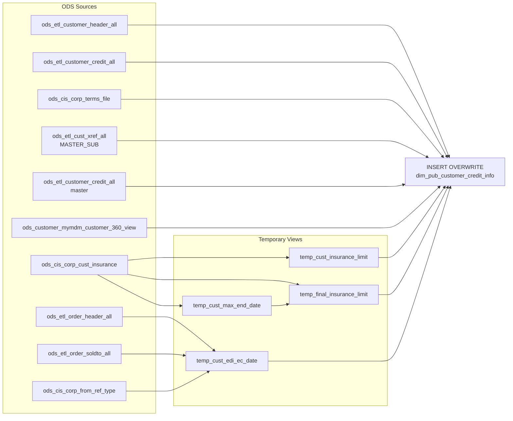

# DIM: Customer Credit Information (`dim_pub_customer_credit_info`)

- artifact_type: etl_table
- artifact_id: dim_us.dim_pub_customer_credit_info
- domain: customer
- one_line_purpose: This dimension table consolidates all credit-related attributes for each customer, including credit limits, payment terms, balances, insurance limits, and electronic ordering history. It also resolves master-customer (parent account) relati...
- layer_type: DIM
- source_kind: etl_sql
- evidence_source: source/etl/sql/customer/source/etl/flows/public_order_tools/ingest/public_customer_dimension/script/dim_pub_customer_credit_info.sql

---

## L1 Data Foundation

### Identity and physical mapping
- **Table:** `dim_us.dim_pub_customer_credit_info`
- **Layer type:** DIM
- **Canonical / derived:** Derived / ETL-loaded (see L3)
- **Owner team:** not registered in metadata catalog

### Grain, scope, exclusions
- **Grain:** one row per customer (`cust_no`).
- **Scope:** See L2 business purpose / L3 filters
- **Partition:** none explicit — full overwrite each run. - resolved from pipeline (see L4)
- **Natural key:** `cust_no`.
- **Exclusions:** Not documented in repository

#### Grain detail (preserved)

- **Grain:** one row per customer (`cust_no`).
- **Partition:** none explicit — full overwrite each run.
- **Natural key:** `cust_no`.

---

### Cross-engine presence
| Engine | Present | Canonical FQN | Notes |
|--------|---------|---------------|-------|
| Hive | yes | `dim_pub_customer_credit_info` | ETL target / intermediate per evidence script |
| Vertica | pending | `dim_pub_customer_credit_info` | Confirm via hive2vertica flow evidence / MCP |

### Physical schema reference

Pointer block only - full column catalog lives in WKB L1 storage JSON.

| Field | Value |
|-------|-------|
| **Authoritative catalog** | WKB L1 storage seed (not duplicated in this file) |
| **entity_id** | `dim_us.dim_pub_customer_credit_info` |
| **l1_catalog_seed** | `target/storage/wkb/snapshots/_snapshot_id_template/l1_catalog/{engine}_{schema}_{table}.json` |
| **column_count** | pending (run ddl_seed_writer) |
| **partition_keys** | `none explicit — full overwrite each run.` |
| **ddl_source** | pending Bitbucket DDL / Vertica metadata ingest |
| **retrieval** | `python -m tools.wkb.indexing.run_query --query "customer dim_pub_customer_credit_info schema" --intent find_table_schema` |

### Lineage
| Object | Role |
|--------|------|
| `ods_${country_code}.ods_cis_corp_cust_insurance` | Insurance limit and end-date source |
| `ods_${country_code}.ods_etl_order_header_all` | Order header for EDI/EC date computation |
| `ods_${country_code}.ods_etl_order_soldto_all` | Order sold-to for from_ref_type lookup |
| `ods_${country_code}.ods_cis_corp_from_ref_type` | System type lookup (EDI, XML, EC EXPRESS) |
| `ods_${country_code}.ods_etl_customer_header_all` | Customer anchor |
| `ods_${country_code}.ods_etl_customer_credit_all` | Customer credit detail (sub and master) |
| `ods_${country_code}.ods_cis_corp_terms_file` | Terms description and parameters |
| `ods_${country_code}.ods_etl_cust_profile_all` | Credit focus profile |
| `ods_${country_code}.ods_etl_cust_xref_all` | Master-sub customer xref |
| `ods_${country_code}.ods_customer_mymdm_customer_360_view` | Share credit limit flag |

---

### Freshness and load path
| Item | Value |
|------|-------|
| Load pattern | See L3 end-to-end / INSERT pattern in evidence script |
| Schedule | Not documented in repository |
| Parameters | `${country_code}` — determines the ODS/DIM schema prefix |


---

## L2 Declarative Knowledge

### Business purpose
This dimension table consolidates all credit-related attributes for each customer, including credit limits, payment terms, balances, insurance limits, and electronic ordering history. It also resolves master-customer (parent account) relationships so that analysts can compare a sub-account's credit position against its master account. Credit analysts, collectors, and finance teams use this table to assess customer credit risk and payment performance.

---

### Audience and use cases
| Audience | How they benefit |
|----------|-----------------|
| **Credit analysts** | Credit limit, balance, pending amounts, past-due date, and insurance limit in one place for underwriting decisions |
| **Collectors** | Current balance, past-due amount, last payment date, and collector/analyst assignment details |
| **Finance / AR** | Terms group, flooring flag, discount days/percent, and bill-to address for reconciliation |
| **Sales operations** | Share-credit-limit flag and master-customer credit limit for account hierarchy analysis |
| **E-commerce / EDI teams** | `last_edi_or_xml_date` and `last_ec_order_date` to understand electronic channel activity per customer |

---

### Identifier search profile
- Primary lookup keys: see natural key under L1 Grain.
- Use latest snapshot / active flags when documented in L3 filters.

### Time field semantics
- **date_flag / partition columns:** none explicit — full overwrite each run.
- Primary reporting filter should use the partition column(s) documented in L1; resolve values via L4.


### Metrics served

| Category | Column | Logical metric | Business reading |
|----------|--------|----------------|------------------|
| Measures | — | — | No measure columns mapped for this table. |

### Metric serving map

**Formula authority:** [`source/contracts/customer/metric-index.md`](../../source/contracts/customer/metric-index.md)

N/A — no measure columns mapped for this table.

### etl_metrics

No governed logical metrics from `source/contracts/customer/metric-index.md` are mapped on this table.

---

### Metric serving map
N/A - not a `*_comb_mtd` / multi-period wide serving table (or map not present in legacy doc).


### Data products and column groups (preserved)

### Identifiers and relationships

- **Customer:** `cust_no`
- **Master customer:** `mcust_no` — resolved from `MASTER_SUB` xref; falls back to `cust_no` if no master exists

### Dimension columns

Use these for **filters, group-bys, and star-schema joins**:

- `terms` — payment terms code
- `terms_desc` — human-readable terms description
- `terms_days` — net payment days
- `terms_group` — terms group code
- `disc_percent`, `disc_days` — early payment discount rate and qualifying days
- `flooring` — flooring program flag
- `bill_to_addr` — bill-to address reference
- `sequence_no` — credit record sequence
- `credit_data_source` — source system for the credit record
- `share_credit_limit_flag` — whether the customer participates in shared credit (from MDM 360 view)
- `delete_id`, `delete_datetime` — soft-delete markers
- `entry_datetime` — credit record creation timestamp

### Credit & financial metrics

| Column | Meaning |
|--------|---------|
| `credit_limit` | Customer's approved credit limit |
| `mcust_credit_limit` | Master customer's credit limit |
| `curr_bal` | Current outstanding balance |
| `curr_pymts` | Current payments amount |
| `pending_amt` | Orders approved but not yet invoiced |
| `past_due_amt` | Amount overdue |
| `past_due_date` | Date since which balance has been past due |
| `last_pay_date` | Date of most recent payment |
| `sold_since` | Date the customer first purchased |
| `last_purchase` | Date of most recent purchase |
| `insurance_limit` | Simple max insurance limit on record |
| `final_insurance_limit` | Max insurance limit at the latest active end date (in-force) |
| `end_date` | Insurance policy end date for the in-force limit |
| `credit_review_frequency` | Concatenation of `last_review ~ next_review` from customer header |
| `last_edi_or_xml_date` | Latest ship date for EDI or XML orders |
| `last_ec_order_date` | Latest ship date for EC Express orders |

---

### etl_metrics

#### `insurance_limit`
- **Source:** [metric-index.md](../../source/contracts/customer/metric-index.md#insurance_limit)
- **Business definition:** Highest insurance limit ever recorded for the customer
```sql
max(insurance_limit)` grouped by `cust_no
```

#### `end_date`
- **Source:** [metric-index.md](../../source/contracts/customer/metric-index.md#end_date)
- **Business definition:** Latest insurance policy end date, excluding deleted records
```sql
max(end_date)` grouped by `cust_no
```

#### `final_insurance_limit`
- **Source:** [metric-index.md](../../source/contracts/customer/metric-index.md#final_insurance_limit)
- **Business definition:** In-force insurance limit at the latest active end date
```sql
max(ci.insurance_limit)` grouped by `ci.cust_no, ed.end_date
```

#### `last_edi_or_xml_date`
- **Source:** [metric-index.md](../../source/contracts/customer/metric-index.md#last_edi_or_xml_date)
- **Business definition:** Last date an EDI or XML order shipped for this customer
```sql
max(CASE WHEN system_type IN ('EDI','XML') THEN ship_date ELSE null END)
```

#### `last_ec_order_date`
- **Source:** [metric-index.md](../../source/contracts/customer/metric-index.md#last_ec_order_date)
- **Business definition:** Last date an EC Express order shipped for this customer
```sql
max(CASE WHEN system_type = 'EC EXPRESS' THEN ship_date ELSE null END)
```

#### `ods_etl_customer_credit_all_mcc`
- **Source:** [metric-index.md](../../source/contracts/customer/metric-index.md#ods_etl_customer_credit_all_mcc)
- **Business definition:** Master customer's credit limit
```sql
IF(cx.xref_no IS NULL, ch.cust_no, cx.xref_no) = mcc.cust_no` AND `cc.terms = mcc.terms
```

#### `mcust_no`
- **Source:** [metric-index.md](../../source/contracts/customer/metric-index.md#mcust_no)
- **Business definition:** Master customer number; self-references if no MASTER_SUB xref
```sql
IF(cx.xref_no IS NULL, ch.cust_no, cx.xref_no)
```

#### `etl_timestamp`
- **Source:** [metric-index.md](../../source/contracts/customer/metric-index.md#etl_timestamp)
- **Business definition:** LA-timezone load timestamp
```sql
from_utc_timestamp(current_timestamp(), 'America/Los_Angeles')
```


---

## L3 Procedural Knowledge

### Query and routing rules
**Business filters:** Use partition / date keys from L1 grain for reporting scope.
**Technical predicates (load only):** See Key filters and step-by-step logic below.

### Dimension join patterns
| Dimension FQN | Join keys | Purpose | Evidence |
|---------------|-----------|---------|----------|
| See step-by-step / base tables | See L3 steps | Dimension enrichment | `source/etl/sql/customer/source/etl/flows/public_order_tools/ingest/public_customer_dimension/script/dim_pub_customer_credit_info.sql` |

### Key filters and ETL business logic
### Step 1 — `temp_cust_insurance_limit`

**Source:** `ods_${country_code}.ods_cis_corp_cust_insurance`

**Filter:** none (all insurance records per customer)

**Derived columns:**

| Column | Formula | Plain language |
|--------|---------|----------------|
| `insurance_limit` | `max(insurance_limit)` grouped by `cust_no` | Highest insurance limit ever recorded for the customer |

---

### Step 2 — `temp_cust_max_end_date`

**Source:** `ods_${country_code}.ods_cis_corp_cust_insurance`

**Filter:**
- `delete_date IS NULL` — exclude deleted records
- `delete_id IS NULL` — exclude soft-deleted records

**Derived columns:**

| Column | Formula | Plain language |
|--------|---------|----------------|
| `end_date` | `max(end_date)` grouped by `cust_no` | Latest insurance policy end date, excluding deleted records |

---

### Step 3 — `temp_final_insurance_limit`

**Source:** `ods_${country_code}.ods_cis_corp_cust_insurance` INNER JOIN `temp_cust_max_end_date`

**Filter:**
- `ci.cust_no = ed.cust_no` AND `ci.end_date = ed.end_date` — only records at the latest end date
- `insurance_limit IS NOT NULL` — exclude null limits

**Derived columns:**

| Column | Formula | Plain language |
|--------|---------|----------------|
| `final_insurance_limit` | `max(ci.insurance_limit)` grouped by `ci.cust_no, ed.end_date` | In-force insurance limit at the latest active end date |
| `end_date` | from `temp_cust_max_end_date` | The end date of the current in-force insurance policy |

---

### Step ...

### Standard time-filter SQL
```sql
-- relative period filter using resolved partition value (see L4)
SELECT *
FROM dim_pub_customer_credit_info
WHERE /* partition predicate */ date_flag = '${partition_value}';
```

### End-to-end flow
**Runtime parameters:** `${country_code}`
**Target table:** `dim_${country_code}.dim_pub_customer_credit_info`, full overwrite.

1. **`temp_cust_insurance_limit`** — max `insurance_limit` per `cust_no` from `ods_cis_corp_cust_insurance`.
2. **`temp_cust_max_end_date`** — max non-deleted `end_date` per `cust_no` from `ods_cis_corp_cust_insurance`.
3. **`temp_final_insurance_limit`** — joins `ods_cis_corp_cust_insurance` to `temp_cust_max_end_date` to find the max limit at the latest end date; requires `insurance_limit IS NOT NULL`.
4. **`temp_cust_edi_ec_date`** — joins `ods_etl_order_header_all` → `ods_etl_order_soldto_all` → `ods_cis_corp_from_ref_type` to compute last `EDI/XML` and `EC EXPRESS` ship dates per `to_acct_no`.
5. **INSERT OVERWRITE** — joins customer header (`ch`), customer credit (`cc`), terms file (`tf`), customer profile (`cp`, CRED/CUST_FOCUS), master-sub xref (`cx`), master customer credit (`mcc`), MDM 360 view (`cm`), and all four temp tables.



---


#### High-level stages (preserved)

| Stage | Business meaning |
|-------|-----------------|
| **Insurance limit pre-aggregation** | Computes the simple max insurance limit per customer (`temp_cust_insurance_limit`) |
| **Max insurance end date** | Finds the latest non-deleted insurance end date per customer (`temp_cust_max_end_date`) |
| **Final insurance limit** | Combines the end-date filter with the max limit to get the in-force insurance limit (`temp_final_insurance_limit`) |
| **EDI / EC last order dates** | Scans order headers joined to order sold-to and from-ref-type to find the last EDI/XML ship date and last EC Express ship date per customer (`temp_cust_edi_ec_date`) |
| **Main INSERT** | Joins customer header, credit, terms, profile, master-customer xref, master credit, MDM 360 view, insurance temps, and EDI/EC temp to produce the final credit dimension |

**Parameters:** `${country_code}` — determines the ODS/DIM schema prefix

---


### Base tables register
| Object | Role in this job |
|--------|-----------------|
| `ods_${country_code}.ods_cis_corp_cust_insurance` | Insurance limit and end-date source for all three insurance temp views |
| `ods_${country_code}.ods_etl_order_header_all` | Order header — provides `to_acct_no`, `ship_date`, `order_no`, `order_type` for EDI/EC date calc |
| `ods_${country_code}.ods_etl_order_soldto_all` | Order sold-to — provides `from_ref_type` joined to order header |
| `ods_${country_code}.ods_cis_corp_from_ref_type` | From-ref-type lookup — maps `from_ref_type` to `system_type` (EDI, XML, EC EXPRESS) |
| `ods_${country_code}.ods_etl_customer_header_all` | Primary customer anchor — `cust_no`, `last_review`, `next_review`, `cred_analyst`, `reviewer` |
| `ods_${country_code}.ods_etl_customer_credit_all` | Customer credit detail — `credit_limit`, `terms`, balances, dates (used for both sub and master) |
| `ods_${country_code}.ods_cis_corp_terms_file` | Terms lookup — INNER JOIN on `doc_terms` = `cc.terms`; provides terms description, days, group, flooring |
| `ods_${country_code}.ods_etl_cust_profile_all` | Customer profile — LEFT JOIN filtered to `CRED/CUST_FOCUS/active=Y`; not directly output but affects join path |
| `ods_${country_code}.ods_etl_cust_xref_all` | Customer xref — `MASTER_SUB/active=Y` to resolve `mcust_no` |
| `ods_${country_code}.ods_customer_mymdm_customer_360_view` | MDM 360 view — provides `share_credit_limit_flag` |

**Temporary tables (inside the job only):**
`temp_cust_insurance_limit` → `temp_cust_max_end_date` → `temp_final_insurance_limit` (insurance chain)
`temp_cust_edi_ec_date` (EDI/EC channel dates)
→ final `INSERT OVERWRITE`

---

### Step-by-step logic
### Step 1 — `temp_cust_insurance_limit`

**Source:** `ods_${country_code}.ods_cis_corp_cust_insurance`

**Filter:** none (all insurance records per customer)

**Derived columns:**

| Column | Formula | Plain language |
|--------|---------|----------------|
| `insurance_limit` | `max(insurance_limit)` grouped by `cust_no` | Highest insurance limit ever recorded for the customer |

---

### Step 2 — `temp_cust_max_end_date`

**Source:** `ods_${country_code}.ods_cis_corp_cust_insurance`

**Filter:**
- `delete_date IS NULL` — exclude deleted records
- `delete_id IS NULL` — exclude soft-deleted records

**Derived columns:**

| Column | Formula | Plain language |
|--------|---------|----------------|
| `end_date` | `max(end_date)` grouped by `cust_no` | Latest insurance policy end date, excluding deleted records |

---

### Step 3 — `temp_final_insurance_limit`

**Source:** `ods_${country_code}.ods_cis_corp_cust_insurance` INNER JOIN `temp_cust_max_end_date`

**Filter:**
- `ci.cust_no = ed.cust_no` AND `ci.end_date = ed.end_date` — only records at the latest end date
- `insurance_limit IS NOT NULL` — exclude null limits

**Derived columns:**

| Column | Formula | Plain language |
|--------|---------|----------------|
| `final_insurance_limit` | `max(ci.insurance_limit)` grouped by `ci.cust_no, ed.end_date` | In-force insurance limit at the latest active end date |
| `end_date` | from `temp_cust_max_end_date` | The end date of the current in-force insurance policy |

---

### Step 4 — `temp_cust_edi_ec_date`

**Source:** `ods_etl_order_header_all` INNER JOIN `ods_etl_order_soldto_all` INNER JOIN `ods_cis_corp_from_ref_type`

**Filter:**
- `b.system_type IN ('EDI','XML','EC EXPRESS')` — only electronic order types
- `a.ship_date IS NOT NULL` — only shipped orders

**Derived columns:**

| Column | Formula | Plain language |
|--------|---------|----------------|
| `last_edi_or_xml_date` | `max(CASE WHEN system_type IN ('EDI','XML') THEN ship_date ELSE null END)` | Last date an EDI or XML order shipped for this customer |
| `last_ec_order_date` | `max(CASE WHEN system_type = 'EC EXPRESS' THEN ship_date ELSE null END)` | Last date an EC Express order shipped for this customer |

---

### Step 5 — Final INSERT OVERWRITE into `dim_pub_customer_credit_info`

**From:** `ods_etl_customer_header_all ch` INNER JOIN `ods_etl_customer_credit_all cc` INNER JOIN `ods_cis_corp_terms_file tf`

**Left joins:**

| Join | Keys | Purpose |
|------|------|---------|
| `ods_etl_cust_profile_all cp` | `ch.cust_no = cp.cust_no`, `profile_cat='CRED'`, `profile_type='CUST_FOCUS'`, `active='Y'` | Customer focus profile (join path only; no output columns selected from `cp`) |
| `ods_etl_cust_xref_all cx` | `ch.cust_no = cx.cust_no`, `xref_type='MASTER_SUB'`, `active='Y'` | Resolves master (`mcust_no`) |
| `ods_etl_customer_credit_all mcc` | `IF(cx.xref_no IS NULL, ch.cust_no, cx.xref_no) = mcc.cust_no` AND `cc.terms = mcc.terms` | Master customer's credit limit |
| `ods_customer_mymdm_customer_360_view cm` | `ch.cust_no = cm.cust_no` | Share credit limit flag |
| `temp_cust_insurance_limit cit` | `ch.cust_no = cit.cust_no` | Simple max insurance limit |
| `temp_cust_edi_ec_date ced` | `ch.cust_no = ced.cust_no` | Last EDI/XML and EC Express ship dates |
| `temp_final_insurance_limit fi` | `ch.cust_no = fi.cust_no` | In-force insurance limit and end date |

**Derived columns computed at INSERT:**

| Column | Formula | Plain language |
|--------|---------|----------------|
| `mcust_no` | `IF(cx.xref_no IS NULL, ch.cust_no, cx.xref_no)` | Master customer number; self-references if no MASTER_SUB xref |
| `credit_review_frequency` | `CONCAT(ch.last_review, '~', ch.next_review)` | Combined review schedule string |
| `etl_timestamp` | `from_utc_timestamp(current_timestamp(), 'America/Los_Angeles')` | LA-timezone load timestamp |

---

### Relationship map (embedded)

| from_fqn | to_fqn | cardinality | join_keys | provenance |
|----------|--------|-------------|-----------|------------|
| `ods_${country_code}.ods_cis_corp_cust_insurance` | `temp_cust_max_end_date` | many:1 | `ci.cust_no=ed.cust_no and ci.end_date=ed.end_date and insurance_limit is not null` | etl_sql (source/etl/sql/customer/public_order_scripts/public_customer_dimension/script/dim_pub_customer_credit_info.sql:1) |
| `ods_${country_code}.ods_etl_order_header_all` | `ods_${country_code}.ods_etl_order_soldto_all` | many:1 | `a.order_no = c.order_no and a.order_type = c.order_type` | etl_sql (source/etl/sql/customer/public_order_scripts/public_customer_dimension/script/dim_pub_customer_credit_info.sql:1) |
| `ods_${country_code}.ods_etl_order_soldto_all` | `ods_${country_code}.ods_cis_corp_from_ref_type` | many:1 | `c.from_ref_type=b.from_ref_type` | etl_sql (source/etl/sql/customer/public_order_scripts/public_customer_dimension/script/dim_pub_customer_credit_info.sql:1) |
| `ods_${country_code}.ods_etl_customer_header_all` | `ods_${country_code}.ods_etl_customer_credit_all` | many:1 | `ch.cust_no = cc.cust_no` | etl_sql (source/etl/sql/customer/public_order_scripts/public_customer_dimension/script/dim_pub_customer_credit_info.sql:1) |
| `ods_${country_code}.ods_etl_customer_credit_all` | `ods_${country_code}.ods_cis_corp_terms_file` | many:1 | `trim(cc.terms) = trim(tf.doc_terms)` | etl_sql (source/etl/sql/customer/public_order_scripts/public_customer_dimension/script/dim_pub_customer_credit_info.sql:1) |
| `ods_${country_code}.ods_etl_customer_header_all` | `ods_${country_code}.ods_etl_cust_profile_all` | many:1 | `ch.cust_no = cp.cust_no and cp.profile_cat = 'CRED' AND cp.profile_type = 'CUST_FOCUS' AND cp.active = 'Y'` | etl_sql (source/etl/sql/customer/public_order_scripts/public_customer_dimension/script/dim_pub_customer_credit_info.sql:1) |
| `ods_${country_code}.ods_etl_customer_header_all` | `ods_${country_code}.ods_etl_cust_xref_all` | many:1 | `ch.cust_no = cx.cust_no AND cx.xref_type='MASTER_SUB' AND cx.active='Y'` | etl_sql (source/etl/sql/customer/public_order_scripts/public_customer_dimension/script/dim_pub_customer_credit_info.sql:1) |
| `ods_${country_code}.ods_etl_cust_xref_all` | `ods_${country_code}.ods_etl_customer_credit_all` | many:1 | `if(cx.xref_no is null, ch.cust_no, cx.xref_no) = mcc.cust_no and cc.terms = mcc.terms` | etl_sql (source/etl/sql/customer/public_order_scripts/public_customer_dimension/script/dim_pub_customer_credit_info.sql:1) |
| `ods_${country_code}.ods_etl_customer_header_all` | `ods_${country_code}.ods_customer_mymdm_customer_360_view` | many:1 | `ch.cust_no = cm.cust_no` | etl_sql (source/etl/sql/customer/public_order_scripts/public_customer_dimension/script/dim_pub_customer_credit_info.sql:1) |
| `ods_${country_code}.ods_etl_customer_header_all` | `temp_cust_insurance_limit` | many:1 | `ch.cust_no = cit.cust_no` | etl_sql (source/etl/sql/customer/public_order_scripts/public_customer_dimension/script/dim_pub_customer_credit_info.sql:1) |
| `ods_${country_code}.ods_etl_customer_header_all` | `temp_cust_edi_ec_date` | many:1 | `ch.cust_no = ced.cust_no` | etl_sql (source/etl/sql/customer/public_order_scripts/public_customer_dimension/script/dim_pub_customer_credit_info.sql:1) |
| `ods_${country_code}.ods_etl_customer_header_all` | `temp_final_insurance_limit` | many:1 | `ch.cust_no=fi.cust_no;` | etl_sql (source/etl/sql/customer/public_order_scripts/public_customer_dimension/script/dim_pub_customer_credit_info.sql:1) |

`source/ref/customer/table relationship.txt`: Not documented in repository.

### Special logic (embedded)

Not documented in repository

### Column / field derivations (from ETL SQL)

| target_column | expression_sql | upstream_columns | upstream_tables | transform_kind | evidence |
|---------------|----------------|------------------|-----------------|----------------|----------|
| `cust_no` | `ch.cust_no cust_no` | `cust_no` | `ods_${country_code}.ods_etl_customer_header_all`, `ods_${country_code}.ods_etl_customer_credit_all`, `ods_${country_code}.ods_cis_corp_terms_file`, `ods_${country_code}.ods_etl_cust_profile_all`, `ods_${country_code}.ods_etl_cust_xref_all`, `ods_${country_code}.ods_customer_mymdm_customer_360_view`, `temp_cust_insurance_limit`, `temp_cust_edi_ec_date`, `temp_final_insurance_limit` | partial | `source/etl/sql/customer/public_order_scripts/public_customer_dimension/script/dim_pub_customer_credit_info.sql:48` |
| `credit_limit` | `cc.credit_limit` | `credit_limit` | `ods_${country_code}.ods_etl_customer_header_all`, `ods_${country_code}.ods_etl_customer_credit_all`, `ods_${country_code}.ods_cis_corp_terms_file`, `ods_${country_code}.ods_etl_cust_profile_all`, `ods_${country_code}.ods_etl_cust_xref_all`, `ods_${country_code}.ods_customer_mymdm_customer_360_view`, `temp_cust_insurance_limit`, `temp_cust_edi_ec_date`, `temp_final_insurance_limit` | passthrough | `source/etl/sql/customer/public_order_scripts/public_customer_dimension/script/dim_pub_customer_credit_info.sql:49` |
| `mcust_no` | `if(cx.xref_no is null, ch.cust_no, cx.xref_no)` | `xref_no`, `cust_no` | `ods_${country_code}.ods_etl_customer_header_all`, `ods_${country_code}.ods_etl_customer_credit_all`, `ods_${country_code}.ods_cis_corp_terms_file`, `ods_${country_code}.ods_etl_cust_profile_all`, `ods_${country_code}.ods_etl_cust_xref_all`, `ods_${country_code}.ods_customer_mymdm_customer_360_view`, `temp_cust_insurance_limit`, `temp_cust_edi_ec_date`, `temp_final_insurance_limit` | udf | `source/etl/sql/customer/public_order_scripts/public_customer_dimension/script/dim_pub_customer_credit_info.sql:46` |
| `mcust_credit_limit` | `mcc.credit_limit` | `credit_limit` | `ods_${country_code}.ods_etl_customer_header_all`, `ods_${country_code}.ods_etl_customer_credit_all`, `ods_${country_code}.ods_cis_corp_terms_file`, `ods_${country_code}.ods_etl_cust_profile_all`, `ods_${country_code}.ods_etl_cust_xref_all`, `ods_${country_code}.ods_customer_mymdm_customer_360_view`, `temp_cust_insurance_limit`, `temp_cust_edi_ec_date`, `temp_final_insurance_limit` | rename | `source/etl/sql/customer/public_order_scripts/public_customer_dimension/script/dim_pub_customer_credit_info.sql:51` |
| `terms` | `cc.terms terms` | `terms` | `ods_${country_code}.ods_etl_customer_header_all`, `ods_${country_code}.ods_etl_customer_credit_all`, `ods_${country_code}.ods_cis_corp_terms_file`, `ods_${country_code}.ods_etl_cust_profile_all`, `ods_${country_code}.ods_etl_cust_xref_all`, `ods_${country_code}.ods_customer_mymdm_customer_360_view`, `temp_cust_insurance_limit`, `temp_cust_edi_ec_date`, `temp_final_insurance_limit` | partial | `source/etl/sql/customer/public_order_scripts/public_customer_dimension/script/dim_pub_customer_credit_info.sql:52` |
| `terms_desc` | `tf.terms_desc terms_desc` | `terms_desc` | `ods_${country_code}.ods_etl_customer_header_all`, `ods_${country_code}.ods_etl_customer_credit_all`, `ods_${country_code}.ods_cis_corp_terms_file`, `ods_${country_code}.ods_etl_cust_profile_all`, `ods_${country_code}.ods_etl_cust_xref_all`, `ods_${country_code}.ods_customer_mymdm_customer_360_view`, `temp_cust_insurance_limit`, `temp_cust_edi_ec_date`, `temp_final_insurance_limit` | partial | `source/etl/sql/customer/public_order_scripts/public_customer_dimension/script/dim_pub_customer_credit_info.sql:53` |
| `terms_days` | `tf.terms_days terms_days` | `terms_days` | `ods_${country_code}.ods_etl_customer_header_all`, `ods_${country_code}.ods_etl_customer_credit_all`, `ods_${country_code}.ods_cis_corp_terms_file`, `ods_${country_code}.ods_etl_cust_profile_all`, `ods_${country_code}.ods_etl_cust_xref_all`, `ods_${country_code}.ods_customer_mymdm_customer_360_view`, `temp_cust_insurance_limit`, `temp_cust_edi_ec_date`, `temp_final_insurance_limit` | partial | `source/etl/sql/customer/public_order_scripts/public_customer_dimension/script/dim_pub_customer_credit_info.sql:54` |
| `disc_percent` | `tf.disc_percent disc_percent` | `disc_percent` | `ods_${country_code}.ods_etl_customer_header_all`, `ods_${country_code}.ods_etl_customer_credit_all`, `ods_${country_code}.ods_cis_corp_terms_file`, `ods_${country_code}.ods_etl_cust_profile_all`, `ods_${country_code}.ods_etl_cust_xref_all`, `ods_${country_code}.ods_customer_mymdm_customer_360_view`, `temp_cust_insurance_limit`, `temp_cust_edi_ec_date`, `temp_final_insurance_limit` | partial | `source/etl/sql/customer/public_order_scripts/public_customer_dimension/script/dim_pub_customer_credit_info.sql:55` |
| `disc_days` | `tf.disc_days disc_days` | `disc_days` | `ods_${country_code}.ods_etl_customer_header_all`, `ods_${country_code}.ods_etl_customer_credit_all`, `ods_${country_code}.ods_cis_corp_terms_file`, `ods_${country_code}.ods_etl_cust_profile_all`, `ods_${country_code}.ods_etl_cust_xref_all`, `ods_${country_code}.ods_customer_mymdm_customer_360_view`, `temp_cust_insurance_limit`, `temp_cust_edi_ec_date`, `temp_final_insurance_limit` | partial | `source/etl/sql/customer/public_order_scripts/public_customer_dimension/script/dim_pub_customer_credit_info.sql:56` |
| `terms_group` | `tf.terms_group terms_group` | `terms_group` | `ods_${country_code}.ods_etl_customer_header_all`, `ods_${country_code}.ods_etl_customer_credit_all`, `ods_${country_code}.ods_cis_corp_terms_file`, `ods_${country_code}.ods_etl_cust_profile_all`, `ods_${country_code}.ods_etl_cust_xref_all`, `ods_${country_code}.ods_customer_mymdm_customer_360_view`, `temp_cust_insurance_limit`, `temp_cust_edi_ec_date`, `temp_final_insurance_limit` | partial | `source/etl/sql/customer/public_order_scripts/public_customer_dimension/script/dim_pub_customer_credit_info.sql:57` |
| `flooring` | `tf.flooring flooring` | `flooring` | `ods_${country_code}.ods_etl_customer_header_all`, `ods_${country_code}.ods_etl_customer_credit_all`, `ods_${country_code}.ods_cis_corp_terms_file`, `ods_${country_code}.ods_etl_cust_profile_all`, `ods_${country_code}.ods_etl_cust_xref_all`, `ods_${country_code}.ods_customer_mymdm_customer_360_view`, `temp_cust_insurance_limit`, `temp_cust_edi_ec_date`, `temp_final_insurance_limit` | partial | `source/etl/sql/customer/public_order_scripts/public_customer_dimension/script/dim_pub_customer_credit_info.sql:58` |
| `curr_bal` | `cc.curr_bal curr_bal` | `curr_bal` | `ods_${country_code}.ods_etl_customer_header_all`, `ods_${country_code}.ods_etl_customer_credit_all`, `ods_${country_code}.ods_cis_corp_terms_file`, `ods_${country_code}.ods_etl_cust_profile_all`, `ods_${country_code}.ods_etl_cust_xref_all`, `ods_${country_code}.ods_customer_mymdm_customer_360_view`, `temp_cust_insurance_limit`, `temp_cust_edi_ec_date`, `temp_final_insurance_limit` | partial | `source/etl/sql/customer/public_order_scripts/public_customer_dimension/script/dim_pub_customer_credit_info.sql:59` |
| `curr_pymts` | `cc.curr_pymts curr_pymts` | `curr_pymts` | `ods_${country_code}.ods_etl_customer_header_all`, `ods_${country_code}.ods_etl_customer_credit_all`, `ods_${country_code}.ods_cis_corp_terms_file`, `ods_${country_code}.ods_etl_cust_profile_all`, `ods_${country_code}.ods_etl_cust_xref_all`, `ods_${country_code}.ods_customer_mymdm_customer_360_view`, `temp_cust_insurance_limit`, `temp_cust_edi_ec_date`, `temp_final_insurance_limit` | partial | `source/etl/sql/customer/public_order_scripts/public_customer_dimension/script/dim_pub_customer_credit_info.sql:60` |
| `last_pay_date` | `cc.last_pay_date last_pay_date` | `last_pay_date` | `ods_${country_code}.ods_etl_customer_header_all`, `ods_${country_code}.ods_etl_customer_credit_all`, `ods_${country_code}.ods_cis_corp_terms_file`, `ods_${country_code}.ods_etl_cust_profile_all`, `ods_${country_code}.ods_etl_cust_xref_all`, `ods_${country_code}.ods_customer_mymdm_customer_360_view`, `temp_cust_insurance_limit`, `temp_cust_edi_ec_date`, `temp_final_insurance_limit` | partial | `source/etl/sql/customer/public_order_scripts/public_customer_dimension/script/dim_pub_customer_credit_info.sql:61` |
| `sold_since` | `cc.sold_since sold_since` | `sold_since` | `ods_${country_code}.ods_etl_customer_header_all`, `ods_${country_code}.ods_etl_customer_credit_all`, `ods_${country_code}.ods_cis_corp_terms_file`, `ods_${country_code}.ods_etl_cust_profile_all`, `ods_${country_code}.ods_etl_cust_xref_all`, `ods_${country_code}.ods_customer_mymdm_customer_360_view`, `temp_cust_insurance_limit`, `temp_cust_edi_ec_date`, `temp_final_insurance_limit` | partial | `source/etl/sql/customer/public_order_scripts/public_customer_dimension/script/dim_pub_customer_credit_info.sql:62` |
| `pending_amt` | `cc.pending_amt pending_amt` | `pending_amt` | `ods_${country_code}.ods_etl_customer_header_all`, `ods_${country_code}.ods_etl_customer_credit_all`, `ods_${country_code}.ods_cis_corp_terms_file`, `ods_${country_code}.ods_etl_cust_profile_all`, `ods_${country_code}.ods_etl_cust_xref_all`, `ods_${country_code}.ods_customer_mymdm_customer_360_view`, `temp_cust_insurance_limit`, `temp_cust_edi_ec_date`, `temp_final_insurance_limit` | partial | `source/etl/sql/customer/public_order_scripts/public_customer_dimension/script/dim_pub_customer_credit_info.sql:63` |
| `last_purchase` | `cc.last_purchase last_purchase` | `last_purchase` | `ods_${country_code}.ods_etl_customer_header_all`, `ods_${country_code}.ods_etl_customer_credit_all`, `ods_${country_code}.ods_cis_corp_terms_file`, `ods_${country_code}.ods_etl_cust_profile_all`, `ods_${country_code}.ods_etl_cust_xref_all`, `ods_${country_code}.ods_customer_mymdm_customer_360_view`, `temp_cust_insurance_limit`, `temp_cust_edi_ec_date`, `temp_final_insurance_limit` | partial | `source/etl/sql/customer/public_order_scripts/public_customer_dimension/script/dim_pub_customer_credit_info.sql:64` |
| `past_due_date` | `cc.past_due_date past_due_date` | `past_due_date` | `ods_${country_code}.ods_etl_customer_header_all`, `ods_${country_code}.ods_etl_customer_credit_all`, `ods_${country_code}.ods_cis_corp_terms_file`, `ods_${country_code}.ods_etl_cust_profile_all`, `ods_${country_code}.ods_etl_cust_xref_all`, `ods_${country_code}.ods_customer_mymdm_customer_360_view`, `temp_cust_insurance_limit`, `temp_cust_edi_ec_date`, `temp_final_insurance_limit` | partial | `source/etl/sql/customer/public_order_scripts/public_customer_dimension/script/dim_pub_customer_credit_info.sql:65` |
| `credit_review_frequency` | `CONCAT(ch.last_review, '~', ch.next_review)` | `last_review`, `next_review` | `ods_${country_code}.ods_etl_customer_header_all`, `ods_${country_code}.ods_etl_customer_credit_all`, `ods_${country_code}.ods_cis_corp_terms_file`, `ods_${country_code}.ods_etl_cust_profile_all`, `ods_${country_code}.ods_etl_cust_xref_all`, `ods_${country_code}.ods_customer_mymdm_customer_360_view`, `temp_cust_insurance_limit`, `temp_cust_edi_ec_date`, `temp_final_insurance_limit` | udf | `source/etl/sql/customer/public_order_scripts/public_customer_dimension/script/dim_pub_customer_credit_info.sql:66` |
| `etl_timestamp` | `from_utc_timestamp(current_timestamp(), 'America/Los_Angeles')` | `from_utc_timestamp`, `current_timestamp`, `America`, `Los_Angeles` | `ods_${country_code}.ods_etl_customer_header_all`, `ods_${country_code}.ods_etl_customer_credit_all`, `ods_${country_code}.ods_cis_corp_terms_file`, `ods_${country_code}.ods_etl_cust_profile_all`, `ods_${country_code}.ods_etl_cust_xref_all`, `ods_${country_code}.ods_customer_mymdm_customer_360_view`, `temp_cust_insurance_limit`, `temp_cust_edi_ec_date`, `temp_final_insurance_limit` | arithmetic | `source/etl/sql/customer/public_order_scripts/public_customer_dimension/script/dim_pub_customer_credit_info.sql:67` |
| `credit_data_source` | `cc.data_source` | `data_source` | `ods_${country_code}.ods_etl_customer_header_all`, `ods_${country_code}.ods_etl_customer_credit_all`, `ods_${country_code}.ods_cis_corp_terms_file`, `ods_${country_code}.ods_etl_cust_profile_all`, `ods_${country_code}.ods_etl_cust_xref_all`, `ods_${country_code}.ods_customer_mymdm_customer_360_view`, `temp_cust_insurance_limit`, `temp_cust_edi_ec_date`, `temp_final_insurance_limit` | rename | `source/etl/sql/customer/public_order_scripts/public_customer_dimension/script/dim_pub_customer_credit_info.sql:68` |
| `share_credit_limit_flag` | `cm.share_credit_limit_flag` | `share_credit_limit_flag` | `ods_${country_code}.ods_etl_customer_header_all`, `ods_${country_code}.ods_etl_customer_credit_all`, `ods_${country_code}.ods_cis_corp_terms_file`, `ods_${country_code}.ods_etl_cust_profile_all`, `ods_${country_code}.ods_etl_cust_xref_all`, `ods_${country_code}.ods_customer_mymdm_customer_360_view`, `temp_cust_insurance_limit`, `temp_cust_edi_ec_date`, `temp_final_insurance_limit` | passthrough | `source/etl/sql/customer/public_order_scripts/public_customer_dimension/script/dim_pub_customer_credit_info.sql:69` |
| `bill_to_addr` | `cc.bill_to_addr` | `bill_to_addr` | `ods_${country_code}.ods_etl_customer_header_all`, `ods_${country_code}.ods_etl_customer_credit_all`, `ods_${country_code}.ods_cis_corp_terms_file`, `ods_${country_code}.ods_etl_cust_profile_all`, `ods_${country_code}.ods_etl_cust_xref_all`, `ods_${country_code}.ods_customer_mymdm_customer_360_view`, `temp_cust_insurance_limit`, `temp_cust_edi_ec_date`, `temp_final_insurance_limit` | passthrough | `source/etl/sql/customer/public_order_scripts/public_customer_dimension/script/dim_pub_customer_credit_info.sql:70` |
| `sequence_no` | `cc.sequence_no` | `sequence_no` | `ods_${country_code}.ods_etl_customer_header_all`, `ods_${country_code}.ods_etl_customer_credit_all`, `ods_${country_code}.ods_cis_corp_terms_file`, `ods_${country_code}.ods_etl_cust_profile_all`, `ods_${country_code}.ods_etl_cust_xref_all`, `ods_${country_code}.ods_customer_mymdm_customer_360_view`, `temp_cust_insurance_limit`, `temp_cust_edi_ec_date`, `temp_final_insurance_limit` | passthrough | `source/etl/sql/customer/public_order_scripts/public_customer_dimension/script/dim_pub_customer_credit_info.sql:71` |
| `past_due_amt` | `cc.past_due_amt` | `past_due_amt` | `ods_${country_code}.ods_etl_customer_header_all`, `ods_${country_code}.ods_etl_customer_credit_all`, `ods_${country_code}.ods_cis_corp_terms_file`, `ods_${country_code}.ods_etl_cust_profile_all`, `ods_${country_code}.ods_etl_cust_xref_all`, `ods_${country_code}.ods_customer_mymdm_customer_360_view`, `temp_cust_insurance_limit`, `temp_cust_edi_ec_date`, `temp_final_insurance_limit` | passthrough | `source/etl/sql/customer/public_order_scripts/public_customer_dimension/script/dim_pub_customer_credit_info.sql:72` |
| `insurance_limit` | `cit.insurance_limit` | `insurance_limit` | `ods_${country_code}.ods_etl_customer_header_all`, `ods_${country_code}.ods_etl_customer_credit_all`, `ods_${country_code}.ods_cis_corp_terms_file`, `ods_${country_code}.ods_etl_cust_profile_all`, `ods_${country_code}.ods_etl_cust_xref_all`, `ods_${country_code}.ods_customer_mymdm_customer_360_view`, `temp_cust_insurance_limit`, `temp_cust_edi_ec_date`, `temp_final_insurance_limit` | passthrough | `source/etl/sql/customer/public_order_scripts/public_customer_dimension/script/dim_pub_customer_credit_info.sql:73` |
| `last_edi_or_xml_date` | `ced.last_edi_or_xml_date` | `last_edi_or_xml_date` | `ods_${country_code}.ods_etl_customer_header_all`, `ods_${country_code}.ods_etl_customer_credit_all`, `ods_${country_code}.ods_cis_corp_terms_file`, `ods_${country_code}.ods_etl_cust_profile_all`, `ods_${country_code}.ods_etl_cust_xref_all`, `ods_${country_code}.ods_customer_mymdm_customer_360_view`, `temp_cust_insurance_limit`, `temp_cust_edi_ec_date`, `temp_final_insurance_limit` | passthrough | `source/etl/sql/customer/public_order_scripts/public_customer_dimension/script/dim_pub_customer_credit_info.sql:74` |
| `last_ec_order_date` | `ced.last_ec_order_date` | `last_ec_order_date` | `ods_${country_code}.ods_etl_customer_header_all`, `ods_${country_code}.ods_etl_customer_credit_all`, `ods_${country_code}.ods_cis_corp_terms_file`, `ods_${country_code}.ods_etl_cust_profile_all`, `ods_${country_code}.ods_etl_cust_xref_all`, `ods_${country_code}.ods_customer_mymdm_customer_360_view`, `temp_cust_insurance_limit`, `temp_cust_edi_ec_date`, `temp_final_insurance_limit` | passthrough | `source/etl/sql/customer/public_order_scripts/public_customer_dimension/script/dim_pub_customer_credit_info.sql:75` |
| `delete_id` | `cc.delete_id` | `delete_id` | `ods_${country_code}.ods_etl_customer_header_all`, `ods_${country_code}.ods_etl_customer_credit_all`, `ods_${country_code}.ods_cis_corp_terms_file`, `ods_${country_code}.ods_etl_cust_profile_all`, `ods_${country_code}.ods_etl_cust_xref_all`, `ods_${country_code}.ods_customer_mymdm_customer_360_view`, `temp_cust_insurance_limit`, `temp_cust_edi_ec_date`, `temp_final_insurance_limit` | passthrough | `source/etl/sql/customer/public_order_scripts/public_customer_dimension/script/dim_pub_customer_credit_info.sql:76` |
| `delete_datetime` | `cc.delete_datetime` | `delete_datetime` | `ods_${country_code}.ods_etl_customer_header_all`, `ods_${country_code}.ods_etl_customer_credit_all`, `ods_${country_code}.ods_cis_corp_terms_file`, `ods_${country_code}.ods_etl_cust_profile_all`, `ods_${country_code}.ods_etl_cust_xref_all`, `ods_${country_code}.ods_customer_mymdm_customer_360_view`, `temp_cust_insurance_limit`, `temp_cust_edi_ec_date`, `temp_final_insurance_limit` | passthrough | `source/etl/sql/customer/public_order_scripts/public_customer_dimension/script/dim_pub_customer_credit_info.sql:77` |
| `final_insurance_limit` | `fi.final_insurance_limit` | `final_insurance_limit` | `ods_${country_code}.ods_etl_customer_header_all`, `ods_${country_code}.ods_etl_customer_credit_all`, `ods_${country_code}.ods_cis_corp_terms_file`, `ods_${country_code}.ods_etl_cust_profile_all`, `ods_${country_code}.ods_etl_cust_xref_all`, `ods_${country_code}.ods_customer_mymdm_customer_360_view`, `temp_cust_insurance_limit`, `temp_cust_edi_ec_date`, `temp_final_insurance_limit` | passthrough | `source/etl/sql/customer/public_order_scripts/public_customer_dimension/script/dim_pub_customer_credit_info.sql:78` |
| `end_date` | `fi.end_date` | `end_date` | `ods_${country_code}.ods_etl_customer_header_all`, `ods_${country_code}.ods_etl_customer_credit_all`, `ods_${country_code}.ods_cis_corp_terms_file`, `ods_${country_code}.ods_etl_cust_profile_all`, `ods_${country_code}.ods_etl_cust_xref_all`, `ods_${country_code}.ods_customer_mymdm_customer_360_view`, `temp_cust_insurance_limit`, `temp_cust_edi_ec_date`, `temp_final_insurance_limit` | passthrough | `source/etl/sql/customer/public_order_scripts/public_customer_dimension/script/dim_pub_customer_credit_info.sql:79` |
| `entry_datetime` | `cc.entry_datetime` | `entry_datetime` | `ods_${country_code}.ods_etl_customer_header_all`, `ods_${country_code}.ods_etl_customer_credit_all`, `ods_${country_code}.ods_cis_corp_terms_file`, `ods_${country_code}.ods_etl_cust_profile_all`, `ods_${country_code}.ods_etl_cust_xref_all`, `ods_${country_code}.ods_customer_mymdm_customer_360_view`, `temp_cust_insurance_limit`, `temp_cust_edi_ec_date`, `temp_final_insurance_limit` | passthrough | `source/etl/sql/customer/public_order_scripts/public_customer_dimension/script/dim_pub_customer_credit_info.sql:80` |

### Sentinel and code values
| Value | Meaning |
|-------|---------|
| `xref_type = 'MASTER_SUB'` | Identifies the master (parent) account relationship in customer xref |
| `system_type IN ('EDI','XML')` | Electronic data interchange order types |
| `system_type = 'EC EXPRESS'` | E-commerce express order type |
| `profile_cat = 'CRED'`, `profile_type = 'CUST_FOCUS'` | Credit-focus profile for the customer |
| `delete_date IS NULL AND delete_id IS NULL` | Active (non-deleted) insurance records |

---

---

## L4 Validation

### Resolved partition value
| Step | Source | How partition / date scope is determined |
|------|--------|------------------------------------------|
| 1 | evidence script / flow | See parameters in L1 Freshness and L3 filters - `source/etl/sql/customer/source/etl/flows/public_order_tools/ingest/public_customer_dimension/script/dim_pub_customer_credit_info.sql` |

**Plain language:** Partition and date scope follow Azkaban/bootstrap parameters documented in the source script and orchestrating flow; do not hardcode calendar literals.

### Data quality checks
- Prefer row-count-by-partition, metric sums, and grain duplicate checks (see Validation SQL).
- Additional checks from legacy caveats / operational notes when present.

### Validation SQL
```sql
-- 1) Row count by partition
SELECT ${partition_col}, COUNT(*) AS row_cnt
FROM dim_${country_code}.dim_pub_customer_credit_info
WHERE ${partition_col} = '${partition_value}'
GROUP BY ${partition_col};

-- 2) Metric sum by business dimension (top deltas)
SELECT ${dim_key}, SUM(${metric}) AS metric_sum
FROM dim_${country_code}.dim_pub_customer_credit_info
WHERE ${partition_col} = '${partition_value}'
GROUP BY ${dim_key}
ORDER BY ABS(SUM(${metric})) DESC
LIMIT 20;

-- 3) Grain duplicate check
SELECT ${grain_key_1}, ${grain_key_2}, ${grain_key_3}, ${partition_col}, COUNT(*) AS cnt
FROM dim_${country_code}.dim_pub_customer_credit_info
WHERE ${partition_col} = '${partition_value}'
GROUP BY ${grain_key_1}, ${grain_key_2}, ${grain_key_3}, ${partition_col}
HAVING COUNT(*) > 1;
```

Replace placeholders from this file's Grain and keys / Data you can fetch sections, and use the resolved partition value from run scope.

### Caveats for interpretation
- `mcust_no` equals `cust_no` when no `MASTER_SUB` xref exists — it is not null for independent accounts.
- `mcust_credit_limit` may be null if the master account has no credit record with the same terms code.
- `insurance_limit` (from `temp_cust_insurance_limit`) is the historical maximum across all records and may differ from `final_insurance_limit` which reflects only the latest active policy.
- `credit_review_frequency` is a raw concatenation of `last_review ~ next_review`; parsing is needed to extract individual dates.
- The INNER JOIN to `ods_cis_corp_terms_file` means customers with no matching terms code in the terms file will be excluded from the output.
- `last_edi_or_xml_date` and `last_ec_order_date` reflect ship dates only — a null value means the customer has never shipped an order via that channel (or the order was never shipped).

---

### Conflicts and open questions
- Schedule, owner, SLA: Not documented in repository (unless preserved schedule evidence above).
- Vertica MCP verification: pending unless confirmed in L5.


---

## L5 Runtime View

### Query path and engine preference
| Role | Hive object | Vertica object | Sync mode | Evidence | MCP verified |
|------|-------------|----------------|-----------|----------|--------------|
| **Query for reporting** | *See script lineage* | `dim_${country_code}.dim_pub_customer_credit_info` | *Verify from flow* | *Add flow file:line* | pending |
| **Hive alternative** | `*` | `dim_${country_code}.dim_pub_customer_credit_info` | - | *See dependencies* | - |
| **ETL internal** | staging/temp tables | *Not synced to Vertica* | - | *See step-by-step logic* | - |

Business users should query `dim_${country_code}.dim_pub_customer_credit_info` in Vertica once MCP verification is completed for this document.

### Access constraints
- Country / company schema parameters may apply (`literal_country`, `company_no`, etc.).
- Hive-only staging objects are not reporting surfaces unless synced.

### Query risk profile
| Field | Value |
|-------|-------|
| requires_date_predicate | unknown |
| scan_risk_tier | medium |

---

## L6 Access and Consumption

### Primary consumers and use cases
| Audience | How they benefit |
|----------|-----------------|
| **Credit analysts** | Credit limit, balance, pending amounts, past-due date, and insurance limit in one place for underwriting decisions |
| **Collectors** | Current balance, past-due amount, last payment date, and collector/analyst assignment details |
| **Finance / AR** | Terms group, flooring flag, discount days/percent, and bill-to address for reconciliation |
| **Sales operations** | Share-credit-limit flag and master-customer credit limit for account hierarchy analysis |
| **E-commerce / EDI teams** | `last_edi_or_xml_date` and `last_ec_order_date` to understand electronic channel activity per customer |

---

### Representative query patterns
```sql
-- certified / illustrative lookup - replace predicates from L1/L4
SELECT *
FROM dim_pub_customer_credit_info
WHERE date_flag = '${partition_value}'
LIMIT 100;
```

### Dependencies and notes
### Upstream objects (verified)

| Object | Usage | Evidence |
|--------|-------|----------|
| `ods_${country_code}.ods_cis_corp_cust_insurance` | Three insurance temp views | `dim_pub_customer_credit_info.sql:5,12,24` |
| `ods_${country_code}.ods_etl_order_header_all` | EDI/EC date temp view | `dim_pub_customer_credit_info.sql:37` |
| `ods_${country_code}.ods_etl_order_soldto_all` | EDI/EC date temp view | `dim_pub_customer_credit_info.sql:39` |
| `ods_${country_code}.ods_cis_corp_from_ref_type` | System type lookup | `dim_pub_customer_credit_info.sql:41` |
| `ods_${country_code}.ods_etl_customer_header_all` | Primary anchor — INNER JOIN | `dim_pub_customer_credit_info.sql:81` |
| `ods_${country_code}.ods_etl_customer_credit_all` | Credit detail — INNER JOIN (sub) and LEFT JOIN (master) | `dim_pub_customer_credit_info.sql:82,94` |
| `ods_${country_code}.ods_cis_corp_terms_file` | Terms — INNER JOIN | `dim_pub_customer_credit_info.sql:84` |
| `ods_${country_code}.ods_etl_cust_profile_all` | Credit focus profile — LEFT JOIN | `dim_pub_customer_credit_info.sql:86` |
| `ods_${country_code}.ods_etl_cust_xref_all` | Master-sub xref — LEFT JOIN | `dim_pub_customer_credit_info.sql:90` |
| `ods_${country_code}.ods_customer_mymdm_customer_360_view` | Share credit limit — LEFT JOIN | `dim_pub_customer_credit_info.sql:97` |

### Downstream consumers (verified)

None identified in repository.

### Operational detail (verified)

- Full `INSERT OVERWRITE` — no incremental/partition strategy evident from script.
- Must run after ODS insurance, order, and credit tables are refreshed.

### Not documented in repository

- Schedule, owner, SLA — not in scripts or configs
- Dependency on `dim_pub_manager` is not present in this script (appears in `dim_pub_customer_info`)

---

*Document generated from `source/etl/sql/customer/source/etl/flows/public_order_tools/ingest/public_customer_dimension/script/dim_pub_customer_credit_info.sql`.*

#### Not documented in repository
- Owner, SLA (unless schedule evidence preserved above)
- Any dependency without `file:line` evidence in this document

---

*Document migrated to L1-L6 from legacy Knowledgebase content. Evidence: `source/etl/sql/customer/source/etl/flows/public_order_tools/ingest/public_customer_dimension/script/dim_pub_customer_credit_info.sql`.*
