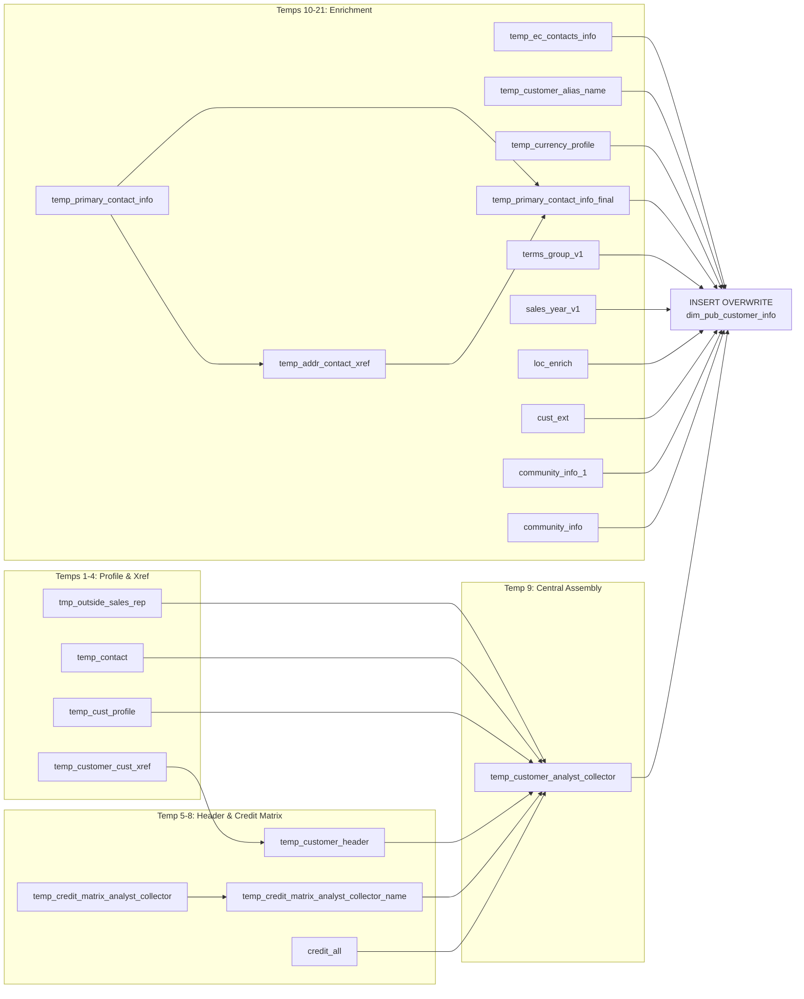

# DIM: Master Customer Information (`dim_pub_customer_info`)

- artifact_type: etl_table
- artifact_id: dim_us.dim_pub_customer_info
- domain: customer
- one_line_purpose: This is the primary customer master dimension, bringing together identity, segmentation, territory, credit hierarchy, contacts, channel affiliations, branding assets, and community memberships into a single denormalized record per customer....
- layer_type: DIM
- source_kind: etl_sql
- evidence_source: source/etl/sql/customer/source/etl/flows/public_order_tools/ingest/public_customer_dimension/script/dim_pub_customer_info.sql

---

## L1 Data Foundation

### Identity and physical mapping
- **Table:** `dim_us.dim_pub_customer_info`
- **Layer type:** DIM
- **Canonical / derived:** Derived / ETL-loaded (see L3)
- **Owner team:** not registered in metadata catalog

### Grain, scope, exclusions
- **Grain:** one row per customer (`cust_no`).
- **Scope:** See L2 business purpose / L3 filters
- **Partition:** none explicit — full overwrite each run. - resolved from pipeline (see L4)
- **Natural key:** `cust_no`.
- **Exclusions:** Not documented in repository

#### Grain detail (preserved)

- **Grain:** one row per customer (`cust_no`).
- **Partition:** none explicit — full overwrite each run.
- **Natural key:** `cust_no`.

---

### Cross-engine presence
| Engine | Present | Canonical FQN | Notes |
|--------|---------|---------------|-------|
| Hive | yes | `dim_pub_customer_info` | ETL target / intermediate per evidence script |
| Vertica | pending | `dim_pub_customer_info` | Confirm via hive2vertica flow evidence / MCP |

### Physical schema reference

Pointer block only - full column catalog lives in WKB L1 storage JSON.

| Field | Value |
|-------|-------|
| **Authoritative catalog** | WKB L1 storage seed (not duplicated in this file) |
| **entity_id** | `dim_us.dim_pub_customer_info` |
| **l1_catalog_seed** | `target/storage/wkb/snapshots/_snapshot_id_template/l1_catalog/{engine}_{schema}_{table}.json` |
| **column_count** | pending (run ddl_seed_writer) |
| **partition_keys** | `none explicit — full overwrite each run.` |
| **ddl_source** | pending Bitbucket DDL / Vertica metadata ingest |
| **retrieval** | `python -m tools.wkb.indexing.run_query --query "customer dim_pub_customer_info schema" --intent find_table_schema` |

### Lineage
| Object | Role |
|--------|------|
| `ods_${country_code}.ods_etl_customer_header_all` | Customer identity anchor |
| `ods_${country_code}.ods_etl_cust_profile_all` | Profile attributes (currency, channel, VARNEX, sales rep, price grid) |
| `ods_${country_code}.ods_cis_corp_manager` | Manager name resolution for outside sales rep |
| `dim_${country_code}.dim_pub_customer_address_contacts_info` | Bill-to address and contact |
| `ods_${country_code}.ods_etl_cust_xref_all` | Account relationship xrefs |
| `ods_${country_code}.ods_cis_corp_credit_matrix` | Credit org hierarchy |
| `dim_${country_code}.dim_pub_manager` | Manager name lookup |
| `ods_${country_code}.ods_etl_customer_credit_all` | Credit limit and pending amount |
| `ods_${country_code}.ods_cis_corp_territory` | Territory attributes |
| `ods_${country_code}.ods_cis_corp_territory_group` | Territory group to customer type link |
| `ods_${country_code}.ods_cis_corp_cust_type` | Customer type description and division |
| `ods_${country_code}.ods_cis_corp_division` | Division description |
| `ods_${country_code}.ods_cis_corp_cust_segment` | Segment description |
| `ods_${country_code}.ods_cis_corp_company_info` | Company default currency |
| `dim_${country_code}.dim_pub_ec_contact_info` | EC contact de-duplication |
| `ods_${country_code}.ods_cis_corp_company_profile` | Currency profile and CIS_SERVER |
| `ods_${country_code}.ods_etl_addr_xref_all` | Primary contact address xref |
| `ods_${country_code}.ods_etl_address_all` | Address detail for primary contact |
| `ods_${country_code}.ods_cis_corp_addr_profile` | BT/PRI_CON profile for primary contact |
| `ods_${country_code}.ods_etl_contact_xref_all` | Contact xref for primary contact |
| `ods_${country_code}.ods_etl_contacts_all` | Contact detail for primary contact |
| `ods_${country_code}.ods_cis_corp_no_ctrl` | Auto-credit exclusion control table |
| `ods_${country_code}.ods_cis_corp_terms_file` | Terms exclusion check |
| `ods_${country_code}.ods_userinfo_mymdm_territory` | Territory email |
| `ods_gbl.ods_dw_engage_mygblengage_cust_loc_enrich` | Engage logo/bio enrichment |
| `ods_gbl.ods_cis_mygbl_prm_cust_ext` | PRM logo fallback |
| `ods_${country_code}.ods_customer_mymdm_cust_profile` | MDM community profile |
| `ods_${country_code}.ods_customer_mymdm_cust_xref` | MDM community xref |

---

### Freshness and load path
| Item | Value |
|------|-------|
| Load pattern | See L3 end-to-end / INSERT pattern in evidence script |
| Schedule | Not documented in repository |
| Parameters | `${country_code}` — determines the ODS/DIM schema prefix |


---

## L2 Declarative Knowledge

### Business purpose
This is the primary customer master dimension, bringing together identity, segmentation, territory, credit hierarchy, contacts, channel affiliations, branding assets, and community memberships into a single denormalized record per customer. It serves as the central join point for virtually all customer-centric reporting and analytics across sales, credit, finance, and e-commerce domains. The table is built from twelve intermediate temporary tables before the final insert.

---

### Audience and use cases
| Audience | How they benefit |
|----------|-----------------|
| **Sales operations** | Territory, segment, division, outside sales rep, buying group, store number, channel |
| **Credit & collections** | Collector/analyst full org hierarchy (supervisor → SVP), credit limit, pending amount, release code, next review, price grid |
| **Finance** | Master customer, finance master, currency, default terms, share credit limit flag |
| **CRM / marketing** | Bill-to contact details, customer alias, community memberships, stop-mailing flag, website |
| **E-commerce** | EC contact details, logo URL, company bio/summary, VARNEX membership |
| **Reseller management** | Reseller contact name, country, email, fax, phone |
| **Data governance** | `data_source` (CIS vs HIS), `company_code`, `company_no`, `last_update_comb` for freshness tracking |

---

### Identifier search profile
- Primary lookup keys: see natural key under L1 Grain.
- Use latest snapshot / active flags when documented in L3 filters.

### Time field semantics
- **date_flag / partition columns:** none explicit — full overwrite each run.
- Primary reporting filter should use the partition column(s) documented in L1; resolve values via L4.


### Metrics served

| Category | Column | Logical metric | Business reading |
|----------|--------|----------------|------------------|
| Governed metric | `collector_id` | `collector_id` | collector_id at unspecified grain |
| Governed metric | `credit_analyst` | `credit_analyst` | credit_analyst at unspecified grain |
| Governed metric | `currency` | `currency` | currency at unspecified grain |
| Governed metric | `cust_acct_type` | `cust_acct_type` | cust_acct_type at unspecified grain |
| Governed metric | `cust_channel` | `cust_channel` | cust_channel at unspecified grain |
| Governed metric | `cust_type` | `cust_type` | cust_type at unspecified grain |
| Governed metric | `customer_communities` | `customer_communities` | customer_communities at unspecified grain |
| Governed metric | `data_source` | `data_source` | data_source at unspecified grain |
| Governed metric | `is_share_credit_limit` | `is_share_credit_limit` | is_share_credit_limit at unspecified grain |
| Governed metric | `last_update_comb` | `last_update_comb` | last_update_comb at unspecified grain |
| Governed metric | `logo_url` | `logo_url` | logo_url at unspecified grain |
| Governed metric | `mcust_no` | `mcust_no` | mcust_no at unspecified grain |
| Governed metric | `outside_sales_rep` | `outside_sales_rep` | outside_sales_rep at unspecified grain |
| P&L adjustment / measure | `pending_amt` | `pending_amt` | pending_amt at unspecified grain |
| Governed metric | `price_grid` | `price_grid` | price_grid at unspecified grain |
| Governed metric | `varnex_members` | `varnex_members` | varnex_members at unspecified grain |

### Metric serving map

**Formula authority:** [`source/contracts/customer/metric-index.md`](../../source/contracts/customer/metric-index.md)

| Logical metric | Period scope | Physical column | Formula reference |
|----------------|--------------|-----------------|-------------------|
| `collector_id` | unspecified | `collector_id` | `source/contracts/customer/metric-index.md#collector_id` |
| `credit_analyst` | unspecified | `credit_analyst` | `source/contracts/customer/metric-index.md#credit_analyst` |
| `currency` | unspecified | `currency` | `source/contracts/customer/metric-index.md#currency` |
| `cust_acct_type` | unspecified | `cust_acct_type` | `source/contracts/customer/metric-index.md#cust_acct_type` |
| `cust_channel` | unspecified | `cust_channel` | `source/contracts/customer/metric-index.md#cust_channel` |
| `cust_type` | unspecified | `cust_type` | `source/contracts/customer/metric-index.md#cust_type` |
| `customer_communities` | unspecified | `customer_communities` | `source/contracts/customer/metric-index.md#customer_communities` |
| `data_source` | unspecified | `data_source` | `source/contracts/customer/metric-index.md#data_source` |
| `is_share_credit_limit` | unspecified | `is_share_credit_limit` | `source/contracts/customer/metric-index.md#is_share_credit_limit` |
| `last_update_comb` | unspecified | `last_update_comb` | `source/contracts/customer/metric-index.md#last_update_comb` |
| `logo_url` | unspecified | `logo_url` | `source/contracts/customer/metric-index.md#logo_url` |
| `mcust_no` | unspecified | `mcust_no` | `source/contracts/customer/metric-index.md#mcust_no` |
| `outside_sales_rep` | unspecified | `outside_sales_rep` | `source/contracts/customer/metric-index.md#outside_sales_rep` |
| `pending_amt` | unspecified | `pending_amt` | Not in metric-index.md |
| `price_grid` | unspecified | `price_grid` | `source/contracts/customer/metric-index.md#price_grid` |
| `varnex_members` | unspecified | `varnex_members` | `source/contracts/customer/metric-index.md#varnex_members` |

### etl_metrics

Formulas below are sourced from [`source/contracts/customer/metric-index.md`](../../source/contracts/customer/metric-index.md) for logical metrics present on this table.
Index formulas are canonical: this enricher copies them into KB and never overwrites `final_effective_formula_sql` in the metric-index.

#### `collector_id`
- **Source:** [metric-index.md](../../source/contracts/customer/metric-index.md#collector_id)
- **Business definition:** Customer-level collector overrides territory default
```sql
NVL(ch.reviewer, t.reviewer)
```

#### `credit_analyst`
- **Source:** [metric-index.md](../../source/contracts/customer/metric-index.md#credit_analyst)
- **Business definition:** Customer-level analyst overrides territory default
```sql
NVL(ch.cred_analyst, t.cred_analyst)
```

#### `currency`
- **Source:** [metric-index.md](../../source/contracts/customer/metric-index.md#currency)
- **Business definition:** Customer profile currency; falls back to company-level currency
```sql
NVL(cp.currency, ci.currency)
```

#### `cust_acct_type`
- **Source:** [metric-index.md](../../source/contracts/customer/metric-index.md#cust_acct_type)
- **Business definition:** Human-readable account type
```sql
CASE ch.cust_acct_type WHEN 'RS' THEN 'Reseller' WHEN 'EU' THEN 'End User' END
```

#### `cust_channel`
- **Source:** [metric-index.md](../../source/contracts/customer/metric-index.md#cust_channel)
- **Business definition:** Sales channel
```sql
MAX(CASE WHEN profile_type='CHANNEL' AND profile_cat='CUST' THEN profile_c END)
```

#### `cust_type`
- **Source:** [metric-index.md](../../source/contracts/customer/metric-index.md#cust_type)
- **Business definition:** Replaces the -3 placeholder with the actual cust_type from the dimension when available.
```sql
CASE WHEN c2.cust_type IS NOT NULL AND c1.cust_type = -3 THEN c2.cust_type ELSE c1.cust_type END
```

#### `customer_communities`
- **Source:** [metric-index.md](../../source/contracts/customer/metric-index.md#customer_communities)
- **Business definition:** MDM community label or xref number
```sql
COALESCE(cii.community_value, ci.xref_no)
```

#### `data_source`
- **Source:** [metric-index.md](../../source/contracts/customer/metric-index.md#data_source)
- **Business definition:** Source system identifier
```sql
CASE data_source WHEN 'ods_cis_corp_customer_header' THEN 'CIS' WHEN 'ods_his_corp_customer_header' THEN 'HIS' ELSE '' END
```

#### `is_share_credit_limit`
- **Source:** [metric-index.md](../../source/contracts/customer/metric-index.md#is_share_credit_limit)
- **Business definition:** `'Y'` only when customer has a finance master and is not in excluded terms or territory lists
```sql
CASE WHEN tcac.finance_master IS NULL OR tg.doc_terms IS NOT NULL OR sy.doc_year IS NOT NULL THEN 'N' ELSE 'Y' END
```

#### `last_update_comb`
- **Source:** [metric-index.md](../../source/contracts/customer/metric-index.md#last_update_comb)
- **Business definition:** Latest profile change timestamp
```sql
max(greatest(cp.entry_datetime, cp.update_datetime))
```

#### `logo_url`
- **Source:** [metric-index.md](../../source/contracts/customer/metric-index.md#logo_url)
- **Business definition:** Logo from Engage first; PRM as fallback
```sql
COALESCE(loc.logo_url, prm.ext_value)
```

#### `mcust_no`
- **Source:** [metric-index.md](../../source/contracts/customer/metric-index.md#mcust_no)
- **Business definition:** Master customer number; self-references if no MASTER_SUB xref
```sql
IF(cx.xref_no IS NULL, ch.cust_no, cx.xref_no)
```

#### `outside_sales_rep`
- **Source:** [metric-index.md](../../source/contracts/customer/metric-index.md#outside_sales_rep)
- **Business definition:** Manager user ID matched by lower(name) = lower(profile_c)
```sql
max(mgr.userid)
```

#### `price_grid`
- **Source:** [metric-index.md](../../source/contracts/customer/metric-index.md#price_grid)
- **Business definition:** Pricing tier; defaults to `'SGM'` if null
```sql
MAX(CASE WHEN profile_type='MPG' THEN NVL(profile_c,'SGM') END)
```

#### `varnex_members`
- **Source:** [metric-index.md](../../source/contracts/customer/metric-index.md#varnex_members)
- **Business definition:** VARNEX membership value
```sql
MAX(CASE WHEN profile_type='VARNEX' THEN profile_c END)
```

---

### Metric serving map
N/A - not a `*_comb_mtd` / multi-period wide serving table (or map not present in legacy doc).


### Data products and column groups (preserved)

### Identifiers and relationships

- **Customer:** `cust_no`, `cust_name`, `company_no`, `company_code`
- **Master account:** `mcust_no`, `mcust_name`, `finance_master`, `finance_cust_name`
- **Buying group:** `buying_group_no`
- **Customer segment:** `cust_seg_id`, `sales_segment`
- **Territory:** `sales_terr`, `sales_terr_name`, `region`, `division`, `division_desc`

### Dimension columns (reporting-ready)

Use these for **filters, group-bys, and star-schema joins**:

- `cust_type`, `cust_type_descr`, `cust_acct_type` (Reseller / End User)
- `is_restricted`, `is_discontinued` — account status flags
- `resale_no`, `lead_id`, `store_no` — account identifiers
- `default_terms`, `currency`, `currency_profile` — financial classification
- `cust_channel`, `varnex_members` — channel and program membership
- `price_grid` — pricing tier (null when customer is discontinued)
- `release_code` — credit release status
- `stop_mailing`, `credit_app` — marketing and credit application flags
- `website_address` — customer web presence
- `customer_alias_name` — alternate name from `ALIAS_USER` xref
- `customer_communities` — community membership (VARNEX or MDM community value)
- `data_source` — `'CIS'` or `'HIS'`

### Contact columns

- `bill_to_cust_addr`, `bill_to_cust_zip`, `bill_to_cust_city`, `bill_to_cust_state`, `bill_to_cust_country` — bill-to address
- `bill_to_contact_name`, `bill_to_contact_email`, `bill_to_contact_phone`, `bill_to_contact_title` — bill-to contact
- `ec_contact_no`, `ec_contact_name`, `ec_contact_phone_no`, `ec_contact_email_address` — EC contact
- `reseller_contact`, `reseller_contact_country`, `reseller_contact_email`, `reseller_contact_fax`, `reseller_contact_phone` — primary reseller contact

### Credit & org hierarchy columns

| Column | Meaning |
|--------|---------|
| `credit_analyst`, `credit_analyst_name` | Credit analyst ID and full name |
| `credit_analyst_supervisor_id/name` | Credit analyst's immediate supervisor |
| `credit_analyst_manager_id/name` | Credit analyst's manager |
| `credit_analyst_senior_manager_id/name` | Credit analyst's senior manager |
| `credit_analyst_director_id/name` | Credit analyst's director |
| `credit_analyst_vp_id/name` | Credit analyst's VP |
| `credit_analyst_svp_id/name` | Credit analyst's SVP |
| `collector_id`, `collector_name` | Collector ID and full name |
| `collector_supervisor_id/name` | Collector's immediate supervisor |
| `collector_manager_id/name` | Collector's manager |
| `collector_senior_manager_id/name` | Collector's senior manager |
| `collector_director_id/name` | Collector's director |
| `collector_vp_id/name` | Collector's VP |
| `collector_svp_id/name` | Collector's SVP |
| `program_analyst_id`, `program_analyst` | Program analyst ID and name |
| `service_analyst_id`, `service_analyst` | Service analyst ID and name |

### Enrichment columns

- `logo_url` — `COALESCE(loc.logo_url, prm.ext_value)` — customer logo from Engage or PRM
- `company_summary` — company bio from Engage enrichment
- `terr_email` — territory email address

### Audit columns

- `etl_timestamp`, `last_update_comb` — LA-timezone load timestamp and latest source update
- `customer_entry_datetime`, `customer_update_datetime`, `customer_delete_datetime`

---

### etl_metrics

#### `outside_sales_rep`
- **Source:** [metric-index.md](../../source/contracts/customer/metric-index.md#outside_sales_rep)
- **Business definition:** Manager user ID matched by lower(name) = lower(profile_c)
```sql
max(mgr.userid)` grouped by `cust_no, profile_c
```

#### `last_update_comb`
- **Source:** [metric-index.md](../../source/contracts/customer/metric-index.md#last_update_comb)
- **Business definition:** Latest profile change timestamp
```sql
max(greatest(cp.entry_datetime, cp.update_datetime))
```

#### `cust_channel`
- **Source:** [metric-index.md](../../source/contracts/customer/metric-index.md#cust_channel)
- **Business definition:** Sales channel
```sql
MAX(CASE WHEN profile_type='CHANNEL' AND profile_cat='CUST' THEN profile_c END)
```

#### `varnex_members`
- **Source:** [metric-index.md](../../source/contracts/customer/metric-index.md#varnex_members)
- **Business definition:** VARNEX membership value
```sql
MAX(CASE WHEN profile_type='VARNEX' THEN profile_c END)
```

#### `price_grid`
- **Source:** [metric-index.md](../../source/contracts/customer/metric-index.md#price_grid)
- **Business definition:** Pricing tier; defaults to `'SGM'` if null
```sql
MAX(CASE WHEN profile_type='MPG' THEN NVL(profile_c,'SGM') END)
```

#### `m_xref_no`
- **Source:** [metric-index.md](../../source/contracts/customer/metric-index.md#m_xref_no)
- **Business definition:** Master account number
```sql
MAX(CASE WHEN xref_type='MASTER_SUB' THEN xref_no END)
```

#### `fin_xref_no`
- **Source:** [metric-index.md](../../source/contracts/customer/metric-index.md#fin_xref_no)
- **Business definition:** Finance master number
```sql
MAX(CASE WHEN xref_type='FINAN_SUB' THEN xref_no END)
```

#### `p_xref`
- **Source:** [metric-index.md](../../source/contracts/customer/metric-index.md#p_xref)
- **Business definition:** Program analyst xref
```sql
MAX(CASE WHEN xref_type='CUST_PROG' THEN xref END)
```

#### `s_xref`
- **Source:** [metric-index.md](../../source/contracts/customer/metric-index.md#s_xref)
- **Business definition:** Service analyst xref
```sql
MAX(CASE WHEN xref_type='CUST_CSREP' THEN xref END)
```

#### `buy_xref_no`
- **Source:** [metric-index.md](../../source/contracts/customer/metric-index.md#buy_xref_no)
- **Business definition:** Buying group number
```sql
MAX(CASE WHEN xref_type='BUY_SUB' THEN xref_no END)
```

#### `mcust_no`
- **Source:** [metric-index.md](../../source/contracts/customer/metric-index.md#mcust_no)
- **Business definition:** Master customer; self if no xref
```sql
IF(cx.m_xref_no IS NULL, ch.cust_no, cx.m_xref_no)
```

#### `cust_acct_type`
- **Source:** [metric-index.md](../../source/contracts/customer/metric-index.md#cust_acct_type)
- **Business definition:** Human-readable account type
```sql
CASE ch.cust_acct_type WHEN 'RS' THEN 'Reseller' WHEN 'EU' THEN 'End User' END
```

#### `data_source`
- **Source:** [metric-index.md](../../source/contracts/customer/metric-index.md#data_source)
- **Business definition:** Source system identifier
```sql
CASE data_source WHEN 'ods_cis_corp_customer_header' THEN 'CIS' WHEN 'ods_his_corp_customer_header' THEN 'HIS' ELSE '' END
```

#### `credit_analyst`
- **Source:** [metric-index.md](../../source/contracts/customer/metric-index.md#credit_analyst)
- **Business definition:** Customer-level analyst overrides territory default
```sql
NVL(ch.cred_analyst, t.cred_analyst)
```

#### `collector_id`
- **Source:** [metric-index.md](../../source/contracts/customer/metric-index.md#collector_id)
- **Business definition:** Customer-level collector overrides territory default
```sql
NVL(ch.reviewer, t.reviewer)
```

#### `currency`
- **Source:** [metric-index.md](../../source/contracts/customer/metric-index.md#currency)
- **Business definition:** Customer profile currency; falls back to company-level currency
```sql
NVL(cp.currency, ci.currency)
```

#### `is_share_credit_limit`
- **Source:** [metric-index.md](../../source/contracts/customer/metric-index.md#is_share_credit_limit)
- **Business definition:** `'Y'` only when customer has a finance master and is not in excluded terms or territory lists
```sql
CASE WHEN tcac.finance_master IS NULL OR tg.doc_terms IS NOT NULL OR sy.doc_year IS NOT NULL THEN 'N' ELSE 'Y' END
```

#### `logo_url`
- **Source:** [metric-index.md](../../source/contracts/customer/metric-index.md#logo_url)
- **Business definition:** Logo from Engage first; PRM as fallback
```sql
COALESCE(loc.logo_url, prm.ext_value)
```

#### `customer_communities`
- **Source:** [metric-index.md](../../source/contracts/customer/metric-index.md#customer_communities)
- **Business definition:** MDM community label or xref number
```sql
COALESCE(cii.community_value, ci.xref_no)
```


---

## L3 Procedural Knowledge

### Query and routing rules
**Business filters:** Use partition / date keys from L1 grain for reporting scope.
**Technical predicates (load only):** See Key filters and step-by-step logic below.

### Dimension join patterns
| Dimension FQN | Join keys | Purpose | Evidence |
|---------------|-----------|---------|----------|
| See step-by-step / base tables | See L3 steps | Dimension enrichment | `source/etl/sql/customer/source/etl/flows/public_order_tools/ingest/public_customer_dimension/script/dim_pub_customer_info.sql` |

### Key filters and ETL business logic
### Step 1 — `tmp_outside_sales_rep`

**Source:** `ods_etl_cust_profile_all` LEFT JOIN manager name subquery from `ods_cis_corp_manager`

**Filter:**
- `profile_type = 'S'`, `profile_cat = 'OTHE'`, `active = 'Y'` — outside sales rep profile

**Derived columns:**

| Column | Formula | Plain language |
|--------|---------|----------------|
| `outside_sales_rep` | `max(mgr.userid)` grouped by `cust_no, profile_c` | Manager user ID matched by lower(name) = lower(profile_c) |
| `outside_sales_rep_name` | `cp.profile_c` | Name as stored in the profile record |
| `last_update_comb` | `max(greatest(cp.entry_datetime, cp.update_datetime))` | Latest profile change timestamp |

---

### Step 2 — `temp_contact`

**Source:** `dim_${country_code}.dim_pub_customer_address_contacts_info`

**Filter:**
- `ROW_NUMBER() OVER(PARTITION BY cust_no ORDER BY addr_xref_seq, contact_xref_seq, contact_no)` — keeps rank 1

**Derived columns:** all bill-to address and contact fields aliased to `bill_to_*` prefix; `store_no` passed through.

---

### Step 3 — `temp_cust_profile`

**Source:** `ods_etl_cust_profile_all`

**Filter:**
- `profile_type IN ('CUST_CURR', 'CUST_FOCUS', 'CHANNEL', 'VARNEX', 'MPG')`, `active = 'Y'`

**Derived columns (pivot):**

| Column | Formula | Plain language |
|--------|---------|----------------|
| `profile_c` / `currency` | `MAX(CASE WHEN profile_type='CUST_CURR' AND profile_cat='CRED' THEN profile_c END)` | Customer currency code |
| `cust_channel` | `MAX(CASE WHEN profile_...

### Standard time-filter SQL
```sql
-- relative period filter using resolved partition value (see L4)
SELECT *
FROM dim_pub_customer_info
WHERE /* partition predicate */ date_flag = '${partition_value}';
```

### End-to-end flow
**Runtime parameters:** `${country_code}`
**Target table:** `dim_${country_code}.dim_pub_customer_info`, full overwrite.

1. **`tmp_outside_sales_rep`** — from `ods_etl_cust_profile_all` (OTHE/S/active) joined to manager name lookup.
2. **`temp_contact`** — from `dim_pub_customer_address_contacts_info`; picks row 1 per customer (ranked by `addr_xref_seq, contact_xref_seq, contact_no`).
3. **`temp_cust_profile`** — pivots `ods_etl_cust_profile_all` for currency, channel, VARNEX, price_grid.
4. **`temp_customer_cust_xref`** — pivots `ods_etl_cust_xref_all` for master, financial, program, service, buying-group xrefs.
5. **`temp_customer_header`** — builds customer base with master resolution, account type decode, data_source.
6. **`temp_credit_matrix_analyst_collector`** — extracts reporting hierarchy from `ods_cis_corp_credit_matrix` for roles C and A.
7. **`temp_credit_matrix_analyst_collector_name`** — enriches hierarchy with names from `dim_pub_manager` (6 joins).
8. **`credit_all`** — picks one credit record per customer (row 1 by credit_limit) from `ods_etl_customer_credit_all`.
9. **`temp_customer_analyst_collector`** — central assembly view joining temp 5 + territory + segment + division + profile + contact + xref + credit + collector/analyst hierarchy.
10. **`temp_ec_contacts_info`** — from `dim_pub_ec_contact_info`; picks row 1 per customer (ranked by `ec_entry_datetime, ec_contact_no desc`).
11. **`temp_customer_alias_name`** — max `ALIAS_USER` xref value per customer from `ods_etl_cust_xref_all`.
12. **`temp_currency_profile`** — from `ods_etl_customer_header_all` + `ods_cis_corp_company_profile` (CURRENCY/active).
13. **`temp_primary_contact_info`** — resolves bill-to address primary contact using addr/contact xref profile chain; deduplicates by seq=1.
14. **`temp_addr_contact_xref`** — fallback: finds first active contact where primary contact was null.
15. **`temp_primary_contact_info_final`** — merges 13 and 14, joins to contacts for name/email/phone/fax; picks seq=1.
16. **`terms_group_v1`** — terms codes excluded from auto-credit aggregate.
17. **`sales_year_v1`** — sales territories excluded from auto-credit aggregate.
18. **`loc_enrich`** — customer logo and bio from `ods_gbl.ods_dw_engage_mygblengage_cust_loc_enrich` (country-code filtered, latest by update_datetime).
19. **`cust_ext`** — logo URL from `ods_gbl.ods_cis_mygbl_prm_cust_ext` (LOGO/active, company-code filtered).
20. **`community_info_1`** — community value from `ods_customer_mymdm_cust_profile` (COMMUNITY or VARNEX).
21. **`community_info`** — community xref from `ods_customer_mymdm_cust_xref` (COMMUNITY/active).
22. **INSERT OVERWRITE** — assembles all temps with remaining left joins for finance name, EC contacts, alias, currency profile, reseller contact, terms exclusion, sales exclusion, territory email, logo enrichment, and community.



---


#### High-level stages (preserved)

| Stage | Business meaning |
|-------|-----------------|
| **Outside sales rep** | Resolves the outside sales rep `userid` and name from customer profiles (`OTHE/S`) joined to the manager table |
| **Bill-to contact** | Picks one representative bill-to address and contact per customer from the address/contact dimension using row-number ranking |
| **Customer profile** | Pivots customer profile records to extract currency, channel, VARNEX membership, and price grid |
| **Customer xref** | Pivots customer cross-references to extract master, financial, program, service, and buying-group relationships |
| **Customer header** | Builds the customer header base with master-customer resolution, account type decode, and data-source classification |
| **Credit matrix analyst/collector** | Extracts the credit matrix reporting hierarchy for collectors (`C`) and analysts (`A`) |
| **Credit matrix with names** | Enriches the hierarchy IDs with human-readable names from `dim_pub_manager` |
| **Credit baseline** | Picks one credit record per customer (row-number on credit_limit) for limit and terms |
| **Customer analyst/collector** | Assembles all profile, territory, segment, division, contact, and org-hierarchy fields into one pre-final view |
| **EC contact de-duplication** | Picks one EC contact per customer using entry_datetime and contact_no ordering |
| **Customer alias name** | Extracts the latest `ALIAS_USER` xref value per customer |
| **Currency profile** | Derives the company-level currency from company profile (`CURRENCY/active=Y`) |
| **Primary contact info** | Multi-step logic to resolve the billing-address primary contact (or fallback to first active contact) for reseller contact details |
| **Terms/sales exclusion lists** | Identifies terms groups and sales territories excluded from auto-credit aggregate |
| **Location enrichment** | Pulls logo URL and company bio from Engage/MyGBL enrichment (country-code filtered) |
| **Customer extension (logo)** | Pulls logo URL from MyGBL PRM customer extension table as a fallback |
| **Community info** | Resolves community membership (COMMUNITY/VARNEX) from MDM profile and xref |
| **Final INSERT** | Assembles all temp results and joins remaining dimension/lookup tables for the final output |

**Parameters:** `${country_code}` — determines the ODS/DIM schema prefix

---


### Base tables register
| Object | Role in this job |
|--------|-----------------|
| `ods_${country_code}.ods_etl_cust_profile_all` | Outside sales rep profile; also currency, channel, VARNEX, price_grid pivot |
| `ods_${country_code}.ods_cis_corp_manager` | Manager name lookup for outside sales rep resolution |
| `dim_${country_code}.dim_pub_customer_address_contacts_info` | Bill-to address and contact for `temp_contact` |
| `ods_${country_code}.ods_etl_cust_xref_all` | Master, financial, program, service, buying-group, alias xrefs |
| `ods_${country_code}.ods_etl_customer_header_all` | Customer identity, account type, credit analyst, reviewer, review dates, company_no |
| `ods_${country_code}.ods_cis_corp_credit_matrix` | Credit matrix org hierarchy (collector C and analyst A roles) |
| `dim_${country_code}.dim_pub_manager` | Manager name resolution for all 6 hierarchy levels |
| `ods_${country_code}.ods_etl_customer_credit_all` | Credit records — one row per customer via row-number |
| `ods_${country_code}.ods_cis_corp_territory` | Territory name, credit analyst, reviewer defaults, region, group_id |
| `ods_${country_code}.ods_cis_corp_territory_group` | Links territory group to customer type |
| `ods_${country_code}.ods_cis_corp_cust_type` | Customer type description and division |
| `ods_${country_code}.ods_cis_corp_division` | Division description |
| `ods_${country_code}.ods_cis_corp_cust_segment` | Customer segment ID, level1 and level2 descriptions |
| `ods_${country_code}.ods_cis_corp_company_info` | Company-level default currency |
| `dim_${country_code}.dim_pub_ec_contact_info` | EC contact de-duplication source |
| `ods_${country_code}.ods_cis_corp_company_profile` | Company profile for currency and CIS_SERVER lookup |
| `ods_${country_code}.ods_etl_addr_xref_all` | Address xref for primary contact resolution |
| `ods_${country_code}.ods_etl_address_all` | Address detail for primary contact resolution |
| `ods_${country_code}.ods_cis_corp_addr_profile` | Address profile for BT and PRI_CON flags in primary contact resolution |
| `ods_${country_code}.ods_etl_contact_xref_all` | Contact xref for primary contact resolution |
| `ods_${country_code}.ods_etl_contacts_all` | Contact detail for primary contact resolution |
| `ods_${country_code}.ods_cis_corp_no_ctrl` | Auto-credit exclusion terms groups and sales territories |
| `ods_${country_code}.ods_cis_corp_terms_file` | Terms doc_terms for auto-credit exclusion join |
| `ods_${country_code}.ods_userinfo_mymdm_territory` | Territory email address |
| `ods_gbl.ods_dw_engage_mygblengage_cust_loc_enrich` | Engage logo URL and company bio |
| `ods_gbl.ods_cis_mygbl_prm_cust_ext` | PRM customer extension — fallback logo URL |
| `ods_${country_code}.ods_customer_mymdm_cust_profile` | MDM community value |
| `ods_${country_code}.ods_customer_mymdm_cust_xref` | MDM community xref |

**Temporary tables (inside the job only):**
`tmp_outside_sales_rep` → `temp_contact` → `temp_cust_profile` → `temp_customer_cust_xref` → `temp_customer_header` → `temp_credit_matrix_analyst_collector` → `temp_credit_matrix_analyst_collector_name` → `credit_all` → `temp_customer_analyst_collector` → `temp_ec_contacts_info` → `temp_customer_alias_name` → `temp_currency_profile` → `temp_primary_contact_info` → `temp_addr_contact_xref` → `temp_primary_contact_info_final` → `terms_group_v1` → `sales_year_v1` → `loc_enrich` → `cust_ext` → `community_info_1` → `community_info` → (final `INSERT`)

---

### Step-by-step logic
### Step 1 — `tmp_outside_sales_rep`

**Source:** `ods_etl_cust_profile_all` LEFT JOIN manager name subquery from `ods_cis_corp_manager`

**Filter:**
- `profile_type = 'S'`, `profile_cat = 'OTHE'`, `active = 'Y'` — outside sales rep profile

**Derived columns:**

| Column | Formula | Plain language |
|--------|---------|----------------|
| `outside_sales_rep` | `max(mgr.userid)` grouped by `cust_no, profile_c` | Manager user ID matched by lower(name) = lower(profile_c) |
| `outside_sales_rep_name` | `cp.profile_c` | Name as stored in the profile record |
| `last_update_comb` | `max(greatest(cp.entry_datetime, cp.update_datetime))` | Latest profile change timestamp |

---

### Step 2 — `temp_contact`

**Source:** `dim_${country_code}.dim_pub_customer_address_contacts_info`

**Filter:**
- `ROW_NUMBER() OVER(PARTITION BY cust_no ORDER BY addr_xref_seq, contact_xref_seq, contact_no)` — keeps rank 1

**Derived columns:** all bill-to address and contact fields aliased to `bill_to_*` prefix; `store_no` passed through.

---

### Step 3 — `temp_cust_profile`

**Source:** `ods_etl_cust_profile_all`

**Filter:**
- `profile_type IN ('CUST_CURR', 'CUST_FOCUS', 'CHANNEL', 'VARNEX', 'MPG')`, `active = 'Y'`

**Derived columns (pivot):**

| Column | Formula | Plain language |
|--------|---------|----------------|
| `profile_c` / `currency` | `MAX(CASE WHEN profile_type='CUST_CURR' AND profile_cat='CRED' THEN profile_c END)` | Customer currency code |
| `cust_channel` | `MAX(CASE WHEN profile_type='CHANNEL' AND profile_cat='CUST' THEN profile_c END)` | Sales channel |
| `varnex_members` | `MAX(CASE WHEN profile_type='VARNEX' THEN profile_c END)` | VARNEX membership value |
| `price_grid` | `MAX(CASE WHEN profile_type='MPG' THEN NVL(profile_c,'SGM') END)` | Pricing tier; defaults to `'SGM'` if null |

---

### Step 4 — `temp_customer_cust_xref`

**Source:** `ods_etl_cust_xref_all`

**Filter:**
- `xref_type IN ('MASTER_SUB','CUST_PROG','CUST_CSREP','FINAN_SUB','BUY_SUB')`, `active = 'Y'`

**Derived columns (pivot):**

| Column | Formula | Plain language |
|--------|---------|----------------|
| `m_xref_no` | `MAX(CASE WHEN xref_type='MASTER_SUB' THEN xref_no END)` | Master account number |
| `fin_xref_no` | `MAX(CASE WHEN xref_type='FINAN_SUB' THEN xref_no END)` | Finance master number |
| `p_xref` | `MAX(CASE WHEN xref_type='CUST_PROG' THEN xref END)` | Program analyst xref |
| `s_xref` | `MAX(CASE WHEN xref_type='CUST_CSREP' THEN xref END)` | Service analyst xref |
| `buy_xref_no` | `MAX(CASE WHEN xref_type='BUY_SUB' THEN xref_no END)` | Buying group number |

---

### Step 5 — `temp_customer_header`

**Source:** `ods_etl_customer_header_all` LEFT JOIN `temp_customer_cust_xref` LEFT JOIN `ods_etl_customer_header_all` (master)

**Derived columns:**

| Column | Formula | Plain language |
|--------|---------|----------------|
| `mcust_no` | `IF(cx.m_xref_no IS NULL, ch.cust_no, cx.m_xref_no)` | Master customer; self if no xref |
| `cust_acct_type` | `CASE ch.cust_acct_type WHEN 'RS' THEN 'Reseller' WHEN 'EU' THEN 'End User' END` | Human-readable account type |
| `data_source` | `CASE data_source WHEN 'ods_cis_corp_customer_header' THEN 'CIS' WHEN 'ods_his_corp_customer_header' THEN 'HIS' ELSE '' END` | Source system identifier |

---

### Step 6 — `temp_credit_matrix_analyst_collector`

**Source:** `ods_cis_corp_credit_matrix`

**Filter:**
- `mycis_role IN ('C','A')` — collector and analyst only

**Derived columns:** resolves `supervisor_id`, `manager_id`, `senior_manager_id`, `director_id`, `vp_id`, `svp_id` using nested CASE waterfall logic (falls back up the hierarchy when a level is null or -1).

---

### Step 7 — `temp_credit_matrix_analyst_collector_name`

**Source:** `temp_credit_matrix_analyst_collector` LEFT JOIN `dim_pub_manager` (6 times for each hierarchy level + user)

**Derived columns:** `supervisor_name`, `manager_name`, `senior_manager_name`, `director_name`, `vp_name`, `svp_name`, `user_name` — all from `dim_pub_manager.name`.

---

### Step 8 — `credit_all`

**Source:** `ods_etl_customer_credit_all`

**Filter:**
- `ROW_NUMBER() OVER(PARTITION BY cust_no ORDER BY credit_limit)` — keeps rank 1 (lowest credit_limit row)

**Output:** `cust_no`, `terms`, `credit_limit`, `pending_amt`, `entry_datetime`, `update_datetime`

---

### Step 9 — `temp_customer_analyst_collector`

**Source:** `temp_customer_header` LEFT JOIN all territory, segment, division, profile, contact, xref, and credit matrix temps

Key derivations:

| Column | Formula | Plain language |
|--------|---------|----------------|
| `sales_segment` | `CONCAT(cust_seg_id, '-', seg_level1_desc, '-', seg_level2_desc)` | Human-readable segment string |
| `credit_analyst` | `NVL(ch.cred_analyst, t.cred_analyst)` | Customer-level analyst overrides territory default |
| `collector_id` | `NVL(ch.reviewer, t.reviewer)` | Customer-level collector overrides territory default |
| `price_grid` | `CASE WHEN ch.is_discontinued='N' THEN cp.price_grid END` | Only active customers get a price grid |
| `currency` | `NVL(cp.currency, ci.currency)` | Customer profile currency; falls back to company-level currency |

---

### Steps 10–21 — Enrichment temp views

Each enrichment view selects the single most-relevant record per customer using `ROW_NUMBER` or `max()`. See "Base tables register" for sources.

Key derivations:

| View | Key logic |
|------|-----------|
| `temp_ec_contacts_info` | Picks rank 1 by `ec_entry_datetime, ec_contact_no DESC` |
| `temp_customer_alias_name` | `max(xref)` for `xref_type='ALIAS_USER'`, `xref_no=-10992` |
| `temp_currency_profile` | `max(profile_c)` for company `CURRENCY/active=Y` |
| `temp_primary_contact_info` / `_final` | Multi-step: resolves BT address → PRI_CON contact → fallback to first active contact |
| `loc_enrich` | Filters to current country's CIS_SERVER from `ods_cis_corp_company_profile`; latest by `update_datetime` |
| `cust_ext` | Filters to current CIS_SERVER; latest LOGO ext by `update_datetime` |
| `community_info_1` | COMMUNITY or VARNEX profile; latest by `update_datetime` |
| `community_info` | COMMUNITY xref; latest by `update_datetime` |

---

### Step 22 — Final INSERT OVERWRITE into `dim_pub_customer_info`

**From:** `temp_customer_analyst_collector tcac`

**Left joins on insert:**

| Join | Keys | Purpose |
|------|------|---------|
| `ods_etl_customer_header_all ch` | `tcac.finance_master = ch.cust_no` | Finance master customer name |
| `temp_ec_contacts_info ec` | `tcac.cust_no = ec.cust_no` | EC contact details |
| `temp_customer_alias_name cn` | `tcac.cust_no = cn.cust_no` | Customer alias name |
| `temp_currency_profile cp` | `tcac.cust_no = cp.cust_no` | Currency profile |
| `temp_primary_contact_info_final pc` | `tcac.cust_no = pc.cust_no` | Reseller contact details |
| `terms_group_v1 tg` | `tcac.default_terms = tg.doc_terms` | Check if terms excluded from auto-credit |
| `sales_year_v1 sy` | `tcac.sales_terr = sy.doc_year` | Check if territory excluded from auto-credit |
| `ods_userinfo_mymdm_territory terr` | `tcac.sales_terr = terr.sales_terr` | Territory email |
| `loc_enrich loc` | `tcac.cust_no = loc.cust_loc_id` | Engage logo URL and bio |
| `cust_ext prm` | `tcac.cust_no = prm.cust_no` | PRM fallback logo URL |
| `community_info_1 cii` | `tcac.cust_no = cii.cust_no` | MDM community value |
| `community_info ci` | `tcac.cust_no = ci.cust_no` | MDM community xref |

**Derived columns computed at INSERT:**

| Column | Formula | Plain language |
|--------|---------|----------------|
| `is_share_credit_limit` | `CASE WHEN tcac.finance_master IS NULL OR tg.doc_terms IS NOT NULL OR sy.doc_year IS NOT NULL THEN 'N' ELSE 'Y' END` | `'Y'` only when customer has a finance master and is not in excluded terms or territory lists |
| `logo_url` | `COALESCE(loc.logo_url, prm.ext_value)` | Logo from Engage first; PRM as fallback |
| `customer_communities` | `COALESCE(cii.community_value, ci.xref_no)` | MDM community label or xref number |
| `company_code` | `CONCAT('cis_', '${country_code}')` | Country-specific CIS company code string |
| `last_update_comb` | `greatest(tcac.last_update_comb, ch.entry/update, ec.last_update_comb, cn.last_update_comb, cp.last_update_comb)` | Latest modification timestamp across all joined sources |

---

### Relationship map (embedded)

| from_fqn | to_fqn | cardinality | join_keys | provenance |
|----------|--------|-------------|-----------|------------|
| `temp_customer_header` | `temp_customer_cust_xref` | many:1 | `ch.cust_no=cx.cust_no` | etl_sql (source/etl/sql/customer/public_order_scripts/public_customer_dimension/script/dim_pub_customer_info.sql:1) |
| `temp_customer_cust_xref` | `ods_${country_code}.ods_etl_customer_header_all` | many:1 | `if(cx.m_xref_no is null, ch.cust_no, cx.m_xref_no) = mch.cust_no; --5 create temp table for credit or credit_analyst id CREATE OR REPLACE TEMPORARY VIEW temp...` | etl_sql (source/etl/sql/customer/public_order_scripts/public_customer_dimension/script/dim_pub_customer_info.sql:1) |
| `tmp_seq` | `dim_pub_manager` | many:1 | `Not documented in repository` | etl_sql (source/etl/sql/customer/public_order_scripts/public_customer_dimension/script/dim_pub_customer_info.sql:1) |
| `temp_credit_matrix_analyst_collector` | `dim_${country_code}.dim_pub_manager` | many:1 | `cmac.supervisor_id=dpm1.userid` | etl_sql (source/etl/sql/customer/public_order_scripts/public_customer_dimension/script/dim_pub_customer_info.sql:1) |
| `temp_credit_matrix_analyst_collector` | `dim_${country_code}.dim_pub_manager` | many:1 | `cmac.manager_id=dpm2.userid` | etl_sql (source/etl/sql/customer/public_order_scripts/public_customer_dimension/script/dim_pub_customer_info.sql:1) |
| `temp_credit_matrix_analyst_collector` | `dim_${country_code}.dim_pub_manager` | many:1 | `cmac.senior_manager_id=dpm3.userid` | etl_sql (source/etl/sql/customer/public_order_scripts/public_customer_dimension/script/dim_pub_customer_info.sql:1) |
| `temp_credit_matrix_analyst_collector` | `dim_${country_code}.dim_pub_manager` | many:1 | `cmac.director_id=dpm4.userid` | etl_sql (source/etl/sql/customer/public_order_scripts/public_customer_dimension/script/dim_pub_customer_info.sql:1) |
| `temp_credit_matrix_analyst_collector` | `dim_${country_code}.dim_pub_manager` | many:1 | `cmac.vp_id=dpm5.userid` | etl_sql (source/etl/sql/customer/public_order_scripts/public_customer_dimension/script/dim_pub_customer_info.sql:1) |
| `temp_credit_matrix_analyst_collector` | `dim_${country_code}.dim_pub_manager` | many:1 | `cmac.svp_id=dpm6.userid` | etl_sql (source/etl/sql/customer/public_order_scripts/public_customer_dimension/script/dim_pub_customer_info.sql:1) |
| `temp_credit_matrix_analyst_collector` | `dim_${country_code}.dim_pub_manager` | many:1 | `cmac.userid=dpm7.userid; --7 add fields that it is collector and collector's parent field Create temporary table credit_all stored as orc as` | etl_sql (source/etl/sql/customer/public_order_scripts/public_customer_dimension/script/dim_pub_customer_info.sql:1) |
| `temp_customer_header` | `ods_${country_code}.ods_cis_corp_territory` | many:1 | `ch.sales_terr = t.sales_terr` | etl_sql (source/etl/sql/customer/public_order_scripts/public_customer_dimension/script/dim_pub_customer_info.sql:1) |
| `ods_${country_code}.ods_cis_corp_territory` | `ods_${country_code}.ods_cis_corp_territory_group` | many:1 | `t.group_id = b.group_id` | etl_sql (source/etl/sql/customer/public_order_scripts/public_customer_dimension/script/dim_pub_customer_info.sql:1) |
| `ods_${country_code}.ods_cis_corp_territory_group` | `ods_${country_code}.ods_cis_corp_cust_type` | many:1 | `b.cust_type = c.cust_type` | etl_sql (source/etl/sql/customer/public_order_scripts/public_customer_dimension/script/dim_pub_customer_info.sql:1) |
| `ods_${country_code}.ods_cis_corp_cust_type` | `ods_${country_code}.ods_cis_corp_division` | many:1 | `c.division = d.division` | etl_sql (source/etl/sql/customer/public_order_scripts/public_customer_dimension/script/dim_pub_customer_info.sql:1) |
| `temp_customer_header` | `ods_${country_code}.ods_cis_corp_cust_segment` | many:1 | `ch.cust_seg_id = s.cust_seg_id` | etl_sql (source/etl/sql/customer/public_order_scripts/public_customer_dimension/script/dim_pub_customer_info.sql:1) |
| `temp_customer_header` | `tmp_outside_sales_rep` | many:1 | `ch.cust_no = tosr.cust_no` | etl_sql (source/etl/sql/customer/public_order_scripts/public_customer_dimension/script/dim_pub_customer_info.sql:1) |
| `temp_customer_header` | `temp_contact` | many:1 | `ch.cust_no = ctt.cust_no` | etl_sql (source/etl/sql/customer/public_order_scripts/public_customer_dimension/script/dim_pub_customer_info.sql:1) |
| `temp_customer_header` | `temp_cust_profile` | many:1 | `ch.cust_no = cp.cust_no` | etl_sql (source/etl/sql/customer/public_order_scripts/public_customer_dimension/script/dim_pub_customer_info.sql:1) |
| `temp_customer_header` | `temp_customer_cust_xref` | many:1 | `ch.cust_no = ccx.cust_no` | etl_sql (source/etl/sql/customer/public_order_scripts/public_customer_dimension/script/dim_pub_customer_info.sql:1) |
| `temp_customer_cust_xref` | `dim_${country_code}.dim_pub_manager` | many:1 | `ccx.s_xref = dpm.userid` | etl_sql (source/etl/sql/customer/public_order_scripts/public_customer_dimension/script/dim_pub_customer_info.sql:1) |
| `temp_customer_cust_xref` | `dim_${country_code}.dim_pub_manager` | many:1 | `ccx.p_xref = dpm1.userid` | etl_sql (source/etl/sql/customer/public_order_scripts/public_customer_dimension/script/dim_pub_customer_info.sql:1) |
| `temp_customer_header` | `dim_${country_code}.dim_pub_manager` | many:1 | `nvl(ch.reviewer,t.reviewer) = dpm2.userid --` | etl_sql (source/etl/sql/customer/public_order_scripts/public_customer_dimension/script/dim_pub_customer_info.sql:1) |
| `tmp_seq` | `ods_${country_code}.ods_etl_customer_credit_all` | many:1 | `Not documented in repository` | etl_sql (source/etl/sql/customer/public_order_scripts/public_customer_dimension/script/dim_pub_customer_info.sql:1) |
| `temp_customer_header` | `temp_credit_matrix_analyst_collector_name` | many:1 | `nvl(ch.reviewer,t.reviewer)=cm.userid and cm.mycis_role='C'` | etl_sql (source/etl/sql/customer/public_order_scripts/public_customer_dimension/script/dim_pub_customer_info.sql:1) |
| `temp_customer_header` | `temp_credit_matrix_analyst_collector_name` | many:1 | `nvl(ch.cred_analyst,t.cred_analyst)=cm1.userid and cm1.mycis_role='A'` | etl_sql (source/etl/sql/customer/public_order_scripts/public_customer_dimension/script/dim_pub_customer_info.sql:1) |
| `temp_customer_header` | `ods_${country_code}.ods_cis_corp_company_info` | many:1 | `ch.company_no=ci.company_no; --8 get ec's contact info and fix duplicate CREATE OR REPLACE TEMPORARY VIEW temp_ec_contacts_info as` | etl_sql (source/etl/sql/customer/public_order_scripts/public_customer_dimension/script/dim_pub_customer_info.sql:1) |
| `ods_${country_code}.ods_etl_customer_header_all` | `ods_${country_code}.ods_cis_corp_company_profile` | many:1 | `h.company_no = p.company_no AND p.profile_type = 'CURRENCY' AND p.active = 'Y'` | etl_sql (source/etl/sql/customer/public_order_scripts/public_customer_dimension/script/dim_pub_customer_info.sql:1) |
| `ods_${country_code}.ods_etl_addr_xref_all` | `ods_${country_code}.ods_etl_address_all` | many:1 | `( address1_.addr_no=addrxref0_.addr_no )` | etl_sql (source/etl/sql/customer/public_order_scripts/public_customer_dimension/script/dim_pub_customer_info.sql:1) |
| `ods_${country_code}.ods_etl_address_all` | `ods_${country_code}.ods_cis_corp_addr_profile` | many:1 | `( address1_.addr_no=addrprofil2_.addr_no )` | etl_sql (source/etl/sql/customer/public_order_scripts/public_customer_dimension/script/dim_pub_customer_info.sql:1) |
| `ods_${country_code}.ods_etl_address_all` | `ods_${country_code}.ods_cis_corp_addr_profile` | many:1 | `( address1_.addr_no=addrprofil4_.addr_no and addrprofil4_.profile_type='PRI_CON' and addrprofil4_.profile_cat='LOCA' and addrprofil4_.active='Y' )` | etl_sql (source/etl/sql/customer/public_order_scripts/public_customer_dimension/script/dim_pub_customer_info.sql:1) |
| `ods_${country_code}.ods_cis_corp_addr_profile` | `ods_${country_code}.ods_etl_contact_xref_all` | many:1 | `( contactxre5_.xref_no=addrprofil4_.addr_no and contactxre5_.xref_type='CONT_ADDR' and addrprofil4_.profile_i=contactxre5_.xref_seq and ( contactxre5_.delete...` | etl_sql (source/etl/sql/customer/public_order_scripts/public_customer_dimension/script/dim_pub_customer_info.sql:1) |
| `ods_${country_code}.ods_etl_contact_xref_all` | `ods_${country_code}.ods_etl_contacts_all` | many:1 | `(contactxre0_.contact_no = contacts1_.contact_no)` | etl_sql (source/etl/sql/customer/public_order_scripts/public_customer_dimension/script/dim_pub_customer_info.sql:1) |
| `ods_${country_code}.ods_etl_contact_xref_all` | `temp_primary_contact_info` | many:1 | `contactxre0_.xref_no = tc.addr_no and tc.contact_no is null` | etl_sql (source/etl/sql/customer/public_order_scripts/public_customer_dimension/script/dim_pub_customer_info.sql:1) |
| `temp_primary_contact_info` | `temp_addr_contact_xref` | many:1 | `tmp1.addr_no = tmp2.addrNo` | etl_sql (source/etl/sql/customer/public_order_scripts/public_customer_dimension/script/dim_pub_customer_info.sql:1) |
| `temp_primary_contact_info` | `ods_${country_code}.ods_etl_contacts_all` | many:1 | `contacts_.contact_no = nvl(tmp1.contact_no,tmp2.contact_no) )` | etl_sql (source/etl/sql/customer/public_order_scripts/public_customer_dimension/script/dim_pub_customer_info.sql:1) |
| `temp_customer_analyst_collector` | `ods_${country_code}.ods_etl_customer_header_all` | many:1 | `tcac.finance_master=ch.cust_no` | etl_sql (source/etl/sql/customer/public_order_scripts/public_customer_dimension/script/dim_pub_customer_info.sql:1) |
| `temp_customer_analyst_collector` | `temp_ec_contacts_info` | many:1 | `tcac.cust_no=ec.cust_no` | etl_sql (source/etl/sql/customer/public_order_scripts/public_customer_dimension/script/dim_pub_customer_info.sql:1) |
| `temp_customer_analyst_collector` | `temp_customer_alias_name` | many:1 | `tcac.cust_no=cn.cust_no` | etl_sql (source/etl/sql/customer/public_order_scripts/public_customer_dimension/script/dim_pub_customer_info.sql:1) |
| `temp_customer_analyst_collector` | `temp_currency_profile` | many:1 | `tcac.cust_no=cp.cust_no` | etl_sql (source/etl/sql/customer/public_order_scripts/public_customer_dimension/script/dim_pub_customer_info.sql:1) |
| `temp_customer_analyst_collector` | `temp_primary_contact_info_final` | many:1 | `tcac.cust_no = pc.cust_no` | etl_sql (source/etl/sql/customer/public_order_scripts/public_customer_dimension/script/dim_pub_customer_info.sql:1) |
| `temp_customer_analyst_collector` | `ods_${country_code}.ods_userinfo_mymdm_territory` | many:1 | `tcac.sales_terr = terr.sales_terr` | etl_sql (source/etl/sql/customer/public_order_scripts/public_customer_dimension/script/dim_pub_customer_info.sql:1) |

`source/ref/customer/table relationship.txt`: Not documented in repository.

### Special logic (embedded)

Not documented in repository

### Column / field derivations (from ETL SQL)

| target_column | expression_sql | upstream_columns | upstream_tables | transform_kind | evidence |
|---------------|----------------|------------------|-----------------|----------------|----------|
| `mcust_no` | `tcac.mcust_no` | `mcust_no` | `temp_customer_analyst_collector`, `ods_${country_code}.ods_etl_customer_header_all`, `temp_ec_contacts_info`, `temp_customer_alias_name`, `temp_currency_profile`, `temp_primary_contact_info_final`, `terms_group_v1`, `sales_year_v1`, `ods_${country_code}.ods_userinfo_mymdm_territory`, `loc_enrich`, `cust_ext`, `community_info_1` | passthrough | `source/etl/sql/customer/public_order_scripts/public_customer_dimension/script/dim_pub_customer_info.sql:672` |
| `mcust_name` | `tcac.mcust_name` | `mcust_name` | `temp_customer_analyst_collector`, `ods_${country_code}.ods_etl_customer_header_all`, `temp_ec_contacts_info`, `temp_customer_alias_name`, `temp_currency_profile`, `temp_primary_contact_info_final`, `terms_group_v1`, `sales_year_v1`, `ods_${country_code}.ods_userinfo_mymdm_territory`, `loc_enrich`, `cust_ext`, `community_info_1` | passthrough | `source/etl/sql/customer/public_order_scripts/public_customer_dimension/script/dim_pub_customer_info.sql:673` |
| `cust_no` | `tcac.cust_no` | `cust_no` | `temp_customer_analyst_collector`, `ods_${country_code}.ods_etl_customer_header_all`, `temp_ec_contacts_info`, `temp_customer_alias_name`, `temp_currency_profile`, `temp_primary_contact_info_final`, `terms_group_v1`, `sales_year_v1`, `ods_${country_code}.ods_userinfo_mymdm_territory`, `loc_enrich`, `cust_ext`, `community_info_1` | passthrough | `source/etl/sql/customer/public_order_scripts/public_customer_dimension/script/dim_pub_customer_info.sql:674` |
| `cust_name` | `tcac.cust_name` | `cust_name` | `temp_customer_analyst_collector`, `ods_${country_code}.ods_etl_customer_header_all`, `temp_ec_contacts_info`, `temp_customer_alias_name`, `temp_currency_profile`, `temp_primary_contact_info_final`, `terms_group_v1`, `sales_year_v1`, `ods_${country_code}.ods_userinfo_mymdm_territory`, `loc_enrich`, `cust_ext`, `community_info_1` | passthrough | `source/etl/sql/customer/public_order_scripts/public_customer_dimension/script/dim_pub_customer_info.sql:675` |
| `cust_type` | `tcac.cust_type` | `cust_type` | `temp_customer_analyst_collector`, `ods_${country_code}.ods_etl_customer_header_all`, `temp_ec_contacts_info`, `temp_customer_alias_name`, `temp_currency_profile`, `temp_primary_contact_info_final`, `terms_group_v1`, `sales_year_v1`, `ods_${country_code}.ods_userinfo_mymdm_territory`, `loc_enrich`, `cust_ext`, `community_info_1` | passthrough | `source/etl/sql/customer/public_order_scripts/public_customer_dimension/script/dim_pub_customer_info.sql:676` |
| `cust_type_descr` | `tcac.cust_type_descr` | `cust_type_descr` | `temp_customer_analyst_collector`, `ods_${country_code}.ods_etl_customer_header_all`, `temp_ec_contacts_info`, `temp_customer_alias_name`, `temp_currency_profile`, `temp_primary_contact_info_final`, `terms_group_v1`, `sales_year_v1`, `ods_${country_code}.ods_userinfo_mymdm_territory`, `loc_enrich`, `cust_ext`, `community_info_1` | passthrough | `source/etl/sql/customer/public_order_scripts/public_customer_dimension/script/dim_pub_customer_info.sql:677` |
| `cust_acct_type` | `tcac.cust_acct_type` | `cust_acct_type` | `temp_customer_analyst_collector`, `ods_${country_code}.ods_etl_customer_header_all`, `temp_ec_contacts_info`, `temp_customer_alias_name`, `temp_currency_profile`, `temp_primary_contact_info_final`, `terms_group_v1`, `sales_year_v1`, `ods_${country_code}.ods_userinfo_mymdm_territory`, `loc_enrich`, `cust_ext`, `community_info_1` | passthrough | `source/etl/sql/customer/public_order_scripts/public_customer_dimension/script/dim_pub_customer_info.sql:678` |
| `is_restricted` | `tcac.is_restricted` | `is_restricted` | `temp_customer_analyst_collector`, `ods_${country_code}.ods_etl_customer_header_all`, `temp_ec_contacts_info`, `temp_customer_alias_name`, `temp_currency_profile`, `temp_primary_contact_info_final`, `terms_group_v1`, `sales_year_v1`, `ods_${country_code}.ods_userinfo_mymdm_territory`, `loc_enrich`, `cust_ext`, `community_info_1` | passthrough | `source/etl/sql/customer/public_order_scripts/public_customer_dimension/script/dim_pub_customer_info.sql:679` |
| `is_discontinued` | `tcac.is_discontinued` | `is_discontinued` | `temp_customer_analyst_collector`, `ods_${country_code}.ods_etl_customer_header_all`, `temp_ec_contacts_info`, `temp_customer_alias_name`, `temp_currency_profile`, `temp_primary_contact_info_final`, `terms_group_v1`, `sales_year_v1`, `ods_${country_code}.ods_userinfo_mymdm_territory`, `loc_enrich`, `cust_ext`, `community_info_1` | passthrough | `source/etl/sql/customer/public_order_scripts/public_customer_dimension/script/dim_pub_customer_info.sql:680` |
| `sales_terr` | `tcac.sales_terr` | `sales_terr` | `temp_customer_analyst_collector`, `ods_${country_code}.ods_etl_customer_header_all`, `temp_ec_contacts_info`, `temp_customer_alias_name`, `temp_currency_profile`, `temp_primary_contact_info_final`, `terms_group_v1`, `sales_year_v1`, `ods_${country_code}.ods_userinfo_mymdm_territory`, `loc_enrich`, `cust_ext`, `community_info_1` | passthrough | `source/etl/sql/customer/public_order_scripts/public_customer_dimension/script/dim_pub_customer_info.sql:681` |
| `sales_terr_name` | `tcac.sales_terr_name` | `sales_terr_name` | `temp_customer_analyst_collector`, `ods_${country_code}.ods_etl_customer_header_all`, `temp_ec_contacts_info`, `temp_customer_alias_name`, `temp_currency_profile`, `temp_primary_contact_info_final`, `terms_group_v1`, `sales_year_v1`, `ods_${country_code}.ods_userinfo_mymdm_territory`, `loc_enrich`, `cust_ext`, `community_info_1` | passthrough | `source/etl/sql/customer/public_order_scripts/public_customer_dimension/script/dim_pub_customer_info.sql:682` |
| `sales_segment` | `tcac.sales_segment` | `sales_segment` | `temp_customer_analyst_collector`, `ods_${country_code}.ods_etl_customer_header_all`, `temp_ec_contacts_info`, `temp_customer_alias_name`, `temp_currency_profile`, `temp_primary_contact_info_final`, `terms_group_v1`, `sales_year_v1`, `ods_${country_code}.ods_userinfo_mymdm_territory`, `loc_enrich`, `cust_ext`, `community_info_1` | passthrough | `source/etl/sql/customer/public_order_scripts/public_customer_dimension/script/dim_pub_customer_info.sql:683` |
| `division_desc` | `tcac.division_desc` | `division_desc` | `temp_customer_analyst_collector`, `ods_${country_code}.ods_etl_customer_header_all`, `temp_ec_contacts_info`, `temp_customer_alias_name`, `temp_currency_profile`, `temp_primary_contact_info_final`, `terms_group_v1`, `sales_year_v1`, `ods_${country_code}.ods_userinfo_mymdm_territory`, `loc_enrich`, `cust_ext`, `community_info_1` | passthrough | `source/etl/sql/customer/public_order_scripts/public_customer_dimension/script/dim_pub_customer_info.sql:684` |
| `lead_id` | `tcac.lead_id` | `lead_id` | `temp_customer_analyst_collector`, `ods_${country_code}.ods_etl_customer_header_all`, `temp_ec_contacts_info`, `temp_customer_alias_name`, `temp_currency_profile`, `temp_primary_contact_info_final`, `terms_group_v1`, `sales_year_v1`, `ods_${country_code}.ods_userinfo_mymdm_territory`, `loc_enrich`, `cust_ext`, `community_info_1` | passthrough | `source/etl/sql/customer/public_order_scripts/public_customer_dimension/script/dim_pub_customer_info.sql:685` |
| `profile_c` | `tcac.profile_c` | `profile_c` | `temp_customer_analyst_collector`, `ods_${country_code}.ods_etl_customer_header_all`, `temp_ec_contacts_info`, `temp_customer_alias_name`, `temp_currency_profile`, `temp_primary_contact_info_final`, `terms_group_v1`, `sales_year_v1`, `ods_${country_code}.ods_userinfo_mymdm_territory`, `loc_enrich`, `cust_ext`, `community_info_1` | passthrough | `source/etl/sql/customer/public_order_scripts/public_customer_dimension/script/dim_pub_customer_info.sql:686` |
| `outside_sales_rep` | `tcac.outside_sales_rep` | `outside_sales_rep` | `temp_customer_analyst_collector`, `ods_${country_code}.ods_etl_customer_header_all`, `temp_ec_contacts_info`, `temp_customer_alias_name`, `temp_currency_profile`, `temp_primary_contact_info_final`, `terms_group_v1`, `sales_year_v1`, `ods_${country_code}.ods_userinfo_mymdm_territory`, `loc_enrich`, `cust_ext`, `community_info_1` | passthrough | `source/etl/sql/customer/public_order_scripts/public_customer_dimension/script/dim_pub_customer_info.sql:687` |
| `outside_sales_rep_name` | `tcac.outside_sales_rep_name` | `outside_sales_rep_name` | `temp_customer_analyst_collector`, `ods_${country_code}.ods_etl_customer_header_all`, `temp_ec_contacts_info`, `temp_customer_alias_name`, `temp_currency_profile`, `temp_primary_contact_info_final`, `terms_group_v1`, `sales_year_v1`, `ods_${country_code}.ods_userinfo_mymdm_territory`, `loc_enrich`, `cust_ext`, `community_info_1` | passthrough | `source/etl/sql/customer/public_order_scripts/public_customer_dimension/script/dim_pub_customer_info.sql:688` |
| `bill_to_cust_addr` | `tcac.bill_to_cust_addr` | `bill_to_cust_addr` | `temp_customer_analyst_collector`, `ods_${country_code}.ods_etl_customer_header_all`, `temp_ec_contacts_info`, `temp_customer_alias_name`, `temp_currency_profile`, `temp_primary_contact_info_final`, `terms_group_v1`, `sales_year_v1`, `ods_${country_code}.ods_userinfo_mymdm_territory`, `loc_enrich`, `cust_ext`, `community_info_1` | passthrough | `source/etl/sql/customer/public_order_scripts/public_customer_dimension/script/dim_pub_customer_info.sql:689` |
| `bill_to_cust_zip` | `tcac.bill_to_cust_zip` | `bill_to_cust_zip` | `temp_customer_analyst_collector`, `ods_${country_code}.ods_etl_customer_header_all`, `temp_ec_contacts_info`, `temp_customer_alias_name`, `temp_currency_profile`, `temp_primary_contact_info_final`, `terms_group_v1`, `sales_year_v1`, `ods_${country_code}.ods_userinfo_mymdm_territory`, `loc_enrich`, `cust_ext`, `community_info_1` | passthrough | `source/etl/sql/customer/public_order_scripts/public_customer_dimension/script/dim_pub_customer_info.sql:690` |
| `bill_to_cust_city` | `tcac.bill_to_cust_city` | `bill_to_cust_city` | `temp_customer_analyst_collector`, `ods_${country_code}.ods_etl_customer_header_all`, `temp_ec_contacts_info`, `temp_customer_alias_name`, `temp_currency_profile`, `temp_primary_contact_info_final`, `terms_group_v1`, `sales_year_v1`, `ods_${country_code}.ods_userinfo_mymdm_territory`, `loc_enrich`, `cust_ext`, `community_info_1` | passthrough | `source/etl/sql/customer/public_order_scripts/public_customer_dimension/script/dim_pub_customer_info.sql:691` |
| `bill_to_cust_state` | `tcac.bill_to_cust_state` | `bill_to_cust_state` | `temp_customer_analyst_collector`, `ods_${country_code}.ods_etl_customer_header_all`, `temp_ec_contacts_info`, `temp_customer_alias_name`, `temp_currency_profile`, `temp_primary_contact_info_final`, `terms_group_v1`, `sales_year_v1`, `ods_${country_code}.ods_userinfo_mymdm_territory`, `loc_enrich`, `cust_ext`, `community_info_1` | passthrough | `source/etl/sql/customer/public_order_scripts/public_customer_dimension/script/dim_pub_customer_info.sql:692` |
| `bill_to_cust_country` | `tcac.bill_to_cust_country` | `bill_to_cust_country` | `temp_customer_analyst_collector`, `ods_${country_code}.ods_etl_customer_header_all`, `temp_ec_contacts_info`, `temp_customer_alias_name`, `temp_currency_profile`, `temp_primary_contact_info_final`, `terms_group_v1`, `sales_year_v1`, `ods_${country_code}.ods_userinfo_mymdm_territory`, `loc_enrich`, `cust_ext`, `community_info_1` | passthrough | `source/etl/sql/customer/public_order_scripts/public_customer_dimension/script/dim_pub_customer_info.sql:693` |
| `bill_to_contact_name` | `tcac.bill_to_contact_name` | `bill_to_contact_name` | `temp_customer_analyst_collector`, `ods_${country_code}.ods_etl_customer_header_all`, `temp_ec_contacts_info`, `temp_customer_alias_name`, `temp_currency_profile`, `temp_primary_contact_info_final`, `terms_group_v1`, `sales_year_v1`, `ods_${country_code}.ods_userinfo_mymdm_territory`, `loc_enrich`, `cust_ext`, `community_info_1` | passthrough | `source/etl/sql/customer/public_order_scripts/public_customer_dimension/script/dim_pub_customer_info.sql:694` |
| `bill_to_contact_email` | `tcac.bill_to_contact_email` | `bill_to_contact_email` | `temp_customer_analyst_collector`, `ods_${country_code}.ods_etl_customer_header_all`, `temp_ec_contacts_info`, `temp_customer_alias_name`, `temp_currency_profile`, `temp_primary_contact_info_final`, `terms_group_v1`, `sales_year_v1`, `ods_${country_code}.ods_userinfo_mymdm_territory`, `loc_enrich`, `cust_ext`, `community_info_1` | passthrough | `source/etl/sql/customer/public_order_scripts/public_customer_dimension/script/dim_pub_customer_info.sql:695` |
| `bill_to_contact_phone` | `tcac.bill_to_contact_phone` | `bill_to_contact_phone` | `temp_customer_analyst_collector`, `ods_${country_code}.ods_etl_customer_header_all`, `temp_ec_contacts_info`, `temp_customer_alias_name`, `temp_currency_profile`, `temp_primary_contact_info_final`, `terms_group_v1`, `sales_year_v1`, `ods_${country_code}.ods_userinfo_mymdm_territory`, `loc_enrich`, `cust_ext`, `community_info_1` | passthrough | `source/etl/sql/customer/public_order_scripts/public_customer_dimension/script/dim_pub_customer_info.sql:696` |
| `bill_to_contact_title` | `tcac.bill_to_contact_title` | `bill_to_contact_title` | `temp_customer_analyst_collector`, `ods_${country_code}.ods_etl_customer_header_all`, `temp_ec_contacts_info`, `temp_customer_alias_name`, `temp_currency_profile`, `temp_primary_contact_info_final`, `terms_group_v1`, `sales_year_v1`, `ods_${country_code}.ods_userinfo_mymdm_territory`, `loc_enrich`, `cust_ext`, `community_info_1` | passthrough | `source/etl/sql/customer/public_order_scripts/public_customer_dimension/script/dim_pub_customer_info.sql:697` |
| `resale_no` | `tcac.resale_no` | `resale_no` | `temp_customer_analyst_collector`, `ods_${country_code}.ods_etl_customer_header_all`, `temp_ec_contacts_info`, `temp_customer_alias_name`, `temp_currency_profile`, `temp_primary_contact_info_final`, `terms_group_v1`, `sales_year_v1`, `ods_${country_code}.ods_userinfo_mymdm_territory`, `loc_enrich`, `cust_ext`, `community_info_1` | passthrough | `source/etl/sql/customer/public_order_scripts/public_customer_dimension/script/dim_pub_customer_info.sql:698` |
| `store_no` | `tcac.store_no` | `store_no` | `temp_customer_analyst_collector`, `ods_${country_code}.ods_etl_customer_header_all`, `temp_ec_contacts_info`, `temp_customer_alias_name`, `temp_currency_profile`, `temp_primary_contact_info_final`, `terms_group_v1`, `sales_year_v1`, `ods_${country_code}.ods_userinfo_mymdm_territory`, `loc_enrich`, `cust_ext`, `community_info_1` | passthrough | `source/etl/sql/customer/public_order_scripts/public_customer_dimension/script/dim_pub_customer_info.sql:699` |
| `default_terms` | `tcac.default_terms` | `default_terms` | `temp_customer_analyst_collector`, `ods_${country_code}.ods_etl_customer_header_all`, `temp_ec_contacts_info`, `temp_customer_alias_name`, `temp_currency_profile`, `temp_primary_contact_info_final`, `terms_group_v1`, `sales_year_v1`, `ods_${country_code}.ods_userinfo_mymdm_territory`, `loc_enrich`, `cust_ext`, `community_info_1` | passthrough | `source/etl/sql/customer/public_order_scripts/public_customer_dimension/script/dim_pub_customer_info.sql:700` |
| `currency` | `tcac.currency` | `currency` | `temp_customer_analyst_collector`, `ods_${country_code}.ods_etl_customer_header_all`, `temp_ec_contacts_info`, `temp_customer_alias_name`, `temp_currency_profile`, `temp_primary_contact_info_final`, `terms_group_v1`, `sales_year_v1`, `ods_${country_code}.ods_userinfo_mymdm_territory`, `loc_enrich`, `cust_ext`, `community_info_1` | passthrough | `source/etl/sql/customer/public_order_scripts/public_customer_dimension/script/dim_pub_customer_info.sql:701` |
| `etl_timestamp` | `tcac.etl_timestamp` | `etl_timestamp` | `temp_customer_analyst_collector`, `ods_${country_code}.ods_etl_customer_header_all`, `temp_ec_contacts_info`, `temp_customer_alias_name`, `temp_currency_profile`, `temp_primary_contact_info_final`, `terms_group_v1`, `sales_year_v1`, `ods_${country_code}.ods_userinfo_mymdm_territory`, `loc_enrich`, `cust_ext`, `community_info_1` | passthrough | `source/etl/sql/customer/public_order_scripts/public_customer_dimension/script/dim_pub_customer_info.sql:702` |
| `finance_master` | `tcac.finance_master` | `finance_master` | `temp_customer_analyst_collector`, `ods_${country_code}.ods_etl_customer_header_all`, `temp_ec_contacts_info`, `temp_customer_alias_name`, `temp_currency_profile`, `temp_primary_contact_info_final`, `terms_group_v1`, `sales_year_v1`, `ods_${country_code}.ods_userinfo_mymdm_territory`, `loc_enrich`, `cust_ext`, `community_info_1` | passthrough | `source/etl/sql/customer/public_order_scripts/public_customer_dimension/script/dim_pub_customer_info.sql:703` |
| `division` | `tcac.division` | `division` | `temp_customer_analyst_collector`, `ods_${country_code}.ods_etl_customer_header_all`, `temp_ec_contacts_info`, `temp_customer_alias_name`, `temp_currency_profile`, `temp_primary_contact_info_final`, `terms_group_v1`, `sales_year_v1`, `ods_${country_code}.ods_userinfo_mymdm_territory`, `loc_enrich`, `cust_ext`, `community_info_1` | passthrough | `source/etl/sql/customer/public_order_scripts/public_customer_dimension/script/dim_pub_customer_info.sql:684` |
| `region` | `tcac.region` | `region` | `temp_customer_analyst_collector`, `ods_${country_code}.ods_etl_customer_header_all`, `temp_ec_contacts_info`, `temp_customer_alias_name`, `temp_currency_profile`, `temp_primary_contact_info_final`, `terms_group_v1`, `sales_year_v1`, `ods_${country_code}.ods_userinfo_mymdm_territory`, `loc_enrich`, `cust_ext`, `community_info_1` | passthrough | `source/etl/sql/customer/public_order_scripts/public_customer_dimension/script/dim_pub_customer_info.sql:705` |
| `credit_analyst` | `tcac.credit_analyst` | `credit_analyst` | `temp_customer_analyst_collector`, `ods_${country_code}.ods_etl_customer_header_all`, `temp_ec_contacts_info`, `temp_customer_alias_name`, `temp_currency_profile`, `temp_primary_contact_info_final`, `terms_group_v1`, `sales_year_v1`, `ods_${country_code}.ods_userinfo_mymdm_territory`, `loc_enrich`, `cust_ext`, `community_info_1` | passthrough | `source/etl/sql/customer/public_order_scripts/public_customer_dimension/script/dim_pub_customer_info.sql:706` |
| `program_analyst` | `tcac.program_analyst` | `program_analyst` | `temp_customer_analyst_collector`, `ods_${country_code}.ods_etl_customer_header_all`, `temp_ec_contacts_info`, `temp_customer_alias_name`, `temp_currency_profile`, `temp_primary_contact_info_final`, `terms_group_v1`, `sales_year_v1`, `ods_${country_code}.ods_userinfo_mymdm_territory`, `loc_enrich`, `cust_ext`, `community_info_1` | passthrough | `source/etl/sql/customer/public_order_scripts/public_customer_dimension/script/dim_pub_customer_info.sql:707` |
| `service_analyst` | `tcac.service_analyst` | `service_analyst` | `temp_customer_analyst_collector`, `ods_${country_code}.ods_etl_customer_header_all`, `temp_ec_contacts_info`, `temp_customer_alias_name`, `temp_currency_profile`, `temp_primary_contact_info_final`, `terms_group_v1`, `sales_year_v1`, `ods_${country_code}.ods_userinfo_mymdm_territory`, `loc_enrich`, `cust_ext`, `community_info_1` | passthrough | `source/etl/sql/customer/public_order_scripts/public_customer_dimension/script/dim_pub_customer_info.sql:708` |
| `collector_id` | `tcac.collector_id` | `collector_id` | `temp_customer_analyst_collector`, `ods_${country_code}.ods_etl_customer_header_all`, `temp_ec_contacts_info`, `temp_customer_alias_name`, `temp_currency_profile`, `temp_primary_contact_info_final`, `terms_group_v1`, `sales_year_v1`, `ods_${country_code}.ods_userinfo_mymdm_territory`, `loc_enrich`, `cust_ext`, `community_info_1` | passthrough | `source/etl/sql/customer/public_order_scripts/public_customer_dimension/script/dim_pub_customer_info.sql:709` |
| `collector_name` | `tcac.collector_name` | `collector_name` | `temp_customer_analyst_collector`, `ods_${country_code}.ods_etl_customer_header_all`, `temp_ec_contacts_info`, `temp_customer_alias_name`, `temp_currency_profile`, `temp_primary_contact_info_final`, `terms_group_v1`, `sales_year_v1`, `ods_${country_code}.ods_userinfo_mymdm_territory`, `loc_enrich`, `cust_ext`, `community_info_1` | passthrough | `source/etl/sql/customer/public_order_scripts/public_customer_dimension/script/dim_pub_customer_info.sql:710` |
| `release_code` | `tcac.release_code` | `release_code` | `temp_customer_analyst_collector`, `ods_${country_code}.ods_etl_customer_header_all`, `temp_ec_contacts_info`, `temp_customer_alias_name`, `temp_currency_profile`, `temp_primary_contact_info_final`, `terms_group_v1`, `sales_year_v1`, `ods_${country_code}.ods_userinfo_mymdm_territory`, `loc_enrich`, `cust_ext`, `community_info_1` | passthrough | `source/etl/sql/customer/public_order_scripts/public_customer_dimension/script/dim_pub_customer_info.sql:711` |
| `credit_limit` | `tcac.credit_limit` | `credit_limit` | `temp_customer_analyst_collector`, `ods_${country_code}.ods_etl_customer_header_all`, `temp_ec_contacts_info`, `temp_customer_alias_name`, `temp_currency_profile`, `temp_primary_contact_info_final`, `terms_group_v1`, `sales_year_v1`, `ods_${country_code}.ods_userinfo_mymdm_territory`, `loc_enrich`, `cust_ext`, `community_info_1` | passthrough | `source/etl/sql/customer/public_order_scripts/public_customer_dimension/script/dim_pub_customer_info.sql:712` |
| `reviewer` | `tcac.reviewer` | `reviewer` | `temp_customer_analyst_collector`, `ods_${country_code}.ods_etl_customer_header_all`, `temp_ec_contacts_info`, `temp_customer_alias_name`, `temp_currency_profile`, `temp_primary_contact_info_final`, `terms_group_v1`, `sales_year_v1`, `ods_${country_code}.ods_userinfo_mymdm_territory`, `loc_enrich`, `cust_ext`, `community_info_1` | passthrough | `source/etl/sql/customer/public_order_scripts/public_customer_dimension/script/dim_pub_customer_info.sql:713` |
| `next_review` | `tcac.next_review` | `next_review` | `temp_customer_analyst_collector`, `ods_${country_code}.ods_etl_customer_header_all`, `temp_ec_contacts_info`, `temp_customer_alias_name`, `temp_currency_profile`, `temp_primary_contact_info_final`, `terms_group_v1`, `sales_year_v1`, `ods_${country_code}.ods_userinfo_mymdm_territory`, `loc_enrich`, `cust_ext`, `community_info_1` | passthrough | `source/etl/sql/customer/public_order_scripts/public_customer_dimension/script/dim_pub_customer_info.sql:714` |
| `pending_amt` | `tcac.pending_amt` | `pending_amt` | `temp_customer_analyst_collector`, `ods_${country_code}.ods_etl_customer_header_all`, `temp_ec_contacts_info`, `temp_customer_alias_name`, `temp_currency_profile`, `temp_primary_contact_info_final`, `terms_group_v1`, `sales_year_v1`, `ods_${country_code}.ods_userinfo_mymdm_territory`, `loc_enrich`, `cust_ext`, `community_info_1` | passthrough | `source/etl/sql/customer/public_order_scripts/public_customer_dimension/script/dim_pub_customer_info.sql:715` |
| `cust_channel` | `tcac.cust_channel` | `cust_channel` | `temp_customer_analyst_collector`, `ods_${country_code}.ods_etl_customer_header_all`, `temp_ec_contacts_info`, `temp_customer_alias_name`, `temp_currency_profile`, `temp_primary_contact_info_final`, `terms_group_v1`, `sales_year_v1`, `ods_${country_code}.ods_userinfo_mymdm_territory`, `loc_enrich`, `cust_ext`, `community_info_1` | passthrough | `source/etl/sql/customer/public_order_scripts/public_customer_dimension/script/dim_pub_customer_info.sql:716` |
| `varnex_members` | `tcac.varnex_members` | `varnex_members` | `temp_customer_analyst_collector`, `ods_${country_code}.ods_etl_customer_header_all`, `temp_ec_contacts_info`, `temp_customer_alias_name`, `temp_currency_profile`, `temp_primary_contact_info_final`, `terms_group_v1`, `sales_year_v1`, `ods_${country_code}.ods_userinfo_mymdm_territory`, `loc_enrich`, `cust_ext`, `community_info_1` | passthrough | `source/etl/sql/customer/public_order_scripts/public_customer_dimension/script/dim_pub_customer_info.sql:717` |
| `customer_entry_datetime` | `tcac.customer_entry_datetime` | `customer_entry_datetime` | `temp_customer_analyst_collector`, `ods_${country_code}.ods_etl_customer_header_all`, `temp_ec_contacts_info`, `temp_customer_alias_name`, `temp_currency_profile`, `temp_primary_contact_info_final`, `terms_group_v1`, `sales_year_v1`, `ods_${country_code}.ods_userinfo_mymdm_territory`, `loc_enrich`, `cust_ext`, `community_info_1` | passthrough | `source/etl/sql/customer/public_order_scripts/public_customer_dimension/script/dim_pub_customer_info.sql:718` |
| `program_analyst_id` | `tcac.program_analyst_id` | `program_analyst_id` | `temp_customer_analyst_collector`, `ods_${country_code}.ods_etl_customer_header_all`, `temp_ec_contacts_info`, `temp_customer_alias_name`, `temp_currency_profile`, `temp_primary_contact_info_final`, `terms_group_v1`, `sales_year_v1`, `ods_${country_code}.ods_userinfo_mymdm_territory`, `loc_enrich`, `cust_ext`, `community_info_1` | passthrough | `source/etl/sql/customer/public_order_scripts/public_customer_dimension/script/dim_pub_customer_info.sql:719` |
| `service_analyst_id` | `tcac.service_analyst_id` | `service_analyst_id` | `temp_customer_analyst_collector`, `ods_${country_code}.ods_etl_customer_header_all`, `temp_ec_contacts_info`, `temp_customer_alias_name`, `temp_currency_profile`, `temp_primary_contact_info_final`, `terms_group_v1`, `sales_year_v1`, `ods_${country_code}.ods_userinfo_mymdm_territory`, `loc_enrich`, `cust_ext`, `community_info_1` | passthrough | `source/etl/sql/customer/public_order_scripts/public_customer_dimension/script/dim_pub_customer_info.sql:720` |
| `collector_manager_id` | `tcac.collector_manager_id` | `collector_manager_id` | `temp_customer_analyst_collector`, `ods_${country_code}.ods_etl_customer_header_all`, `temp_ec_contacts_info`, `temp_customer_alias_name`, `temp_currency_profile`, `temp_primary_contact_info_final`, `terms_group_v1`, `sales_year_v1`, `ods_${country_code}.ods_userinfo_mymdm_territory`, `loc_enrich`, `cust_ext`, `community_info_1` | passthrough | `source/etl/sql/customer/public_order_scripts/public_customer_dimension/script/dim_pub_customer_info.sql:721` |
| `collector_manager_name` | `tcac.collector_manager_name` | `collector_manager_name` | `temp_customer_analyst_collector`, `ods_${country_code}.ods_etl_customer_header_all`, `temp_ec_contacts_info`, `temp_customer_alias_name`, `temp_currency_profile`, `temp_primary_contact_info_final`, `terms_group_v1`, `sales_year_v1`, `ods_${country_code}.ods_userinfo_mymdm_territory`, `loc_enrich`, `cust_ext`, `community_info_1` | passthrough | `source/etl/sql/customer/public_order_scripts/public_customer_dimension/script/dim_pub_customer_info.sql:722` |
| `collector_director_id` | `tcac.collector_director_id` | `collector_director_id` | `temp_customer_analyst_collector`, `ods_${country_code}.ods_etl_customer_header_all`, `temp_ec_contacts_info`, `temp_customer_alias_name`, `temp_currency_profile`, `temp_primary_contact_info_final`, `terms_group_v1`, `sales_year_v1`, `ods_${country_code}.ods_userinfo_mymdm_territory`, `loc_enrich`, `cust_ext`, `community_info_1` | passthrough | `source/etl/sql/customer/public_order_scripts/public_customer_dimension/script/dim_pub_customer_info.sql:723` |
| `collector_director_name` | `tcac.collector_director_name` | `collector_director_name` | `temp_customer_analyst_collector`, `ods_${country_code}.ods_etl_customer_header_all`, `temp_ec_contacts_info`, `temp_customer_alias_name`, `temp_currency_profile`, `temp_primary_contact_info_final`, `terms_group_v1`, `sales_year_v1`, `ods_${country_code}.ods_userinfo_mymdm_territory`, `loc_enrich`, `cust_ext`, `community_info_1` | passthrough | `source/etl/sql/customer/public_order_scripts/public_customer_dimension/script/dim_pub_customer_info.sql:724` |
| `collector_vp_id` | `tcac.collector_vp_id` | `collector_vp_id` | `temp_customer_analyst_collector`, `ods_${country_code}.ods_etl_customer_header_all`, `temp_ec_contacts_info`, `temp_customer_alias_name`, `temp_currency_profile`, `temp_primary_contact_info_final`, `terms_group_v1`, `sales_year_v1`, `ods_${country_code}.ods_userinfo_mymdm_territory`, `loc_enrich`, `cust_ext`, `community_info_1` | passthrough | `source/etl/sql/customer/public_order_scripts/public_customer_dimension/script/dim_pub_customer_info.sql:725` |
| `collector_vp_name` | `tcac.collector_vp_name` | `collector_vp_name` | `temp_customer_analyst_collector`, `ods_${country_code}.ods_etl_customer_header_all`, `temp_ec_contacts_info`, `temp_customer_alias_name`, `temp_currency_profile`, `temp_primary_contact_info_final`, `terms_group_v1`, `sales_year_v1`, `ods_${country_code}.ods_userinfo_mymdm_territory`, `loc_enrich`, `cust_ext`, `community_info_1` | passthrough | `source/etl/sql/customer/public_order_scripts/public_customer_dimension/script/dim_pub_customer_info.sql:726` |
| `credit_analyst_name` | `tcac.credit_analyst_name` | `credit_analyst_name` | `temp_customer_analyst_collector`, `ods_${country_code}.ods_etl_customer_header_all`, `temp_ec_contacts_info`, `temp_customer_alias_name`, `temp_currency_profile`, `temp_primary_contact_info_final`, `terms_group_v1`, `sales_year_v1`, `ods_${country_code}.ods_userinfo_mymdm_territory`, `loc_enrich`, `cust_ext`, `community_info_1` | passthrough | `source/etl/sql/customer/public_order_scripts/public_customer_dimension/script/dim_pub_customer_info.sql:727` |
| `credit_analyst_manager_id` | `tcac.credit_analyst_manager_id` | `credit_analyst_manager_id` | `temp_customer_analyst_collector`, `ods_${country_code}.ods_etl_customer_header_all`, `temp_ec_contacts_info`, `temp_customer_alias_name`, `temp_currency_profile`, `temp_primary_contact_info_final`, `terms_group_v1`, `sales_year_v1`, `ods_${country_code}.ods_userinfo_mymdm_territory`, `loc_enrich`, `cust_ext`, `community_info_1` | passthrough | `source/etl/sql/customer/public_order_scripts/public_customer_dimension/script/dim_pub_customer_info.sql:728` |
| `credit_analyst_manager_name` | `tcac.credit_analyst_manager_name` | `credit_analyst_manager_name` | `temp_customer_analyst_collector`, `ods_${country_code}.ods_etl_customer_header_all`, `temp_ec_contacts_info`, `temp_customer_alias_name`, `temp_currency_profile`, `temp_primary_contact_info_final`, `terms_group_v1`, `sales_year_v1`, `ods_${country_code}.ods_userinfo_mymdm_territory`, `loc_enrich`, `cust_ext`, `community_info_1` | passthrough | `source/etl/sql/customer/public_order_scripts/public_customer_dimension/script/dim_pub_customer_info.sql:729` |
| `credit_analyst_director_id` | `tcac.credit_analyst_director_id` | `credit_analyst_director_id` | `temp_customer_analyst_collector`, `ods_${country_code}.ods_etl_customer_header_all`, `temp_ec_contacts_info`, `temp_customer_alias_name`, `temp_currency_profile`, `temp_primary_contact_info_final`, `terms_group_v1`, `sales_year_v1`, `ods_${country_code}.ods_userinfo_mymdm_territory`, `loc_enrich`, `cust_ext`, `community_info_1` | passthrough | `source/etl/sql/customer/public_order_scripts/public_customer_dimension/script/dim_pub_customer_info.sql:730` |
| `credit_analyst_director_name` | `tcac.credit_analyst_director_name` | `credit_analyst_director_name` | `temp_customer_analyst_collector`, `ods_${country_code}.ods_etl_customer_header_all`, `temp_ec_contacts_info`, `temp_customer_alias_name`, `temp_currency_profile`, `temp_primary_contact_info_final`, `terms_group_v1`, `sales_year_v1`, `ods_${country_code}.ods_userinfo_mymdm_territory`, `loc_enrich`, `cust_ext`, `community_info_1` | passthrough | `source/etl/sql/customer/public_order_scripts/public_customer_dimension/script/dim_pub_customer_info.sql:731` |
| `credit_analyst_vp_id` | `tcac.credit_analyst_vp_id` | `credit_analyst_vp_id` | `temp_customer_analyst_collector`, `ods_${country_code}.ods_etl_customer_header_all`, `temp_ec_contacts_info`, `temp_customer_alias_name`, `temp_currency_profile`, `temp_primary_contact_info_final`, `terms_group_v1`, `sales_year_v1`, `ods_${country_code}.ods_userinfo_mymdm_territory`, `loc_enrich`, `cust_ext`, `community_info_1` | passthrough | `source/etl/sql/customer/public_order_scripts/public_customer_dimension/script/dim_pub_customer_info.sql:732` |
| `credit_analyst_vp_name` | `tcac.credit_analyst_vp_name` | `credit_analyst_vp_name` | `temp_customer_analyst_collector`, `ods_${country_code}.ods_etl_customer_header_all`, `temp_ec_contacts_info`, `temp_customer_alias_name`, `temp_currency_profile`, `temp_primary_contact_info_final`, `terms_group_v1`, `sales_year_v1`, `ods_${country_code}.ods_userinfo_mymdm_territory`, `loc_enrich`, `cust_ext`, `community_info_1` | passthrough | `source/etl/sql/customer/public_order_scripts/public_customer_dimension/script/dim_pub_customer_info.sql:733` |
| `buying_group_no` | `tcac.buying_group_no` | `buying_group_no` | `temp_customer_analyst_collector`, `ods_${country_code}.ods_etl_customer_header_all`, `temp_ec_contacts_info`, `temp_customer_alias_name`, `temp_currency_profile`, `temp_primary_contact_info_final`, `terms_group_v1`, `sales_year_v1`, `ods_${country_code}.ods_userinfo_mymdm_territory`, `loc_enrich`, `cust_ext`, `community_info_1` | passthrough | `source/etl/sql/customer/public_order_scripts/public_customer_dimension/script/dim_pub_customer_info.sql:734` |
| `price_grid` | `tcac.price_grid` | `price_grid` | `temp_customer_analyst_collector`, `ods_${country_code}.ods_etl_customer_header_all`, `temp_ec_contacts_info`, `temp_customer_alias_name`, `temp_currency_profile`, `temp_primary_contact_info_final`, `terms_group_v1`, `sales_year_v1`, `ods_${country_code}.ods_userinfo_mymdm_territory`, `loc_enrich`, `cust_ext`, `community_info_1` | passthrough | `source/etl/sql/customer/public_order_scripts/public_customer_dimension/script/dim_pub_customer_info.sql:735` |
| `finance_cust_name` | `ch.cust_name` | `cust_name` | `temp_customer_analyst_collector`, `ods_${country_code}.ods_etl_customer_header_all`, `temp_ec_contacts_info`, `temp_customer_alias_name`, `temp_currency_profile`, `temp_primary_contact_info_final`, `terms_group_v1`, `sales_year_v1`, `ods_${country_code}.ods_userinfo_mymdm_territory`, `loc_enrich`, `cust_ext`, `community_info_1` | rename | `source/etl/sql/customer/public_order_scripts/public_customer_dimension/script/dim_pub_customer_info.sql:119` |
| `ec_contact_no` | `ec.ec_contact_no` | `ec_contact_no` | `temp_customer_analyst_collector`, `ods_${country_code}.ods_etl_customer_header_all`, `temp_ec_contacts_info`, `temp_customer_alias_name`, `temp_currency_profile`, `temp_primary_contact_info_final`, `terms_group_v1`, `sales_year_v1`, `ods_${country_code}.ods_userinfo_mymdm_territory`, `loc_enrich`, `cust_ext`, `community_info_1` | passthrough | `source/etl/sql/customer/public_order_scripts/public_customer_dimension/script/dim_pub_customer_info.sql:737` |
| `ec_contact_name` | `ec.ec_contact_name` | `ec_contact_name` | `temp_customer_analyst_collector`, `ods_${country_code}.ods_etl_customer_header_all`, `temp_ec_contacts_info`, `temp_customer_alias_name`, `temp_currency_profile`, `temp_primary_contact_info_final`, `terms_group_v1`, `sales_year_v1`, `ods_${country_code}.ods_userinfo_mymdm_territory`, `loc_enrich`, `cust_ext`, `community_info_1` | passthrough | `source/etl/sql/customer/public_order_scripts/public_customer_dimension/script/dim_pub_customer_info.sql:738` |
| `ec_contact_phone_no` | `ec.ec_contact_phone_no` | `ec_contact_phone_no` | `temp_customer_analyst_collector`, `ods_${country_code}.ods_etl_customer_header_all`, `temp_ec_contacts_info`, `temp_customer_alias_name`, `temp_currency_profile`, `temp_primary_contact_info_final`, `terms_group_v1`, `sales_year_v1`, `ods_${country_code}.ods_userinfo_mymdm_territory`, `loc_enrich`, `cust_ext`, `community_info_1` | passthrough | `source/etl/sql/customer/public_order_scripts/public_customer_dimension/script/dim_pub_customer_info.sql:739` |
| `ec_contact_email_address` | `ec.ec_contact_email_address` | `ec_contact_email_address` | `temp_customer_analyst_collector`, `ods_${country_code}.ods_etl_customer_header_all`, `temp_ec_contacts_info`, `temp_customer_alias_name`, `temp_currency_profile`, `temp_primary_contact_info_final`, `terms_group_v1`, `sales_year_v1`, `ods_${country_code}.ods_userinfo_mymdm_territory`, `loc_enrich`, `cust_ext`, `community_info_1` | passthrough | `source/etl/sql/customer/public_order_scripts/public_customer_dimension/script/dim_pub_customer_info.sql:740` |
| `customer_delete_datetime` | `tcac.customer_delete_datetime` | `customer_delete_datetime` | `temp_customer_analyst_collector`, `ods_${country_code}.ods_etl_customer_header_all`, `temp_ec_contacts_info`, `temp_customer_alias_name`, `temp_currency_profile`, `temp_primary_contact_info_final`, `terms_group_v1`, `sales_year_v1`, `ods_${country_code}.ods_userinfo_mymdm_territory`, `loc_enrich`, `cust_ext`, `community_info_1` | passthrough | `source/etl/sql/customer/public_order_scripts/public_customer_dimension/script/dim_pub_customer_info.sql:741` |
| `customer_update_datetime` | `tcac.customer_update_datetime` | `customer_update_datetime` | `temp_customer_analyst_collector`, `ods_${country_code}.ods_etl_customer_header_all`, `temp_ec_contacts_info`, `temp_customer_alias_name`, `temp_currency_profile`, `temp_primary_contact_info_final`, `terms_group_v1`, `sales_year_v1`, `ods_${country_code}.ods_userinfo_mymdm_territory`, `loc_enrich`, `cust_ext`, `community_info_1` | passthrough | `source/etl/sql/customer/public_order_scripts/public_customer_dimension/script/dim_pub_customer_info.sql:742` |
| `collector_supervisor_id` | `tcac.collector_supervisor_id` | `collector_supervisor_id` | `temp_customer_analyst_collector`, `ods_${country_code}.ods_etl_customer_header_all`, `temp_ec_contacts_info`, `temp_customer_alias_name`, `temp_currency_profile`, `temp_primary_contact_info_final`, `terms_group_v1`, `sales_year_v1`, `ods_${country_code}.ods_userinfo_mymdm_territory`, `loc_enrich`, `cust_ext`, `community_info_1` | passthrough | `source/etl/sql/customer/public_order_scripts/public_customer_dimension/script/dim_pub_customer_info.sql:743` |
| `collector_supervisor_name` | `tcac.collector_supervisor_name` | `collector_supervisor_name` | `temp_customer_analyst_collector`, `ods_${country_code}.ods_etl_customer_header_all`, `temp_ec_contacts_info`, `temp_customer_alias_name`, `temp_currency_profile`, `temp_primary_contact_info_final`, `terms_group_v1`, `sales_year_v1`, `ods_${country_code}.ods_userinfo_mymdm_territory`, `loc_enrich`, `cust_ext`, `community_info_1` | passthrough | `source/etl/sql/customer/public_order_scripts/public_customer_dimension/script/dim_pub_customer_info.sql:744` |
| `collector_senior_manager_id` | `tcac.collector_senior_manager_id` | `collector_senior_manager_id` | `temp_customer_analyst_collector`, `ods_${country_code}.ods_etl_customer_header_all`, `temp_ec_contacts_info`, `temp_customer_alias_name`, `temp_currency_profile`, `temp_primary_contact_info_final`, `terms_group_v1`, `sales_year_v1`, `ods_${country_code}.ods_userinfo_mymdm_territory`, `loc_enrich`, `cust_ext`, `community_info_1` | passthrough | `source/etl/sql/customer/public_order_scripts/public_customer_dimension/script/dim_pub_customer_info.sql:745` |
| `collector_senior_manager_name` | `tcac.collector_senior_manager_name` | `collector_senior_manager_name` | `temp_customer_analyst_collector`, `ods_${country_code}.ods_etl_customer_header_all`, `temp_ec_contacts_info`, `temp_customer_alias_name`, `temp_currency_profile`, `temp_primary_contact_info_final`, `terms_group_v1`, `sales_year_v1`, `ods_${country_code}.ods_userinfo_mymdm_territory`, `loc_enrich`, `cust_ext`, `community_info_1` | passthrough | `source/etl/sql/customer/public_order_scripts/public_customer_dimension/script/dim_pub_customer_info.sql:746` |
| `collector_svp_id` | `tcac.collector_svp_id` | `collector_svp_id` | `temp_customer_analyst_collector`, `ods_${country_code}.ods_etl_customer_header_all`, `temp_ec_contacts_info`, `temp_customer_alias_name`, `temp_currency_profile`, `temp_primary_contact_info_final`, `terms_group_v1`, `sales_year_v1`, `ods_${country_code}.ods_userinfo_mymdm_territory`, `loc_enrich`, `cust_ext`, `community_info_1` | passthrough | `source/etl/sql/customer/public_order_scripts/public_customer_dimension/script/dim_pub_customer_info.sql:747` |
| `collector_svp_name` | `tcac.collector_svp_name` | `collector_svp_name` | `temp_customer_analyst_collector`, `ods_${country_code}.ods_etl_customer_header_all`, `temp_ec_contacts_info`, `temp_customer_alias_name`, `temp_currency_profile`, `temp_primary_contact_info_final`, `terms_group_v1`, `sales_year_v1`, `ods_${country_code}.ods_userinfo_mymdm_territory`, `loc_enrich`, `cust_ext`, `community_info_1` | passthrough | `source/etl/sql/customer/public_order_scripts/public_customer_dimension/script/dim_pub_customer_info.sql:748` |
| `credit_analyst_supervisor_id` | `tcac.credit_analyst_supervisor_id` | `credit_analyst_supervisor_id` | `temp_customer_analyst_collector`, `ods_${country_code}.ods_etl_customer_header_all`, `temp_ec_contacts_info`, `temp_customer_alias_name`, `temp_currency_profile`, `temp_primary_contact_info_final`, `terms_group_v1`, `sales_year_v1`, `ods_${country_code}.ods_userinfo_mymdm_territory`, `loc_enrich`, `cust_ext`, `community_info_1` | passthrough | `source/etl/sql/customer/public_order_scripts/public_customer_dimension/script/dim_pub_customer_info.sql:749` |
| `credit_analyst_supervisor_name` | `tcac.credit_analyst_supervisor_name` | `credit_analyst_supervisor_name` | `temp_customer_analyst_collector`, `ods_${country_code}.ods_etl_customer_header_all`, `temp_ec_contacts_info`, `temp_customer_alias_name`, `temp_currency_profile`, `temp_primary_contact_info_final`, `terms_group_v1`, `sales_year_v1`, `ods_${country_code}.ods_userinfo_mymdm_territory`, `loc_enrich`, `cust_ext`, `community_info_1` | passthrough | `source/etl/sql/customer/public_order_scripts/public_customer_dimension/script/dim_pub_customer_info.sql:750` |
| `credit_analyst_senior_manager_id` | `tcac.credit_analyst_senior_manager_id` | `credit_analyst_senior_manager_id` | `temp_customer_analyst_collector`, `ods_${country_code}.ods_etl_customer_header_all`, `temp_ec_contacts_info`, `temp_customer_alias_name`, `temp_currency_profile`, `temp_primary_contact_info_final`, `terms_group_v1`, `sales_year_v1`, `ods_${country_code}.ods_userinfo_mymdm_territory`, `loc_enrich`, `cust_ext`, `community_info_1` | passthrough | `source/etl/sql/customer/public_order_scripts/public_customer_dimension/script/dim_pub_customer_info.sql:751` |
| `credit_analyst_senior_manager_name` | `tcac.credit_analyst_senior_manager_name` | `credit_analyst_senior_manager_name` | `temp_customer_analyst_collector`, `ods_${country_code}.ods_etl_customer_header_all`, `temp_ec_contacts_info`, `temp_customer_alias_name`, `temp_currency_profile`, `temp_primary_contact_info_final`, `terms_group_v1`, `sales_year_v1`, `ods_${country_code}.ods_userinfo_mymdm_territory`, `loc_enrich`, `cust_ext`, `community_info_1` | passthrough | `source/etl/sql/customer/public_order_scripts/public_customer_dimension/script/dim_pub_customer_info.sql:752` |
| `credit_analyst_svp_id` | `tcac.credit_analyst_svp_id` | `credit_analyst_svp_id` | `temp_customer_analyst_collector`, `ods_${country_code}.ods_etl_customer_header_all`, `temp_ec_contacts_info`, `temp_customer_alias_name`, `temp_currency_profile`, `temp_primary_contact_info_final`, `terms_group_v1`, `sales_year_v1`, `ods_${country_code}.ods_userinfo_mymdm_territory`, `loc_enrich`, `cust_ext`, `community_info_1` | passthrough | `source/etl/sql/customer/public_order_scripts/public_customer_dimension/script/dim_pub_customer_info.sql:753` |
| `credit_analyst_svp_name` | `tcac.credit_analyst_svp_name` | `credit_analyst_svp_name` | `temp_customer_analyst_collector`, `ods_${country_code}.ods_etl_customer_header_all`, `temp_ec_contacts_info`, `temp_customer_alias_name`, `temp_currency_profile`, `temp_primary_contact_info_final`, `terms_group_v1`, `sales_year_v1`, `ods_${country_code}.ods_userinfo_mymdm_territory`, `loc_enrich`, `cust_ext`, `community_info_1` | passthrough | `source/etl/sql/customer/public_order_scripts/public_customer_dimension/script/dim_pub_customer_info.sql:754` |
| `stop_mailing` | `tcac.stop_mailing` | `stop_mailing` | `temp_customer_analyst_collector`, `ods_${country_code}.ods_etl_customer_header_all`, `temp_ec_contacts_info`, `temp_customer_alias_name`, `temp_currency_profile`, `temp_primary_contact_info_final`, `terms_group_v1`, `sales_year_v1`, `ods_${country_code}.ods_userinfo_mymdm_territory`, `loc_enrich`, `cust_ext`, `community_info_1` | passthrough | `source/etl/sql/customer/public_order_scripts/public_customer_dimension/script/dim_pub_customer_info.sql:755` |
| `credit_app` | `tcac.credit_app` | `credit_app` | `temp_customer_analyst_collector`, `ods_${country_code}.ods_etl_customer_header_all`, `temp_ec_contacts_info`, `temp_customer_alias_name`, `temp_currency_profile`, `temp_primary_contact_info_final`, `terms_group_v1`, `sales_year_v1`, `ods_${country_code}.ods_userinfo_mymdm_territory`, `loc_enrich`, `cust_ext`, `community_info_1` | passthrough | `source/etl/sql/customer/public_order_scripts/public_customer_dimension/script/dim_pub_customer_info.sql:756` |
| `website_address` | `tcac.website_address` | `website_address` | `temp_customer_analyst_collector`, `ods_${country_code}.ods_etl_customer_header_all`, `temp_ec_contacts_info`, `temp_customer_alias_name`, `temp_currency_profile`, `temp_primary_contact_info_final`, `terms_group_v1`, `sales_year_v1`, `ods_${country_code}.ods_userinfo_mymdm_territory`, `loc_enrich`, `cust_ext`, `community_info_1` | passthrough | `source/etl/sql/customer/public_order_scripts/public_customer_dimension/script/dim_pub_customer_info.sql:757` |
| `last_update_comb` | `greatest(tcac.last_update_comb,ch.entry_datetime,ch.update_datetime,ec.last_update_comb,cn.last_update_comb,cp.last_u...` | `last_update_comb`, `entry_datetime`, `update_datetime` | `temp_customer_analyst_collector`, `ods_${country_code}.ods_etl_customer_header_all`, `temp_ec_contacts_info`, `temp_customer_alias_name`, `temp_currency_profile`, `temp_primary_contact_info_final`, `terms_group_v1`, `sales_year_v1`, `ods_${country_code}.ods_userinfo_mymdm_territory`, `loc_enrich`, `cust_ext`, `community_info_1` | udf | `source/etl/sql/customer/public_order_scripts/public_customer_dimension/script/dim_pub_customer_info.sql:758` |
| `company_code` | `CONCAT('cis_','${country_code}')` | `cis_`, `country_code` | `temp_customer_analyst_collector`, `ods_${country_code}.ods_etl_customer_header_all`, `temp_ec_contacts_info`, `temp_customer_alias_name`, `temp_currency_profile`, `temp_primary_contact_info_final`, `terms_group_v1`, `sales_year_v1`, `ods_${country_code}.ods_userinfo_mymdm_territory`, `loc_enrich`, `cust_ext`, `community_info_1` | udf | `source/etl/sql/customer/public_order_scripts/public_customer_dimension/script/dim_pub_customer_info.sql:759` |
| `company_no` | `tcac.company_no` | `company_no` | `temp_customer_analyst_collector`, `ods_${country_code}.ods_etl_customer_header_all`, `temp_ec_contacts_info`, `temp_customer_alias_name`, `temp_currency_profile`, `temp_primary_contact_info_final`, `terms_group_v1`, `sales_year_v1`, `ods_${country_code}.ods_userinfo_mymdm_territory`, `loc_enrich`, `cust_ext`, `community_info_1` | passthrough | `source/etl/sql/customer/public_order_scripts/public_customer_dimension/script/dim_pub_customer_info.sql:760` |
| `cust_seg_id` | `tcac.cust_seg_id` | `cust_seg_id` | `temp_customer_analyst_collector`, `ods_${country_code}.ods_etl_customer_header_all`, `temp_ec_contacts_info`, `temp_customer_alias_name`, `temp_currency_profile`, `temp_primary_contact_info_final`, `terms_group_v1`, `sales_year_v1`, `ods_${country_code}.ods_userinfo_mymdm_territory`, `loc_enrich`, `cust_ext`, `community_info_1` | passthrough | `source/etl/sql/customer/public_order_scripts/public_customer_dimension/script/dim_pub_customer_info.sql:761` |
| `customer_alias_name` | `cn.customer_alias_name` | `customer_alias_name` | `temp_customer_analyst_collector`, `ods_${country_code}.ods_etl_customer_header_all`, `temp_ec_contacts_info`, `temp_customer_alias_name`, `temp_currency_profile`, `temp_primary_contact_info_final`, `terms_group_v1`, `sales_year_v1`, `ods_${country_code}.ods_userinfo_mymdm_territory`, `loc_enrich`, `cust_ext`, `community_info_1` | passthrough | `source/etl/sql/customer/public_order_scripts/public_customer_dimension/script/dim_pub_customer_info.sql:762` |
| `currency_profile` | `cp.currency_profile` | `currency_profile` | `temp_customer_analyst_collector`, `ods_${country_code}.ods_etl_customer_header_all`, `temp_ec_contacts_info`, `temp_customer_alias_name`, `temp_currency_profile`, `temp_primary_contact_info_final`, `terms_group_v1`, `sales_year_v1`, `ods_${country_code}.ods_userinfo_mymdm_territory`, `loc_enrich`, `cust_ext`, `community_info_1` | passthrough | `source/etl/sql/customer/public_order_scripts/public_customer_dimension/script/dim_pub_customer_info.sql:763` |
| `reseller_contact` | `pc.contact_name` | `contact_name` | `temp_customer_analyst_collector`, `ods_${country_code}.ods_etl_customer_header_all`, `temp_ec_contacts_info`, `temp_customer_alias_name`, `temp_currency_profile`, `temp_primary_contact_info_final`, `terms_group_v1`, `sales_year_v1`, `ods_${country_code}.ods_userinfo_mymdm_territory`, `loc_enrich`, `cust_ext`, `community_info_1` | rename | `source/etl/sql/customer/public_order_scripts/public_customer_dimension/script/dim_pub_customer_info.sql:764` |
| `reseller_contact_country` | `pc.country` | `country` | `temp_customer_analyst_collector`, `ods_${country_code}.ods_etl_customer_header_all`, `temp_ec_contacts_info`, `temp_customer_alias_name`, `temp_currency_profile`, `temp_primary_contact_info_final`, `terms_group_v1`, `sales_year_v1`, `ods_${country_code}.ods_userinfo_mymdm_territory`, `loc_enrich`, `cust_ext`, `community_info_1` | rename | `source/etl/sql/customer/public_order_scripts/public_customer_dimension/script/dim_pub_customer_info.sql:765` |
| `reseller_contact_email` | `pc.email_address` | `email_address` | `temp_customer_analyst_collector`, `ods_${country_code}.ods_etl_customer_header_all`, `temp_ec_contacts_info`, `temp_customer_alias_name`, `temp_currency_profile`, `temp_primary_contact_info_final`, `terms_group_v1`, `sales_year_v1`, `ods_${country_code}.ods_userinfo_mymdm_territory`, `loc_enrich`, `cust_ext`, `community_info_1` | rename | `source/etl/sql/customer/public_order_scripts/public_customer_dimension/script/dim_pub_customer_info.sql:766` |
| `reseller_contact_fax` | `pc.fax_no` | `fax_no` | `temp_customer_analyst_collector`, `ods_${country_code}.ods_etl_customer_header_all`, `temp_ec_contacts_info`, `temp_customer_alias_name`, `temp_currency_profile`, `temp_primary_contact_info_final`, `terms_group_v1`, `sales_year_v1`, `ods_${country_code}.ods_userinfo_mymdm_territory`, `loc_enrich`, `cust_ext`, `community_info_1` | rename | `source/etl/sql/customer/public_order_scripts/public_customer_dimension/script/dim_pub_customer_info.sql:767` |
| `reseller_contact_phone` | `pc.phone_no` | `phone_no` | `temp_customer_analyst_collector`, `ods_${country_code}.ods_etl_customer_header_all`, `temp_ec_contacts_info`, `temp_customer_alias_name`, `temp_currency_profile`, `temp_primary_contact_info_final`, `terms_group_v1`, `sales_year_v1`, `ods_${country_code}.ods_userinfo_mymdm_territory`, `loc_enrich`, `cust_ext`, `community_info_1` | rename | `source/etl/sql/customer/public_order_scripts/public_customer_dimension/script/dim_pub_customer_info.sql:768` |
| `is_share_credit_limit` | `case when tcac.finance_master is null or tg.doc_terms is not null or sy.doc_year is not null then 'N' else 'Y' end` | `finance_master`, `doc_terms`, `doc_year`, `N`, `Y` | `temp_customer_analyst_collector`, `ods_${country_code}.ods_etl_customer_header_all`, `temp_ec_contacts_info`, `temp_customer_alias_name`, `temp_currency_profile`, `temp_primary_contact_info_final`, `terms_group_v1`, `sales_year_v1`, `ods_${country_code}.ods_userinfo_mymdm_territory`, `loc_enrich`, `cust_ext`, `community_info_1` | case | `source/etl/sql/customer/public_order_scripts/public_customer_dimension/script/dim_pub_customer_info.sql:636` |
| `terr_email` | `terr.terr_email` | `terr_email` | `temp_customer_analyst_collector`, `ods_${country_code}.ods_etl_customer_header_all`, `temp_ec_contacts_info`, `temp_customer_alias_name`, `temp_currency_profile`, `temp_primary_contact_info_final`, `terms_group_v1`, `sales_year_v1`, `ods_${country_code}.ods_userinfo_mymdm_territory`, `loc_enrich`, `cust_ext`, `community_info_1` | passthrough | `source/etl/sql/customer/public_order_scripts/public_customer_dimension/script/dim_pub_customer_info.sql:773` |
| `logo_url` | `COALESCE(loc.logo_url,prm.ext_value)` | `logo_url`, `ext_value` | `temp_customer_analyst_collector`, `ods_${country_code}.ods_etl_customer_header_all`, `temp_ec_contacts_info`, `temp_customer_alias_name`, `temp_currency_profile`, `temp_primary_contact_info_final`, `terms_group_v1`, `sales_year_v1`, `ods_${country_code}.ods_userinfo_mymdm_territory`, `loc_enrich`, `cust_ext`, `community_info_1` | coalesce | `source/etl/sql/customer/public_order_scripts/public_customer_dimension/script/dim_pub_customer_info.sql:774` |
| `company_summary` | `loc.bio` | `bio` | `temp_customer_analyst_collector`, `ods_${country_code}.ods_etl_customer_header_all`, `temp_ec_contacts_info`, `temp_customer_alias_name`, `temp_currency_profile`, `temp_primary_contact_info_final`, `terms_group_v1`, `sales_year_v1`, `ods_${country_code}.ods_userinfo_mymdm_territory`, `loc_enrich`, `cust_ext`, `community_info_1` | rename | `source/etl/sql/customer/public_order_scripts/public_customer_dimension/script/dim_pub_customer_info.sql:775` |
| `customer_communities` | `Coalesce(cii.community_value,ci.xref_no)` | `community_value`, `xref_no` | `temp_customer_analyst_collector`, `ods_${country_code}.ods_etl_customer_header_all`, `temp_ec_contacts_info`, `temp_customer_alias_name`, `temp_currency_profile`, `temp_primary_contact_info_final`, `terms_group_v1`, `sales_year_v1`, `ods_${country_code}.ods_userinfo_mymdm_territory`, `loc_enrich`, `cust_ext`, `community_info_1` | coalesce | `source/etl/sql/customer/public_order_scripts/public_customer_dimension/script/dim_pub_customer_info.sql:776` |
| `data_source` | `tcac.data_source` | `data_source` | `temp_customer_analyst_collector`, `ods_${country_code}.ods_etl_customer_header_all`, `temp_ec_contacts_info`, `temp_customer_alias_name`, `temp_currency_profile`, `temp_primary_contact_info_final`, `terms_group_v1`, `sales_year_v1`, `ods_${country_code}.ods_userinfo_mymdm_territory`, `loc_enrich`, `cust_ext`, `community_info_1` | passthrough | `source/etl/sql/customer/public_order_scripts/public_customer_dimension/script/dim_pub_customer_info.sql:777` |

### Sentinel and code values
| Value | Meaning |
|-------|---------|
| `cust_acct_type = 'RS'` | Reseller account |
| `cust_acct_type = 'EU'` | End-user account |
| `xref_type = 'ALIAS_USER'`, `xref_no = -10992` | Customer alias name stored in xref |
| `xref_type = 'MASTER_SUB'` | Master-to-sub account relationship |
| `xref_type = 'FINAN_SUB'` | Finance master relationship |
| `xref_type = 'BUY_SUB'` | Buying group relationship |
| `mycis_role = 'C'` | Collector role in credit matrix |
| `mycis_role = 'A'` | Analyst role in credit matrix |
| `profile_type = 'CURRENCY'` (company profile) | Company-level default currency |
| `profile_type = 'CIS_SERVER'` (company profile) | Identifies the CIS server for Engage/PRM enrichment filtering |
| `kind = 'AUTOCRED_CREDIT_LIMIT_AGGREGATE_EXCLUDE_TERMS_GROUP'` | Terms group excluded from auto-credit aggregation |
| `kind = 'AUTOCRED_CREDIT_LIMIT_AGGREGATE_EXCLUDE_SALESTERR'` | Sales territory excluded from auto-credit aggregation |
| `price_grid = 'SGM'` | Default price grid applied when `MPG` profile is null |
| `-1` in credit matrix hierarchy | Sentinel for "no manager at this level" — treated as null |

---

---

## L4 Validation

### Resolved partition value
| Step | Source | How partition / date scope is determined |
|------|--------|------------------------------------------|
| 1 | evidence script / flow | See parameters in L1 Freshness and L3 filters - `source/etl/sql/customer/source/etl/flows/public_order_tools/ingest/public_customer_dimension/script/dim_pub_customer_info.sql` |

**Plain language:** Partition and date scope follow Azkaban/bootstrap parameters documented in the source script and orchestrating flow; do not hardcode calendar literals.

### Data quality checks
- Prefer row-count-by-partition, metric sums, and grain duplicate checks (see Validation SQL).
- Additional checks from legacy caveats / operational notes when present.

### Validation SQL
```sql
-- 1) Row count by partition
SELECT ${partition_col}, COUNT(*) AS row_cnt
FROM dim_${country_code}.dim_pub_customer_info
WHERE ${partition_col} = '${partition_value}'
GROUP BY ${partition_col};

-- 2) Metric sum by business dimension (top deltas)
SELECT ${dim_key}, SUM(${metric}) AS metric_sum
FROM dim_${country_code}.dim_pub_customer_info
WHERE ${partition_col} = '${partition_value}'
GROUP BY ${dim_key}
ORDER BY ABS(SUM(${metric})) DESC
LIMIT 20;

-- 3) Grain duplicate check
SELECT ${grain_key_1}, ${grain_key_2}, ${grain_key_3}, ${partition_col}, COUNT(*) AS cnt
FROM dim_${country_code}.dim_pub_customer_info
WHERE ${partition_col} = '${partition_value}'
GROUP BY ${grain_key_1}, ${grain_key_2}, ${grain_key_3}, ${partition_col}
HAVING COUNT(*) > 1;
```

Replace placeholders from this file's Grain and keys / Data you can fetch sections, and use the resolved partition value from run scope.

### Caveats for interpretation
- `dim_pub_customer_info` depends on `dim_pub_customer_address_contacts_info` and `dim_pub_ec_contact_info` — these upstream DIM tables must be refreshed before this job runs.
- `is_share_credit_limit = 'Y'` requires a `finance_master` reference AND the customer's terms and territory are not in the auto-credit exclusion lists. All three conditions must be met simultaneously.
- `collector_id` and `credit_analyst` fall back to territory-level defaults when no customer-level value exists (`NVL(ch.reviewer, t.reviewer)`).
- `price_grid` is set to null when `is_discontinued = 'Y'`; do not use it as a proxy for active status.
- `logo_url` uses a COALESCE — if both Engage and PRM are null, the column will be null.
- `last_update_comb` is a `greatest()` across many sources; a change to any joined record will update this timestamp even if the core customer attributes did not change.
- `credit_all` picks rank 1 by `ORDER BY credit_limit` (ascending) — the record with the lowest credit limit is selected when multiple credit records exist. This may not represent the customer's primary credit line in all cases.

---

### Conflicts and open questions
- Schedule, owner, SLA: Not documented in repository (unless preserved schedule evidence above).
- Vertica MCP verification: pending unless confirmed in L5.


---

## L5 Runtime View

### Query path and engine preference
| Role | Hive object | Vertica object | Sync mode | Evidence | MCP verified |
|------|-------------|----------------|-----------|----------|--------------|
| **Query for reporting** | *See script lineage* | `dim_${country_code}.dim_pub_customer_info` | *Verify from flow* | *Add flow file:line* | pending |
| **Hive alternative** | `*` | `dim_${country_code}.dim_pub_customer_info` | - | *See dependencies* | - |
| **ETL internal** | staging/temp tables | *Not synced to Vertica* | - | *See step-by-step logic* | - |

Business users should query `dim_${country_code}.dim_pub_customer_info` in Vertica once MCP verification is completed for this document.

### Access constraints
- Country / company schema parameters may apply (`literal_country`, `company_no`, etc.).
- Hive-only staging objects are not reporting surfaces unless synced.

### Query risk profile
| Field | Value |
|-------|-------|
| requires_date_predicate | unknown |
| scan_risk_tier | medium |

---

## L6 Access and Consumption

### Primary consumers and use cases
| Audience | How they benefit |
|----------|-----------------|
| **Sales operations** | Territory, segment, division, outside sales rep, buying group, store number, channel |
| **Credit & collections** | Collector/analyst full org hierarchy (supervisor → SVP), credit limit, pending amount, release code, next review, price grid |
| **Finance** | Master customer, finance master, currency, default terms, share credit limit flag |
| **CRM / marketing** | Bill-to contact details, customer alias, community memberships, stop-mailing flag, website |
| **E-commerce** | EC contact details, logo URL, company bio/summary, VARNEX membership |
| **Reseller management** | Reseller contact name, country, email, fax, phone |
| **Data governance** | `data_source` (CIS vs HIS), `company_code`, `company_no`, `last_update_comb` for freshness tracking |

---

### Representative query patterns
```sql
-- certified / illustrative lookup - replace predicates from L1/L4
SELECT *
FROM dim_pub_customer_info
WHERE date_flag = '${partition_value}'
LIMIT 100;
```

### Dependencies and notes
### Upstream objects (verified)

| Object | Usage | Evidence |
|--------|-------|----------|
| `dim_${country_code}.dim_pub_customer_address_contacts_info` | `temp_contact` source | `dim_pub_customer_info.sql:59` |
| `dim_${country_code}.dim_pub_ec_contact_info` | `temp_ec_contacts_info` source | `dim_pub_customer_info.sql:417` |
| `dim_${country_code}.dim_pub_manager` | Manager name lookups (6 joins in step 7) | `dim_pub_customer_info.sql:221-234` |
| `ods_${country_code}.ods_etl_customer_header_all` | Multiple steps | `dim_pub_customer_info.sql:9,152,441` |
| `ods_${country_code}.ods_cis_corp_credit_matrix` | Credit matrix hierarchy | `dim_pub_customer_info.sql:197` |
| `ods_gbl.ods_dw_engage_mygblengage_cust_loc_enrich` | Engage enrichment | `dim_pub_customer_info.sql:567` |
| `ods_gbl.ods_cis_mygbl_prm_cust_ext` | PRM logo fallback | `dim_pub_customer_info.sql:594` |

### Downstream consumers (verified)

None identified in repository.

### Operational detail (verified)

- Full `INSERT OVERWRITE` — no incremental/partition strategy evident.
- Must run after: `dim_pub_customer_address_contacts_info`, `dim_pub_ec_contact_info`, `dim_pub_manager`.

### Not documented in repository

- Schedule, owner, SLA — not in scripts or configs
- Upstream ODS load order and refresh SLAs

---

*Document generated from `source/etl/sql/customer/source/etl/flows/public_order_tools/ingest/public_customer_dimension/script/dim_pub_customer_info.sql`.*

#### Not documented in repository
- Owner, SLA (unless schedule evidence preserved above)
- Any dependency without `file:line` evidence in this document

---

*Document migrated to L1-L6 from legacy Knowledgebase content. Evidence: `source/etl/sql/customer/source/etl/flows/public_order_tools/ingest/public_customer_dimension/script/dim_pub_customer_info.sql`.*
