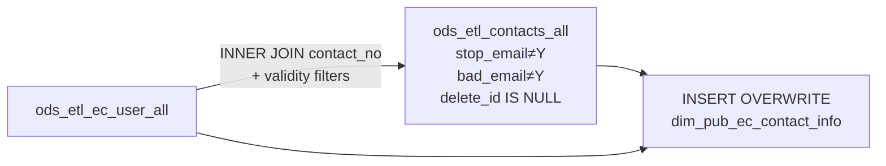

# DIM: E-Commerce Contact Information (`dim_pub_ec_contact_info`)

- artifact_type: etl_table
- artifact_id: dim_us.dim_pub_ec_contact_info
- domain: customer
- one_line_purpose: This dimension table stores the contact details for every active e-commerce (EC) user registered in the system. It joins the EC user account to its linked contact record, filtering out contacts with invalid or suppressed email addresses, to...
- layer_type: DIM
- source_kind: etl_sql
- evidence_source: source/etl/sql/customer/source/etl/flows/public_order_tools/ingest/public_customer_dimension/script/dim_pub_ec_contact_info.sql

---

## L1 Data Foundation

### Identity and physical mapping
- **Table:** `dim_us.dim_pub_ec_contact_info`
- **Layer type:** DIM
- **Canonical / derived:** Derived / ETL-loaded (see L3)
- **Owner team:** not registered in metadata catalog

### Grain, scope, exclusions
- **Grain:** one row per EC user (`user_id`) — each EC user record joined to its linked contact.
- **Scope:** See L2 business purpose / L3 filters
- **Partition:** none explicit — full overwrite each run. - resolved from pipeline (see L4)
- **Natural key:** `user_id`, `cust_no`, `ec_contact_no`.
- **Exclusions:** Not documented in repository

#### Grain detail (preserved)

- **Grain:** one row per EC user (`user_id`) — each EC user record joined to its linked contact.
- **Partition:** none explicit — full overwrite each run.
- **Natural key:** `user_id`, `cust_no`, `ec_contact_no`.

---

### Cross-engine presence
| Engine | Present | Canonical FQN | Notes |
|--------|---------|---------------|-------|
| Hive | yes | `dim_pub_ec_contact_info` | ETL target / intermediate per evidence script |
| Vertica | pending | `dim_pub_ec_contact_info` | Confirm via hive2vertica flow evidence / MCP |

### Physical schema reference

Pointer block only - full column catalog lives in WKB L1 storage JSON.

| Field | Value |
|-------|-------|
| **Authoritative catalog** | WKB L1 storage seed (not duplicated in this file) |
| **entity_id** | `dim_us.dim_pub_ec_contact_info` |
| **l1_catalog_seed** | `target/storage/wkb/snapshots/_snapshot_id_template/l1_catalog/{engine}_{schema}_{table}.json` |
| **column_count** | pending (run ddl_seed_writer) |
| **partition_keys** | `none explicit — full overwrite each run.` |
| **ddl_source** | pending Bitbucket DDL / Vertica metadata ingest |
| **retrieval** | `python -m tools.wkb.indexing.run_query --query "customer dim_pub_ec_contact_info schema" --intent find_table_schema` |

### Lineage
| Object | Role |
|--------|------|
| `ods_${country_code}.ods_etl_ec_user_all` | Primary source — EC user accounts |
| `ods_${country_code}.ods_etl_contacts_all` | Contact detail with validity filters |

---

### Freshness and load path
| Item | Value |
|------|-------|
| Load pattern | See L3 end-to-end / INSERT pattern in evidence script |
| Schedule | Not documented in repository |
| Parameters | `${country_code}` — determines the ODS/DIM schema prefix |


---

## L2 Declarative Knowledge

### Business purpose
This dimension table stores the contact details for every active e-commerce (EC) user registered in the system. It joins the EC user account to its linked contact record, filtering out contacts with invalid or suppressed email addresses, to provide a clean, reachable contact list for e-commerce channel communications and downstream customer dimension enrichment.

---

### Audience and use cases
| Audience | How they benefit |
|----------|-----------------|
| **E-commerce / digital channel** | Clean, active contact list for EC users to support order notifications and outreach |
| **dim_pub_customer_info ETL** | Source for `temp_ec_contacts_info` which populates `ec_contact_*` fields on the master customer dimension |
| **CRM / marketing** | Valid EC contact emails for targeted communications |

---

### Identifier search profile
- Primary lookup keys: see natural key under L1 Grain.
- Use latest snapshot / active flags when documented in L3 filters.

### Time field semantics
- **date_flag / partition columns:** none explicit — full overwrite each run.
- Primary reporting filter should use the partition column(s) documented in L1; resolve values via L4.


### Metrics served

| Category | Column | Logical metric | Business reading |
|----------|--------|----------------|------------------|
| Measures | — | — | No measure columns mapped for this table. |

### Metric serving map

**Formula authority:** [`source/contracts/customer/metric-index.md`](../../source/contracts/customer/metric-index.md)

N/A — no measure columns mapped for this table.

### etl_metrics

No governed logical metrics from `source/contracts/customer/metric-index.md` are mapped on this table.

---

### Metric serving map
N/A - not a `*_comb_mtd` / multi-period wide serving table (or map not present in legacy doc).


### Data products and column groups (preserved)

### Identifiers and relationships

- **EC user:** `user_id` — the EC user account identifier
- **Customer:** `cust_no` — the customer account associated with the EC user
- **Contact:** `ec_contact_no` — the linked contact record number

### Dimension columns

Use these for **filters, group-bys, and star-schema joins**:

- `ec_contact_name` — contact's full name
- `ec_contact_phone_no` — contact's phone number
- `ec_contact_email_address` — contact's email address (validated: not stopped, not bad)
- `ec_contact_fax_no` — contact's fax number
- `ec_entry_datetime` — date/time the contact was entered in the source system

### Audit columns

- `etl_timestamp` — LA-timezone load timestamp

---

### etl_metrics

#### `etl_timestamp`
- **Source:** [metric-index.md](../../source/contracts/customer/metric-index.md#etl_timestamp)
- **Business definition:** LA-timezone load timestamp
```sql
from_utc_timestamp(current_timestamp(), 'America/Los_Angeles')
```


---

## L3 Procedural Knowledge

### Query and routing rules
**Business filters:** Use partition / date keys from L1 grain for reporting scope.
**Technical predicates (load only):** See Key filters and step-by-step logic below.

### Dimension join patterns
| Dimension FQN | Join keys | Purpose | Evidence |
|---------------|-----------|---------|----------|
| See step-by-step / base tables | See L3 steps | Dimension enrichment | `source/etl/sql/customer/source/etl/flows/public_order_tools/ingest/public_customer_dimension/script/dim_pub_ec_contact_info.sql` |

### Key filters and ETL business logic
### Step 1 — Final SELECT + INSERT OVERWRITE

**From:** `ods_${country_code}.ods_etl_ec_user_all ecu` INNER JOIN `ods_${country_code}.ods_etl_contacts_all con`

**Join key:** `ecu.contact_no = con.contact_no`

**Filter (natural language):**
- `con.stop_email <> 'Y' OR con.stop_email IS NULL` — keeps contacts that have not opted out of email
- `con.bad_email <> 'Y' OR con.bad_email IS NULL` — keeps contacts without a known bad email address
- `con.delete_id IS NULL` — excludes soft-deleted contact records
- `ecu.delete_id IS NULL` — excludes soft-deleted EC user records

**Pass-through columns:**

| Source | Column | Output name |
|--------|--------|-------------|
| `ecu` | `user_id` | `user_id` |
| `ecu` | `cust_no` | `cust_no` |
| `con` | `contact_no` | `ec_contact_no` |
| `con` | `contact_name` | `ec_contact_name` |
| `con` | `phone_no` | `ec_contact_phone_no` |
| `con` | `email_address` | `ec_contact_email_address` |
| `con` | `fax_no` | `ec_contact_fax_no` |
| `con` | `entry_datetime` | `ec_entry_datetime` |

**Derived columns computed at INSERT:**

| Column | Formula | Plain language |
|--------|---------|----------------|
| `etl_timestamp` | `from_utc_timestamp(current_timestamp(), 'America/Los_Angeles')` | LA-timezone load timestamp |

---

### Standard time-filter SQL
```sql
-- relative period filter using resolved partition value (see L4)
SELECT *
FROM dim_pub_ec_contact_info
WHERE /* partition predicate */ date_flag = '${partition_value}';
```

### End-to-end flow
**Runtime parameters:** `${country_code}`
**Target table:** `dim_${country_code}.dim_pub_ec_contact_info`, full overwrite.

1. **Read** `ods_etl_ec_user_all` as the EC user anchor.
2. **INNER JOIN** `ods_etl_contacts_all` on `ecu.contact_no = con.contact_no`.
3. **Filter** to exclude contacts where `stop_email = 'Y'`, `bad_email = 'Y'`, `con.delete_id IS NOT NULL`, or `ecu.delete_id IS NOT NULL`.
4. **INSERT OVERWRITE** target with all selected columns plus `etl_timestamp`.



---


#### High-level stages (preserved)

| Stage | Business meaning |
|-------|-----------------|
| **EC user join to contacts** | Joins the EC user table to the contacts table on `contact_no` to retrieve the contact's name, phone, email, and fax |
| **Email/contact validity filter** | Excludes contacts where email is flagged as stopped (`stop_email = 'Y'`), bad (`bad_email = 'Y'`), or the contact or EC user record has been soft-deleted |
| **INSERT OVERWRITE** | Fully replaces the target table on every run |

**Parameters:** `${country_code}` — determines the ODS/DIM schema prefix

---


### Base tables register
| Object | Role in this job |
|--------|-----------------|
| `ods_${country_code}.ods_etl_ec_user_all` | Primary source — EC user account; provides `user_id`, `cust_no`, `contact_no`, `delete_id` |
| `ods_${country_code}.ods_etl_contacts_all` | Contact detail — provides `contact_no`, `contact_name`, `phone_no`, `email_address`, `fax_no`, `entry_datetime`, `stop_email`, `bad_email`, `delete_id` |

**Temporary tables (inside the job only):** none — single-step SELECT with one INNER JOIN.

---

### Step-by-step logic
### Step 1 — Final SELECT + INSERT OVERWRITE

**From:** `ods_${country_code}.ods_etl_ec_user_all ecu` INNER JOIN `ods_${country_code}.ods_etl_contacts_all con`

**Join key:** `ecu.contact_no = con.contact_no`

**Filter (natural language):**
- `con.stop_email <> 'Y' OR con.stop_email IS NULL` — keeps contacts that have not opted out of email
- `con.bad_email <> 'Y' OR con.bad_email IS NULL` — keeps contacts without a known bad email address
- `con.delete_id IS NULL` — excludes soft-deleted contact records
- `ecu.delete_id IS NULL` — excludes soft-deleted EC user records

**Pass-through columns:**

| Source | Column | Output name |
|--------|--------|-------------|
| `ecu` | `user_id` | `user_id` |
| `ecu` | `cust_no` | `cust_no` |
| `con` | `contact_no` | `ec_contact_no` |
| `con` | `contact_name` | `ec_contact_name` |
| `con` | `phone_no` | `ec_contact_phone_no` |
| `con` | `email_address` | `ec_contact_email_address` |
| `con` | `fax_no` | `ec_contact_fax_no` |
| `con` | `entry_datetime` | `ec_entry_datetime` |

**Derived columns computed at INSERT:**

| Column | Formula | Plain language |
|--------|---------|----------------|
| `etl_timestamp` | `from_utc_timestamp(current_timestamp(), 'America/Los_Angeles')` | LA-timezone load timestamp |

---

### Relationship map (embedded)

| from_fqn | to_fqn | cardinality | join_keys | provenance |
|----------|--------|-------------|-----------|------------|
| `ods_${country_code}.ods_etl_ec_user_all` | `ods_${country_code}.ods_etl_contacts_all` | many:1 | `ecu.contact_no = con.contact_no and (con.stop_email <> 'Y' or con.stop_email is null) and(con.bad_email <> 'Y' or con.bad_email is null) and con.delete_id is...` | etl_sql (source/etl/sql/customer/public_order_scripts/public_customer_dimension/script/dim_pub_ec_contact_info.sql:1) |

`source/ref/customer/table relationship.txt`: Not documented in repository.

### Special logic (embedded)

Not documented in repository

### Column / field derivations (from ETL SQL)

| target_column | expression_sql | upstream_columns | upstream_tables | transform_kind | evidence |
|---------------|----------------|------------------|-----------------|----------------|----------|
| `user_id` | `ecu.user_id` | `user_id` | `ods_${country_code}.ods_etl_ec_user_all`, `ods_${country_code}.ods_etl_contacts_all` | passthrough | `source/etl/sql/customer/public_order_scripts/public_customer_dimension/script/dim_pub_ec_contact_info.sql:3` |
| `cust_no` | `ecu.cust_no` | `cust_no` | `ods_${country_code}.ods_etl_ec_user_all`, `ods_${country_code}.ods_etl_contacts_all` | passthrough | `source/etl/sql/customer/public_order_scripts/public_customer_dimension/script/dim_pub_ec_contact_info.sql:4` |
| `ec_contact_no` | `con.contact_no` | `contact_no` | `ods_${country_code}.ods_etl_ec_user_all`, `ods_${country_code}.ods_etl_contacts_all` | rename | `source/etl/sql/customer/public_order_scripts/public_customer_dimension/script/dim_pub_ec_contact_info.sql:5` |
| `ec_contact_name` | `con.contact_name` | `contact_name` | `ods_${country_code}.ods_etl_ec_user_all`, `ods_${country_code}.ods_etl_contacts_all` | rename | `source/etl/sql/customer/public_order_scripts/public_customer_dimension/script/dim_pub_ec_contact_info.sql:6` |
| `ec_contact_phone_no` | `con.phone_no` | `phone_no` | `ods_${country_code}.ods_etl_ec_user_all`, `ods_${country_code}.ods_etl_contacts_all` | rename | `source/etl/sql/customer/public_order_scripts/public_customer_dimension/script/dim_pub_ec_contact_info.sql:7` |
| `ec_contact_email_address` | `con.email_address` | `email_address` | `ods_${country_code}.ods_etl_ec_user_all`, `ods_${country_code}.ods_etl_contacts_all` | rename | `source/etl/sql/customer/public_order_scripts/public_customer_dimension/script/dim_pub_ec_contact_info.sql:8` |
| `ec_contact_fax_no` | `con.fax_no` | `fax_no` | `ods_${country_code}.ods_etl_ec_user_all`, `ods_${country_code}.ods_etl_contacts_all` | rename | `source/etl/sql/customer/public_order_scripts/public_customer_dimension/script/dim_pub_ec_contact_info.sql:9` |
| `ec_entry_datetime` | `con.entry_datetime` | `entry_datetime` | `ods_${country_code}.ods_etl_ec_user_all`, `ods_${country_code}.ods_etl_contacts_all` | rename | `source/etl/sql/customer/public_order_scripts/public_customer_dimension/script/dim_pub_ec_contact_info.sql:10` |
| `etl_timestamp` | `from_utc_timestamp(current_timestamp(), 'America/Los_Angeles')` | `from_utc_timestamp`, `current_timestamp`, `America`, `Los_Angeles` | `ods_${country_code}.ods_etl_ec_user_all`, `ods_${country_code}.ods_etl_contacts_all` | arithmetic | `source/etl/sql/customer/public_order_scripts/public_customer_dimension/script/dim_pub_ec_contact_info.sql:11` |

### Sentinel and code values
| Value | Meaning |
|-------|---------|
| `stop_email = 'Y'` | Contact has requested to stop receiving emails — excluded from output |
| `bad_email = 'Y'` | Contact's email address is known to be invalid — excluded from output |
| `delete_id IS NOT NULL` | Record has been soft-deleted — excluded from output (applied to both EC user and contact) |

---

---

## L4 Validation

### Resolved partition value
| Step | Source | How partition / date scope is determined |
|------|--------|------------------------------------------|
| 1 | evidence script / flow | See parameters in L1 Freshness and L3 filters - `source/etl/sql/customer/source/etl/flows/public_order_tools/ingest/public_customer_dimension/script/dim_pub_ec_contact_info.sql` |

**Plain language:** Partition and date scope follow Azkaban/bootstrap parameters documented in the source script and orchestrating flow; do not hardcode calendar literals.

### Data quality checks
- Prefer row-count-by-partition, metric sums, and grain duplicate checks (see Validation SQL).
- Additional checks from legacy caveats / operational notes when present.

### Validation SQL
```sql
-- 1) Row count by partition
SELECT ${partition_col}, COUNT(*) AS row_cnt
FROM dim_${country_code}.dim_pub_ec_contact_info
WHERE ${partition_col} = '${partition_value}'
GROUP BY ${partition_col};

-- 2) Metric sum by business dimension (top deltas)
SELECT ${dim_key}, SUM(${metric}) AS metric_sum
FROM dim_${country_code}.dim_pub_ec_contact_info
WHERE ${partition_col} = '${partition_value}'
GROUP BY ${dim_key}
ORDER BY ABS(SUM(${metric})) DESC
LIMIT 20;

-- 3) Grain duplicate check
SELECT ${grain_key_1}, ${grain_key_2}, ${grain_key_3}, ${partition_col}, COUNT(*) AS cnt
FROM dim_${country_code}.dim_pub_ec_contact_info
WHERE ${partition_col} = '${partition_value}'
GROUP BY ${grain_key_1}, ${grain_key_2}, ${grain_key_3}, ${partition_col}
HAVING COUNT(*) > 1;
```

Replace placeholders from this file's Grain and keys / Data you can fetch sections, and use the resolved partition value from run scope.

### Caveats for interpretation
- The INNER JOIN means that EC users with no matching contact record in `ods_etl_contacts_all` are silently excluded from the output.
- A single `cust_no` may have multiple rows in this table (one per active EC user). The downstream `temp_ec_contacts_info` in `dim_pub_customer_info` applies its own deduplication (row 1 by `ec_entry_datetime, ec_contact_no DESC`) before use.
- Email validity is enforced at load time by filtering `stop_email` and `bad_email`; if a contact's email status changes after the last load, the table will not reflect the change until the next run.

---

### Conflicts and open questions
- Schedule, owner, SLA: Not documented in repository (unless preserved schedule evidence above).
- Vertica MCP verification: pending unless confirmed in L5.


---

## L5 Runtime View

### Query path and engine preference
| Role | Hive object | Vertica object | Sync mode | Evidence | MCP verified |
|------|-------------|----------------|-----------|----------|--------------|
| **Query for reporting** | *See script lineage* | `dim_${country_code}.dim_pub_ec_contact_info` | *Verify from flow* | *Add flow file:line* | pending |
| **Hive alternative** | `*` | `dim_${country_code}.dim_pub_ec_contact_info` | - | *See dependencies* | - |
| **ETL internal** | staging/temp tables | *Not synced to Vertica* | - | *See step-by-step logic* | - |

Business users should query `dim_${country_code}.dim_pub_ec_contact_info` in Vertica once MCP verification is completed for this document.

### Access constraints
- Country / company schema parameters may apply (`literal_country`, `company_no`, etc.).
- Hive-only staging objects are not reporting surfaces unless synced.

### Query risk profile
| Field | Value |
|-------|-------|
| requires_date_predicate | unknown |
| scan_risk_tier | medium |

---

## L6 Access and Consumption

### Primary consumers and use cases
| Audience | How they benefit |
|----------|-----------------|
| **E-commerce / digital channel** | Clean, active contact list for EC users to support order notifications and outreach |
| **dim_pub_customer_info ETL** | Source for `temp_ec_contacts_info` which populates `ec_contact_*` fields on the master customer dimension |
| **CRM / marketing** | Valid EC contact emails for targeted communications |

---

### Representative query patterns
```sql
-- certified / illustrative lookup - replace predicates from L1/L4
SELECT *
FROM dim_pub_ec_contact_info
WHERE date_flag = '${partition_value}'
LIMIT 100;
```

### Dependencies and notes
### Upstream objects (verified)

| Object | Usage | Evidence |
|--------|-------|----------|
| `ods_${country_code}.ods_etl_ec_user_all` | INNER JOIN — `user_id`, `cust_no`, `contact_no`, `delete_id` | `dim_pub_ec_contact_info.sql:13` |
| `ods_${country_code}.ods_etl_contacts_all` | INNER JOIN — contact detail fields and validity flags | `dim_pub_ec_contact_info.sql:14` |

### Downstream consumers (verified)

| Object / script | Evidence |
|-----------------|----------|
| `dim_${country_code}.dim_pub_customer_info` (via `temp_ec_contacts_info`) | Reads this table for EC contact enrichment | `dim_pub_customer_info.sql:417` |

### Operational detail (verified)

- Full `INSERT OVERWRITE` — no incremental/partition strategy evident from script.
- Must run before `dim_pub_customer_info`.

### Not documented in repository

- Schedule, owner, SLA — not in scripts or configs

---

*Document generated from `source/etl/sql/customer/source/etl/flows/public_order_tools/ingest/public_customer_dimension/script/dim_pub_ec_contact_info.sql`.*

#### Not documented in repository
- Owner, SLA (unless schedule evidence preserved above)
- Any dependency without `file:line` evidence in this document

---

*Document migrated to L1-L6 from legacy Knowledgebase content. Evidence: `source/etl/sql/customer/source/etl/flows/public_order_tools/ingest/public_customer_dimension/script/dim_pub_ec_contact_info.sql`.*
