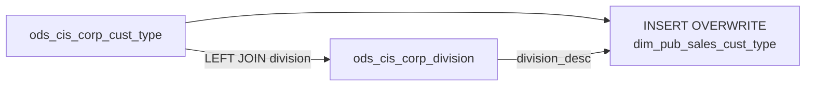

# DIM: Sales Customer Type (`dim_pub_sales_cust_type`)

- artifact_type: etl_table
- artifact_id: dim_us.dim_pub_sales_cust_type
- domain: customer
- one_line_purpose: This dimension table is a lightweight reference that maps each customer type code to its business attributes, including the human-readable description, division affiliation, credit risk parameters, back-order expiry settings, and the respon...
- layer_type: DIM
- source_kind: etl_sql
- evidence_source: source/etl/sql/customer/source/etl/flows/public_order_tools/ingest/public_customer_dimension/script/dim_pub_sales_cust_type.sql

---

## L1 Data Foundation

### Identity and physical mapping
- **Table:** `dim_us.dim_pub_sales_cust_type`
- **Layer type:** DIM
- **Canonical / derived:** Derived / ETL-loaded (see L3)
- **Owner team:** not registered in metadata catalog

### Grain, scope, exclusions
- **Grain:** one row per customer type (`cust_type`).
- **Scope:** See L2 business purpose / L3 filters
- **Partition:** none explicit — full overwrite each run. - resolved from pipeline (see L4)
- **Natural key:** `cust_type`.
- **Exclusions:** Not documented in repository

#### Grain detail (preserved)

- **Grain:** one row per customer type (`cust_type`).
- **Partition:** none explicit — full overwrite each run.
- **Natural key:** `cust_type`.

---

### Cross-engine presence
| Engine | Present | Canonical FQN | Notes |
|--------|---------|---------------|-------|
| Hive | yes | `dim_pub_sales_cust_type` | ETL target / intermediate per evidence script |
| Vertica | pending | `dim_pub_sales_cust_type` | Confirm via hive2vertica flow evidence / MCP |

### Physical schema reference

Pointer block only - full column catalog lives in WKB L1 storage JSON.

| Field | Value |
|-------|-------|
| **Authoritative catalog** | WKB L1 storage seed (not duplicated in this file) |
| **entity_id** | `dim_us.dim_pub_sales_cust_type` |
| **l1_catalog_seed** | `target/storage/wkb/snapshots/_snapshot_id_template/l1_catalog/{engine}_{schema}_{table}.json` |
| **column_count** | pending (run ddl_seed_writer) |
| **partition_keys** | `none explicit — full overwrite each run.` |
| **ddl_source** | pending Bitbucket DDL / Vertica metadata ingest |
| **retrieval** | `python -m tools.wkb.indexing.run_query --query "customer dim_pub_sales_cust_type schema" --intent find_table_schema` |

### Lineage
| Object | Role |
|--------|------|
| `ods_${country_code}.ods_cis_corp_cust_type` | Primary source — customer type definitions |
| `ods_${country_code}.ods_cis_corp_division` | Division description lookup |

---

### Freshness and load path
| Item | Value |
|------|-------|
| Load pattern | See L3 end-to-end / INSERT pattern in evidence script |
| Schedule | Not documented in repository |
| Parameters | `${country_code}` — determines the ODS/DIM schema prefix |


---

## L2 Declarative Knowledge

### Business purpose
This dimension table is a lightweight reference that maps each customer type code to its business attributes, including the human-readable description, division affiliation, credit risk parameters, back-order expiry settings, and the responsible manager. It is used as a lookup by reporting and analytical layers that need to classify customers and apply type-specific business rules such as minimum net margin thresholds and credit risk rates.

---

### Audience and use cases
| Audience | How they benefit |
|----------|-----------------|
| **Sales operations** | Classifies customers by type for territory and segment reporting; `sales_group` and `division_desc` support roll-up hierarchies |
| **Credit & risk teams** | `credit_risk_rate` and `min_net_margin` provide type-level risk parameters for policy enforcement |
| **Finance** | `gl_dept_no` maps customer types to GL departments for cost allocation |
| **Order management** | `bo_expire_days` sets back-order expiry rules by customer type |
| **dim_pub_customer_info consumers** | `cust_type` and `cust_type_descr` are joined from this dimension for customer classification |

---

### Identifier search profile
- Primary lookup keys: see natural key under L1 Grain.
- Use latest snapshot / active flags when documented in L3 filters.

### Time field semantics
- **date_flag / partition columns:** none explicit — full overwrite each run.
- Primary reporting filter should use the partition column(s) documented in L1; resolve values via L4.


### Metrics served

| Category | Column | Logical metric | Business reading |
|----------|--------|----------------|------------------|
| Measures | — | — | No measure columns mapped for this table. |

### Metric serving map

**Formula authority:** [`source/contracts/customer/metric-index.md`](../../source/contracts/customer/metric-index.md)

N/A — no measure columns mapped for this table.

### etl_metrics

No governed logical metrics from `source/contracts/customer/metric-index.md` are mapped on this table.

---

### Metric serving map
N/A - not a `*_comb_mtd` / multi-period wide serving table (or map not present in legacy doc).


### Data products and column groups (preserved)

### Identifiers and relationships

- **Customer type:** `cust_type` — the type code used as a foreign key in customer records
- **Division:** `division` — the division code; `division_desc` — the human-readable name

### Dimension columns (reporting-ready)

Use these for **filters, group-bys, and star-schema joins**:

- `cust_type_descr` — human-readable customer type label
- `sales_group` — sales group this type belongs to
- `division`, `division_desc` — division code and description
- `gl_dept_no` — GL department number for financial allocation
- `ge_leasing` — GE leasing program flag
- `end_date` — date this customer type expires or was retired
- `entry_datetime`, `entry_id` — creation audit fields

### Credit risk parameters

| Column | Meaning |
|--------|---------|
| `min_net_margin` | Minimum net margin threshold applicable to this customer type |
| `credit_risk_rate` | Credit risk rate associated with this customer type for underwriting |
| `bo_expire_days` | Number of days before back-orders expire for customers of this type |

### Management columns

- `manager_id` — ID of the manager responsible for this customer type
- `backup_id` — backup manager ID

---

### etl_metrics

N/A - no calculable ETL formulas extracted from this document (passthrough / stored measures only, or formulas not documented).

---

## L3 Procedural Knowledge

### Query and routing rules
**Business filters:** Use partition / date keys from L1 grain for reporting scope.
**Technical predicates (load only):** See Key filters and step-by-step logic below.

### Dimension join patterns
| Dimension FQN | Join keys | Purpose | Evidence |
|---------------|-----------|---------|----------|
| See step-by-step / base tables | See L3 steps | Dimension enrichment | `source/etl/sql/customer/source/etl/flows/public_order_tools/ingest/public_customer_dimension/script/dim_pub_sales_cust_type.sql` |

### Key filters and ETL business logic
### Step 1 — Final SELECT + INSERT OVERWRITE

**From:** `ods_${country_code}.ods_cis_corp_cust_type ct`

**Left join on insert:**

| Join | Keys | Purpose |
|------|------|---------|
| `ods_cis_corp_division dv` | `ct.division = dv.division` | Adds `division_desc` from the division reference table |

**Pass-through columns from `ods_cis_corp_cust_type`:**
`cust_type`, `cust_type_descr`, `entry_datetime`, `entry_id`, `min_net_margin`, `credit_risk_rate`, `bo_expire_days`, `gl_dept_no`, `sales_group`, `division`, `manager_id`, `backup_id`, `end_date`, `ge_leasing`

**Added column:**

| Column | Formula | Plain language |
|--------|---------|----------------|
| `division_desc` | `dv.division_desc` | Human-readable name for the division associated with this customer type |

---

### Standard time-filter SQL
```sql
-- relative period filter using resolved partition value (see L4)
SELECT *
FROM dim_pub_sales_cust_type
WHERE /* partition predicate */ date_flag = '${partition_value}';
```

### End-to-end flow
**Runtime parameters:** `${country_code}`
**Target table:** `dim_${country_code}.dim_pub_sales_cust_type`, full overwrite.

1. **Read** all rows from `ods_${country_code}.ods_cis_corp_cust_type`.
2. **LEFT JOIN** `ods_${country_code}.ods_cis_corp_division` on `ct.division = dv.division` — adds `division_desc`.
3. **INSERT OVERWRITE** target with all columns.



---


#### High-level stages (preserved)

| Stage | Business meaning |
|-------|-----------------|
| **Customer type base** | Reads all customer type records from `ods_cis_corp_cust_type` |
| **Division description enrichment** | Left-joins `ods_cis_corp_division` to resolve the division code into a human-readable description |
| **INSERT OVERWRITE** | Fully replaces the target table on every run |

**Parameters:** `${country_code}` — determines the ODS/DIM schema prefix

---


### Base tables register
| Object | Role in this job |
|--------|-----------------|
| `ods_${country_code}.ods_cis_corp_cust_type` | Primary source — all customer type attributes including credit risk, margins, GL, manager |
| `ods_${country_code}.ods_cis_corp_division` | Division description lookup — joined on `division` code |

**Temporary tables (inside the job only):** none — single-step SELECT with one LEFT JOIN.

---

### Step-by-step logic
### Step 1 — Final SELECT + INSERT OVERWRITE

**From:** `ods_${country_code}.ods_cis_corp_cust_type ct`

**Left join on insert:**

| Join | Keys | Purpose |
|------|------|---------|
| `ods_cis_corp_division dv` | `ct.division = dv.division` | Adds `division_desc` from the division reference table |

**Pass-through columns from `ods_cis_corp_cust_type`:**
`cust_type`, `cust_type_descr`, `entry_datetime`, `entry_id`, `min_net_margin`, `credit_risk_rate`, `bo_expire_days`, `gl_dept_no`, `sales_group`, `division`, `manager_id`, `backup_id`, `end_date`, `ge_leasing`

**Added column:**

| Column | Formula | Plain language |
|--------|---------|----------------|
| `division_desc` | `dv.division_desc` | Human-readable name for the division associated with this customer type |

---

### Relationship map (embedded)

| from_fqn | to_fqn | cardinality | join_keys | provenance |
|----------|--------|-------------|-----------|------------|
| `ods_${country_code}.ods_cis_corp_cust_type` | `ods_${country_code}.ods_cis_corp_division` | many:1 | `ct.division = dv.division` | etl_sql (source/etl/sql/customer/public_order_scripts/public_customer_dimension/script/dim_pub_sales_cust_type.sql:1) |

`source/ref/customer/table relationship.txt`: Not documented in repository.

### Special logic (embedded)

Not documented in repository

### Column / field derivations (from ETL SQL)

| target_column | expression_sql | upstream_columns | upstream_tables | transform_kind | evidence |
|---------------|----------------|------------------|-----------------|----------------|----------|
| `cust_type` | `ct.cust_type` | `cust_type` | `ods_${country_code}.ods_cis_corp_cust_type`, `ods_${country_code}.ods_cis_corp_division` | passthrough | `source/etl/sql/customer/public_order_scripts/public_customer_dimension/script/dim_pub_sales_cust_type.sql:3` |
| `cust_type_descr` | `ct.cust_type_descr` | `cust_type_descr` | `ods_${country_code}.ods_cis_corp_cust_type`, `ods_${country_code}.ods_cis_corp_division` | passthrough | `source/etl/sql/customer/public_order_scripts/public_customer_dimension/script/dim_pub_sales_cust_type.sql:4` |
| `entry_datetime` | `ct.entry_datetime` | `entry_datetime` | `ods_${country_code}.ods_cis_corp_cust_type`, `ods_${country_code}.ods_cis_corp_division` | passthrough | `source/etl/sql/customer/public_order_scripts/public_customer_dimension/script/dim_pub_sales_cust_type.sql:5` |
| `entry_id` | `ct.entry_id` | `entry_id` | `ods_${country_code}.ods_cis_corp_cust_type`, `ods_${country_code}.ods_cis_corp_division` | passthrough | `source/etl/sql/customer/public_order_scripts/public_customer_dimension/script/dim_pub_sales_cust_type.sql:6` |
| `min_net_margin` | `ct.min_net_margin` | `min_net_margin` | `ods_${country_code}.ods_cis_corp_cust_type`, `ods_${country_code}.ods_cis_corp_division` | passthrough | `source/etl/sql/customer/public_order_scripts/public_customer_dimension/script/dim_pub_sales_cust_type.sql:7` |
| `credit_risk_rate` | `ct.credit_risk_rate` | `credit_risk_rate` | `ods_${country_code}.ods_cis_corp_cust_type`, `ods_${country_code}.ods_cis_corp_division` | passthrough | `source/etl/sql/customer/public_order_scripts/public_customer_dimension/script/dim_pub_sales_cust_type.sql:8` |
| `bo_expire_days` | `ct.bo_expire_days` | `bo_expire_days` | `ods_${country_code}.ods_cis_corp_cust_type`, `ods_${country_code}.ods_cis_corp_division` | passthrough | `source/etl/sql/customer/public_order_scripts/public_customer_dimension/script/dim_pub_sales_cust_type.sql:9` |
| `gl_dept_no` | `ct.gl_dept_no` | `gl_dept_no` | `ods_${country_code}.ods_cis_corp_cust_type`, `ods_${country_code}.ods_cis_corp_division` | passthrough | `source/etl/sql/customer/public_order_scripts/public_customer_dimension/script/dim_pub_sales_cust_type.sql:10` |
| `sales_group` | `ct.sales_group` | `sales_group` | `ods_${country_code}.ods_cis_corp_cust_type`, `ods_${country_code}.ods_cis_corp_division` | passthrough | `source/etl/sql/customer/public_order_scripts/public_customer_dimension/script/dim_pub_sales_cust_type.sql:11` |
| `division` | `ct.division` | `division` | `ods_${country_code}.ods_cis_corp_cust_type`, `ods_${country_code}.ods_cis_corp_division` | passthrough | `source/etl/sql/customer/public_order_scripts/public_customer_dimension/script/dim_pub_sales_cust_type.sql:12` |
| `division_desc` | `dv.division_desc` | `division_desc` | `ods_${country_code}.ods_cis_corp_cust_type`, `ods_${country_code}.ods_cis_corp_division` | passthrough | `source/etl/sql/customer/public_order_scripts/public_customer_dimension/script/dim_pub_sales_cust_type.sql:13` |
| `manager_id` | `ct.manager_id` | `manager_id` | `ods_${country_code}.ods_cis_corp_cust_type`, `ods_${country_code}.ods_cis_corp_division` | passthrough | `source/etl/sql/customer/public_order_scripts/public_customer_dimension/script/dim_pub_sales_cust_type.sql:14` |
| `backup_id` | `ct.backup_id` | `backup_id` | `ods_${country_code}.ods_cis_corp_cust_type`, `ods_${country_code}.ods_cis_corp_division` | passthrough | `source/etl/sql/customer/public_order_scripts/public_customer_dimension/script/dim_pub_sales_cust_type.sql:15` |
| `end_date` | `ct.end_date` | `end_date` | `ods_${country_code}.ods_cis_corp_cust_type`, `ods_${country_code}.ods_cis_corp_division` | passthrough | `source/etl/sql/customer/public_order_scripts/public_customer_dimension/script/dim_pub_sales_cust_type.sql:16` |
| `ge_leasing` | `ct.ge_leasing` | `ge_leasing` | `ods_${country_code}.ods_cis_corp_cust_type`, `ods_${country_code}.ods_cis_corp_division` | passthrough | `source/etl/sql/customer/public_order_scripts/public_customer_dimension/script/dim_pub_sales_cust_type.sql:17` |

### Sentinel and code values
| Value | Meaning |
|-------|---------|
| `end_date IS NOT NULL` | Customer type has been retired or has a scheduled expiry |
| `ge_leasing` | Flag value from source; indicates GE leasing program applicability |

---

---

## L4 Validation

### Resolved partition value
| Step | Source | How partition / date scope is determined |
|------|--------|------------------------------------------|
| 1 | evidence script / flow | See parameters in L1 Freshness and L3 filters - `source/etl/sql/customer/source/etl/flows/public_order_tools/ingest/public_customer_dimension/script/dim_pub_sales_cust_type.sql` |

**Plain language:** Partition and date scope follow Azkaban/bootstrap parameters documented in the source script and orchestrating flow; do not hardcode calendar literals.

### Data quality checks
- Prefer row-count-by-partition, metric sums, and grain duplicate checks (see Validation SQL).
- Additional checks from legacy caveats / operational notes when present.

### Validation SQL
```sql
-- 1) Row count by partition
SELECT ${partition_col}, COUNT(*) AS row_cnt
FROM dim_${country_code}.dim_pub_sales_cust_type
WHERE ${partition_col} = '${partition_value}'
GROUP BY ${partition_col};

-- 2) Metric sum by business dimension (top deltas)
SELECT ${dim_key}, SUM(${metric}) AS metric_sum
FROM dim_${country_code}.dim_pub_sales_cust_type
WHERE ${partition_col} = '${partition_value}'
GROUP BY ${dim_key}
ORDER BY ABS(SUM(${metric})) DESC
LIMIT 20;

-- 3) Grain duplicate check
SELECT ${grain_key_1}, ${grain_key_2}, ${grain_key_3}, ${partition_col}, COUNT(*) AS cnt
FROM dim_${country_code}.dim_pub_sales_cust_type
WHERE ${partition_col} = '${partition_value}'
GROUP BY ${grain_key_1}, ${grain_key_2}, ${grain_key_3}, ${partition_col}
HAVING COUNT(*) > 1;
```

Replace placeholders from this file's Grain and keys / Data you can fetch sections, and use the resolved partition value from run scope.

### Caveats for interpretation
- `division_desc` will be null if no matching row exists in `ods_cis_corp_division` for a given `division` code (LEFT JOIN).
- This table contains all customer types including retired ones (those with a non-null `end_date`). Filter on `end_date IS NULL` or compare to the current date for active types only.
- `min_net_margin` and `credit_risk_rate` are type-level parameters; individual customer overrides (if any) would exist in other tables.

---

### Conflicts and open questions
- Schedule, owner, SLA: Not documented in repository (unless preserved schedule evidence above).
- Vertica MCP verification: pending unless confirmed in L5.


---

## L5 Runtime View

### Query path and engine preference
| Role | Hive object | Vertica object | Sync mode | Evidence | MCP verified |
|------|-------------|----------------|-----------|----------|--------------|
| **Query for reporting** | *See script lineage* | `dim_${country_code}.dim_pub_sales_cust_type` | *Verify from flow* | *Add flow file:line* | pending |
| **Hive alternative** | `*` | `dim_${country_code}.dim_pub_sales_cust_type` | - | *See dependencies* | - |
| **ETL internal** | staging/temp tables | *Not synced to Vertica* | - | *See step-by-step logic* | - |

Business users should query `dim_${country_code}.dim_pub_sales_cust_type` in Vertica once MCP verification is completed for this document.

### Access constraints
- Country / company schema parameters may apply (`literal_country`, `company_no`, etc.).
- Hive-only staging objects are not reporting surfaces unless synced.

### Query risk profile
| Field | Value |
|-------|-------|
| requires_date_predicate | unknown |
| scan_risk_tier | medium |

---

## L6 Access and Consumption

### Primary consumers and use cases
| Audience | How they benefit |
|----------|-----------------|
| **Sales operations** | Classifies customers by type for territory and segment reporting; `sales_group` and `division_desc` support roll-up hierarchies |
| **Credit & risk teams** | `credit_risk_rate` and `min_net_margin` provide type-level risk parameters for policy enforcement |
| **Finance** | `gl_dept_no` maps customer types to GL departments for cost allocation |
| **Order management** | `bo_expire_days` sets back-order expiry rules by customer type |
| **dim_pub_customer_info consumers** | `cust_type` and `cust_type_descr` are joined from this dimension for customer classification |

---

### Representative query patterns
```sql
-- certified / illustrative lookup - replace predicates from L1/L4
SELECT *
FROM dim_pub_sales_cust_type
WHERE date_flag = '${partition_value}'
LIMIT 100;
```

### Dependencies and notes
### Upstream objects (verified)

| Object | Usage | Evidence |
|--------|-------|----------|
| `ods_${country_code}.ods_cis_corp_cust_type` | Primary source — all columns | `dim_pub_sales_cust_type.sql:18` |
| `ods_${country_code}.ods_cis_corp_division` | LEFT JOIN — `division_desc` | `dim_pub_sales_cust_type.sql:19-20` |

### Downstream consumers (verified)

| Object / script | Evidence |
|-----------------|----------|
| `dim_${country_code}.dim_pub_customer_info` (via `ods_cis_corp_cust_type` join in `temp_customer_analyst_collector`) | `cust_type` and `cust_type_descr` are consumed in the customer info pipeline | `dim_pub_customer_info.sql:350-353` |

### Operational detail (verified)

- Full `INSERT OVERWRITE` — no incremental/partition strategy evident from script.

### Not documented in repository

- Schedule, owner, SLA — not in scripts or configs
- Whether `manager_id` and `backup_id` reference `dim_pub_manager` is not confirmed in this script

---

*Document generated from `source/etl/sql/customer/source/etl/flows/public_order_tools/ingest/public_customer_dimension/script/dim_pub_sales_cust_type.sql`.*

#### Not documented in repository
- Owner, SLA (unless schedule evidence preserved above)
- Any dependency without `file:line` evidence in this document

---

*Document migrated to L1-L6 from legacy Knowledgebase content. Evidence: `source/etl/sql/customer/source/etl/flows/public_order_tools/ingest/public_customer_dimension/script/dim_pub_sales_cust_type.sql`.*
