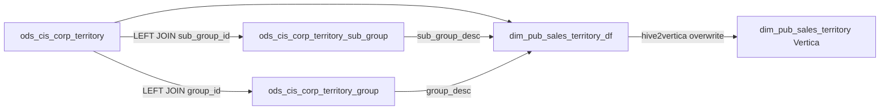

# DIM: Sales territory date-flag dimension (`dim_${country_code}.dim_pub_sales_territory_df`)

- artifact_type: etl_table
- artifact_id: dim_us.dim_pub_sales_territory_df
- domain: customer
- one_line_purpose: Builds a date-partitioned sales-territory dimension from CIS corp territory plus group/sub-group descriptions, then feeds Vertica overwrite sync to `dim_pub_sales_territory`.
- layer_type: DIM
- source_kind: etl_sql
- evidence_source: source/etl/sql/customer/public_order_scripts/public_customer_dimension/script/dim_pub_sales_territory_df.sql

---

## L1 Data Foundation

### Identity and physical mapping
- **Table:** `dim_${country_code}.dim_pub_sales_territory_df`
- **Layer type:** DIM
- **Canonical / derived:** Derived from ODS territory master + group lookups; partitioned by `date_flag`
- **Owner team:** not registered in metadata catalog

### Grain, scope, exclusions
- **Grain:** one row per `sales_terr` (and related territory attributes) within a `date_flag` partition — inferred from SELECT of territory base `a` without aggregation
- **Scope:** Country-scoped `ods_${country_code}` / `dim_${country_code}`
- **Partition:** `date_flag = ${date_flag}` — see L4
- **Natural key:** `sales_terr` (+ partition `date_flag`) — inferred from territory source grain; uniqueness not asserted in SQL
- **Exclusions:** None — LEFT JOINs only; no WHERE filter

### Cross-engine presence
| Engine | Present | Canonical FQN | Notes |
|--------|---------|---------------|-------|
| Hive | yes | `dim_${country_code}.dim_pub_sales_territory_df` | ETL target |
| Vertica | yes (via sync) | `dim_${country_code}.dim_pub_sales_territory` | hive2vertica overwrite from `_df` for `${date_flag}` — `public_customer_dimension_us.flow:439-450` |

### Physical schema reference

| Field | Value |
|-------|-------|
| **Authoritative catalog** | WKB L1 storage seed (not duplicated in this file) |
| **entity_id** | `dim_us.dim_pub_sales_territory_df` |
| **l1_catalog_seed** | `target/storage/wkb/snapshots/_snapshot_id_template/l1_catalog/{engine}_dim_us_dim_pub_sales_territory_df.json` |
| **column_count** | pending (run ddl_seed_writer) |
| **partition_keys** | `date_flag` |
| **ddl_source** | pending Bitbucket DDL / Vertica metadata ingest |
| **retrieval** | `python -m tools.wkb.indexing.run_query --query "customer dim_pub_sales_territory_df schema" --intent find_table_schema` |

### Lineage
- **upstream:** `ods_cis_corp_territory` (base), `ods_cis_corp_territory_sub_group`, `ods_cis_corp_territory_group` — `dim_pub_sales_territory_df.sql:36-40`
- **downstream:** Vertica `dim_${country_code}.dim_pub_sales_territory` via hive2vertica — `public_customer_dimension_us.flow:439-450`

### Freshness and load path
| Item | Value |
|------|-------|
| Load pattern | `INSERT OVERWRITE` partition `date_flag = ${date_flag}` |
| Schedule | Flow cron `0 55 0 ? * *` on `public_customer_dimension_us.flow` |
| Parameters | `${country_code}`, `${date_flag}` (`query.parameter.date_flag` on flow job) |

---

## L2 Declarative Knowledge

### Business purpose
This job materializes sales territory reference data for a given business date: territory code and name, region, effective dates, reviewer, customer type, primary/backup salesperson IDs and split percents, credit analyst, house flag, plus resolved group and sub-group descriptions. It is the Hive source for the Vertica sales-territory dimension overwrite.

### Audience and use cases
| Audience | How they benefit |
|----------|-----------------|
| **Sales operations** | Territory hierarchy, primary/backup coverage, house vs named territory |
| **Credit** | `cred_analyst` on territory |
| **Reporting / Vertica** | Synced `dim_pub_sales_territory` for joins by `sales_terr` |

### Identifier search profile
- Primary lookup: `sales_terr`
- Supporting: `group_id`, `sub_group_id`, `cust_type`, `primary_id` / `backup_id*`
- Prefer latest `${date_flag}` partition (or Vertica non-partitioned sync target)

### Time field semantics
- **`date_flag`:** load partition from `${date_flag}`
- **`start_date` / `end_date`:** territory effective window from ODS (passthrough)
- **`etl_timestamp`:** load timestamp in America/Los_Angeles

### Metrics served
| Category | Columns | Business reading |
|----------|---------|------------------|
| Split percents | `primary_pcnt`, `backup_pcnt1`–`backup_pcnt7` | Coverage split attributes (not aggregated measures) |

### Metric serving map
N/A — not a multi-period fact serving table.

### etl_metrics
No calculable aggregate metrics. Formula authority: [`source/contracts/customer/metric-index.md`](../../source/contracts/customer/metric-index.md).

---

## L3 Procedural Knowledge

### Query and routing rules
**Business filters:** Use `date_flag` on Hive `_df`; Vertica target is full overwrite of `dim_pub_sales_territory`.
**Technical predicates (load only):** Partition `${date_flag}` on INSERT.

### Dimension join patterns
| Dimension FQN | Join keys | Purpose | Evidence |
|---------------|-----------|---------|----------|
| `ods_cis_corp_territory_sub_group` | `a.sub_group_id = b.sub_group_id` | `sub_group_desc` | `dim_pub_sales_territory_df.sql:37-38` |
| `ods_cis_corp_territory_group` | `a.group_id = c.group_id` | `group_desc` | `dim_pub_sales_territory_df.sql:39-40` |

### Key filters and ETL business logic
- **Technical (load only):** `PARTITION (date_flag = ${date_flag})` — `dim_pub_sales_territory_df.sql:1`
- LEFT JOIN sub-group on `sub_group_id` — `dim_pub_sales_territory_df.sql:37-38`
- LEFT JOIN group on `group_id` — `dim_pub_sales_territory_df.sql:39-40`
- No WHERE clause — all territory rows from ODS base are loaded
- **Special logic applied in this ETL:** `etl_timestamp = from_utc_timestamp(current_timestamp(), 'America/Los_Angeles')` — `dim_pub_sales_territory_df.sql:32`

### Standard time-filter SQL
```sql
SELECT *
FROM dim_${country_code}.dim_pub_sales_territory_df
WHERE date_flag = '${partition_value}';
```

### End-to-end flow
1. CDC/ODS jobs for territory / group / sub-group complete (flow dependsOn).
2. `gen_date_parameter` resolves `${date_flag}`.
3. SELECT from territory LEFT JOIN sub-group and group; write `_df` partition.
4. `hive2vertica_dim_pub_sales_territory` overwrites Vertica `dim_pub_sales_territory` from that partition.



### Base tables register
| Object | Role in this job |
|--------|-----------------|
| `ods_${country_code}.ods_cis_corp_territory` | Base territory attributes (`a`) |
| `ods_${country_code}.ods_cis_corp_territory_sub_group` | `sub_group_desc` (`b`) |
| `ods_${country_code}.ods_cis_corp_territory_group` | `group_desc` (`c`) |
| `dim_${country_code}.dim_pub_sales_territory_df` | Target |

### Step-by-step logic
#### Step 1 — Territory base + group enrichment + INSERT OVERWRITE
**Source:** `ods_cis_corp_territory a`  
**Joins:** LEFT JOIN `ods_cis_corp_territory_sub_group b` ON `a.sub_group_id = b.sub_group_id`; LEFT JOIN `ods_cis_corp_territory_group c` ON `a.group_id = c.group_id`  
**Derived:** `etl_timestamp`, `sub_group_desc`, `group_desc`  
**Load:** INSERT OVERWRITE partition `${date_flag}`

### Relationship map (embedded)

| from_fqn | to_fqn | cardinality | join_keys | provenance |
|----------|--------|-------------|-----------|------------|
| `ods_${country_code}.ods_cis_corp_territory` | `ods_${country_code}.ods_cis_corp_territory_sub_group` | many:1 | `a.sub_group_id = b.sub_group_id` | etl_sql (source/etl/sql/customer/public_order_scripts/public_customer_dimension/script/dim_pub_sales_territory_df.sql:1) |
| `ods_${country_code}.ods_cis_corp_territory` | `ods_${country_code}.ods_cis_corp_territory_group` | many:1 | `a.group_id = c.group_id;` | etl_sql (source/etl/sql/customer/public_order_scripts/public_customer_dimension/script/dim_pub_sales_territory_df.sql:1) |

`source/ref/customer/table relationship.txt`: Not documented in repository.

### Special logic (embedded)

Not documented in repository

### Column / field derivations (from ETL SQL)

| target_column | expression_sql | upstream_columns | upstream_tables | transform_kind | evidence |
|---------------|----------------|------------------|-----------------|----------------|----------|
| `sales_terr` | `a.sales_terr` | `sales_terr` | `ods_${country_code}.ods_cis_corp_territory`, `ods_${country_code}.ods_cis_corp_territory_sub_group`, `ods_${country_code}.ods_cis_corp_territory_group` | passthrough | `source/etl/sql/customer/public_order_scripts/public_customer_dimension/script/dim_pub_sales_territory_df.sql:3` |
| `terr_name` | `a.terr_name` | `terr_name` | `ods_${country_code}.ods_cis_corp_territory`, `ods_${country_code}.ods_cis_corp_territory_sub_group`, `ods_${country_code}.ods_cis_corp_territory_group` | passthrough | `source/etl/sql/customer/public_order_scripts/public_customer_dimension/script/dim_pub_sales_territory_df.sql:4` |
| `region` | `a.region` | `region` | `ods_${country_code}.ods_cis_corp_territory`, `ods_${country_code}.ods_cis_corp_territory_sub_group`, `ods_${country_code}.ods_cis_corp_territory_group` | passthrough | `source/etl/sql/customer/public_order_scripts/public_customer_dimension/script/dim_pub_sales_territory_df.sql:5` |
| `start_date` | `a.start_date` | `start_date` | `ods_${country_code}.ods_cis_corp_territory`, `ods_${country_code}.ods_cis_corp_territory_sub_group`, `ods_${country_code}.ods_cis_corp_territory_group` | passthrough | `source/etl/sql/customer/public_order_scripts/public_customer_dimension/script/dim_pub_sales_territory_df.sql:6` |
| `end_date` | `a.end_date` | `end_date` | `ods_${country_code}.ods_cis_corp_territory`, `ods_${country_code}.ods_cis_corp_territory_sub_group`, `ods_${country_code}.ods_cis_corp_territory_group` | passthrough | `source/etl/sql/customer/public_order_scripts/public_customer_dimension/script/dim_pub_sales_territory_df.sql:7` |
| `reviewer` | `a.reviewer` | `reviewer` | `ods_${country_code}.ods_cis_corp_territory`, `ods_${country_code}.ods_cis_corp_territory_sub_group`, `ods_${country_code}.ods_cis_corp_territory_group` | passthrough | `source/etl/sql/customer/public_order_scripts/public_customer_dimension/script/dim_pub_sales_territory_df.sql:8` |
| `entry_datetime` | `a.entry_datetime` | `entry_datetime` | `ods_${country_code}.ods_cis_corp_territory`, `ods_${country_code}.ods_cis_corp_territory_sub_group`, `ods_${country_code}.ods_cis_corp_territory_group` | passthrough | `source/etl/sql/customer/public_order_scripts/public_customer_dimension/script/dim_pub_sales_territory_df.sql:9` |
| `entry_id` | `a.entry_id` | `entry_id` | `ods_${country_code}.ods_cis_corp_territory`, `ods_${country_code}.ods_cis_corp_territory_sub_group`, `ods_${country_code}.ods_cis_corp_territory_group` | passthrough | `source/etl/sql/customer/public_order_scripts/public_customer_dimension/script/dim_pub_sales_territory_df.sql:10` |
| `cust_type` | `a.cust_type` | `cust_type` | `ods_${country_code}.ods_cis_corp_territory`, `ods_${country_code}.ods_cis_corp_territory_sub_group`, `ods_${country_code}.ods_cis_corp_territory_group` | passthrough | `source/etl/sql/customer/public_order_scripts/public_customer_dimension/script/dim_pub_sales_territory_df.sql:11` |
| `group_id` | `a.group_id` | `group_id` | `ods_${country_code}.ods_cis_corp_territory`, `ods_${country_code}.ods_cis_corp_territory_sub_group`, `ods_${country_code}.ods_cis_corp_territory_group` | passthrough | `source/etl/sql/customer/public_order_scripts/public_customer_dimension/script/dim_pub_sales_territory_df.sql:12` |
| `primary_id` | `a.primary_id` | `primary_id` | `ods_${country_code}.ods_cis_corp_territory`, `ods_${country_code}.ods_cis_corp_territory_sub_group`, `ods_${country_code}.ods_cis_corp_territory_group` | passthrough | `source/etl/sql/customer/public_order_scripts/public_customer_dimension/script/dim_pub_sales_territory_df.sql:13` |
| `backup_id1` | `a.backup_id1` | `backup_id1` | `ods_${country_code}.ods_cis_corp_territory`, `ods_${country_code}.ods_cis_corp_territory_sub_group`, `ods_${country_code}.ods_cis_corp_territory_group` | passthrough | `source/etl/sql/customer/public_order_scripts/public_customer_dimension/script/dim_pub_sales_territory_df.sql:14` |
| `backup_id2` | `a.backup_id2` | `backup_id2` | `ods_${country_code}.ods_cis_corp_territory`, `ods_${country_code}.ods_cis_corp_territory_sub_group`, `ods_${country_code}.ods_cis_corp_territory_group` | passthrough | `source/etl/sql/customer/public_order_scripts/public_customer_dimension/script/dim_pub_sales_territory_df.sql:15` |
| `backup_id3` | `a.backup_id3` | `backup_id3` | `ods_${country_code}.ods_cis_corp_territory`, `ods_${country_code}.ods_cis_corp_territory_sub_group`, `ods_${country_code}.ods_cis_corp_territory_group` | passthrough | `source/etl/sql/customer/public_order_scripts/public_customer_dimension/script/dim_pub_sales_territory_df.sql:16` |
| `primary_pcnt` | `a.primary_pcnt` | `primary_pcnt` | `ods_${country_code}.ods_cis_corp_territory`, `ods_${country_code}.ods_cis_corp_territory_sub_group`, `ods_${country_code}.ods_cis_corp_territory_group` | passthrough | `source/etl/sql/customer/public_order_scripts/public_customer_dimension/script/dim_pub_sales_territory_df.sql:17` |
| `backup_pcnt1` | `a.backup_pcnt1` | `backup_pcnt1` | `ods_${country_code}.ods_cis_corp_territory`, `ods_${country_code}.ods_cis_corp_territory_sub_group`, `ods_${country_code}.ods_cis_corp_territory_group` | passthrough | `source/etl/sql/customer/public_order_scripts/public_customer_dimension/script/dim_pub_sales_territory_df.sql:18` |
| `backup_pcnt2` | `a.backup_pcnt2` | `backup_pcnt2` | `ods_${country_code}.ods_cis_corp_territory`, `ods_${country_code}.ods_cis_corp_territory_sub_group`, `ods_${country_code}.ods_cis_corp_territory_group` | passthrough | `source/etl/sql/customer/public_order_scripts/public_customer_dimension/script/dim_pub_sales_territory_df.sql:19` |
| `backup_pcnt3` | `a.backup_pcnt3` | `backup_pcnt3` | `ods_${country_code}.ods_cis_corp_territory`, `ods_${country_code}.ods_cis_corp_territory_sub_group`, `ods_${country_code}.ods_cis_corp_territory_group` | passthrough | `source/etl/sql/customer/public_order_scripts/public_customer_dimension/script/dim_pub_sales_territory_df.sql:20` |
| `sub_group_id` | `a.sub_group_id` | `sub_group_id` | `ods_${country_code}.ods_cis_corp_territory`, `ods_${country_code}.ods_cis_corp_territory_sub_group`, `ods_${country_code}.ods_cis_corp_territory_group` | passthrough | `source/etl/sql/customer/public_order_scripts/public_customer_dimension/script/dim_pub_sales_territory_df.sql:21` |
| `cred_analyst` | `a.cred_analyst` | `cred_analyst` | `ods_${country_code}.ods_cis_corp_territory`, `ods_${country_code}.ods_cis_corp_territory_sub_group`, `ods_${country_code}.ods_cis_corp_territory_group` | passthrough | `source/etl/sql/customer/public_order_scripts/public_customer_dimension/script/dim_pub_sales_territory_df.sql:22` |
| `backup_id4` | `a.backup_id4` | `backup_id4` | `ods_${country_code}.ods_cis_corp_territory`, `ods_${country_code}.ods_cis_corp_territory_sub_group`, `ods_${country_code}.ods_cis_corp_territory_group` | passthrough | `source/etl/sql/customer/public_order_scripts/public_customer_dimension/script/dim_pub_sales_territory_df.sql:23` |
| `backup_id5` | `a.backup_id5` | `backup_id5` | `ods_${country_code}.ods_cis_corp_territory`, `ods_${country_code}.ods_cis_corp_territory_sub_group`, `ods_${country_code}.ods_cis_corp_territory_group` | passthrough | `source/etl/sql/customer/public_order_scripts/public_customer_dimension/script/dim_pub_sales_territory_df.sql:24` |
| `backup_id6` | `a.backup_id6` | `backup_id6` | `ods_${country_code}.ods_cis_corp_territory`, `ods_${country_code}.ods_cis_corp_territory_sub_group`, `ods_${country_code}.ods_cis_corp_territory_group` | passthrough | `source/etl/sql/customer/public_order_scripts/public_customer_dimension/script/dim_pub_sales_territory_df.sql:25` |
| `backup_id7` | `a.backup_id7` | `backup_id7` | `ods_${country_code}.ods_cis_corp_territory`, `ods_${country_code}.ods_cis_corp_territory_sub_group`, `ods_${country_code}.ods_cis_corp_territory_group` | passthrough | `source/etl/sql/customer/public_order_scripts/public_customer_dimension/script/dim_pub_sales_territory_df.sql:26` |
| `backup_pcnt4` | `a.backup_pcnt4` | `backup_pcnt4` | `ods_${country_code}.ods_cis_corp_territory`, `ods_${country_code}.ods_cis_corp_territory_sub_group`, `ods_${country_code}.ods_cis_corp_territory_group` | passthrough | `source/etl/sql/customer/public_order_scripts/public_customer_dimension/script/dim_pub_sales_territory_df.sql:27` |
| `backup_pcnt5` | `a.backup_pcnt5` | `backup_pcnt5` | `ods_${country_code}.ods_cis_corp_territory`, `ods_${country_code}.ods_cis_corp_territory_sub_group`, `ods_${country_code}.ods_cis_corp_territory_group` | passthrough | `source/etl/sql/customer/public_order_scripts/public_customer_dimension/script/dim_pub_sales_territory_df.sql:28` |
| `backup_pcnt6` | `a.backup_pcnt6` | `backup_pcnt6` | `ods_${country_code}.ods_cis_corp_territory`, `ods_${country_code}.ods_cis_corp_territory_sub_group`, `ods_${country_code}.ods_cis_corp_territory_group` | passthrough | `source/etl/sql/customer/public_order_scripts/public_customer_dimension/script/dim_pub_sales_territory_df.sql:29` |
| `backup_pcnt7` | `a.backup_pcnt7` | `backup_pcnt7` | `ods_${country_code}.ods_cis_corp_territory`, `ods_${country_code}.ods_cis_corp_territory_sub_group`, `ods_${country_code}.ods_cis_corp_territory_group` | passthrough | `source/etl/sql/customer/public_order_scripts/public_customer_dimension/script/dim_pub_sales_territory_df.sql:30` |
| `house` | `a.house` | `house` | `ods_${country_code}.ods_cis_corp_territory`, `ods_${country_code}.ods_cis_corp_territory_sub_group`, `ods_${country_code}.ods_cis_corp_territory_group` | passthrough | `source/etl/sql/customer/public_order_scripts/public_customer_dimension/script/dim_pub_sales_territory_df.sql:31` |
| `etl_timestamp` | `from_utc_timestamp(current_timestamp(), 'America/Los_Angeles')` | `from_utc_timestamp`, `current_timestamp`, `America`, `Los_Angeles` | `ods_${country_code}.ods_cis_corp_territory`, `ods_${country_code}.ods_cis_corp_territory_sub_group`, `ods_${country_code}.ods_cis_corp_territory_group` | arithmetic | `source/etl/sql/customer/public_order_scripts/public_customer_dimension/script/dim_pub_sales_territory_df.sql:32` |
| `sub_group_desc` | `b.sub_group_desc` | `sub_group_desc` | `ods_${country_code}.ods_cis_corp_territory`, `ods_${country_code}.ods_cis_corp_territory_sub_group`, `ods_${country_code}.ods_cis_corp_territory_group` | passthrough | `source/etl/sql/customer/public_order_scripts/public_customer_dimension/script/dim_pub_sales_territory_df.sql:33` |
| `group_desc` | `c.group_desc` | `group_desc` | `ods_${country_code}.ods_cis_corp_territory`, `ods_${country_code}.ods_cis_corp_territory_sub_group`, `ods_${country_code}.ods_cis_corp_territory_group` | passthrough | `source/etl/sql/customer/public_order_scripts/public_customer_dimension/script/dim_pub_sales_territory_df.sql:34` |

### Sentinel and code values
| Value | Meaning |
|-------|---------|
| NULL `sub_group_desc` / `group_desc` | No matching group/sub-group row (LEFT JOIN) |
| `house` | Pass-through house flag from ODS |

---

## L4 Validation

### Resolved partition value
| Step | Source | How partition / date scope is determined |
|------|--------|------------------------------------------|
| 1 | Flow job `dim_pub_sales_territory_df` | `query.parameter.date_flag: ${date_flag}` + dependsOn `gen_date_parameter` — `public_customer_dimension_us.flow:428-437` |
| 2 | INSERT | `PARTITION (date_flag = ${date_flag})` — `dim_pub_sales_territory_df.sql:1` |
| 3 | Vertica sync | `WHERE date_flag = ${date_flag}` on source query — `public_customer_dimension_us.flow:448` |

### Data quality checks
- Row count vs ODS territory
- NULL rates on `group_desc` / `sub_group_desc`
- Duplicate `sales_terr` within partition

### Validation SQL
```sql
SELECT date_flag, COUNT(*) AS row_cnt
FROM dim_${country_code}.dim_pub_sales_territory_df
WHERE date_flag = '${partition_value}'
GROUP BY date_flag;

SELECT sales_terr, date_flag, COUNT(*) AS cnt
FROM dim_${country_code}.dim_pub_sales_territory_df
WHERE date_flag = '${partition_value}'
GROUP BY sales_terr, date_flag
HAVING COUNT(*) > 1;

SELECT COUNT(*) AS missing_group_desc
FROM dim_${country_code}.dim_pub_sales_territory_df
WHERE date_flag = '${partition_value}'
  AND group_id IS NOT NULL
  AND group_desc IS NULL;
```

### Caveats for interpretation
- LEFT JOINs can leave description columns null when IDs do not match reference tables.
- Vertica table name drops `_df` suffix and is full overwrite (not partitioned in sync config).

### Conflicts and open questions
- Natural-key uniqueness of `sales_terr` in ODS: not asserted in this SQL
- Owner / SLA: Not documented in repository

---

## L5 Runtime View

### Query path and engine preference
| Role | Hive object | Vertica object | Sync mode | Evidence | MCP verified |
|------|-------------|----------------|-----------|----------|--------------|
| Hive partition | `dim_${country_code}.dim_pub_sales_territory_df` | — | — | ETL SQL | pending |
| Reporting | same `_df` for `${date_flag}` | `dim_${country_code}.dim_pub_sales_territory` | hive2vertica overwrite | `public_customer_dimension_us.flow:439-450` | pending |

### Access constraints
- `${country_code}` schema routing

### Query risk profile
| Field | Value |
|-------|-------|
| requires_date_predicate | yes on Hive `_df` |
| scan_risk_tier | low |

---

## L6 Access and Consumption

### Primary consumers and use cases
| Audience | How they benefit |
|----------|-----------------|
| **Vertica reporting** | Territory attributes after hive2vertica |
| **Sales ops** | Primary/backup coverage and group labels |

### Representative query patterns
```sql
SELECT sales_terr, terr_name, region, group_desc, sub_group_desc, primary_id, house
FROM dim_${country_code}.dim_pub_sales_territory_df
WHERE date_flag = '${partition_value}'
LIMIT 100;
```

### Dependencies and notes

#### Upstream objects (verified)
| Object | Usage | Evidence |
|--------|-------|----------|
| `ods_${country_code}.ods_cis_corp_territory` | Base | `dim_pub_sales_territory_df.sql:36` |
| `ods_${country_code}.ods_cis_corp_territory_sub_group` | LEFT JOIN | `dim_pub_sales_territory_df.sql:37-38` |
| `ods_${country_code}.ods_cis_corp_territory_group` | LEFT JOIN | `dim_pub_sales_territory_df.sql:39-40` |

#### Downstream consumers (verified)
| Object / script | Evidence |
|-----------------|----------|
| `hive2vertica_dim_pub_sales_territory` → `dim_${country_code}.dim_pub_sales_territory` | `public_customer_dimension_us.flow:439-450` |

#### Not documented in repository
- `source/ref/customer/special_logic.txt`
- Owner / job-level SLA
- DDL / MCP verification

---

*Evidence: `source/etl/sql/customer/public_order_scripts/public_customer_dimension/script/dim_pub_sales_territory_df.sql`; flow `source/etl/flows/public_order_scripts/public_customer_dimension/public_customer_dimension_us.flow`.*
