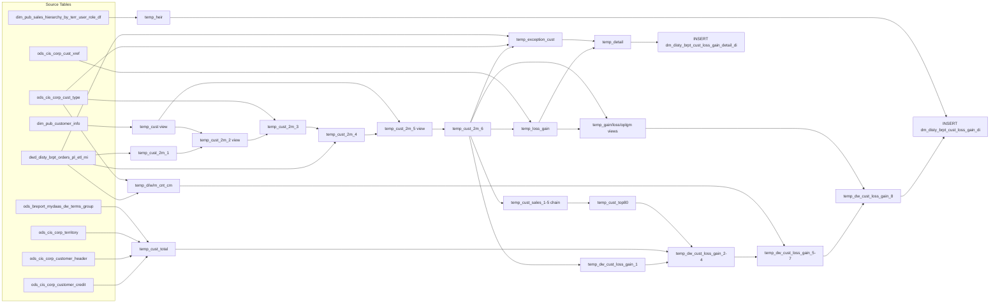

# DM: Customer Loss/Gain & Health Daily (`dm_disty_brpt_cust_loss_gain_di` / `dm_disty_brpt_cust_loss_gain_detail_di`)

- artifact_type: etl_table
- artifact_id: dm_us.dm_disty_brpt_cust_loss_gain_detail_di
- domain: customer
- one_line_purpose: This job produces two daily customer health dashboards. The **summary table** (`dm_disty_brpt_cust_loss_gain_di`) tracks, for every combination of division, customer type, and territory: how many customers were active this month, how many w...
- layer_type: DM
- source_kind: etl_sql
- evidence_source: source/etl/sql/customer/data_service/brpt_patch/python/load_dm_disty_brpt_cust_loss_gain_di.py

---

## L1 Data Foundation

### Identity and physical mapping
- **Table:** `dm_us.dm_disty_brpt_cust_loss_gain_detail_di`
- **Layer type:** DM
- **Canonical / derived:** Derived / ETL-loaded (see L3)
- **Owner team:** not registered in metadata catalog

### Grain, scope, exclusions
- **Grain:** Not documented in repository
- **Scope:** See L2 business purpose / L3 filters
- **Partition:** `date_flag` — business date of the snapshot. - resolved from pipeline (see L4)
- **Natural key:** Not documented in repository
- **Exclusions:** Not documented in repository

#### Grain detail (preserved)

- **`dm_disty_brpt_cust_loss_gain_di` grain:** one row per `(date_flag, division, cust_type, cust_terr)` dimension slice, plus sub-territory group and territory group rollup rows (NULL division/cust_type/cust_terr with terr_sub_group / terr_group).
- **`dm_disty_brpt_cust_loss_gain_detail_di` grain:** one row per `(date_flag, loss_flag, division OR cust_type OR cust_terr, cust_no)`.
- **Partition:** `date_flag` — business date of the snapshot.

---

### Cross-engine presence
| Engine | Present | Canonical FQN | Notes |
|--------|---------|---------------|-------|
| Hive | yes | `dm_disty_brpt_cust_loss_gain_detail_di` | ETL target / intermediate per evidence script |
| Vertica | pending | `dm_disty_brpt_cust_loss_gain_detail_di` | Confirm via hive2vertica flow evidence / MCP |

### Physical schema reference

Pointer block only - full column catalog lives in WKB L1 storage JSON.

| Field | Value |
|-------|-------|
| **Authoritative catalog** | WKB L1 storage seed (not duplicated in this file) |
| **entity_id** | `dm_us.dm_disty_brpt_cust_loss_gain_detail_di` |
| **l1_catalog_seed** | `target/storage/wkb/snapshots/_snapshot_id_template/l1_catalog/{engine}_{schema}_{table}.json` |
| **column_count** | pending (run ddl_seed_writer) |
| **partition_keys** | `date_flag` |
| **ddl_source** | pending Bitbucket DDL / Vertica metadata ingest |
| **retrieval** | `python -m tools.wkb.indexing.run_query --query "customer load_dm_disty_brpt_cust_loss_gain_di schema" --intent find_table_schema` |

### Lineage
| Object | Role |
|--------|------|
| `dw_${country_no}.dwd_disty_brpt_orders_pl_etl_mi` | Primary source — profitability data |
| `dim_${country_no}.dim_pub_customer_info` | Customer type / territory resolution |
| `ods_${country_no}.ods_cis_corp_cust_type` | Division lookup |
| `ods_${country_no}.ods_cis_corp_cust_xref` | Master customer number (mcust_no) resolution |
| `ods_${country_no}.ods_cis_corp_customer_credit` | Credit record — base for cnt_credit/cnt_none_sales |
| `ods_${country_no}.ods_cis_corp_customer_header` | Active/restricted/discontinued customer filter |
| `ods_${country_no}.ods_cis_corp_territory` | Territory/cust_type for credit aggregation |
| `ods_${country_no}.ods_breport_mydaas_dw_terms_group` | NONTERMS classification for credit counts |
| `dim_${country_no}.dim_pub_sales_hierarchy_by_terr_user_role_df` | Territory hierarchy for rollup rows |
| `dm_${country_no}.dm_disty_brpt_cust_loss_gain_di` | **Target 1** — summary KPIs |
| `dm_${country_no}.dm_disty_brpt_cust_loss_gain_detail_di` | **Target 2** — per-customer detail by flag |

---

### Freshness and load path
| Item | Value |
|------|-------|
| Load pattern | See L3 end-to-end / INSERT pattern in evidence script |
| Schedule | Not documented in repository |
| Parameters | `country_no`, `dt_month`, `m_begin`, `date_flag`, `pm_dt_month`, `pm_begin`, `pm_end`, `beg_week` |


---

## L2 Declarative Knowledge

### Business purpose
This job produces two daily customer health dashboards. The **summary table** (`dm_disty_brpt_cust_loss_gain_di`) tracks, for every combination of division, customer type, and territory: how many customers were active this month, how many were gained vs. lost versus the prior month, how many orders had negative or below-2% OPLGM, credit/terms risk counts, top-80% revenue concentration count, and CM order counts across daily/weekly/monthly windows. The **detail table** (`dm_disty_brpt_cust_loss_gain_detail_di`) stores the individual customer-level rows behind each flag (LOSS, GAIN, OPLGM%<0, OPLGM%<2) for drill-through analysis.

---

### Audience and use cases
| Audience | How they benefit |
|----------|-----------------|
| **Sales leadership** | `gain` / `loss` counts and associated revenue to track net customer movement day-over-day at territory and division level. |
| **Finance / FP&A** | OPLGM health counts (`cnt_oplgm_0`, `cnt_oplgm_2`) and associated `loss_nsales` / `loss_ncost` / `loss_cpl` for margin risk monitoring. |
| **Credit / risk teams** | `cnt_credit`, `cnt_none_sales`, `cnt_none_terms` — customers at risk due to credit or inactivity status. |
| **Account management** | `cust_top80_cnt` and `mcust_cnt` — understanding how many master customers sit in the revenue top-80 segment. |
| **Operations / forecast** | `d_cnt_cm`, `w_cnt_cm`, `m_cnt_cm` — CM order velocity at daily, weekly, and monthly windows. |
| **Drill-through analysts** | `dm_disty_brpt_cust_loss_gain_detail_di` — individual customer rows behind each flag for investigation and export. |

---

### Fact key resolution
- Natural key: Not documented in repository
- FK / label-on attributes: see L3 dimension join patterns and step-by-step logic.
- Negative assertion: do not treat descriptive labels as grain keys unless listed under natural key.

### Time field semantics
- **date_flag / partition columns:** `date_flag` — business date of the snapshot.
- Primary reporting filter should use the partition column(s) documented in L1; resolve values via L4.


### Metrics served

| Category | Column | Logical metric | Business reading |
|----------|--------|----------------|------------------|
| Measures | — | — | No measure columns mapped for this table. |

### Metric serving map

**Formula authority:** [`source/contracts/customer/metric-index.md`](../../source/contracts/customer/metric-index.md)

N/A — no measure columns mapped for this table.

### etl_metrics

No governed logical metrics from `source/contracts/customer/metric-index.md` are mapped on this table.

---

### Metric serving map
N/A - not a `*_comb_mtd` / multi-period wide serving table (or map not present in legacy doc).


### Data products and column groups (preserved)

### Summary table — `dm_disty_brpt_cust_loss_gain_di`

**Dimension keys:**
- `division`, `cust_type`, `cust_terr` — NULL in rollup rows
- `terr_sub_group`, `terr_sub_group_desc` — sub-territory group from hierarchy
- `terr_group`, `terr_group_desc` — territory group from hierarchy
- `sid` — row number per date_flag (detail rows only); NULL in rollup rows

**Customer count KPIs:**
- `cust_cnt` — customers active this month (m1=1)
- `mcust_cnt` — distinct master customers active with non-zero sales this month
- `cust_top80_cnt` — count of customers in the top 80% of revenue this month
- `gain` — new customers this month not seen last month
- `loss` — customers from last month not seen this month

**Financial KPIs for gain/loss:**
- `gain_nsales`, `gain_ncost`, `gain_cpl` — revenue, cost, OPLGM for gained customers
- `loss_nsales`, `loss_ncost`, `loss_cpl` — revenue, cost, OPLGM for lost customers

**OPLGM health counts:**
- `cnt_oplgm_0` — customers with negative OPLGM this month
- `cnt_oplgm_2` — customers with OPLGM >= 0 but < 2% this month

**Credit / terms risk counts:**
- `cnt_credit` — customers without credit terms (NONTERMS group)
- `cnt_none_sales` — customers without credit terms AND no purchase in the last 2 months
- `cnt_none_terms` — customers with a terms group assigned

**CM order velocity:**
- `d_cnt_cm` — distinct CM orders (`order_type=14`) today
- `w_cnt_cm` — distinct CM orders WTD (`beg_week` to `date_flag`)
- `m_cnt_cm` — distinct CM orders MTD (`m_begin` to `date_flag`)

### Detail table — `dm_disty_brpt_cust_loss_gain_detail_di`

- `loss_flag` — one of: `LOSS`, `GAIN`, `D_OPLGM%<0`, `D_OPLGM%<2`, `W_OPLGM%<0`, `W_OPLGM%<2`, `OPLGM%<0`, `OPLGM%<2`
- `division`, `cust_type`, `cust_terr` — exactly one is non-null per row (dimension slice)
- `cust_no` — individual customer number
- `nsales`, `ncost`, `cpl` — customer revenue, cost, OPLGM for the period
- `seq` — row number ordered by `loss_flag`

---

### etl_metrics

#### `m_nsales`
- **Source:** [metric-index.md](../../source/contracts/customer/metric-index.md#m_nsales)
- **Business definition:** Net sales for the period.
```sql
nvl(SUM((u_price + nvl(u_sum_expense,0)) * ship_qty), 0)
```

#### `m_ncost`
- **Source:** [metric-index.md](../../source/contracts/customer/metric-index.md#m_ncost)
- **Business definition:** Net cost for the period.
```sql
nvl(SUM((nvl(sales_cost,u_cost) + nvl(u_sum_expense,0)) * ship_qty), 0)
```

#### `m_cpl`
- **Source:** [metric-index.md](../../source/contracts/customer/metric-index.md#m_cpl)
- **Business definition:** OPLGM amount; zero when net sales are zero.
```sql
nvl(SUM(CASE WHEN net_sales=0 THEN 0 ELSE OPLGM_amt END), 0)` as decimal(20,8)
```

#### `cust_type`
- **Source:** [metric-index.md](../../source/contracts/customer/metric-index.md#cust_type)
- **Business definition:** Replaces the -3 placeholder with the actual cust_type from the dimension when available.
```sql
CASE WHEN c2.cust_type IS NOT NULL AND c1.cust_type = -3 THEN c2.cust_type ELSE c1.cust_type END
```

#### `cust_terr`
- **Source:** [metric-index.md](../../source/contracts/customer/metric-index.md#cust_terr)
- **Business definition:** Replaces the -3 placeholder with the actual territory from the dimension when available.
```sql
CASE WHEN c2.cust_no IS NOT NULL AND c1.cust_terr = -3 THEN c2.sales_terr ELSE c1.cust_terr END
```

#### `nsales`
- **Source:** [metric-index.md](../../source/contracts/customer/metric-index.md#nsales)
- **Business definition:** Picks the relevant period's sales depending on which month this customer is active in.
```sql
CASE WHEN SUM(m1)=1 THEN SUM(m_nsales) ELSE SUM(pm_nsales) END
```

#### `mcust_no`
- **Source:** [metric-index.md](../../source/contracts/customer/metric-index.md#mcust_no)
- **Business definition:** Resolves the master customer number via MASTER_SUB xref; falls back to cust_no.
```sql
nvl(b.xref_no, a.cust_no)` when xref match exists
```

#### `cnt_credit`
- **Source:** [metric-index.md](../../source/contracts/customer/metric-index.md#cnt_credit)
- **Business definition:** Customers with no matching NONTERMS entry — effectively no credit terms.
```sql
SUM(CASE WHEN tg.terms_no IS NULL THEN 1 ELSE 0 END)
```

#### `cnt_none_sales`
- **Source:** [metric-index.md](../../source/contracts/customer/metric-index.md#cnt_none_sales)
- **Business definition:** No-credit customers with no purchase in the last 2 months.
```sql
SUM(CASE WHEN tg.terms_no IS NULL AND last_purchase/entry_datetime < add_months(date_flag,-2) THEN 1 ELSE 0 END)
```

#### `cnt_none_terms`
- **Source:** [metric-index.md](../../source/contracts/customer/metric-index.md#cnt_none_terms)
- **Business definition:** Customers who do have a terms group.
```sql
SUM(CASE WHEN tg.terms_no IS NOT NULL THEN 1 ELSE 0 END)
```


---

## L3 Procedural Knowledge

### Query and routing rules
**Business filters:** Use partition / date keys from L1 grain for reporting scope.
**Technical predicates (load only):** See Key filters and step-by-step logic below.

### Dimension join patterns
| Dimension FQN | Join keys | Purpose | Evidence |
|---------------|-----------|---------|----------|
| See step-by-step / base tables | See L3 steps | Dimension enrichment | `source/etl/sql/customer/data_service/brpt_patch/python/load_dm_disty_brpt_cust_loss_gain_di.py` |

### Key filters and ETL business logic
### Step 1 — `temp_cust_2m_1`

**Source:** `dw_${country_no}.dwd_disty_brpt_orders_pl_etl_mi`

**Filter:** `adjust_group = 'normal'` and `order_type >= 0`. Two UNION ALL parts:
- **MTD part:** `dt_month = '${dt_month}'` and `date_flag BETWEEN '${m_begin}' AND '${date_flag}'`
- **Prior month part:** `dt_month = '${pm_dt_month}'` and `date_flag BETWEEN '${pm_begin}' AND '${pm_end}'`

**What happens to columns:**
- `cust_type = -3`, `division = null`, `cust_terr = null` — placeholders; dimension will be resolved in later steps.
- MTD row: `m_nsales`, `m_ncost`, `m_cpl` hold actual values; `pm_*` = 0; `m1 = 1`, `m2 = 0`.
- Prior month row: `pm_nsales`, `pm_ncost`, `pm_cpl` hold actual values; `m_*` = 0; `m1 = 0`, `m2 = 1`.

**Derived columns:**

| Column | Formula | Plain language |
|--------|---------|----------------|
| `m_nsales` | `nvl(SUM((u_price + nvl(u_sum_expense,0)) * ship_qty), 0)` | Net sales for the period. |
| `m_ncost` | `nvl(SUM((nvl(sales_cost,u_cost) + nvl(u_sum_expense,0)) * ship_qty), 0)` | Net cost for the period. |
| `m_cpl` | `nvl(SUM(CASE WHEN net_sales=0 THEN 0 ELSE OPLGM_amt END), 0)` as decimal(20,8) | OPLGM amount; zero when net sales are zero. |
| `m1` / `m2` | Literal 1 or 0 | Flags which month the row belongs to. |

---

### Step 2 — `temp_cust` (view)

**Source:** `dim_${country_no}.dim_pub_customer_info`

**Output:** `cust_no`, `cust_type`, `sales_terr` — one row per unique (cust_no, cust_type, sales_terr) combination from the customer dimension.
...

### Standard time-filter SQL
```sql
-- relative period filter using resolved partition value (see L4)
SELECT *
FROM dm_disty_brpt_cust_loss_gain_detail_di
WHERE /* partition predicate */ date_flag = '${partition_value}';
```

### End-to-end flow
**Runtime parameters:** `country_no`, `dt_month`, `m_begin`, `date_flag`, `pm_dt_month`, `pm_begin`, `pm_end`, `beg_week`
**Target tables:**
- `dm_${country_no}.dm_disty_brpt_cust_loss_gain_di` PARTITION (date_flag)
- `dm_${country_no}.dm_disty_brpt_cust_loss_gain_detail_di` PARTITION (date_flag)

1. Build `temp_cust_2m_1`: aggregate MTD and prior-month net sales/cost/OPLGM per customer from BRPT; use m1/m2 flags to separate months.
2. Build `temp_cust` view: load customer dimension (cust_type, territory) from `dim_pub_customer_info`.
3. Build `temp_cust_2m_2` view: resolve cust_type from dimension when placeholder `-3` is present.
4. Build `temp_cust_2m_3`: UNION ALL with division-level rollup (join `ods_cis_corp_cust_type` for division).
5. Build `temp_cust_2m_4`: UNION ALL with cust_terr-level aggregation (re-read BRPT for MTD and prior month at terr grain).
6. Build `temp_cust_2m_5` view: resolve cust_terr from dimension when placeholder `-3` is present.
7. Build `temp_cust_2m_6`: UNION ALL with Synnex total row (`division=0`, cust_type/terr NULL).
8. Build `temp_exception_cust`: per-customer daily OPLGM aggregation, enriched with division.
9. Build `temp_loss_gain`: classify customers as gained/lost using m1/m2 flags; resolve `mcust_no` via xref table.
10. Build top-80 chain (`temp_cust_sales_1–5`): compute each customer's revenue share (`m_per`) and cumulative rank (`upto_per`) per division, cust_type, and cust_terr.
11. Build `temp_cust_top80`: count customers where `upto_per < 8000` (top 80%).
12. Build `temp_dw_cust_loss_gain_1` view: aggregate `cust_cnt` per dimension slice; stub loss/gain/OPLGM counts as 0.
13. Build `temp_cust_total`: count credit/terms risk customers from ODS credit, header, territory tables.
14. Build `temp_dw_cust_loss_gain_2–3`: merge credit/terms counts; apply grand-total override for `division=0`.
15. Build `temp_dw_cust_loss_gain_4`: add unmatched credit rows from `temp_cust_total`; add `cust_top80_cnt`.
16. Build `temp_d_cnt_cm`, `temp_dw_cust_loss_gain_5`: add daily CM order count.
17. Build `temp_w_cnt_cm`, `temp_dw_cust_loss_gain_6`: add WTD CM order count.
18. Build `temp_m_cnt_cm`, `temp_dw_cust_loss_gain_7`: add MTD CM order count.
19. Build `temp_gain` / `temp_loss` / `temp_oplgm_0` / `temp_oplgm_2`: per-dimension aggregates for each flag.
20. Build `temp_dw_cust_loss_gain_8`: merge gain/loss/OPLGM counts and financials into the main table.
21. Build `temp_heir`: sales territory hierarchy snapshot for `date_flag`.
22. **INSERT** into `dm_disty_brpt_cust_loss_gain_di`: 3-way UNION ALL — detail rows + sub-territory group rollup + territory group rollup.
23. Build `temp_detail`: per-customer rows for all flag types (LOSS/GAIN/OPLGM/daily/weekly/MTD).
24. **INSERT** into `dm_disty_brpt_cust_loss_gain_detail_di`.



---


#### High-level stages (preserved)

| Stage | Business meaning |
|-------|-----------------|
| **Two-month sales base** | Aggregates net sales, net cost, and OPLGM amount per customer for the current month (MTD) and the prior full month, storing each in separate columns with `m1`/`m2` flags. Repeated at cust_type and cust_terr dimension levels. |
| **Customer type resolution** | Enriches cust_type=-3 placeholder rows with actual cust_type from the customer info dimension. |
| **Division rollup** | Builds a division-level aggregation of the two-month data. |
| **Territory resolution** | Resolves cust_terr=-3 rows with actual territory from the customer info dimension. |
| **Synnex total rollup** | Adds a grand-total row (`division=0`, cust_type/terr NULL) for company-wide metrics. |
| **Exception customers** | Identifies customers with any OPLGM issues (negative or below 2%) at daily granularity, enriched with division. |
| **Loss/Gain classification** | Classifies each customer as gained (active this month, not last), lost (active last month, not this), both, or neither. Resolves master customer number (`mcust_no`) via xref. |
| **Top-80 concentration** | Computes each customer's share of total revenue (`m_per`) and their cumulative rank (`upto_per`) to identify the customers making up the top 80% of revenue per dimension slice. |
| **Credit/terms risk counts** | Counts customers by credit status — no credit terms (NONTERMS), no recent purchases (>2 months inactive), no terms group. |
| **CM order counts** | Counts distinct CM orders (`order_type = 14`) for daily, week-to-date, and month-to-date windows. |
| **Territory hierarchy** | Joins the sales territory hierarchy for sub-group and group roll-up rows. |
| **Summary INSERT** | Writes three levels to `dm_disty_brpt_cust_loss_gain_di`: detailed dimension slice, sub-territory group rollup, territory group rollup. |
| **Detail INSERT** | Writes per-customer rows with `loss_flag` values to `dm_disty_brpt_cust_loss_gain_detail_di`. |

**Parameters:** `country_no`, `dt_month`, `m_begin`, `date_flag`, `pm_dt_month`, `pm_begin`, `pm_end`, `beg_week`

---


### Base tables register
| Object | Role in this job |
|--------|-----------------|
| `dw_${country_no}.dwd_disty_brpt_orders_pl_etl_mi` | **Primary source.** Provides `u_price`, `u_cost`, `sales_cost`, `u_sum_expense`, `ship_qty`, `OPLGM_amt`, `cust_no`, `cust_type`, `cust_terr`, `adjust_group`, `dt_month`, `date_flag`, `order_type`. Used in multiple temp tables for MTD/prior-month/CM-count aggregations. |
| `dim_${country_no}.dim_pub_customer_info` | Customer dimension — provides `cust_no`, `cust_type`, `sales_terr` to resolve placeholder -3 values. |
| `ods_${country_no}.ods_cis_corp_cust_type` | Customer type dimension — maps `cust_type` to `division`. |
| `ods_${country_no}.ods_cis_corp_cust_xref` | Customer cross-reference — resolves `mcust_no` via `xref_type = 'MASTER_SUB'` and `active = 'Y'`. |
| `ods_${country_no}.ods_cis_corp_customer_credit` | Credit table — source of `cnt_credit` and `cnt_none_sales` counts; active (delete_datetime IS NULL) customers. |
| `ods_${country_no}.ods_cis_corp_customer_header` | Customer header — provides restriction/discontinuation flags; active customers only (`restricted='N'`, `discontinued='N'`). |
| `ods_${country_no}.ods_cis_corp_territory` | Territory — provides `cust_type` override and `sales_terr` for credit count aggregation. |
| `ods_${country_no}.ods_breport_mydaas_dw_terms_group` | Terms group reference — `terms_type = 'NONTERMS'` identifies no-terms customers for `cnt_credit` / `cnt_none_terms`. |
| `dim_${country_no}.dim_pub_sales_hierarchy_by_terr_user_role_df` | Sales hierarchy snapshot — provides `sub_group_id`, `sub_group_desc`, `group_id`, `group_desc` for rollup rows; filtered to `date_flag`. |

**Temporary tables (inside the job only):**
`temp_cust_2m_1` → `temp_cust_2m_2` → `temp_cust_2m_3` → `temp_cust_2m_4` → `temp_cust_2m_5` → `temp_cust_2m_6` → (`temp_exception_cust`, `temp_loss_gain`, `temp_cust_sales_1–5`) → `temp_cust_top80` → `temp_dw_cust_loss_gain_1` → `temp_cust_total` → `temp_dw_cust_loss_gain_2–4` → (`temp_d_cnt_cm` → `temp_dw_cust_loss_gain_5`) → (`temp_w_cnt_cm` → `temp_dw_cust_loss_gain_6`) → (`temp_m_cnt_cm` → `temp_dw_cust_loss_gain_7`) → (`temp_gain`, `temp_loss`, `temp_oplgm_0`, `temp_oplgm_2`) → `temp_dw_cust_loss_gain_8` → `temp_heir` → (final INSERTs)

---

### Step-by-step logic
### Step 1 — `temp_cust_2m_1`

**Source:** `dw_${country_no}.dwd_disty_brpt_orders_pl_etl_mi`

**Filter:** `adjust_group = 'normal'` and `order_type >= 0`. Two UNION ALL parts:
- **MTD part:** `dt_month = '${dt_month}'` and `date_flag BETWEEN '${m_begin}' AND '${date_flag}'`
- **Prior month part:** `dt_month = '${pm_dt_month}'` and `date_flag BETWEEN '${pm_begin}' AND '${pm_end}'`

**What happens to columns:**
- `cust_type = -3`, `division = null`, `cust_terr = null` — placeholders; dimension will be resolved in later steps.
- MTD row: `m_nsales`, `m_ncost`, `m_cpl` hold actual values; `pm_*` = 0; `m1 = 1`, `m2 = 0`.
- Prior month row: `pm_nsales`, `pm_ncost`, `pm_cpl` hold actual values; `m_*` = 0; `m1 = 0`, `m2 = 1`.

**Derived columns:**

| Column | Formula | Plain language |
|--------|---------|----------------|
| `m_nsales` | `nvl(SUM((u_price + nvl(u_sum_expense,0)) * ship_qty), 0)` | Net sales for the period. |
| `m_ncost` | `nvl(SUM((nvl(sales_cost,u_cost) + nvl(u_sum_expense,0)) * ship_qty), 0)` | Net cost for the period. |
| `m_cpl` | `nvl(SUM(CASE WHEN net_sales=0 THEN 0 ELSE OPLGM_amt END), 0)` as decimal(20,8) | OPLGM amount; zero when net sales are zero. |
| `m1` / `m2` | Literal 1 or 0 | Flags which month the row belongs to. |

---

### Step 2 — `temp_cust` (view)

**Source:** `dim_${country_no}.dim_pub_customer_info`

**Output:** `cust_no`, `cust_type`, `sales_terr` — one row per unique (cust_no, cust_type, sales_terr) combination from the customer dimension.

---

### Step 3 — `temp_cust_2m_2` (view)

**Source:** `temp_cust_2m_1` LEFT JOIN `temp_cust` on `cust_no`

**Derived columns:**

| Column | Logic | Plain language |
|--------|-------|----------------|
| `cust_type` | `CASE WHEN c2.cust_type IS NOT NULL AND c1.cust_type = -3 THEN c2.cust_type ELSE c1.cust_type END` | Replaces the -3 placeholder with the actual cust_type from the dimension when available. |

---

### Step 4 — `temp_cust_2m_3`

**Source:** `temp_cust_2m_2` UNION ALL division rollup

**Division rollup part:** Groups `temp_cust_2m_2` by `(nvl(dgt.division,-3), cust_no)`, LEFT JOINing `ods_cis_corp_cust_type` on `m.cust_type = dgt.cust_type`. Sets `cust_type = null`, `cust_terr = null`. SUMs all financial fields; `m1`/`m2` flags become 1 if `SUM(m1/m2) > 0`.

---

### Step 5 — `temp_cust_2m_4`

**Source:** `temp_cust_2m_3` UNION ALL cust_terr-level aggregation (re-reads BRPT directly, same filters as Step 1 but grouped by `nvl(cust_no,-3)` with `cust_terr=-3`, `division=null`, `cust_type=null`).

---

### Step 6 — `temp_cust_2m_5` (view)

**Source:** `temp_cust_2m_4` LEFT JOIN `temp_cust` on `cust_no`

**Derived columns:**

| Column | Logic | Plain language |
|--------|-------|----------------|
| `cust_terr` | `CASE WHEN c2.cust_no IS NOT NULL AND c1.cust_terr = -3 THEN c2.sales_terr ELSE c1.cust_terr END` | Replaces the -3 placeholder with the actual territory from the dimension when available. |

---

### Step 7 — `temp_cust_2m_6`

**Source:** `temp_cust_2m_5` UNION ALL Synnex total

**Synnex total part:** Aggregates `temp_cust_2m_5 WHERE cust_type IS NULL AND cust_terr IS NULL` grouped by `cust_no`, with `division = 0` — a company-wide total row per customer.

---

### Step 8 — `temp_exception_cust`

**Source:** `dwd_disty_brpt_orders_pl_etl_mi` CTE, LEFT JOIN `ods_cis_corp_cust_type`

**Filter:** `dt_month = '${dt_month}'`, `date_flag BETWEEN '${m_begin}' AND '${date_flag}'`, `adjust_group = 'normal'`, `order_type >= 0`. Grouped by `(date_flag, cust_type, cust_terr, cust_no)`.

**Purpose:** Stores daily-granularity OPLGM aggregates per customer so `temp_detail` can slice by daily/weekly/monthly time windows using `date_flag` filters.

---

### Step 9 — `temp_loss_gain`

**Source:** CTE on `temp_cust_2m_6`, LEFT JOIN `ods_cis_corp_cust_xref`

**Logic:** Aggregates per `(division, cust_type, cust_terr, cust_no)`. The financial columns (`nsales`, `ncost`, `cpl`) take the MTD values when `m1=1`, otherwise the prior-month values.

**Derived columns:**

| Column | Logic | Plain language |
|--------|-------|----------------|
| `nsales` | `CASE WHEN SUM(m1)=1 THEN SUM(m_nsales) ELSE SUM(pm_nsales) END` | Picks the relevant period's sales depending on which month this customer is active in. |
| `mcust_no` | `nvl(b.xref_no, a.cust_no)` when xref match exists | Resolves the master customer number via MASTER_SUB xref; falls back to cust_no. |

---

### Steps 10–11 — `temp_cust_sales_1–5` (top-80 chain)

**Purpose:** Computes each customer's revenue share (`m_per = cust_sales / total_sales * 10000`, in basis points) and cumulative revenue contribution (`upto_per`) within each dimension slice (division, cust_type, cust_terr computed in separate passes — steps 3, 4, 5 of this chain). Only customers with `m1=1` (active this month) are included.

**`temp_cust_sales_2`:** `m_per = COALESCE(t.m_nsales * 10000 / NULLIF(s.m_nsales, 0), 0)` per customer, left-joined to total sales where total > 0.

**`temp_cust_sales_3/4/5`:** Each pass computes `upto_per` for one dimension key (division → cust_type → cust_terr) using a self-join: `SUM(b.m_per)` where `b.m_per > a.m_per OR (b.m_per = a.m_per AND b.cust_no >= a.cust_no)` — effectively a cumulative sum ordered by revenue share descending.

---

### Step 12 — `temp_cust_top80` (view)

**Source:** `temp_cust_sales_5`

**Filter:** `upto_per < 8000` (customers in top 80% — stored as basis points, so 8000 = 80%) and `m_nsales > 0`.

**Output:** `COUNT(*)` as `m_top80_cnt` per `(division, cust_type, cust_terr)`.

---

### Step 13 — `temp_dw_cust_loss_gain_1` (view)

**Source:** `temp_loss_gain` LEFT JOIN `ods_cis_corp_customer_credit`

**Output per `(date_flag, division, cust_type, cust_terr)`:**
- `cust_cnt` = count of customers where `m1 = 1`
- `cust_top80_cnt` = MAX(1 if active with non-zero sales, else 0)
- `mcust_cnt` = COUNT(DISTINCT mcust_no where active+non-zero sales) minus 1 if any non-active rows exist
- All loss/gain/OPLGM/credit counts initialized to **0** (to be filled in later steps)

---

### Step 14 — `temp_cust_total`

**Source:** `ods_cis_corp_customer_credit` INNER JOIN `ods_cis_corp_customer_header` INNER JOIN `ods_cis_corp_territory` INNER JOIN `ods_cis_corp_cust_type` LEFT JOIN `ods_breport_mydaas_dw_terms_group`

**Filters:**
- `cc.delete_datetime IS NULL` — active credit records
- `nvl(ch.restricted, 'N') = 'N'` and `nvl(ch.discontinued, 'N') = 'N'` — active, non-restricted customers
- Terms join: `tg.terms_type = 'NONTERMS'` and `ch.default_terms = trim(tg.terms_no)`

**Derived columns:**

| Column | Logic | Plain language |
|--------|-------|----------------|
| `cnt_credit` | `SUM(CASE WHEN tg.terms_no IS NULL THEN 1 ELSE 0 END)` | Customers with no matching NONTERMS entry — effectively no credit terms. |
| `cnt_none_sales` | `SUM(CASE WHEN tg.terms_no IS NULL AND last_purchase/entry_datetime < add_months(date_flag,-2) THEN 1 ELSE 0 END)` | No-credit customers with no purchase in the last 2 months. |
| `cnt_none_terms` | `SUM(CASE WHEN tg.terms_no IS NOT NULL THEN 1 ELSE 0 END)` | Customers who do have a terms group. |

---

### Steps 15–16 — `temp_dw_cust_loss_gain_2` and `temp_dw_cust_loss_gain_3`

**Step 2:** Merges `temp_cust_total` credit/terms counts into `temp_dw_cust_loss_gain_1` via a left join on matching `(cust_type OR division OR cust_terr)`. Uses `COALESCE(b.cnt_credit, a.cnt_credit)`.

**Step 3:** For rows where `division = 0` (Synnex total), replaces `cnt_credit`, `cnt_none_sales`, `cnt_none_terms` with the grand sum across all of `temp_cust_total` via a `CROSS JOIN` CTE.

---

### Step 17 — `temp_dw_cust_loss_gain_4`

**Source:** `temp_dw_cust_loss_gain_3` UNION ALL rows from `temp_cust_total` not yet covered. Then LEFT JOIN `temp_cust_top80` to add `m_top80_cnt` to `cust_top80_cnt`.

**Not-yet-covered rows:** Rows from `temp_cust_total` where no match exists in `temp_dw_cust_loss_gain_3` on `(cust_type OR division OR sales_terr)`. These are written with all sales/gain/loss counts = 0.

---

### Steps 18–20 — CM order count chain (`temp_d/w/m_cnt_cm` → `temp_dw_cust_loss_gain_5/6/7`)

**Source for counts:** `dwd_disty_brpt_orders_pl_etl_mi` INNER JOIN `ods_cis_corp_cust_type` — filters to `order_type = 14` and `adjust_group = 'normal'`. Three separate aggregations:
- `temp_d_cnt_cm`: `d.date_flag = '${date_flag}'` — daily CM orders
- `temp_w_cnt_cm`: `date_flag BETWEEN '${beg_week}' AND '${date_flag}'` — WTD CM orders
- `temp_m_cnt_cm`: `date_flag BETWEEN '${m_begin}' AND '${date_flag}'` — MTD CM orders

Each is joined into the main table with `LEFT JOIN ... ON (division=0 OR division match OR cust_type match OR cust_terr match)` and `SUM(count)` grouped to collapse the multi-join fan-out.

---

### Step 21 — `temp_gain`, `temp_loss`, `temp_oplgm_0`, `temp_oplgm_2`

**Source:** `temp_loss_gain`

| View | Filter | Purpose |
|------|--------|---------|
| `temp_gain` | `m1=1 AND m2=0` | Customers active this month, not last = gained |
| `temp_loss` | `m1=0 AND m2=1` | Customers active last month, not this = lost |
| `temp_oplgm_0` | `m1=1 AND cpl < 0` | Active customers with negative OPLGM |
| `temp_oplgm_2` | `m1=1 AND cpl >= 0 AND OPLGM% < 2` | Active customers with 0–2% OPLGM |

Each returns `(division, cust_type, cust_terr, cnt, nsales, ncost, cpl)` per dimension slice.

---

### Step 22 — `temp_dw_cust_loss_gain_8`

**Source:** `temp_dw_cust_loss_gain_7` → LEFT JOIN `temp_gain` → LEFT JOIN `temp_loss` → LEFT JOIN `temp_oplgm_0` → LEFT JOIN `temp_oplgm_2`

**Logic:** For each join, fills the corresponding stub column (gain/loss/cnt_oplgm_0/cnt_oplgm_2) only when all three dimension keys match (using `nvl(...,-3)` to handle NULLs). If no match, the 0 stub from step 13 is kept.

---

### Step 23 — `temp_heir`

**Source:** `dim_${country_no}.dim_pub_sales_hierarchy_by_terr_user_role_df`

**Filter:** `date_flag = '${date_flag}'`

**Output:** `DISTINCT (date_flag, sales_terr, sub_group_id AS terr_sub_group, sub_group_desc, group_id AS terr_group, group_desc AS terr_group_desc)`

---

### Step 24 — Final `INSERT` into `dm_disty_brpt_cust_loss_gain_di`

**From:** `temp_dw_cust_loss_gain_8` LEFT JOIN `temp_heir` on `cust_terr = sales_terr AND date_flag`

**Three UNION ALL parts:**

1. **Detail rows** — all dimension columns non-null; territory hierarchy columns set only when all three of `(division, cust_type, cust_terr)` are non-null. `sid = ROW_NUMBER() OVER (ORDER BY date_flag)`.
2. **Sub-territory group rollup** — filtered to `division IS NULL AND cust_type IS NULL AND cust_terr IS NOT NULL`; grouped by `(terr_sub_group, terr_sub_group_desc, date_flag)`; SUMs all metrics; `division/cust_type/cust_terr/terr_group/sid = NULL`.
3. **Territory group rollup** — same filter; grouped by `(terr_group, terr_group_desc, date_flag)`; `division/cust_type/cust_terr/terr_sub_group/sid = NULL`.

---

### Step 25 — `temp_detail`

**Source:** `temp_loss_gain` and `temp_exception_cust`

Union of 12 parts covering:
- `LOSS` (m1=0, m2=1) and `GAIN` (m1=1, m2=0) from `temp_loss_gain` — MTD grain
- `D_OPLGM%<0` / `D_OPLGM%<2` — today's date, by division / cust_type / cust_terr slices from `temp_exception_cust`
- `W_OPLGM%<0` / `W_OPLGM%<2` — WTD (`beg_week` to `date_flag`)
- `OPLGM%<0` / `OPLGM%<2` — MTD from `temp_loss_gain` (m1=1, cpl<0 or 0<=OPLGM%<2)

---

### Step 26 — Final `INSERT` into `dm_disty_brpt_cust_loss_gain_detail_di`

**From:** `temp_detail`

**Derived columns:**

| Column | Formula | Plain language |
|--------|---------|----------------|
| `seq` | `ROW_NUMBER() OVER (ORDER BY loss_flag)` | Row sequence within the partition ordered by flag type. |

---

### Relationship map (embedded)

| from_fqn | to_fqn | cardinality | join_keys | provenance |
|----------|--------|-------------|-----------|------------|
| `temp_cust_2m_1` | `temp_cust` | many:1 | `c1.cust_no=c2.cust_no` | etl_sql (source/etl/sql/customer/data_service/brpt_patch/python/load_dm_disty_brpt_cust_loss_gain_di.py:69) |
| `temp_cust_2m_2` | `ods_${country_no}.ods_cis_corp_cust_type` | many:1 | `m.cust_type = dgt.cust_type` | etl_sql (source/etl/sql/customer/data_service/brpt_patch/python/load_dm_disty_brpt_cust_loss_gain_di.py:90) |
| `temp_cust_2m_4` | `temp_cust` | many:1 | `c1.cust_no=c2.cust_no` | etl_sql (source/etl/sql/customer/data_service/brpt_patch/python/load_dm_disty_brpt_cust_loss_gain_di.py:177) |
| `temp_tab_1` | `ods_${country_no}.ods_cis_corp_cust_type` | many:1 | `exp.cust_type = dgt.cust_type` | etl_sql (source/etl/sql/customer/data_service/brpt_patch/python/load_dm_disty_brpt_cust_loss_gain_di.py:228) |
| `temp_tab_1` | `ods_${country_no}.ods_cis_corp_cust_xref` | many:1 | `a.cust_no = b.cust_no AND b.xref_type = 'MASTER_SUB' AND nvl(b.active, 'Y') = 'Y'` | etl_sql (source/etl/sql/customer/data_service/brpt_patch/python/load_dm_disty_brpt_cust_loss_gain_di.py:269) |
| `—` | `temp_cust_sales_2` | many:1 | `(b.m_per > a.m_per OR (b.m_per = a.m_per AND b.cust_no >= a.cust_no)) AND a.division = b.division` | etl_sql (source/etl/sql/customer/data_service/brpt_patch/python/load_dm_disty_brpt_cust_loss_gain_di.py:381) |
| `—` | `temp_cust_sales_3` | many:1 | `(b.m_per > a.m_per OR (b.m_per = a.m_per AND b.cust_no >= a.cust_no)) AND a.cust_type = b.cust_type` | etl_sql (source/etl/sql/customer/data_service/brpt_patch/python/load_dm_disty_brpt_cust_loss_gain_di.py:413) |
| `—` | `temp_cust_sales_4` | many:1 | `(b.m_per > a.m_per OR (b.m_per = a.m_per AND b.cust_no >= a.cust_no)) AND a.cust_terr = b.cust_terr` | etl_sql (source/etl/sql/customer/data_service/brpt_patch/python/load_dm_disty_brpt_cust_loss_gain_di.py:445) |
| `temp_loss_gain` | `ods_${country_no}.ods_cis_corp_customer_credit` | many:1 | `lg.cust_no = credit.cust_no` | etl_sql (source/etl/sql/customer/data_service/brpt_patch/python/load_dm_disty_brpt_cust_loss_gain_di.py:497) |
| `ods_${country_no}.ods_cis_corp_customer_credit` | `ods_${country_no}.ods_cis_corp_customer_header` | many:1 | `cc.cust_no = ch.cust_no AND nvl(ch.restricted, 'N') = 'N' AND nvl(ch.discontinued, 'N') = 'N'` | etl_sql (source/etl/sql/customer/data_service/brpt_patch/python/load_dm_disty_brpt_cust_loss_gain_di.py:552) |
| `ods_${country_no}.ods_cis_corp_customer_header` | `ods_${country_no}.ods_cis_corp_territory` | many:1 | `ch.sales_terr = terr.sales_terr` | etl_sql (source/etl/sql/customer/data_service/brpt_patch/python/load_dm_disty_brpt_cust_loss_gain_di.py:552) |
| `ods_${country_no}.ods_cis_corp_territory` | `ods_${country_no}.ods_cis_corp_cust_type` | many:1 | `nvl(terr.cust_type, ch.cust_type) = dgt.cust_type` | etl_sql (source/etl/sql/customer/data_service/brpt_patch/python/load_dm_disty_brpt_cust_loss_gain_di.py:552) |
| `ods_${country_no}.ods_cis_corp_customer_header` | `ods_${country_no}.ods_breport_mydaas_dw_terms_group` | many:1 | `ch.default_terms = trim(tg.terms_no) AND tg.terms_type = 'NONTERMS'` | etl_sql (source/etl/sql/customer/data_service/brpt_patch/python/load_dm_disty_brpt_cust_loss_gain_di.py:552) |
| `temp_dw_cust_loss_gain_1` | `temp_cust_total` | many:1 | `gain.cust_type = ct.cust_type OR gain.division = ct.division OR gain.cust_terr = ct.sales_terr` | etl_sql (source/etl/sql/customer/data_service/brpt_patch/python/load_dm_disty_brpt_cust_loss_gain_di.py:591) |
| `temp_dw_cust_loss_gain_1` | `temp_tab_1` | many:1 | `a.cust_type = b.cust_type or a.division = b.division or a.cust_terr = b.cust_terr` | etl_sql (source/etl/sql/customer/data_service/brpt_patch/python/load_dm_disty_brpt_cust_loss_gain_di.py:591) |
| `temp_tab_1` | `temp_cust_top80` | many:1 | `los.division = top.division OR los.cust_type = top.cust_type OR los.cust_terr = top.cust_terr` | etl_sql (source/etl/sql/customer/data_service/brpt_patch/python/load_dm_disty_brpt_cust_loss_gain_di.py:688) |
| `dw_${country_no}.dwd_disty_brpt_orders_pl_etl_mi` | `ods_${country_no}.ods_cis_corp_cust_type` | many:1 | `d.cust_type = ct.cust_type AND dt_month = '${dt_month}' AND adjust_group = 'normal' AND d.date_flag = '${date_flag}' AND order_type = 14` | etl_sql (source/etl/sql/customer/data_service/brpt_patch/python/load_dm_disty_brpt_cust_loss_gain_di.py:750) |
| `temp_dw_cust_loss_gain_4` | `temp_tab_1` | many:1 | `(d.division = 0 OR d.division = dcc.division OR d.cust_type = dcc.cust_type OR d.cust_terr = dcc.cust_terr) )` | etl_sql (source/etl/sql/customer/data_service/brpt_patch/python/load_dm_disty_brpt_cust_loss_gain_di.py:768) |
| `dw_${country_no}.dwd_disty_brpt_orders_pl_etl_mi` | `ods_${country_no}.ods_cis_corp_cust_type` | many:1 | `d.cust_type = ct.cust_type` | etl_sql (source/etl/sql/customer/data_service/brpt_patch/python/load_dm_disty_brpt_cust_loss_gain_di.py:858) |
| `temp_dw_cust_loss_gain_5` | `temp_tab_1` | many:1 | `(d.division = 0 OR d.division = dcc.division OR d.cust_type = dcc.cust_type OR d.cust_terr = dcc.cust_terr) )` | etl_sql (source/etl/sql/customer/data_service/brpt_patch/python/load_dm_disty_brpt_cust_loss_gain_di.py:877) |
| `temp_dw_cust_loss_gain_6` | `temp_tab_1` | many:1 | `(d.division = 0 OR d.division = dcc.division OR d.cust_type = dcc.cust_type OR d.cust_terr = dcc.cust_terr) )` | etl_sql (source/etl/sql/customer/data_service/brpt_patch/python/load_dm_disty_brpt_cust_loss_gain_di.py:989) |
| `temp_tab_2` | `temp_gain` | many:1 | `nvl(a.division, -3) = nvl(b.division, -3) AND nvl(a.cust_type, -3) = nvl(b.cust_type, -3) AND nvl(a.cust_terr, -3) = nvl(b.cust_terr, -3)), temp_tab_2 as (` | etl_sql (source/etl/sql/customer/data_service/brpt_patch/python/load_dm_disty_brpt_cust_loss_gain_di.py:1160) |
| `temp_tab_2` | `temp_loss` | many:1 | `nvl(a.division, -3) = nvl(b.division, -3) AND nvl(a.cust_type, -3) = nvl(b.cust_type, -3) AND nvl(a.cust_terr, -3) = nvl(b.cust_terr, -3) )` | etl_sql (source/etl/sql/customer/data_service/brpt_patch/python/load_dm_disty_brpt_cust_loss_gain_di.py:1160) |
| `temp_tab_2` | `temp_oplgm_0` | many:1 | `nvl(a.division, -3) = nvl(b.division, -3) AND nvl(a.cust_type, -3) = nvl(b.cust_type, -3) AND nvl(a.cust_terr, -3) = nvl(b.cust_terr, -3)` | etl_sql (source/etl/sql/customer/data_service/brpt_patch/python/load_dm_disty_brpt_cust_loss_gain_di.py:1160) |
| `temp_tab_2` | `temp_oplgm_2` | many:1 | `nvl(a.division, -3) = nvl(b1.division, -3) AND nvl(a.cust_type, -3) = nvl(b1.cust_type, -3) AND nvl(a.cust_terr, -3) = nvl(b1.cust_terr, -3)` | etl_sql (source/etl/sql/customer/data_service/brpt_patch/python/load_dm_disty_brpt_cust_loss_gain_di.py:1160) |
| `temp_dw_cust_loss_gain_8` | `temp_heir` | many:1 | `a.cust_terr = b.sales_terr AND a.date_flag = b.date_flag` | etl_sql (source/etl/sql/customer/data_service/brpt_patch/python/load_dm_disty_brpt_cust_loss_gain_di.py:1297) |

`source/ref/customer/table relationship.txt`: Not documented in repository.

### Special logic (embedded)

Not documented in repository

### Column / field derivations (from ETL SQL)

| target_column | expression_sql | upstream_columns | upstream_tables | transform_kind | evidence |
|---------------|----------------|------------------|-----------------|----------------|----------|
| `loss_flag` | `loss_flag` | `loss_flag` | `temp_detail` | passthrough | `source/etl/sql/customer/data_service/brpt_patch/python/load_dm_disty_brpt_cust_loss_gain_di.py:1440` |
| `division` | `division` | `division` | `temp_detail` | passthrough | `source/etl/sql/customer/data_service/brpt_patch/python/load_dm_disty_brpt_cust_loss_gain_di.py:9` |
| `cust_type` | `cust_type` | `cust_type` | `temp_detail` | passthrough | `source/etl/sql/customer/data_service/brpt_patch/python/load_dm_disty_brpt_cust_loss_gain_di.py:6` |
| `cust_terr` | `cust_terr` | `cust_terr` | `temp_detail` | passthrough | `source/etl/sql/customer/data_service/brpt_patch/python/load_dm_disty_brpt_cust_loss_gain_di.py:11` |
| `cust_no` | `cust_no` | `cust_no` | `temp_detail` | passthrough | `source/etl/sql/customer/data_service/brpt_patch/python/load_dm_disty_brpt_cust_loss_gain_di.py:12` |
| `nsales` | `nsales` | `nsales` | `temp_detail` | passthrough | `source/etl/sql/customer/data_service/brpt_patch/python/load_dm_disty_brpt_cust_loss_gain_di.py:13` |
| `ncost` | `ncost` | `ncost` | `temp_detail` | passthrough | `source/etl/sql/customer/data_service/brpt_patch/python/load_dm_disty_brpt_cust_loss_gain_di.py:14` |
| `cpl` | `cpl` | `cpl` | `temp_detail` | passthrough | `source/etl/sql/customer/data_service/brpt_patch/python/load_dm_disty_brpt_cust_loss_gain_di.py:18` |
| `seq` | `row_number() over(order by loss_flag)` | `loss_flag` | `temp_detail` | window | `source/etl/sql/customer/data_service/brpt_patch/python/load_dm_disty_brpt_cust_loss_gain_di.py:1751` |
| `date_flag` | `date_flag` | `date_flag` | `temp_detail` | passthrough | `source/etl/sql/customer/data_service/brpt_patch/python/load_dm_disty_brpt_cust_loss_gain_di.py:26` |

### Sentinel and code values
| Value | Meaning |
|-------|---------|
| `m1 = 1` | Customer had activity in the current month (MTD window). |
| `m2 = 1` | Customer had activity in the prior month. |
| `m1=1, m2=0` | **Gained** — active this month, not last. |
| `m1=0, m2=1` | **Lost** — active last month, not this. |
| `cust_type = -3` | Placeholder — cust_type not yet resolved; replaced from dimension in later steps. |
| `division = 0` | Synnex grand total row. |
| `division = -3` | Unknown / unresolvable division. |
| `order_type = 14` | CM (Credit Memo) orders — used for d/w/m_cnt_cm counts. |
| `adjust_group = 'normal'` | Only normal transactions; adjustments excluded. |
| `upto_per < 8000` | Top 80% threshold — stored in basis points (8000 = 80.00%). |
| `xref_type = 'MASTER_SUB'` | Identifies the master-subsidiary customer relationship in xref. |
| `terms_type = 'NONTERMS'` | Identifies customers classified as having no terms in the terms group table. |

---

---

## L4 Validation

### Resolved partition value
| Step | Source | How partition / date scope is determined |
|------|--------|------------------------------------------|
| 1 | evidence script / flow | See parameters in L1 Freshness and L3 filters - `source/etl/sql/customer/data_service/brpt_patch/python/load_dm_disty_brpt_cust_loss_gain_di.py` |

**Plain language:** Partition and date scope follow Azkaban/bootstrap parameters documented in the source script and orchestrating flow; do not hardcode calendar literals.

### Data quality checks
- Prefer row-count-by-partition, metric sums, and grain duplicate checks (see Validation SQL).
- Additional checks from legacy caveats / operational notes when present.

### Validation SQL
```sql
-- 1) Row count by partition
SELECT ${partition_col}, COUNT(*) AS row_cnt
FROM dm_${country_no}.dm_disty_brpt_cust_loss_gain_di
WHERE ${partition_col} = '${partition_value}'
GROUP BY ${partition_col};

-- 2) Metric sum by business dimension (top deltas)
SELECT ${dim_key}, SUM(${metric}) AS metric_sum
FROM dm_${country_no}.dm_disty_brpt_cust_loss_gain_di
WHERE ${partition_col} = '${partition_value}'
GROUP BY ${dim_key}
ORDER BY ABS(SUM(${metric})) DESC
LIMIT 20;

-- 3) Grain duplicate check
SELECT ${grain_key_1}, ${grain_key_2}, ${grain_key_3}, ${partition_col}, COUNT(*) AS cnt
FROM dm_${country_no}.dm_disty_brpt_cust_loss_gain_di
WHERE ${partition_col} = '${partition_value}'
GROUP BY ${grain_key_1}, ${grain_key_2}, ${grain_key_3}, ${partition_col}
HAVING COUNT(*) > 1;
```

Replace placeholders from this file's Grain and keys / Data you can fetch sections, and use the resolved partition value from run scope.

### Caveats for interpretation
- **Multi-dimensional join fan-out:** Several joins use `OR` across `(division, cust_type, cust_terr)` rather than exact key equality. This means a single `temp_cust_total` row can match multiple dimension slices, and the subsequent `SUM()` GROUP BY is required to collapse the duplicates. Results must be interpreted at the grain of the final GROUP BY.
- **`division = 0` is the Synnex grand total**, not division code 0. It is produced by a separate UNION branch in `temp_cust_2m_6` and should not be confused with a real division.
- **`cpl` in `temp_loss_gain`** is the OPLGM amount (dollar value), not a percentage. The `cnt_oplgm_0` / `cnt_oplgm_2` counts use `cpl < 0` and `OPLGM% < 2` thresholds respectively.
- **`loss_flag = 'OPLGM%<0'` vs `'D_OPLGM%<0'`:** MTD OPLGM flags in `temp_detail` come from `temp_loss_gain` (MTD aggregated per customer); daily/weekly flags come from `temp_exception_cust` (per-day grain re-aggregated by window).
- **`top-80 upto_per`** uses basis points (×10000) to preserve precision. The threshold `upto_per < 8000` equals 80%.
- **Credit counts** (`cnt_credit`, `cnt_none_sales`, `cnt_none_terms`) come from ODS customer tables, not from the BRPT profitability source. Customers may appear in credit counts but not in the BRPT-based sales data, which is why `temp_dw_cust_loss_gain_4` adds the unmatched credit rows.

---

### Conflicts and open questions
- Schedule, owner, SLA: Not documented in repository (unless preserved schedule evidence above).
- Vertica MCP verification: pending unless confirmed in L5.


---

## L5 Runtime View

### Query path and engine preference
| Role | Hive object | Vertica object | Sync mode | Evidence | MCP verified |
|------|-------------|----------------|-----------|----------|--------------|
| **Query for reporting** | *See script lineage* | `dm_${country_no}.dm_disty_brpt_cust_loss_gain_di` | *Verify from flow* | *Add flow file:line* | pending |
| **Hive alternative** | `*` | `dm_${country_no}.dm_disty_brpt_cust_loss_gain_di` | - | *See dependencies* | - |
| **ETL internal** | staging/temp tables | *Not synced to Vertica* | - | *See step-by-step logic* | - |

Business users should query `dm_${country_no}.dm_disty_brpt_cust_loss_gain_di` in Vertica once MCP verification is completed for this document.

### Access constraints
- Country / company schema parameters may apply (`literal_country`, `company_no`, etc.).
- Hive-only staging objects are not reporting surfaces unless synced.

### Query risk profile
| Field | Value |
|-------|-------|
| requires_date_predicate | yes |
| scan_risk_tier | medium |

---

## L6 Access and Consumption

### Primary consumers and use cases
| Audience | How they benefit |
|----------|-----------------|
| **Sales leadership** | `gain` / `loss` counts and associated revenue to track net customer movement day-over-day at territory and division level. |
| **Finance / FP&A** | OPLGM health counts (`cnt_oplgm_0`, `cnt_oplgm_2`) and associated `loss_nsales` / `loss_ncost` / `loss_cpl` for margin risk monitoring. |
| **Credit / risk teams** | `cnt_credit`, `cnt_none_sales`, `cnt_none_terms` — customers at risk due to credit or inactivity status. |
| **Account management** | `cust_top80_cnt` and `mcust_cnt` — understanding how many master customers sit in the revenue top-80 segment. |
| **Operations / forecast** | `d_cnt_cm`, `w_cnt_cm`, `m_cnt_cm` — CM order velocity at daily, weekly, and monthly windows. |
| **Drill-through analysts** | `dm_disty_brpt_cust_loss_gain_detail_di` — individual customer rows behind each flag for investigation and export. |

---

### Representative query patterns
```sql
-- certified / illustrative lookup - replace predicates from L1/L4
SELECT *
FROM dm_disty_brpt_cust_loss_gain_detail_di
WHERE date_flag = '${partition_value}'
LIMIT 100;
```

### Dependencies and notes
### Upstream objects (verified)

| Object | Usage | Evidence |
|--------|-------|----------|
| `dw_${country_no}.dwd_disty_brpt_orders_pl_etl_mi` | MTD/PM sales, OPLGM, CM orders | `load_dm_disty_brpt_cust_loss_gain_di.py:24,49,143,168,757,864,976` |
| `dim_${country_no}.dim_pub_customer_info` | cust_type/territory resolution | `load_dm_disty_brpt_cust_loss_gain_di.py:63` |
| `ods_${country_no}.ods_cis_corp_cust_type` | Division lookup | `load_dm_disty_brpt_cust_loss_gain_di.py:115,265` |
| `ods_${country_no}.ods_cis_corp_cust_xref` | mcust_no resolution | `load_dm_disty_brpt_cust_loss_gain_di.py:316` |
| `ods_${country_no}.ods_cis_corp_customer_credit` | cnt_credit / cnt_none_sales source | `load_dm_disty_brpt_cust_loss_gain_di.py:545,573` |
| `ods_${country_no}.ods_cis_corp_customer_header` | Active/restricted customer filter | `load_dm_disty_brpt_cust_loss_gain_di.py:574` |
| `ods_${country_no}.ods_cis_corp_territory` | Territory cust_type override | `load_dm_disty_brpt_cust_loss_gain_di.py:578` |
| `ods_${country_no}.ods_breport_mydaas_dw_terms_group` | NONTERMS classification | `load_dm_disty_brpt_cust_loss_gain_di.py:582` |
| `dim_${country_no}.dim_pub_sales_hierarchy_by_terr_user_role_df` | Territory hierarchy rollup | `load_dm_disty_brpt_cust_loss_gain_di.py:1293` |

### Downstream consumers (verified)

| Object / script | Evidence |
|-----------------|----------|
| None identified in repository. | — |

### Operational detail (verified)

- `dm_disty_brpt_cust_loss_gain_di`: partition overwrite — `INSERT OVERWRITE TABLE dm_${country_no}.dm_disty_brpt_cust_loss_gain_di PARTITION (date_flag)` — `load_dm_disty_brpt_cust_loss_gain_di.py:1298`
- `dm_disty_brpt_cust_loss_gain_detail_di`: partition overwrite — `INSERT OVERWRITE TABLE dm_${country_no}.dm_disty_brpt_cust_loss_gain_detail_di PARTITION (date_flag)` — `load_dm_disty_brpt_cust_loss_gain_di.py:1742`

### Not documented in repository

- Schedule, owner, SLA — not in scripts or configs
- Azkaban / Livy job name and flow file — not present in `source/etl/sql/customer/data_service/brpt_patch/`

---

*Document generated from `source/etl/sql/customer/data_service/brpt_patch/python/load_dm_disty_brpt_cust_loss_gain_di.py`.*

#### Not documented in repository
- Owner, SLA (unless schedule evidence preserved above)
- Any dependency without `file:line` evidence in this document

---

*Document migrated to L1-L6 from legacy Knowledgebase content. Evidence: `source/etl/sql/customer/data_service/brpt_patch/python/load_dm_disty_brpt_cust_loss_gain_di.py`.*
