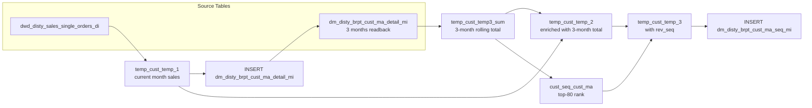

# DM: Customer Monthly Sales Detail & Top-80 Sequence (`dm_disty_brpt_cust_ma_detail_mi` / `dm_disty_brpt_cust_ma_seq_mi`)

- artifact_type: etl_table
- artifact_id: dm_us.dm_disty_brpt_cust_ma_seq_mi
- domain: customer
- one_line_purpose: This job produces two monthly customer sales tables used for revenue concentration analysis. The **detail table** (`dm_disty_brpt_cust_ma_detail_mi`) stores each customer's total net sales for the current month. The **sequence table** (`dm_...
- layer_type: DM
- source_kind: etl_sql
- evidence_source: source/etl/sql/customer/data_service/brpt_patch/python/load_dm_disty_brpt_cust_ma_detail_mi.py

---

## L1 Data Foundation

### Identity and physical mapping
- **Table:** `dm_us.dm_disty_brpt_cust_ma_seq_mi`
- **Layer type:** DM
- **Canonical / derived:** Derived / ETL-loaded (see L3)
- **Owner team:** not registered in metadata catalog

### Grain, scope, exclusions
- **Grain:** Not documented in repository
- **Scope:** See L2 business purpose / L3 filters
- **Partition:** `dt_month` — the calendar month of the snapshot (e.g. `2024-05`). - resolved from pipeline (see L4)
- **Natural key:** `cust_no` within a `dt_month` partition.
- **Exclusions:** Not documented in repository

#### Grain detail (preserved)

- **`dm_disty_brpt_cust_ma_detail_mi` grain:** one row per `(m, cust_no, dt_month)` — a customer's gross sales for a given month number.
- **`dm_disty_brpt_cust_ma_seq_mi` grain:** one row per `(m, cust_no, dt_month)` — a customer's 3-month-rolling sales and top-80 rank for the month.
- **Partition:** `dt_month` — the calendar month of the snapshot (e.g. `2024-05`).
- **Natural key:** `cust_no` within a `dt_month` partition.

---

### Cross-engine presence
| Engine | Present | Canonical FQN | Notes |
|--------|---------|---------------|-------|
| Hive | yes | `dm_disty_brpt_cust_ma_seq_mi` | ETL target / intermediate per evidence script |
| Vertica | pending | `dm_disty_brpt_cust_ma_seq_mi` | Confirm via hive2vertica flow evidence / MCP |

### Physical schema reference

Pointer block only - full column catalog lives in WKB L1 storage JSON.

| Field | Value |
|-------|-------|
| **Authoritative catalog** | WKB L1 storage seed (not duplicated in this file) |
| **entity_id** | `dm_us.dm_disty_brpt_cust_ma_seq_mi` |
| **l1_catalog_seed** | `target/storage/wkb/snapshots/_snapshot_id_template/l1_catalog/{engine}_{schema}_{table}.json` |
| **column_count** | pending (run ddl_seed_writer) |
| **partition_keys** | `dt_month, 2024-05` |
| **ddl_source** | pending Bitbucket DDL / Vertica metadata ingest |
| **retrieval** | `python -m tools.wkb.indexing.run_query --query "customer load_dm_disty_brpt_cust_ma_detail_mi schema" --intent find_table_schema` |

### Lineage
| Object | Role |
|--------|------|
| `dw_${country_no}.dwd_disty_sales_single_orders_di` | Primary source — current month single order gross sales |
| `dm_${country_no}.dm_disty_brpt_cust_ma_detail_mi` | **Target 1** (written first) and **source** (read back for 3-month rolling) |
| `dm_${country_no}.dm_disty_brpt_cust_ma_seq_mi` | **Target 2** — monthly top-80 sequence |

---

### Freshness and load path
| Item | Value |
|------|-------|
| Load pattern | See L3 end-to-end / INSERT pattern in evidence script |
| Schedule | Not documented in repository |
| Parameters | `country_no`, `cur_mon`, `bom`, `eom`, `dt_month`, `pm_dt_month`, `p_pm_dt_month`, `date_flag` |


---

## L2 Declarative Knowledge

### Business purpose
This job produces two monthly customer sales tables used for revenue concentration analysis. The **detail table** (`dm_disty_brpt_cust_ma_detail_mi`) stores each customer's total net sales for the current month. The **sequence table** (`dm_disty_brpt_cust_ma_seq_mi`) ranks customers by their three-month rolling sales total and assigns a sequence number only to customers who fall within the top 80% of cumulative revenue — enabling sales teams and finance to identify the high-concentration accounts that drive the majority of business.

---

### Audience and use cases
| Audience | How they benefit |
|----------|-----------------|
| **Sales leadership** | Identifies the top-80 customers driving 80% of revenue so resources and attention can be prioritized appropriately. |
| **Finance / FP&A** | Monthly customer revenue totals for trend analysis, concentration risk assessment, and Pareto reporting. |
| **Account management** | `rev_seq` shows each account's rank within the top-80 cohort; lower number = higher revenue contributor. |

---

### Fact key resolution
- Natural key: `cust_no` within a `dt_month` partition.
- FK / label-on attributes: see L3 dimension join patterns and step-by-step logic.
- Negative assertion: do not treat descriptive labels as grain keys unless listed under natural key.

### Time field semantics
- **date_flag / partition columns:** `dt_month` — the calendar month of the snapshot (e.g. `2024-05`).
- Primary reporting filter should use the partition column(s) documented in L1; resolve values via L4.


### Metrics served

| Category | Column | Logical metric | Business reading |
|----------|--------|----------------|------------------|
| Measures | — | — | No measure columns mapped for this table. |

### Metric serving map

**Formula authority:** [`source/contracts/customer/metric-index.md`](../../source/contracts/customer/metric-index.md)

N/A — no measure columns mapped for this table.

### etl_metrics

No governed logical metrics from `source/contracts/customer/metric-index.md` are mapped on this table.

---

### Metric serving map
N/A - not a `*_comb_mtd` / multi-period wide serving table (or map not present in legacy doc).


### Data products and column groups (preserved)

### Identifiers and relationships

- **Customer:** `cust_no` — distributor customer number
- **Month number:** `m` — the `cur_mon` parameter value; month ordinal or label

### Sales metrics

- `sales_total` — in `dm_disty_brpt_cust_ma_detail_mi`: gross sales for the current month (`u_price × ship_qty`). In `dm_disty_brpt_cust_ma_seq_mi`: 3-month rolling sales total (replaced from `temp_cust_temp3_sum` when available).
- `rev_seq` — sequence number within the top-80 cohort. `1` = highest revenue customer in the 80% pool. NULL or filtered-out for customers outside top 80%.

### Audit columns

- `date_flag` — the specific day this run was executed (literal from parameter)
- `dt_month` — the partition month

---

### etl_metrics

#### `sales_total`
- **Source:** [metric-index.md](../../source/contracts/customer/metric-index.md#sales_total)
- **Business definition:** Gross sales — unit price × quantity, null-safe.
```sql
SUM(nvl(u_price * ship_qty, 0))
```

#### `rev_seq`
- **Source:** [metric-index.md](../../source/contracts/customer/metric-index.md#rev_seq)
- **Business definition:** Placeholder; populated later in `temp_cust_temp_3`.
```sql
CAST(NULL AS INT)
```


---

## L3 Procedural Knowledge

### Query and routing rules
**Business filters:** Use partition / date keys from L1 grain for reporting scope.
**Technical predicates (load only):** See Key filters and step-by-step logic below.

### Dimension join patterns
| Dimension FQN | Join keys | Purpose | Evidence |
|---------------|-----------|---------|----------|
| See step-by-step / base tables | See L3 steps | Dimension enrichment | `source/etl/sql/customer/data_service/brpt_patch/python/load_dm_disty_brpt_cust_ma_detail_mi.py` |

### Key filters and ETL business logic
### Step 1 — `temp_cust_temp_1` (view)

**Source:** `dw_${country_no}.dwd_disty_sales_single_orders_di`

**Filter (natural language):**
- `date_flag BETWEEN '${bom}' AND '${eom}'` — current month from first to last day.
- `terr_status = 'n'` — territory-normalized rows only.

**Derived columns:**

| Column | Formula | Plain language |
|--------|---------|----------------|
| `m` | Literal `${cur_mon}` | Month ordinal or label as provided by the job parameter. |
| `sales_total` | `SUM(nvl(u_price * ship_qty, 0))` | Gross sales — unit price × quantity, null-safe. |
| `rev_seq` | `CAST(NULL AS INT)` | Placeholder; populated later in `temp_cust_temp_3`. |

---

### Step 2 — `INSERT` into `dm_disty_brpt_cust_ma_detail_mi`

**From:** `temp_cust_temp_1`

**Pass-through columns:** `m`, `cust_no`, `sales_total`

**Literal columns:**
- `date_flag` = `'${date_flag}'` — execution date
- `dt_month` = `'${dt_month}'` — partition value

---

### Step 3 — `temp_cust_temp3_sum` (view)

**Source:** `dm_${country_no}.dm_disty_brpt_cust_ma_detail_mi`

**Filter:** `dt_month IN ('${p_pm_dt_month}', '${pm_dt_month}', '${dt_month}')` — last 3 months.

**Derived columns:**

| Column | Formula | Plain language |
|--------|---------|----------------|
| `sales_total` | `SUM(revenue)` GROUP BY `cust_no`, ORDER BY `SUM(revenue) DESC` | 3-month rolling gross sales per customer. |

> **Note:** The column referenced as `revenue` in this view does not match the column name `sales_total` written in Step 2. This...

### Standard time-filter SQL
```sql
-- relative period filter using resolved partition value (see L4)
SELECT *
FROM dm_disty_brpt_cust_ma_seq_mi
WHERE /* partition predicate */ date_flag = '${partition_value}';
```

### End-to-end flow
**Runtime parameters:** `country_no`, `cur_mon`, `bom`, `eom`, `dt_month`, `pm_dt_month`, `p_pm_dt_month`, `date_flag`
**Target tables:**
- `dm_${country_no}.dm_disty_brpt_cust_ma_detail_mi` PARTITION (dt_month)
- `dm_${country_no}.dm_disty_brpt_cust_ma_seq_mi` PARTITION (dt_month)

1. Build `temp_cust_temp_1`: aggregate current-month gross sales per customer from `dwd_disty_sales_single_orders_di`.
2. **INSERT** `temp_cust_temp_1` into `dm_disty_brpt_cust_ma_detail_mi` with literal `date_flag` and `dt_month`.
3. Build `temp_cust_temp3_sum`: read back the detail table for the last 3 months (`p_pm_dt_month`, `pm_dt_month`, `dt_month`); sum revenue per customer ordered by total desc.
4. Build `temp_cust_temp_2`: replace each customer's `sales_total` with the 3-month rolling sum when available.
5. Build `cust_seq_cust_ma`: compute cumulative revenue (top-down); assign `ROW_NUMBER` to customers within the top 80% of total revenue.
6. Build `temp_cust_temp_3`: apply the sequence number from `cust_seq_cust_ma` to each customer row.
7. **INSERT** `temp_cust_temp_3` (filtered to `rev_seq != 0 OR rev_seq IS NOT NULL`) into `dm_disty_brpt_cust_ma_seq_mi`.



---


#### High-level stages (preserved)

| Stage | Business meaning |
|-------|-----------------|
| **Current month sales** | Aggregates each customer's total gross sales (`u_price × ship_qty`) from single orders for the current month. Writes to the detail table. |
| **Three-month rolling total** | Reads back the detail table for the prior-prior month, prior month, and current month; sums revenue per customer to get a rolling 3-month view. |
| **Sales enrichment** | Replaces the current month's individual sales figure with the 3-month rolling total when one is available. |
| **Top-80 ranking** | Computes cumulative revenue contribution ordered by 3-month sales descending. Assigns a sequence number to every customer whose cumulative sum is within 80% of the total revenue pool. |
| **Sequence write** | Writes the ranked customers (those inside top 80%) with their sequence numbers to the sequence table. |

**Parameters:** `country_no`, `cur_mon`, `bom`, `eom`, `dt_month`, `pm_dt_month`, `p_pm_dt_month`, `date_flag`

---


### Base tables register
| Object | Role in this job |
|--------|-----------------|
| `dw_${country_no}.dwd_disty_sales_single_orders_di` | **Primary source.** Single orders DWD table — provides `cust_no`, `u_price`, `ship_qty` for current month gross sales. Filtered to `date_flag BETWEEN '${bom}' AND '${eom}'` and `terr_status = 'n'`. |
| `dm_${country_no}.dm_disty_brpt_cust_ma_detail_mi` | **Both target and source.** Written first with current month data, then immediately read back for the 3-month rolling aggregation. |
| `dm_${country_no}.dm_disty_brpt_cust_ma_seq_mi` | **Target.** Monthly top-80 customer sequence table. |

**Temporary tables (inside the job only):**
`temp_cust_temp_1` → INSERT detail → `temp_cust_temp3_sum` → `temp_cust_temp_2` → `cust_seq_cust_ma` → `temp_cust_temp_3` → INSERT seq

---

### Step-by-step logic
### Step 1 — `temp_cust_temp_1` (view)

**Source:** `dw_${country_no}.dwd_disty_sales_single_orders_di`

**Filter (natural language):**
- `date_flag BETWEEN '${bom}' AND '${eom}'` — current month from first to last day.
- `terr_status = 'n'` — territory-normalized rows only.

**Derived columns:**

| Column | Formula | Plain language |
|--------|---------|----------------|
| `m` | Literal `${cur_mon}` | Month ordinal or label as provided by the job parameter. |
| `sales_total` | `SUM(nvl(u_price * ship_qty, 0))` | Gross sales — unit price × quantity, null-safe. |
| `rev_seq` | `CAST(NULL AS INT)` | Placeholder; populated later in `temp_cust_temp_3`. |

---

### Step 2 — `INSERT` into `dm_disty_brpt_cust_ma_detail_mi`

**From:** `temp_cust_temp_1`

**Pass-through columns:** `m`, `cust_no`, `sales_total`

**Literal columns:**
- `date_flag` = `'${date_flag}'` — execution date
- `dt_month` = `'${dt_month}'` — partition value

---

### Step 3 — `temp_cust_temp3_sum` (view)

**Source:** `dm_${country_no}.dm_disty_brpt_cust_ma_detail_mi`

**Filter:** `dt_month IN ('${p_pm_dt_month}', '${pm_dt_month}', '${dt_month}')` — last 3 months.

**Derived columns:**

| Column | Formula | Plain language |
|--------|---------|----------------|
| `sales_total` | `SUM(revenue)` GROUP BY `cust_no`, ORDER BY `SUM(revenue) DESC` | 3-month rolling gross sales per customer. |

> **Note:** The column referenced as `revenue` in this view does not match the column name `sales_total` written in Step 2. This appears to be a script inconsistency — `dm_disty_brpt_cust_ma_detail_mi` stores the column as `sales_total` but this view reads it as `revenue`. The actual behavior at runtime depends on the physical table schema.

---

### Step 4 — `temp_cust_temp_2` (view)

**Source:** `temp_cust_temp_1` LEFT JOIN `temp_cust_temp3_sum` on `cust_no`

**Derived columns:**

| Column | Logic | Plain language |
|--------|-------|----------------|
| `sales_total` | `CASE WHEN b.cust_no IS NOT NULL THEN b.sales_total ELSE a.sales_total END` | Replaces the current-month-only sales figure with the 3-month rolling total when a match exists. |

---

### Step 5 — `cust_seq_cust_ma` (view)

**Source:** `temp_cust_temp3_sum` — CTE with two parts:

1. `total_sales`: `SUM(sales_total)` across all customers = total revenue pool.
2. `cumulative_sales`: `SUM(sales_total) OVER (ORDER BY sales_total DESC)` = running cumulative from highest to lowest revenue customer.

**Filter:** `cumulative_sum <= total * 0.8` — keeps only customers whose cumulative revenue contribution falls within the top 80%.

**Derived columns:**

| Column | Formula | Plain language |
|--------|---------|----------------|
| `sequence` | `ROW_NUMBER() OVER (ORDER BY sales_total DESC)` | Rank within the top-80 cohort — 1 = highest revenue customer inside the 80% boundary. |

---

### Step 6 — `temp_cust_temp_3` (view)

**Source:** `temp_cust_temp_2` LEFT JOIN `cust_seq_cust_ma` on `cust_no`

**Derived columns:**

| Column | Logic | Plain language |
|--------|-------|----------------|
| `rev_seq` | `CASE WHEN b.cust_no IS NOT NULL THEN b.sequence ELSE a.rev_seq END` | Assigns the top-80 rank if the customer is in the cohort; otherwise keeps null (from step 1). |

---

### Step 7 — Final `INSERT` into `dm_disty_brpt_cust_ma_seq_mi`

**From:** `temp_cust_temp_3`

**Filter:** `WHERE rev_seq != 0 OR rev_seq IS NOT NULL` — excludes rows where the customer has no top-80 rank. Since `rev_seq` starts as NULL (not 0), this effectively keeps only customers with a non-null `rev_seq`, i.e. those ranked in the top 80%.

**Pass-through columns:** `m`, `cust_no`, `sales_total`, `rev_seq`

**Literal columns:**
- `date_flag` = `'${date_flag}'`
- `dt_month` = `'${dt_month}'` (partition value)

---

### Relationship map (embedded)

| from_fqn | to_fqn | cardinality | join_keys | provenance |
|----------|--------|-------------|-----------|------------|
| `temp_cust_temp_1` | `temp_cust_temp3_sum` | many:1 | `a.cust_no=b.cust_no` | etl_sql (source/etl/sql/customer/data_service/brpt_patch/python/load_dm_disty_brpt_cust_ma_detail_mi.py:34) |

`source/ref/customer/table relationship.txt`: Not documented in repository.

### Special logic (embedded)

Not documented in repository

### Column / field derivations (from ETL SQL)

| target_column | expression_sql | upstream_columns | upstream_tables | transform_kind | evidence |
|---------------|----------------|------------------|-----------------|----------------|----------|
| `m` | `m` | `m` | `temp_cust_temp_3` | passthrough | `source/etl/sql/customer/data_service/brpt_patch/python/load_dm_disty_brpt_cust_ma_detail_mi.py:1` |
| `cust_no` | `cust_no` | `cust_no` | `temp_cust_temp_3` | passthrough | `source/etl/sql/customer/data_service/brpt_patch/python/load_dm_disty_brpt_cust_ma_detail_mi.py:7` |
| `sales_total` | `sales_total` | `sales_total` | `temp_cust_temp_3` | passthrough | `source/etl/sql/customer/data_service/brpt_patch/python/load_dm_disty_brpt_cust_ma_detail_mi.py:8` |
| `rev_seq` | `rev_seq` | `rev_seq` | `temp_cust_temp_3` | passthrough | `source/etl/sql/customer/data_service/brpt_patch/python/load_dm_disty_brpt_cust_ma_detail_mi.py:9` |
| `date_flag` | `'${date_flag}'` | `date_flag` | `temp_cust_temp_3` | literal | `source/etl/sql/customer/data_service/brpt_patch/python/load_dm_disty_brpt_cust_ma_detail_mi.py:20` |
| `dt_month` | `'${dt_month}'` | `dt_month` | `temp_cust_temp_3` | literal | `source/etl/sql/customer/data_service/brpt_patch/python/load_dm_disty_brpt_cust_ma_detail_mi.py:21` |

### Sentinel and code values
| Value | Meaning |
|-------|---------|
| `terr_status = 'n'` | Territory-normalized single order rows — only these are used for sales aggregation. |
| `rev_seq IS NULL` | Customer not in top-80 cohort — excluded from `dm_disty_brpt_cust_ma_seq_mi`. |
| `cumulative_sum <= total * 0.8` | Top-80% boundary — customers whose cumulative descending sales reach 80% of the total pool. |
| `dt_month IN (p_pm, pm, cur)` | Three-month rolling window in `temp_cust_temp3_sum`. |

---

---

## L4 Validation

### Resolved partition value
| Step | Source | How partition / date scope is determined |
|------|--------|------------------------------------------|
| 1 | evidence script / flow | See parameters in L1 Freshness and L3 filters - `source/etl/sql/customer/data_service/brpt_patch/python/load_dm_disty_brpt_cust_ma_detail_mi.py` |

**Plain language:** Partition and date scope follow Azkaban/bootstrap parameters documented in the source script and orchestrating flow; do not hardcode calendar literals.

### Data quality checks
- Prefer row-count-by-partition, metric sums, and grain duplicate checks (see Validation SQL).
- Additional checks from legacy caveats / operational notes when present.

### Validation SQL
```sql
-- 1) Row count by partition
SELECT ${partition_col}, COUNT(*) AS row_cnt
FROM dm_${country_no}.dm_disty_brpt_cust_ma_detail_mi
WHERE ${partition_col} = '${partition_value}'
GROUP BY ${partition_col};

-- 2) Metric sum by business dimension (top deltas)
SELECT ${dim_key}, SUM(${metric}) AS metric_sum
FROM dm_${country_no}.dm_disty_brpt_cust_ma_detail_mi
WHERE ${partition_col} = '${partition_value}'
GROUP BY ${dim_key}
ORDER BY ABS(SUM(${metric})) DESC
LIMIT 20;

-- 3) Grain duplicate check
SELECT ${grain_key_1}, ${grain_key_2}, ${grain_key_3}, ${partition_col}, COUNT(*) AS cnt
FROM dm_${country_no}.dm_disty_brpt_cust_ma_detail_mi
WHERE ${partition_col} = '${partition_value}'
GROUP BY ${grain_key_1}, ${grain_key_2}, ${grain_key_3}, ${partition_col}
HAVING COUNT(*) > 1;
```

Replace placeholders from this file's Grain and keys / Data you can fetch sections, and use the resolved partition value from run scope.

### Caveats for interpretation
- **Self-referencing table:** `dm_disty_brpt_cust_ma_detail_mi` is both written and then immediately read in the same job execution. The INSERT in Step 2 overwrites the current `dt_month` partition; the read in Step 3 then includes that freshly written data alongside the two prior months.
- **`revenue` vs `sales_total` column name discrepancy:** `temp_cust_temp3_sum` aggregates `SUM(revenue)` but the detail table writes the column as `sales_total`. This is a script-level inconsistency — verify the physical table column name to confirm runtime behaviour.
- **Top-80 is based on 3-month rolling, not current month only:** `cust_seq_cust_ma` ranks customers using `temp_cust_temp3_sum` (3-month totals), not the current month's single-order data. A customer with a strong 3-month history but weak current month can still be ranked in top 80.
- **`rev_seq` filter logic:** `WHERE rev_seq != 0 OR rev_seq IS NOT NULL` in Step 7 — since `rev_seq` is initialised as `CAST(NULL AS INT)` and ROW_NUMBER starts at 1 (never 0), the effective filter is `rev_seq IS NOT NULL`. Customers outside top 80 remain null and are excluded.
- **`sales_total` in detail vs seq table differs in meaning:** In `dm_disty_brpt_cust_ma_detail_mi` it is the current-month gross sales only; in `dm_disty_brpt_cust_ma_seq_mi` it is the 3-month rolling total (from `temp_cust_temp3_sum`).

---

### Conflicts and open questions
- Schedule, owner, SLA: Not documented in repository (unless preserved schedule evidence above).
- Vertica MCP verification: pending unless confirmed in L5.


---

## L5 Runtime View

### Query path and engine preference
| Role | Hive object | Vertica object | Sync mode | Evidence | MCP verified |
|------|-------------|----------------|-----------|----------|--------------|
| **Query for reporting** | *See script lineage* | `dm_${country_no}.dm_disty_brpt_cust_ma_detail_mi` | *Verify from flow* | *Add flow file:line* | pending |
| **Hive alternative** | `*` | `dm_${country_no}.dm_disty_brpt_cust_ma_detail_mi` | - | *See dependencies* | - |
| **ETL internal** | staging/temp tables | *Not synced to Vertica* | - | *See step-by-step logic* | - |

Business users should query `dm_${country_no}.dm_disty_brpt_cust_ma_detail_mi` in Vertica once MCP verification is completed for this document.

### Access constraints
- Country / company schema parameters may apply (`literal_country`, `company_no`, etc.).
- Hive-only staging objects are not reporting surfaces unless synced.

### Query risk profile
| Field | Value |
|-------|-------|
| requires_date_predicate | unknown |
| scan_risk_tier | medium |

---

## L6 Access and Consumption

### Primary consumers and use cases
| Audience | How they benefit |
|----------|-----------------|
| **Sales leadership** | Identifies the top-80 customers driving 80% of revenue so resources and attention can be prioritized appropriately. |
| **Finance / FP&A** | Monthly customer revenue totals for trend analysis, concentration risk assessment, and Pareto reporting. |
| **Account management** | `rev_seq` shows each account's rank within the top-80 cohort; lower number = higher revenue contributor. |

---

### Representative query patterns
```sql
-- certified / illustrative lookup - replace predicates from L1/L4
SELECT *
FROM dm_disty_brpt_cust_ma_seq_mi
WHERE date_flag = '${partition_value}'
LIMIT 100;
```

### Dependencies and notes
### Upstream objects (verified)

| Object | Usage | Evidence |
|--------|-------|----------|
| `dw_${country_no}.dwd_disty_sales_single_orders_di` | Current month gross sales per customer | `load_dm_disty_brpt_cust_ma_detail_mi.py:10-13` |
| `dm_${country_no}.dm_disty_brpt_cust_ma_detail_mi` | 3-month rolling readback | `load_dm_disty_brpt_cust_ma_detail_mi.py:28-31` |

### Downstream consumers (verified)

| Object / script | Evidence |
|-----------------|----------|
| None identified in repository. | — |

### Operational detail (verified)

- `dm_disty_brpt_cust_ma_detail_mi`: partition overwrite — `INSERT OVERWRITE TABLE dm_${country_no}.dm_disty_brpt_cust_ma_detail_mi PARTITION (dt_month)` — `load_dm_disty_brpt_cust_ma_detail_mi.py:17`
- `dm_disty_brpt_cust_ma_seq_mi`: partition overwrite — `INSERT OVERWRITE TABLE dm_${country_no}.dm_disty_brpt_cust_ma_seq_mi PARTITION (dt_month)` — `load_dm_disty_brpt_cust_ma_detail_mi.py:78`

### Not documented in repository

- Schedule, owner, SLA — not in scripts or configs
- Azkaban / Livy job name and flow file — not present in `source/etl/sql/customer/data_service/brpt_patch/`

---

*Document generated from `source/etl/sql/customer/data_service/brpt_patch/python/load_dm_disty_brpt_cust_ma_detail_mi.py`.*

#### Not documented in repository
- Owner, SLA (unless schedule evidence preserved above)
- Any dependency without `file:line` evidence in this document

---

*Document migrated to L1-L6 from legacy Knowledgebase content. Evidence: `source/etl/sql/customer/data_service/brpt_patch/python/load_dm_disty_brpt_cust_ma_detail_mi.py`.*
