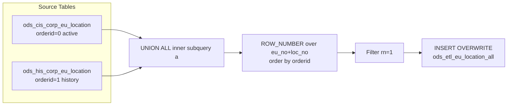

# ODS ETL: EU Location Unified Snapshot (`ods_etl_eu_location_all`)

- artifact_type: etl_table
- artifact_id: ods_gbl.ods_etl_eu_location_all
- domain: customer
- one_line_purpose: This job merges **active and historical end-user (EU) location records** into a single, de-duplicated ODS ETL table. The active/current record always wins over the historical one. The result is a canonical view of every known end-user locat...
- layer_type: ODS
- source_kind: etl_sql
- evidence_source: source/etl/sql/customer/source/etl/flows/public_order_tools/ingest/public_eu_dimension/script/ods_etl_eu_location_all.sql

---

## L1 Data Foundation

### Identity and physical mapping
- **Table:** `ods_gbl.ods_etl_eu_location_all`
- **Layer type:** ODS
- **Canonical / derived:** Derived / ETL-loaded (see L3)
- **Owner team:** not registered in metadata catalog

### Grain, scope, exclusions
- **Grain:** one row per `(eu_no, loc_no)` — a unique end-user entity at a specific location.
- **Scope:** See L2 business purpose / L3 filters
- **Partition:** none — full overwrite of the target table on each run. - resolved from pipeline (see L4)
- **Natural key:** `eu_no`, `loc_no`.
- **Exclusions:** Not documented in repository

#### Grain detail (preserved)

- **Grain:** one row per `(eu_no, loc_no)` — a unique end-user entity at a specific location.
- **Partition:** none — full overwrite of the target table on each run.
- **Natural key:** `eu_no`, `loc_no`.

---

### Cross-engine presence
| Engine | Present | Canonical FQN | Notes |
|--------|---------|---------------|-------|
| Hive | yes | `ods_etl_eu_location_all` | ETL target / intermediate per evidence script |
| Vertica | pending | `ods_etl_eu_location_all` | Confirm via hive2vertica flow evidence / MCP |

### Physical schema reference

Pointer block only - full column catalog lives in WKB L1 storage JSON.

| Field | Value |
|-------|-------|
| **Authoritative catalog** | WKB L1 storage seed (not duplicated in this file) |
| **entity_id** | `ods_gbl.ods_etl_eu_location_all` |
| **l1_catalog_seed** | `target/storage/wkb/snapshots/_snapshot_id_template/l1_catalog/{engine}_{schema}_{table}.json` |
| **column_count** | pending (run ddl_seed_writer) |
| **partition_keys** | `none — full overwrite of the target table on each run.` |
| **ddl_source** | pending Bitbucket DDL / Vertica metadata ingest |
| **retrieval** | `python -m tools.wkb.indexing.run_query --query "customer ods_etl_eu_location_all schema" --intent find_table_schema` |

### Lineage
| Object | Role |
|--------|------|
| `ods_${country_code}.ods_cis_corp_eu_location` | Primary source — active EU location records |
| `ods_${country_code}.ods_his_corp_eu_location` | Fallback source — historical EU location records |
| `ods_${country_code}.ods_etl_eu_location_all` | **Target** — unified EU location ODS ETL table |

---

### Freshness and load path
| Item | Value |
|------|-------|
| Load pattern | See L3 end-to-end / INSERT pattern in evidence script |
| Schedule | Not documented in repository |
| Parameters | `country_code` |


---

## L2 Declarative Knowledge

### Business purpose
This job merges **active and historical end-user (EU) location records** into a single, de-duplicated ODS ETL table. The active/current record always wins over the historical one. The result is a canonical view of every known end-user location — including address, contact flags, and account activity dates — that downstream dimension and reporting jobs can join against without having to handle the active-vs-history split themselves.

---

### Audience and use cases
| Audience | How they benefit |
|----------|-----------------|
| **Customer master / MDM teams** | Single authoritative location record per EU+location for customer data management and address validation. |
| **Dimension builders** | `public_eu_dimension.sql` and similar jobs join this table to enrich contact and master records with address and location flags without needing to resolve the active/history split. |
| **Sales & channel teams** | `sold_since`, `last_purchase`, `is_sell_to`, `is_bill_to`, `is_ship_to` flags support account status and channel eligibility checks. |

---

### Fact key resolution
- Natural key: `eu_no`, `loc_no`.
- FK / label-on attributes: see L3 dimension join patterns and step-by-step logic.
- Negative assertion: do not treat descriptive labels as grain keys unless listed under natural key.

### Time field semantics
- **date_flag / partition columns:** none — full overwrite of the target table on each run.
- Primary reporting filter should use the partition column(s) documented in L1; resolve values via L4.


### Metrics served

| Category | Column | Logical metric | Business reading |
|----------|--------|----------------|------------------|
| Measures | — | — | No measure columns mapped for this table. |

### Metric serving map

**Formula authority:** [`source/contracts/customer/metric-index.md`](../../source/contracts/customer/metric-index.md)

N/A — no measure columns mapped for this table.

### etl_metrics

No governed logical metrics from `source/contracts/customer/metric-index.md` are mapped on this table.

---

### Metric serving map
N/A - not a `*_comb_mtd` / multi-period wide serving table (or map not present in legacy doc).


### Data products and column groups (preserved)

### Identifiers and relationships

- **End-user / location:** `eu_no`, `loc_no`
- **Contact linkage:** `primary_contact` — the contact number designated as primary for this location

### Address and location attributes

- `loc_name` — location display name
- `street_address`, `po_box`, `city`, `state`, `zip_code`, `country` — full mailing address
- `sold_since`, `last_purchase` — first sale and most recent purchase dates for this location
- `statement`, `label_printed` — statement and label print flags

### Account access flags

- `is_sell_to` — this location can be sold to
- `is_bill_to` — this location can be billed
- `is_ship_to` — this location can receive shipments
- `is_login` — this location has system login access

### Audit and provenance

- `u_version` — record version number
- `entry_id`, `entry_datetime` — who and when the record was originally created
- `etl_timestamp` — when this ETL run loaded the record (Los Angeles time)
- `data_source` — which source table the row came from (`ods_cis_corp_eu_location` or `ods_his_corp_eu_location`)

---

### etl_metrics

#### `etl_timestamp`
- **Source:** [metric-index.md](../../source/contracts/customer/metric-index.md#etl_timestamp)
- **Business definition:** Current run time converted to Los Angeles (Pacific) timezone.
```sql
from_utc_timestamp(current_timestamp(), 'America/Los_Angeles')
```


---

## L3 Procedural Knowledge

### Query and routing rules
**Business filters:** Use partition / date keys from L1 grain for reporting scope.
**Technical predicates (load only):** See Key filters and step-by-step logic below.

### Dimension join patterns
| Dimension FQN | Join keys | Purpose | Evidence |
|---------------|-----------|---------|----------|
| See step-by-step / base tables | See L3 steps | Dimension enrichment | `source/etl/sql/customer/source/etl/flows/public_order_tools/ingest/public_eu_dimension/script/ods_etl_eu_location_all.sql` |

### Key filters and ETL business logic
### Step 1 — Inner subquery `a` (UNION ALL)

**Source:** `ods_cis_corp_eu_location` UNION ALL `ods_his_corp_eu_location`

**What happens to columns:**
- All columns from both tables are selected with `SELECT *`.
- `orderid` — literal `0` for active rows, `1` for history rows. Controls which record wins in the ranking step.
- `data_source` — literal string: `'ods_cis_corp_eu_location'` or `'ods_his_corp_eu_location'`. Records provenance.

---

### Step 2 — Outer subquery `aa` (de-duplication ranking)

**Source:** subquery `a`

**Derived columns:**

| Column | Formula | Plain language |
|--------|---------|----------------|
| `rn` | `ROW_NUMBER() OVER (PARTITION BY eu_no, loc_no ORDER BY orderid ASC)` | Ranks rows within each EU+location pair. Active record (orderid=0) gets rn=1; history (orderid=1) gets rn=2 only when both exist. |

**Filter:** `WHERE aa.rn = 1` — retains exactly one row per `(eu_no, loc_no)`.

---

### Step 3 — Final `INSERT OVERWRITE` into `ods_etl_eu_location_all`

**From:** outer subquery `aa` where `rn = 1`

**Explicit column list written to target:**
`eu_no`, `loc_no`, `u_version`, `loc_name`, `primary_contact`, `street_address`, `po_box`, `city`, `state`, `zip_code`, `country`, `sold_since`, `last_purchase`, `statement`, `label_printed`, `entry_id`, `entry_datetime`, `is_sell_to`, `is_bill_to`, `is_ship_to`, `is_login`, `etl_timestamp`, `data_source`

**Derived columns computed at INSERT:**

| Column | Formula | Plain language |
|--------|---------|----...

### Standard time-filter SQL
```sql
-- relative period filter using resolved partition value (see L4)
SELECT *
FROM ods_etl_eu_location_all
WHERE /* partition predicate */ date_flag = '${partition_value}';
```

### End-to-end flow
**Runtime parameters:** `country_code`
**Target table:** `ods_${country_code}.ods_etl_eu_location_all` — full overwrite, no partitioning.

1. Read all rows from `ods_cis_corp_eu_location` (active); tag with `orderid = 0` and `data_source = 'ods_cis_corp_eu_location'`.
2. UNION ALL with all rows from `ods_his_corp_eu_location` (history); tag with `orderid = 1` and `data_source = 'ods_his_corp_eu_location'`.
3. Apply `ROW_NUMBER()` partitioned by `(eu_no, loc_no)` ordered by `orderid` ascending — active (0) ranks first.
4. Filter to `rn = 1` — keep exactly one row per EU+location, favouring the active record.
5. Add `etl_timestamp` and write to target via `INSERT OVERWRITE`.



---


#### High-level stages (preserved)

| Stage | Business meaning |
|-------|-----------------|
| **Active records** | Reads all rows from the active EU location table (`ods_cis_corp_eu_location`), assigns priority `0` — these are preferred. |
| **Historical records** | Reads all rows from the history EU location table (`ods_his_corp_eu_location`), assigns priority `1` — these are the fallback when no active record exists. |
| **De-duplication** | Unions both sets and applies `ROW_NUMBER()` over `(eu_no, loc_no)` ordered by priority. Keeps only `rn = 1` — the active record for any EU+location pair that exists in both tables, or the history record if only that exists. |
| **ETL metadata** | Stamps the current timestamp (Los Angeles timezone) as `etl_timestamp` and the source table name as `data_source`. |
| **Full overwrite** | Overwrites the entire target table with the de-duplicated result. |

**Parameters:** `country_code`

---


### Base tables register
| Object | Role in this job |
|--------|-----------------|
| `ods_${country_code}.ods_cis_corp_eu_location` | **Primary source.** Active/current EU location records. Selected with `orderid = 0` — preferred in de-duplication. Provides all location columns. |
| `ods_${country_code}.ods_his_corp_eu_location` | **Fallback source.** Historical EU location records. Selected with `orderid = 1` — used only when no active record exists for an `(eu_no, loc_no)`. |

**Temporary tables (inside the job only):**
Inner subquery `a` (UNION ALL) → outer subquery `aa` (ROW_NUMBER) → (final `INSERT OVERWRITE`)

---

### Step-by-step logic
### Step 1 — Inner subquery `a` (UNION ALL)

**Source:** `ods_cis_corp_eu_location` UNION ALL `ods_his_corp_eu_location`

**What happens to columns:**
- All columns from both tables are selected with `SELECT *`.
- `orderid` — literal `0` for active rows, `1` for history rows. Controls which record wins in the ranking step.
- `data_source` — literal string: `'ods_cis_corp_eu_location'` or `'ods_his_corp_eu_location'`. Records provenance.

---

### Step 2 — Outer subquery `aa` (de-duplication ranking)

**Source:** subquery `a`

**Derived columns:**

| Column | Formula | Plain language |
|--------|---------|----------------|
| `rn` | `ROW_NUMBER() OVER (PARTITION BY eu_no, loc_no ORDER BY orderid ASC)` | Ranks rows within each EU+location pair. Active record (orderid=0) gets rn=1; history (orderid=1) gets rn=2 only when both exist. |

**Filter:** `WHERE aa.rn = 1` — retains exactly one row per `(eu_no, loc_no)`.

---

### Step 3 — Final `INSERT OVERWRITE` into `ods_etl_eu_location_all`

**From:** outer subquery `aa` where `rn = 1`

**Explicit column list written to target:**
`eu_no`, `loc_no`, `u_version`, `loc_name`, `primary_contact`, `street_address`, `po_box`, `city`, `state`, `zip_code`, `country`, `sold_since`, `last_purchase`, `statement`, `label_printed`, `entry_id`, `entry_datetime`, `is_sell_to`, `is_bill_to`, `is_ship_to`, `is_login`, `etl_timestamp`, `data_source`

**Derived columns computed at INSERT:**

| Column | Formula | Plain language |
|--------|---------|----------------|
| `etl_timestamp` | `from_utc_timestamp(current_timestamp(), 'America/Los_Angeles')` | Current run time converted to Los Angeles (Pacific) timezone. |

---

### Relationship map (embedded)

| from_fqn | to_fqn | cardinality | join_keys | provenance |
|----------|--------|-------------|-----------|------------|
| — | — | — | — | Not documented in repository |

`source/ref/customer/table relationship.txt`: Not documented in repository.

### Special logic (embedded)

Not documented in repository

### Column / field derivations (from ETL SQL)

| target_column | expression_sql | upstream_columns | upstream_tables | transform_kind | evidence |
|---------------|----------------|------------------|-----------------|----------------|----------|
| `eu_no` | `eu_no` | `eu_no` | `ods_${country_code}.ods_cis_corp_eu_location`, `ods_${country_code}.ods_his_corp_eu_location` | passthrough | `source/etl/sql/customer/public_order_scripts/public_eu_dimension/script/ods_etl_eu_location_all.sql:4` |
| `loc_no` | `loc_no` | `loc_no` | `ods_${country_code}.ods_cis_corp_eu_location`, `ods_${country_code}.ods_his_corp_eu_location` | passthrough | `source/etl/sql/customer/public_order_scripts/public_eu_dimension/script/ods_etl_eu_location_all.sql:4` |
| `u_version` | `u_version` | `u_version` | `ods_${country_code}.ods_cis_corp_eu_location`, `ods_${country_code}.ods_his_corp_eu_location` | passthrough | `source/etl/sql/customer/public_order_scripts/public_eu_dimension/script/ods_etl_eu_location_all.sql:4` |
| `loc_name` | `loc_name` | `loc_name` | `ods_${country_code}.ods_cis_corp_eu_location`, `ods_${country_code}.ods_his_corp_eu_location` | passthrough | `source/etl/sql/customer/public_order_scripts/public_eu_dimension/script/ods_etl_eu_location_all.sql:4` |
| `primary_contact` | `primary_contact` | `primary_contact` | `ods_${country_code}.ods_cis_corp_eu_location`, `ods_${country_code}.ods_his_corp_eu_location` | passthrough | `source/etl/sql/customer/public_order_scripts/public_eu_dimension/script/ods_etl_eu_location_all.sql:4` |
| `street_address` | `street_address` | `street_address` | `ods_${country_code}.ods_cis_corp_eu_location`, `ods_${country_code}.ods_his_corp_eu_location` | passthrough | `source/etl/sql/customer/public_order_scripts/public_eu_dimension/script/ods_etl_eu_location_all.sql:4` |
| `po_box` | `po_box` | `po_box` | `ods_${country_code}.ods_cis_corp_eu_location`, `ods_${country_code}.ods_his_corp_eu_location` | passthrough | `source/etl/sql/customer/public_order_scripts/public_eu_dimension/script/ods_etl_eu_location_all.sql:4` |
| `city` | `city` | `city` | `ods_${country_code}.ods_cis_corp_eu_location`, `ods_${country_code}.ods_his_corp_eu_location` | passthrough | `source/etl/sql/customer/public_order_scripts/public_eu_dimension/script/ods_etl_eu_location_all.sql:4` |
| `state` | `state` | `state` | `ods_${country_code}.ods_cis_corp_eu_location`, `ods_${country_code}.ods_his_corp_eu_location` | passthrough | `source/etl/sql/customer/public_order_scripts/public_eu_dimension/script/ods_etl_eu_location_all.sql:4` |
| `zip_code` | `zip_code` | `zip_code` | `ods_${country_code}.ods_cis_corp_eu_location`, `ods_${country_code}.ods_his_corp_eu_location` | passthrough | `source/etl/sql/customer/public_order_scripts/public_eu_dimension/script/ods_etl_eu_location_all.sql:4` |
| `country` | `country` | `country` | `ods_${country_code}.ods_cis_corp_eu_location`, `ods_${country_code}.ods_his_corp_eu_location` | passthrough | `source/etl/sql/customer/public_order_scripts/public_eu_dimension/script/ods_etl_eu_location_all.sql:2` |
| `sold_since` | `sold_since` | `sold_since` | `ods_${country_code}.ods_cis_corp_eu_location`, `ods_${country_code}.ods_his_corp_eu_location` | passthrough | `source/etl/sql/customer/public_order_scripts/public_eu_dimension/script/ods_etl_eu_location_all.sql:4` |
| `last_purchase` | `last_purchase` | `last_purchase` | `ods_${country_code}.ods_cis_corp_eu_location`, `ods_${country_code}.ods_his_corp_eu_location` | passthrough | `source/etl/sql/customer/public_order_scripts/public_eu_dimension/script/ods_etl_eu_location_all.sql:4` |
| `statement` | `statement` | `statement` | `ods_${country_code}.ods_cis_corp_eu_location`, `ods_${country_code}.ods_his_corp_eu_location` | passthrough | `source/etl/sql/customer/public_order_scripts/public_eu_dimension/script/ods_etl_eu_location_all.sql:4` |
| `label_printed` | `label_printed` | `label_printed` | `ods_${country_code}.ods_cis_corp_eu_location`, `ods_${country_code}.ods_his_corp_eu_location` | passthrough | `source/etl/sql/customer/public_order_scripts/public_eu_dimension/script/ods_etl_eu_location_all.sql:4` |
| `entry_id` | `entry_id` | `entry_id` | `ods_${country_code}.ods_cis_corp_eu_location`, `ods_${country_code}.ods_his_corp_eu_location` | passthrough | `source/etl/sql/customer/public_order_scripts/public_eu_dimension/script/ods_etl_eu_location_all.sql:4` |
| `entry_datetime` | `entry_datetime` | `entry_datetime` | `ods_${country_code}.ods_cis_corp_eu_location`, `ods_${country_code}.ods_his_corp_eu_location` | passthrough | `source/etl/sql/customer/public_order_scripts/public_eu_dimension/script/ods_etl_eu_location_all.sql:4` |
| `is_sell_to` | `is_sell_to` | `is_sell_to` | `ods_${country_code}.ods_cis_corp_eu_location`, `ods_${country_code}.ods_his_corp_eu_location` | passthrough | `source/etl/sql/customer/public_order_scripts/public_eu_dimension/script/ods_etl_eu_location_all.sql:4` |
| `is_bill_to` | `is_bill_to` | `is_bill_to` | `ods_${country_code}.ods_cis_corp_eu_location`, `ods_${country_code}.ods_his_corp_eu_location` | passthrough | `source/etl/sql/customer/public_order_scripts/public_eu_dimension/script/ods_etl_eu_location_all.sql:4` |
| `is_ship_to` | `is_ship_to` | `is_ship_to` | `ods_${country_code}.ods_cis_corp_eu_location`, `ods_${country_code}.ods_his_corp_eu_location` | passthrough | `source/etl/sql/customer/public_order_scripts/public_eu_dimension/script/ods_etl_eu_location_all.sql:4` |
| `is_login` | `is_login` | `is_login` | `ods_${country_code}.ods_cis_corp_eu_location`, `ods_${country_code}.ods_his_corp_eu_location` | passthrough | `source/etl/sql/customer/public_order_scripts/public_eu_dimension/script/ods_etl_eu_location_all.sql:4` |
| `etl_timestamp` | `from_utc_timestamp(current_timestamp(),'America/Los_Angeles')` | `from_utc_timestamp`, `current_timestamp`, `America`, `Los_Angeles` | `ods_${country_code}.ods_cis_corp_eu_location`, `ods_${country_code}.ods_his_corp_eu_location` | arithmetic | `source/etl/sql/customer/public_order_scripts/public_eu_dimension/script/ods_etl_eu_location_all.sql:5` |
| `data_source` | `data_source` | `data_source` | `ods_${country_code}.ods_cis_corp_eu_location`, `ods_${country_code}.ods_his_corp_eu_location` | passthrough | `source/etl/sql/customer/public_order_scripts/public_eu_dimension/script/ods_etl_eu_location_all.sql:6` |

### Sentinel and code values
| Value | Meaning |
|-------|---------|
| `orderid = 0` | Active/current record — highest priority in `ROW_NUMBER()` ranking. |
| `orderid = 1` | Historical record — only used when no active record exists for the same `(eu_no, loc_no)`. |
| `data_source = 'ods_cis_corp_eu_location'` | Row originated from the active EU location table. |
| `data_source = 'ods_his_corp_eu_location'` | Row originated from the history EU location table. |
| `rn = 1` | The surviving, de-duplicated record for each `(eu_no, loc_no)`. |

---

---

## L4 Validation

### Resolved partition value
| Step | Source | How partition / date scope is determined |
|------|--------|------------------------------------------|
| 1 | evidence script / flow | See parameters in L1 Freshness and L3 filters - `source/etl/sql/customer/source/etl/flows/public_order_tools/ingest/public_eu_dimension/script/ods_etl_eu_location_all.sql` |

**Plain language:** Partition and date scope follow Azkaban/bootstrap parameters documented in the source script and orchestrating flow; do not hardcode calendar literals.

### Data quality checks
- Prefer row-count-by-partition, metric sums, and grain duplicate checks (see Validation SQL).
- Additional checks from legacy caveats / operational notes when present.

### Validation SQL
```sql
-- 1) Row count by partition
SELECT ${partition_col}, COUNT(*) AS row_cnt
FROM ods_${country_code}.ods_etl_eu_location_all
WHERE ${partition_col} = '${partition_value}'
GROUP BY ${partition_col};

-- 2) Metric sum by business dimension (top deltas)
SELECT ${dim_key}, SUM(${metric}) AS metric_sum
FROM ods_${country_code}.ods_etl_eu_location_all
WHERE ${partition_col} = '${partition_value}'
GROUP BY ${dim_key}
ORDER BY ABS(SUM(${metric})) DESC
LIMIT 20;

-- 3) Grain duplicate check
SELECT ${grain_key_1}, ${grain_key_2}, ${grain_key_3}, ${partition_col}, COUNT(*) AS cnt
FROM ods_${country_code}.ods_etl_eu_location_all
WHERE ${partition_col} = '${partition_value}'
GROUP BY ${grain_key_1}, ${grain_key_2}, ${grain_key_3}, ${partition_col}
HAVING COUNT(*) > 1;
```

Replace placeholders from this file's Grain and keys / Data you can fetch sections, and use the resolved partition value from run scope.

### Caveats for interpretation
- **Full overwrite on every run** — there is no partition or incremental logic; the entire table is replaced each execution.
- **Active record always wins** — if both active and history have a record for the same `(eu_no, loc_no)`, the active one is kept regardless of version or timestamp differences.
- **`data_source` is the only lineage indicator** — to know whether a given row came from the active or history source, check this column.
- **All columns are selected with `SELECT *`** from both source tables — any schema change in either source table (added/removed columns) will affect this job.

---

### Conflicts and open questions
- Schedule, owner, SLA: Not documented in repository (unless preserved schedule evidence above).
- Vertica MCP verification: pending unless confirmed in L5.


---

## L5 Runtime View

### Query path and engine preference
| Role | Hive object | Vertica object | Sync mode | Evidence | MCP verified |
|------|-------------|----------------|-----------|----------|--------------|
| **Query for reporting** | *See script lineage* | `ods_${country_code}.ods_etl_eu_location_all` | *Verify from flow* | *Add flow file:line* | pending |
| **Hive alternative** | `*` | `ods_${country_code}.ods_etl_eu_location_all` | - | *See dependencies* | - |
| **ETL internal** | staging/temp tables | *Not synced to Vertica* | - | *See step-by-step logic* | - |

Business users should query `ods_${country_code}.ods_etl_eu_location_all` in Vertica once MCP verification is completed for this document.

### Access constraints
- Country / company schema parameters may apply (`literal_country`, `company_no`, etc.).
- Hive-only staging objects are not reporting surfaces unless synced.

### Query risk profile
| Field | Value |
|-------|-------|
| requires_date_predicate | unknown |
| scan_risk_tier | high |

---

## L6 Access and Consumption

### Primary consumers and use cases
| Audience | How they benefit |
|----------|-----------------|
| **Customer master / MDM teams** | Single authoritative location record per EU+location for customer data management and address validation. |
| **Dimension builders** | `public_eu_dimension.sql` and similar jobs join this table to enrich contact and master records with address and location flags without needing to resolve the active/history split. |
| **Sales & channel teams** | `sold_since`, `last_purchase`, `is_sell_to`, `is_bill_to`, `is_ship_to` flags support account status and channel eligibility checks. |

---

### Representative query patterns
```sql
-- certified / illustrative lookup - replace predicates from L1/L4
SELECT *
FROM ods_etl_eu_location_all
WHERE date_flag = '${partition_value}'
LIMIT 100;
```

### Dependencies and notes
### Upstream objects (verified)

| Object | Usage | Evidence |
|--------|-------|----------|
| `ods_${country_code}.ods_cis_corp_eu_location` | Active EU location rows — all columns | `source/etl/sql/customer/source/etl/flows/public_order_tools/ingest/public_eu_dimension/script/ods_etl_eu_location_all.sql:19` |
| `ods_${country_code}.ods_his_corp_eu_location` | Historical EU location rows — all columns | `source/etl/sql/customer/source/etl/flows/public_order_tools/ingest/public_eu_dimension/script/ods_etl_eu_location_all.sql:26` |

### Downstream consumers (verified)

| Object / script | Evidence |
|-----------------|----------|
| `public_eu_dimension.sql` — joins `ods_etl_eu_location_all` to build `dim_pub_eu_contacts` | `source/etl/sql/customer/source/etl/flows/public_order_tools/ingest/public_eu_dimension/script/public_eu_dimension.sql:7` |

### Operational detail (verified)

- Full overwrite: `INSERT OVERWRITE TABLE ods_${country_code}.ods_etl_eu_location_all` — no partition clause — `ods_etl_eu_location_all.sql:2`

### Not documented in repository

- Schedule, owner, SLA — not in scripts or configs
- Azkaban / Livy job name and flow file — not present in `source/etl/sql/customer/source/etl/flows/public_order_tools/ingest/public_eu_dimension/`

---

*Document generated from `source/etl/sql/customer/source/etl/flows/public_order_tools/ingest/public_eu_dimension/script/ods_etl_eu_location_all.sql`.*

#### Not documented in repository
- Owner, SLA (unless schedule evidence preserved above)
- Any dependency without `file:line` evidence in this document

---

*Document migrated to L1-L6 from legacy Knowledgebase content. Evidence: `source/etl/sql/customer/source/etl/flows/public_order_tools/ingest/public_eu_dimension/script/ods_etl_eu_location_all.sql`.*
