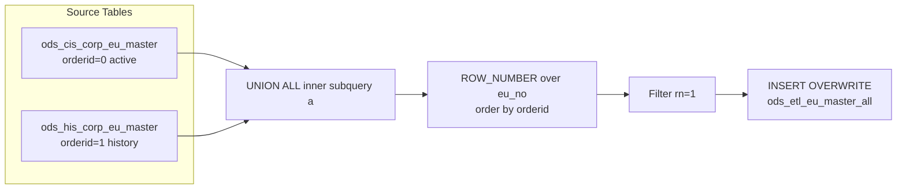

# ODS ETL: EU Master Unified Snapshot (`ods_etl_eu_master_all`)

- artifact_type: etl_table
- artifact_id: ods_gbl.ods_etl_eu_master_all
- domain: customer
- one_line_purpose: This job merges **active and historical end-user (EU) master records** into a single, de-duplicated ODS ETL table. The active/current record takes priority over the historical one. The result is a canonical view of every known end-user enti...
- layer_type: ODS
- source_kind: etl_sql
- evidence_source: source/etl/sql/customer/source/etl/flows/public_order_tools/ingest/public_eu_dimension/script/ods_etl_eu_master_all.sql

---

## L1 Data Foundation

### Identity and physical mapping
- **Table:** `ods_gbl.ods_etl_eu_master_all`
- **Layer type:** ODS
- **Canonical / derived:** Derived / ETL-loaded (see L3)
- **Owner team:** not registered in metadata catalog

### Grain, scope, exclusions
- **Grain:** one row per `eu_no` — a unique end-user entity.
- **Scope:** See L2 business purpose / L3 filters
- **Partition:** none — full overwrite of the target table on each run. - resolved from pipeline (see L4)
- **Natural key:** `eu_no`.
- **Exclusions:** Not documented in repository

#### Grain detail (preserved)

- **Grain:** one row per `eu_no` — a unique end-user entity.
- **Partition:** none — full overwrite of the target table on each run.
- **Natural key:** `eu_no`.

---

### Cross-engine presence
| Engine | Present | Canonical FQN | Notes |
|--------|---------|---------------|-------|
| Hive | yes | `ods_etl_eu_master_all` | ETL target / intermediate per evidence script |
| Vertica | pending | `ods_etl_eu_master_all` | Confirm via hive2vertica flow evidence / MCP |

### Physical schema reference

Pointer block only - full column catalog lives in WKB L1 storage JSON.

| Field | Value |
|-------|-------|
| **Authoritative catalog** | WKB L1 storage seed (not duplicated in this file) |
| **entity_id** | `ods_gbl.ods_etl_eu_master_all` |
| **l1_catalog_seed** | `target/storage/wkb/snapshots/_snapshot_id_template/l1_catalog/{engine}_{schema}_{table}.json` |
| **column_count** | pending (run ddl_seed_writer) |
| **partition_keys** | `none — full overwrite of the target table on each run.` |
| **ddl_source** | pending Bitbucket DDL / Vertica metadata ingest |
| **retrieval** | `python -m tools.wkb.indexing.run_query --query "customer ods_etl_eu_master_all schema" --intent find_table_schema` |

### Lineage
| Object | Role |
|--------|------|
| `ods_${country_code}.ods_cis_corp_eu_master` | Primary source — active EU master records |
| `ods_${country_code}.ods_his_corp_eu_master` | Fallback source — historical EU master records |
| `ods_${country_code}.ods_etl_eu_master_all` | **Target** — unified EU master ODS ETL table |

---

### Freshness and load path
| Item | Value |
|------|-------|
| Load pattern | See L3 end-to-end / INSERT pattern in evidence script |
| Schedule | Not documented in repository |
| Parameters | `country_code` |


---

## L2 Declarative Knowledge

### Business purpose
This job merges **active and historical end-user (EU) master records** into a single, de-duplicated ODS ETL table. The active/current record takes priority over the historical one. The result is a canonical view of every known end-user entity — including type, name, reseller linkage, associated customer number, and lifecycle dates — that downstream dimension jobs can join without having to manage the active-vs-history split themselves.

---

### Audience and use cases
| Audience | How they benefit |
|----------|-----------------|
| **Customer master / MDM teams** | Single authoritative EU-level entity record for customer data management, de-duplication, and master data governance. |
| **Dimension builders** | `public_eu_dimension.sql` and similar jobs join this table to add EU entity attributes (type, name, reseller, customer linkage) to contact and location records. |
| **Sales & channel teams** | `eu_type`, `reseller_no`, `discontinued`, `cust_no` support partner classification, reseller program management, and customer hierarchy analysis. |

---

### Fact key resolution
- Natural key: `eu_no`.
- FK / label-on attributes: see L3 dimension join patterns and step-by-step logic.
- Negative assertion: do not treat descriptive labels as grain keys unless listed under natural key.

### Time field semantics
- **date_flag / partition columns:** none — full overwrite of the target table on each run.
- Primary reporting filter should use the partition column(s) documented in L1; resolve values via L4.


### Metrics served

| Category | Column | Logical metric | Business reading |
|----------|--------|----------------|------------------|
| Measures | — | — | No measure columns mapped for this table. |

### Metric serving map

**Formula authority:** [`source/contracts/customer/metric-index.md`](../../source/contracts/customer/metric-index.md)

N/A — no measure columns mapped for this table.

### etl_metrics

No governed logical metrics from `source/contracts/customer/metric-index.md` are mapped on this table.

---

### Metric serving map
N/A - not a `*_comb_mtd` / multi-period wide serving table (or map not present in legacy doc).


### Data products and column groups (preserved)

### Identifiers and relationships

- **End-user entity:** `eu_no`
- **Customer linkage:** `cust_no` — the distributor customer number associated with this EU
- **Reseller linkage:** `reseller_no` — reseller this EU is associated with
- **External reference:** `cust_ref_id` — external customer reference ID

### EU entity attributes

- `eu_type` — type classification of the end-user entity
- `eu_name` — display name of the end-user
- `ship_to_loc` — the primary ship-to location number for this EU (links to `ods_etl_eu_location_all.loc_no`)
- `last_call` — date of the most recent sales call on this EU
- `discontinued` — flag indicating whether this EU is discontinued

### Lifecycle dates and audit

- `entry_datetime`, `entry_id` — when and by whom the record was created
- `update_datetime`, `update_id` — when and by whom the record was last updated
- `delete_datetime`, `delete_id` — when and by whom the record was deleted (if applicable)
- `u_version` — record version number
- `etl_timestamp` — when this ETL run loaded the record (Los Angeles time)
- `data_source` — which source table the row came from (`ods_cis_corp_eu_master` or `ods_his_corp_eu_master`)

---

### etl_metrics

#### `etl_timestamp`
- **Source:** [metric-index.md](../../source/contracts/customer/metric-index.md#etl_timestamp)
- **Business definition:** Current run time converted to Los Angeles (Pacific) timezone.
```sql
from_utc_timestamp(current_timestamp(), 'America/Los_Angeles')
```


---

## L3 Procedural Knowledge

### Query and routing rules
**Business filters:** Use partition / date keys from L1 grain for reporting scope.
**Technical predicates (load only):** See Key filters and step-by-step logic below.

### Dimension join patterns
| Dimension FQN | Join keys | Purpose | Evidence |
|---------------|-----------|---------|----------|
| See step-by-step / base tables | See L3 steps | Dimension enrichment | `source/etl/sql/customer/source/etl/flows/public_order_tools/ingest/public_eu_dimension/script/ods_etl_eu_master_all.sql` |

### Key filters and ETL business logic
### Step 1 — Inner subquery `a` (UNION ALL)

**Source:** `ods_cis_corp_eu_master` UNION ALL `ods_his_corp_eu_master`

**What happens to columns:**
- All columns from both tables are selected with `SELECT *`.
- `orderid` — literal `0` for active rows, `1` for history rows. Controls which record wins in the ranking step.
- `data_source` — literal string: `'ods_cis_corp_eu_master'` or `'ods_his_corp_eu_master'`. Records provenance.

---

### Step 2 — Outer subquery `aa` (de-duplication ranking)

**Source:** subquery `a`

**Derived columns:**

| Column | Formula | Plain language |
|--------|---------|----------------|
| `rn` | `ROW_NUMBER() OVER (PARTITION BY eu_no ORDER BY orderid ASC)` | Ranks rows within each EU entity. Active record (orderid=0) gets rn=1; history (orderid=1) gets rn=2 only when both exist. Note: partition is on `eu_no` only — unlike the location script which partitions on `(eu_no, loc_no)`. |

**Filter:** `WHERE aa.rn = 1` — retains exactly one row per `eu_no`.

---

### Step 3 — Final `INSERT OVERWRITE` into `ods_etl_eu_master_all`

**From:** outer subquery `aa` where `rn = 1`

**Explicit column list written to target:**
`eu_no`, `u_version`, `eu_type`, `ship_to_loc`, `eu_name`, `last_call`, `reseller_no`, `discontinued`, `cust_no`, `entry_datetime`, `entry_id`, `cust_ref_id`, `update_datetime`, `update_id`, `delete_datetime`, `delete_id`, `etl_timestamp`, `data_source`

**Derived columns computed at INSERT:**

| Column | Formula | Plain language |
|--------...

### Standard time-filter SQL
```sql
-- relative period filter using resolved partition value (see L4)
SELECT *
FROM ods_etl_eu_master_all
WHERE /* partition predicate */ date_flag = '${partition_value}';
```

### End-to-end flow
**Runtime parameters:** `country_code`
**Target table:** `ods_${country_code}.ods_etl_eu_master_all` — full overwrite, no partitioning.

1. Read all rows from `ods_cis_corp_eu_master` (active); tag with `orderid = 0` and `data_source = 'ods_cis_corp_eu_master'`.
2. UNION ALL with all rows from `ods_his_corp_eu_master` (history); tag with `orderid = 1` and `data_source = 'ods_his_corp_eu_master'`.
3. Apply `ROW_NUMBER()` partitioned by `eu_no` ordered by `orderid` ascending — active (0) ranks first.
4. Filter to `rn = 1` — keep exactly one row per EU entity, favouring the active record.
5. Add `etl_timestamp` and write to target via `INSERT OVERWRITE`.



---


#### High-level stages (preserved)

| Stage | Business meaning |
|-------|-----------------|
| **Active records** | Reads all rows from the active EU master table (`ods_cis_corp_eu_master`), assigns priority `0` — these are preferred. |
| **Historical records** | Reads all rows from the history EU master table (`ods_his_corp_eu_master`), assigns priority `1` — these are the fallback when no active record exists. |
| **De-duplication** | Unions both sets and applies `ROW_NUMBER()` over `eu_no` ordered by priority. Keeps only `rn = 1` — the active record for any EU that exists in both tables, or the history record if only that exists. |
| **ETL metadata** | Stamps the current timestamp (Los Angeles timezone) as `etl_timestamp` and the source table name as `data_source`. |
| **Full overwrite** | Overwrites the entire target table with the de-duplicated result. |

**Parameters:** `country_code`

---


### Base tables register
| Object | Role in this job |
|--------|-----------------|
| `ods_${country_code}.ods_cis_corp_eu_master` | **Primary source.** Active/current EU master records. Selected with `orderid = 0` — preferred in de-duplication. Provides all EU master columns. |
| `ods_${country_code}.ods_his_corp_eu_master` | **Fallback source.** Historical EU master records. Selected with `orderid = 1` — used only when no active record exists for the same `eu_no`. |

**Temporary tables (inside the job only):**
Inner subquery `a` (UNION ALL) → outer subquery `aa` (ROW_NUMBER) → (final `INSERT OVERWRITE`)

---

### Step-by-step logic
### Step 1 — Inner subquery `a` (UNION ALL)

**Source:** `ods_cis_corp_eu_master` UNION ALL `ods_his_corp_eu_master`

**What happens to columns:**
- All columns from both tables are selected with `SELECT *`.
- `orderid` — literal `0` for active rows, `1` for history rows. Controls which record wins in the ranking step.
- `data_source` — literal string: `'ods_cis_corp_eu_master'` or `'ods_his_corp_eu_master'`. Records provenance.

---

### Step 2 — Outer subquery `aa` (de-duplication ranking)

**Source:** subquery `a`

**Derived columns:**

| Column | Formula | Plain language |
|--------|---------|----------------|
| `rn` | `ROW_NUMBER() OVER (PARTITION BY eu_no ORDER BY orderid ASC)` | Ranks rows within each EU entity. Active record (orderid=0) gets rn=1; history (orderid=1) gets rn=2 only when both exist. Note: partition is on `eu_no` only — unlike the location script which partitions on `(eu_no, loc_no)`. |

**Filter:** `WHERE aa.rn = 1` — retains exactly one row per `eu_no`.

---

### Step 3 — Final `INSERT OVERWRITE` into `ods_etl_eu_master_all`

**From:** outer subquery `aa` where `rn = 1`

**Explicit column list written to target:**
`eu_no`, `u_version`, `eu_type`, `ship_to_loc`, `eu_name`, `last_call`, `reseller_no`, `discontinued`, `cust_no`, `entry_datetime`, `entry_id`, `cust_ref_id`, `update_datetime`, `update_id`, `delete_datetime`, `delete_id`, `etl_timestamp`, `data_source`

**Derived columns computed at INSERT:**

| Column | Formula | Plain language |
|--------|---------|----------------|
| `etl_timestamp` | `from_utc_timestamp(current_timestamp(), 'America/Los_Angeles')` | Current run time converted to Los Angeles (Pacific) timezone. |

---

### Relationship map (embedded)

| from_fqn | to_fqn | cardinality | join_keys | provenance |
|----------|--------|-------------|-----------|------------|
| — | — | — | — | Not documented in repository |

`source/ref/customer/table relationship.txt`: Not documented in repository.

### Special logic (embedded)

Not documented in repository

### Column / field derivations (from ETL SQL)

| target_column | expression_sql | upstream_columns | upstream_tables | transform_kind | evidence |
|---------------|----------------|------------------|-----------------|----------------|----------|
| `eu_no` | `eu_no` | `eu_no` | `ods_${country_code}.ods_cis_corp_eu_master`, `ods_${country_code}.ods_his_corp_eu_master` | passthrough | `source/etl/sql/customer/public_order_scripts/public_eu_dimension/script/ods_etl_eu_master_all.sql:4` |
| `u_version` | `u_version` | `u_version` | `ods_${country_code}.ods_cis_corp_eu_master`, `ods_${country_code}.ods_his_corp_eu_master` | passthrough | `source/etl/sql/customer/public_order_scripts/public_eu_dimension/script/ods_etl_eu_master_all.sql:4` |
| `eu_type` | `eu_type` | `eu_type` | `ods_${country_code}.ods_cis_corp_eu_master`, `ods_${country_code}.ods_his_corp_eu_master` | passthrough | `source/etl/sql/customer/public_order_scripts/public_eu_dimension/script/ods_etl_eu_master_all.sql:4` |
| `ship_to_loc` | `ship_to_loc` | `ship_to_loc` | `ods_${country_code}.ods_cis_corp_eu_master`, `ods_${country_code}.ods_his_corp_eu_master` | passthrough | `source/etl/sql/customer/public_order_scripts/public_eu_dimension/script/ods_etl_eu_master_all.sql:4` |
| `eu_name` | `eu_name` | `eu_name` | `ods_${country_code}.ods_cis_corp_eu_master`, `ods_${country_code}.ods_his_corp_eu_master` | passthrough | `source/etl/sql/customer/public_order_scripts/public_eu_dimension/script/ods_etl_eu_master_all.sql:4` |
| `last_call` | `last_call` | `last_call` | `ods_${country_code}.ods_cis_corp_eu_master`, `ods_${country_code}.ods_his_corp_eu_master` | passthrough | `source/etl/sql/customer/public_order_scripts/public_eu_dimension/script/ods_etl_eu_master_all.sql:4` |
| `reseller_no` | `reseller_no` | `reseller_no` | `ods_${country_code}.ods_cis_corp_eu_master`, `ods_${country_code}.ods_his_corp_eu_master` | passthrough | `source/etl/sql/customer/public_order_scripts/public_eu_dimension/script/ods_etl_eu_master_all.sql:4` |
| `discontinued` | `discontinued` | `discontinued` | `ods_${country_code}.ods_cis_corp_eu_master`, `ods_${country_code}.ods_his_corp_eu_master` | passthrough | `source/etl/sql/customer/public_order_scripts/public_eu_dimension/script/ods_etl_eu_master_all.sql:4` |
| `cust_no` | `cust_no` | `cust_no` | `ods_${country_code}.ods_cis_corp_eu_master`, `ods_${country_code}.ods_his_corp_eu_master` | passthrough | `source/etl/sql/customer/public_order_scripts/public_eu_dimension/script/ods_etl_eu_master_all.sql:4` |
| `entry_datetime` | `entry_datetime` | `entry_datetime` | `ods_${country_code}.ods_cis_corp_eu_master`, `ods_${country_code}.ods_his_corp_eu_master` | passthrough | `source/etl/sql/customer/public_order_scripts/public_eu_dimension/script/ods_etl_eu_master_all.sql:4` |
| `entry_id` | `entry_id` | `entry_id` | `ods_${country_code}.ods_cis_corp_eu_master`, `ods_${country_code}.ods_his_corp_eu_master` | passthrough | `source/etl/sql/customer/public_order_scripts/public_eu_dimension/script/ods_etl_eu_master_all.sql:4` |
| `cust_ref_id` | `cust_ref_id` | `cust_ref_id` | `ods_${country_code}.ods_cis_corp_eu_master`, `ods_${country_code}.ods_his_corp_eu_master` | passthrough | `source/etl/sql/customer/public_order_scripts/public_eu_dimension/script/ods_etl_eu_master_all.sql:4` |
| `update_datetime` | `update_datetime` | `update_datetime` | `ods_${country_code}.ods_cis_corp_eu_master`, `ods_${country_code}.ods_his_corp_eu_master` | passthrough | `source/etl/sql/customer/public_order_scripts/public_eu_dimension/script/ods_etl_eu_master_all.sql:4` |
| `update_id` | `update_id` | `update_id` | `ods_${country_code}.ods_cis_corp_eu_master`, `ods_${country_code}.ods_his_corp_eu_master` | passthrough | `source/etl/sql/customer/public_order_scripts/public_eu_dimension/script/ods_etl_eu_master_all.sql:4` |
| `delete_datetime` | `delete_datetime` | `delete_datetime` | `ods_${country_code}.ods_cis_corp_eu_master`, `ods_${country_code}.ods_his_corp_eu_master` | passthrough | `source/etl/sql/customer/public_order_scripts/public_eu_dimension/script/ods_etl_eu_master_all.sql:4` |
| `delete_id` | `delete_id` | `delete_id` | `ods_${country_code}.ods_cis_corp_eu_master`, `ods_${country_code}.ods_his_corp_eu_master` | passthrough | `source/etl/sql/customer/public_order_scripts/public_eu_dimension/script/ods_etl_eu_master_all.sql:4` |
| `etl_timestamp` | `from_utc_timestamp(current_timestamp(),'America/Los_Angeles')` | `from_utc_timestamp`, `current_timestamp`, `America`, `Los_Angeles` | `ods_${country_code}.ods_cis_corp_eu_master`, `ods_${country_code}.ods_his_corp_eu_master` | arithmetic | `source/etl/sql/customer/public_order_scripts/public_eu_dimension/script/ods_etl_eu_master_all.sql:5` |
| `data_source` | `data_source` | `data_source` | `ods_${country_code}.ods_cis_corp_eu_master`, `ods_${country_code}.ods_his_corp_eu_master` | passthrough | `source/etl/sql/customer/public_order_scripts/public_eu_dimension/script/ods_etl_eu_master_all.sql:6` |

### Sentinel and code values
| Value | Meaning |
|-------|---------|
| `orderid = 0` | Active/current record — highest priority in `ROW_NUMBER()` ranking. |
| `orderid = 1` | Historical record — only used when no active record exists for the same `eu_no`. |
| `data_source = 'ods_cis_corp_eu_master'` | Row originated from the active EU master table. |
| `data_source = 'ods_his_corp_eu_master'` | Row originated from the history EU master table. |
| `rn = 1` | The surviving, de-duplicated record for each `eu_no`. |

---

---

## L4 Validation

### Resolved partition value
| Step | Source | How partition / date scope is determined |
|------|--------|------------------------------------------|
| 1 | evidence script / flow | See parameters in L1 Freshness and L3 filters - `source/etl/sql/customer/source/etl/flows/public_order_tools/ingest/public_eu_dimension/script/ods_etl_eu_master_all.sql` |

**Plain language:** Partition and date scope follow Azkaban/bootstrap parameters documented in the source script and orchestrating flow; do not hardcode calendar literals.

### Data quality checks
- Prefer row-count-by-partition, metric sums, and grain duplicate checks (see Validation SQL).
- Additional checks from legacy caveats / operational notes when present.

### Validation SQL
```sql
-- 1) Row count by partition
SELECT ${partition_col}, COUNT(*) AS row_cnt
FROM ods_etl_eu_location_all.loc_no
WHERE ${partition_col} = '${partition_value}'
GROUP BY ${partition_col};

-- 2) Metric sum by business dimension (top deltas)
SELECT ${dim_key}, SUM(${metric}) AS metric_sum
FROM ods_etl_eu_location_all.loc_no
WHERE ${partition_col} = '${partition_value}'
GROUP BY ${dim_key}
ORDER BY ABS(SUM(${metric})) DESC
LIMIT 20;

-- 3) Grain duplicate check
SELECT ${grain_key_1}, ${grain_key_2}, ${grain_key_3}, ${partition_col}, COUNT(*) AS cnt
FROM ods_etl_eu_location_all.loc_no
WHERE ${partition_col} = '${partition_value}'
GROUP BY ${grain_key_1}, ${grain_key_2}, ${grain_key_3}, ${partition_col}
HAVING COUNT(*) > 1;
```

Replace placeholders from this file's Grain and keys / Data you can fetch sections, and use the resolved partition value from run scope.

### Caveats for interpretation
- **Full overwrite on every run** — there is no partition or incremental logic; the entire table is replaced each execution.
- **Active record always wins** — if both active and history have a record for the same `eu_no`, the active one is kept regardless of version or timestamp.
- **De-duplication key is `eu_no` only** — unlike `ods_etl_eu_location_all` which de-duplicates on `(eu_no, loc_no)`, this table de-duplicates on `eu_no` alone. One EU entity gets exactly one master row.
- **`data_source` is the only lineage indicator** — check this column to know whether a row came from the active or history source.
- **All columns are selected with `SELECT *`** — any schema change in either source table will affect this job.

---

### Conflicts and open questions
- Schedule, owner, SLA: Not documented in repository (unless preserved schedule evidence above).
- Vertica MCP verification: pending unless confirmed in L5.


---

## L5 Runtime View

### Query path and engine preference
| Role | Hive object | Vertica object | Sync mode | Evidence | MCP verified |
|------|-------------|----------------|-----------|----------|--------------|
| **Query for reporting** | *See script lineage* | `ods_etl_eu_location_all.loc_no` | *Verify from flow* | *Add flow file:line* | pending |
| **Hive alternative** | `*` | `ods_etl_eu_location_all.loc_no` | - | *See dependencies* | - |
| **ETL internal** | staging/temp tables | *Not synced to Vertica* | - | *See step-by-step logic* | - |

Business users should query `ods_etl_eu_location_all.loc_no` in Vertica once MCP verification is completed for this document.

### Access constraints
- Country / company schema parameters may apply (`literal_country`, `company_no`, etc.).
- Hive-only staging objects are not reporting surfaces unless synced.

### Query risk profile
| Field | Value |
|-------|-------|
| requires_date_predicate | unknown |
| scan_risk_tier | high |

---

## L6 Access and Consumption

### Primary consumers and use cases
| Audience | How they benefit |
|----------|-----------------|
| **Customer master / MDM teams** | Single authoritative EU-level entity record for customer data management, de-duplication, and master data governance. |
| **Dimension builders** | `public_eu_dimension.sql` and similar jobs join this table to add EU entity attributes (type, name, reseller, customer linkage) to contact and location records. |
| **Sales & channel teams** | `eu_type`, `reseller_no`, `discontinued`, `cust_no` support partner classification, reseller program management, and customer hierarchy analysis. |

---

### Representative query patterns
```sql
-- certified / illustrative lookup - replace predicates from L1/L4
SELECT *
FROM ods_etl_eu_master_all
WHERE date_flag = '${partition_value}'
LIMIT 100;
```

### Dependencies and notes
### Upstream objects (verified)

| Object | Usage | Evidence |
|--------|-------|----------|
| `ods_${country_code}.ods_cis_corp_eu_master` | Active EU master rows — all columns | `source/etl/sql/customer/source/etl/flows/public_order_tools/ingest/public_eu_dimension/script/ods_etl_eu_master_all.sql:19` |
| `ods_${country_code}.ods_his_corp_eu_master` | Historical EU master rows — all columns | `source/etl/sql/customer/source/etl/flows/public_order_tools/ingest/public_eu_dimension/script/ods_etl_eu_master_all.sql:26` |

### Downstream consumers (verified)

| Object / script | Evidence |
|-----------------|----------|
| `public_eu_dimension.sql` — joins `ods_etl_eu_master_all` to build `dim_pub_eu_contacts` | `source/etl/sql/customer/source/etl/flows/public_order_tools/ingest/public_eu_dimension/script/public_eu_dimension.sql:9` |

### Operational detail (verified)

- Full overwrite: `INSERT OVERWRITE TABLE ods_${country_code}.ods_etl_eu_master_all` — no partition clause — `ods_etl_eu_master_all.sql:2`

### Not documented in repository

- Schedule, owner, SLA — not in scripts or configs
- Azkaban / Livy job name and flow file — not present in `source/etl/sql/customer/source/etl/flows/public_order_tools/ingest/public_eu_dimension/`

---

*Document generated from `source/etl/sql/customer/source/etl/flows/public_order_tools/ingest/public_eu_dimension/script/ods_etl_eu_master_all.sql`.*

#### Not documented in repository
- Owner, SLA (unless schedule evidence preserved above)
- Any dependency without `file:line` evidence in this document

---

*Document migrated to L1-L6 from legacy Knowledgebase content. Evidence: `source/etl/sql/customer/source/etl/flows/public_order_tools/ingest/public_eu_dimension/script/ods_etl_eu_master_all.sql`.*
