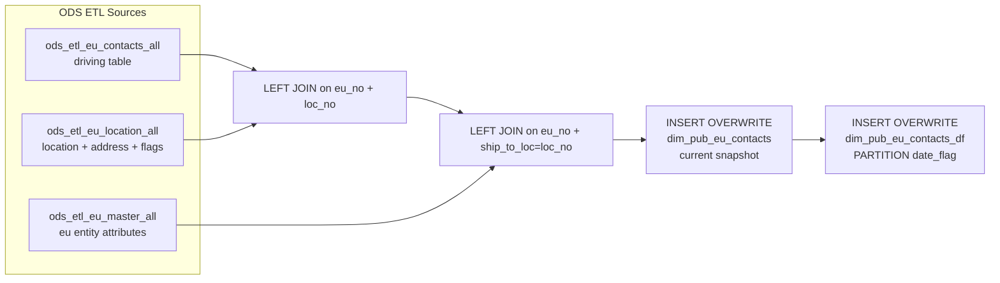

# DIM: EU Contact Dimension — Current and Daily Snapshot (`dim_pub_eu_contacts` / `dim_pub_eu_contacts_df`)

- artifact_type: etl_table
- artifact_id: dim_us.dim_pub_eu_contacts_df
- domain: customer
- one_line_purpose: This job assembles the **complete end-user (EU) contact dimension** by joining EU contact records with their corresponding location address and EU master entity attributes. It writes two outputs: a **current full snapshot** (`dim_pub_eu_con...
- layer_type: DIM
- source_kind: etl_sql
- evidence_source: source/etl/sql/customer/source/etl/flows/public_order_tools/ingest/public_eu_dimension/script/public_eu_dimension.sql

---

## L1 Data Foundation

### Identity and physical mapping
- **Table:** `dim_us.dim_pub_eu_contacts_df`
- **Layer type:** DIM
- **Canonical / derived:** Derived / ETL-loaded (see L3)
- **Owner team:** not registered in metadata catalog

### Grain, scope, exclusions
- **Grain:** one row per `(eu_no, loc_no, contact_no)` — a unique contact at a specific end-user location.
- **Scope:** See L2 business purpose / L3 filters
- **Partition:** Not documented in repository - resolved from pipeline (see L4)
- **Natural key:** `eu_no`, `loc_no`, `contact_no` (within a `date_flag` partition for the `_df` table).
- **Exclusions:** Not documented in repository

#### Grain detail (preserved)

- **Grain:** one row per `(eu_no, loc_no, contact_no)` — a unique contact at a specific end-user location.
- **Partition (`dim_pub_eu_contacts_df`):** `date_flag` — business date on which this snapshot was taken.
- **Natural key:** `eu_no`, `loc_no`, `contact_no` (within a `date_flag` partition for the `_df` table).

---

### Cross-engine presence
| Engine | Present | Canonical FQN | Notes |
|--------|---------|---------------|-------|
| Hive | yes | `dim_pub_eu_contacts_df` | ETL target / intermediate per evidence script |
| Vertica | pending | `dim_pub_eu_contacts_df` | Confirm via hive2vertica flow evidence / MCP |

### Physical schema reference

Pointer block only - full column catalog lives in WKB L1 storage JSON.

| Field | Value |
|-------|-------|
| **Authoritative catalog** | WKB L1 storage seed (not duplicated in this file) |
| **entity_id** | `dim_us.dim_pub_eu_contacts_df` |
| **l1_catalog_seed** | `target/storage/wkb/snapshots/_snapshot_id_template/l1_catalog/{engine}_{schema}_{table}.json` |
| **column_count** | pending (run ddl_seed_writer) |
| **partition_keys** | `Not documented in repository` |
| **ddl_source** | pending Bitbucket DDL / Vertica metadata ingest |
| **retrieval** | `python -m tools.wkb.indexing.run_query --query "customer public_eu_dimension schema" --intent find_table_schema` |

### Lineage
| Object | Role |
|--------|------|
| `ods_${country_code}.ods_etl_eu_contacts_all` | Primary source — EU contact rows (driving table) |
| `ods_${country_code}.ods_etl_eu_location_all` | Location dimension — address and flags |
| `ods_${country_code}.ods_etl_eu_master_all` | EU master dimension — entity attributes |
| `dim_${country_code}.dim_pub_eu_contacts` | **Target 1** — current full snapshot; also source for daily partition write |
| `dim_${country_code}.dim_pub_eu_contacts_df` | **Target 2** — date-partitioned historical snapshot |

---

### Freshness and load path
| Item | Value |
|------|-------|
| Load pattern | See L3 end-to-end / INSERT pattern in evidence script |
| Schedule | Not documented in repository |
| Parameters | `country_code`, `date_flag` |


---

## L2 Declarative Knowledge

### Business purpose
This job assembles the **complete end-user (EU) contact dimension** by joining EU contact records with their corresponding location address and EU master entity attributes. It writes two outputs: a **current full snapshot** (`dim_pub_eu_contacts`) that always reflects the latest state, and a **date-partitioned copy** (`dim_pub_eu_contacts_df`) that preserves a point-in-time slice for each business date. Together these tables enable both live reporting against current contact data and historical trend or audit analysis across any previous date.

---

### Audience and use cases
| Audience | How they benefit |
|----------|-----------------|
| **Sales & channel teams** | Contact-level information — name, email, phone — enriched with territory, reseller, and account flags for outreach and CRM integration. |
| **Customer master / MDM teams** | `primary_contact_flag` and full address per EU+location+contact for contact hierarchy and data quality management. |
| **Finance / reporting** | `cust_no`, `eu_type`, `reseller_no`, `discontinued` support customer hierarchy joins and partner program reporting. |
| **Analysts / BI** | `dim_pub_eu_contacts` for live queries; `dim_pub_eu_contacts_df` for point-in-time or change-tracking analysis. |

---

### Identifier search profile
- Primary lookup keys: see natural key under L1 Grain.
- Use latest snapshot / active flags when documented in L3 filters.

### Time field semantics
- **date_flag / partition columns:** Not documented in repository
- Primary reporting filter should use the partition column(s) documented in L1; resolve values via L4.


### Metrics served

| Category | Column | Logical metric | Business reading |
|----------|--------|----------------|------------------|
| Measures | — | — | No measure columns mapped for this table. |

### Metric serving map

**Formula authority:** [`source/contracts/customer/metric-index.md`](../../source/contracts/customer/metric-index.md)

N/A — no measure columns mapped for this table.

### etl_metrics

No governed logical metrics from `source/contracts/customer/metric-index.md` are mapped on this table.

---

### Metric serving map
N/A - not a `*_comb_mtd` / multi-period wide serving table (or map not present in legacy doc).


### Data products and column groups (preserved)

### Identifiers and relationships

- **End-user / location / contact:** `eu_no`, `loc_no`, `contact_no`
- **Customer linkage:** `cust_no` — distributor customer number for this EU entity
- **Reseller linkage:** `reseller_no`
- **External reference:** `cust_ref_id`

### Contact attributes

- `contact_name`, `title` — contact's full name and title
- `email_address`, `phone_no`, `fax_no` — contact details
- `contact_type` — classification of the contact role
- `group_id` — contact group association
- `primary_contact_flag` — `'Y'` if this contact is the primary contact for the location, `'N'` otherwise
- `contact_entry_id`, `contact_entry_datetime` — who and when created the contact record

### Location attributes (from `ods_etl_eu_location_all`)

- `loc_name` — location name
- `street_address`, `po_box`, `city`, `state`, `zip_code`, `country` — full mailing address
- `sold_since`, `last_purchase` — account activity dates
- `statement`, `label_printed` — statement and print flags
- `is_sell_to`, `is_bill_to`, `is_ship_to`, `is_login` — location eligibility and access flags

### EU master attributes (from `ods_etl_eu_master_all`)

- `eu_type` — classification of the end-user entity
- `eu_name` — end-user entity name
- `last_call` — most recent sales call date
- `reseller_no` — associated reseller
- `discontinued` — whether this EU is discontinued
- `cust_no` — distributor customer number
- `cust_ref_id` — external customer reference

---

### etl_metrics

#### `primary_contact_flag`
- **Source:** [metric-index.md](../../source/contracts/customer/metric-index.md#primary_contact_flag)
- **Business definition:** Marks this contact as the primary contact for the location when their contact number matches the location's designated primary contact.
```sql
IF(ec.contact_no = el.primary_contact, 'Y', 'N')
```


---

## L3 Procedural Knowledge

### Query and routing rules
**Business filters:** Use partition / date keys from L1 grain for reporting scope.
**Technical predicates (load only):** See Key filters and step-by-step logic below.

### Dimension join patterns
| Dimension FQN | Join keys | Purpose | Evidence |
|---------------|-----------|---------|----------|
| See step-by-step / base tables | See L3 steps | Dimension enrichment | `source/etl/sql/customer/source/etl/flows/public_order_tools/ingest/public_eu_dimension/script/public_eu_dimension.sql` |

### Key filters and ETL business logic
### Step 1 — `INSERT OVERWRITE` into `dim_pub_eu_contacts`

**From:** `ods_etl_eu_contacts_all` (`ec`)

**Left joins:**

| Join | Keys | Purpose |
|------|------|---------|
| `ods_etl_eu_location_all` (`el`) | `el.eu_no = ec.eu_no AND el.loc_no = ec.loc_no` | Adds location address, activity dates, and eligibility flags for the contact's location. Also provides `el.primary_contact` for the flag computation. |
| `ods_etl_eu_master_all` (`em`) | `em.eu_no = el.eu_no AND em.ship_to_loc = el.loc_no` | Adds EU entity-level attributes. The join key uses `el.loc_no` matched to `em.ship_to_loc` — meaning only the EU master record whose primary ship-to location matches the contact's location is joined. |

**Derived columns:**

| Column | Logic | Plain language |
|--------|-------|----------------|
| `primary_contact_flag` | `IF(ec.contact_no = el.primary_contact, 'Y', 'N')` | Marks this contact as the primary contact for the location when their contact number matches the location's designated primary contact. |

**Pass-through columns from `ec` (contacts):**
`eu_no`, `loc_no`, `contact_no`, `title`, `contact_name`, `email_address`, `phone_no`, `fax_no`, `ec.entry_id AS contact_entry_id`, `ec.entry_datetime AS contact_entry_datetime`, `contact_type`, `group_id`

**Pass-through columns from `el` (location):**
`loc_name`, `street_address`, `po_box`, `city`, `state`, `zip_code`, `country`, `sold_since`, `last_purchase`, `statement`, `label_printed`, `is_sell_to`, `is_bill_to`, `is_ship_to`...

### Standard time-filter SQL
```sql
-- relative period filter using resolved partition value (see L4)
SELECT *
FROM dim_pub_eu_contacts_df
WHERE /* partition predicate */ date_flag = '${partition_value}';
```

### End-to-end flow
**Runtime parameters:** `country_code`, `date_flag`
**Target tables:**
- `dim_${country_code}.dim_pub_eu_contacts` — full overwrite, no partition
- `dim_${country_code}.dim_pub_eu_contacts_df` — overwrite partition `date_flag = ${date_flag}`

1. Read all EU contact rows from `ods_etl_eu_contacts_all` (driving table).
2. Left-join `ods_etl_eu_location_all` on `eu_no + loc_no` — adds address, flags, and activity dates.
3. Left-join `ods_etl_eu_master_all` on `em.eu_no = el.eu_no AND em.ship_to_loc = el.loc_no` — adds EU entity attributes.
4. Compute `primary_contact_flag` — compare `ec.contact_no` to `el.primary_contact`.
5. **INSERT OVERWRITE** `dim_pub_eu_contacts` — full current snapshot.
6. **INSERT OVERWRITE** `dim_pub_eu_contacts_df PARTITION (date_flag = ${date_flag})` — copies all rows from the current snapshot into the daily partition.



---


#### High-level stages (preserved)

| Stage | Business meaning |
|-------|-----------------|
| **Contact base** | Reads all EU contact rows from `ods_etl_eu_contacts_all` — one row per EU + location + contact combination. This is the driving table. |
| **Location enrichment** | Left-joins `ods_etl_eu_location_all` on `eu_no + loc_no` to add address, location flags, and account activity dates. |
| **Master enrichment** | Left-joins `ods_etl_eu_master_all` on `em.eu_no = el.eu_no AND em.ship_to_loc = el.loc_no` to add EU entity attributes (type, name, reseller, customer linkage, status). |
| **Primary contact flag** | Computes whether this contact is the designated primary contact for the location (`contact_no = location.primary_contact → 'Y', else 'N'`). |
| **Current snapshot write** | Full overwrite of `dim_pub_eu_contacts` — always reflects the latest state across all EU contacts. |
| **Daily partition write** | Copies all rows from `dim_pub_eu_contacts` into `dim_pub_eu_contacts_df` for the specific `date_flag` partition — creating a point-in-time historical record. |

**Parameters:** `country_code`, `date_flag`

---


### Base tables register
| Object | Role in this job |
|--------|-----------------|
| `ods_${country_code}.ods_etl_eu_contacts_all` | **Primary source (driving table).** One row per EU+location+contact. Provides all contact-level attributes: `eu_no`, `loc_no`, `contact_no`, `title`, `contact_name`, `email_address`, `phone_no`, `fax_no`, `entry_id`, `entry_datetime`, `contact_type`, `group_id`, `primary_contact`. |
| `ods_${country_code}.ods_etl_eu_location_all` | **Location dimension.** Joined on `eu_no + loc_no`. Adds address, location flags, and account activity dates. Also provides `primary_contact` to compute `primary_contact_flag`. |
| `ods_${country_code}.ods_etl_eu_master_all` | **EU master dimension.** Joined on `em.eu_no = el.eu_no AND em.ship_to_loc = el.loc_no`. Adds EU entity type, name, reseller, customer linkage, and status. |
| `dim_${country_code}.dim_pub_eu_contacts` | **Intermediate target / source for daily partition.** Full current snapshot; also read immediately to populate `dim_pub_eu_contacts_df`. |
| `dim_${country_code}.dim_pub_eu_contacts_df` | **Daily partition target.** Point-in-time historical copy partitioned by `date_flag`. |

**Temporary tables (inside the job only):** None — two direct INSERT statements.

---

### Step-by-step logic
### Step 1 — `INSERT OVERWRITE` into `dim_pub_eu_contacts`

**From:** `ods_etl_eu_contacts_all` (`ec`)

**Left joins:**

| Join | Keys | Purpose |
|------|------|---------|
| `ods_etl_eu_location_all` (`el`) | `el.eu_no = ec.eu_no AND el.loc_no = ec.loc_no` | Adds location address, activity dates, and eligibility flags for the contact's location. Also provides `el.primary_contact` for the flag computation. |
| `ods_etl_eu_master_all` (`em`) | `em.eu_no = el.eu_no AND em.ship_to_loc = el.loc_no` | Adds EU entity-level attributes. The join key uses `el.loc_no` matched to `em.ship_to_loc` — meaning only the EU master record whose primary ship-to location matches the contact's location is joined. |

**Derived columns:**

| Column | Logic | Plain language |
|--------|-------|----------------|
| `primary_contact_flag` | `IF(ec.contact_no = el.primary_contact, 'Y', 'N')` | Marks this contact as the primary contact for the location when their contact number matches the location's designated primary contact. |

**Pass-through columns from `ec` (contacts):**
`eu_no`, `loc_no`, `contact_no`, `title`, `contact_name`, `email_address`, `phone_no`, `fax_no`, `ec.entry_id AS contact_entry_id`, `ec.entry_datetime AS contact_entry_datetime`, `contact_type`, `group_id`

**Pass-through columns from `el` (location):**
`loc_name`, `street_address`, `po_box`, `city`, `state`, `zip_code`, `country`, `sold_since`, `last_purchase`, `statement`, `label_printed`, `is_sell_to`, `is_bill_to`, `is_ship_to`, `is_login`

**Pass-through columns from `em` (master):**
`eu_type`, `eu_name`, `last_call`, `reseller_no`, `discontinued`, `cust_no`, `cust_ref_id`

---

### Step 2 — `INSERT OVERWRITE` into `dim_pub_eu_contacts_df PARTITION (date_flag = ${date_flag})`

**From:** `dim_${country_code}.dim_pub_eu_contacts` (`p`)

**What happens:** All columns are selected as-is from the just-written `dim_pub_eu_contacts`. The `date_flag` value is injected as the partition key — it is not a column in `dim_pub_eu_contacts` but is supplied as the partition parameter `${date_flag}`.

**Pass-through columns:**
`eu_no`, `loc_no`, `contact_no`, `primary_contact_flag`, `title`, `contact_name`, `email_address`, `phone_no`, `fax_no`, `contact_entry_id`, `contact_entry_datetime`, `contact_type`, `group_id`, `loc_name`, `street_address`, `po_box`, `city`, `state`, `zip_code`, `country`, `sold_since`, `last_purchase`, `statement`, `label_printed`, `is_sell_to`, `is_bill_to`, `is_ship_to`, `is_login`, `eu_type`, `eu_name`, `last_call`, `reseller_no`, `discontinued`, `cust_no`, `cust_ref_id`

---

### Relationship map (embedded)

| from_fqn | to_fqn | cardinality | join_keys | provenance |
|----------|--------|-------------|-----------|------------|
| `ods_${country_code}.ods_etl_eu_contacts_all` | `ods_${country_code}.ods_etl_eu_location_all` | many:1 | `el.eu_no = ec.eu_no and el.loc_no = ec.loc_no` | etl_sql (source/etl/sql/customer/public_order_scripts/public_eu_dimension/script/public_eu_dimension.sql:1) |
| `ods_${country_code}.ods_etl_eu_location_all` | `ods_${country_code}.ods_etl_eu_master_all` | many:1 | `em.eu_no = el.eu_no and em.ship_to_loc = el.loc_no;` | etl_sql (source/etl/sql/customer/public_order_scripts/public_eu_dimension/script/public_eu_dimension.sql:1) |

`source/ref/customer/table relationship.txt`: Not documented in repository.

### Special logic (embedded)

Not documented in repository

### Column / field derivations (from ETL SQL)

| target_column | expression_sql | upstream_columns | upstream_tables | transform_kind | evidence |
|---------------|----------------|------------------|-----------------|----------------|----------|
| `eu_no` | `ec.eu_no` | `eu_no` | `ods_${country_code}.ods_etl_eu_contacts_all`, `ods_${country_code}.ods_etl_eu_location_all`, `ods_${country_code}.ods_etl_eu_master_all`, `dim_${country_code}.dim_pub_eu_contacts` | passthrough | `source/etl/sql/customer/public_order_scripts/public_eu_dimension/script/public_eu_dimension.sql:3` |
| `loc_no` | `ec.loc_no` | `loc_no` | `ods_${country_code}.ods_etl_eu_contacts_all`, `ods_${country_code}.ods_etl_eu_location_all`, `ods_${country_code}.ods_etl_eu_master_all`, `dim_${country_code}.dim_pub_eu_contacts` | passthrough | `source/etl/sql/customer/public_order_scripts/public_eu_dimension/script/public_eu_dimension.sql:3` |
| `contact_no` | `ec.contact_no` | `contact_no` | `ods_${country_code}.ods_etl_eu_contacts_all`, `ods_${country_code}.ods_etl_eu_location_all`, `ods_${country_code}.ods_etl_eu_master_all`, `dim_${country_code}.dim_pub_eu_contacts` | passthrough | `source/etl/sql/customer/public_order_scripts/public_eu_dimension/script/public_eu_dimension.sql:3` |
| `primary_contact_flag` | `if(ec.contact_no = el.primary_contact, 'Y', 'N')` | `contact_no`, `primary_contact`, `Y`, `N` | `ods_${country_code}.ods_etl_eu_contacts_all`, `ods_${country_code}.ods_etl_eu_location_all`, `ods_${country_code}.ods_etl_eu_master_all`, `dim_${country_code}.dim_pub_eu_contacts` | udf | `source/etl/sql/customer/public_order_scripts/public_eu_dimension/script/public_eu_dimension.sql:3` |
| `title` | `ec.title` | `title` | `ods_${country_code}.ods_etl_eu_contacts_all`, `ods_${country_code}.ods_etl_eu_location_all`, `ods_${country_code}.ods_etl_eu_master_all`, `dim_${country_code}.dim_pub_eu_contacts` | passthrough | `source/etl/sql/customer/public_order_scripts/public_eu_dimension/script/public_eu_dimension.sql:3` |
| `contact_name` | `ec.contact_name` | `contact_name` | `ods_${country_code}.ods_etl_eu_contacts_all`, `ods_${country_code}.ods_etl_eu_location_all`, `ods_${country_code}.ods_etl_eu_master_all`, `dim_${country_code}.dim_pub_eu_contacts` | passthrough | `source/etl/sql/customer/public_order_scripts/public_eu_dimension/script/public_eu_dimension.sql:3` |
| `email_address` | `ec.email_address` | `email_address` | `ods_${country_code}.ods_etl_eu_contacts_all`, `ods_${country_code}.ods_etl_eu_location_all`, `ods_${country_code}.ods_etl_eu_master_all`, `dim_${country_code}.dim_pub_eu_contacts` | passthrough | `source/etl/sql/customer/public_order_scripts/public_eu_dimension/script/public_eu_dimension.sql:3` |
| `phone_no` | `ec.phone_no` | `phone_no` | `ods_${country_code}.ods_etl_eu_contacts_all`, `ods_${country_code}.ods_etl_eu_location_all`, `ods_${country_code}.ods_etl_eu_master_all`, `dim_${country_code}.dim_pub_eu_contacts` | passthrough | `source/etl/sql/customer/public_order_scripts/public_eu_dimension/script/public_eu_dimension.sql:3` |
| `fax_no` | `ec.fax_no` | `fax_no` | `ods_${country_code}.ods_etl_eu_contacts_all`, `ods_${country_code}.ods_etl_eu_location_all`, `ods_${country_code}.ods_etl_eu_master_all`, `dim_${country_code}.dim_pub_eu_contacts` | passthrough | `source/etl/sql/customer/public_order_scripts/public_eu_dimension/script/public_eu_dimension.sql:3` |
| `contact_entry_id` | `ec.entry_id` | `entry_id` | `ods_${country_code}.ods_etl_eu_contacts_all`, `ods_${country_code}.ods_etl_eu_location_all`, `ods_${country_code}.ods_etl_eu_master_all`, `dim_${country_code}.dim_pub_eu_contacts` | rename | `source/etl/sql/customer/public_order_scripts/public_eu_dimension/script/public_eu_dimension.sql:3` |
| `contact_entry_datetime` | `ec.entry_datetime` | `entry_datetime` | `ods_${country_code}.ods_etl_eu_contacts_all`, `ods_${country_code}.ods_etl_eu_location_all`, `ods_${country_code}.ods_etl_eu_master_all`, `dim_${country_code}.dim_pub_eu_contacts` | rename | `source/etl/sql/customer/public_order_scripts/public_eu_dimension/script/public_eu_dimension.sql:3` |
| `contact_type` | `ec.contact_type` | `contact_type` | `ods_${country_code}.ods_etl_eu_contacts_all`, `ods_${country_code}.ods_etl_eu_location_all`, `ods_${country_code}.ods_etl_eu_master_all`, `dim_${country_code}.dim_pub_eu_contacts` | passthrough | `source/etl/sql/customer/public_order_scripts/public_eu_dimension/script/public_eu_dimension.sql:3` |
| `group_id` | `ec.group_id` | `group_id` | `ods_${country_code}.ods_etl_eu_contacts_all`, `ods_${country_code}.ods_etl_eu_location_all`, `ods_${country_code}.ods_etl_eu_master_all`, `dim_${country_code}.dim_pub_eu_contacts` | passthrough | `source/etl/sql/customer/public_order_scripts/public_eu_dimension/script/public_eu_dimension.sql:3` |
| `loc_name` | `el.loc_name` | `loc_name` | `ods_${country_code}.ods_etl_eu_contacts_all`, `ods_${country_code}.ods_etl_eu_location_all`, `ods_${country_code}.ods_etl_eu_master_all`, `dim_${country_code}.dim_pub_eu_contacts` | passthrough | `source/etl/sql/customer/public_order_scripts/public_eu_dimension/script/public_eu_dimension.sql:4` |
| `street_address` | `el.street_address` | `street_address` | `ods_${country_code}.ods_etl_eu_contacts_all`, `ods_${country_code}.ods_etl_eu_location_all`, `ods_${country_code}.ods_etl_eu_master_all`, `dim_${country_code}.dim_pub_eu_contacts` | passthrough | `source/etl/sql/customer/public_order_scripts/public_eu_dimension/script/public_eu_dimension.sql:4` |
| `po_box` | `el.po_box` | `po_box` | `ods_${country_code}.ods_etl_eu_contacts_all`, `ods_${country_code}.ods_etl_eu_location_all`, `ods_${country_code}.ods_etl_eu_master_all`, `dim_${country_code}.dim_pub_eu_contacts` | passthrough | `source/etl/sql/customer/public_order_scripts/public_eu_dimension/script/public_eu_dimension.sql:4` |
| `city` | `el.city` | `city` | `ods_${country_code}.ods_etl_eu_contacts_all`, `ods_${country_code}.ods_etl_eu_location_all`, `ods_${country_code}.ods_etl_eu_master_all`, `dim_${country_code}.dim_pub_eu_contacts` | passthrough | `source/etl/sql/customer/public_order_scripts/public_eu_dimension/script/public_eu_dimension.sql:4` |
| `state` | `el.state` | `state` | `ods_${country_code}.ods_etl_eu_contacts_all`, `ods_${country_code}.ods_etl_eu_location_all`, `ods_${country_code}.ods_etl_eu_master_all`, `dim_${country_code}.dim_pub_eu_contacts` | passthrough | `source/etl/sql/customer/public_order_scripts/public_eu_dimension/script/public_eu_dimension.sql:4` |
| `zip_code` | `el.zip_code` | `zip_code` | `ods_${country_code}.ods_etl_eu_contacts_all`, `ods_${country_code}.ods_etl_eu_location_all`, `ods_${country_code}.ods_etl_eu_master_all`, `dim_${country_code}.dim_pub_eu_contacts` | passthrough | `source/etl/sql/customer/public_order_scripts/public_eu_dimension/script/public_eu_dimension.sql:4` |
| `country` | `el.country` | `country` | `ods_${country_code}.ods_etl_eu_contacts_all`, `ods_${country_code}.ods_etl_eu_location_all`, `ods_${country_code}.ods_etl_eu_master_all`, `dim_${country_code}.dim_pub_eu_contacts` | passthrough | `source/etl/sql/customer/public_order_scripts/public_eu_dimension/script/public_eu_dimension.sql:4` |
| `sold_since` | `el.sold_since` | `sold_since` | `ods_${country_code}.ods_etl_eu_contacts_all`, `ods_${country_code}.ods_etl_eu_location_all`, `ods_${country_code}.ods_etl_eu_master_all`, `dim_${country_code}.dim_pub_eu_contacts` | passthrough | `source/etl/sql/customer/public_order_scripts/public_eu_dimension/script/public_eu_dimension.sql:4` |
| `last_purchase` | `el.last_purchase` | `last_purchase` | `ods_${country_code}.ods_etl_eu_contacts_all`, `ods_${country_code}.ods_etl_eu_location_all`, `ods_${country_code}.ods_etl_eu_master_all`, `dim_${country_code}.dim_pub_eu_contacts` | passthrough | `source/etl/sql/customer/public_order_scripts/public_eu_dimension/script/public_eu_dimension.sql:4` |
| `statement` | `el.statement` | `statement` | `ods_${country_code}.ods_etl_eu_contacts_all`, `ods_${country_code}.ods_etl_eu_location_all`, `ods_${country_code}.ods_etl_eu_master_all`, `dim_${country_code}.dim_pub_eu_contacts` | passthrough | `source/etl/sql/customer/public_order_scripts/public_eu_dimension/script/public_eu_dimension.sql:4` |
| `label_printed` | `el.label_printed` | `label_printed` | `ods_${country_code}.ods_etl_eu_contacts_all`, `ods_${country_code}.ods_etl_eu_location_all`, `ods_${country_code}.ods_etl_eu_master_all`, `dim_${country_code}.dim_pub_eu_contacts` | passthrough | `source/etl/sql/customer/public_order_scripts/public_eu_dimension/script/public_eu_dimension.sql:4` |
| `is_sell_to` | `el.is_sell_to` | `is_sell_to` | `ods_${country_code}.ods_etl_eu_contacts_all`, `ods_${country_code}.ods_etl_eu_location_all`, `ods_${country_code}.ods_etl_eu_master_all`, `dim_${country_code}.dim_pub_eu_contacts` | passthrough | `source/etl/sql/customer/public_order_scripts/public_eu_dimension/script/public_eu_dimension.sql:4` |
| `is_bill_to` | `el.is_bill_to` | `is_bill_to` | `ods_${country_code}.ods_etl_eu_contacts_all`, `ods_${country_code}.ods_etl_eu_location_all`, `ods_${country_code}.ods_etl_eu_master_all`, `dim_${country_code}.dim_pub_eu_contacts` | passthrough | `source/etl/sql/customer/public_order_scripts/public_eu_dimension/script/public_eu_dimension.sql:4` |
| `is_ship_to` | `el.is_ship_to` | `is_ship_to` | `ods_${country_code}.ods_etl_eu_contacts_all`, `ods_${country_code}.ods_etl_eu_location_all`, `ods_${country_code}.ods_etl_eu_master_all`, `dim_${country_code}.dim_pub_eu_contacts` | passthrough | `source/etl/sql/customer/public_order_scripts/public_eu_dimension/script/public_eu_dimension.sql:4` |
| `is_login` | `el.is_login` | `is_login` | `ods_${country_code}.ods_etl_eu_contacts_all`, `ods_${country_code}.ods_etl_eu_location_all`, `ods_${country_code}.ods_etl_eu_master_all`, `dim_${country_code}.dim_pub_eu_contacts` | passthrough | `source/etl/sql/customer/public_order_scripts/public_eu_dimension/script/public_eu_dimension.sql:4` |
| `eu_type` | `em.eu_type` | `eu_type` | `ods_${country_code}.ods_etl_eu_contacts_all`, `ods_${country_code}.ods_etl_eu_location_all`, `ods_${country_code}.ods_etl_eu_master_all`, `dim_${country_code}.dim_pub_eu_contacts` | passthrough | `source/etl/sql/customer/public_order_scripts/public_eu_dimension/script/public_eu_dimension.sql:5` |
| `eu_name` | `em.eu_name` | `eu_name` | `ods_${country_code}.ods_etl_eu_contacts_all`, `ods_${country_code}.ods_etl_eu_location_all`, `ods_${country_code}.ods_etl_eu_master_all`, `dim_${country_code}.dim_pub_eu_contacts` | passthrough | `source/etl/sql/customer/public_order_scripts/public_eu_dimension/script/public_eu_dimension.sql:5` |
| `last_call` | `em.last_call` | `last_call` | `ods_${country_code}.ods_etl_eu_contacts_all`, `ods_${country_code}.ods_etl_eu_location_all`, `ods_${country_code}.ods_etl_eu_master_all`, `dim_${country_code}.dim_pub_eu_contacts` | passthrough | `source/etl/sql/customer/public_order_scripts/public_eu_dimension/script/public_eu_dimension.sql:5` |
| `reseller_no` | `em.reseller_no` | `reseller_no` | `ods_${country_code}.ods_etl_eu_contacts_all`, `ods_${country_code}.ods_etl_eu_location_all`, `ods_${country_code}.ods_etl_eu_master_all`, `dim_${country_code}.dim_pub_eu_contacts` | passthrough | `source/etl/sql/customer/public_order_scripts/public_eu_dimension/script/public_eu_dimension.sql:5` |
| `discontinued` | `em.discontinued` | `discontinued` | `ods_${country_code}.ods_etl_eu_contacts_all`, `ods_${country_code}.ods_etl_eu_location_all`, `ods_${country_code}.ods_etl_eu_master_all`, `dim_${country_code}.dim_pub_eu_contacts` | passthrough | `source/etl/sql/customer/public_order_scripts/public_eu_dimension/script/public_eu_dimension.sql:5` |
| `cust_no` | `em.cust_no` | `cust_no` | `ods_${country_code}.ods_etl_eu_contacts_all`, `ods_${country_code}.ods_etl_eu_location_all`, `ods_${country_code}.ods_etl_eu_master_all`, `dim_${country_code}.dim_pub_eu_contacts` | passthrough | `source/etl/sql/customer/public_order_scripts/public_eu_dimension/script/public_eu_dimension.sql:5` |
| `cust_ref_id` | `em.cust_ref_id` | `cust_ref_id` | `ods_${country_code}.ods_etl_eu_contacts_all`, `ods_${country_code}.ods_etl_eu_location_all`, `ods_${country_code}.ods_etl_eu_master_all`, `dim_${country_code}.dim_pub_eu_contacts` | passthrough | `source/etl/sql/customer/public_order_scripts/public_eu_dimension/script/public_eu_dimension.sql:5` |

### Sentinel and code values
| Value | Meaning |
|-------|---------|
| `primary_contact_flag = 'Y'` | This contact is the designated primary contact for the EU location. |
| `primary_contact_flag = 'N'` | This contact is not the primary; or `el.primary_contact` was NULL (location not found via left join). |
| `em.ship_to_loc = el.loc_no` | The EU master join condition — only the master record whose `ship_to_loc` matches the contact's location number is joined. If no such master record exists, all `em.*` columns are NULL. |

---

---

## L4 Validation

### Resolved partition value
| Step | Source | How partition / date scope is determined |
|------|--------|------------------------------------------|
| 1 | evidence script / flow | See parameters in L1 Freshness and L3 filters - `source/etl/sql/customer/source/etl/flows/public_order_tools/ingest/public_eu_dimension/script/public_eu_dimension.sql` |

**Plain language:** Partition and date scope follow Azkaban/bootstrap parameters documented in the source script and orchestrating flow; do not hardcode calendar literals.

### Data quality checks
- Prefer row-count-by-partition, metric sums, and grain duplicate checks (see Validation SQL).
- Additional checks from legacy caveats / operational notes when present.

### Validation SQL
```sql
-- 1) Row count by partition
SELECT ${partition_col}, COUNT(*) AS row_cnt
FROM dim_${country_code}.dim_pub_eu_contacts
WHERE ${partition_col} = '${partition_value}'
GROUP BY ${partition_col};

-- 2) Metric sum by business dimension (top deltas)
SELECT ${dim_key}, SUM(${metric}) AS metric_sum
FROM dim_${country_code}.dim_pub_eu_contacts
WHERE ${partition_col} = '${partition_value}'
GROUP BY ${dim_key}
ORDER BY ABS(SUM(${metric})) DESC
LIMIT 20;

-- 3) Grain duplicate check
SELECT ${grain_key_1}, ${grain_key_2}, ${grain_key_3}, ${partition_col}, COUNT(*) AS cnt
FROM dim_${country_code}.dim_pub_eu_contacts
WHERE ${partition_col} = '${partition_value}'
GROUP BY ${grain_key_1}, ${grain_key_2}, ${grain_key_3}, ${partition_col}
HAVING COUNT(*) > 1;
```

Replace placeholders from this file's Grain and keys / Data you can fetch sections, and use the resolved partition value from run scope.

### Caveats for interpretation
- **`ods_etl_eu_contacts_all` is the driving table** — rows exist in the output only if a contact record exists. Locations or EU masters without any contacts produce no rows.
- **Both location and master joins are LEFT joins** — if a contact's `(eu_no, loc_no)` has no matching location record, all `el.*` columns (including `primary_contact`) will be NULL and `primary_contact_flag` will be `'N'`. Similarly if the master join finds no match, all `em.*` columns will be NULL.
- **EU master join uses `ship_to_loc`** — the join `em.eu_no = el.eu_no AND em.ship_to_loc = el.loc_no` means only the EU master record where `ship_to_loc` matches the location's `loc_no` will contribute master attributes. Contacts at non-primary locations of an EU will have NULL master columns.
- **`dim_pub_eu_contacts_df` is written from `dim_pub_eu_contacts`** — the daily partition copy always reflects the state of the current snapshot at the time of the run. If the job is rerun for the same `date_flag`, the partition is overwritten.
- **`date_flag` is a partition parameter, not a column in `dim_pub_eu_contacts`** — it is not derived from any data in the source; it is injected at runtime.

---

### Conflicts and open questions
- Schedule, owner, SLA: Not documented in repository (unless preserved schedule evidence above).
- Vertica MCP verification: pending unless confirmed in L5.


---

## L5 Runtime View

### Query path and engine preference
| Role | Hive object | Vertica object | Sync mode | Evidence | MCP verified |
|------|-------------|----------------|-----------|----------|--------------|
| **Query for reporting** | *See script lineage* | `dim_${country_code}.dim_pub_eu_contacts` | *Verify from flow* | *Add flow file:line* | pending |
| **Hive alternative** | `*` | `dim_${country_code}.dim_pub_eu_contacts` | - | *See dependencies* | - |
| **ETL internal** | staging/temp tables | *Not synced to Vertica* | - | *See step-by-step logic* | - |

Business users should query `dim_${country_code}.dim_pub_eu_contacts` in Vertica once MCP verification is completed for this document.

### Access constraints
- Country / company schema parameters may apply (`literal_country`, `company_no`, etc.).
- Hive-only staging objects are not reporting surfaces unless synced.

### Query risk profile
| Field | Value |
|-------|-------|
| requires_date_predicate | unknown |
| scan_risk_tier | medium |

---

## L6 Access and Consumption

### Primary consumers and use cases
| Audience | How they benefit |
|----------|-----------------|
| **Sales & channel teams** | Contact-level information — name, email, phone — enriched with territory, reseller, and account flags for outreach and CRM integration. |
| **Customer master / MDM teams** | `primary_contact_flag` and full address per EU+location+contact for contact hierarchy and data quality management. |
| **Finance / reporting** | `cust_no`, `eu_type`, `reseller_no`, `discontinued` support customer hierarchy joins and partner program reporting. |
| **Analysts / BI** | `dim_pub_eu_contacts` for live queries; `dim_pub_eu_contacts_df` for point-in-time or change-tracking analysis. |

---

### Representative query patterns
```sql
-- certified / illustrative lookup - replace predicates from L1/L4
SELECT *
FROM dim_pub_eu_contacts_df
WHERE date_flag = '${partition_value}'
LIMIT 100;
```

### Dependencies and notes
### Upstream objects (verified)

| Object | Usage | Evidence |
|--------|-------|----------|
| `ods_${country_code}.ods_etl_eu_contacts_all` | Driving table — all contact columns | `source/etl/sql/customer/source/etl/flows/public_order_tools/ingest/public_eu_dimension/script/public_eu_dimension.sql:6` |
| `ods_${country_code}.ods_etl_eu_location_all` | Left join on `eu_no + loc_no` — location attributes | `source/etl/sql/customer/source/etl/flows/public_order_tools/ingest/public_eu_dimension/script/public_eu_dimension.sql:7-8` |
| `ods_${country_code}.ods_etl_eu_master_all` | Left join on `eu_no + ship_to_loc` — master attributes | `source/etl/sql/customer/source/etl/flows/public_order_tools/ingest/public_eu_dimension/script/public_eu_dimension.sql:9-10` |

### Downstream consumers (verified)

| Object / script | Evidence |
|-----------------|----------|
| None identified in repository. | — |

### Operational detail (verified)

- `dim_pub_eu_contacts`: full overwrite — `INSERT OVERWRITE TABLE dim_${country_code}.dim_pub_eu_contacts` — `public_eu_dimension.sql:1`
- `dim_pub_eu_contacts_df`: partition overwrite — `INSERT OVERWRITE TABLE dim_${country_code}.dim_pub_eu_contacts_df PARTITION (date_flag = ${date_flag})` — `public_eu_dimension.sql:12`

### Not documented in repository

- Schedule, owner, SLA — not in scripts or configs
- Azkaban / Livy job name and flow file — not present in `source/etl/sql/customer/source/etl/flows/public_order_tools/ingest/public_eu_dimension/`
- Source script for `ods_etl_eu_contacts_all` — file not found on disk in this repository

### Related scripts (verified)

- `ods_etl_eu_location_all.sql` — produces `ods_etl_eu_location_all`, joined here — `source/etl/sql/customer/source/etl/flows/public_order_tools/ingest/public_eu_dimension/script/ods_etl_eu_location_all.sql`
- `ods_etl_eu_master_all.sql` — produces `ods_etl_eu_master_all`, joined here — `source/etl/sql/customer/source/etl/flows/public_order_tools/ingest/public_eu_dimension/script/ods_etl_eu_master_all.sql`

---

*Document generated from `source/etl/sql/customer/source/etl/flows/public_order_tools/ingest/public_eu_dimension/script/public_eu_dimension.sql`.*

#### Not documented in repository
- Owner, SLA (unless schedule evidence preserved above)
- Any dependency without `file:line` evidence in this document

---

*Document migrated to L1-L6 from legacy Knowledgebase content. Evidence: `source/etl/sql/customer/source/etl/flows/public_order_tools/ingest/public_eu_dimension/script/public_eu_dimension.sql`.*
