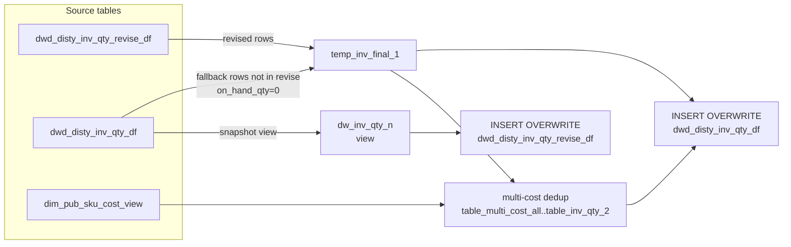

# DWD: Reload Distributor Inventory Quantity N (`dwd_disty_inv_qty_df` + `dwd_disty_inv_qty_revise_df`)

- artifact_type: etl_table
- artifact_id: ${literal_target_db}.dwd_disty_inv_qty_revise_df
- domain: inventory
- one_line_purpose: This job is the switch-path reload variant for writing inventory quantity after a historical snapshot reload. It reads from `dwd_disty_inv_qty_revise_df` (revised historical snapshot) and falls back to `dwd_disty_inv_qty_df` (current produc...
- layer_type: DWD
- source_kind: etl_sql
- evidence_source: source/etl/sql/inventory/data_service/inventory_switch/python/reload_dw_inv_qty_n.py

---

## L1 Data Foundation

### Identity and physical mapping
- **Table:** `${literal_target_db}.dwd_disty_inv_qty_revise_df`
- **Layer type:** DWD
- **Canonical / derived:** Derived / ETL-loaded (see L3)
- **Owner team:** not registered in metadata catalog

### Grain, scope, exclusions
- **Grain:** one row per `loc_no` + `inv_type` + `sku_no` per `date_flag` + `company_no` partition.
- **Scope:** See L2 business purpose / L3 filters
- **Partition:** `date_flag`, `company_no`. - resolved from pipeline (see L4)
- **Natural key:** `loc_no`, `inv_type`, `sku_no` (within a partition).
- **Exclusions:** Not documented in repository

#### Grain detail (preserved)

- **Grain:** one row per `loc_no` + `inv_type` + `sku_no` per `date_flag` + `company_no` partition.
- **Partition:** `date_flag`, `company_no`.
- **Natural key:** `loc_no`, `inv_type`, `sku_no` (within a partition).

---

### Cross-engine presence
| Engine | Present | Canonical FQN | Notes |
|--------|---------|---------------|-------|
| Hive | yes | `${literal_target_db}.dwd_disty_inv_qty_revise_df` | ETL target / intermediate per evidence script |
| Vertica | pending | `${literal_target_db}.dwd_disty_inv_qty_revise_df` | Confirm via hive2vertica flow evidence / MCP |

### Physical schema reference

Pointer block only - full column catalog lives in WKB L1 storage JSON.

| Field | Value |
|-------|-------|
| **Authoritative catalog** | WKB L1 storage seed (not duplicated in this file) |
| **entity_id** | `${literal_target_db}.dwd_disty_inv_qty_revise_df` |
| **l1_catalog_seed** | `target/storage/wkb/snapshots/_snapshot_id_template/l1_catalog/{engine}_{schema}_{table}.json` |
| **column_count** | pending (run ddl_seed_writer) |
| **partition_keys** | `date_flag, company_no` |
| **ddl_source** | pending Bitbucket DDL / Vertica metadata ingest |
| **retrieval** | `python -m tools.wkb.indexing.run_query --query "inventory reload_dw_inv_qty_n schema" --intent find_table_schema` |

### Lineage
| Object | Role |
|--------|------|
| `${literal_target_db}.dwd_disty_inv_qty_revise_df` | Primary revised source |
| `${literal_target_db}.dwd_disty_inv_qty_df` | Fallback source + primary target |
| `dim_${literal_country}.dim_pub_sku_cost_view` | Cost dimension fallback |

---

### Freshness and load path
| Item | Value |
|------|-------|
| Load pattern | See L3 end-to-end / INSERT pattern in evidence script |
| Schedule | Not documented in repository |
| Parameters | `literal_target_db`, `literal_date_flag`, `etl_timestamp`, `literal_country` |


---

## L2 Declarative Knowledge

### Business purpose
This job is the switch-path reload variant for writing inventory quantity after a historical
snapshot reload. It reads from `dwd_disty_inv_qty_revise_df` (revised historical snapshot) and
falls back to `dwd_disty_inv_qty_df` (current production values) for any SKU/location not in the
revised set. It then applies the same multi-cost deduplication logic as `load_dw_inv_qty.py` and
writes the merged result back to both `dwd_disty_inv_qty_df` and `dwd_disty_inv_qty_revise_df`.
This is used during inventory switch workflows where a historical snapshot is loaded and must
replace the current DWD values.

---

### Audience and use cases
| Audience | How they benefit |
|----------|-----------------|
| **Inventory switch workflow** | Ensures the production qty table reflects the historically-loaded snapshot values |
| **Data Engineering** | Provides an idempotent reload path that preserves cost consistency |

---

### Fact key resolution
- Natural key: `loc_no`, `inv_type`, `sku_no` (within a partition).
- FK / label-on attributes: see L3 dimension join patterns and step-by-step logic.
- Negative assertion: do not treat descriptive labels as grain keys unless listed under natural key.

### Time field semantics
- **date_flag / partition columns:** `date_flag`, `company_no`.
- Primary reporting filter should use the partition column(s) documented in L1; resolve values via L4.

### Metrics served
Same columns as `dwd_disty_inv_qty_df` — see `load_dw_inv_qty.md` for full column descriptions.

Key differences from the production load:
- `on_hand_qty` and `intran_in` for fallback rows (from `dwd_disty_inv_qty_df`) are hardcoded to `0` and `0` respectively.
- `entry_id` for fallback rows is `-1` (sentinel distinguishing them from revised rows).

---

### Metric serving map
N/A - not a `*_comb_mtd` / multi-period wide serving table (or map not present in legacy doc).


### Data products and column groups (preserved)

Same columns as `dwd_disty_inv_qty_df` — see `load_dw_inv_qty.md` for full column descriptions.

Key differences from the production load:
- `on_hand_qty` and `intran_in` for fallback rows (from `dwd_disty_inv_qty_df`) are hardcoded to `0` and `0` respectively.
- `entry_id` for fallback rows is `-1` (sentinel distinguishing them from revised rows).

---

### etl_metrics

N/A - no calculable ETL formulas extracted from this document (passthrough / stored measures only, or formulas not documented).

---

## L3 Procedural Knowledge

### Query and routing rules
**Business filters:** Use partition / date keys from L1 grain for reporting scope.
**Technical predicates (load only):** See Key filters and step-by-step logic below.

### Dimension join patterns
| Dimension FQN | Join keys | Purpose | Evidence |
|---------------|-----------|---------|----------|
| See step-by-step / base tables | See L3 steps | Dimension enrichment | `source/etl/sql/inventory/data_service/inventory_switch/python/reload_dw_inv_qty_n.py` |

### Key filters and ETL business logic
### Step 1 — `dw_inv_qty_n` (view)

Snapshot of current `dwd_disty_inv_qty_df` for `date_flag`. All columns selected; used at the end to restore `dwd_disty_inv_qty_revise_df`.

---

### Step 2 — `temp_inv_final_1`

UNION ALL of two sets:

**Set A — revised rows:**
From `dwd_disty_inv_qty_revise_df t1` WHERE `company_no = t1.company_no` AND `date_flag = '${literal_date_flag}'`.
`nvl(on_hand_qty, 0)` and `nvl(intran_in, 0)` applied.

**Set B — fallback rows:**
From `dwd_disty_inv_qty_df t1` WHERE `date_flag = '${literal_date_flag}'` AND NOT EXISTS in `dwd_disty_inv_qty_revise_df` (same SKU/inv_type/loc_no/company_no/date_flag).
`on_hand_qty = 0`, `intran_in = 0`, `entry_id = -1`.

---

### Steps 3–8 — Multi-cost deduplication

Identical logic to `load_dw_inv_qty.py` steps 4–9. See that document for full detail.

---

### Step 9 — INSERT OVERWRITE `dwd_disty_inv_qty_df`

From `temp_inv_final_1 a` LEFT JOIN `table_inv_qty_2 b`. Identical column list and `*_2` resolution as `load_dw_inv_qty.py`.

---

### Step 10 — INSERT OVERWRITE `dwd_disty_inv_qty_revise_df`

From `dw_inv_qty_n` view. Restores the production snapshot (pre-switch) as the new revise baseline.

---

### Standard time-filter SQL
```sql
-- relative period filter using resolved partition value (see L4)
SELECT *
FROM ${literal_target_db}.dwd_disty_inv_qty_revise_df
WHERE /* partition predicate */ date_flag = '${partition_value}';
```

### End-to-end flow
**Runtime parameters:** `literal_target_db`, `literal_date_flag`, `etl_timestamp`, `literal_country`
**Target tables:**
- `${literal_target_db}.dwd_disty_inv_qty_df` (partitioned by `date_flag`, `company_no`)
- `${literal_target_db}.dwd_disty_inv_qty_revise_df` (partitioned by `date_flag`, `company_no`)

1. Create `dw_inv_qty_n` view: snapshot of current `dwd_disty_inv_qty_df` for `date_flag` (used at the end to restore the revise table).
2. Build `temp_inv_final_1`: UNION of revised rows (from `dwd_disty_inv_qty_revise_df`) and fallback rows (from `dwd_disty_inv_qty_df` WHERE not in revise, with `on_hand_qty=0`, `intran_in=0`, `entry_id=-1`).
3. Apply multi-cost deduplication (identical to `load_dw_inv_qty.py`): detect multi-cost SKUs → `table_multi_cost_all` → `table_inv_qty` → `table_multi_cost_1..4` → `table_one_cost_1..4` → `table_update_1..4` → `table_inv_qty_2`.
4. **INSERT OVERWRITE** `dwd_disty_inv_qty_df` from `temp_inv_final_1` LEFT JOIN `table_inv_qty_2`.
5. **INSERT OVERWRITE** `dwd_disty_inv_qty_revise_df` from the pre-captured `dw_inv_qty_n` view (restores the original production values as the new "revise" baseline).



---


#### High-level stages (preserved)

| Stage | Business meaning |
|-------|-----------------|
| **Read revised snapshot** | Reads `dwd_disty_inv_qty_revise_df` as primary source for the target date |
| **Fill gaps with production values** | For SKUs/locations NOT in the revised set, reads `dwd_disty_inv_qty_df` with `on_hand_qty=0` and `intran_in=0` as placeholders |
| **Multi-cost deduplication** | Applies identical logic to `load_dw_inv_qty.py` to resolve cost disagreements across locations |
| **Write to production qty table** | Overwrites `dwd_disty_inv_qty_df` with the merged result |
| **Write to revise table** | Also overwrites `dwd_disty_inv_qty_revise_df` from the pre-switch production snapshot (`dw_inv_qty_n` view) |

**Parameters:** `literal_target_db`, `literal_date_flag`, `etl_timestamp`, `literal_country`

---


### Base tables register
| Object | Role in this job |
|--------|-----------------|
| `${literal_target_db}.dwd_disty_inv_qty_revise_df` | Primary source — revised historical snapshot values |
| `${literal_target_db}.dwd_disty_inv_qty_df` | Fallback source and primary INSERT target |
| `dim_${literal_country}.dim_pub_sku_cost_view` | Multi-cost resolution fallback |

**Temporary tables (inside the job only):**
`dw_inv_qty_n` (view) → `temp_inv_final_1` → `table_multi_cost_all` → `table_inv_qty` → `table_multi_cost_1..4` + `table_one_cost_1..4` → `table_update_1..4` → `table_inv_qty_2` → (two final INSERTs)

---

### Step-by-step logic
### Step 1 — `dw_inv_qty_n` (view)

Snapshot of current `dwd_disty_inv_qty_df` for `date_flag`. All columns selected; used at the end to restore `dwd_disty_inv_qty_revise_df`.

---

### Step 2 — `temp_inv_final_1`

UNION ALL of two sets:

**Set A — revised rows:**
From `dwd_disty_inv_qty_revise_df t1` WHERE `company_no = t1.company_no` AND `date_flag = '${literal_date_flag}'`.
`nvl(on_hand_qty, 0)` and `nvl(intran_in, 0)` applied.

**Set B — fallback rows:**
From `dwd_disty_inv_qty_df t1` WHERE `date_flag = '${literal_date_flag}'` AND NOT EXISTS in `dwd_disty_inv_qty_revise_df` (same SKU/inv_type/loc_no/company_no/date_flag).
`on_hand_qty = 0`, `intran_in = 0`, `entry_id = -1`.

---

### Steps 3–8 — Multi-cost deduplication

Identical logic to `load_dw_inv_qty.py` steps 4–9. See that document for full detail.

---

### Step 9 — INSERT OVERWRITE `dwd_disty_inv_qty_df`

From `temp_inv_final_1 a` LEFT JOIN `table_inv_qty_2 b`. Identical column list and `*_2` resolution as `load_dw_inv_qty.py`.

---

### Step 10 — INSERT OVERWRITE `dwd_disty_inv_qty_revise_df`

From `dw_inv_qty_n` view. Restores the production snapshot (pre-switch) as the new revise baseline.

---

### Relationship map (embedded)

| from_fqn | to_fqn | cardinality | join_keys | provenance |
|----------|--------|-------------|-----------|------------|
| `${literal_target_db}.dwd_disty_inv_qty_reload_df` | `${literal_source_db}.ods_cis_corp_inv_type` | many:1 | `iq.inv_type` = `it.inv_type` | etl_sql (`source/etl/sql/inventory/data_service/inventory/inventory_switch/python/reload_dw_inv_qty_n.py:29`) |

### Special logic (embedded)

Not documented in repository

### Column / field derivations (from ETL SQL)

| target_column | expression_sql | upstream_columns | upstream_tables | transform_kind | evidence |
|---------------|----------------|------------------|-----------------|----------------|----------|
| `loc_no` | `iq.loc_no` | `loc_no` | `${literal_target_db}.dwd_disty_inv_qty_reload_df`, `${literal_source_db}.ods_cis_corp_inv_type` | passthrough | `source/etl/sql/inventory/data_service/inventory/inventory_switch/python/reload_dw_inv_qty_n.py:6` |
| `inv_type` | `iq.inv_type` | `inv_type` | `${literal_target_db}.dwd_disty_inv_qty_reload_df`, `${literal_source_db}.ods_cis_corp_inv_type` | passthrough | `source/etl/sql/inventory/data_service/inventory/inventory_switch/python/reload_dw_inv_qty_n.py:7` |
| `sku_no` | `iq.sku_no` | `sku_no` | `${literal_target_db}.dwd_disty_inv_qty_reload_df`, `${literal_source_db}.ods_cis_corp_inv_type` | passthrough | `source/etl/sql/inventory/data_service/inventory/inventory_switch/python/reload_dw_inv_qty_n.py:8` |
| `u_version` | `iq.u_version` | `u_version` | `${literal_target_db}.dwd_disty_inv_qty_reload_df`, `${literal_source_db}.ods_cis_corp_inv_type` | passthrough | `source/etl/sql/inventory/data_service/inventory/inventory_switch/python/reload_dw_inv_qty_n.py:9` |
| `ave_cost` | `iq.ave_cost` | `ave_cost` | `${literal_target_db}.dwd_disty_inv_qty_reload_df`, `${literal_source_db}.ods_cis_corp_inv_type` | passthrough | `source/etl/sql/inventory/data_service/inventory/inventory_switch/python/reload_dw_inv_qty_n.py:10` |
| `std_cost` | `iq.std_cost` | `std_cost` | `${literal_target_db}.dwd_disty_inv_qty_reload_df`, `${literal_source_db}.ods_cis_corp_inv_type` | passthrough | `source/etl/sql/inventory/data_service/inventory/inventory_switch/python/reload_dw_inv_qty_n.py:11` |
| `on_hand_qty` | `iq.on_hand_qty` | `on_hand_qty` | `${literal_target_db}.dwd_disty_inv_qty_reload_df`, `${literal_source_db}.ods_cis_corp_inv_type` | passthrough | `source/etl/sql/inventory/data_service/inventory/inventory_switch/python/reload_dw_inv_qty_n.py:12` |
| `bo_qty` | `iq.bo_qty` | `bo_qty` | `${literal_target_db}.dwd_disty_inv_qty_reload_df`, `${literal_source_db}.ods_cis_corp_inv_type` | passthrough | `source/etl/sql/inventory/data_service/inventory/inventory_switch/python/reload_dw_inv_qty_n.py:13` |
| `on_order_qty` | `iq.on_order_qty` | `on_order_qty` | `${literal_target_db}.dwd_disty_inv_qty_reload_df`, `${literal_source_db}.ods_cis_corp_inv_type` | passthrough | `source/etl/sql/inventory/data_service/inventory/inventory_switch/python/reload_dw_inv_qty_n.py:14` |
| `alloc_qty` | `iq.alloc_qty` | `alloc_qty` | `${literal_target_db}.dwd_disty_inv_qty_reload_df`, `${literal_source_db}.ods_cis_corp_inv_type` | passthrough | `source/etl/sql/inventory/data_service/inventory/inventory_switch/python/reload_dw_inv_qty_n.py:15` |
| `intran_out` | `iq.intran_out` | `intran_out` | `${literal_target_db}.dwd_disty_inv_qty_reload_df`, `${literal_source_db}.ods_cis_corp_inv_type` | passthrough | `source/etl/sql/inventory/data_service/inventory/inventory_switch/python/reload_dw_inv_qty_n.py:16` |
| `intran_in` | `iq.intran_in` | `intran_in` | `${literal_target_db}.dwd_disty_inv_qty_reload_df`, `${literal_source_db}.ods_cis_corp_inv_type` | passthrough | `source/etl/sql/inventory/data_service/inventory/inventory_switch/python/reload_dw_inv_qty_n.py:17` |
| `entry_datetime` | `'${etl_timestamp}'` | `etl_timestamp` | `${literal_target_db}.dwd_disty_inv_qty_reload_df`, `${literal_source_db}.ods_cis_corp_inv_type` | literal | `source/etl/sql/inventory/data_service/inventory/inventory_switch/python/reload_dw_inv_qty_n.py:18` |
| `entry_id` | `0` | — | `${literal_target_db}.dwd_disty_inv_qty_reload_df`, `${literal_source_db}.ods_cis_corp_inv_type` | rename | `source/etl/sql/inventory/data_service/inventory/inventory_switch/python/reload_dw_inv_qty_n.py:19` |
| `wip_qty` | `iq.wip_qty` | `wip_qty` | `${literal_target_db}.dwd_disty_inv_qty_reload_df`, `${literal_source_db}.ods_cis_corp_inv_type` | passthrough | `source/etl/sql/inventory/data_service/inventory/inventory_switch/python/reload_dw_inv_qty_n.py:20` |
| `it_ave_cost` | `iq.ave_cost` | `ave_cost` | `${literal_target_db}.dwd_disty_inv_qty_reload_df`, `${literal_source_db}.ods_cis_corp_inv_type` | rename | `source/etl/sql/inventory/data_service/inventory/inventory_switch/python/reload_dw_inv_qty_n.py:10` |
| `base_cost` | `iq.base_cost` | `base_cost` | `${literal_target_db}.dwd_disty_inv_qty_reload_df`, `${literal_source_db}.ods_cis_corp_inv_type` | passthrough | `source/etl/sql/inventory/data_service/inventory/inventory_switch/python/reload_dw_inv_qty_n.py:22` |
| `ave_cost_fx` | `iq.ave_cost_fx` | `ave_cost_fx` | `${literal_target_db}.dwd_disty_inv_qty_reload_df`, `${literal_source_db}.ods_cis_corp_inv_type` | passthrough | `source/etl/sql/inventory/data_service/inventory/inventory_switch/python/reload_dw_inv_qty_n.py:23` |
| `base_cost_fx` | `iq.base_cost_fx` | `base_cost_fx` | `${literal_target_db}.dwd_disty_inv_qty_reload_df`, `${literal_source_db}.ods_cis_corp_inv_type` | passthrough | `source/etl/sql/inventory/data_service/inventory/inventory_switch/python/reload_dw_inv_qty_n.py:24` |
| `rio_qty` | `iq.rio_qty` | `rio_qty` | `${literal_target_db}.dwd_disty_inv_qty_reload_df`, `${literal_source_db}.ods_cis_corp_inv_type` | passthrough | `source/etl/sql/inventory/data_service/inventory/inventory_switch/python/reload_dw_inv_qty_n.py:25` |
| `kwo_comp_rio_qty` | `iq.kwo_comp_rio_qty` | `kwo_comp_rio_qty` | `${literal_target_db}.dwd_disty_inv_qty_reload_df`, `${literal_source_db}.ods_cis_corp_inv_type` | passthrough | `source/etl/sql/inventory/data_service/inventory/inventory_switch/python/reload_dw_inv_qty_n.py:26` |
| `kwo_oh_qty` | `iq.kwo_oh_qty` | `kwo_oh_qty` | `${literal_target_db}.dwd_disty_inv_qty_reload_df`, `${literal_source_db}.ods_cis_corp_inv_type` | passthrough | `source/etl/sql/inventory/data_service/inventory/inventory_switch/python/reload_dw_inv_qty_n.py:27` |
| `kwo_bo_qty` | `iq.kwo_bo_qty` | `kwo_bo_qty` | `${literal_target_db}.dwd_disty_inv_qty_reload_df`, `${literal_source_db}.ods_cis_corp_inv_type` | passthrough | `source/etl/sql/inventory/data_service/inventory/inventory_switch/python/reload_dw_inv_qty_n.py:28` |
| `date_flag` | `'${literal_date_flag}'` | `literal_date_flag` | `${literal_target_db}.dwd_disty_inv_qty_reload_df`, `${literal_source_db}.ods_cis_corp_inv_type` | literal | `source/etl/sql/inventory/data_service/inventory/inventory_switch/python/reload_dw_inv_qty_n.py:29` |
| `company_no` | `iq.company_no` | `company_no` | `${literal_target_db}.dwd_disty_inv_qty_reload_df`, `${literal_source_db}.ods_cis_corp_inv_type` | passthrough | `source/etl/sql/inventory/data_service/inventory/inventory_switch/python/reload_dw_inv_qty_n.py:30` |

### Sentinel and code values
| Value | Meaning |
|-------|---------|
| `entry_id = -1` | Fallback row from `dwd_disty_inv_qty_df` — not from the revised snapshot |
| `on_hand_qty = 0`, `intran_in = 0` | Fallback rows zero out position quantities — they carry only cost and other qty fields |

---

---

## L4 Validation

### Resolved partition value
| Step | Source | How partition / date scope is determined |
|------|--------|------------------------------------------|
| 1 | evidence script / flow | See parameters in L1 Freshness and L3 filters - `source/etl/sql/inventory/data_service/inventory_switch/python/reload_dw_inv_qty_n.py` |

**Plain language:** Partition and date scope follow Azkaban/bootstrap parameters documented in the source script and orchestrating flow; do not hardcode calendar literals.

### Data quality checks
- Prefer row-count-by-partition, metric sums, and grain duplicate checks (see Validation SQL).
- Additional checks from legacy caveats / operational notes when present.

### Validation SQL
```sql
-- 1) Row count by partition
SELECT ${partition_col}, COUNT(*) AS row_cnt
FROM dim_${literal_country}.dim_pub_sku_cost_view
WHERE ${partition_col} = '${partition_value}'
GROUP BY ${partition_col};

-- 2) Metric sum by business dimension (top deltas)
SELECT ${dim_key}, SUM(${metric}) AS metric_sum
FROM dim_${literal_country}.dim_pub_sku_cost_view
WHERE ${partition_col} = '${partition_value}'
GROUP BY ${dim_key}
ORDER BY ABS(SUM(${metric})) DESC
LIMIT 20;

-- 3) Grain duplicate check
SELECT ${grain_key_1}, ${grain_key_2}, ${grain_key_3}, ${partition_col}, COUNT(*) AS cnt
FROM dim_${literal_country}.dim_pub_sku_cost_view
WHERE ${partition_col} = '${partition_value}'
GROUP BY ${grain_key_1}, ${grain_key_2}, ${grain_key_3}, ${partition_col}
HAVING COUNT(*) > 1;
```

Replace placeholders from this file's Grain and keys / Data you can fetch sections, and use the resolved partition value from run scope.

### Caveats for interpretation
- Fallback rows (from `dwd_disty_inv_qty_df`) have `on_hand_qty=0` and `intran_in=0` — they do not reflect actual inventory but carry cost metadata.
- The final INSERT to `dwd_disty_inv_qty_revise_df` writes back the pre-switch production values, effectively rotating the snapshots.
- Multi-cost deduplication logic is identical to `load_dw_inv_qty.py`.

---

### Conflicts and open questions
- Schedule, owner, SLA: Not documented in repository (unless preserved schedule evidence above).
- Vertica MCP verification: pending unless confirmed in L5.


---

## L5 Runtime View

### Query path and engine preference
| Role | Hive object | Vertica object | Sync mode | Evidence | MCP verified |
|------|-------------|----------------|-----------|----------|--------------|
| **Query for reporting** | *See script lineage* | `dim_${literal_country}.dim_pub_sku_cost_view` | *Verify from flow* | *Add flow file:line* | pending |
| **Hive alternative** | `*` | `dim_${literal_country}.dim_pub_sku_cost_view` | - | *See dependencies* | - |
| **ETL internal** | staging/temp tables | *Not synced to Vertica* | - | *See step-by-step logic* | - |

Business users should query `dim_${literal_country}.dim_pub_sku_cost_view` in Vertica once MCP verification is completed for this document.

### Access constraints
- Country / company schema parameters may apply (`literal_country`, `company_no`, etc.).
- Hive-only staging objects are not reporting surfaces unless synced.

### Query risk profile
| Field | Value |
|-------|-------|
| requires_date_predicate | yes |
| scan_risk_tier | high |

---

## L6 Access and Consumption

### Primary consumers and use cases
| Audience | How they benefit |
|----------|-----------------|
| **Inventory switch workflow** | Ensures the production qty table reflects the historically-loaded snapshot values |
| **Data Engineering** | Provides an idempotent reload path that preserves cost consistency |

---

### Representative query patterns
```sql
-- certified / illustrative lookup - replace predicates from L1/L4
SELECT *
FROM ${literal_target_db}.dwd_disty_inv_qty_revise_df
WHERE date_flag = '${partition_value}'
LIMIT 100;
```

### Dependencies and notes
### Upstream objects (verified)

| Object | Usage | Evidence |
|--------|-------|----------|
| `dwd_disty_inv_qty_revise_df` | Revised snapshot source | `source/etl/sql/inventory/data_service/inventory_switch/python/reload_dw_inv_qty_n.py:63` |
| `dwd_disty_inv_qty_df` | Fallback + target | `source/etl/sql/inventory/data_service/inventory_switch/python/reload_dw_inv_qty_n.py:92` |
| `dim_pub_sku_cost_view` | Multi-cost fallback | `source/etl/sql/inventory/data_service/inventory_switch/python/reload_dw_inv_qty_n.py:401` |

### Downstream consumers (verified)

| Object / script | Evidence |
|-----------------|----------|
| None identified in repository | — |

### Operational detail (verified)

- Writes to both `dwd_disty_inv_qty_df` and `dwd_disty_inv_qty_revise_df`: `reload_dw_inv_qty_n.py:408` and `:460`

### Not documented in repository

- Schedule, owner, SLA — not in scripts or configs
- Orchestration order relative to `reload_history_inv_qty_n.py`

---

*Document generated from `source/etl/sql/inventory/data_service/inventory_switch/python/reload_dw_inv_qty_n.py`.*

#### Not documented in repository
- Owner, SLA (unless schedule evidence preserved above)
- Any dependency without `file:line` evidence in this document

---

*Document migrated to L1-L6 from legacy Knowledgebase content. Evidence: `source/etl/sql/inventory/data_service/inventory_switch/python/reload_dw_inv_qty_n.py`.*
