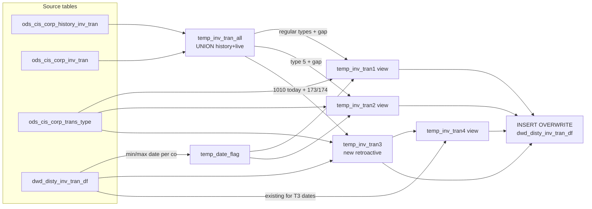

# DWD: Reload Distributor Inventory Transactions from History (`dwd_disty_inv_tran_df`)

- artifact_type: etl_table
- artifact_id: ${literal_target_db}.dwd_disty_inv_tran_df
- domain: inventory
- one_line_purpose: This job is the history-reload variant of `load_dw_inv_tran.py`. Instead of reading the live ETL transaction stream (`ods_etl_inv_tran_all`), it reads from the persistent CIS history tables (`ods_cis_corp_history_inv_tran` UNION `ods_cis_co...
- layer_type: DWD
- source_kind: etl_sql
- evidence_source: source/etl/sql/inventory/data_service/inventory_switch/python/reload_dw_inv_tran.py

---

## L1 Data Foundation

### Identity and physical mapping
- **Table:** `${literal_target_db}.dwd_disty_inv_tran_df`
- **Layer type:** DWD
- **Canonical / derived:** Derived / ETL-loaded (see L3)
- **Owner team:** not registered in metadata catalog

### Grain, scope, exclusions
- **Grain:** one row per `odometer` + `entry_id` per `date_flag` + `company_no` partition.
- **Scope:** See L2 business purpose / L3 filters
- **Partition:** `date_flag`, `company_no`. - resolved from pipeline (see L4)
- **Natural key:** `odometer`, `entry_id` (within a partition).
- **Exclusions:** Not documented in repository

#### Grain detail (preserved)

- **Grain:** one row per `odometer` + `entry_id` per `date_flag` + `company_no` partition.
- **Partition:** `date_flag`, `company_no`.
- **Natural key:** `odometer`, `entry_id` (within a partition).

---

### Cross-engine presence
| Engine | Present | Canonical FQN | Notes |
|--------|---------|---------------|-------|
| Hive | yes | `${literal_target_db}.dwd_disty_inv_tran_df` | ETL target / intermediate per evidence script |
| Vertica | pending | `${literal_target_db}.dwd_disty_inv_tran_df` | Confirm via hive2vertica flow evidence / MCP |

### Physical schema reference

Pointer block only - full column catalog lives in WKB L1 storage JSON.

| Field | Value |
|-------|-------|
| **Authoritative catalog** | WKB L1 storage seed (not duplicated in this file) |
| **entity_id** | `${literal_target_db}.dwd_disty_inv_tran_df` |
| **l1_catalog_seed** | `target/storage/wkb/snapshots/_snapshot_id_template/l1_catalog/{engine}_{schema}_{table}.json` |
| **column_count** | pending (run ddl_seed_writer) |
| **partition_keys** | `date_flag, company_no` |
| **ddl_source** | pending Bitbucket DDL / Vertica metadata ingest |
| **retrieval** | `python -m tools.wkb.indexing.run_query --query "inventory reload_dw_inv_tran schema" --intent find_table_schema` |

### Lineage
| Object | Role |
|--------|------|
| `${literal_target_db}.dwd_disty_inv_tran_df` | Target and gap/retroactive source |
| `${literal_source_db}.ods_cis_corp_history_inv_tran` | Archive transaction source |
| `${literal_source_db}.ods_cis_corp_inv_tran` | Live CIS transaction source |
| `${literal_source_db}.ods_cis_corp_trans_type` | `col2_factor` direction multiplier |

---

### Freshness and load path
| Item | Value |
|------|-------|
| Load pattern | See L3 end-to-end / INSERT pattern in evidence script |
| Schedule | Not documented in repository |
| Parameters | `literal_target_db`, `literal_source_db`, `literal_date_flag`, `etl_timestamp`, `literal_company_no` |


---

## L2 Declarative Knowledge

### Business purpose
This job is the history-reload variant of `load_dw_inv_tran.py`. Instead of reading the live ETL
transaction stream (`ods_etl_inv_tran_all`), it reads from the persistent CIS history tables
(`ods_cis_corp_history_inv_tran` UNION `ods_cis_corp_inv_tran`) to reconstruct the 360-day
transaction window. It is used during inventory switch operations when historical transaction data
must be reloaded from archived sources rather than the live feed. The temp-table structure and
final INSERT logic are identical to the live job.

---

### Audience and use cases
| Audience | How they benefit |
|----------|-----------------|
| **Inventory switch workflow** | Rebuilds the transaction history from authoritative history tables after a snapshot reload |
| **Data Engineering** | Provides an alternative load path that does not depend on the live ETL feed |

---

### Fact key resolution
- Natural key: `odometer`, `entry_id` (within a partition).
- FK / label-on attributes: see L3 dimension join patterns and step-by-step logic.
- Negative assertion: do not treat descriptive labels as grain keys unless listed under natural key.

### Time field semantics
- **date_flag / partition columns:** `date_flag`, `company_no`.
- Primary reporting filter should use the partition column(s) documented in L1; resolve values via L4.

### Metrics served
Same columns as `dwd_disty_inv_tran_df` — see `load_dw_inv_tran.md` for full column descriptions.

Key difference: source includes additional columns (`u_version`, `order_type`, `doc_no`, `doc_line_no`, `source`, `trans_cost`, `cost_change`, `entry_datetime`, `entry_id`, `rec_no`, `rec_line_no`, `bal_qty`, `sys_cost`, `usd_trans_cost`, `usd_cost_change`) from history tables, but only the standard transaction columns are written to the target.

---

### Metric serving map
N/A - not a `*_comb_mtd` / multi-period wide serving table (or map not present in legacy doc).


### Data products and column groups (preserved)

Same columns as `dwd_disty_inv_tran_df` — see `load_dw_inv_tran.md` for full column descriptions.

Key difference: source includes additional columns (`u_version`, `order_type`, `doc_no`, `doc_line_no`, `source`, `trans_cost`, `cost_change`, `entry_datetime`, `entry_id`, `rec_no`, `rec_line_no`, `bal_qty`, `sys_cost`, `usd_trans_cost`, `usd_cost_change`) from history tables, but only the standard transaction columns are written to the target.

---

### etl_metrics

N/A - no calculable ETL formulas extracted from this document (passthrough / stored measures only, or formulas not documented).

---

## L3 Procedural Knowledge

### Query and routing rules
**Business filters:** Use partition / date keys from L1 grain for reporting scope.
**Technical predicates (load only):** See Key filters and step-by-step logic below.

### Dimension join patterns
| Dimension FQN | Join keys | Purpose | Evidence |
|---------------|-----------|---------|----------|
| See step-by-step / base tables | See L3 steps | Dimension enrichment | `source/etl/sql/inventory/data_service/inventory_switch/python/reload_dw_inv_tran.py` |

### Key filters and ETL business logic
### Step 1 — `temp_date_flag`

**Source:** `${literal_target_db}.dwd_disty_inv_tran_df` (two aggregates — min and max separately, then INNER JOINed on `company_no`)

Differs from `load_dw_inv_tran.py`: uses INNER JOIN of min and max sub-queries (requires company to have at least one record before `literal_date_flag`). `load_dw_inv_tran.py` seeds new companies from `ods_cis_corp_company_info`; this reload version does not.

---

### Step 2 — `temp_inv_tran_all`

UNION of:
- `ods_cis_corp_history_inv_tran`: 360-day window, company filter, allowed trans_type list.
- `ods_cis_corp_inv_tran`: same filter — provides recently committed transactions not yet in history.

Columns selected include extended history columns (`trans_cost`, `cost_change`, `bal_qty`, etc.) for potential audit use; only standard columns are written to the target.

---

### Steps 3–7 — Identical to `load_dw_inv_tran.py`

Same temp_inv_tran1 / 2 / 3 / 4 logic and final INSERT OVERWRITE. See `load_dw_inv_tran.md` for full step-by-step detail.

---

### Standard time-filter SQL
```sql
-- relative period filter using resolved partition value (see L4)
SELECT *
FROM ${literal_target_db}.dwd_disty_inv_tran_df
WHERE /* partition predicate */ date_flag = '${partition_value}';
```

### End-to-end flow
**Runtime parameters:** `literal_target_db`, `literal_source_db`, `literal_date_flag`, `etl_timestamp`, `literal_company_no`
**Target table:** `${literal_target_db}.dwd_disty_inv_tran_df`, partitioned by **`date_flag`**, **`company_no`**.

1. Build `temp_date_flag`: min/max existing `date_flag` per company from `dwd_disty_inv_tran_df` (only for dates < `literal_date_flag`).
2. Build `temp_inv_tran_all`: UNION of `ods_cis_corp_history_inv_tran` and `ods_cis_corp_inv_tran` for the 360-day window and allowed `trans_type` list.
3. Build `temp_inv_tran1` (view): regular trans_types for gap dates.
4. Build `temp_inv_tran2` (view): trans_type 5 for gap dates with `col2_factor`.
5. Build `temp_inv_tran3`: retroactive 1010 and 173/174 not yet in target.
6. Build `temp_inv_tran4` (view): existing target records for dates covered by `temp_inv_tran3`.
7. **INSERT OVERWRITE** UNION of all four streams.



---


#### High-level stages (preserved)

| Stage | Business meaning |
|-------|-----------------|
| **Date-gap detection** | Determines which dates in the 360-day window are not yet in the target, per company |
| **Load from history tables** | Reads qualifying transactions from archived history + live CIS transaction tables |
| **Filter regular types** | Applies same transaction-type / inv-type combination rules as the live job |
| **Filter type 5** | Handled separately with `col2_factor` applied |
| **Retroactive 1010 and 173/174** | Preserves new retroactive records not yet in the target |
| **Preserve existing retroactive** | Re-includes existing 1010/173/174 records to prevent overwrite loss |
| **INSERT OVERWRITE** | Writes the UNION of all four streams to `dwd_disty_inv_tran_df` |

**Parameters:** `literal_target_db`, `literal_source_db`, `literal_date_flag`, `etl_timestamp`, `literal_company_no`

---


### Base tables register
| Object | Role in this job |
|--------|-----------------|
| `${literal_target_db}.dwd_disty_inv_tran_df` | Target and source for date-gap detection and retroactive preservation |
| `${literal_source_db}.ods_cis_corp_history_inv_tran` | Archived transaction history — primary reload source |
| `${literal_source_db}.ods_cis_corp_inv_tran` | Live CIS transaction table — secondary reload source |
| `${literal_source_db}.ods_cis_corp_trans_type` | `col2_factor` direction multiplier |

**Temporary tables (inside the job only):**
`temp_date_flag` → `temp_inv_tran_all` → `temp_inv_tran1` (view) → `temp_inv_tran2` (view) → `temp_inv_tran3` → `temp_inv_tran4` (view) → (final `INSERT`)

---

### Step-by-step logic
### Step 1 — `temp_date_flag`

**Source:** `${literal_target_db}.dwd_disty_inv_tran_df` (two aggregates — min and max separately, then INNER JOINed on `company_no`)

Differs from `load_dw_inv_tran.py`: uses INNER JOIN of min and max sub-queries (requires company to have at least one record before `literal_date_flag`). `load_dw_inv_tran.py` seeds new companies from `ods_cis_corp_company_info`; this reload version does not.

---

### Step 2 — `temp_inv_tran_all`

UNION of:
- `ods_cis_corp_history_inv_tran`: 360-day window, company filter, allowed trans_type list.
- `ods_cis_corp_inv_tran`: same filter — provides recently committed transactions not yet in history.

Columns selected include extended history columns (`trans_cost`, `cost_change`, `bal_qty`, etc.) for potential audit use; only standard columns are written to the target.

---

### Steps 3–7 — Identical to `load_dw_inv_tran.py`

Same temp_inv_tran1 / 2 / 3 / 4 logic and final INSERT OVERWRITE. See `load_dw_inv_tran.md` for full step-by-step detail.

---

### Relationship map (embedded)

| from_fqn | to_fqn | cardinality | join_keys | provenance |
|----------|--------|-------------|-----------|------------|
| `${literal_source_db}.ods_cis_corp_inv_tran` | `${literal_source_db}.ods_cis_corp_trans_type` | many:1 | `i.trans_type` = `t.trans_type` | etl_sql (`source/etl/sql/inventory/data_service/inventory/inventory_switch/python/reload_dw_inv_tran.py:106`) |
| `${literal_source_db}.ods_cis_corp_inv_tran` | `temp_date_flag` | many:1 | `d.company_no` = `i.company_no` | etl_sql (`source/etl/sql/inventory/data_service/inventory/inventory_switch/python/reload_dw_inv_tran.py:108`) |
| `${literal_target_db}.dwd_disty_inv_tran_df` | `${literal_source_db}.ods_cis_corp_trans_type` | many:1 | — | etl_sql (`source/etl/sql/inventory/data_service/inventory/inventory_switch/python/reload_dw_inv_tran.py:222`) |

### Special logic (embedded)

Not documented in repository

### Column / field derivations (from ETL SQL)

| target_column | expression_sql | upstream_columns | upstream_tables | transform_kind | evidence |
|---------------|----------------|------------------|-----------------|----------------|----------|
| `odometer` | `i.odometer` | `odometer` | `temp_inv_tran1`, `temp_inv_tran2`, `temp_inv_tran3`, `temp_inv_tran4` | passthrough | `source/etl/sql/inventory/data_service/inventory/inventory_switch/python/reload_dw_inv_tran.py:110` |
| `entry_id` | `i.entry_id` | `entry_id` | `temp_inv_tran1`, `temp_inv_tran2`, `temp_inv_tran3`, `temp_inv_tran4` | passthrough | `source/etl/sql/inventory/data_service/inventory/inventory_switch/python/reload_dw_inv_tran.py:111` |
| `u_version` | `NULL` | — | `temp_inv_tran1`, `temp_inv_tran2`, `temp_inv_tran3`, `temp_inv_tran4` | rename | `source/etl/sql/inventory/data_service/inventory/inventory_switch/python/reload_dw_inv_tran.py:6` |
| `loc_no` | `i.loc_no` | `loc_no` | `temp_inv_tran1`, `temp_inv_tran2`, `temp_inv_tran3`, `temp_inv_tran4` | passthrough | `source/etl/sql/inventory/data_service/inventory/inventory_switch/python/reload_dw_inv_tran.py:112` |
| `inv_type` | `i.inv_type` | `inv_type` | `temp_inv_tran1`, `temp_inv_tran2`, `temp_inv_tran3`, `temp_inv_tran4` | passthrough | `source/etl/sql/inventory/data_service/inventory/inventory_switch/python/reload_dw_inv_tran.py:113` |
| `sku_no` | `i.sku_no` | `sku_no` | `temp_inv_tran1`, `temp_inv_tran2`, `temp_inv_tran3`, `temp_inv_tran4` | passthrough | `source/etl/sql/inventory/data_service/inventory/inventory_switch/python/reload_dw_inv_tran.py:114` |
| `doc_date` | `i.doc_date` | `doc_date` | `temp_inv_tran1`, `temp_inv_tran2`, `temp_inv_tran3`, `temp_inv_tran4` | passthrough | `source/etl/sql/inventory/data_service/inventory/inventory_switch/python/reload_dw_inv_tran.py:54` |
| `trans_qty` | `i.trans_qty` | `trans_qty` | `temp_inv_tran1`, `temp_inv_tran2`, `temp_inv_tran3`, `temp_inv_tran4` | passthrough | `source/etl/sql/inventory/data_service/inventory/inventory_switch/python/reload_dw_inv_tran.py:116` |
| `trans_type` | `i.trans_type` | `trans_type` | `temp_inv_tran1`, `temp_inv_tran2`, `temp_inv_tran3`, `temp_inv_tran4` | passthrough | `source/etl/sql/inventory/data_service/inventory/inventory_switch/python/reload_dw_inv_tran.py:57` |
| `etl_timestamp` | `'${etl_timestamp}'` | `etl_timestamp` | `temp_inv_tran1`, `temp_inv_tran2`, `temp_inv_tran3`, `temp_inv_tran4` | literal | `source/etl/sql/inventory/data_service/inventory/inventory_switch/python/reload_dw_inv_tran.py:278` |
| `date_flag` | `TO_DATE(i.doc_date)` | `doc_date` | `temp_inv_tran1`, `temp_inv_tran2`, `temp_inv_tran3`, `temp_inv_tran4` | udf | `source/etl/sql/inventory/data_service/inventory/inventory_switch/python/reload_dw_inv_tran.py:200` |
| `company_no` | `i.company_no` | `company_no` | `temp_inv_tran1`, `temp_inv_tran2`, `temp_inv_tran3`, `temp_inv_tran4` | passthrough | `source/etl/sql/inventory/data_service/inventory/inventory_switch/python/reload_dw_inv_tran.py:117` |

### Sentinel and code values
Same as `load_dw_inv_tran.py`. See `load_dw_inv_tran.md`.

---

---

## L4 Validation

### Resolved partition value
| Step | Source | How partition / date scope is determined |
|------|--------|------------------------------------------|
| 1 | evidence script / flow | See parameters in L1 Freshness and L3 filters - `source/etl/sql/inventory/data_service/inventory_switch/python/reload_dw_inv_tran.py` |

**Plain language:** Partition and date scope follow Azkaban/bootstrap parameters documented in the source script and orchestrating flow; do not hardcode calendar literals.

### Data quality checks
- Prefer row-count-by-partition, metric sums, and grain duplicate checks (see Validation SQL).
- Additional checks from legacy caveats / operational notes when present.

### Validation SQL
```sql
-- 1) row count by partition
-- SELECT partition_col, COUNT(*) FROM ${literal_target_db}.dwd_disty_inv_tran_df WHERE partition_col = '${partition_value}' GROUP BY 1;
-- 2) metric sum by dimension (top N) - replace metric/dim from L2
-- 3) grain duplicate check on natural keys
```


### Caveats for interpretation
- Unlike `load_dw_inv_tran.py`, this job does not seed new companies from `ods_cis_corp_company_info`; companies with no existing records in `dwd_disty_inv_tran_df` before `literal_date_flag` will not receive data.
- History tables may have slightly different record sets than the live ETL feed, particularly for very recent transactions.
- The `temp_inv_tran3` retroactive logic uses `temp_inv_tran_all` (not `ods_etl_inv_tran_all`) as the 1010 source, so 1010 records come from history/live CIS tables.

---

### Conflicts and open questions
- Schedule, owner, SLA: Not documented in repository (unless preserved schedule evidence above).
- Vertica MCP verification: pending unless confirmed in L5.


#### Key differences from `load_dw_inv_tran.py` (preserved from legacy doc)

- Source for `temp_inv_tran_all`: `ods_cis_corp_history_inv_tran` UNION `ods_cis_corp_inv_tran` (vs. `ods_etl_inv_tran_all`).
- `temp_date_flag` uses INNER JOIN of two aggregates (vs. UNION with company seed table).

---

---

## L5 Runtime View

### Query path and engine preference
| Role | Hive object | Vertica object | Sync mode | Evidence | MCP verified |
|------|-------------|----------------|-----------|----------|--------------|
| **Not in Vertica** | *See script lineage* | *No Vertica mapping identified in repository* | - | *Add flow evidence when found* | no |

No queryable Vertica table has been confirmed for this script from current repository evidence.

### Access constraints
- Country / company schema parameters may apply (`literal_country`, `company_no`, etc.).
- Hive-only staging objects are not reporting surfaces unless synced.

### Query risk profile
| Field | Value |
|-------|-------|
| requires_date_predicate | yes |
| scan_risk_tier | high |

---

## L6 Access and Consumption

### Primary consumers and use cases
| Audience | How they benefit |
|----------|-----------------|
| **Inventory switch workflow** | Rebuilds the transaction history from authoritative history tables after a snapshot reload |
| **Data Engineering** | Provides an alternative load path that does not depend on the live ETL feed |

---

### Representative query patterns
```sql
-- certified / illustrative lookup - replace predicates from L1/L4
SELECT *
FROM ${literal_target_db}.dwd_disty_inv_tran_df
WHERE date_flag = '${partition_value}'
LIMIT 100;
```

### Dependencies and notes
### Upstream objects (verified)

| Object | Usage | Evidence |
|--------|-------|----------|
| `ods_cis_corp_history_inv_tran` | History transaction source | `source/etl/sql/inventory/data_service/inventory_switch/python/reload_dw_inv_tran.py:53` |
| `ods_cis_corp_inv_tran` | Live CIS transactions | `source/etl/sql/inventory/data_service/inventory_switch/python/reload_dw_inv_tran.py:90` |
| `ods_cis_corp_trans_type` | col2_factor | `source/etl/sql/inventory/data_service/inventory_switch/python/reload_dw_inv_tran.py:120` |
| `dwd_disty_inv_tran_df` | Date-gap + retroactive source | `source/etl/sql/inventory/data_service/inventory_switch/python/reload_dw_inv_tran.py:16` |

### Downstream consumers (verified)

| Object / script | Evidence |
|-----------------|----------|
| None identified in repository | — |

### Operational detail (verified)

- Partition overwrite per `date_flag` + `company_no`: `reload_dw_inv_tran.py:267`

### Not documented in repository

- Schedule, owner, SLA — not in scripts or configs

---

*Document generated from `source/etl/sql/inventory/data_service/inventory_switch/python/reload_dw_inv_tran.py`.*

#### Not documented in repository
- Owner, SLA (unless schedule evidence preserved above)
- Any dependency without `file:line` evidence in this document

---

*Document migrated to L1-L6 from legacy Knowledgebase content. Evidence: `source/etl/sql/inventory/data_service/inventory_switch/python/reload_dw_inv_tran.py`.*
