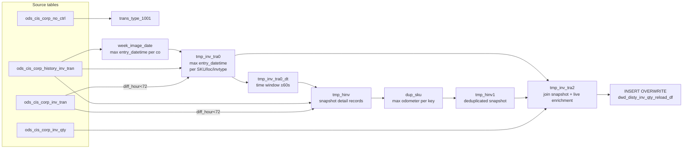

# DWD: Reload History Inventory Quantity Snapshot (`dwd_disty_inv_qty_reload_df`)

- artifact_type: etl_table
- artifact_id: ${target_db}.dwd_disty_inv_qty_reload_df
- domain: inventory
- one_line_purpose: This job reconstructs a historical inventory quantity snapshot by locating the most recent "week image" (trans_type 1000/1001 snapshot records) in the CIS history transaction tables and extracting the balance quantities captured at that sna...
- layer_type: DWD
- source_kind: etl_sql
- evidence_source: source/etl/sql/inventory/data_service/inventory_switch/python/reload_history_inv_qty_n.py

---

## L1 Data Foundation

### Identity and physical mapping
- **Table:** `${target_db}.dwd_disty_inv_qty_reload_df`
- **Layer type:** DWD
- **Canonical / derived:** Derived / ETL-loaded (see L3)
- **Owner team:** not registered in metadata catalog

### Grain, scope, exclusions
- **Grain:** one row per `loc_no` + `inv_type` + `sku_no` per `date_flag` + `company_no` partition.
- **Scope:** See L2 business purpose / L3 filters
- **Partition:** `date_flag`, `company_no`. - resolved from pipeline (see L4)
- **Natural key:** `loc_no`, `inv_type`, `sku_no` (within a partition).
- **Exclusions:** Not documented in repository

#### Grain detail (preserved)

- **Grain:** one row per `loc_no` + `inv_type` + `sku_no` per `date_flag` + `company_no` partition.
- **Partition:** `date_flag`, `company_no`.
- **Natural key:** `loc_no`, `inv_type`, `sku_no` (within a partition).

---

### Cross-engine presence
| Engine | Present | Canonical FQN | Notes |
|--------|---------|---------------|-------|
| Hive | yes | `${target_db}.dwd_disty_inv_qty_reload_df` | ETL target / intermediate per evidence script |
| Vertica | pending | `${target_db}.dwd_disty_inv_qty_reload_df` | Confirm via hive2vertica flow evidence / MCP |

### Physical schema reference

Pointer block only - full column catalog lives in WKB L1 storage JSON.

| Field | Value |
|-------|-------|
| **Authoritative catalog** | WKB L1 storage seed (not duplicated in this file) |
| **entity_id** | `${target_db}.dwd_disty_inv_qty_reload_df` |
| **l1_catalog_seed** | `target/storage/wkb/snapshots/_snapshot_id_template/l1_catalog/{engine}_{schema}_{table}.json` |
| **column_count** | pending (run ddl_seed_writer) |
| **partition_keys** | `date_flag, company_no` |
| **ddl_source** | pending Bitbucket DDL / Vertica metadata ingest |
| **retrieval** | `python -m tools.wkb.indexing.run_query --query "inventory reload_history_inv_qty_n schema" --intent find_table_schema` |

### Lineage
| Object | Role |
|--------|------|
| `${source_db}.ods_cis_corp_no_ctrl` | Trans_type code for weekly image |
| `${source_db}.ods_cis_corp_history_inv_tran` | Historical snapshot source |
| `${source_db}.ods_cis_corp_inv_tran` | Live CIS tran (current-day mode only) |
| `${source_db}.ods_cis_corp_inv_qty` | Live enrichment for non-snapshot fields |

---

### Freshness and load path
| Item | Value |
|------|-------|
| Load pattern | See L3 end-to-end / INSERT pattern in evidence script |
| Schedule | Not documented in repository |
| Parameters | `literal_date_flag`, `literal_company_no`, `literal_target_db`, `literal_source_db`, `etl_timestamp`, `literal_etl_timestamp_zone` |


---

## L2 Declarative Knowledge

### Business purpose
This job reconstructs a historical inventory quantity snapshot by locating the most recent
"week image" (trans_type 1000/1001 snapshot records) in the CIS history transaction tables and
extracting the balance quantities captured at that snapshot moment. It supports two modes based on
the elapsed time since the target date: a "current-day" mode (within 72 hours) that can also
use live transaction records, and a "history-only" mode for older dates. The output
(`dwd_disty_inv_qty_reload_df`) is consumed by `reload_dw_inv_qty_n.py` as the source for
rewriting the production inventory quantity table.

---

### Audience and use cases
| Audience | How they benefit |
|----------|-----------------|
| **`reload_dw_inv_qty_n.py`** | Reads `dwd_disty_inv_qty_reload_df` as its revised snapshot source for rewriting `dwd_disty_inv_qty_df` |
| **Inventory switch workflow** | Provides a historically-accurate inventory snapshot for switch-date reconciliation |

---

### Fact key resolution
- Natural key: `loc_no`, `inv_type`, `sku_no` (within a partition).
- FK / label-on attributes: see L3 dimension join patterns and step-by-step logic.
- Negative assertion: do not treat descriptive labels as grain keys unless listed under natural key.

### Time field semantics
- **date_flag / partition columns:** `date_flag`, `company_no`.
- Primary reporting filter should use the partition column(s) documented in L1; resolve values via L4.

### Metrics served
When exposing this table to the business, lead with:

1. **Historical on-hand position:** `on_hand_qty` (from snapshot `bal_qty`)
2. **Historical cost:** `ave_cost` (from snapshot `sys_cost`)
3. **Date context:** `date_flag`, `entry_datetime` from snapshot

---

### Metric serving map
N/A - not a `*_comb_mtd` / multi-period wide serving table (or map not present in legacy doc).


### Data products and column groups (preserved)

### Identifiers and relationships

- **Location / inventory:** `loc_no`, `inv_type`, `sku_no`
- **Partitioning:** `date_flag`, `company_no`

### Quantity and cost building blocks

Columns from the snapshot (via `tmp_hinv1` joined with `ods_cis_corp_inv_qty`):

- `on_hand_qty` — from `h.bal_qty` (balance at snapshot time)
- `intran_in` — from `h.trans_qty` (in-transit at snapshot)
- `ave_cost` — from `h.sys_cost` (system cost at snapshot)
- `base_cost` — from `h.cost_change`
- `ave_cost_fx` — from `h.usd_trans_cost`
- `base_cost_fx` — from `h.usd_cost_change`
- `wip_qty` — from `h.doc_line_no` (repurposed field)
- `kwo_comp_rio_qty` — from `h.rec_no` (repurposed field)
- `kwo_oh_qty` — from `h.rec_line_no` (repurposed field)

Fields from live `ods_cis_corp_inv_qty` (enrichment fallback):
- `u_version`, `std_cost`, `bo_qty`, `on_order_qty`, `alloc_qty`, `intran_out`, `entry_datetime`, `entry_id`, `rio_qty`, `kwo_bo_qty`

---

### etl_metrics

#### `trans_type`
- **Source:** [metric-index.md](../../source/contracts/inventory/metric-index.md#trans_type)
- **Business definition:** Custom snapshot trans_type code or default 1001
```sql
nvl(doc_num, 1001)
```


---

## L3 Procedural Knowledge

### Query and routing rules
**Business filters:** Use partition / date keys from L1 grain for reporting scope.
**Technical predicates (load only):** See Key filters and step-by-step logic below.

### Dimension join patterns
| Dimension FQN | Join keys | Purpose | Evidence |
|---------------|-----------|---------|----------|
| See step-by-step / base tables | See L3 steps | Dimension enrichment | `source/etl/sql/inventory/data_service/inventory_switch/python/reload_history_inv_qty_n.py` |

### Key filters and ETL business logic
### Step 1 — `trans_type_1001`

**Source:** `ods_cis_corp_no_ctrl` WHERE `kind = 'INV_LAST_WEEK_IMAGE' AND site = 0`

| Column | Formula | Plain language |
|--------|---------|----------------|
| `trans_type` | `nvl(doc_num, 1001)` | Custom snapshot trans_type code or default 1001 |

---

### Step 2 — `week_image_date`

**Source:** `ods_cis_corp_history_inv_tran t` INNER JOIN `week_image_date d` on `company_no`

**Logic:**
```
min_week_image_date = from_unixtime(
  unix_timestamp(
    COALESCE(
      MAX(entry_datetime where entry_datetime in [date_flag-8, date_flag)),   -- prefer last 8 days
      MAX(entry_datetime where entry_datetime in [date_flag-36, date_flag-8)), -- fallback 8-36 days
      date_add(date_flag, -(days_since_anchor) mod 7)                          -- computed anchor
    )
  ) - 43200  -- subtract 12 hours
)
```

---

### Step 3 — `tmp_inv_tra0` (branched)

Finds max `entry_datetime` per (`sku_no`, `loc_no`, `inv_type`, `company_no`) from snapshot records in the week-image window.

**Current-day mode:** includes UNION with live `ods_cis_corp_inv_tran` for trans_type 1000 on `date_flag`.
**History-only mode:** only `ods_cis_corp_history_inv_tran`.

---

### Step 4 — `tmp_inv_tra0_dt`

Time window: `min(entry_datetime) - 60s` to `max(entry_datetime) + 60s` from `tmp_inv_tra0` per company.

---

### Step 5 — `tmp_hinv` (branched)

Fetches snapshot detail records from history/live tables within the `tmp_inv_tra0_dt` window.
In current-day mode: de-duplicates ...

### Standard time-filter SQL
```sql
-- relative period filter using resolved partition value (see L4)
SELECT *
FROM ${target_db}.dwd_disty_inv_qty_reload_df
WHERE /* partition predicate */ date_flag = '${partition_value}';
```

### End-to-end flow
**Runtime parameters:** `literal_date_flag`, `literal_company_no`, `literal_target_db`, `literal_source_db`, `etl_timestamp`, `literal_etl_timestamp_zone`
**Target table:** `${target_db}.dwd_disty_inv_qty_reload_df`, partitioned by **`date_flag`**, **`company_no`**.

1. Build `trans_type_1001`: lookup the actual trans_type code for weekly image from `ods_cis_corp_no_ctrl` (kind=`INV_LAST_WEEK_IMAGE`), defaulting to 1001.
2. Build `week_image_date`: find the most recent weekly image `entry_datetime` per company from history transactions (trans_type 1000/1001), within a 1–8 day lookback, or 8–36 day fallback, or computed from a fixed anchor date.
3. Compute `diff_hour`: hours elapsed since `date_flag` midnight to `etl_timestamp_zone`.
4. **Branch on `diff_hour < 72`** (current-day mode):
   - Build `tmp_inv_tra0`: find max `entry_datetime` per SKU/loc/inv_type from history (1000/1001 in week image window) UNION live `ods_cis_corp_inv_tran` (trans_type 1000 on `date_flag`).
   - Build `tmp_inv_tra0_dt`: time window (min-60s to max+60s) for fetching snapshot detail.
   - Build `tmp_hinv`: fetch snapshot detail records from history UNION live CIS tran for the time window; de-duplicate by max of each field per (sku_no, inv_type, loc_no, entry_datetime, company_no, odometer).
5. **Branch on `diff_hour >= 72`** (history-only mode): same but without live `ods_cis_corp_inv_tran`.
6. Build `dup_sku`: find max odometer per key from `tmp_hinv` (remove duplicates).
7. Build `tmp_hinv1`: join `tmp_hinv` with `dup_sku` to keep only max-odometer records.
8. Build `tmp_inv_tra2`: join `tmp_inv_tra0` (keys) with `tmp_hinv1` (snapshot values) LEFT JOIN `ods_cis_corp_inv_qty` (live enrichment).
9. **INSERT OVERWRITE** `dwd_disty_inv_qty_reload_df` from `tmp_inv_tra2`.



---


#### High-level stages (preserved)

| Stage | Business meaning |
|-------|-----------------|
| **Find week image date** | Locates the most recent weekly snapshot timestamp (trans_type 1001) per company, within an 8–36 day lookback window |
| **Find snapshot records** | Finds max entry_datetime per SKU/location for the snapshot window |
| **Fetch snapshot details** | Reads balance quantities, costs, and other fields from the snapshot records |
| **De-duplicate** | Keeps the record with the highest odometer when duplicates exist for the same key |
| **Join with live inventory** | Enriches snapshot with current `ods_cis_corp_inv_qty` for fields not in the snapshot |
| **INSERT OVERWRITE** | Writes the reconstructed inventory snapshot to `dwd_disty_inv_qty_reload_df` |

**Parameters:** `literal_date_flag`, `literal_company_no`, `literal_target_db`, `literal_source_db`, `etl_timestamp`, `literal_etl_timestamp_zone`

---


### Base tables register
| Object | Role in this job |
|--------|-----------------|
| `${source_db}.ods_cis_corp_no_ctrl` | Lookup for trans_type code used for weekly image |
| `${source_db}.ods_cis_corp_history_inv_tran` | Archive of historical inventory transactions; used to locate and read snapshot records |
| `${source_db}.ods_cis_corp_inv_tran` | Live CIS transactions (current-day mode only, diff_hour < 72) |
| `${source_db}.ods_cis_corp_inv_qty` | Live inventory quantity — enriches snapshot with fields not captured in trans record |

**Temporary tables (inside the job only):**
`trans_type_1001` → `week_image_date` → `tmp_inv_tra0` → `tmp_inv_tra0_dt` → `tmp_hinv` → `dup_sku` → `tmp_hinv1` → `tmp_inv_tra2` → (final `INSERT`)

---

### Step-by-step logic
### Step 1 — `trans_type_1001`

**Source:** `ods_cis_corp_no_ctrl` WHERE `kind = 'INV_LAST_WEEK_IMAGE' AND site = 0`

| Column | Formula | Plain language |
|--------|---------|----------------|
| `trans_type` | `nvl(doc_num, 1001)` | Custom snapshot trans_type code or default 1001 |

---

### Step 2 — `week_image_date`

**Source:** `ods_cis_corp_history_inv_tran t` INNER JOIN `week_image_date d` on `company_no`

**Logic:**
```
min_week_image_date = from_unixtime(
  unix_timestamp(
    COALESCE(
      MAX(entry_datetime where entry_datetime in [date_flag-8, date_flag)),   -- prefer last 8 days
      MAX(entry_datetime where entry_datetime in [date_flag-36, date_flag-8)), -- fallback 8-36 days
      date_add(date_flag, -(days_since_anchor) mod 7)                          -- computed anchor
    )
  ) - 43200  -- subtract 12 hours
)
```

---

### Step 3 — `tmp_inv_tra0` (branched)

Finds max `entry_datetime` per (`sku_no`, `loc_no`, `inv_type`, `company_no`) from snapshot records in the week-image window.

**Current-day mode:** includes UNION with live `ods_cis_corp_inv_tran` for trans_type 1000 on `date_flag`.
**History-only mode:** only `ods_cis_corp_history_inv_tran`.

---

### Step 4 — `tmp_inv_tra0_dt`

Time window: `min(entry_datetime) - 60s` to `max(entry_datetime) + 60s` from `tmp_inv_tra0` per company.

---

### Step 5 — `tmp_hinv` (branched)

Fetches snapshot detail records from history/live tables within the `tmp_inv_tra0_dt` window.
In current-day mode: de-duplicates via `GROUP BY` with `MAX()` per (sku_no, inv_type, loc_no, entry_datetime, company_no, odometer).

---

### Step 6 — `dup_sku`

Finds `max(odometer)` per (sku_no, inv_type, loc_no, entry_datetime, company_no) — selects the latest odometer record when there are duplicates.

---

### Step 7 — `tmp_hinv1`

Joins `tmp_hinv` with `dup_sku` to keep only the max-odometer snapshot record per key.

---

### Step 8 — `tmp_inv_tra2`

**From:** `tmp_inv_tra0 t` LEFT JOIN `tmp_hinv1 h` ON (loc_no, inv_type, sku_no, entry_datetime, company_no), LEFT JOIN `ods_cis_corp_inv_qty iq` ON (loc_no, inv_type, sku_no).

**Column sourcing:**

| Target column | Source | Plain language |
|---------------|--------|----------------|
| `on_hand_qty` | `h.bal_qty` | Balance quantity at snapshot time |
| `intran_in` | `h.trans_qty` | In-transit quantity from snapshot |
| `ave_cost` | `h.sys_cost` | System cost at snapshot |
| `base_cost` | `h.cost_change` | Repurposed field — base cost |
| `ave_cost_fx` | `h.usd_trans_cost` | FX average cost |
| `base_cost_fx` | `h.usd_cost_change` | FX base cost |
| `wip_qty` | `h.doc_line_no` | Repurposed field — WIP quantity |
| `kwo_comp_rio_qty` | `h.rec_no` | Repurposed field |
| `kwo_oh_qty` | `h.rec_line_no` | Repurposed field |
| `u_version`, `std_cost`, `bo_qty`, `on_order_qty`, `alloc_qty`, `intran_out`, `entry_datetime`, `entry_id`, `rio_qty`, `kwo_bo_qty` | `iq.*` | From live `ods_cis_corp_inv_qty` |

---

### Step 9 — Final `INSERT OVERWRITE` into `dwd_disty_inv_qty_reload_df`

All columns from `tmp_inv_tra2`. `snap_date = '${etl_timestamp}'` (ETL run timestamp). `date_flag = '${date_flag}'`.

---

### Relationship map (embedded)

| from_fqn | to_fqn | cardinality | join_keys | provenance |
|----------|--------|-------------|-----------|------------|
| `${source_db}.ods_cis_corp_history_inv_tran` | `week_image_date` | many:1 | `t.company_no` = `d.company_no` | etl_sql (`source/etl/sql/inventory/data_service/inventory/inventory_switch/python/reload_history_inv_qty_n.py:43`) |
| `${source_db}.ods_cis_corp_history_inv_tran` | `tmp_inv_tra0_dt` | many:1 | `t.company_no` = `d.company_no` | etl_sql (`source/etl/sql/inventory/data_service/inventory/inventory_switch/python/reload_history_inv_qty_n.py:100`) |
| `a` | `dup_sku` | many:1 | `a.sku_no` = `b.sku_no`; `a.inv_type` = `b.inv_type`; `a.loc_no` = `b.loc_no`; `a.company_no` = `b.company_no` | etl_sql (`source/etl/sql/inventory/data_service/inventory/inventory_switch/python/reload_history_inv_qty_n.py:237`) |
| `${source_db}.ods_cis_corp_history_inv_tran` | `tmp_hinv1` | many:1 (LEFT) | `t.loc_no` = `h.loc_no`; `t.inv_type` = `h.inv_type`; `t.sku_no` = `h.sku_no`; `t.entry_datetime` = `h.entry_datetime` | etl_sql (`source/etl/sql/inventory/data_service/inventory/inventory_switch/python/reload_history_inv_qty_n.py:270`) |
| `${source_db}.ods_cis_corp_history_inv_tran` | `${source_db}.ods_cis_corp_inv_qty` | many:1 (LEFT) | `t.loc_no` = `iq.loc_no`; `t.inv_type` = `iq.inv_type`; `t.sku_no` = `iq.sku_no` | etl_sql (`source/etl/sql/inventory/data_service/inventory/inventory_switch/python/reload_history_inv_qty_n.py:276`) |

### Special logic (embedded)

Not documented in repository

### Column / field derivations (from ETL SQL)

| target_column | expression_sql | upstream_columns | upstream_tables | transform_kind | evidence |
|---------------|----------------|------------------|-----------------|----------------|----------|
| `loc_no` | `loc_no` | `loc_no` | `tmp_inv_tra2` | passthrough | `source/etl/sql/inventory/data_service/inventory/inventory_switch/python/reload_history_inv_qty_n.py:60` |
| `inv_type` | `inv_type` | `inv_type` | `tmp_inv_tra2` | passthrough | `source/etl/sql/inventory/data_service/inventory/inventory_switch/python/reload_history_inv_qty_n.py:61` |
| `sku_no` | `sku_no` | `sku_no` | `tmp_inv_tra2` | passthrough | `source/etl/sql/inventory/data_service/inventory/inventory_switch/python/reload_history_inv_qty_n.py:59` |
| `u_version` | `u_version` | `u_version` | `tmp_inv_tra2` | passthrough | `source/etl/sql/inventory/data_service/inventory/inventory_switch/python/reload_history_inv_qty_n.py:281` |
| `ave_cost` | `ave_cost` | `ave_cost` | `tmp_inv_tra2` | passthrough | `source/etl/sql/inventory/data_service/inventory/inventory_switch/python/reload_history_inv_qty_n.py:282` |
| `std_cost` | `std_cost` | `std_cost` | `tmp_inv_tra2` | passthrough | `source/etl/sql/inventory/data_service/inventory/inventory_switch/python/reload_history_inv_qty_n.py:283` |
| `on_hand_qty` | `on_hand_qty` | `on_hand_qty` | `tmp_inv_tra2` | passthrough | `source/etl/sql/inventory/data_service/inventory/inventory_switch/python/reload_history_inv_qty_n.py:284` |
| `bo_qty` | `bo_qty` | `bo_qty` | `tmp_inv_tra2` | passthrough | `source/etl/sql/inventory/data_service/inventory/inventory_switch/python/reload_history_inv_qty_n.py:285` |
| `on_order_qty` | `on_order_qty` | `on_order_qty` | `tmp_inv_tra2` | passthrough | `source/etl/sql/inventory/data_service/inventory/inventory_switch/python/reload_history_inv_qty_n.py:286` |
| `alloc_qty` | `alloc_qty` | `alloc_qty` | `tmp_inv_tra2` | passthrough | `source/etl/sql/inventory/data_service/inventory/inventory_switch/python/reload_history_inv_qty_n.py:287` |
| `intran_out` | `intran_out` | `intran_out` | `tmp_inv_tra2` | passthrough | `source/etl/sql/inventory/data_service/inventory/inventory_switch/python/reload_history_inv_qty_n.py:288` |
| `intran_in` | `intran_in` | `intran_in` | `tmp_inv_tra2` | passthrough | `source/etl/sql/inventory/data_service/inventory/inventory_switch/python/reload_history_inv_qty_n.py:289` |
| `entry_datetime` | `entry_datetime` | `entry_datetime` | `tmp_inv_tra2` | passthrough | `source/etl/sql/inventory/data_service/inventory/inventory_switch/python/reload_history_inv_qty_n.py:36` |
| `entry_id` | `entry_id` | `entry_id` | `tmp_inv_tra2` | passthrough | `source/etl/sql/inventory/data_service/inventory/inventory_switch/python/reload_history_inv_qty_n.py:291` |
| `wip_qty` | `wip_qty` | `wip_qty` | `tmp_inv_tra2` | passthrough | `source/etl/sql/inventory/data_service/inventory/inventory_switch/python/reload_history_inv_qty_n.py:292` |
| `snap_date` | `'${etl_timestamp}'` | `etl_timestamp` | `tmp_inv_tra2` | literal | `source/etl/sql/inventory/data_service/inventory/inventory_switch/python/reload_history_inv_qty_n.py:330` |
| `base_cost` | `base_cost` | `base_cost` | `tmp_inv_tra2` | passthrough | `source/etl/sql/inventory/data_service/inventory/inventory_switch/python/reload_history_inv_qty_n.py:293` |
| `ave_cost_fx` | `ave_cost_fx` | `ave_cost_fx` | `tmp_inv_tra2` | passthrough | `source/etl/sql/inventory/data_service/inventory/inventory_switch/python/reload_history_inv_qty_n.py:294` |
| `base_cost_fx` | `base_cost_fx` | `base_cost_fx` | `tmp_inv_tra2` | passthrough | `source/etl/sql/inventory/data_service/inventory/inventory_switch/python/reload_history_inv_qty_n.py:295` |
| `rio_qty` | `rio_qty` | `rio_qty` | `tmp_inv_tra2` | passthrough | `source/etl/sql/inventory/data_service/inventory/inventory_switch/python/reload_history_inv_qty_n.py:296` |
| `kwo_comp_rio_qty` | `kwo_comp_rio_qty` | `kwo_comp_rio_qty` | `tmp_inv_tra2` | passthrough | `source/etl/sql/inventory/data_service/inventory/inventory_switch/python/reload_history_inv_qty_n.py:297` |
| `kwo_oh_qty` | `kwo_oh_qty` | `kwo_oh_qty` | `tmp_inv_tra2` | passthrough | `source/etl/sql/inventory/data_service/inventory/inventory_switch/python/reload_history_inv_qty_n.py:298` |
| `kwo_bo_qty` | `kwo_bo_qty` | `kwo_bo_qty` | `tmp_inv_tra2` | passthrough | `source/etl/sql/inventory/data_service/inventory/inventory_switch/python/reload_history_inv_qty_n.py:299` |
| `date_flag` | `'${date_flag}'` | `date_flag` | `tmp_inv_tra2` | literal | `source/etl/sql/inventory/data_service/inventory/inventory_switch/python/reload_history_inv_qty_n.py:36` |
| `company_no` | `company_no` | `company_no` | `tmp_inv_tra2` | passthrough | `source/etl/sql/inventory/data_service/inventory/inventory_switch/python/reload_history_inv_qty_n.py:5` |

### Sentinel and code values
| Value | Meaning |
|-------|---------|
| `trans_type IN (1000, 1001)` | Inventory snapshot/image records |
| `kind = 'INV_LAST_WEEK_IMAGE'` | Configuration key for the weekly image trans_type |
| `diff_hour < 72` | Uses live transaction table in addition to history |
| `diff_hour >= 72` | Uses history table only |
| `-43200` seconds | 12-hour offset applied to week image date to align snapshot boundary |
| `doc_line_no` mapped to `wip_qty` | Field repurposed in history table for WIP quantity |

---

---

## L4 Validation

### Resolved partition value
| Step | Source | How partition / date scope is determined |
|------|--------|------------------------------------------|
| 1 | evidence script / flow | See parameters in L1 Freshness and L3 filters - `source/etl/sql/inventory/data_service/inventory_switch/python/reload_history_inv_qty_n.py` |

**Plain language:** Partition and date scope follow Azkaban/bootstrap parameters documented in the source script and orchestrating flow; do not hardcode calendar literals.

### Data quality checks
- Prefer row-count-by-partition, metric sums, and grain duplicate checks (see Validation SQL).
- Additional checks from legacy caveats / operational notes when present.

### Validation SQL
```sql
-- 1) row count by partition
-- SELECT partition_col, COUNT(*) FROM ${target_db}.dwd_disty_inv_qty_reload_df WHERE partition_col = '${partition_value}' GROUP BY 1;
-- 2) metric sum by dimension (top N) - replace metric/dim from L2
-- 3) grain duplicate check on natural keys
```


### Caveats for interpretation
- Several `ods_cis_corp_history_inv_tran` columns are repurposed: `doc_line_no → wip_qty`, `rec_no → kwo_comp_rio_qty`, `rec_line_no → kwo_oh_qty`, `cost_change → base_cost`, `usd_trans_cost → ave_cost_fx`, `usd_cost_change → base_cost_fx`.
- If no snapshot record exists within the 36-day lookback, the week image date is computed from a fixed anchor date (`2022-09-18`).
- The 12-hour subtraction (`-43200`) from the snapshot entry_datetime creates a boundary that may exclude very early morning records.
- Fields sourced from `ods_cis_corp_inv_qty` reflect current-day live values, not the historical snapshot — this can cause inconsistencies for fields like `bo_qty`, `on_order_qty`, `alloc_qty`.

---

### Conflicts and open questions
- Schedule, owner, SLA: Not documented in repository (unless preserved schedule evidence above).
- Vertica MCP verification: pending unless confirmed in L5.


---

## L5 Runtime View

### Query path and engine preference
| Role | Hive object | Vertica object | Sync mode | Evidence | MCP verified |
|------|-------------|----------------|-----------|----------|--------------|
| **Not in Vertica** | *See script lineage* | *No Vertica mapping identified in repository* | - | *Add flow evidence when found* | no |

No queryable Vertica table has been confirmed for this script from current repository evidence.

### Access constraints
- Country / company schema parameters may apply (`literal_country`, `company_no`, etc.).
- Hive-only staging objects are not reporting surfaces unless synced.

### Query risk profile
| Field | Value |
|-------|-------|
| requires_date_predicate | yes |
| scan_risk_tier | high |

---

## L6 Access and Consumption

### Primary consumers and use cases
| Audience | How they benefit |
|----------|-----------------|
| **`reload_dw_inv_qty_n.py`** | Reads `dwd_disty_inv_qty_reload_df` as its revised snapshot source for rewriting `dwd_disty_inv_qty_df` |
| **Inventory switch workflow** | Provides a historically-accurate inventory snapshot for switch-date reconciliation |

---

### Representative query patterns
```sql
-- certified / illustrative lookup - replace predicates from L1/L4
SELECT *
FROM ${target_db}.dwd_disty_inv_qty_reload_df
WHERE date_flag = '${partition_value}'
LIMIT 100;
```

### Dependencies and notes
### Upstream objects (verified)

| Object | Usage | Evidence |
|--------|-------|----------|
| `ods_cis_corp_no_ctrl` | Weekly image trans_type | `source/etl/sql/inventory/data_service/inventory_switch/python/reload_history_inv_qty_n.py:23` |
| `ods_cis_corp_history_inv_tran` | Snapshot source | `source/etl/sql/inventory/data_service/inventory_switch/python/reload_history_inv_qty_n.py:42` |
| `ods_cis_corp_inv_qty` | Live enrichment | `source/etl/sql/inventory/data_service/inventory_switch/python/reload_history_inv_qty_n.py:308` |

### Downstream consumers (verified)

| Object / script | Evidence |
|-----------------|----------|
| `reload_dw_inv_qty_n.py` — reads `dwd_disty_inv_qty_reload_df` as revised snapshot | `source/etl/sql/inventory/data_service/inventory_switch/python/reload_dw_inv_qty_n.py:63` |

### Operational detail (verified)

- Full partition overwrite per `date_flag` + `company_no`: `reload_history_inv_qty_n.py:314`

### Not documented in repository

- Schedule, owner, SLA — not in scripts or configs
- The business meaning of the fixed anchor date `2022-09-18` in the week-image computation

---

*Document generated from `source/etl/sql/inventory/data_service/inventory_switch/python/reload_history_inv_qty_n.py`.*

#### Not documented in repository
- Owner, SLA (unless schedule evidence preserved above)
- Any dependency without `file:line` evidence in this document

---

*Document migrated to L1-L6 from legacy Knowledgebase content. Evidence: `source/etl/sql/inventory/data_service/inventory_switch/python/reload_history_inv_qty_n.py`.*
