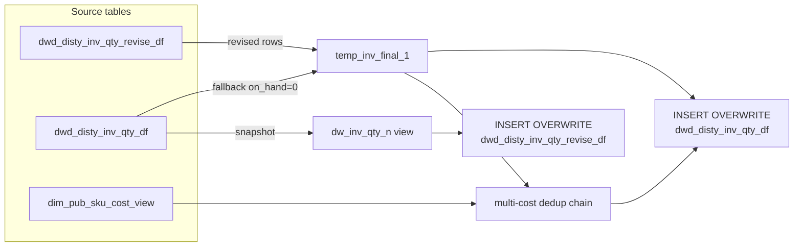

# DWD: Switch Distributor Inventory Quantity (`dwd_disty_inv_qty_df` + `dwd_disty_inv_qty_revise_df`)

- artifact_type: etl_table
- artifact_id: ${literal_target_db}.dwd_disty_inv_qty_revise_df
- domain: inventory
- one_line_purpose: This job performs the "switch" step in the inventory switch workflow. It merges the current production inventory quantity (`dwd_disty_inv_qty_df`) with the revised snapshot (`dwd_disty_inv_qty_revise_df`) to produce a consistent combined vi...
- layer_type: DWD
- source_kind: etl_sql
- evidence_source: source/etl/sql/inventory/data_service/inventory_switch/python/switch_dw_inv_qty.py

---

## L1 Data Foundation

### Identity and physical mapping
- **Table:** `${literal_target_db}.dwd_disty_inv_qty_revise_df`
- **Layer type:** DWD
- **Canonical / derived:** Derived / ETL-loaded (see L3)
- **Owner team:** not registered in metadata catalog

### Grain, scope, exclusions
- **Grain:** one row per `loc_no` + `inv_type` + `sku_no` per `date_flag` + `company_no` partition.
- **Scope:** See L2 business purpose / L3 filters
- **Partition:** `date_flag`, `company_no`. - resolved from pipeline (see L4)
- **Natural key:** `loc_no`, `inv_type`, `sku_no` (within a partition).
- **Exclusions:** Not documented in repository

#### Grain detail (preserved)

- **Grain:** one row per `loc_no` + `inv_type` + `sku_no` per `date_flag` + `company_no` partition.
- **Partition:** `date_flag`, `company_no`.
- **Natural key:** `loc_no`, `inv_type`, `sku_no` (within a partition).

---

### Cross-engine presence
| Engine | Present | Canonical FQN | Notes |
|--------|---------|---------------|-------|
| Hive | yes | `${literal_target_db}.dwd_disty_inv_qty_revise_df` | ETL target / intermediate per evidence script |
| Vertica | pending | `${literal_target_db}.dwd_disty_inv_qty_revise_df` | Confirm via hive2vertica flow evidence / MCP |

### Physical schema reference

Pointer block only - full column catalog lives in WKB L1 storage JSON.

| Field | Value |
|-------|-------|
| **Authoritative catalog** | WKB L1 storage seed (not duplicated in this file) |
| **entity_id** | `${literal_target_db}.dwd_disty_inv_qty_revise_df` |
| **l1_catalog_seed** | `target/storage/wkb/snapshots/_snapshot_id_template/l1_catalog/{engine}_{schema}_{table}.json` |
| **column_count** | pending (run ddl_seed_writer) |
| **partition_keys** | `date_flag, company_no` |
| **ddl_source** | pending Bitbucket DDL / Vertica metadata ingest |
| **retrieval** | `python -m tools.wkb.indexing.run_query --query "inventory switch_dw_inv_qty schema" --intent find_table_schema` |

### Lineage
| Object | Role |
|--------|------|
| `${literal_target_db}.dwd_disty_inv_qty_revise_df` | Revised snapshot source |
| `${literal_target_db}.dwd_disty_inv_qty_df` | Fallback source + primary target |
| `dim_${literal_country}.dim_pub_sku_cost_view` | Cost fallback |

---

### Freshness and load path
| Item | Value |
|------|-------|
| Load pattern | See L3 end-to-end / INSERT pattern in evidence script |
| Schedule | Not documented in repository |
| Parameters | `literal_target_db`, `literal_date_flag`, `etl_timestamp`, `literal_country` |


---

## L2 Declarative Knowledge

### Business purpose
This job performs the "switch" step in the inventory switch workflow. It merges the current
production inventory quantity (`dwd_disty_inv_qty_df`) with the revised snapshot
(`dwd_disty_inv_qty_revise_df`) to produce a consistent combined view, applies multi-cost
deduplication, writes the result to `dwd_disty_inv_qty_df`, and then copies the pre-switch
production values back to `dwd_disty_inv_qty_revise_df`. Unlike `reload_dw_inv_qty_n.py` which
sources from `dwd_disty_inv_qty_reload_df`, this job sources directly from `dwd_disty_inv_qty_revise_df`.

---

### Audience and use cases
| Audience | How they benefit |
|----------|-----------------|
| **Inventory switch workflow** | Executes the "switch" step that makes the revised snapshot the new production baseline |
| **Data Engineering** | Rotates snapshot storage so each run preserves the prior production state |

---

### Fact key resolution
- Natural key: `loc_no`, `inv_type`, `sku_no` (within a partition).
- FK / label-on attributes: see L3 dimension join patterns and step-by-step logic.
- Negative assertion: do not treat descriptive labels as grain keys unless listed under natural key.

### Time field semantics
- **date_flag / partition columns:** `date_flag`, `company_no`.
- Primary reporting filter should use the partition column(s) documented in L1; resolve values via L4.

### Metrics served
Same columns as `dwd_disty_inv_qty_df` — see `load_dw_inv_qty.md` for full column descriptions.

---

### Metric serving map
N/A - not a `*_comb_mtd` / multi-period wide serving table (or map not present in legacy doc).


### Data products and column groups (preserved)

Same columns as `dwd_disty_inv_qty_df` — see `load_dw_inv_qty.md` for full column descriptions.

---

### etl_metrics

N/A - no calculable ETL formulas extracted from this document (passthrough / stored measures only, or formulas not documented).

---

## L3 Procedural Knowledge

### Query and routing rules
**Business filters:** Use partition / date keys from L1 grain for reporting scope.
**Technical predicates (load only):** See Key filters and step-by-step logic below.

### Dimension join patterns
| Dimension FQN | Join keys | Purpose | Evidence |
|---------------|-----------|---------|----------|
| See step-by-step / base tables | See L3 steps | Dimension enrichment | `source/etl/sql/inventory/data_service/inventory_switch/python/switch_dw_inv_qty.py` |

### Key filters and ETL business logic
### Step 1 — `dw_inv_qty_n` (view)

Snapshot of current `dwd_disty_inv_qty_df` for `date_flag` with `company_no = company_no` filter (effectively all companies).

---

### Step 2 — `temp_inv_final_1`

UNION ALL of:

**Set A — revised rows (from `dwd_disty_inv_qty_revise_df t1`):**
- Filter: `company_no = company_no` AND `date_flag = '${literal_date_flag}'`
- `nvl(on_hand_qty, 0)`, `nvl(intran_in, 0)`, `entry_id` as-is.

**Set B — fallback production rows (from `dwd_disty_inv_qty_df t1`):**
- Filter: `date_flag = '${literal_date_flag}'` AND NOT EXISTS in `dwd_disty_inv_qty_revise_df` (same SKU/inv_type/loc_no/company_no/date_flag).
- `on_hand_qty = 0`, `intran_in = 0`, `entry_id = -1`.

---

### Steps 3–8 — Multi-cost deduplication

Identical to `load_dw_inv_qty.py`. See that document for full detail.

---

### Step 9 — INSERT OVERWRITE `dwd_disty_inv_qty_df`

Identical column list and `*_2` resolution to `load_dw_inv_qty.py`.

---

### Step 10 — INSERT OVERWRITE `dwd_disty_inv_qty_revise_df`

From `dw_inv_qty_n` view. All columns passed through with `entry_datetime = '${etl_timestamp}'`.

---

### Standard time-filter SQL
```sql
-- relative period filter using resolved partition value (see L4)
SELECT *
FROM ${literal_target_db}.dwd_disty_inv_qty_revise_df
WHERE /* partition predicate */ date_flag = '${partition_value}';
```

### End-to-end flow
**Runtime parameters:** `literal_target_db`, `literal_date_flag`, `etl_timestamp`, `literal_country`
**Target tables:**
- `${literal_target_db}.dwd_disty_inv_qty_df` (partitioned by `date_flag`, `company_no`)
- `${literal_target_db}.dwd_disty_inv_qty_revise_df` (partitioned by `date_flag`, `company_no`)

1. Create `dw_inv_qty_n` view: current `dwd_disty_inv_qty_df` snapshot for `date_flag`.
2. Build `temp_inv_final_1`: UNION of revised rows (from `dwd_disty_inv_qty_revise_df`) + fallback rows from `dwd_disty_inv_qty_df` not in revise (zeroed `on_hand_qty`, `intran_in`, `entry_id=-1`).
3. Apply multi-cost deduplication chain (`table_multi_cost_all` through `table_inv_qty_2`).
4. **INSERT OVERWRITE** `dwd_disty_inv_qty_df` from `temp_inv_final_1` + `table_inv_qty_2`.
5. **INSERT OVERWRITE** `dwd_disty_inv_qty_revise_df` from `dw_inv_qty_n` view.



---


#### High-level stages (preserved)

| Stage | Business meaning |
|-------|-----------------|
| **Snapshot current production** | Creates `dw_inv_qty_n` view — current production snapshot for `date_flag` |
| **Merge revised + production** | UNION revised rows with non-revised production rows (with zeroed qty) |
| **Multi-cost deduplication** | Same 8-table dedup chain as `load_dw_inv_qty.py` |
| **Write to production table** | Overwrites `dwd_disty_inv_qty_df` with the merged result |
| **Write to revise table** | Overwrites `dwd_disty_inv_qty_revise_df` with the pre-switch production snapshot |

**Parameters:** `literal_target_db`, `literal_date_flag`, `etl_timestamp`, `literal_country`

---


### Base tables register
| Object | Role in this job |
|--------|-----------------|
| `${literal_target_db}.dwd_disty_inv_qty_revise_df` | Primary source — revised snapshot |
| `${literal_target_db}.dwd_disty_inv_qty_df` | Fallback source + primary target |
| `dim_${literal_country}.dim_pub_sku_cost_view` | Multi-cost resolution fallback |

**Temporary tables (inside the job only):**
`dw_inv_qty_n` (view) → `temp_inv_final_1` → `table_multi_cost_all` → `table_inv_qty` → `table_multi_cost_1..4` + `table_one_cost_1..4` → `table_update_1..4` → `table_inv_qty_2` → (two final INSERTs)

---

### Step-by-step logic
### Step 1 — `dw_inv_qty_n` (view)

Snapshot of current `dwd_disty_inv_qty_df` for `date_flag` with `company_no = company_no` filter (effectively all companies).

---

### Step 2 — `temp_inv_final_1`

UNION ALL of:

**Set A — revised rows (from `dwd_disty_inv_qty_revise_df t1`):**
- Filter: `company_no = company_no` AND `date_flag = '${literal_date_flag}'`
- `nvl(on_hand_qty, 0)`, `nvl(intran_in, 0)`, `entry_id` as-is.

**Set B — fallback production rows (from `dwd_disty_inv_qty_df t1`):**
- Filter: `date_flag = '${literal_date_flag}'` AND NOT EXISTS in `dwd_disty_inv_qty_revise_df` (same SKU/inv_type/loc_no/company_no/date_flag).
- `on_hand_qty = 0`, `intran_in = 0`, `entry_id = -1`.

---

### Steps 3–8 — Multi-cost deduplication

Identical to `load_dw_inv_qty.py`. See that document for full detail.

---

### Step 9 — INSERT OVERWRITE `dwd_disty_inv_qty_df`

Identical column list and `*_2` resolution to `load_dw_inv_qty.py`.

---

### Step 10 — INSERT OVERWRITE `dwd_disty_inv_qty_revise_df`

From `dw_inv_qty_n` view. All columns passed through with `entry_datetime = '${etl_timestamp}'`.

---

### Relationship map (embedded)

| from_fqn | to_fqn | cardinality | join_keys | provenance |
|----------|--------|-------------|-----------|------------|
| `a` | `table_multi_cost_all` | many:1 | `a.sku_no` = `b.sku_no`; `a.inv_type` = `b.inv_type`; `a.company_no` = `b.company_no` | etl_sql (`source/etl/sql/inventory/data_service/inventory/inventory_switch/python/switch_dw_inv_qty.py:124`) |
| `${literal_target_db}.dwd_disty_inv_qty_df` | `table_one_cost_1` | many:1 | — | etl_sql (`source/etl/sql/inventory/data_service/inventory/inventory_switch/python/switch_dw_inv_qty.py:241`) |
| `${literal_target_db}.dwd_disty_inv_qty_df` | `table_one_cost_2` | many:1 | — | etl_sql (`source/etl/sql/inventory/data_service/inventory/inventory_switch/python/switch_dw_inv_qty.py:259`) |
| `${literal_target_db}.dwd_disty_inv_qty_df` | `table_one_cost_3` | many:1 | — | etl_sql (`source/etl/sql/inventory/data_service/inventory/inventory_switch/python/switch_dw_inv_qty.py:277`) |
| `${literal_target_db}.dwd_disty_inv_qty_df` | `table_one_cost_4` | many:1 | — | etl_sql (`source/etl/sql/inventory/data_service/inventory/inventory_switch/python/switch_dw_inv_qty.py:295`) |
| `${literal_target_db}.dwd_disty_inv_qty_df` | `table_multi_cost_1` | many:1 (LEFT) | — | etl_sql (`source/etl/sql/inventory/data_service/inventory/inventory_switch/python/switch_dw_inv_qty.py:346`) |
| `${literal_target_db}.dwd_disty_inv_qty_df` | `table_update_1` | many:1 (LEFT) | — | etl_sql (`source/etl/sql/inventory/data_service/inventory/inventory_switch/python/switch_dw_inv_qty.py:351`) |
| `${literal_target_db}.dwd_disty_inv_qty_df` | `table_multi_cost_2` | many:1 (LEFT) | — | etl_sql (`source/etl/sql/inventory/data_service/inventory/inventory_switch/python/switch_dw_inv_qty.py:356`) |
| `${literal_target_db}.dwd_disty_inv_qty_df` | `table_update_2` | many:1 (LEFT) | — | etl_sql (`source/etl/sql/inventory/data_service/inventory/inventory_switch/python/switch_dw_inv_qty.py:361`) |
| `${literal_target_db}.dwd_disty_inv_qty_df` | `table_multi_cost_3` | many:1 (LEFT) | — | etl_sql (`source/etl/sql/inventory/data_service/inventory/inventory_switch/python/switch_dw_inv_qty.py:366`) |
| `${literal_target_db}.dwd_disty_inv_qty_df` | `table_update_3` | many:1 (LEFT) | — | etl_sql (`source/etl/sql/inventory/data_service/inventory/inventory_switch/python/switch_dw_inv_qty.py:371`) |
| `${literal_target_db}.dwd_disty_inv_qty_df` | `table_multi_cost_4` | many:1 (LEFT) | — | etl_sql (`source/etl/sql/inventory/data_service/inventory/inventory_switch/python/switch_dw_inv_qty.py:376`) |
| `${literal_target_db}.dwd_disty_inv_qty_df` | `table_update_4` | many:1 (LEFT) | — | etl_sql (`source/etl/sql/inventory/data_service/inventory/inventory_switch/python/switch_dw_inv_qty.py:381`) |
| `a` | `table_inv_qty_2` | many:1 (LEFT) | `a.sku_no` = `b.sku_no`; `a.loc_no` = `b.loc_no`; `a.inv_type` = `b.inv_type`; `a.company_no` = `b.company_no` | etl_sql (`source/etl/sql/inventory/data_service/inventory/inventory_switch/python/switch_dw_inv_qty.py:444`) |

### Special logic (embedded)

Not documented in repository

### Column / field derivations (from ETL SQL)

| target_column | expression_sql | upstream_columns | upstream_tables | transform_kind | evidence |
|---------------|----------------|------------------|-----------------|----------------|----------|
| `loc_no` | `loc_no` | `loc_no` | `dw_inv_qty_n` | passthrough | `source/etl/sql/inventory/data_service/inventory/inventory_switch/python/switch_dw_inv_qty.py:6` |
| `inv_type` | `inv_type` | `inv_type` | `dw_inv_qty_n` | passthrough | `source/etl/sql/inventory/data_service/inventory/inventory_switch/python/switch_dw_inv_qty.py:7` |
| `sku_no` | `sku_no` | `sku_no` | `dw_inv_qty_n` | passthrough | `source/etl/sql/inventory/data_service/inventory/inventory_switch/python/switch_dw_inv_qty.py:8` |
| `u_version` | `u_version` | `u_version` | `dw_inv_qty_n` | passthrough | `source/etl/sql/inventory/data_service/inventory/inventory_switch/python/switch_dw_inv_qty.py:9` |
| `ave_cost` | `ave_cost` | `ave_cost` | `dw_inv_qty_n` | passthrough | `source/etl/sql/inventory/data_service/inventory/inventory_switch/python/switch_dw_inv_qty.py:10` |
| `std_cost` | `std_cost` | `std_cost` | `dw_inv_qty_n` | passthrough | `source/etl/sql/inventory/data_service/inventory/inventory_switch/python/switch_dw_inv_qty.py:11` |
| `on_hand_qty` | `on_hand_qty` | `on_hand_qty` | `dw_inv_qty_n` | passthrough | `source/etl/sql/inventory/data_service/inventory/inventory_switch/python/switch_dw_inv_qty.py:12` |
| `bo_qty` | `bo_qty` | `bo_qty` | `dw_inv_qty_n` | passthrough | `source/etl/sql/inventory/data_service/inventory/inventory_switch/python/switch_dw_inv_qty.py:13` |
| `on_order_qty` | `on_order_qty` | `on_order_qty` | `dw_inv_qty_n` | passthrough | `source/etl/sql/inventory/data_service/inventory/inventory_switch/python/switch_dw_inv_qty.py:14` |
| `alloc_qty` | `alloc_qty` | `alloc_qty` | `dw_inv_qty_n` | passthrough | `source/etl/sql/inventory/data_service/inventory/inventory_switch/python/switch_dw_inv_qty.py:15` |
| `intran_out` | `intran_out` | `intran_out` | `dw_inv_qty_n` | passthrough | `source/etl/sql/inventory/data_service/inventory/inventory_switch/python/switch_dw_inv_qty.py:16` |
| `intran_in` | `intran_in` | `intran_in` | `dw_inv_qty_n` | passthrough | `source/etl/sql/inventory/data_service/inventory/inventory_switch/python/switch_dw_inv_qty.py:17` |
| `entry_datetime` | `'${etl_timestamp}'` | `etl_timestamp` | `dw_inv_qty_n` | literal | `source/etl/sql/inventory/data_service/inventory/inventory_switch/python/switch_dw_inv_qty.py:50` |
| `entry_id` | `entry_id` | `entry_id` | `dw_inv_qty_n` | passthrough | `source/etl/sql/inventory/data_service/inventory/inventory_switch/python/switch_dw_inv_qty.py:19` |
| `wip_qty` | `wip_qty` | `wip_qty` | `dw_inv_qty_n` | passthrough | `source/etl/sql/inventory/data_service/inventory/inventory_switch/python/switch_dw_inv_qty.py:20` |
| `it_ave_cost` | `it_ave_cost` | `it_ave_cost` | `dw_inv_qty_n` | passthrough | `source/etl/sql/inventory/data_service/inventory/inventory_switch/python/switch_dw_inv_qty.py:21` |
| `base_cost` | `base_cost` | `base_cost` | `dw_inv_qty_n` | passthrough | `source/etl/sql/inventory/data_service/inventory/inventory_switch/python/switch_dw_inv_qty.py:22` |
| `ave_cost_fx` | `ave_cost_fx` | `ave_cost_fx` | `dw_inv_qty_n` | passthrough | `source/etl/sql/inventory/data_service/inventory/inventory_switch/python/switch_dw_inv_qty.py:23` |
| `base_cost_fx` | `base_cost_fx` | `base_cost_fx` | `dw_inv_qty_n` | passthrough | `source/etl/sql/inventory/data_service/inventory/inventory_switch/python/switch_dw_inv_qty.py:24` |
| `rio_qty` | `rio_qty` | `rio_qty` | `dw_inv_qty_n` | passthrough | `source/etl/sql/inventory/data_service/inventory/inventory_switch/python/switch_dw_inv_qty.py:25` |
| `kwo_comp_rio_qty` | `kwo_comp_rio_qty` | `kwo_comp_rio_qty` | `dw_inv_qty_n` | passthrough | `source/etl/sql/inventory/data_service/inventory/inventory_switch/python/switch_dw_inv_qty.py:26` |
| `kwo_oh_qty` | `kwo_oh_qty` | `kwo_oh_qty` | `dw_inv_qty_n` | passthrough | `source/etl/sql/inventory/data_service/inventory/inventory_switch/python/switch_dw_inv_qty.py:27` |
| `kwo_bo_qty` | `kwo_bo_qty` | `kwo_bo_qty` | `dw_inv_qty_n` | passthrough | `source/etl/sql/inventory/data_service/inventory/inventory_switch/python/switch_dw_inv_qty.py:28` |
| `date_flag` | `date_flag` | `date_flag` | `dw_inv_qty_n` | passthrough | `source/etl/sql/inventory/data_service/inventory/inventory_switch/python/switch_dw_inv_qty.py:29` |
| `company_no` | `company_no` | `company_no` | `dw_inv_qty_n` | passthrough | `source/etl/sql/inventory/data_service/inventory/inventory_switch/python/switch_dw_inv_qty.py:30` |

### Sentinel and code values
| Value | Meaning |
|-------|---------|
| `entry_id = -1` | Fallback row from `dwd_disty_inv_qty_df` — not from revise |
| `on_hand_qty = 0`, `intran_in = 0` | Zeroed for fallback rows |

---

---

## L4 Validation

### Resolved partition value
| Step | Source | How partition / date scope is determined |
|------|--------|------------------------------------------|
| 1 | evidence script / flow | See parameters in L1 Freshness and L3 filters - `source/etl/sql/inventory/data_service/inventory_switch/python/switch_dw_inv_qty.py` |

**Plain language:** Partition and date scope follow Azkaban/bootstrap parameters documented in the source script and orchestrating flow; do not hardcode calendar literals.

### Data quality checks
- Prefer row-count-by-partition, metric sums, and grain duplicate checks (see Validation SQL).
- Additional checks from legacy caveats / operational notes when present.

### Validation SQL
```sql
-- 1) Row count by partition
SELECT ${partition_col}, COUNT(*) AS row_cnt
FROM dim_${literal_country}.dim_pub_sku_cost_view
WHERE ${partition_col} = '${partition_value}'
GROUP BY ${partition_col};

-- 2) Metric sum by business dimension (top deltas)
SELECT ${dim_key}, SUM(${metric}) AS metric_sum
FROM dim_${literal_country}.dim_pub_sku_cost_view
WHERE ${partition_col} = '${partition_value}'
GROUP BY ${dim_key}
ORDER BY ABS(SUM(${metric})) DESC
LIMIT 20;

-- 3) Grain duplicate check
SELECT ${grain_key_1}, ${grain_key_2}, ${grain_key_3}, ${partition_col}, COUNT(*) AS cnt
FROM dim_${literal_country}.dim_pub_sku_cost_view
WHERE ${partition_col} = '${partition_value}'
GROUP BY ${grain_key_1}, ${grain_key_2}, ${grain_key_3}, ${partition_col}
HAVING COUNT(*) > 1;
```

Replace placeholders from this file's Grain and keys / Data you can fetch sections, and use the resolved partition value from run scope.

### Caveats for interpretation
- Same as `reload_dw_inv_qty_n.py` — fallback rows zero out `on_hand_qty` and `intran_in`.
- After this job, `dwd_disty_inv_qty_revise_df` contains the pre-switch production values (not the revised snapshot).

---

### Conflicts and open questions
- Schedule, owner, SLA: Not documented in repository (unless preserved schedule evidence above).
- Vertica MCP verification: pending unless confirmed in L5.


#### Key differences from `reload_dw_inv_qty_n.py` (preserved from legacy doc)

- Source is `dwd_disty_inv_qty_revise_df` directly (vs. `dwd_disty_inv_qty_reload_df` in the reload variant).
- Otherwise the logic is identical.

---

---

## L5 Runtime View

### Query path and engine preference
| Role | Hive object | Vertica object | Sync mode | Evidence | MCP verified |
|------|-------------|----------------|-----------|----------|--------------|
| **Query for reporting** | *See script lineage* | `dim_${literal_country}.dim_pub_sku_cost_view` | *Verify from flow* | *Add flow file:line* | pending |
| **Hive alternative** | `*` | `dim_${literal_country}.dim_pub_sku_cost_view` | - | *See dependencies* | - |
| **ETL internal** | staging/temp tables | *Not synced to Vertica* | - | *See step-by-step logic* | - |

Business users should query `dim_${literal_country}.dim_pub_sku_cost_view` in Vertica once MCP verification is completed for this document.

### Access constraints
- Country / company schema parameters may apply (`literal_country`, `company_no`, etc.).
- Hive-only staging objects are not reporting surfaces unless synced.

### Query risk profile
| Field | Value |
|-------|-------|
| requires_date_predicate | yes |
| scan_risk_tier | high |

---

## L6 Access and Consumption

### Primary consumers and use cases
| Audience | How they benefit |
|----------|-----------------|
| **Inventory switch workflow** | Executes the "switch" step that makes the revised snapshot the new production baseline |
| **Data Engineering** | Rotates snapshot storage so each run preserves the prior production state |

---

### Representative query patterns
```sql
-- certified / illustrative lookup - replace predicates from L1/L4
SELECT *
FROM ${literal_target_db}.dwd_disty_inv_qty_revise_df
WHERE date_flag = '${partition_value}'
LIMIT 100;
```

### Dependencies and notes
### Upstream objects (verified)

| Object | Usage | Evidence |
|--------|-------|----------|
| `dwd_disty_inv_qty_revise_df` | Revised snapshot source | `source/etl/sql/inventory/data_service/inventory_switch/python/switch_dw_inv_qty.py:63` |
| `dwd_disty_inv_qty_df` | Fallback + target | `source/etl/sql/inventory/data_service/inventory_switch/python/switch_dw_inv_qty.py:92` |
| `dim_pub_sku_cost_view` | Multi-cost fallback | `source/etl/sql/inventory/data_service/inventory_switch/python/switch_dw_inv_qty.py:401` |

### Downstream consumers (verified)

| Object / script | Evidence |
|-----------------|----------|
| None identified in repository | — |

### Operational detail (verified)

- Writes to both `dwd_disty_inv_qty_df` (`:408`) and `dwd_disty_inv_qty_revise_df` (`:460`): `switch_dw_inv_qty.py`

### Not documented in repository

- Schedule, owner, SLA — not in scripts or configs

---

*Document generated from `source/etl/sql/inventory/data_service/inventory_switch/python/switch_dw_inv_qty.py`.*

#### Not documented in repository
- Owner, SLA (unless schedule evidence preserved above)
- Any dependency without `file:line` evidence in this document

---

*Document migrated to L1-L6 from legacy Knowledgebase content. Evidence: `source/etl/sql/inventory/data_service/inventory_switch/python/switch_dw_inv_qty.py`.*
