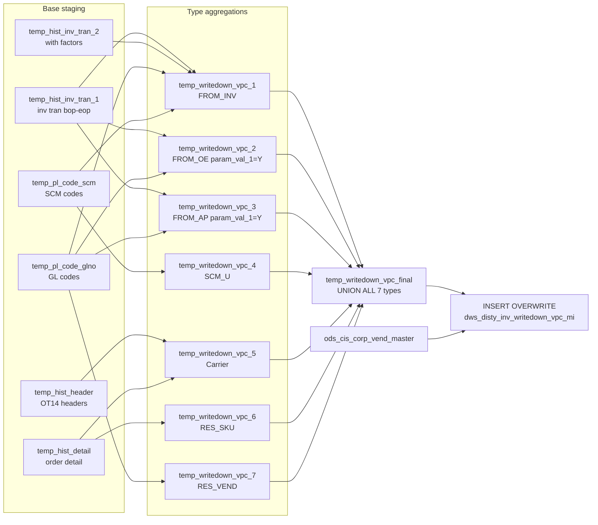

# DWS: Distributor Inventory Writedown VPC Monthly (`dws_disty_inv_writedown_vpc_mi`)

- artifact_type: etl_table
- artifact_id: ${target_db}.dws_disty_inv_writedown_vpc_mi
- domain: inventory
- one_line_purpose: This job computes the monthly inventory writedown amounts attributable to vendor price concessions (VPC) and related programs. It aggregates costs from seven distinct sources — inventory journal entries (FROM_INV), OE journal entries (FROM_...
- layer_type: DWS
- source_kind: etl_sql
- evidence_source: source/etl/sql/inventory/data_service/inventory_writeoff/python/load_writedown_vpc_mi.py

---

## L1 Data Foundation

### Identity and physical mapping
- **Table:** `${target_db}.dws_disty_inv_writedown_vpc_mi`
- **Layer type:** DWS
- **Canonical / derived:** Derived / ETL-loaded (see L3)
- **Owner team:** not registered in metadata catalog

### Grain, scope, exclusions
- **Grain:** one row per `month` + `type` + `order_type` + `vend_no` + `vpl_no` + `sku_no` per `dt_month` + `company_no` partition.
- **Scope:** See L2 business purpose / L3 filters
- **Partition:** `dt_month`, `company_no`. - resolved from pipeline (see L4)
- **Natural key:** `month`, `type`, `order_type`, `vend_no`, `vpl_no`, `sku_no` (within a partition).
- **Exclusions:** Not documented in repository

#### Grain detail (preserved)

- **Grain:** one row per `month` + `type` + `order_type` + `vend_no` + `vpl_no` + `sku_no` per `dt_month` + `company_no` partition.
- **Partition:** `dt_month`, `company_no`.
- **Natural key:** `month`, `type`, `order_type`, `vend_no`, `vpl_no`, `sku_no` (within a partition).

---

### Cross-engine presence
| Engine | Present | Canonical FQN | Notes |
|--------|---------|---------------|-------|
| Hive | yes | `${target_db}.dws_disty_inv_writedown_vpc_mi` | ETL target / intermediate per evidence script |
| Vertica | pending | `${target_db}.dws_disty_inv_writedown_vpc_mi` | Confirm via hive2vertica flow evidence / MCP |

### Physical schema reference

Pointer block only - full column catalog lives in WKB L1 storage JSON.

| Field | Value |
|-------|-------|
| **Authoritative catalog** | WKB L1 storage seed (not duplicated in this file) |
| **entity_id** | `${target_db}.dws_disty_inv_writedown_vpc_mi` |
| **l1_catalog_seed** | `target/storage/wkb/snapshots/_snapshot_id_template/l1_catalog/{engine}_{schema}_{table}.json` |
| **column_count** | pending (run ddl_seed_writer) |
| **partition_keys** | `dt_month, company_no` |
| **ddl_source** | pending Bitbucket DDL / Vertica metadata ingest |
| **retrieval** | `python -m tools.wkb.indexing.run_query --query "inventory load_writedown_vpc_mi schema" --intent find_table_schema` |

### Lineage
| Object | Role |
|--------|------|
| `${source_db}.ods_etl_inv_tran_all` | Inventory transactions base |
| `${source_db}.ods_cis_corp_trans_type` | Transaction direction factors |
| `${source_db}.ods_etl_order_header_all` | OT14 header base |
| `${source_db}.ods_etl_order_detail_all` | Order line cost base |
| `${source_db}.ods_cis_corp_pl_code` | GL and SCM account codes |
| `${source_db}.ods_cis_corp_inv_journal_entry` | Inventory GL entries (FROM_INV) |
| `${source_db}.ods_cis_corp_oe_journal_entry` | OE GL entries (FROM_OE, SCM) |
| `${source_db}.ods_cis_corp_ap_journal_entry` | AP GL entries (FROM_AP, RES_VEND) |
| `${source_db}.ods_cis_corp_part_master` | SKU-to-vendor/VPL mapping |
| `${source_db}.ods_cis_corp_vend_master` | Vendor-to-company mapping |
| `${source_db}.ods_cis_corp_vend_doc` | Vendor document-to-vendor mapping |
| `${source_db}.ods_cis_corp_project_info` / `ods_cis_corp_proj_variance_account` | SCM project GL mapping |
| `${source_db}.ods_cis_corp_po_rec_var` | PO receipt variance |
| `${source_db}.ods_etl_order_exp_all` | Order expenses (SCM, RES) |
| `${source_db}.ods_cis_corp_wi_details` / `ods_cis_corp_wi_check_detail` | Warranty check for carrier loss |
| `${target_db}.dwd_disty_sales_comp_orders_di` / `dwd_disty_sales_single_orders_di` | OPLGM sales data (conditional) |
| `${source_db}.ods_breport_mydaas_breport_parameter` | Exclude OT / OT20 rules |
| `${source_db}.ods_cis_corp_order_type` | Sales order type |
| `${source_db}.ods_dw_prod_dws_dw_b_log` | Rerun cutoff timestamp (rerun_flag=Y only) |

---

### Freshness and load path
| Item | Value |
|------|-------|
| Load pattern | See L3 end-to-end / INSERT pattern in evidence script |
| Schedule | Not documented in repository |
| Parameters | `date_flag`, `bop` (beginning of period), `eop` (end of period), `param_val_5`, `param_val_1`, `target_db`, `source_db`, `company_no`, `m` (month number), `dt_month`, `etl_timestamp`, `rerun_flag` |


---

## L2 Declarative Knowledge

### Business purpose
This job computes the monthly inventory writedown amounts attributable to vendor price concessions
(VPC) and related programs. It aggregates costs from seven distinct sources — inventory journal
entries (FROM_INV), OE journal entries (FROM_OE), AP journal entries (FROM_AP), SCM project
units (SCM_U), carrier loss claims (Carrier), SKU-level reserves (RES_SKU), and vendor-level
reserves (RES_VEND) — and writes the combined result partitioned by month and company. This data
is used for vendor cost-recovery reporting, finance reconciliation, and writedown reserve tracking.

---

### Audience and use cases
| Audience | How they benefit |
|----------|-----------------|
| **Vendor management / VPC team** | Tracks writedown costs recoverable from each vendor (`vend_no`, `vpl_no`) by type and month |
| **Finance / accounting** | `amt` per type per vendor supports GL reconciliation and reserve calculation |
| **SCM program team** | `SCM_U` amounts capture unrecovered SCM project costs |
| **Inventory operations** | Carrier loss (`Carrier`) tracks in-transit lost shipment costs by SKU and vendor |

---

### Fact key resolution
- Natural key: `month`, `type`, `order_type`, `vend_no`, `vpl_no`, `sku_no` (within a partition).
- FK / label-on attributes: see L3 dimension join patterns and step-by-step logic.
- Negative assertion: do not treat descriptive labels as grain keys unless listed under natural key.

### Time field semantics
- **date_flag / partition columns:** `dt_month`, `company_no`.
- Primary reporting filter should use the partition column(s) documented in L1; resolve values via L4.

### Metrics served
When exposing this table to the business, lead with:

1. **Total VPC exposure by vendor:** `sum(amt)` grouped by `vend_no`, `dt_month`
2. **Type breakdown:** `amt` by `type` — understand what drives writedowns (inventory vs. AP vs. carrier etc.)
3. **SKU-level detail:** `amt` by `sku_no`, `vend_no` for item-level recovery conversations
4. **SCM program costs:** `SCM_U` rows by `vend_no`, `vpl_no`

---

### Metric serving map
N/A - not a `*_comb_mtd` / multi-period wide serving table (or map not present in legacy doc).


### Data products and column groups (preserved)

### Identifiers and relationships

- **Vendor:** `vend_no`, `vpl_no` (vendor price line)
- **Product:** `sku_no`
- **Order:** `order_type`
- **Partitioning:** `dt_month`, `company_no`

### Dimension columns

Use these for **filters, group-bys, and star-schema joins**:

- `type` — writedown source type: `FROM_INV`, `FROM_OE`, `FROM_AP`, `SCM_U`, `Carrier`, `RES_SKU`, `RES_VEND`
- `month` — numeric month identifier (parameter `m`)
- `dt_month` — partition month string (e.g., `2022-05`)

### Core derived metrics

| Column | Formula | Business reading |
|--------|---------|-----------------|
| `amt` | Sum of cost amounts by type (see per-type logic below) | Monthly writedown amount attributable to each vendor/SKU by source type |

---

### etl_metrics

#### `amt`
- **Source:** [metric-index.md](../../source/contracts/inventory/metric-index.md#amt)
- **Business definition:** Monthly writedown amount attributable to each vendor/SKU by source type
```sql
Sum of cost amounts by type (see per-type logic below)
```


---

## L3 Procedural Knowledge

### Query and routing rules
**Business filters:** Use partition / date keys from L1 grain for reporting scope.
**Technical predicates (load only):** See Key filters and step-by-step logic below.

### Dimension join patterns
| Dimension FQN | Join keys | Purpose | Evidence |
|---------------|-----------|---------|----------|
| See step-by-step / base tables | See L3 steps | Dimension enrichment | `source/etl/sql/inventory/data_service/inventory_writeoff/python/load_writedown_vpc_mi.py` |

### Key filters and ETL business logic
### Steps 1–6 — Base staging tables

**`temp_hist_inv_tran_1`:** `ods_etl_inv_tran_all` WHERE `doc_date >= bop AND doc_date < eop AND trans_type < 1000 AND order_type IN (2, 48, 34, 4, 7, 15)`.

**`temp_hist_inv_tran_2`:** Joins `temp_hist_inv_tran_1` with `ods_cis_corp_trans_type` to add `col1_factor`, `col2_factor`.

**`temp_hist_header`:** OT14 order headers (`ods_etl_order_header_all` WHERE `order_type = 14 AND delete_date IS NULL`).

**`temp_hist_detail`:** All order details (`ods_etl_order_detail_all` WHERE `delete_date IS NULL`).

**`temp_pl_code_glno`:** GL account codes (code_type=`GLNO`, ccode=`PL`, usage=`INVR`) valid on `date_flag`.

**`temp_pl_code_scm`:** SCM project codes (code_type=`SCM#`) same filter.

---

### Step 7 — `temp_fi_order` (conditional on `param_val_5`)

**`param_val_5 = 'Y'`:** From `ods_cis_corp_inv_journal_entry` WHERE `gl_acct_no = 149010 AND source IN ('SCP','CAWO','IWO','OPS') OR gl_acct_no = 149152 AND source IN ('FRTC','FRTS')`, in period, non-zero.

**`param_val_5 = 'N'`:** From `ods_cis_corp_inv_journal_entry` WHERE `gl_acct_no IN temp_pl_code_glno`, in period, non-zero.

---

### Step 8 — `temp_from_inv_1a/b/c/d` → `temp_from_inv`

- **1a:** Order type 4 (trans_type 9/10/11/12) + order type 7 (non-cwsParSwap) + order type 15 — sums `trans_qty × trans_cost × factor`.
- **1b:** Order type 48 (param_val_5=Y: trans_type 178–181) or order type 34 (param_val_5=N: trans_type 76 + OE variance) — sums cost_change or trans_cost.
- **1c:** Order ...

### Standard time-filter SQL
```sql
-- relative period filter using resolved partition value (see L4)
SELECT *
FROM ${target_db}.dws_disty_inv_writedown_vpc_mi
WHERE /* partition predicate */ date_flag = '${partition_value}';
```

### End-to-end flow
**Runtime parameters:** `date_flag`, `bop`, `eop`, `param_val_5`, `param_val_1`, `target_db`, `source_db`, `company_no`, `m`, `dt_month`, `etl_timestamp`, `rerun_flag`
**Target table:** `${target_db}.dws_disty_inv_writedown_vpc_mi`, partitioned by **`dt_month`**, **`company_no`**.

1. Build base transaction tables: `temp_hist_inv_tran_1` (inv tran for `bop`–`eop`), `temp_hist_inv_tran_2` (with `col1/col2_factor`), `temp_hist_header` (OT14 headers), `temp_hist_detail` (all order details), `temp_pl_code_glno` (GL account codes), `temp_pl_code_scm` (SCM project codes).
2. **FROM_INV** (`temp_writedown_vpc_1`): aggregate inv tran costs from qualifying GL order types (4, 48, 34, 7, 15, 2) by vendor+VPL+SKU.
3. **FROM_OE** (`temp_writedown_vpc_2`, if `param_val_1=Y`): OE journal entries allocated to SKUs by cost weight.
4. **FROM_AP** (`temp_writedown_vpc_3`, if `param_val_1=Y`): AP journal entries by vendor.
5. **SCM_U** (`temp_writedown_vpc_4`): SCM project expenses via `temp_scm_order`, `temp_scm_order_sku`, `temp_exp`.
6. **Carrier** (`temp_writedown_vpc_5`): OT14 lost shipment losses via `temp_ot14_1`, `temp_ot14_2`, `temp_wi`.
7. **RES_SKU** (`temp_writedown_vpc_6`): RES expense code costs allocated to SKU via `temp_t_exp`, `temp_t_det`.
8. **RES_VEND** (`temp_writedown_vpc_7`): AP journal entries for GL account 421000 (reserve) by vendor.
9. UNION all 7 temp tables into `temp_writedown_vpc_final`.
10. **INSERT OVERWRITE** `dws_disty_inv_writedown_vpc_mi` joining with `ods_cis_corp_vend_master` for `company_no`.



---


#### High-level stages (preserved)

| Stage | Business meaning |
|-------|-----------------|
| **Read inventory transactions** | Identifies cost movements from sales, purchase orders, and misc order types within the month |
| **FROM_INV aggregation** | Sums inventory transaction costs by vendor+VPL+SKU for qualifying GL account order types |
| **FROM_OE aggregation** | Sums OE journal GL amounts allocated to order lines by SKU cost weight (conditional on `param_val_1`) |
| **FROM_AP aggregation** | Sums AP journal GL amounts by vendor (conditional on `param_val_1`) |
| **SCM_U aggregation** | Sums SCM project expenses by vendor+VPL+SKU |
| **Carrier aggregation** | Computes carrier loss amounts from OT14 (lost-in-transit) debit memos, net of warranty checks |
| **RES_SKU aggregation** | Allocates RES expense-code costs to SKU level by cost weight |
| **RES_VEND aggregation** | Sums AP GL amounts for account 421000 (reserve) by vendor |
| **UNION and INSERT** | Combines all seven type streams and writes to the monthly target table |

**Parameters:** `date_flag`, `bop` (beginning of period), `eop` (end of period), `param_val_5`, `param_val_1`, `target_db`, `source_db`, `company_no`, `m` (month number), `dt_month`, `etl_timestamp`, `rerun_flag`

---


### Base tables register
| Object | Role in this job |
|--------|-----------------|
| `${source_db}.ods_etl_inv_tran_all` | Inventory transactions for `bop`–`eop` |
| `${source_db}.ods_cis_corp_trans_type` | `col1_factor`, `col2_factor` for transaction cost direction |
| `${source_db}.ods_etl_order_header_all` | OT14 (lost shipment) debit memo headers |
| `${source_db}.ods_etl_order_detail_all` | Order line details for cost allocation |
| `${source_db}.ods_cis_corp_pl_code` | GL account codes (GLNO) and SCM project codes (SCM#) |
| `${source_db}.ods_cis_corp_inv_journal_entry` | Inventory journal GL entries — FROM_INV source |
| `${source_db}.ods_cis_corp_oe_journal_entry` | OE journal GL entries — FROM_OE source |
| `${source_db}.ods_cis_corp_ap_journal_entry` | AP journal GL entries — FROM_AP and RES_VEND source |
| `${source_db}.ods_cis_corp_part_master` | SKU-to-vendor (vend_no, vpl_no) lookup |
| `${source_db}.ods_cis_corp_vend_master` | Vendor-to-company_no lookup (for final INSERT) |
| `${source_db}.ods_cis_corp_vend_doc` | Vendor document number to vendor number mapping |
| `${source_db}.ods_cis_corp_project_info` / `ods_cis_corp_proj_variance_account` | SCM project-to-GL mapping |
| `${source_db}.ods_cis_corp_po_rec_var` | PO receipt variance — FROM_INV/OE cost components |
| `${source_db}.ods_etl_order_exp_all` | Order expenses — SCM_U and RES_SKU allocation |
| `${source_db}.ods_cis_corp_wi_details` / `ods_cis_corp_wi_check_detail` | Warranty check amounts for OT14 carrier loss |
| `${target_db}.dwd_disty_sales_comp_orders_di` / `dwd_disty_sales_single_orders_di` | Sales data for OPLGM temp_from_inv_1d (conditional on `param_val_5=Y` or `param_val_1=Y`) |
| `${source_db}.ods_breport_mydaas_breport_parameter` | Exclude OT order types and OT20 ship method exclusion rules |
| `${source_db}.ods_cis_corp_order_type` | Sales order type classification |

**Temporary tables (inside the job only):**
`temp_hist_inv_tran_1` → `temp_hist_inv_tran_2` → `temp_hist_header` → `temp_hist_detail` → `temp_pl_code_glno` → `temp_pl_code_scm` → `temp_fi_order` → `temp_from_inv_1a/b/c/d` → `temp_scm_no` → `temp_scm_order` → `temp_scm_order_sku` → `temp_exp` → `temp_from_inv` → `temp_writedown_vpc_1` → `temp_from_oe` → `temp_writedown_vpc_2` → `temp_from_ap` → `temp_writedown_vpc_3` → `temp_writedown_vpc_4` → `temp_ot14_1` → `temp_wi` → `temp_ot14_2` → `temp_writedown_vpc_5` → `temp_t_exp` → `temp_t_det` → `temp_writedown_vpc_6` → `temp_t_gl` → `temp_writedown_vpc_7` → `temp_writedown_vpc_final` → (final `INSERT`)

---

### Step-by-step logic
### Steps 1–6 — Base staging tables

**`temp_hist_inv_tran_1`:** `ods_etl_inv_tran_all` WHERE `doc_date >= bop AND doc_date < eop AND trans_type < 1000 AND order_type IN (2, 48, 34, 4, 7, 15)`.

**`temp_hist_inv_tran_2`:** Joins `temp_hist_inv_tran_1` with `ods_cis_corp_trans_type` to add `col1_factor`, `col2_factor`.

**`temp_hist_header`:** OT14 order headers (`ods_etl_order_header_all` WHERE `order_type = 14 AND delete_date IS NULL`).

**`temp_hist_detail`:** All order details (`ods_etl_order_detail_all` WHERE `delete_date IS NULL`).

**`temp_pl_code_glno`:** GL account codes (code_type=`GLNO`, ccode=`PL`, usage=`INVR`) valid on `date_flag`.

**`temp_pl_code_scm`:** SCM project codes (code_type=`SCM#`) same filter.

---

### Step 7 — `temp_fi_order` (conditional on `param_val_5`)

**`param_val_5 = 'Y'`:** From `ods_cis_corp_inv_journal_entry` WHERE `gl_acct_no = 149010 AND source IN ('SCP','CAWO','IWO','OPS') OR gl_acct_no = 149152 AND source IN ('FRTC','FRTS')`, in period, non-zero.

**`param_val_5 = 'N'`:** From `ods_cis_corp_inv_journal_entry` WHERE `gl_acct_no IN temp_pl_code_glno`, in period, non-zero.

---

### Step 8 — `temp_from_inv_1a/b/c/d` → `temp_from_inv`

- **1a:** Order type 4 (trans_type 9/10/11/12) + order type 7 (non-cwsParSwap) + order type 15 — sums `trans_qty × trans_cost × factor`.
- **1b:** Order type 48 (param_val_5=Y: trans_type 178–181) or order type 34 (param_val_5=N: trans_type 76 + OE variance) — sums cost_change or trans_cost.
- **1c:** Order type 2 — trans_type 137 (PO receipt) + PO receipt variances linked to GL accounts.
- **1d:** Conditional (param_val_5=Y or param_val_1=Y): OPLGM-style cost from sales orders (`dwd_disty_sales_comp_orders_di`, `dwd_disty_sales_single_orders_di`), filtered by exclude OT and OT20 ship method rules. Else: empty.

`temp_from_inv` = UNION ALL of 1a + 1b + 1c + 1d.

---

### Step 9 — `temp_writedown_vpc_1` (FROM_INV)

From `temp_from_inv` joined with `ods_cis_corp_part_master` on `sku_no`.
Groups by `order_type`, `vend_no`, `vpl_no`, `sku_no`. `type = 'FROM_INV'`.

---

### Step 10 — `temp_scm_*` → `temp_exp` → `temp_writedown_vpc_4` (SCM_U)

- `temp_scm_order`: orders with GL entries in SCM project codes.
- `temp_scm_order_sku`: order lines for SCM orders.
- `temp_exp`: sums `extended_exp` from `ods_etl_order_exp_all` for SCM project + `order_exp_type = 'DP'`.
- `temp_writedown_vpc_4`: groups by `order_type`, `vend_no`, `vpl_no`, `sku_no` WHERE `exp <> 0`. `type = 'SCM_U'`.

---

### Step 11 — `temp_writedown_vpc_2/3` (FROM_OE / FROM_AP, conditional on `param_val_1=Y`)

**FROM_OE:**
- `temp_from_oe`: OE journal entries for GL accounts in `temp_pl_code_glno`, with `int_ref_type`/`int_ref_no` lookup from order headers.
- `temp_writedown_vpc_2`: allocates GL amount to SKUs by cost-weight (`unit_cost × ship_qty / total_cost`). `type = 'FROM_OE'`.

**FROM_AP:**
- `temp_from_ap`: AP journal entries for GL accounts in `temp_pl_code_glno`; resolves `vend_no` via `ods_cis_corp_vend_doc`.
- `temp_writedown_vpc_3`: sums `-gl_amt` by `vend_no`. `type = 'FROM_AP'`.

If `param_val_1 = 'N'`: both tables are empty selects.

---

### Step 12 — OT14 Carrier loss → `temp_writedown_vpc_5` (Carrier)

- `temp_ot14_1`: OT14 debit memos (ship_date in period, `ext_ref = 'LOST'`, `int_ref_type = 14`); resolves SO reference through linked OT14 header.
- `temp_wi`: warranty check amounts from `ods_cis_corp_wi_details` + `ods_cis_corp_wi_check_detail`.
- `temp_ot14_2`: nets `loss_amt = -dm_amt + check_amt`.
- `temp_writedown_vpc_5`: sums `loss_amt` by `order_type`, `vend_no`, `vpl_no`, `sku_no` WHERE `sum <> 0`. `type = 'Carrier'`. `entry_id = 10381`.

---

### Step 13 — `temp_t_exp` / `temp_t_det` → `temp_writedown_vpc_6` (RES_SKU)

- `temp_t_exp`: orders with `exp_code = 'RES'` shipped in period (from `ods_etl_order_exp_all`).
- `temp_t_det`: allocates RES amount to each order line by cost weight (`unit_cost × ship_qty / total_cost`); handles zero-cost and single-line edge cases.
- `temp_writedown_vpc_6`: sums `line_res` by `order_type`, `to_acct_no` (as `vend_no`), `vpl_no`, `sku_no`. `type = 'RES_SKU'`. `entry_id = 10381`.

---

### Step 14 — `temp_t_gl` → `temp_writedown_vpc_7` (RES_VEND)

- `temp_t_gl`: AP journal for `gl_acct_no = 421000` in period; resolves `vend_no` via `ods_cis_corp_vend_doc`.
- `temp_writedown_vpc_7`: sums `-gl_amt` by `vend_no`. `type = 'RES_VEND'`. `sku_no = NULL`, `vpl_no = NULL`.

---

### Step 15 — `temp_writedown_vpc_final`

UNION ALL of `temp_writedown_vpc_1` through `temp_writedown_vpc_7`. Each row carries `dt_month` as the period string.

---

### Step 16 — Final `INSERT OVERWRITE` into `dws_disty_inv_writedown_vpc_mi`

From `temp_writedown_vpc_final a` INNER JOIN `${source_db}.ods_cis_corp_vend_master d` ON `a.vend_no = d.vend_no` WHERE `company_no_condition_1`. Adds `company_no` from vendor master.

---

### Relationship map (embedded)

| from_fqn | to_fqn | cardinality | join_keys | provenance |
|----------|--------|-------------|-----------|------------|
| `${target_db}.dwd_disty_sales_single_orders_di` | `${source_db}.ods_cis_corp_vend_master` | many:1 | `a.vend_no` = `d.vend_no` | etl_sql (`source/etl/sql/inventory/data_service/inventory/inventory_writeoff/python/load_writedown_vpc_mi.py:4`) |
| `${source_db}.ods_etl_inv_tran_all` | `temp_hist_inv_tran_2` | many:1 | `h.order_type` = `i.order_type`; `h.doc_no` = `i.doc_no` | etl_sql (`source/etl/sql/inventory/data_service/inventory/inventory_writeoff/python/load_writedown_vpc_mi.py:254`) |
| `${target_db}.dwd_disty_sales_single_orders_di` | `${source_db}.ods_breport_mydaas_breport_parameter` | many:1 | `a.order_type` = `b.profile_i` | etl_sql (`source/etl/sql/inventory/data_service/inventory/inventory_writeoff/python/load_writedown_vpc_mi.py:364`) |
| `temp_ot14_1` | `${source_db}.ods_etl_order_header_all` | many:1 (LEFT) | `o.order_type` = `h.order_type`; `o.doc_no` = `h.order_no` | etl_sql (`source/etl/sql/inventory/data_service/inventory/inventory_writeoff/python/load_writedown_vpc_mi.py:472`) |
| `${target_db}.dwd_disty_sales_single_orders_di` | `${source_db}.ods_cis_corp_vend_doc` | many:1 (LEFT) | `a.doc_no` = `v.doc_no` | etl_sql (`source/etl/sql/inventory/data_service/inventory/inventory_writeoff/python/load_writedown_vpc_mi.py:518`) |
| `temp_ot14_1` | `temp_hist_header` | many:1 (LEFT) | `h.order_type` = `o.cm_type`; `h.order_no` = `o.cm_no` | etl_sql (`source/etl/sql/inventory/data_service/inventory/inventory_writeoff/python/load_writedown_vpc_mi.py:615`) |
| `i` | `${source_db}.ods_cis_corp_wi_check_detail` | many:1 | `d.wi_no` = `i.wi_no` | etl_sql (`source/etl/sql/inventory/data_service/inventory/inventory_writeoff/python/load_writedown_vpc_mi.py:634`) |
| `w` | `amt` | many:1 (LEFT) | `w.wi_no` = `a.wi_no` | etl_sql (`source/etl/sql/inventory/data_service/inventory/inventory_writeoff/python/load_writedown_vpc_mi.py:644`) |
| `w` | `temp_ot14_1` | many:1 | `w.so_no` = `o.so_no` | etl_sql (`source/etl/sql/inventory/data_service/inventory/inventory_writeoff/python/load_writedown_vpc_mi.py:652`) |
| `temp_ot14_1` | `amt` | many:1 (LEFT) | `o.so_no` = `a.so_no` | etl_sql (`source/etl/sql/inventory/data_service/inventory/inventory_writeoff/python/load_writedown_vpc_mi.py:668`) |
| `${source_db}.ods_etl_order_exp_all` | `${source_db}.ods_etl_order_header_all` | many:1 | `ex.order_no` = `oh.order_no`; `ex.order_type` = `oh.order_type` | etl_sql (`source/etl/sql/inventory/data_service/inventory/inventory_writeoff/python/load_writedown_vpc_mi.py:717`) |
| `${target_db}.dwd_disty_sales_single_orders_di` | `temp_hist_detail` | many:1 (LEFT) | `a.order_no` = `b.order_no`; `a.order_type` = `b.order_type` | etl_sql (`source/etl/sql/inventory/data_service/inventory/inventory_writeoff/python/load_writedown_vpc_mi.py:748`) |
| `${target_db}.dwd_disty_sales_single_orders_di` | `t_sum` | many:1 (LEFT) | `a.order_no` = `b.order_no`; `a.order_type` = `b.order_type` | etl_sql (`source/etl/sql/inventory/data_service/inventory/inventory_writeoff/python/load_writedown_vpc_mi.py:766`) |
| `${source_db}.ods_cis_corp_order_type` | `${source_db}.ods_cis_corp_part_master` | many:1 | `t.sku_no` = `p.sku_no` | etl_sql (`source/etl/sql/inventory/data_service/inventory/inventory_writeoff/python/load_writedown_vpc_mi.py:804`) |

### Special logic (embedded)

Not documented in repository

### Column / field derivations (from ETL SQL)

| target_column | expression_sql | upstream_columns | upstream_tables | transform_kind | evidence |
|---------------|----------------|------------------|-----------------|----------------|----------|
| `a` | `a.*` | `a` | `temp_writedown_vpc_final`, `${source_db}.ods_cis_corp_vend_master` | arithmetic | `source/etl/sql/inventory/data_service/inventory/inventory_writeoff/python/load_writedown_vpc_mi.py:812` |
| `company_no` | `d.company_no` | `company_no` | `temp_writedown_vpc_final`, `${source_db}.ods_cis_corp_vend_master` | passthrough | `source/etl/sql/inventory/data_service/inventory/inventory_writeoff/python/load_writedown_vpc_mi.py:38` |

### Sentinel and code values
| Value | Meaning |
|-------|---------|
| `type = 'FROM_INV'` | Cost sourced from inventory journal entries |
| `type = 'FROM_OE'` | Cost sourced from OE journal entries (param_val_1=Y only) |
| `type = 'FROM_AP'` | Cost sourced from AP journal entries (param_val_1=Y only) |
| `type = 'SCM_U'` | SCM project unrecovered cost |
| `type = 'Carrier'` | Carrier loss (lost-in-transit debit memo net of warranty check) |
| `type = 'RES_SKU'` | SKU-level reserve expense allocation |
| `type = 'RES_VEND'` | Vendor-level AP reserve (GL account 421000) |
| `entry_id = 10381` | Fixed sentinel for Carrier and RES entries |
| `gl_acct_no = 149010` | Inventory writedown GL account (FI mode: param_val_5=Y) |
| `gl_acct_no = 149152` | Freight/customs writedown GL account (FI mode) |
| `gl_acct_no = 421000` | Vendor reserve AP GL account (RES_VEND) |
| `ext_ref = 'LOST'` | OT14 debit memo reason code for carrier loss |
| `param_val_5 = 'Y'` | FI/SCP writedown mode — uses GL accounts 149010/149152 |
| `param_val_5 = 'N'` | Standard mode — uses `temp_pl_code_glno` GL codes |
| `param_val_1 = 'Y'` | Includes FROM_OE, FROM_AP, and temp_from_inv_1d |
| `rerun_flag = 'Y'` | Uses max entry_date from log table as cutoff instead of end-of-day |
| `sku_no = NULL` in FROM_AP, RES_VEND | Vendor-level amounts not attributable to a specific SKU |

---

---

## L4 Validation

### Resolved partition value
| Step | Source | How partition / date scope is determined |
|------|--------|------------------------------------------|
| 1 | evidence script / flow | See parameters in L1 Freshness and L3 filters - `source/etl/sql/inventory/data_service/inventory_writeoff/python/load_writedown_vpc_mi.py` |

**Plain language:** Partition and date scope follow Azkaban/bootstrap parameters documented in the source script and orchestrating flow; do not hardcode calendar literals.

### Data quality checks
- Prefer row-count-by-partition, metric sums, and grain duplicate checks (see Validation SQL).
- Additional checks from legacy caveats / operational notes when present.

### Validation SQL
```sql
-- 1) row count by partition
-- SELECT partition_col, COUNT(*) FROM ${target_db}.dws_disty_inv_writedown_vpc_mi WHERE partition_col = '${partition_value}' GROUP BY 1;
-- 2) metric sum by dimension (top N) - replace metric/dim from L2
-- 3) grain duplicate check on natural keys
```


### Caveats for interpretation
- `FROM_OE` and `FROM_AP` are only produced when `param_val_1 = 'Y'`; otherwise those rows are empty.
- `temp_from_inv_1d` (OPLGM) is only produced when `param_val_5 = 'Y'` or `param_val_1 = 'Y'`.
- `RES_VEND` and `FROM_AP` rows have `sku_no = NULL` — they cannot be allocated to a specific SKU.
- Carrier loss (`Carrier`) is net of warranty check amounts; if a warranty check covers the full loss, `loss_amt` may be 0 and the row is excluded (`HAVING sum(loss_amt) <> 0`).
- The SCM project expense allocation (`SCM_U`) uses `order_exp_type = 'DP'` only.
- `rerun_flag = 'Y'` changes the `entry_datetime` cutoff filter in GL journal entries to use a logged max entry date rather than the day boundary.
- The INNER JOIN with `ods_cis_corp_vend_master` on the final INSERT means rows with no matching vendor (NULL `vend_no`) are excluded from the output.

---

### Conflicts and open questions
- Schedule, owner, SLA: Not documented in repository (unless preserved schedule evidence above).
- Vertica MCP verification: pending unless confirmed in L5.


---

## L5 Runtime View

### Query path and engine preference
| Role | Hive object | Vertica object | Sync mode | Evidence | MCP verified |
|------|-------------|----------------|-----------|----------|--------------|
| **Not in Vertica** | *See script lineage* | *No Vertica mapping identified in repository* | - | *Add flow evidence when found* | no |

No queryable Vertica table has been confirmed for this script from current repository evidence.

### Access constraints
- Country / company schema parameters may apply (`literal_country`, `company_no`, etc.).
- Hive-only staging objects are not reporting surfaces unless synced.

### Query risk profile
| Field | Value |
|-------|-------|
| requires_date_predicate | unknown |
| scan_risk_tier | high |

---

## L6 Access and Consumption

### Primary consumers and use cases
| Audience | How they benefit |
|----------|-----------------|
| **Vendor management / VPC team** | Tracks writedown costs recoverable from each vendor (`vend_no`, `vpl_no`) by type and month |
| **Finance / accounting** | `amt` per type per vendor supports GL reconciliation and reserve calculation |
| **SCM program team** | `SCM_U` amounts capture unrecovered SCM project costs |
| **Inventory operations** | Carrier loss (`Carrier`) tracks in-transit lost shipment costs by SKU and vendor |

---

### Representative query patterns
```sql
-- certified / illustrative lookup - replace predicates from L1/L4
SELECT *
FROM ${target_db}.dws_disty_inv_writedown_vpc_mi
WHERE date_flag = '${partition_value}'
LIMIT 100;
```

### Dependencies and notes
### Upstream objects (verified)

| Object | Usage | Evidence |
|--------|-------|----------|
| `ods_etl_inv_tran_all` | Base transactions | `source/etl/sql/inventory/data_service/inventory_writeoff/python/load_writedown_vpc_mi.py:43` |
| `ods_cis_corp_inv_journal_entry` | FROM_INV GL source | `source/etl/sql/inventory/data_service/inventory_writeoff/python/load_writedown_vpc_mi.py:93` |
| `ods_cis_corp_oe_journal_entry` | FROM_OE and SCM GL source | `source/etl/sql/inventory/data_service/inventory_writeoff/python/load_writedown_vpc_mi.py:494` |
| `ods_cis_corp_ap_journal_entry` | FROM_AP and RES_VEND source | `source/etl/sql/inventory/data_service/inventory_writeoff/python/load_writedown_vpc_mi.py:551` |
| `ods_cis_corp_part_master` | Vendor/VPL mapping | `source/etl/sql/inventory/data_service/inventory_writeoff/python/load_writedown_vpc_mi.py:483` |
| `ods_cis_corp_vend_master` | Company mapping for final INSERT | `source/etl/sql/inventory/data_service/inventory_writeoff/python/load_writedown_vpc_mi.py:979` |
| `ods_etl_order_header_all` | OT14 headers | `source/etl/sql/inventory/data_service/inventory_writeoff/python/load_writedown_vpc_mi.py:60` |
| `ods_cis_corp_wi_details` | Warranty check | `source/etl/sql/inventory/data_service/inventory_writeoff/python/load_writedown_vpc_mi.py:674` |

### Downstream consumers (verified)

| Object / script | Evidence |
|-----------------|----------|
| None identified in repository — `dws_disty_inv_writedown_vpc_mi` is a reporting-layer end table | — |

### Operational detail (verified)

- Full partition overwrite per `dt_month` + `company_no`: `load_writedown_vpc_mi.py:978`
- Monthly grain (`bop` to `eop`): `load_writedown_vpc_mi.py:46`

### Not documented in repository

- Schedule, owner, SLA — not in scripts or configs
- Business definition of `param_val_5` and `param_val_1` beyond their conditional branching role

### Related scripts (verified)

- `load_dw_inv_tran.py` — provides the transaction base that feeds `ods_etl_inv_tran_all` — `source/etl/sql/inventory/data_service/inventory/python/load_dw_inv_tran.py`

---

*Document generated from `source/etl/sql/inventory/data_service/inventory_writeoff/python/load_writedown_vpc_mi.py`.*

#### Not documented in repository
- Owner, SLA (unless schedule evidence preserved above)
- Any dependency without `file:line` evidence in this document

---

*Document migrated to L1-L6 from legacy Knowledgebase content. Evidence: `source/etl/sql/inventory/data_service/inventory_writeoff/python/load_writedown_vpc_mi.py`.*
