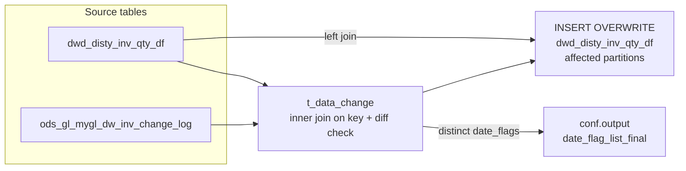

# DWD: Distributor Inventory Quantity Change Correction (`dwd_disty_inv_qty_df`)

- artifact_type: etl_table
- artifact_id: dw_us.dwd_disty_inv_qty_df
- domain: inventory
- one_line_purpose: This job detects and corrects discrepancies between the DWD inventory quantity table (`dwd_disty_inv_qty_df`) and the GL-side change-log (`ods_gl_mygl_dw_inv_change_log`) for a rolling window starting from a configurable `start_date`. When ...
- layer_type: DWD
- source_kind: etl_sql
- evidence_source: source/etl/sql/inventory/data_service/inventory/python/load_disty_inv_qty_df_change.py

---

## L1 Data Foundation

### Identity and physical mapping
- **Table:** `dw_us.dwd_disty_inv_qty_df`
- **Layer type:** DWD
- **Canonical / derived:** Derived / ETL-loaded (see L3)
- **Owner team:** not registered in metadata catalog

### Grain, scope, exclusions
- **Grain:** one row per `loc_no` + `inv_type` + `sku_no` per `date_flag` + `company_no` partition (inherited from `dwd_disty_inv_qty_df`).
- **Scope:** See L2 business purpose / L3 filters
- **Partition:** `date_flag`, `company_no`. - resolved from pipeline (see L4)
- **Natural key:** `loc_no`, `inv_type`, `sku_no` (within a partition).
- **Exclusions:** Not documented in repository

#### Grain detail (preserved)

- **Grain:** one row per `loc_no` + `inv_type` + `sku_no` per `date_flag` + `company_no` partition (inherited from `dwd_disty_inv_qty_df`).
- **Partition:** `date_flag`, `company_no`.
- **Natural key:** `loc_no`, `inv_type`, `sku_no` (within a partition).

---

### Cross-engine presence
| Engine | Present | Canonical FQN | Notes |
|--------|---------|---------------|-------|
| Hive | yes | `dwd_disty_inv_qty_df` | ETL target / intermediate per evidence script |
| Vertica | pending | `dwd_disty_inv_qty_df` | Confirm via hive2vertica flow evidence / MCP |

### Physical schema reference

Pointer block only - full column catalog lives in WKB L1 storage JSON.

| Field | Value |
|-------|-------|
| **Authoritative catalog** | WKB L1 storage seed (not duplicated in this file) |
| **entity_id** | `dw_us.dwd_disty_inv_qty_df` |
| **l1_catalog_seed** | `target/storage/wkb/snapshots/_snapshot_id_template/l1_catalog/{engine}_{schema}_{table}.json` |
| **column_count** | pending (run ddl_seed_writer) |
| **partition_keys** | `date_flag, company_no` |
| **ddl_source** | pending Bitbucket DDL / Vertica metadata ingest |
| **retrieval** | `python -m tools.wkb.indexing.run_query --query "inventory load_disty_inv_qty_df_change schema" --intent find_table_schema` |

### Lineage
| Object | Role |
|--------|------|
| `dw_{country}.dwd_disty_inv_qty_df` | Source and target |
| `ods_{country}.ods_gl_mygl_dw_inv_change_log` | GL change-log source for corrections |

---

### Freshness and load path
| Item | Value |
|------|-------|
| Load pattern | See L3 end-to-end / INSERT pattern in evidence script |
| Schedule | Not documented in repository |
| Parameters | `country`, `start_date` |


---

## L2 Declarative Knowledge

### Business purpose
This job detects and corrects discrepancies between the DWD inventory quantity table
(`dwd_disty_inv_qty_df`) and the GL-side change-log (`ods_gl_mygl_dw_inv_change_log`) for a
rolling window starting from a configurable `start_date`. When the GL log shows different values
for `on_hand_qty`, `intran_in`, or `it_ave_cost`, those fields are patched in-place across the
affected partitions. The job also outputs the list of affected date_flags so downstream workflows
can re-trigger dependent steps.

---

### Audience and use cases
| Audience | How they benefit |
|----------|-----------------|
| **Finance / GL reconciliation** | Ensures the DWD inventory layer agrees with the GL for on-hand quantity and cost, eliminating reporting discrepancies |
| **Data Engineering / Orchestration** | Receives `date_flag_list_final` to identify which downstream jobs need to re-run after correction |

---

### Fact key resolution
- Natural key: `loc_no`, `inv_type`, `sku_no` (within a partition).
- FK / label-on attributes: see L3 dimension join patterns and step-by-step logic.
- Negative assertion: do not treat descriptive labels as grain keys unless listed under natural key.

### Time field semantics
- **date_flag / partition columns:** `date_flag`, `company_no`.
- Primary reporting filter should use the partition column(s) documented in L1; resolve values via L4.


### Metrics served

| Category | Column | Logical metric | Business reading |
|----------|--------|----------------|------------------|
| Measures | — | — | No measure columns mapped for this table. |

### Metric serving map

**Formula authority:** [`source/contracts/inventory/metric-index.md`](../../source/contracts/inventory/metric-index.md)

N/A — no measure columns mapped for this table.

### etl_metrics

No governed logical metrics from `source/contracts/inventory/metric-index.md` are mapped on this table.

---

### Metric serving map
N/A - not a `*_comb_mtd` / multi-period wide serving table (or map not present in legacy doc).


### Data products and column groups (preserved)

### Identifiers and relationships

- **Location / inventory:** `loc_no`, `inv_type`, `sku_no`
- **Partition:** `date_flag`, `company_no`

### Quantity, pricing, and cost building blocks

These columns are patched if the GL log differs; all others are passed through from the existing DWD row:

- `on_hand_qty` — on-hand quantity (patched from GL log if changed)
- `intran_in` — in-transit inbound quantity (patched from GL log if changed)
- `it_ave_cost` — in-transit average cost (patched from GL log if changed)

### All other columns

All remaining columns (`u_version`, `ave_cost`, `std_cost`, `bo_qty`, `on_order_qty`, `alloc_qty`, `intran_out`, `entry_datetime`, `entry_id`, `wip_qty`, `base_cost`, `ave_cost_fx`, `base_cost_fx`, `rio_qty`, `kwo_comp_rio_qty`, `kwo_oh_qty`, `ave_cost_2`, `base_cost_2`, `ave_cost_fx_2`, `base_cost_fx_2`) are passed through from the existing DWD row unchanged.

---

### etl_metrics

N/A - no calculable ETL formulas extracted from this document (passthrough / stored measures only, or formulas not documented).

---

## L3 Procedural Knowledge

### Query and routing rules
**Business filters:** Use partition / date keys from L1 grain for reporting scope.
**Technical predicates (load only):** See Key filters and step-by-step logic below.

### Dimension join patterns
| Dimension FQN | Join keys | Purpose | Evidence |
|---------------|-----------|---------|----------|
| See step-by-step / base tables | See L3 steps | Dimension enrichment | `source/etl/sql/inventory/data_service/inventory/python/load_disty_inv_qty_df_change.py` |

### Key filters and ETL business logic
### Step 1 — `t_data_change`

**Source:** `dw_{country}.dwd_disty_inv_qty_df` INNER JOIN `ods_{country}.ods_gl_mygl_dw_inv_change_log`

**Join keys:** `date_flag`, `loc_no`, `inv_type`, `sku_no`

**Filter (natural language):**
- Only rows where `date_flag >= literal_start_date`.
- Only rows where at least one of the following differs between DWD and the GL log: `on_hand_qty`, `intran_in`, or `it_ave_cost` (using `nvl(...,0)` to treat NULLs as 0).

**Derived columns in this step:**

| Column | Formula | Plain language |
|--------|---------|----------------|
| `on_hand_qty` | From GL log | GL-corrected on-hand quantity |
| `intran_in` | From GL log | GL-corrected in-transit inbound |
| `it_ave_cost` | From GL log | GL-corrected in-transit average cost |

---

### Step 2 — Collect affected date_flags and output

Runs `SELECT distinct date_flag FROM t_data_change`, collects into a Python list, and formats as a comma-separated string of quoted date values (`'2024-01-01','2024-01-02',...`).

Outputs `date_flag_list_final` via `conf.output(...)`. If no changes are found, outputs `NULL`.

---

### Step 3 — Final `INSERT OVERWRITE` into `dwd_disty_inv_qty_df`

**From:** `dw_{country}.dwd_disty_inv_qty_df` (alias `a`) LEFT JOIN `t_data_change` (alias `b`)

**Join keys:** `date_flag`, `loc_no`, `inv_type`, `sku_no`

**Filter on insert:**
- `a.date_flag IN (SELECT distinct date_flag FROM t_data_change)` — only overwrite the affected partitions.

**Pass-through columns (from `a`):**
`loc_...

### Standard time-filter SQL
```sql
-- relative period filter using resolved partition value (see L4)
SELECT *
FROM dwd_disty_inv_qty_df
WHERE /* partition predicate */ date_flag = '${partition_value}';
```

### End-to-end flow
**Runtime parameters:** `country`, `start_date`
**Target table:** `dw_{country}.dwd_disty_inv_qty_df`, partitioned by **`date_flag`**, **`company_no`**.

1. Resolve `literal_start_date` by running `select ${start_date}`.
2. Create `t_data_change`: inner-join `dwd_disty_inv_qty_df` with `ods_gl_mygl_dw_inv_change_log` on `date_flag`, `loc_no`, `inv_type`, `sku_no` where at least one of `on_hand_qty`, `intran_in`, or `it_ave_cost` differs; filter to `date_flag >= literal_start_date`.
3. Collect distinct `date_flag` values from `t_data_change` into `date_flag_list`.
4. Output `date_flag_list_final` (comma-separated quoted date strings) or `NULL` if no changes; downstream orchestration uses this to selectively re-run dependent jobs.
5. If `date_flag_list_final` is not empty: **INSERT OVERWRITE** the affected partitions of `dwd_disty_inv_qty_df`, applying GL log values for the three corrected columns via LEFT JOIN on `t_data_change`.



---


#### High-level stages (preserved)

| Stage | Business meaning |
|-------|-----------------|
| **Detect changed records** | Joins `dwd_disty_inv_qty_df` with the GL change log to find rows where `on_hand_qty`, `intran_in`, or `it_ave_cost` differ |
| **Collect affected dates** | Extracts the distinct `date_flag` values from changed rows; outputs as `date_flag_list_final` for orchestration |
| **Patch the DWD table** | Overwrites the affected partitions of `dwd_disty_inv_qty_df`, substituting GL values where available |

**Parameters:** `country`, `start_date`

---


### Base tables register
| Object | Role in this job |
|--------|-----------------|
| `dw_{country}.dwd_disty_inv_qty_df` | Both source (current values) and target (patched values) |
| `ods_{country}.ods_gl_mygl_dw_inv_change_log` | GL change log — provides corrected `on_hand_qty`, `intran_in`, `it_ave_cost` values |

**Temporary tables (inside the job only):**
`t_data_change` → (final `INSERT OVERWRITE`)

---

### Step-by-step logic
### Step 1 — `t_data_change`

**Source:** `dw_{country}.dwd_disty_inv_qty_df` INNER JOIN `ods_{country}.ods_gl_mygl_dw_inv_change_log`

**Join keys:** `date_flag`, `loc_no`, `inv_type`, `sku_no`

**Filter (natural language):**
- Only rows where `date_flag >= literal_start_date`.
- Only rows where at least one of the following differs between DWD and the GL log: `on_hand_qty`, `intran_in`, or `it_ave_cost` (using `nvl(...,0)` to treat NULLs as 0).

**Derived columns in this step:**

| Column | Formula | Plain language |
|--------|---------|----------------|
| `on_hand_qty` | From GL log | GL-corrected on-hand quantity |
| `intran_in` | From GL log | GL-corrected in-transit inbound |
| `it_ave_cost` | From GL log | GL-corrected in-transit average cost |

---

### Step 2 — Collect affected date_flags and output

Runs `SELECT distinct date_flag FROM t_data_change`, collects into a Python list, and formats as a comma-separated string of quoted date values (`'2024-01-01','2024-01-02',...`).

Outputs `date_flag_list_final` via `conf.output(...)`. If no changes are found, outputs `NULL`.

---

### Step 3 — Final `INSERT OVERWRITE` into `dwd_disty_inv_qty_df`

**From:** `dw_{country}.dwd_disty_inv_qty_df` (alias `a`) LEFT JOIN `t_data_change` (alias `b`)

**Join keys:** `date_flag`, `loc_no`, `inv_type`, `sku_no`

**Filter on insert:**
- `a.date_flag IN (SELECT distinct date_flag FROM t_data_change)` — only overwrite the affected partitions.

**Pass-through columns (from `a`):**
`loc_no`, `inv_type`, `sku_no`, `u_version`, `ave_cost`, `std_cost`, `bo_qty`, `on_order_qty`, `alloc_qty`, `intran_out`, `entry_datetime`, `entry_id`, `wip_qty`, `base_cost`, `ave_cost_fx`, `base_cost_fx`, `rio_qty`, `kwo_comp_rio_qty`, `kwo_oh_qty`, `ave_cost_2`, `base_cost_2`, `ave_cost_fx_2`, `base_cost_fx_2`, `date_flag`, `company_no`

**Derived columns computed at INSERT:**

| Column | Formula | Plain language |
|--------|---------|----------------|
| `on_hand_qty` | `nvl(b.on_hand_qty, a.on_hand_qty)` | Use GL log value if available, else retain existing |
| `intran_in` | `nvl(b.intran_in, a.intran_in)` | Use GL log value if available, else retain existing |
| `it_ave_cost` | `nvl(b.it_ave_cost, a.it_ave_cost)` | Use GL log value if available, else retain existing |

---

### Relationship map (embedded)

| from_fqn | to_fqn | cardinality | join_keys | provenance |
|----------|--------|-------------|-----------|------------|
| `dw_{country}.dwd_disty_inv_qty_df` | `ods_{country}.ods_gl_mygl_dw_inv_change_log` | many:1 | `a.date_flag` = `b.date_flag`; `a.loc_no` = `b.loc_no`; `a.inv_type` = `b.inv_type`; `a.sku_no` = `b.sku_no` | etl_sql (`source/etl/sql/inventory/data_service/inventory/python/load_disty_inv_qty_df_change.py:17`) |
| `dw_{country}.dwd_disty_inv_qty_df` | `t_data_change` | many:1 (LEFT) | `a.date_flag` = `b.date_flag`; `a.loc_no` = `b.loc_no`; `a.inv_type` = `b.inv_type`; `a.sku_no` = `b.sku_no` | etl_sql (`source/etl/sql/inventory/data_service/inventory/python/load_disty_inv_qty_df_change.py:77`) |


### Special logic (embedded)

Not documented in repository

### Column / field derivations (from ETL SQL)

| target_column | expression_sql | upstream_columns | upstream_tables | transform_kind | evidence |
|---------------|----------------|------------------|-----------------|----------------|----------|
| `date_flag` | `${start_date} SELECT distinct` | `start_date` | `t_data_change` | partial | `source/etl/sql/inventory/data_service/inventory/python/load_disty_inv_qty_df_change.py:1` |

### Sentinel and code values
| Value | Meaning |
|-------|---------|
| `date_flag_list_final = 'NULL'` | No discrepancies found; no downstream re-run needed |

---

---


### POS bitbucket-etl mirror

- Also packaged under POS contract pack: source/contracts/pos/bitbucket-etl/dwd_disty_inv_qty_df/load_disty_inv_qty_df_change.py
- Table-level POS KB (when applicable): see 	arget/knowledgebase/pos/readme.md § Bitbucket-etl

## L4 Validation

### Resolved partition value
| Step | Source | How partition / date scope is determined |
|------|--------|------------------------------------------|
| 1 | evidence script / flow | See parameters in L1 Freshness and L3 filters - `source/etl/sql/inventory/data_service/inventory/python/load_disty_inv_qty_df_change.py` |

**Plain language:** Partition and date scope follow Azkaban/bootstrap parameters documented in the source script and orchestrating flow; do not hardcode calendar literals.

### Data quality checks
- Prefer row-count-by-partition, metric sums, and grain duplicate checks (see Validation SQL).
- Additional checks from legacy caveats / operational notes when present.

### Validation SQL
```sql
-- 1) Row count by partition
SELECT ${partition_col}, COUNT(*) AS row_cnt
FROM dw_{country}.dwd_disty_inv_qty_df
WHERE ${partition_col} = '${partition_value}'
GROUP BY ${partition_col};

-- 2) Metric sum by business dimension (top deltas)
SELECT ${dim_key}, SUM(${metric}) AS metric_sum
FROM dw_{country}.dwd_disty_inv_qty_df
WHERE ${partition_col} = '${partition_value}'
GROUP BY ${dim_key}
ORDER BY ABS(SUM(${metric})) DESC
LIMIT 20;

-- 3) Grain duplicate check
SELECT ${grain_key_1}, ${grain_key_2}, ${grain_key_3}, ${partition_col}, COUNT(*) AS cnt
FROM dw_{country}.dwd_disty_inv_qty_df
WHERE ${partition_col} = '${partition_value}'
GROUP BY ${grain_key_1}, ${grain_key_2}, ${grain_key_3}, ${partition_col}
HAVING COUNT(*) > 1;
```

Replace placeholders from this file's Grain and keys / Data you can fetch sections, and use the resolved partition value from run scope.

### Caveats for interpretation
- Only three fields are corrected (`on_hand_qty`, `intran_in`, `it_ave_cost`); all other quantity and cost fields retain their existing values regardless of GL differences.
- The GL log is joined with `nvl(..., 0)` comparisons, so a NULL in either system counts as 0 for diff detection.
- If `date_flag_list_final` is `NULL`, the INSERT step is skipped entirely.

---

### Conflicts and open questions
- Schedule, owner, SLA: Not documented in repository (unless preserved schedule evidence above).
- Vertica MCP verification: pending unless confirmed in L5.


---

## L5 Runtime View

### Query path and engine preference
| Role | Hive object | Vertica object | Sync mode | Evidence | MCP verified |
|------|-------------|----------------|-----------|----------|--------------|
| **Query for reporting** | *See script lineage* | `dw_{country}.dwd_disty_inv_qty_df` | *Verify from flow* | *Add flow file:line* | pending |
| **Hive alternative** | `*` | `dw_{country}.dwd_disty_inv_qty_df` | - | *See dependencies* | - |
| **ETL internal** | staging/temp tables | *Not synced to Vertica* | - | *See step-by-step logic* | - |

Business users should query `dw_{country}.dwd_disty_inv_qty_df` in Vertica once MCP verification is completed for this document.

### Access constraints
- Country / company schema parameters may apply (`literal_country`, `company_no`, etc.).
- Hive-only staging objects are not reporting surfaces unless synced.

### Query risk profile
| Field | Value |
|-------|-------|
| requires_date_predicate | yes |
| scan_risk_tier | high |

---

## L6 Access and Consumption

### Primary consumers and use cases
| Audience | How they benefit |
|----------|-----------------|
| **Finance / GL reconciliation** | Ensures the DWD inventory layer agrees with the GL for on-hand quantity and cost, eliminating reporting discrepancies |
| **Data Engineering / Orchestration** | Receives `date_flag_list_final` to identify which downstream jobs need to re-run after correction |

---

### Representative query patterns
```sql
-- certified / illustrative lookup - replace predicates from L1/L4
SELECT *
FROM dwd_disty_inv_qty_df
WHERE date_flag = '${partition_value}'
LIMIT 100;
```

### Dependencies and notes
### Upstream objects (verified)

| Object | Usage | Evidence |
|--------|-------|----------|
| `dw_{country}.dwd_disty_inv_qty_df` | Source (current values) and INSERT target | `source/etl/sql/inventory/data_service/inventory/python/load_disty_inv_qty_df_change.py:16` |
| `ods_{country}.ods_gl_mygl_dw_inv_change_log` | GL change-log — provides corrected field values | `source/etl/sql/inventory/data_service/inventory/python/load_disty_inv_qty_df_change.py:17` |

### Downstream consumers (verified)

| Object / script | Evidence |
|-----------------|----------|
| None identified in repository — `date_flag_list_final` is passed to orchestration via `conf.output` | `source/etl/sql/inventory/data_service/inventory/python/load_disty_inv_qty_df_change.py:42` |

### Operational detail (verified)

- Incremental by `date_flag` from `start_date` parameter: `load_disty_inv_qty_df_change.py:5`
- Overwrites only affected partitions: `load_disty_inv_qty_df_change.py:46`

### Not documented in repository

- Schedule, owner, SLA — not in scripts or configs
- Triggering mechanism for downstream jobs consuming `date_flag_list_final`

---

*Document generated from `source/etl/sql/inventory/data_service/inventory/python/load_disty_inv_qty_df_change.py`.*

#### Not documented in repository
- Owner, SLA (unless schedule evidence preserved above)
- Any dependency without `file:line` evidence in this document

---

*Document migrated to L1-L6 from legacy Knowledgebase content. Evidence: `source/etl/sql/inventory/data_service/inventory/python/load_disty_inv_qty_df_change.py`.*
