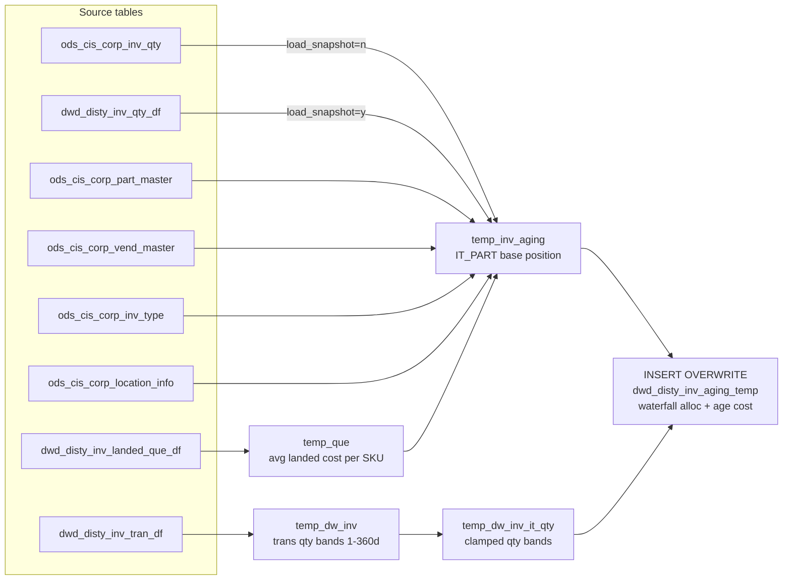

# DWD: Distributor Inventory Aging Temp (`dwd_disty_inv_aging_temp`)

- artifact_type: etl_table
- artifact_id: ${target_db}.dwd_disty_inv_aging_temp
- domain: inventory
- one_line_purpose: This job computes the intermediate inventory-aging staging table, populating quantity buckets by age band (1–30 days through 360+ days) and the corresponding dollar-value (extended cost) for each bucket. It serves as the input for `load_dw_...
- layer_type: DWD
- source_kind: etl_sql
- evidence_source: source/etl/sql/inventory/data_service/inventory/python/load_dw_inv_aging_temp.py

---

## L1 Data Foundation

### Identity and physical mapping
- **Table:** `${target_db}.dwd_disty_inv_aging_temp`
- **Layer type:** DWD
- **Canonical / derived:** Derived / ETL-loaded (see L3)
- **Owner team:** not registered in metadata catalog

### Grain, scope, exclusions
- **Grain:** one row per `inv_type` + `sku_no` per `date_flag` + `view_level` + `company_no` partition (view_level is always `IT_PART` in this job).
- **Scope:** See L2 business purpose / L3 filters
- **Partition:** `date_flag`, `view_level`, `company_no`. - resolved from pipeline (see L4)
- **Natural key:** `inv_type`, `sku_no` (within a partition).
- **Exclusions:** Not documented in repository

#### Grain detail (preserved)

- **Grain:** one row per `inv_type` + `sku_no` per `date_flag` + `view_level` + `company_no` partition (view_level is always `IT_PART` in this job).
- **Partition:** `date_flag`, `view_level`, `company_no`.
- **Natural key:** `inv_type`, `sku_no` (within a partition).

---

### Cross-engine presence
| Engine | Present | Canonical FQN | Notes |
|--------|---------|---------------|-------|
| Hive | yes | `${target_db}.dwd_disty_inv_aging_temp` | ETL target / intermediate per evidence script |
| Vertica | pending | `${target_db}.dwd_disty_inv_aging_temp` | Confirm via hive2vertica flow evidence / MCP |

### Physical schema reference

Pointer block only - full column catalog lives in WKB L1 storage JSON.

| Field | Value |
|-------|-------|
| **Authoritative catalog** | WKB L1 storage seed (not duplicated in this file) |
| **entity_id** | `${target_db}.dwd_disty_inv_aging_temp` |
| **l1_catalog_seed** | `target/storage/wkb/snapshots/_snapshot_id_template/l1_catalog/{engine}_{schema}_{table}.json` |
| **column_count** | pending (run ddl_seed_writer) |
| **partition_keys** | `date_flag, view_level, company_no` |
| **ddl_source** | pending Bitbucket DDL / Vertica metadata ingest |
| **retrieval** | `python -m tools.wkb.indexing.run_query --query "inventory load_dw_inv_aging_temp schema" --intent find_table_schema` |

### Lineage
| Object | Role |
|--------|------|
| `${target_db}.dwd_disty_inv_landed_que_df` | Landed cost queue |
| `${source_db}.ods_cis_corp_inv_qty` | Raw inventory (live mode) |
| `${target_db}.dwd_disty_inv_qty_df` | DWD inventory (snapshot mode) |
| `${target_db}.dwd_disty_inv_tran_df` | Inventory transactions for aging |
| `${source_db}.ods_cis_corp_part_master` | Part master |
| `${source_db}.ods_cis_corp_vend_master` | Vendor master |
| `${source_db}.ods_cis_corp_inv_type` | Inventory type / cost_from flag |
| `${source_db}.ods_cis_corp_location_info` | Location-to-company mapping |

---

### Freshness and load path
| Item | Value |
|------|-------|
| Load pattern | See L3 end-to-end / INSERT pattern in evidence script |
| Schedule | Not documented in repository |
| Parameters | `literal_date_flag`, `literal_load_snapshot`, `literal_company_no`, `literal_target_db`, `literal_source_db` |


---

## L2 Declarative Knowledge

### Business purpose
This job computes the intermediate inventory-aging staging table, populating quantity buckets by
age band (1–30 days through 360+ days) and the corresponding dollar-value (extended cost) for
each bucket. It serves as the input for `load_dw_inv_aging_view_levels.py`, which rolls up
aging data into multiple reporting view levels. The job supports two modes: a live-snapshot mode
reading directly from raw ODS inventory, and a historical-snapshot mode reading from the
already-loaded DWD inventory quantity table.

---

### Audience and use cases
| Audience | How they benefit |
|----------|-----------------|
| **Inventory management** | Identifies how much inventory is aging in each time bucket and its cost exposure |
| **Finance** | Extended cost (`ext_oh_cost`, `ext_it_cost`) per age band enables write-down risk quantification |
| **`load_dw_inv_aging_view_levels.py`** | Reads this temp table to generate PROD_CODE, VC_RMA, VC_REG, PN_RMA, PN_REG, AVE_PART rollups |

---

### Fact key resolution
- Natural key: `inv_type`, `sku_no` (within a partition).
- FK / label-on attributes: see L3 dimension join patterns and step-by-step logic.
- Negative assertion: do not treat descriptive labels as grain keys unless listed under natural key.

### Time field semantics
- **date_flag / partition columns:** `date_flag`, `view_level`, `company_no`.
- Primary reporting filter should use the partition column(s) documented in L1; resolve values via L4.


### Metrics served

| Category | Column | Logical metric | Business reading |
|----------|--------|----------------|------------------|
| Measures | — | — | No measure columns mapped for this table. |

### Metric serving map

**Formula authority:** [`source/contracts/inventory/metric-index.md`](../../source/contracts/inventory/metric-index.md)

N/A — no measure columns mapped for this table.

### etl_metrics

No governed logical metrics from `source/contracts/inventory/metric-index.md` are mapped on this table.

---

### Metric serving map
N/A - not a `*_comb_mtd` / multi-period wide serving table (or map not present in legacy doc).


### Data products and column groups (preserved)

### Identifiers and relationships

- **Product:** `sku_no`, `part_no`, `vend_no`, `vend_name`, `vend_code`, `prod_code`
- **Inventory type:** `inv_type`
- **View hierarchy:** `view_key1`, `view_key2`, `view_key3`, `view_level`

### Dimension columns

- `vend_code` — first 3 characters of `part_no` (vendor prefix)
- `view_level` — always `'IT_PART'` from this job
- `view_key2` — `cost_from` flag (`L`=Landed, `Q`=Queue/Ave, `M`=Master) in live mode; `'Q'` in snapshot mode

### Quantity, pricing, and cost building blocks

- `on_hand_qty`, `intran_in` — position quantities
- `ave_cost`, `oh_cost`, `it_cost` — average, on-hand and in-transit cost per unit
- `ext_oh_cost`, `ext_it_cost` — extended dollar value of on-hand and in-transit

### Core derived metrics — Age quantity bands

| Column | Formula | Business reading |
|--------|---------|-----------------|
| `qty1_30` | On-hand allocated to transactions 1–30 days old | Newest inventory bucket |
| `qty31_60` … `qty331_360` | Waterfall allocation to each 30-day band | Progressively older inventory buckets |
| `qty90_up`, `qty180_up`, `qty240_up`, `qty360_up` | Cumulative remainder beyond 90/180/240/360 days | Long-tail aging exposure |

### Core derived metrics — Age cost bands

| Column | Formula | Business reading |
|--------|---------|-----------------|
| `age1_30` | `ave_cost × qty1_30` | Dollar value of inventory aged 1–30 days |
| `age31_60` … `age331_360` | `ave_cost × qty_band` | Dollar value per age band |

> **Note:** `u_version`, `ohand_qty`, `itran_qty` are always `NULL` in this table (placeholder columns for the final rollup).

---

### etl_metrics

#### `qty1_30`
- **Source:** [metric-index.md](../../source/contracts/inventory/metric-index.md#qty1_30)
- **Business definition:** Newest inventory bucket
```sql
On-hand allocated to transactions 1–30 days old
```

#### `avg_landed_cost`
- **Source:** [metric-index.md](../../source/contracts/inventory/metric-index.md#avg_landed_cost)
- **Business definition:** Weighted-average landed cost per SKU
```sql
sum(nvl(landed_cost,0) × (nvl(intran_in,0) + nvl(rec_qty,0) - nvl(ship_qty,0))) / nullif(sum(net_qty), 0)
```


---

## L3 Procedural Knowledge

### Query and routing rules
**Business filters:** Use partition / date keys from L1 grain for reporting scope.
**Technical predicates (load only):** See Key filters and step-by-step logic below.

### Dimension join patterns
| Dimension FQN | Join keys | Purpose | Evidence |
|---------------|-----------|---------|----------|
| See step-by-step / base tables | See L3 steps | Dimension enrichment | `source/etl/sql/inventory/data_service/inventory/python/load_dw_inv_aging_temp.py` |

### Key filters and ETL business logic
### Step 1 — `temp_que`

**Source:** `${target_db}.dwd_disty_inv_landed_que_df`

**Filter:** `date_flag = '${date_flag}'`

**Derived columns in this step:**

| Column | Formula | Plain language |
|--------|---------|----------------|
| `avg_landed_cost` | `sum(nvl(landed_cost,0) × (nvl(intran_in,0) + nvl(rec_qty,0) - nvl(ship_qty,0))) / nullif(sum(net_qty), 0)` | Weighted-average landed cost per SKU |

---

### Step 2 — `temp_inv_aging` (mode-conditional)

**Live mode (`load_snapshot = 'n'`):**

- **Source:** `ods_cis_corp_inv_qty` (alias `iq`) INNER JOIN `ods_cis_corp_part_master` ON `sku_no`, INNER JOIN `ods_cis_corp_inv_type` ON `inv_type`, INNER JOIN `ods_cis_corp_vend_master` ON `vend_no`, LEFT JOIN `ods_cis_corp_location_info` ON `loc_no AND company_no >= 1`, LEFT JOIN `temp_que` ON `sku_no`.
- **Filter:** `cost_from IN ('Q','L','M')`, `on_hand_qty != 0 OR intran_in != 0`, `inv_type NOT IN (10, 100, 200)`, plus company filter.
- **Cost selection (`ave_cost`, `oh_cost`, `it_cost`):** depends on `cost_from`: `L` → `nvl(avg_landed_cost, pm.ave_cost)`, `Q` → `iq.ave_cost`, `M` → `pm.ave_cost`.

**Snapshot mode (`load_snapshot = 'y'`):**

- **Source:** `dwd_disty_inv_qty_df` (alias `iq`) INNER JOIN `ods_cis_corp_part_master`, INNER JOIN `ods_cis_corp_vend_master`.
- **Filter:** `date_flag = '${date_flag}'`, `on_hand_qty != 0 OR intran_in != 0`, `inv_type NOT IN (10, 100, 200)`, plus company filter.
- **Cost:** always `avg(iq.it_ave_cost)` for `ave_cost`, `oh_cost`, `it_cost`...

### Standard time-filter SQL
```sql
-- relative period filter using resolved partition value (see L4)
SELECT *
FROM ${target_db}.dwd_disty_inv_aging_temp
WHERE /* partition predicate */ date_flag = '${partition_value}';
```

### End-to-end flow
**Runtime parameters:** `literal_date_flag`, `literal_load_snapshot`, `literal_company_no`, `literal_target_db`, `literal_source_db`
**Target table:** `${target_db}.dwd_disty_inv_aging_temp`, partitioned by **`date_flag`**, **`view_level`**, **`company_no`**.

1. Build `temp_que`: weighted-average landed cost per SKU from `dwd_disty_inv_landed_que_df`.
2. Build `temp_inv_aging` (conditional on `load_snapshot`):
   - **`load_snapshot = 'n'` (live):** reads `ods_cis_corp_inv_qty` + part/vendor/inv_type masters + `ods_cis_corp_location_info` + `temp_que`; groups by `inv_type`, `sku_no`, `company_no`; cost selection driven by `cost_from` (`L/Q/M`).
   - **`load_snapshot = 'y'` (snapshot):** reads `dwd_disty_inv_qty_df` + part/vendor masters; uses `it_ave_cost` uniformly.
3. Build `temp_dw_inv`: aggregates `dwd_disty_inv_tran_df` transactions over the past 360 days into 14 quantity bands per `inv_type`, `sku_no`, `company_no`.
4. Build `temp_dw_inv_it_qty`: clamps all transaction quantity bands to ≥ 0, with aggregate across location dimension.
5. **INSERT OVERWRITE** into `dwd_disty_inv_aging_temp`: joins `temp_inv_aging` LEFT JOIN `temp_dw_inv_it_qty`, applies FIFO waterfall to allocate `on_hand_qty` across bands, then computes `age*` dollar values as `ave_cost × qty_band`.



---


#### High-level stages (preserved)

| Stage | Business meaning |
|-------|-----------------|
| **Landed cost lookup** | Computes weighted-average landed cost per SKU from the landed queue |
| **Base aging inventory (mode-dependent)** | Either reads raw ODS inventory (live mode) or the already-processed DWD qty table (snapshot mode) to build the SKU-level position with cost |
| **Transaction aging buckets** | Aggregates inventory transactions over the past 360 days into quantity bands (1–30, 31–60, …, 330–360, 360+) |
| **Clamp buckets** | Ensures all transaction-derived age buckets are ≥ 0 |
| **Allocate on-hand to buckets** | Distributes on-hand quantity across age bands using a FIFO-like waterfall (newest first) so each band's quantity does not exceed on-hand |
| **Compute extended costs** | Multiplies `ave_cost × qty` per age band to produce dollar-value age buckets |
| **INSERT OVERWRITE** | Writes to `dwd_disty_inv_aging_temp` partitioned by `date_flag`, `view_level`, `company_no` |

**Parameters:** `literal_date_flag`, `literal_load_snapshot`, `literal_company_no`, `literal_target_db`, `literal_source_db`

---


### Base tables register
| Object | Role in this job |
|--------|-----------------|
| `${target_db}.dwd_disty_inv_landed_que_df` | Landed cost queue — provides weighted-average landed cost per SKU |
| `${source_db}.ods_cis_corp_inv_qty` | Live inventory quantity by location/SKU (live mode only) |
| `${target_db}.dwd_disty_inv_qty_df` | DWD inventory quantity (snapshot mode only) |
| `${target_db}.dwd_disty_inv_tran_df` | Inventory transactions — source for aging bucket computation |
| `${source_db}.ods_cis_corp_part_master` | Part attributes: `prod_code`, `part_no`, `vend_no`, `ave_cost` |
| `${source_db}.ods_cis_corp_vend_master` | Vendor attributes: `vend_name`, `company_no` |
| `${source_db}.ods_cis_corp_inv_type` | Inventory type attributes: `cost_from` flag (L/Q/M) |
| `${source_db}.ods_cis_corp_location_info` | Location-to-company mapping |

**Temporary tables (inside the job only):**
`temp_que` → `temp_inv_aging` → `temp_dw_inv` → `temp_dw_inv_it_qty` → (final `INSERT`)

---

### Step-by-step logic
### Step 1 — `temp_que`

**Source:** `${target_db}.dwd_disty_inv_landed_que_df`

**Filter:** `date_flag = '${date_flag}'`

**Derived columns in this step:**

| Column | Formula | Plain language |
|--------|---------|----------------|
| `avg_landed_cost` | `sum(nvl(landed_cost,0) × (nvl(intran_in,0) + nvl(rec_qty,0) - nvl(ship_qty,0))) / nullif(sum(net_qty), 0)` | Weighted-average landed cost per SKU |

---

### Step 2 — `temp_inv_aging` (mode-conditional)

**Live mode (`load_snapshot = 'n'`):**

- **Source:** `ods_cis_corp_inv_qty` (alias `iq`) INNER JOIN `ods_cis_corp_part_master` ON `sku_no`, INNER JOIN `ods_cis_corp_inv_type` ON `inv_type`, INNER JOIN `ods_cis_corp_vend_master` ON `vend_no`, LEFT JOIN `ods_cis_corp_location_info` ON `loc_no AND company_no >= 1`, LEFT JOIN `temp_que` ON `sku_no`.
- **Filter:** `cost_from IN ('Q','L','M')`, `on_hand_qty != 0 OR intran_in != 0`, `inv_type NOT IN (10, 100, 200)`, plus company filter.
- **Cost selection (`ave_cost`, `oh_cost`, `it_cost`):** depends on `cost_from`: `L` → `nvl(avg_landed_cost, pm.ave_cost)`, `Q` → `iq.ave_cost`, `M` → `pm.ave_cost`.

**Snapshot mode (`load_snapshot = 'y'`):**

- **Source:** `dwd_disty_inv_qty_df` (alias `iq`) INNER JOIN `ods_cis_corp_part_master`, INNER JOIN `ods_cis_corp_vend_master`.
- **Filter:** `date_flag = '${date_flag}'`, `on_hand_qty != 0 OR intran_in != 0`, `inv_type NOT IN (10, 100, 200)`, plus company filter.
- **Cost:** always `avg(iq.it_ave_cost)` for `ave_cost`, `oh_cost`, `it_cost`.

**Sentinel columns (always zero in this step):** all `qty*` and `age*` band columns are set to `0` — they are populated in the final INSERT from the transaction-aging join.

---

### Step 3 — `temp_dw_inv`

**Source:** `${target_db}.dwd_disty_inv_tran_df` (alias `it`) INNER JOIN `${source_db}.ods_cis_corp_location_info` ON `loc_no`.

**Filter:** `date_flag >= date_add('${date_flag}', 1-360) AND date_flag < date_add('${date_flag}', 1)`, plus company filter.

**Derived columns in this step (14 age bands):**

| Column | Formula | Plain language |
|--------|---------|----------------|
| `qty1_30` | `sum(trans_qty)` where `doc_date` in last 1–30 days | Transactions in the most recent 30-day window |
| `qty31_60` … `qty331_360` | Same pattern for each 30-day band | Age-banded transaction quantities |
| `qty181_240`, `qty241_360` | 60-day composite bands | Coarser aging groupings |

---

### Step 4 — `temp_dw_inv_it_qty`

Clamps each band from `temp_dw_inv` to ≥ 0 using `CASE WHEN qty < 0 THEN 0 ELSE qty END`. Aggregates across locations: sums each band by `inv_type`, `sku_no`, `company_no`.

---

### Step 5 — Final `INSERT OVERWRITE` into `dwd_disty_inv_aging_temp`

**From:** `temp_inv_aging` (alias `a`) LEFT JOIN `temp_dw_inv_it_qty` (alias `q`) ON `view_level = 'IT_PART' AND company_no AND inv_type AND sku_no`.

**Waterfall allocation logic (FIFO, newest first):**

Each quantity band is capped so the running cumulative does not exceed `on_hand_qty`:

| Band | Formula (simplified) |
|------|---------------------|
| `qty1_30` | `min(on_hand_qty, qty1_30)` |
| `qty31_60` | `min(max(on_hand_qty - qty1_30, 0), qty31_60)` |
| … | Continue subtracting prior bands from remaining on-hand |
| `qty90_up` | `max(on_hand_qty - qty1_30 - qty31_60 - qty61_90, 0)` |
| (similar for 91_120 through 331_360 and the `_up` cumulatives) | |

**Age cost bands:**

| Column | Formula | Plain language |
|--------|---------|----------------|
| `age1_30` | `ave_cost × qty1_30` | Dollar value in 1–30 day bucket |
| `age31_60` … `age331_360` | `ave_cost × qty_band` | Dollar value per age band (passed through from `temp_inv_aging` zero-initialized values, overridden at outer layer) |

**Pass-through columns:** `u_version=NULL`, `ohand_qty=NULL`, `itran_qty=NULL`, `qty180_up=0`, `qty240_up=0`, `qty360_up=0` (sentinel zeros — not computed in this job).

---

### Relationship map (embedded)

| from_fqn | to_fqn | cardinality | join_keys | provenance |
|----------|--------|-------------|-----------|------------|
| `${target_db}.dwd_disty_inv_qty_df` | `${source_db}.ods_cis_corp_part_master` | many:1 | `iq.sku_no` = `pm.sku_no` | etl_sql (`source/etl/sql/inventory/data_service/inventory/python/load_dw_inv_aging_temp.py:77`) |
| `${target_db}.dwd_disty_inv_qty_df` | `${source_db}.ods_cis_corp_inv_type` | many:1 | `iq.inv_type` = `it.inv_type` | etl_sql (`source/etl/sql/inventory/data_service/inventory/python/load_dw_inv_aging_temp.py:79`) |
| `${source_db}.ods_cis_corp_part_master` | `${source_db}.ods_cis_corp_vend_master` | many:1 | `pm.vend_no` = `vm.vend_no` | etl_sql (`source/etl/sql/inventory/data_service/inventory/python/load_dw_inv_aging_temp.py:81`) |
| `${target_db}.dwd_disty_inv_qty_df` | `${source_db}.ods_cis_corp_location_info` | many:1 (LEFT) | `iq.loc_no` = `lo.loc_no` | etl_sql (`source/etl/sql/inventory/data_service/inventory/python/load_dw_inv_aging_temp.py:83`) |
| `${target_db}.dwd_disty_inv_qty_df` | `temp_que` | many:1 (LEFT) | `iq.sku_no` = `q.sku_no` | etl_sql (`source/etl/sql/inventory/data_service/inventory/python/load_dw_inv_aging_temp.py:86`) |
| `${source_db}.ods_cis_corp_inv_type` | `${source_db}.ods_cis_corp_location_info` | many:1 | `it.loc_no` = `lo.loc_no` | etl_sql (`source/etl/sql/inventory/data_service/inventory/python/load_dw_inv_aging_temp.py:205`) |
| `a` | `temp_dw_inv_it_qty` | many:1 (LEFT) | `a.company_no` = `q.company_no`; `a.company_no` = `q.company_no`; `a.inv_type` = `q.inv_type`; `a.sku_no` = `q.sku_no` | etl_sql (`source/etl/sql/inventory/data_service/inventory/python/load_dw_inv_aging_temp.py:508`) |

### Special logic (embedded)

Not documented in repository

### Column / field derivations (from ETL SQL)

| target_column | expression_sql | upstream_columns | upstream_tables | transform_kind | evidence |
|---------------|----------------|------------------|-----------------|----------------|----------|
| `view_key1` | `view_key1` | `view_key1` | `temp_inv_aging`, `temp_dw_inv_it_qty` | passthrough | `source/etl/sql/inventory/data_service/inventory/python/load_dw_inv_aging_temp.py:44` |
| `view_key2` | `view_key2` | `view_key2` | `temp_inv_aging`, `temp_dw_inv_it_qty` | passthrough | `source/etl/sql/inventory/data_service/inventory/python/load_dw_inv_aging_temp.py:45` |
| `view_key3` | `view_key3` | `view_key3` | `temp_inv_aging`, `temp_dw_inv_it_qty` | passthrough | `source/etl/sql/inventory/data_service/inventory/python/load_dw_inv_aging_temp.py:46` |
| `inv_type` | `inv_type` | `inv_type` | `temp_inv_aging`, `temp_dw_inv_it_qty` | passthrough | `source/etl/sql/inventory/data_service/inventory/python/load_dw_inv_aging_temp.py:47` |
| `sku_no` | `sku_no` | `sku_no` | `temp_inv_aging`, `temp_dw_inv_it_qty` | passthrough | `source/etl/sql/inventory/data_service/inventory/python/load_dw_inv_aging_temp.py:35` |
| `u_version` | `NULL` | — | `temp_inv_aging`, `temp_dw_inv_it_qty` | rename | `source/etl/sql/inventory/data_service/inventory/python/load_dw_inv_aging_temp.py:19` |
| `prod_code` | `prod_code` | `prod_code` | `temp_inv_aging`, `temp_dw_inv_it_qty` | passthrough | `source/etl/sql/inventory/data_service/inventory/python/load_dw_inv_aging_temp.py:49` |
| `vend_code` | `vend_code` | `vend_code` | `temp_inv_aging`, `temp_dw_inv_it_qty` | passthrough | `source/etl/sql/inventory/data_service/inventory/python/load_dw_inv_aging_temp.py:53` |
| `vend_name` | `vend_name` | `vend_name` | `temp_inv_aging`, `temp_dw_inv_it_qty` | passthrough | `source/etl/sql/inventory/data_service/inventory/python/load_dw_inv_aging_temp.py:52` |
| `vend_no` | `vend_no` | `vend_no` | `temp_inv_aging`, `temp_dw_inv_it_qty` | passthrough | `source/etl/sql/inventory/data_service/inventory/python/load_dw_inv_aging_temp.py:51` |
| `part_no` | `part_no` | `part_no` | `temp_inv_aging`, `temp_dw_inv_it_qty` | passthrough | `source/etl/sql/inventory/data_service/inventory/python/load_dw_inv_aging_temp.py:50` |
| `ave_cost` | `ave_cost` | `ave_cost` | `temp_inv_aging`, `temp_dw_inv_it_qty` | passthrough | `source/etl/sql/inventory/data_service/inventory/python/load_dw_inv_aging_temp.py:54` |
| `oh_cost` | `oh_cost` | `oh_cost` | `temp_inv_aging`, `temp_dw_inv_it_qty` | passthrough | `source/etl/sql/inventory/data_service/inventory/python/load_dw_inv_aging_temp.py:61` |
| `it_cost` | `it_cost` | `it_cost` | `temp_inv_aging`, `temp_dw_inv_it_qty` | passthrough | `source/etl/sql/inventory/data_service/inventory/python/load_dw_inv_aging_temp.py:65` |
| `ext_oh_cost` | `ext_oh_cost` | `ext_oh_cost` | `temp_inv_aging`, `temp_dw_inv_it_qty` | passthrough | `source/etl/sql/inventory/data_service/inventory/python/load_dw_inv_aging_temp.py:69` |
| `ext_it_cost` | `ext_it_cost` | `ext_it_cost` | `temp_inv_aging`, `temp_dw_inv_it_qty` | passthrough | `source/etl/sql/inventory/data_service/inventory/python/load_dw_inv_aging_temp.py:73` |
| `on_hand_qty` | `on_hand_qty` | `on_hand_qty` | `temp_inv_aging`, `temp_dw_inv_it_qty` | passthrough | `source/etl/sql/inventory/data_service/inventory/python/load_dw_inv_aging_temp.py:66` |
| `ohand_qty` | `NULL` | — | `temp_inv_aging`, `temp_dw_inv_it_qty` | rename | `source/etl/sql/inventory/data_service/inventory/python/load_dw_inv_aging_temp.py:19` |
| `intran_in` | `intran_in` | `intran_in` | `temp_inv_aging`, `temp_dw_inv_it_qty` | passthrough | `source/etl/sql/inventory/data_service/inventory/python/load_dw_inv_aging_temp.py:36` |
| `itran_qty` | `NULL` | — | `temp_inv_aging`, `temp_dw_inv_it_qty` | rename | `source/etl/sql/inventory/data_service/inventory/python/load_dw_inv_aging_temp.py:19` |
| `qty1_30` | `qty1_30` | `qty1_30` | `temp_inv_aging`, `temp_dw_inv_it_qty` | passthrough | `source/etl/sql/inventory/data_service/inventory/python/load_dw_inv_aging_temp.py:76` |
| `qty31_60` | `qty31_60` | `qty31_60` | `temp_inv_aging`, `temp_dw_inv_it_qty` | passthrough | `source/etl/sql/inventory/data_service/inventory/python/load_dw_inv_aging_temp.py:77` |
| `qty61_90` | `qty61_90` | `qty61_90` | `temp_inv_aging`, `temp_dw_inv_it_qty` | passthrough | `source/etl/sql/inventory/data_service/inventory/python/load_dw_inv_aging_temp.py:78` |
| `qty90_up` | `qty90_up` | `qty90_up` | `temp_inv_aging`, `temp_dw_inv_it_qty` | passthrough | `source/etl/sql/inventory/data_service/inventory/python/load_dw_inv_aging_temp.py:79` |
| `age1_30` | `ave_cost * qty1_30` | `ave_cost`, `qty1_30` | `temp_inv_aging`, `temp_dw_inv_it_qty` | arithmetic | `source/etl/sql/inventory/data_service/inventory/python/load_dw_inv_aging_temp.py:325` |
| `age31_60` | `ave_cost * qty31_60` | `ave_cost`, `qty31_60` | `temp_inv_aging`, `temp_dw_inv_it_qty` | arithmetic | `source/etl/sql/inventory/data_service/inventory/python/load_dw_inv_aging_temp.py:326` |
| `age61_90` | `ave_cost * qty61_90` | `ave_cost`, `qty61_90` | `temp_inv_aging`, `temp_dw_inv_it_qty` | arithmetic | `source/etl/sql/inventory/data_service/inventory/python/load_dw_inv_aging_temp.py:327` |
| `age90_up` | `ave_cost * qty90_up` | `ave_cost`, `qty90_up` | `temp_inv_aging`, `temp_dw_inv_it_qty` | arithmetic | `source/etl/sql/inventory/data_service/inventory/python/load_dw_inv_aging_temp.py:328` |
| `qty91_120` | `qty91_120` | `qty91_120` | `temp_inv_aging`, `temp_dw_inv_it_qty` | passthrough | `source/etl/sql/inventory/data_service/inventory/python/load_dw_inv_aging_temp.py:84` |
| `qty121_150` | `qty121_150` | `qty121_150` | `temp_inv_aging`, `temp_dw_inv_it_qty` | passthrough | `source/etl/sql/inventory/data_service/inventory/python/load_dw_inv_aging_temp.py:85` |
| `qty151_180` | `qty151_180` | `qty151_180` | `temp_inv_aging`, `temp_dw_inv_it_qty` | passthrough | `source/etl/sql/inventory/data_service/inventory/python/load_dw_inv_aging_temp.py:86` |
| `qty180_up` | `qty180_up` | `qty180_up` | `temp_inv_aging`, `temp_dw_inv_it_qty` | passthrough | `source/etl/sql/inventory/data_service/inventory/python/load_dw_inv_aging_temp.py:87` |
| `qty240_up` | `qty240_up` | `qty240_up` | `temp_inv_aging`, `temp_dw_inv_it_qty` | passthrough | `source/etl/sql/inventory/data_service/inventory/python/load_dw_inv_aging_temp.py:88` |
| `qty360_up` | `qty360_up` | `qty360_up` | `temp_inv_aging`, `temp_dw_inv_it_qty` | passthrough | `source/etl/sql/inventory/data_service/inventory/python/load_dw_inv_aging_temp.py:89` |
| `age91_120` | `ave_cost * qty91_120` | `ave_cost`, `qty91_120` | `temp_inv_aging`, `temp_dw_inv_it_qty` | arithmetic | `source/etl/sql/inventory/data_service/inventory/python/load_dw_inv_aging_temp.py:335` |
| `age121_150` | `ave_cost * qty121_150` | `ave_cost`, `qty121_150` | `temp_inv_aging`, `temp_dw_inv_it_qty` | arithmetic | `source/etl/sql/inventory/data_service/inventory/python/load_dw_inv_aging_temp.py:336` |
| `age151_180` | `ave_cost * qty151_180` | `ave_cost`, `qty151_180` | `temp_inv_aging`, `temp_dw_inv_it_qty` | arithmetic | `source/etl/sql/inventory/data_service/inventory/python/load_dw_inv_aging_temp.py:337` |
| `age180_up` | `ave_cost * qty180_up` | `ave_cost`, `qty180_up` | `temp_inv_aging`, `temp_dw_inv_it_qty` | arithmetic | `source/etl/sql/inventory/data_service/inventory/python/load_dw_inv_aging_temp.py:338` |
| `age240_up` | `ave_cost * qty240_up` | `ave_cost`, `qty240_up` | `temp_inv_aging`, `temp_dw_inv_it_qty` | arithmetic | `source/etl/sql/inventory/data_service/inventory/python/load_dw_inv_aging_temp.py:339` |
| `age360_up` | `ave_cost * qty360_up` | `ave_cost`, `qty360_up` | `temp_inv_aging`, `temp_dw_inv_it_qty` | arithmetic | `source/etl/sql/inventory/data_service/inventory/python/load_dw_inv_aging_temp.py:340` |
| `qty181_210` | `qty181_210` | `qty181_210` | `temp_inv_aging`, `temp_dw_inv_it_qty` | passthrough | `source/etl/sql/inventory/data_service/inventory/python/load_dw_inv_aging_temp.py:96` |
| `qty211_240` | `qty211_240` | `qty211_240` | `temp_inv_aging`, `temp_dw_inv_it_qty` | passthrough | `source/etl/sql/inventory/data_service/inventory/python/load_dw_inv_aging_temp.py:97` |
| `qty241_270` | `qty241_270` | `qty241_270` | `temp_inv_aging`, `temp_dw_inv_it_qty` | passthrough | `source/etl/sql/inventory/data_service/inventory/python/load_dw_inv_aging_temp.py:98` |
| `qty271_300` | `qty271_300` | `qty271_300` | `temp_inv_aging`, `temp_dw_inv_it_qty` | passthrough | `source/etl/sql/inventory/data_service/inventory/python/load_dw_inv_aging_temp.py:99` |
| `qty301_330` | `qty301_330` | `qty301_330` | `temp_inv_aging`, `temp_dw_inv_it_qty` | passthrough | `source/etl/sql/inventory/data_service/inventory/python/load_dw_inv_aging_temp.py:100` |
| `qty331_360` | `qty331_360` | `qty331_360` | `temp_inv_aging`, `temp_dw_inv_it_qty` | passthrough | `source/etl/sql/inventory/data_service/inventory/python/load_dw_inv_aging_temp.py:101` |
| `age181_210` | `ave_cost * qty181_210` | `ave_cost`, `qty181_210` | `temp_inv_aging`, `temp_dw_inv_it_qty` | arithmetic | `source/etl/sql/inventory/data_service/inventory/python/load_dw_inv_aging_temp.py:347` |
| `age211_240` | `ave_cost * qty211_240` | `ave_cost`, `qty211_240` | `temp_inv_aging`, `temp_dw_inv_it_qty` | arithmetic | `source/etl/sql/inventory/data_service/inventory/python/load_dw_inv_aging_temp.py:348` |
| `age241_270` | `ave_cost * qty241_270` | `ave_cost`, `qty241_270` | `temp_inv_aging`, `temp_dw_inv_it_qty` | arithmetic | `source/etl/sql/inventory/data_service/inventory/python/load_dw_inv_aging_temp.py:349` |
| `age271_300` | `ave_cost * qty271_300` | `ave_cost`, `qty271_300` | `temp_inv_aging`, `temp_dw_inv_it_qty` | arithmetic | `source/etl/sql/inventory/data_service/inventory/python/load_dw_inv_aging_temp.py:350` |
| `age301_330` | `ave_cost * qty301_330` | `ave_cost`, `qty301_330` | `temp_inv_aging`, `temp_dw_inv_it_qty` | arithmetic | `source/etl/sql/inventory/data_service/inventory/python/load_dw_inv_aging_temp.py:351` |
| `age331_360` | `ave_cost * qty331_360` | `ave_cost`, `qty331_360` | `temp_inv_aging`, `temp_dw_inv_it_qty` | arithmetic | `source/etl/sql/inventory/data_service/inventory/python/load_dw_inv_aging_temp.py:352` |
| `date_flag` | `date_flag` | `date_flag` | `temp_inv_aging`, `temp_dw_inv_it_qty` | passthrough | `source/etl/sql/inventory/data_service/inventory/python/load_dw_inv_aging_temp.py:5` |
| `view_level` | `view_level` | `view_level` | `temp_inv_aging`, `temp_dw_inv_it_qty` | passthrough | `source/etl/sql/inventory/data_service/inventory/python/load_dw_inv_aging_temp.py:109` |
| `company_no` | `company_no` | `company_no` | `temp_inv_aging`, `temp_dw_inv_it_qty` | passthrough | `source/etl/sql/inventory/data_service/inventory/python/load_dw_inv_aging_temp.py:7` |

### Sentinel and code values
| Value | Meaning |
|-------|---------|
| `inv_type NOT IN (10, 100, 200)` | Excluded inv_types — internal transfer (10), intercompany (100/200) |
| `cost_from = 'L'` | Use landed cost |
| `cost_from = 'Q'` | Use queue/average cost from inv_qty |
| `cost_from = 'M'` | Use master average cost from part_master |
| `NULL AS u_version`, `NULL AS ohand_qty`, `NULL AS itran_qty` | Placeholders for rollup-level view, populated in `load_dw_inv_aging_view_levels.py` |
| `0 AS qty180_up`, `0 AS qty240_up`, `0 AS qty360_up` | Cumulative "tail" buckets — not computed here; set to 0 |

---

---

## L4 Validation

### Resolved partition value
| Step | Source | How partition / date scope is determined |
|------|--------|------------------------------------------|
| 1 | evidence script / flow | See parameters in L1 Freshness and L3 filters - `source/etl/sql/inventory/data_service/inventory/python/load_dw_inv_aging_temp.py` |

**Plain language:** Partition and date scope follow Azkaban/bootstrap parameters documented in the source script and orchestrating flow; do not hardcode calendar literals.

### Data quality checks
- Prefer row-count-by-partition, metric sums, and grain duplicate checks (see Validation SQL).
- Additional checks from legacy caveats / operational notes when present.

### Validation SQL
```sql
-- 1) row count by partition
-- SELECT partition_col, COUNT(*) FROM ${target_db}.dwd_disty_inv_aging_temp WHERE partition_col = '${partition_value}' GROUP BY 1;
-- 2) metric sum by dimension (top N) - replace metric/dim from L2
-- 3) grain duplicate check on natural keys
```


### Caveats for interpretation
- `qty180_up`, `qty240_up`, `qty360_up` and their corresponding `age*_up` columns are hardcoded to `0` in this table; they are computed in `load_dw_inv_aging_view_levels.py`.
- The waterfall allocation can produce non-intuitive results when the sum of all transaction bands exceeds `on_hand_qty` — the newest bins are filled first and older bins are zeroed out.
- `inv_type IN (10, 100, 200)` is explicitly excluded; these special types are not aged.
- In live mode, cost selection follows `cost_from` from `ods_cis_corp_inv_type`; in snapshot mode, `it_ave_cost` from `dwd_disty_inv_qty_df` is always used.

---

### Conflicts and open questions
- Schedule, owner, SLA: Not documented in repository (unless preserved schedule evidence above).
- Vertica MCP verification: pending unless confirmed in L5.


---

## L5 Runtime View

### Query path and engine preference
| Role | Hive object | Vertica object | Sync mode | Evidence | MCP verified |
|------|-------------|----------------|-----------|----------|--------------|
| **Not in Vertica** | *See script lineage* | *No Vertica mapping identified in repository* | - | *Add flow evidence when found* | no |

No queryable Vertica table has been confirmed for this script from current repository evidence.

### Access constraints
- Country / company schema parameters may apply (`literal_country`, `company_no`, etc.).
- Hive-only staging objects are not reporting surfaces unless synced.

### Query risk profile
| Field | Value |
|-------|-------|
| requires_date_predicate | yes |
| scan_risk_tier | high |

---

## L6 Access and Consumption

### Primary consumers and use cases
| Audience | How they benefit |
|----------|-----------------|
| **Inventory management** | Identifies how much inventory is aging in each time bucket and its cost exposure |
| **Finance** | Extended cost (`ext_oh_cost`, `ext_it_cost`) per age band enables write-down risk quantification |
| **`load_dw_inv_aging_view_levels.py`** | Reads this temp table to generate PROD_CODE, VC_RMA, VC_REG, PN_RMA, PN_REG, AVE_PART rollups |

---

### Representative query patterns
```sql
-- certified / illustrative lookup - replace predicates from L1/L4
SELECT *
FROM ${target_db}.dwd_disty_inv_aging_temp
WHERE date_flag = '${partition_value}'
LIMIT 100;
```

### Dependencies and notes
### Upstream objects (verified)

| Object | Usage | Evidence |
|--------|-------|----------|
| `dwd_disty_inv_landed_que_df` | `temp_que` base | `source/etl/sql/inventory/data_service/inventory/python/load_dw_inv_aging_temp.py:37` |
| `ods_cis_corp_inv_qty` | Live mode inventory base | `source/etl/sql/inventory/data_service/inventory/python/load_dw_inv_aging_temp.py:111` |
| `dwd_disty_inv_qty_df` | Snapshot mode inventory base | `source/etl/sql/inventory/data_service/inventory/python/load_dw_inv_aging_temp.py:195` |
| `dwd_disty_inv_tran_df` | Transaction aging buckets | `source/etl/sql/inventory/data_service/inventory/python/load_dw_inv_aging_temp.py:242` |
| `ods_cis_corp_part_master` | Part attributes | `source/etl/sql/inventory/data_service/inventory/python/load_dw_inv_aging_temp.py:112` |
| `ods_cis_corp_vend_master` | Vendor/company attributes | `source/etl/sql/inventory/data_service/inventory/python/load_dw_inv_aging_temp.py:116` |
| `ods_cis_corp_inv_type` | cost_from flag | `source/etl/sql/inventory/data_service/inventory/python/load_dw_inv_aging_temp.py:114` |
| `ods_cis_corp_location_info` | Location company mapping | `source/etl/sql/inventory/data_service/inventory/python/load_dw_inv_aging_temp.py:118` |

### Downstream consumers (verified)

| Object / script | Evidence |
|-----------------|----------|
| `load_dw_inv_aging_view_levels.py` — reads `dwd_disty_inv_aging_temp` | `source/etl/sql/inventory/data_service/inventory/python/load_dw_inv_aging_view_levels.py:70` |

### Operational detail (verified)

- Full partition overwrite per `date_flag` + `view_level` + `company_no`: `load_dw_inv_aging_temp.py:300`

### Not documented in repository

- Schedule, owner, SLA — not in scripts or configs
- Whether live vs snapshot mode is determined by the orchestrator parameter

---

*Document generated from `source/etl/sql/inventory/data_service/inventory/python/load_dw_inv_aging_temp.py`.*

#### Not documented in repository
- Owner, SLA (unless schedule evidence preserved above)
- Any dependency without `file:line` evidence in this document

---

*Document migrated to L1-L6 from legacy Knowledgebase content. Evidence: `source/etl/sql/inventory/data_service/inventory/python/load_dw_inv_aging_temp.py`.*
