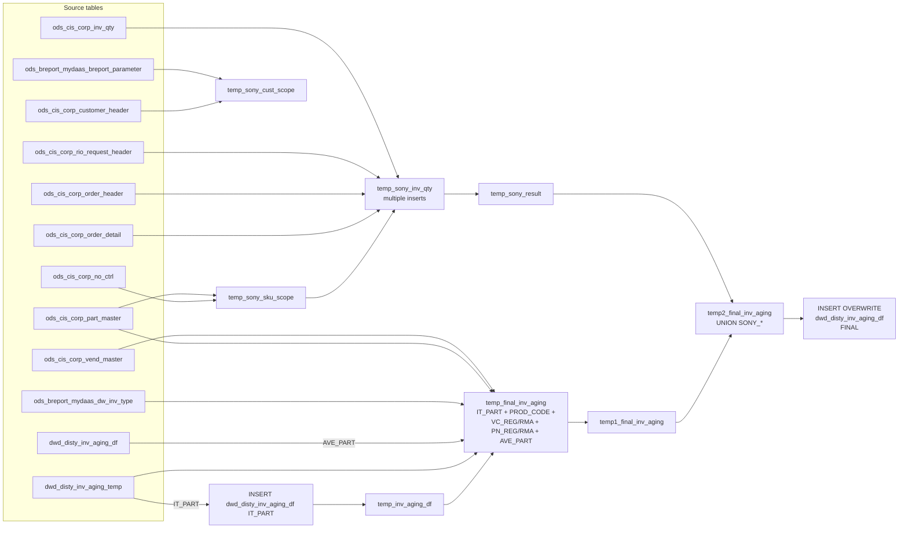

# DWD: Distributor Inventory Aging — View Levels (`dwd_disty_inv_aging_df`)

- artifact_type: etl_table
- artifact_id: ${literal_target_db}.dwd_disty_inv_aging_df
- domain: inventory
- one_line_purpose: This job reads the intermediate aging staging table (`dwd_disty_inv_aging_temp`) and produces the final, fully-rolled-up inventory aging table (`dwd_disty_inv_aging_df`). It generates multiple reporting view levels from a single IT_PART bas...
- layer_type: DWD
- source_kind: etl_sql
- evidence_source: source/etl/sql/inventory/data_service/inventory/python/load_dw_inv_aging_view_levels.py

---

## L1 Data Foundation

### Identity and physical mapping
- **Table:** `${literal_target_db}.dwd_disty_inv_aging_df`
- **Layer type:** DWD
- **Canonical / derived:** Derived / ETL-loaded (see L3)
- **Owner team:** not registered in metadata catalog

### Grain, scope, exclusions
- **Grain:** one row per `view_level` + `view_key1` + `view_key2` + `view_key3` + `inv_type` + `sku_no` per `date_flag` + `company_no` partition.
- **Scope:** See L2 business purpose / L3 filters
- **Partition:** `date_flag`, `company_no`. - resolved from pipeline (see L4)
- **Natural key:** `view_level`, `view_key1` (or `prod_code`), `view_key2` (or `vend_code`), `view_key3` (or `part_no`), `inv_type`, `sku_no` (within a partition).
- **Exclusions:** Not documented in repository

#### Grain detail (preserved)

- **Grain:** one row per `view_level` + `view_key1` + `view_key2` + `view_key3` + `inv_type` + `sku_no` per `date_flag` + `company_no` partition.
- **Partition:** `date_flag`, `company_no`.
- **Natural key:** `view_level`, `view_key1` (or `prod_code`), `view_key2` (or `vend_code`), `view_key3` (or `part_no`), `inv_type`, `sku_no` (within a partition).

---

### Cross-engine presence
| Engine | Present | Canonical FQN | Notes |
|--------|---------|---------------|-------|
| Hive | yes | `${literal_target_db}.dwd_disty_inv_aging_df` | ETL target / intermediate per evidence script |
| Vertica | pending | `${literal_target_db}.dwd_disty_inv_aging_df` | Confirm via hive2vertica flow evidence / MCP |

### Physical schema reference

Pointer block only - full column catalog lives in WKB L1 storage JSON.

| Field | Value |
|-------|-------|
| **Authoritative catalog** | WKB L1 storage seed (not duplicated in this file) |
| **entity_id** | `${literal_target_db}.dwd_disty_inv_aging_df` |
| **l1_catalog_seed** | `target/storage/wkb/snapshots/_snapshot_id_template/l1_catalog/vertica_dw_us_dwd_disty_inv_aging_df.json` |
| **column_count** | 56 |
| **partition_keys** | `date_flag, company_no` |
| **ddl_source** | pending Bitbucket DDL / Vertica metadata ingest |
| **retrieval** | `python -m tools.wkb.indexing.run_query --query "inventory load_dw_inv_aging_view_levels schema" --intent find_table_schema` |

### Lineage
| Object | Role |
|--------|------|
| `${literal_target_db}.dwd_disty_inv_aging_temp` | Intermediate staging source |
| `${literal_target_db}.dwd_disty_inv_aging_df` | Intermediate + final target |
| `${literal_source_db}.ods_breport_mydaas_dw_inv_type` | inv_group mapping |
| `${literal_source_db}.ods_cis_corp_part_master` | Part/vendor enrichment |
| `${literal_source_db}.ods_cis_corp_vend_master` | Vendor name/no enrichment |
| `${literal_source_db}.ods_breport_mydaas_breport_parameter` | Sony program config |
| `${literal_source_db}.ods_cis_corp_no_ctrl` | Sony vendor list |
| `${literal_source_db}.ods_cis_corp_customer_header` | Sony customer territory |
| `${literal_source_db}.ods_cis_corp_order_detail` / `ods_cis_corp_order_header` | Sony open order quantities |
| `${literal_source_db}.ods_cis_corp_order_profile` | Sony RIO program type |
| `${literal_source_db}.ods_cis_corp_inv_qty` | Sony type-2 on-hand |
| `${literal_source_db}.ods_cis_corp_rio_request_header` / `ods_cis_corp_rio_req_detail` | Sony RIO holds |

---

### Freshness and load path
| Item | Value |
|------|-------|
| Load pattern | See L3 end-to-end / INSERT pattern in evidence script |
| Schedule | Not documented in repository |
| Parameters | `literal_target_db`, `literal_source_db`, `literal_date_flag`, `etl_timestamp`, `literal_company_no`, `literal_no_of_days`, `literal_beg_of_mon`, `literal_day_of_mon` |


---

## L2 Declarative Knowledge

### Business purpose
This job reads the intermediate aging staging table (`dwd_disty_inv_aging_temp`) and produces the
final, fully-rolled-up inventory aging table (`dwd_disty_inv_aging_df`). It generates multiple
reporting view levels from a single IT_PART base: product-code rollups (PROD_CODE), vendor-class
rollups (VC_REG / VC_RMA), part-number rollups (PN_REG / PN_RMA), monthly average rollups
(AVE_PART), and Sony-specific program inventory view levels (SONY_*). This table is the primary
source for inventory aging reports consumed by business users.

---

### Audience and use cases
| Audience | How they benefit |
|----------|-----------------|
| **Inventory management** | Multi-level aging view (by part, vendor class, product code) enables drill-down from summary to SKU level |
| **Vendor management** | VC_REG / VC_RMA split aging by regular vs. RMA inventory types per vendor class |
| **Sony program team** | SONY_* view levels show on-hand, on-order, and in-transit quantities per Sony program type |
| **Finance** | AVE_PART provides monthly average aging for write-down reserve calculations |

---

### Fact key resolution
- Natural key: `view_level`, `view_key1` (or `prod_code`), `view_key2` (or `vend_code`), `view_key3` (or `part_no`), `inv_type`, `sku_no` (within a partition).
- FK / label-on attributes: see L3 dimension join patterns and step-by-step logic.
- Negative assertion: do not treat descriptive labels as grain keys unless listed under natural key.

### Time field semantics
- **date_flag / partition columns:** `date_flag`, `company_no`.
- Primary reporting filter should use the partition column(s) documented in L1; resolve values via L4.


### Metrics served

| Category | Column | Logical metric | Business reading |
|----------|--------|----------------|------------------|
| P&L adjustment / measure | `ave_cost` | `ave_cost` | ave_cost at unspecified grain |
| P&L adjustment / measure | `ext_it_cost` | `ext_it_cost` | ext_it_cost at unspecified grain |
| P&L adjustment / measure | `ext_oh_cost` | `ext_oh_cost` | ext_oh_cost at unspecified grain |
| P&L adjustment / measure | `it_cost` | `it_cost` | it_cost at unspecified grain |
| P&L adjustment / measure | `oh_cost` | `oh_cost` | oh_cost at unspecified grain |

### Metric serving map

**Formula authority:** [`source/contracts/inventory/metric-index.md`](../../source/contracts/inventory/metric-index.md)

| Logical metric | Period scope | Physical column | Formula reference |
|----------------|--------------|-----------------|-------------------|
| `ave_cost` | unspecified | `ave_cost` | Not in metric-index.md |
| `ext_it_cost` | unspecified | `ext_it_cost` | Not in metric-index.md |
| `ext_oh_cost` | unspecified | `ext_oh_cost` | Not in metric-index.md |
| `it_cost` | unspecified | `it_cost` | Not in metric-index.md |
| `oh_cost` | unspecified | `oh_cost` | Not in metric-index.md |

### etl_metrics

No governed logical metrics from `source/contracts/inventory/metric-index.md` are mapped on this table.

---

### Metric serving map
N/A - not a `*_comb_mtd` / multi-period wide serving table (or map not present in legacy doc).


### Data products and column groups (preserved)

### Identifiers and relationships

- **View hierarchy:** `view_level`, `view_key1`, `view_key2`, `view_key3`
- **Product:** `sku_no`, `part_no`, `vend_no`, `vend_name`, `vend_code`, `prod_code`
- **Inventory type:** `inv_type`

### Dimension columns

Use these for **filters, group-bys, and star-schema joins**:

- `view_level` — `IT_PART`, `PROD_CODE`, `VC_REG`, `VC_RMA`, `PN_REG`, `PN_RMA`, `AVE_PART`, `SONY_*`
- `vend_code`, `vend_name`, `vend_no` — vendor identifiers
- `prod_code` — product code rollup key

### Quantity building blocks

- `on_hand_qty`, `ohand_qty`, `intran_in`, `itran_qty` — position quantities per view level
- All age band quantities: `qty1_30`, `qty31_60`, …, `qty331_360`, `qty90_up`, `qty180_up`, `qty240_up`, `qty360_up`

### Core derived metrics — Age cost bands

| Column | Formula | Business reading |
|--------|---------|-----------------|
| `age1_30` | `ave_cost × qty1_30` | Dollar value of inventory 1–30 days old |
| `age31_60` … `age331_360` | `ave_cost × qty_band` | Dollar value per age band |
| `age90_up`, `age180_up`, `age240_up`, `age360_up` | Cumulative remainder cost | Dollar exposure in long-tail aging |

### AVE_PART rollup specifics

For `view_level = 'AVE_PART'`: quantities are divided by `literal_no_of_days` (business days in the month) using `floor()`, producing monthly-average quantities rather than point-in-time quantities.

### SONY_* view levels

| Column | Meaning |
|--------|---------|
| `on_hand_qty` | Sum of Sony-program on-hand qty by type |
| `ohand_qty` | Sum of Sony on-order qty |
| `intran_in` | Sum of Sony in-transit inbound |
| `itran_qty` | Sum of Sony in-transit outbound |
| All `qty*` and `age*` columns | `NULL` — not computed for Sony view levels |

---

### etl_metrics

N/A - no calculable ETL formulas extracted from this document (passthrough / stored measures only, or formulas not documented).

---

## L3 Procedural Knowledge

### Query and routing rules
**Business filters:** Use partition / date keys from L1 grain for reporting scope.
**Technical predicates (load only):** See Key filters and step-by-step logic below.

### Dimension join patterns
| Dimension FQN | Join keys | Purpose | Evidence |
|---------------|-----------|---------|----------|
| See step-by-step / base tables | See L3 steps | Dimension enrichment | `source/etl/sql/inventory/data_service/inventory/python/load_dw_inv_aging_view_levels.py` |

### Key filters and ETL business logic
### Step 1 — First `INSERT OVERWRITE` into `dwd_disty_inv_aging_df` (IT_PART only)

**From:** `${literal_target_db}.dwd_disty_inv_aging_temp a`

**Filter:** `a.date_flag = '${literal_date_flag}' AND ${company_no_condition_1}`

All columns passed through from `dwd_disty_inv_aging_temp`. Adds `etl_timestamp` column.

---

### Step 2 — `temp_inv_aging_df`

View of IT_PART rows just inserted: reads `dwd_disty_inv_aging_df` WHERE `date_flag = '${literal_date_flag}' AND view_level = 'IT_PART'`.

---

### Step 3 — `temp_final_inv_aging`

UNION of 5 rollup sub-queries:

| Sub-query | `view_level` | Key logic |
|-----------|-------------|-----------|
| IT_PART | `'IT_PART'` | Pass-through from `temp_inv_aging_df` |
| PROD_CODE | `'PROD_CODE'` | Sum all quantities/costs by `prod_code` + `company_no` from `dwd_disty_inv_aging_temp` |
| VC_RMA / VC_REG | `'VC_RMA'` or `'VC_REG'` | Sum by `prod_code` + `vend_code` + `inv_group` (joined with `ods_breport_mydaas_dw_inv_type`) |
| PN_RMA / PN_REG | `'PN_RMA'` or `'PN_REG'` | Sum by `prod_code` + `vend_code` + `part_no` + `sku_no` + `inv_group`; enriches with vend_name/vend_no from part/vendor masters |
| AVE_PART | `'AVE_PART'` | Monthly-average: reads `dwd_disty_inv_aging_df` for IT_PART rows in `[beg_of_mon, date_flag]` where `literal_day_of_mon = 1`; divides all quantities and costs by `literal_no_of_days` (floor) |

---

### Step 4 — Sony scoping temp tables

- **`temp_sony_cust_scope`**: customers in Sony Single Pool territory scope (fr...

### Standard time-filter SQL
```sql
-- relative period filter using resolved partition value (see L4)
SELECT *
FROM ${literal_target_db}.dwd_disty_inv_aging_df
WHERE /* partition predicate */ date_flag = '${partition_value}';
```

### End-to-end flow
**Runtime parameters:** `literal_target_db`, `literal_source_db`, `literal_date_flag`, `etl_timestamp`, `literal_company_no`, `literal_no_of_days`, `literal_beg_of_mon`, `literal_day_of_mon`
**Target table:** `${literal_target_db}.dwd_disty_inv_aging_df`, partitioned by **`date_flag`**, **`company_no`**.

1. **INSERT** IT_PART rows from `dwd_disty_inv_aging_temp` (for `date_flag`) into `dwd_disty_inv_aging_df`.
2. Create `temp_inv_aging_df`: read IT_PART back from `dwd_disty_inv_aging_df`.
3. Build `temp_final_inv_aging`: UNION of IT_PART + PROD_CODE + VC_RMA + VC_REG + PN_RMA + PN_REG + AVE_PART rollups (reads `dwd_disty_inv_aging_temp` for rollups; reads `dwd_disty_inv_aging_df` for AVE_PART monthly average).
4. Build Sony temp tables (`temp_sony_cust_scope`, `temp_sony_sku_scope`, `temp_sony_inv_qty`, `temp_sony_result`): aggregate Sony-program inventory from open orders, in-transit transfers, on-hand, and RIO holds.
5. Filter `temp_final_inv_aging` into `temp1_final_inv_aging` (exclude SONY_* rows from prior runs).
6. Build `temp2_final_inv_aging`: UNION of `temp1_final_inv_aging` with SONY_* view-level rows from `temp_sony_result`.
7. **INSERT OVERWRITE** final result into `dwd_disty_inv_aging_df` from `temp2_final_inv_aging`.



---


#### High-level stages (preserved)

| Stage | Business meaning |
|-------|-----------------|
| **Load IT_PART base** | Copies IT_PART rows from `dwd_disty_inv_aging_temp` for the target date into `dwd_disty_inv_aging_df` |
| **Build multi-level rollups** | UNIONs PROD_CODE, VC_RMA, VC_REG, PN_RMA, PN_REG, AVE_PART aggregations into `temp_final_inv_aging` |
| **Build Sony-specific inventory** | Computes Sony-program inventory quantities from open orders, in-transit, and RIO requests into `temp_sony_result` |
| **Merge Sony with standard** | Unions standard (non-SONY) rows with SONY_* view-level rows |
| **Final INSERT OVERWRITE** | Writes the merged result to `dwd_disty_inv_aging_df` |

**Parameters:** `literal_target_db`, `literal_source_db`, `literal_date_flag`, `etl_timestamp`, `literal_company_no`, `literal_no_of_days`, `literal_beg_of_mon`, `literal_day_of_mon`

---


### Base tables register
| Object | Role in this job |
|--------|-----------------|
| `${literal_target_db}.dwd_disty_inv_aging_temp` | Intermediate aging staging; IT_PART base for all rollups |
| `${literal_target_db}.dwd_disty_inv_aging_df` | Both intermediate target (IT_PART first insert) and final target |
| `${literal_source_db}.ods_breport_mydaas_dw_inv_type` | Maps `inv_type` to `inv_group` (REG/RMA) for VC/PN rollup |
| `${literal_source_db}.ods_cis_corp_part_master` | Part attributes for PN rollup vend_name/vend_no enrichment and AVE_PART |
| `${literal_source_db}.ods_cis_corp_vend_master` | Vendor attributes for PN rollup |
| `${literal_source_db}.ods_cis_corp_customer_header` | Customer-to-sales-territory mapping for Sony customer scope |
| `${literal_source_db}.ods_breport_mydaas_breport_parameter` | Sony program configuration parameters |
| `${literal_source_db}.ods_cis_corp_no_ctrl` | Sony vendor number control list |
| `${literal_source_db}.ods_cis_corp_inv_qty` | On-hand quantity for Sony type 2 inventory |
| `${literal_source_db}.ods_cis_corp_order_detail` | Open order and in-transit detail for Sony |
| `${literal_source_db}.ods_cis_corp_order_header` | Order header for Sony order scope |
| `${literal_source_db}.ods_cis_corp_order_profile` | RIO program type profile for Sony orders |
| `${literal_source_db}.ods_cis_corp_rio_request_header` / `ods_cis_corp_rio_req_detail` | Sony RIO holds |

**Temporary tables (inside the job only):**
`temp_inv_aging_df` → `temp_final_inv_aging` → `temp_sony_cust_scope` → `temp_sony_sku_scope` → `temp_sony_inv_qty` (5 inserts) → `temp_sony_result` → `temp1_final_inv_aging` → `temp2_final_inv_aging` → (final `INSERT OVERWRITE`)

---

### Step-by-step logic
### Step 1 — First `INSERT OVERWRITE` into `dwd_disty_inv_aging_df` (IT_PART only)

**From:** `${literal_target_db}.dwd_disty_inv_aging_temp a`

**Filter:** `a.date_flag = '${literal_date_flag}' AND ${company_no_condition_1}`

All columns passed through from `dwd_disty_inv_aging_temp`. Adds `etl_timestamp` column.

---

### Step 2 — `temp_inv_aging_df`

View of IT_PART rows just inserted: reads `dwd_disty_inv_aging_df` WHERE `date_flag = '${literal_date_flag}' AND view_level = 'IT_PART'`.

---

### Step 3 — `temp_final_inv_aging`

UNION of 5 rollup sub-queries:

| Sub-query | `view_level` | Key logic |
|-----------|-------------|-----------|
| IT_PART | `'IT_PART'` | Pass-through from `temp_inv_aging_df` |
| PROD_CODE | `'PROD_CODE'` | Sum all quantities/costs by `prod_code` + `company_no` from `dwd_disty_inv_aging_temp` |
| VC_RMA / VC_REG | `'VC_RMA'` or `'VC_REG'` | Sum by `prod_code` + `vend_code` + `inv_group` (joined with `ods_breport_mydaas_dw_inv_type`) |
| PN_RMA / PN_REG | `'PN_RMA'` or `'PN_REG'` | Sum by `prod_code` + `vend_code` + `part_no` + `sku_no` + `inv_group`; enriches with vend_name/vend_no from part/vendor masters |
| AVE_PART | `'AVE_PART'` | Monthly-average: reads `dwd_disty_inv_aging_df` for IT_PART rows in `[beg_of_mon, date_flag]` where `literal_day_of_mon = 1`; divides all quantities and costs by `literal_no_of_days` (floor) |

---

### Step 4 — Sony scoping temp tables

- **`temp_sony_cust_scope`**: customers in Sony Single Pool territory scope (from `ods_cis_corp_customer_header` + `ods_breport_mydaas_breport_parameter` with `param_type = 'Sony_Single_Pool_terr_scope'`).
- **`temp_sony_sku_scope`**: SKUs belonging to Sony vendor numbers (from `ods_cis_corp_part_master` WHERE `vend_no IN (SELECT doc_num FROM ods_cis_corp_no_ctrl WHERE kind = 'RIO_SONY_PROGRAM_TYPE' AND active_flag = 'Y')`).
- **`temp_sony_inv_qty`** (5 INSERTs): aggregates Sony inventory from open orders (order_type=2), in-transit inbound (order_type=4, shipped not received), in-transit outbound (order_type=4, not shipped), on-hand (order_type=1, not shipped), type-2 qty from `ods_cis_corp_inv_qty`.
- **`temp_sony_result`**: aggregates `temp_sony_inv_qty` by `sku_no`, `loc_no`, `inv_type`, `type`.

---

### Step 5 — `temp1_final_inv_aging`

Filters `temp_final_inv_aging`: excludes any `SONY_*` view_level rows (from prior re-runs), applies company and date_flag filter.

---

### Step 6 — `temp2_final_inv_aging`

UNION of `temp1_final_inv_aging` with SONY_* rows built from `temp_sony_result`:
- `view_level = CONCAT('SONY_', type)` (e.g., `SONY_FF`, `SONY_RIO`)
- Only `on_hand_qty`, `ohand_qty` (=on_order_qty), `intran_in`, `itran_qty` (=intran_out) are populated; all qty/age band columns are `NULL`.

---

### Step 7 — Final `INSERT OVERWRITE` into `dwd_disty_inv_aging_df`

`SELECT * FROM temp2_final_inv_aging DISTRIBUTE BY date_flag, company_no`

---

### Relationship map (embedded)

| from_fqn | to_fqn | cardinality | join_keys | provenance |
|----------|--------|-------------|-----------|------------|
| `x` | `${literal_source_db}.ods_cis_corp_part_master` | many:1 (LEFT) | `x.sku_no` = `y.sku_no` | etl_sql (`source/etl/sql/inventory/data_service/inventory/python/load_dw_inv_aging_view_levels.py:574`) |
| `${literal_source_db}.ods_cis_corp_part_master` | `${literal_source_db}.ods_cis_corp_order_detail` | many:1 | `od.sku_no` = `p.sku_no` | etl_sql (`source/etl/sql/inventory/data_service/inventory/python/load_dw_inv_aging_view_levels.py:615`) |
| `${literal_source_db}.ods_cis_corp_order_detail` | `${literal_source_db}.ods_cis_corp_order_header` | many:1 | `od.order_no` = `oh.order_no`; `od.order_type` = `oh.order_type` | etl_sql (`source/etl/sql/inventory/data_service/inventory/python/load_dw_inv_aging_view_levels.py:617`) |
| `${literal_source_db}.ods_cis_corp_order_header` | `${literal_source_db}.ods_cis_corp_order_profile` | many:1 | `op.order_no` = `oh.order_no`; `op.order_type` = `oh.order_type` | etl_sql (`source/etl/sql/inventory/data_service/inventory/python/load_dw_inv_aging_view_levels.py:620`) |
| `${literal_source_db}.ods_cis_corp_order_header` | `temp_sony_cust_scope` | many:1 (LEFT) | `oh.to_acct_no` = `c.cust_no` | etl_sql (`source/etl/sql/inventory/data_service/inventory/python/load_dw_inv_aging_view_levels.py:651`) |
| `${literal_source_db}.ods_cis_corp_part_master` | `${literal_source_db}.ods_cis_corp_rio_request_header` | many:1 | `rh.sku_no` = `p.sku_no` | etl_sql (`source/etl/sql/inventory/data_service/inventory/python/load_dw_inv_aging_view_levels.py:740`) |
| `${literal_source_db}.ods_cis_corp_rio_request_header` | `${literal_source_db}.ods_cis_corp_rio_req_detail` | many:1 | `rd.rio_req_no` = `rh.rio_req_no` | etl_sql (`source/etl/sql/inventory/data_service/inventory/python/load_dw_inv_aging_view_levels.py:742`) |
| `${literal_source_db}.ods_cis_corp_part_master` | `${literal_source_db}.ods_cis_corp_inv_qty` | many:1 | `i.sku_no` = `p.sku_no` | etl_sql (`source/etl/sql/inventory/data_service/inventory/python/load_dw_inv_aging_view_levels.py:762`) |

### Special logic (embedded)

Not documented in repository

### Column / field derivations (from ETL SQL)

| target_column | expression_sql | upstream_columns | upstream_tables | transform_kind | evidence |
|---------------|----------------|------------------|-----------------|----------------|----------|
| `*` | `*` | — | — | partial | `source/etl/sql/inventory/data_service/inventory/python/load_dw_inv_aging_view_levels.py:14` |

### Sentinel and code values
| Value | Meaning |
|-------|---------|
| `inv_group = 'REG'` | Regular inventory → `VC_REG` / `PN_REG` view level |
| `inv_group = 'RMA'` | RMA inventory → `VC_RMA` / `PN_RMA` view level |
| `literal_day_of_mon = 1` | AVE_PART: only daily IT_PART rows that represent the 1st-of-month snapshot contribute to the average |
| `SONY_*` view_levels | Sony program type codes prefixed; qty/age bands are all NULL |
| `NULL AS ohand_qty`, `NULL AS itran_qty` | Not populated for IT_PART / rollup levels — only filled for SONY_* |

---

---


### POS bitbucket-etl mirror

- Also packaged under POS contract pack: source/contracts/pos/bitbucket-etl/dwd_disty_inv_aging_df/load_dw_inv_aging_view_levels.py
- Table-level POS KB (when applicable): see 	arget/knowledgebase/pos/readme.md § Bitbucket-etl

## L4 Validation

### Resolved partition value
| Step | Source | How partition / date scope is determined |
|------|--------|------------------------------------------|
| 1 | evidence script / flow | See parameters in L1 Freshness and L3 filters - `source/etl/sql/inventory/data_service/inventory/python/load_dw_inv_aging_view_levels.py` |

**Plain language:** Partition and date scope follow Azkaban/bootstrap parameters documented in the source script and orchestrating flow; do not hardcode calendar literals.

### Data quality checks
- Prefer row-count-by-partition, metric sums, and grain duplicate checks (see Validation SQL).
- Additional checks from legacy caveats / operational notes when present.

### Validation SQL
```sql
-- 1) row count by partition
-- SELECT partition_col, COUNT(*) FROM ${literal_target_db}.dwd_disty_inv_aging_df WHERE partition_col = '${partition_value}' GROUP BY 1;
-- 2) metric sum by dimension (top N) - replace metric/dim from L2
-- 3) grain duplicate check on natural keys
```


### Caveats for interpretation
- The first INSERT (IT_PART only) and the final INSERT OVERWRITE both write to `dwd_disty_inv_aging_df`; the final INSERT replaces everything including the initial IT_PART load.
- AVE_PART divides by `literal_no_of_days` using `floor()`, which truncates fractional quantities.
- SONY_* rows have NULL for all age-band quantity and cost columns; they are only useful for position monitoring (on-hand, on-order, in-transit).
- `temp1_final_inv_aging` explicitly excludes `SONY_*` view_level rows to prevent accumulation from prior re-runs of this job.
- The AVE_PART sub-query uses `literal_day_of_mon = 1` as a divisor-eligibility flag (only month-start dates count) rather than a filter, which can produce unexpected results if the flag is misconfigured.

---

### Conflicts and open questions
- Schedule, owner, SLA: Not documented in repository (unless preserved schedule evidence above).
- Vertica MCP verification: pending unless confirmed in L5.


---

## L5 Runtime View

### Query path and engine preference
| Role | Hive object | Vertica object | Sync mode | Evidence | MCP verified |
|------|-------------|----------------|-----------|----------|--------------|
| **Not in Vertica** | *See script lineage* | *No Vertica mapping identified in repository* | - | *Add flow evidence when found* | no |

No queryable Vertica table has been confirmed for this script from current repository evidence.

### Access constraints
- Country / company schema parameters may apply (`literal_country`, `company_no`, etc.).
- Hive-only staging objects are not reporting surfaces unless synced.

### Query risk profile
| Field | Value |
|-------|-------|
| requires_date_predicate | yes |
| scan_risk_tier | high |

---

## L6 Access and Consumption

### Primary consumers and use cases
| Audience | How they benefit |
|----------|-----------------|
| **Inventory management** | Multi-level aging view (by part, vendor class, product code) enables drill-down from summary to SKU level |
| **Vendor management** | VC_REG / VC_RMA split aging by regular vs. RMA inventory types per vendor class |
| **Sony program team** | SONY_* view levels show on-hand, on-order, and in-transit quantities per Sony program type |
| **Finance** | AVE_PART provides monthly average aging for write-down reserve calculations |

---

### Representative query patterns
```sql
-- certified / illustrative lookup - replace predicates from L1/L4
SELECT *
FROM ${literal_target_db}.dwd_disty_inv_aging_df
WHERE date_flag = '${partition_value}'
LIMIT 100;
```

### Dependencies and notes
### Upstream objects (verified)

| Object | Usage | Evidence |
|--------|-------|----------|
| `dwd_disty_inv_aging_temp` | IT_PART and rollup base | `source/etl/sql/inventory/data_service/inventory/python/load_dw_inv_aging_view_levels.py:70` |
| `dwd_disty_inv_aging_df` | AVE_PART source + final target | `source/etl/sql/inventory/data_service/inventory/python/load_dw_inv_aging_view_levels.py:132` |
| `ods_breport_mydaas_dw_inv_type` | inv_group mapping | `source/etl/sql/inventory/data_service/inventory/python/load_dw_inv_aging_view_levels.py:322` |
| `ods_cis_corp_no_ctrl` | Sony vendor scope | `source/etl/sql/inventory/data_service/inventory/python/load_dw_inv_aging_view_levels.py:611` |

### Downstream consumers (verified)

| Object / script | Evidence |
|-----------------|----------|
| None identified in repository — `dwd_disty_inv_aging_df` is a reporting-layer end table | — |

### Operational detail (verified)

- Two INSERT OVERWRITE calls to `dwd_disty_inv_aging_df` in one run: `load_dw_inv_aging_view_levels.py:12` and `load_dw_inv_aging_view_levels.py:888`

### Not documented in repository

- Schedule, owner, SLA — not in scripts or configs

---

*Document generated from `source/etl/sql/inventory/data_service/inventory/python/load_dw_inv_aging_view_levels.py`.*

#### Not documented in repository
- Owner, SLA (unless schedule evidence preserved above)
- Any dependency without `file:line` evidence in this document

---

*Document migrated to L1-L6 from legacy Knowledgebase content. Evidence: `source/etl/sql/inventory/data_service/inventory/python/load_dw_inv_aging_view_levels.py`.*
