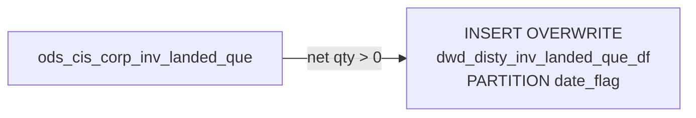

# DWD: Distributor Inventory Landed Queue Snapshot (`dwd_disty_inv_landed_que_df`)

- artifact_type: etl_table
- artifact_id: ${literal_target_db}.dwd_disty_inv_landed_que_df
- domain: inventory
- one_line_purpose: This job loads the current in-transit inventory landed-cost queue from the ODS layer into the DWD layer. It captures open purchase-order receipt lines where the net quantity (in-transit plus received minus shipped) is still positive, provid...
- layer_type: DWD
- source_kind: etl_sql
- evidence_source: source/etl/sql/inventory/data_service/inventory/python/load_dw_inv_landed_que.py

---

## L1 Data Foundation

### Identity and physical mapping
- **Table:** `${literal_target_db}.dwd_disty_inv_landed_que_df`
- **Layer type:** DWD
- **Canonical / derived:** Derived / ETL-loaded (see L3)
- **Owner team:** not registered in metadata catalog

### Grain, scope, exclusions
- **Grain:** one row per `loc_no` + `inv_type` + `sku_no` + `order_type` + `order_no` + `order_line_no` + `rec_no` + `rec_line_no` per `date_flag` partition.
- **Scope:** See L2 business purpose / L3 filters
- **Partition:** `date_flag` — business date of the snapshot. - resolved from pipeline (see L4)
- **Natural key:** `loc_no`, `inv_type`, `sku_no`, `order_no`, `order_line_no`, `rec_no`, `rec_line_no` (within a partition).
- **Exclusions:** Not documented in repository

#### Grain detail (preserved)

- **Grain:** one row per `loc_no` + `inv_type` + `sku_no` + `order_type` + `order_no` + `order_line_no` + `rec_no` + `rec_line_no` per `date_flag` partition.
- **Partition:** `date_flag` — business date of the snapshot.
- **Natural key:** `loc_no`, `inv_type`, `sku_no`, `order_no`, `order_line_no`, `rec_no`, `rec_line_no` (within a partition).

---

### Cross-engine presence
| Engine | Present | Canonical FQN | Notes |
|--------|---------|---------------|-------|
| Hive | yes | `${literal_target_db}.dwd_disty_inv_landed_que_df` | ETL target / intermediate per evidence script |
| Vertica | pending | `${literal_target_db}.dwd_disty_inv_landed_que_df` | Confirm via hive2vertica flow evidence / MCP |

### Physical schema reference

Pointer block only - full column catalog lives in WKB L1 storage JSON.

| Field | Value |
|-------|-------|
| **Authoritative catalog** | WKB L1 storage seed (not duplicated in this file) |
| **entity_id** | `${literal_target_db}.dwd_disty_inv_landed_que_df` |
| **l1_catalog_seed** | `target/storage/wkb/snapshots/_snapshot_id_template/l1_catalog/{engine}_{schema}_{table}.json` |
| **column_count** | pending (run ddl_seed_writer) |
| **partition_keys** | `date_flag` |
| **ddl_source** | pending Bitbucket DDL / Vertica metadata ingest |
| **retrieval** | `python -m tools.wkb.indexing.run_query --query "inventory load_dw_inv_landed_que schema" --intent find_table_schema` |

### Lineage
| Object | Role |
|--------|------|
| `${literal_source_db}.ods_cis_corp_inv_landed_que` | Primary source — landed queue data |

---

### Freshness and load path
| Item | Value |
|------|-------|
| Load pattern | See L3 end-to-end / INSERT pattern in evidence script |
| Schedule | Not documented in repository |
| Parameters | `literal_target_db`, `literal_source_db`, `literal_date_flag` |


---

## L2 Declarative Knowledge

### Business purpose
This job loads the current in-transit inventory landed-cost queue from the ODS layer into the DWD
layer. It captures open purchase-order receipt lines where the net quantity (in-transit plus received
minus shipped) is still positive, providing the downstream cost pipeline with the data needed to
compute weighted-average landed costs per SKU.

---

### Audience and use cases
| Audience | How they benefit |
|----------|-----------------|
| **Cost accounting** | `landed_cost` combined with net quantity enables weighted-average landed cost per SKU, consumed by `load_dw_inv_aging_temp.py` and `load_dw_inv_qty.py` |
| **Inventory operations** | Visibility into purchase order lines still in-transit or pending receipt confirmation |

---

### Fact key resolution
- Natural key: `loc_no`, `inv_type`, `sku_no`, `order_no`, `order_line_no`, `rec_no`, `rec_line_no` (within a partition).
- FK / label-on attributes: see L3 dimension join patterns and step-by-step logic.
- Negative assertion: do not treat descriptive labels as grain keys unless listed under natural key.

### Time field semantics
- **date_flag / partition columns:** `date_flag` — business date of the snapshot.
- Primary reporting filter should use the partition column(s) documented in L1; resolve values via L4.


### Metrics served

| Category | Column | Logical metric | Business reading |
|----------|--------|----------------|------------------|
| Measures | — | — | No measure columns mapped for this table. |

### Metric serving map

**Formula authority:** [`source/contracts/inventory/metric-index.md`](../../source/contracts/inventory/metric-index.md)

N/A — no measure columns mapped for this table.

### etl_metrics

No governed logical metrics from `source/contracts/inventory/metric-index.md` are mapped on this table.

---

### Metric serving map
N/A - not a `*_comb_mtd` / multi-period wide serving table (or map not present in legacy doc).


### Data products and column groups (preserved)

### Identifiers and relationships

- **Location / inventory:** `loc_no`, `inv_type`, `sku_no`
- **Order:** `order_type`, `order_no`, `order_line_no`
- **Receipt:** `rec_no`, `rec_line_no`, `rec_order_type`, `rec_order_no`

### Quantity and cost building blocks

- `landed_cost` — landed cost per unit for this receipt line
- `intran_in` — in-transit inbound quantity
- `rec_qty` — received quantity
- `ship_qty` — shipped quantity (reduces the open queue)
- `rec_datetime`, `rec_id` — receipt timestamp and identifier
- `ship_datetime`, `entry_datetime`, `entry_id` — shipment and entry metadata

### Core derived metrics

| Column | Formula | Business reading |
|--------|---------|-----------------|
| Net open quantity | `nvl(intran_in,0) + nvl(rec_qty,0) - nvl(ship_qty,0)` | Quantity still in the landed-cost queue; used as filter and as denominator in downstream weighted-average landed cost |

> **Note:** `rec_rate` is always `NULL` — sourced as `NULL AS rec_rate` in the INSERT.

---

### etl_metrics

#### `net_open_quantity`
- **Source:** [metric-index.md](../../source/contracts/inventory/metric-index.md#net_open_quantity)
- **Business definition:** Quantity still in the landed-cost queue; used as filter and as denominator in downstream weighted-average landed cost
```sql
`nvl(intran_in,0) + nvl(rec_qty,0) - nvl(ship_qty,0)`
```


---

## L3 Procedural Knowledge

### Query and routing rules
**Business filters:** Use partition / date keys from L1 grain for reporting scope.
**Technical predicates (load only):** See Key filters and step-by-step logic below.

### Dimension join patterns
| Dimension FQN | Join keys | Purpose | Evidence |
|---------------|-----------|---------|----------|
| See step-by-step / base tables | See L3 steps | Dimension enrichment | `source/etl/sql/inventory/data_service/inventory/python/load_dw_inv_landed_que.py` |

### Key filters and ETL business logic
### Step 1 — Final `INSERT OVERWRITE` into `dwd_disty_inv_landed_que_df`

**From:** `${literal_source_db}.ods_cis_corp_inv_landed_que`

**Filter (natural language):**
- Keep only rows where `nvl(intran_in, 0) + nvl(rec_qty, 0) - nvl(ship_qty, 0) > 0` — lines where there is still a net positive quantity in the landed-cost queue.

**Pass-through columns:**
`loc_no`, `inv_type`, `sku_no`, `order_type`, `order_no`, `order_line_no`, `rec_no`, `rec_line_no`, `landed_cost`, `intran_in`, `rec_qty`, `rec_datetime`, `rec_id`, `ship_qty`, `ship_datetime`, `entry_id`, `entry_datetime`, `rec_order_type`, `rec_order_no`

**Derived columns computed at INSERT:**

| Column | Formula | Plain language |
|--------|---------|----------------|
| `rec_rate` | `NULL` | Not populated; reserved for future use |
| `date_flag` | `to_date('${literal_date_flag}')` | Business date of the snapshot |

---

### Standard time-filter SQL
```sql
-- relative period filter using resolved partition value (see L4)
SELECT *
FROM ${literal_target_db}.dwd_disty_inv_landed_que_df
WHERE /* partition predicate */ date_flag = '${partition_value}';
```

### End-to-end flow
**Runtime parameters:** `literal_target_db`, `literal_source_db`, `literal_date_flag`
**Target table:** `${literal_target_db}.dwd_disty_inv_landed_que_df`, partitioned by **`date_flag`**.

1. **Read** all rows from `ods_cis_corp_inv_landed_que`.
2. **Filter** to rows where `nvl(intran_in,0) + nvl(rec_qty,0) - nvl(ship_qty,0) > 0` (net positive queue).
3. **INSERT OVERWRITE** all qualifying rows into the target partition, setting `date_flag = to_date('${literal_date_flag}')` and `rec_rate = NULL`.



---


#### High-level stages (preserved)

| Stage | Business meaning |
|-------|-----------------|
| **Filter open queue lines** | Reads only rows where `intran_in + rec_qty - ship_qty > 0` — these are lines with unresolved in-transit or received-but-not-shipped quantities |
| **INSERT OVERWRITE** | Writes the filtered queue snapshot to the target DWD table for the given `date_flag` |

**Parameters:** `literal_target_db`, `literal_source_db`, `literal_date_flag`

---


### Base tables register
| Object | Role in this job |
|--------|-----------------|
| `${literal_source_db}.ods_cis_corp_inv_landed_que` | Primary and sole source — in-transit/receipt cost queue |

**Temporary tables (inside the job only):**
None — single direct INSERT.

---

### Step-by-step logic
### Step 1 — Final `INSERT OVERWRITE` into `dwd_disty_inv_landed_que_df`

**From:** `${literal_source_db}.ods_cis_corp_inv_landed_que`

**Filter (natural language):**
- Keep only rows where `nvl(intran_in, 0) + nvl(rec_qty, 0) - nvl(ship_qty, 0) > 0` — lines where there is still a net positive quantity in the landed-cost queue.

**Pass-through columns:**
`loc_no`, `inv_type`, `sku_no`, `order_type`, `order_no`, `order_line_no`, `rec_no`, `rec_line_no`, `landed_cost`, `intran_in`, `rec_qty`, `rec_datetime`, `rec_id`, `ship_qty`, `ship_datetime`, `entry_id`, `entry_datetime`, `rec_order_type`, `rec_order_no`

**Derived columns computed at INSERT:**

| Column | Formula | Plain language |
|--------|---------|----------------|
| `rec_rate` | `NULL` | Not populated; reserved for future use |
| `date_flag` | `to_date('${literal_date_flag}')` | Business date of the snapshot |

---

### Relationship map (embedded)

| from_fqn | to_fqn | cardinality | join_keys | provenance |
|----------|--------|-------------|-----------|------------|
| `${literal_source_db}.ods_cis_corp_inv_landed_que` | `${literal_source_db}.ods_cis_corp_inv_landed_que` | 1:1 source scan | — (no JOIN; single FROM) | etl_sql (`source/etl/sql/inventory/data_service/inventory/python/load_dw_inv_landed_que.py:23`) |


### Special logic (embedded)

Not documented in repository

### Column / field derivations (from ETL SQL)

| target_column | expression_sql | upstream_columns | upstream_tables | transform_kind | evidence |
|---------------|----------------|------------------|-----------------|----------------|----------|
| `loc_no` | `loc_no` | `loc_no` | `${literal_source_db}.ods_cis_corp_inv_landed_que` | passthrough | `source/etl/sql/inventory/data_service/inventory/python/load_dw_inv_landed_que.py:6` |
| `inv_type` | `inv_type` | `inv_type` | `${literal_source_db}.ods_cis_corp_inv_landed_que` | passthrough | `source/etl/sql/inventory/data_service/inventory/python/load_dw_inv_landed_que.py:7` |
| `sku_no` | `sku_no` | `sku_no` | `${literal_source_db}.ods_cis_corp_inv_landed_que` | passthrough | `source/etl/sql/inventory/data_service/inventory/python/load_dw_inv_landed_que.py:8` |
| `order_type` | `order_type` | `order_type` | `${literal_source_db}.ods_cis_corp_inv_landed_que` | passthrough | `source/etl/sql/inventory/data_service/inventory/python/load_dw_inv_landed_que.py:9` |
| `order_no` | `order_no` | `order_no` | `${literal_source_db}.ods_cis_corp_inv_landed_que` | passthrough | `source/etl/sql/inventory/data_service/inventory/python/load_dw_inv_landed_que.py:10` |
| `order_line_no` | `order_line_no` | `order_line_no` | `${literal_source_db}.ods_cis_corp_inv_landed_que` | passthrough | `source/etl/sql/inventory/data_service/inventory/python/load_dw_inv_landed_que.py:11` |
| `rec_no` | `rec_no` | `rec_no` | `${literal_source_db}.ods_cis_corp_inv_landed_que` | passthrough | `source/etl/sql/inventory/data_service/inventory/python/load_dw_inv_landed_que.py:12` |
| `rec_line_no` | `rec_line_no` | `rec_line_no` | `${literal_source_db}.ods_cis_corp_inv_landed_que` | passthrough | `source/etl/sql/inventory/data_service/inventory/python/load_dw_inv_landed_que.py:13` |
| `landed_cost` | `landed_cost` | `landed_cost` | `${literal_source_db}.ods_cis_corp_inv_landed_que` | passthrough | `source/etl/sql/inventory/data_service/inventory/python/load_dw_inv_landed_que.py:14` |
| `intran_in` | `intran_in` | `intran_in` | `${literal_source_db}.ods_cis_corp_inv_landed_que` | passthrough | `source/etl/sql/inventory/data_service/inventory/python/load_dw_inv_landed_que.py:15` |
| `rec_qty` | `rec_qty` | `rec_qty` | `${literal_source_db}.ods_cis_corp_inv_landed_que` | passthrough | `source/etl/sql/inventory/data_service/inventory/python/load_dw_inv_landed_que.py:16` |
| `rec_datetime` | `rec_datetime` | `rec_datetime` | `${literal_source_db}.ods_cis_corp_inv_landed_que` | passthrough | `source/etl/sql/inventory/data_service/inventory/python/load_dw_inv_landed_que.py:17` |
| `rec_id` | `rec_id` | `rec_id` | `${literal_source_db}.ods_cis_corp_inv_landed_que` | passthrough | `source/etl/sql/inventory/data_service/inventory/python/load_dw_inv_landed_que.py:18` |
| `ship_qty` | `ship_qty` | `ship_qty` | `${literal_source_db}.ods_cis_corp_inv_landed_que` | passthrough | `source/etl/sql/inventory/data_service/inventory/python/load_dw_inv_landed_que.py:19` |
| `ship_datetime` | `ship_datetime` | `ship_datetime` | `${literal_source_db}.ods_cis_corp_inv_landed_que` | passthrough | `source/etl/sql/inventory/data_service/inventory/python/load_dw_inv_landed_que.py:20` |
| `entry_id` | `entry_id` | `entry_id` | `${literal_source_db}.ods_cis_corp_inv_landed_que` | passthrough | `source/etl/sql/inventory/data_service/inventory/python/load_dw_inv_landed_que.py:21` |
| `entry_datetime` | `entry_datetime` | `entry_datetime` | `${literal_source_db}.ods_cis_corp_inv_landed_que` | passthrough | `source/etl/sql/inventory/data_service/inventory/python/load_dw_inv_landed_que.py:22` |
| `rec_order_type` | `rec_order_type` | `rec_order_type` | `${literal_source_db}.ods_cis_corp_inv_landed_que` | passthrough | `source/etl/sql/inventory/data_service/inventory/python/load_dw_inv_landed_que.py:23` |
| `rec_order_no` | `rec_order_no` | `rec_order_no` | `${literal_source_db}.ods_cis_corp_inv_landed_que` | passthrough | `source/etl/sql/inventory/data_service/inventory/python/load_dw_inv_landed_que.py:24` |
| `rec_rate` | `NULL` | — | `${literal_source_db}.ods_cis_corp_inv_landed_que` | rename | `source/etl/sql/inventory/data_service/inventory/python/load_dw_inv_landed_que.py:25` |
| `literal_date_flag` | `to_date('${literal_date_flag}')` | `literal_date_flag` | `${literal_source_db}.ods_cis_corp_inv_landed_que` | udf | `source/etl/sql/inventory/data_service/inventory/python/load_dw_inv_landed_que.py:26` |

### Sentinel and code values
| Value | Meaning |
|-------|---------|
| `NULL AS rec_rate` | Rate field is never populated in this job |

---

---

## L4 Validation

### Resolved partition value
| Step | Source | How partition / date scope is determined |
|------|--------|------------------------------------------|
| 1 | evidence script / flow | See parameters in L1 Freshness and L3 filters - `source/etl/sql/inventory/data_service/inventory/python/load_dw_inv_landed_que.py` |

**Plain language:** Partition and date scope follow Azkaban/bootstrap parameters documented in the source script and orchestrating flow; do not hardcode calendar literals.

### Data quality checks
- Prefer row-count-by-partition, metric sums, and grain duplicate checks (see Validation SQL).
- Additional checks from legacy caveats / operational notes when present.

### Validation SQL
```sql
-- 1) row count by partition
-- SELECT partition_col, COUNT(*) FROM ${literal_target_db}.dwd_disty_inv_landed_que_df WHERE partition_col = '${partition_value}' GROUP BY 1;
-- 2) metric sum by dimension (top N) - replace metric/dim from L2
-- 3) grain duplicate check on natural keys
```


### Caveats for interpretation
- Only open queue lines (net qty > 0) are loaded; closed or fully-shipped lines are excluded.
- `rec_rate` is always `NULL` in this table.
- Downstream scripts (`load_dw_inv_aging_temp.py`, `load_dw_inv_qty.py`) aggregate this table to compute `avg_landed_cost` per SKU.

---

### Conflicts and open questions
- Schedule, owner, SLA: Not documented in repository (unless preserved schedule evidence above).
- Vertica MCP verification: pending unless confirmed in L5.


---

## L5 Runtime View

### Query path and engine preference
| Role | Hive object | Vertica object | Sync mode | Evidence | MCP verified |
|------|-------------|----------------|-----------|----------|--------------|
| **Not in Vertica** | *See script lineage* | *No Vertica mapping identified in repository* | - | *Add flow evidence when found* | no |

No queryable Vertica table has been confirmed for this script from current repository evidence.

### Access constraints
- Country / company schema parameters may apply (`literal_country`, `company_no`, etc.).
- Hive-only staging objects are not reporting surfaces unless synced.

### Query risk profile
| Field | Value |
|-------|-------|
| requires_date_predicate | yes |
| scan_risk_tier | high |

---

## L6 Access and Consumption

### Primary consumers and use cases
| Audience | How they benefit |
|----------|-----------------|
| **Cost accounting** | `landed_cost` combined with net quantity enables weighted-average landed cost per SKU, consumed by `load_dw_inv_aging_temp.py` and `load_dw_inv_qty.py` |
| **Inventory operations** | Visibility into purchase order lines still in-transit or pending receipt confirmation |

---

### Representative query patterns
```sql
-- certified / illustrative lookup - replace predicates from L1/L4
SELECT *
FROM ${literal_target_db}.dwd_disty_inv_landed_que_df
WHERE date_flag = '${partition_value}'
LIMIT 100;
```

### Dependencies and notes
### Upstream objects (verified)

| Object | Usage | Evidence |
|--------|-------|----------|
| `ods_cis_corp_inv_landed_que` | All columns selected as-is | `source/etl/sql/inventory/data_service/inventory/python/load_dw_inv_landed_que.py:6` |

### Downstream consumers (verified)

| Object / script | Evidence |
|-----------------|----------|
| `load_dw_inv_aging_temp.py` — reads `dwd_disty_inv_landed_que_df` to compute `temp_que` (avg landed cost per SKU) | `source/etl/sql/inventory/data_service/inventory/python/load_dw_inv_aging_temp.py:37` |
| `load_dw_inv_qty.py` — reads `dwd_disty_inv_landed_que_df` to compute `temp_que` | `source/etl/sql/inventory/data_service/inventory/python/load_dw_inv_qty.py:15` |

### Operational detail (verified)

- Full partition overwrite per `date_flag` — `INSERT OVERWRITE … PARTITION (date_flag)`: `source/etl/sql/inventory/data_service/inventory/python/load_dw_inv_landed_que.py:5`

### Not documented in repository

- Schedule, owner, SLA — not in scripts or configs

---

*Document generated from `source/etl/sql/inventory/data_service/inventory/python/load_dw_inv_landed_que.py`.*

#### Not documented in repository
- Owner, SLA (unless schedule evidence preserved above)
- Any dependency without `file:line` evidence in this document

---

*Document migrated to L1-L6 from legacy Knowledgebase content. Evidence: `source/etl/sql/inventory/data_service/inventory/python/load_dw_inv_landed_que.py`.*
