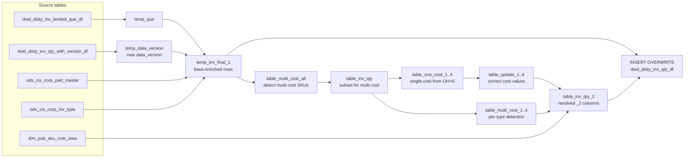

# DWD: Distributor Inventory Quantity (`dwd_disty_inv_qty_df`)

- artifact_type: etl_table
- artifact_id: ${literal_target_db}.dwd_disty_inv_qty_df
- domain: inventory
- one_line_purpose: This job produces the primary daily inventory quantity table used across all downstream reporting and analytics. It reads the latest versioned snapshot from `dwd_disty_inv_qty_with_version_df`, enriches it with part/vendor cost attributes, ...
- layer_type: DWD
- source_kind: etl_sql
- evidence_source: source/etl/sql/inventory/data_service/inventory/python/load_dw_inv_qty.py

---

## L1 Data Foundation

### Identity and physical mapping
- **Table:** `${literal_target_db}.dwd_disty_inv_qty_df`
- **Layer type:** DWD
- **Canonical / derived:** Derived / ETL-loaded (see L3)
- **Owner team:** not registered in metadata catalog

### Grain, scope, exclusions
- **Grain:** one row per `loc_no` + `inv_type` + `sku_no` per `date_flag` + `company_no` partition.
- **Scope:** See L2 business purpose / L3 filters
- **Partition:** `date_flag`, `company_no`. - resolved from pipeline (see L4)
- **Natural key:** `loc_no`, `inv_type`, `sku_no` (within a partition).
- **Exclusions:** Not documented in repository

#### Grain detail (preserved)

- **Grain:** one row per `loc_no` + `inv_type` + `sku_no` per `date_flag` + `company_no` partition.
- **Partition:** `date_flag`, `company_no`.
- **Natural key:** `loc_no`, `inv_type`, `sku_no` (within a partition).

---

### Cross-engine presence
| Engine | Present | Canonical FQN | Notes |
|--------|---------|---------------|-------|
| Hive | yes | `${literal_target_db}.dwd_disty_inv_qty_df` | ETL target / intermediate per evidence script |
| Vertica | pending | `${literal_target_db}.dwd_disty_inv_qty_df` | Confirm via hive2vertica flow evidence / MCP |

### Physical schema reference

Pointer block only - full column catalog lives in WKB L1 storage JSON.

| Field | Value |
|-------|-------|
| **Authoritative catalog** | WKB L1 storage seed (not duplicated in this file) |
| **entity_id** | `${literal_target_db}.dwd_disty_inv_qty_df` |
| **l1_catalog_seed** | `target/storage/wkb/snapshots/_snapshot_id_template/l1_catalog/vertica_dw_us_dwd_disty_inv_qty_df.json` |
| **column_count** | 29 |
| **partition_keys** | `date_flag, company_no` |
| **ddl_source** | pending Bitbucket DDL / Vertica metadata ingest |
| **retrieval** | `python -m tools.wkb.indexing.run_query --query "inventory load_dw_inv_qty schema" --intent find_table_schema` |

### Lineage
| Object | Role |
|--------|------|
| `${literal_target_db}.dwd_disty_inv_landed_que_df` | Landed cost lookup |
| `${literal_target_db}.dwd_disty_inv_qty_with_version_df` | Versioned source inventory |
| `${literal_source_db}.ods_cis_corp_part_master` | Cost attributes |
| `${literal_source_db}.ods_cis_corp_inv_type` | cost_from rule |
| `dim_${literal_country}.dim_pub_sku_cost_view` | Fallback SKU cost dimension |

---

### Freshness and load path
| Item | Value |
|------|-------|
| Load pattern | See L3 end-to-end / INSERT pattern in evidence script |
| Schedule | Not documented in repository |
| Parameters | `literal_target_db`, `literal_source_db`, `literal_date_flag`, `etl_timestamp`, `literal_company_no`, `literal_country` |


---

## L2 Declarative Knowledge

### Business purpose
This job produces the primary daily inventory quantity table used across all downstream reporting
and analytics. It reads the latest versioned snapshot from `dwd_disty_inv_qty_with_version_df`,
enriches it with part/vendor cost attributes, computes `it_ave_cost` (in-transit average cost)
using the `cost_from` rule, and resolves multi-cost ambiguities across locations. When a SKU has
multiple different cost values across its location rows, the job applies a deterministic
deduplication logic — preferring cost values observed where `on_hand_qty > 0`, falling back to
the SKU cost dimension (`dim_pub_sku_cost_view`). The result is a consistent, location-level
inventory quantity record ready for aging, finance, and business reporting.

---

### Audience and use cases
| Audience | How they benefit |
|----------|-----------------|
| **Inventory aging jobs** | `load_dw_inv_aging_temp.py` (snapshot mode) reads this table as its inventory position source |
| **Finance / costing** | `it_ave_cost` and the four `*_2` cost columns provide a consistent cost for each location row |
| **Business reporting** | On-hand, back-order, allocated, in-transit, and WIP quantities per location/SKU |
| **switch_dw_inv_qty.py** | Reads this table as the fallback source when `dwd_disty_inv_qty_revise_df` has no matching row |

---

### Fact key resolution
- Natural key: `loc_no`, `inv_type`, `sku_no` (within a partition).
- FK / label-on attributes: see L3 dimension join patterns and step-by-step logic.
- Negative assertion: do not treat descriptive labels as grain keys unless listed under natural key.

### Time field semantics
- **date_flag / partition columns:** `date_flag`, `company_no`.
- Primary reporting filter should use the partition column(s) documented in L1; resolve values via L4.


### Metrics served

| Category | Column | Logical metric | Business reading |
|----------|--------|----------------|------------------|
| P&L adjustment / measure | `ave_cost` | `ave_cost` | ave_cost at unspecified grain |
| Formula component | `base_cost` | `base_cost` | base_cost at unspecified grain |
| Governed metric | `it_ave_cost` | `it_ave_cost` | it_ave_cost at unspecified grain |
| P&L adjustment / measure | `std_cost` | `std_cost` | std_cost at unspecified grain |

### Metric serving map

**Formula authority:** [`source/contracts/inventory/metric-index.md`](../../source/contracts/inventory/metric-index.md)

| Logical metric | Period scope | Physical column | Formula reference |
|----------------|--------------|-----------------|-------------------|
| `ave_cost` | unspecified | `ave_cost` | Not in metric-index.md |
| `base_cost` | unspecified | `base_cost` | Not in metric-index.md |
| `it_ave_cost` | unspecified | `it_ave_cost` | `source/contracts/inventory/metric-index.md#it_ave_cost` |
| `std_cost` | unspecified | `std_cost` | Not in metric-index.md |

### etl_metrics

Formulas below are sourced from [`source/contracts/inventory/metric-index.md`](../../source/contracts/inventory/metric-index.md) for logical metrics present on this table.
Index formulas are canonical: this enricher copies them into KB and never overwrites `final_effective_formula_sql` in the metric-index.

#### `it_ave_cost`
- **Source:** [metric-index.md](../../source/contracts/inventory/metric-index.md#it_ave_cost)
- **Business definition:** In-transit average cost selected by inv_type cost_from rule (Q/L/M ASCII sign trick)
```sql
(1-abs(sign(ascii(cost_from)-ascii('Q'))))*nvl(iq.ave_cost,0) + (1-abs(sign(ascii(cost_from)-ascii('L'))))*nvl(avg_landed_cost,0) + (1-abs(sign(ascii(cost_from)-ascii('M'))))*nvl(pm.ave_cost,0)
```

---

### Metric serving map
N/A - not a `*_comb_mtd` / multi-period wide serving table (or map not present in legacy doc).


### Data products and column groups (preserved)

### Identifiers and relationships

- **Location / inventory:** `loc_no`, `inv_type`, `sku_no`
- **Partitioning:** `date_flag`, `company_no`

### Dimension columns

- `u_version` — update version from CIS

### Quantity building blocks

- `on_hand_qty`, `bo_qty`, `on_order_qty`, `alloc_qty`, `intran_out`, `intran_in`, `wip_qty` — core inventory quantities
- `rio_qty`, `kwo_comp_rio_qty`, `kwo_oh_qty`, `kwo_bo_qty` — RIO and KWO program quantities

### Pricing and cost building blocks

- `ave_cost` — average cost from part master
- `std_cost` — standard cost
- `base_cost` — PO cost from part master (`pm.po_cost`)
- `it_ave_cost` — in-transit average cost (computed from `cost_from` logic: Q/L/M)
- `ave_cost_fx`, `base_cost_fx` — FX variants (NULL unless populated by source)
- `ave_cost_2`, `base_cost_2`, `ave_cost_fx_2`, `base_cost_fx_2` — multi-cost resolved columns; identical to primary cost for single-cost SKUs

### Core derived metrics

| Column | Formula | Business reading |
|--------|---------|-----------------|
| `it_ave_cost` | Q: `nvl(iq.ave_cost,0)`, L: `nvl(avg_landed_cost,0)`, M: `nvl(pm.ave_cost,0)` (binary sign trick via ASCII comparison) | Cost to value in-transit inventory, selected by inv_type rule |
| `ave_cost_2` | If multiple ave_cost values exist: cost from positive-on-hand location or SKU cost dim; else `a.ave_cost` | Consistent ave_cost for SKUs that appear in multiple locations with different costs |

---

### etl_metrics

#### `it_ave_cost`
- **Source:** [metric-index.md](../../source/contracts/inventory/metric-index.md#it_ave_cost)
- **Business definition:** Cost to value in-transit inventory, selected by inv_type rule
```sql
Q: `nvl(iq.ave_cost,0)`, L: `nvl(avg_landed_cost,0)`, M: `nvl(pm.ave_cost,0)` (binary sign trick via ASCII comparison)
```


---

## L3 Procedural Knowledge

### Query and routing rules
**Business filters:** Use partition / date keys from L1 grain for reporting scope.
**Technical predicates (load only):** See Key filters and step-by-step logic below.

### Dimension join patterns
| Dimension FQN | Join keys | Purpose | Evidence |
|---------------|-----------|---------|----------|
| See step-by-step / base tables | See L3 steps | Dimension enrichment | `source/etl/sql/inventory/data_service/inventory/python/load_dw_inv_qty.py` |

### Key filters and ETL business logic
### Step 1 — `temp_que`

**Source:** `${literal_target_db}.dwd_disty_inv_landed_que_df`

**Filter:** `date_flag = '${literal_date_flag}'`

| Column | Formula |
|--------|---------|
| `avg_landed_cost` | Weighted-average landed cost per SKU |

---

### Step 2 — `temp_data_version`

**Source:** `${literal_target_db}.dwd_disty_inv_qty_with_version_df`

**Filter:** `date_flag = '${literal_date_flag}' AND company_no_condition_1`

| Column | Formula |
|--------|---------|
| `data_version` | `max(iq.data_version)` — latest snapshot version |

---

### Step 3 — `temp_inv_final_1`

UNION of two sets from `dwd_disty_inv_qty_with_version_df` at max `data_version`:

**Set A (non-100/200 inv_types):**

| Column | Formula | Plain language |
|--------|---------|----------------|
| `ave_cost` | `pm.ave_cost` | Part master average cost |
| `base_cost` | `pm.po_cost` | PO cost from part master |
| `it_ave_cost` | `(Q rule: nvl(iq.ave_cost,0)) + (M rule: nvl(pm.ave_cost,0)) + (L rule: nvl(q.avg_landed_cost,0))` using binary ASCII sign trick | Cost selected by `cost_from` flag, including landed cost |
| `kwo_bo_qty` | `NULL` | Not populated |

**Set B (inv_types 100, 200):** Same joins but without `temp_que`; `it_ave_cost` uses only Q and M rules (no landed cost).

---

### Steps 4–9 — Multi-cost detection and resolution

- `table_multi_cost_all`: groups by `sku_no`, `inv_type`, `company_no`; flags SKUs where any of `ave_cost`, `base_cost`, `ave_cost_fx`, `base_cost_fx` has more than 1 distinct ...

### Standard time-filter SQL
```sql
-- relative period filter using resolved partition value (see L4)
SELECT *
FROM ${literal_target_db}.dwd_disty_inv_qty_df
WHERE /* partition predicate */ date_flag = '${partition_value}';
```

### End-to-end flow
**Runtime parameters:** `literal_target_db`, `literal_source_db`, `literal_date_flag`, `etl_timestamp`, `literal_company_no`, `literal_country`
**Target table:** `${literal_target_db}.dwd_disty_inv_qty_df`, partitioned by **`date_flag`**, **`company_no`**.

1. Build `temp_que`: weighted-average landed cost per SKU from `dwd_disty_inv_landed_que_df`.
2. Build `temp_data_version`: max `data_version` from `dwd_disty_inv_qty_with_version_df` for `date_flag`.
3. Build `temp_inv_final_1`: UNION of regular inv_type records (with landed-cost `it_ave_cost`) and special inv_type 100/200 records (without landed cost).
4. Build `table_multi_cost_all`: SKU+inv_type+company combinations with any of 4 cost types having multiple distinct values.
5. Build `table_inv_qty`: subset of `temp_inv_final_1` for multi-cost SKUs.
6. Build `table_multi_cost_1..4`: per-cost-type detection of multi-value SKUs.
7. Build `table_one_cost_1..4`: per-cost-type, single-value SKUs when `on_hand_qty > 0`.
8. Build `table_update_1..4`: resolved correct cost value (min cost from positive-on-hand rows).
9. Build `table_inv_qty_2`: per-location resolved `*_2` cost columns using multi/one-cost lookups and SKU cost dim fallback.
10. **INSERT OVERWRITE** into `dwd_disty_inv_qty_df`: join `temp_inv_final_1` with `table_inv_qty_2` to apply `*_2` columns.



---


#### High-level stages (preserved)

| Stage | Business meaning |
|-------|-----------------|
| **Landed cost lookup** | Computes weighted-average landed cost per SKU for the date |
| **Latest version selection** | Reads only the max `data_version` for the target `date_flag` |
| **Base inventory build** | Joins versioned qty with part/inv_type masters to enrich cost and compute `it_ave_cost` |
| **Multi-cost detection** | Identifies SKU+inv_type+company combinations where cost values disagree across locations |
| **Multi-cost resolution** | Prefers the cost from positive-on-hand locations; falls back to the SKU cost dimension |
| **Final INSERT** | Writes enriched, cost-resolved records to `dwd_disty_inv_qty_df` |

**Parameters:** `literal_target_db`, `literal_source_db`, `literal_date_flag`, `etl_timestamp`, `literal_company_no`, `literal_country`

---


### Base tables register
| Object | Role in this job |
|--------|-----------------|
| `${literal_target_db}.dwd_disty_inv_landed_que_df` | Landed cost queue — provides `avg_landed_cost` per SKU |
| `${literal_target_db}.dwd_disty_inv_qty_with_version_df` | Versioned inventory quantities — primary source |
| `${literal_source_db}.ods_cis_corp_part_master` | `ave_cost`, `po_cost` (→ `base_cost`) per SKU |
| `${literal_source_db}.ods_cis_corp_inv_type` | `cost_from` rule per inv_type (Q/L/M) |
| `dim_${literal_country}.dim_pub_sku_cost_view` | SKU cost dimension — fallback for multi-cost resolution |

**Temporary tables (inside the job only):**
`temp_que` → `temp_data_version` → `temp_inv_final_1` → `table_multi_cost_all` → `table_inv_qty` → `table_multi_cost_1..4` + `table_one_cost_1..4` → `table_update_1..4` → `table_inv_qty_2` → (final `INSERT`)

---

### Step-by-step logic
### Step 1 — `temp_que`

**Source:** `${literal_target_db}.dwd_disty_inv_landed_que_df`

**Filter:** `date_flag = '${literal_date_flag}'`

| Column | Formula |
|--------|---------|
| `avg_landed_cost` | Weighted-average landed cost per SKU |

---

### Step 2 — `temp_data_version`

**Source:** `${literal_target_db}.dwd_disty_inv_qty_with_version_df`

**Filter:** `date_flag = '${literal_date_flag}' AND company_no_condition_1`

| Column | Formula |
|--------|---------|
| `data_version` | `max(iq.data_version)` — latest snapshot version |

---

### Step 3 — `temp_inv_final_1`

UNION of two sets from `dwd_disty_inv_qty_with_version_df` at max `data_version`:

**Set A (non-100/200 inv_types):**

| Column | Formula | Plain language |
|--------|---------|----------------|
| `ave_cost` | `pm.ave_cost` | Part master average cost |
| `base_cost` | `pm.po_cost` | PO cost from part master |
| `it_ave_cost` | `(Q rule: nvl(iq.ave_cost,0)) + (M rule: nvl(pm.ave_cost,0)) + (L rule: nvl(q.avg_landed_cost,0))` using binary ASCII sign trick | Cost selected by `cost_from` flag, including landed cost |
| `kwo_bo_qty` | `NULL` | Not populated |

**Set B (inv_types 100, 200):** Same joins but without `temp_que`; `it_ave_cost` uses only Q and M rules (no landed cost).

---

### Steps 4–9 — Multi-cost detection and resolution

- `table_multi_cost_all`: groups by `sku_no`, `inv_type`, `company_no`; flags SKUs where any of `ave_cost`, `base_cost`, `ave_cost_fx`, `base_cost_fx` has more than 1 distinct value.
- `table_inv_qty`: joins `temp_inv_final_1` with `table_multi_cost_all` to get only multi-cost rows.
- `table_multi_cost_1..4`: one table per cost type — confirms which cost type is multi-valued per SKU.
- `table_one_cost_1..4`: among multi-cost SKUs, finds those with a single cost when `on_hand_qty > 0`.
- `table_update_1..4`: extracts the minimum non-null cost value from positive-on-hand rows for each cost type.
- `table_inv_qty_2`: per-location, applies resolution logic: if multi-cost AND single-value-from-OH exists → use that; else if SKU cost dim has a value → use that; else `NULL`.

---

### Step 10 — Final `INSERT OVERWRITE` into `dwd_disty_inv_qty_df`

**From:** `temp_inv_final_1 a` LEFT JOIN `table_inv_qty_2 b` ON `sku_no`, `loc_no`, `inv_type`, `company_no`.

**Pass-through columns (from `a`):**
`loc_no`, `inv_type`, `sku_no`, `u_version`, `ave_cost`, `std_cost`, `on_hand_qty`, `bo_qty`, `on_order_qty`, `alloc_qty`, `intran_out`, `intran_in`, `entry_datetime`, `entry_id`, `wip_qty`, `it_ave_cost`, `base_cost`, `ave_cost_fx`, `base_cost_fx`, `rio_qty`, `kwo_comp_rio_qty`, `kwo_oh_qty`, `kwo_bo_qty`, `date_flag`, `company_no`

**Derived columns at INSERT:**

| Column | Formula | Plain language |
|--------|---------|----------------|
| `ave_cost_2` | `b.ave_cost_2` if b matches, else `a.ave_cost` | Resolved average cost |
| `base_cost_2` | `b.base_cost_2` if b matches, else `a.base_cost` | Resolved base cost |
| `ave_cost_fx_2` | `b.ave_cost_fx_2` if b matches, else `a.ave_cost_fx` | Resolved FX average cost |
| `base_cost_fx_2` | `b.base_cost_fx_2` if b matches, else `a.base_cost_fx` | Resolved FX base cost |

---

### Relationship map (embedded)

| from_fqn | to_fqn | cardinality | join_keys | provenance |
|----------|--------|-------------|-----------|------------|
| `${literal_target_db}.dwd_disty_inv_qty_with_version_df` | `${literal_source_db}.ods_cis_corp_part_master` | many:1 | `iq.sku_no` = `pm.sku_no` | etl_sql (`source/etl/sql/inventory/data_service/inventory/python/load_dw_inv_qty.py:47`) |
| `${literal_target_db}.dwd_disty_inv_qty_with_version_df` | `${literal_source_db}.ods_cis_corp_inv_type` | many:1 | `iq.inv_type` = `it.inv_type` | etl_sql (`source/etl/sql/inventory/data_service/inventory/python/load_dw_inv_qty.py:49`) |
| `${literal_target_db}.dwd_disty_inv_qty_with_version_df` | `temp_que` | many:1 (LEFT) | `iq.sku_no` = `q.sku_no` | etl_sql (`source/etl/sql/inventory/data_service/inventory/python/load_dw_inv_qty.py:51`) |
| `a` | `table_multi_cost_all` | many:1 | `a.sku_no` = `b.sku_no`; `a.inv_type` = `b.inv_type`; `a.company_no` = `b.company_no` | etl_sql (`source/etl/sql/inventory/data_service/inventory/python/load_dw_inv_qty.py:125`) |
| `${literal_target_db}.dwd_disty_inv_landed_que_df` | `table_one_cost_1` | many:1 | — | etl_sql (`source/etl/sql/inventory/data_service/inventory/python/load_dw_inv_qty.py:242`) |
| `${literal_target_db}.dwd_disty_inv_landed_que_df` | `table_one_cost_2` | many:1 | — | etl_sql (`source/etl/sql/inventory/data_service/inventory/python/load_dw_inv_qty.py:260`) |
| `${literal_target_db}.dwd_disty_inv_landed_que_df` | `table_one_cost_3` | many:1 | — | etl_sql (`source/etl/sql/inventory/data_service/inventory/python/load_dw_inv_qty.py:278`) |
| `${literal_target_db}.dwd_disty_inv_landed_que_df` | `table_one_cost_4` | many:1 | — | etl_sql (`source/etl/sql/inventory/data_service/inventory/python/load_dw_inv_qty.py:296`) |
| `${literal_target_db}.dwd_disty_inv_landed_que_df` | `table_multi_cost_1` | many:1 (LEFT) | — | etl_sql (`source/etl/sql/inventory/data_service/inventory/python/load_dw_inv_qty.py:347`) |
| `${literal_target_db}.dwd_disty_inv_landed_que_df` | `table_update_1` | many:1 (LEFT) | — | etl_sql (`source/etl/sql/inventory/data_service/inventory/python/load_dw_inv_qty.py:352`) |
| `${literal_target_db}.dwd_disty_inv_landed_que_df` | `table_multi_cost_2` | many:1 (LEFT) | — | etl_sql (`source/etl/sql/inventory/data_service/inventory/python/load_dw_inv_qty.py:357`) |
| `${literal_target_db}.dwd_disty_inv_landed_que_df` | `table_update_2` | many:1 (LEFT) | — | etl_sql (`source/etl/sql/inventory/data_service/inventory/python/load_dw_inv_qty.py:362`) |
| `${literal_target_db}.dwd_disty_inv_landed_que_df` | `table_multi_cost_3` | many:1 (LEFT) | — | etl_sql (`source/etl/sql/inventory/data_service/inventory/python/load_dw_inv_qty.py:367`) |
| `${literal_target_db}.dwd_disty_inv_landed_que_df` | `table_update_3` | many:1 (LEFT) | — | etl_sql (`source/etl/sql/inventory/data_service/inventory/python/load_dw_inv_qty.py:372`) |
| `${literal_target_db}.dwd_disty_inv_landed_que_df` | `table_multi_cost_4` | many:1 (LEFT) | — | etl_sql (`source/etl/sql/inventory/data_service/inventory/python/load_dw_inv_qty.py:377`) |
| `${literal_target_db}.dwd_disty_inv_landed_que_df` | `table_update_4` | many:1 (LEFT) | — | etl_sql (`source/etl/sql/inventory/data_service/inventory/python/load_dw_inv_qty.py:382`) |
| `a` | `table_inv_qty_2` | many:1 (LEFT) | `a.sku_no` = `b.sku_no`; `a.loc_no` = `b.loc_no`; `a.inv_type` = `b.inv_type`; `a.company_no` = `b.company_no` | etl_sql (`source/etl/sql/inventory/data_service/inventory/python/load_dw_inv_qty.py:445`) |

### Special logic (embedded)

Not documented in repository

### Column / field derivations (from ETL SQL)

| target_column | expression_sql | upstream_columns | upstream_tables | transform_kind | evidence |
|---------------|----------------|------------------|-----------------|----------------|----------|
| `loc_no` | `a.loc_no` | `loc_no` | `temp_inv_final_1`, `table_inv_qty_2` | passthrough | `source/etl/sql/inventory/data_service/inventory/python/load_dw_inv_qty.py:325` |
| `inv_type` | `a.inv_type` | `inv_type` | `temp_inv_final_1`, `table_inv_qty_2` | passthrough | `source/etl/sql/inventory/data_service/inventory/python/load_dw_inv_qty.py:138` |
| `sku_no` | `a.sku_no` | `sku_no` | `temp_inv_final_1`, `table_inv_qty_2` | passthrough | `source/etl/sql/inventory/data_service/inventory/python/load_dw_inv_qty.py:137` |
| `u_version` | `a.u_version` | `u_version` | `temp_inv_final_1`, `table_inv_qty_2` | passthrough | `source/etl/sql/inventory/data_service/inventory/python/load_dw_inv_qty.py:420` |
| `ave_cost` | `a.ave_cost` | `ave_cost` | `temp_inv_final_1`, `table_inv_qty_2` | passthrough | `source/etl/sql/inventory/data_service/inventory/python/load_dw_inv_qty.py:334` |
| `std_cost` | `a.std_cost` | `std_cost` | `temp_inv_final_1`, `table_inv_qty_2` | passthrough | `source/etl/sql/inventory/data_service/inventory/python/load_dw_inv_qty.py:422` |
| `on_hand_qty` | `a.on_hand_qty` | `on_hand_qty` | `temp_inv_final_1`, `table_inv_qty_2` | passthrough | `source/etl/sql/inventory/data_service/inventory/python/load_dw_inv_qty.py:423` |
| `bo_qty` | `a.bo_qty` | `bo_qty` | `temp_inv_final_1`, `table_inv_qty_2` | passthrough | `source/etl/sql/inventory/data_service/inventory/python/load_dw_inv_qty.py:424` |
| `on_order_qty` | `a.on_order_qty` | `on_order_qty` | `temp_inv_final_1`, `table_inv_qty_2` | passthrough | `source/etl/sql/inventory/data_service/inventory/python/load_dw_inv_qty.py:425` |
| `alloc_qty` | `a.alloc_qty` | `alloc_qty` | `temp_inv_final_1`, `table_inv_qty_2` | passthrough | `source/etl/sql/inventory/data_service/inventory/python/load_dw_inv_qty.py:426` |
| `intran_out` | `a.intran_out` | `intran_out` | `temp_inv_final_1`, `table_inv_qty_2` | passthrough | `source/etl/sql/inventory/data_service/inventory/python/load_dw_inv_qty.py:427` |
| `intran_in` | `a.intran_in` | `intran_in` | `temp_inv_final_1`, `table_inv_qty_2` | passthrough | `source/etl/sql/inventory/data_service/inventory/python/load_dw_inv_qty.py:428` |
| `entry_datetime` | `a.entry_datetime` | `entry_datetime` | `temp_inv_final_1`, `table_inv_qty_2` | passthrough | `source/etl/sql/inventory/data_service/inventory/python/load_dw_inv_qty.py:429` |
| `entry_id` | `a.entry_id` | `entry_id` | `temp_inv_final_1`, `table_inv_qty_2` | passthrough | `source/etl/sql/inventory/data_service/inventory/python/load_dw_inv_qty.py:430` |
| `wip_qty` | `a.wip_qty` | `wip_qty` | `temp_inv_final_1`, `table_inv_qty_2` | passthrough | `source/etl/sql/inventory/data_service/inventory/python/load_dw_inv_qty.py:431` |
| `it_ave_cost` | `a.it_ave_cost` | `it_ave_cost` | `temp_inv_final_1`, `table_inv_qty_2` | passthrough | `source/etl/sql/inventory/data_service/inventory/python/load_dw_inv_qty.py:432` |
| `base_cost` | `a.base_cost` | `base_cost` | `temp_inv_final_1`, `table_inv_qty_2` | passthrough | `source/etl/sql/inventory/data_service/inventory/python/load_dw_inv_qty.py:342` |
| `ave_cost_fx` | `a.ave_cost_fx` | `ave_cost_fx` | `temp_inv_final_1`, `table_inv_qty_2` | passthrough | `source/etl/sql/inventory/data_service/inventory/python/load_dw_inv_qty.py:350` |
| `base_cost_fx` | `a.base_cost_fx` | `base_cost_fx` | `temp_inv_final_1`, `table_inv_qty_2` | passthrough | `source/etl/sql/inventory/data_service/inventory/python/load_dw_inv_qty.py:358` |
| `rio_qty` | `a.rio_qty` | `rio_qty` | `temp_inv_final_1`, `table_inv_qty_2` | passthrough | `source/etl/sql/inventory/data_service/inventory/python/load_dw_inv_qty.py:436` |
| `kwo_comp_rio_qty` | `a.kwo_comp_rio_qty` | `kwo_comp_rio_qty` | `temp_inv_final_1`, `table_inv_qty_2` | passthrough | `source/etl/sql/inventory/data_service/inventory/python/load_dw_inv_qty.py:437` |
| `kwo_oh_qty` | `a.kwo_oh_qty` | `kwo_oh_qty` | `temp_inv_final_1`, `table_inv_qty_2` | passthrough | `source/etl/sql/inventory/data_service/inventory/python/load_dw_inv_qty.py:438` |
| `kwo_bo_qty` | `a.kwo_bo_qty` | `kwo_bo_qty` | `temp_inv_final_1`, `table_inv_qty_2` | passthrough | `source/etl/sql/inventory/data_service/inventory/python/load_dw_inv_qty.py:439` |
| `ave_cost_2` | `case when b.sku_no is not null and b.loc_no is not null and b.inv_type is not null and b.company_no is not null then ...` | `sku_no`, `loc_no`, `inv_type`, `company_no`, `ave_cost_2`, `ave_cost` | `temp_inv_final_1`, `table_inv_qty_2` | case | `source/etl/sql/inventory/data_service/inventory/python/load_dw_inv_qty.py:440` |
| `base_cost_2` | `case when b.sku_no is not null and b.loc_no is not null and b.inv_type is not null and b.company_no is not null then ...` | `sku_no`, `loc_no`, `inv_type`, `company_no`, `base_cost_2`, `base_cost` | `temp_inv_final_1`, `table_inv_qty_2` | case | `source/etl/sql/inventory/data_service/inventory/python/load_dw_inv_qty.py:440` |
| `ave_cost_fx_2` | `case when b.sku_no is not null and b.loc_no is not null and b.inv_type is not null and b.company_no is not null then ...` | `sku_no`, `loc_no`, `inv_type`, `company_no`, `ave_cost_fx_2`, `ave_cost_fx` | `temp_inv_final_1`, `table_inv_qty_2` | case | `source/etl/sql/inventory/data_service/inventory/python/load_dw_inv_qty.py:440` |
| `base_cost_fx_2` | `case when b.sku_no is not null and b.loc_no is not null and b.inv_type is not null and b.company_no is not null then ...` | `sku_no`, `loc_no`, `inv_type`, `company_no`, `base_cost_fx_2`, `base_cost_fx` | `temp_inv_final_1`, `table_inv_qty_2` | case | `source/etl/sql/inventory/data_service/inventory/python/load_dw_inv_qty.py:440` |
| `date_flag` | `a.date_flag` | `date_flag` | `temp_inv_final_1`, `table_inv_qty_2` | passthrough | `source/etl/sql/inventory/data_service/inventory/python/load_dw_inv_qty.py:456` |
| `company_no` | `a.company_no` | `company_no` | `temp_inv_final_1`, `table_inv_qty_2` | passthrough | `source/etl/sql/inventory/data_service/inventory/python/load_dw_inv_qty.py:139` |

### Sentinel and code values
| Value | Meaning |
|-------|---------|
| `inv_type IN (100, 200)` | Intercompany inv_types — filtered separately (no landed cost in `it_ave_cost`) |
| `inv_type = 10` | Not excluded here but excluded in `temp_inv_final_1` filter: `inv_type NOT IN (100, 200)` with qty > 0 |
| ASCII sign trick | `(1 - abs(sign(ascii(cost_from) - ascii("Q"))))` = 1 when `cost_from='Q'`, else 0 — selects cost without IF/CASE |
| `NULL AS kwo_bo_qty` | Not populated in this job |

---

---


### POS bitbucket-etl mirror

- Also packaged under POS contract pack: source/contracts/pos/bitbucket-etl/dwd_disty_inv_qty_df/load_dw_inv_qty.py
- Table-level POS KB (when applicable): see 	arget/knowledgebase/pos/readme.md § Bitbucket-etl

## L4 Validation

### Resolved partition value
| Step | Source | How partition / date scope is determined |
|------|--------|------------------------------------------|
| 1 | evidence script / flow | See parameters in L1 Freshness and L3 filters - `source/etl/sql/inventory/data_service/inventory/python/load_dw_inv_qty.py` |

**Plain language:** Partition and date scope follow Azkaban/bootstrap parameters documented in the source script and orchestrating flow; do not hardcode calendar literals.

### Data quality checks
- Prefer row-count-by-partition, metric sums, and grain duplicate checks (see Validation SQL).
- Additional checks from legacy caveats / operational notes when present.

### Validation SQL
```sql
-- 1) Row count by partition
SELECT ${partition_col}, COUNT(*) AS row_cnt
FROM dim_${literal_country}.dim_pub_sku_cost_view
WHERE ${partition_col} = '${partition_value}'
GROUP BY ${partition_col};

-- 2) Metric sum by business dimension (top deltas)
SELECT ${dim_key}, SUM(${metric}) AS metric_sum
FROM dim_${literal_country}.dim_pub_sku_cost_view
WHERE ${partition_col} = '${partition_value}'
GROUP BY ${dim_key}
ORDER BY ABS(SUM(${metric})) DESC
LIMIT 20;

-- 3) Grain duplicate check
SELECT ${grain_key_1}, ${grain_key_2}, ${grain_key_3}, ${partition_col}, COUNT(*) AS cnt
FROM dim_${literal_country}.dim_pub_sku_cost_view
WHERE ${partition_col} = '${partition_value}'
GROUP BY ${grain_key_1}, ${grain_key_2}, ${grain_key_3}, ${partition_col}
HAVING COUNT(*) > 1;
```

Replace placeholders from this file's Grain and keys / Data you can fetch sections, and use the resolved partition value from run scope.

### Caveats for interpretation
- The `it_ave_cost` formula uses an ASCII-difference binary trick instead of CASE WHEN; the three terms are mutually exclusive (exactly one fires per row).
- `kwo_bo_qty` is always `NULL`.
- The `*_2` cost columns equal the primary cost for SKUs with a single consistent cost across locations.
- If neither the positive-on-hand single-cost rule nor the SKU cost dimension has a value, `*_2` is `NULL`.
- inv_types 100 and 200 never receive a landed-cost component in `it_ave_cost`.

---

### Conflicts and open questions
- Schedule, owner, SLA: Not documented in repository (unless preserved schedule evidence above).
- Vertica MCP verification: pending unless confirmed in L5.


---

## L5 Runtime View

### Query path and engine preference
| Role | Hive object | Vertica object | Sync mode | Evidence | MCP verified |
|------|-------------|----------------|-----------|----------|--------------|
| **Query for reporting** | *See script lineage* | `dim_${literal_country}.dim_pub_sku_cost_view` | *Verify from flow* | *Add flow file:line* | pending |
| **Hive alternative** | `*` | `dim_${literal_country}.dim_pub_sku_cost_view` | - | *See dependencies* | - |
| **ETL internal** | staging/temp tables | *Not synced to Vertica* | - | *See step-by-step logic* | - |

Business users should query `dim_${literal_country}.dim_pub_sku_cost_view` in Vertica once MCP verification is completed for this document.

### Access constraints
- Country / company schema parameters may apply (`literal_country`, `company_no`, etc.).
- Hive-only staging objects are not reporting surfaces unless synced.

### Query risk profile
| Field | Value |
|-------|-------|
| requires_date_predicate | yes |
| scan_risk_tier | high |

---

## L6 Access and Consumption

### Primary consumers and use cases
| Audience | How they benefit |
|----------|-----------------|
| **Inventory aging jobs** | `load_dw_inv_aging_temp.py` (snapshot mode) reads this table as its inventory position source |
| **Finance / costing** | `it_ave_cost` and the four `*_2` cost columns provide a consistent cost for each location row |
| **Business reporting** | On-hand, back-order, allocated, in-transit, and WIP quantities per location/SKU |
| **switch_dw_inv_qty.py** | Reads this table as the fallback source when `dwd_disty_inv_qty_revise_df` has no matching row |

---

### Representative query patterns
```sql
-- certified / illustrative lookup - replace predicates from L1/L4
SELECT *
FROM ${literal_target_db}.dwd_disty_inv_qty_df
WHERE date_flag = '${partition_value}'
LIMIT 100;
```

### Dependencies and notes
### Upstream objects (verified)

| Object | Usage | Evidence |
|--------|-------|----------|
| `dwd_disty_inv_landed_que_df` | `temp_que` avg landed cost | `source/etl/sql/inventory/data_service/inventory/python/load_dw_inv_qty.py:15` |
| `dwd_disty_inv_qty_with_version_df` | Versioned source | `source/etl/sql/inventory/data_service/inventory/python/load_dw_inv_qty.py:22` |
| `ods_cis_corp_part_master` | Cost attributes | `source/etl/sql/inventory/data_service/inventory/python/load_dw_inv_qty.py:57` |
| `ods_cis_corp_inv_type` | cost_from flag | `source/etl/sql/inventory/data_service/inventory/python/load_dw_inv_qty.py:59` |
| `dim_pub_sku_cost_view` | Multi-cost fallback | `source/etl/sql/inventory/data_service/inventory/python/load_dw_inv_qty.py:408` |

### Downstream consumers (verified)

| Object / script | Evidence |
|-----------------|----------|
| `load_dw_inv_aging_temp.py` — snapshot mode reads `dwd_disty_inv_qty_df` | `source/etl/sql/inventory/data_service/inventory/python/load_dw_inv_aging_temp.py:195` |
| `switch_dw_inv_qty.py` — reads `dwd_disty_inv_qty_df` as fallback | `source/etl/sql/inventory/data_service/inventory_switch/python/switch_dw_inv_qty.py:31` |
| `reload_dw_inv_qty_n.py` — reads `dwd_disty_inv_qty_df` as fallback | `source/etl/sql/inventory/data_service/inventory_switch/python/reload_dw_inv_qty_n.py:92` |
| `load_disty_inv_qty_df_change.py` — both source and target | `source/etl/sql/inventory/data_service/inventory/python/load_disty_inv_qty_df_change.py:16` |

### Operational detail (verified)

- Full partition overwrite per `date_flag` + `company_no`: `load_dw_inv_qty.py:415`

### Not documented in repository

- Schedule, owner, SLA — not in scripts or configs

---

*Document generated from `source/etl/sql/inventory/data_service/inventory/python/load_dw_inv_qty.py`.*

#### Not documented in repository
- Owner, SLA (unless schedule evidence preserved above)
- Any dependency without `file:line` evidence in this document

---

*Document migrated to L1-L6 from legacy Knowledgebase content. Evidence: `source/etl/sql/inventory/data_service/inventory/python/load_dw_inv_qty.py`.*
