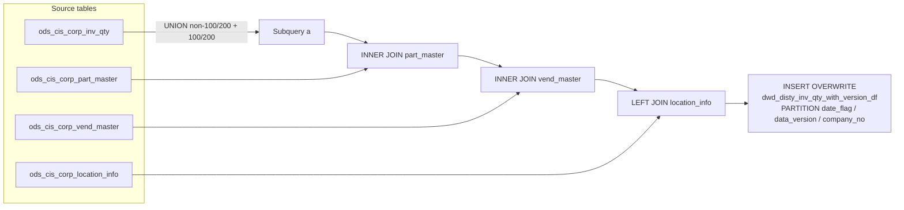

# DWD: Distributor Inventory Quantity with Version Snapshot (`dwd_disty_inv_qty_with_version_df`)

- artifact_type: etl_table
- artifact_id: ${literal_target_db}.dwd_disty_inv_qty_with_version_df
- domain: inventory
- one_line_purpose: This job loads a daily versioned snapshot of the raw CIS inventory quantity table (`ods_cis_corp_inv_qty`) into the DWD layer. Each execution produces a new `data_version` record, allowing multiple intra-day snapshots to coexist in the same...
- layer_type: DWD
- source_kind: etl_sql
- evidence_source: source/etl/sql/inventory/data_service/inventory/python/load_dw_inv_qty_with_version.py

---

## L1 Data Foundation

### Identity and physical mapping
- **Table:** `${literal_target_db}.dwd_disty_inv_qty_with_version_df`
- **Layer type:** DWD
- **Canonical / derived:** Derived / ETL-loaded (see L3)
- **Owner team:** not registered in metadata catalog

### Grain, scope, exclusions
- **Grain:** one row per `loc_no` + `inv_type` + `sku_no` per `date_flag` + `data_version` + `company_no` partition.
- **Scope:** See L2 business purpose / L3 filters
- **Partition:** `date_flag`, `data_version`, `company_no`. - resolved from pipeline (see L4)
- **Natural key:** `loc_no`, `inv_type`, `sku_no` (within a partition).
- **Exclusions:** Not documented in repository

#### Grain detail (preserved)

- **Grain:** one row per `loc_no` + `inv_type` + `sku_no` per `date_flag` + `data_version` + `company_no` partition.
- **Partition:** `date_flag`, `data_version`, `company_no`.
- **Natural key:** `loc_no`, `inv_type`, `sku_no` (within a partition).

---

### Cross-engine presence
| Engine | Present | Canonical FQN | Notes |
|--------|---------|---------------|-------|
| Hive | yes | `${literal_target_db}.dwd_disty_inv_qty_with_version_df` | ETL target / intermediate per evidence script |
| Vertica | pending | `${literal_target_db}.dwd_disty_inv_qty_with_version_df` | Confirm via hive2vertica flow evidence / MCP |

### Physical schema reference

Pointer block only - full column catalog lives in WKB L1 storage JSON.

| Field | Value |
|-------|-------|
| **Authoritative catalog** | WKB L1 storage seed (not duplicated in this file) |
| **entity_id** | `${literal_target_db}.dwd_disty_inv_qty_with_version_df` |
| **l1_catalog_seed** | `target/storage/wkb/snapshots/_snapshot_id_template/l1_catalog/{engine}_{schema}_{table}.json` |
| **column_count** | pending (run ddl_seed_writer) |
| **partition_keys** | `date_flag, data_version, company_no` |
| **ddl_source** | pending Bitbucket DDL / Vertica metadata ingest |
| **retrieval** | `python -m tools.wkb.indexing.run_query --query "inventory load_dw_inv_qty_with_version schema" --intent find_table_schema` |

### Lineage
| Object | Role |
|--------|------|
| `${literal_source_db}.ods_cis_corp_inv_qty` | Raw CIS inventory quantities |
| `${literal_source_db}.ods_cis_corp_part_master` | Part-to-vendor lookup |
| `${literal_source_db}.ods_cis_corp_vend_master` | Vendor-to-company lookup |
| `${source_db}.ods_cis_corp_location_info` | Location-to-company lookup |

---

### Freshness and load path
| Item | Value |
|------|-------|
| Load pattern | See L3 end-to-end / INSERT pattern in evidence script |
| Schedule | Not documented in repository |
| Parameters | `literal_target_db`, `literal_source_db` (`source_db`), `literal_date_flag`, `literal_data_version`, `etl_timestamp`, `literal_company_no` |


---

## L2 Declarative Knowledge

### Business purpose
This job loads a daily versioned snapshot of the raw CIS inventory quantity table
(`ods_cis_corp_inv_qty`) into the DWD layer. Each execution produces a new `data_version` record,
allowing multiple intra-day snapshots to coexist in the same partition. Downstream jobs
(`load_dw_inv_qty.py`) always consume the latest version, while the historical versions provide an
audit trail of how inventory quantities evolved within a day.

---

### Audience and use cases
| Audience | How they benefit |
|----------|-----------------|
| **`load_dw_inv_qty.py`** | Consumes the latest `data_version` of this table as its source for the final `dwd_disty_inv_qty_df` |
| **Data Engineering / Audit** | Multiple versions per `date_flag` provide intra-day inventory change history |

---

### Fact key resolution
- Natural key: `loc_no`, `inv_type`, `sku_no` (within a partition).
- FK / label-on attributes: see L3 dimension join patterns and step-by-step logic.
- Negative assertion: do not treat descriptive labels as grain keys unless listed under natural key.

### Time field semantics
- **date_flag / partition columns:** `date_flag`, `data_version`, `company_no`.
- Primary reporting filter should use the partition column(s) documented in L1; resolve values via L4.


### Metrics served

| Category | Column | Logical metric | Business reading |
|----------|--------|----------------|------------------|
| Measures | — | — | No measure columns mapped for this table. |

### Metric serving map

**Formula authority:** [`source/contracts/inventory/metric-index.md`](../../source/contracts/inventory/metric-index.md)

N/A — no measure columns mapped for this table.

### etl_metrics

No governed logical metrics from `source/contracts/inventory/metric-index.md` are mapped on this table.

---

### Metric serving map
N/A - not a `*_comb_mtd` / multi-period wide serving table (or map not present in legacy doc).


### Data products and column groups (preserved)

### Identifiers and relationships

- **Location / inventory:** `loc_no`, `inv_type`, `sku_no`
- **Partitioning:** `date_flag`, `data_version`, `company_no`

### Quantity building blocks

- `on_hand_qty`, `bo_qty`, `on_order_qty`, `alloc_qty`, `intran_out`, `intran_in`, `wip_qty` — core inventory position quantities
- `rio_qty`, `kwo_comp_rio_qty`, `kwo_oh_qty` — RIO and KWO-related quantity fields

### Cost building blocks

- `ave_cost`, `std_cost`, `u_version` — average and standard cost plus update version
- `ave_cost_fx`, `base_cost_fx`, `base_cost` — always `NULL` in this snapshot (populated downstream in `load_dw_inv_qty.py`)

---

### etl_metrics

#### `rio_qty`
- **Source:** [metric-index.md](../../source/contracts/inventory/metric-index.md#rio_qty)
- **Business definition:** Default to 0 if null
```sql
nvl(a.rio_qty, 0)
```

#### `company_no`
- **Source:** [metric-index.md](../../source/contracts/inventory/metric-index.md#company_no)
- **Business definition:** Location company takes precedence over vendor company
```sql
nvl(lo.company_no, d.company_no)
```


---

## L3 Procedural Knowledge

### Query and routing rules
**Business filters:** Use partition / date keys from L1 grain for reporting scope.
**Technical predicates (load only):** See Key filters and step-by-step logic below.

### Dimension join patterns
| Dimension FQN | Join keys | Purpose | Evidence |
|---------------|-----------|---------|----------|
| See step-by-step / base tables | See L3 steps | Dimension enrichment | `source/etl/sql/inventory/data_service/inventory/python/load_dw_inv_qty_with_version.py` |

### Key filters and ETL business logic
### Step 1 — Final `INSERT OVERWRITE` into `dwd_disty_inv_qty_with_version_df`

**From:** `ods_cis_corp_inv_qty` (UNION of two sets as subquery `a`)

**Set A filter:**
- `inv_type NOT IN (100, 200)`
- At least one quantity field non-zero: `abs(nvl(on_hand_qty,0)) + abs(nvl(bo_qty,0)) + abs(nvl(alloc_qty,0)) + abs(nvl(intran_in,0)) + abs(nvl(intran_out,0)) + abs(nvl(wip_qty,0)) + abs(nvl(on_order_qty,0)) + abs(nvl(rio_qty,0)) + abs(nvl(kwo_comp_rio_qty,0)) + abs(nvl(kwo_oh_qty,0)) > 0`

**Set B filter:**
- `inv_type IN (100, 200)`
- `alloc_qty != 0 OR on_order_qty != 0 OR on_hand_qty != 0`

**Join conditions:**
- INNER JOIN `ods_cis_corp_part_master c` ON `a.sku_no = c.sku_no`
- INNER JOIN `ods_cis_corp_vend_master d` ON `c.vend_no = d.vend_no`
- LEFT JOIN `ods_cis_corp_location_info lo` ON `a.loc_no = lo.loc_no AND lo.company_no >= 1`

**Pass-through columns:**
`loc_no`, `inv_type`, `sku_no`, `u_version`, `ave_cost`, `std_cost`, `on_hand_qty`, `bo_qty`, `on_order_qty`, `alloc_qty`, `intran_out`, `intran_in`, `entry_datetime`, `entry_id`, `wip_qty`, `rio_qty`, `kwo_comp_rio_qty`, `kwo_oh_qty`

**Derived columns computed at INSERT:**

| Column | Formula | Plain language |
|--------|---------|----------------|
| ETL timestamp | `'${etl_timestamp}'` | ETL run timestamp |
| `ave_cost_fx` | `NULL` | Not populated at this stage |
| `base_cost_fx` | `NULL` | Not populated at this stage |
| `base_cost` | `NULL` | Not populated at this stage |
| `rio_qty` | `nvl(a.rio_qty, 0)` | Defaul...

### Standard time-filter SQL
```sql
-- relative period filter using resolved partition value (see L4)
SELECT *
FROM ${literal_target_db}.dwd_disty_inv_qty_with_version_df
WHERE /* partition predicate */ date_flag = '${partition_value}';
```

### End-to-end flow
**Runtime parameters:** `literal_target_db`, `literal_source_db`, `literal_date_flag`, `literal_data_version`, `etl_timestamp`, `literal_company_no`
**Target table:** `${literal_target_db}.dwd_disty_inv_qty_with_version_df`, partitioned by **`date_flag`**, **`data_version`**, **`company_no`**.

1. Read `ods_cis_corp_inv_qty`:
   - **Set A:** inv_type NOT IN (100, 200) with any non-zero quantity field.
   - **Set B:** inv_type IN (100, 200) with non-zero `alloc_qty`, `on_order_qty`, or `on_hand_qty`.
   - UNION both sets as subquery `a`.
2. JOIN `a` with `ods_cis_corp_part_master` on `sku_no`, then `ods_cis_corp_vend_master` on `vend_no`, and LEFT JOIN `ods_cis_corp_location_info` on `loc_no` (only rows with `company_no >= 1`).
3. Apply `company_no` filter via `company_no_condition_1`.
4. **INSERT OVERWRITE** into target with `company_no = nvl(lo.company_no, d.company_no)` — location's company takes precedence over vendor's.



---


#### High-level stages (preserved)

| Stage | Business meaning |
|-------|-----------------|
| **Read non-special inv_types** | Reads all inventory lines with non-zero quantities (any field), excluding inv_types 100 and 200 |
| **Read special inv_types 100/200** | Reads only lines with non-zero `alloc_qty`, `on_order_qty`, or `on_hand_qty` for inv_types 100 (intercompany) and 200 |
| **Company resolution** | Joins with part/vendor masters and location info to resolve `company_no` — prefers the location's company over the vendor's |
| **INSERT with version** | Writes the snapshot with `data_version = ${literal_data_version}` and `date_flag = ${literal_date_flag}` |

**Parameters:** `literal_target_db`, `literal_source_db` (`source_db`), `literal_date_flag`, `literal_data_version`, `etl_timestamp`, `literal_company_no`

---


### Base tables register
| Object | Role in this job |
|--------|-----------------|
| `${literal_source_db}.ods_cis_corp_inv_qty` | Primary source — raw CIS inventory quantities |
| `${literal_source_db}.ods_cis_corp_part_master` | SKU-to-vendor mapping for company resolution |
| `${literal_source_db}.ods_cis_corp_vend_master` | Vendor-to-company mapping (`company_no`) |
| `${source_db}.ods_cis_corp_location_info` | Location-to-company mapping; takes precedence if `company_no >= 1` |

**Temporary tables (inside the job only):**
None — single direct INSERT.

---

### Step-by-step logic
### Step 1 — Final `INSERT OVERWRITE` into `dwd_disty_inv_qty_with_version_df`

**From:** `ods_cis_corp_inv_qty` (UNION of two sets as subquery `a`)

**Set A filter:**
- `inv_type NOT IN (100, 200)`
- At least one quantity field non-zero: `abs(nvl(on_hand_qty,0)) + abs(nvl(bo_qty,0)) + abs(nvl(alloc_qty,0)) + abs(nvl(intran_in,0)) + abs(nvl(intran_out,0)) + abs(nvl(wip_qty,0)) + abs(nvl(on_order_qty,0)) + abs(nvl(rio_qty,0)) + abs(nvl(kwo_comp_rio_qty,0)) + abs(nvl(kwo_oh_qty,0)) > 0`

**Set B filter:**
- `inv_type IN (100, 200)`
- `alloc_qty != 0 OR on_order_qty != 0 OR on_hand_qty != 0`

**Join conditions:**
- INNER JOIN `ods_cis_corp_part_master c` ON `a.sku_no = c.sku_no`
- INNER JOIN `ods_cis_corp_vend_master d` ON `c.vend_no = d.vend_no`
- LEFT JOIN `ods_cis_corp_location_info lo` ON `a.loc_no = lo.loc_no AND lo.company_no >= 1`

**Pass-through columns:**
`loc_no`, `inv_type`, `sku_no`, `u_version`, `ave_cost`, `std_cost`, `on_hand_qty`, `bo_qty`, `on_order_qty`, `alloc_qty`, `intran_out`, `intran_in`, `entry_datetime`, `entry_id`, `wip_qty`, `rio_qty`, `kwo_comp_rio_qty`, `kwo_oh_qty`

**Derived columns computed at INSERT:**

| Column | Formula | Plain language |
|--------|---------|----------------|
| ETL timestamp | `'${etl_timestamp}'` | ETL run timestamp |
| `ave_cost_fx` | `NULL` | Not populated at this stage |
| `base_cost_fx` | `NULL` | Not populated at this stage |
| `base_cost` | `NULL` | Not populated at this stage |
| `rio_qty` | `nvl(a.rio_qty, 0)` | Default to 0 if null |
| `date_flag` | `to_date('${literal_date_flag}')` | Business date |
| `data_version` | `${literal_data_version}` | Snapshot version number for this date |
| `company_no` | `nvl(lo.company_no, d.company_no)` | Location company takes precedence over vendor company |

---

### Relationship map (embedded)

| from_fqn | to_fqn | cardinality | join_keys | provenance |
|----------|--------|-------------|-----------|------------|
| `a` | `${literal_source_db}.ods_cis_corp_part_master` | many:1 | `a.sku_no` = `c.sku_no` | etl_sql (`source/etl/sql/inventory/data_service/inventory/python/load_dw_inv_qty_with_version.py:73`) |
| `${literal_source_db}.ods_cis_corp_part_master` | `${literal_source_db}.ods_cis_corp_vend_master` | many:1 | `c.vend_no` = `d.vend_no` | etl_sql (`source/etl/sql/inventory/data_service/inventory/python/load_dw_inv_qty_with_version.py:75`) |
| `a` | `${source_db}.ods_cis_corp_location_info` | many:1 (LEFT) | `a.loc_no` = `lo.loc_no` | etl_sql (`source/etl/sql/inventory/data_service/inventory/python/load_dw_inv_qty_with_version.py:77`) |

### Special logic (embedded)

Not documented in repository

### Column / field derivations (from ETL SQL)

| target_column | expression_sql | upstream_columns | upstream_tables | transform_kind | evidence |
|---------------|----------------|------------------|-----------------|----------------|----------|
| `loc_no` | `a.loc_no` | `loc_no` | `${literal_source_db}.ods_cis_corp_inv_qty`, `${literal_source_db}.ods_cis_corp_part_master`, `${literal_source_db}.ods_cis_corp_vend_master`, `${source_db}.ods_cis_corp_location_info` | passthrough | `source/etl/sql/inventory/data_service/inventory/python/load_dw_inv_qty_with_version.py:13` |
| `inv_type` | `a.inv_type` | `inv_type` | `${literal_source_db}.ods_cis_corp_inv_qty`, `${literal_source_db}.ods_cis_corp_part_master`, `${literal_source_db}.ods_cis_corp_vend_master`, `${source_db}.ods_cis_corp_location_info` | passthrough | `source/etl/sql/inventory/data_service/inventory/python/load_dw_inv_qty_with_version.py:14` |
| `sku_no` | `a.sku_no` | `sku_no` | `${literal_source_db}.ods_cis_corp_inv_qty`, `${literal_source_db}.ods_cis_corp_part_master`, `${literal_source_db}.ods_cis_corp_vend_master`, `${source_db}.ods_cis_corp_location_info` | passthrough | `source/etl/sql/inventory/data_service/inventory/python/load_dw_inv_qty_with_version.py:15` |
| `u_version` | `a.u_version` | `u_version` | `${literal_source_db}.ods_cis_corp_inv_qty`, `${literal_source_db}.ods_cis_corp_part_master`, `${literal_source_db}.ods_cis_corp_vend_master`, `${source_db}.ods_cis_corp_location_info` | passthrough | `source/etl/sql/inventory/data_service/inventory/python/load_dw_inv_qty_with_version.py:16` |
| `ave_cost` | `a.ave_cost` | `ave_cost` | `${literal_source_db}.ods_cis_corp_inv_qty`, `${literal_source_db}.ods_cis_corp_part_master`, `${literal_source_db}.ods_cis_corp_vend_master`, `${source_db}.ods_cis_corp_location_info` | passthrough | `source/etl/sql/inventory/data_service/inventory/python/load_dw_inv_qty_with_version.py:17` |
| `std_cost` | `a.std_cost` | `std_cost` | `${literal_source_db}.ods_cis_corp_inv_qty`, `${literal_source_db}.ods_cis_corp_part_master`, `${literal_source_db}.ods_cis_corp_vend_master`, `${source_db}.ods_cis_corp_location_info` | passthrough | `source/etl/sql/inventory/data_service/inventory/python/load_dw_inv_qty_with_version.py:18` |
| `on_hand_qty` | `a.on_hand_qty` | `on_hand_qty` | `${literal_source_db}.ods_cis_corp_inv_qty`, `${literal_source_db}.ods_cis_corp_part_master`, `${literal_source_db}.ods_cis_corp_vend_master`, `${source_db}.ods_cis_corp_location_info` | passthrough | `source/etl/sql/inventory/data_service/inventory/python/load_dw_inv_qty_with_version.py:19` |
| `bo_qty` | `a.bo_qty` | `bo_qty` | `${literal_source_db}.ods_cis_corp_inv_qty`, `${literal_source_db}.ods_cis_corp_part_master`, `${literal_source_db}.ods_cis_corp_vend_master`, `${source_db}.ods_cis_corp_location_info` | passthrough | `source/etl/sql/inventory/data_service/inventory/python/load_dw_inv_qty_with_version.py:20` |
| `on_order_qty` | `a.on_order_qty` | `on_order_qty` | `${literal_source_db}.ods_cis_corp_inv_qty`, `${literal_source_db}.ods_cis_corp_part_master`, `${literal_source_db}.ods_cis_corp_vend_master`, `${source_db}.ods_cis_corp_location_info` | passthrough | `source/etl/sql/inventory/data_service/inventory/python/load_dw_inv_qty_with_version.py:21` |
| `alloc_qty` | `a.alloc_qty` | `alloc_qty` | `${literal_source_db}.ods_cis_corp_inv_qty`, `${literal_source_db}.ods_cis_corp_part_master`, `${literal_source_db}.ods_cis_corp_vend_master`, `${source_db}.ods_cis_corp_location_info` | passthrough | `source/etl/sql/inventory/data_service/inventory/python/load_dw_inv_qty_with_version.py:22` |
| `intran_out` | `a.intran_out` | `intran_out` | `${literal_source_db}.ods_cis_corp_inv_qty`, `${literal_source_db}.ods_cis_corp_part_master`, `${literal_source_db}.ods_cis_corp_vend_master`, `${source_db}.ods_cis_corp_location_info` | passthrough | `source/etl/sql/inventory/data_service/inventory/python/load_dw_inv_qty_with_version.py:23` |
| `intran_in` | `a.intran_in` | `intran_in` | `${literal_source_db}.ods_cis_corp_inv_qty`, `${literal_source_db}.ods_cis_corp_part_master`, `${literal_source_db}.ods_cis_corp_vend_master`, `${source_db}.ods_cis_corp_location_info` | passthrough | `source/etl/sql/inventory/data_service/inventory/python/load_dw_inv_qty_with_version.py:24` |
| `entry_datetime` | `a.entry_datetime` | `entry_datetime` | `${literal_source_db}.ods_cis_corp_inv_qty`, `${literal_source_db}.ods_cis_corp_part_master`, `${literal_source_db}.ods_cis_corp_vend_master`, `${source_db}.ods_cis_corp_location_info` | passthrough | `source/etl/sql/inventory/data_service/inventory/python/load_dw_inv_qty_with_version.py:25` |
| `entry_id` | `a.entry_id` | `entry_id` | `${literal_source_db}.ods_cis_corp_inv_qty`, `${literal_source_db}.ods_cis_corp_part_master`, `${literal_source_db}.ods_cis_corp_vend_master`, `${source_db}.ods_cis_corp_location_info` | passthrough | `source/etl/sql/inventory/data_service/inventory/python/load_dw_inv_qty_with_version.py:26` |
| `wip_qty` | `a.wip_qty` | `wip_qty` | `${literal_source_db}.ods_cis_corp_inv_qty`, `${literal_source_db}.ods_cis_corp_part_master`, `${literal_source_db}.ods_cis_corp_vend_master`, `${source_db}.ods_cis_corp_location_info` | passthrough | `source/etl/sql/inventory/data_service/inventory/python/load_dw_inv_qty_with_version.py:27` |
| `etl_timestamp` | `'${etl_timestamp}'` | `etl_timestamp` | `${literal_source_db}.ods_cis_corp_inv_qty`, `${literal_source_db}.ods_cis_corp_part_master`, `${literal_source_db}.ods_cis_corp_vend_master`, `${source_db}.ods_cis_corp_location_info` | literal | `source/etl/sql/inventory/data_service/inventory/python/load_dw_inv_qty_with_version.py:28` |
| `ave_cost_fx` | `NULL` | — | `${literal_source_db}.ods_cis_corp_inv_qty`, `${literal_source_db}.ods_cis_corp_part_master`, `${literal_source_db}.ods_cis_corp_vend_master`, `${source_db}.ods_cis_corp_location_info` | rename | `source/etl/sql/inventory/data_service/inventory/python/load_dw_inv_qty_with_version.py:6` |
| `base_cost_fx` | `NULL` | — | `${literal_source_db}.ods_cis_corp_inv_qty`, `${literal_source_db}.ods_cis_corp_part_master`, `${literal_source_db}.ods_cis_corp_vend_master`, `${source_db}.ods_cis_corp_location_info` | rename | `source/etl/sql/inventory/data_service/inventory/python/load_dw_inv_qty_with_version.py:6` |
| `base_cost` | `NULL` | — | `${literal_source_db}.ods_cis_corp_inv_qty`, `${literal_source_db}.ods_cis_corp_part_master`, `${literal_source_db}.ods_cis_corp_vend_master`, `${source_db}.ods_cis_corp_location_info` | rename | `source/etl/sql/inventory/data_service/inventory/python/load_dw_inv_qty_with_version.py:6` |
| `0` | `nvl(a.rio_qty,0)` | `rio_qty` | `${literal_source_db}.ods_cis_corp_inv_qty`, `${literal_source_db}.ods_cis_corp_part_master`, `${literal_source_db}.ods_cis_corp_vend_master`, `${source_db}.ods_cis_corp_location_info` | coalesce | `source/etl/sql/inventory/data_service/inventory/python/load_dw_inv_qty_with_version.py:32` |
| `kwo_comp_rio_qty` | `a.kwo_comp_rio_qty` | `kwo_comp_rio_qty` | `${literal_source_db}.ods_cis_corp_inv_qty`, `${literal_source_db}.ods_cis_corp_part_master`, `${literal_source_db}.ods_cis_corp_vend_master`, `${source_db}.ods_cis_corp_location_info` | passthrough | `source/etl/sql/inventory/data_service/inventory/python/load_dw_inv_qty_with_version.py:33` |
| `kwo_oh_qty` | `a.kwo_oh_qty` | `kwo_oh_qty` | `${literal_source_db}.ods_cis_corp_inv_qty`, `${literal_source_db}.ods_cis_corp_part_master`, `${literal_source_db}.ods_cis_corp_vend_master`, `${source_db}.ods_cis_corp_location_info` | passthrough | `source/etl/sql/inventory/data_service/inventory/python/load_dw_inv_qty_with_version.py:34` |
| `literal_date_flag` | `to_date('${literal_date_flag}')` | `literal_date_flag` | `${literal_source_db}.ods_cis_corp_inv_qty`, `${literal_source_db}.ods_cis_corp_part_master`, `${literal_source_db}.ods_cis_corp_vend_master`, `${source_db}.ods_cis_corp_location_info` | udf | `source/etl/sql/inventory/data_service/inventory/python/load_dw_inv_qty_with_version.py:35` |
| `literal_data_version` | `${literal_data_version}` | `literal_data_version` | `${literal_source_db}.ods_cis_corp_inv_qty`, `${literal_source_db}.ods_cis_corp_part_master`, `${literal_source_db}.ods_cis_corp_vend_master`, `${source_db}.ods_cis_corp_location_info` | partial | `source/etl/sql/inventory/data_service/inventory/python/load_dw_inv_qty_with_version.py:36` |
| `company_no` | `nvl(lo.company_no,d.company_no)` | `company_no` | `${literal_source_db}.ods_cis_corp_inv_qty`, `${literal_source_db}.ods_cis_corp_part_master`, `${literal_source_db}.ods_cis_corp_vend_master`, `${source_db}.ods_cis_corp_location_info` | coalesce | `source/etl/sql/inventory/data_service/inventory/python/load_dw_inv_qty_with_version.py:37` |

### Sentinel and code values
| Value | Meaning |
|-------|---------|
| `lo.company_no >= 1` in LEFT JOIN | Only use location company if it has a valid positive value |
| `NULL AS ave_cost_fx`, `NULL AS base_cost_fx`, `NULL AS base_cost` | These are computed in the downstream `load_dw_inv_qty.py` job |

---

---

## L4 Validation

### Resolved partition value
| Step | Source | How partition / date scope is determined |
|------|--------|------------------------------------------|
| 1 | evidence script / flow | See parameters in L1 Freshness and L3 filters - `source/etl/sql/inventory/data_service/inventory/python/load_dw_inv_qty_with_version.py` |

**Plain language:** Partition and date scope follow Azkaban/bootstrap parameters documented in the source script and orchestrating flow; do not hardcode calendar literals.

### Data quality checks
- Prefer row-count-by-partition, metric sums, and grain duplicate checks (see Validation SQL).
- Additional checks from legacy caveats / operational notes when present.

### Validation SQL
```sql
-- 1) row count by partition
-- SELECT partition_col, COUNT(*) FROM ${literal_target_db}.dwd_disty_inv_qty_with_version_df WHERE partition_col = '${partition_value}' GROUP BY 1;
-- 2) metric sum by dimension (top N) - replace metric/dim from L2
-- 3) grain duplicate check on natural keys
```


### Caveats for interpretation
- `base_cost`, `ave_cost_fx`, `base_cost_fx` are always `NULL` in this table; they are resolved in `load_dw_inv_qty.py`.
- Multiple `data_version` values can coexist for the same `date_flag` if the job runs multiple times intra-day. Only the max version is consumed downstream.
- Company resolution logic: location's `company_no` takes priority if `lo.company_no >= 1`; otherwise vendor's `company_no` is used.

---

### Conflicts and open questions
- Schedule, owner, SLA: Not documented in repository (unless preserved schedule evidence above).
- Vertica MCP verification: pending unless confirmed in L5.


---

## L5 Runtime View

### Query path and engine preference
| Role | Hive object | Vertica object | Sync mode | Evidence | MCP verified |
|------|-------------|----------------|-----------|----------|--------------|
| **Not in Vertica** | *See script lineage* | *No Vertica mapping identified in repository* | - | *Add flow evidence when found* | no |

No queryable Vertica table has been confirmed for this script from current repository evidence.

### Access constraints
- Country / company schema parameters may apply (`literal_country`, `company_no`, etc.).
- Hive-only staging objects are not reporting surfaces unless synced.

### Query risk profile
| Field | Value |
|-------|-------|
| requires_date_predicate | yes |
| scan_risk_tier | high |

---

## L6 Access and Consumption

### Primary consumers and use cases
| Audience | How they benefit |
|----------|-----------------|
| **`load_dw_inv_qty.py`** | Consumes the latest `data_version` of this table as its source for the final `dwd_disty_inv_qty_df` |
| **Data Engineering / Audit** | Multiple versions per `date_flag` provide intra-day inventory change history |

---

### Representative query patterns
```sql
-- certified / illustrative lookup - replace predicates from L1/L4
SELECT *
FROM ${literal_target_db}.dwd_disty_inv_qty_with_version_df
WHERE date_flag = '${partition_value}'
LIMIT 100;
```

### Dependencies and notes
### Upstream objects (verified)

| Object | Usage | Evidence |
|--------|-------|----------|
| `ods_cis_corp_inv_qty` | Primary inventory source | `source/etl/sql/inventory/data_service/inventory/python/load_dw_inv_qty_with_version.py:58` |
| `ods_cis_corp_part_master` | SKU-to-vendor mapping | `source/etl/sql/inventory/data_service/inventory/python/load_dw_inv_qty_with_version.py:84` |
| `ods_cis_corp_vend_master` | Vendor-to-company mapping | `source/etl/sql/inventory/data_service/inventory/python/load_dw_inv_qty_with_version.py:86` |
| `ods_cis_corp_location_info` | Location-to-company mapping | `source/etl/sql/inventory/data_service/inventory/python/load_dw_inv_qty_with_version.py:88` |

### Downstream consumers (verified)

| Object / script | Evidence |
|-----------------|----------|
| `load_dw_inv_qty.py` — reads `dwd_disty_inv_qty_with_version_df` at max `data_version` | `source/etl/sql/inventory/data_service/inventory/python/load_dw_inv_qty.py:22` |

### Operational detail (verified)

- Full overwrite per `date_flag` + `data_version` + `company_no` partition: `load_dw_inv_qty_with_version.py:12`

### Not documented in repository

- Schedule, owner, SLA — not in scripts or configs
- How `literal_data_version` is incremented between runs

---

*Document generated from `source/etl/sql/inventory/data_service/inventory/python/load_dw_inv_qty_with_version.py`.*

#### Not documented in repository
- Owner, SLA (unless schedule evidence preserved above)
- Any dependency without `file:line` evidence in this document

---

*Document migrated to L1-L6 from legacy Knowledgebase content. Evidence: `source/etl/sql/inventory/data_service/inventory/python/load_dw_inv_qty_with_version.py`.*
