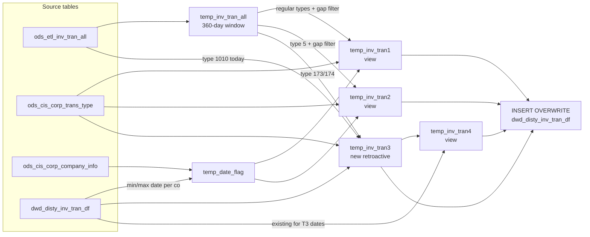

# DWD: Distributor Inventory Transactions (`dwd_disty_inv_tran_df`)

- artifact_type: etl_table
- artifact_id: ${literal_target_db}.dwd_disty_inv_tran_df
- domain: inventory
- one_line_purpose: This job maintains the rolling 360-day inventory transaction history used for aging analysis. It reads from the live Synnex ETL inventory transaction source (`ods_etl_inv_tran_all`), applies transaction-type and inventory-type filters, and ...
- layer_type: DWD
- source_kind: etl_sql
- evidence_source: source/etl/sql/inventory/data_service/inventory/python/load_dw_inv_tran.py

---

## L1 Data Foundation

### Identity and physical mapping
- **Table:** `${literal_target_db}.dwd_disty_inv_tran_df`
- **Layer type:** DWD
- **Canonical / derived:** Derived / ETL-loaded (see L3)
- **Owner team:** not registered in metadata catalog

### Grain, scope, exclusions
- **Grain:** one row per `odometer` + `entry_id` per `date_flag` + `company_no` partition (effectively one unique transaction event).
- **Scope:** See L2 business purpose / L3 filters
- **Partition:** `date_flag`, `company_no`. - resolved from pipeline (see L4)
- **Natural key:** `odometer`, `entry_id` (within a partition).
- **Exclusions:** Not documented in repository

#### Grain detail (preserved)

- **Grain:** one row per `odometer` + `entry_id` per `date_flag` + `company_no` partition (effectively one unique transaction event).
- **Partition:** `date_flag`, `company_no`.
- **Natural key:** `odometer`, `entry_id` (within a partition).

---

### Cross-engine presence
| Engine | Present | Canonical FQN | Notes |
|--------|---------|---------------|-------|
| Hive | yes | `${literal_target_db}.dwd_disty_inv_tran_df` | ETL target / intermediate per evidence script |
| Vertica | pending | `${literal_target_db}.dwd_disty_inv_tran_df` | Confirm via hive2vertica flow evidence / MCP |

### Physical schema reference

Pointer block only - full column catalog lives in WKB L1 storage JSON.

| Field | Value |
|-------|-------|
| **Authoritative catalog** | WKB L1 storage seed (not duplicated in this file) |
| **entity_id** | `${literal_target_db}.dwd_disty_inv_tran_df` |
| **l1_catalog_seed** | `target/storage/wkb/snapshots/_snapshot_id_template/l1_catalog/{engine}_{schema}_{table}.json` |
| **column_count** | pending (run ddl_seed_writer) |
| **partition_keys** | `date_flag, company_no` |
| **ddl_source** | pending Bitbucket DDL / Vertica metadata ingest |
| **retrieval** | `python -m tools.wkb.indexing.run_query --query "inventory load_dw_inv_tran schema" --intent find_table_schema` |

### Lineage
| Object | Role |
|--------|------|
| `${literal_target_db}.dwd_disty_inv_tran_df` | Target and date-gap / retroactive preservation source |
| `${literal_source_db}.ods_etl_inv_tran_all` | Live transaction source |
| `${literal_source_db}.ods_cis_corp_trans_type` | `col2_factor` direction multiplier |
| `${literal_source_db}.ods_cis_corp_company_info` | Company seed for new companies |
| `${literal_source_db}.ods_cis_corp_location_info` | Company filtering in tran1/tran2 |

---

### Freshness and load path
| Item | Value |
|------|-------|
| Load pattern | See L3 end-to-end / INSERT pattern in evidence script |
| Schedule | Not documented in repository |
| Parameters | `literal_target_db`, `literal_source_db`, `literal_date_flag`, `etl_timestamp`, `literal_company_no` |


---

## L2 Declarative Knowledge

### Business purpose
This job maintains the rolling 360-day inventory transaction history used for aging analysis.
It reads from the live Synnex ETL inventory transaction source (`ods_etl_inv_tran_all`), applies
transaction-type and inventory-type filters, and appends only the gap dates not yet present in the
target. It also handles two special transaction types (1010 and 173/174) that can arrive
retroactively, preserving existing records for those types while adding newly discovered ones.
The result is the foundation for computing quantity age bands in `load_dw_inv_aging_temp.py`.

---

### Audience and use cases
| Audience | How they benefit |
|----------|-----------------|
| **`load_dw_inv_aging_temp.py`** | Reads this table to compute quantity age buckets (1–30 days through 360+ days) |
| **`reload_dw_inv_tran.py`** | History-reload variant of this job uses same logic but from history tables |
| **Data Engineering** | Provides an audit-safe rolling window of inventory movements |

---

### Fact key resolution
- Natural key: `odometer`, `entry_id` (within a partition).
- FK / label-on attributes: see L3 dimension join patterns and step-by-step logic.
- Negative assertion: do not treat descriptive labels as grain keys unless listed under natural key.

### Time field semantics
- **date_flag / partition columns:** `date_flag`, `company_no`.
- Primary reporting filter should use the partition column(s) documented in L1; resolve values via L4.


### Metrics served

| Category | Column | Logical metric | Business reading |
|----------|--------|----------------|------------------|
| Measures | — | — | No measure columns mapped for this table. |

### Metric serving map

**Formula authority:** [`source/contracts/inventory/metric-index.md`](../../source/contracts/inventory/metric-index.md)

N/A — no measure columns mapped for this table.

### etl_metrics

No governed logical metrics from `source/contracts/inventory/metric-index.md` are mapped on this table.

---

### Metric serving map
N/A - not a `*_comb_mtd` / multi-period wide serving table (or map not present in legacy doc).


### Data products and column groups (preserved)

### Identifiers and relationships

- **Transaction:** `odometer`, `entry_id`, `trans_type`
- **Location / inventory:** `loc_no`, `inv_type`, `sku_no`
- **Partitioning:** `date_flag` (= `TO_DATE(doc_date)`), `company_no`

### Dimension columns

- `u_version` — always `NULL` in this job
- `doc_date` — the business date of the transaction (may differ from `date_flag`)
- `trans_type` — transaction type code

### Quantity building blocks

- `trans_qty` — transaction quantity (positive = receipt/inbound, negative = shipment/outbound depending on `col2_factor`)

---

### etl_metrics

N/A - no calculable ETL formulas extracted from this document (passthrough / stored measures only, or formulas not documented).

---

## L3 Procedural Knowledge

### Query and routing rules
**Business filters:** Use partition / date keys from L1 grain for reporting scope.
**Technical predicates (load only):** See Key filters and step-by-step logic below.

### Dimension join patterns
| Dimension FQN | Join keys | Purpose | Evidence |
|---------------|-----------|---------|----------|
| See step-by-step / base tables | See L3 steps | Dimension enrichment | `source/etl/sql/inventory/data_service/inventory/python/load_dw_inv_tran.py` |

### Key filters and ETL business logic
### Step 1 — `temp_date_flag`

**Source:** `${literal_target_db}.dwd_disty_inv_tran_df` + `${literal_source_db}.ods_cis_corp_company_info`

Builds min/max `date_flag` per company from existing target records. For companies not yet in the target, uses `literal_date_flag` as both min and max (the UNION with `ods_cis_corp_company_info`).

---

### Step 2 — `temp_inv_tran_all`

**Source:** `${literal_source_db}.ods_etl_inv_tran_all`

**Filter:**
- `doc_date >= date_add('${literal_date_flag}', 1 - 360) AND doc_date < date_add('${literal_date_flag}', 1)`
- `company_no_condition_1`
- `trans_type IN (4, 47, 85, 92, 116, 119, 148, 150, 154, 182, 201, 249, 499, 165, 166, 270, 9, 13, 141, 9194, 9196, 703, 5, 173, 174)`

---

### Step 3 — `temp_inv_tran1` (regular trans_types, gap dates only)

**Source:** `temp_inv_tran_all` INNER JOIN `ods_cis_corp_trans_type` ON `trans_type`, INNER JOIN `temp_date_flag` ON `company_no`.

**Filter:**
- `trans_qty × col2_factor > 0` — keep only quantity-positive movements per the transaction direction rule.
- Trans_type / inv_type combination rules:
  - Regular types `(4, 47, 85, 92, 116, 119, 148, 150, 154, 182, 201, 249, 499, 165, 166, 270)` — any inv_type except (10, 100, 200).
  - Types `(9, 13, 141)` — only inv_type IN (90, 97, 98, 99).
  - Type `13` — also inv_type IN (11, 12).
  - Types `(9194, 9196)` — only inv_type IN (2, 500).
  - Type `703` — only inv_type = 9.
- **Gap date filter:** `doc_date < d.min_date_flag OR doc_date >= d.max_date_flag +...

### Standard time-filter SQL
```sql
-- relative period filter using resolved partition value (see L4)
SELECT *
FROM ${literal_target_db}.dwd_disty_inv_tran_df
WHERE /* partition predicate */ date_flag = '${partition_value}';
```

### End-to-end flow
**Runtime parameters:** `literal_target_db`, `literal_source_db`, `literal_date_flag`, `etl_timestamp`, `literal_company_no`
**Target table:** `${literal_target_db}.dwd_disty_inv_tran_df`, partitioned by **`date_flag`**, **`company_no`**.

1. Build `temp_date_flag`: for each company, get min/max existing `date_flag` from `dwd_disty_inv_tran_df`; for new companies, default to `date_flag`.
2. Build `temp_inv_tran_all`: read `ods_etl_inv_tran_all` for the 360-day window and the allowed `trans_type` list.
3. Build `temp_inv_tran1` (view): regular trans_types filtered to gap dates only, with `trans_qty × col2_factor > 0` check; applies inv_type/trans_type combination rules.
4. Build `temp_inv_tran2` (view): trans_type 5 for gap dates only, with `trans_qty × col2_factor` applied.
5. Build `temp_inv_tran3`: retroactive 1010 (entry_datetime = today) and 173/174 records not already in target.
6. Build `temp_inv_tran4` (view): existing target records whose `date_flag` overlaps with `temp_inv_tran3` dates, plus existing 1010/173/174 records for `date_flag` (safety re-include).
7. **INSERT OVERWRITE** UNION of `temp_inv_tran1 + temp_inv_tran2 + temp_inv_tran3 + temp_inv_tran4`.



---


#### High-level stages (preserved)

| Stage | Business meaning |
|-------|-----------------|
| **Date-gap detection** | Determines which dates in the rolling 360-day window are not yet in the target, per company |
| **Load regular transactions** | Reads qualifying transaction types for the gap dates only |
| **Load type-5 transactions** | Trans_type 5 is handled separately with `col2_factor` applied to the quantity |
| **Load retroactive transactions** | Trans_type 1010 (snapshot) and 173/174 (adjustments) can arrive after the fact; only new records not already in the target are appended |
| **Preserve existing retroactive records** | Existing 1010/173/174 records in the target are re-included to prevent overwrite loss |
| **INSERT OVERWRITE** | Writes the UNION of all four transaction streams to `dwd_disty_inv_tran_df` |

**Parameters:** `literal_target_db`, `literal_source_db`, `literal_date_flag`, `etl_timestamp`, `literal_company_no`

---


### Base tables register
| Object | Role in this job |
|--------|-----------------|
| `${literal_target_db}.dwd_disty_inv_tran_df` | Target and source for date-gap detection and retroactive record preservation |
| `${literal_source_db}.ods_etl_inv_tran_all` | Live transaction source — all qualifying transactions in 360-day window; also used for 1010 retroactive lookup |
| `${literal_source_db}.ods_cis_corp_trans_type` | `col2_factor` — transaction direction multiplier |
| `${literal_source_db}.ods_cis_corp_company_info` | Company list — seed for new companies with no existing records |
| `${literal_source_db}.ods_cis_corp_location_info` | Used in `temp_inv_tran1`/`temp_inv_tran2` for company filtering |

**Temporary tables (inside the job only):**
`temp_date_flag` → `temp_inv_tran_all` → `temp_inv_tran1` (view) → `temp_inv_tran2` (view) → `temp_inv_tran3` → `temp_inv_tran4` (view) → (final `INSERT`)

---

### Step-by-step logic
### Step 1 — `temp_date_flag`

**Source:** `${literal_target_db}.dwd_disty_inv_tran_df` + `${literal_source_db}.ods_cis_corp_company_info`

Builds min/max `date_flag` per company from existing target records. For companies not yet in the target, uses `literal_date_flag` as both min and max (the UNION with `ods_cis_corp_company_info`).

---

### Step 2 — `temp_inv_tran_all`

**Source:** `${literal_source_db}.ods_etl_inv_tran_all`

**Filter:**
- `doc_date >= date_add('${literal_date_flag}', 1 - 360) AND doc_date < date_add('${literal_date_flag}', 1)`
- `company_no_condition_1`
- `trans_type IN (4, 47, 85, 92, 116, 119, 148, 150, 154, 182, 201, 249, 499, 165, 166, 270, 9, 13, 141, 9194, 9196, 703, 5, 173, 174)`

---

### Step 3 — `temp_inv_tran1` (regular trans_types, gap dates only)

**Source:** `temp_inv_tran_all` INNER JOIN `ods_cis_corp_trans_type` ON `trans_type`, INNER JOIN `temp_date_flag` ON `company_no`.

**Filter:**
- `trans_qty × col2_factor > 0` — keep only quantity-positive movements per the transaction direction rule.
- Trans_type / inv_type combination rules:
  - Regular types `(4, 47, 85, 92, 116, 119, 148, 150, 154, 182, 201, 249, 499, 165, 166, 270)` — any inv_type except (10, 100, 200).
  - Types `(9, 13, 141)` — only inv_type IN (90, 97, 98, 99).
  - Type `13` — also inv_type IN (11, 12).
  - Types `(9194, 9196)` — only inv_type IN (2, 500).
  - Type `703` — only inv_type = 9.
- **Gap date filter:** `doc_date < d.min_date_flag OR doc_date >= d.max_date_flag + 1` — only load dates not already covered.

---

### Step 4 — `temp_inv_tran2` (trans_type 5, gap dates only)

Same source and gap filter as step 3, but `trans_type = 5` only, and applies `trans_qty × col2_factor` to adjust the sign/magnitude.

---

### Step 5 — `temp_inv_tran3` (retroactive 1010 and 173/174)

Two sets UNIONed:
- **1010 records:** from `ods_etl_inv_tran_all` WHERE `trans_type = 1010 AND entry_datetime >= '${date_flag}' AND entry_datetime < date_add('${date_flag}', 1) AND doc_date < date_add('${date_flag}', 1)` — snapshot records posted today; only those NOT already in `dwd_disty_inv_tran_df` (checked on `odometer`, `entry_id`, `date_flag`).
- **173/174 records:** from `temp_inv_tran_all` WHERE `trans_type IN (173, 174) AND trans_qty × col2_factor > 0 AND inv_type NOT IN (10, 100, 200)` — only those NOT already in target.

---

### Step 6 — `temp_inv_tran4` (existing records to preserve)

Reads `dwd_disty_inv_tran_df` for:
- Any `date_flag` that appears in `temp_inv_tran3` (prevents overwriting those dates).
- Also, existing 1010/173/174 records for `literal_date_flag` specifically (safety re-include for current date).

---

### Step 7 — Final `INSERT OVERWRITE` into `dwd_disty_inv_tran_df`

UNION of `temp_inv_tran1 + temp_inv_tran2 + temp_inv_tran3 + temp_inv_tran4`.
Hint: `/*+ COALESCE(1) */` — writes to a single output file.
`u_version` is always `NULL` for temp_inv_tran1/2/3; passed through for temp_inv_tran4.

---

### Relationship map (embedded)

| from_fqn | to_fqn | cardinality | join_keys | provenance |
|----------|--------|-------------|-----------|------------|
| `${literal_source_db}.ods_etl_inv_tran_all` | `${literal_source_db}.ods_cis_corp_trans_type` | many:1 | `i.trans_type` = `t.trans_type` | etl_sql (`source/etl/sql/inventory/data_service/inventory/python/load_dw_inv_tran.py:51`) |
| `${literal_source_db}.ods_etl_inv_tran_all` | `temp_date_flag` | many:1 | `d.company_no` = `i.company_no` | etl_sql (`source/etl/sql/inventory/data_service/inventory/python/load_dw_inv_tran.py:53`) |
| `${literal_target_db}.dwd_disty_inv_tran_df` | `${literal_source_db}.ods_cis_corp_trans_type` | many:1 | — | etl_sql (`source/etl/sql/inventory/data_service/inventory/python/load_dw_inv_tran.py:167`) |

### Special logic (embedded)

Not documented in repository

### Column / field derivations (from ETL SQL)

| target_column | expression_sql | upstream_columns | upstream_tables | transform_kind | evidence |
|---------------|----------------|------------------|-----------------|----------------|----------|
| `odometer` | `t.odometer` | `odometer` | `temp_inv_tran1`, `temp_inv_tran2`, `temp_inv_tran3`, `temp_inv_tran4` | passthrough | `source/etl/sql/inventory/data_service/inventory/python/load_dw_inv_tran.py:227` |
| `entry_id` | `t.entry_id` | `entry_id` | `temp_inv_tran1`, `temp_inv_tran2`, `temp_inv_tran3`, `temp_inv_tran4` | passthrough | `source/etl/sql/inventory/data_service/inventory/python/load_dw_inv_tran.py:228` |
| `u_version` | `t.u_version` | `u_version` | `temp_inv_tran1`, `temp_inv_tran2`, `temp_inv_tran3`, `temp_inv_tran4` | passthrough | `source/etl/sql/inventory/data_service/inventory/python/load_dw_inv_tran.py:229` |
| `loc_no` | `t.loc_no` | `loc_no` | `temp_inv_tran1`, `temp_inv_tran2`, `temp_inv_tran3`, `temp_inv_tran4` | passthrough | `source/etl/sql/inventory/data_service/inventory/python/load_dw_inv_tran.py:230` |
| `inv_type` | `t.inv_type` | `inv_type` | `temp_inv_tran1`, `temp_inv_tran2`, `temp_inv_tran3`, `temp_inv_tran4` | passthrough | `source/etl/sql/inventory/data_service/inventory/python/load_dw_inv_tran.py:231` |
| `sku_no` | `t.sku_no` | `sku_no` | `temp_inv_tran1`, `temp_inv_tran2`, `temp_inv_tran3`, `temp_inv_tran4` | passthrough | `source/etl/sql/inventory/data_service/inventory/python/load_dw_inv_tran.py:232` |
| `doc_date` | `t.doc_date` | `doc_date` | `temp_inv_tran1`, `temp_inv_tran2`, `temp_inv_tran3`, `temp_inv_tran4` | passthrough | `source/etl/sql/inventory/data_service/inventory/python/load_dw_inv_tran.py:233` |
| `trans_qty` | `t.trans_qty` | `trans_qty` | `temp_inv_tran1`, `temp_inv_tran2`, `temp_inv_tran3`, `temp_inv_tran4` | passthrough | `source/etl/sql/inventory/data_service/inventory/python/load_dw_inv_tran.py:234` |
| `trans_type` | `t.trans_type` | `trans_type` | `temp_inv_tran1`, `temp_inv_tran2`, `temp_inv_tran3`, `temp_inv_tran4` | passthrough | `source/etl/sql/inventory/data_service/inventory/python/load_dw_inv_tran.py:67` |
| `etl_timestamp` | `'${etl_timestamp}'` | `etl_timestamp` | `temp_inv_tran1`, `temp_inv_tran2`, `temp_inv_tran3`, `temp_inv_tran4` | literal | `source/etl/sql/inventory/data_service/inventory/python/load_dw_inv_tran.py:236` |
| `date_flag` | `t.date_flag` | `date_flag` | `temp_inv_tran1`, `temp_inv_tran2`, `temp_inv_tran3`, `temp_inv_tran4` | passthrough | `source/etl/sql/inventory/data_service/inventory/python/load_dw_inv_tran.py:237` |
| `company_no` | `t.company_no` | `company_no` | `temp_inv_tran1`, `temp_inv_tran2`, `temp_inv_tran3`, `temp_inv_tran4` | passthrough | `source/etl/sql/inventory/data_service/inventory/python/load_dw_inv_tran.py:238` |

### Sentinel and code values
| Value | Meaning |
|-------|---------|
| `trans_type = 1010` | Inventory snapshot/image transaction — arrives retroactively |
| `trans_type IN (173, 174)` | Inventory adjustment types that may arrive after the fact |
| `trans_type = 5` | Requires `col2_factor` quantity adjustment (different direction convention) |
| `inv_type IN (10, 100, 200)` | Excluded from all regular and retroactive loads |
| `NULL AS u_version` | Update version not populated in this job |
| Gap date filter | Only loads transaction dates not already in the target — prevents duplicate inserts |

---

---

## L4 Validation

### Resolved partition value
| Step | Source | How partition / date scope is determined |
|------|--------|------------------------------------------|
| 1 | evidence script / flow | See parameters in L1 Freshness and L3 filters - `source/etl/sql/inventory/data_service/inventory/python/load_dw_inv_tran.py` |

**Plain language:** Partition and date scope follow Azkaban/bootstrap parameters documented in the source script and orchestrating flow; do not hardcode calendar literals.

### Data quality checks
- Prefer row-count-by-partition, metric sums, and grain duplicate checks (see Validation SQL).
- Additional checks from legacy caveats / operational notes when present.

### Validation SQL
```sql
-- 1) row count by partition
-- SELECT partition_col, COUNT(*) FROM ${literal_target_db}.dwd_disty_inv_tran_df WHERE partition_col = '${partition_value}' GROUP BY 1;
-- 2) metric sum by dimension (top N) - replace metric/dim from L2
-- 3) grain duplicate check on natural keys
```


### Caveats for interpretation
- The gap-date logic means this job is not a simple daily append — it only fills missing dates within the 360-day window, making it idempotent for repeat runs within a date range.
- Trans_type 1010 records are tied to `entry_datetime` (not `doc_date`) so they are detected on the day they are posted, not the date they refer to.
- The `temp_inv_tran4` re-include is necessary because `INSERT OVERWRITE PARTITION` would otherwise silently delete existing 1010/173/174 records from dates that `temp_inv_tran3` newly covers.
- `u_version` is always `NULL` for new records loaded by this job.

---

### Conflicts and open questions
- Schedule, owner, SLA: Not documented in repository (unless preserved schedule evidence above).
- Vertica MCP verification: pending unless confirmed in L5.


---

## L5 Runtime View

### Query path and engine preference
| Role | Hive object | Vertica object | Sync mode | Evidence | MCP verified |
|------|-------------|----------------|-----------|----------|--------------|
| **Not in Vertica** | *See script lineage* | *No Vertica mapping identified in repository* | - | *Add flow evidence when found* | no |

No queryable Vertica table has been confirmed for this script from current repository evidence.

### Access constraints
- Country / company schema parameters may apply (`literal_country`, `company_no`, etc.).
- Hive-only staging objects are not reporting surfaces unless synced.

### Query risk profile
| Field | Value |
|-------|-------|
| requires_date_predicate | yes |
| scan_risk_tier | high |

---

## L6 Access and Consumption

### Primary consumers and use cases
| Audience | How they benefit |
|----------|-----------------|
| **`load_dw_inv_aging_temp.py`** | Reads this table to compute quantity age buckets (1–30 days through 360+ days) |
| **`reload_dw_inv_tran.py`** | History-reload variant of this job uses same logic but from history tables |
| **Data Engineering** | Provides an audit-safe rolling window of inventory movements |

---

### Representative query patterns
```sql
-- certified / illustrative lookup - replace predicates from L1/L4
SELECT *
FROM ${literal_target_db}.dwd_disty_inv_tran_df
WHERE date_flag = '${partition_value}'
LIMIT 100;
```

### Dependencies and notes
### Upstream objects (verified)

| Object | Usage | Evidence |
|--------|-------|----------|
| `ods_etl_inv_tran_all` | Transaction source | `source/etl/sql/inventory/data_service/inventory/python/load_dw_inv_tran.py:37` |
| `ods_cis_corp_trans_type` | col2_factor | `source/etl/sql/inventory/data_service/inventory/python/load_dw_inv_tran.py:67` |
| `ods_cis_corp_company_info` | New company seed | `source/etl/sql/inventory/data_service/inventory/python/load_dw_inv_tran.py:25` |
| `dwd_disty_inv_tran_df` | Date-gap detection and retroactive preservation | `source/etl/sql/inventory/data_service/inventory/python/load_dw_inv_tran.py:17` |

### Downstream consumers (verified)

| Object / script | Evidence |
|-----------------|----------|
| `load_dw_inv_aging_temp.py` — reads `dwd_disty_inv_tran_df` for transaction aging buckets | `source/etl/sql/inventory/data_service/inventory/python/load_dw_inv_aging_temp.py:242` |

### Operational detail (verified)

- Partition overwrite per `date_flag` + `company_no`: `load_dw_inv_tran.py:225`
- Rolling 360-day window from `date_flag`: `load_dw_inv_tran.py:39`

### Not documented in repository

- Schedule, owner, SLA — not in scripts or configs

---

*Document generated from `source/etl/sql/inventory/data_service/inventory/python/load_dw_inv_tran.py`.*

#### Not documented in repository
- Owner, SLA (unless schedule evidence preserved above)
- Any dependency without `file:line` evidence in this document

---

*Document migrated to L1-L6 from legacy Knowledgebase content. Evidence: `source/etl/sql/inventory/data_service/inventory/python/load_dw_inv_tran.py`.*
