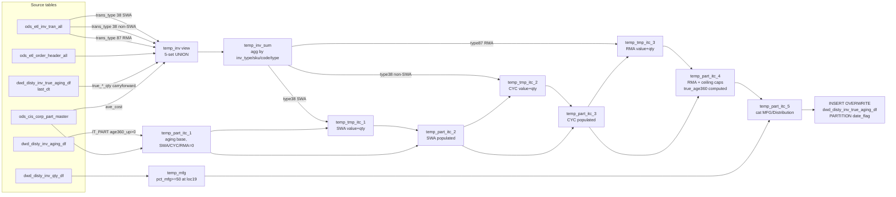

# DWD: Distributor Inventory True Aging (`dwd_disty_inv_true_aging_df`)

- artifact_type: etl_table
- artifact_id: ${literal_target_db}.dwd_disty_inv_true_aging_df
- domain: inventory
- one_line_purpose: This job computes "true aging" — the 360-plus-day aged inventory bucket net of three specific inventory-disposition movements: SWA (scrap/write-off type A), CYC (cycle-count adjustments), and RMA (returns to manufacturer). It reads today's ...
- layer_type: DWD
- source_kind: etl_sql
- evidence_source: inventory/inventory/python/load_dw_true_aging.py

---

## L1 Data Foundation

### Identity and physical mapping
- **Table:** `${literal_target_db}.dwd_disty_inv_true_aging_df`
- **Layer type:** DWD
- **Canonical / derived:** Derived / ETL-loaded (see L3)
- **Owner team:** not registered in metadata catalog

### Grain, scope, exclusions
- **Grain:** one row per `inv_type` + `sku_no` per `date_flag` partition.
- **Scope:** See L2 business purpose / L3 filters
- **Partition:** `date_flag` — business date of the snapshot. - resolved from pipeline (see L4)
- **Natural key:** `inv_type`, `sku_no` (within a partition).
- **Exclusions:** Not documented in repository

#### Grain detail (preserved)

- **Grain:** one row per `inv_type` + `sku_no` per `date_flag` partition.
- **Partition:** `date_flag` — business date of the snapshot.
- **Natural key:** `inv_type`, `sku_no` (within a partition).

---

### Cross-engine presence
| Engine | Present | Canonical FQN | Notes |
|--------|---------|---------------|-------|
| Hive | yes | `${literal_target_db}.dwd_disty_inv_true_aging_df` | ETL target / intermediate per evidence script |
| Vertica | pending | `${literal_target_db}.dwd_disty_inv_true_aging_df` | Confirm via hive2vertica flow evidence / MCP |

### Physical schema reference

Pointer block only - full column catalog lives in WKB L1 storage JSON.

| Field | Value |
|-------|-------|
| **Authoritative catalog** | WKB L1 storage seed (not duplicated in this file) |
| **entity_id** | `${literal_target_db}.dwd_disty_inv_true_aging_df` |
| **l1_catalog_seed** | `target/storage/wkb/snapshots/_snapshot_id_template/l1_catalog/{engine}_{schema}_{table}.json` |
| **column_count** | pending (run ddl_seed_writer) |
| **partition_keys** | `date_flag` |
| **ddl_source** | pending Bitbucket DDL / Vertica metadata ingest |
| **retrieval** | `python -m tools.wkb.indexing.run_query --query "inventory load_dw_true_aging schema" --intent find_table_schema` |

### Lineage
| Object | Role |
|--------|------|
| `${literal_source_db}.ods_etl_inv_tran_all` | Live transaction source for today's SWA/CYC/RMA movements |
| `${literal_source_db}.ods_etl_order_header_all` | Order header — provides `mt_expense_code` to distinguish SWA from other trans_type 38 |
| `${literal_source_db}.ods_cis_corp_part_master` | SKU `ave_cost` for costing dispositions |
| `${literal_target_db}.dwd_disty_inv_aging_df` | IT_PART aging base (age360_up, qty360_up, system cost) |
| `${literal_target_db}.dwd_disty_inv_true_aging_df` | Prior-day true aging — carryforward for rolling disposition quantities (parameter `last_dt`) |
| `${literal_target_db}.dwd_disty_inv_qty_df` | On-hand by location — for manufacturing % computation |

---

### Freshness and load path
| Item | Value |
|------|-------|
| Load pattern | See L3 end-to-end / INSERT pattern in evidence script |
| Schedule | Not documented in repository |
| Parameters | `literal_source_db`, `literal_target_db`, `literal_date_flag`, `last_dt`, `etl_timestamp` |


---

## L2 Declarative Knowledge

### Business purpose
This job computes "true aging" — the 360-plus-day aged inventory bucket net of three specific
inventory-disposition movements: SWA (scrap/write-off type A), CYC (cycle-count adjustments), and
RMA (returns to manufacturer). It reads today's qualifying transactions, carries forward the prior
day's disposition quantities, and applies a FIFO waterfall that allocates each disposition type
against the aging bucket in sequence (SWA first, then CYC, then RMA), capping each at whatever
aging remains. The result shows both the original 360+ day aging (`old_age360`) and the net aging
after deducting dispositions (`true_age360`), enabling a more accurate picture of genuinely
stranded inventory. Each SKU is also tagged as `MFG` or `Distribution` based on where its
inventory is held.

---

### Audience and use cases
| Audience | How they benefit |
|----------|-----------------|
| **Inventory / write-down team** | `true_age360` and `true_age360_qty` isolate genuinely stranded inventory — i.e., aging that has not been addressed by any disposition action |
| **Vendor management** | SWA, CYC, and RMA dollar deductions per SKU support conversations about write-down recovery with vendors |
| **Finance** | `old_age360` vs. `true_age360` delta quantifies inventory that was already in disposition process, avoiding double-counting in reserve calculations |
| **Supply chain** | `cat = 'MFG'` vs. `'Distribution'` segment allows different treatment of inventory physically held at manufacturing locations |

---

### Fact key resolution
- Natural key: `inv_type`, `sku_no` (within a partition).
- FK / label-on attributes: see L3 dimension join patterns and step-by-step logic.
- Negative assertion: do not treat descriptive labels as grain keys unless listed under natural key.

### Time field semantics
- **date_flag / partition columns:** `date_flag` — business date of the snapshot.
- Primary reporting filter should use the partition column(s) documented in L1; resolve values via L4.


### Metrics served

| Category | Column | Logical metric | Business reading |
|----------|--------|----------------|------------------|
| Measures | — | — | No measure columns mapped for this table. |

### Metric serving map

**Formula authority:** [`source/contracts/inventory/metric-index.md`](../../source/contracts/inventory/metric-index.md)

N/A — no measure columns mapped for this table.

### etl_metrics

No governed logical metrics from `source/contracts/inventory/metric-index.md` are mapped on this table.

---

### Metric serving map
N/A - not a `*_comb_mtd` / multi-period wide serving table (or map not present in legacy doc).


### Data products and column groups (preserved)

### Identifiers and relationships

- **Product:** `sku_no`
- **Inventory type:** `inv_type` — only types 1, 2, 11, 12 are processed

### Dimension columns

Use these for **filters, group-bys, and star-schema joins**:

- `cat` — `'MFG'` if ≥ 50% of on-hand inventory is at loc_no 19 (manufacturing location), else `'Distribution'`
- `inv_type` — inventory type (regular, RMA, etc.)

### Quantity building blocks

- `age10eback_qty` (`old_age360_qty`) — raw 360+ day aging quantity from the standard aging table before disposition deductions
- `age10e_qty` (`true_age360_qty`) — net 360+ day aging quantity after deducting SWA, CYC, and RMA
- `swa_qty` — quantity disposed via SWA (scrap/write-off type A, trans_type 38, expense code `SWA`)
- `cyc_qty` — quantity disposed via CYC (cycle-count adjustments, trans_type 38, not SWA)
- `rma_qty` — quantity disposed via RMA (returns, trans_type 87)
- `true_swa_qty`, `true_cyc_qty`, `true_rma_qty` — raw disposition quantities before waterfall capping (useful for cumulative tracking)

### Core derived metrics

| Column | Formula | Business reading |
|--------|---------|-----------------|
| `old_age360` | `sum(age360_up)` from `dwd_disty_inv_aging_df` × `ave_cost` | Dollar value of 360+ day aging before any disposition deduction |
| `true_age360` | `old_age360 − swa − cyc − rma` | Dollar value of genuinely stranded 360+ day inventory |
| `swa` | `swa_qty × system_cost` (if SWA transactions exist and value > 0) | Dollar value of inventory disposed via SWA today |
| `cyc` | `cyc_qty × system_cost` (if non-SWA trans_type 38 exists and value > 0) | Dollar value of cycle-count dispositions |
| `rma` | `rma_qty × system_cost` (if RMA transactions exist and value > 0) | Dollar value of inventory returned to vendor/manufacturer |
| `system_cost` | `avg(nvl(ave_cost, 0))` from `dwd_disty_inv_aging_df` | Average unit cost for the SKU, sourced from the aging table |

---

### etl_metrics

#### `cyc`
- **Source:** [metric-index.md](../../source/contracts/inventory/metric-index.md#cyc)
- **Business definition:** Dollar value of cycle-count dispositions
```sql
cyc_qty × system_cost` (if non-SWA trans_type 38 exists and value > 0)
```

#### `total_trans`
- **Source:** [metric-index.md](../../source/contracts/inventory/metric-index.md#total_trans)
- **Business definition:** Dollar value of the disposition (0 if no part master match)
```sql
trans_qty × nvl(b.ave_cost, 0)
```

#### `age10e`
- **Source:** [metric-index.md](../../source/contracts/inventory/metric-index.md#age10e)
- **Business definition:** Starting gross 360+ day aging value (dollar)
```sql
SUM(age360_up)
```

#### `age10eback`
- **Source:** [metric-index.md](../../source/contracts/inventory/metric-index.md#age10eback)
- **Business definition:** Backup of starting gross aging — preserved as `old_age360` in target
```sql
SUM(age360_up)
```

#### `age10e_qty`
- **Source:** [metric-index.md](../../source/contracts/inventory/metric-index.md#age10e_qty)
- **Business definition:** Starting gross 360+ day aging quantity
```sql
SUM(qty360_up)
```

#### `age10eback_qty`
- **Source:** [metric-index.md](../../source/contracts/inventory/metric-index.md#age10eback_qty)
- **Business definition:** Backup of starting gross qty
```sql
SUM(qty360_up)
```

#### `cat`
- **Source:** [metric-index.md](../../source/contracts/inventory/metric-index.md#cat)
- **Business definition:** Category placeholder; set in step 11
```sql
cast(null as string)
```

#### `pct_mfg`
- **Source:** [metric-index.md](../../source/contracts/inventory/metric-index.md#pct_mfg)
- **Business definition:** Percentage of on-hand qty held at loc_no 19 (manufacturing location)
```sql
nvl(sum(CASE WHEN loc_no = 19 THEN on_hand_qty ELSE 0 END) × 100 / nullif(sum(on_hand_qty), 0), 0)
```


---

## L3 Procedural Knowledge

### Query and routing rules
**Business filters:** Use partition / date keys from L1 grain for reporting scope.
**Technical predicates (load only):** See Key filters and step-by-step logic below.

### Dimension join patterns
| Dimension FQN | Join keys | Purpose | Evidence |
|---------------|-----------|---------|----------|
| See step-by-step / base tables | See L3 steps | Dimension enrichment | `inventory/inventory/python/load_dw_true_aging.py` |

### Key filters and ETL business logic
### Step 1 — `temp_inv` (view)

**Source:** 5-way UNION ALL, all scoped to inv_type IN (1, 2, 11, 12).

**Set 1 — SWA transactions (trans_type = 38, with expense code):**
- Source: `ods_etl_inv_tran_all i` INNER JOIN `ods_etl_order_header_all h` ON `doc_no = order_no AND order_type`.
- Filter: `doc_date >= '${literal_date_flag}' AND doc_date < date_add('${literal_date_flag}', 1)`, `trans_type = 38`, `trans_qty > 0`.
- Groups by `inv_type`, `sku_no`, `mt_expense_code` (from order header), `trans_type`.

**Set 2 — CYC/other trans_type 38 (no expense code header join):**
- Source: `ods_etl_inv_tran_all i` only (no header join → `mt_expense_code = NULL`).
- Filter: same date range, `trans_type = 87`, `trans_qty <> 0`.

> **Note:** The script comment says Set 2 is for trans_type 87 with `mt_expense_code = NULL` but the filter reads `trans_type = 87`. Set 2 captures RMA without a header join (no expense code).

**Set 3 — SWA carryforward from prior day:**
- Source: `dwd_disty_inv_true_aging_df` WHERE `date_flag = '${last_dt}' AND true_swa_qty != 0`.
- `mt_expense_code = 'SWA'`, `trans_type = 38`, `trans_qty = true_swa_qty`.

**Set 4 — CYC carryforward from prior day:**
- Source: same table WHERE `true_cyc_qty != 0`.
- `mt_expense_code = 'CYC'`, `trans_type = 38`, `trans_qty = true_cyc_qty`.

**Set 5 — RMA carryforward from prior day:**
- Source: same table WHERE `true_rma_qty != 0`.
- `mt_expense_code = NULL`, `trans_type = 87`, `trans_qty = true_rma_qty`.

**Cost join (applied to ...

### Standard time-filter SQL
```sql
-- relative period filter using resolved partition value (see L4)
SELECT *
FROM ${literal_target_db}.dwd_disty_inv_true_aging_df
WHERE /* partition predicate */ date_flag = '${partition_value}';
```

### End-to-end flow
**Runtime parameters:** `literal_source_db`, `literal_target_db`, `literal_date_flag`, `last_dt`, `etl_timestamp`
**Target table:** `${literal_target_db}.dwd_disty_inv_true_aging_df`, partitioned by **`date_flag`**.

1. Build `temp_inv` (view): UNION of 5 sets — today's trans_type 38 with expense code `SWA`, today's trans_type 38 without `SWA`, today's trans_type 87 (RMA), and the prior day's `true_swa_qty`, `true_cyc_qty`, `true_rma_qty` from `dwd_disty_inv_true_aging_df`. LEFT JOIN with `ods_cis_corp_part_master` to cost each disposition: `total_trans = trans_qty × ave_cost`.
2. Aggregate into `temp_inv_sum`: sum `total_trans` and `trans_qty` by `inv_type`, `sku_no`, `mt_expense_code`, `trans_type`.
3. Build `temp_part_itc_1` (view): read 360+ day aged inventory from `dwd_disty_inv_aging_df` (IT_PART, inv_type IN 1/2/11/12, `age360_up > 0`). Initialize SWA/CYC/RMA to 0; set `age10e = age10eback = sum(age360_up)` and `age10e_qty = age10eback_qty = sum(qty360_up)`.
4. Build `temp_tmp_itc_1` (view): join `temp_inv_sum` (trans_type 38, `SWA`) with `temp_part_itc_1` → SWA total and qty per SKU.
5. Build `temp_part_itc_2` (view): if SWA transaction value > 0, populate `swa`, `swa_qty`, `true_swa_qty`; else retain zeros.
6. Build `temp_tmp_itc_2` (view): join `temp_inv_sum` (trans_type 38, not `SWA`) with `temp_part_itc_2` → CYC total and qty.
7. Build `temp_part_itc_3` (view): if CYC transaction value > 0, populate `cyc`, `cyc_qty`, `true_cyc_qty`.
8. Build `temp_tmp_itc_3` (view): join `temp_inv_sum` (trans_type 87) with `temp_part_itc_3` → RMA total and qty.
9. Build `temp_part_itc_4` (view): apply RMA update, then enforce ceiling constraints in three sub-CTEs: cap SWA at `age10e`, cap CYC at `age10e − swa`, cap RMA at `age10e − swa − cyc`. Final: compute `age10e = age10e − swa − rma − cyc` and `age10e_qty = age10e_qty − swa_qty − cyc_qty − rma_qty`.
10. Build `temp_mfg` (view): compute `pct_mfg` = % of on-hand qty at loc_no 19 (manufacturing) vs. total; HAVING `pct_mfg >= 50`.
11. Build `temp_part_itc_5` (view): LEFT JOIN `temp_part_itc_4` with `temp_mfg`; set `cat = 'MFG'` if matched, else `'Distribution'`.
12. **INSERT OVERWRITE** into `dwd_disty_inv_true_aging_df` from `temp_part_itc_5`, renaming `age10eback → old_age360`, `age10e → true_age360`.



---


#### High-level stages (preserved)

| Stage | Business meaning |
|-------|-----------------|
| **Collect today's disposition transactions** | Reads trans_type 38 (SWA and CYC by expense code) and trans_type 87 (RMA) from the live transaction feed for `date_flag` |
| **Carry forward prior-day dispositions** | Appends yesterday's `true_swa_qty`, `true_cyc_qty`, `true_rma_qty` from the prior run so rolling adjustments are not lost |
| **Cost disposition transactions** | Multiplies each disposition qty by SKU `ave_cost` to produce dollar values |
| **Load 360+ day aging base** | Reads the `age360_up` and `qty360_up` IT_PART rows from `dwd_disty_inv_aging_df` as the aging start point |
| **Waterfall allocation (SWA → CYC → RMA)** | Allocates each disposition type against remaining aging, capping so total deductions never exceed the aging bucket |
| **Compute true_age360** | `true_age360 = old_age360 − swa − cyc − rma`; `true_age360_qty = old_age360_qty − swa_qty − cyc_qty − rma_qty` |
| **Manufacturing classification** | Tags SKUs as `MFG` if ≥ 50% of on-hand inventory is at loc_no 19, else `Distribution` |
| **INSERT OVERWRITE** | Writes the final result to `dwd_disty_inv_true_aging_df` partitioned by `date_flag` |

**Parameters:** `literal_source_db`, `literal_target_db`, `literal_date_flag`, `last_dt`, `etl_timestamp`

---


### Base tables register
| Object | Role in this job |
|--------|-----------------|
| `${literal_source_db}.ods_etl_inv_tran_all` | Live transaction source — trans_type 38 (SWA/CYC) and trans_type 87 (RMA) for `date_flag` |
| `${literal_source_db}.ods_etl_order_header_all` | Order header — joined on trans_type 38 to get `mt_expense_code` (distinguishes SWA from other CYC adjustments) |
| `${literal_source_db}.ods_cis_corp_part_master` | SKU `ave_cost` for costing disposition quantities |
| `${literal_target_db}.dwd_disty_inv_aging_df` | IT_PART aging base — `age360_up` and `qty360_up` as the 360+ day starting point |
| `${literal_target_db}.dwd_disty_inv_true_aging_df` | Prior-day true aging — carries forward `true_swa_qty`, `true_cyc_qty`, `true_rma_qty` from `last_dt` |
| `${literal_target_db}.dwd_disty_inv_qty_df` | On-hand qty by location — used to compute manufacturing percentage (`pct_mfg` at loc_no 19) |

**Temporary tables (inside the job only):**
`temp_inv` (view) → `temp_inv_sum` → `temp_part_itc_1` (view) → `temp_tmp_itc_1` (view) → `temp_part_itc_2` (view) → `temp_tmp_itc_2` (view) → `temp_part_itc_3` (view) → `temp_tmp_itc_3` (view) → `temp_part_itc_4` (view, with 4 internal CTEs) → `temp_mfg` (view) → `temp_part_itc_5` (view) → (final `INSERT`)

---

### Step-by-step logic
### Step 1 — `temp_inv` (view)

**Source:** 5-way UNION ALL, all scoped to inv_type IN (1, 2, 11, 12).

**Set 1 — SWA transactions (trans_type = 38, with expense code):**
- Source: `ods_etl_inv_tran_all i` INNER JOIN `ods_etl_order_header_all h` ON `doc_no = order_no AND order_type`.
- Filter: `doc_date >= '${literal_date_flag}' AND doc_date < date_add('${literal_date_flag}', 1)`, `trans_type = 38`, `trans_qty > 0`.
- Groups by `inv_type`, `sku_no`, `mt_expense_code` (from order header), `trans_type`.

**Set 2 — CYC/other trans_type 38 (no expense code header join):**
- Source: `ods_etl_inv_tran_all i` only (no header join → `mt_expense_code = NULL`).
- Filter: same date range, `trans_type = 87`, `trans_qty <> 0`.

> **Note:** The script comment says Set 2 is for trans_type 87 with `mt_expense_code = NULL` but the filter reads `trans_type = 87`. Set 2 captures RMA without a header join (no expense code).

**Set 3 — SWA carryforward from prior day:**
- Source: `dwd_disty_inv_true_aging_df` WHERE `date_flag = '${last_dt}' AND true_swa_qty != 0`.
- `mt_expense_code = 'SWA'`, `trans_type = 38`, `trans_qty = true_swa_qty`.

**Set 4 — CYC carryforward from prior day:**
- Source: same table WHERE `true_cyc_qty != 0`.
- `mt_expense_code = 'CYC'`, `trans_type = 38`, `trans_qty = true_cyc_qty`.

**Set 5 — RMA carryforward from prior day:**
- Source: same table WHERE `true_rma_qty != 0`.
- `mt_expense_code = NULL`, `trans_type = 87`, `trans_qty = true_rma_qty`.

**Cost join (applied to all 5 sets via outer SELECT):**
LEFT JOIN `ods_cis_corp_part_master b` ON `sku_no`.

| Column | Formula | Plain language |
|--------|---------|----------------|
| `total_trans` | `trans_qty × nvl(b.ave_cost, 0)` | Dollar value of the disposition (0 if no part master match) |

---

### Step 2 — `temp_inv_sum`

**Source:** `temp_inv`

Aggregates: `sum(total_trans)`, `sum(trans_qty)` grouped by `inv_type`, `sku_no`, `mt_expense_code`, `trans_type`.

---

### Step 3 — `temp_part_itc_1` (view)

**Source:** `${literal_target_db}.dwd_disty_inv_aging_df a` INNER JOIN `${literal_source_db}.ods_cis_corp_part_master b` ON `sku_no`

**Filter:** `date_flag = '${literal_date_flag}'`, `view_level = 'IT_PART'`, `inv_type IN (11, 1, 2, 12)`, `age360_up > 0`

**Derived columns in this step:**

| Column | Formula | Plain language |
|--------|---------|----------------|
| `age10e` | `SUM(age360_up)` | Starting gross 360+ day aging value (dollar) |
| `age10eback` | `SUM(age360_up)` | Backup of starting gross aging — preserved as `old_age360` in target |
| `age10e_qty` | `SUM(qty360_up)` | Starting gross 360+ day aging quantity |
| `age10eback_qty` | `SUM(qty360_up)` | Backup of starting gross qty |
| `swa`, `cyc`, `rma` | `cast(0 as decimal(20,8))` | Initialized to 0; populated in subsequent steps |
| `swa_qty`, `cyc_qty`, `rma_qty` | `cast(0 as int)` | Initialized to 0 |
| `true_swa_qty`, `true_cyc_qty`, `true_rma_qty` | `cast(0 as int)` | Initialized to 0; carries raw transaction quantities |
| `system_cost` | `avg(nvl(a.ave_cost, 0))` | Average unit cost from aging table |
| `cat` | `cast(null as string)` | Category placeholder; set in step 11 |

---

### Step 4 — `temp_tmp_itc_1` (view)

**Source:** `temp_inv_sum i`, `temp_part_itc_1 e`

**Filter:** `i.inv_type = e.inv_type AND i.sku_no = e.sku_no AND i.trans_type = 38 AND i.mt_expense_code = 'SWA'`

Aggregates `sum(total_trans) as value`, `sum(trans_qty) as trans_qty` by `inv_type`, `sku_no`.
This gives the total SWA dollar value and quantity for each aged SKU.

---

### Step 5 — `temp_part_itc_2` (view)

**Source:** `temp_part_itc_1 t` LEFT JOIN `temp_tmp_itc_1 c` ON `inv_type`, `sku_no`

**Derived columns in this step:**

| Column | Formula | Plain language |
|--------|---------|----------------|
| `swa` | `c.trans_qty × t.system_cost` if `c.sku_no IS NOT NULL AND c.value > 0`, else `t.swa` (=0) | SWA dollar value |
| `swa_qty` | `c.trans_qty` if matched and value > 0, else `t.swa_qty` (=0) | SWA quantity |
| `true_swa_qty` | `c.trans_qty` if matched and value > 0, else `t.true_swa_qty` (=0) | Raw SWA disposition quantity (before capping) |

---

### Step 6 — `temp_tmp_itc_2` (view)

**Source:** `temp_inv_sum i` INNER JOIN `temp_part_itc_2 e`

**Filter:** `trans_type = 38 AND (mt_expense_code <> 'SWA' OR mt_expense_code IS NULL)` — picks up non-SWA trans_type 38 adjustments (CYC).

Aggregates `sum(total_trans)`, `sum(trans_qty)` per `inv_type`, `sku_no`.

---

### Step 7 — `temp_part_itc_3` (view)

**Source:** `temp_part_itc_2 t` LEFT JOIN `temp_tmp_itc_2 c`

**Derived columns in this step:**

| Column | Formula | Plain language |
|--------|---------|----------------|
| `cyc` | `c.trans_qty × t.system_cost` if matched and value > 0, else `t.cyc` (=0) | CYC dollar value |
| `cyc_qty` | `c.trans_qty` if matched, else 0 | CYC quantity |
| `true_cyc_qty` | `c.trans_qty` if matched, else 0 | Raw CYC quantity (before capping) |

---

### Step 8 — `temp_tmp_itc_3` (view)

**Source:** `temp_inv_sum i` INNER JOIN `temp_part_itc_3 e`

**Filter:** `trans_type = 87` — RMA transactions.

Aggregates `sum(total_trans)`, `sum(trans_qty)` per `inv_type`, `sku_no`.

---

### Step 9 — `temp_part_itc_4` (view, with 4 internal CTEs)

**Source:** `temp_part_itc_3 t` LEFT JOIN `temp_tmp_itc_3 c` (RMA update), then three capping CTEs.

**`temp_tab_1` — Apply RMA:**

| Column | Formula | Plain language |
|--------|---------|----------------|
| `rma` | `c.trans_qty × t.system_cost` if matched and value > 0, else `t.rma` (=0) | RMA dollar value |
| `rma_qty` | `c.trans_qty` if matched, else 0 | RMA quantity |
| `true_rma_qty` | `c.trans_qty` if matched, else 0 | Raw RMA quantity (before capping) |

**`temp_tab_2` — Cap SWA at `age10e`:**

| Condition | swa | cyc | rma | swa_qty | cyc_qty | rma_qty |
|-----------|-----|-----|-----|---------|---------|---------|
| `swa >= age10e` | `age10e` | `0` | `0` | `age10e_qty` | `0` | `0` |
| else | pass through | pass through | pass through | pass through | pass through | pass through |

**`temp_tab_3` — Cap CYC at remainder (`age10e − swa`):**

| Column | Formula | Plain language |
|--------|---------|----------------|
| `cyc` | `min(cyc, age10e − swa)` | CYC cannot exceed remaining aging after SWA |
| `cyc_qty` | `min(cyc_qty, age10e_qty − swa_qty)` | Same for quantities |

**`temp_tab_4` — Cap RMA at remaining (`age10e − swa − cyc`):**

| Column | Formula | Plain language |
|--------|---------|----------------|
| `rma` | `min(rma, age10e − swa − cyc)` | RMA cannot exceed remaining aging after SWA and CYC |
| `rma_qty` | `min(rma_qty, age10e_qty − swa_qty − cyc_qty)` | Same for quantities |

**Final SELECT from `temp_tab_4` — Compute net true aging:**

| Column | Formula | Plain language |
|--------|---------|----------------|
| `age10e` | `age10e − swa − rma − cyc` | Net 360+ day aging value after all dispositions |
| `age10e_qty` | `age10e_qty − swa_qty − cyc_qty − rma_qty` | Net 360+ day aging quantity after all dispositions |

---

### Step 10 — `temp_mfg` (view)

**Source:** `${literal_target_db}.dwd_disty_inv_qty_df`

**Filter:** `date_flag = '${literal_date_flag}'`, `inv_type IN (1, 2, 11, 12)`, `on_hand_qty <> 0`

**Derived columns in this step:**

| Column | Formula | Plain language |
|--------|---------|----------------|
| `pct_mfg` | `nvl(sum(CASE WHEN loc_no = 19 THEN on_hand_qty ELSE 0 END) × 100 / nullif(sum(on_hand_qty), 0), 0)` | Percentage of on-hand qty held at loc_no 19 (manufacturing location) |

**HAVING:** `pct_mfg >= 50` — only SKUs where the majority of inventory is at the manufacturing location.

---

### Step 11 — `temp_part_itc_5` (view)

**Source:** `temp_part_itc_4 t` LEFT JOIN `temp_mfg c` ON `inv_type`, `sku_no`

**Derived columns in this step:**

| Column | Formula | Plain language |
|--------|---------|----------------|
| `cat` | `nvl(case when c.sku_no IS NOT NULL then 'MFG' else t.cat end, 'Distribution')` | `'MFG'` if ≥ 50% of inventory is at manufacturing location, else `'Distribution'` |

---

### Step 12 — Final `INSERT OVERWRITE` into `dwd_disty_inv_true_aging_df`

**From:** `temp_part_itc_5`

**Pass-through columns (with renames):**

| Source column | Target column | Plain language |
|---------------|---------------|----------------|
| `age10eback` | `old_age360` | Pre-disposition 360+ day aging value |
| `age10e` | `true_age360` | Post-disposition net 360+ day aging value |
| `swa` | `swa` | SWA dollar deduction |
| `cyc` | `cyc` | CYC dollar deduction |
| `rma` | `rma` | RMA dollar deduction |
| `age10eback_qty` | `age10eback_qty` | Pre-disposition aging quantity |
| `age10e_qty` | `age10e_qty` | Post-disposition aging quantity |
| `swa_qty`, `cyc_qty`, `rma_qty` | same | Capped disposition quantities |
| `system_cost` | `system_cost` | Average unit cost |
| `cat` | `cat` | MFG or Distribution |
| `true_swa_qty`, `true_cyc_qty`, `true_rma_qty` | same | Raw (pre-cap) disposition quantities |

**Derived columns computed at INSERT:**

| Column | Formula | Plain language |
|--------|---------|----------------|
| `etl_timestamp` | `'${etl_timestamp}'` | ETL run timestamp |
| `date_flag` | `to_date('${literal_date_flag}')` | Business date of the snapshot |

---

### Sentinel and code values
| Value | Meaning |
|-------|---------|
| `inv_type IN (1, 2, 11, 12)` | Only these inventory types participate in true aging; all others are excluded |
| `trans_type = 38` | Inventory cycle-count and write-off adjustments; distinguished by `mt_expense_code` |
| `mt_expense_code = 'SWA'` | Scrap/write-off type A disposition — allocated first in waterfall |
| `mt_expense_code != 'SWA'` (or NULL) | Cycle-count adjustment (CYC) — allocated second |
| `trans_type = 87` | Return to manufacturer/vendor (RMA) — allocated third |
| `last_dt` | Prior business date — used to carry forward rolling disposition quantities |
| `age360_up > 0` | Only SKUs with genuinely aged inventory (360+ days) are processed |
| `loc_no = 19` | Manufacturing location — determines `cat = 'MFG'` classification |
| `pct_mfg >= 50` | Threshold for MFG classification |
| `cat = 'Distribution'` | Default when SKU does not have majority inventory at loc_no 19 |

---

---

## L4 Validation

### Resolved partition value
| Step | Source | How partition / date scope is determined |
|------|--------|------------------------------------------|
| 1 | evidence script / flow | See parameters in L1 Freshness and L3 filters - `inventory/inventory/python/load_dw_true_aging.py` |

**Plain language:** Partition and date scope follow Azkaban/bootstrap parameters documented in the source script and orchestrating flow; do not hardcode calendar literals.

### Data quality checks
- Prefer row-count-by-partition, metric sums, and grain duplicate checks (see Validation SQL).
- Additional checks from legacy caveats / operational notes when present.

### Validation SQL
```sql
-- 1) row count by partition
-- SELECT partition_col, COUNT(*) FROM ${literal_target_db}.dwd_disty_inv_true_aging_df WHERE partition_col = '${partition_value}' GROUP BY 1;
-- 2) metric sum by dimension (top N) - replace metric/dim from L2
-- 3) grain duplicate check on natural keys
```


### Caveats for interpretation
- **`old_age360` vs. `true_age360`:** `old_age360` matches the `age360_up × cost` value in `dwd_disty_inv_aging_df`. The difference `old_age360 − true_age360` is the total dollar value of inventory already in a disposition process (SWA + CYC + RMA).
- **Waterfall cap order:** SWA is applied first, so if SWA alone covers the entire aging bucket, CYC and RMA are both zeroed out. This means large SWA transactions can mask CYC and RMA amounts that were actually processed.
- **Carryforward from `last_dt`:** Prior-day disposition quantities are added back as new transaction rows in `temp_inv`. This means if a disposition spans multiple days, the quantities accumulate. If `last_dt` is not the immediately preceding business day, there may be a gap in accumulation.
- **`true_swa_qty`, `true_cyc_qty`, `true_rma_qty`:** These are the raw (pre-waterfall-cap) quantities. They can exceed the aging bucket when dispositions are large, but the waterfall ensures the deductions (`swa_qty`, `cyc_qty`, `rma_qty`) do not.
- **Only inv_type IN (1, 2, 11, 12):** Other inventory types are not represented in this table.
- **`system_cost` is averaged at the inv_type+sku level** from `dwd_disty_inv_aging_df` — it may differ from `ave_cost` in other tables.
- **`loc_no = 19`** is hardcoded as the manufacturing location; changes to the physical location mapping would require a code change.

---

### Conflicts and open questions
- Schedule, owner, SLA: Not documented in repository (unless preserved schedule evidence above).
- Vertica MCP verification: pending unless confirmed in L5.


---

## L5 Runtime View

### Query path and engine preference
| Role | Hive object | Vertica object | Sync mode | Evidence | MCP verified |
|------|-------------|----------------|-----------|----------|--------------|
| **Not in Vertica** | *See script lineage* | *No Vertica mapping identified in repository* | - | *Add flow evidence when found* | no |

No queryable Vertica table has been confirmed for this script from current repository evidence.

### Access constraints
- Country / company schema parameters may apply (`literal_country`, `company_no`, etc.).
- Hive-only staging objects are not reporting surfaces unless synced.

### Query risk profile
| Field | Value |
|-------|-------|
| requires_date_predicate | yes |
| scan_risk_tier | high |

---

## L6 Access and Consumption

### Primary consumers and use cases
| Audience | How they benefit |
|----------|-----------------|
| **Inventory / write-down team** | `true_age360` and `true_age360_qty` isolate genuinely stranded inventory — i.e., aging that has not been addressed by any disposition action |
| **Vendor management** | SWA, CYC, and RMA dollar deductions per SKU support conversations about write-down recovery with vendors |
| **Finance** | `old_age360` vs. `true_age360` delta quantifies inventory that was already in disposition process, avoiding double-counting in reserve calculations |
| **Supply chain** | `cat = 'MFG'` vs. `'Distribution'` segment allows different treatment of inventory physically held at manufacturing locations |

---

### Representative query patterns
```sql
-- certified / illustrative lookup - replace predicates from L1/L4
SELECT *
FROM ${literal_target_db}.dwd_disty_inv_true_aging_df
WHERE date_flag = '${partition_value}'
LIMIT 100;
```

### Dependencies and notes
### Upstream objects (verified)

| Object | Usage | Evidence |
|--------|-------|----------|
| `ods_etl_inv_tran_all` | SWA (trans_type 38) and RMA (trans_type 87) transactions | `inventory/inventory/python/load_dw_true_aging.py:14` |
| `ods_etl_order_header_all` | `mt_expense_code` lookup for SWA identification | `inventory/inventory/python/load_dw_true_aging.py:15` |
| `ods_cis_corp_part_master` | `ave_cost` for costing and aging base | `inventory/inventory/python/load_dw_true_aging.py:85` |
| `dwd_disty_inv_aging_df` | IT_PART aging base (age360_up, qty360_up) | `inventory/inventory/python/load_dw_true_aging.py:123` |
| `dwd_disty_inv_true_aging_df` | Prior-day true aging carryforward (`last_dt`) | `inventory/inventory/python/load_dw_true_aging.py:53` |
| `dwd_disty_inv_qty_df` | On-hand by location for `pct_mfg` computation | `inventory/inventory/python/load_dw_true_aging.py:335` |

### Downstream consumers (verified)

| Object / script | Evidence |
|-----------------|----------|
| `dwd_disty_inv_true_aging_df` — self-referencing: this job reads its own prior-day output (`last_dt`) to carry forward dispositions | `inventory/inventory/python/load_dw_true_aging.py:53` |

### Operational detail (verified)

- Full partition overwrite per `date_flag`: `inventory/inventory/python/load_dw_true_aging.py:374`
- Rolling self-reference on `last_dt` parameter — job must run in date order: `load_dw_true_aging.py:53`

### Not documented in repository

- Schedule, owner, SLA — not in scripts or configs
- Business definition of `mt_expense_code` values beyond `SWA`
- How `last_dt` is populated by the orchestrator (presumably the prior business day)
- Why loc_no 19 is the manufacturing location threshold

---

*Document generated from `inventory/inventory/python/load_dw_true_aging.py`.*

#### Not documented in repository
- Owner, SLA (unless schedule evidence preserved above)
- Any dependency without `file:line` evidence in this document

---

*Document migrated to L1-L6 from legacy Knowledgebase content. Evidence: `inventory/inventory/python/load_dw_true_aging.py`.*
