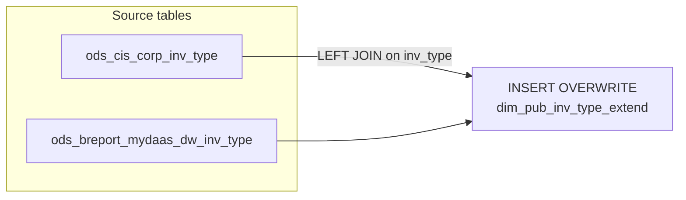

# DIM: Inventory Type Extended Dimension (`dim_pub_inv_type_extend`)

- artifact_type: etl_table
- artifact_id: dim_us.dim_pub_inv_type_extend
- domain: inventory
- one_line_purpose: This job builds a country-specific inventory type dimension table by enriching the core CIS inventory type master (`ods_cis_corp_inv_type`) with additional grouping attributes from the reporting layer (`ods_breport_mydaas_dw_inv_type`). It ...
- layer_type: DIM
- source_kind: etl_sql
- evidence_source: source/etl/sql/inventory/source/etl/flows/public_order_tools/ingest/public_inventory_dimension/script/dim_pub_inv_type_extend.sql

---

## L1 Data Foundation

### Identity and physical mapping
- **Table:** `dim_us.dim_pub_inv_type_extend`
- **Layer type:** DIM
- **Canonical / derived:** Derived / ETL-loaded (see L3)
- **Owner team:** not registered in metadata catalog

### Grain, scope, exclusions
- **Grain:** one row per `inv_type` code.
- **Scope:** See L2 business purpose / L3 filters
- **Partition:** none — full table overwrite. - resolved from pipeline (see L4)
- **Natural key:** `inv_type`.
- **Exclusions:** Not documented in repository

#### Grain detail (preserved)

- **Grain:** one row per `inv_type` code.
- **Partition:** none — full table overwrite.
- **Natural key:** `inv_type`.

---

### Cross-engine presence
| Engine | Present | Canonical FQN | Notes |
|--------|---------|---------------|-------|
| Hive | yes | `dim_pub_inv_type_extend` | ETL target / intermediate per evidence script |
| Vertica | pending | `dim_pub_inv_type_extend` | Confirm via hive2vertica flow evidence / MCP |

### Physical schema reference

Pointer block only - full column catalog lives in WKB L1 storage JSON.

| Field | Value |
|-------|-------|
| **Authoritative catalog** | WKB L1 storage seed (not duplicated in this file) |
| **entity_id** | `dim_us.dim_pub_inv_type_extend` |
| **l1_catalog_seed** | `target/storage/wkb/snapshots/_snapshot_id_template/l1_catalog/{engine}_{schema}_{table}.json` |
| **column_count** | pending (run ddl_seed_writer) |
| **partition_keys** | `none — full table overwrite.` |
| **ddl_source** | pending Bitbucket DDL / Vertica metadata ingest |
| **retrieval** | `python -m tools.wkb.indexing.run_query --query "inventory dim_pub_inv_type_extend schema" --intent find_table_schema` |

### Lineage
| Object | Role |
|--------|------|
| `ods_${country_code}.ods_cis_corp_inv_type` | Primary source — inventory type master |
| `ods_${country_code}.ods_breport_mydaas_dw_inv_type` | Enrichment — reporting group attributes |

---

### Freshness and load path
| Item | Value |
|------|-------|
| Load pattern | See L3 end-to-end / INSERT pattern in evidence script |
| Schedule | Not documented in repository |
| Parameters | `country_code` |


---

## L2 Declarative Knowledge

### Business purpose
This job builds a country-specific inventory type dimension table by enriching the core CIS
inventory type master (`ods_cis_corp_inv_type`) with additional grouping attributes from the
reporting layer (`ods_breport_mydaas_dw_inv_type`). It provides a single lookup source for
inventory type codes, their descriptions, behavioral flags (purchase, sales, RMA), associated GL
account numbers, and high-level inventory group classifications used across reporting and analytics.

---

### Audience and use cases
| Audience | How they benefit |
|----------|-----------------|
| **Inventory analytics / BI** | Use `inv_type`, `inv_type_descr`, `inv_group`, `inv_group_no` as dimension keys and labels in inventory reports and dashboards |
| **Finance** | `gl_acct_no` maps inventory types to GL accounts for journal reconciliation |
| **Data engineering** | `pur_flag`, `sales_flag`, `rma_flag` determine which business flows an inventory type participates in; used as filters in downstream ETL joins |

---

### Identifier search profile
- Primary lookup keys: see natural key under L1 Grain.
- Use latest snapshot / active flags when documented in L3 filters.

### Time field semantics
- **date_flag / partition columns:** none — full table overwrite.
- Primary reporting filter should use the partition column(s) documented in L1; resolve values via L4.

### Metrics served
When exposing this table to the business, lead with:

1. **Dimension lookup:** `inv_type`, `inv_type_descr` — join key for inventory fact tables
2. **Behavioral flags:** `pur_flag`, `sales_flag`, `rma_flag` — filter to relevant inv_types for a given flow
3. **Group aggregation:** `inv_group`, `inv_group_no` — roll up inv_types to reporting categories

---

### Metric serving map
N/A - not a `*_comb_mtd` / multi-period wide serving table (or map not present in legacy doc).


### Data products and column groups (preserved)

### Identifiers and relationships

- **Inventory type:** `inv_type`
- **Inventory group:** `inv_group`, `inv_group_no`

### Dimension columns (reporting-ready, pre-computed from source)

Use these for **filters, group-bys, and star-schema joins**:

- `inv_type_descr` — human-readable description of the inventory type
- `inv_group` — high-level group label aggregating related inv_types (from reporting layer)
- `inv_group_no` — numeric group code corresponding to `inv_group`
- `cost_from` — source of cost for this inv_type
- `pur_flag` — whether this inv_type participates in purchase flows
- `sales_flag` — whether this inv_type participates in sales flows
- `rma_flag` — whether this inv_type participates in RMA (return to manufacturer) flows
- `gl_acct_no` — GL account number associated with this inventory type
- `entry_datetime`, `entry_id` — record creation metadata from CIS

> **Note:** `inv_group` and `inv_group_no` will be NULL for any `inv_type` with no matching row in `ods_breport_mydaas_dw_inv_type` (LEFT JOIN).

---

### etl_metrics

#### `etl_timestamp`
- **Source:** [metric-index.md](../../source/contracts/inventory/metric-index.md#etl_timestamp)
- **Business definition:** ETL run timestamp converted to Los Angeles local time
```sql
from_utc_timestamp(current_timestamp(), 'America/Los_Angeles')
```


---

## L3 Procedural Knowledge

### Query and routing rules
**Business filters:** Use partition / date keys from L1 grain for reporting scope.
**Technical predicates (load only):** See Key filters and step-by-step logic below.

### Dimension join patterns
| Dimension FQN | Join keys | Purpose | Evidence |
|---------------|-----------|---------|----------|
| See step-by-step / base tables | See L3 steps | Dimension enrichment | `source/etl/sql/inventory/source/etl/flows/public_order_tools/ingest/public_inventory_dimension/script/dim_pub_inv_type_extend.sql` |

### Key filters and ETL business logic
### Step 1 — Final `INSERT OVERWRITE` into `dim_pub_inv_type_extend`

**From:** `ods_cis_corp_inv_type a` LEFT JOIN `ods_breport_mydaas_dw_inv_type b` ON `a.inv_type = b.inv_type`

**Filter:** None — all rows from the inv_type master are included.

**Pass-through columns from `ods_cis_corp_inv_type` (alias `a`):**
`inv_type`, `inv_type_descr`, `cost_from`, `entry_datetime`, `entry_id`, `pur_flag`, `sales_flag`, `rma_flag`, `gl_acct_no`

**Pass-through columns from `ods_breport_mydaas_dw_inv_type` (alias `b`):**
`inv_group`, `inv_group_no` — NULL when no matching row exists in the enrichment table.

**Derived columns computed at INSERT:**

| Column | Formula | Plain language |
|--------|---------|----------------|
| `etl_timestamp` | `from_utc_timestamp(current_timestamp(), 'America/Los_Angeles')` | ETL run timestamp converted to Los Angeles local time |

---

### Standard time-filter SQL
```sql
-- relative period filter using resolved partition value (see L4)
SELECT *
FROM dim_pub_inv_type_extend
WHERE /* partition predicate */ date_flag = '${partition_value}';
```

### End-to-end flow
**Runtime parameters:** `country_code`
**Target table:** `dim_${country_code}.dim_pub_inv_type_extend` — no partition (full overwrite).

1. Read all rows from `ods_cis_corp_inv_type` (CIS master inventory type table) for the given country.
2. LEFT JOIN `ods_breport_mydaas_dw_inv_type` on `inv_type` to add group-level attributes.
3. Compute `etl_timestamp` as current time in America/Los_Angeles timezone.
4. **INSERT OVERWRITE** all columns into `dim_pub_inv_type_extend`.



---


#### High-level stages (preserved)

| Stage | Business meaning |
|-------|-----------------|
| **Read inventory type master** | Reads all inventory type codes from `ods_cis_corp_inv_type` — the authoritative CIS list of inventory types with their attributes and flags |
| **Enrich with group classification** | LEFT JOINs `ods_breport_mydaas_dw_inv_type` to add `inv_group` and `inv_group_no` — reporting-layer groupings that aggregate inv_types into higher-level categories |
| **INSERT OVERWRITE** | Full refresh of `dim_pub_inv_type_extend` for the given country; stamps ETL timestamp in LA time |

**Parameters:** `country_code`

---


### Base tables register
| Object | Role in this job |
|--------|-----------------|
| `ods_${country_code}.ods_cis_corp_inv_type` | Primary source — all inventory type codes, descriptions, flags, GL account, and cost source |
| `ods_${country_code}.ods_breport_mydaas_dw_inv_type` | Enrichment — adds `inv_group` and `inv_group_no` reporting group attributes |

**Temporary tables (inside the job only):**
None — direct INSERT from inline join.

---

### Step-by-step logic
### Step 1 — Final `INSERT OVERWRITE` into `dim_pub_inv_type_extend`

**From:** `ods_cis_corp_inv_type a` LEFT JOIN `ods_breport_mydaas_dw_inv_type b` ON `a.inv_type = b.inv_type`

**Filter:** None — all rows from the inv_type master are included.

**Pass-through columns from `ods_cis_corp_inv_type` (alias `a`):**
`inv_type`, `inv_type_descr`, `cost_from`, `entry_datetime`, `entry_id`, `pur_flag`, `sales_flag`, `rma_flag`, `gl_acct_no`

**Pass-through columns from `ods_breport_mydaas_dw_inv_type` (alias `b`):**
`inv_group`, `inv_group_no` — NULL when no matching row exists in the enrichment table.

**Derived columns computed at INSERT:**

| Column | Formula | Plain language |
|--------|---------|----------------|
| `etl_timestamp` | `from_utc_timestamp(current_timestamp(), 'America/Los_Angeles')` | ETL run timestamp converted to Los Angeles local time |

---

### Relationship map (embedded)

| from_fqn | to_fqn | cardinality | join_keys | provenance |
|----------|--------|-------------|-----------|------------|
| `ods_${country_code}.ods_cis_corp_inv_type` | `ods_${country_code}.ods_breport_mydaas_dw_inv_type` | many:1 (LEFT) | `a.inv_type` = `b.inv_type` | etl_sql (`source/etl/sql/inventory/public_order_scripts/public_inventory_dimension/script/dim_pub_inv_type_extend.sql:16`) |

### Special logic (embedded)

Not documented in repository

### Column / field derivations (from ETL SQL)

| target_column | expression_sql | upstream_columns | upstream_tables | transform_kind | evidence |
|---------------|----------------|------------------|-----------------|----------------|----------|
| `inv_type` | `a.inv_type` | `inv_type` | `ods_${country_code}.ods_cis_corp_inv_type`, `ods_${country_code}.ods_breport_mydaas_dw_inv_type` | passthrough | `source/etl/sql/inventory/public_order_scripts/public_inventory_dimension/script/dim_pub_inv_type_extend.sql:3` |
| `inv_type_descr` | `a.inv_type_descr` | `inv_type_descr` | `ods_${country_code}.ods_cis_corp_inv_type`, `ods_${country_code}.ods_breport_mydaas_dw_inv_type` | passthrough | `source/etl/sql/inventory/public_order_scripts/public_inventory_dimension/script/dim_pub_inv_type_extend.sql:4` |
| `cost_from` | `a.cost_from` | `cost_from` | `ods_${country_code}.ods_cis_corp_inv_type`, `ods_${country_code}.ods_breport_mydaas_dw_inv_type` | passthrough | `source/etl/sql/inventory/public_order_scripts/public_inventory_dimension/script/dim_pub_inv_type_extend.sql:5` |
| `entry_datetime` | `a.entry_datetime` | `entry_datetime` | `ods_${country_code}.ods_cis_corp_inv_type`, `ods_${country_code}.ods_breport_mydaas_dw_inv_type` | passthrough | `source/etl/sql/inventory/public_order_scripts/public_inventory_dimension/script/dim_pub_inv_type_extend.sql:6` |
| `entry_id` | `a.entry_id` | `entry_id` | `ods_${country_code}.ods_cis_corp_inv_type`, `ods_${country_code}.ods_breport_mydaas_dw_inv_type` | passthrough | `source/etl/sql/inventory/public_order_scripts/public_inventory_dimension/script/dim_pub_inv_type_extend.sql:7` |
| `pur_flag` | `a.pur_flag` | `pur_flag` | `ods_${country_code}.ods_cis_corp_inv_type`, `ods_${country_code}.ods_breport_mydaas_dw_inv_type` | passthrough | `source/etl/sql/inventory/public_order_scripts/public_inventory_dimension/script/dim_pub_inv_type_extend.sql:8` |
| `sales_flag` | `a.sales_flag` | `sales_flag` | `ods_${country_code}.ods_cis_corp_inv_type`, `ods_${country_code}.ods_breport_mydaas_dw_inv_type` | passthrough | `source/etl/sql/inventory/public_order_scripts/public_inventory_dimension/script/dim_pub_inv_type_extend.sql:9` |
| `rma_flag` | `a.rma_flag` | `rma_flag` | `ods_${country_code}.ods_cis_corp_inv_type`, `ods_${country_code}.ods_breport_mydaas_dw_inv_type` | passthrough | `source/etl/sql/inventory/public_order_scripts/public_inventory_dimension/script/dim_pub_inv_type_extend.sql:10` |
| `gl_acct_no` | `a.gl_acct_no` | `gl_acct_no` | `ods_${country_code}.ods_cis_corp_inv_type`, `ods_${country_code}.ods_breport_mydaas_dw_inv_type` | passthrough | `source/etl/sql/inventory/public_order_scripts/public_inventory_dimension/script/dim_pub_inv_type_extend.sql:11` |
| `inv_group` | `b.inv_group` | `inv_group` | `ods_${country_code}.ods_cis_corp_inv_type`, `ods_${country_code}.ods_breport_mydaas_dw_inv_type` | passthrough | `source/etl/sql/inventory/public_order_scripts/public_inventory_dimension/script/dim_pub_inv_type_extend.sql:12` |
| `inv_group_no` | `b.inv_group_no` | `inv_group_no` | `ods_${country_code}.ods_cis_corp_inv_type`, `ods_${country_code}.ods_breport_mydaas_dw_inv_type` | passthrough | `source/etl/sql/inventory/public_order_scripts/public_inventory_dimension/script/dim_pub_inv_type_extend.sql:13` |
| `etl_timestamp` | `from_utc_timestamp(current_timestamp(),'America/Los_Angeles')` | `from_utc_timestamp`, `current_timestamp`, `America`, `Los_Angeles` | `ods_${country_code}.ods_cis_corp_inv_type`, `ods_${country_code}.ods_breport_mydaas_dw_inv_type` | arithmetic | `source/etl/sql/inventory/public_order_scripts/public_inventory_dimension/script/dim_pub_inv_type_extend.sql:14` |

### Sentinel and code values
| Value | Meaning |
|-------|---------|
| `inv_group = NULL` | `inv_type` has no corresponding entry in `ods_breport_mydaas_dw_inv_type` — group classification not yet assigned |
| `pur_flag` | Indicates whether the inv_type participates in purchasing flows |
| `sales_flag` | Indicates whether the inv_type participates in sales flows |
| `rma_flag` | Indicates whether the inv_type participates in RMA flows |

---

---

## L4 Validation

### Resolved partition value
| Step | Source | How partition / date scope is determined |
|------|--------|------------------------------------------|
| 1 | evidence script / flow | See parameters in L1 Freshness and L3 filters - `source/etl/sql/inventory/source/etl/flows/public_order_tools/ingest/public_inventory_dimension/script/dim_pub_inv_type_extend.sql` |

**Plain language:** Partition and date scope follow Azkaban/bootstrap parameters documented in the source script and orchestrating flow; do not hardcode calendar literals.

### Data quality checks
- Prefer row-count-by-partition, metric sums, and grain duplicate checks (see Validation SQL).
- Additional checks from legacy caveats / operational notes when present.

### Validation SQL
```sql
-- 1) Row count by partition
SELECT ${partition_col}, COUNT(*) AS row_cnt
FROM dim_${country_code}.dim_pub_inv_type_extend
WHERE ${partition_col} = '${partition_value}'
GROUP BY ${partition_col};

-- 2) Metric sum by business dimension (top deltas)
SELECT ${dim_key}, SUM(${metric}) AS metric_sum
FROM dim_${country_code}.dim_pub_inv_type_extend
WHERE ${partition_col} = '${partition_value}'
GROUP BY ${dim_key}
ORDER BY ABS(SUM(${metric})) DESC
LIMIT 20;

-- 3) Grain duplicate check
SELECT ${grain_key_1}, ${grain_key_2}, ${grain_key_3}, ${partition_col}, COUNT(*) AS cnt
FROM dim_${country_code}.dim_pub_inv_type_extend
WHERE ${partition_col} = '${partition_value}'
GROUP BY ${grain_key_1}, ${grain_key_2}, ${grain_key_3}, ${partition_col}
HAVING COUNT(*) > 1;
```

Replace placeholders from this file's Grain and keys / Data you can fetch sections, and use the resolved partition value from run scope.

### Caveats for interpretation
- **LEFT JOIN on enrichment:** Any `inv_type` in the CIS master without a matching row in `ods_breport_mydaas_dw_inv_type` will have NULL `inv_group` and `inv_group_no`. Downstream users should handle NULLs in group aggregations.
- **Full refresh:** The INSERT OVERWRITE replaces the entire table on every run. There is no incremental or partitioned logic — deletes from the source master are reflected immediately.
- **Country-scoped:** Both source and target schemas are parameterized by `country_code`. This table is produced independently per country.

---

### Conflicts and open questions
- Schedule, owner, SLA: Not documented in repository (unless preserved schedule evidence above).
- Vertica MCP verification: pending unless confirmed in L5.


---

## L5 Runtime View

### Query path and engine preference
| Role | Hive object | Vertica object | Sync mode | Evidence | MCP verified |
|------|-------------|----------------|-----------|----------|--------------|
| **Query for reporting** | *See script lineage* | `dim_${country_code}.dim_pub_inv_type_extend` | *Verify from flow* | *Add flow file:line* | pending |
| **Hive alternative** | `*` | `dim_${country_code}.dim_pub_inv_type_extend` | - | *See dependencies* | - |
| **ETL internal** | staging/temp tables | *Not synced to Vertica* | - | *See step-by-step logic* | - |

Business users should query `dim_${country_code}.dim_pub_inv_type_extend` in Vertica once MCP verification is completed for this document.

### Access constraints
- Country / company schema parameters may apply (`literal_country`, `company_no`, etc.).
- Hive-only staging objects are not reporting surfaces unless synced.

### Query risk profile
| Field | Value |
|-------|-------|
| requires_date_predicate | unknown |
| scan_risk_tier | medium |

---

## L6 Access and Consumption

### Primary consumers and use cases
| Audience | How they benefit |
|----------|-----------------|
| **Inventory analytics / BI** | Use `inv_type`, `inv_type_descr`, `inv_group`, `inv_group_no` as dimension keys and labels in inventory reports and dashboards |
| **Finance** | `gl_acct_no` maps inventory types to GL accounts for journal reconciliation |
| **Data engineering** | `pur_flag`, `sales_flag`, `rma_flag` determine which business flows an inventory type participates in; used as filters in downstream ETL joins |

---

### Representative query patterns
```sql
-- certified / illustrative lookup - replace predicates from L1/L4
SELECT *
FROM dim_pub_inv_type_extend
WHERE date_flag = '${partition_value}'
LIMIT 100;
```

### Dependencies and notes
### Upstream objects (verified)

| Object | Usage | Evidence |
|--------|-------|----------|
| `ods_${country_code}.ods_cis_corp_inv_type` | All columns except `inv_group`, `inv_group_no` | `source/etl/sql/inventory/source/etl/flows/public_order_tools/ingest/public_inventory_dimension/script/dim_pub_inv_type_extend.sql:15` |
| `ods_${country_code}.ods_breport_mydaas_dw_inv_type` | `inv_group`, `inv_group_no` enrichment | `source/etl/sql/inventory/source/etl/flows/public_order_tools/ingest/public_inventory_dimension/script/dim_pub_inv_type_extend.sql:16` |

### Downstream consumers (verified)

None identified in repository.

### Operational detail (verified)

- Full table overwrite on every run (no partition): `source/etl/sql/inventory/source/etl/flows/public_order_tools/ingest/public_inventory_dimension/script/dim_pub_inv_type_extend.sql:1`

### Not documented in repository

- Schedule, owner, SLA — not in scripts or configs
- Business definitions of `inv_group` values beyond code inspection
- Whether `ods_breport_mydaas_dw_inv_type` is manually maintained or system-generated

### Related scripts (verified)

- `dim_pub_location_info.sql` — sibling dimension script in same folder — `source/etl/sql/inventory/source/etl/flows/public_order_tools/ingest/public_inventory_dimension/script/`

---

*Document generated from `source/etl/sql/inventory/source/etl/flows/public_order_tools/ingest/public_inventory_dimension/script/dim_pub_inv_type_extend.sql`.*

#### Not documented in repository
- Owner, SLA (unless schedule evidence preserved above)
- Any dependency without `file:line` evidence in this document

---

*Document migrated to L1-L6 from legacy Knowledgebase content. Evidence: `source/etl/sql/inventory/source/etl/flows/public_order_tools/ingest/public_inventory_dimension/script/dim_pub_inv_type_extend.sql`.*
