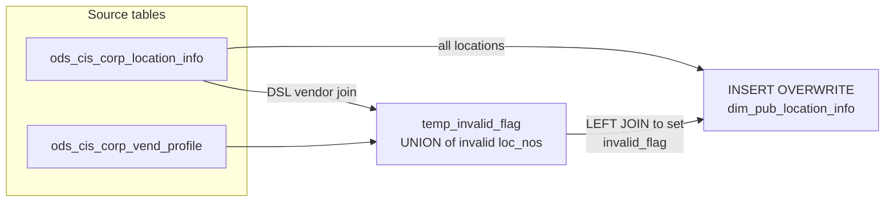

# DIM: Warehouse and Distribution Location Dimension (`dim_pub_location_info`)

- artifact_type: etl_table
- artifact_id: dim_us.dim_pub_location_info
- domain: inventory
- one_line_purpose: This job builds the country-specific location (warehouse/distribution centre) dimension by copying the full set of physical location attributes from the CIS location master and appending a derived `invalid_flag` that marks locations which s...
- layer_type: DIM
- source_kind: etl_sql
- evidence_source: source/etl/sql/inventory/source/etl/flows/public_order_tools/ingest/public_inventory_dimension/script/dim_pub_location_info.sql

---

## L1 Data Foundation

### Identity and physical mapping
- **Table:** `dim_us.dim_pub_location_info`
- **Layer type:** DIM
- **Canonical / derived:** Derived / ETL-loaded (see L3)
- **Owner team:** not registered in metadata catalog

### Grain, scope, exclusions
- **Grain:** one row per `loc_no` (location).
- **Scope:** See L2 business purpose / L3 filters
- **Partition:** none — full table overwrite. - resolved from pipeline (see L4)
- **Natural key:** `loc_no`.
- **Exclusions:** Not documented in repository

#### Grain detail (preserved)

- **Grain:** one row per `loc_no` (location).
- **Partition:** none — full table overwrite.
- **Natural key:** `loc_no`.

---

### Cross-engine presence
| Engine | Present | Canonical FQN | Notes |
|--------|---------|---------------|-------|
| Hive | yes | `dim_pub_location_info` | ETL target / intermediate per evidence script |
| Vertica | pending | `dim_pub_location_info` | Confirm via hive2vertica flow evidence / MCP |

### Physical schema reference

Pointer block only - full column catalog lives in WKB L1 storage JSON.

| Field | Value |
|-------|-------|
| **Authoritative catalog** | WKB L1 storage seed (not duplicated in this file) |
| **entity_id** | `dim_us.dim_pub_location_info` |
| **l1_catalog_seed** | `target/storage/wkb/snapshots/_snapshot_id_template/l1_catalog/{engine}_{schema}_{table}.json` |
| **column_count** | pending (run ddl_seed_writer) |
| **partition_keys** | `none — full table overwrite.` |
| **ddl_source** | pending Bitbucket DDL / Vertica metadata ingest |
| **retrieval** | `python -m tools.wkb.indexing.run_query --query "inventory dim_pub_location_info schema" --intent find_table_schema` |

### Lineage
| Object | Role |
|--------|------|
| `ods_${country_code}.ods_cis_corp_location_info` | Primary source — full location master |
| `ods_${country_code}.ods_cis_corp_vend_profile` | Invalid-flag subquery — identifies DSL-type vendor profiles |

---

### Freshness and load path
| Item | Value |
|------|-------|
| Load pattern | See L3 end-to-end / INSERT pattern in evidence script |
| Schedule | Not documented in repository |
| Parameters | `country_code` |


---

## L2 Declarative Knowledge

### Business purpose
This job builds the country-specific location (warehouse/distribution centre) dimension by copying
the full set of physical location attributes from the CIS location master and appending a derived
`invalid_flag` that marks locations which should be excluded from standard inventory reporting.
A location is flagged invalid if it is an active DSL-type vendor location (other than a specific
carve-out for loc_no 193) or if its external classification type (`ext_type`) is anything other
than the standard `C1`. Downstream fact tables and reports join to this table to filter valid
warehouse locations and enrich records with address, timezone, and routing attributes.

---

### Audience and use cases
| Audience | How they benefit |
|----------|-----------------|
| **Inventory analytics / BI** | Filter `invalid_flag = 'N'` to restrict reports to valid operational warehouse/DC locations |
| **Logistics / operations** | Use address fields (`loc_addr`, `loc_city`, `loc_state`, `loc_zip_code`), timezone, and freight attributes (`frt_loc_no`, `frt_account`, `frt_meter`) for shipment and routing analysis |
| **Data engineering** | Join on `loc_no` as a standard dimension key; use `agg_loc_no_vend`, `agg_loc_no_1src` for aggregation-level grouping |
| **Warehouse management** | `whse_flag`, `atm_flag`, `phy_distr_wh`, `geo_zone` support warehouse-level capacity and physical distribution analysis |

---

### Identifier search profile
- Primary lookup keys: see natural key under L1 Grain.
- Use latest snapshot / active flags when documented in L3 filters.

### Time field semantics
- **date_flag / partition columns:** none — full table overwrite.
- Primary reporting filter should use the partition column(s) documented in L1; resolve values via L4.

### Metrics served
When exposing this table to the business, lead with:

1. **Valid locations for inventory:** filter `invalid_flag = 'N'`
2. **Location hierarchy:** `loc_no`, `agg_loc_no_vend`, `agg_loc_no_1src` — supports drill-down from DC to aggregate level
3. **Routing attributes:** `frt_loc_no`, `geo_zone`, `cutoff_time`, `loc_timezone`

---

### Metric serving map
N/A - not a `*_comb_mtd` / multi-period wide serving table (or map not present in legacy doc).


### Data products and column groups (preserved)

### Identifiers and relationships

- **Location:** `loc_no`
- **Aggregation location (vendor level):** `agg_loc_no_vend`
- **Aggregation location (single-source level):** `agg_loc_no_1src`
- **Freight location:** `frt_loc_no`
- **Company:** `company_no`
- **External system reference:** `ext_no`, `ext_loc_no`

### Dimension columns (reporting-ready, pre-computed from source)

Use these for **filters, group-bys, and star-schema joins**:

- `loc_name` — location name
- `loc_addr`, `loc_pobox`, `loc_city`, `loc_state`, `loc_zip_code` — physical address
- `country_code` — country the location belongs to
- `loc_timezone` — timezone of the location (useful for cutoff-time calculations)
- `cutoff_time` — order cutoff time for the location
- `geo_zone` — geographic zone for grouping
- `loc_char` — location characteristic code
- `ext_type` — external system type (e.g., `C1` = standard)
- `whse_flag` — warehouse flag
- `atm_flag` — ATM flag
- `phy_distr_wh` — physical distribution warehouse indicator
- `flag` — general status flag
- `description` — free-text description
- `invalid_flag` — **`'Y'`** if location is a DSL vendor location or non-standard ext_type; **`'N'`** for all valid operational locations

### Quantity, pricing, and cost building blocks

- `hit`, `miss`, `priority` — routing/fulfilment prioritisation attributes
- `frt_account`, `frt_meter`, `master_meter`, `master_acct`, `ups_account`, `fdxgnd_account` — freight account references

> **Note:** `invalid_flag = 'Y'` rows are included in the table so that fact tables can filter or audit them; they are not removed.

---

### etl_metrics

#### `invalid_flag`
- **Source:** [metric-index.md](../../source/contracts/inventory/metric-index.md#invalid_flag)
- **Business definition:** `'Y'` if the location is in the DSL-or-non-C1 invalid set; `'N'` for all standard operational locations
```sql
CASE WHEN ti.loc_no IS NOT NULL THEN 'Y' ELSE 'N' END
```


---

## L3 Procedural Knowledge

### Query and routing rules
**Business filters:** Use partition / date keys from L1 grain for reporting scope.
**Technical predicates (load only):** See Key filters and step-by-step logic below.

### Dimension join patterns
| Dimension FQN | Join keys | Purpose | Evidence |
|---------------|-----------|---------|----------|
| See step-by-step / base tables | See L3 steps | Dimension enrichment | `source/etl/sql/inventory/source/etl/flows/public_order_tools/ingest/public_inventory_dimension/script/dim_pub_location_info.sql` |

### Key filters and ETL business logic
### Step 1 — `temp_invalid_flag` (view)

**Source:** UNION of two queries.

**Set 1 — Active DSL vendor locations:**

**Source:** `ods_cis_corp_location_info li` INNER JOIN `ods_cis_corp_vend_profile vp` ON `li.loc_no = vp.value_no`

**Filter:**
- `vp.profile_type LIKE 'DSL%'` — vendor profile is a DSL type (drop-ship-to-location classification)
- `vp.active = 'Y'` — only active profiles
- `li.loc_no != 193` — explicit carve-out: loc_no 193 is excluded from the invalid set despite matching the DSL profile

**Output:** `loc_no`

**Set 2 — Non-standard external type locations:**

**Source:** `ods_cis_corp_location_info li`

**Filter:**
- `nvl(li.ext_type, 'C1') != 'C1'` — locations where `ext_type` is explicitly set to something other than `C1`; NULLs are coerced to `C1` and therefore treated as valid

**Output:** `loc_no`

---

### Step 2 — Final `INSERT OVERWRITE` into `dim_pub_location_info`

**From:** `ods_cis_corp_location_info li` LEFT JOIN `temp_invalid_flag ti` ON `li.loc_no = ti.loc_no`

**Pass-through columns from `ods_cis_corp_location_info` (alias `li`):**
`loc_no`, `loc_name`, `loc_addr`, `loc_pobox`, `loc_city`, `loc_state`, `loc_zip_code`, `company_no`,
`entry_datetime`, `entry_id`, `loc_char`, `whse_flag`, `atm_flag`, `hit`, `miss`, `priority`,
`country_code`, `frt_loc_no`, `phy_distr_wh`, `agg_loc_no_vend`, `agg_loc_no_1src`, `geo_zone`,
`cutoff_time`, `frt_account`, `frt_meter`, `flag`, `description`, `server_ip`, `master_meter`,
`master_acct`, `ups_account`, ...

### Standard time-filter SQL
```sql
-- relative period filter using resolved partition value (see L4)
SELECT *
FROM dim_pub_location_info
WHERE /* partition predicate */ date_flag = '${partition_value}';
```

### End-to-end flow
**Runtime parameters:** `country_code`
**Target table:** `dim_${country_code}.dim_pub_location_info` — no partition (full overwrite).

1. Build `temp_invalid_flag` (view): UNION of two sets of loc_no values that should be flagged invalid — DSL vendor locations (active, profile_type `DSL%`, excluding loc_no 193) and locations with `ext_type != 'C1'`.
2. Read all rows from `ods_cis_corp_location_info`.
3. LEFT JOIN `temp_invalid_flag` on `loc_no` to derive `invalid_flag`.
4. **INSERT OVERWRITE** all location columns plus `invalid_flag` into `dim_pub_location_info`.



---


#### High-level stages (preserved)

| Stage | Business meaning |
|-------|-----------------|
| **Identify invalid locations** | Finds locations that are active DSL vendor locations (profile_type `DSL%`, active=`Y`, excluding loc_no 193) OR have a non-standard `ext_type` (not `C1`) — these are locations that should be suppressed in standard inventory views |
| **Full location dump with invalid flag** | Reads every location from `ods_cis_corp_location_info`, LEFT JOINs the invalid set, and sets `invalid_flag = 'Y'` for matches, `'N'` otherwise |
| **INSERT OVERWRITE** | Full refresh of `dim_pub_location_info` for the given country |

**Parameters:** `country_code`

---


### Base tables register
| Object | Role in this job |
|--------|-----------------|
| `ods_${country_code}.ods_cis_corp_location_info` | Primary source — all location attributes; also used in the invalid-flag subquery to detect non-standard `ext_type` |
| `ods_${country_code}.ods_cis_corp_vend_profile` | Used in the invalid-flag subquery to identify active DSL-type vendor locations via `profile_type LIKE 'DSL%'` and `active = 'Y'` |

**Temporary tables (inside the job only):**
`temp_invalid_flag` (view) → (final `INSERT`)

---

### Step-by-step logic
### Step 1 — `temp_invalid_flag` (view)

**Source:** UNION of two queries.

**Set 1 — Active DSL vendor locations:**

**Source:** `ods_cis_corp_location_info li` INNER JOIN `ods_cis_corp_vend_profile vp` ON `li.loc_no = vp.value_no`

**Filter:**
- `vp.profile_type LIKE 'DSL%'` — vendor profile is a DSL type (drop-ship-to-location classification)
- `vp.active = 'Y'` — only active profiles
- `li.loc_no != 193` — explicit carve-out: loc_no 193 is excluded from the invalid set despite matching the DSL profile

**Output:** `loc_no`

**Set 2 — Non-standard external type locations:**

**Source:** `ods_cis_corp_location_info li`

**Filter:**
- `nvl(li.ext_type, 'C1') != 'C1'` — locations where `ext_type` is explicitly set to something other than `C1`; NULLs are coerced to `C1` and therefore treated as valid

**Output:** `loc_no`

---

### Step 2 — Final `INSERT OVERWRITE` into `dim_pub_location_info`

**From:** `ods_cis_corp_location_info li` LEFT JOIN `temp_invalid_flag ti` ON `li.loc_no = ti.loc_no`

**Pass-through columns from `ods_cis_corp_location_info` (alias `li`):**
`loc_no`, `loc_name`, `loc_addr`, `loc_pobox`, `loc_city`, `loc_state`, `loc_zip_code`, `company_no`,
`entry_datetime`, `entry_id`, `loc_char`, `whse_flag`, `atm_flag`, `hit`, `miss`, `priority`,
`country_code`, `frt_loc_no`, `phy_distr_wh`, `agg_loc_no_vend`, `agg_loc_no_1src`, `geo_zone`,
`cutoff_time`, `frt_account`, `frt_meter`, `flag`, `description`, `server_ip`, `master_meter`,
`master_acct`, `ups_account`, `fdxgnd_account`, `ext_type`, `ext_no`, `ext_loc_no`, `loc_timezone`

**Derived columns computed at INSERT:**

| Column | Formula | Plain language |
|--------|---------|----------------|
| `invalid_flag` | `CASE WHEN ti.loc_no IS NOT NULL THEN 'Y' ELSE 'N' END` | `'Y'` if the location is in the DSL-or-non-C1 invalid set; `'N'` for all standard operational locations |

---

### Relationship map (embedded)

| from_fqn | to_fqn | cardinality | join_keys | provenance |
|----------|--------|-------------|-----------|------------|
| `ods_${country_code}.ods_cis_corp_location_info` | `ods_${country_code}.ods_cis_corp_vend_profile` | many:1 | `li.loc_no` = `vp.value_no` | etl_sql (`source/etl/sql/inventory/public_order_scripts/public_inventory_dimension/script/dim_pub_location_info.sql:5`) |
| `ods_${country_code}.ods_cis_corp_location_info` | `temp_invalid_flag` | many:1 (LEFT) | `li.loc_no` = `ti.loc_no` | etl_sql (`source/etl/sql/inventory/public_order_scripts/public_inventory_dimension/script/dim_pub_location_info.sql:57`) |

### Special logic (embedded)

Not documented in repository

### Column / field derivations (from ETL SQL)

| target_column | expression_sql | upstream_columns | upstream_tables | transform_kind | evidence |
|---------------|----------------|------------------|-----------------|----------------|----------|
| `loc_no` | `li.loc_no` | `loc_no` | `ods_${country_code}.ods_cis_corp_location_info`, `temp_invalid_flag` | passthrough | `source/etl/sql/inventory/public_order_scripts/public_inventory_dimension/script/dim_pub_location_info.sql:6` |
| `loc_name` | `li.loc_name` | `loc_name` | `ods_${country_code}.ods_cis_corp_location_info`, `temp_invalid_flag` | passthrough | `source/etl/sql/inventory/public_order_scripts/public_inventory_dimension/script/dim_pub_location_info.sql:19` |
| `loc_addr` | `li.loc_addr` | `loc_addr` | `ods_${country_code}.ods_cis_corp_location_info`, `temp_invalid_flag` | passthrough | `source/etl/sql/inventory/public_order_scripts/public_inventory_dimension/script/dim_pub_location_info.sql:20` |
| `loc_pobox` | `li.loc_pobox` | `loc_pobox` | `ods_${country_code}.ods_cis_corp_location_info`, `temp_invalid_flag` | passthrough | `source/etl/sql/inventory/public_order_scripts/public_inventory_dimension/script/dim_pub_location_info.sql:21` |
| `loc_city` | `li.loc_city` | `loc_city` | `ods_${country_code}.ods_cis_corp_location_info`, `temp_invalid_flag` | passthrough | `source/etl/sql/inventory/public_order_scripts/public_inventory_dimension/script/dim_pub_location_info.sql:22` |
| `loc_state` | `li.loc_state` | `loc_state` | `ods_${country_code}.ods_cis_corp_location_info`, `temp_invalid_flag` | passthrough | `source/etl/sql/inventory/public_order_scripts/public_inventory_dimension/script/dim_pub_location_info.sql:23` |
| `loc_zip_code` | `li.loc_zip_code` | `loc_zip_code` | `ods_${country_code}.ods_cis_corp_location_info`, `temp_invalid_flag` | passthrough | `source/etl/sql/inventory/public_order_scripts/public_inventory_dimension/script/dim_pub_location_info.sql:24` |
| `company_no` | `li.company_no` | `company_no` | `ods_${country_code}.ods_cis_corp_location_info`, `temp_invalid_flag` | passthrough | `source/etl/sql/inventory/public_order_scripts/public_inventory_dimension/script/dim_pub_location_info.sql:25` |
| `entry_datetime` | `li.entry_datetime` | `entry_datetime` | `ods_${country_code}.ods_cis_corp_location_info`, `temp_invalid_flag` | passthrough | `source/etl/sql/inventory/public_order_scripts/public_inventory_dimension/script/dim_pub_location_info.sql:26` |
| `entry_id` | `li.entry_id` | `entry_id` | `ods_${country_code}.ods_cis_corp_location_info`, `temp_invalid_flag` | passthrough | `source/etl/sql/inventory/public_order_scripts/public_inventory_dimension/script/dim_pub_location_info.sql:27` |
| `loc_char` | `li.loc_char` | `loc_char` | `ods_${country_code}.ods_cis_corp_location_info`, `temp_invalid_flag` | passthrough | `source/etl/sql/inventory/public_order_scripts/public_inventory_dimension/script/dim_pub_location_info.sql:28` |
| `whse_flag` | `li.whse_flag` | `whse_flag` | `ods_${country_code}.ods_cis_corp_location_info`, `temp_invalid_flag` | passthrough | `source/etl/sql/inventory/public_order_scripts/public_inventory_dimension/script/dim_pub_location_info.sql:29` |
| `atm_flag` | `li.atm_flag` | `atm_flag` | `ods_${country_code}.ods_cis_corp_location_info`, `temp_invalid_flag` | passthrough | `source/etl/sql/inventory/public_order_scripts/public_inventory_dimension/script/dim_pub_location_info.sql:30` |
| `hit` | `li.hit` | `hit` | `ods_${country_code}.ods_cis_corp_location_info`, `temp_invalid_flag` | passthrough | `source/etl/sql/inventory/public_order_scripts/public_inventory_dimension/script/dim_pub_location_info.sql:31` |
| `miss` | `li.miss` | `miss` | `ods_${country_code}.ods_cis_corp_location_info`, `temp_invalid_flag` | passthrough | `source/etl/sql/inventory/public_order_scripts/public_inventory_dimension/script/dim_pub_location_info.sql:32` |
| `priority` | `li.priority` | `priority` | `ods_${country_code}.ods_cis_corp_location_info`, `temp_invalid_flag` | passthrough | `source/etl/sql/inventory/public_order_scripts/public_inventory_dimension/script/dim_pub_location_info.sql:33` |
| `country_code` | `li.country_code` | `country_code` | `ods_${country_code}.ods_cis_corp_location_info`, `temp_invalid_flag` | passthrough | `source/etl/sql/inventory/public_order_scripts/public_inventory_dimension/script/dim_pub_location_info.sql:34` |
| `frt_loc_no` | `li.frt_loc_no` | `frt_loc_no` | `ods_${country_code}.ods_cis_corp_location_info`, `temp_invalid_flag` | passthrough | `source/etl/sql/inventory/public_order_scripts/public_inventory_dimension/script/dim_pub_location_info.sql:35` |
| `phy_distr_wh` | `li.phy_distr_wh` | `phy_distr_wh` | `ods_${country_code}.ods_cis_corp_location_info`, `temp_invalid_flag` | passthrough | `source/etl/sql/inventory/public_order_scripts/public_inventory_dimension/script/dim_pub_location_info.sql:36` |
| `agg_loc_no_vend` | `li.agg_loc_no_vend` | `agg_loc_no_vend` | `ods_${country_code}.ods_cis_corp_location_info`, `temp_invalid_flag` | passthrough | `source/etl/sql/inventory/public_order_scripts/public_inventory_dimension/script/dim_pub_location_info.sql:37` |
| `agg_loc_no_1src` | `li.agg_loc_no_1src` | `agg_loc_no_1src` | `ods_${country_code}.ods_cis_corp_location_info`, `temp_invalid_flag` | passthrough | `source/etl/sql/inventory/public_order_scripts/public_inventory_dimension/script/dim_pub_location_info.sql:38` |
| `geo_zone` | `li.geo_zone` | `geo_zone` | `ods_${country_code}.ods_cis_corp_location_info`, `temp_invalid_flag` | passthrough | `source/etl/sql/inventory/public_order_scripts/public_inventory_dimension/script/dim_pub_location_info.sql:39` |
| `cutoff_time` | `li.cutoff_time` | `cutoff_time` | `ods_${country_code}.ods_cis_corp_location_info`, `temp_invalid_flag` | passthrough | `source/etl/sql/inventory/public_order_scripts/public_inventory_dimension/script/dim_pub_location_info.sql:40` |
| `frt_account` | `li.frt_account` | `frt_account` | `ods_${country_code}.ods_cis_corp_location_info`, `temp_invalid_flag` | passthrough | `source/etl/sql/inventory/public_order_scripts/public_inventory_dimension/script/dim_pub_location_info.sql:41` |
| `frt_meter` | `li.frt_meter` | `frt_meter` | `ods_${country_code}.ods_cis_corp_location_info`, `temp_invalid_flag` | passthrough | `source/etl/sql/inventory/public_order_scripts/public_inventory_dimension/script/dim_pub_location_info.sql:42` |
| `flag` | `li.flag` | `flag` | `ods_${country_code}.ods_cis_corp_location_info`, `temp_invalid_flag` | passthrough | `source/etl/sql/inventory/public_order_scripts/public_inventory_dimension/script/dim_pub_location_info.sql:43` |
| `description` | `li.description` | `description` | `ods_${country_code}.ods_cis_corp_location_info`, `temp_invalid_flag` | passthrough | `source/etl/sql/inventory/public_order_scripts/public_inventory_dimension/script/dim_pub_location_info.sql:44` |
| `server_ip` | `li.server_ip` | `server_ip` | `ods_${country_code}.ods_cis_corp_location_info`, `temp_invalid_flag` | passthrough | `source/etl/sql/inventory/public_order_scripts/public_inventory_dimension/script/dim_pub_location_info.sql:45` |
| `master_meter` | `li.master_meter` | `master_meter` | `ods_${country_code}.ods_cis_corp_location_info`, `temp_invalid_flag` | passthrough | `source/etl/sql/inventory/public_order_scripts/public_inventory_dimension/script/dim_pub_location_info.sql:46` |
| `master_acct` | `li.master_acct` | `master_acct` | `ods_${country_code}.ods_cis_corp_location_info`, `temp_invalid_flag` | passthrough | `source/etl/sql/inventory/public_order_scripts/public_inventory_dimension/script/dim_pub_location_info.sql:47` |
| `ups_account` | `li.ups_account` | `ups_account` | `ods_${country_code}.ods_cis_corp_location_info`, `temp_invalid_flag` | passthrough | `source/etl/sql/inventory/public_order_scripts/public_inventory_dimension/script/dim_pub_location_info.sql:48` |
| `fdxgnd_account` | `li.fdxgnd_account` | `fdxgnd_account` | `ods_${country_code}.ods_cis_corp_location_info`, `temp_invalid_flag` | passthrough | `source/etl/sql/inventory/public_order_scripts/public_inventory_dimension/script/dim_pub_location_info.sql:49` |
| `ext_type` | `li.ext_type` | `ext_type` | `ods_${country_code}.ods_cis_corp_location_info`, `temp_invalid_flag` | passthrough | `source/etl/sql/inventory/public_order_scripts/public_inventory_dimension/script/dim_pub_location_info.sql:13` |
| `ext_no` | `li.ext_no` | `ext_no` | `ods_${country_code}.ods_cis_corp_location_info`, `temp_invalid_flag` | passthrough | `source/etl/sql/inventory/public_order_scripts/public_inventory_dimension/script/dim_pub_location_info.sql:51` |
| `ext_loc_no` | `li.ext_loc_no` | `ext_loc_no` | `ods_${country_code}.ods_cis_corp_location_info`, `temp_invalid_flag` | passthrough | `source/etl/sql/inventory/public_order_scripts/public_inventory_dimension/script/dim_pub_location_info.sql:52` |
| `loc_timezone` | `li.loc_timezone` | `loc_timezone` | `ods_${country_code}.ods_cis_corp_location_info`, `temp_invalid_flag` | passthrough | `source/etl/sql/inventory/public_order_scripts/public_inventory_dimension/script/dim_pub_location_info.sql:53` |
| `invalid_flag` | `case when ti.loc_no is not null then 'Y' else 'N' end` | `loc_no`, `Y`, `N` | `ods_${country_code}.ods_cis_corp_location_info`, `temp_invalid_flag` | case | `source/etl/sql/inventory/public_order_scripts/public_inventory_dimension/script/dim_pub_location_info.sql:54` |

### Sentinel and code values
| Value | Meaning |
|-------|---------|
| `invalid_flag = 'Y'` | Location is a DSL vendor location (active, profile_type `DSL%`) or has non-standard `ext_type`; should be excluded from standard inventory quantity and aging views |
| `invalid_flag = 'N'` | Standard operational warehouse/DC location — safe to include in inventory reports |
| `loc_no = 193` | Hardcoded carve-out: this location matches DSL profile criteria but is explicitly excluded from the invalid set |
| `nvl(ext_type, 'C1')` | NULL `ext_type` is treated as `C1` (standard) and therefore not flagged invalid |
| `profile_type LIKE 'DSL%'` | Drop-ship-to-location vendor profile classification |

---

---

## L4 Validation

### Resolved partition value
| Step | Source | How partition / date scope is determined |
|------|--------|------------------------------------------|
| 1 | evidence script / flow | See parameters in L1 Freshness and L3 filters - `source/etl/sql/inventory/source/etl/flows/public_order_tools/ingest/public_inventory_dimension/script/dim_pub_location_info.sql` |

**Plain language:** Partition and date scope follow Azkaban/bootstrap parameters documented in the source script and orchestrating flow; do not hardcode calendar literals.

### Data quality checks
- Prefer row-count-by-partition, metric sums, and grain duplicate checks (see Validation SQL).
- Additional checks from legacy caveats / operational notes when present.

### Validation SQL
```sql
-- 1) Row count by partition
SELECT ${partition_col}, COUNT(*) AS row_cnt
FROM dim_${country_code}.dim_pub_location_info
WHERE ${partition_col} = '${partition_value}'
GROUP BY ${partition_col};

-- 2) Metric sum by business dimension (top deltas)
SELECT ${dim_key}, SUM(${metric}) AS metric_sum
FROM dim_${country_code}.dim_pub_location_info
WHERE ${partition_col} = '${partition_value}'
GROUP BY ${dim_key}
ORDER BY ABS(SUM(${metric})) DESC
LIMIT 20;

-- 3) Grain duplicate check
SELECT ${grain_key_1}, ${grain_key_2}, ${grain_key_3}, ${partition_col}, COUNT(*) AS cnt
FROM dim_${country_code}.dim_pub_location_info
WHERE ${partition_col} = '${partition_value}'
GROUP BY ${grain_key_1}, ${grain_key_2}, ${grain_key_3}, ${partition_col}
HAVING COUNT(*) > 1;
```

Replace placeholders from this file's Grain and keys / Data you can fetch sections, and use the resolved partition value from run scope.

### Caveats for interpretation
- **`loc_no = 193` carve-out:** This location is hardcoded to be excluded from the DSL invalid set. If the business rule changes, a code change is required.
- **NULL `ext_type` treated as valid:** `nvl(ext_type, 'C1')` means locations without an ext_type are implicitly treated as standard. If a new non-standard type is added, the filter picks it up automatically.
- **All locations included:** The INSERT includes both valid and invalid locations. Consumers must apply `WHERE invalid_flag = 'N'` themselves — the flag is for filtering, not pre-filtering.
- **Full refresh:** No incremental logic — location deletes in the source are reflected immediately.
- **Country-scoped:** Both source and target schemas are parameterized by `country_code`.

---

### Conflicts and open questions
- Schedule, owner, SLA: Not documented in repository (unless preserved schedule evidence above).
- Vertica MCP verification: pending unless confirmed in L5.


---

## L5 Runtime View

### Query path and engine preference
| Role | Hive object | Vertica object | Sync mode | Evidence | MCP verified |
|------|-------------|----------------|-----------|----------|--------------|
| **Query for reporting** | *See script lineage* | `dim_${country_code}.dim_pub_location_info` | *Verify from flow* | *Add flow file:line* | pending |
| **Hive alternative** | `*` | `dim_${country_code}.dim_pub_location_info` | - | *See dependencies* | - |
| **ETL internal** | staging/temp tables | *Not synced to Vertica* | - | *See step-by-step logic* | - |

Business users should query `dim_${country_code}.dim_pub_location_info` in Vertica once MCP verification is completed for this document.

### Access constraints
- Country / company schema parameters may apply (`literal_country`, `company_no`, etc.).
- Hive-only staging objects are not reporting surfaces unless synced.

### Query risk profile
| Field | Value |
|-------|-------|
| requires_date_predicate | unknown |
| scan_risk_tier | medium |

---

## L6 Access and Consumption

### Primary consumers and use cases
| Audience | How they benefit |
|----------|-----------------|
| **Inventory analytics / BI** | Filter `invalid_flag = 'N'` to restrict reports to valid operational warehouse/DC locations |
| **Logistics / operations** | Use address fields (`loc_addr`, `loc_city`, `loc_state`, `loc_zip_code`), timezone, and freight attributes (`frt_loc_no`, `frt_account`, `frt_meter`) for shipment and routing analysis |
| **Data engineering** | Join on `loc_no` as a standard dimension key; use `agg_loc_no_vend`, `agg_loc_no_1src` for aggregation-level grouping |
| **Warehouse management** | `whse_flag`, `atm_flag`, `phy_distr_wh`, `geo_zone` support warehouse-level capacity and physical distribution analysis |

---

### Representative query patterns
```sql
-- certified / illustrative lookup - replace predicates from L1/L4
SELECT *
FROM dim_pub_location_info
WHERE date_flag = '${partition_value}'
LIMIT 100;
```

### Dependencies and notes
### Upstream objects (verified)

| Object | Usage | Evidence |
|--------|-------|----------|
| `ods_${country_code}.ods_cis_corp_location_info` | All location attribute columns; also used in invalid-flag subquery (ext_type filter) | `source/etl/sql/inventory/source/etl/flows/public_order_tools/ingest/public_inventory_dimension/script/dim_pub_location_info.sql:4` |
| `ods_${country_code}.ods_cis_corp_vend_profile` | DSL vendor profile detection in invalid-flag subquery | `source/etl/sql/inventory/source/etl/flows/public_order_tools/ingest/public_inventory_dimension/script/dim_pub_location_info.sql:6` |

### Downstream consumers (verified)

None identified in repository.

### Operational detail (verified)

- Full table overwrite on every run (no partition): `source/etl/sql/inventory/source/etl/flows/public_order_tools/ingest/public_inventory_dimension/script/dim_pub_location_info.sql:15`
- `invalid_flag` derived at INSERT via LEFT JOIN with temp view: `source/etl/sql/inventory/source/etl/flows/public_order_tools/ingest/public_inventory_dimension/script/dim_pub_location_info.sql:54`

### Not documented in repository

- Schedule, owner, SLA — not in scripts or configs
- Business rationale for the loc_no 193 carve-out
- Full set of `profile_type` values beginning with `DSL`
- Business definition of `ext_type` values other than `C1`

### Related scripts (verified)

- `dim_pub_inv_type_extend.sql` — sibling dimension script in same folder — `source/etl/sql/inventory/source/etl/flows/public_order_tools/ingest/public_inventory_dimension/script/`

---

*Document generated from `source/etl/sql/inventory/source/etl/flows/public_order_tools/ingest/public_inventory_dimension/script/dim_pub_location_info.sql`.*

#### Not documented in repository
- Owner, SLA (unless schedule evidence preserved above)
- Any dependency without `file:line` evidence in this document

---

*Document migrated to L1-L6 from legacy Knowledgebase content. Evidence: `source/etl/sql/inventory/source/etl/flows/public_order_tools/ingest/public_inventory_dimension/script/dim_pub_location_info.sql`.*
