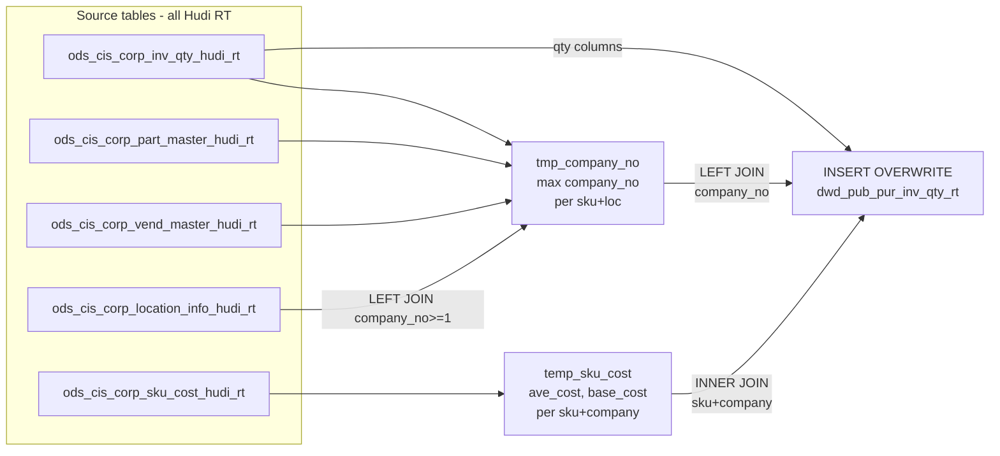

# DWD: Real-Time Purchase Inventory Quantity (`dwd_pub_pur_inv_qty_rt`)

- artifact_type: etl_table
- artifact_id: dw_us.dwd_pub_pur_inv_qty_rt
- domain: inventory
- one_line_purpose: This job builds a near-real-time inventory quantity table for purchase inventory by reading from Hudi real-time (RT) sources. It enriches each SKU+location inventory record with company number resolution (preferring the location's company a...
- layer_type: DWD
- source_kind: etl_sql
- evidence_source: source/etl/sql/inventory/source/etl/flows/public_order_tools/ingest/public_inventory_dw/script/dwd_pub_pur_inv_qty_rt.sql

---

## L1 Data Foundation

### Identity and physical mapping
- **Table:** `dw_us.dwd_pub_pur_inv_qty_rt`
- **Layer type:** DWD
- **Canonical / derived:** Derived / ETL-loaded (see L3)
- **Owner team:** not registered in metadata catalog

### Grain, scope, exclusions
- **Grain:** one row per `sku_no` + `loc_no` + `inv_type` combination.
- **Scope:** See L2 business purpose / L3 filters
- **Partition:** none — full overwrite of real-time snapshot. - resolved from pipeline (see L4)
- **Natural key:** `sku_no`, `loc_no`, `inv_type`.
- **Exclusions:** Not documented in repository

#### Grain detail (preserved)

- **Grain:** one row per `sku_no` + `loc_no` + `inv_type` combination.
- **Partition:** none — full overwrite of real-time snapshot.
- **Natural key:** `sku_no`, `loc_no`, `inv_type`.

---

### Cross-engine presence
| Engine | Present | Canonical FQN | Notes |
|--------|---------|---------------|-------|
| Hive | yes | `dwd_pub_pur_inv_qty_rt` | ETL target / intermediate per evidence script |
| Vertica | pending | `dwd_pub_pur_inv_qty_rt` | Confirm via hive2vertica flow evidence / MCP |

### Physical schema reference

Pointer block only - full column catalog lives in WKB L1 storage JSON.

| Field | Value |
|-------|-------|
| **Authoritative catalog** | WKB L1 storage seed (not duplicated in this file) |
| **entity_id** | `dw_us.dwd_pub_pur_inv_qty_rt` |
| **l1_catalog_seed** | `target/storage/wkb/snapshots/_snapshot_id_template/l1_catalog/{engine}_{schema}_{table}.json` |
| **column_count** | pending (run ddl_seed_writer) |
| **partition_keys** | `none — full overwrite of real-time snapshot.` |
| **ddl_source** | pending Bitbucket DDL / Vertica metadata ingest |
| **retrieval** | `python -m tools.wkb.indexing.run_query --query "inventory dwd_pub_pur_inv_qty_rt schema" --intent find_table_schema` |

### Lineage
| Object | Role |
|--------|------|
| `ods_${country_code}.ods_cis_corp_inv_qty_hudi_rt` | Primary source — inventory quantity positions (RT) |
| `ods_${country_code}.ods_cis_corp_part_master_hudi_rt` | Part master — chains SKU to vendor for company resolution |
| `ods_${country_code}.ods_cis_corp_vend_master_hudi_rt` | Vendor master — fallback company_no |
| `ods_${country_code}.ods_cis_corp_location_info_hudi_rt` | Location master — preferred company_no (if >= 1) |
| `ods_${country_code}.ods_cis_corp_sku_cost_hudi_rt` | SKU cost — company-level cost attributes for enrichment |

---

### Freshness and load path
| Item | Value |
|------|-------|
| Load pattern | See L3 end-to-end / INSERT pattern in evidence script |
| Schedule | Not documented in repository |
| Parameters | `country_code` |


---

## L2 Declarative Knowledge

### Business purpose
This job builds a near-real-time inventory quantity table for purchase inventory by reading from
Hudi real-time (RT) sources. It enriches each SKU+location inventory record with company number
resolution (preferring the location's company affiliation when available, falling back to the
vendor's company) and with SKU-level cost data sourced from the SKU cost table. The result is a
current-state snapshot of on-hand, back-ordered, allocated, in-transit, and other quantity
positions, combined with multiple cost dimensions (average cost, FX-adjusted cost, base cost),
enabling real-time inventory valuation and position monitoring.

---

### Audience and use cases
| Audience | How they benefit |
|----------|-----------------|
| **Inventory / supply chain** | Real-time view of `on_hand_qty`, `bo_qty`, `on_order_qty`, `alloc_qty`, `intran_out`, `intran_in` per SKU and location — supports live inventory position monitoring |
| **Finance / cost accounting** | `ave_cost`, `ave_cost_sku_cost`, `ave_cost_fx_sku_cost`, `base_cost_sku_cost`, `base_cost_fx_sku_cost` enable real-time inventory valuation in local and foreign currency |
| **Purchasing** | `on_order_qty`, `intran_in` support buyer views of open purchase positions and inbound pipeline |
| **Operations / warehouse** | KWO (kit/work-order) quantities (`kwo_comp_rio_qty`, `kwo_oh_qty`, `kwo_bo_qty`) and WIP/RIO quantities for manufacturing-adjacent inventory tracking |

---

### Fact key resolution
- Natural key: `sku_no`, `loc_no`, `inv_type`.
- FK / label-on attributes: see L3 dimension join patterns and step-by-step logic.
- Negative assertion: do not treat descriptive labels as grain keys unless listed under natural key.

### Time field semantics
- **date_flag / partition columns:** none — full overwrite of real-time snapshot.
- Primary reporting filter should use the partition column(s) documented in L1; resolve values via L4.

### Metrics served
When exposing this table to the business, lead with:

1. **Real-time inventory position:** `on_hand_qty`, `bo_qty`, `on_order_qty`, `alloc_qty`
2. **In-transit pipeline:** `intran_in`, `intran_out`
3. **Inventory valuation:** `on_hand_qty × ave_cost_sku_cost` (company-specific average cost) or `× base_cost_sku_cost`
4. **Multi-currency cost:** `ave_cost_fx_sku_cost`, `base_cost_fx_sku_cost` for FX-adjusted valuation
5. **KWO/WIP positions:** `kwo_oh_qty`, `wip_qty`, `rio_qty` for manufacturing-adjacent inventory

---

### Metric serving map
N/A - not a `*_comb_mtd` / multi-period wide serving table (or map not present in legacy doc).


### Data products and column groups (preserved)

### Identifiers and relationships

- **Product:** `sku_no`
- **Location:** `loc_no`
- **Inventory type:** `inv_type`
- **Company:** `company_no` — resolved from location (preferred) or vendor master

### Dimension columns (reporting-ready, pre-computed from source)

Use these for **filters, group-bys, and star-schema joins**:

- `inv_type` — inventory type code (join to `dim_pub_inv_type_extend` for description and flags)
- `loc_no` — warehouse/DC location (join to `dim_pub_location_info` for address and invalid_flag)
- `company_no` — owning company, resolved via location/vendor hierarchy
- `entry_datetime`, `entry_id` — CIS record creation metadata

### Quantity building blocks

- `on_hand_qty` — current on-hand quantity
- `bo_qty` — back-order quantity (demand exceeding supply)
- `on_order_qty` — quantity on open purchase orders
- `alloc_qty` — quantity allocated to open orders
- `intran_out` — quantity in-transit outbound
- `intran_in` — quantity in-transit inbound
- `wip_qty` — work-in-progress quantity
- `rio_qty` — received-in-other (transfer/receipt) quantity
- `kwo_comp_rio_qty` — kit/work-order component received-in-other quantity
- `kwo_oh_qty` — kit/work-order on-hand quantity
- `kwo_bo_qty` — kit/work-order back-order quantity

### Cost building blocks

- `std_cost` — standard cost from inventory qty record
- `ave_cost` — average cost from inventory qty record (iq-level)
- `ave_cost_2lc` — average cost in second local currency
- `ave_cost_sku_cost` — average cost from SKU cost table (company-specific)
- `ave_cost_fx_sku_cost` — FX-adjusted average cost from SKU cost table
- `base_cost_sku_cost` — base cost from SKU cost table
- `base_cost_fx_sku_cost` — FX-adjusted base cost from SKU cost table

### Core derived metrics

| Column | Formula | Business reading |
|--------|---------|-----------------|
| `company_no` | `max(coalesce(lo.company_no, vm.company_no))` per sku_no+loc_no | Owning company — location-assigned if loc company_no >= 1, else vendor master company |

---

### etl_metrics

#### `company_no`
- **Source:** [metric-index.md](../../source/contracts/inventory/metric-index.md#company_no)
- **Business definition:** Owning company — location-assigned if loc company_no >= 1, else vendor master company
```sql
max(coalesce(lo.company_no, vm.company_no))` per sku_no+loc_no
```

#### `etl_timestamp`
- **Source:** [metric-index.md](../../source/contracts/inventory/metric-index.md#etl_timestamp)
- **Business definition:** ETL run timestamp in Los Angeles local time
```sql
from_utc_timestamp(current_timestamp(), 'America/Los_Angeles')
```


---

## L3 Procedural Knowledge

### Query and routing rules
**Business filters:** Use partition / date keys from L1 grain for reporting scope.
**Technical predicates (load only):** See Key filters and step-by-step logic below.

### Dimension join patterns
| Dimension FQN | Join keys | Purpose | Evidence |
|---------------|-----------|---------|----------|
| See step-by-step / base tables | See L3 steps | Dimension enrichment | `source/etl/sql/inventory/source/etl/flows/public_order_tools/ingest/public_inventory_dw/script/dwd_pub_pur_inv_qty_rt.sql` |

### Key filters and ETL business logic
### Step 1 — `tmp_company_no` (view)

**Source:**
- `ods_cis_corp_inv_qty_hudi_rt iq` INNER JOIN `ods_cis_corp_part_master_hudi_rt pm` ON `iq.sku_no = pm.sku_no`
- INNER JOIN `ods_cis_corp_vend_master_hudi_rt vm` ON `pm.vend_no = vm.vend_no`
- LEFT JOIN `ods_cis_corp_location_info_hudi_rt lo` ON `iq.loc_no = lo.loc_no AND lo.company_no >= 1`

**Filter:**
- INNER JOIN with part_master and vend_master means only SKUs with a valid part master and vendor chain are included
- LEFT JOIN condition `lo.company_no >= 1` means only locations with a positive company assignment contribute their company_no; unassigned locations contribute NULL from this join

**Derived columns in this step:**

| Column | Formula | Plain language |
|--------|---------|----------------|
| `company_no` | `max(coalesce(lo.company_no, vm.company_no))` grouped by sku_no, loc_no | Prefers the location's company assignment (lo.company_no) when available; falls back to the vendor's company (vm.company_no). `max()` aggregates in case of multiple matches |

---

### Step 2 — `temp_sku_cost` (view)

**Source:** `ods_cis_corp_sku_cost_hudi_rt sc`

**Filter:** None — all rows.

**Pass-through columns:** `ave_cost` (aliased as `ave_cost_sku_cost`), `ave_cost_fx` (aliased as `ave_cost_fx_sku_cost`), `base_cost` (aliased as `base_cost_sku_cost`), `base_cost_fx` (aliased as `base_cost_fx_sku_cost`), `company_no`, `sku_no`

---

### Step 3 — Final `INSERT OVERWRITE` into `dwd_pub_pur_inv_qty_rt`

**From:** `ods_cis_corp_inv...

### Standard time-filter SQL
```sql
-- relative period filter using resolved partition value (see L4)
SELECT *
FROM dwd_pub_pur_inv_qty_rt
WHERE /* partition predicate */ date_flag = '${partition_value}';
```

### End-to-end flow
**Runtime parameters:** `country_code`
**Target table:** `dw_${country_code}.dwd_pub_pur_inv_qty_rt` — no partition (full real-time overwrite).

1. Build `tmp_company_no` (view): join `ods_cis_corp_inv_qty_hudi_rt` with `ods_cis_corp_part_master_hudi_rt` and `ods_cis_corp_vend_master_hudi_rt` to get vendor company; LEFT JOIN `ods_cis_corp_location_info_hudi_rt` (where company_no >= 1) to get location company. Take `max(coalesce(loc.company_no, vend.company_no))` per sku_no + loc_no.
2. Build `temp_sku_cost` (view): read all cost columns from `ods_cis_corp_sku_cost_hudi_rt` (ave_cost, ave_cost_fx, base_cost, base_cost_fx, company_no, sku_no).
3. **INSERT OVERWRITE**: read `ods_cis_corp_inv_qty_hudi_rt`, LEFT JOIN `tmp_company_no` (for company_no), INNER JOIN `temp_sku_cost` (on sku_no + company_no) to add cost columns. Compute `etl_timestamp` in LA time.



---


#### High-level stages (preserved)

| Stage | Business meaning |
|-------|-----------------|
| **Resolve company number per SKU+location** | Joins inventory qty, part master, and vendor master to determine which company owns each SKU+location combination; prefers the location's assigned company if it has one (company_no >= 1), otherwise falls back to the vendor master's company |
| **Read SKU-level costs** | Reads `ave_cost`, `ave_cost_fx`, `base_cost`, `base_cost_fx` from the SKU cost RT table, keyed by sku_no + company_no |
| **INSERT OVERWRITE** | Combines inventory quantity positions with company-resolved cost data; only SKUs with a matching company-level cost record are written to the target (INNER JOIN on SKU cost) |

**Parameters:** `country_code`

---


### Base tables register
| Object | Role in this job |
|--------|-----------------|
| `ods_${country_code}.ods_cis_corp_inv_qty_hudi_rt` | Primary source — all inventory quantity positions per sku_no, loc_no, inv_type (Hudi RT) |
| `ods_${country_code}.ods_cis_corp_part_master_hudi_rt` | Part master — provides `vend_no` for each SKU, used to chain to vendor master for company resolution |
| `ods_${country_code}.ods_cis_corp_vend_master_hudi_rt` | Vendor master — provides `company_no` as fallback when location has no company assignment |
| `ods_${country_code}.ods_cis_corp_location_info_hudi_rt` | Location master (RT) — provides `company_no` for the location; preferred over vendor company when >= 1 |
| `ods_${country_code}.ods_cis_corp_sku_cost_hudi_rt` | SKU cost (RT) — company-specific cost attributes (`ave_cost`, `ave_cost_fx`, `base_cost`, `base_cost_fx`) |

**Temporary tables (inside the job only):**
`tmp_company_no` (view) → `temp_sku_cost` (view) → (final `INSERT`)

---

### Step-by-step logic
### Step 1 — `tmp_company_no` (view)

**Source:**
- `ods_cis_corp_inv_qty_hudi_rt iq` INNER JOIN `ods_cis_corp_part_master_hudi_rt pm` ON `iq.sku_no = pm.sku_no`
- INNER JOIN `ods_cis_corp_vend_master_hudi_rt vm` ON `pm.vend_no = vm.vend_no`
- LEFT JOIN `ods_cis_corp_location_info_hudi_rt lo` ON `iq.loc_no = lo.loc_no AND lo.company_no >= 1`

**Filter:**
- INNER JOIN with part_master and vend_master means only SKUs with a valid part master and vendor chain are included
- LEFT JOIN condition `lo.company_no >= 1` means only locations with a positive company assignment contribute their company_no; unassigned locations contribute NULL from this join

**Derived columns in this step:**

| Column | Formula | Plain language |
|--------|---------|----------------|
| `company_no` | `max(coalesce(lo.company_no, vm.company_no))` grouped by sku_no, loc_no | Prefers the location's company assignment (lo.company_no) when available; falls back to the vendor's company (vm.company_no). `max()` aggregates in case of multiple matches |

---

### Step 2 — `temp_sku_cost` (view)

**Source:** `ods_cis_corp_sku_cost_hudi_rt sc`

**Filter:** None — all rows.

**Pass-through columns:** `ave_cost` (aliased as `ave_cost_sku_cost`), `ave_cost_fx` (aliased as `ave_cost_fx_sku_cost`), `base_cost` (aliased as `base_cost_sku_cost`), `base_cost_fx` (aliased as `base_cost_fx_sku_cost`), `company_no`, `sku_no`

---

### Step 3 — Final `INSERT OVERWRITE` into `dwd_pub_pur_inv_qty_rt`

**From:** `ods_cis_corp_inv_qty_hudi_rt iq`

**Joins:**

| Join | Keys | Purpose |
|------|------|---------|
| LEFT JOIN `tmp_company_no tcn` | `iq.sku_no = tcn.sku_no AND iq.loc_no = tcn.loc_no` | Adds resolved `company_no`; LEFT JOIN preserves all inventory rows even if company cannot be resolved |
| INNER JOIN `temp_sku_cost sc` | `iq.sku_no = sc.sku_no AND tcn.company_no = sc.company_no` | Adds cost columns; INNER JOIN means rows without a matching company-level SKU cost are **excluded** from the output |

**Pass-through columns from `iq` (`ods_cis_corp_inv_qty_hudi_rt`):**
`sku_no`, `loc_no`, `inv_type`, `std_cost`, `on_hand_qty`, `bo_qty`, `on_order_qty`, `alloc_qty`,
`intran_out`, `intran_in`, `entry_datetime`, `entry_id`, `wip_qty`, `rio_qty`, `kwo_comp_rio_qty`,
`kwo_oh_qty`, `kwo_bo_qty`, `ave_cost_2lc`, `ave_cost`

**Pass-through columns from `sc` (`temp_sku_cost`):**
`ave_cost_sku_cost`, `ave_cost_fx_sku_cost`, `base_cost_sku_cost`, `base_cost_fx_sku_cost`

**Pass-through columns from `tcn` (`tmp_company_no`):**
`company_no`

**Derived columns computed at INSERT:**

| Column | Formula | Plain language |
|--------|---------|----------------|
| `etl_timestamp` | `from_utc_timestamp(current_timestamp(), 'America/Los_Angeles')` | ETL run timestamp in Los Angeles local time |

---

### Relationship map (embedded)

| from_fqn | to_fqn | cardinality | join_keys | provenance |
|----------|--------|-------------|-----------|------------|
| `ods_${country_code}.ods_cis_corp_inv_qty_hudi_rt` | `ods_${country_code}.ods_cis_corp_part_master_hudi_rt` | many:1 | `iq.sku_no` = `pm.sku_no` | etl_sql (`source/etl/sql/inventory/public_order_scripts/public_inventory_dw/script/dwd_pub_pur_inv_qty_rt.sql:6`) |
| `ods_${country_code}.ods_cis_corp_part_master_hudi_rt` | `ods_${country_code}.ods_cis_corp_vend_master_hudi_rt` | many:1 | `pm.vend_no` = `vm.vend_no` | etl_sql (`source/etl/sql/inventory/public_order_scripts/public_inventory_dw/script/dwd_pub_pur_inv_qty_rt.sql:8`) |
| `ods_${country_code}.ods_cis_corp_inv_qty_hudi_rt` | `ods_${country_code}.ods_cis_corp_location_info_hudi_rt` | many:1 (LEFT) | `iq.loc_no` = `lo.loc_no` | etl_sql (`source/etl/sql/inventory/public_order_scripts/public_inventory_dw/script/dwd_pub_pur_inv_qty_rt.sql:10`) |
| `ods_${country_code}.ods_cis_corp_inv_qty_hudi_rt` | `tmp_company_no` | many:1 (LEFT) | `iq.sku_no` = `tcn.sku_no`; `iq.loc_no` = `tcn.loc_no` | etl_sql (`source/etl/sql/inventory/public_order_scripts/public_inventory_dw/script/dwd_pub_pur_inv_qty_rt.sql:55`) |
| `ods_${country_code}.ods_cis_corp_inv_qty_hudi_rt` | `temp_sku_cost` | many:1 | `iq.sku_no` = `sc.sku_no`; `tcn.company_no` = `sc.company_no` | etl_sql (`source/etl/sql/inventory/public_order_scripts/public_inventory_dw/script/dwd_pub_pur_inv_qty_rt.sql:58`) |

### Special logic (embedded)

Not documented in repository

### Column / field derivations (from ETL SQL)

| target_column | expression_sql | upstream_columns | upstream_tables | transform_kind | evidence |
|---------------|----------------|------------------|-----------------|----------------|----------|
| `sku_no` | `iq.sku_no` | `sku_no` | `ods_${country_code}.ods_cis_corp_inv_qty_hudi_rt`, `tmp_company_no`, `temp_sku_cost` | passthrough | `source/etl/sql/inventory/public_order_scripts/public_inventory_dw/script/dwd_pub_pur_inv_qty_rt.sql:3` |
| `loc_no` | `iq.loc_no` | `loc_no` | `ods_${country_code}.ods_cis_corp_inv_qty_hudi_rt`, `tmp_company_no`, `temp_sku_cost` | passthrough | `source/etl/sql/inventory/public_order_scripts/public_inventory_dw/script/dwd_pub_pur_inv_qty_rt.sql:3` |
| `inv_type` | `iq.inv_type` | `inv_type` | `ods_${country_code}.ods_cis_corp_inv_qty_hudi_rt`, `tmp_company_no`, `temp_sku_cost` | passthrough | `source/etl/sql/inventory/public_order_scripts/public_inventory_dw/script/dwd_pub_pur_inv_qty_rt.sql:30` |
| `std_cost` | `iq.std_cost` | `std_cost` | `ods_${country_code}.ods_cis_corp_inv_qty_hudi_rt`, `tmp_company_no`, `temp_sku_cost` | passthrough | `source/etl/sql/inventory/public_order_scripts/public_inventory_dw/script/dwd_pub_pur_inv_qty_rt.sql:31` |
| `on_hand_qty` | `iq.on_hand_qty` | `on_hand_qty` | `ods_${country_code}.ods_cis_corp_inv_qty_hudi_rt`, `tmp_company_no`, `temp_sku_cost` | passthrough | `source/etl/sql/inventory/public_order_scripts/public_inventory_dw/script/dwd_pub_pur_inv_qty_rt.sql:32` |
| `bo_qty` | `iq.bo_qty` | `bo_qty` | `ods_${country_code}.ods_cis_corp_inv_qty_hudi_rt`, `tmp_company_no`, `temp_sku_cost` | passthrough | `source/etl/sql/inventory/public_order_scripts/public_inventory_dw/script/dwd_pub_pur_inv_qty_rt.sql:33` |
| `on_order_qty` | `iq.on_order_qty` | `on_order_qty` | `ods_${country_code}.ods_cis_corp_inv_qty_hudi_rt`, `tmp_company_no`, `temp_sku_cost` | passthrough | `source/etl/sql/inventory/public_order_scripts/public_inventory_dw/script/dwd_pub_pur_inv_qty_rt.sql:34` |
| `alloc_qty` | `iq.alloc_qty` | `alloc_qty` | `ods_${country_code}.ods_cis_corp_inv_qty_hudi_rt`, `tmp_company_no`, `temp_sku_cost` | passthrough | `source/etl/sql/inventory/public_order_scripts/public_inventory_dw/script/dwd_pub_pur_inv_qty_rt.sql:35` |
| `intran_out` | `iq.intran_out` | `intran_out` | `ods_${country_code}.ods_cis_corp_inv_qty_hudi_rt`, `tmp_company_no`, `temp_sku_cost` | passthrough | `source/etl/sql/inventory/public_order_scripts/public_inventory_dw/script/dwd_pub_pur_inv_qty_rt.sql:36` |
| `intran_in` | `iq.intran_in` | `intran_in` | `ods_${country_code}.ods_cis_corp_inv_qty_hudi_rt`, `tmp_company_no`, `temp_sku_cost` | passthrough | `source/etl/sql/inventory/public_order_scripts/public_inventory_dw/script/dwd_pub_pur_inv_qty_rt.sql:37` |
| `entry_datetime` | `iq.entry_datetime` | `entry_datetime` | `ods_${country_code}.ods_cis_corp_inv_qty_hudi_rt`, `tmp_company_no`, `temp_sku_cost` | passthrough | `source/etl/sql/inventory/public_order_scripts/public_inventory_dw/script/dwd_pub_pur_inv_qty_rt.sql:38` |
| `entry_id` | `iq.entry_id` | `entry_id` | `ods_${country_code}.ods_cis_corp_inv_qty_hudi_rt`, `tmp_company_no`, `temp_sku_cost` | passthrough | `source/etl/sql/inventory/public_order_scripts/public_inventory_dw/script/dwd_pub_pur_inv_qty_rt.sql:39` |
| `wip_qty` | `iq.wip_qty` | `wip_qty` | `ods_${country_code}.ods_cis_corp_inv_qty_hudi_rt`, `tmp_company_no`, `temp_sku_cost` | passthrough | `source/etl/sql/inventory/public_order_scripts/public_inventory_dw/script/dwd_pub_pur_inv_qty_rt.sql:40` |
| `rio_qty` | `iq.rio_qty` | `rio_qty` | `ods_${country_code}.ods_cis_corp_inv_qty_hudi_rt`, `tmp_company_no`, `temp_sku_cost` | passthrough | `source/etl/sql/inventory/public_order_scripts/public_inventory_dw/script/dwd_pub_pur_inv_qty_rt.sql:41` |
| `kwo_comp_rio_qty` | `iq.kwo_comp_rio_qty` | `kwo_comp_rio_qty` | `ods_${country_code}.ods_cis_corp_inv_qty_hudi_rt`, `tmp_company_no`, `temp_sku_cost` | passthrough | `source/etl/sql/inventory/public_order_scripts/public_inventory_dw/script/dwd_pub_pur_inv_qty_rt.sql:42` |
| `kwo_oh_qty` | `iq.kwo_oh_qty` | `kwo_oh_qty` | `ods_${country_code}.ods_cis_corp_inv_qty_hudi_rt`, `tmp_company_no`, `temp_sku_cost` | passthrough | `source/etl/sql/inventory/public_order_scripts/public_inventory_dw/script/dwd_pub_pur_inv_qty_rt.sql:43` |
| `kwo_bo_qty` | `iq.kwo_bo_qty` | `kwo_bo_qty` | `ods_${country_code}.ods_cis_corp_inv_qty_hudi_rt`, `tmp_company_no`, `temp_sku_cost` | passthrough | `source/etl/sql/inventory/public_order_scripts/public_inventory_dw/script/dwd_pub_pur_inv_qty_rt.sql:44` |
| `ave_cost_2lc` | `iq.ave_cost_2lc` | `ave_cost_2lc` | `ods_${country_code}.ods_cis_corp_inv_qty_hudi_rt`, `tmp_company_no`, `temp_sku_cost` | passthrough | `source/etl/sql/inventory/public_order_scripts/public_inventory_dw/script/dwd_pub_pur_inv_qty_rt.sql:45` |
| `ave_cost` | `iq.ave_cost` | `ave_cost` | `ods_${country_code}.ods_cis_corp_inv_qty_hudi_rt`, `tmp_company_no`, `temp_sku_cost` | passthrough | `source/etl/sql/inventory/public_order_scripts/public_inventory_dw/script/dwd_pub_pur_inv_qty_rt.sql:45` |
| `ave_cost_sku_cost` | `sc.ave_cost_sku_cost` | `ave_cost_sku_cost` | `ods_${country_code}.ods_cis_corp_inv_qty_hudi_rt`, `tmp_company_no`, `temp_sku_cost` | passthrough | `source/etl/sql/inventory/public_order_scripts/public_inventory_dw/script/dwd_pub_pur_inv_qty_rt.sql:47` |
| `ave_cost_fx_sku_cost` | `sc.ave_cost_fx_sku_cost` | `ave_cost_fx_sku_cost` | `ods_${country_code}.ods_cis_corp_inv_qty_hudi_rt`, `tmp_company_no`, `temp_sku_cost` | passthrough | `source/etl/sql/inventory/public_order_scripts/public_inventory_dw/script/dwd_pub_pur_inv_qty_rt.sql:48` |
| `base_cost_sku_cost` | `sc.base_cost_sku_cost` | `base_cost_sku_cost` | `ods_${country_code}.ods_cis_corp_inv_qty_hudi_rt`, `tmp_company_no`, `temp_sku_cost` | passthrough | `source/etl/sql/inventory/public_order_scripts/public_inventory_dw/script/dwd_pub_pur_inv_qty_rt.sql:49` |
| `base_cost_fx_sku_cost` | `sc.base_cost_fx_sku_cost` | `base_cost_fx_sku_cost` | `ods_${country_code}.ods_cis_corp_inv_qty_hudi_rt`, `tmp_company_no`, `temp_sku_cost` | passthrough | `source/etl/sql/inventory/public_order_scripts/public_inventory_dw/script/dwd_pub_pur_inv_qty_rt.sql:50` |
| `etl_timestamp` | `from_utc_timestamp(current_timestamp(),'America/Los_Angeles')` | `from_utc_timestamp`, `current_timestamp`, `America`, `Los_Angeles` | `ods_${country_code}.ods_cis_corp_inv_qty_hudi_rt`, `tmp_company_no`, `temp_sku_cost` | arithmetic | `source/etl/sql/inventory/public_order_scripts/public_inventory_dw/script/dwd_pub_pur_inv_qty_rt.sql:51` |
| `company_no` | `tcn.company_no` | `company_no` | `ods_${country_code}.ods_cis_corp_inv_qty_hudi_rt`, `tmp_company_no`, `temp_sku_cost` | passthrough | `source/etl/sql/inventory/public_order_scripts/public_inventory_dw/script/dwd_pub_pur_inv_qty_rt.sql:52` |

### Sentinel and code values
| Value | Meaning |
|-------|---------|
| `lo.company_no >= 1` | Condition in LEFT JOIN: only location-company assignments with a positive company_no are considered valid; 0 or NULL locations are treated as unassigned |
| `coalesce(lo.company_no, vm.company_no)` | Company resolution priority: location company first, vendor company as fallback |
| INNER JOIN on `temp_sku_cost` | SKU+company combinations without a cost record in `ods_cis_corp_sku_cost_hudi_rt` are **excluded** from the output — not all inventory rows will appear in the target |
| `_hudi_rt` suffix | All source tables are Hudi real-time tables — this job processes near-real-time data, not daily batch snapshots |

---

---

## L4 Validation

### Resolved partition value
| Step | Source | How partition / date scope is determined |
|------|--------|------------------------------------------|
| 1 | evidence script / flow | See parameters in L1 Freshness and L3 filters - `source/etl/sql/inventory/source/etl/flows/public_order_tools/ingest/public_inventory_dw/script/dwd_pub_pur_inv_qty_rt.sql` |

**Plain language:** Partition and date scope follow Azkaban/bootstrap parameters documented in the source script and orchestrating flow; do not hardcode calendar literals.

### Data quality checks
- Prefer row-count-by-partition, metric sums, and grain duplicate checks (see Validation SQL).
- Additional checks from legacy caveats / operational notes when present.

### Validation SQL
```sql
-- 1) Row count by partition
SELECT ${partition_col}, COUNT(*) AS row_cnt
FROM dw_${country_code}.dwd_pub_pur_inv_qty_rt
WHERE ${partition_col} = '${partition_value}'
GROUP BY ${partition_col};

-- 2) Metric sum by business dimension (top deltas)
SELECT ${dim_key}, SUM(${metric}) AS metric_sum
FROM dw_${country_code}.dwd_pub_pur_inv_qty_rt
WHERE ${partition_col} = '${partition_value}'
GROUP BY ${dim_key}
ORDER BY ABS(SUM(${metric})) DESC
LIMIT 20;

-- 3) Grain duplicate check
SELECT ${grain_key_1}, ${grain_key_2}, ${grain_key_3}, ${partition_col}, COUNT(*) AS cnt
FROM dw_${country_code}.dwd_pub_pur_inv_qty_rt
WHERE ${partition_col} = '${partition_value}'
GROUP BY ${grain_key_1}, ${grain_key_2}, ${grain_key_3}, ${partition_col}
HAVING COUNT(*) > 1;
```

Replace placeholders from this file's Grain and keys / Data you can fetch sections, and use the resolved partition value from run scope.

### Caveats for interpretation
- **INNER JOIN on SKU cost excludes rows:** Any inventory SKU+location where `company_no` cannot be resolved via `tmp_company_no`, or where the resolved company has no entry in `ods_cis_corp_sku_cost_hudi_rt`, will be **silently dropped** from the output. The target table is not a complete copy of `ods_cis_corp_inv_qty_hudi_rt`.
- **Company resolution uses `max()`:** If a sku+loc combination has multiple vendor or location company candidates, `max()` picks the highest numeric company_no. This may not always reflect the intended owning company.
- **Real-time (Hudi RT) sources:** Data freshness depends on Hudi ingestion cadence. The table represents the latest available state, not a daily snapshot.
- **Two `ave_cost` columns:** `ave_cost` (from `ods_cis_corp_inv_qty_hudi_rt`, iq-level) and `ave_cost_sku_cost` (from `ods_cis_corp_sku_cost_hudi_rt`, company-level) may differ. Use `ave_cost_sku_cost` for company-consistent valuation.
- **No partition:** Full overwrite on every run; the table always reflects current state, not historical snapshots.
- **Country-scoped:** Both source (`ods_${country_code}`) and target (`dw_${country_code}`) schemas are parameterized by `country_code`.

---

### Conflicts and open questions
- Schedule, owner, SLA: Not documented in repository (unless preserved schedule evidence above).
- Vertica MCP verification: pending unless confirmed in L5.


---

## L5 Runtime View

### Query path and engine preference
| Role | Hive object | Vertica object | Sync mode | Evidence | MCP verified |
|------|-------------|----------------|-----------|----------|--------------|
| **Query for reporting** | *See script lineage* | `dw_${country_code}.dwd_pub_pur_inv_qty_rt` | *Verify from flow* | *Add flow file:line* | pending |
| **Hive alternative** | `*` | `dw_${country_code}.dwd_pub_pur_inv_qty_rt` | - | *See dependencies* | - |
| **ETL internal** | staging/temp tables | *Not synced to Vertica* | - | *See step-by-step logic* | - |

Business users should query `dw_${country_code}.dwd_pub_pur_inv_qty_rt` in Vertica once MCP verification is completed for this document.

### Access constraints
- Country / company schema parameters may apply (`literal_country`, `company_no`, etc.).
- Hive-only staging objects are not reporting surfaces unless synced.

### Query risk profile
| Field | Value |
|-------|-------|
| requires_date_predicate | unknown |
| scan_risk_tier | high |

---

## L6 Access and Consumption

### Primary consumers and use cases
| Audience | How they benefit |
|----------|-----------------|
| **Inventory / supply chain** | Real-time view of `on_hand_qty`, `bo_qty`, `on_order_qty`, `alloc_qty`, `intran_out`, `intran_in` per SKU and location — supports live inventory position monitoring |
| **Finance / cost accounting** | `ave_cost`, `ave_cost_sku_cost`, `ave_cost_fx_sku_cost`, `base_cost_sku_cost`, `base_cost_fx_sku_cost` enable real-time inventory valuation in local and foreign currency |
| **Purchasing** | `on_order_qty`, `intran_in` support buyer views of open purchase positions and inbound pipeline |
| **Operations / warehouse** | KWO (kit/work-order) quantities (`kwo_comp_rio_qty`, `kwo_oh_qty`, `kwo_bo_qty`) and WIP/RIO quantities for manufacturing-adjacent inventory tracking |

---

### Representative query patterns
```sql
-- certified / illustrative lookup - replace predicates from L1/L4
SELECT *
FROM dwd_pub_pur_inv_qty_rt
WHERE date_flag = '${partition_value}'
LIMIT 100;
```

### Dependencies and notes
### Upstream objects (verified)

| Object | Usage | Evidence |
|--------|-------|----------|
| `ods_${country_code}.ods_cis_corp_inv_qty_hudi_rt` | All inventory quantity columns; JOIN key for company and cost resolution | `source/etl/sql/inventory/source/etl/flows/public_order_tools/ingest/public_inventory_dw/script/dwd_pub_pur_inv_qty_rt.sql:4` |
| `ods_${country_code}.ods_cis_corp_part_master_hudi_rt` | `vend_no` — links SKU to vendor master | `source/etl/sql/inventory/source/etl/flows/public_order_tools/ingest/public_inventory_dw/script/dwd_pub_pur_inv_qty_rt.sql:6` |
| `ods_${country_code}.ods_cis_corp_vend_master_hudi_rt` | `company_no` — vendor-level company fallback | `source/etl/sql/inventory/source/etl/flows/public_order_tools/ingest/public_inventory_dw/script/dwd_pub_pur_inv_qty_rt.sql:8` |
| `ods_${country_code}.ods_cis_corp_location_info_hudi_rt` | `company_no` — location-level company (preferred, condition >= 1) | `source/etl/sql/inventory/source/etl/flows/public_order_tools/ingest/public_inventory_dw/script/dwd_pub_pur_inv_qty_rt.sql:10` |
| `ods_${country_code}.ods_cis_corp_sku_cost_hudi_rt` | `ave_cost`, `ave_cost_fx`, `base_cost`, `base_cost_fx`, `company_no`, `sku_no` | `source/etl/sql/inventory/source/etl/flows/public_order_tools/ingest/public_inventory_dw/script/dwd_pub_pur_inv_qty_rt.sql:17` |

### Downstream consumers (verified)

None identified in repository.

### Operational detail (verified)

- Full table overwrite on every run (no partition): `source/etl/sql/inventory/source/etl/flows/public_order_tools/ingest/public_inventory_dw/script/dwd_pub_pur_inv_qty_rt.sql:26`
- INNER JOIN on `temp_sku_cost` means rows without company-level cost match are excluded: `source/etl/sql/inventory/source/etl/flows/public_order_tools/ingest/public_inventory_dw/script/dwd_pub_pur_inv_qty_rt.sql:58`

### Not documented in repository

- Schedule, owner, SLA — not in scripts or configs
- Hudi RT ingestion frequency and lag
- Business definition of `company_no >= 1` threshold for location eligibility
- Explanation of `max()` aggregation in `tmp_company_no` when multiple candidates exist

---

*Document generated from `source/etl/sql/inventory/source/etl/flows/public_order_tools/ingest/public_inventory_dw/script/dwd_pub_pur_inv_qty_rt.sql`.*

#### Not documented in repository
- Owner, SLA (unless schedule evidence preserved above)
- Any dependency without `file:line` evidence in this document

---

*Document migrated to L1-L6 from legacy Knowledgebase content. Evidence: `source/etl/sql/inventory/source/etl/flows/public_order_tools/ingest/public_inventory_dw/script/dwd_pub_pur_inv_qty_rt.sql`.*
