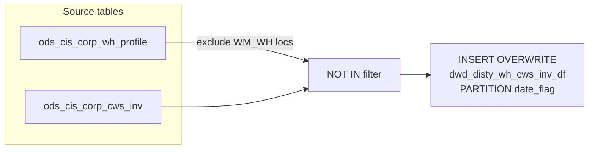

# DWD: Distributor WH CWS Inventory Snapshot (`dwd_disty_wh_cws_inv_df`)

- artifact_type: etl_table
- artifact_id: ${literal_target_db}.dwd_disty_wh_cws_inv_df
- domain: inventory
- one_line_purpose: This job loads a daily snapshot of cycle-count and inventory-balance data from the CIS corporate CWS (Cycle-count Worksheet) inventory table into the DWD layer. It covers all warehouse locations **except** those flagged as WM-managed wareho...
- layer_type: DWD
- source_kind: etl_sql
- evidence_source: source/etl/sql/inventory/data_service/wh_cws/sql/dwd_disty_wh_cws_inv_df.sql

---

## L1 Data Foundation

### Identity and physical mapping
- **Table:** `${literal_target_db}.dwd_disty_wh_cws_inv_df`
- **Layer type:** DWD
- **Canonical / derived:** Derived / ETL-loaded (see L3)
- **Owner team:** not registered in metadata catalog

### Grain, scope, exclusions
- **Grain:** one row per location (`loc_no`) + bin location (`bin_loc`) + SKU (`sku_no`) + inventory type (`inv_type`) per `date_flag` partition.
- **Scope:** See L2 business purpose / L3 filters
- **Partition:** `date_flag` — the business date of the snapshot. - resolved from pipeline (see L4)
- **Natural key:** `loc_no`, `bin_loc`, `sku_no`, `inv_type` (within a partition).
- **Exclusions:** Not documented in repository

#### Grain detail (preserved)

- **Grain:** one row per location (`loc_no`) + bin location (`bin_loc`) + SKU (`sku_no`) + inventory type (`inv_type`) per `date_flag` partition.
- **Partition:** `date_flag` — the business date of the snapshot.
- **Natural key:** `loc_no`, `bin_loc`, `sku_no`, `inv_type` (within a partition).

---

### Cross-engine presence
| Engine | Present | Canonical FQN | Notes |
|--------|---------|---------------|-------|
| Hive | yes | `${literal_target_db}.dwd_disty_wh_cws_inv_df` | ETL target / intermediate per evidence script |
| Vertica | pending | `${literal_target_db}.dwd_disty_wh_cws_inv_df` | Confirm via hive2vertica flow evidence / MCP |

### Physical schema reference

Pointer block only - full column catalog lives in WKB L1 storage JSON.

| Field | Value |
|-------|-------|
| **Authoritative catalog** | WKB L1 storage seed (not duplicated in this file) |
| **entity_id** | `${literal_target_db}.dwd_disty_wh_cws_inv_df` |
| **l1_catalog_seed** | `target/storage/wkb/snapshots/_snapshot_id_template/l1_catalog/{engine}_{schema}_{table}.json` |
| **column_count** | pending (run ddl_seed_writer) |
| **partition_keys** | `date_flag` |
| **ddl_source** | pending Bitbucket DDL / Vertica metadata ingest |
| **retrieval** | `python -m tools.wkb.indexing.run_query --query "inventory dwd_disty_wh_cws_inv_df schema" --intent find_table_schema` |

### Lineage
| Object | Role |
|--------|------|
| `${literal_source_db}.ods_cis_corp_cws_inv` | Primary source — CWS inventory snapshot |
| `${literal_source_db}.ods_cis_corp_wh_profile` | Exclusion filter — WM warehouse profile |

---

### Freshness and load path
| Item | Value |
|------|-------|
| Load pattern | See L3 end-to-end / INSERT pattern in evidence script |
| Schedule | Not documented in repository |
| Parameters | `literal_target_db`, `literal_source_db`, `literal_etl_timestamp_zone`, `literal_date_flag` |


---

## L2 Declarative Knowledge

### Business purpose
This job loads a daily snapshot of cycle-count and inventory-balance data from the CIS corporate
CWS (Cycle-count Worksheet) inventory table into the DWD layer. It covers all warehouse locations
**except** those flagged as WM-managed warehouses, giving the reporting layer a clean view of
non-WM distributor inventory for cycle-count tracking and discrepancy analysis.

---

### Audience and use cases
| Audience | How they benefit |
|----------|-----------------|
| **Inventory / Operations team** | Cycle-count scheduling, discrepancy review (`discrep_flag`, `cis_discrep`, `cis_discrep_date`) |
| **Finance / Costing** | FIFO date (`fifo_date`) and adjustment tracking (`last_adjust_date`, `last_adjust_qty`) for cost reconciliation |
| **Data Engineering** | Serves as a DWD source for downstream aging and quantity analytics that need CWS-specific inventory lines |

---

### Fact key resolution
- Natural key: `loc_no`, `bin_loc`, `sku_no`, `inv_type` (within a partition).
- FK / label-on attributes: see L3 dimension join patterns and step-by-step logic.
- Negative assertion: do not treat descriptive labels as grain keys unless listed under natural key.

### Time field semantics
- **date_flag / partition columns:** `date_flag` — the business date of the snapshot.
- Primary reporting filter should use the partition column(s) documented in L1; resolve values via L4.

### Metrics served
When exposing this table to the business, lead with:

1. **Cycle-count compliance:** `last_cc_date`, `cc_ws_date`
2. **Discrepancy tracking:** `discrep_flag`, `cis_discrep`, `cis_discrep_date`
3. **Inventory position:** `tot_qty`, `bin_loc`, `average_age`
4. **Adjustment history:** `last_adjust_date`, `last_adjust_qty`

---

### Metric serving map
N/A - not a `*_comb_mtd` / multi-period wide serving table (or map not present in legacy doc).


### Data products and column groups (preserved)

### Identifiers and relationships

- **Location:** `loc_no`, `bin_loc`
- **Product:** `sku_no`
- **Inventory type:** `inv_type`

### Dimension columns

Use these for **filters, group-bys, and star-schema joins**:

- `loc_no` — warehouse location code
- `bin_loc` — bin within the warehouse
- `inv_type` — inventory type classifier
- `discrep_flag` — indicates a discrepancy exists between system and physical count
- `h_version` — history version of the CWS record

### Quantity and timing columns

- `tot_qty` — total on-hand quantity at this bin/SKU
- `average_age` — average age of the inventory (days)
- `cc_date`, `cc_count_qty`, `cc_db_qty` — most recent cycle count: date, counted quantity, system balance
- `cc2_date`, `cc2_count_qty`, `cc2_db_qty` — second-most-recent cycle count details
- `last_cc_date` — date of the last cycle count performed
- `last_adjust_date`, `last_adjust_qty` — date and quantity of the last inventory adjustment
- `cc_ws_date` — cycle-count worksheet date
- `fifo_date` — FIFO layer date for cost valuation
- `cis_discrep`, `cis_discrep_date` — CIS-side discrepancy amount and date

---

### etl_metrics

N/A - no calculable ETL formulas extracted from this document (passthrough / stored measures only, or formulas not documented).

---

## L3 Procedural Knowledge

### Query and routing rules
**Business filters:** Use partition / date keys from L1 grain for reporting scope.
**Technical predicates (load only):** See Key filters and step-by-step logic below.

### Dimension join patterns
| Dimension FQN | Join keys | Purpose | Evidence |
|---------------|-----------|---------|----------|
| See step-by-step / base tables | See L3 steps | Dimension enrichment | `source/etl/sql/inventory/data_service/wh_cws/sql/dwd_disty_wh_cws_inv_df.sql` |

### Key filters and ETL business logic
### Step 1 — Final `INSERT OVERWRITE` into `dwd_disty_wh_cws_inv_df`

**From:** `${literal_source_db}.ods_cis_corp_cws_inv`

**Filter (natural language):**
- Exclude any `loc_no` that exists in `ods_cis_corp_wh_profile` with `profile_type = 'WM_WH'` AND `profile_value = 'Y'` (WM-managed warehouses are excluded because they have their own inventory management system and should not appear here)

**Pass-through columns:**
`loc_no`, `bin_loc`, `sku_no`, `inv_type`, `tot_qty`, `average_age`, `cc_date`, `cc_count_qty`, `cc_db_qty`, `cc2_date`, `cc2_count_qty`, `cc2_db_qty`, `last_cc_date`, `last_adjust_date`, `last_adjust_qty`, `cc_ws_date`, `discrep_flag`, `cis_discrep`, `cis_discrep_date`, `fifo_date`, `h_version`

**Derived columns computed at INSERT:**

| Column | Formula | Plain language |
|--------|---------|----------------|
| ETL timestamp | `'${literal_etl_timestamp_zone}'` | Timestamp of the ETL run, passed as a parameter |
| Fixed integer | `0` | Hardcoded sentinel — positional filler column |
| `date_flag` | `'${literal_date_flag}'` | Business date of the snapshot, used as partition key |

---

### Standard time-filter SQL
```sql
-- relative period filter using resolved partition value (see L4)
SELECT *
FROM ${literal_target_db}.dwd_disty_wh_cws_inv_df
WHERE /* partition predicate */ date_flag = '${partition_value}';
```

### End-to-end flow
**Runtime parameters:** `literal_target_db`, `literal_source_db`, `literal_etl_timestamp_zone`, `literal_date_flag`
**Target table:** `${literal_target_db}.dwd_disty_wh_cws_inv_df`, partitioned by **`date_flag`**.

1. **Read** all rows from `ods_cis_corp_cws_inv` (source ODS table).
2. **Exclude** locations that appear in `ods_cis_corp_wh_profile` with `profile_type = 'WM_WH'` AND `profile_value = 'Y'`.
3. **INSERT OVERWRITE** the target partition with the filtered rows, stamping `literal_etl_timestamp_zone` as the ETL timestamp, `0` as a fixed integer, and `literal_date_flag` as the partition value.



---


#### High-level stages (preserved)

| Stage | Business meaning |
|-------|-----------------|
| **Filter WM locations** | Excludes warehouse locations where `profile_type = 'WM_WH'` and `profile_value = 'Y'`, so only non-WM CWS inventory is loaded |
| **INSERT OVERWRITE** | Overwrites the target partition for `date_flag` with all qualified CWS inventory rows from the source ODS table |

**Parameters:** `literal_target_db`, `literal_source_db`, `literal_etl_timestamp_zone`, `literal_date_flag`

---


### Base tables register
| Object | Role in this job |
|--------|-----------------|
| `${literal_source_db}.ods_cis_corp_cws_inv` | Primary source — all CWS inventory rows including cycle-count details |
| `${literal_source_db}.ods_cis_corp_wh_profile` | Exclusion dimension — identifies WM-managed warehouse locations (`profile_type='WM_WH'`, `profile_value='Y'`) |

**Temporary tables (inside the job only):**
None — single direct INSERT from source with subquery filter.

---

### Step-by-step logic
### Step 1 — Final `INSERT OVERWRITE` into `dwd_disty_wh_cws_inv_df`

**From:** `${literal_source_db}.ods_cis_corp_cws_inv`

**Filter (natural language):**
- Exclude any `loc_no` that exists in `ods_cis_corp_wh_profile` with `profile_type = 'WM_WH'` AND `profile_value = 'Y'` (WM-managed warehouses are excluded because they have their own inventory management system and should not appear here)

**Pass-through columns:**
`loc_no`, `bin_loc`, `sku_no`, `inv_type`, `tot_qty`, `average_age`, `cc_date`, `cc_count_qty`, `cc_db_qty`, `cc2_date`, `cc2_count_qty`, `cc2_db_qty`, `last_cc_date`, `last_adjust_date`, `last_adjust_qty`, `cc_ws_date`, `discrep_flag`, `cis_discrep`, `cis_discrep_date`, `fifo_date`, `h_version`

**Derived columns computed at INSERT:**

| Column | Formula | Plain language |
|--------|---------|----------------|
| ETL timestamp | `'${literal_etl_timestamp_zone}'` | Timestamp of the ETL run, passed as a parameter |
| Fixed integer | `0` | Hardcoded sentinel — positional filler column |
| `date_flag` | `'${literal_date_flag}'` | Business date of the snapshot, used as partition key |

---

### Relationship map (embedded)

| from_fqn | to_fqn | cardinality | join_keys | provenance |
|----------|--------|-------------|-----------|------------|
| `${literal_source_db}.ods_cis_corp_cws_inv` | `${literal_source_db}.ods_cis_corp_cws_inv` | 1:1 source scan | — (no JOIN; single FROM) | etl_sql (`source/etl/sql/inventory/data_service/wh_cws/sql/dwd_disty_wh_cws_inv_df.sql:27`) |


### Special logic (embedded)

Not documented in repository

### Column / field derivations (from ETL SQL)

| target_column | expression_sql | upstream_columns | upstream_tables | transform_kind | evidence |
|---------------|----------------|------------------|-----------------|----------------|----------|
| `loc_no` | `loc_no` | `loc_no` | `${literal_source_db}.ods_cis_corp_cws_inv`, `${literal_source_db}.ods_cis_corp_wh_profile` | passthrough | `source/etl/sql/inventory/data_service/inventory/wh_cws/sql/dwd_disty_wh_cws_inv_df.sql:3` |
| `bin_loc` | `bin_loc` | `bin_loc` | `${literal_source_db}.ods_cis_corp_cws_inv`, `${literal_source_db}.ods_cis_corp_wh_profile` | passthrough | `source/etl/sql/inventory/data_service/inventory/wh_cws/sql/dwd_disty_wh_cws_inv_df.sql:4` |
| `sku_no` | `sku_no` | `sku_no` | `${literal_source_db}.ods_cis_corp_cws_inv`, `${literal_source_db}.ods_cis_corp_wh_profile` | passthrough | `source/etl/sql/inventory/data_service/inventory/wh_cws/sql/dwd_disty_wh_cws_inv_df.sql:5` |
| `inv_type` | `inv_type` | `inv_type` | `${literal_source_db}.ods_cis_corp_cws_inv`, `${literal_source_db}.ods_cis_corp_wh_profile` | passthrough | `source/etl/sql/inventory/data_service/inventory/wh_cws/sql/dwd_disty_wh_cws_inv_df.sql:6` |
| `tot_qty` | `tot_qty` | `tot_qty` | `${literal_source_db}.ods_cis_corp_cws_inv`, `${literal_source_db}.ods_cis_corp_wh_profile` | passthrough | `source/etl/sql/inventory/data_service/inventory/wh_cws/sql/dwd_disty_wh_cws_inv_df.sql:7` |
| `average_age` | `average_age` | `average_age` | `${literal_source_db}.ods_cis_corp_cws_inv`, `${literal_source_db}.ods_cis_corp_wh_profile` | passthrough | `source/etl/sql/inventory/data_service/inventory/wh_cws/sql/dwd_disty_wh_cws_inv_df.sql:8` |
| `cc_date` | `cc_date` | `cc_date` | `${literal_source_db}.ods_cis_corp_cws_inv`, `${literal_source_db}.ods_cis_corp_wh_profile` | passthrough | `source/etl/sql/inventory/data_service/inventory/wh_cws/sql/dwd_disty_wh_cws_inv_df.sql:9` |
| `cc_count_qty` | `cc_count_qty` | `cc_count_qty` | `${literal_source_db}.ods_cis_corp_cws_inv`, `${literal_source_db}.ods_cis_corp_wh_profile` | passthrough | `source/etl/sql/inventory/data_service/inventory/wh_cws/sql/dwd_disty_wh_cws_inv_df.sql:10` |
| `cc_db_qty` | `cc_db_qty` | `cc_db_qty` | `${literal_source_db}.ods_cis_corp_cws_inv`, `${literal_source_db}.ods_cis_corp_wh_profile` | passthrough | `source/etl/sql/inventory/data_service/inventory/wh_cws/sql/dwd_disty_wh_cws_inv_df.sql:11` |
| `cc2_date` | `cc2_date` | `cc2_date` | `${literal_source_db}.ods_cis_corp_cws_inv`, `${literal_source_db}.ods_cis_corp_wh_profile` | passthrough | `source/etl/sql/inventory/data_service/inventory/wh_cws/sql/dwd_disty_wh_cws_inv_df.sql:12` |
| `cc2_count_qty` | `cc2_count_qty` | `cc2_count_qty` | `${literal_source_db}.ods_cis_corp_cws_inv`, `${literal_source_db}.ods_cis_corp_wh_profile` | passthrough | `source/etl/sql/inventory/data_service/inventory/wh_cws/sql/dwd_disty_wh_cws_inv_df.sql:13` |
| `cc2_db_qty` | `cc2_db_qty` | `cc2_db_qty` | `${literal_source_db}.ods_cis_corp_cws_inv`, `${literal_source_db}.ods_cis_corp_wh_profile` | passthrough | `source/etl/sql/inventory/data_service/inventory/wh_cws/sql/dwd_disty_wh_cws_inv_df.sql:14` |
| `last_cc_date` | `last_cc_date` | `last_cc_date` | `${literal_source_db}.ods_cis_corp_cws_inv`, `${literal_source_db}.ods_cis_corp_wh_profile` | passthrough | `source/etl/sql/inventory/data_service/inventory/wh_cws/sql/dwd_disty_wh_cws_inv_df.sql:15` |
| `last_adjust_date` | `last_adjust_date` | `last_adjust_date` | `${literal_source_db}.ods_cis_corp_cws_inv`, `${literal_source_db}.ods_cis_corp_wh_profile` | passthrough | `source/etl/sql/inventory/data_service/inventory/wh_cws/sql/dwd_disty_wh_cws_inv_df.sql:16` |
| `last_adjust_qty` | `last_adjust_qty` | `last_adjust_qty` | `${literal_source_db}.ods_cis_corp_cws_inv`, `${literal_source_db}.ods_cis_corp_wh_profile` | passthrough | `source/etl/sql/inventory/data_service/inventory/wh_cws/sql/dwd_disty_wh_cws_inv_df.sql:17` |
| `cc_ws_date` | `cc_ws_date` | `cc_ws_date` | `${literal_source_db}.ods_cis_corp_cws_inv`, `${literal_source_db}.ods_cis_corp_wh_profile` | passthrough | `source/etl/sql/inventory/data_service/inventory/wh_cws/sql/dwd_disty_wh_cws_inv_df.sql:18` |
| `discrep_flag` | `discrep_flag` | `discrep_flag` | `${literal_source_db}.ods_cis_corp_cws_inv`, `${literal_source_db}.ods_cis_corp_wh_profile` | passthrough | `source/etl/sql/inventory/data_service/inventory/wh_cws/sql/dwd_disty_wh_cws_inv_df.sql:19` |
| `cis_discrep` | `cis_discrep` | `cis_discrep` | `${literal_source_db}.ods_cis_corp_cws_inv`, `${literal_source_db}.ods_cis_corp_wh_profile` | passthrough | `source/etl/sql/inventory/data_service/inventory/wh_cws/sql/dwd_disty_wh_cws_inv_df.sql:20` |
| `cis_discrep_date` | `cis_discrep_date` | `cis_discrep_date` | `${literal_source_db}.ods_cis_corp_cws_inv`, `${literal_source_db}.ods_cis_corp_wh_profile` | passthrough | `source/etl/sql/inventory/data_service/inventory/wh_cws/sql/dwd_disty_wh_cws_inv_df.sql:21` |
| `fifo_date` | `fifo_date` | `fifo_date` | `${literal_source_db}.ods_cis_corp_cws_inv`, `${literal_source_db}.ods_cis_corp_wh_profile` | passthrough | `source/etl/sql/inventory/data_service/inventory/wh_cws/sql/dwd_disty_wh_cws_inv_df.sql:22` |
| `h_version` | `h_version` | `h_version` | `${literal_source_db}.ods_cis_corp_cws_inv`, `${literal_source_db}.ods_cis_corp_wh_profile` | passthrough | `source/etl/sql/inventory/data_service/inventory/wh_cws/sql/dwd_disty_wh_cws_inv_df.sql:23` |
| `literal_etl_timestamp_zone` | `'${literal_etl_timestamp_zone}'` | `literal_etl_timestamp_zone` | `${literal_source_db}.ods_cis_corp_cws_inv`, `${literal_source_db}.ods_cis_corp_wh_profile` | literal | `source/etl/sql/inventory/data_service/inventory/wh_cws/sql/dwd_disty_wh_cws_inv_df.sql:24` |
| `0` | `0` | — | `${literal_source_db}.ods_cis_corp_cws_inv`, `${literal_source_db}.ods_cis_corp_wh_profile` | passthrough | `source/etl/sql/inventory/data_service/inventory/wh_cws/sql/dwd_disty_wh_cws_inv_df.sql:25` |
| `literal_date_flag` | `'${literal_date_flag}'` | `literal_date_flag` | `${literal_source_db}.ods_cis_corp_cws_inv`, `${literal_source_db}.ods_cis_corp_wh_profile` | literal | `source/etl/sql/inventory/data_service/inventory/wh_cws/sql/dwd_disty_wh_cws_inv_df.sql:26` |

### Sentinel and code values
| Value | Meaning |
|-------|---------|
| `profile_type = 'WM_WH'` AND `profile_value = 'Y'` | WM-managed warehouse; excluded from this table entirely |
| `0` (second-to-last column) | Hardcoded filler integer; business meaning not documented in source |

---

---

## L4 Validation

### Resolved partition value
| Step | Source | How partition / date scope is determined |
|------|--------|------------------------------------------|
| 1 | evidence script / flow | See parameters in L1 Freshness and L3 filters - `source/etl/sql/inventory/data_service/wh_cws/sql/dwd_disty_wh_cws_inv_df.sql` |

**Plain language:** Partition and date scope follow Azkaban/bootstrap parameters documented in the source script and orchestrating flow; do not hardcode calendar literals.

### Data quality checks
- Prefer row-count-by-partition, metric sums, and grain duplicate checks (see Validation SQL).
- Additional checks from legacy caveats / operational notes when present.

### Validation SQL
```sql
-- 1) row count by partition
-- SELECT partition_col, COUNT(*) FROM ${literal_target_db}.dwd_disty_wh_cws_inv_df WHERE partition_col = '${partition_value}' GROUP BY 1;
-- 2) metric sum by dimension (top N) - replace metric/dim from L2
-- 3) grain duplicate check on natural keys
```


### Caveats for interpretation
- WM-managed locations are silently excluded; querying this table will not surface any inventory held in those locations.
- The second-to-last positional column is always `0` — its business meaning is unknown from the script alone.
- `average_age` is sourced directly from CIS and is not recomputed in this job.

---

### Conflicts and open questions
- Schedule, owner, SLA: Not documented in repository (unless preserved schedule evidence above).
- Vertica MCP verification: pending unless confirmed in L5.


---

## L5 Runtime View

### Query path and engine preference
| Role | Hive object | Vertica object | Sync mode | Evidence | MCP verified |
|------|-------------|----------------|-----------|----------|--------------|
| **Not in Vertica** | *See script lineage* | *No Vertica mapping identified in repository* | - | *Add flow evidence when found* | no |

No queryable Vertica table has been confirmed for this script from current repository evidence.

### Access constraints
- Country / company schema parameters may apply (`literal_country`, `company_no`, etc.).
- Hive-only staging objects are not reporting surfaces unless synced.

### Query risk profile
| Field | Value |
|-------|-------|
| requires_date_predicate | yes |
| scan_risk_tier | high |

---

## L6 Access and Consumption

### Primary consumers and use cases
| Audience | How they benefit |
|----------|-----------------|
| **Inventory / Operations team** | Cycle-count scheduling, discrepancy review (`discrep_flag`, `cis_discrep`, `cis_discrep_date`) |
| **Finance / Costing** | FIFO date (`fifo_date`) and adjustment tracking (`last_adjust_date`, `last_adjust_qty`) for cost reconciliation |
| **Data Engineering** | Serves as a DWD source for downstream aging and quantity analytics that need CWS-specific inventory lines |

---

### Representative query patterns
```sql
-- certified / illustrative lookup - replace predicates from L1/L4
SELECT *
FROM ${literal_target_db}.dwd_disty_wh_cws_inv_df
WHERE date_flag = '${partition_value}'
LIMIT 100;
```

### Dependencies and notes
### Upstream objects (verified)

| Object | Usage | Evidence |
|--------|-------|----------|
| `ods_cis_corp_cws_inv` | All columns selected as-is | `source/etl/sql/inventory/data_service/wh_cws/sql/dwd_disty_wh_cws_inv_df.sql:3` |
| `ods_cis_corp_wh_profile` | Subquery exclusion filter on `loc_no` | `source/etl/sql/inventory/data_service/wh_cws/sql/dwd_disty_wh_cws_inv_df.sql:29` |

### Downstream consumers (verified)

| Object / script | Evidence |
|-----------------|----------|
| None identified in repository | — |

### Operational detail (verified)

- Full partition overwrite per `date_flag` — `INSERT OVERWRITE … PARTITION (date_flag)`: `source/etl/sql/inventory/data_service/wh_cws/sql/dwd_disty_wh_cws_inv_df.sql:2`

### Not documented in repository

- Schedule, owner, SLA — not in scripts or configs
- Whether this runs daily or on demand

---

*Document generated from `source/etl/sql/inventory/data_service/wh_cws/sql/dwd_disty_wh_cws_inv_df.sql`.*

#### Not documented in repository
- Owner, SLA (unless schedule evidence preserved above)
- Any dependency without `file:line` evidence in this document

---

*Document migrated to L1-L6 from legacy Knowledgebase content. Evidence: `source/etl/sql/inventory/data_service/wh_cws/sql/dwd_disty_wh_cws_inv_df.sql`.*
