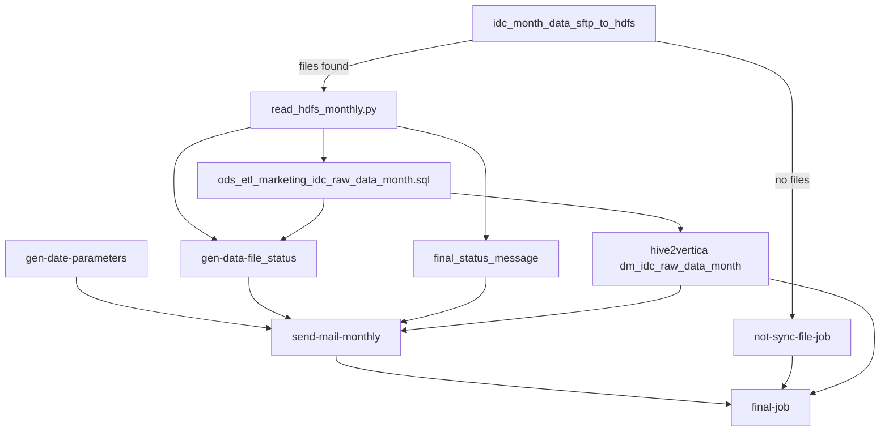

# Azkaban flow: IDC monthly delivery (`idc_delivery_month_data`)

- artifact_type: etl_table
- artifact_id: flow_marketing.idc_delivery_month_data
- domain: marketing
- one_line_purpose: Scheduled daily flow that ingests IDC monthly distributor delivery files from SFTP into HDFS, loads them into Hive staging, promotes to ODS ETL, syncs to Vertica, and emails stakeholders with per-file upload status. Supports marketing marke...
- layer_type: FLOW
- source_kind: etl_sql
- evidence_source: source/etl/sql/marketing/marketing_dw/hdfstohive/idc_delivery_month_data.flow

---

## L1 Data Foundation

### Identity and physical mapping
- **Table:** `flow_marketing.idc_delivery_month_data`
- **Layer type:** FLOW
- **Canonical / derived:** Derived / ETL-loaded (see L3)
- **Owner team:** not registered in metadata catalog

### Grain, scope, exclusions
- **Grain:** Not documented in repository
- **Scope:** See L2 business purpose / L3 filters
- **Partition:** Not documented in repository - resolved from pipeline (see L4)
- **Natural key:** Not documented in repository
- **Exclusions:** Not documented in repository


### Cross-engine presence
| Engine | Present | Canonical FQN | Notes |
|--------|---------|---------------|-------|
| Hive | yes | `idc_delivery_month_data` | ETL target / intermediate per evidence script |
| Vertica | pending | `idc_delivery_month_data` | Confirm via hive2vertica flow evidence / MCP |

### Physical schema reference

Pointer block only - full column catalog lives in WKB L1 storage JSON.

| Field | Value |
|-------|-------|
| **Authoritative catalog** | WKB L1 storage seed (not duplicated in this file) |
| **entity_id** | `flow_marketing.idc_delivery_month_data` |
| **l1_catalog_seed** | `target/storage/wkb/snapshots/_snapshot_id_template/l1_catalog/{engine}_{schema}_{table}.json` |
| **column_count** | pending (run ddl_seed_writer) |
| **partition_keys** | `Not documented in repository` |
| **ddl_source** | pending Bitbucket DDL / Vertica metadata ingest |
| **retrieval** | `python -m tools.wkb.indexing.run_query --query "marketing idc_delivery_month_data schema" --intent find_table_schema` |

### Lineage
See L6 Dependencies and notes.

### Freshness and load path
| Item | Value |
|------|-------|
| Load pattern | See L3 end-to-end / INSERT pattern in evidence script |
| Schedule | See preserved schedule subsection below |
| Parameters | See source script / flow parameters |

#### Schedule detail (preserved)

| Setting | Value | Evidence |
|---------|-------|----------|
| `schedule-cron` | `0 30 13 * * ? *` | `source/etl/sql/marketing/marketing_dw/hdfstohive/idc_delivery_month_data.flow:8` |
| `schedule-timezone` | `Asia/Shanghai` | `source/etl/sql/marketing/marketing_dw/hdfstohive/idc_delivery_month_data.flow:9` |

**Resolved run time:** 13:30 China Standard Time daily.

---

---

## L2 Declarative Knowledge

### Business purpose
Scheduled daily flow that ingests IDC monthly distributor delivery files from SFTP into HDFS, loads them into Hive staging, promotes to ODS ETL, syncs to Vertica, and emails stakeholders with per-file upload status. Supports marketing market-intelligence reporting for monthly IDC data.

---

### Audience and use cases
| Audience | How they benefit |
|----------|------------------|
| **Domain consumers (marketing)** | Uses `idc_delivery_month_data` for operational and reporting workflows documented below. |

### Fact key resolution
- Natural key: Not documented in repository
- FK / label-on attributes: see L3 dimension join patterns and step-by-step logic.
- Negative assertion: do not treat descriptive labels as grain keys unless listed under natural key.

### Time field semantics
- **date_flag / partition columns:** Not documented in repository
- Primary reporting filter should use the partition column(s) documented in L1; resolve values via L4.


### Metrics served

| Category | Column | Logical metric | Business reading |
|----------|--------|----------------|------------------|
| Measures | — | — | No measure columns mapped for this table. |

### Metric serving map

**Formula authority:** [`source/contracts/marketing/metric-index.md`](../../source/contracts/marketing/metric-index.md)

N/A — no measure columns mapped for this table.

### etl_metrics

No governed logical metrics from `source/contracts/marketing/metric-index.md` are mapped on this table.

---

## L3 Procedural Knowledge

### Query and routing rules
**Business filters:** Use partition / date keys from L1 grain for reporting scope.
**Technical predicates (load only):** See Key filters and step-by-step logic below.

### Dimension join patterns
| Dimension FQN | Join keys | Purpose | Evidence |
|---------------|-----------|---------|----------|
| See step-by-step / base tables | See L3 steps | Dimension enrichment | `source/etl/sql/marketing/marketing_dw/hdfstohive/idc_delivery_month_data.flow` |

### Key filters and ETL business logic
See step-by-step logic

### Standard time-filter SQL
```sql
-- relative period filter using resolved partition value (see L4)
SELECT *
FROM idc_delivery_month_data
WHERE /* partition predicate */ date_flag = '${partition_value}';
```

### End-to-end flow


---


#### High-level stages (preserved)

| Stage | Job name | Business meaning |
|-------|----------|------------------|
| **Parameter bootstrap** | `gen-date-parameters` | Sets `start_date` for email headers |
| **SFTP ingest** | `idc_month_data_sftp_to_hdfs` | Copies monthly IDC CSV folders from SFTP to HDFS |
| **No-file branch** | `not-sync-file-job` | Runs when no new files found |
| **CSV parse** | `read_hdfs_monthly` | Validates schema, loads Hive external staging |
| **ODS promote** | `ods_etl_marketing_idc_raw_data_month` | Overwrites ODS with latest month |
| **Status report** | `gen-data-file_status` | Builds per-file status table for email |
| **Overall status** | `final_status_message` | Computes Success/Warning/Failure |
| **Vertica sync** | `hive2vertica-overwrite-ods_marketing_idc_raw_data_month` | Full overwrite to Vertica |
| **Notification** | `send-mail-monthly` | Email with file status table |

---


### Base tables register
None identified in repository

### Step-by-step logic
None identified in repository

### Sentinel and code values
None identified in repository

---

## L4 Validation

### Resolved partition value
#### Resolved data range (`start_date`)

| Step | Source | How `start_date` is determined |
|------|--------|--------------------------------|
| 1 — Flow config | `idc_delivery_month_data.flow` | `query.parameter.start_date: date(from_utc_timestamp(current_timestamp(),'America/Los_Angeles'))` — `source/etl/sql/marketing/marketing_dw/hdfstohive/idc_delivery_month_data.flow:14` |
| 2 — Bootstrap job | `gen-date-parameters` → `literal_parameters.sql` | Pass-through: `SELECT ${start_date} AS start_date` — `source/etl/sql/marketing/marketing_dw/hdfstohive/literal_parameters.sql:1-2` |
| 3 — Mail job | `send-mail-monthly` | Subject/header use `${start_date}` — `source/etl/sql/marketing/marketing_dw/hdfstohive/idc_delivery_month_data.flow:95-97` |

**Plain language:** Email notifications show the Pacific-Time calendar date of the run. This variable does not filter ETL data.

---

#### Resolved partition value (`month`)

Data scope for ODS and Vertica is driven by the `month` partition chain, not `start_date`.

| Step | Source | How `month` is determined |
|------|--------|---------------------------|
| 1 — SFTP folder rule | `idc_month_data_sftp_to_hdfs` | Path pattern `\d{4}-\d{2}/` or `\d{4}-\d{2}/\d{4}/` — `source/etl/sql/marketing/marketing_dw/hdfstohive/idc_delivery_month_data.flow:27` |
| 2 — HDFS path parse | `read_hdfs_monthly.py` | `month = os.path.basename(os.path.dirname(normalized_path))` — `source/etl/sql/marketing/marketing_dw/hdfstohive/read_hdfs_monthly.py:31` |
| 3 — Staging write | `read_hdfs_monthly.py` | INSERT with partition literal `'{month}'` — `source/etl/sql/marketing/marketing_dw/hdfstohive/read_hdfs_monthly.py:69-72` |
| 4 — ODS promotion | `ods_etl_marketing_idc_raw_data_month.sql` | `WHERE month = (SELECT max(month) FROM ods_ext_marketing_idc_raw_data_month_v1)` — `source/etl/sql/marketing/marketing_dw/hdfstohive/script/ods_etl_marketing_idc_raw_data_month.sql:28-33` |
| 5 — Vertica sync | `hive2vertica-overwrite-...` | Full overwrite from `dm_gbl.dm_idc_raw_data_monthly_view` — `source/etl/sql/marketing/marketing_dw/hdfstohive/idc_delivery_month_data.flow:72-74` |

**Plain language:** ODS/Vertica receive the **maximum** `month` partition present in staging after the run — typically the newest `YYYY-MM` folder IDC delivered on SFTP. Detail: `target/knowledgebase/marketing/read_hdfs_monthly.md`.

---

### Data quality checks
- Prefer row-count-by-partition, metric sums, and grain duplicate checks (see Validation SQL).
- Additional checks from legacy caveats / operational notes when present.

### Validation SQL
```sql
-- 1) Row count by partition
SELECT ${partition_col}, COUNT(*) AS row_cnt
FROM dm_gbl.dm_idc_raw_data_month
WHERE ${partition_col} = '${partition_value}'
GROUP BY ${partition_col};

-- 2) Metric sum by business dimension (top deltas)
SELECT ${dim_key}, SUM(${metric}) AS metric_sum
FROM dm_gbl.dm_idc_raw_data_month
WHERE ${partition_col} = '${partition_value}'
GROUP BY ${dim_key}
ORDER BY ABS(SUM(${metric})) DESC
LIMIT 20;

-- 3) Grain duplicate check
SELECT ${grain_key_1}, ${grain_key_2}, ${grain_key_3}, ${partition_col}, COUNT(*) AS cnt
FROM dm_gbl.dm_idc_raw_data_month
WHERE ${partition_col} = '${partition_value}'
GROUP BY ${grain_key_1}, ${grain_key_2}, ${grain_key_3}, ${partition_col}
HAVING COUNT(*) > 1;
```

Replace placeholders from this file's Grain and keys / Data you can fetch sections, and use the resolved partition value from run scope.

### Caveats for interpretation
None identified in repository

### Conflicts and open questions
- Schedule, owner, SLA: Not documented in repository (unless preserved schedule evidence above).
- Vertica MCP verification: pending unless confirmed in L5.
#### SFTP path configuration (preserved)

| Setting | Value |
|---------|-------|
| Source base | `/idc-knowledge-platform-gtdc-sftp/Synnex/IDC_Delivery/` |
| Path pattern | `YYYY-MM/` or `YYYY-MM/YYYY/` monthly folders |
| HDFS target | `/apps/data/ods_gbl/externalfile/ods_ext_marketing_idc_raw_data_month` |

Evidence: `source/etl/sql/marketing/marketing_dw/hdfstohive/idc_delivery_month_data.flow:24-28`

---


---

## L5 Runtime View

### Query path and engine preference
| Role | Hive object | Vertica object | Sync mode | Evidence | MCP verified |
|------|-------------|----------------|-----------|----------|--------------|
| **Query for reporting** | `dm_gbl.dm_idc_raw_data_monthly_view` | `dm_gbl.dm_idc_raw_data_month` | overwrite | `source/etl/sql/marketing/marketing_dw/hdfstohive/idc_delivery_month_data.flow:67-76` | yes (Vertica metadata fallback) |
| **Hive alternative** | `ods_gbl.ods_etl_marketing_idc_raw_data_month` | `dm_gbl.dm_idc_raw_data_month` | - | `source/etl/sql/marketing/marketing_dw/hdfstohive/idc_delivery_month_data.flow:46-52` | - |
| **ETL internal** | `ods_gbl.ods_ext_marketing_idc_raw_data_month_v1` | Not synced to Vertica | - | `source/etl/sql/marketing/marketing_dw/hdfstohive/read_hdfs_monthly.py` | - |

Business users should query **`dm_gbl.dm_idc_raw_data_month`** in Vertica for monthly IDC reporting (21 columns; WKB seed `vertica_dm_gbl_dm_idc_raw_data_month.json`). Sync target verified from flow.

### Access constraints
- Country / company schema parameters may apply (`literal_country`, `company_no`, etc.).
- Hive-only staging objects are not reporting surfaces unless synced.

### Query risk profile
| Field | Value |
|-------|-------|
| requires_date_predicate | unknown |
| scan_risk_tier | medium |

---

## L6 Access and Consumption

### Primary consumers and use cases
### Scripts in this flow

| Script | Evidence |
|--------|----------|
| `literal_parameters.sql` | `source/etl/sql/marketing/marketing_dw/hdfstohive/idc_delivery_month_data.flow:20` |
| `read_hdfs_monthly.py` | `source/etl/sql/marketing/marketing_dw/hdfstohive/idc_delivery_month_data.flow:43` |
| `ods_etl_marketing_idc_raw_data_month.sql` | `source/etl/sql/marketing/marketing_dw/hdfstohive/idc_delivery_month_data.flow:51` |
| `status_output.sql` | `source/etl/sql/marketing/marketing_dw/hdfstohive/idc_delivery_month_data.flow:64` |

### Downstream targets (verified)

| Target | Evidence |
|--------|----------|
| `dm_gbl.dm_idc_raw_data_month` (Vertica) | `source/etl/sql/marketing/marketing_dw/hdfstohive/idc_delivery_month_data.flow:73-74` |

### Not documented in repository

- Azkaban proje

### Representative query patterns
```sql
-- certified / illustrative lookup - replace predicates from L1/L4
SELECT *
FROM idc_delivery_month_data
WHERE date_flag = '${partition_value}'
LIMIT 100;
```

### Dependencies and notes
### Scripts in this flow

| Script | Evidence |
|--------|----------|
| `literal_parameters.sql` | `source/etl/sql/marketing/marketing_dw/hdfstohive/idc_delivery_month_data.flow:20` |
| `read_hdfs_monthly.py` | `source/etl/sql/marketing/marketing_dw/hdfstohive/idc_delivery_month_data.flow:43` |
| `ods_etl_marketing_idc_raw_data_month.sql` | `source/etl/sql/marketing/marketing_dw/hdfstohive/idc_delivery_month_data.flow:51` |
| `status_output.sql` | `source/etl/sql/marketing/marketing_dw/hdfstohive/idc_delivery_month_data.flow:64` |

### Downstream targets (verified)

| Target | Evidence |
|--------|----------|
| `dm_gbl.dm_idc_raw_data_month` (Vertica) | `source/etl/sql/marketing/marketing_dw/hdfstohive/idc_delivery_month_data.flow:73-74` |

### Not documented in repository

- Azkaban project name in production
- Owner/on-call rotation
- Hive view `dm_idc_raw_data_monthly_view` DDL
- Bitbucket DDL for marketing IDC Hive tables — not in `HIVE/snxhive` at `refs/heads/master`; Hive WKB seeds skipped. Vertica reporting table `dm_gbl.dm_idc_raw_data_month` seeded via metadata fallback (`vertica_dm_gbl_dm_idc_raw_data_month.json`).

### Related flows (verified)

- `idc_delivery_month_data_init.flow` — same pipeline without SFTP step (manual/backfill)

---

*Document generated from `source/etl/sql/marketing/marketing_dw/hdfstohive/idc_delivery_month_data.flow`.*

---

---

#### Not documented in repository
- Owner, SLA (unless schedule evidence preserved above)
- Any dependency without `file:line` evidence in this document

---

*Document migrated to L1-L6 from legacy Knowledgebase content. Evidence: `source/etl/sql/marketing/marketing_dw/hdfstohive/idc_delivery_month_data.flow`.*
