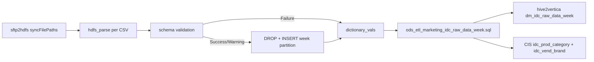

# Python ETL: IDC weekly HDFS CSV ingest (`read_hdfs.py`)

- artifact_type: etl_table
- artifact_id: read_hdfs.py
- domain: marketing
- one_line_purpose: This Python Spark job reads IDC weekly delivery CSV files from HDFS, validates schema against the external Hive staging table, and loads data into `ods_gbl.ods_ext_marketing_idc_raw_data_week_v1`. It records per-file upload status for the w...
- layer_type: FLOW
- source_kind: etl_sql
- evidence_source: source/etl/sql/marketing/marketing_dw/hdfstohive/read_hdfs.py

---

## L1 Data Foundation

### Identity and physical mapping
- **Table:** `read_hdfs.py`
- **Layer type:** FLOW
- **Canonical / derived:** Derived / ETL-loaded (see L3)
- **Owner team:** not registered in metadata catalog

### Grain, scope, exclusions
- **Grain:** one row per IDC weekly CSV record.
- **Scope:** See L2 business purpose / L3 filters
- **Partition:** `week` — not a flow parameter; resolved per synced file from the HDFS directory layout (see **Resolved partition value** below). - resolved from pipeline (see L4)
- **Natural key:** Not documented in repository
- **Exclusions:** Not documented in repository

#### Grain detail (preserved)

- **Grain:** one row per IDC weekly CSV record.
- **Partition:** `week` — not a flow parameter; resolved per synced file from the HDFS directory layout (see **Resolved partition value** below).

---

### Cross-engine presence
| Engine | Present | Canonical FQN | Notes |
|--------|---------|---------------|-------|
| Hive | yes | `read_hdfs.py` | ETL target / intermediate per evidence script |
| Vertica | pending | `read_hdfs.py` | Confirm via hive2vertica flow evidence / MCP |

### Physical schema reference

Pointer block only - full column catalog lives in WKB L1 storage JSON.

| Field | Value |
|-------|-------|
| **Authoritative catalog** | WKB L1 storage seed (not duplicated in this file) |
| **entity_id** | `read_hdfs.py` |
| **l1_catalog_seed** | `target/storage/wkb/snapshots/_snapshot_id_template/l1_catalog/{engine}_{schema}_{table}.json` |
| **column_count** | pending (run ddl_seed_writer) |
| **partition_keys** | `week` |
| **ddl_source** | pending Bitbucket DDL / Vertica metadata ingest |
| **retrieval** | `python -m tools.wkb.indexing.run_query --query "marketing read_hdfs schema" --intent find_table_schema` |

### Lineage
See L6 Dependencies and notes.

### Freshness and load path
| Item | Value |
|------|-------|
| Load pattern | See L3 end-to-end / INSERT pattern in evidence script |
| Schedule | Not documented in repository |
| Parameters | `syncFilePaths` from `idc_week_data_sftp_to_hdfs`. |


---

## L2 Declarative Knowledge

### Business purpose
This Python Spark job reads IDC weekly delivery CSV files from HDFS, validates schema against the external Hive staging table, and loads data into `ods_gbl.ods_ext_marketing_idc_raw_data_week_v1`. It records per-file upload status for the weekly notification email and enables downstream ODS promotion and CIS reference syncs.

---

### Audience and use cases
| Audience | How they benefit |
|----------|------------------|
| Marketing ops | Weekly file upload status email. |
| CIS teams | Enables product category and vendor brand reference updates (weekly flow). |

---

### Fact key resolution
- Natural key: Not documented in repository
- FK / label-on attributes: see L3 dimension join patterns and step-by-step logic.
- Negative assertion: do not treat descriptive labels as grain keys unless listed under natural key.

### Time field semantics
- **date_flag / partition columns:** `week` — not a flow parameter; resolved per synced file from the HDFS directory layout (see **Resolved partition value** below).
- Primary reporting filter should use the partition column(s) documented in L1; resolve values via L4.

### Metrics served
N/A - no business metric summary in legacy doc

### Metric serving map
N/A - not a `*_comb_mtd` / multi-period wide serving table (or map not present in legacy doc).


### etl_metrics

N/A - no calculable ETL formulas extracted from this document (passthrough / stored measures only, or formulas not documented).

---

## L3 Procedural Knowledge

### Query and routing rules
**Business filters:** Use partition / date keys from L1 grain for reporting scope.
**Technical predicates (load only):** See Key filters and step-by-step logic below.

### Dimension join patterns
| Dimension FQN | Join keys | Purpose | Evidence |
|---------------|-----------|---------|----------|
| See step-by-step / base tables | See L3 steps | Dimension enrichment | `source/etl/sql/marketing/marketing_dw/hdfstohive/read_hdfs.py` |

### Key filters and ETL business logic
### Step 1 — Column rename map (IDC CSV → Hive)

| IDC CSV header | Hive column |
|----------------|-------------|
| ISO YEAR | iso_year |
| ISO WEEK | iso_week |
| WEEK START DATE | week_start_date |
| WEEK END DATE | week_end_date |
| COUNTRY | country |
| DISTRIBUTOR | distributor |
| PRODUCT GROUP | product_group |
| PRODUCT | product_name |
| BRAND | brand_name |
| UNITS | units |
| DISTRIBUTOR REVENUE (LOCAL CURRENCY M) | distributor_revenue |
| DISTRIBUTOR REVENUE (CONSTANT USD M) | distributor_revenue_usd |
| (CUSTOM) DEPLOYMENT TYPE | deployment_type |
| (CUSTOM) AI PC | ai_pc |
| (CUSTOM) PRODUCT TYPE | product_type |

(Full map — `source/etl/sql/marketing/marketing_dw/hdfstohive/read_hdfs.py:39-60`)

### Step 2 — Partition handling

- `week_no` = parent directory name from HDFS path
- `ALTER TABLE ... DROP IF EXISTS PARTITION (week='{week_no}')` once per week per run
- `INSERT INTO ods_ext_marketing_idc_raw_data_week_v1` with partition value `week_no`

### Step 3 — Status table

- `temp_db.dictionary_vals (file_name, mssg, status)` — weekly status codes 0/1/2

---

### Standard time-filter SQL
```sql
-- relative period filter using resolved partition value (see L4)
SELECT *
FROM read_hdfs.py
WHERE /* partition predicate */ date_flag = '${partition_value}';
```

### End-to-end flow


---


#### High-level stages (preserved)

| Stage | Business meaning |
|-------|------------------|
| **File discovery** | Parses `syncFilePaths` from SFTP2HDFS job. |
| **Schema baseline** | Column list from `ods_ext_marketing_idc_raw_data_week_v1` (excluding `week`). |
| **Per-file parse** | CSV read, trim, uppercase headers, IDC column rename. |
| **Schema validation** | Success / Warning / Failure logic identical to monthly variant. |
| **Partition load** | Drop `week` partition once per ISO week, insert validated rows. |
| **Status tracking** | `temp_db.dictionary_vals` for email table output. |

**Parameters:** `syncFilePaths` from `idc_week_data_sftp_to_hdfs`.

---


### Base tables register
None identified in repository

### Step-by-step logic
### Step 1 — Column rename map (IDC CSV → Hive)

| IDC CSV header | Hive column |
|----------------|-------------|
| ISO YEAR | iso_year |
| ISO WEEK | iso_week |
| WEEK START DATE | week_start_date |
| WEEK END DATE | week_end_date |
| COUNTRY | country |
| DISTRIBUTOR | distributor |
| PRODUCT GROUP | product_group |
| PRODUCT | product_name |
| BRAND | brand_name |
| UNITS | units |
| DISTRIBUTOR REVENUE (LOCAL CURRENCY M) | distributor_revenue |
| DISTRIBUTOR REVENUE (CONSTANT USD M) | distributor_revenue_usd |
| (CUSTOM) DEPLOYMENT TYPE | deployment_type |
| (CUSTOM) AI PC | ai_pc |
| (CUSTOM) PRODUCT TYPE | product_type |

(Full map — `source/etl/sql/marketing/marketing_dw/hdfstohive/read_hdfs.py:39-60`)

### Step 2 — Partition handling

- `week_no` = parent directory name from HDFS path
- `ALTER TABLE ... DROP IF EXISTS PARTITION (week='{week_no}')` once per week per run
- `INSERT INTO ods_ext_marketing_idc_raw_data_week_v1` with partition value `week_no`

### Step 3 — Status table

- `temp_db.dictionary_vals (file_name, mssg, status)` — weekly status codes 0/1/2

---

### Relationship map (embedded)

| from_fqn | to_fqn | cardinality | join_keys | provenance |
|----------|--------|-------------|-----------|------------|
| — | — | — | — | Not documented in repository |

`source/ref/marketing/table relationship.txt`: Not documented in repository.

### Special logic (embedded)

Not documented in repository

### Column / field derivations (from ETL SQL)

| target_column | expression_sql | upstream_columns | upstream_tables | transform_kind | evidence |
|---------------|----------------|------------------|-----------------|----------------|----------|
| `*` | `*` | — | — | partial | `source/etl/sql/marketing/marketing_dw/hdfstohive/read_hdfs.py:13` |

### Sentinel and code values
None identified in repository

---

## L4 Validation

### Resolved partition value
#### Resolved partition value

Trace the `week` partition from upstream path rules through downstream promotion — do not assume a fixed calendar value.

| Step | Source | How `week` is determined |
|------|--------|--------------------------|
| 1 — SFTP folder rule | `idc_week_data_sftp_to_hdfs` | Path pattern accepts folders matching `\d{4}-W\d{2}/` or `\d{4}-W\d{2}/\d{4}/` — `source/etl/sql/marketing/marketing_dw/hdfstohive/idc_delivery_week_data.flow:27` |
| 2 — HDFS path parse | `read_hdfs.py` | `week_no = os.path.basename(os.path.dirname(normalized_path))` — parent directory of each CSV file — `source/etl/sql/marketing/marketing_dw/hdfstohive/read_hdfs.py:31` |
| 3 — Staging write | `read_hdfs.py` | `INSERT INTO ods_ext_marketing_idc_raw_data_week_v1 ... '{week_no}'` — partition literal from step 2 — `source/etl/sql/marketing/marketing_dw/hdfstohive/read_hdfs.py:76-78` |
| 4 — ODS promotion (downstream) | `ods_etl_marketing_idc_raw_data_week.sql` | `WHERE week = (SELECT max(week) FROM ods_ext_marketing_idc_raw_data_week_v1)` — promotes whichever `week` partition is latest in staging after this run — `source/etl/sql/marketing/marketing_dw/hdfstohive/script/ods_etl_marketing_idc_raw_data_week.sql:30-35` |
| 5 — Vertica + CIS sync (downstream) | `idc_delivery_week_data.flow` | Vertica overwrite from `dm_gbl.dm_idc_raw_data_weekly_view`; CIS inserts from same view — `source/etl/sql/marketing/marketing_dw/hdfstohive/idc_delivery_week_data.flow:73-105` |

**Plain language:** `week` is whatever `YYYY-Wnn` folder name IDC delivered on SFTP for that file. After load, downstream SQL always takes the **maximum** `week` value present in staging — so the ODS, Vertica, and CIS scope equals the newest week partition written in the current run (or the highest lexicographic week if multiple folders were synced).

---

### Data quality checks
- Prefer row-count-by-partition, metric sums, and grain duplicate checks (see Validation SQL).
- Additional checks from legacy caveats / operational notes when present.

### Validation SQL
```sql
-- 1) Row count by partition
SELECT ${partition_col}, COUNT(*) AS row_cnt
FROM dm_gbl.dm_idc_raw_data_weekly_view
WHERE ${partition_col} = '${partition_value}'
GROUP BY ${partition_col};

-- 2) Metric sum by business dimension (top deltas)
SELECT ${dim_key}, SUM(${metric}) AS metric_sum
FROM dm_gbl.dm_idc_raw_data_weekly_view
WHERE ${partition_col} = '${partition_value}'
GROUP BY ${dim_key}
ORDER BY ABS(SUM(${metric})) DESC
LIMIT 20;

-- 3) Grain duplicate check
SELECT ${grain_key_1}, ${grain_key_2}, ${grain_key_3}, ${partition_col}, COUNT(*) AS cnt
FROM dm_gbl.dm_idc_raw_data_weekly_view
WHERE ${partition_col} = '${partition_value}'
GROUP BY ${grain_key_1}, ${grain_key_2}, ${grain_key_3}, ${partition_col}
HAVING COUNT(*) > 1;
```

Replace placeholders from this file's Grain and keys / Data you can fetch sections, and use the resolved partition value from run scope.

### Caveats for interpretation
None identified in repository

### Conflicts and open questions
- Schedule, owner, SLA: Not documented in repository (unless preserved schedule evidence above).
- Vertica MCP verification: pending unless confirmed in L5.


---

## L5 Runtime View

### Query path and engine preference
| Role | Hive object | Vertica object | Sync mode | Evidence | MCP verified |
|------|-------------|----------------|-----------|----------|--------------|
| **Query for reporting** | `ods_gbl.ods_ext_marketing_idc_raw_data_week_v1` | `dm_gbl.dm_idc_raw_data_week` (downstream) | Hive staging only | `source/etl/sql/marketing/marketing_dw/hdfstohive/read_hdfs.py:13` | flow yes / Hive DDL no |
| **Hive alternative** | — | — | — | — | — |
| **ETL internal** | `ods_gbl.ods_ext_marketing_idc_raw_data_week_v1` | Not synced to Vertica | partition insert | `source/etl/sql/marketing/marketing_dw/hdfstohive/read_hdfs.py:69-72` | - |

This script loads Hive staging only. Business reporting uses **`dm_gbl.dm_idc_raw_data_week`** in Vertica after ODS promotion and hive2vertica sync (`idc_delivery_week_data.flow:73-74`).

### Access constraints
- Country / company schema parameters may apply (`literal_country`, `company_no`, etc.).
- Hive-only staging objects are not reporting surfaces unless synced.

### Query risk profile
| Field | Value |
|-------|-------|
| requires_date_predicate | yes |
| scan_risk_tier | medium |

---

## L6 Access and Consumption

### Primary consumers and use cases
| Audience | How they benefit |
|----------|------------------|
| Marketing ops | Weekly file upload status email. |
| CIS teams | Enables product category and vendor brand reference updates (weekly flow). |

---

### Representative query patterns
```sql
-- certified / illustrative lookup - replace predicates from L1/L4
SELECT *
FROM read_hdfs.py
WHERE date_flag = '${partition_value}'
LIMIT 100;
```

### Dependencies and notes
### Upstream objects (verified)

| Object | Usage | Evidence |
|--------|-------|----------|
| HDFS weekly CSV files | Source | `source/etl/sql/marketing/marketing_dw/hdfstohive/read_hdfs.py:7-10` |
| `ods_gbl.ods_ext_marketing_idc_raw_data_week_v1` | Schema + target | `source/etl/sql/marketing/marketing_dw/hdfstohive/read_hdfs.py:13` |
| `idc_week_data_sftp_to_hdfs` | Supplies paths | `source/etl/sql/marketing/marketing_dw/hdfstohive/idc_delivery_week_data.flow:24-28` |

### Downstream consumers (verified)

| Object | Evidence |
|--------|----------|
| `ods_etl_marketing_idc_raw_data_week.sql` | `source/etl/sql/marketing/marketing_dw/hdfstohive/idc_delivery_week_data.flow:46-52` |
| `CIS.idc_prod_category` | `source/etl/sql/marketing/marketing_dw/hdfstohive/idc_delivery_week_data.flow:78-89` |
| `CIS.idc_vend_brand` | `source/etl/sql/marketing/marketing_dw/hdfstohive/idc_delivery_week_data.flow:91-102` |

### Not documented in repository

- CIS table DDL and conflict-resolution behavior beyond flow config
- Bitbucket DDL for `ods_gbl.ods_ext_marketing_idc_raw_data_week_v1` — not in `HIVE/snxhive` at `refs/heads/master`

### Related scripts (verified)

- `idc_delivery_week_data.flow` — `source/etl/sql/marketing/marketing_dw/hdfstohive/idc_delivery_week_data.flow:38-44`

---

*Document generated from `source/etl/sql/marketing/marketing_dw/hdfstohive/read_hdfs.py`.*

#### Not documented in repository
- Owner, SLA (unless schedule evidence preserved above)
- Any dependency without `file:line` evidence in this document

---

*Document migrated to L1-L6 from legacy Knowledgebase content. Evidence: `source/etl/sql/marketing/marketing_dw/hdfstohive/read_hdfs.py`.*
