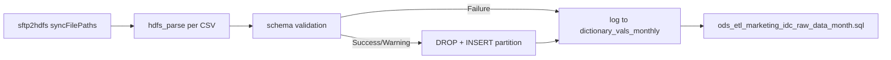

# Python ETL: IDC monthly HDFS CSV ingest (`read_hdfs_monthly.py`)

- artifact_type: etl_table
- artifact_id: read_hdfs_monthly.py
- domain: marketing
- one_line_purpose: This Python Spark job reads IDC monthly delivery CSV files from HDFS (landed by the SFTP sync step), validates column schema against the existing external Hive table, and loads data into partitioned staging table `ods_gbl.ods_ext_marketing_...
- layer_type: FLOW
- source_kind: etl_sql
- evidence_source: source/etl/sql/marketing/marketing_dw/hdfstohive/read_hdfs_monthly.py

---

## L1 Data Foundation

### Identity and physical mapping
- **Table:** `read_hdfs_monthly.py`
- **Layer type:** FLOW
- **Canonical / derived:** Derived / ETL-loaded (see L3)
- **Owner team:** not registered in metadata catalog

### Grain, scope, exclusions
- **Grain:** one row per IDC CSV data row, tagged with `month` partition derived from HDFS path.
- **Scope:** See L2 business purpose / L3 filters
- **Partition:** `month` — not a flow parameter; resolved per synced file from the HDFS directory layout (see **Resolved partition value** below). - resolved from pipeline (see L4)
- **Natural key:** Not documented in repository
- **Exclusions:** Not documented in repository

#### Grain detail (preserved)

- **Grain:** one row per IDC CSV data row, tagged with `month` partition derived from HDFS path.
- **Partition:** `month` — not a flow parameter; resolved per synced file from the HDFS directory layout (see **Resolved partition value** below).

---

### Cross-engine presence
| Engine | Present | Canonical FQN | Notes |
|--------|---------|---------------|-------|
| Hive | yes | `read_hdfs_monthly.py` | ETL target / intermediate per evidence script |
| Vertica | pending | `read_hdfs_monthly.py` | Confirm via hive2vertica flow evidence / MCP |

### Physical schema reference

Pointer block only - full column catalog lives in WKB L1 storage JSON.

| Field | Value |
|-------|-------|
| **Authoritative catalog** | WKB L1 storage seed (not duplicated in this file) |
| **entity_id** | `read_hdfs_monthly.py` |
| **l1_catalog_seed** | `target/storage/wkb/snapshots/_snapshot_id_template/l1_catalog/{engine}_{schema}_{table}.json` |
| **column_count** | pending (run ddl_seed_writer) |
| **partition_keys** | `month` |
| **ddl_source** | pending Bitbucket DDL / Vertica metadata ingest |
| **retrieval** | `python -m tools.wkb.indexing.run_query --query "marketing read_hdfs_monthly schema" --intent find_table_schema` |

### Lineage
See L6 Dependencies and notes.

### Freshness and load path
| Item | Value |
|------|-------|
| Load pattern | See L3 end-to-end / INSERT pattern in evidence script |
| Schedule | Not documented in repository |
| Parameters | `syncFilePaths` (from `idc_month_data_sftp_to_hdfs` job output). |


---

## L2 Declarative Knowledge

### Business purpose
This Python Spark job reads IDC monthly delivery CSV files from HDFS (landed by the SFTP sync step), validates column schema against the existing external Hive table, and loads data into partitioned staging table `ods_gbl.ods_ext_marketing_idc_raw_data_month_v1`. It also records per-file Success/Warning/Failure status for the notification email.

---

### Audience and use cases
| Audience | How they benefit |
|----------|------------------|
| Marketing ops | Receives email with per-file upload status after each run. |
| Data engineering | Ensures IDC monthly files land in Hive before ODS promotion SQL runs. |

---

### Fact key resolution
- Natural key: Not documented in repository
- FK / label-on attributes: see L3 dimension join patterns and step-by-step logic.
- Negative assertion: do not treat descriptive labels as grain keys unless listed under natural key.

### Time field semantics
- **date_flag / partition columns:** `month` — not a flow parameter; resolved per synced file from the HDFS directory layout (see **Resolved partition value** below).
- Primary reporting filter should use the partition column(s) documented in L1; resolve values via L4.

### Metrics served
N/A - no business metric summary in legacy doc

### Metric serving map
N/A - not a `*_comb_mtd` / multi-period wide serving table (or map not present in legacy doc).


### etl_metrics

N/A - no calculable ETL formulas extracted from this document (passthrough / stored measures only, or formulas not documented).

---

## L3 Procedural Knowledge

### Query and routing rules
**Business filters:** Use partition / date keys from L1 grain for reporting scope.
**Technical predicates (load only):** See Key filters and step-by-step logic below.

### Dimension join patterns
| Dimension FQN | Join keys | Purpose | Evidence |
|---------------|-----------|---------|----------|
| See step-by-step / base tables | See L3 steps | Dimension enrichment | `source/etl/sql/marketing/marketing_dw/hdfstohive/read_hdfs_monthly.py` |

### Key filters and ETL business logic
### Step 1 — Column rename map (IDC CSV → Hive)

| IDC CSV header | Hive column |
|----------------|-------------|
| YEAR | data_year |
| MONTH | data_month |
| QUARTER | quarter |
| COUNTRY | country |
| DISTRIBUTOR | distributor |
| PRODUCT GROUP | product_group |
| PRODUCT | product_name |
| BRAND | brand_name |
| UNITS | units |
| DISTRIBUTOR REVENUE (LOCAL CURRENCY M) | distributor_revenue |
| DISTRIBUTOR REVENUE (CONSTANT USD M) | distributor_revenue_usd |
| (CUSTOM) AI PC | ai_pc |
| (CUSTOM) DEPLOYMENT TYPE | deployment_type |
| (CUSTOM) PRODUCT TYPE | product_type |

(Full map in source — `source/etl/sql/marketing/marketing_dw/hdfstohive/read_hdfs_monthly.py:39-58`)

### Step 2 — Schema validation rules

| Condition | Status | Action |
|-----------|--------|--------|
| CSV cols >= table cols, exact match | Success (0) | Insert all columns |
| CSV has extra columns | Warning (1) | Drop extras, insert if remaining match |
| CSV missing required columns | Failure (2) | Skip insert, log missing column names |

### Step 3 — Status table

- Creates `temp_db.dictionary_vals_monthly (file_name, mssg, status)`
- Consumed by `gen-data-file_status` and `status_output.sql` in flow

---

### Standard time-filter SQL
```sql
-- relative period filter using resolved partition value (see L4)
SELECT *
FROM read_hdfs_monthly.py
WHERE /* partition predicate */ date_flag = '${partition_value}';
```

### End-to-end flow
1. Split `syncFilePaths` into individual HDFS CSV paths.
2. For each file: parse path → `month` and `year`.
3. Read CSV → rename columns → validate schema vs Hive table.
4. On success/warning: `ALTER TABLE ... DROP PARTITION (month=...)` then `INSERT INTO` staging.
5. Build `temp_db.dictionary_vals_monthly` with status codes (0=Success, 1=Warning, 2=Failure).



---


#### High-level stages (preserved)

| Stage | Business meaning |
|-------|------------------|
| **File discovery** | Reads `syncFilePaths` from Azkaban config (SFTP2HDFS output). |
| **Schema baseline** | Loads column list from existing external Hive table (excluding `month` partition col). |
| **Per-file parse** | Reads CSV, trims/uppercases headers, renames IDC columns to Hive names. |
| **Schema validation** | Success if exact match; Warning if extra cols dropped; Failure if required cols missing. |
| **Partition load** | Drops existing `month` partition once per run, inserts validated rows. |
| **Status tracking** | Writes results to `temp_db.dictionary_vals_monthly` for email reporting. |

**Parameters:** `syncFilePaths` (from `idc_month_data_sftp_to_hdfs` job output).

---


### Base tables register
None identified in repository

### Step-by-step logic
### Step 1 — Column rename map (IDC CSV → Hive)

| IDC CSV header | Hive column |
|----------------|-------------|
| YEAR | data_year |
| MONTH | data_month |
| QUARTER | quarter |
| COUNTRY | country |
| DISTRIBUTOR | distributor |
| PRODUCT GROUP | product_group |
| PRODUCT | product_name |
| BRAND | brand_name |
| UNITS | units |
| DISTRIBUTOR REVENUE (LOCAL CURRENCY M) | distributor_revenue |
| DISTRIBUTOR REVENUE (CONSTANT USD M) | distributor_revenue_usd |
| (CUSTOM) AI PC | ai_pc |
| (CUSTOM) DEPLOYMENT TYPE | deployment_type |
| (CUSTOM) PRODUCT TYPE | product_type |

(Full map in source — `source/etl/sql/marketing/marketing_dw/hdfstohive/read_hdfs_monthly.py:39-58`)

### Step 2 — Schema validation rules

| Condition | Status | Action |
|-----------|--------|--------|
| CSV cols >= table cols, exact match | Success (0) | Insert all columns |
| CSV has extra columns | Warning (1) | Drop extras, insert if remaining match |
| CSV missing required columns | Failure (2) | Skip insert, log missing column names |

### Step 3 — Status table

- Creates `temp_db.dictionary_vals_monthly (file_name, mssg, status)`
- Consumed by `gen-data-file_status` and `status_output.sql` in flow

---

### Relationship map (embedded)

| from_fqn | to_fqn | cardinality | join_keys | provenance |
|----------|--------|-------------|-----------|------------|
| — | — | — | — | Not documented in repository |

`source/ref/marketing/table relationship.txt`: Not documented in repository.

### Special logic (embedded)

Not documented in repository

### Column / field derivations (from ETL SQL)

| target_column | expression_sql | upstream_columns | upstream_tables | transform_kind | evidence |
|---------------|----------------|------------------|-----------------|----------------|----------|
| `*` | `*` | — | — | partial | `source/etl/sql/marketing/marketing_dw/hdfstohive/read_hdfs_monthly.py:13` |

### Sentinel and code values
| Value | Meaning |
|-------|---------|
| `status = 0` | Success |
| `status = 1` | Warning (schema mismatch, partial upload) |
| `status = 2` | Failure (cannot upload) |

---

---

## L4 Validation

### Resolved partition value
#### Resolved partition value

Trace the `month` partition from upstream path rules through downstream promotion — do not assume a fixed calendar value.

| Step | Source | How `month` is determined |
|------|--------|---------------------------|
| 1 — SFTP folder rule | `idc_month_data_sftp_to_hdfs` | Path pattern accepts folders matching `\d{4}-\d{2}/` or `\d{4}-\d{2}/\d{4}/` — `source/etl/sql/marketing/marketing_dw/hdfstohive/idc_delivery_month_data.flow:27` |
| 2 — HDFS path parse | `read_hdfs_monthly.py` | `month = os.path.basename(os.path.dirname(normalized_path))` — parent directory of each CSV file — `source/etl/sql/marketing/marketing_dw/hdfstohive/read_hdfs_monthly.py:31` |
| 3 — Staging write | `read_hdfs_monthly.py` | `INSERT INTO ods_ext_marketing_idc_raw_data_month_v1 ... '{month}'` — partition literal from step 2 — `source/etl/sql/marketing/marketing_dw/hdfstohive/read_hdfs_monthly.py:69-72` |
| 4 — ODS promotion (downstream) | `ods_etl_marketing_idc_raw_data_month.sql` | `WHERE month = (SELECT max(month) FROM ods_ext_marketing_idc_raw_data_month_v1)` — promotes whichever `month` partition is latest in staging after this run — `source/etl/sql/marketing/marketing_dw/hdfstohive/script/ods_etl_marketing_idc_raw_data_month.sql:28-33` |
| 5 — Vertica sync (downstream) | `idc_delivery_month_data.flow` | Full overwrite from `dm_gbl.dm_idc_raw_data_monthly_view` (built on ODS) — `source/etl/sql/marketing/marketing_dw/hdfstohive/idc_delivery_month_data.flow:72-74` |

**Plain language:** `month` is whatever `YYYY-MM` folder name IDC delivered on SFTP for that file. After load, downstream SQL always takes the **maximum** `month` value present in staging — so the ODS/Vertica scope equals the newest month partition written in the current run (or the highest lexicographic month if multiple folders were synced).

---

### Data quality checks
- Prefer row-count-by-partition, metric sums, and grain duplicate checks (see Validation SQL).
- Additional checks from legacy caveats / operational notes when present.

### Validation SQL
```sql
-- 1) Row count by partition
SELECT ${partition_col}, COUNT(*) AS row_cnt
FROM dm_gbl.dm_idc_raw_data_monthly_view
WHERE ${partition_col} = '${partition_value}'
GROUP BY ${partition_col};

-- 2) Metric sum by business dimension (top deltas)
SELECT ${dim_key}, SUM(${metric}) AS metric_sum
FROM dm_gbl.dm_idc_raw_data_monthly_view
WHERE ${partition_col} = '${partition_value}'
GROUP BY ${dim_key}
ORDER BY ABS(SUM(${metric})) DESC
LIMIT 20;

-- 3) Grain duplicate check
SELECT ${grain_key_1}, ${grain_key_2}, ${grain_key_3}, ${partition_col}, COUNT(*) AS cnt
FROM dm_gbl.dm_idc_raw_data_monthly_view
WHERE ${partition_col} = '${partition_value}'
GROUP BY ${grain_key_1}, ${grain_key_2}, ${grain_key_3}, ${partition_col}
HAVING COUNT(*) > 1;
```

Replace placeholders from this file's Grain and keys / Data you can fetch sections, and use the resolved partition value from run scope.

### Caveats for interpretation
None identified in repository

### Conflicts and open questions
- Schedule, owner, SLA: Not documented in repository (unless preserved schedule evidence above).
- Vertica MCP verification: pending unless confirmed in L5.


---

## L5 Runtime View

### Query path and engine preference
| Role | Hive object | Vertica object | Sync mode | Evidence | MCP verified |
|------|-------------|----------------|-----------|----------|--------------|
| **Query for reporting** | `ods_gbl.ods_ext_marketing_idc_raw_data_month_v1` | `dm_gbl.dm_idc_raw_data_month` (downstream) | Hive staging only | `source/etl/sql/marketing/marketing_dw/hdfstohive/read_hdfs_monthly.py:13` | flow yes / Hive DDL no |
| **Hive alternative** | — | — | — | — | — |
| **ETL internal** | `ods_gbl.ods_ext_marketing_idc_raw_data_month_v1` | Not synced to Vertica | partition insert | `source/etl/sql/marketing/marketing_dw/hdfstohive/read_hdfs_monthly.py:69-72` | - |

This script loads Hive staging only. Business reporting uses **`dm_gbl.dm_idc_raw_data_month`** in Vertica after ODS promotion and hive2vertica sync (`idc_delivery_month_data.flow:67-76`).

### Access constraints
- Country / company schema parameters may apply (`literal_country`, `company_no`, etc.).
- Hive-only staging objects are not reporting surfaces unless synced.

### Query risk profile
| Field | Value |
|-------|-------|
| requires_date_predicate | yes |
| scan_risk_tier | medium |

---

## L6 Access and Consumption

### Primary consumers and use cases
| Audience | How they benefit |
|----------|------------------|
| Marketing ops | Receives email with per-file upload status after each run. |
| Data engineering | Ensures IDC monthly files land in Hive before ODS promotion SQL runs. |

---

### Representative query patterns
```sql
-- certified / illustrative lookup - replace predicates from L1/L4
SELECT *
FROM read_hdfs_monthly.py
WHERE date_flag = '${partition_value}'
LIMIT 100;
```

### Dependencies and notes
### Upstream objects (verified)

| Object | Usage | Evidence |
|--------|-------|----------|
| HDFS CSV files | Source files | `source/etl/sql/marketing/marketing_dw/hdfstohive/read_hdfs_monthly.py:7-10` |
| `ods_gbl.ods_ext_marketing_idc_raw_data_month_v1` | Schema reference + target | `source/etl/sql/marketing/marketing_dw/hdfstohive/read_hdfs_monthly.py:13` |
| `idc_month_data_sftp_to_hdfs` | Supplies `syncFilePaths` | `source/etl/sql/marketing/marketing_dw/hdfstohive/idc_delivery_month_data.flow:24-28` |

### Downstream consumers (verified)

| Object | Evidence |
|--------|----------|
| `ods_etl_marketing_idc_raw_data_month.sql` | `source/etl/sql/marketing/marketing_dw/hdfstohive/idc_delivery_month_data.flow:46-52` |
| `temp_db.dictionary_vals_monthly` | `source/etl/sql/marketing/marketing_dw/hdfstohive/read_hdfs_monthly.py:113-116` |

### Not documented in repository

- SFTP file naming conventions beyond path regex in flow
- Owner/SLA

### Related scripts (verified)

- `idc_delivery_month_data.flow` — orchestrates this job — `source/etl/sql/marketing/marketing_dw/hdfstohive/idc_delivery_month_data.flow:38-44`

---

*Document generated from `source/etl/sql/marketing/marketing_dw/hdfstohive/read_hdfs_monthly.py`.*

#### Not documented in repository
- Owner, SLA (unless schedule evidence preserved above)
- Any dependency without `file:line` evidence in this document

---

*Document migrated to L1-L6 from legacy Knowledgebase content. Evidence: `source/etl/sql/marketing/marketing_dw/hdfstohive/read_hdfs_monthly.py`.*
