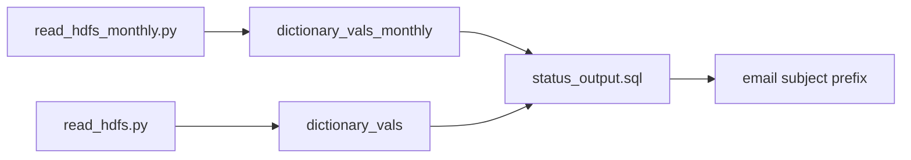

# Parameter bootstrap: upload status summary (`status_output.sql`)

- artifact_type: etl_table
- artifact_id: status_output.sql
- domain: marketing
- one_line_purpose: This script computes the overall Success/Warning/Failure status for monthly and weekly IDC file upload runs. It reads the worst status code from the per-file status tables populated by the Python ingest jobs and exposes the result as flow v...
- layer_type: DWD
- source_kind: etl_sql
- evidence_source: source/etl/sql/marketing/marketing_dw/hdfstohive/status_output.sql

---

## L1 Data Foundation

### Identity and physical mapping
- **Table:** `status_output.sql`
- **Layer type:** DWD
- **Canonical / derived:** Derived / ETL-loaded (see L3)
- **Owner team:** not registered in metadata catalog

### Grain, scope, exclusions
- **Grain:** Not documented in repository
- **Scope:** See L2 business purpose / L3 filters
- **Partition:** Not documented in repository - resolved from pipeline (see L4)
- **Natural key:** Not documented in repository
- **Exclusions:** Not documented in repository


### Cross-engine presence
| Engine | Present | Canonical FQN | Notes |
|--------|---------|---------------|-------|
| Hive | yes | `status_output.sql` | ETL target / intermediate per evidence script |
| Vertica | pending | `status_output.sql` | Confirm via hive2vertica flow evidence / MCP |

### Physical schema reference

Pointer block only - full column catalog lives in WKB L1 storage JSON.

| Field | Value |
|-------|-------|
| **Authoritative catalog** | WKB L1 storage seed (not duplicated in this file) |
| **entity_id** | `status_output.sql` |
| **l1_catalog_seed** | `target/storage/wkb/snapshots/_snapshot_id_template/l1_catalog/{engine}_{schema}_{table}.json` |
| **column_count** | pending (run ddl_seed_writer) |
| **partition_keys** | `Not documented in repository` |
| **ddl_source** | pending Bitbucket DDL / Vertica metadata ingest |
| **retrieval** | `python -m tools.wkb.indexing.run_query --query "marketing status_output schema" --intent find_table_schema` |

### Lineage
See L6 Dependencies and notes.

### Freshness and load path
| Item | Value |
|------|-------|
| Load pattern | See L3 end-to-end / INSERT pattern in evidence script |
| Schedule | Not documented in repository |
| Parameters | None (reads from temp tables created in same flow run). |


---

## L2 Declarative Knowledge

### Business purpose
This script computes the overall Success/Warning/Failure status for monthly and weekly IDC file upload runs. It reads the worst status code from the per-file status tables populated by the Python ingest jobs and exposes the result as flow variables used in notification email subjects.

---

### Audience and use cases
| Audience | How they benefit |
|----------|------------------|
| **Domain consumers (marketing)** | Uses `status_output.sql` for operational and reporting workflows documented below. |

### Fact key resolution
- Natural key: Not documented in repository
- FK / label-on attributes: see L3 dimension join patterns and step-by-step logic.
- Negative assertion: do not treat descriptive labels as grain keys unless listed under natural key.

### Time field semantics
- **date_flag / partition columns:** Not documented in repository
- Primary reporting filter should use the partition column(s) documented in L1; resolve values via L4.

### Metrics served
N/A - no business metric summary in legacy doc

### Metric serving map
N/A - not a `*_comb_mtd` / multi-period wide serving table (or map not present in legacy doc).


### etl_metrics

N/A - no calculable ETL formulas extracted from this document (passthrough / stored measures only, or formulas not documented).

---

## L3 Procedural Knowledge

### Query and routing rules
**Business filters:** Use partition / date keys from L1 grain for reporting scope.
**Technical predicates (load only):** See Key filters and step-by-step logic below.

### Dimension join patterns
| Dimension FQN | Join keys | Purpose | Evidence |
|---------------|-----------|---------|----------|
| See step-by-step / base tables | See L3 steps | Dimension enrichment | `source/etl/sql/marketing/marketing_dw/hdfstohive/status_output.sql` |

### Key filters and ETL business logic
See step-by-step logic

### Standard time-filter SQL
```sql
-- relative period filter using resolved partition value (see L4)
SELECT *
FROM status_output.sql
WHERE /* partition predicate */ date_flag = '${partition_value}';
```

### End-to-end flow


---


#### High-level stages (preserved)

| Output variable | Source table | Logic |
|---------------|--------------|-------|
| `final_status_monthly` | `temp_db.dictionary_vals_monthly` | `max(status)` → map 0=Success, 1=Warning, 2=Failure |
| `final_status_weekly` | `temp_db.dictionary_vals` | Same logic for weekly runs |

**Parameters:** None (reads from temp tables created in same flow run).

---


### Base tables register
None identified in repository

### Step-by-step logic
None identified in repository

### Relationship map (embedded)

| from_fqn | to_fqn | cardinality | join_keys | provenance |
|----------|--------|-------------|-----------|------------|
| — | — | — | — | Not documented in repository |

`source/ref/marketing/table relationship.txt`: Not documented in repository.

### Special logic (embedded)

Not documented in repository

### Column / field derivations (from ETL SQL)

| target_column | expression_sql | upstream_columns | upstream_tables | transform_kind | evidence |
|---------------|----------------|------------------|-----------------|----------------|----------|
| `final_status_monthly` | `case when status=0 then 'Success' when status =1 then 'Warning' when status=2 then 'Failure' end` | `status`, `Success`, `Warning`, `Failure` | `temp_db.dictionary_vals_monthly`, `temp_db.dictionary_vals` | case | `source/etl/sql/marketing/marketing_dw/hdfstohive/status_output.sql:1` |

### Sentinel and code values
| status code | final_status value |
|-------------|-------------------|
| 0 | Success |
| 1 | Warning |
| 2 | Failure |

Overall status uses `max(status)` — any single Failure makes the run Failure.

---

---

## L4 Validation

### Resolved partition value
| Step | Source | How partition / date scope is determined |
|------|--------|------------------------------------------|
| 1 | evidence script / flow | See parameters in L1 Freshness and L3 filters - `source/etl/sql/marketing/marketing_dw/hdfstohive/status_output.sql` |

**Plain language:** Partition and date scope follow Azkaban/bootstrap parameters documented in the source script and orchestrating flow; do not hardcode calendar literals.

### Data quality checks
- Prefer row-count-by-partition, metric sums, and grain duplicate checks (see Validation SQL).
- Additional checks from legacy caveats / operational notes when present.

### Validation SQL
```sql
-- 1) row count by partition
-- SELECT partition_col, COUNT(*) FROM status_output.sql WHERE partition_col = '${partition_value}' GROUP BY 1;
-- 2) metric sum by dimension (top N) - replace metric/dim from L2
-- 3) grain duplicate check on natural keys
```


### Caveats for interpretation
None identified in repository

### Conflicts and open questions
- Schedule, owner, SLA: Not documented in repository (unless preserved schedule evidence above).
- Vertica MCP verification: pending unless confirmed in L5.


---

## L5 Runtime View

### Query path and engine preference
| Role | Hive object | Vertica object | Sync mode | Evidence | MCP verified |
|------|-------------|----------------|-----------|----------|--------------|
| **Not in Vertica** | *See script lineage* | *No Vertica mapping identified in repository* | - | *Add flow evidence when found* | no |

No queryable Vertica table has been confirmed for this script from current repository evidence.

### Access constraints
- Country / company schema parameters may apply (`literal_country`, `company_no`, etc.).
- Hive-only staging objects are not reporting surfaces unless synced.

### Query risk profile
| Field | Value |
|-------|-------|
| requires_date_predicate | unknown |
| scan_risk_tier | high |

---

## L6 Access and Consumption

### Primary consumers and use cases
### Upstream objects (verified)

| Object | Usage | Evidence |
|--------|-------|----------|
| `temp_db.dictionary_vals_monthly` | Monthly status input | `source/etl/sql/marketing/marketing_dw/hdfstohive/status_output.sql:7` |
| `temp_db.dictionary_vals` | Weekly status input | `source/etl/sql/marketing/marketing_dw/hdfstohive/status_output.sql:15` |

### Downstream consumers (verified)

| Object | Evidence |
|--------|----------|
| `send-mail-monthly` subject `${final_status_monthly}` | `source/etl/sql/marketing/marketing_dw/hdfstohive/idc_delivery_month_data.flow:88` |
| `send-mail-weekly` subject `${final_status_weekly}` | `source/etl/sql/marketing/marketing_dw/hdfstohive/idc_delivery_week_data.flow:110` |

### Related scripts (verified)

- `read_hdfs_monthly.py` — creates `dictionary_v

### Representative query patterns
```sql
-- certified / illustrative lookup - replace predicates from L1/L4
SELECT *
FROM status_output.sql
WHERE date_flag = '${partition_value}'
LIMIT 100;
```

### Dependencies and notes
### Upstream objects (verified)

| Object | Usage | Evidence |
|--------|-------|----------|
| `temp_db.dictionary_vals_monthly` | Monthly status input | `source/etl/sql/marketing/marketing_dw/hdfstohive/status_output.sql:7` |
| `temp_db.dictionary_vals` | Weekly status input | `source/etl/sql/marketing/marketing_dw/hdfstohive/status_output.sql:15` |

### Downstream consumers (verified)

| Object | Evidence |
|--------|----------|
| `send-mail-monthly` subject `${final_status_monthly}` | `source/etl/sql/marketing/marketing_dw/hdfstohive/idc_delivery_month_data.flow:88` |
| `send-mail-weekly` subject `${final_status_weekly}` | `source/etl/sql/marketing/marketing_dw/hdfstohive/idc_delivery_week_data.flow:110` |

### Related scripts (verified)

- `read_hdfs_monthly.py` — creates `dictionary_vals_monthly` — `source/etl/sql/marketing/marketing_dw/hdfstohive/read_hdfs_monthly.py:113-116`
- `read_hdfs.py` — creates `dictionary_vals` — `source/etl/sql/marketing/marketing_dw/hdfstohive/read_hdfs.py:113-116`

---

*Document generated from `source/etl/sql/marketing/marketing_dw/hdfstohive/status_output.sql`.*

---

---

#### Not documented in repository
- Owner, SLA (unless schedule evidence preserved above)
- Any dependency without `file:line` evidence in this document

---

*Document migrated to L1-L6 from legacy Knowledgebase content. Evidence: `source/etl/sql/marketing/marketing_dw/hdfstohive/status_output.sql`.*
