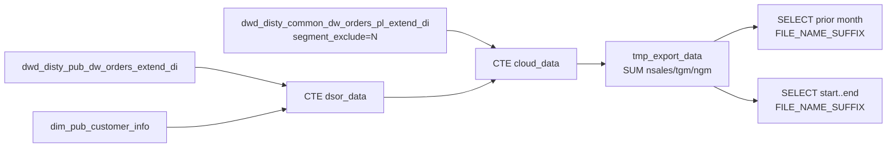

# DM / Export: FPA PBI Marketplace Day Export (`FPAPBIDataflowDayOneworkspaceMarketplaceDimpleAsknaniMi`)

- artifact_type: etl_export
- artifact_id: order.FPAPBIDataflowDayOneworkspaceMarketplaceDimpleAsknaniMi
- domain: order
- one_line_purpose: Builds a temporary Spark view of cloud/marketplace-tagged order aggregates and SELECTs two monthly file slices (prior month + current window) — no Hive INSERT target in SQL.
- layer_type: DM
- source_kind: etl_sql
- evidence_source: source/etl/sql/order/public_order_scripts/public_order_dw/script/FPAPBIDataflowDayOneworkspaceMarketplaceDimpleAsknaniMi.sql

---

## L1 Data Foundation

### Identity and physical mapping
- **Table:** None — SQL creates `TEMPORARY VIEW tmp_export_data` and ends with two `SELECT *` statements (export pattern).
- **Layer type:** DM / export (not a persistent DWD/DWS load)
- **Canonical / derived:** Derived export dataset only
- **Owner team:** not registered in metadata catalog

### Grain, scope, exclusions
- **Grain (export rows):** one row per `(date_flag, Cloud_Market_Place, order_no, vpl_key, customer_key, territory_key, cloud_key)` after aggregation.
- **Scope:** PL-extended orders with `segment_exclude = 'N'`, date from `add_months('${start_date}',-1)` to `${end_date}`, restricted to rows where marketplace CASE is non-null.
- **Partition:** N/A (no INSERT). Export file suffixes use month of prior/`start_date` via `FILE_NAME_SUFFIX` hints.
- **Natural key:** Not documented beyond GROUP BY keys in final SELECT.
- **Exclusions:** `segment_exclude <> 'N'`; rows with NULL `Cloud_Market_Place`; orders outside date window.

### Cross-engine presence
| Engine | Present | Canonical FQN | Notes |
|--------|---------|---------------|-------|
| Hive | temp only | `tmp_export_data` (session TEMPORARY VIEW) | Not a durable table |
| Vertica | no | — | No hive2vertica / INSERT evidence in this SQL |

### Physical schema reference

| Field | Value |
|-------|-------|
| **Authoritative catalog** | N/A — no persistent target table |
| **entity_id** | `order.FPAPBIDataflowDayOneworkspaceMarketplaceDimpleAsknaniMi` |
| **l1_catalog_seed** | N/A — catalog-only pending if durable table is later registered |
| **column_count** | 10 export columns (see L3 derivations) |
| **partition_keys** | N/A |
| **ddl_source** | N/A |
| **retrieval** | N/A — query export columns from this KB doc / SQL |

### Lineage
- **upstream:** `dw_${country_code}.dwd_disty_pub_dw_orders_extend_di` — DSOR reseller keys — `FPAPBIDataflow….sql:11-21`
- **upstream:** `dim_${country_code}.dim_pub_customer_info` — LEFT JOIN (selected columns unused in final SELECT) — `FPAPBIDataflow….sql:12-13`
- **upstream:** `dw_${country_code}.dwd_disty_common_dw_orders_pl_extend_di` — sales / TGM / NGM / marketplace CASE inputs — `FPAPBIDataflow….sql:55-63`
- **downstream:** Not documented in repository (no Azkaban `.flow` reference found; export SELECTs only)

### Freshness and load path
| Item | Value |
|------|-------|
| Load pattern | CREATE OR REPLACE TEMPORARY VIEW + two filtered SELECT exports |
| Schedule | Not documented in repository |
| Parameters | `country_code`, `start_date`, `end_date` |
| Orchestration | Not documented in repository (no FLOW match for this basename) |

---

## L2 Declarative Knowledge

### Business purpose
This script prepares a **Power BI / FPA-style marketplace export**: it classifies order lines into cloud marketplace buckets (DSOR Private Offer, Hyperscaler/StreamOne Private Offer, 3rd Party Marketplace ISV, Hyperscaler Product, StreamOne), builds CISUS-suffixed dimension keys, aggregates `net_sales` / `tgm_amt` / `ngm_amt` to order + marketplace grain, then emits **two SELECT slices** labeled with monthly `FILE_NAME_SUFFIX` hints (prior month vs current `${start_date}` month). It does not load a warehouse fact table.

### Audience and use cases
| Audience | How they benefit |
|----------|-----------------|
| **FPA / PBI** | Marketplace-tagged sales / TGM / NGM extracts for Day-One / Marketplace workspaces (filename implies Dimple Asknani Mi). |
| **Cloud marketplace analysis** | Hard-coded PM / vendor / mcust / from_ref_type rules define marketplace segments. |

### Fact key resolution
- Export grain keys: `date_flag`, `Cloud_Market_Place`, `order_no`, plus generated `vpl_key`, `customer_key`, `territory_key`, `cloud_key`.
- Negative assertion: not a durable fact table — do not register as Vertica reporting FQN without separate evidence.

### Time field semantics
- **date_flag:** from PL extend / pub extend; filtered with `>= add_months('${start_date}',-1)` and `< '${end_date}'` in view build.
- **Export slices:** (1) prior month `[add_months(start_date,-1), start_date)`; (2) `[start_date, end_date)`.

### Metrics served
| Category | Columns | Business reading |
|----------|---------|------------------|
| Sales | `nsales` | `SUM(net_sales)` |
| Margin | `tgm` | `SUM(tgm_amt)` |
| Margin | `ngm` | `SUM(ngm_amt)` |

### Metric serving map
- `nsales` → `SUM(net_sales)` from PL extend
- `tgm` → `SUM(tgm_amt)` from PL extend
- `ngm` → `SUM(ngm_amt)` from PL extend

### etl_metrics

#### `nsales` (export alias)
- **Source:** [metric-index.md](../../../source/contracts/order/metric-index.md#net_sales) (underlying column `net_sales`; export alias `nsales`)
- **Business definition:** Revenue including summarized unit expenses (index). This script sums stored `net_sales` from PL extend.
```sql
ship_qty * (u_price + u_sum_expense)
```

#### `tgm` (export alias of `tgm_amt`)
- **Source:** [metric-index.md](../../../source/contracts/order/metric-index.md#tgm_amt)
- **Business definition:** Extended total gross margin components on PL extend; this script uses `SUM(tgm_amt)`.
```sql
gm_amt + btl + trans_btl + one_time_btl + hbtl + scm_profit_adj + btl_backout + pdt + inv_reserve + mof + marketing + frt_out_load + frt_out_exp + frt_ob_recovery + frt_ib_recovery + cust_pmt_disc + cust_rebate + cvr_rm + ap_adj + others + mfg_oh
```

---

## L3 Procedural Knowledge

### Query and routing rules
**Business filters:** `segment_exclude = 'N'`; marketplace CASE non-null; hard-coded mcust / pm_code / vend_no / from_ref_type lists.
**Technical predicates (load only):** Spark `legacy.timeParserPolicy = LEGACY`; date windows; `FILE_NAME_SUFFIX` select hints.

### Dimension join patterns
| Dimension FQN | Join keys | Purpose | Evidence |
|---------------|-----------|---------|----------|
| `dim_${country_code}.dim_pub_customer_info` | `a.reseller_cust_no = b.cust_no` | LEFT JOIN in `dsor_data` CTE (no `b.*` columns projected) | `FPAPBIDataflow….sql:12-13` |

### Key filters and ETL business logic
- Date window (dsor + cloud) — `date_flag >= add_months('${start_date}',-1) AND date_flag < '${end_date}'` — `FPAPBIDataflow….sql:15-16,62-63`
- Segment include — `dwo.segment_exclude = 'N'` — `FPAPBIDataflow….sql:61`
- Marketplace non-null — `Cloud_Market_Place IS NOT NULL` — `FPAPBIDataflow….sql:83`
- DSOR join — `date_flag`, `order_no`, `order_line_no` — `FPAPBIDataflow….sql:57-59`
- **Special logic applied in this ETL:** Marketplace CASE on `mcust_no`, `pm_code`, `vend_no`, `from_ref_type` (ordered WHEN list) — `FPAPBIDataflow….sql:37-43`; customer_key switches to reseller for DSOR mcusts — `FPAPBIDataflow….sql:50-53`
- **Technical (load only):** `SET spark.sql.legacy.timeParserPolicy = LEGACY` — `FPAPBIDataflow….sql:1`; `FILE_NAME_SUFFIX` hints — `FPAPBIDataflow….sql:97,100`

### Special logic (embedded)
Not documented in repository (`source/ref/order/special_logic.txt` not present). Marketplace classification rules exist only as hard-coded lists in this SQL (see Key filters).

### Standard time-filter SQL
```sql
-- Prior-month export slice (matches second-stage SELECT pattern)
SELECT *
FROM tmp_export_data
WHERE date_flag >= add_months('${start_date}', -1)
  AND date_flag < '${start_date}'
;

-- Current-window export slice
SELECT *
FROM tmp_export_data
WHERE date_flag >= '${start_date}'
  AND date_flag < '${end_date}'
;
```

### End-to-end flow
1. SET Spark legacy time parser policy.
2. CTE `dsor_data`: distinct reseller keys from pub orders extend LEFT JOIN customer dim.
3. CTE `cloud_data`: PL extend LEFT JOIN dsor; apply marketplace CASE + key concatenations; filter `segment_exclude='N'`.
4. Build `tmp_export_data`: aggregate metrics where marketplace is non-null.
5. SELECT prior-month slice with `FILE_NAME_SUFFIX` YYYY-MM of prior month.
6. SELECT current-window slice with `FILE_NAME_SUFFIX` YYYY-MM of `${start_date}`.



### Base tables register
| Object | Role in this job |
|--------|-----------------|
| `dw_${country_code}.dwd_disty_pub_dw_orders_extend_di` | Reseller / DSOR keys |
| `dim_${country_code}.dim_pub_customer_info` | LEFT JOIN only (unused columns in projection) |
| `dw_${country_code}.dwd_disty_common_dw_orders_pl_extend_di` | Metrics + marketplace classification inputs |
| `tmp_export_data` | Temporary export view (session) |

### Relationship map (embedded)
| from_fqn | to_fqn | cardinality | join_keys | provenance |
|----------|--------|-------------|-----------|------------|
| `dw_${country_code}.dwd_disty_pub_dw_orders_extend_di` | `dim_${country_code}.dim_pub_customer_info` | many:1 | `reseller_cust_no = cust_no` | etl_sql |
| `dw_${country_code}.dwd_disty_common_dw_orders_pl_extend_di` | `dsor_data` (CTE) | many:1 | `date_flag`, `order_no`, `order_line_no` | etl_sql |
| `cloud_data` (CTE) | `tmp_export_data` | many:1 (agg) | GROUP BY marketplace + order + keys | etl_sql |

### Step-by-step logic
#### Step 1 — `dsor_data`
Distinct `date_flag`, `order_no`, `order_line_no`, `reseller_cust_no` from pub orders extend in date window.

#### Step 2 — `cloud_data`
From PL extend LEFT JOIN dsor; compute `Cloud_Market_Place`, `cloud_key`, `customer_key`.

#### Step 3 — `tmp_export_data`
Filter non-null marketplace; SUM metrics; GROUP BY keys.

#### Step 4–5 — Export SELECTs
Two filtered selects with file-name suffix hints.

### Column / field derivations (from ETL SQL)

Final export SELECT list (from `tmp_export_data` body — `FPAPBIDataflow….sql:65-95`):

| target_column | expression_sql | upstream_columns | upstream_tables | transform_kind | evidence |
|---------------|----------------|------------------|-----------------|----------------|----------|
| `date_flag` | `date_flag` | `date_flag` | `dwd_disty_common_dw_orders_pl_extend_di` | passthrough | `FPAPBIDataflow….sql:66` |
| `Cloud_Market_Place` | `CASE WHEN mcust_no IN ('788545','787355') THEN 'DSOR Private Offer' WHEN pm_code IN (…) THEN 'Hyperscaler and StreamOne Private Offer' WHEN pm_code IN (…) THEN '3rd Party Market Place ISV' WHEN vend_no IN (…) THEN 'Hyperscaler Product' WHEN from_ref_type IN (…) THEN 'StreamOne' END` | `mcust_no`, `pm_code`, `vend_no`, `from_ref_type` | `dwd_disty_common_dw_orders_pl_extend_di` | case | `FPAPBIDataflow….sql:37-43` |
| `order_no` | `order_no` | `order_no` | PL extend | passthrough | `FPAPBIDataflow….sql:68` |
| `nsales` | `SUM(net_sales)` | `net_sales` | PL extend | agg | `FPAPBIDataflow….sql:69` |
| `tgm` | `SUM(tgm_amt)` | `tgm_amt` | PL extend | agg | `FPAPBIDataflow….sql:70` |
| `ngm` | `SUM(ngm_amt)` | `ngm_amt` | PL extend | agg | `FPAPBIDataflow….sql:71` |
| `vpl_key` | `CONCAT(CAST(COALESCE(pm_code,0) AS STRING), CAST(COALESCE(vend_no,0) AS STRING), 'CISUS')` | `pm_code`, `vend_no` | PL extend | concat | `FPAPBIDataflow….sql:72-76` |
| `customer_key` | `CASE WHEN mcust_no IN ('788545','787355') THEN CONCAT(CAST(COALESCE(reseller_cust_no,0) AS STRING),'CISUS') ELSE CONCAT(CAST(COALESCE(cust_no,0) AS STRING),'CISUS') END` | `mcust_no`, `reseller_cust_no`, `cust_no` | PL extend + dsor | case+concat | `FPAPBIDataflow….sql:50-53` |
| `territory_key` | `CONCAT(CAST(COALESCE(cust_terr,0) AS STRING), 'CISUS')` | `cust_terr` | PL extend | concat | `FPAPBIDataflow….sql:78` |
| `cloud_key` | `CONCAT(CAST(COALESCE(pm_code,0) AS STRING), CAST(COALESCE(vend_no,0) AS STRING), CAST(COALESCE(from_ref_type,0) AS STRING), 'CISUS')` | `pm_code`, `vend_no`, `from_ref_type` | PL extend | concat | `FPAPBIDataflow….sql:44-49` |

### Sentinel and code values
| Value | Type | Meaning |
|-------|------|---------|
| `segment_exclude = 'N'` | business_filter | Include only non-excluded segments |
| `Cloud_Market_Place IS NOT NULL` | business_filter | Drop unclassified rows |
| Hard-coded `mcust_no` / `pm_code` / `vend_no` / `from_ref_type` lists | business_filter | Marketplace classification (see SQL CASE) |
| `'CISUS'` suffix | data_quality_sentinel / key convention | Appended to generated keys |

---

## L4 Validation

### Resolved partition value
| Step | Source | How date scope is determined |
|------|--------|------------------------------|
| 1 | SQL parameters | `${start_date}`, `${end_date}` plus `add_months('${start_date}',-1)` — `FPAPBIDataflow….sql:15-16,62-63,97-102` |
| 2 | Flow | Not documented in repository — no matching `.flow` job name found |

**Plain language:** Date scope is entirely parameter-driven inside the SQL; orchestration wiring is not present in repository flows searched.

### Data quality checks
- Count rows with NULL vs non-null `Cloud_Market_Place` before final filter.
- Reconcile `SUM(nsales)` / `SUM(tgm)` / `SUM(ngm)` to PL extend for same filters.
- Validate hard-coded ID lists still match business intent (lists are SQL-only).

### Validation SQL
```sql
-- Illustrative against source PL extend (not a durable export table)
SELECT Cloud_Market_Place_probe, COUNT(*) AS cnt, SUM(net_sales) AS ns
FROM (
  SELECT
    CASE
      WHEN mcust_no IN ('788545', '787355') THEN 'DSOR Private Offer'
      WHEN from_ref_type IN ('89', '8900', '8901', '8902', '8905', '8906') THEN 'StreamOne'
      ELSE NULL
    END AS Cloud_Market_Place_probe,
    net_sales
  FROM dw_${country_code}.dwd_disty_common_dw_orders_pl_extend_di
  WHERE segment_exclude = 'N'
    AND date_flag >= add_months('${start_date}', -1)
    AND date_flag < '${end_date}'
) s
GROUP BY Cloud_Market_Place_probe
;
```

### Caveats for interpretation
- Not a warehouse table — consumers must run/export the script; no Vertica FQN.
- Marketplace membership is hard-coded ID lists; drift vs business definitions is a maintenance risk.
- `dim_pub_customer_info` is joined but unused in projected columns.
- `SELECT *` final stages depend on temp view column order.

### Conflicts and open questions
- **Unusual / misplaced purpose:** Filename and `FILE_NAME_SUFFIX` + dual SELECT pattern indicate a **PBI/FPA file export**, not a standard public_order_dw table load. No Azkaban `.flow` reference to this basename was found under `source/etl/flows`.
- Whether this script is still scheduled, owned, or superseded: Not documented in repository.
- Customer dim LEFT JOIN appears unused — possible incomplete refactor.

---

## L5 Runtime View

### Query path and engine preference
| Role | Hive object | Vertica object | Sync mode | Evidence | MCP verified |
|------|-------------|----------------|-----------|----------|--------------|
| Export | `tmp_export_data` (temp) | N/A | N/A | `FPAPBIDataflow….sql:2,98-102` | pending / N/A |
| Sources | PL extend + pub extend | may exist for sources | — | SQL FROM clauses | pending |

### Access constraints
- Spark session required for TEMPORARY VIEW + legacy time parser setting.
- Country schema `${country_code}` on source tables.

### Query risk profile
| Field | Value |
|-------|-------|
| requires_date_predicate | yes |
| scan_risk_tier | high |

---

## L6 Access and Consumption

### Primary consumers and use cases
| Audience | How they benefit |
|----------|-----------------|
| **FPA / Power BI** | Marketplace-tagged monthly extracts (filename / suffix pattern) |
| **Data engineering** | Documented as export-only to avoid mistaking for DWD/DWS load |

### Representative query patterns
```sql
-- Rebuild export body (abbreviated) then filter one month
SELECT date_flag, Cloud_Market_Place, order_no, nsales, tgm, ngm
FROM tmp_export_data
WHERE date_flag >= '${start_date}' AND date_flag < '${end_date}'
LIMIT 100
;
```

### Dependencies and notes
### Upstream objects (verified)

| Object | Usage | Evidence |
|--------|-------|----------|
| `dw_${country_code}.dwd_disty_pub_dw_orders_extend_di` | DSOR reseller keys | `FPAPBIDataflow….sql:11-21` |
| `dim_${country_code}.dim_pub_customer_info` | LEFT JOIN (unused projection) | `FPAPBIDataflow….sql:12-13` |
| `dw_${country_code}.dwd_disty_common_dw_orders_pl_extend_di` | Metrics + classification | `FPAPBIDataflow….sql:55-63` |

### Downstream consumers (verified)

| Object / script | Evidence |
|-----------------|----------|
| None identified in repository (no FLOW / INSERT consumer) | — |

### Operational detail (verified)
- No persistent `INSERT OVERWRITE` target in SQL
- Dual export SELECTs with `FILE_NAME_SUFFIX` — `FPAPBIDataflow….sql:97-102`

### Not documented in repository
- Schedule, owner, SLA, Azkaban job wiring
- Intended PBI workspace / dataset contract beyond filename hints
