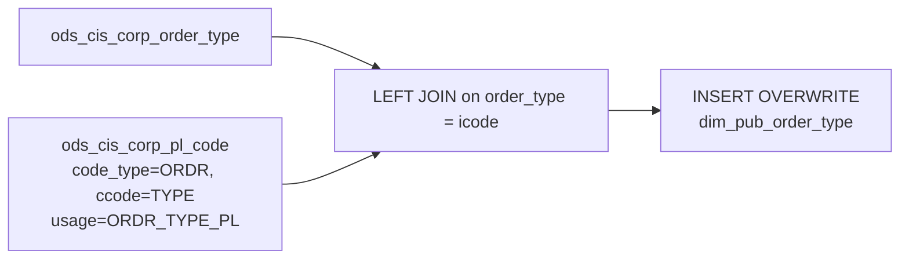

# DIM: Order Type Reference Dimension (`dim_pub_order_type`)

- artifact_type: etl_table
- artifact_id: dim_us.dim_pub_order_type
- domain: order
- one_line_purpose: This job loads the **order type reference dimension**, enriching every order type code with its description, transaction control fields, and a derived `pl_flag` that marks whether the order type is eligible for P&L (profitability) reporting...
- layer_type: DIM
- source_kind: etl_sql
- evidence_source: source/etl/sql/order/source/etl/flows/public_order_tools/ingest/public_order_dimension/script/dim_pub_order_type.sql

---

## L1 Data Foundation

### Identity and physical mapping
- **Table:** `dim_us.dim_pub_order_type`
- **Layer type:** DIM
- **Canonical / derived:** Derived / ETL-loaded (see L3)
- **Owner team:** not registered in metadata catalog

### Grain, scope, exclusions
- **Grain:** one row per `order_type` code.
- **Scope:** See L2 business purpose / L3 filters
- **Partition:** none — full table overwrite on each run. - resolved from pipeline (see L4)
- **Natural key:** `order_type`.
- **Exclusions:** Not documented in repository

#### Grain detail (preserved)

- **Grain:** one row per `order_type` code.
- **Partition:** none — full table overwrite on each run.
- **Natural key:** `order_type`.

---

### Cross-engine presence
| Engine | Present | Canonical FQN | Notes |
|--------|---------|---------------|-------|
| Hive | yes | `dim_pub_order_type` | ETL target / intermediate per evidence script |
| Vertica | pending | `dim_pub_order_type` | Confirm via hive2vertica flow evidence / MCP |

### Physical schema reference

Pointer block only - full column catalog lives in WKB L1 storage JSON.

| Field | Value |
|-------|-------|
| **Authoritative catalog** | WKB L1 storage seed (not duplicated in this file) |
| **entity_id** | `dim_us.dim_pub_order_type` |
| **l1_catalog_seed** | `target/storage/wkb/snapshots/_snapshot_id_template/l1_catalog/{engine}_{schema}_{table}.json` |
| **column_count** | pending (run ddl_seed_writer) |
| **partition_keys** | `none — full table overwrite on each run.` |
| **ddl_source** | pending Bitbucket DDL / Vertica metadata ingest |
| **retrieval** | `python -m tools.wkb.indexing.run_query --query "order dim_pub_order_type schema" --intent find_table_schema` |

### Lineage
| Object | Role |
|--------|------|
| `ods_${country_code}.ods_cis_corp_order_type` | Primary source — order type codes and attributes |
| `ods_${country_code}.ods_cis_corp_pl_code` | PL eligibility lookup — ORDR/TYPE/ORDR_TYPE_PL codes |
| `dim_${country_code}.dim_pub_order_type` | **Target** — order type reference dimension |

---

### Freshness and load path
| Item | Value |
|------|-------|
| Load pattern | See L3 end-to-end / INSERT pattern in evidence script |
| Schedule | Not documented in repository |
| Parameters | `country_code` |


---

## L2 Declarative Knowledge

### Business purpose
This job loads the **order type reference dimension**, enriching every order type code with its description, transaction control fields, and a derived `pl_flag` that marks whether the order type is eligible for P&L (profitability) reporting. It is the canonical lookup for all systems that need to interpret what a given `order_type` code means and whether it should be included in BRPT/OPLGM profitability calculations.

---

### Audience and use cases
| Audience | How they benefit |
|----------|-----------------|
| **ETL / profitability pipelines** | `pl_flag = 'Y'` filters identify which order types to include in BRPT and OPLGM metric calculations — avoiding manually hardcoded lists. |
| **Report / BI developers** | `order_type_descr` and `order_type_descr_alt` provide human-readable order type labels for dashboards. |
| **Finance / operations** | `sales`, `autocred_type`, `invoice_type` flags classify order types for revenue recognition, crediting, and invoicing workflows. |

---

### Identifier search profile
- Primary lookup keys: see natural key under L1 Grain.
- Use latest snapshot / active flags when documented in L3 filters.

### Time field semantics
- **date_flag / partition columns:** none — full table overwrite on each run.
- Primary reporting filter should use the partition column(s) documented in L1; resolve values via L4.


### Metrics served

| Category | Column | Logical metric | Business reading |
|----------|--------|----------------|------------------|
| Governed metric | `pl_flag` | `pl_flag` | pl_flag at unspecified grain |
| Governed profitability | `sales` | `net_sales` | net_sales at unspecified grain |

### Metric serving map

**Formula authority:** [`source/contracts/order/metric-index.md`](../../source/contracts/order/metric-index.md)

| Logical metric | Period scope | Physical column | Formula reference |
|----------------|--------------|-----------------|-------------------|
| `pl_flag` | unspecified | `pl_flag` | `source/contracts/order/metric-index.md#pl_flag` |
| `net_sales` | unspecified | `sales` | `source/contracts/order/metric-index.md#net_sales` |

### etl_metrics

Formulas below are sourced from [`source/contracts/order/metric-index.md`](../../source/contracts/order/metric-index.md) for logical metrics present on this table.
Index formulas are canonical: this enricher copies them into KB and never overwrites `final_effective_formula_sql` in the metric-index.

#### `net_sales`
- **Source:** [metric-index.md](../../source/contracts/order/metric-index.md#net_sales)
- **Business definition:** Revenue including summarized unit expenses.
```sql
ship_qty * (u_price + u_sum_expense)
```

#### `pl_flag`
- **Source:** [metric-index.md](../../source/contracts/order/metric-index.md#pl_flag)
- **Business definition:** `'Y'` for sales order types that are explicitly configured as P&L types in the PL code table, or for order type 1 which is always P&L eligible. All others get `'N'`.
```sql
CASE WHEN a.sales = 'Y' AND (a.order_type = b.icode OR a.order_type = 1) THEN 'Y' ELSE 'N' END
```

---

### Metric serving map
N/A - not a `*_comb_mtd` / multi-period wide serving table (or map not present in legacy doc).


### Data products and column groups (preserved)

### Identifiers and classification

- `order_type` — the numeric order type code (join key to order tables)
- `order_type_descr` — primary description of the order type
- `order_type_descr_alt` — alternative description
- `order_source` — originating system or channel

### Transaction control flags

- `sales` — `'Y'` if this order type counts as a sales transaction
- `autocred_type` — automatic credit type associated with this order type
- `invoice_type` — invoicing method classification
- `module` — system module that processes this order type
- `rec_tran_no`, `rec_void_no`, `ship_tran_no`, `ship_void_no`, `issue_tran_no`, `change_tran_no`, `delete_tran_no` — transaction number codes for each lifecycle stage

### Derived metric flag

- `pl_flag` — `'Y'` when the order type is P&L eligible (sales order type matching a configured PL code, or order type 1); `'N'` otherwise

### Audit columns

- `entry_datetime`, `entry_id` — record creation metadata

---

### etl_metrics

#### `pl_flag`
- **Source:** [metric-index.md](../../source/contracts/order/metric-index.md#pl_flag)
- **Business definition:** `'Y'` for sales order types that are explicitly configured as P&L types in the PL code table, or for order type 1 which is always P&L eligible. All others get `'N'`.
```sql
CASE WHEN a.sales = 'Y' AND (a.order_type = b.icode OR a.order_type = 1) THEN 'Y' ELSE 'N' END
```


---

## L3 Procedural Knowledge

### Query and routing rules
**Business filters:** Use partition / date keys from L1 grain for reporting scope.
**Technical predicates (load only):** See Key filters and step-by-step logic below.

### Dimension join patterns
| Dimension FQN | Join keys | Purpose | Evidence |
|---------------|-----------|---------|----------|
| See step-by-step / base tables | See L3 steps | Dimension enrichment | `source/etl/sql/order/source/etl/flows/public_order_tools/ingest/public_order_dimension/script/dim_pub_order_type.sql` |

### Key filters and ETL business logic
### Step 1 — Final `INSERT OVERWRITE` into `dim_pub_order_type`

**From:** `ods_cis_corp_order_type` (`a`) LEFT JOIN PL code subquery (`b`)

**Join:**
- Subquery: `SELECT icode FROM ods_cis_corp_pl_code WHERE code_type = 'ORDR' AND ccode = 'TYPE' AND usage = 'ORDR_TYPE_PL'`
- Join key: `a.order_type = b.icode`
- Left join: all order types are kept; `b.icode` is null for types not in the PL code list.

**Derived columns:**

| Column | Formula | Plain language |
|--------|---------|----------------|
| `pl_flag` | `CASE WHEN a.sales = 'Y' AND (a.order_type = b.icode OR a.order_type = 1) THEN 'Y' ELSE 'N' END` | `'Y'` for sales order types that are explicitly configured as P&L types in the PL code table, or for order type 1 which is always P&L eligible. All others get `'N'`. |

**Pass-through columns:** `order_type`, `order_type_descr`, `order_source`, `entry_datetime`, `entry_id`, `rec_tran_no`, `rec_void_no`, `ship_tran_no`, `ship_void_no`, `module`, `issue_tran_no`, `change_tran_no`, `delete_tran_no`, `sales`, `autocred_type`, `invoice_type`, `order_type_descr_alt`

---

### Standard time-filter SQL
```sql
-- relative period filter using resolved partition value (see L4)
SELECT *
FROM dim_pub_order_type
WHERE /* partition predicate */ date_flag = '${partition_value}';
```

### End-to-end flow
**Runtime parameters:** `country_code`
**Target table:** `dim_${country_code}.dim_pub_order_type` — full overwrite, no partitioning.

1. Read all rows from `ods_cis_corp_order_type` (order type master).
2. Left-join `ods_cis_corp_pl_code` subquery for PL-eligible order type codes (`code_type = 'ORDR'`, `ccode = 'TYPE'`, `usage = 'ORDR_TYPE_PL'`).
3. Derive `pl_flag`: `'Y'` if `sales = 'Y'` AND (`order_type` matches a PL code `icode` OR `order_type = 1`); else `'N'`.
4. **INSERT OVERWRITE** into `dim_pub_order_type`.



---


#### High-level stages (preserved)

| Stage | Business meaning |
|-------|-----------------|
| **Order type base** | Reads all order type codes and their attributes from `ods_cis_corp_order_type`. |
| **PL-eligible flag** | Left-joins the PL code table (`ods_cis_corp_pl_code`) to identify which order types are configured for profitability reporting (`usage = 'ORDR_TYPE_PL'`). Derives `pl_flag = 'Y'` for sales-type orders that match, or order type 1 (always included). |
| **Full overwrite** | Replaces the entire `dim_pub_order_type` table on each run. |

**Parameters:** `country_code`

---


### Base tables register
| Object | Role in this job |
|--------|-----------------|
| `ods_${country_code}.ods_cis_corp_order_type` | **Primary source.** All order type codes and their attributes — descriptions, flags, transaction numbers. All rows loaded. |
| `ods_${country_code}.ods_cis_corp_pl_code` | **PL eligibility lookup.** Filtered to `code_type = 'ORDR'`, `ccode = 'TYPE'`, `usage = 'ORDR_TYPE_PL'`. Provides `icode` values that identify P&L-eligible order types. |

**Temporary tables (inside the job only):** None (inline subquery for the PL code join).

---

### Step-by-step logic
### Step 1 — Final `INSERT OVERWRITE` into `dim_pub_order_type`

**From:** `ods_cis_corp_order_type` (`a`) LEFT JOIN PL code subquery (`b`)

**Join:**
- Subquery: `SELECT icode FROM ods_cis_corp_pl_code WHERE code_type = 'ORDR' AND ccode = 'TYPE' AND usage = 'ORDR_TYPE_PL'`
- Join key: `a.order_type = b.icode`
- Left join: all order types are kept; `b.icode` is null for types not in the PL code list.

**Derived columns:**

| Column | Formula | Plain language |
|--------|---------|----------------|
| `pl_flag` | `CASE WHEN a.sales = 'Y' AND (a.order_type = b.icode OR a.order_type = 1) THEN 'Y' ELSE 'N' END` | `'Y'` for sales order types that are explicitly configured as P&L types in the PL code table, or for order type 1 which is always P&L eligible. All others get `'N'`. |

**Pass-through columns:** `order_type`, `order_type_descr`, `order_source`, `entry_datetime`, `entry_id`, `rec_tran_no`, `rec_void_no`, `ship_tran_no`, `ship_void_no`, `module`, `issue_tran_no`, `change_tran_no`, `delete_tran_no`, `sales`, `autocred_type`, `invoice_type`, `order_type_descr_alt`

---

### Relationship map (embedded)

| from_fqn | to_fqn | cardinality | join_keys | provenance |
|----------|--------|-------------|-----------|------------|
| `ods_${country_code}.ods_cis_corp_order_type` | `ods_${country_code}.ods_cis_corp_pl_code` | many:1 (LEFT) | `a.order_type` = `b.icode` | etl_sql (`source/etl/sql/order/public_order_scripts/public_order_dimension/script/dim_pub_order_type.sql:22`) |


### Special logic (embedded)

Not documented in repository

### Column / field derivations (from ETL SQL)

| target_column | expression_sql | upstream_columns | upstream_tables | transform_kind | evidence |
|---------------|----------------|------------------|-----------------|----------------|----------|
| `order_type` | `a.order_type` | `order_type` | `ods_${country_code}.ods_cis_corp_order_type`, `ods_${country_code}.ods_cis_corp_pl_code` | passthrough | `source/etl/sql/order/public_order_scripts/public_order_dimension/script/dim_pub_order_type.sql:3` |
| `order_type_descr` | `a.order_type_descr` | `order_type_descr` | `ods_${country_code}.ods_cis_corp_order_type`, `ods_${country_code}.ods_cis_corp_pl_code` | passthrough | `source/etl/sql/order/public_order_scripts/public_order_dimension/script/dim_pub_order_type.sql:4` |
| `order_source` | `a.order_source` | `order_source` | `ods_${country_code}.ods_cis_corp_order_type`, `ods_${country_code}.ods_cis_corp_pl_code` | passthrough | `source/etl/sql/order/public_order_scripts/public_order_dimension/script/dim_pub_order_type.sql:5` |
| `entry_datetime` | `a.entry_datetime` | `entry_datetime` | `ods_${country_code}.ods_cis_corp_order_type`, `ods_${country_code}.ods_cis_corp_pl_code` | passthrough | `source/etl/sql/order/public_order_scripts/public_order_dimension/script/dim_pub_order_type.sql:6` |
| `entry_id` | `a.entry_id` | `entry_id` | `ods_${country_code}.ods_cis_corp_order_type`, `ods_${country_code}.ods_cis_corp_pl_code` | passthrough | `source/etl/sql/order/public_order_scripts/public_order_dimension/script/dim_pub_order_type.sql:7` |
| `rec_tran_no` | `a.rec_tran_no` | `rec_tran_no` | `ods_${country_code}.ods_cis_corp_order_type`, `ods_${country_code}.ods_cis_corp_pl_code` | passthrough | `source/etl/sql/order/public_order_scripts/public_order_dimension/script/dim_pub_order_type.sql:8` |
| `rec_void_no` | `a.rec_void_no` | `rec_void_no` | `ods_${country_code}.ods_cis_corp_order_type`, `ods_${country_code}.ods_cis_corp_pl_code` | passthrough | `source/etl/sql/order/public_order_scripts/public_order_dimension/script/dim_pub_order_type.sql:9` |
| `ship_tran_no` | `a.ship_tran_no` | `ship_tran_no` | `ods_${country_code}.ods_cis_corp_order_type`, `ods_${country_code}.ods_cis_corp_pl_code` | passthrough | `source/etl/sql/order/public_order_scripts/public_order_dimension/script/dim_pub_order_type.sql:10` |
| `ship_void_no` | `a.ship_void_no` | `ship_void_no` | `ods_${country_code}.ods_cis_corp_order_type`, `ods_${country_code}.ods_cis_corp_pl_code` | passthrough | `source/etl/sql/order/public_order_scripts/public_order_dimension/script/dim_pub_order_type.sql:11` |
| `module` | `a.module` | `module` | `ods_${country_code}.ods_cis_corp_order_type`, `ods_${country_code}.ods_cis_corp_pl_code` | passthrough | `source/etl/sql/order/public_order_scripts/public_order_dimension/script/dim_pub_order_type.sql:12` |
| `issue_tran_no` | `a.issue_tran_no` | `issue_tran_no` | `ods_${country_code}.ods_cis_corp_order_type`, `ods_${country_code}.ods_cis_corp_pl_code` | passthrough | `source/etl/sql/order/public_order_scripts/public_order_dimension/script/dim_pub_order_type.sql:13` |
| `change_tran_no` | `a.change_tran_no` | `change_tran_no` | `ods_${country_code}.ods_cis_corp_order_type`, `ods_${country_code}.ods_cis_corp_pl_code` | passthrough | `source/etl/sql/order/public_order_scripts/public_order_dimension/script/dim_pub_order_type.sql:14` |
| `delete_tran_no` | `a.delete_tran_no` | `delete_tran_no` | `ods_${country_code}.ods_cis_corp_order_type`, `ods_${country_code}.ods_cis_corp_pl_code` | passthrough | `source/etl/sql/order/public_order_scripts/public_order_dimension/script/dim_pub_order_type.sql:15` |
| `sales` | `a.sales` | `sales` | `ods_${country_code}.ods_cis_corp_order_type`, `ods_${country_code}.ods_cis_corp_pl_code` | passthrough | `source/etl/sql/order/public_order_scripts/public_order_dimension/script/dim_pub_order_type.sql:16` |
| `autocred_type` | `a.autocred_type` | `autocred_type` | `ods_${country_code}.ods_cis_corp_order_type`, `ods_${country_code}.ods_cis_corp_pl_code` | passthrough | `source/etl/sql/order/public_order_scripts/public_order_dimension/script/dim_pub_order_type.sql:17` |
| `invoice_type` | `a.invoice_type` | `invoice_type` | `ods_${country_code}.ods_cis_corp_order_type`, `ods_${country_code}.ods_cis_corp_pl_code` | passthrough | `source/etl/sql/order/public_order_scripts/public_order_dimension/script/dim_pub_order_type.sql:18` |
| `order_type_descr_alt` | `a.order_type_descr_alt` | `order_type_descr_alt` | `ods_${country_code}.ods_cis_corp_order_type`, `ods_${country_code}.ods_cis_corp_pl_code` | passthrough | `source/etl/sql/order/public_order_scripts/public_order_dimension/script/dim_pub_order_type.sql:19` |
| `pl_flag` | `case when a.sales='Y' and (a.order_type =b.icode or a.order_type=1) then 'Y' else 'N' END` | `sales`, `Y`, `order_type`, `icode`, `N` | `ods_${country_code}.ods_cis_corp_order_type`, `ods_${country_code}.ods_cis_corp_pl_code` | case | `source/etl/sql/order/public_order_scripts/public_order_dimension/script/dim_pub_order_type.sql:2` |

### Sentinel and code values
| Value | Meaning |
|-------|---------|
| `code_type = 'ORDR'`, `ccode = 'TYPE'`, `usage = 'ORDR_TYPE_PL'` | PL code filter — identifies which order type codes are configured for profitability reporting. |
| `order_type = 1` | Always included as a PL-eligible order type regardless of PL code configuration. |
| `pl_flag = 'Y'` | This order type should be included in BRPT / OPLGM profitability calculations. |
| `sales = 'Y'` | Required condition (together with the PL code match) for `pl_flag = 'Y'`. Non-sales order types cannot be PL-flagged. |

---

---

## L4 Validation

### Resolved partition value
| Step | Source | How partition / date scope is determined |
|------|--------|------------------------------------------|
| 1 | evidence script / flow | See parameters in L1 Freshness and L3 filters - `source/etl/sql/order/source/etl/flows/public_order_tools/ingest/public_order_dimension/script/dim_pub_order_type.sql` |

**Plain language:** Partition and date scope follow Azkaban/bootstrap parameters documented in the source script and orchestrating flow; do not hardcode calendar literals.

### Data quality checks
- Prefer row-count-by-partition, metric sums, and grain duplicate checks (see Validation SQL).
- Additional checks from legacy caveats / operational notes when present.

### Validation SQL
```sql
-- 1) Row count by partition
SELECT ${partition_col}, COUNT(*) AS row_cnt
FROM dim_${country_code}.dim_pub_order_type
WHERE ${partition_col} = '${partition_value}'
GROUP BY ${partition_col};

-- 2) Metric sum by business dimension (top deltas)
SELECT ${dim_key}, SUM(${metric}) AS metric_sum
FROM dim_${country_code}.dim_pub_order_type
WHERE ${partition_col} = '${partition_value}'
GROUP BY ${dim_key}
ORDER BY ABS(SUM(${metric})) DESC
LIMIT 20;

-- 3) Grain duplicate check
SELECT ${grain_key_1}, ${grain_key_2}, ${grain_key_3}, ${partition_col}, COUNT(*) AS cnt
FROM dim_${country_code}.dim_pub_order_type
WHERE ${partition_col} = '${partition_value}'
GROUP BY ${grain_key_1}, ${grain_key_2}, ${grain_key_3}, ${partition_col}
HAVING COUNT(*) > 1;
```

Replace placeholders from this file's Grain and keys / Data you can fetch sections, and use the resolved partition value from run scope.

### Caveats for interpretation
- **Full overwrite on every run** — no partition or incremental logic; the entire table is replaced.
- **`pl_flag = 'Y'` requires both `sales = 'Y'` and a PL code match (or `order_type = 1`)** — a non-sales order type will never get `pl_flag = 'Y'` even if it appears in the PL code table.
- **Order type 1 is hardcoded as PL-eligible** — it is added via the `OR a.order_type = 1` clause regardless of whether it appears in `ods_cis_corp_pl_code`.

---

### Conflicts and open questions
- Schedule, owner, SLA: Not documented in repository (unless preserved schedule evidence above).
- Vertica MCP verification: pending unless confirmed in L5.
#### Human Knowledge Layer (preserved)

SME / finance knowledge for **virtual and negative order types** used in B Report P&L adjustments and allocations. These codes often carry Adj P&L impact **with no revenue** and should not be interpreted as ordinary CIS sales order types.

**Contract authority:** [`source/contracts/b-report-us/order-type-pnl-adjustments.md`](../../../source/contracts/b-report-us/order-type-pnl-adjustments.md)  
**Domain pointers:** `source/contracts/b-report-us/domain-knowledge.md`, `source/contracts/pos/domain-knowledge.md`  
**CIS positive OT master (separate):** `source/ref/platform/order_type_info 2.md`

| Order Type | Adj P&L | Business Impacted | Revenue Assignment | Description |
|---|---|---|---|---|
| -2 | CUST_FINANCE / CVR | Customer | Customer with no revenue | Customer Finance/CVR adjustment |
| -3 | INV_COST / AP_FINANCE / INV_RESERVE | Part | Part with no revenue | Inventory Cost, AP Finance, Inventory Reserve adjustment |
| -4 | AP_FINANCE | Part / Customer | Part/Customer with no revenue | AP Finance adjustment |
| -5 | ONE_TIME_BTL / HBTL / SCM_PROFIT_ADJ / HC_PM / HC_BD | VPC | VPC with no revenue | Vendor Product Category adjustment |
| -6 | ONE_TIME_BTL / HBTL / SCM_PROFIT_ADJ / HC_PM / HC_BD | Vendor | Vendor with no revenue | Vendor-level adjustment |
| -8 | CUST_FINANCE / CVR | Customer / VPC | Customer/VPC with no revenue | Customer Finance/CVR adjustment |
| -9 | RMA | Customer / Vendor | Customer/Vendor with no revenue | RMA adjustment |
| -10 | Labor Charge from SCMs | Vendor | Vendor allocation | Insert virtual OT -10 to charge unit_price for specific vendors |
| -16 | FRT_OUT_EXP | Sharp | Vendor allocation | Include 1tmBTL freight recovery moved to Freight Out in OPL calculation |
| -39 | Offset transaction | PCO | NGM impact | Remove OT114 and OT1, keep OT101 rebill only |
| -41 | ONE_TIME_BTL | Sharp | Vendor allocation | Sharp Freight Recovery 1tmBTL moved to Freight Out Expense |
| -43 | OTHERS | Late Fee | Customer/Vendor allocation | Allocate customer late fee charges to vendor line based on sales |
| -50 | CUST_FINANCE_SALES | Cisco / Cloud | Customer allocation | Cisco/Cloud OT127 P&L adjustments |
| -51 | AP_FINANCE | EP Discount Vendors | Vendor allocation | Add AP Finance benefit to vendors, increasing NGM |
| -52 | CUST_FINANCE | Cisco Hyve Interco | Customer allocation | Credit back Customer Finance charges |
| -53 | INV_COST | Sandisk | Vendor allocation | Update inventory cost to purchase price for aging inventory calculation |
| -54 | PDT | NEC | Vendor allocation | Apply 2% PDT to NEC 17057 P&L |
| -55 | CUST_PMT_DISC | SHI, C2FO, BJ's, Walmart, Costco, BestBuy | Customer allocation | Customer Payment Discount adjustment |
| -56 | INV_COST / CR_RISK_CTERM | Broadcom / Avago | Vendor allocation | CIS B11 & B30 report adjustment |
| -57 | INV_RESERVE | Sharp | Vendor allocation | Inventory Reserve adjustment for vendor 75225 |
| -58 | ONE_TIME_BTL | HP PSG | Vendor allocation | Reallocate HP PSG 1tmBTL |
| -59 | OTHERS | Cisco / Cloud | Customer/Vendor allocation | Cisco/Cloud OT127 P&L adjustments |
| -60 | Offset INV_COST / INV_RESERVE / INFRASTRUCTURE | Unassigned Customer | Unassigned Customer | Offset P&L in B30 Unassigned |
| -61 | Reallocate INV_COST / INV_RESERVE / INFRASTRUCTURE | Unassigned Customer | Customer allocation | Look back 12 months and allocate P&L to customers |

**Interpretation notes (human layer):**

- No-revenue assignment types are expected to move Adj P&L without net sales.
- Program-scoped types (Sharp, Cisco/Cloud, NEC, Sandisk, HP PSG, etc.) must be filtered to the documented business impact before portfolio-level attribution.
- OT -39 is an offset rule (drop OT114/OT1, keep OT101 rebill) — do not apply generic credit filters blindly.
- This layer supplements ETL-derived `pl_flag` / `sales` semantics; it does not replace verified SQL lineage below.

---


---

## L5 Runtime View

### Query path and engine preference
| Role | Hive object | Vertica object | Sync mode | Evidence | MCP verified |
|------|-------------|----------------|-----------|----------|--------------|
| **Query for reporting** | *See script lineage* | `dim_${country_code}.dim_pub_order_type` | *Verify from flow* | *Add flow file:line* | pending |
| **Hive alternative** | `*` | `dim_${country_code}.dim_pub_order_type` | - | *See dependencies* | - |
| **ETL internal** | staging/temp tables | *Not synced to Vertica* | - | *See step-by-step logic* | - |

Business users should query `dim_${country_code}.dim_pub_order_type` in Vertica once MCP verification is completed for this document.

### Access constraints
- Country / company schema parameters may apply (`literal_country`, `company_no`, etc.).
- Hive-only staging objects are not reporting surfaces unless synced.

### Query risk profile
| Field | Value |
|-------|-------|
| requires_date_predicate | unknown |
| scan_risk_tier | medium |

---

## L6 Access and Consumption

### Primary consumers and use cases
| Audience | How they benefit |
|----------|-----------------|
| **ETL / profitability pipelines** | `pl_flag = 'Y'` filters identify which order types to include in BRPT and OPLGM metric calculations — avoiding manually hardcoded lists. |
| **Report / BI developers** | `order_type_descr` and `order_type_descr_alt` provide human-readable order type labels for dashboards. |
| **Finance / operations** | `sales`, `autocred_type`, `invoice_type` flags classify order types for revenue recognition, crediting, and invoicing workflows. |

---

### Representative query patterns
```sql
-- certified / illustrative lookup - replace predicates from L1/L4
SELECT *
FROM dim_pub_order_type
WHERE date_flag = '${partition_value}'
LIMIT 100;
```

### Dependencies and notes
### Upstream objects (verified)

| Object | Usage | Evidence |
|--------|-------|----------|
| `ods_${country_code}.ods_cis_corp_order_type` | All order type rows and attributes | `source/etl/sql/order/source/etl/flows/public_order_tools/ingest/public_order_dimension/script/dim_pub_order_type.sql:21` |
| `ods_${country_code}.ods_cis_corp_pl_code` | PL eligibility filter (`code_type='ORDR'`, `ccode='TYPE'`, `usage='ORDR_TYPE_PL'`) | `source/etl/sql/order/source/etl/flows/public_order_tools/ingest/public_order_dimension/script/dim_pub_order_type.sql:24-28` |

### Downstream consumers (verified)

| Object / script | Evidence |
|-----------------|----------|
| None identified in repository. | — |

### Operational detail (verified)

- Full overwrite: `INSERT OVERWRITE TABLE dim_${country_code}.dim_pub_order_type` — `dim_pub_order_type.sql:1`

### Not documented in repository

- Schedule, owner, SLA — not in scripts or configs

---

*Document generated from `source/etl/sql/order/source/etl/flows/public_order_tools/ingest/public_order_dimension/script/dim_pub_order_type.sql`.*

#### Not documented in repository
- Owner, SLA (unless schedule evidence preserved above)
- Any dependency without `file:line` evidence in this document

---

*Document migrated to L1-L6 from legacy Knowledgebase content. Evidence: `source/etl/sql/order/source/etl/flows/public_order_tools/ingest/public_order_dimension/script/dim_pub_order_type.sql`.*
