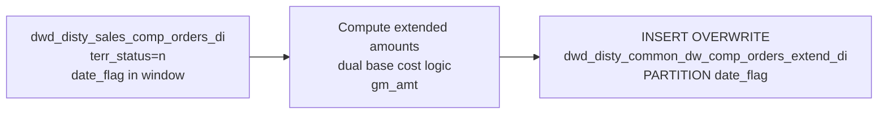

# DWD: Composite Orders Extended — Daily (`dwd_disty_common_dw_comp_orders_extend_di`)

- artifact_type: etl_table
- artifact_id: dw_us.dwd_disty_common_dw_comp_orders_extend_di
- domain: order
- one_line_purpose: This job extends the composite orders DWD table with a full set of pre-computed financial metrics: extended cost, extended base cost, extended price, net price, and gross margin amount — all at the order line level. It also handles the dual...
- layer_type: DWD
- source_kind: etl_sql
- evidence_source: source/etl/sql/order/source/etl/flows/public_order_tools/ingest/public_order_dw/script/dwd_disty_common_dw_comp_orders_extend_di.sql

---

## L1 Data Foundation

### Identity and physical mapping
- **Table:** `dw_us.dwd_disty_common_dw_comp_orders_extend_di`
- **Layer type:** DWD
- **Canonical / derived:** Derived / ETL-loaded (see L3)
- **Owner team:** not registered in metadata catalog

### Grain, scope, exclusions
- **Grain:** one row per `(order_type, order_no, order_line_no, date_flag)` — a territory-normalized composite order line for a given ship date.
- **Scope:** See L2 business purpose / L3 filters
- **Partition:** `date_flag` — the ship date of the composite order line. - resolved from pipeline (see L4)
- **Natural key:** `order_type`, `order_no`, `order_line_no` within a `date_flag` partition.
- **Exclusions:** Not documented in repository

#### Grain detail (preserved)

- **Grain:** one row per `(order_type, order_no, order_line_no, date_flag)` — a territory-normalized composite order line for a given ship date.
- **Partition:** `date_flag` — the ship date of the composite order line.
- **Natural key:** `order_type`, `order_no`, `order_line_no` within a `date_flag` partition.

---

### Cross-engine presence
| Engine | Present | Canonical FQN | Notes |
|--------|---------|---------------|-------|
| Hive | yes | `dwd_disty_common_dw_comp_orders_extend_di` | ETL target / intermediate per evidence script |
| Vertica | pending | `dwd_disty_common_dw_comp_orders_extend_di` | Confirm via hive2vertica flow evidence / MCP |

### Physical schema reference

Pointer block only - full column catalog lives in WKB L1 storage JSON.

| Field | Value |
|-------|-------|
| **Authoritative catalog** | WKB L1 storage seed (not duplicated in this file) |
| **entity_id** | `dw_us.dwd_disty_common_dw_comp_orders_extend_di` |
| **l1_catalog_seed** | `target/storage/wkb/snapshots/_snapshot_id_template/l1_catalog/{engine}_{schema}_{table}.json` |
| **column_count** | pending (run ddl_seed_writer) |
| **partition_keys** | `date_flag` |
| **ddl_source** | pending Bitbucket DDL / Vertica metadata ingest |
| **retrieval** | `python -m tools.wkb.indexing.run_query --query "order dwd_disty_common_dw_comp_orders_extend_di schema" --intent find_table_schema` |

### Lineage
| Object | Role |
|--------|------|
| `dw_${country_code}.dwd_disty_sales_comp_orders_di` | Sole source — composite order lines |
| `dw_${country_code}.dwd_disty_common_dw_comp_orders_extend_di` | **Target** — extended composite order lines with computed financial metrics |

---

### Freshness and load path
| Item | Value |
|------|-------|
| Load pattern | See L3 end-to-end / INSERT pattern in evidence script |
| Schedule | Not documented in repository |
| Parameters | `country_code`, `start_date`, `end_date` |


---

## L2 Declarative Knowledge

### Business purpose
This job extends the composite orders DWD table with a full set of pre-computed financial metrics: extended cost, extended base cost, extended price, net price, and gross margin amount — all at the order line level. It also handles the dual base cost view required for drop-ship (VPO) orders, where the cost basis switches between `base_cost` and `vpo_cost` depending on fulfilment type. The result is the primary analytics-ready composite order line table for reporting, margin analysis, and downstream profitability pipelines.

---

### Audience and use cases
| Audience | How they benefit |
|----------|-----------------|
| **Finance / FP&A** | Pre-computed extended amounts (`extend_cost`, `extend_base_cost`, `extend_price`, `gm_amt`) eliminate in-query multiplication across large composite order datasets. |
| **Margin / profitability teams** | `gm_amt`, `extend_base_cost_shipment`, and `extend_base_cost_vpo` provide two cost views for margin bridges — standard cost vs. VPO-adjusted cost. |
| **Product / vendor management** | `vend_no`, `vend_name`, `pm_code`, `prod_code`, `sku_no`, `vend_seg` — vendor and product line attribution on composite lines. |
| **Operations / supply chain** | `from_loc_no`, `kit_line_no`, `kit_no`, `ship_qty`, `inv_type` — fulfilment and kit structure visibility. |

---

### Fact key resolution
- Natural key: `order_type`, `order_no`, `order_line_no` within a `date_flag` partition.
- FK / label-on attributes: see L3 dimension join patterns and step-by-step logic.
- Negative assertion: do not treat descriptive labels as grain keys unless listed under natural key.

### Time field semantics
- **date_flag / partition columns:** `date_flag` — the ship date of the composite order line.
- Primary reporting filter should use the partition column(s) documented in L1; resolve values via L4.


### Metrics served

| Category | Column | Logical metric | Business reading |
|----------|--------|----------------|------------------|
| Measures | — | — | No measure columns mapped for this table. |

### Metric serving map

**Formula authority:** [`source/contracts/order/metric-index.md`](../../source/contracts/order/metric-index.md)

N/A — no measure columns mapped for this table.

### etl_metrics

No governed logical metrics from `source/contracts/order/metric-index.md` are mapped on this table.

---

### Metric serving map
N/A - not a `*_comb_mtd` / multi-period wide serving table (or map not present in legacy doc).


### Data products and column groups (preserved)

### Identifiers and relationships

- **Order:** `order_type`, `order_no`, `order_line_no`
- **Customer:** `cust_no`, `cust_name`, `cust_loc_no`, `cust_type`, `cust_region`, `cust_terr`, `cust_zip`, `mcust_no`, `lead_id`
- **Product / vendor:** `sku_no`, `part_no`, `vend_no`, `vend_name`, `vend_type`, `prod_code`, `super_prod_code`, `pm_code`, `vend_code`, `inv_type`, `vend_seg`, `vend_seq_ord`
- **Kit:** `kit_line_no`, `kit_no`
- **Channel / pricing:** `from_ref_type`, `price_source`, `sales_rep`, `gv_user_type`, `sales_team`, `terms`, `ship_method`, `from_loc_no`, `to_zip`

### Quantity and unit pricing building blocks

- `ship_qty`, `u_cost`, `u_price`, `u_sum_expense`, `sales_cost`, `base_cost`, `vpo_cost`
- `grid_price`, `retail_price`, `std_whls_price`
- `extra_u_exp` — always NULL in this version (placeholder column)

### Core derived metrics

| Column | Formula | Business reading |
|--------|---------|-----------------|
| `extend_cost` | `u_cost × ship_qty` | Total unit cost for the line. |
| `extend_base_cost` | `base_cost × ship_qty` | Total base cost using the standard `base_cost` field. |
| `extend_price` | `ship_qty × u_price` | Total selling price (gross, before expenses). |
| `extend_exp` | `ship_qty × nvl(u_sum_expense, 0)` | Total expenses/surcharges on the line. |
| `unit_net_price` | `u_price + nvl(u_sum_expense, 0)` | Effective net unit price including expenses. |
| `extend_net_price` | `ship_qty × (u_price + nvl(u_sum_expense, 0))` | Total net revenue for the line. |
| `gm_amt` | `(u_price − nvl(sales_cost, u_cost)) × ship_qty` | Gross margin amount using sales cost with unit cost fallback. |

### Dual base cost columns (VPO / drop-ship logic)

| Column | When `from_loc_no = 98 AND inv_type = 100` | Otherwise |
|--------|------------------------------------------|-----------|
| `base_cost_shipment` | `vpo_cost` | `base_cost` |
| `extend_base_cost_shipment` | `coalesce(vpo_cost, 0) × ship_qty` | `coalesce(base_cost, 0) × ship_qty` |
| `base_cost_vpo` | `base_cost` | `vpo_cost` |
| `extend_base_cost_vpo` | `coalesce(base_cost, 0) × ship_qty` | `coalesce(vpo_cost, 0) × ship_qty` |

**Business reading:** For drop-ship VPO lines, the vendor purchase order cost (`vpo_cost`) is the shipment cost basis; `base_cost` becomes the reference/alternative view. For standard warehouse lines, `base_cost` is the shipment basis and `vpo_cost` is the alternative.

---

### etl_metrics

#### `extend_exp`
- **Source:** [metric-index.md](../../source/contracts/order/metric-index.md#extend_exp)
- **Business definition:** Total expenses/surcharges on the line.
```sql
ship_qty × nvl(u_sum_expense, 0)
```

#### `unit_net_price`
- **Source:** [metric-index.md](../../source/contracts/order/metric-index.md#unit_net_price)
- **Business definition:** Effective net unit price including expenses.
```sql
u_price + nvl(u_sum_expense, 0)
```

#### `extend_net_price`
- **Source:** [metric-index.md](../../source/contracts/order/metric-index.md#extend_net_price)
- **Business definition:** Total net revenue for the line.
```sql
ship_qty × (u_price + nvl(u_sum_expense, 0))
```

#### `gm_amt`
- **Source:** [metric-index.md](../../source/contracts/order/metric-index.md#gm_amt)
- **Business definition:** Gross margin amount using sales cost with unit cost fallback.
```sql
(u_price − nvl(sales_cost, u_cost)) × ship_qty
```

#### `extend_base_cost_shipment`
- **Source:** [metric-index.md](../../source/contracts/order/metric-index.md#extend_base_cost_shipment)
- **Business definition:** `coalesce(base_cost, 0) × ship_qty`
```sql
coalesce(vpo_cost, 0) × ship_qty
```

#### `extend_base_cost_vpo`
- **Source:** [metric-index.md](../../source/contracts/order/metric-index.md#extend_base_cost_vpo)
- **Business definition:** `coalesce(vpo_cost, 0) × ship_qty`
```sql
coalesce(base_cost, 0) × ship_qty
```

#### `extra_u_exp`
- **Source:** [metric-index.md](../../source/contracts/order/metric-index.md#extra_u_exp)
- **Business definition:** Placeholder — not populated from source in this version.
```sql
CAST(NULL AS DECIMAL(19,4))
```


---

## L3 Procedural Knowledge

### Query and routing rules
**Business filters:** Use partition / date keys from L1 grain for reporting scope.
**Technical predicates (load only):** See Key filters and step-by-step logic below.

### Dimension join patterns
| Dimension FQN | Join keys | Purpose | Evidence |
|---------------|-----------|---------|----------|
| See step-by-step / base tables | See L3 steps | Dimension enrichment | `source/etl/sql/order/source/etl/flows/public_order_tools/ingest/public_order_dw/script/dwd_disty_common_dw_comp_orders_extend_di.sql` |

### Key filters and ETL business logic
### Step 1 — Final `INSERT OVERWRITE` into `dwd_disty_common_dw_comp_orders_extend_di`

**Source:** `dw_${country_code}.dwd_disty_sales_comp_orders_di`

**Filter (natural language):**
- `date_flag >= date_sub('${start_date}', dayofmonth('${start_date}') - 1)` — rewinds to the first calendar day of the month containing `start_date`. Ensures the full month is covered even if `start_date` is not the 1st.
- `date_flag < '${end_date}'` — excludes the end date itself (strict upper bound).
- `terr_status = 'n'` — only territory-normalized lines; excludes re-allocation or non-standard territory records.

**Pass-through columns:** `order_type`, `order_no`, `order_line_no`, `ship_date`, `sales_team`, `terms`, `ship_method`, `from_loc_no`, `to_zip`, `cust_no`, `cust_name`, `cust_loc_no`, `cust_type`, `cust_region`, `cust_terr`, `cust_zip`, `vend_no`, `vend_name`, `vend_type`, `sku_no`, `part_no`, `inv_type`, `division`, `pm_code`, `super_prod_code`, `prod_code`, `vend_code`, `ship_qty`, `u_cost`, `u_price`, `u_sum_expense`, `issue_date`, `entry_datetime`, `sales_rep`, `gv_user_type`, `lead_id`, `base_cost`, `vend_seg`, `vend_seq_ord`, `cust_seg`, `mcust_no`, `sales_cost`, `from_ref_type`, `grid_price`, `price_source`, `retail_price`, `kit_line_no`, `kit_no`, `std_whls_price`, `vpo_cost`, `date_flag`

**Derived columns:**

| Column | Formula | Plain language |
|--------|---------|----------------|
| `extra_u_exp` | `CAST(NULL AS DECIMAL(19,4))` | Placeholder — not populated from source i...

### Standard time-filter SQL
```sql
-- relative period filter using resolved partition value (see L4)
SELECT *
FROM dwd_disty_common_dw_comp_orders_extend_di
WHERE /* partition predicate */ date_flag = '${partition_value}';
```

### End-to-end flow
**Runtime parameters:** `country_code`, `start_date`, `end_date`
**Target table:** `dw_${country_code}.dwd_disty_common_dw_comp_orders_extend_di`, partitioned by **`date_flag`**.

1. Read from `dwd_disty_sales_comp_orders_di` filtered to territory-normalized records (`terr_status = 'n'`) within the date window (first day of `start_date` month through `end_date`).
2. Pass through all existing columns.
3. Compute extended amount columns and the dual base cost columns inline.
4. **INSERT OVERWRITE** into the target partitioned by `date_flag`.



---


#### High-level stages (preserved)

| Stage | Business meaning |
|-------|-----------------|
| **Date window filter** | Reads composite orders for the period from the first day of the `start_date` month through to (but not including) `end_date`. The month-start anchor ensures full-month coverage even if `start_date` is mid-month. |
| **Territory filter** | Restricts to `terr_status = 'n'` — territory-normalized lines only, excluding re-allocation records. |
| **Extended amount calculations** | Computes total extended cost, base cost, price, expense, and net price by multiplying unit values by ship quantity. |
| **Dual base cost logic** | For drop-ship VPO lines (`from_loc_no = 98 AND inv_type = 100`), `base_cost_shipment` switches to `vpo_cost` and `base_cost_vpo` switches to `base_cost`. For non-VPO lines, the assignment is the natural default. |
| **Gross margin** | Computes `gm_amt` using `sales_cost` with fallback to `u_cost`. |

**Parameters:** `country_code`, `start_date`, `end_date`

---


### Base tables register
| Object | Role in this job |
|--------|-----------------|
| `dw_${country_code}.dwd_disty_sales_comp_orders_di` | **Sole source.** Composite order lines at territory-normalized grain. Provides all pass-through columns plus the base financial fields. |

**Temporary tables (inside the job only):** None — single direct INSERT.

---

### Step-by-step logic
### Step 1 — Final `INSERT OVERWRITE` into `dwd_disty_common_dw_comp_orders_extend_di`

**Source:** `dw_${country_code}.dwd_disty_sales_comp_orders_di`

**Filter (natural language):**
- `date_flag >= date_sub('${start_date}', dayofmonth('${start_date}') - 1)` — rewinds to the first calendar day of the month containing `start_date`. Ensures the full month is covered even if `start_date` is not the 1st.
- `date_flag < '${end_date}'` — excludes the end date itself (strict upper bound).
- `terr_status = 'n'` — only territory-normalized lines; excludes re-allocation or non-standard territory records.

**Pass-through columns:** `order_type`, `order_no`, `order_line_no`, `ship_date`, `sales_team`, `terms`, `ship_method`, `from_loc_no`, `to_zip`, `cust_no`, `cust_name`, `cust_loc_no`, `cust_type`, `cust_region`, `cust_terr`, `cust_zip`, `vend_no`, `vend_name`, `vend_type`, `sku_no`, `part_no`, `inv_type`, `division`, `pm_code`, `super_prod_code`, `prod_code`, `vend_code`, `ship_qty`, `u_cost`, `u_price`, `u_sum_expense`, `issue_date`, `entry_datetime`, `sales_rep`, `gv_user_type`, `lead_id`, `base_cost`, `vend_seg`, `vend_seq_ord`, `cust_seg`, `mcust_no`, `sales_cost`, `from_ref_type`, `grid_price`, `price_source`, `retail_price`, `kit_line_no`, `kit_no`, `std_whls_price`, `vpo_cost`, `date_flag`

**Derived columns:**

| Column | Formula | Plain language |
|--------|---------|----------------|
| `extra_u_exp` | `CAST(NULL AS DECIMAL(19,4))` | Placeholder — not populated from source in this version. |
| `extend_cost` | `u_cost × ship_qty` | Extended unit cost. |
| `extend_base_cost` | `base_cost × ship_qty` | Extended base cost (standard, non-VPO). |
| `extend_price` | `ship_qty × u_price` | Extended selling price (gross). |
| `extend_exp` | `ship_qty × nvl(u_sum_expense, 0)` | Extended expenses/surcharges. |
| `unit_net_price` | `u_price + nvl(u_sum_expense, 0)` | Unit net price including expenses. |
| `extend_net_price` | `ship_qty × (u_price + nvl(u_sum_expense, 0))` | Extended net revenue. |
| `base_cost_shipment` | `vpo_cost` if VPO drop-ship, else `base_cost` | The cost basis that reflects how the item was actually sourced. |
| `extend_base_cost_shipment` | `coalesce(vpo_cost,0) × ship_qty` or `coalesce(base_cost,0) × ship_qty` | Extended cost based on actual sourcing method. |
| `base_cost_vpo` | `base_cost` if VPO drop-ship, else `vpo_cost` | The alternative cost view (inverse of `base_cost_shipment`). |
| `extend_base_cost_vpo` | Inverse of `extend_base_cost_shipment` | Extended alternative cost view. |
| `gm_amt` | `(u_price − nvl(sales_cost, u_cost)) × ship_qty` | Gross margin using sales cost with unit cost fallback. |

---

### Relationship map (embedded)

| from_fqn | to_fqn | cardinality | join_keys | provenance |
|----------|--------|-------------|-----------|------------|
| `dw_${country_code}.dwd_disty_sales_comp_orders_di` | `dw_${country_code}.dwd_disty_sales_comp_orders_di` | 1:1 source scan | — (no JOIN; single FROM) | etl_sql (`source/etl/sql/order/public_order_scripts/public_order_dw/script/dwd_disty_common_dw_comp_orders_extend_di.sql:24`) |


### Special logic (embedded)

Not documented in repository

### Column / field derivations (from ETL SQL)

| target_column | expression_sql | upstream_columns | upstream_tables | transform_kind | evidence |
|---------------|----------------|------------------|-----------------|----------------|----------|
| `order_type` | `order_type` | `order_type` | `dw_${country_code}.dwd_disty_sales_comp_orders_di` | passthrough | `source/etl/sql/order/public_order_scripts/public_order_dw/script/dwd_disty_common_dw_comp_orders_extend_di.sql:2` |
| `order_no` | `order_no` | `order_no` | `dw_${country_code}.dwd_disty_sales_comp_orders_di` | passthrough | `source/etl/sql/order/public_order_scripts/public_order_dw/script/dwd_disty_common_dw_comp_orders_extend_di.sql:2` |
| `order_line_no` | `order_line_no` | `order_line_no` | `dw_${country_code}.dwd_disty_sales_comp_orders_di` | passthrough | `source/etl/sql/order/public_order_scripts/public_order_dw/script/dwd_disty_common_dw_comp_orders_extend_di.sql:2` |
| `ship_date` | `ship_date` | `ship_date` | `dw_${country_code}.dwd_disty_sales_comp_orders_di` | passthrough | `source/etl/sql/order/public_order_scripts/public_order_dw/script/dwd_disty_common_dw_comp_orders_extend_di.sql:2` |
| `sales_team` | `sales_team` | `sales_team` | `dw_${country_code}.dwd_disty_sales_comp_orders_di` | passthrough | `source/etl/sql/order/public_order_scripts/public_order_dw/script/dwd_disty_common_dw_comp_orders_extend_di.sql:2` |
| `terms` | `terms` | `terms` | `dw_${country_code}.dwd_disty_sales_comp_orders_di` | passthrough | `source/etl/sql/order/public_order_scripts/public_order_dw/script/dwd_disty_common_dw_comp_orders_extend_di.sql:2` |
| `ship_method` | `ship_method` | `ship_method` | `dw_${country_code}.dwd_disty_sales_comp_orders_di` | passthrough | `source/etl/sql/order/public_order_scripts/public_order_dw/script/dwd_disty_common_dw_comp_orders_extend_di.sql:2` |
| `from_loc_no` | `from_loc_no` | `from_loc_no` | `dw_${country_code}.dwd_disty_sales_comp_orders_di` | passthrough | `source/etl/sql/order/public_order_scripts/public_order_dw/script/dwd_disty_common_dw_comp_orders_extend_di.sql:2` |
| `to_zip` | `to_zip` | `to_zip` | `dw_${country_code}.dwd_disty_sales_comp_orders_di` | passthrough | `source/etl/sql/order/public_order_scripts/public_order_dw/script/dwd_disty_common_dw_comp_orders_extend_di.sql:2` |
| `cust_no` | `cust_no` | `cust_no` | `dw_${country_code}.dwd_disty_sales_comp_orders_di` | passthrough | `source/etl/sql/order/public_order_scripts/public_order_dw/script/dwd_disty_common_dw_comp_orders_extend_di.sql:2` |
| `cust_name` | `cust_name` | `cust_name` | `dw_${country_code}.dwd_disty_sales_comp_orders_di` | passthrough | `source/etl/sql/order/public_order_scripts/public_order_dw/script/dwd_disty_common_dw_comp_orders_extend_di.sql:2` |
| `cust_loc_no` | `cust_loc_no` | `cust_loc_no` | `dw_${country_code}.dwd_disty_sales_comp_orders_di` | passthrough | `source/etl/sql/order/public_order_scripts/public_order_dw/script/dwd_disty_common_dw_comp_orders_extend_di.sql:2` |
| `cust_type` | `cust_type` | `cust_type` | `dw_${country_code}.dwd_disty_sales_comp_orders_di` | passthrough | `source/etl/sql/order/public_order_scripts/public_order_dw/script/dwd_disty_common_dw_comp_orders_extend_di.sql:2` |
| `cust_region` | `cust_region` | `cust_region` | `dw_${country_code}.dwd_disty_sales_comp_orders_di` | passthrough | `source/etl/sql/order/public_order_scripts/public_order_dw/script/dwd_disty_common_dw_comp_orders_extend_di.sql:2` |
| `cust_terr` | `cust_terr` | `cust_terr` | `dw_${country_code}.dwd_disty_sales_comp_orders_di` | passthrough | `source/etl/sql/order/public_order_scripts/public_order_dw/script/dwd_disty_common_dw_comp_orders_extend_di.sql:2` |
| `cust_zip` | `cust_zip` | `cust_zip` | `dw_${country_code}.dwd_disty_sales_comp_orders_di` | passthrough | `source/etl/sql/order/public_order_scripts/public_order_dw/script/dwd_disty_common_dw_comp_orders_extend_di.sql:2` |
| `vend_no` | `vend_no` | `vend_no` | `dw_${country_code}.dwd_disty_sales_comp_orders_di` | passthrough | `source/etl/sql/order/public_order_scripts/public_order_dw/script/dwd_disty_common_dw_comp_orders_extend_di.sql:2` |
| `vend_name` | `vend_name` | `vend_name` | `dw_${country_code}.dwd_disty_sales_comp_orders_di` | passthrough | `source/etl/sql/order/public_order_scripts/public_order_dw/script/dwd_disty_common_dw_comp_orders_extend_di.sql:2` |
| `vend_type` | `vend_type` | `vend_type` | `dw_${country_code}.dwd_disty_sales_comp_orders_di` | passthrough | `source/etl/sql/order/public_order_scripts/public_order_dw/script/dwd_disty_common_dw_comp_orders_extend_di.sql:2` |
| `sku_no` | `sku_no` | `sku_no` | `dw_${country_code}.dwd_disty_sales_comp_orders_di` | passthrough | `source/etl/sql/order/public_order_scripts/public_order_dw/script/dwd_disty_common_dw_comp_orders_extend_di.sql:2` |
| `part_no` | `part_no` | `part_no` | `dw_${country_code}.dwd_disty_sales_comp_orders_di` | passthrough | `source/etl/sql/order/public_order_scripts/public_order_dw/script/dwd_disty_common_dw_comp_orders_extend_di.sql:2` |
| `inv_type` | `inv_type` | `inv_type` | `dw_${country_code}.dwd_disty_sales_comp_orders_di` | passthrough | `source/etl/sql/order/public_order_scripts/public_order_dw/script/dwd_disty_common_dw_comp_orders_extend_di.sql:2` |
| `division` | `division` | `division` | `dw_${country_code}.dwd_disty_sales_comp_orders_di` | passthrough | `source/etl/sql/order/public_order_scripts/public_order_dw/script/dwd_disty_common_dw_comp_orders_extend_di.sql:2` |
| `pm_code` | `pm_code` | `pm_code` | `dw_${country_code}.dwd_disty_sales_comp_orders_di` | passthrough | `source/etl/sql/order/public_order_scripts/public_order_dw/script/dwd_disty_common_dw_comp_orders_extend_di.sql:2` |
| `super_prod_code` | `super_prod_code` | `super_prod_code` | `dw_${country_code}.dwd_disty_sales_comp_orders_di` | passthrough | `source/etl/sql/order/public_order_scripts/public_order_dw/script/dwd_disty_common_dw_comp_orders_extend_di.sql:2` |
| `prod_code` | `prod_code` | `prod_code` | `dw_${country_code}.dwd_disty_sales_comp_orders_di` | passthrough | `source/etl/sql/order/public_order_scripts/public_order_dw/script/dwd_disty_common_dw_comp_orders_extend_di.sql:2` |
| `vend_code` | `vend_code` | `vend_code` | `dw_${country_code}.dwd_disty_sales_comp_orders_di` | passthrough | `source/etl/sql/order/public_order_scripts/public_order_dw/script/dwd_disty_common_dw_comp_orders_extend_di.sql:2` |
| `ship_qty` | `ship_qty` | `ship_qty` | `dw_${country_code}.dwd_disty_sales_comp_orders_di` | passthrough | `source/etl/sql/order/public_order_scripts/public_order_dw/script/dwd_disty_common_dw_comp_orders_extend_di.sql:2` |
| `u_cost` | `u_cost` | `u_cost` | `dw_${country_code}.dwd_disty_sales_comp_orders_di` | passthrough | `source/etl/sql/order/public_order_scripts/public_order_dw/script/dwd_disty_common_dw_comp_orders_extend_di.sql:2` |
| `u_price` | `u_price` | `u_price` | `dw_${country_code}.dwd_disty_sales_comp_orders_di` | passthrough | `source/etl/sql/order/public_order_scripts/public_order_dw/script/dwd_disty_common_dw_comp_orders_extend_di.sql:2` |
| `u_sum_expense` | `u_sum_expense` | `u_sum_expense` | `dw_${country_code}.dwd_disty_sales_comp_orders_di` | passthrough | `source/etl/sql/order/public_order_scripts/public_order_dw/script/dwd_disty_common_dw_comp_orders_extend_di.sql:2` |
| `issue_date` | `issue_date` | `issue_date` | `dw_${country_code}.dwd_disty_sales_comp_orders_di` | passthrough | `source/etl/sql/order/public_order_scripts/public_order_dw/script/dwd_disty_common_dw_comp_orders_extend_di.sql:2` |
| `entry_datetime` | `entry_datetime` | `entry_datetime` | `dw_${country_code}.dwd_disty_sales_comp_orders_di` | passthrough | `source/etl/sql/order/public_order_scripts/public_order_dw/script/dwd_disty_common_dw_comp_orders_extend_di.sql:2` |
| `sales_rep` | `sales_rep` | `sales_rep` | `dw_${country_code}.dwd_disty_sales_comp_orders_di` | passthrough | `source/etl/sql/order/public_order_scripts/public_order_dw/script/dwd_disty_common_dw_comp_orders_extend_di.sql:2` |
| `gv_user_type` | `gv_user_type` | `gv_user_type` | `dw_${country_code}.dwd_disty_sales_comp_orders_di` | passthrough | `source/etl/sql/order/public_order_scripts/public_order_dw/script/dwd_disty_common_dw_comp_orders_extend_di.sql:2` |
| `lead_id` | `lead_id` | `lead_id` | `dw_${country_code}.dwd_disty_sales_comp_orders_di` | passthrough | `source/etl/sql/order/public_order_scripts/public_order_dw/script/dwd_disty_common_dw_comp_orders_extend_di.sql:2` |
| `base_cost` | `base_cost` | `base_cost` | `dw_${country_code}.dwd_disty_sales_comp_orders_di` | passthrough | `source/etl/sql/order/public_order_scripts/public_order_dw/script/dwd_disty_common_dw_comp_orders_extend_di.sql:2` |
| `vend_seg` | `vend_seg` | `vend_seg` | `dw_${country_code}.dwd_disty_sales_comp_orders_di` | passthrough | `source/etl/sql/order/public_order_scripts/public_order_dw/script/dwd_disty_common_dw_comp_orders_extend_di.sql:2` |
| `vend_seq_ord` | `vend_seq_ord` | `vend_seq_ord` | `dw_${country_code}.dwd_disty_sales_comp_orders_di` | passthrough | `source/etl/sql/order/public_order_scripts/public_order_dw/script/dwd_disty_common_dw_comp_orders_extend_di.sql:2` |
| `cust_seg` | `cust_seg` | `cust_seg` | `dw_${country_code}.dwd_disty_sales_comp_orders_di` | passthrough | `source/etl/sql/order/public_order_scripts/public_order_dw/script/dwd_disty_common_dw_comp_orders_extend_di.sql:2` |
| `mcust_no` | `mcust_no` | `mcust_no` | `dw_${country_code}.dwd_disty_sales_comp_orders_di` | passthrough | `source/etl/sql/order/public_order_scripts/public_order_dw/script/dwd_disty_common_dw_comp_orders_extend_di.sql:2` |
| `sales_cost` | `sales_cost` | `sales_cost` | `dw_${country_code}.dwd_disty_sales_comp_orders_di` | passthrough | `source/etl/sql/order/public_order_scripts/public_order_dw/script/dwd_disty_common_dw_comp_orders_extend_di.sql:2` |
| `from_ref_type` | `from_ref_type` | `from_ref_type` | `dw_${country_code}.dwd_disty_sales_comp_orders_di` | passthrough | `source/etl/sql/order/public_order_scripts/public_order_dw/script/dwd_disty_common_dw_comp_orders_extend_di.sql:2` |
| `grid_price` | `grid_price` | `grid_price` | `dw_${country_code}.dwd_disty_sales_comp_orders_di` | passthrough | `source/etl/sql/order/public_order_scripts/public_order_dw/script/dwd_disty_common_dw_comp_orders_extend_di.sql:2` |
| `price_source` | `price_source` | `price_source` | `dw_${country_code}.dwd_disty_sales_comp_orders_di` | passthrough | `source/etl/sql/order/public_order_scripts/public_order_dw/script/dwd_disty_common_dw_comp_orders_extend_di.sql:2` |
| `retail_price` | `retail_price` | `retail_price` | `dw_${country_code}.dwd_disty_sales_comp_orders_di` | passthrough | `source/etl/sql/order/public_order_scripts/public_order_dw/script/dwd_disty_common_dw_comp_orders_extend_di.sql:2` |
| `kit_line_no` | `kit_line_no` | `kit_line_no` | `dw_${country_code}.dwd_disty_sales_comp_orders_di` | passthrough | `source/etl/sql/order/public_order_scripts/public_order_dw/script/dwd_disty_common_dw_comp_orders_extend_di.sql:2` |
| `kit_no` | `kit_no` | `kit_no` | `dw_${country_code}.dwd_disty_sales_comp_orders_di` | passthrough | `source/etl/sql/order/public_order_scripts/public_order_dw/script/dwd_disty_common_dw_comp_orders_extend_di.sql:2` |
| `std_whls_price` | `std_whls_price` | `std_whls_price` | `dw_${country_code}.dwd_disty_sales_comp_orders_di` | passthrough | `source/etl/sql/order/public_order_scripts/public_order_dw/script/dwd_disty_common_dw_comp_orders_extend_di.sql:2` |
| `extra_u_exp` | `CAST(NULL AS DECIMAL(19,4))` | — | `dw_${country_code}.dwd_disty_sales_comp_orders_di` | cast | `source/etl/sql/order/public_order_scripts/public_order_dw/script/dwd_disty_common_dw_comp_orders_extend_di.sql:2` |
| `vpo_cost` | `vpo_cost` | `vpo_cost` | `dw_${country_code}.dwd_disty_sales_comp_orders_di` | passthrough | `source/etl/sql/order/public_order_scripts/public_order_dw/script/dwd_disty_common_dw_comp_orders_extend_di.sql:2` |
| `extend_cost` | `u_cost * ship_qty` | `u_cost`, `ship_qty` | `dw_${country_code}.dwd_disty_sales_comp_orders_di` | arithmetic | `source/etl/sql/order/public_order_scripts/public_order_dw/script/dwd_disty_common_dw_comp_orders_extend_di.sql:3` |
| `extend_base_cost` | `base_cost * ship_qty` | `base_cost`, `ship_qty` | `dw_${country_code}.dwd_disty_sales_comp_orders_di` | arithmetic | `source/etl/sql/order/public_order_scripts/public_order_dw/script/dwd_disty_common_dw_comp_orders_extend_di.sql:4` |
| `extend_price` | `ship_qty * u_price` | `ship_qty`, `u_price` | `dw_${country_code}.dwd_disty_sales_comp_orders_di` | arithmetic | `source/etl/sql/order/public_order_scripts/public_order_dw/script/dwd_disty_common_dw_comp_orders_extend_di.sql:5` |
| `extend_exp` | `ship_qty * nvl(u_sum_expense , 0)` | `ship_qty`, `u_sum_expense` | `dw_${country_code}.dwd_disty_sales_comp_orders_di` | coalesce | `source/etl/sql/order/public_order_scripts/public_order_dw/script/dwd_disty_common_dw_comp_orders_extend_di.sql:6` |
| `unit_net_price` | `u_price + nvl(u_sum_expense, 0)` | `u_price`, `u_sum_expense` | `dw_${country_code}.dwd_disty_sales_comp_orders_di` | coalesce | `source/etl/sql/order/public_order_scripts/public_order_dw/script/dwd_disty_common_dw_comp_orders_extend_di.sql:7` |
| `extend_net_price` | `ship_qty * (u_price + nvl(u_sum_expense, 0))` | `ship_qty`, `u_price`, `u_sum_expense` | `dw_${country_code}.dwd_disty_sales_comp_orders_di` | coalesce | `source/etl/sql/order/public_order_scripts/public_order_dw/script/dwd_disty_common_dw_comp_orders_extend_di.sql:8` |
| `base_cost_shipment` | `case WHEN from_loc_no = 98 AND inv_type = 100 THEN vpo_cost ELSE base_cost end` | `from_loc_no`, `inv_type`, `vpo_cost`, `base_cost` | `dw_${country_code}.dwd_disty_sales_comp_orders_di` | case | `source/etl/sql/order/public_order_scripts/public_order_dw/script/dwd_disty_common_dw_comp_orders_extend_di.sql:9` |
| `extend_base_cost_shipment` | `case WHEN from_loc_no = 98 AND inv_type = 100 THEN (COALESCE(vpo_cost, 0) * ship_qty) ELSE (COALESCE(base_cost, 0) * ...` | `from_loc_no`, `inv_type`, `vpo_cost`, `ship_qty`, `base_cost` | `dw_${country_code}.dwd_disty_sales_comp_orders_di` | case | `source/etl/sql/order/public_order_scripts/public_order_dw/script/dwd_disty_common_dw_comp_orders_extend_di.sql:9` |
| `base_cost_vpo` | `case WHEN from_loc_no = 98 AND inv_type = 100 THEN base_cost ELSE vpo_cost end` | `from_loc_no`, `inv_type`, `base_cost`, `vpo_cost` | `dw_${country_code}.dwd_disty_sales_comp_orders_di` | case | `source/etl/sql/order/public_order_scripts/public_order_dw/script/dwd_disty_common_dw_comp_orders_extend_di.sql:9` |
| `extend_base_cost_vpo` | `case WHEN from_loc_no = 98 AND inv_type = 100 THEN (COALESCE(base_cost, 0) * ship_qty) ELSE (COALESCE(vpo_cost, 0) * ...` | `from_loc_no`, `inv_type`, `base_cost`, `ship_qty`, `vpo_cost` | `dw_${country_code}.dwd_disty_sales_comp_orders_di` | case | `source/etl/sql/order/public_order_scripts/public_order_dw/script/dwd_disty_common_dw_comp_orders_extend_di.sql:9` |
| `gm_amt` | `(u_price - nvl(sales_cost,u_cost)) * ship_qty` | `u_price`, `sales_cost`, `u_cost`, `ship_qty` | `dw_${country_code}.dwd_disty_sales_comp_orders_di` | coalesce | `source/etl/sql/order/public_order_scripts/public_order_dw/script/dwd_disty_common_dw_comp_orders_extend_di.sql:22` |
| `date_flag` | `date_flag` | `date_flag` | `dw_${country_code}.dwd_disty_sales_comp_orders_di` | passthrough | `source/etl/sql/order/public_order_scripts/public_order_dw/script/dwd_disty_common_dw_comp_orders_extend_di.sql:1` |

### Sentinel and code values
| Value | Meaning |
|-------|---------|
| `terr_status = 'n'` | Territory-normalized records — the analytics-ready grain. Excludes allocation entries. |
| `from_loc_no = 98 AND inv_type = 100` | Drop-ship VPO fulfilment — triggers the swap of `base_cost` and `vpo_cost` in the dual cost columns. |
| `date_sub(start_date, dayofmonth(start_date) - 1)` | First day of the `start_date` month — ensures full-month data coverage. |
| `extra_u_exp = NULL` | Column is reserved but not populated from any source in this version. |

---

---

## L4 Validation

### Resolved partition value
| Step | Source | How partition / date scope is determined |
|------|--------|------------------------------------------|
| 1 | evidence script / flow | See parameters in L1 Freshness and L3 filters - `source/etl/sql/order/source/etl/flows/public_order_tools/ingest/public_order_dw/script/dwd_disty_common_dw_comp_orders_extend_di.sql` |

**Plain language:** Partition and date scope follow Azkaban/bootstrap parameters documented in the source script and orchestrating flow; do not hardcode calendar literals.

### Data quality checks
- Prefer row-count-by-partition, metric sums, and grain duplicate checks (see Validation SQL).
- Additional checks from legacy caveats / operational notes when present.

### Validation SQL
```sql
-- 1) Row count by partition
SELECT ${partition_col}, COUNT(*) AS row_cnt
FROM dw_${country_code}.dwd_disty_common_dw_comp_orders_extend_di
WHERE ${partition_col} = '${partition_value}'
GROUP BY ${partition_col};

-- 2) Metric sum by business dimension (top deltas)
SELECT ${dim_key}, SUM(${metric}) AS metric_sum
FROM dw_${country_code}.dwd_disty_common_dw_comp_orders_extend_di
WHERE ${partition_col} = '${partition_value}'
GROUP BY ${dim_key}
ORDER BY ABS(SUM(${metric})) DESC
LIMIT 20;

-- 3) Grain duplicate check
SELECT ${grain_key_1}, ${grain_key_2}, ${grain_key_3}, ${partition_col}, COUNT(*) AS cnt
FROM dw_${country_code}.dwd_disty_common_dw_comp_orders_extend_di
WHERE ${partition_col} = '${partition_value}'
GROUP BY ${grain_key_1}, ${grain_key_2}, ${grain_key_3}, ${partition_col}
HAVING COUNT(*) > 1;
```

Replace placeholders from this file's Grain and keys / Data you can fetch sections, and use the resolved partition value from run scope.

### Caveats for interpretation
- **`extra_u_exp` is always NULL** — consumers should not rely on this column for any calculation. It is a placeholder for a field not yet populated from the BRPT or ODS source.
- **`extend_base_cost` vs `extend_base_cost_shipment`:** These can differ significantly for VPO drop-ship lines. `extend_base_cost` always uses `base_cost`; `extend_base_cost_shipment` uses the actual sourcing cost.
- **`gm_amt` uses `sales_cost` with fallback to `u_cost`** — the two cost definitions can differ. Confirm with Finance which definition is applicable to each report context.
- **Date window is month-anchored:** `start_date` is rewound to the first of its month. If the caller passes `start_date = '2024-03-15'`, the filter starts from `2024-03-01`.
- **Source is a DWD table**, not raw ODS — dimension columns and `terr_status` are pre-computed upstream. Changes in `dwd_disty_sales_comp_orders_di` logic affect this table.

---

### Conflicts and open questions
- Schedule, owner, SLA: Not documented in repository (unless preserved schedule evidence above).
- Vertica MCP verification: pending unless confirmed in L5.


---

## L5 Runtime View

### Query path and engine preference
| Role | Hive object | Vertica object | Sync mode | Evidence | MCP verified |
|------|-------------|----------------|-----------|----------|--------------|
| **Query for reporting** | *See script lineage* | `dw_${country_code}.dwd_disty_common_dw_comp_orders_extend_di` | *Verify from flow* | *Add flow file:line* | pending |
| **Hive alternative** | `*` | `dw_${country_code}.dwd_disty_common_dw_comp_orders_extend_di` | - | *See dependencies* | - |
| **ETL internal** | staging/temp tables | *Not synced to Vertica* | - | *See step-by-step logic* | - |

Business users should query `dw_${country_code}.dwd_disty_common_dw_comp_orders_extend_di` in Vertica once MCP verification is completed for this document.

### Access constraints
- Country / company schema parameters may apply (`literal_country`, `company_no`, etc.).
- Hive-only staging objects are not reporting surfaces unless synced.

### Query risk profile
| Field | Value |
|-------|-------|
| requires_date_predicate | yes |
| scan_risk_tier | high |

---

## L6 Access and Consumption

### Primary consumers and use cases
| Audience | How they benefit |
|----------|-----------------|
| **Finance / FP&A** | Pre-computed extended amounts (`extend_cost`, `extend_base_cost`, `extend_price`, `gm_amt`) eliminate in-query multiplication across large composite order datasets. |
| **Margin / profitability teams** | `gm_amt`, `extend_base_cost_shipment`, and `extend_base_cost_vpo` provide two cost views for margin bridges — standard cost vs. VPO-adjusted cost. |
| **Product / vendor management** | `vend_no`, `vend_name`, `pm_code`, `prod_code`, `sku_no`, `vend_seg` — vendor and product line attribution on composite lines. |
| **Operations / supply chain** | `from_loc_no`, `kit_line_no`, `kit_no`, `ship_qty`, `inv_type` — fulfilment and kit structure visibility. |

---

### Representative query patterns
```sql
-- certified / illustrative lookup - replace predicates from L1/L4
SELECT *
FROM dwd_disty_common_dw_comp_orders_extend_di
WHERE date_flag = '${partition_value}'
LIMIT 100;
```

### Dependencies and notes
### Upstream objects (verified)

| Object | Usage | Evidence |
|--------|-------|----------|
| `dw_${country_code}.dwd_disty_sales_comp_orders_di` | All pass-through columns + base financial fields; filtered by `terr_status = 'n'` and date window | `dwd_disty_common_dw_comp_orders_extend_di.sql:24-27` |

### Downstream consumers (verified)

| Object / script | Evidence |
|-----------------|----------|
| None identified in repository. | — |

### Operational detail (verified)

- Partition overwrite: `INSERT OVERWRITE TABLE dw_${country_code}.dwd_disty_common_dw_comp_orders_extend_di PARTITION (date_flag)` — `dwd_disty_common_dw_comp_orders_extend_di.sql:1`

### Not documented in repository

- Schedule, owner, SLA — not in scripts or configs

---

*Document generated from `source/etl/sql/order/source/etl/flows/public_order_tools/ingest/public_order_dw/script/dwd_disty_common_dw_comp_orders_extend_di.sql`.*

#### Not documented in repository
- Owner, SLA (unless schedule evidence preserved above)
- Any dependency without `file:line` evidence in this document

---

*Document migrated to L1-L6 from legacy Knowledgebase content. Evidence: `source/etl/sql/order/source/etl/flows/public_order_tools/ingest/public_order_dw/script/dwd_disty_common_dw_comp_orders_extend_di.sql`.*
