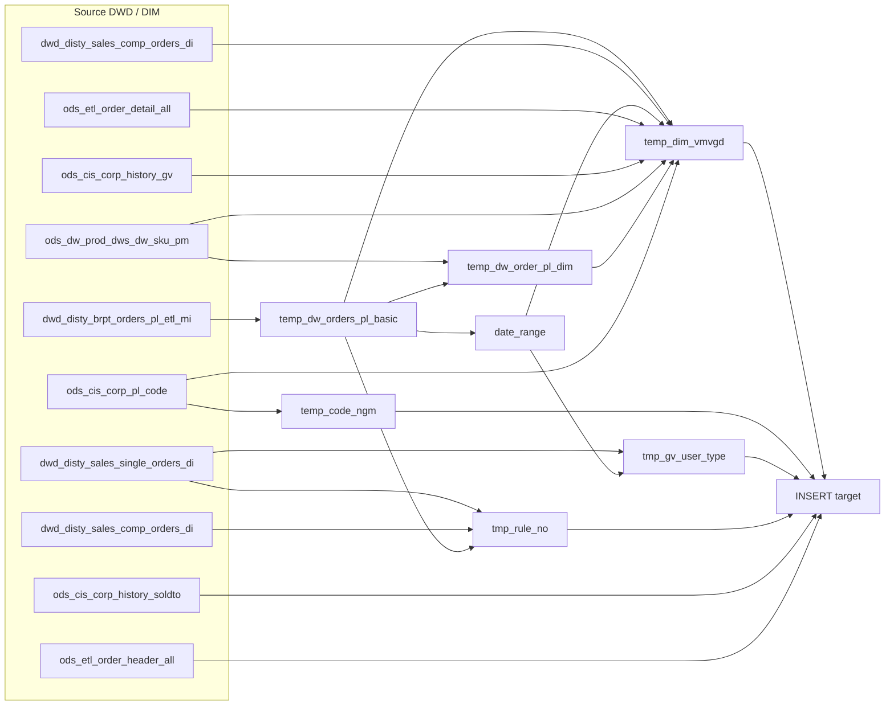

# DWD: Distributor Order Profitability — Extended Line Grain (`dwd_disty_common_dw_orders_pl_extend_di`)

- artifact_type: etl_table
- artifact_id: dw_us.dwd_disty_common_dw_orders_pl_extend_di
- domain: order
- one_line_purpose: This job builds the **extended distributor order profitability dataset** at **order line** grain. It starts from the pre-enriched BRPT profitability extract (`dwd_disty_brpt_orders_pl_etl_mi`) which already carries pre-computed dimension ke...
- layer_type: DWD
- source_kind: etl_sql
- evidence_source: pub_dw/public_order_dw/script/dwd_disty_common_dw_orders_pl_extend_di.sql

---

## L1 Data Foundation

### Identity and physical mapping
- **Table:** `dw_us.dwd_disty_common_dw_orders_pl_extend_di`
- **Layer type:** DWD
- **Canonical / derived:** Derived / ETL-loaded (see L3)
- **Owner team:** not registered in metadata catalog

### Grain, scope, exclusions
- **Grain:** one row per **order line** (and date partition), identified by `order_type`, `order_no`, `order_line_no`, and `date_flag`.
- **Scope:** See L2 business purpose / L3 filters
- **Partition:** `date_flag` — daily business date for the profitability snapshot. - resolved from pipeline (see L4)
- **Natural key:** `order_type`, `order_no`, `order_line_no` within a `date_flag` partition.
- **Exclusions:** Not documented in repository

#### Grain detail (preserved)

- **Grain:** one row per **order line** (and date partition), identified by `order_type`, `order_no`, `order_line_no`, and `date_flag`.
- **Partition:** `date_flag` — daily business date for the profitability snapshot.
- **Natural key:** `order_type`, `order_no`, `order_line_no` within a `date_flag` partition.

---

### Cross-engine presence
| Engine | Present | Canonical FQN | Notes |
|--------|---------|---------------|-------|
| Hive | yes | `dwd_disty_common_dw_orders_pl_extend_di` | ETL target / intermediate per evidence script |
| Vertica | pending | `dwd_disty_common_dw_orders_pl_extend_di` | Confirm via hive2vertica flow evidence / MCP |

### Physical schema reference

Pointer block only - full column catalog lives in WKB L1 storage JSON.

| Field | Value |
|-------|-------|
| **Authoritative catalog** | WKB L1 storage seed (not duplicated in this file) |
| **entity_id** | `dw_us.dwd_disty_common_dw_orders_pl_extend_di` |
| **l1_catalog_seed** | `target/storage/wkb/snapshots/_snapshot_id_template/l1_catalog/{engine}_{schema}_{table}.json` |
| **column_count** | pending (run ddl_seed_writer) |
| **partition_keys** | `date_flag` |
| **ddl_source** | pending Bitbucket DDL / Vertica metadata ingest |
| **retrieval** | `python -m tools.wkb.indexing.run_query --query "order dwd_disty_common_dw_orders_pl_extend_di schema" --intent find_table_schema` |

### Lineage
| Object | Role |
|--------|------|
| `dw_${country_code}.dwd_disty_brpt_orders_pl_etl_mi` | **Primary source** — DWD BRPT PL table with pre-computed dimensions and OPLGM fields. |
| `ods_${country_code}.ods_dw_prod_dws_dw_sku_pm` | SKU-PM monthly dimension fallback for segment/VPL/PM keys. |
| `dw_${country_code}.dwd_disty_sales_comp_orders_di` | Composite orders for `kit_line_no` and `rule_no` fallback. |
| `ods_${country_code}.ods_etl_order_detail_all` | Kit header SKU (`kit_sku_no`) via kit line join. |
| `ods_${country_code}.ods_cis_corp_history_gv` | Order-level GV user type override. |
| `ods_${country_code}.ods_cis_corp_pl_code` | VSEG validation and NGM (`CFNR`, `CRCR`) PL code parameters. |
| `dw_${country_code}.dwd_disty_sales_single_orders_di` | GV user type (priority) and `rule_no` from single orders. |
| `ods_${country_code}.ods_cis_corp_history_soldto` | `from_ref_type` for the order. |
| `ods_${country_code}.ods_etl_order_header_all` | `entry_datetime` as `order_create_date`. |

---

### Freshness and load path
| Item | Value |
|------|-------|
| Load pattern | See L3 end-to-end / INSERT pattern in evidence script |
| Schedule | Not documented in repository |
| Parameters | `country_code`, `start_date`, `end_date` |


---

## L2 Declarative Knowledge

### Business purpose
This job builds the **extended distributor order profitability dataset** at **order line** grain. It starts from the pre-enriched BRPT profitability extract (`dwd_disty_brpt_orders_pl_etl_mi`) which already carries pre-computed dimension keys, and **enriches every line further** with kit context, GV user type overrides, NGM finance splits, OPLGM comparison fields, `from_ref_type`, `order_create_date`, and `rule_no` for a complete, reporting-ready profitability fact.

**In plain terms:** for each profitability-booked order line, the business gets a single row that answers *who sold it, through which vendor/PL structure, to which customer hierarchy, with which margin building blocks*, in a form ready for dashboards, allocations, and cross-functional analysis.

---

### Audience and use cases
| Audience | How they benefit |
|----------|-----------------|
| **Finance / FP&A** | Line-level revenue, cost, margin, TGM-style totals, COGS, FX cost, and components for P&L-style analysis. |
| **Sales & customer teams** | Customer, territory, sales rep, master customer — for account performance and consolidation. |
| **Product / vendor management** | Vendor, VPL, PM hierarchy, product group, division — for line reviews and vendor programs. |
| **Operations / supply chain** | Drop-ship flag, location, kit lines, freight-related fields, SCM usage. |
| **Margin / profitability owners** | Gross margin amount, extended margin aggregates, OPLGM-aligned comparison columns, segment exclude for rule-based reporting. |
| **Pricing / channel** | `from_ref_type` identifies how the order was referenced/channeled; `rule_no` tracks pricing rule applied. |

---

### Fact key resolution
- Natural key: `order_type`, `order_no`, `order_line_no` within a `date_flag` partition.
- FK / label-on attributes: see L3 dimension join patterns and step-by-step logic.
- Negative assertion: do not treat descriptive labels as grain keys unless listed under natural key.

### Time field semantics
- **date_flag / partition columns:** `date_flag` — daily business date for the profitability snapshot.
- Primary reporting filter should use the partition column(s) documented in L1; resolve values via L4.


### Metrics served

| Category | Column | Logical metric | Business reading |
|----------|--------|----------------|------------------|
| Measures | — | — | No measure columns mapped for this table. |

### Metric serving map

**Formula authority:** [`source/contracts/order/metric-index.md`](../../source/contracts/order/metric-index.md)

N/A — no measure columns mapped for this table.

### etl_metrics

No governed logical metrics from `source/contracts/order/metric-index.md` are mapped on this table.

---

### Metric serving map
N/A - not a `*_comb_mtd` / multi-period wide serving table (or map not present in legacy doc).


### Data products and column groups (preserved)

### Identifiers and relationships

- **Order:** `order_type`, `order_no`, `order_line_no`
- **Customer:** `cust_no`, `mcust_no` (resolved from `dim_mcust_no` on source), `cust_terr`, `sales_rep`, `cust_type`, `terms`
- **Product:** `sku_no`, `prod_code`, `kit_line_no`, `kit_sku_no`
- **Vendor / sourcing:** `vend_no`, `from_loc_no`, `inv_type`, `pm_code` (VPL from source)
- **Channel:** `from_ref_type` — from `ods_cis_corp_history_soldto` join on order keys
- **Audit / entry:** `order_create_date` — from `ods_etl_order_header_all.entry_datetime`

### Dimension columns (reporting-ready, pre-computed from source)

Use these for **filters, group-bys, and star-schema joins**:

- `dim_vend_no`, `dim_master_xref` — standardized vendor and master xref
- `dim_vpl_no` — standardized product line (VPL)
- `dim_pm_code`, `dim_key_manager`, `dim_pm_header`, `dim_director` — PM org structure
- `dim_group_id`, `dim_product_group`, `dim_division`, `dim_seg_code` — hierarchy and segmentation
- `ori_seg_code` — original segment code resolved from SKU-PM dimension joins (coalesce of preferred and fallback paths), before any VSEG validation
- `gv_user_type` — governance / user type; overridden from `dwd_disty_sales_single_orders_di` when available, then PL history GV, then source value
- `segment_exclude` — comes directly from source (`dwd_disty_brpt_orders_pl_etl_mi`); flags lines to exclude from standard segment reporting

> **Note:** `cust_segment`, `cust_exclude`, and `part_segment` are always **NULL** in this version of the script (cast as null from source).

### Quantity and pricing building blocks

- `ship_qty`, `real_ship_qty` — `real_ship_qty` is forced to **0** for `order_type = 114`; otherwise equals `ship_qty`
- `u_price`, `u_cost`, `u_sum_expense`, `l_weight`
- `sales_cost`, `base_cost` — for margin definitions using sales cost vs unit cost
- `rule_no` — pricing rule number from single/composite orders (single orders take priority)

### Core derived metrics

| Column | Formula | Business reading |
|--------|---------|-----------------|
| `net_sales` | `ship_qty × (u_price + u_sum_expense)` | Revenue including summarized unit expenses. |
| `net_cost` | `ship_qty × (u_cost + u_sum_expense)` | Cost including summarized unit expenses. |
| `gm_amt` | `(u_price − nvl(sales_cost, u_cost)) × ship_qty` | **Gross margin** using sales cost with unit cost fallback. |
| `tgm_amt` | `gm_amt + btl + trans_btl + one_time_btl + hbtl + scm_profit_adj + btl_backout + pdt + inv_reserve + mof + marketing + frt_out_load + frt_out_exp + frt_ob_recovery + frt_ib_recovery + cust_pmt_disc + cust_rebate + cvr_rm + ap_adj + others + mfg_oh` | **Extended total gross margin** — all major PL components added to GM. |
| `drop_ship_flag` | `from_loc_no = 98 → 'Yes'`, else `'No'` | Whether the line was fulfilled via drop-ship. |
| `scm_usage` | `u_sum_expense × ship_qty` | SCM/expense allocation amount on the line. |
| `gsales` | `u_price × ship_qty` | **Gross sales value** — unit selling price extended by quantity. *(Note: different from the previous version which used `u_sum_expense × ship_qty`.)* |
| `cogs` | `nvl(sales_cost, u_cost) × ship_qty` | Cost of goods sold. |
| `fx_cost` | `(nvl(sales_cost, u_cost) − u_cost) × ship_qty` | FX/sales-cost delta component. |

### OPLGM comparison columns

These come directly from the source `dwd_disty_brpt_orders_pl_etl_mi` and allow side-by-side reconciliation to the OPLGM window:

| Column | Meaning |
|--------|---------|
| `btl_sales_oplgm` | BTL sales per OPLGM view |
| `Pdt_oplgm` | PDT per OPLGM view |
| `cust_rebate_oplgm` | Customer rebate per OPLGM view |
| `cvr_rm_oplgm` | CVR RM per OPLGM view |
| `cust_pmt_disc_oplgm` | Customer payment discount per OPLGM view |
| `cust_finance_sales_oplgm` | Customer finance sales per OPLGM view |
| `rma_oplgm` | RMA per OPLGM view |
| `order_overhead_oplgm` | Order overhead per OPLGM view |
| `trans_btl_sales_oplgm` | Transfer BTL sales per OPLGM view |
| `btl_backout_oplgm` | BTL backout per OPLGM view |
| `ar_fin_recovery_oplgm` | AR finance recovery per OPLGM view |
| `frt_out_exp_oplgm` | Freight out expense per OPLGM view |
| `frt_ob_recovery_oplgm` | Freight outbound recovery per OPLGM view |
| `oplgm_plus_amt` | OPLGM plus amount from source |

### NGM-related allocations

- `cust_finance_ngm` — `cust_finance` scaled by `CFNR/NGM` PL code ratio (`mcode / icode2`), effective within date range
- `cr_risk_cterm_ngm` — `cr_risk_cterm` scaled by `CRCR/NGM` PL code ratio, effective within date range

---

### etl_metrics

#### `net_sales`
- **Source:** [metric-index.md](../../source/contracts/order/metric-index.md#net_sales)
- **Business definition:** Revenue including summarized unit expenses.
```sql
ship_qty × (u_price + u_sum_expense)
```

#### `net_cost`
- **Source:** [metric-index.md](../../source/contracts/order/metric-index.md#net_cost)
- **Business definition:** Cost including summarized unit expenses.
```sql
ship_qty × (u_cost + u_sum_expense)
```

#### `gm_amt`
- **Source:** [metric-index.md](../../source/contracts/order/metric-index.md#gm_amt)
- **Business definition:** **Gross margin** using sales cost with unit cost fallback.
```sql
(u_price − nvl(sales_cost, u_cost)) × ship_qty
```

#### `tgm_amt`
- **Source:** [metric-index.md](../../source/contracts/order/metric-index.md#tgm_amt)
- **Business definition:** **Extended total gross margin** — all major PL components added to GM.
```sql
gm_amt + btl + trans_btl + one_time_btl + hbtl + scm_profit_adj + btl_backout + pdt + inv_reserve + mof + marketing + frt_out_load + frt_out_exp + frt_ob_recovery + frt_ib_recovery + cust_pmt_disc + cust_rebate + cvr_rm + ap_adj + others + mfg_oh
```

#### `cogs`
- **Source:** [metric-index.md](../../source/contracts/order/metric-index.md#cogs)
- **Business definition:** Cost of goods sold.
```sql
nvl(sales_cost, u_cost) × ship_qty
```

#### `fx_cost`
- **Source:** [metric-index.md](../../source/contracts/order/metric-index.md#fx_cost)
- **Business definition:** FX/sales-cost delta component.
```sql
(nvl(sales_cost, u_cost) − u_cost) × ship_qty
```

#### `gv_user_type`
- **Source:** [metric-index.md](../../source/contracts/order/metric-index.md#gv_user_type)
- **Business definition:** GV history overrides source value; else keep source.
```sql
nvl(hg.gv_user_type, twop.gv_user_type_old)
```

#### `ori_seg_code`
- **Source:** [metric-index.md](../../source/contracts/order/metric-index.md#ori_seg_code)
- **Business definition:** Original segment: prefers SKU–PM preferred match, then fallback, then BRPT value. Pre-validation segment before VSEG check.
```sql
coalesce(dsp.seg_code, dsp2.seg_code, twop.dim_seg_code)
```

#### `cust_finance_ngm`
- **Source:** [metric-index.md](../../source/contracts/order/metric-index.md#cust_finance_ngm)
- **Business definition:** Customer finance scaled by NGM CFNR rate.
```sql
cust_finance × (p.mcode / nvl(nullif(p.icode2, 0), 1))
```

#### `cr_risk_cterm_ngm`
- **Source:** [metric-index.md](../../source/contracts/order/metric-index.md#cr_risk_cterm_ngm)
- **Business definition:** Credit risk scaled by NGM CRCR rate.
```sql
cr_risk_cterm × (q.mcode / nvl(nullif(q.icode2, 0), 1))
```


---

## L3 Procedural Knowledge

### Query and routing rules
**Business filters:** Use partition / date keys from L1 grain for reporting scope.
**Technical predicates (load only):** See Key filters and step-by-step logic below.

### Dimension join patterns
| Dimension FQN | Join keys | Purpose | Evidence |
|---------------|-----------|---------|----------|
| See step-by-step / base tables | See L3 steps | Dimension enrichment | `pub_dw/public_order_dw/script/dwd_disty_common_dw_orders_pl_extend_di.sql` |

### Key filters and ETL business logic
### Step 1 — `temp_dw_orders_pl_basic`

**Source:** `dw_${country_code}.dwd_disty_brpt_orders_pl_etl_mi`

**Filter (natural language):**
- Keep rows where **`dt_month`** is between `DATE_FORMAT(start_date, 'yyyy-MM')` and `DATE_FORMAT(end_date, 'yyyy-MM')` — this prunes the BRPT partition efficiently.
- Additionally filter `to_date(date_flag)` to be **on or after the first day of the `start_date` month** and **strictly before `end_date`**.

This two-part predicate is intentional: `dt_month` drives **partition pruning**; `date_flag` drives **exact day-level** filtering within those months.

**What happens to columns:**
- **Identifiers** (`order_type`, `order_no`, `order_line_no`, `cust_no`, `cust_terr`, `sales_rep`, `sku_no`, `prod_code`, `vend_no`, `from_loc_no`, `inv_type`, `cust_type`) pass through as-is.
- **`mcust_no`** — sourced as **`dim_mcust_no`** from the BRPT table (already resolved upstream).
- **`pm_code`** — sourced as **`vpl_no`** from the BRPT table.
- **Money and quantity fields** — any null becomes **0** using `nvl(..., 0)`.
- **`gv_user_type`** — trimmed and stored as **`gv_user_type_old`** for potential later override.
- **`terms`** — trimmed.
- **`cust_segment`, `cust_exclude`, `part_segment`** — always cast as **NULL** (not available from BRPT source).
- **`pdt_sales`, `infra_funding`, `csc_amt`, `ppc_amt`, `extra_u_exp`** — cast as **0** (not available from BRPT source).
- **`others_reason_no`** — cast as **NULL**.
- **`sales_cost`** — passed through dir...

### Standard time-filter SQL
```sql
-- relative period filter using resolved partition value (see L4)
SELECT *
FROM dwd_disty_common_dw_orders_pl_extend_di
WHERE /* partition predicate */ date_flag = '${partition_value}';
```

### End-to-end flow
**Runtime parameters:** `country_code`, `start_date`, `end_date`
**Target table:** `dw_${country_code}.dwd_disty_common_dw_orders_pl_extend_di`, partitioned by **`date_flag`**.

1. Read **pre-enriched profitability lines** from the **BRPT DWD table** (`dwd_disty_brpt_orders_pl_etl_mi`) — this table already carries pre-computed `dim_*` dimension keys, `segment_exclude`, OPLGM fields, and `mcust_no`.
2. Build a **monthly SKU–PM fallback dimension** (`temp_dw_order_pl_dim`) from `dws_dw_sku_pm`.
3. Capture the **date range** of the loaded lines (`date_range`) to constrain downstream joins.
4. Add **kit context** (from composite orders + order detail), **GV user type** (from GV history), and resolve **`ori_seg_code`** via SKU–PM and VSEG validation (`temp_dim_vmvgd`).
5. Pull **`gv_user_type` override** from `dwd_disty_sales_single_orders_di` per order (`tmp_gv_user_type`).
6. Load **NGM PL code parameters** (`temp_code_ngm`) for `CFNR` and `CRCR` finance allocation.
7. Resolve **`rule_no`** from single orders (priority) with composite orders as fallback (`tmp_rule_no`).
8. **Insert** into target: pass through all PL measures, dimensions, OPLGM fields; compute `tgm_amt`, `cust_finance_ngm`, `cr_risk_cterm_ngm`, `scm_usage`, `gsales`, `cogs`, `fx_cost`; join `from_ref_type` and `order_create_date`; apply `gv_user_type` override.



---


#### High-level stages (preserved)

| Stage | Business meaning |
|-------|-----------------|
| **Base order lines** | Reads from `dwd_disty_brpt_orders_pl_etl_mi` (already a DWD layer with pre-computed `dim_*` keys and OPLGM fields). Filters by `dt_month` range and `date_flag` window. |
| **SKU–PM fallback** | Builds `temp_dw_order_pl_dim` — a monthly SKU-level PM rollup from `dws_dw_sku_pm` as a fallback for dimension alignment. |
| **Date range helper** | Captures `min_date` / `max_date` from the base lines to drive downstream join windows. |
| **Kit / GV / segment context** | Joins composite orders (`dwd_disty_sales_comp_orders_di`) for `kit_line_no`, order detail for `kit_sku_no`, GV history for `gv_user_type`, and validates segment code against `corp_pl_code`. |
| **GV user type override** | Pulls `gv_user_type` from `dwd_disty_sales_single_orders_di` (min value per order) as a priority override over the PL line value. |
| **NGM code parameters** | Loads `CFNR` and `CRCR` NGM PL codes for scaled finance allocation. |
| **Rule no** | Resolves `rule_no` from single orders (priority) and composite orders (fallback) for the line. |
| **Final assembly** | Inserts into `dwd_disty_common_dw_orders_pl_extend_di` with all PL measures, pre-computed dimensions, OPLGM comparison fields, NGM splits, `ori_seg_code`, `from_ref_type`, `order_create_date`, `oplgm_plus_amt`, and `rule_no`. |

**Parameters:** `country_code`, `start_date`, `end_date`

---


### Base tables register
| Object | Role in this job |
|--------|-----------------|
| `dw_${country_code}.dwd_disty_brpt_orders_pl_etl_mi` | **Primary source.** BRPT DWD PL table. Already has pre-computed `dim_vpl_no`, `dim_vend_no`, `dim_master_vend_no`, `dim_pm_id`, `dim_pm_mgr_id`, `dim_pm_vp_id`, `dim_pm_dir_id`, `dim_vpc_group_id`, `dim_group_id`, `dim_seg_code`, `dim_division`, `dim_mcust_no`, `segment_exclude`, all OPLGM fields, and `oplgm_plus_amt`. |
| `ods_${country_code}.ods_dw_prod_dws_dw_sku_pm` | Monthly SKU–PM snapshot used as a fallback dimension source. |
| `dw_${country_code}.dwd_disty_sales_comp_orders_di` | Composite orders — provides `kit_line_no` via `terr_status = 'n'` join, and `rule_no` fallback. |
| `ods_${country_code}.ods_etl_order_detail_all` | Order detail — resolves `kit_sku_no` from the kit header line. |
| `ods_${country_code}.ods_cis_corp_history_gv` | Order-level GV history — provides `gv_user_type` override on the line. |
| `ods_${country_code}.ods_cis_corp_pl_code` | VSEG code validation and NGM finance allocation parameters (`CFNR`, `CRCR`). |
| `dw_${country_code}.dwd_disty_sales_single_orders_di` | Single orders — priority source for `gv_user_type` (per order) and `rule_no`. |
| `ods_${country_code}.ods_cis_corp_history_soldto` | Sold-to history — provides `from_ref_type` per order. |
| `ods_${country_code}.ods_etl_order_header_all` | Order header — provides `entry_datetime` as `order_create_date`. |

**Temporary tables (inside the job only):**
`temp_dw_orders_pl_basic` → `date_range` + `temp_dw_order_pl_dim` → `temp_dim_vmvgd` → (final `INSERT` with `tmp_gv_user_type`, `temp_code_ngm`, `tmp_rule_no`)

---

### Step-by-step logic
### Step 1 — `temp_dw_orders_pl_basic`

**Source:** `dw_${country_code}.dwd_disty_brpt_orders_pl_etl_mi`

**Filter (natural language):**
- Keep rows where **`dt_month`** is between `DATE_FORMAT(start_date, 'yyyy-MM')` and `DATE_FORMAT(end_date, 'yyyy-MM')` — this prunes the BRPT partition efficiently.
- Additionally filter `to_date(date_flag)` to be **on or after the first day of the `start_date` month** and **strictly before `end_date`**.

This two-part predicate is intentional: `dt_month` drives **partition pruning**; `date_flag` drives **exact day-level** filtering within those months.

**What happens to columns:**
- **Identifiers** (`order_type`, `order_no`, `order_line_no`, `cust_no`, `cust_terr`, `sales_rep`, `sku_no`, `prod_code`, `vend_no`, `from_loc_no`, `inv_type`, `cust_type`) pass through as-is.
- **`mcust_no`** — sourced as **`dim_mcust_no`** from the BRPT table (already resolved upstream).
- **`pm_code`** — sourced as **`vpl_no`** from the BRPT table.
- **Money and quantity fields** — any null becomes **0** using `nvl(..., 0)`.
- **`gv_user_type`** — trimmed and stored as **`gv_user_type_old`** for potential later override.
- **`terms`** — trimmed.
- **`cust_segment`, `cust_exclude`, `part_segment`** — always cast as **NULL** (not available from BRPT source).
- **`pdt_sales`, `infra_funding`, `csc_amt`, `ppc_amt`, `extra_u_exp`** — cast as **0** (not available from BRPT source).
- **`others_reason_no`** — cast as **NULL**.
- **`sales_cost`** — passed through directly (no `nvl` wrapper; can be null).

**Derived columns in this step:**

| Column | Formula | Plain language |
|--------|---------|----------------|
| `real_ship_qty` | `order_type <> 114 → ship_qty`, else `0` | Forces zero for type 114; others keep shipped qty. |
| `net_sales` | `ship_qty × (u_price + u_sum_expense)` | Extended revenue including expenses. |
| `net_cost` | `ship_qty × (u_cost + u_sum_expense)` | Extended cost including expenses. |
| `gm_amt` | `(u_price − nvl(sales_cost, u_cost)) × ship_qty` | Gross margin using sales cost, falling back to unit cost. |
| `drop_ship_flag` | `from_loc_no = 98 → 'Yes'`, else `'No'` | Drop-ship fulfillment indicator. |

**Dimension columns passed from BRPT source directly (no further computation needed):**
`segment_exclude`, `dim_vpl_no`, `dim_vend_no`, `dim_master_xref` (as `dim_master_vend_no`), `dim_pm_code` (as `dim_pm_id`), `dim_key_manager` (as `dim_pm_mgr_id`), `dim_pm_header` (as `dim_pm_vp_id`), `dim_product_group` (as `dim_vpc_group_id`), `dim_group_id`, `dim_seg_code`, `dim_division`, `dim_director` (as `dim_pm_dir_id`), and all OPLGM fields (`btl_sales_for_opl` → `btl_sales_oplgm`, etc.), `oplgm_plus_amt`.

---

### Step 2 — `temp_dw_order_pl_dim`

**Source:** `ods_dw_prod_dws_dw_sku_pm` INNER JOIN `temp_dw_orders_pl_basic`

**Purpose:** Build a **monthly SKU-level PM dimension rollup** as a fallback when the primary BRPT dimensions need a secondary check. Used in `temp_dim_vmvgd` for `ori_seg_code` resolution.

**Join:** Inner join on `dsp.sku_no = src.sku_no` where `src.sku_no > 0`, and `year(dsp.date_flag) = year(src.date_flag)` and `month(dsp.date_flag) = month(src.date_flag)`.

**Output:** One row per `dsp.date_flag` + `dsp.sku_no` with `max(...)` of `vpl_no`, `vend_no`, `master_xref`, `seg_code`, `pm_header`, `key_manager`, `pm_code`, `group_id`, `product_group`, `director`.

---

### Step 3 — `date_range`

**Source:** `temp_dw_orders_pl_basic`

**Purpose:** Simple helper — captures `MIN(date_flag)` and `MAX(date_flag)` from the loaded lines. Used to constrain the composite orders join in Step 4 so it does not scan the full composite orders table.

---

### Step 4 — `temp_dim_vmvgd`

**Source:** `temp_dw_orders_pl_basic` (**twop**), plus left joins.

**Joins (natural language):**

1. **`dwd_disty_sales_comp_orders_di` (`cp`):** Match same `order_no`, `order_type`, `order_line_no`, and `date_flag` as the PL line, with `terr_status = 'n'`. Also constrain the comp orders' `date_flag` to be within the `date_range` helper. **Purpose:** bring `kit_line_no` when this line is part of a composite/kit order.

2. **`ods_etl_order_detail_all` (`hd`):** Join on `cp.order_no`, `cp.order_type`, matching `hd.order_line_no = cp.kit_line_no`. **Purpose:** resolve the **kit header SKU number** (`kit_sku_no`).

3. **`ods_cis_corp_history_gv` (`hg`):** Join on `twop.order_type` + `twop.order_no`. **Purpose:** override `gv_user_type_old` with the GV history type when present.

4. **`ods_dw_prod_dws_dw_sku_pm` (`dsp`):** Left join on `twop.sku_no`, `nvl(twop.pm_code, -3) = nvl(dsp.ori_vpl_no, -3)`, `twop.vend_no = dsp.ori_vend_no`, and same calendar year+month. **Purpose:** preferred SKU–PM dimension match (original VPL + vendor + month).

5. **`temp_dw_order_pl_dim` (`dsp2`):** Left join on `twop.sku_no` + same year+month. **Purpose:** fallback SKU–PM dimension match when primary SKU–PM doesn't align.

6. **`ods_cis_corp_pl_code` (`pc`):** Left join where `coalesce(dsp.seg_code, dsp2.seg_code, twop.dim_seg_code) = pc.ccode` and `pc.code_type = 'VSEG'`. **Purpose:** validate the resolved segment code.

**New columns added in this step:**

| Column | Logic | Plain language |
|--------|-------|----------------|
| `kit_line_no` | From `cp.kit_line_no` | Kit parent line number; null if not a kit component. |
| `kit_sku_no` | From `hd.sku_no` via kit line join | The kit header's SKU number. |
| `gv_user_type` | `nvl(hg.gv_user_type, twop.gv_user_type_old)` | GV history overrides source value; else keep source. |
| `ori_seg_code` | `coalesce(dsp.seg_code, dsp2.seg_code, twop.dim_seg_code)` | Original segment: prefers SKU–PM preferred match, then fallback, then BRPT value. Pre-validation segment before VSEG check. |

---

### Step 5 — `tmp_gv_user_type`

**Source:** `dwd_disty_sales_single_orders_di` INNER JOIN `date_range`

**Filter:** `terr_status = 'n'`; `TO_DATE(dwo.date_flag)` within `min_date` to `max_date`.

**Logic:** For each `date_flag` + `order_no` + `order_type`, take **`MIN(TRIM(gv_user_type))`** — picks the lexically lowest non-null value when multiple lines exist per order.

**Purpose:** Provides a **per-order** `gv_user_type` from single orders as a **priority override** in the final INSERT.

---

### Step 6 — `temp_code_ngm`

**Source:** `ods_cis_corp_pl_code`

**Filter:** `code_type IN ('CFNR', 'CRCR')` and `ccode = 'NGM'`

**Purpose:** Loads the date-effective NGM scaling parameters (`mcode`, `icode2`, `start_date`, `end_date`) for both Customer Finance NGM (`CFNR`) and Credit Risk / C-Term NGM (`CRCR`) allocation.

**Used in final INSERT to compute:**
- `cust_finance_ngm = cust_finance × (p.mcode / nvl(nullif(p.icode2, 0), 1))`
- `cr_risk_cterm_ngm = cr_risk_cterm × (q.mcode / nvl(nullif(q.icode2, 0), 1))`

Where null bounds default to the line date so every row joins to at least the current-date row.

---

### Step 7 — `tmp_rule_no`

**Source:** `temp_dw_orders_pl_basic` LEFT JOIN single orders and composite orders

**Joins:**
1. **`dwd_disty_sales_single_orders_di` (`dws`):** Match `order_no`, `order_line_no`, `date_flag`, `order_type`, and `terr_status = 'n'`. Returns `dws.rule_no`.
2. **`dwd_disty_sales_comp_orders_di` (`cmp`):** Same keys + `terr_status = 'n'`. Returns `cmp.rule_no` as fallback.

**Column `rule_no`:** `nvl(dws.rule_no, cmp.rule_no)` — **single orders take priority**; composite orders are the fallback; null if neither has a rule.

---

### Step 8 — Final `INSERT` into `dwd_disty_common_dw_orders_pl_extend_di`

**From:** `temp_dim_vmvgd` (**tdvp**)

**Left joins on insert:**

| Join | Keys | Purpose |
|------|------|---------|
| `temp_code_ngm` **p** | `date_flag between start/end`, `code_type = 'CFNR'` | NGM scaling for `cust_finance_ngm` |
| `temp_code_ngm` **q** | `date_flag between start/end`, `code_type = 'CRCR'` | NGM scaling for `cr_risk_cterm_ngm` |
| `ods_cis_corp_history_soldto` **s** | `order_no`, `order_type` | Adds `from_ref_type` to the row |
| `ods_etl_order_header_all` **oh** | `order_no`, `order_type` | Adds `order_create_date` (entry_datetime) |
| `tmp_gv_user_type` **gv** | `order_no`, `order_type`, `date_flag` | Priority override for `gv_user_type` |
| `tmp_rule_no` **rn** | `order_no`, `order_type`, `order_line_no`, `date_flag` | Adds `rule_no` |

**Pass-through columns:**
All PL measures from `tdvp` are written as-is: quantities, unit price/cost/expense, every BTL/freight/rebate/finance/overhead/NGM/OPLGM component column, all `dim_*` keys, `kit_line_no`, `kit_sku_no`, `real_ship_qty`, `net_sales`, `net_cost`, `gm_amt`, `drop_ship_flag`, `segment_exclude`, `ori_seg_code`, and all `*_oplgm` columns.

**`gv_user_type`** in the target = `NVL(gv.gv_user_type, tdvp.gv_user_type)` — single-orders override wins, else GV-history-resolved value from Step 4.

**Derived columns computed at INSERT:**

| Column | Formula | Plain language |
|--------|---------|----------------|
| `cust_finance_ngm` | `cust_finance × (p.mcode / nvl(nullif(p.icode2, 0), 1))` | Customer finance scaled by NGM CFNR rate. |
| `cr_risk_cterm_ngm` | `cr_risk_cterm × (q.mcode / nvl(nullif(q.icode2, 0), 1))` | Credit risk scaled by NGM CRCR rate. |
| `tgm_amt` | `gm_amt + btl + trans_btl + one_time_btl + hbtl + scm_profit_adj + btl_backout + pdt + inv_reserve + mof + marketing + frt_out_load + frt_out_exp + frt_ob_recovery + frt_ib_recovery + cust_pmt_disc + cust_rebate + cvr_rm + ap_adj + others + mfg_oh` | Broad TGM: GM plus all major P&L component adjustments. |
| `scm_usage` | `u_sum_expense × ship_qty` | Total SCM / expense dollars on the line. |
| `gsales` | `u_price × ship_qty` | Gross sales (unit price × qty). **Not the same as `scm_usage`.** |
| `cogs` | `nvl(sales_cost, u_cost) × ship_qty` | Cost of goods sold. |
| `fx_cost` | `(nvl(nvl(sales_cost, u_cost), 0) − nvl(u_cost, 0)) × nvl(ship_qty, 0)` | Sales-cost vs unit-cost delta × qty (FX / cost basis component). |
| `from_ref_type` | From `ods_cis_corp_history_soldto.from_ref_type` | How the order was channeled/referenced. |
| `order_create_date` | From `ods_etl_order_header_all.entry_datetime` | Date/time the order was first entered in the system. |
| `rule_no` | From `tmp_rule_no` | Pricing rule applied; single orders priority, comp orders fallback. |

---

### Relationship map (embedded)

| from_fqn | to_fqn | cardinality | join_keys | provenance |
|----------|--------|-------------|-----------|------------|
| `ods_${country_code}.ods_dw_prod_dws_dw_sku_pm` | `temp_dw_orders_pl_basic` | many:1 | `dsp.sku_no` = `src.sku_no` | etl_sql (`source/etl/sql/order/public_order_scripts/public_order_dw/script/dwd_disty_common_dw_orders_pl_extend_di.sql:143`) |
| `twop` | `dw_${country_code}.dwd_disty_sales_comp_orders_di` | many:1 (LEFT) | `twop.order_no` = `cp.order_no`; `twop.order_type` = `cp.order_type`; `twop.order_line_no` = `cp.order_line_no`; `twop.date_flag` = `cp.date_flag` | etl_sql (`source/etl/sql/order/public_order_scripts/public_order_dw/script/dwd_disty_common_dw_orders_pl_extend_di.sql:168`) |
| `dw_${country_code}.dwd_disty_brpt_orders_pl_etl_mi` | `date_range` | many:1 (LEFT) | cp.date_flag >= dr.min_date and cp.date_flag<= dr.max_date | etl_sql (`source/etl/sql/order/public_order_scripts/public_order_dw/script/dwd_disty_common_dw_orders_pl_extend_di.sql:174`) |
| `dw_${country_code}.dwd_disty_sales_comp_orders_di` | `ods_${country_code}.ods_etl_order_detail_all` | many:1 (LEFT) | `cp.order_no` = `hd.order_no`; `cp.order_type` = `hd.order_type`; `cp.kit_line_no` = `hd.order_line_no` | etl_sql (`source/etl/sql/order/public_order_scripts/public_order_dw/script/dwd_disty_common_dw_orders_pl_extend_di.sql:177`) |
| `twop` | `ods_${country_code}.ods_cis_corp_history_gv` | many:1 (LEFT) | `twop.order_type` = `hg.order_type`; `twop.order_no` = `hg.order_no` | etl_sql (`source/etl/sql/order/public_order_scripts/public_order_dw/script/dwd_disty_common_dw_orders_pl_extend_di.sql:181`) |
| `twop` | `ods_${country_code}.ods_dw_prod_dws_dw_sku_pm` | many:1 (LEFT) | `twop.sku_no` = `dsp.sku_no`; `twop.vend_no` = `dsp.ori_vend_no` | etl_sql (`source/etl/sql/order/public_order_scripts/public_order_dw/script/dwd_disty_common_dw_orders_pl_extend_di.sql:185`) |
| `twop` | `temp_dw_order_pl_dim` | many:1 (LEFT) | `twop.sku_no` = `dsp2.sku_no` | etl_sql (`source/etl/sql/order/public_order_scripts/public_order_dw/script/dwd_disty_common_dw_orders_pl_extend_di.sql:191`) |
| `dw_${country_code}.dwd_disty_brpt_orders_pl_etl_mi` | `ods_${country_code}.ods_cis_corp_pl_code` | many:1 (LEFT) | coalesce(dsp.seg_code,dsp2.seg_code,twop.dim_seg_code) = pc.ccode and pc.code_type = 'VSEG'; --5 get gv_user_type CREATE TEMPORARY table tmp_gv_user_type AS | etl_sql (`source/etl/sql/order/public_order_scripts/public_order_dw/script/dwd_disty_common_dw_orders_pl_extend_di.sql:195`) |
| `dw_${country_code}.dwd_disty_brpt_orders_pl_etl_mi` | `date_range` | many:1 | TO_DATE(dwo.date_flag) >= dr.min_date AND TO_DATE(dwo.date_flag) <= dr.max_date | etl_sql (`source/etl/sql/order/public_order_scripts/public_order_dw/script/dwd_disty_common_dw_orders_pl_extend_di.sql:208`) |
| `pl` | `dw_${country_code}.dwd_disty_sales_single_orders_di` | many:1 (LEFT) | `pl.order_no` = `dws.order_no`; `pl.order_line_no` = `dws.order_line_no`; `pl.date_flag` = `dws.date_flag`; `pl.order_type` = `dws.order_type` | etl_sql (`source/etl/sql/order/public_order_scripts/public_order_dw/script/dwd_disty_common_dw_orders_pl_extend_di.sql:235`) |
| `pl` | `dw_${country_code}.dwd_disty_sales_comp_orders_di` | many:1 (LEFT) | `pl.order_no` = `cmp.order_no`; `pl.order_line_no` = `cmp.order_line_no`; `pl.date_flag` = `cmp.date_flag`; `pl.order_type` = `cmp.order_type` | etl_sql (`source/etl/sql/order/public_order_scripts/public_order_dw/script/dwd_disty_common_dw_orders_pl_extend_di.sql:241`) |
| `dw_${country_code}.dwd_disty_brpt_orders_pl_etl_mi` | `temp_code_ngm` | many:1 (LEFT) | tdvp.date_flag between nvl(p.start_date,tdvp.date_flag) and nvl(p.end_date,tdvp.date_flag) AND p.code_type = 'CFNR' | etl_sql (`source/etl/sql/order/public_order_scripts/public_order_dw/script/dwd_disty_common_dw_orders_pl_extend_di.sql:383`) |
| `dw_${country_code}.dwd_disty_brpt_orders_pl_etl_mi` | `temp_code_ngm` | many:1 (LEFT) | tdvp.date_flag between nvl(q.start_date,tdvp.date_flag) and nvl(q.end_date,tdvp.date_flag) AND q.code_type = 'CRCR' | etl_sql (`source/etl/sql/order/public_order_scripts/public_order_dw/script/dwd_disty_common_dw_orders_pl_extend_di.sql:386`) |
| `tdvp` | `ods_${country_code}.ods_cis_corp_history_soldto` | many:1 (LEFT) | `tdvp.order_no` = `s.order_no`; `tdvp.order_type` = `s.order_type` | etl_sql (`source/etl/sql/order/public_order_scripts/public_order_dw/script/dwd_disty_common_dw_orders_pl_extend_di.sql:389`) |
| `tdvp` | `ods_${country_code}.ods_etl_order_header_all` | many:1 (LEFT) | `tdvp.order_no` = `oh.order_no`; `tdvp.order_type` = `oh.order_type` | etl_sql (`source/etl/sql/order/public_order_scripts/public_order_dw/script/dwd_disty_common_dw_orders_pl_extend_di.sql:391`) |
| `tdvp` | `tmp_gv_user_type` | many:1 (LEFT) | `tdvp.order_no` = `gv.order_no`; `tdvp.order_type` = `gv.order_type`; `tdvp.date_flag` = `gv.date_flag` | etl_sql (`source/etl/sql/order/public_order_scripts/public_order_dw/script/dwd_disty_common_dw_orders_pl_extend_di.sql:393`) |
| `tdvp` | `tmp_rule_no` | many:1 (LEFT) | `tdvp.order_no` = `rn.order_no`; `tdvp.order_type` = `rn.order_type`; `tdvp.order_line_no` = `rn.order_line_no`; `tdvp.date_flag` = `rn.date_flag` | etl_sql (`source/etl/sql/order/public_order_scripts/public_order_dw/script/dwd_disty_common_dw_orders_pl_extend_di.sql:395`) |

### Special logic (embedded)

Not documented in repository

### Column / field derivations (from ETL SQL)

| target_column | expression_sql | upstream_columns | upstream_tables | transform_kind | evidence |
|---------------|----------------|------------------|-----------------|----------------|----------|
| `order_type` | `tdvp.order_type` | `order_type` | `temp_dim_vmvgd`, `temp_code_ngm`, `ods_${country_code}.ods_cis_corp_history_soldto`, `ods_${country_code}.ods_etl_order_header_all`, `tmp_gv_user_type`, `tmp_rule_no` | passthrough | `source/etl/sql/order/public_order_scripts/public_order_dw/script/dwd_disty_common_dw_orders_pl_extend_di.sql:251` |
| `order_no` | `tdvp.order_no` | `order_no` | `temp_dim_vmvgd`, `temp_code_ngm`, `ods_${country_code}.ods_cis_corp_history_soldto`, `ods_${country_code}.ods_etl_order_header_all`, `tmp_gv_user_type`, `tmp_rule_no` | passthrough | `source/etl/sql/order/public_order_scripts/public_order_dw/script/dwd_disty_common_dw_orders_pl_extend_di.sql:252` |
| `order_line_no` | `tdvp.order_line_no` | `order_line_no` | `temp_dim_vmvgd`, `temp_code_ngm`, `ods_${country_code}.ods_cis_corp_history_soldto`, `ods_${country_code}.ods_etl_order_header_all`, `tmp_gv_user_type`, `tmp_rule_no` | passthrough | `source/etl/sql/order/public_order_scripts/public_order_dw/script/dwd_disty_common_dw_orders_pl_extend_di.sql:253` |
| `cust_no` | `tdvp.cust_no` | `cust_no` | `temp_dim_vmvgd`, `temp_code_ngm`, `ods_${country_code}.ods_cis_corp_history_soldto`, `ods_${country_code}.ods_etl_order_header_all`, `tmp_gv_user_type`, `tmp_rule_no` | passthrough | `source/etl/sql/order/public_order_scripts/public_order_dw/script/dwd_disty_common_dw_orders_pl_extend_di.sql:254` |
| `mcust_no` | `tdvp.mcust_no` | `mcust_no` | `temp_dim_vmvgd`, `temp_code_ngm`, `ods_${country_code}.ods_cis_corp_history_soldto`, `ods_${country_code}.ods_etl_order_header_all`, `tmp_gv_user_type`, `tmp_rule_no` | passthrough | `source/etl/sql/order/public_order_scripts/public_order_dw/script/dwd_disty_common_dw_orders_pl_extend_di.sql:255` |
| `cust_terr` | `tdvp.cust_terr` | `cust_terr` | `temp_dim_vmvgd`, `temp_code_ngm`, `ods_${country_code}.ods_cis_corp_history_soldto`, `ods_${country_code}.ods_etl_order_header_all`, `tmp_gv_user_type`, `tmp_rule_no` | passthrough | `source/etl/sql/order/public_order_scripts/public_order_dw/script/dwd_disty_common_dw_orders_pl_extend_di.sql:256` |
| `sales_rep` | `tdvp.sales_rep` | `sales_rep` | `temp_dim_vmvgd`, `temp_code_ngm`, `ods_${country_code}.ods_cis_corp_history_soldto`, `ods_${country_code}.ods_etl_order_header_all`, `tmp_gv_user_type`, `tmp_rule_no` | passthrough | `source/etl/sql/order/public_order_scripts/public_order_dw/script/dwd_disty_common_dw_orders_pl_extend_di.sql:257` |
| `sku_no` | `tdvp.sku_no` | `sku_no` | `temp_dim_vmvgd`, `temp_code_ngm`, `ods_${country_code}.ods_cis_corp_history_soldto`, `ods_${country_code}.ods_etl_order_header_all`, `tmp_gv_user_type`, `tmp_rule_no` | passthrough | `source/etl/sql/order/public_order_scripts/public_order_dw/script/dwd_disty_common_dw_orders_pl_extend_di.sql:258` |
| `prod_code` | `tdvp.prod_code` | `prod_code` | `temp_dim_vmvgd`, `temp_code_ngm`, `ods_${country_code}.ods_cis_corp_history_soldto`, `ods_${country_code}.ods_etl_order_header_all`, `tmp_gv_user_type`, `tmp_rule_no` | passthrough | `source/etl/sql/order/public_order_scripts/public_order_dw/script/dwd_disty_common_dw_orders_pl_extend_di.sql:259` |
| `vend_no` | `tdvp.vend_no` | `vend_no` | `temp_dim_vmvgd`, `temp_code_ngm`, `ods_${country_code}.ods_cis_corp_history_soldto`, `ods_${country_code}.ods_etl_order_header_all`, `tmp_gv_user_type`, `tmp_rule_no` | passthrough | `source/etl/sql/order/public_order_scripts/public_order_dw/script/dwd_disty_common_dw_orders_pl_extend_di.sql:260` |
| `from_loc_no` | `tdvp.from_loc_no` | `from_loc_no` | `temp_dim_vmvgd`, `temp_code_ngm`, `ods_${country_code}.ods_cis_corp_history_soldto`, `ods_${country_code}.ods_etl_order_header_all`, `tmp_gv_user_type`, `tmp_rule_no` | passthrough | `source/etl/sql/order/public_order_scripts/public_order_dw/script/dwd_disty_common_dw_orders_pl_extend_di.sql:261` |
| `inv_type` | `tdvp.inv_type` | `inv_type` | `temp_dim_vmvgd`, `temp_code_ngm`, `ods_${country_code}.ods_cis_corp_history_soldto`, `ods_${country_code}.ods_etl_order_header_all`, `tmp_gv_user_type`, `tmp_rule_no` | passthrough | `source/etl/sql/order/public_order_scripts/public_order_dw/script/dwd_disty_common_dw_orders_pl_extend_di.sql:262` |
| `ship_qty` | `tdvp.ship_qty` | `ship_qty` | `temp_dim_vmvgd`, `temp_code_ngm`, `ods_${country_code}.ods_cis_corp_history_soldto`, `ods_${country_code}.ods_etl_order_header_all`, `tmp_gv_user_type`, `tmp_rule_no` | passthrough | `source/etl/sql/order/public_order_scripts/public_order_dw/script/dwd_disty_common_dw_orders_pl_extend_di.sql:263` |
| `u_price` | `tdvp.u_price` | `u_price` | `temp_dim_vmvgd`, `temp_code_ngm`, `ods_${country_code}.ods_cis_corp_history_soldto`, `ods_${country_code}.ods_etl_order_header_all`, `tmp_gv_user_type`, `tmp_rule_no` | passthrough | `source/etl/sql/order/public_order_scripts/public_order_dw/script/dwd_disty_common_dw_orders_pl_extend_di.sql:264` |
| `u_cost` | `tdvp.u_cost` | `u_cost` | `temp_dim_vmvgd`, `temp_code_ngm`, `ods_${country_code}.ods_cis_corp_history_soldto`, `ods_${country_code}.ods_etl_order_header_all`, `tmp_gv_user_type`, `tmp_rule_no` | passthrough | `source/etl/sql/order/public_order_scripts/public_order_dw/script/dwd_disty_common_dw_orders_pl_extend_di.sql:265` |
| `u_sum_expense` | `tdvp.u_sum_expense` | `u_sum_expense` | `temp_dim_vmvgd`, `temp_code_ngm`, `ods_${country_code}.ods_cis_corp_history_soldto`, `ods_${country_code}.ods_etl_order_header_all`, `tmp_gv_user_type`, `tmp_rule_no` | passthrough | `source/etl/sql/order/public_order_scripts/public_order_dw/script/dwd_disty_common_dw_orders_pl_extend_di.sql:266` |
| `l_weight` | `tdvp.l_weight` | `l_weight` | `temp_dim_vmvgd`, `temp_code_ngm`, `ods_${country_code}.ods_cis_corp_history_soldto`, `ods_${country_code}.ods_etl_order_header_all`, `tmp_gv_user_type`, `tmp_rule_no` | passthrough | `source/etl/sql/order/public_order_scripts/public_order_dw/script/dwd_disty_common_dw_orders_pl_extend_di.sql:267` |
| `terms` | `tdvp.terms` | `terms` | `temp_dim_vmvgd`, `temp_code_ngm`, `ods_${country_code}.ods_cis_corp_history_soldto`, `ods_${country_code}.ods_etl_order_header_all`, `tmp_gv_user_type`, `tmp_rule_no` | passthrough | `source/etl/sql/order/public_order_scripts/public_order_dw/script/dwd_disty_common_dw_orders_pl_extend_di.sql:268` |
| `cust_segment` | `tdvp.cust_segment` | `cust_segment` | `temp_dim_vmvgd`, `temp_code_ngm`, `ods_${country_code}.ods_cis_corp_history_soldto`, `ods_${country_code}.ods_etl_order_header_all`, `tmp_gv_user_type`, `tmp_rule_no` | passthrough | `source/etl/sql/order/public_order_scripts/public_order_dw/script/dwd_disty_common_dw_orders_pl_extend_di.sql:269` |
| `cust_exclude` | `tdvp.cust_exclude` | `cust_exclude` | `temp_dim_vmvgd`, `temp_code_ngm`, `ods_${country_code}.ods_cis_corp_history_soldto`, `ods_${country_code}.ods_etl_order_header_all`, `tmp_gv_user_type`, `tmp_rule_no` | passthrough | `source/etl/sql/order/public_order_scripts/public_order_dw/script/dwd_disty_common_dw_orders_pl_extend_di.sql:270` |
| `part_segment` | `tdvp.part_segment` | `part_segment` | `temp_dim_vmvgd`, `temp_code_ngm`, `ods_${country_code}.ods_cis_corp_history_soldto`, `ods_${country_code}.ods_etl_order_header_all`, `tmp_gv_user_type`, `tmp_rule_no` | passthrough | `source/etl/sql/order/public_order_scripts/public_order_dw/script/dwd_disty_common_dw_orders_pl_extend_di.sql:271` |
| `btl` | `tdvp.btl` | `btl` | `temp_dim_vmvgd`, `temp_code_ngm`, `ods_${country_code}.ods_cis_corp_history_soldto`, `ods_${country_code}.ods_etl_order_header_all`, `tmp_gv_user_type`, `tmp_rule_no` | passthrough | `source/etl/sql/order/public_order_scripts/public_order_dw/script/dwd_disty_common_dw_orders_pl_extend_di.sql:272` |
| `btl_sales` | `tdvp.btl_sales` | `btl_sales` | `temp_dim_vmvgd`, `temp_code_ngm`, `ods_${country_code}.ods_cis_corp_history_soldto`, `ods_${country_code}.ods_etl_order_header_all`, `tmp_gv_user_type`, `tmp_rule_no` | passthrough | `source/etl/sql/order/public_order_scripts/public_order_dw/script/dwd_disty_common_dw_orders_pl_extend_di.sql:273` |
| `scm_disc` | `tdvp.scm_disc` | `scm_disc` | `temp_dim_vmvgd`, `temp_code_ngm`, `ods_${country_code}.ods_cis_corp_history_soldto`, `ods_${country_code}.ods_etl_order_header_all`, `tmp_gv_user_type`, `tmp_rule_no` | passthrough | `source/etl/sql/order/public_order_scripts/public_order_dw/script/dwd_disty_common_dw_orders_pl_extend_di.sql:274` |
| `scm_ndisc` | `tdvp.scm_ndisc` | `scm_ndisc` | `temp_dim_vmvgd`, `temp_code_ngm`, `ods_${country_code}.ods_cis_corp_history_soldto`, `ods_${country_code}.ods_etl_order_header_all`, `tmp_gv_user_type`, `tmp_rule_no` | passthrough | `source/etl/sql/order/public_order_scripts/public_order_dw/script/dwd_disty_common_dw_orders_pl_extend_di.sql:275` |
| `mof` | `tdvp.mof` | `mof` | `temp_dim_vmvgd`, `temp_code_ngm`, `ods_${country_code}.ods_cis_corp_history_soldto`, `ods_${country_code}.ods_etl_order_header_all`, `tmp_gv_user_type`, `tmp_rule_no` | passthrough | `source/etl/sql/order/public_order_scripts/public_order_dw/script/dwd_disty_common_dw_orders_pl_extend_di.sql:276` |
| `pdt` | `tdvp.pdt` | `pdt` | `temp_dim_vmvgd`, `temp_code_ngm`, `ods_${country_code}.ods_cis_corp_history_soldto`, `ods_${country_code}.ods_etl_order_header_all`, `tmp_gv_user_type`, `tmp_rule_no` | passthrough | `source/etl/sql/order/public_order_scripts/public_order_dw/script/dwd_disty_common_dw_orders_pl_extend_di.sql:277` |
| `pdt_sales` | `tdvp.pdt_sales` | `pdt_sales` | `temp_dim_vmvgd`, `temp_code_ngm`, `ods_${country_code}.ods_cis_corp_history_soldto`, `ods_${country_code}.ods_etl_order_header_all`, `tmp_gv_user_type`, `tmp_rule_no` | passthrough | `source/etl/sql/order/public_order_scripts/public_order_dw/script/dwd_disty_common_dw_orders_pl_extend_di.sql:278` |
| `frt_in` | `tdvp.frt_in` | `frt_in` | `temp_dim_vmvgd`, `temp_code_ngm`, `ods_${country_code}.ods_cis_corp_history_soldto`, `ods_${country_code}.ods_etl_order_header_all`, `tmp_gv_user_type`, `tmp_rule_no` | passthrough | `source/etl/sql/order/public_order_scripts/public_order_dw/script/dwd_disty_common_dw_orders_pl_extend_di.sql:279` |
| `cust_rebate` | `tdvp.cust_rebate` | `cust_rebate` | `temp_dim_vmvgd`, `temp_code_ngm`, `ods_${country_code}.ods_cis_corp_history_soldto`, `ods_${country_code}.ods_etl_order_header_all`, `tmp_gv_user_type`, `tmp_rule_no` | passthrough | `source/etl/sql/order/public_order_scripts/public_order_dw/script/dwd_disty_common_dw_orders_pl_extend_di.sql:280` |
| `btl_backout` | `tdvp.btl_backout` | `btl_backout` | `temp_dim_vmvgd`, `temp_code_ngm`, `ods_${country_code}.ods_cis_corp_history_soldto`, `ods_${country_code}.ods_etl_order_header_all`, `tmp_gv_user_type`, `tmp_rule_no` | passthrough | `source/etl/sql/order/public_order_scripts/public_order_dw/script/dwd_disty_common_dw_orders_pl_extend_di.sql:281` |
| `frt_out_load` | `tdvp.frt_out_load` | `frt_out_load` | `temp_dim_vmvgd`, `temp_code_ngm`, `ods_${country_code}.ods_cis_corp_history_soldto`, `ods_${country_code}.ods_etl_order_header_all`, `tmp_gv_user_type`, `tmp_rule_no` | passthrough | `source/etl/sql/order/public_order_scripts/public_order_dw/script/dwd_disty_common_dw_orders_pl_extend_di.sql:282` |
| `frt_out_exp` | `tdvp.frt_out_exp` | `frt_out_exp` | `temp_dim_vmvgd`, `temp_code_ngm`, `ods_${country_code}.ods_cis_corp_history_soldto`, `ods_${country_code}.ods_etl_order_header_all`, `tmp_gv_user_type`, `tmp_rule_no` | passthrough | `source/etl/sql/order/public_order_scripts/public_order_dw/script/dwd_disty_common_dw_orders_pl_extend_di.sql:283` |
| `whoh_pack` | `tdvp.whoh_pack` | `whoh_pack` | `temp_dim_vmvgd`, `temp_code_ngm`, `ods_${country_code}.ods_cis_corp_history_soldto`, `ods_${country_code}.ods_etl_order_header_all`, `tmp_gv_user_type`, `tmp_rule_no` | passthrough | `source/etl/sql/order/public_order_scripts/public_order_dw/script/dwd_disty_common_dw_orders_pl_extend_di.sql:284` |
| `inv_cost` | `tdvp.inv_cost` | `inv_cost` | `temp_dim_vmvgd`, `temp_code_ngm`, `ods_${country_code}.ods_cis_corp_history_soldto`, `ods_${country_code}.ods_etl_order_header_all`, `tmp_gv_user_type`, `tmp_rule_no` | passthrough | `source/etl/sql/order/public_order_scripts/public_order_dw/script/dwd_disty_common_dw_orders_pl_extend_di.sql:285` |
| `inv_reserve` | `tdvp.inv_reserve` | `inv_reserve` | `temp_dim_vmvgd`, `temp_code_ngm`, `ods_${country_code}.ods_cis_corp_history_soldto`, `ods_${country_code}.ods_etl_order_header_all`, `tmp_gv_user_type`, `tmp_rule_no` | passthrough | `source/etl/sql/order/public_order_scripts/public_order_dw/script/dwd_disty_common_dw_orders_pl_extend_di.sql:286` |
| `ap_finance` | `tdvp.ap_finance` | `ap_finance` | `temp_dim_vmvgd`, `temp_code_ngm`, `ods_${country_code}.ods_cis_corp_history_soldto`, `ods_${country_code}.ods_etl_order_header_all`, `tmp_gv_user_type`, `tmp_rule_no` | passthrough | `source/etl/sql/order/public_order_scripts/public_order_dw/script/dwd_disty_common_dw_orders_pl_extend_di.sql:287` |
| `cust_pmt_disc` | `tdvp.cust_pmt_disc` | `cust_pmt_disc` | `temp_dim_vmvgd`, `temp_code_ngm`, `ods_${country_code}.ods_cis_corp_history_soldto`, `ods_${country_code}.ods_etl_order_header_all`, `tmp_gv_user_type`, `tmp_rule_no` | passthrough | `source/etl/sql/order/public_order_scripts/public_order_dw/script/dwd_disty_common_dw_orders_pl_extend_di.sql:288` |
| `cust_finance` | `tdvp.cust_finance` | `cust_finance` | `temp_dim_vmvgd`, `temp_code_ngm`, `ods_${country_code}.ods_cis_corp_history_soldto`, `ods_${country_code}.ods_etl_order_header_all`, `tmp_gv_user_type`, `tmp_rule_no` | passthrough | `source/etl/sql/order/public_order_scripts/public_order_dw/script/dwd_disty_common_dw_orders_pl_extend_di.sql:289` |
| `cr_risk_cterm` | `tdvp.cr_risk_cterm` | `cr_risk_cterm` | `temp_dim_vmvgd`, `temp_code_ngm`, `ods_${country_code}.ods_cis_corp_history_soldto`, `ods_${country_code}.ods_etl_order_header_all`, `tmp_gv_user_type`, `tmp_rule_no` | passthrough | `source/etl/sql/order/public_order_scripts/public_order_dw/script/dwd_disty_common_dw_orders_pl_extend_di.sql:290` |
| `flr_synnex` | `tdvp.flr_synnex` | `flr_synnex` | `temp_dim_vmvgd`, `temp_code_ngm`, `ods_${country_code}.ods_cis_corp_history_soldto`, `ods_${country_code}.ods_etl_order_header_all`, `tmp_gv_user_type`, `tmp_rule_no` | passthrough | `source/etl/sql/order/public_order_scripts/public_order_dw/script/dwd_disty_common_dw_orders_pl_extend_di.sql:291` |
| `scm_cost` | `tdvp.scm_cost` | `scm_cost` | `temp_dim_vmvgd`, `temp_code_ngm`, `ods_${country_code}.ods_cis_corp_history_soldto`, `ods_${country_code}.ods_etl_order_header_all`, `tmp_gv_user_type`, `tmp_rule_no` | passthrough | `source/etl/sql/order/public_order_scripts/public_order_dw/script/dwd_disty_common_dw_orders_pl_extend_di.sql:292` |
| `scm_risk` | `tdvp.scm_risk` | `scm_risk` | `temp_dim_vmvgd`, `temp_code_ngm`, `ods_${country_code}.ods_cis_corp_history_soldto`, `ods_${country_code}.ods_etl_order_header_all`, `tmp_gv_user_type`, `tmp_rule_no` | passthrough | `source/etl/sql/order/public_order_scripts/public_order_dw/script/dwd_disty_common_dw_orders_pl_extend_di.sql:293` |
| `rma` | `tdvp.rma` | `rma` | `temp_dim_vmvgd`, `temp_code_ngm`, `ods_${country_code}.ods_cis_corp_history_soldto`, `ods_${country_code}.ods_etl_order_header_all`, `tmp_gv_user_type`, `tmp_rule_no` | passthrough | `source/etl/sql/order/public_order_scripts/public_order_dw/script/dwd_disty_common_dw_orders_pl_extend_di.sql:294` |
| `infrastructure` | `tdvp.infrastructure` | `infrastructure` | `temp_dim_vmvgd`, `temp_code_ngm`, `ods_${country_code}.ods_cis_corp_history_soldto`, `ods_${country_code}.ods_etl_order_header_all`, `tmp_gv_user_type`, `tmp_rule_no` | passthrough | `source/etl/sql/order/public_order_scripts/public_order_dw/script/dwd_disty_common_dw_orders_pl_extend_di.sql:295` |
| `cust_type` | `tdvp.cust_type` | `cust_type` | `temp_dim_vmvgd`, `temp_code_ngm`, `ods_${country_code}.ods_cis_corp_history_soldto`, `ods_${country_code}.ods_etl_order_header_all`, `tmp_gv_user_type`, `tmp_rule_no` | passthrough | `source/etl/sql/order/public_order_scripts/public_order_dw/script/dwd_disty_common_dw_orders_pl_extend_di.sql:296` |
| `one_time_btl` | `tdvp.one_time_btl` | `one_time_btl` | `temp_dim_vmvgd`, `temp_code_ngm`, `ods_${country_code}.ods_cis_corp_history_soldto`, `ods_${country_code}.ods_etl_order_header_all`, `tmp_gv_user_type`, `tmp_rule_no` | passthrough | `source/etl/sql/order/public_order_scripts/public_order_dw/script/dwd_disty_common_dw_orders_pl_extend_di.sql:297` |
| `direct_credit` | `tdvp.direct_credit` | `direct_credit` | `temp_dim_vmvgd`, `temp_code_ngm`, `ods_${country_code}.ods_cis_corp_history_soldto`, `ods_${country_code}.ods_etl_order_header_all`, `tmp_gv_user_type`, `tmp_rule_no` | passthrough | `source/etl/sql/order/public_order_scripts/public_order_dw/script/dwd_disty_common_dw_orders_pl_extend_di.sql:298` |
| `marketing` | `tdvp.marketing` | `marketing` | `temp_dim_vmvgd`, `temp_code_ngm`, `ods_${country_code}.ods_cis_corp_history_soldto`, `ods_${country_code}.ods_etl_order_header_all`, `tmp_gv_user_type`, `tmp_rule_no` | passthrough | `source/etl/sql/order/public_order_scripts/public_order_dw/script/dwd_disty_common_dw_orders_pl_extend_di.sql:299` |
| `flr_vendor` | `tdvp.flr_vendor` | `flr_vendor` | `temp_dim_vmvgd`, `temp_code_ngm`, `ods_${country_code}.ods_cis_corp_history_soldto`, `ods_${country_code}.ods_etl_order_header_all`, `tmp_gv_user_type`, `tmp_rule_no` | passthrough | `source/etl/sql/order/public_order_scripts/public_order_dw/script/dwd_disty_common_dw_orders_pl_extend_di.sql:300` |
| `hc_pm` | `tdvp.hc_pm` | `hc_pm` | `temp_dim_vmvgd`, `temp_code_ngm`, `ods_${country_code}.ods_cis_corp_history_soldto`, `ods_${country_code}.ods_etl_order_header_all`, `tmp_gv_user_type`, `tmp_rule_no` | passthrough | `source/etl/sql/order/public_order_scripts/public_order_dw/script/dwd_disty_common_dw_orders_pl_extend_di.sql:301` |
| `hc_sales` | `tdvp.hc_sales` | `hc_sales` | `temp_dim_vmvgd`, `temp_code_ngm`, `ods_${country_code}.ods_cis_corp_history_soldto`, `ods_${country_code}.ods_etl_order_header_all`, `tmp_gv_user_type`, `tmp_rule_no` | passthrough | `source/etl/sql/order/public_order_scripts/public_order_dw/script/dwd_disty_common_dw_orders_pl_extend_di.sql:302` |
| `frt_ob_recovery` | `tdvp.frt_ob_recovery` | `frt_ob_recovery` | `temp_dim_vmvgd`, `temp_code_ngm`, `ods_${country_code}.ods_cis_corp_history_soldto`, `ods_${country_code}.ods_etl_order_header_all`, `tmp_gv_user_type`, `tmp_rule_no` | passthrough | `source/etl/sql/order/public_order_scripts/public_order_dw/script/dwd_disty_common_dw_orders_pl_extend_di.sql:303` |
| `frt_ib_recovery` | `tdvp.frt_ib_recovery` | `frt_ib_recovery` | `temp_dim_vmvgd`, `temp_code_ngm`, `ods_${country_code}.ods_cis_corp_history_soldto`, `ods_${country_code}.ods_etl_order_header_all`, `tmp_gv_user_type`, `tmp_rule_no` | passthrough | `source/etl/sql/order/public_order_scripts/public_order_dw/script/dwd_disty_common_dw_orders_pl_extend_di.sql:304` |
| `csgn_edi_fee` | `tdvp.csgn_edi_fee` | `csgn_edi_fee` | `temp_dim_vmvgd`, `temp_code_ngm`, `ods_${country_code}.ods_cis_corp_history_soldto`, `ods_${country_code}.ods_etl_order_header_all`, `tmp_gv_user_type`, `tmp_rule_no` | passthrough | `source/etl/sql/order/public_order_scripts/public_order_dw/script/dwd_disty_common_dw_orders_pl_extend_di.sql:305` |
| `cvr_rm` | `tdvp.cvr_rm` | `cvr_rm` | `temp_dim_vmvgd`, `temp_code_ngm`, `ods_${country_code}.ods_cis_corp_history_soldto`, `ods_${country_code}.ods_etl_order_header_all`, `tmp_gv_user_type`, `tmp_rule_no` | passthrough | `source/etl/sql/order/public_order_scripts/public_order_dw/script/dwd_disty_common_dw_orders_pl_extend_di.sql:306` |
| `ar_fin_recovery` | `tdvp.ar_fin_recovery` | `ar_fin_recovery` | `temp_dim_vmvgd`, `temp_code_ngm`, `ods_${country_code}.ods_cis_corp_history_soldto`, `ods_${country_code}.ods_etl_order_header_all`, `tmp_gv_user_type`, `tmp_rule_no` | passthrough | `source/etl/sql/order/public_order_scripts/public_order_dw/script/dwd_disty_common_dw_orders_pl_extend_di.sql:307` |
| `infra_funding` | `tdvp.infra_funding` | `infra_funding` | `temp_dim_vmvgd`, `temp_code_ngm`, `ods_${country_code}.ods_cis_corp_history_soldto`, `ods_${country_code}.ods_etl_order_header_all`, `tmp_gv_user_type`, `tmp_rule_no` | passthrough | `source/etl/sql/order/public_order_scripts/public_order_dw/script/dwd_disty_common_dw_orders_pl_extend_di.sql:308` |
| `margin_share` | `tdvp.margin_share` | `margin_share` | `temp_dim_vmvgd`, `temp_code_ngm`, `ods_${country_code}.ods_cis_corp_history_soldto`, `ods_${country_code}.ods_etl_order_header_all`, `tmp_gv_user_type`, `tmp_rule_no` | passthrough | `source/etl/sql/order/public_order_scripts/public_order_dw/script/dwd_disty_common_dw_orders_pl_extend_di.sql:309` |
| `pm_code` | `tdvp.pm_code` | `pm_code` | `temp_dim_vmvgd`, `temp_code_ngm`, `ods_${country_code}.ods_cis_corp_history_soldto`, `ods_${country_code}.ods_etl_order_header_all`, `tmp_gv_user_type`, `tmp_rule_no` | passthrough | `source/etl/sql/order/public_order_scripts/public_order_dw/script/dwd_disty_common_dw_orders_pl_extend_di.sql:310` |
| `others` | `tdvp.`others`` | `tdvp`, `others` | `temp_dim_vmvgd`, `temp_code_ngm`, `ods_${country_code}.ods_cis_corp_history_soldto`, `ods_${country_code}.ods_etl_order_header_all`, `tmp_gv_user_type`, `tmp_rule_no` | rename | `source/etl/sql/order/public_order_scripts/public_order_dw/script/dwd_disty_common_dw_orders_pl_extend_di.sql:311` |
| `others_reason_no` | `tdvp.others_reason_no` | `others_reason_no` | `temp_dim_vmvgd`, `temp_code_ngm`, `ods_${country_code}.ods_cis_corp_history_soldto`, `ods_${country_code}.ods_etl_order_header_all`, `tmp_gv_user_type`, `tmp_rule_no` | passthrough | `source/etl/sql/order/public_order_scripts/public_order_dw/script/dwd_disty_common_dw_orders_pl_extend_di.sql:312` |
| `oplgm_amt` | `tdvp.oplgm_amt` | `oplgm_amt` | `temp_dim_vmvgd`, `temp_code_ngm`, `ods_${country_code}.ods_cis_corp_history_soldto`, `ods_${country_code}.ods_etl_order_header_all`, `tmp_gv_user_type`, `tmp_rule_no` | passthrough | `source/etl/sql/order/public_order_scripts/public_order_dw/script/dwd_disty_common_dw_orders_pl_extend_di.sql:313` |
| `ngm_amt` | `tdvp.ngm_amt` | `ngm_amt` | `temp_dim_vmvgd`, `temp_code_ngm`, `ods_${country_code}.ods_cis_corp_history_soldto`, `ods_${country_code}.ods_etl_order_header_all`, `tmp_gv_user_type`, `tmp_rule_no` | passthrough | `source/etl/sql/order/public_order_scripts/public_order_dw/script/dwd_disty_common_dw_orders_pl_extend_di.sql:314` |
| `csc_amt` | `tdvp.csc_amt` | `csc_amt` | `temp_dim_vmvgd`, `temp_code_ngm`, `ods_${country_code}.ods_cis_corp_history_soldto`, `ods_${country_code}.ods_etl_order_header_all`, `tmp_gv_user_type`, `tmp_rule_no` | passthrough | `source/etl/sql/order/public_order_scripts/public_order_dw/script/dwd_disty_common_dw_orders_pl_extend_di.sql:315` |
| `ppc_amt` | `tdvp.ppc_amt` | `ppc_amt` | `temp_dim_vmvgd`, `temp_code_ngm`, `ods_${country_code}.ods_cis_corp_history_soldto`, `ods_${country_code}.ods_etl_order_header_all`, `tmp_gv_user_type`, `tmp_rule_no` | passthrough | `source/etl/sql/order/public_order_scripts/public_order_dw/script/dwd_disty_common_dw_orders_pl_extend_di.sql:316` |
| `gv_user_type` | `NVL(gv.gv_user_type,tdvp.gv_user_type)` | `gv_user_type` | `temp_dim_vmvgd`, `temp_code_ngm`, `ods_${country_code}.ods_cis_corp_history_soldto`, `ods_${country_code}.ods_etl_order_header_all`, `tmp_gv_user_type`, `tmp_rule_no` | coalesce | `source/etl/sql/order/public_order_scripts/public_order_dw/script/dwd_disty_common_dw_orders_pl_extend_di.sql:317` |
| `sales_cost` | `tdvp.sales_cost` | `sales_cost` | `temp_dim_vmvgd`, `temp_code_ngm`, `ods_${country_code}.ods_cis_corp_history_soldto`, `ods_${country_code}.ods_etl_order_header_all`, `tmp_gv_user_type`, `tmp_rule_no` | passthrough | `source/etl/sql/order/public_order_scripts/public_order_dw/script/dwd_disty_common_dw_orders_pl_extend_di.sql:318` |
| `hbtl` | `tdvp.hbtl` | `hbtl` | `temp_dim_vmvgd`, `temp_code_ngm`, `ods_${country_code}.ods_cis_corp_history_soldto`, `ods_${country_code}.ods_etl_order_header_all`, `tmp_gv_user_type`, `tmp_rule_no` | passthrough | `source/etl/sql/order/public_order_scripts/public_order_dw/script/dwd_disty_common_dw_orders_pl_extend_di.sql:319` |
| `hc_bd` | `tdvp.hc_bd` | `hc_bd` | `temp_dim_vmvgd`, `temp_code_ngm`, `ods_${country_code}.ods_cis_corp_history_soldto`, `ods_${country_code}.ods_etl_order_header_all`, `tmp_gv_user_type`, `tmp_rule_no` | passthrough | `source/etl/sql/order/public_order_scripts/public_order_dw/script/dwd_disty_common_dw_orders_pl_extend_di.sql:320` |
| `ap_adj` | `tdvp.ap_adj` | `ap_adj` | `temp_dim_vmvgd`, `temp_code_ngm`, `ods_${country_code}.ods_cis_corp_history_soldto`, `ods_${country_code}.ods_etl_order_header_all`, `tmp_gv_user_type`, `tmp_rule_no` | passthrough | `source/etl/sql/order/public_order_scripts/public_order_dw/script/dwd_disty_common_dw_orders_pl_extend_di.sql:321` |
| `scm_profit_adj` | `tdvp.scm_profit_adj` | `scm_profit_adj` | `temp_dim_vmvgd`, `temp_code_ngm`, `ods_${country_code}.ods_cis_corp_history_soldto`, `ods_${country_code}.ods_etl_order_header_all`, `tmp_gv_user_type`, `tmp_rule_no` | passthrough | `source/etl/sql/order/public_order_scripts/public_order_dw/script/dwd_disty_common_dw_orders_pl_extend_di.sql:322` |
| `corporate` | `tdvp.corporate` | `corporate` | `temp_dim_vmvgd`, `temp_code_ngm`, `ods_${country_code}.ods_cis_corp_history_soldto`, `ods_${country_code}.ods_etl_order_header_all`, `tmp_gv_user_type`, `tmp_rule_no` | passthrough | `source/etl/sql/order/public_order_scripts/public_order_dw/script/dwd_disty_common_dw_orders_pl_extend_di.sql:323` |
| `coop` | `tdvp.coop` | `coop` | `temp_dim_vmvgd`, `temp_code_ngm`, `ods_${country_code}.ods_cis_corp_history_soldto`, `ods_${country_code}.ods_etl_order_header_all`, `tmp_gv_user_type`, `tmp_rule_no` | passthrough | `source/etl/sql/order/public_order_scripts/public_order_dw/script/dwd_disty_common_dw_orders_pl_extend_di.sql:324` |
| `order_overhead` | `tdvp.order_overhead` | `order_overhead` | `temp_dim_vmvgd`, `temp_code_ngm`, `ods_${country_code}.ods_cis_corp_history_soldto`, `ods_${country_code}.ods_etl_order_header_all`, `tmp_gv_user_type`, `tmp_rule_no` | passthrough | `source/etl/sql/order/public_order_scripts/public_order_dw/script/dwd_disty_common_dw_orders_pl_extend_di.sql:325` |
| `sfs` | `tdvp.sfs` | `sfs` | `temp_dim_vmvgd`, `temp_code_ngm`, `ods_${country_code}.ods_cis_corp_history_soldto`, `ods_${country_code}.ods_etl_order_header_all`, `tmp_gv_user_type`, `tmp_rule_no` | passthrough | `source/etl/sql/order/public_order_scripts/public_order_dw/script/dwd_disty_common_dw_orders_pl_extend_di.sql:326` |
| `others_sales` | `tdvp.others_sales` | `others_sales` | `temp_dim_vmvgd`, `temp_code_ngm`, `ods_${country_code}.ods_cis_corp_history_soldto`, `ods_${country_code}.ods_etl_order_header_all`, `tmp_gv_user_type`, `tmp_rule_no` | passthrough | `source/etl/sql/order/public_order_scripts/public_order_dw/script/dwd_disty_common_dw_orders_pl_extend_di.sql:327` |
| `extra_u_exp` | `tdvp.extra_u_exp` | `extra_u_exp` | `temp_dim_vmvgd`, `temp_code_ngm`, `ods_${country_code}.ods_cis_corp_history_soldto`, `ods_${country_code}.ods_etl_order_header_all`, `tmp_gv_user_type`, `tmp_rule_no` | passthrough | `source/etl/sql/order/public_order_scripts/public_order_dw/script/dwd_disty_common_dw_orders_pl_extend_di.sql:328` |
| `base_cost` | `tdvp.base_cost` | `base_cost` | `temp_dim_vmvgd`, `temp_code_ngm`, `ods_${country_code}.ods_cis_corp_history_soldto`, `ods_${country_code}.ods_etl_order_header_all`, `tmp_gv_user_type`, `tmp_rule_no` | passthrough | `source/etl/sql/order/public_order_scripts/public_order_dw/script/dwd_disty_common_dw_orders_pl_extend_di.sql:329` |
| `cust_finance_sales` | `tdvp.cust_finance_sales` | `cust_finance_sales` | `temp_dim_vmvgd`, `temp_code_ngm`, `ods_${country_code}.ods_cis_corp_history_soldto`, `ods_${country_code}.ods_etl_order_header_all`, `tmp_gv_user_type`, `tmp_rule_no` | passthrough | `source/etl/sql/order/public_order_scripts/public_order_dw/script/dwd_disty_common_dw_orders_pl_extend_di.sql:330` |

_Additional 48 columns parsed; see `python -m tools.ingest.sql_column_derivation` for full list._

### Sentinel and code values
| Value | Meaning |
|-------|---------|
| `order_type = 114` | `real_ship_qty` forced to **0** |
| `from_loc_no = 98` | `drop_ship_flag = 'Yes'` |
| `terr_status = 'n'` | Territory-normalized rows in single/comp orders tables |
| CFNR / CRCR | NGM PL code types for finance allocation scaling |
| VSEG | PL code type used to validate segment codes in `ori_seg_code` path |

---

---

## L4 Validation

### Resolved partition value
| Step | Source | How partition / date scope is determined |
|------|--------|------------------------------------------|
| 1 | evidence script / flow | See parameters in L1 Freshness and L3 filters - `pub_dw/public_order_dw/script/dwd_disty_common_dw_orders_pl_extend_di.sql` |

**Plain language:** Partition and date scope follow Azkaban/bootstrap parameters documented in the source script and orchestrating flow; do not hardcode calendar literals.

### Data quality checks
- Prefer row-count-by-partition, metric sums, and grain duplicate checks (see Validation SQL).
- Additional checks from legacy caveats / operational notes when present.

### Validation SQL
```sql
-- 1) Row count by partition
SELECT ${partition_col}, COUNT(*) AS row_cnt
FROM ods_etl_order_header_all.entry_datetime
WHERE ${partition_col} = '${partition_value}'
GROUP BY ${partition_col};

-- 2) Metric sum by business dimension (top deltas)
SELECT ${dim_key}, SUM(${metric}) AS metric_sum
FROM ods_etl_order_header_all.entry_datetime
WHERE ${partition_col} = '${partition_value}'
GROUP BY ${dim_key}
ORDER BY ABS(SUM(${metric})) DESC
LIMIT 20;

-- 3) Grain duplicate check
SELECT ${grain_key_1}, ${grain_key_2}, ${grain_key_3}, ${partition_col}, COUNT(*) AS cnt
FROM ods_etl_order_header_all.entry_datetime
WHERE ${partition_col} = '${partition_value}'
GROUP BY ${grain_key_1}, ${grain_key_2}, ${grain_key_3}, ${partition_col}
HAVING COUNT(*) > 1;
```

Replace placeholders from this file's Grain and keys / Data you can fetch sections, and use the resolved partition value from run scope.

### Caveats for interpretation
- **Source is a DWD BRPT table**, not raw ODS — dimension columns (`dim_*`, `segment_exclude`, `mcust_no`) are pre-computed upstream and passed through. Changes in that upstream logic affect this table.
- **`real_ship_qty`** is forced to **0** for `order_type = 114` by business rule.
- **`gsales`** in this version = `u_price × ship_qty` (gross selling price × quantity). This is **different** from older versions that used `u_sum_expense × ship_qty`. Confirm with Finance which definition applies to each report.
- **`cust_segment`, `cust_exclude`, `part_segment`** are always **NULL** — these are not populated from the BRPT source.
- **Date filter** uses a two-part predicate on `dt_month` + `date_flag` to optimize partition pruning on the BRPT table.
- **`gv_user_type`** has a three-level resolution: single orders dim → GV history → source PL value.
- **`rule_no`** uses single orders as priority; if no single order match, falls back to composite orders.

---

### Conflicts and open questions
- Schedule, owner, SLA: Not documented in repository (unless preserved schedule evidence above).
- Vertica MCP verification: pending unless confirmed in L5.


#### Key differences from previous version (preserved from legacy doc)

- **Reads from a pre-enriched BRPT DWD table** — all `dim_*` columns, `segment_exclude`, and `mcust_no` are already computed upstream. The old version built vendor, PM, and customer dimensions from scratch using 9+ temp tables across ODS sources.
- **Removed temp tables:** `temp_vendor_xref`, `temp_vpc_matrix`, `temp_dim_vmvgd_xref`, `temp_dim_vmvgd_pkpdspu`, `temp_dim_vmvgd_pkpdspum`, `temp_cust_xref_company`.
- **Added temp tables:** `date_range`, `tmp_gv_user_type`, `temp_code_ngm`, `tmp_rule_no`.
- **Added new output columns:** `ori_seg_code`, `from_ref_type`, `order_create_date`, `rule_no`, `oplgm_plus_amt`, and 5 additional OPLGM comparison fields.
- **`gsales`** changed from `u_sum_expense × ship_qty` to **`u_price × ship_qty`**.

---

---

## L5 Runtime View

### Query path and engine preference
| Role | Hive object | Vertica object | Sync mode | Evidence | MCP verified |
|------|-------------|----------------|-----------|----------|--------------|
| **Query for reporting** | *See script lineage* | `ods_etl_order_header_all.entry_datetime` | *Verify from flow* | *Add flow file:line* | pending |
| **Hive alternative** | `*` | `ods_etl_order_header_all.entry_datetime` | - | *See dependencies* | - |
| **ETL internal** | staging/temp tables | *Not synced to Vertica* | - | *See step-by-step logic* | - |

Business users should query `ods_etl_order_header_all.entry_datetime` in Vertica once MCP verification is completed for this document.

### Access constraints
- Country / company schema parameters may apply (`literal_country`, `company_no`, etc.).
- Hive-only staging objects are not reporting surfaces unless synced.

### Query risk profile
| Field | Value |
|-------|-------|
| requires_date_predicate | yes |
| scan_risk_tier | high |

---

## L6 Access and Consumption

### Primary consumers and use cases
| Audience | How they benefit |
|----------|-----------------|
| **Finance / FP&A** | Line-level revenue, cost, margin, TGM-style totals, COGS, FX cost, and components for P&L-style analysis. |
| **Sales & customer teams** | Customer, territory, sales rep, master customer — for account performance and consolidation. |
| **Product / vendor management** | Vendor, VPL, PM hierarchy, product group, division — for line reviews and vendor programs. |
| **Operations / supply chain** | Drop-ship flag, location, kit lines, freight-related fields, SCM usage. |
| **Margin / profitability owners** | Gross margin amount, extended margin aggregates, OPLGM-aligned comparison columns, segment exclude for rule-based reporting. |
| **Pricing / channel** | `from_ref_type` identifies how the order was referenced/channeled; `rule_no` tracks pricing rule applied. |

---

### Representative query patterns
```sql
-- certified / illustrative lookup - replace predicates from L1/L4
SELECT *
FROM dwd_disty_common_dw_orders_pl_extend_di
WHERE date_flag = '${partition_value}'
LIMIT 100;
```

### Dependencies and notes
### Upstream objects (verified)

| Object | Usage | Evidence |
|--------|-------|----------|
| `dw_${country_code}.dwd_disty_brpt_orders_pl_etl_mi` | Primary source — all PL measures and pre-computed dims | `pub_dw/public_order_dw/script/dwd_disty_common_dw_orders_pl_extend_di.sql` |
| `ods_${country_code}.ods_dw_prod_dws_dw_sku_pm` | SKU-PM fallback dimension | `pub_dw/public_order_dw/script/dwd_disty_common_dw_orders_pl_extend_di.sql` |
| `dw_${country_code}.dwd_disty_sales_comp_orders_di` | kit_line_no and rule_no fallback | `pub_dw/public_order_dw/script/dwd_disty_common_dw_orders_pl_extend_di.sql` |
| `ods_${country_code}.ods_etl_order_detail_all` | kit_sku_no resolution | `pub_dw/public_order_dw/script/dwd_disty_common_dw_orders_pl_extend_di.sql` |
| `ods_${country_code}.ods_cis_corp_history_gv` | gv_user_type override | `pub_dw/public_order_dw/script/dwd_disty_common_dw_orders_pl_extend_di.sql` |
| `ods_${country_code}.ods_cis_corp_pl_code` | VSEG validation and NGM parameters | `pub_dw/public_order_dw/script/dwd_disty_common_dw_orders_pl_extend_di.sql` |
| `dw_${country_code}.dwd_disty_sales_single_orders_di` | gv_user_type priority and rule_no | `pub_dw/public_order_dw/script/dwd_disty_common_dw_orders_pl_extend_di.sql` |
| `ods_${country_code}.ods_cis_corp_history_soldto` | from_ref_type | `pub_dw/public_order_dw/script/dwd_disty_common_dw_orders_pl_extend_di.sql` |
| `ods_${country_code}.ods_etl_order_header_all` | order_create_date | `pub_dw/public_order_dw/script/dwd_disty_common_dw_orders_pl_extend_di.sql` |

### Downstream consumers (verified)

| Object / script | Evidence |
|-----------------|----------|
| None identified in repository. | — |

### Operational detail (verified)

- Target partitioned by `date_flag`; overwrite per partition — `INSERT OVERWRITE TABLE dw_${country_code}.dwd_disty_common_dw_orders_pl_extend_di PARTITION (date_flag)` — `pub_dw/public_order_dw/script/dwd_disty_common_dw_orders_pl_extend_di.sql`

### Not documented in repository

- Schedule, owner, SLA — not in scripts or configs

---

*Document generated from `pub_dw/public_order_dw/script/dwd_disty_common_dw_orders_pl_extend_di.sql`.*

#### Not documented in repository
- Owner, SLA (unless schedule evidence preserved above)
- Any dependency without `file:line` evidence in this document

---

*Document migrated to L1-L6 from legacy Knowledgebase content. Evidence: `pub_dw/public_order_dw/script/dwd_disty_common_dw_orders_pl_extend_di.sql`.*
