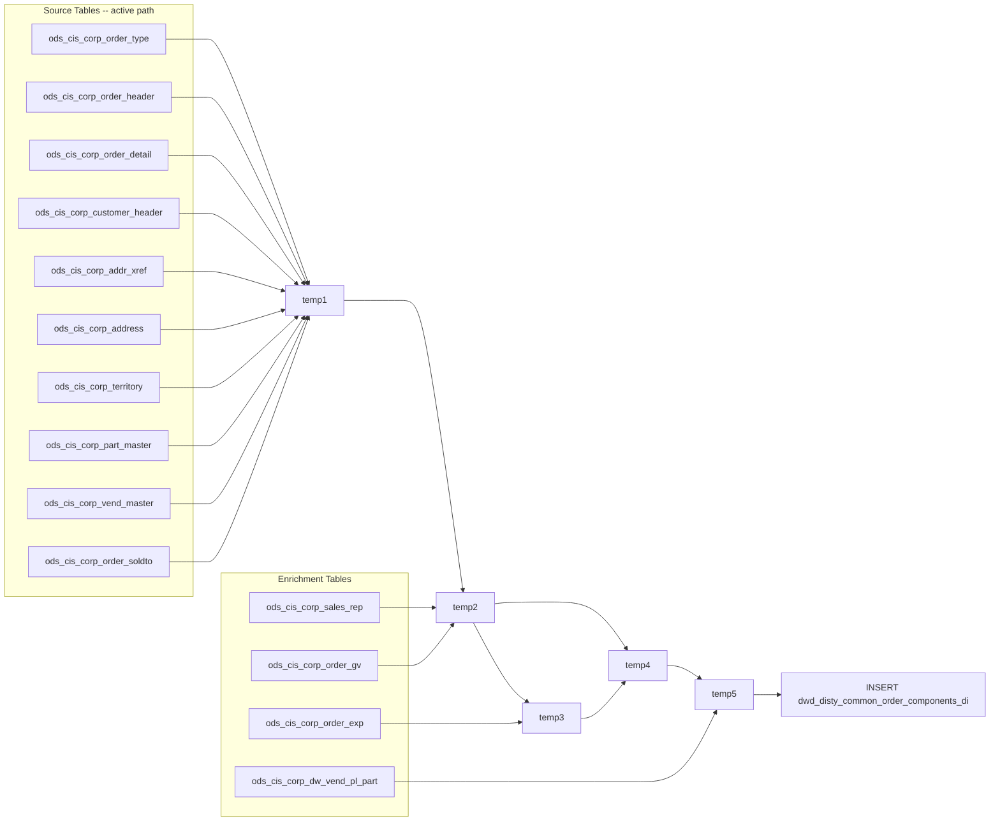

# DWD: Kit Component Order Lines Daily (`dwd_disty_common_order_components_di`)

- artifact_type: etl_table
- artifact_id: ${target_db}.dwd_disty_common_order_components_di
- domain: order
- one_line_purpose: This job builds a **daily snapshot of kit component order lines** — specifically orders flagged as `special_handle = '1'` that contain a `kit_line_no`, meaning the line is a component inside a kit shipment. For each such line, the job assem...
- layer_type: DWD
- source_kind: etl_sql
- evidence_source: source/etl/sql/order/data_service/order_components/python/dwd_disty_common_order_components_di.py

---

## L1 Data Foundation

### Identity and physical mapping
- **Table:** `${target_db}.dwd_disty_common_order_components_di`
- **Layer type:** DWD
- **Canonical / derived:** Derived / ETL-loaded (see L3)
- **Owner team:** not registered in metadata catalog

### Grain, scope, exclusions
- **Grain:** one row per `(order_type, order_no, order_line_no, date_flag)` — a single kit component line shipped on the given day.
- **Scope:** See L2 business purpose / L3 filters
- **Partition:** `date_flag` — the ship date of the order, cast as date. - resolved from pipeline (see L4)
- **Natural key:** `order_type`, `order_no`, `order_line_no` within a `date_flag` partition.
- **Exclusions:** Not documented in repository

#### Grain detail (preserved)

- **Grain:** one row per `(order_type, order_no, order_line_no, date_flag)` — a single kit component line shipped on the given day.
- **Partition:** `date_flag` — the ship date of the order, cast as date.
- **Natural key:** `order_type`, `order_no`, `order_line_no` within a `date_flag` partition.

---

### Cross-engine presence
| Engine | Present | Canonical FQN | Notes |
|--------|---------|---------------|-------|
| Hive | yes | `${target_db}.dwd_disty_common_order_components_di` | ETL target / intermediate per evidence script |
| Vertica | pending | `${target_db}.dwd_disty_common_order_components_di` | Confirm via hive2vertica flow evidence / MCP |

### Physical schema reference

Pointer block only - full column catalog lives in WKB L1 storage JSON.

| Field | Value |
|-------|-------|
| **Authoritative catalog** | WKB L1 storage seed (not duplicated in this file) |
| **entity_id** | `${target_db}.dwd_disty_common_order_components_di` |
| **l1_catalog_seed** | `target/storage/wkb/snapshots/_snapshot_id_template/l1_catalog/{engine}_{schema}_{table}.json` |
| **column_count** | pending (run ddl_seed_writer) |
| **partition_keys** | `date_flag` |
| **ddl_source** | pending Bitbucket DDL / Vertica metadata ingest |
| **retrieval** | `python -m tools.wkb.indexing.run_query --query "order dwd_disty_common_order_components_di schema" --intent find_table_schema` |

### Lineage
| Object | Role |
|--------|------|
| `${source_db}.ods_cis_corp_order_type` | Sales order type filter |
| `${source_db}.ods_cis_corp_order_header` / `ods_cis_corp_history_header` | Order header (active / history) |
| `${source_db}.ods_cis_corp_order_detail` / `ods_cis_corp_history_detail` | Order line detail (active / history) |
| `${source_db}.ods_cis_corp_customer_header` | Customer name, type, lead_id |
| `${source_db}.ods_cis_corp_addr_xref` | Customer address cross-reference |
| `${source_db}.ods_cis_corp_address` | Customer zip code |
| `${source_db}.ods_cis_corp_territory` | Territory, region, cust_type override |
| `${source_db}.ods_cis_corp_part_master` | Product code, part number, prod_type, vend_no |
| `${source_db}.ods_cis_corp_vend_master` | Vendor name |
| `${source_db}.ods_cis_corp_order_soldto` / `ods_cis_corp_history_soldto` | special_handle flag |
| `${source_db}.ods_cis_corp_sales_rep` | Sales rep number resolution |
| `${source_db}.ods_cis_corp_order_gv` | GV user type |
| `${source_db}.ods_cis_corp_order_exp` / `ods_cis_corp_history_exp` | DP expense aggregation |
| `${source_db}.ods_cis_corp_dw_vend_pl_part` | VPL/pm_code override by vendor+SKU |
| `${target_db}.dwd_disty_common_order_components_di` | **Target** — DWD kit component order lines |

---

### Freshness and load path
| Item | Value |
|------|-------|
| Load pattern | See L3 end-to-end / INSERT pattern in evidence script |
| Schedule | Not documented in repository |
| Parameters | `literal_date_flag`, `literal_target_db`, `literal_source_db`, `etl_timestamp`, `literal_etl_timestamp_zone` |


---

## L2 Declarative Knowledge

### Business purpose
This job builds a **daily snapshot of kit component order lines** — specifically orders flagged as `special_handle = '1'` that contain a `kit_line_no`, meaning the line is a component inside a kit shipment. For each such line, the job assembles a complete row combining order, customer, product, vendor, territory, sales rep, expense, and GV user type information from raw ODS sources. The output serves as a foundational DWD table for kit-order analysis, profitability attribution of bundled products, and vendor/PM program reporting.

---

### Audience and use cases
| Audience | How they benefit |
|----------|-----------------|
| **Product / vendor management** | Kit-level visibility into VPL, vendor, and PM code for bundled product reporting and vendor program allocations. |
| **Finance / FP&A** | Unit cost, unit price, base cost, and expense data for kit-component-level margin and COGS analysis. |
| **Sales & customer teams** | Customer, territory, sales rep, and GV user type per kit line for account and rep performance attribution. |
| **Operations / supply chain** | Ship date, from location, kit hierarchy (kit_line_no), and special handle flag for fulfillment tracking of bundled orders. |

---

### Fact key resolution
- Natural key: `order_type`, `order_no`, `order_line_no` within a `date_flag` partition.
- FK / label-on attributes: see L3 dimension join patterns and step-by-step logic.
- Negative assertion: do not treat descriptive labels as grain keys unless listed under natural key.

### Time field semantics
- **date_flag / partition columns:** `date_flag` — the ship date of the order, cast as date.
- Primary reporting filter should use the partition column(s) documented in L1; resolve values via L4.


### Metrics served

| Category | Column | Logical metric | Business reading |
|----------|--------|----------------|------------------|
| Measures | — | — | No measure columns mapped for this table. |

### Metric serving map

**Formula authority:** [`source/contracts/order/metric-index.md`](../../source/contracts/order/metric-index.md)

N/A — no measure columns mapped for this table.

### etl_metrics

No governed logical metrics from `source/contracts/order/metric-index.md` are mapped on this table.

---

### Metric serving map
N/A - not a `*_comb_mtd` / multi-period wide serving table (or map not present in legacy doc).


### Data products and column groups (preserved)

### Identifiers and relationships

- **Order:** `order_type`, `order_no`, `order_line_no`, `kit_line_no` (parent kit header line)
- **Customer:** `cust_no`, `cust_name`, `cust_loc_no`, `cust_type`, `cust_region`, `cust_terr`, `cust_zip`, `to_zip` (ship-to zip), `lead_id`
- **Product:** `sku_no`, `part_no`, `prod_code`, `super_prod_code`, `inv_type`, `vend_code`
- **Vendor:** `vend_no`, `vend_name`, `vend_type`
- **Channel / hierarchy:** `division`, `pm_code` (VPL), `special_handle`

### Dimension columns

- `division` — set to `1` for product codes 800–899 (override rule); otherwise 0 (not resolved from a dimension table).
- `pm_code` — overridden with `vpl_no` from `ods_cis_corp_dw_vend_pl_part` where a vendor-SKU match exists; otherwise 0.
- `gv_user_type` — from `ods_cis_corp_order_gv` when the order has a GV record; NULL otherwise.
- `sales_rep` — resolved from `ods_cis_corp_sales_rep` via order `entry_id`; falls back to 0.

> **Note:** `division` and `pm_code` are initialized to 0 in temp1; they only receive meaningful values through the override logic in temp5. `vend_type` is always 0 in this script (not populated from a source column).

### Quantity, pricing, and cost building blocks

- `ship_qty` — quantity shipped on this line
- `u_cost` — unit cost (`unit_cost` from order detail)
- `u_price` — unit selling price (`unit_price` from order detail)
- `u_sum_expense` — summed DP-type expenses per line from the expense table; 0 if no DP expense records
- `base_cost` — `claim_old_cost` from order detail; used as base cost for margin calculations
- `issue_date`, `entry_datetime`, `ship_date` — date/time stamps for the order

---

### etl_metrics

#### `sales_rep`
- **Source:** [metric-index.md](../../source/contracts/order/metric-index.md#sales_rep)
- **Business definition:** If the order's entry user maps to a sales rep record, use their rep number; otherwise keep 0.
```sql
CASE WHEN sr.user_id IS NOT NULL THEN sr.srep_no ELSE t1.sales_rep END
```

#### `gv_user_type`
- **Source:** [metric-index.md](../../source/contracts/order/metric-index.md#gv_user_type)
- **Business definition:** GV user type from the GV table only when the order has a GV record; NULL otherwise.
```sql
CASE WHEN og.order_type IS NOT NULL AND og.order_no IS NOT NULL THEN og.gv_user_type END
```

#### `u_sum_expense`
- **Source:** [metric-index.md](../../source/contracts/order/metric-index.md#u_sum_expense)
- **Business definition:** Total DP per-unit expense on this order line.
```sql
SUM(oe.unit_exp)` grouped by `order_type, order_no, order_line_no
```

#### `division`
- **Source:** [metric-index.md](../../source/contracts/order/metric-index.md#division)
- **Business definition:** Product codes in the 800–899 range map to division 1; all others keep their value (0 from temp1).
```sql
CASE WHEN prod_code BETWEEN 800 AND 899 THEN 1 ELSE temp4.division END
```

#### `pm_code`
- **Source:** [metric-index.md](../../source/contracts/order/metric-index.md#pm_code)
- **Business definition:** If a VPL-part record exists for this vendor+SKU, use the `vpl_no` as the PM/VPL code; otherwise keep 0.
```sql
CASE WHEN v.vend_no IS NOT NULL AND v.sku_no IS NOT NULL THEN v.vpl_no ELSE temp4.pm_code END
```

#### `date_flag`
- **Source:** [metric-index.md](../../source/contracts/order/metric-index.md#date_flag)
- **Business definition:** Converts the string date_flag from temp5 to a proper date type for partitioning.
```sql
CAST(date_flag AS DATE)
```


---

## L3 Procedural Knowledge

### Query and routing rules
**Business filters:** Use partition / date keys from L1 grain for reporting scope.
**Technical predicates (load only):** See Key filters and step-by-step logic below.

### Dimension join patterns
| Dimension FQN | Join keys | Purpose | Evidence |
|---------------|-----------|---------|----------|
| See step-by-step / base tables | See L3 steps | Dimension enrichment | `source/etl/sql/order/data_service/order_components/python/dwd_disty_common_order_components_di.py` |

### Key filters and ETL business logic
### Step 1 — `temp1` (two paths: active vs history)

**Source (active path, `diff_hour <= 48`):**
`ods_cis_corp_order_type` INNER JOIN `ods_cis_corp_order_header` INNER JOIN `ods_cis_corp_order_detail` INNER JOIN `ods_cis_corp_customer_header` INNER JOIN `ods_cis_corp_addr_xref` INNER JOIN `ods_cis_corp_address` INNER JOIN `ods_cis_corp_territory` INNER JOIN `ods_cis_corp_part_master` INNER JOIN `ods_cis_corp_vend_master` INNER JOIN `ods_cis_corp_order_soldto`

**Source (history path, `diff_hour > 48`):**
Same structure but `order_header/detail/soldto` replaced by their `history_*` equivalents.

**Filter (natural language):**
- `trim(t.sales) = 'Y'` — sales-type orders only (non-sales order types excluded).
- `h.ship_date BETWEEN '${date_flag}' AND DATE_ADD('${date_flag}', 1)` — orders shipped on the target date.
- `h.delete_date is null` and `d.delete_date is null` — not soft-deleted at header or line level.
- `d.kit_line_no is not null` — only kit component lines (lines that belong to a kit bundle).
- `trim(cx.active) = 'Y'` and `trim(cx.xref_type) = 'ADDR_CUST'` — valid, active customer address cross-reference.
- `trim(p.prod_type[as]) = 'S'` — saleable products only.
- `trim(s.special_handle) = '1'` — special-handle orders only (kit orders flagged for this processing).

**What happens to columns:**
- `date_flag` = literal `'${date_flag}'` (string).
- `cust_type` = `nvl(te.cust_type, c.cust_type)` — territory's cust_type takes priority over customer's own.
- `cust_terr` = ...

### Standard time-filter SQL
```sql
-- relative period filter using resolved partition value (see L4)
SELECT *
FROM ${target_db}.dwd_disty_common_order_components_di
WHERE /* partition predicate */ date_flag = '${partition_value}';
```

### End-to-end flow
**Runtime parameters:** `literal_date_flag`, `literal_target_db`, `literal_source_db`, `etl_timestamp`, `literal_etl_timestamp_zone`
**Target table:** `${target_db}.dwd_disty_common_order_components_di`, partitioned by **`date_flag`**.

1. Compute `diff_hour`: hours elapsed between `etl_timestamp_zone` and midnight of `date_flag`. If > 48, use history (settled) tables; if ≤ 48, use active order tables.
2. Build `temp1`: join order type, header, detail, customer, address, territory, part master, vendor, and sold-to. Filter to sales orders, kit component lines, `special_handle = '1'`, ships on `date_flag`. Initialize `division = 0`, `pm_code = 0`, `u_sum_expense = 0`, `sales_rep = 0`.
3. Build `temp2`: enrich temp1 with resolved `sales_rep` (via order entry user + sales rep table) and `gv_user_type` (via order GV table).
4. Build `temp3`: aggregate `u_sum_expense` from the expense table (DP type only, not deleted) per order line.
5. Build `temp4`: merge temp2 and temp3 — apply temp3's `u_sum_expense` where the expense record exists; otherwise keep zero.
6. Build `temp5`: override `pm_code` with VPL number from `ods_cis_corp_dw_vend_pl_part` where vendor+SKU match; set `division = 1` for prod_code 800–899.
7. **INSERT** all columns from temp5 into target, casting `date_flag` as date.



> **Note on history path:** When `diff_hour > 48`, `ods_cis_corp_order_header/detail/soldto/exp` are replaced by `ods_cis_corp_history_header/detail/soldto/exp` and similarly for `ods_cis_corp_order_gv` by `ods_cis_corp_order_gv` (same); `ods_cis_corp_order_type` remains the same in both paths.

---


#### High-level stages (preserved)

| Stage | Business meaning |
|-------|-----------------|
| **Timing branch** | Checks how many hours have elapsed since midnight of `date_flag`. If more than 48 hours, reads from archived **history tables** (order already settled); otherwise reads from **active order tables** (order may still be in flight). Same output structure from both paths. |
| **Base order line assembly (`temp1`)** | Joins order headers, line details, customer, address, territory, part master, vendor, and sold-to tables. Filters to sales-type orders, ships on `date_flag`, kit component lines, saleable products, and `special_handle = '1'`. |
| **Sales rep & GV enrichment (`temp2`)** | Resolves the actual sales rep number from the sales rep table using the order's entry user ID. Adds GV user type from the order GV table when a match exists. |
| **Expense aggregation (`temp3`)** | Sums all DP-type (direct-pass) unit expenses per order line from the expense table. |
| **Expense merge (`temp4`)** | Merges temp2 and temp3 — uses the summed `u_sum_expense` if available, otherwise keeps zero. |
| **VPL / division override (`temp5`)** | Overrides `pm_code` with the vendor-part-level VPL number if a matching record exists in the VPL part table. Sets `division = 1` for product codes in the 800–899 range. |
| **Final INSERT** | Writes all enriched columns to the target DWD table, casting `date_flag` as a date. |

**Parameters:** `literal_date_flag`, `literal_target_db`, `literal_source_db`, `etl_timestamp`, `literal_etl_timestamp_zone`

---


### Base tables register
| Object | Role in this job |
|--------|-----------------|
| `${source_db}.ods_cis_corp_order_type` | Filters to sales-type orders (`trim(sales) = 'Y'`). Same table in both paths. |
| `${source_db}.ods_cis_corp_order_header` / `ods_cis_corp_history_header` | Order header — provides `ship_date`, `from_loc_no`, `to_acct_no` (cust_no), `to_loc_no`, `sales_terr`, `issue_date`, `entry_id`, `delete_date`. |
| `${source_db}.ods_cis_corp_order_detail` / `ods_cis_corp_history_detail` | Order line detail — `order_line_no`, `kit_line_no`, `sku_no`, `inv_type`, `ship_qty`, `unit_cost`, `unit_price`, `entry_datetime`, `claim_old_cost`, `delete_date`. |
| `${source_db}.ods_cis_corp_customer_header` | Customer name, `cust_type`, `lead_id`. |
| `${source_db}.ods_cis_corp_addr_xref` | Customer address cross-reference — links `cust_no` + `loc_no` to an address; filtered to active ADDR_CUST type. |
| `${source_db}.ods_cis_corp_address` | Resolves `zip_code` (customer zip) from the address number. |
| `${source_db}.ods_cis_corp_territory` | Territory dimension — `cust_type` override, `region`, `sales_terr`. |
| `${source_db}.ods_cis_corp_part_master` | Product/part info — `part_no`, `prod_code`, `vend_no`, `prod_type(as)`. |
| `${source_db}.ods_cis_corp_vend_master` | Vendor name. |
| `${source_db}.ods_cis_corp_order_soldto` / `ods_cis_corp_history_soldto` | `special_handle` flag — only `'1'` rows are included. |
| `${source_db}.ods_cis_corp_sales_rep` | Resolves `srep_no` from order header's `entry_id` (user who entered the order). |
| `${source_db}.ods_cis_corp_order_gv` | GV user type for the order. |
| `${source_db}.ods_cis_corp_order_exp` / `ods_cis_corp_history_exp` | Expense lines — aggregated `unit_exp` where `order_exp_type = 'DP'` and not deleted. |
| `${source_db}.ods_cis_corp_dw_vend_pl_part` | VPL part table — provides `vpl_no` for `pm_code` override when `vend_no + sku_no` match. |

**Temporary tables (inside the job only):**
`temp1` → `temp2` → `temp3` → `temp4` → `temp5` → (final `INSERT`)

---

### Step-by-step logic
### Step 1 — `temp1` (two paths: active vs history)

**Source (active path, `diff_hour <= 48`):**
`ods_cis_corp_order_type` INNER JOIN `ods_cis_corp_order_header` INNER JOIN `ods_cis_corp_order_detail` INNER JOIN `ods_cis_corp_customer_header` INNER JOIN `ods_cis_corp_addr_xref` INNER JOIN `ods_cis_corp_address` INNER JOIN `ods_cis_corp_territory` INNER JOIN `ods_cis_corp_part_master` INNER JOIN `ods_cis_corp_vend_master` INNER JOIN `ods_cis_corp_order_soldto`

**Source (history path, `diff_hour > 48`):**
Same structure but `order_header/detail/soldto` replaced by their `history_*` equivalents.

**Filter (natural language):**
- `trim(t.sales) = 'Y'` — sales-type orders only (non-sales order types excluded).
- `h.ship_date BETWEEN '${date_flag}' AND DATE_ADD('${date_flag}', 1)` — orders shipped on the target date.
- `h.delete_date is null` and `d.delete_date is null` — not soft-deleted at header or line level.
- `d.kit_line_no is not null` — only kit component lines (lines that belong to a kit bundle).
- `trim(cx.active) = 'Y'` and `trim(cx.xref_type) = 'ADDR_CUST'` — valid, active customer address cross-reference.
- `trim(p.prod_type[as]) = 'S'` — saleable products only.
- `trim(s.special_handle) = '1'` — special-handle orders only (kit orders flagged for this processing).

**What happens to columns:**
- `date_flag` = literal `'${date_flag}'` (string).
- `cust_type` = `nvl(te.cust_type, c.cust_type)` — territory's cust_type takes priority over customer's own.
- `cust_terr` = `nvl(te.sales_terr, h.sales_terr)` — territory's sales_terr takes priority over header.
- `division`, `pm_code`, `vend_type`, `sales_rep` = `0` (placeholders; resolved in later steps).
- `u_sum_expense` = `0` (placeholder; resolved in temp3/temp4).
- `super_prod_code` = `round(p.prod_code, -2)` — rounds product code to the nearest 100 (product family grouping).
- `vend_code` = `substring(p.part_no, 1, 3)` — first 3 characters of the part number.
- `base_cost` = `d.claim_old_cost`.

---

### Step 2 — `temp2`

**Source:** `temp1` LEFT JOIN `ods_cis_corp_order_header` (or history equivalent) LEFT JOIN `ods_cis_corp_sales_rep` LEFT JOIN `ods_cis_corp_order_gv`

**Join keys:**
- Header: `order_type + order_no` — to get the `entry_id` of the user who entered the order.
- Sales rep: `oh.entry_id = sr.user_id` — resolves the rep's system number.
- Order GV: `order_type + order_no`.

**Derived columns:**

| Column | Logic | Plain language |
|--------|-------|----------------|
| `sales_rep` | `CASE WHEN sr.user_id IS NOT NULL THEN sr.srep_no ELSE t1.sales_rep END` | If the order's entry user maps to a sales rep record, use their rep number; otherwise keep 0. |
| `gv_user_type` | `CASE WHEN og.order_type IS NOT NULL AND og.order_no IS NOT NULL THEN og.gv_user_type END` | GV user type from the GV table only when the order has a GV record; NULL otherwise. |

---

### Step 3 — `temp3`

**Source:** `temp2` INNER JOIN `ods_cis_corp_order_header` INNER JOIN `ods_cis_corp_order_type` INNER JOIN `ods_cis_corp_order_detail` INNER JOIN `ods_cis_corp_order_exp` (or history equivalents)

**Filter (natural language):**
- `trim(ot.sales) = 'Y'` — re-validates sales order type.
- `od.delete_date is null` and `oe.delete_date is null` — not deleted at detail or expense level.
- `trim(oe.order_exp_type) = 'DP'` — only DP (direct-pass) expense type lines.

**Derived columns:**

| Column | Formula | Plain language |
|--------|---------|----------------|
| `u_sum_expense` | `SUM(oe.unit_exp)` grouped by `order_type, order_no, order_line_no` | Total DP per-unit expense on this order line. |

---

### Step 4 — `temp4`

**Source:** `temp2` LEFT JOIN `temp3` on `order_type + order_no + order_line_no`

**Derived columns:**

| Column | Logic | Plain language |
|--------|-------|----------------|
| `u_sum_expense` | `CASE WHEN temp3 keys match THEN temp3.u_sum_expense ELSE temp2.u_sum_expense (0)` | Uses actual summed DP expense if available; keeps 0 if the order line had no DP expense records. |

All other columns pass through from temp2 unchanged.

---

### Step 5 — `temp5`

**Source:** `temp4` LEFT JOIN `${source_db}.ods_cis_corp_dw_vend_pl_part` on `vend_no + sku_no`

**Derived columns:**

| Column | Logic | Plain language |
|--------|-------|----------------|
| `division` | `CASE WHEN prod_code BETWEEN 800 AND 899 THEN 1 ELSE temp4.division END` | Product codes in the 800–899 range map to division 1; all others keep their value (0 from temp1). |
| `pm_code` | `CASE WHEN v.vend_no IS NOT NULL AND v.sku_no IS NOT NULL THEN v.vpl_no ELSE temp4.pm_code END` | If a VPL-part record exists for this vendor+SKU, use the `vpl_no` as the PM/VPL code; otherwise keep 0. |

All other columns pass through from temp4 unchanged.

---

### Step 6 — Final `INSERT` into `dwd_disty_common_order_components_di`

**From:** `temp5`

**Derived columns computed at INSERT:**

| Column | Formula | Plain language |
|--------|---------|----------------|
| `date_flag` | `CAST(date_flag AS DATE)` | Converts the string date_flag from temp5 to a proper date type for partitioning. |

**Pass-through columns:** `order_type`, `order_no`, `order_line_no`, `kit_line_no`, `special_handle`, `ship_date`, `from_loc_no`, `to_zip`, `cust_no`, `cust_name`, `cust_loc_no`, `cust_type`, `cust_region`, `cust_terr`, `cust_zip`, `vend_no`, `vend_name`, `vend_type`, `sku_no`, `part_no`, `inv_type`, `division`, `pm_code`, `super_prod_code`, `prod_code`, `vend_code`, `ship_qty`, `u_cost`, `u_price`, `u_sum_expense`, `issue_date`, `entry_datetime`, `sales_rep`, `lead_id`, `base_cost`, `gv_user_type`

---

### Relationship map (embedded)

| from_fqn | to_fqn | cardinality | join_keys | provenance |
|----------|--------|-------------|-----------|------------|
| `${source_db}.ods_cis_corp_order_type` | `${source_db}.ods_cis_corp_history_header` | many:1 | `t.order_type` = `h.order_type` | etl_sql (`source/etl/sql/order/data_service/order_components/python/dwd_disty_common_order_components_di.py:42`) |
| `${source_db}.ods_cis_corp_order_header` | `${source_db}.ods_cis_corp_history_detail` | many:1 | `h.order_type` = `d.order_type`; `h.order_no` = `d.order_no` | etl_sql (`source/etl/sql/order/data_service/order_components/python/dwd_disty_common_order_components_di.py:44`) |
| `${source_db}.ods_cis_corp_order_header` | `${source_db}.ods_cis_corp_customer_header` | many:1 | `h.to_acct_no` = `c.cust_no` | etl_sql (`source/etl/sql/order/data_service/order_components/python/dwd_disty_common_order_components_di.py:46`) |
| `${source_db}.ods_cis_corp_order_header` | `${source_db}.ods_cis_corp_addr_xref` | many:1 | `h.to_acct_no` = `cx.xref_no`; `h.to_loc_no` = `cx.xref_seq` | etl_sql (`source/etl/sql/order/data_service/order_components/python/dwd_disty_common_order_components_di.py:48`) |
| `${source_db}.ods_cis_corp_addr_xref` | `${source_db}.ods_cis_corp_address` | many:1 | `cx.addr_no` = `l.addr_no` | etl_sql (`source/etl/sql/order/data_service/order_components/python/dwd_disty_common_order_components_di.py:50`) |
| `${source_db}.ods_cis_corp_order_header` | `${source_db}.ods_cis_corp_territory` | many:1 | `h.sales_terr` = `te.sales_terr` | etl_sql (`source/etl/sql/order/data_service/order_components/python/dwd_disty_common_order_components_di.py:52`) |
| `${source_db}.ods_cis_corp_order_detail` | `${source_db}.ods_cis_corp_part_master` | many:1 | `d.sku_no` = `p.sku_no` | etl_sql (`source/etl/sql/order/data_service/order_components/python/dwd_disty_common_order_components_di.py:54`) |
| `${source_db}.ods_cis_corp_part_master` | `${source_db}.ods_cis_corp_vend_master` | many:1 | `p.vend_no` = `v.vend_no` | etl_sql (`source/etl/sql/order/data_service/order_components/python/dwd_disty_common_order_components_di.py:56`) |
| `${source_db}.ods_cis_corp_order_detail` | `${source_db}.ods_cis_corp_history_soldto` | many:1 | `d.order_type` = `s.order_type`; `d.order_no` = `s.order_no` | etl_sql (`source/etl/sql/order/data_service/order_components/python/dwd_disty_common_order_components_di.py:58`) |
| `${source_db}.ods_cis_corp_order_type` | `${source_db}.ods_cis_corp_history_header` | many:1 (LEFT) | `oh.order_type` = `t1.order_type`; `oh.order_no` = `t1.order_no` | etl_sql (`source/etl/sql/order/data_service/order_components/python/dwd_disty_common_order_components_di.py:110`) |
| `${source_db}.ods_cis_corp_order_header` | `${source_db}.ods_cis_corp_sales_rep` | many:1 (LEFT) | `oh.entry_id` = `sr.user_id` | etl_sql (`source/etl/sql/order/data_service/order_components/python/dwd_disty_common_order_components_di.py:112`) |
| `t1` | `${source_db}.ods_cis_corp_order_gv` | many:1 (LEFT) | `t1.order_type` = `og.order_type`; `t1.order_no` = `og.order_no` | etl_sql (`source/etl/sql/order/data_service/order_components/python/dwd_disty_common_order_components_di.py:114`) |
| `${source_db}.ods_cis_corp_order_header` | `${source_db}.ods_cis_corp_order_type` | many:1 | `oh.order_type` = `ot.order_type` | etl_sql (`source/etl/sql/order/data_service/order_components/python/dwd_disty_common_order_components_di.py:123`) |
| `${source_db}.ods_cis_corp_order_header` | `${source_db}.ods_cis_corp_history_detail` | many:1 | `oh.order_type` = `od.order_type`; `oh.order_no` = `od.order_no`; `od.order_line_no` = `t1.order_line_no` | etl_sql (`source/etl/sql/order/data_service/order_components/python/dwd_disty_common_order_components_di.py:125`) |
| `${source_db}.ods_cis_corp_order_header` | `${source_db}.ods_cis_corp_history_exp` | many:1 | `oh.order_type` = `oe.order_type`; `oh.order_no` = `oe.order_no`; `od.order_line_no` = `oe.order_line_no` | etl_sql (`source/etl/sql/order/data_service/order_components/python/dwd_disty_common_order_components_di.py:129`) |
| `${source_db}.ods_cis_corp_order_type` | `${source_db}.ods_cis_corp_order_header` | many:1 | `t.order_type` = `h.order_type` | etl_sql (`source/etl/sql/order/data_service/order_components/python/dwd_disty_common_order_components_di.py:177`) |
| `${source_db}.ods_cis_corp_order_header` | `${source_db}.ods_cis_corp_order_detail` | many:1 | `h.order_type` = `d.order_type`; `h.order_no` = `d.order_no` | etl_sql (`source/etl/sql/order/data_service/order_components/python/dwd_disty_common_order_components_di.py:179`) |
| `${source_db}.ods_cis_corp_order_detail` | `${source_db}.ods_cis_corp_order_soldto` | many:1 | `d.order_type` = `s.order_type`; `d.order_no` = `s.order_no` | etl_sql (`source/etl/sql/order/data_service/order_components/python/dwd_disty_common_order_components_di.py:193`) |
| `t1` | `${source_db}.ods_cis_corp_order_header` | many:1 (LEFT) | `oh.order_type` = `t1.order_type`; `oh.order_no` = `t1.order_no` | etl_sql (`source/etl/sql/order/data_service/order_components/python/dwd_disty_common_order_components_di.py:247`) |
| `${source_db}.ods_cis_corp_order_header` | `${source_db}.ods_cis_corp_order_detail` | many:1 | `oh.order_type` = `od.order_type`; `oh.order_no` = `od.order_no`; `od.order_line_no` = `t1.order_line_no` | etl_sql (`source/etl/sql/order/data_service/order_components/python/dwd_disty_common_order_components_di.py:264`) |
| `${source_db}.ods_cis_corp_order_header` | `${source_db}.ods_cis_corp_order_exp` | many:1 | `oh.order_type` = `oe.order_type`; `oh.order_no` = `oe.order_no`; `od.order_line_no` = `oe.order_line_no` | etl_sql (`source/etl/sql/order/data_service/order_components/python/dwd_disty_common_order_components_di.py:266`) |
| `t1` | `temp3` | many:1 (LEFT) | `t1.order_type` = `t2.order_type`; `t1.order_no` = `t2.order_no`; `t1.order_line_no` = `t2.order_line_no` | etl_sql (`source/etl/sql/order/data_service/order_components/python/dwd_disty_common_order_components_di.py:320`) |
| `o` | `${source_db}.ods_cis_corp_dw_vend_pl_part` | many:1 (LEFT) | `o.vend_no` = `v.vend_no`; `o.sku_no` = `v.sku_no` | etl_sql (`source/etl/sql/order/data_service/order_components/python/dwd_disty_common_order_components_di.py:364`) |

### Special logic (embedded)

Not documented in repository

### Column / field derivations (from ETL SQL)

| target_column | expression_sql | upstream_columns | upstream_tables | transform_kind | evidence |
|---------------|----------------|------------------|-----------------|----------------|----------|
| `order_type` | `order_type` | `order_type` | `temp5` | passthrough | `source/etl/sql/order/data_service/order_components/python/dwd_disty_common_order_components_di.py:34` |
| `order_no` | `order_no` | `order_no` | `temp5` | passthrough | `source/etl/sql/order/data_service/order_components/python/dwd_disty_common_order_components_di.py:35` |
| `order_line_no` | `order_line_no` | `order_line_no` | `temp5` | passthrough | `source/etl/sql/order/data_service/order_components/python/dwd_disty_common_order_components_di.py:36` |
| `kit_line_no` | `kit_line_no` | `kit_line_no` | `temp5` | passthrough | `source/etl/sql/order/data_service/order_components/python/dwd_disty_common_order_components_di.py:37` |
| `special_handle` | `special_handle` | `special_handle` | `temp5` | passthrough | `source/etl/sql/order/data_service/order_components/python/dwd_disty_common_order_components_di.py:38` |
| `ship_date` | `ship_date` | `ship_date` | `temp5` | passthrough | `source/etl/sql/order/data_service/order_components/python/dwd_disty_common_order_components_di.py:39` |
| `from_loc_no` | `from_loc_no` | `from_loc_no` | `temp5` | passthrough | `source/etl/sql/order/data_service/order_components/python/dwd_disty_common_order_components_di.py:40` |
| `to_zip` | `to_zip` | `to_zip` | `temp5` | passthrough | `source/etl/sql/order/data_service/order_components/python/dwd_disty_common_order_components_di.py:41` |
| `cust_no` | `cust_no` | `cust_no` | `temp5` | passthrough | `source/etl/sql/order/data_service/order_components/python/dwd_disty_common_order_components_di.py:42` |
| `cust_name` | `cust_name` | `cust_name` | `temp5` | passthrough | `source/etl/sql/order/data_service/order_components/python/dwd_disty_common_order_components_di.py:43` |
| `cust_loc_no` | `cust_loc_no` | `cust_loc_no` | `temp5` | passthrough | `source/etl/sql/order/data_service/order_components/python/dwd_disty_common_order_components_di.py:44` |
| `cust_type` | `cust_type` | `cust_type` | `temp5` | passthrough | `source/etl/sql/order/data_service/order_components/python/dwd_disty_common_order_components_di.py:45` |
| `cust_region` | `cust_region` | `cust_region` | `temp5` | passthrough | `source/etl/sql/order/data_service/order_components/python/dwd_disty_common_order_components_di.py:46` |
| `cust_terr` | `cust_terr` | `cust_terr` | `temp5` | passthrough | `source/etl/sql/order/data_service/order_components/python/dwd_disty_common_order_components_di.py:47` |
| `cust_zip` | `cust_zip` | `cust_zip` | `temp5` | passthrough | `source/etl/sql/order/data_service/order_components/python/dwd_disty_common_order_components_di.py:48` |
| `vend_no` | `vend_no` | `vend_no` | `temp5` | passthrough | `source/etl/sql/order/data_service/order_components/python/dwd_disty_common_order_components_di.py:49` |
| `vend_name` | `vend_name` | `vend_name` | `temp5` | passthrough | `source/etl/sql/order/data_service/order_components/python/dwd_disty_common_order_components_di.py:50` |
| `vend_type` | `vend_type` | `vend_type` | `temp5` | passthrough | `source/etl/sql/order/data_service/order_components/python/dwd_disty_common_order_components_di.py:51` |
| `sku_no` | `sku_no` | `sku_no` | `temp5` | passthrough | `source/etl/sql/order/data_service/order_components/python/dwd_disty_common_order_components_di.py:52` |
| `part_no` | `part_no` | `part_no` | `temp5` | passthrough | `source/etl/sql/order/data_service/order_components/python/dwd_disty_common_order_components_di.py:53` |
| `inv_type` | `inv_type` | `inv_type` | `temp5` | passthrough | `source/etl/sql/order/data_service/order_components/python/dwd_disty_common_order_components_di.py:54` |
| `division` | `division` | `division` | `temp5` | passthrough | `source/etl/sql/order/data_service/order_components/python/dwd_disty_common_order_components_di.py:55` |
| `pm_code` | `pm_code` | `pm_code` | `temp5` | passthrough | `source/etl/sql/order/data_service/order_components/python/dwd_disty_common_order_components_di.py:56` |
| `super_prod_code` | `super_prod_code` | `super_prod_code` | `temp5` | passthrough | `source/etl/sql/order/data_service/order_components/python/dwd_disty_common_order_components_di.py:57` |
| `prod_code` | `prod_code` | `prod_code` | `temp5` | passthrough | `source/etl/sql/order/data_service/order_components/python/dwd_disty_common_order_components_di.py:57` |
| `vend_code` | `vend_code` | `vend_code` | `temp5` | passthrough | `source/etl/sql/order/data_service/order_components/python/dwd_disty_common_order_components_di.py:59` |
| `ship_qty` | `ship_qty` | `ship_qty` | `temp5` | passthrough | `source/etl/sql/order/data_service/order_components/python/dwd_disty_common_order_components_di.py:60` |
| `u_cost` | `u_cost` | `u_cost` | `temp5` | passthrough | `source/etl/sql/order/data_service/order_components/python/dwd_disty_common_order_components_di.py:61` |
| `u_price` | `u_price` | `u_price` | `temp5` | passthrough | `source/etl/sql/order/data_service/order_components/python/dwd_disty_common_order_components_di.py:62` |
| `u_sum_expense` | `u_sum_expense` | `u_sum_expense` | `temp5` | passthrough | `source/etl/sql/order/data_service/order_components/python/dwd_disty_common_order_components_di.py:63` |
| `issue_date` | `issue_date` | `issue_date` | `temp5` | passthrough | `source/etl/sql/order/data_service/order_components/python/dwd_disty_common_order_components_di.py:64` |
| `entry_datetime` | `entry_datetime` | `entry_datetime` | `temp5` | passthrough | `source/etl/sql/order/data_service/order_components/python/dwd_disty_common_order_components_di.py:65` |
| `sales_rep` | `sales_rep` | `sales_rep` | `temp5` | passthrough | `source/etl/sql/order/data_service/order_components/python/dwd_disty_common_order_components_di.py:66` |
| `lead_id` | `lead_id` | `lead_id` | `temp5` | passthrough | `source/etl/sql/order/data_service/order_components/python/dwd_disty_common_order_components_di.py:67` |
| `base_cost` | `base_cost` | `base_cost` | `temp5` | passthrough | `source/etl/sql/order/data_service/order_components/python/dwd_disty_common_order_components_di.py:68` |
| `gv_user_type` | `gv_user_type` | `gv_user_type` | `temp5` | passthrough | `source/etl/sql/order/data_service/order_components/python/dwd_disty_common_order_components_di.py:136` |
| `date_flag` | `cast(date_flag as date)` | `date_flag` | `temp5` | cast | `source/etl/sql/order/data_service/order_components/python/dwd_disty_common_order_components_di.py:444` |

### Sentinel and code values
| Value | Meaning |
|-------|---------|
| `diff_hour > 48` | Triggers read from history (settled) tables; otherwise active order tables are used. |
| `special_handle = '1'` | The defining filter — only these orders are kit component orders processed by this job. |
| `kit_line_no IS NOT NULL` | Only kit component lines (not standalone order lines) are included. |
| `order_exp_type = 'DP'` | Only direct-pass expense type is summed into `u_sum_expense`. |
| `prod_code BETWEEN 800 AND 899` | Hard-coded division override rule — these product codes always map to division 1. |
| `trim(sales) = 'Y'` | Sales order type filter applied at temp1 and re-validated at temp3. |
| `vend_type = 0` | Always zero — not populated from any source in this script. |
| `division = 0`, `pm_code = 0` | Initialized to 0 in temp1; override applied in temp5 only where lookup matches exist. |

---

---

## L4 Validation

### Resolved partition value
| Step | Source | How partition / date scope is determined |
|------|--------|------------------------------------------|
| 1 | evidence script / flow | See parameters in L1 Freshness and L3 filters - `source/etl/sql/order/data_service/order_components/python/dwd_disty_common_order_components_di.py` |

**Plain language:** Partition and date scope follow Azkaban/bootstrap parameters documented in the source script and orchestrating flow; do not hardcode calendar literals.

### Data quality checks
- Prefer row-count-by-partition, metric sums, and grain duplicate checks (see Validation SQL).
- Additional checks from legacy caveats / operational notes when present.

### Validation SQL
```sql
-- 1) row count by partition
-- SELECT partition_col, COUNT(*) FROM ${target_db}.dwd_disty_common_order_components_di WHERE partition_col = '${partition_value}' GROUP BY 1;
-- 2) metric sum by dimension (top N) - replace metric/dim from L2
-- 3) grain duplicate check on natural keys
```


### Caveats for interpretation
- **`division` and `pm_code` are mostly 0.** The 800–899 prod_code rule covers a limited product range. For other rows, `pm_code = 0` unless the VPL part lookup has an exact vendor+SKU match. Do not use these as primary dimension keys without checking for zero values.
- **Two source paths (active vs history):** The job selects source tables based on elapsed time. Results should be identical in content, but downstream reprocessing runs may read from different table sets depending on when they are triggered.
- **`vend_type` is always 0** — not sourced from any table; consumers should not rely on it.
- **`u_sum_expense` is 0 for lines without DP expense records** — the inner join in temp3 means only lines with matching expense entries have a non-zero value. This is expected behavior, not a data quality issue.
- **`gv_user_type` can be NULL** — only populated when the order has a record in `ods_cis_corp_order_gv`.
- **`sales_rep` defaults to 0** — the resolution depends on a match between the order's entry user ID and the sales rep table. If no match, 0 is written.
- **`special_handle = '1'` and `kit_line_no IS NOT NULL`** are both required — this table exclusively covers kit component lines in special-handle orders, not all order lines.

---

### Conflicts and open questions
- Schedule, owner, SLA: Not documented in repository (unless preserved schedule evidence above).
- Vertica MCP verification: pending unless confirmed in L5.


---

## L5 Runtime View

### Query path and engine preference
| Role | Hive object | Vertica object | Sync mode | Evidence | MCP verified |
|------|-------------|----------------|-----------|----------|--------------|
| **Not in Vertica** | *See script lineage* | *No Vertica mapping identified in repository* | - | *Add flow evidence when found* | no |

No queryable Vertica table has been confirmed for this script from current repository evidence.

### Access constraints
- Country / company schema parameters may apply (`literal_country`, `company_no`, etc.).
- Hive-only staging objects are not reporting surfaces unless synced.

### Query risk profile
| Field | Value |
|-------|-------|
| requires_date_predicate | yes |
| scan_risk_tier | high |

---

## L6 Access and Consumption

### Primary consumers and use cases
| Audience | How they benefit |
|----------|-----------------|
| **Product / vendor management** | Kit-level visibility into VPL, vendor, and PM code for bundled product reporting and vendor program allocations. |
| **Finance / FP&A** | Unit cost, unit price, base cost, and expense data for kit-component-level margin and COGS analysis. |
| **Sales & customer teams** | Customer, territory, sales rep, and GV user type per kit line for account and rep performance attribution. |
| **Operations / supply chain** | Ship date, from location, kit hierarchy (kit_line_no), and special handle flag for fulfillment tracking of bundled orders. |

---

### Representative query patterns
```sql
-- certified / illustrative lookup - replace predicates from L1/L4
SELECT *
FROM ${target_db}.dwd_disty_common_order_components_di
WHERE date_flag = '${partition_value}'
LIMIT 100;
```

### Dependencies and notes
### Upstream objects (verified)

| Object | Usage | Evidence |
|--------|-------|----------|
| `${source_db}.ods_cis_corp_order_type` | Sales filter `trim(sales)='Y'` | `dwd_disty_common_order_components_di.py:69,208` |
| `${source_db}.ods_cis_corp_order_header` | Header data, entry_id for sales rep | `dwd_disty_common_order_components_di.py:209,279` |
| `${source_db}.ods_cis_corp_order_detail` | Line detail, kit_line_no, ship_qty, costs | `dwd_disty_common_order_components_di.py:211,297` |
| `${source_db}.ods_cis_corp_customer_header` | Customer name, type, lead_id | `dwd_disty_common_order_components_di.py:213` |
| `${source_db}.ods_cis_corp_addr_xref` | Customer address xref | `dwd_disty_common_order_components_di.py:215` |
| `${source_db}.ods_cis_corp_address` | Customer zip | `dwd_disty_common_order_components_di.py:217` |
| `${source_db}.ods_cis_corp_territory` | Territory, region, cust_type override | `dwd_disty_common_order_components_di.py:219` |
| `${source_db}.ods_cis_corp_part_master` | Product/part info, prod_type | `dwd_disty_common_order_components_di.py:221` |
| `${source_db}.ods_cis_corp_vend_master` | Vendor name | `dwd_disty_common_order_components_di.py:223` |
| `${source_db}.ods_cis_corp_order_soldto` / `ods_cis_corp_history_soldto` | special_handle filter | `dwd_disty_common_order_components_di.py:225,87` |
| `${source_db}.ods_cis_corp_sales_rep` | Sales rep resolution | `dwd_disty_common_order_components_di.py:281` |
| `${source_db}.ods_cis_corp_order_gv` | GV user type | `dwd_disty_common_order_components_di.py:283` |
| `${source_db}.ods_cis_corp_order_exp` / `ods_cis_corp_history_exp` | DP expense aggregation | `dwd_disty_common_order_components_di.py:299,157` |
| `${source_db}.ods_cis_corp_dw_vend_pl_part` | VPL/pm_code override | `dwd_disty_common_order_components_di.py:399` |

### Downstream consumers (verified)

| Object / script | Evidence |
|-----------------|----------|
| None identified in repository. | — |

### Operational detail (verified)

- Target table is overwritten per partition: `INSERT OVERWRITE TABLE ${target_db}.dwd_disty_common_order_components_di PARTITION (date_flag)` — `dwd_disty_common_order_components_di.py:406`
- Job branch decision: `if diff_hour > 48` — `dwd_disty_common_order_components_di.py:30`

### Not documented in repository

- Schedule, owner, SLA — not in scripts or configs
- Azkaban / Livy job name and flow file — not present in `source/etl/sql/order/data_service/order_components/`

---

*Document generated from `source/etl/sql/order/data_service/order_components/python/dwd_disty_common_order_components_di.py`.*

#### Not documented in repository
- Owner, SLA (unless schedule evidence preserved above)
- Any dependency without `file:line` evidence in this document

---

*Document migrated to L1-L6 from legacy Knowledgebase content. Evidence: `source/etl/sql/order/data_service/order_components/python/dwd_disty_common_order_components_di.py`.*
