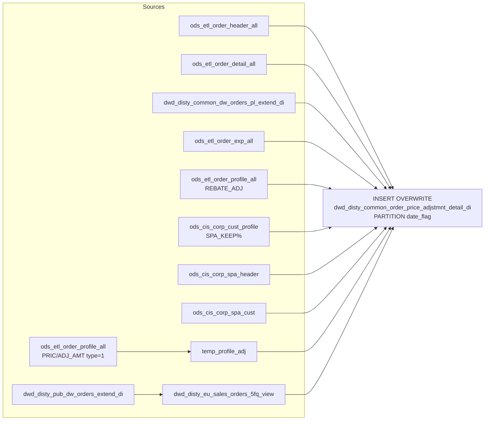

# DWD: Order Price Adjustment Detail — Daily (`dwd_disty_common_order_price_adjstmnt_detail_di`)

- artifact_type: etl_table
- artifact_id: dw_us.dwd_disty_common_order_price_adjstmnt_detail_di
- domain: order
- one_line_purpose: This job produces a **line-level order price adjustment detail table** that captures the grid (contract) price, SPA-weighted automatic rebate adjustments, raw rebate expense totals, and manual price adjustment metadata for each order line. ...
- layer_type: DWD
- source_kind: etl_sql
- evidence_source: source/etl/sql/order/source/etl/flows/public_order_tools/ingest/public_order_dw/script/dwd_disty_common_order_price_adjstmnt_detail_di.sql

---

## L1 Data Foundation

### Identity and physical mapping
- **Table:** `dw_us.dwd_disty_common_order_price_adjstmnt_detail_di`
- **Layer type:** DWD
- **Canonical / derived:** Derived / ETL-loaded (see L3)
- **Owner team:** not registered in metadata catalog

### Grain, scope, exclusions
- **Grain:** one row per `(order_no, order_line_no, order_type, tpa.profile_c, tpa.profile_f, dw.price_source, date_flag)` — a unique combination of order line and its price adjustment profile entry within a date partition.
- **Scope:** See L2 business purpose / L3 filters
- **Partition:** `date_flag` — from `dwd_disty_common_dw_orders_pl_extend_di`. - resolved from pipeline (see L4)
- **Natural key:** Not documented in repository
- **Exclusions:** Not documented in repository

#### Grain detail (preserved)

- **Grain:** one row per `(order_no, order_line_no, order_type, tpa.profile_c, tpa.profile_f, dw.price_source, date_flag)` — a unique combination of order line and its price adjustment profile entry within a date partition.
- **Partition:** `date_flag` — from `dwd_disty_common_dw_orders_pl_extend_di`.
- **Note:** Because `profile_c` and `profile_f` from `temp_profile_adj` are in the GROUP BY, a single order line can produce multiple rows if it has multiple ADJ_AMT profile entries.

---

### Cross-engine presence
| Engine | Present | Canonical FQN | Notes |
|--------|---------|---------------|-------|
| Hive | yes | `dwd_disty_common_order_price_adjstmnt_detail_di` | ETL target / intermediate per evidence script |
| Vertica | pending | `dwd_disty_common_order_price_adjstmnt_detail_di` | Confirm via hive2vertica flow evidence / MCP |

### Physical schema reference

Pointer block only - full column catalog lives in WKB L1 storage JSON.

| Field | Value |
|-------|-------|
| **Authoritative catalog** | WKB L1 storage seed (not duplicated in this file) |
| **entity_id** | `dw_us.dwd_disty_common_order_price_adjstmnt_detail_di` |
| **l1_catalog_seed** | `target/storage/wkb/snapshots/_snapshot_id_template/l1_catalog/{engine}_{schema}_{table}.json` |
| **column_count** | pending (run ddl_seed_writer) |
| **partition_keys** | `date_flag, dwd_disty_common_dw_orders_pl_extend_di` |
| **ddl_source** | pending Bitbucket DDL / Vertica metadata ingest |
| **retrieval** | `python -m tools.wkb.indexing.run_query --query "order dwd_disty_common_order_price_adjstmnt_detail_di schema" --intent find_table_schema` |

### Lineage
| Object | Role |
|--------|------|
| `dw_${country_code}.dwd_disty_pub_dw_orders_extend_di` | Source for `price_source` per order line |
| `ods_${country_code}.ods_etl_order_profile_all` | Manual price adjustments (ADJ_AMT) and REBATE_ADJ profiles |
| `ods_${country_code}.ods_etl_order_header_all` | Order header — `to_acct_no` for SPA customer lookup |
| `ods_${country_code}.ods_etl_order_detail_all` | Order line detail — `claim_new_cost` for `grid_price` |
| `dw_${country_code}.dwd_disty_common_dw_orders_pl_extend_di` | Anchors `date_flag`; limits to PL-eligible lines |
| `ods_${country_code}.ods_etl_order_exp_all` | Expense lines — raw rebate (`unit_exp`) |
| `ods_${country_code}.ods_cis_corp_cust_profile` | Customer SPA keep % |
| `ods_${country_code}.ods_cis_corp_spa_header` | SPA header — links REBATE_ADJ profile to SPA |
| `ods_${country_code}.ods_cis_corp_spa_cust` | SPA customer-level keep % rules |
| `dw_${country_code}.dwd_disty_common_order_price_adjstmnt_detail_di` | **Target** — line-level price adjustment detail |

---

### Freshness and load path
| Item | Value |
|------|-------|
| Load pattern | See L3 end-to-end / INSERT pattern in evidence script |
| Schedule | Not documented in repository |
| Parameters | `country_code`, `start_date`, `end_date` |


---

## L2 Declarative Knowledge

### Business purpose
This job produces a **line-level order price adjustment detail table** that captures the grid (contract) price, SPA-weighted automatic rebate adjustments, raw rebate expense totals, and manual price adjustment metadata for each order line. It is designed to support pricing transparency and audit workflows — showing exactly how much of each line's price reduction comes from SPA agreements, REBATE_ADJ profiles, or manual ADJ_AMT price adjustment entries, and how those amounts are modified by customer-level SPA keep percentages.

---

### Audience and use cases
| Audience | How they benefit |
|----------|-----------------|
| **Pricing teams** | `automatic_adjustment` shows the SPA-weighted adjustment per line — how much of the discount is SPA-driven vs manual. |
| **Finance / FP&A** | `grid_price`, `rebate`, `adj_amt` for line-level price audit and reconciliation against BRPT or OPLGM. |
| **Vendor management** | `rebate` and `automatic_adjustment` tied to SPA no — vendor program effectiveness per order line. |
| **Compliance / audit** | `adj_amt_desc`, `adj_amt` — human-readable and numeric values of manually entered ADJ_AMT price adjustments. |

---

### Fact key resolution
- Natural key: Not documented in repository
- FK / label-on attributes: see L3 dimension join patterns and step-by-step logic.
- Negative assertion: do not treat descriptive labels as grain keys unless listed under natural key.

### Time field semantics
- **date_flag / partition columns:** `date_flag` — from `dwd_disty_common_dw_orders_pl_extend_di`.
- Primary reporting filter should use the partition column(s) documented in L1; resolve values via L4.


### Metrics served

| Category | Column | Logical metric | Business reading |
|----------|--------|----------------|------------------|
| Measures | — | — | No measure columns mapped for this table. |

### Metric serving map

**Formula authority:** [`source/contracts/order/metric-index.md`](../../source/contracts/order/metric-index.md)

N/A — no measure columns mapped for this table.

### etl_metrics

No governed logical metrics from `source/contracts/order/metric-index.md` are mapped on this table.

---

### Metric serving map
N/A - not a `*_comb_mtd` / multi-period wide serving table (or map not present in legacy doc).


### Data products and column groups (preserved)

### Identifiers

- `order_no`, `order_line_no`, `order_type` — order line keys

### Pricing metrics

| Column | Meaning |
|--------|---------|
| `grid_price` | `AVG(B.claim_new_cost)` — the contract / grid price for the line (average across the group). |
| `automatic_adjustment` | SPA-weighted rebate or adjustment amount — see computation detail below. |
| `rebate` | `SUM(he.unit_exp)` (0 if null) — raw total expense rebate amount for the line. |
| `adj_amt_desc` | Human-readable description of the manual ADJ_AMT price adjustment (`profile_c` from the `PRIC/ADJ_AMT` profile). |
| `adj_amt` | Numeric value of the manual ADJ_AMT price adjustment (`profile_f` from the `PRIC/ADJ_AMT` profile). |
| `price_source` | Indicates how the order line was priced; sourced from `dwd_disty_pub_dw_orders_extend_di`. |

### Audit

- `etl_timestamp` — ETL run time (Los Angeles timezone)
- `date_flag` — business date from the PL extend table

---

### etl_metrics

#### `grid_price`
- **Source:** [metric-index.md](../../source/contracts/order/metric-index.md#grid_price)
- **Business definition:** Average new/contract cost for the line across the group.
```sql
AVG(B.claim_new_cost)
```

#### `rebate`
- **Source:** [metric-index.md](../../source/contracts/order/metric-index.md#rebate)
- **Business definition:** Total raw expense rebate amount on the line (0 when no expense).
```sql
SUM(CASE WHEN he.unit_exp IS NULL THEN 0 ELSE he.unit_exp END)
```

#### `automatic_adjustment`
- **Source:** [metric-index.md](../../source/contracts/order/metric-index.md#automatic_adjustment)
- **Business definition:** SPA-weighted rebate/adjustment amount per line.
```sql
Complex CASE — see detail below
```

#### `etl_timestamp`
- **Source:** [metric-index.md](../../source/contracts/order/metric-index.md#etl_timestamp)
- **Business definition:** ETL run time (Pacific).
```sql
from_utc_timestamp(current_timestamp(), 'America/Los_Angeles')
```

#### `sc_spa_no_is_null_and_cpspa_profile_f_is_not_null`
- **Source:** [metric-index.md](../../source/contracts/order/metric-index.md#sc_spa_no_is_null_and_cpspa_profile_f_is_not_null)
- **Business definition:** Scale by customer's own SPA keep %.
```sql
CPSPA.profile_f × HP.profile_f / 100
```

#### `cpspa_cust_no_is_null_and_sc_spa_keep_is_not_null`
- **Source:** [metric-index.md](../../source/contracts/order/metric-index.md#cpspa_cust_no_is_null_and_sc_spa_keep_is_not_null)
- **Business definition:** Scale by SPA rule's keep %.
```sql
SC.spa_keep × HP.profile_f / 100
```

#### `cpspa_profile_f_sc_spa_keep`
- **Source:** [metric-index.md](../../source/contracts/order/metric-index.md#cpspa_profile_f_sc_spa_keep)
- **Business definition:** Customer keep % wins (higher).
```sql
CPSPA.profile_f × HP.profile_f / 100
```

#### `sc_spa_keep_cpspa_profile_f`
- **Source:** [metric-index.md](../../source/contracts/order/metric-index.md#sc_spa_keep_cpspa_profile_f)
- **Business definition:** SPA rule keep % wins (higher).
```sql
SC.spa_keep × HP.profile_f / 100
```


---

## L3 Procedural Knowledge

### Query and routing rules
**Business filters:** Use partition / date keys from L1 grain for reporting scope.
**Technical predicates (load only):** See Key filters and step-by-step logic below.

### Dimension join patterns
| Dimension FQN | Join keys | Purpose | Evidence |
|---------------|-----------|---------|----------|
| See step-by-step / base tables | See L3 steps | Dimension enrichment | `source/etl/sql/order/source/etl/flows/public_order_tools/ingest/public_order_dw/script/dwd_disty_common_order_price_adjstmnt_detail_di.sql` |

### Key filters and ETL business logic
### Step 1 — `dwd_disty_eu_sales_orders_5fq_view` (view)

**Source:** `dw_${country_code}.dwd_disty_pub_dw_orders_extend_di`

**Filter:** `date_flag >= '${start_date}' AND date_flag < '${end_date}'`

**Output:** `order_type`, `order_no`, `order_line_no`, `price_source`, `date_flag` — used in the final INSERT to bring `price_source` per line.

---

### Step 2 — `temp_profile_adj` (view)

**Source:** `ods_${country_code}.ods_etl_order_profile_all`

**Filter:** `order_type = 1` AND `profile_cat = 'PRIC'` AND `profile_type = 'ADJ_AMT'` AND `active = 'Y'`

**Output per `(order_no, order_line_no)`:** `profile_no`, `profile_c` (description), `profile_f` (adjustment value)

**Purpose:** Captures manually entered price adjustment metadata for sales orders (type 1) — the human-readable reason and dollar amount.

---

### Step 3 — Final `INSERT OVERWRITE` into `dwd_disty_common_order_price_adjstmnt_detail_di`

**Driving join chain:**

| Join | Type | Keys | Purpose |
|------|------|------|---------|
| `ods_etl_order_header_all` (A) INNER JOIN `ods_etl_order_detail_all` (B) | INNER | `B.order_no = A.order_no AND B.order_type = A.order_type` | Establishes order header-to-line relationship. |
| JOIN `dwd_disty_common_dw_orders_pl_extend_di` (pl) | INNER | `pl.order_type = A.order_type AND pl.order_no = A.order_no AND pl.order_line_no = B.order_line_no` | Anchors `date_flag` and restricts to lines present in the PL table. |
| LEFT JOIN `ods_etl_order_exp_all` (he) | LEFT | `he.order_no/line...

### Standard time-filter SQL
```sql
-- relative period filter using resolved partition value (see L4)
SELECT *
FROM dwd_disty_common_order_price_adjstmnt_detail_di
WHERE /* partition predicate */ date_flag = '${partition_value}';
```

### End-to-end flow
**Runtime parameters:** `country_code`, `start_date`, `end_date`
**Target table:** `dw_${country_code}.dwd_disty_common_order_price_adjstmnt_detail_di`, partitioned by **`date_flag`**.

1. Build `dwd_disty_eu_sales_orders_5fq_view`: filter `dwd_disty_pub_dw_orders_extend_di` to the date window; expose `order_type`, `order_no`, `order_line_no`, `price_source`, `date_flag`.
2. Build `temp_profile_adj`: read active `PRIC/ADJ_AMT` order profiles for order type 1 — gives manual price adjustment description and amount per order line.
3. **INSERT OVERWRITE**: join header + detail to PL extend (for date_flag), expenses (REBATE_ADJ profile), SPA customer keep %, SPA header, SPA customer rules, and the 5fq view. Compute `grid_price`, `automatic_adjustment`, and `rebate`.



---


#### High-level stages (preserved)

| Stage | Business meaning |
|-------|-----------------|
| **EU sales orders view** | Filters `dwd_disty_pub_dw_orders_extend_di` to the date window, capturing `price_source` for each order line. |
| **ADJ_AMT profile** | Reads active `PRIC/ADJ_AMT` profiles from the order profile table for sales orders (type 1) — manual price adjustment descriptions and amounts per order line. |
| **Final assembly** | Joins order header + detail to the PL extend table for date_flag. Pulls in expenses, REBATE_ADJ profiles, SPA customer keep percentages, SPA header, and SPA customer rules. Computes `grid_price`, `automatic_adjustment`, and `rebate` per line. |

**Parameters:** `country_code`, `start_date`, `end_date`

---


### Base tables register
| Object | Role in this job |
|--------|-----------------|
| `dw_${country_code}.dwd_disty_pub_dw_orders_extend_di` | Provides `price_source`, `order_type`, `order_no`, `order_line_no`, `date_flag` for the date window — used in the 5fq view. |
| `ods_${country_code}.ods_etl_order_profile_all` | Two roles: (1) `PRIC/ADJ_AMT` active profiles for manual adjustments (`temp_profile_adj`); (2) `REBATE_ADJ` profiles matching expense line numbers (HP join). |
| `ods_${country_code}.ods_etl_order_header_all` | Order headers — provides `order_no`, `order_type`, `to_acct_no` for customer SPA lookup. |
| `ods_${country_code}.ods_etl_order_detail_all` | Order line detail — provides `order_line_no`, `claim_new_cost` (basis for `grid_price`). |
| `dw_${country_code}.dwd_disty_common_dw_orders_pl_extend_di` | Anchors the date filter (`pl.date_flag`) and ensures only lines present in the PL table are processed. |
| `ods_${country_code}.ods_etl_order_exp_all` | Order expense lines — provides `unit_exp` (raw rebate) and `order_expense_line_no` for REBATE_ADJ profile matching. Filter: `delete_date IS NULL`. |
| `ods_${country_code}.ods_cis_corp_cust_profile` | Customer SPA keep percentage (`profile_type LIKE 'SPA_KEEP%'`) — used to scale the automatic adjustment. |
| `ods_${country_code}.ods_cis_corp_spa_header` | SPA header — links `HP.profile_i` (SPA no from REBATE_ADJ profile) to the SPA record. |
| `ods_${country_code}.ods_cis_corp_spa_cust` | SPA customer rules — `spa_keep` percentage; matched by `(cust_no = to_acct_no OR cust_no = -1)` and SPA number. |

**Temporary tables (inside the job only):**
`dwd_disty_eu_sales_orders_5fq_view` (view) + `temp_profile_adj` (view) → (final INSERT)

---

### Step-by-step logic
### Step 1 — `dwd_disty_eu_sales_orders_5fq_view` (view)

**Source:** `dw_${country_code}.dwd_disty_pub_dw_orders_extend_di`

**Filter:** `date_flag >= '${start_date}' AND date_flag < '${end_date}'`

**Output:** `order_type`, `order_no`, `order_line_no`, `price_source`, `date_flag` — used in the final INSERT to bring `price_source` per line.

---

### Step 2 — `temp_profile_adj` (view)

**Source:** `ods_${country_code}.ods_etl_order_profile_all`

**Filter:** `order_type = 1` AND `profile_cat = 'PRIC'` AND `profile_type = 'ADJ_AMT'` AND `active = 'Y'`

**Output per `(order_no, order_line_no)`:** `profile_no`, `profile_c` (description), `profile_f` (adjustment value)

**Purpose:** Captures manually entered price adjustment metadata for sales orders (type 1) — the human-readable reason and dollar amount.

---

### Step 3 — Final `INSERT OVERWRITE` into `dwd_disty_common_order_price_adjstmnt_detail_di`

**Driving join chain:**

| Join | Type | Keys | Purpose |
|------|------|------|---------|
| `ods_etl_order_header_all` (A) INNER JOIN `ods_etl_order_detail_all` (B) | INNER | `B.order_no = A.order_no AND B.order_type = A.order_type` | Establishes order header-to-line relationship. |
| JOIN `dwd_disty_common_dw_orders_pl_extend_di` (pl) | INNER | `pl.order_type = A.order_type AND pl.order_no = A.order_no AND pl.order_line_no = B.order_line_no` | Anchors `date_flag` and restricts to lines present in the PL table. |
| LEFT JOIN `ods_etl_order_exp_all` (he) | LEFT | `he.order_no/line_no/type = B.* AND he.delete_date IS NULL` | Brings raw unit expense for rebate calculation. |
| LEFT JOIN `ods_etl_order_profile_all` (HP) | LEFT | `HP.order_no/line_no = A/B.*, HP.profile_type = 'REBATE_ADJ', HP.profile_no = he.order_expense_line_no` | Matches the REBATE_ADJ profile to the specific expense line. |
| LEFT JOIN `temp_profile_adj` (tpa) | LEFT | `tpa.order_no/line_no = A/B.*` | Adds ADJ_AMT manual adjustment description and value. |
| LEFT JOIN CPSPA subquery | LEFT | `A.to_acct_no = CPSPA.cust_no` | Customer SPA keep %: `MAX(COALESCE(profile_f, 100))` per customer from `ods_cis_corp_cust_profile WHERE profile_type LIKE 'SPA_KEEP%'`. |
| LEFT JOIN `ods_cis_corp_spa_header` (SH) | LEFT | `HP.profile_i = SH.spa_no` | Retrieves the SPA record referenced in the REBATE_ADJ profile. |
| LEFT JOIN `ods_cis_corp_spa_cust` (SC) | LEFT | `(SC.cust_no = A.to_acct_no OR SC.cust_no = -1) AND SC.spa_no = SH.spa_no` | Retrieves the `spa_keep` % for this customer (or default -1 = all customers). |
| LEFT JOIN `dwd_disty_eu_sales_orders_5fq_view` (dw) | LEFT | `dw.order_no/type/line_no = B.*` | Adds `price_source`. |

**Filter:** `pl.date_flag >= '${start_date}' AND pl.date_flag < '${end_date}'`

**GROUP BY:** `order_no`, `order_line_no`, `order_type`, `tpa.profile_c`, `tpa.profile_f`, `dw.price_source`, `pl.date_flag`

**Derived columns:**

| Column | Formula | Plain language |
|--------|---------|----------------|
| `grid_price` | `AVG(B.claim_new_cost)` | Average new/contract cost for the line across the group. |
| `rebate` | `SUM(CASE WHEN he.unit_exp IS NULL THEN 0 ELSE he.unit_exp END)` | Total raw expense rebate amount on the line (0 when no expense). |
| `automatic_adjustment` | Complex CASE — see detail below | SPA-weighted rebate/adjustment amount per line. |
| `etl_timestamp` | `from_utc_timestamp(current_timestamp(), 'America/Los_Angeles')` | ETL run time (Pacific). |

---

### `automatic_adjustment` computation detail

The CASE evaluates two base inputs — `HP.profile_f` (REBATE_ADJ profile) and `he.unit_exp` (raw expense) — and scales them by the SPA keep percentage derived from `CPSPA` (customer profile) and `SC` (SPA customer rule):

**When `HP.profile_f` is not null (REBATE_ADJ profile match exists):**

| Condition | Formula | Meaning |
|-----------|---------|---------|
| `he.unit_exp IS NULL` AND `HP.profile_f IS NULL` | `0` | No base — zero adjustment. |
| `CPSPA.cust_no IS NULL AND SC.spa_no IS NULL` | `0` | No SPA rules — zero adjustment. |
| `CPSPA.profile_f IS NULL` (no keep %) | `100 × HP.profile_f / 100` = `HP.profile_f` | Full profile amount — no SPA keep reduction. |
| `SC.spa_keep IS NULL` (SPA exists but no keep) | `100 × HP.profile_f / 100` = `HP.profile_f` | Full profile amount. |
| `SC.spa_no IS NULL AND CPSPA.profile_f IS NOT NULL` | `CPSPA.profile_f × HP.profile_f / 100` | Scale by customer's own SPA keep %. |
| `CPSPA.cust_no IS NULL AND SC.spa_keep IS NOT NULL` | `SC.spa_keep × HP.profile_f / 100` | Scale by SPA rule's keep %. |
| `CPSPA.profile_f >= SC.spa_keep` | `CPSPA.profile_f × HP.profile_f / 100` | Customer keep % wins (higher). |
| `SC.spa_keep >= CPSPA.profile_f` | `SC.spa_keep × HP.profile_f / 100` | SPA rule keep % wins (higher). |

**When `he.unit_exp` is not null but `HP.profile_f` is null (expense exists, no REBATE_ADJ profile):**
Same SPA scaling logic, but base is `he.unit_exp / -100` (sign flipped — expense reduces the adjustment).

**Otherwise:** NULL

---

### Relationship map (embedded)

| from_fqn | to_fqn | cardinality | join_keys | provenance |
|----------|--------|-------------|-----------|------------|
| `ods_${country_code}.ods_etl_order_header_all` | `ods_${country_code}.ods_etl_order_detail_all` | many:1 | `B.order_no` = `A.order_no`; `B.order_type` = `A.order_type` | etl_sql (`source/etl/sql/order/public_order_scripts/public_order_dw/script/dwd_disty_common_order_price_adjstmnt_detail_di.sql:54`) |
| `ods_${country_code}.ods_etl_order_header_all` | `dw_${country_code}.dwd_disty_common_dw_orders_pl_extend_di` | many:1 | `pl.order_type` = `A.order_type`; `pl.order_no` = `A.order_no`; `pl.order_line_no` = `B.order_line_no` | etl_sql (`source/etl/sql/order/public_order_scripts/public_order_dw/script/dwd_disty_common_order_price_adjstmnt_detail_di.sql:56`) |
| `ods_${country_code}.ods_etl_order_detail_all` | `ods_${country_code}.ods_etl_order_exp_all` | many:1 (LEFT) | `he.order_no` = `B.order_no`; `he.order_line_no` = `B.order_line_no`; `he.order_type` = `B.order_type` | etl_sql (`source/etl/sql/order/public_order_scripts/public_order_dw/script/dwd_disty_common_order_price_adjstmnt_detail_di.sql:60`) |
| `ods_${country_code}.ods_etl_order_header_all` | `ods_${country_code}.ods_etl_order_profile_all` | many:1 (LEFT) | `HP.order_no` = `A.order_no`; `HP.order_line_no` = `B.order_line_no`; `HP.profile_no` = `he.order_expense_line_no` | etl_sql (`source/etl/sql/order/public_order_scripts/public_order_dw/script/dwd_disty_common_order_price_adjstmnt_detail_di.sql:65`) |
| `ods_${country_code}.ods_etl_order_header_all` | `temp_profile_adj` | many:1 (LEFT) | `tpa.order_no` = `A.order_no`; `tpa.order_line_no` = `B.order_line_no` | etl_sql (`source/etl/sql/order/public_order_scripts/public_order_dw/script/dwd_disty_common_order_price_adjstmnt_detail_di.sql:70`) |
| `ods_${country_code}.ods_etl_order_profile_all` | `ods_${country_code}.ods_cis_corp_spa_header` | many:1 (LEFT) | `HP.profile_i` = `SH.spa_no` | etl_sql (`source/etl/sql/order/public_order_scripts/public_order_dw/script/dwd_disty_common_order_price_adjstmnt_detail_di.sql:74`) |
| `ods_${country_code}.ods_etl_order_header_all` | `ods_${country_code}.ods_cis_corp_spa_cust` | many:1 (LEFT) | `SC.cust_no` = `A.to_acct_no`; `SC.spa_no` = `SH.spa_no` | etl_sql (`source/etl/sql/order/public_order_scripts/public_order_dw/script/dwd_disty_common_order_price_adjstmnt_detail_di.sql:75`) |
| `ods_${country_code}.ods_etl_order_detail_all` | `dwd_disty_eu_sales_orders_5fq_view` | many:1 (LEFT) | `B.order_no` = `dw.order_no`; `B.order_type` = `dw.order_type`; `dw.order_line_no` = `B.order_line_no` | etl_sql (`source/etl/sql/order/public_order_scripts/public_order_dw/script/dwd_disty_common_order_price_adjstmnt_detail_di.sql:76`) |

### Special logic (embedded)

Not documented in repository

### Column / field derivations (from ETL SQL)

| target_column | expression_sql | upstream_columns | upstream_tables | transform_kind | evidence |
|---------------|----------------|------------------|-----------------|----------------|----------|
| `order_no` | `A.order_no` | `order_no` | `ods_${country_code}.ods_etl_order_header_all`, `ods_${country_code}.ods_etl_order_detail_all`, `dw_${country_code}.dwd_disty_common_dw_orders_pl_extend_di`, `ods_${country_code}.ods_etl_order_exp_all`, `ods_${country_code}.ods_etl_order_profile_all`, `temp_profile_adj`, `ods_${country_code}.ods_cis_corp_cust_profile`, `ods_${country_code}.ods_cis_corp_spa_header`, `ods_${country_code}.ods_cis_corp_spa_cust`, `dwd_disty_eu_sales_orders_5fq_view` | passthrough | `source/etl/sql/order/public_order_scripts/public_order_dw/script/dwd_disty_common_order_price_adjstmnt_detail_di.sql:26` |
| `order_line_no` | `B.order_line_no` | `order_line_no` | `ods_${country_code}.ods_etl_order_header_all`, `ods_${country_code}.ods_etl_order_detail_all`, `dw_${country_code}.dwd_disty_common_dw_orders_pl_extend_di`, `ods_${country_code}.ods_etl_order_exp_all`, `ods_${country_code}.ods_etl_order_profile_all`, `temp_profile_adj`, `ods_${country_code}.ods_cis_corp_cust_profile`, `ods_${country_code}.ods_cis_corp_spa_header`, `ods_${country_code}.ods_cis_corp_spa_cust`, `dwd_disty_eu_sales_orders_5fq_view` | passthrough | `source/etl/sql/order/public_order_scripts/public_order_dw/script/dwd_disty_common_order_price_adjstmnt_detail_di.sql:27` |
| `order_type` | `A.order_type` | `order_type` | `ods_${country_code}.ods_etl_order_header_all`, `ods_${country_code}.ods_etl_order_detail_all`, `dw_${country_code}.dwd_disty_common_dw_orders_pl_extend_di`, `ods_${country_code}.ods_etl_order_exp_all`, `ods_${country_code}.ods_etl_order_profile_all`, `temp_profile_adj`, `ods_${country_code}.ods_cis_corp_cust_profile`, `ods_${country_code}.ods_cis_corp_spa_header`, `ods_${country_code}.ods_cis_corp_spa_cust`, `dwd_disty_eu_sales_orders_5fq_view` | passthrough | `source/etl/sql/order/public_order_scripts/public_order_dw/script/dwd_disty_common_order_price_adjstmnt_detail_di.sql:20` |
| `grid_price` | `avg(B.claim_new_cost)` | `claim_new_cost` | `ods_${country_code}.ods_etl_order_header_all`, `ods_${country_code}.ods_etl_order_detail_all`, `dw_${country_code}.dwd_disty_common_dw_orders_pl_extend_di`, `ods_${country_code}.ods_etl_order_exp_all`, `ods_${country_code}.ods_etl_order_profile_all`, `temp_profile_adj`, `ods_${country_code}.ods_cis_corp_cust_profile`, `ods_${country_code}.ods_cis_corp_spa_header`, `ods_${country_code}.ods_cis_corp_spa_cust`, `dwd_disty_eu_sales_orders_5fq_view` | agg | `source/etl/sql/order/public_order_scripts/public_order_dw/script/dwd_disty_common_order_price_adjstmnt_detail_di.sql:29` |
| `automatic_adjustment` | `sum(case when HP.profile_f is not null then HP.profile_f when he.unit_exp is null and HP.profile_f is null then 0 whe...` | `profile_f`, `unit_exp`, `cust_no`, `spa_no`, `spa_keep` | `ods_${country_code}.ods_etl_order_header_all`, `ods_${country_code}.ods_etl_order_detail_all`, `dw_${country_code}.dwd_disty_common_dw_orders_pl_extend_di`, `ods_${country_code}.ods_etl_order_exp_all`, `ods_${country_code}.ods_etl_order_profile_all`, `temp_profile_adj`, `ods_${country_code}.ods_cis_corp_cust_profile`, `ods_${country_code}.ods_cis_corp_spa_header`, `ods_${country_code}.ods_cis_corp_spa_cust`, `dwd_disty_eu_sales_orders_5fq_view` | case | `source/etl/sql/order/public_order_scripts/public_order_dw/script/dwd_disty_common_order_price_adjstmnt_detail_di.sql:26` |
| `rebate` | `sum(case when he.unit_exp is null then 0 else he.unit_exp end )` | `unit_exp` | `ods_${country_code}.ods_etl_order_header_all`, `ods_${country_code}.ods_etl_order_detail_all`, `dw_${country_code}.dwd_disty_common_dw_orders_pl_extend_di`, `ods_${country_code}.ods_etl_order_exp_all`, `ods_${country_code}.ods_etl_order_profile_all`, `temp_profile_adj`, `ods_${country_code}.ods_cis_corp_cust_profile`, `ods_${country_code}.ods_cis_corp_spa_header`, `ods_${country_code}.ods_cis_corp_spa_cust`, `dwd_disty_eu_sales_orders_5fq_view` | case | `source/etl/sql/order/public_order_scripts/public_order_dw/script/dwd_disty_common_order_price_adjstmnt_detail_di.sql:47` |
| `price_source` | `dw.price_source` | `price_source` | `ods_${country_code}.ods_etl_order_header_all`, `ods_${country_code}.ods_etl_order_detail_all`, `dw_${country_code}.dwd_disty_common_dw_orders_pl_extend_di`, `ods_${country_code}.ods_etl_order_exp_all`, `ods_${country_code}.ods_etl_order_profile_all`, `temp_profile_adj`, `ods_${country_code}.ods_cis_corp_cust_profile`, `ods_${country_code}.ods_cis_corp_spa_header`, `ods_${country_code}.ods_cis_corp_spa_cust`, `dwd_disty_eu_sales_orders_5fq_view` | passthrough | `source/etl/sql/order/public_order_scripts/public_order_dw/script/dwd_disty_common_order_price_adjstmnt_detail_di.sql:5` |
| `etl_timestamp` | `from_utc_timestamp(current_timestamp(), 'America/Los_Angeles')` | `from_utc_timestamp`, `current_timestamp`, `America`, `Los_Angeles` | `ods_${country_code}.ods_etl_order_header_all`, `ods_${country_code}.ods_etl_order_detail_all`, `dw_${country_code}.dwd_disty_common_dw_orders_pl_extend_di`, `ods_${country_code}.ods_etl_order_exp_all`, `ods_${country_code}.ods_etl_order_profile_all`, `temp_profile_adj`, `ods_${country_code}.ods_cis_corp_cust_profile`, `ods_${country_code}.ods_cis_corp_spa_header`, `ods_${country_code}.ods_cis_corp_spa_cust`, `dwd_disty_eu_sales_orders_5fq_view` | arithmetic | `source/etl/sql/order/public_order_scripts/public_order_dw/script/dwd_disty_common_order_price_adjstmnt_detail_di.sql:49` |
| `adj_amt_desc` | `tpa.profile_c` | `profile_c` | `ods_${country_code}.ods_etl_order_header_all`, `ods_${country_code}.ods_etl_order_detail_all`, `dw_${country_code}.dwd_disty_common_dw_orders_pl_extend_di`, `ods_${country_code}.ods_etl_order_exp_all`, `ods_${country_code}.ods_etl_order_profile_all`, `temp_profile_adj`, `ods_${country_code}.ods_cis_corp_cust_profile`, `ods_${country_code}.ods_cis_corp_spa_header`, `ods_${country_code}.ods_cis_corp_spa_cust`, `dwd_disty_eu_sales_orders_5fq_view` | rename | `source/etl/sql/order/public_order_scripts/public_order_dw/script/dwd_disty_common_order_price_adjstmnt_detail_di.sql:50` |
| `adj_amt` | `tpa.profile_f` | `profile_f` | `ods_${country_code}.ods_etl_order_header_all`, `ods_${country_code}.ods_etl_order_detail_all`, `dw_${country_code}.dwd_disty_common_dw_orders_pl_extend_di`, `ods_${country_code}.ods_etl_order_exp_all`, `ods_${country_code}.ods_etl_order_profile_all`, `temp_profile_adj`, `ods_${country_code}.ods_cis_corp_cust_profile`, `ods_${country_code}.ods_cis_corp_spa_header`, `ods_${country_code}.ods_cis_corp_spa_cust`, `dwd_disty_eu_sales_orders_5fq_view` | rename | `source/etl/sql/order/public_order_scripts/public_order_dw/script/dwd_disty_common_order_price_adjstmnt_detail_di.sql:51` |
| `date_flag` | `pl.date_flag` | `date_flag` | `ods_${country_code}.ods_etl_order_header_all`, `ods_${country_code}.ods_etl_order_detail_all`, `dw_${country_code}.dwd_disty_common_dw_orders_pl_extend_di`, `ods_${country_code}.ods_etl_order_exp_all`, `ods_${country_code}.ods_etl_order_profile_all`, `temp_profile_adj`, `ods_${country_code}.ods_cis_corp_cust_profile`, `ods_${country_code}.ods_cis_corp_spa_header`, `ods_${country_code}.ods_cis_corp_spa_cust`, `dwd_disty_eu_sales_orders_5fq_view` | passthrough | `source/etl/sql/order/public_order_scripts/public_order_dw/script/dwd_disty_common_order_price_adjstmnt_detail_di.sql:52` |

### Sentinel and code values
| Value | Meaning |
|-------|---------|
| `profile_type = 'REBATE_ADJ'` | Rebate adjustment profile on order line expenses — the primary driver of `automatic_adjustment`. |
| `profile_cat = 'PRIC'`, `profile_type = 'ADJ_AMT'`, `active = 'Y'` | Manual price adjustment profile filter for `temp_profile_adj`. |
| `profile_type LIKE 'SPA_KEEP%'` | Customer SPA keep percentage in `ods_cis_corp_cust_profile`. |
| `SC.cust_no = -1` | SPA customer rule applying to all customers (wildcard/default). |
| `he.delete_date IS NULL` | Only active (non-deleted) expense lines are included in rebate and adjustment calculations. |
| `order_type = 1` | Only sales orders (type 1) are read for `temp_profile_adj`. |

---

---

## L4 Validation

### Resolved partition value
| Step | Source | How partition / date scope is determined |
|------|--------|------------------------------------------|
| 1 | evidence script / flow | See parameters in L1 Freshness and L3 filters - `source/etl/sql/order/source/etl/flows/public_order_tools/ingest/public_order_dw/script/dwd_disty_common_order_price_adjstmnt_detail_di.sql` |

**Plain language:** Partition and date scope follow Azkaban/bootstrap parameters documented in the source script and orchestrating flow; do not hardcode calendar literals.

### Data quality checks
- Prefer row-count-by-partition, metric sums, and grain duplicate checks (see Validation SQL).
- Additional checks from legacy caveats / operational notes when present.

### Validation SQL
```sql
-- 1) Row count by partition
SELECT ${partition_col}, COUNT(*) AS row_cnt
FROM dw_${country_code}.dwd_disty_common_order_price_adjstmnt_detail_di
WHERE ${partition_col} = '${partition_value}'
GROUP BY ${partition_col};

-- 2) Metric sum by business dimension (top deltas)
SELECT ${dim_key}, SUM(${metric}) AS metric_sum
FROM dw_${country_code}.dwd_disty_common_order_price_adjstmnt_detail_di
WHERE ${partition_col} = '${partition_value}'
GROUP BY ${dim_key}
ORDER BY ABS(SUM(${metric})) DESC
LIMIT 20;

-- 3) Grain duplicate check
SELECT ${grain_key_1}, ${grain_key_2}, ${grain_key_3}, ${partition_col}, COUNT(*) AS cnt
FROM dw_${country_code}.dwd_disty_common_order_price_adjstmnt_detail_di
WHERE ${partition_col} = '${partition_value}'
GROUP BY ${grain_key_1}, ${grain_key_2}, ${grain_key_3}, ${partition_col}
HAVING COUNT(*) > 1;
```

Replace placeholders from this file's Grain and keys / Data you can fetch sections, and use the resolved partition value from run scope.

### Caveats for interpretation
- **`automatic_adjustment` is complex and SPA-dependent.** It is `NULL` when neither a REBATE_ADJ profile nor an expense line exists for the line. A value of `0` means a SPA/expense record existed but the effective keep % produced zero after scaling.
- **`grid_price = AVG(claim_new_cost)`** — since `claim_new_cost` comes from `ods_etl_order_detail_all` and the GROUP BY may include multiple expense rows per line, the AVG collapses duplicates. For lines with a single detail row this equals the actual `claim_new_cost`.
- **Multiple rows per order line are possible** if `temp_profile_adj` returns multiple ADJ_AMT profile entries for the same `(order_no, order_line_no)` — because `profile_c` and `profile_f` are in the GROUP BY.
- **`dwd_disty_common_dw_orders_pl_extend_di` is a hard prerequisite** — only lines present in the PL table (via INNER JOIN) will appear in this output. Lines not in the PL layer are excluded.
- **SPA keep % resolution:** When both `CPSPA.profile_f` and `SC.spa_keep` exist, the higher value wins (not a sum). The intent is to take the more favourable SPA keep rate.

---

### Conflicts and open questions
- Schedule, owner, SLA: Not documented in repository (unless preserved schedule evidence above).
- Vertica MCP verification: pending unless confirmed in L5.


---

## L5 Runtime View

### Query path and engine preference
| Role | Hive object | Vertica object | Sync mode | Evidence | MCP verified |
|------|-------------|----------------|-----------|----------|--------------|
| **Query for reporting** | *See script lineage* | `dw_${country_code}.dwd_disty_common_order_price_adjstmnt_detail_di` | *Verify from flow* | *Add flow file:line* | pending |
| **Hive alternative** | `*` | `dw_${country_code}.dwd_disty_common_order_price_adjstmnt_detail_di` | - | *See dependencies* | - |
| **ETL internal** | staging/temp tables | *Not synced to Vertica* | - | *See step-by-step logic* | - |

Business users should query `dw_${country_code}.dwd_disty_common_order_price_adjstmnt_detail_di` in Vertica once MCP verification is completed for this document.

### Access constraints
- Country / company schema parameters may apply (`literal_country`, `company_no`, etc.).
- Hive-only staging objects are not reporting surfaces unless synced.

### Query risk profile
| Field | Value |
|-------|-------|
| requires_date_predicate | yes |
| scan_risk_tier | high |

---

## L6 Access and Consumption

### Primary consumers and use cases
| Audience | How they benefit |
|----------|-----------------|
| **Pricing teams** | `automatic_adjustment` shows the SPA-weighted adjustment per line — how much of the discount is SPA-driven vs manual. |
| **Finance / FP&A** | `grid_price`, `rebate`, `adj_amt` for line-level price audit and reconciliation against BRPT or OPLGM. |
| **Vendor management** | `rebate` and `automatic_adjustment` tied to SPA no — vendor program effectiveness per order line. |
| **Compliance / audit** | `adj_amt_desc`, `adj_amt` — human-readable and numeric values of manually entered ADJ_AMT price adjustments. |

---

### Representative query patterns
```sql
-- certified / illustrative lookup - replace predicates from L1/L4
SELECT *
FROM dwd_disty_common_order_price_adjstmnt_detail_di
WHERE date_flag = '${partition_value}'
LIMIT 100;
```

### Dependencies and notes
### Upstream objects (verified)

| Object | Usage | Evidence |
|--------|-------|----------|
| `dw_${country_code}.dwd_disty_pub_dw_orders_extend_di` | `price_source`, date filter in 5fq view | `dwd_disty_common_order_price_adjstmnt_detail_di.sql:7` |
| `ods_${country_code}.ods_etl_order_profile_all` | ADJ_AMT profiles (`temp_profile_adj`) and REBATE_ADJ profiles (HP join) | `dwd_disty_common_order_price_adjstmnt_detail_di.sql:19,65` |
| `ods_${country_code}.ods_etl_order_header_all` | Order header, `to_acct_no` | `dwd_disty_common_order_price_adjstmnt_detail_di.sql:53` |
| `ods_${country_code}.ods_etl_order_detail_all` | Order line detail, `claim_new_cost` | `dwd_disty_common_order_price_adjstmnt_detail_di.sql:54` |
| `dw_${country_code}.dwd_disty_common_dw_orders_pl_extend_di` | INNER JOIN anchor for `date_flag` and PL eligibility | `dwd_disty_common_order_price_adjstmnt_detail_di.sql:56-59` |
| `ods_${country_code}.ods_etl_order_exp_all` | Raw rebate expenses (`unit_exp`), not deleted | `dwd_disty_common_order_price_adjstmnt_detail_di.sql:60-64` |
| `ods_${country_code}.ods_cis_corp_cust_profile` | Customer SPA keep % (`SPA_KEEP%`) | `dwd_disty_common_order_price_adjstmnt_detail_di.sql:73` |
| `ods_${country_code}.ods_cis_corp_spa_header` | SPA header lookup | `dwd_disty_common_order_price_adjstmnt_detail_di.sql:74` |
| `ods_${country_code}.ods_cis_corp_spa_cust` | SPA customer keep rules | `dwd_disty_common_order_price_adjstmnt_detail_di.sql:75` |

### Downstream consumers (verified)

| Object / script | Evidence |
|-----------------|----------|
| None identified in repository. | — |

### Operational detail (verified)

- Partition overwrite: `INSERT OVERWRITE TABLE dw_${country_code}.dwd_disty_common_order_price_adjstmnt_detail_di PARTITION (date_flag)` — `dwd_disty_common_order_price_adjstmnt_detail_di.sql:25`

### Not documented in repository

- Schedule, owner, SLA — not in scripts or configs

---

*Document generated from `source/etl/sql/order/source/etl/flows/public_order_tools/ingest/public_order_dw/script/dwd_disty_common_order_price_adjstmnt_detail_di.sql`.*

#### Not documented in repository
- Owner, SLA (unless schedule evidence preserved above)
- Any dependency without `file:line` evidence in this document

---

*Document migrated to L1-L6 from legacy Knowledgebase content. Evidence: `source/etl/sql/order/source/etl/flows/public_order_tools/ingest/public_order_dw/script/dwd_disty_common_order_price_adjstmnt_detail_di.sql`.*
