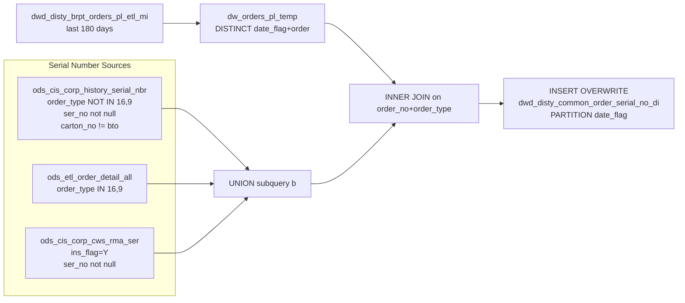

# DWD: Order Serial Numbers — Daily (`dwd_disty_common_order_serial_no_di`)

- artifact_type: etl_table
- artifact_id: dw_us.dwd_disty_common_order_serial_no_di
- domain: order
- one_line_purpose: This job captures **serial numbers, asset tags, MAC addresses, IMEI numbers, and ICCID numbers** for order lines that exist in the BRPT profitability dataset. It handles two distinct order flows: standard shipped order serial numbers from t...
- layer_type: DWD
- source_kind: etl_sql
- evidence_source: source/etl/sql/order/source/etl/flows/public_order_tools/ingest/public_order_dw/script/dwd_disty_common_order_serial_no_di.sql

---

## L1 Data Foundation

### Identity and physical mapping
- **Table:** `dw_us.dwd_disty_common_order_serial_no_di`
- **Layer type:** DWD
- **Canonical / derived:** Derived / ETL-loaded (see L3)
- **Owner team:** not registered in metadata catalog

### Grain, scope, exclusions
- **Grain:** one row per `(order_type, order_no, order_line_no, ser_no, date_flag)` — a unique serial number on a specific order line for a given date.
- **Scope:** See L2 business purpose / L3 filters
- **Partition:** `date_flag` — the date_flag from the BRPT PL table (ship/profitability date). - resolved from pipeline (see L4)
- **Natural key:** `order_type`, `order_no`, `order_line_no`, `ser_no` within a `date_flag` partition.
- **Exclusions:** Not documented in repository

#### Grain detail (preserved)

- **Grain:** one row per `(order_type, order_no, order_line_no, ser_no, date_flag)` — a unique serial number on a specific order line for a given date.
- **Partition:** `date_flag` — the date_flag from the BRPT PL table (ship/profitability date).
- **Natural key:** `order_type`, `order_no`, `order_line_no`, `ser_no` within a `date_flag` partition.

---

### Cross-engine presence
| Engine | Present | Canonical FQN | Notes |
|--------|---------|---------------|-------|
| Hive | yes | `dwd_disty_common_order_serial_no_di` | ETL target / intermediate per evidence script |
| Vertica | pending | `dwd_disty_common_order_serial_no_di` | Confirm via hive2vertica flow evidence / MCP |

### Physical schema reference

Pointer block only - full column catalog lives in WKB L1 storage JSON.

| Field | Value |
|-------|-------|
| **Authoritative catalog** | WKB L1 storage seed (not duplicated in this file) |
| **entity_id** | `dw_us.dwd_disty_common_order_serial_no_di` |
| **l1_catalog_seed** | `target/storage/wkb/snapshots/_snapshot_id_template/l1_catalog/{engine}_{schema}_{table}.json` |
| **column_count** | pending (run ddl_seed_writer) |
| **partition_keys** | `date_flag` |
| **ddl_source** | pending Bitbucket DDL / Vertica metadata ingest |
| **retrieval** | `python -m tools.wkb.indexing.run_query --query "order dwd_disty_common_order_serial_no_di schema" --intent find_table_schema` |

### Lineage
| Object | Role |
|--------|------|
| `dw_${country_code}.dwd_disty_brpt_orders_pl_etl_mi` | BRPT PL anchor — 180-day rolling order scope |
| `ods_${country_code}.ods_cis_corp_history_serial_nbr` | Standard serial numbers (non-RMA orders) |
| `ods_${country_code}.ods_etl_order_detail_all` | RMA order context and reference keys |
| `ods_${country_code}.ods_cis_corp_cws_rma_ser` | CWS RMA serial numbers |
| `dw_${country_code}.dwd_disty_common_order_serial_no_di` | **Target** — order serial number dataset |

---

### Freshness and load path
| Item | Value |
|------|-------|
| Load pattern | See L3 end-to-end / INSERT pattern in evidence script |
| Schedule | Not documented in repository |
| Parameters | `country_code`, `last_180_date`, `end_date` |


---

## L2 Declarative Knowledge

### Business purpose
This job captures **serial numbers, asset tags, MAC addresses, IMEI numbers, and ICCID numbers** for order lines that exist in the BRPT profitability dataset. It handles two distinct order flows: standard shipped order serial numbers from the history serial number table, and RMA-linked serial numbers from a CWS RMA table for RMA-type orders (types 16 and 9). The result links device-level tracking data to order lines within a rolling 180-day analytics window, enabling asset tracking, warranty management, and serialised inventory reconciliation.

---

### Audience and use cases
| Audience | How they benefit |
|----------|-----------------|
| **Asset / warranty management** | `ser_no`, `asset_tag`, `mac_address`, `imei_no`, `iccid_no` — full device-level identifiers for shipped items within the analytics window. |
| **Finance / audit** | Links device serial numbers to profitability-eligible order lines for serialised inventory valuation and audit trails. |
| **Operations / supply chain** | Serial number coverage for both standard and RMA orders in a single table — eliminates need to union across sources in downstream queries. |

---

### Fact key resolution
- Natural key: `order_type`, `order_no`, `order_line_no`, `ser_no` within a `date_flag` partition.
- FK / label-on attributes: see L3 dimension join patterns and step-by-step logic.
- Negative assertion: do not treat descriptive labels as grain keys unless listed under natural key.

### Time field semantics
- **date_flag / partition columns:** `date_flag` — the date_flag from the BRPT PL table (ship/profitability date).
- Primary reporting filter should use the partition column(s) documented in L1; resolve values via L4.


### Metrics served

| Category | Column | Logical metric | Business reading |
|----------|--------|----------------|------------------|
| Measures | — | — | No measure columns mapped for this table. |

### Metric serving map

**Formula authority:** [`source/contracts/order/metric-index.md`](../../source/contracts/order/metric-index.md)

N/A — no measure columns mapped for this table.

### etl_metrics

No governed logical metrics from `source/contracts/order/metric-index.md` are mapped on this table.

---

### Metric serving map
N/A - not a `*_comb_mtd` / multi-period wide serving table (or map not present in legacy doc).


### Data products and column groups (preserved)

### Identifiers

- **Order:** `order_type`, `order_no`, `order_line_no`
- **Device tracking:** `ser_no` — serial number (always non-null)
- `asset_tag` — asset tag (null for RMA-sourced rows)
- `mac_address` — MAC address (null for RMA-sourced rows)
- `imei_no` — IMEI number (null for RMA-sourced rows)
- `iccid_no` — ICCID number (null for RMA-sourced rows)

> **Note:** `asset_tag`, `mac_address`, `imei_no`, and `iccid_no` are always NULL for RMA order lines (types 16 and 9) — those rows are populated via the CWS RMA serial table which provides only `ser_no`.

---

### etl_metrics

N/A - no calculable ETL formulas extracted from this document (passthrough / stored measures only, or formulas not documented).

---

## L3 Procedural Knowledge

### Query and routing rules
**Business filters:** Use partition / date keys from L1 grain for reporting scope.
**Technical predicates (load only):** See Key filters and step-by-step logic below.

### Dimension join patterns
| Dimension FQN | Join keys | Purpose | Evidence |
|---------------|-----------|---------|----------|
| See step-by-step / base tables | See L3 steps | Dimension enrichment | `source/etl/sql/order/source/etl/flows/public_order_tools/ingest/public_order_dw/script/dwd_disty_common_order_serial_no_di.sql` |

### Key filters and ETL business logic
### Step 1 — `dw_orders_pl_temp` (view)

**Source:** `dw_${country_code}.dwd_disty_brpt_orders_pl_etl_mi`

**Filter (natural language):**
- `dt_month >= DATE_FORMAT('${last_180_date}', 'yyyy-MM')` — partition pruning: restricts to months within the 180-day window.
- `date_flag >= '${last_180_date}'` — day-level lower bound.
- `date_flag < '${end_date}'` — day-level upper bound (exclusive).

**Output:** `DISTINCT (date_flag, order_no, order_type)` — the analytics-eligible order set.

---

### Step 2 — Serial number subquery `b` (UNION)

**Part 1 — Standard serial numbers:**

**Source:** `ods_cis_corp_history_serial_nbr`

**Filter:**
- `order_type NOT IN (16, 9)` — excludes RMA order types; those are handled separately.
- `ser_no IS NOT NULL` — only rows with an actual serial number.
- `IFNULL(carton_no, '') != 'bto'` — excludes BTO (Build-to-Order) carton entries.

**Output columns:** `order_type`, `order_no`, `order_line_no`, `ser_no`, `asset_tag`, `mac_address`, `imei_no`, `iccid_no`

---

**Part 2 — RMA serial numbers:**

**Source:** `ods_etl_order_detail_all` (c) INNER JOIN `ods_cis_corp_cws_rma_ser` (a)

**Join keys:** `c.int_ref_no = a.rma_no AND c.int_ref_line_no = a.rma_line_no` — matches the order's RMA reference to the CWS RMA serial record.

**Filter:**
- `a.ins_flag = 'Y'` — only confirmed/inserted RMA serial records.
- `c.order_type IN (16, 9)` — RMA order types only.
- `a.ser_no IS NOT NULL` — only rows with an actual serial number.

**Output columns:** `c.order_...

### Standard time-filter SQL
```sql
-- relative period filter using resolved partition value (see L4)
SELECT *
FROM dwd_disty_common_order_serial_no_di
WHERE /* partition predicate */ date_flag = '${partition_value}';
```

### End-to-end flow
**Runtime parameters:** `country_code`, `last_180_date`, `end_date`
**Target table:** `dw_${country_code}.dwd_disty_common_order_serial_no_di`, partitioned by **`date_flag`**.

1. Build `dw_orders_pl_temp` view: get DISTINCT `(date_flag, order_no, order_type)` from `dwd_disty_brpt_orders_pl_etl_mi` for the rolling 180-day window.
2. Build serial number subquery `b`:
   - **Part 1 (standard):** `ods_cis_corp_history_serial_nbr` — order types NOT IN (16, 9), `ser_no IS NOT NULL`, `carton_no != 'bto'`.
   - **Part 2 (RMA):** `ods_etl_order_detail_all` INNER JOIN `ods_cis_corp_cws_rma_ser` — order types IN (16, 9), `ins_flag = 'Y'`, `ser_no IS NOT NULL`. Uses `int_ref_no = rma_no AND int_ref_line_no = rma_line_no` join.
   - UNION (distinct) of both parts.
3. INNER JOIN `dw_orders_pl_temp` (`a`) to subquery `b` on `order_no + order_type` — filters to BRPT-eligible orders only.
4. **INSERT OVERWRITE** into target with `date_flag` from the BRPT anchor.



---


#### High-level stages (preserved)

| Stage | Business meaning |
|-------|-----------------|
| **BRPT PL order filter** | Reads DISTINCT `(date_flag, order_no, order_type)` from the BRPT PL table for the last 180 days — establishes which orders are in scope for the analytics dataset. |
| **Standard serial numbers** | Reads serial numbers from `ods_cis_corp_history_serial_nbr` excluding RMA order types (16, 9), keeping only rows with a non-null serial number and non-BTO carton. |
| **RMA serial numbers** | For order types 16 and 9 (RMA orders), reads serial numbers from the CWS RMA serial number table, joined to order detail via the RMA reference number. Only rows with `ins_flag = 'Y'` (confirmed inserted) and a non-null serial number are included. |
| **BRPT anchor join** | INNER JOINs the serial number dataset to the BRPT PL order list — only serial numbers for orders present in the BRPT analytics scope are loaded. |

**Parameters:** `country_code`, `last_180_date`, `end_date`

---


### Base tables register
| Object | Role in this job |
|--------|-----------------|
| `dw_${country_code}.dwd_disty_brpt_orders_pl_etl_mi` | **BRPT anchor.** Provides the set of profitability-eligible orders (DISTINCT date_flag/order_no/order_type) within the 180-day window. Limits serial number output to analytics-in-scope orders. |
| `ods_${country_code}.ods_cis_corp_history_serial_nbr` | **Standard serial numbers.** Settled/history order serial records for non-RMA orders. Provides `ser_no`, `asset_tag`, `mac_address`, `imei_no`, `iccid_no`. |
| `ods_${country_code}.ods_etl_order_detail_all` | **RMA order context.** Provides `order_type`, `order_no`, `order_line_no` and the RMA reference keys (`int_ref_no`, `int_ref_line_no`) for matching RMA serial numbers. Filtered to order types 16 and 9. |
| `ods_${country_code}.ods_cis_corp_cws_rma_ser` | **RMA serial numbers.** CWS RMA serial number table. Joined via `rma_no + rma_line_no`. Filtered to `ins_flag = 'Y'` and non-null `ser_no`. |

**Temporary tables (inside the job only):**
`dw_orders_pl_temp` (view) + inline subquery `b` → (final INSERT)

---

### Step-by-step logic
### Step 1 — `dw_orders_pl_temp` (view)

**Source:** `dw_${country_code}.dwd_disty_brpt_orders_pl_etl_mi`

**Filter (natural language):**
- `dt_month >= DATE_FORMAT('${last_180_date}', 'yyyy-MM')` — partition pruning: restricts to months within the 180-day window.
- `date_flag >= '${last_180_date}'` — day-level lower bound.
- `date_flag < '${end_date}'` — day-level upper bound (exclusive).

**Output:** `DISTINCT (date_flag, order_no, order_type)` — the analytics-eligible order set.

---

### Step 2 — Serial number subquery `b` (UNION)

**Part 1 — Standard serial numbers:**

**Source:** `ods_cis_corp_history_serial_nbr`

**Filter:**
- `order_type NOT IN (16, 9)` — excludes RMA order types; those are handled separately.
- `ser_no IS NOT NULL` — only rows with an actual serial number.
- `IFNULL(carton_no, '') != 'bto'` — excludes BTO (Build-to-Order) carton entries.

**Output columns:** `order_type`, `order_no`, `order_line_no`, `ser_no`, `asset_tag`, `mac_address`, `imei_no`, `iccid_no`

---

**Part 2 — RMA serial numbers:**

**Source:** `ods_etl_order_detail_all` (c) INNER JOIN `ods_cis_corp_cws_rma_ser` (a)

**Join keys:** `c.int_ref_no = a.rma_no AND c.int_ref_line_no = a.rma_line_no` — matches the order's RMA reference to the CWS RMA serial record.

**Filter:**
- `a.ins_flag = 'Y'` — only confirmed/inserted RMA serial records.
- `c.order_type IN (16, 9)` — RMA order types only.
- `a.ser_no IS NOT NULL` — only rows with an actual serial number.

**Output columns:** `c.order_type`, `c.order_no`, `c.order_line_no`, `a.ser_no`, then four literal NULLs (asset_tag, mac_address, imei_no, iccid_no — not available from this source).

**UNION (not UNION ALL):** deduplicates across the two parts.

---

### Step 3 — Final `INSERT OVERWRITE`

**INNER JOIN:** `dw_orders_pl_temp` (`a`) INNER JOIN subquery `b` on `a.order_no = b.order_no AND a.order_type = b.order_type`

The INNER JOIN ensures that only serial numbers for orders present in the BRPT PL dataset (within the 180-day window) are written to the target. Serial numbers for orders outside the BRPT scope are excluded.

**Output columns:** All columns from `b` (`order_type`, `order_no`, `order_line_no`, `ser_no`, `asset_tag`, `mac_address`, `imei_no`, `iccid_no`) plus `a.date_flag`.

---

### Relationship map (embedded)

| from_fqn | to_fqn | cardinality | join_keys | provenance |
|----------|--------|-------------|-----------|------------|
| `ods_${country_code}.ods_etl_order_detail_all` | `ods_${country_code}.ods_cis_corp_cws_rma_ser` | many:1 | `c.int_ref_no` = `a.rma_no`; `c.int_ref_line_no` = `a.rma_line_no` | etl_sql (`source/etl/sql/order/public_order_scripts/public_order_dw/script/dwd_disty_common_order_serial_no_di.sql:23`) |

### Special logic (embedded)

Not documented in repository

### Column / field derivations (from ETL SQL)

| target_column | expression_sql | upstream_columns | upstream_tables | transform_kind | evidence |
|---------------|----------------|------------------|-----------------|----------------|----------|
| `b` | `b.*` | `b` | `dw_orders_pl_temp`, `ods_${country_code}.ods_cis_corp_history_serial_nbr`, `ods_${country_code}.ods_etl_order_detail_all`, `ods_${country_code}.ods_cis_corp_cws_rma_ser` | arithmetic | `source/etl/sql/order/public_order_scripts/public_order_dw/script/dwd_disty_common_order_serial_no_di.sql:11` |
| `date_flag` | `a.date_flag` | `date_flag` | `dw_orders_pl_temp`, `ods_${country_code}.ods_cis_corp_history_serial_nbr`, `ods_${country_code}.ods_etl_order_detail_all`, `ods_${country_code}.ods_cis_corp_cws_rma_ser` | passthrough | `source/etl/sql/order/public_order_scripts/public_order_dw/script/dwd_disty_common_order_serial_no_di.sql:12` |

### Sentinel and code values
| Value | Meaning |
|-------|---------|
| `order_type IN (16, 9)` | RMA order types — serial numbers sourced from CWS RMA table, not history serial table. |
| `order_type NOT IN (16, 9)` | Standard (non-RMA) orders — serial numbers from history serial table. |
| `ins_flag = 'Y'` | CWS RMA serial record confirmed as inserted — only these are valid. |
| `carton_no != 'bto'` | Excludes BTO (Build-to-Order) carton serial entries from standard serial table. |
| `asset_tag = NULL`, `mac_address = NULL`, `imei_no = NULL`, `iccid_no = NULL` | Always NULL for RMA-sourced rows — those columns are not available in the CWS RMA table. |
| `dt_month >= DATE_FORMAT(last_180_date, 'yyyy-MM')` | Partition pruning on BRPT table to complement the day-level `date_flag` filter. |

---

---

## L4 Validation

### Resolved partition value
| Step | Source | How partition / date scope is determined |
|------|--------|------------------------------------------|
| 1 | evidence script / flow | See parameters in L1 Freshness and L3 filters - `source/etl/sql/order/source/etl/flows/public_order_tools/ingest/public_order_dw/script/dwd_disty_common_order_serial_no_di.sql` |

**Plain language:** Partition and date scope follow Azkaban/bootstrap parameters documented in the source script and orchestrating flow; do not hardcode calendar literals.

### Data quality checks
- Prefer row-count-by-partition, metric sums, and grain duplicate checks (see Validation SQL).
- Additional checks from legacy caveats / operational notes when present.

### Validation SQL
```sql
-- 1) Row count by partition
SELECT ${partition_col}, COUNT(*) AS row_cnt
FROM dw_${country_code}.dwd_disty_common_order_serial_no_di
WHERE ${partition_col} = '${partition_value}'
GROUP BY ${partition_col};

-- 2) Metric sum by business dimension (top deltas)
SELECT ${dim_key}, SUM(${metric}) AS metric_sum
FROM dw_${country_code}.dwd_disty_common_order_serial_no_di
WHERE ${partition_col} = '${partition_value}'
GROUP BY ${dim_key}
ORDER BY ABS(SUM(${metric})) DESC
LIMIT 20;

-- 3) Grain duplicate check
SELECT ${grain_key_1}, ${grain_key_2}, ${grain_key_3}, ${partition_col}, COUNT(*) AS cnt
FROM dw_${country_code}.dwd_disty_common_order_serial_no_di
WHERE ${partition_col} = '${partition_value}'
GROUP BY ${grain_key_1}, ${grain_key_2}, ${grain_key_3}, ${partition_col}
HAVING COUNT(*) > 1;
```

Replace placeholders from this file's Grain and keys / Data you can fetch sections, and use the resolved partition value from run scope.

### Caveats for interpretation
- **INNER JOIN to BRPT limits scope** — serial numbers are only loaded for orders that exist in `dwd_disty_brpt_orders_pl_etl_mi` within the 180-day window. Orders outside that window or not in BRPT will have no rows here.
- **RMA rows have NULL asset/MAC/IMEI/ICCID** — these four columns are only populated for standard (non-RMA) order types.
- **UNION deduplicates** — if a serial number appears in both the history serial table and the CWS RMA table (which should not happen given the order type filters), only one row survives.
- **`date_flag` comes from the BRPT anchor**, not from the serial number source — so it reflects the profitability date, not necessarily the physical ship date of the device.

---

### Conflicts and open questions
- Schedule, owner, SLA: Not documented in repository (unless preserved schedule evidence above).
- Vertica MCP verification: pending unless confirmed in L5.


---

## L5 Runtime View

### Query path and engine preference
| Role | Hive object | Vertica object | Sync mode | Evidence | MCP verified |
|------|-------------|----------------|-----------|----------|--------------|
| **Query for reporting** | *See script lineage* | `dw_${country_code}.dwd_disty_common_order_serial_no_di` | *Verify from flow* | *Add flow file:line* | pending |
| **Hive alternative** | `*` | `dw_${country_code}.dwd_disty_common_order_serial_no_di` | - | *See dependencies* | - |
| **ETL internal** | staging/temp tables | *Not synced to Vertica* | - | *See step-by-step logic* | - |

Business users should query `dw_${country_code}.dwd_disty_common_order_serial_no_di` in Vertica once MCP verification is completed for this document.

### Access constraints
- Country / company schema parameters may apply (`literal_country`, `company_no`, etc.).
- Hive-only staging objects are not reporting surfaces unless synced.

### Query risk profile
| Field | Value |
|-------|-------|
| requires_date_predicate | yes |
| scan_risk_tier | high |

---

## L6 Access and Consumption

### Primary consumers and use cases
| Audience | How they benefit |
|----------|-----------------|
| **Asset / warranty management** | `ser_no`, `asset_tag`, `mac_address`, `imei_no`, `iccid_no` — full device-level identifiers for shipped items within the analytics window. |
| **Finance / audit** | Links device serial numbers to profitability-eligible order lines for serialised inventory valuation and audit trails. |
| **Operations / supply chain** | Serial number coverage for both standard and RMA orders in a single table — eliminates need to union across sources in downstream queries. |

---

### Representative query patterns
```sql
-- certified / illustrative lookup - replace predicates from L1/L4
SELECT *
FROM dwd_disty_common_order_serial_no_di
WHERE date_flag = '${partition_value}'
LIMIT 100;
```

### Dependencies and notes
### Upstream objects (verified)

| Object | Usage | Evidence |
|--------|-------|----------|
| `dw_${country_code}.dwd_disty_brpt_orders_pl_etl_mi` | BRPT PL scope filter; provides date_flag | `dwd_disty_common_order_serial_no_di.sql:6-8` |
| `ods_${country_code}.ods_cis_corp_history_serial_nbr` | Standard serial numbers; filtered to non-RMA, non-null ser_no, non-BTO | `dwd_disty_common_order_serial_no_di.sql:16-19` |
| `ods_${country_code}.ods_etl_order_detail_all` | RMA order detail; int_ref_no/line_no join keys | `dwd_disty_common_order_serial_no_di.sql:22-25` |
| `ods_${country_code}.ods_cis_corp_cws_rma_ser` | CWS RMA serial numbers; ins_flag filter | `dwd_disty_common_order_serial_no_di.sql:23-29` |

### Downstream consumers (verified)

| Object / script | Evidence |
|-----------------|----------|
| None identified in repository. | — |

### Operational detail (verified)

- Partition overwrite: `INSERT OVERWRITE TABLE dw_${country_code}.dwd_disty_common_order_serial_no_di PARTITION (date_flag)` — `dwd_disty_common_order_serial_no_di.sql:10`

### Not documented in repository

- Schedule, owner, SLA — not in scripts or configs
- Whether `last_180_date` is always exactly 180 days before `end_date` — determined at runtime

---

*Document generated from `source/etl/sql/order/source/etl/flows/public_order_tools/ingest/public_order_dw/script/dwd_disty_common_order_serial_no_di.sql`.*

#### Not documented in repository
- Owner, SLA (unless schedule evidence preserved above)
- Any dependency without `file:line` evidence in this document

---

*Document migrated to L1-L6 from legacy Knowledgebase content. Evidence: `source/etl/sql/order/source/etl/flows/public_order_tools/ingest/public_order_dw/script/dwd_disty_common_order_serial_no_di.sql`.*
