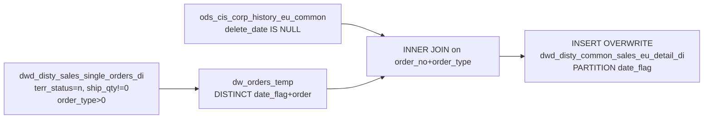

# DWD: Sales End-User (EU) Detail — Daily (`dwd_disty_common_sales_eu_detail_di`)

- artifact_type: etl_table
- artifact_id: dw_us.dwd_disty_common_sales_eu_detail_di
- domain: order
- one_line_purpose: This job links **end-user (EU) contact and location detail** to the sold order lines within a given date window. It identifies which sales order lines had an end-user entity attached to them — including the EU company name, shipping address...
- layer_type: DWD
- source_kind: etl_sql
- evidence_source: source/etl/sql/order/source/etl/flows/public_order_tools/ingest/public_order_dw/script/dwd_disty_common_sales_eu_detail_di.sql

---

## L1 Data Foundation

### Identity and physical mapping
- **Table:** `dw_us.dwd_disty_common_sales_eu_detail_di`
- **Layer type:** DWD
- **Canonical / derived:** Derived / ETL-loaded (see L3)
- **Owner team:** not registered in metadata catalog

### Grain, scope, exclusions
- **Grain:** one row per `(order_no, order_type, order_line_no, date_flag)` — a single-order line that has an attached EU common record.
- **Scope:** See L2 business purpose / L3 filters
- **Partition:** `date_flag` — from the `dwd_disty_sales_single_orders_di` order filter. - resolved from pipeline (see L4)
- **Natural key:** `order_no`, `order_type`, `order_line_no` within a `date_flag` partition.
- **Exclusions:** Not documented in repository

#### Grain detail (preserved)

- **Grain:** one row per `(order_no, order_type, order_line_no, date_flag)` — a single-order line that has an attached EU common record.
- **Partition:** `date_flag` — from the `dwd_disty_sales_single_orders_di` order filter.
- **Natural key:** `order_no`, `order_type`, `order_line_no` within a `date_flag` partition.
- **Note:** Only order lines for which a matching EU common record exists in `ods_cis_corp_history_eu_common` will appear. Lines without an EU common record are excluded by the INNER JOIN.

---

### Cross-engine presence
| Engine | Present | Canonical FQN | Notes |
|--------|---------|---------------|-------|
| Hive | yes | `dwd_disty_common_sales_eu_detail_di` | ETL target / intermediate per evidence script |
| Vertica | pending | `dwd_disty_common_sales_eu_detail_di` | Confirm via hive2vertica flow evidence / MCP |

### Physical schema reference

Pointer block only - full column catalog lives in WKB L1 storage JSON.

| Field | Value |
|-------|-------|
| **Authoritative catalog** | WKB L1 storage seed (not duplicated in this file) |
| **entity_id** | `dw_us.dwd_disty_common_sales_eu_detail_di` |
| **l1_catalog_seed** | `target/storage/wkb/snapshots/_snapshot_id_template/l1_catalog/{engine}_{schema}_{table}.json` |
| **column_count** | pending (run ddl_seed_writer) |
| **partition_keys** | `date_flag, dwd_disty_sales_single_orders_di` |
| **ddl_source** | pending Bitbucket DDL / Vertica metadata ingest |
| **retrieval** | `python -m tools.wkb.indexing.run_query --query "order dwd_disty_common_sales_eu_detail_di schema" --intent find_table_schema` |

### Lineage
| Object | Role |
|--------|------|
| `dw_${country_code}.dwd_disty_sales_single_orders_di` | Order scope and date_flag |
| `ods_${country_code}.ods_cis_corp_history_eu_common` | EU company, location, and contact data |
| `dw_${country_code}.dwd_disty_common_sales_eu_detail_di` | **Target** — sales EU detail |

---

### Freshness and load path
| Item | Value |
|------|-------|
| Load pattern | See L3 end-to-end / INSERT pattern in evidence script |
| Schedule | Not documented in repository |
| Parameters | `country_code`, `start_date`, `end_date` |


---

## L2 Declarative Knowledge

### Business purpose
This job links **end-user (EU) contact and location detail** to the sold order lines within a given date window. It identifies which sales order lines had an end-user entity attached to them — including the EU company name, shipping address, contact person, email, and phone — by joining to the history EU common table. Only order lines with a valid, non-deleted EU common record are included. The result enables end-user program reporting, government/education segment analysis, and channel compliance tracking where the identity of the end customer is required.

---

### Audience and use cases
| Audience | How they benefit |
|----------|-----------------|
| **Sales / channel teams** | `eu_company_name`, `eu_type`, `eu_loc_country` — identifies the end-user entity for each sold line; enables government, education, and named-account program tracking. |
| **Compliance / audit** | Complete EU contact information (`eu_contact_email`, `eu_contact_phone`, `eu_cont_cell_phone`, `eu_loc_contact`) for regulatory or vendor program compliance. |
| **Vendor management** | EU address data for SPA/vendor program reporting that requires the ship-to end-user identity, not just the reseller. |

---

### Fact key resolution
- Natural key: `order_no`, `order_type`, `order_line_no` within a `date_flag` partition.
- FK / label-on attributes: see L3 dimension join patterns and step-by-step logic.
- Negative assertion: do not treat descriptive labels as grain keys unless listed under natural key.

### Time field semantics
- **date_flag / partition columns:** `date_flag` — from the `dwd_disty_sales_single_orders_di` order filter.
- Primary reporting filter should use the partition column(s) documented in L1; resolve values via L4.


### Metrics served

| Category | Column | Logical metric | Business reading |
|----------|--------|----------------|------------------|
| Measures | — | — | No measure columns mapped for this table. |

### Metric serving map

**Formula authority:** [`source/contracts/order/metric-index.md`](../../source/contracts/order/metric-index.md)

N/A — no measure columns mapped for this table.

### etl_metrics

No governed logical metrics from `source/contracts/order/metric-index.md` are mapped on this table.

---

### Metric serving map
N/A - not a `*_comb_mtd` / multi-period wide serving table (or map not present in legacy doc).


### Data products and column groups (preserved)

### Order identifiers

- `order_no`, `order_type`, `order_line_no`

### EU entity identifiers

- `eu_type` — classification of the end-user entity
- `ec_eu_no` — EU number in the system
- `ec_eu_loc_no` — EU location number
- `ec_eu_contact_no` — EU contact number

### EU company and location attributes

- `eu_company_name` — end-user company name
- `eu_loc_name` — end-user location name
- `eu_loc_address1`, `eu_loc_address2` — location street address lines
- `eu_loc_city`, `eu_loc_state`, `eu_loc_country`, `eu_loc_zipcode` — location address components

### EU contact information

- `eu_loc_contact` — primary contact person at the location
- `eu_contact_email` — contact email address
- `eu_contact_phone` — contact phone number
- `eu_cont_cell_phone` — contact cell/mobile phone number

---

### etl_metrics

N/A - no calculable ETL formulas extracted from this document (passthrough / stored measures only, or formulas not documented).

---

## L3 Procedural Knowledge

### Query and routing rules
**Business filters:** Use partition / date keys from L1 grain for reporting scope.
**Technical predicates (load only):** See Key filters and step-by-step logic below.

### Dimension join patterns
| Dimension FQN | Join keys | Purpose | Evidence |
|---------------|-----------|---------|----------|
| See step-by-step / base tables | See L3 steps | Dimension enrichment | `source/etl/sql/order/source/etl/flows/public_order_tools/ingest/public_order_dw/script/dwd_disty_common_sales_eu_detail_di.sql` |

### Key filters and ETL business logic
### Step 1 — `dw_orders_temp` (view)

**Source:** `dw_${country_code}.dwd_disty_sales_single_orders_di`

**Filter (natural language):**
- `a.date_flag >= '${start_date}' AND a.date_flag < '${end_date}'` — date window.
- `a.order_type > 0` — excludes order type 0.
- `a.ship_qty <> 0` — excludes zero-quantity lines.
- `terr_status = 'n'` — territory-normalized records only.

**Output:** `DISTINCT (date_flag, order_no, order_type)` — the eligible order set with date context.

---

### Step 2 — Final `INSERT OVERWRITE` into `dwd_disty_common_sales_eu_detail_di`

**From:** `dw_orders_temp` (`a`) INNER JOIN `ods_cis_corp_history_eu_common` (`eu`)

**Join keys:** `a.order_no = eu.order_no AND a.order_type = eu.order_type`

**Additional filter:** `eu.delete_date IS NULL` — only non-deleted EU common records.

**Pass-through columns from `eu`:** `order_no`, `order_type`, `order_line_no`, `eu_type`, `ec_eu_no`, `ec_eu_loc_no`, `ec_eu_contact_no`, `eu_company_name`, `eu_loc_name`, `eu_loc_address1`, `eu_loc_address2`, `eu_loc_city`, `eu_loc_contact`, `eu_loc_country`, `eu_contact_email`, `eu_contact_phone`, `eu_loc_state`, `eu_loc_zipcode`, `eu_cont_cell_phone`

**Derived columns:**

| Column | Source | Plain language |
|--------|--------|----------------|
| `date_flag` | `a.date_flag` | The ship/sale date from the order filter — inherited from `dwd_disty_sales_single_orders_di`. |

---

### Standard time-filter SQL
```sql
-- relative period filter using resolved partition value (see L4)
SELECT *
FROM dwd_disty_common_sales_eu_detail_di
WHERE /* partition predicate */ date_flag = '${partition_value}';
```

### End-to-end flow
**Runtime parameters:** `country_code`, `start_date`, `end_date`
**Target table:** `dw_${country_code}.dwd_disty_common_sales_eu_detail_di`, partitioned by **`date_flag`**.

1. Build `dw_orders_temp` view: DISTINCT `(date_flag, order_no, order_type)` from `dwd_disty_sales_single_orders_di` filtered to `terr_status = 'n'`, `order_type > 0`, `ship_qty <> 0`, and date window.
2. INNER JOIN `dw_orders_temp` to `ods_cis_corp_history_eu_common` on `order_no + order_type` where `eu.delete_date IS NULL`.
3. **INSERT OVERWRITE** all EU common columns plus `date_flag` from the order filter.



---


#### High-level stages (preserved)

| Stage | Business meaning |
|-------|-----------------|
| **Active orders filter** | Builds a DISTINCT set of `(date_flag, order_no, order_type)` from single orders within the date window — the same eligibility criteria as `dwd_disty_common_sales_detail_di`. |
| **EU common join** | INNER JOINs to `ods_cis_corp_history_eu_common` on `order_no + order_type` where `delete_date IS NULL` — only attaches EU details for order lines with a non-deleted EU common record. |
| **Partition write** | Writes EU contact/location attributes alongside the order line keys and `date_flag`. |

**Parameters:** `country_code`, `start_date`, `end_date`

---


### Base tables register
| Object | Role in this job |
|--------|-----------------|
| `dw_${country_code}.dwd_disty_sales_single_orders_di` | **Order scope filter.** Provides the set of eligible order lines (DISTINCT order_no/type + date_flag). Same filter criteria as `dwd_disty_common_sales_detail_di`. |
| `ods_${country_code}.ods_cis_corp_history_eu_common` | **EU data source.** Provides all EU company/location/contact attributes. Filtered to `delete_date IS NULL` (active EU records). INNER JOIN — only orders with a matching EU record are included. |

**Temporary tables (inside the job only):**
`dw_orders_temp` (view) → (final INSERT)

---

### Step-by-step logic
### Step 1 — `dw_orders_temp` (view)

**Source:** `dw_${country_code}.dwd_disty_sales_single_orders_di`

**Filter (natural language):**
- `a.date_flag >= '${start_date}' AND a.date_flag < '${end_date}'` — date window.
- `a.order_type > 0` — excludes order type 0.
- `a.ship_qty <> 0` — excludes zero-quantity lines.
- `terr_status = 'n'` — territory-normalized records only.

**Output:** `DISTINCT (date_flag, order_no, order_type)` — the eligible order set with date context.

---

### Step 2 — Final `INSERT OVERWRITE` into `dwd_disty_common_sales_eu_detail_di`

**From:** `dw_orders_temp` (`a`) INNER JOIN `ods_cis_corp_history_eu_common` (`eu`)

**Join keys:** `a.order_no = eu.order_no AND a.order_type = eu.order_type`

**Additional filter:** `eu.delete_date IS NULL` — only non-deleted EU common records.

**Pass-through columns from `eu`:** `order_no`, `order_type`, `order_line_no`, `eu_type`, `ec_eu_no`, `ec_eu_loc_no`, `ec_eu_contact_no`, `eu_company_name`, `eu_loc_name`, `eu_loc_address1`, `eu_loc_address2`, `eu_loc_city`, `eu_loc_contact`, `eu_loc_country`, `eu_contact_email`, `eu_contact_phone`, `eu_loc_state`, `eu_loc_zipcode`, `eu_cont_cell_phone`

**Derived columns:**

| Column | Source | Plain language |
|--------|--------|----------------|
| `date_flag` | `a.date_flag` | The ship/sale date from the order filter — inherited from `dwd_disty_sales_single_orders_di`. |

---

### Relationship map (embedded)

| from_fqn | to_fqn | cardinality | join_keys | provenance |
|----------|--------|-------------|-----------|------------|
| `dw_${country_code}.dwd_disty_sales_single_orders_di` | `ods_${country_code}.ods_cis_corp_history_eu_common` | many:1 | `a.order_no` = `eu.order_no`; `a.order_type` = `eu.order_type` | etl_sql (`source/etl/sql/order/public_order_scripts/public_order_dw/script/dwd_disty_common_sales_eu_detail_di.sql:36`) |

### Special logic (embedded)

Not documented in repository

### Column / field derivations (from ETL SQL)

| target_column | expression_sql | upstream_columns | upstream_tables | transform_kind | evidence |
|---------------|----------------|------------------|-----------------|----------------|----------|
| `order_no` | `eu.order_no` | `order_no` | `dw_orders_temp`, `ods_${country_code}.ods_cis_corp_history_eu_common` | passthrough | `source/etl/sql/order/public_order_scripts/public_order_dw/script/dwd_disty_common_sales_eu_detail_di.sql:15` |
| `order_type` | `eu.order_type` | `order_type` | `dw_orders_temp`, `ods_${country_code}.ods_cis_corp_history_eu_common` | passthrough | `source/etl/sql/order/public_order_scripts/public_order_dw/script/dwd_disty_common_sales_eu_detail_di.sql:16` |
| `order_line_no` | `eu.order_line_no` | `order_line_no` | `dw_orders_temp`, `ods_${country_code}.ods_cis_corp_history_eu_common` | passthrough | `source/etl/sql/order/public_order_scripts/public_order_dw/script/dwd_disty_common_sales_eu_detail_di.sql:17` |
| `eu_type` | `eu.eu_type` | `eu_type` | `dw_orders_temp`, `ods_${country_code}.ods_cis_corp_history_eu_common` | passthrough | `source/etl/sql/order/public_order_scripts/public_order_dw/script/dwd_disty_common_sales_eu_detail_di.sql:18` |
| `ec_eu_no` | `eu.ec_eu_no` | `ec_eu_no` | `dw_orders_temp`, `ods_${country_code}.ods_cis_corp_history_eu_common` | passthrough | `source/etl/sql/order/public_order_scripts/public_order_dw/script/dwd_disty_common_sales_eu_detail_di.sql:19` |
| `ec_eu_loc_no` | `eu.ec_eu_loc_no` | `ec_eu_loc_no` | `dw_orders_temp`, `ods_${country_code}.ods_cis_corp_history_eu_common` | passthrough | `source/etl/sql/order/public_order_scripts/public_order_dw/script/dwd_disty_common_sales_eu_detail_di.sql:20` |
| `ec_eu_contact_no` | `eu.ec_eu_contact_no` | `ec_eu_contact_no` | `dw_orders_temp`, `ods_${country_code}.ods_cis_corp_history_eu_common` | passthrough | `source/etl/sql/order/public_order_scripts/public_order_dw/script/dwd_disty_common_sales_eu_detail_di.sql:21` |
| `eu_company_name` | `eu.eu_company_name` | `eu_company_name` | `dw_orders_temp`, `ods_${country_code}.ods_cis_corp_history_eu_common` | passthrough | `source/etl/sql/order/public_order_scripts/public_order_dw/script/dwd_disty_common_sales_eu_detail_di.sql:22` |
| `eu_loc_name` | `eu.eu_loc_name` | `eu_loc_name` | `dw_orders_temp`, `ods_${country_code}.ods_cis_corp_history_eu_common` | passthrough | `source/etl/sql/order/public_order_scripts/public_order_dw/script/dwd_disty_common_sales_eu_detail_di.sql:23` |
| `eu_loc_address1` | `eu.eu_loc_address1` | `eu_loc_address1` | `dw_orders_temp`, `ods_${country_code}.ods_cis_corp_history_eu_common` | passthrough | `source/etl/sql/order/public_order_scripts/public_order_dw/script/dwd_disty_common_sales_eu_detail_di.sql:24` |
| `eu_loc_address2` | `eu.eu_loc_address2` | `eu_loc_address2` | `dw_orders_temp`, `ods_${country_code}.ods_cis_corp_history_eu_common` | passthrough | `source/etl/sql/order/public_order_scripts/public_order_dw/script/dwd_disty_common_sales_eu_detail_di.sql:25` |
| `eu_loc_city` | `eu.eu_loc_city` | `eu_loc_city` | `dw_orders_temp`, `ods_${country_code}.ods_cis_corp_history_eu_common` | passthrough | `source/etl/sql/order/public_order_scripts/public_order_dw/script/dwd_disty_common_sales_eu_detail_di.sql:26` |
| `eu_loc_contact` | `eu.eu_loc_contact` | `eu_loc_contact` | `dw_orders_temp`, `ods_${country_code}.ods_cis_corp_history_eu_common` | passthrough | `source/etl/sql/order/public_order_scripts/public_order_dw/script/dwd_disty_common_sales_eu_detail_di.sql:27` |
| `eu_loc_country` | `eu.eu_loc_country` | `eu_loc_country` | `dw_orders_temp`, `ods_${country_code}.ods_cis_corp_history_eu_common` | passthrough | `source/etl/sql/order/public_order_scripts/public_order_dw/script/dwd_disty_common_sales_eu_detail_di.sql:28` |
| `eu_contact_email` | `eu.eu_contact_email` | `eu_contact_email` | `dw_orders_temp`, `ods_${country_code}.ods_cis_corp_history_eu_common` | passthrough | `source/etl/sql/order/public_order_scripts/public_order_dw/script/dwd_disty_common_sales_eu_detail_di.sql:29` |
| `eu_contact_phone` | `eu.eu_contact_phone` | `eu_contact_phone` | `dw_orders_temp`, `ods_${country_code}.ods_cis_corp_history_eu_common` | passthrough | `source/etl/sql/order/public_order_scripts/public_order_dw/script/dwd_disty_common_sales_eu_detail_di.sql:30` |
| `eu_loc_state` | `eu.eu_loc_state` | `eu_loc_state` | `dw_orders_temp`, `ods_${country_code}.ods_cis_corp_history_eu_common` | passthrough | `source/etl/sql/order/public_order_scripts/public_order_dw/script/dwd_disty_common_sales_eu_detail_di.sql:31` |
| `eu_loc_zipcode` | `eu.eu_loc_zipcode` | `eu_loc_zipcode` | `dw_orders_temp`, `ods_${country_code}.ods_cis_corp_history_eu_common` | passthrough | `source/etl/sql/order/public_order_scripts/public_order_dw/script/dwd_disty_common_sales_eu_detail_di.sql:32` |
| `eu_cont_cell_phone` | `eu.eu_cont_cell_phone` | `eu_cont_cell_phone` | `dw_orders_temp`, `ods_${country_code}.ods_cis_corp_history_eu_common` | passthrough | `source/etl/sql/order/public_order_scripts/public_order_dw/script/dwd_disty_common_sales_eu_detail_di.sql:33` |
| `date_flag` | `a.date_flag` | `date_flag` | `dw_orders_temp`, `ods_${country_code}.ods_cis_corp_history_eu_common` | passthrough | `source/etl/sql/order/public_order_scripts/public_order_dw/script/dwd_disty_common_sales_eu_detail_di.sql:7` |

### Sentinel and code values
| Value | Meaning |
|-------|---------|
| `eu.delete_date IS NULL` | Only active EU common records; soft-deleted EU attachments are excluded. |
| INNER JOIN to EU common | Orders without a matching EU record in `ods_cis_corp_history_eu_common` are not included — EU data is not available for every order line. |
| `terr_status = 'n'` | Same territory-normalization filter as the companion detail table. |
| `order_type > 0` and `ship_qty <> 0` | Same exclusion rules as `dwd_disty_common_sales_detail_di`. |

---

---

## L4 Validation

### Resolved partition value
| Step | Source | How partition / date scope is determined |
|------|--------|------------------------------------------|
| 1 | evidence script / flow | See parameters in L1 Freshness and L3 filters - `source/etl/sql/order/source/etl/flows/public_order_tools/ingest/public_order_dw/script/dwd_disty_common_sales_eu_detail_di.sql` |

**Plain language:** Partition and date scope follow Azkaban/bootstrap parameters documented in the source script and orchestrating flow; do not hardcode calendar literals.

### Data quality checks
- Prefer row-count-by-partition, metric sums, and grain duplicate checks (see Validation SQL).
- Additional checks from legacy caveats / operational notes when present.

### Validation SQL
```sql
-- 1) Row count by partition
SELECT ${partition_col}, COUNT(*) AS row_cnt
FROM dw_${country_code}.dwd_disty_common_sales_eu_detail_di
WHERE ${partition_col} = '${partition_value}'
GROUP BY ${partition_col};

-- 2) Metric sum by business dimension (top deltas)
SELECT ${dim_key}, SUM(${metric}) AS metric_sum
FROM dw_${country_code}.dwd_disty_common_sales_eu_detail_di
WHERE ${partition_col} = '${partition_value}'
GROUP BY ${dim_key}
ORDER BY ABS(SUM(${metric})) DESC
LIMIT 20;

-- 3) Grain duplicate check
SELECT ${grain_key_1}, ${grain_key_2}, ${grain_key_3}, ${partition_col}, COUNT(*) AS cnt
FROM dw_${country_code}.dwd_disty_common_sales_eu_detail_di
WHERE ${partition_col} = '${partition_value}'
GROUP BY ${grain_key_1}, ${grain_key_2}, ${grain_key_3}, ${partition_col}
HAVING COUNT(*) > 1;
```

Replace placeholders from this file's Grain and keys / Data you can fetch sections, and use the resolved partition value from run scope.

### Caveats for interpretation
- **INNER JOIN means sparse coverage** — only order lines that have a corresponding EU record in the history EU common table will appear. The majority of standard sales orders may not have EU data attached; this table should be LEFT JOINed (not INNER JOINed) against `dwd_disty_common_sales_detail_di` to avoid dropping non-EU order lines.
- **EU common is at order level**, not order line level — `ods_cis_corp_history_eu_common` links to `order_no + order_type`, not `order_line_no`. Multiple lines within the same order will get the same EU contact/address data.
- **`date_flag` is from the order filter**, not from the EU record — it represents the sale date of the order, not any date in the EU entity record.
- **Source is `history_eu_common`** — this covers settled/archived orders. Recently processed orders may not yet have been moved to history.

---

### Conflicts and open questions
- Schedule, owner, SLA: Not documented in repository (unless preserved schedule evidence above).
- Vertica MCP verification: pending unless confirmed in L5.


---

## L5 Runtime View

### Query path and engine preference
| Role | Hive object | Vertica object | Sync mode | Evidence | MCP verified |
|------|-------------|----------------|-----------|----------|--------------|
| **Query for reporting** | *See script lineage* | `dw_${country_code}.dwd_disty_common_sales_eu_detail_di` | *Verify from flow* | *Add flow file:line* | pending |
| **Hive alternative** | `*` | `dw_${country_code}.dwd_disty_common_sales_eu_detail_di` | - | *See dependencies* | - |
| **ETL internal** | staging/temp tables | *Not synced to Vertica* | - | *See step-by-step logic* | - |

Business users should query `dw_${country_code}.dwd_disty_common_sales_eu_detail_di` in Vertica once MCP verification is completed for this document.

### Access constraints
- Country / company schema parameters may apply (`literal_country`, `company_no`, etc.).
- Hive-only staging objects are not reporting surfaces unless synced.

### Query risk profile
| Field | Value |
|-------|-------|
| requires_date_predicate | yes |
| scan_risk_tier | high |

---

## L6 Access and Consumption

### Primary consumers and use cases
| Audience | How they benefit |
|----------|-----------------|
| **Sales / channel teams** | `eu_company_name`, `eu_type`, `eu_loc_country` — identifies the end-user entity for each sold line; enables government, education, and named-account program tracking. |
| **Compliance / audit** | Complete EU contact information (`eu_contact_email`, `eu_contact_phone`, `eu_cont_cell_phone`, `eu_loc_contact`) for regulatory or vendor program compliance. |
| **Vendor management** | EU address data for SPA/vendor program reporting that requires the ship-to end-user identity, not just the reseller. |

---

### Representative query patterns
```sql
-- certified / illustrative lookup - replace predicates from L1/L4
SELECT *
FROM dwd_disty_common_sales_eu_detail_di
WHERE date_flag = '${partition_value}'
LIMIT 100;
```

### Dependencies and notes
### Upstream objects (verified)

| Object | Usage | Evidence |
|--------|-------|----------|
| `dw_${country_code}.dwd_disty_sales_single_orders_di` | Order scope filter; same criteria as sales detail | `dwd_disty_common_sales_eu_detail_di.sql:6-11` |
| `ods_${country_code}.ods_cis_corp_history_eu_common` | EU attributes; `delete_date IS NULL` filter | `dwd_disty_common_sales_eu_detail_di.sql:36-37` |

### Downstream consumers (verified)

| Object / script | Evidence |
|-----------------|----------|
| None identified in repository. | — |

### Operational detail (verified)

- Partition overwrite: `INSERT OVERWRITE TABLE dw_${country_code}.dwd_disty_common_sales_eu_detail_di PARTITION (date_flag)` — `dwd_disty_common_sales_eu_detail_di.sql:13`

### Not documented in repository

- Schedule, owner, SLA — not in scripts or configs

### Related scripts (verified)

- `dwd_disty_common_sales_detail_di.sql` — companion table using identical order scope filter (`dw_orders_temp` equivalent logic); join on `order_no + order_type + order_line_no + date_flag` to enrich with EU data

---

*Document generated from `source/etl/sql/order/source/etl/flows/public_order_tools/ingest/public_order_dw/script/dwd_disty_common_sales_eu_detail_di.sql`.*

#### Not documented in repository
- Owner, SLA (unless schedule evidence preserved above)
- Any dependency without `file:line` evidence in this document

---

*Document migrated to L1-L6 from legacy Knowledgebase content. Evidence: `source/etl/sql/order/source/etl/flows/public_order_tools/ingest/public_order_dw/script/dwd_disty_common_sales_eu_detail_di.sql`.*
