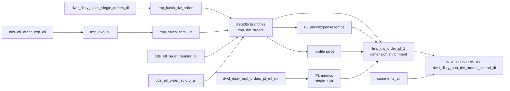

# DWD: Public Orders Extended — Daily (`dwd_disty_pub_dw_orders_extend_di`)

- artifact_type: etl_table
- artifact_id: dw_us.dwd_disty_pub_dw_orders_extend_di
- domain: order
- one_line_purpose: This is the **master extended order analytics table** for single-order sales lines. It assembles a comprehensive, reporting-ready row per order line by combining financial metrics (extended amounts, gross margin, FX pricing, TGM, NGM, OPLGM...
- layer_type: DWD
- source_kind: etl_sql
- evidence_source: source/etl/sql/order/source/etl/flows/public_order_tools/ingest/public_order_dw/script/dwd_disty_pub_dw_orders_extend_di.sql

---

## L1 Data Foundation

### Identity and physical mapping
- **Table:** `dw_us.dwd_disty_pub_dw_orders_extend_di`
- **Layer type:** DWD
- **Canonical / derived:** Derived / ETL-loaded (see L3)
- **Owner team:** not registered in metadata catalog

### Grain, scope, exclusions
- **Grain:** one row per `(order_type, order_no, order_line_no, date_flag)` — a territory-normalized single-order line.
- **Scope:** See L2 business purpose / L3 filters
- **Partition:** `date_flag` — ship date from `dwd_disty_sales_single_orders_di`. - resolved from pipeline (see L4)
- **Natural key:** `order_type`, `order_no`, `order_line_no` within a `date_flag` partition.
- **Exclusions:** Not documented in repository

#### Grain detail (preserved)

- **Grain:** one row per `(order_type, order_no, order_line_no, date_flag)` — a territory-normalized single-order line.
- **Partition:** `date_flag` — ship date from `dwd_disty_sales_single_orders_di`.
- **Natural key:** `order_type`, `order_no`, `order_line_no` within a `date_flag` partition.

---

### Cross-engine presence
| Engine | Present | Canonical FQN | Notes |
|--------|---------|---------------|-------|
| Hive | yes | `dwd_disty_pub_dw_orders_extend_di` | ETL target / intermediate per evidence script |
| Vertica | pending | `dwd_disty_pub_dw_orders_extend_di` | Confirm via hive2vertica flow evidence / MCP |

### Physical schema reference

Pointer block only - full column catalog lives in WKB L1 storage JSON.

| Field | Value |
|-------|-------|
| **Authoritative catalog** | WKB L1 storage seed (not duplicated in this file) |
| **entity_id** | `dw_us.dwd_disty_pub_dw_orders_extend_di` |
| **l1_catalog_seed** | `target/storage/wkb/snapshots/_snapshot_id_template/l1_catalog/{engine}_{schema}_{table}.json` |
| **column_count** | pending (run ddl_seed_writer) |
| **partition_keys** | `date_flag, dwd_disty_sales_single_orders_di` |
| **ddl_source** | pending Bitbucket DDL / Vertica metadata ingest |
| **retrieval** | `python -m tools.wkb.indexing.run_query --query "order dwd_disty_pub_dw_orders_extend_di schema" --intent find_table_schema` |

### Lineage
| Object | Role |
|--------|------|
| `dw_${country_code}.dwd_disty_sales_single_orders_di` | Primary source |
| `dw_${country_code}.dwd_disty_brpt_orders_pl_etl_mi` | BRPT PL metrics |
| `dw_${country_code}.dwd_disty_sales_comp_orders_di` | Kit PL linkage |
| (all other sources listed in Base tables register) | Enrichment dimensions |
| `dw_${country_code}.dwd_disty_pub_dw_orders_extend_di` | **Target** |

---

### Freshness and load path
| Item | Value |
|------|-------|
| Load pattern | See L3 end-to-end / INSERT pattern in evidence script |
| Schedule | Not documented in repository |
| Parameters | `country_code`, `start_date`, `end_date` |


---

## L2 Declarative Knowledge

### Business purpose
This is the **master extended order analytics table** for single-order sales lines. It assembles a comprehensive, reporting-ready row per order line by combining financial metrics (extended amounts, gross margin, FX pricing, TGM, NGM, OPLGM), dimension enrichment (master customer hierarchy, universal vendor, part category/family, location name, from-ref-type description), channel attributes (reseller, sold-to customer, MSO linkage, SCM reseller), pricing metadata (spec cost, price adjustments, exclude-rebate flag, EC version comment), and BRPT profitability metrics (TGM, total OPL, NGM, OPLGM+, segment exclude). It is the primary foundation table for multi-functional order analytics dashboards and downstream reporting pipelines.

---

### Audience and use cases
| Audience | How they benefit |
|----------|-----------------|
| **Finance / FP&A** | `total_sales`, `total_gm`, `gm_amt`, `tgm_amt`, `total_ngm`, `total_opl`, `oplgm_plus_amt` — full P&L metrics per order line. |
| **Pricing teams** | `spec_cost`, `price_adjustments` (adj_amt), `exclude_rebate_flag`, `price_source`, `grid_price`, `msrp`, `fx_msrp`. |
| **Sales / account management** | Master customer hierarchy (`mcust_no`, `master_cust_no/name`), `reseller`, `sold_to_cust_no/name`, `cust_terr`. |
| **Product / vendor management** | Universal vendor, master vendor (`mvend_no/name`), part family/category, MFG part number, `sales_acct`. |
| **Channel / operations** | `system_type`, `from_ref_type_desc`, MSO linkage (`mso_no`, `synnex_po_no`), SCM reseller, `int_ref_type/no`, ship-to address. |
| **FX / multi-currency** | `fx_u_price`, `fx_u_cost`, `fx_u_expense`, `fx_net_price`, `fx_base_cost`, `fx_msrp`, `order_cur`, `fx_currency`. |
| **BI / reporting** | `ec_version`, `eu_company_name`, `segment_exclude`, `cust_po_no`, `sold_to_cust_name`, `loc_name`. |

---

### Fact key resolution
- Natural key: `order_type`, `order_no`, `order_line_no` within a `date_flag` partition.
- FK / label-on attributes: see L3 dimension join patterns and step-by-step logic.
- Negative assertion: do not treat descriptive labels as grain keys unless listed under natural key.

### Time field semantics
- **date_flag / partition columns:** `date_flag` — ship date from `dwd_disty_sales_single_orders_di`.
- Primary reporting filter should use the partition column(s) documented in L1; resolve values via L4.


### Metrics served

| Category | Column | Logical metric | Business reading |
|----------|--------|----------------|------------------|
| Measures | — | — | No measure columns mapped for this table. |

### Metric serving map

**Formula authority:** [`source/contracts/order/metric-index.md`](../../source/contracts/order/metric-index.md)

N/A — no measure columns mapped for this table.

### etl_metrics

No governed logical metrics from `source/contracts/order/metric-index.md` are mapped on this table.

---

### Metric serving map
N/A - not a `*_comb_mtd` / multi-period wide serving table (or map not present in legacy doc).


### Data products and column groups (preserved)

### Identifiers and relationships

- **Order:** `order_type`, `order_no`, `order_line_no`, `int_ref_type`, `int_ref_no`, `mso_no`, `synnex_po_no`, `cust_po_no`, `ext_ref`
- **Customer:** `cust_no`, `cust_name`, `mcust_no`, `mcust_name`, `master_cust_no`, `master_cust_name`, `cust_type`, `cust_type_name`, `cust_terr`, `cust_region`, `sold_to_cust_no`, `sold_to_cust_name`
- **Reseller / channel:** `reseller`, `reseller_cust_no`, `sales_model`, `from_ref_type`, `from_ref_type_desc`, `system_type`
- **Vendor:** `vend_no`, `vend_name`, `mvend_no`, `mvend_name`, `universal_vend_no`, `universal_vend_name`
- **Product:** `sku_no`, `part_no`, `mfg_partno`, `cat_id`, `cat_desc`, `family_id`, `family_desc`, `pm_code`, `prod_code`, `sales_acct`, `inv_type`, `vend_code`, `weight`

### Pricing and cost

- `unit_cost` (= `u_cost`), `unit_price` (= `u_price`), `unit_sum_expense` (= `u_sum_expense`), `base_cost`, `sales_cost`, `grid_price`, `retail_price`, `std_whls_price`
- `spec_cost` — SYNPOPRICE profile value (special cost for the order)
- `adj_amt` (= `price_adjustments`) — ADJ_AMT profile value

### Core derived metrics

| Column | Formula | Business reading |
|--------|---------|-----------------|
| `total_sales` | `ship_qty × (u_price + u_sum_expense)` | Net revenue for the line. |
| `total_gm` | `ship_qty × (u_price − u_cost)` | Gross margin using unit cost (not sales cost). |
| `gm_amt` | `(u_price − nvl(sales_cost, u_cost)) × ship_qty` | Gross margin with sales cost fallback. |
| `gm_rate` | `((u_price − nvl(sales_cost, u_cost)) / nullif(u_price,0)) × 100` | Gross margin % (0 if u_price is 0). |
| `tgm_amt` | Full TGM sum: GM + all BTL/freight/discount/rebate/other PL components from BRPT | Extended total gross margin. |
| `total_ngm` | From BRPT `ngm_amt` | Net gross margin amount. |
| `total_opl` | From BRPT `oplgm_amt` | OPLGM amount. |
| `oplgm_plus_amt` | From BRPT | OPLGM+ amount. |
| `fx_net_price` | `(nvl(fx_u_price,0) + nvl(fx_u_expense,0)) × ship_qty` | FX net revenue for the line. |
| `msrp` | `sc.retail × ship_qty` | Extended MSRP. |
| `fx_msrp` | `sc.retail_fx × ship_qty` | Extended FX MSRP. |

### Extended amount columns

`extend_cost`, `extend_base_cost`, `extend_price`, `extend_exp`, `unit_net_price`, `extend_net_price`, `base_cost_shipment`, `extend_base_cost_shipment`, `base_cost_vpo`, `extend_base_cost_vpo` — see `dwd_disty_common_dw_comp_orders_extend_di.md` for dual base cost documentation (same logic).

### Other key fields

- `exclude_rebate_flag` — `'Y'` if the line has an active EX_REBATE profile, else `'N'`
- `ec_version` — first EX-type order comment (`comment_type='EX'`, `comment_loc='O'`)
- `eu_company_name` — end-user company name from EU common (header level, `order_line_no=0`)
- `segment_exclude` — from BRPT (with fallback to kit BRPT, then defaults to `'Y'`)
- `order_cur` — company order currency from company profile
- `loc_name` — sourcing warehouse/location name

---

### etl_metrics

#### `total_sales`
- **Source:** [metric-index.md](../../source/contracts/order/metric-index.md#total_sales)
- **Business definition:** Net revenue for the line.
```sql
ship_qty × (u_price + u_sum_expense)
```

#### `gm_amt`
- **Source:** [metric-index.md](../../source/contracts/order/metric-index.md#gm_amt)
- **Business definition:** Gross margin with sales cost fallback.
```sql
(u_price − nvl(sales_cost, u_cost)) × ship_qty
```

#### `gm_rate`
- **Source:** [metric-index.md](../../source/contracts/order/metric-index.md#gm_rate)
- **Business definition:** Gross margin % (0 if u_price is 0).
```sql
((u_price − nvl(sales_cost, u_cost)) / nullif(u_price,0)) × 100
```

#### `fx_net_price`
- **Source:** [metric-index.md](../../source/contracts/order/metric-index.md#fx_net_price)
- **Business definition:** FX net revenue for the line.
```sql
(nvl(fx_u_price,0) + nvl(fx_u_expense,0)) × ship_qty
```

#### `exclude_rebate_flag`
- **Source:** [metric-index.md](../../source/contracts/order/metric-index.md#exclude_rebate_flag)
- **Business definition:** 'Y' if EX_REBATE profile is active.
```sql
nvl(order_profile.exclude_rebate_flag, 'N')
```


---

## L3 Procedural Knowledge

### Query and routing rules
**Business filters:** Use partition / date keys from L1 grain for reporting scope.
**Technical predicates (load only):** See Key filters and step-by-step logic below.

### Dimension join patterns
| Dimension FQN | Join keys | Purpose | Evidence |
|---------------|-----------|---------|----------|
| See step-by-step / base tables | See L3 steps | Dimension enrichment | `source/etl/sql/order/source/etl/flows/public_order_tools/ingest/public_order_dw/script/dwd_disty_pub_dw_orders_extend_di.sql` |

### Key filters and ETL business logic
### Step 5 — `tmp_basic_dw_orders`

**Source:** `dwd_disty_sales_single_orders_di`

**Filter:** `terr_status = 'n'`; `date_flag >= date_sub(start_date, dayofmonth(start_date)-1)` (month-start anchor); `date_flag < end_date`

**Derived:** All extended amount columns (extend_cost, extend_base_cost, extend_price, extend_exp, unit_net_price, extend_net_price), dual base cost columns (base_cost_shipment, extend_base_cost_shipment, base_cost_vpo, extend_base_cost_vpo — same VPO/drop-ship logic as comp orders), `gm_amt`, `gm_rate`. Trims `terms`, `ship_method`, `vend_code`, `gv_user_type`.

---

### Step 6 — Three soldto branches → `tmp_dw_orders`

Three temp tables are created for different order type / location combinations, then UNION ALL'd:

| Branch | Filter | `cust_po_no` source | `int_ref_*` source |
|--------|--------|---------------------|-------------------|
| `tmp_dw_orders_soldto_order_type_not_equals_1` | `order_type <> 1` | `ext_ref` only for order_type=125, else NULL | From order header |
| `tmp_dw_orders_soldto_order_type_equals_1` | `order_type = 1 AND from_loc_no <> 98` | `oh.ext_ref` | From order header |
| `tmp_dw_orders_soldto` | `order_type = 1 AND from_loc_no = 98` | `oh.ext_ref` | Navigates: detail → PO header → SO header (2-hop chain) |

**`reseller` resolution:**
- Non-type-1: `coalesce(s.reseller, dw.cust_no)` — SCM reseller or customer number
- Type-1: `nvl(s.reseller, dw.cust_no)` — same but NVL

---

### Step 9 — `temp_dw_orders_pl` / `temp_dw_orders_pl...

### Standard time-filter SQL
```sql
-- relative period filter using resolved partition value (see L4)
SELECT *
FROM dwd_disty_pub_dw_orders_extend_di
WHERE /* partition predicate */ date_flag = '${partition_value}';
```

### End-to-end flow
**Runtime parameters:** `country_code`, `start_date`, `end_date`
**Target table:** `dw_${country_code}.dwd_disty_pub_dw_orders_extend_di`, partitioned by **`date_flag`**.

1. `tmp_exp_all` — non-deleted expense lines.
2. `tmp_sales_scm_list` — SCM reseller orders (specific VAR/GL/expense type criteria).
3. `tmp_mso_no_list` — MSO/Synnex PO linkage for drop-ship type-2→type-1.
4. `tmp_base_order_profile` — profile pivot (ADJ_AMT, SYNPOPRICE, EX_REBATE).
5. `tmp_basic_dw_orders` — base order data with all extended amount calculations.
6. Three soldto branches (`tmp_dw_orders_soldto_order_type_not_equals_1`, `_equals_1`, `tmp_dw_orders_soldto`) → `tmp_dw_orders` (UNION ALL).
7. `temp_company_profile` — company currency.
8. `tmp_orders_fx_u_price` / `tmp_orders_fx_u_expense` — FX price/cost and USD expense per line.
9. `tmp_order_profile_relevant` — deduped profile data.
10. `temp_dw_orders_pl` / `temp_dw_orders_pl_kit` — BRPT PL metrics for single and kit orders.
11. `temp_order_eu_common` — EU company name.
12. `tmp_dw_order_pl_1` — full dimension enrichment join.
13. `comments_all` — EC version comment.
14. **INSERT OVERWRITE** final assembly.



---


#### High-level stages (preserved)

| Stage | Business meaning |
|-------|-----------------|
| **Expense base** | Collects non-deleted order expense lines into `tmp_exp_all` for reuse in SCM detection and FX expense calculations. |
| **SCM reseller detection** | Identifies orders associated with SCM project resellers (specific VAR numbers and GL accounts) into `tmp_sales_scm_list`. |
| **MSO / PO linkage** | Resolves MSO number and Synnex PO number for drop-ship orders (type 2 → type 1 chain). |
| **Order profile pivot** | Pivots `ADJ_AMT`, `SYNPOPRICE`, and `EX_REBATE` profile types per order line into `price_adjustments`, `spec_cost`, and `exclude_rebate_flag`. |
| **Base order data** | Reads territory-normalized single orders for the period (month-start anchor to end_date), computing all extended amount and dual base cost columns. |
| **Order type branching** | Three separate temp tables handle the soldto/int_ref/cust_po_no resolution differently based on `order_type` and `from_loc_no`: non-type-1, type-1 non-drop-ship, and type-1 drop-ship (navigates PO chain). |
| **FX enrichment** | Builds FX unit price/cost (from order detail date table) and FX unit expense (DP-type expenses in USD). |
| **BRPT PL enrichment** | Joins BRPT profitability data for single orders and (via kit_line_no) for composite orders — provides total NGM, total OPL, TGM, OPLGM+, and segment_exclude. |
| **Dimension enrichment** | Joins master customer, sold-to customer, part (category, family, universal vendor, MFG part no, weight), vendor segment (master vendor), from-ref-type description, system_type, SKU cost (MSRP, FX MSRP, FX base cost), product code (sales account), and location name. |
| **EC comment** | Reads the first EX-type order comment per order for the `ec_version` field. |
| **Final INSERT** | Assembles all enriched fields; applies company currency, FX metrics, MSO/PO numbers, profile data, and EC version; cleans `ext_ref` and `cust_po_no` with REGEXP_REPLACE. |

**Parameters:** `country_code`, `start_date`, `end_date`

---


### Base tables register
| Object | Role in this job |
|--------|-----------------|
| `dw_${country_code}.dwd_disty_sales_single_orders_di` | **Primary source.** Territory-normalized single order lines. Filtered to `terr_status='n'` and date window anchored to month start. |
| `ods_${country_code}.ods_etl_order_exp_all` | Expense lines — non-deleted; used for SCM detection and FX expense. |
| `ods_${country_code}.ods_cis_corp_project_info` | SCM project info — `reseller`, `var_no` for SCM reseller detection. |
| `ods_${country_code}.ods_etl_order_header_all` | Order header — `int_ref_type/no`, ship-to address, `fx_currency`, `ext_ref`, `entry_datetime`; also used for MSO/PO chain. |
| `ods_${country_code}.ods_etl_order_soldto_all` | Sold-to info — `sales_model`, `reseller_cust_no`, `to_acct_no` (sold_to_cust_no). |
| `ods_${country_code}.ods_etl_order_detail_all` | Order line detail — kit/PO chain navigation for drop-ship type-1. |
| `ods_${country_code}.ods_etl_order_profile_all` | Order profiles — `ADJ_AMT`, `SYNPOPRICE`, `EX_REBATE` for price and rebate metadata. |
| `ods_${country_code}.ods_etl_order_detail_date_all` | FX order detail — `foreign_price`, `foreign_cost` per line. |
| `dw_${country_code}.dwd_disty_brpt_orders_pl_etl_mi` | BRPT PL table — `ngm_amt`, `oplgm_amt`, full TGM components, `oplgm_plus_amt`, `segment_exclude`. |
| `dw_${country_code}.dwd_disty_sales_comp_orders_di` | Composite orders — used to join BRPT kit PL data via `kit_line_no`. |
| `ods_${country_code}.ods_etl_order_eu_common_all` | EU common — `eu_company_name` at header level (`order_line_no=0`). |
| `ods_${country_code}.ods_etl_order_comments_all` | Order comments — first EX-type comment per order for `ec_version`. |
| `dim_${country_code}.dim_pub_customer_info` | Customer dimension — master customer, cust_type_name; joined twice (once for cust_no, once for sold_to_cust_no). |
| `dim_${country_code}.dim_pub_part_info` | Part dimension — category, family, universal vendor, MFG part no, weight. |
| `dim_${country_code}.dim_pub_vendor_segment` | Vendor segment — master vendor no/name. |
| `ods_${country_code}.ods_cis_corp_from_ref_type` | From-ref-type — description and system_type. |
| `ods_${country_code}.ods_cis_corp_sku_cost` | SKU cost — `retail` (MSRP), `retail_fx`, `base_cost_fx`; joined by `sku_no + company_no`. |
| `ods_${country_code}.ods_cis_corp_prod_code` | Product code — `sales_acct`. |
| `ods_${country_code}.ods_cis_corp_location_info` | Location — `loc_name`. |
| `ods_${country_code}.ods_cis_corp_company_profile` | Company profile — `order_cur` (company currency). |
| `ods_${country_code}.ods_cis_corp_order_type` | Order type — joined (all columns available but none explicitly selected in final output). |

---

### Step-by-step logic
### Step 5 — `tmp_basic_dw_orders`

**Source:** `dwd_disty_sales_single_orders_di`

**Filter:** `terr_status = 'n'`; `date_flag >= date_sub(start_date, dayofmonth(start_date)-1)` (month-start anchor); `date_flag < end_date`

**Derived:** All extended amount columns (extend_cost, extend_base_cost, extend_price, extend_exp, unit_net_price, extend_net_price), dual base cost columns (base_cost_shipment, extend_base_cost_shipment, base_cost_vpo, extend_base_cost_vpo — same VPO/drop-ship logic as comp orders), `gm_amt`, `gm_rate`. Trims `terms`, `ship_method`, `vend_code`, `gv_user_type`.

---

### Step 6 — Three soldto branches → `tmp_dw_orders`

Three temp tables are created for different order type / location combinations, then UNION ALL'd:

| Branch | Filter | `cust_po_no` source | `int_ref_*` source |
|--------|--------|---------------------|-------------------|
| `tmp_dw_orders_soldto_order_type_not_equals_1` | `order_type <> 1` | `ext_ref` only for order_type=125, else NULL | From order header |
| `tmp_dw_orders_soldto_order_type_equals_1` | `order_type = 1 AND from_loc_no <> 98` | `oh.ext_ref` | From order header |
| `tmp_dw_orders_soldto` | `order_type = 1 AND from_loc_no = 98` | `oh.ext_ref` | Navigates: detail → PO header → SO header (2-hop chain) |

**`reseller` resolution:**
- Non-type-1: `coalesce(s.reseller, dw.cust_no)` — SCM reseller or customer number
- Type-1: `nvl(s.reseller, dw.cust_no)` — same but NVL

---

### Step 9 — `temp_dw_orders_pl` / `temp_dw_orders_pl_kit`

**BRPT PL for single orders:** Joined on `(order_no, order_type, order_line_no, date_flag)`. TGM computed as: `GM + nvl(btl,0) + nvl(trans_btl,0) + nvl(one_time_btl,0) + nvl(hbtl,0) + nvl(scm_profit_adj,0) + nvl(btl_backout,0) + nvl(pdt,0) + nvl(inv_reserve,0) + nvl(mof,0) + nvl(marketing,0) + nvl(frt_out_load,0) + nvl(frt_out_exp,0) + nvl(frt_ob_recovery,0) + nvl(frt_ib_recovery,0) + nvl(cust_pmt_disc,0) + nvl(cust_rebate,0) + nvl(cvr_rm,0) + nvl(ap_adj,0) + nvl(others,0) + nvl(mfg_oh,0)`.

**BRPT PL for kit orders (`temp_dw_orders_pl_kit`):** INNER JOINs BRPT to `dwd_disty_sales_comp_orders_di` (terr_status='n') to get `kit_line_no`; sums TGM by kit_line_no and date_flag. This allows kit header lines in single orders to inherit BRPT metrics from their composite order lines.

**`segment_exclude` fallback:** `nvl(nvl(pl.segment_exclude, pl_kit.segment_exclude), 'Y')` — defaults to 'Y' when no BRPT data exists.

---

### Final INSERT

**Key derived columns at INSERT time:**

| Column | Formula | Plain language |
|--------|---------|----------------|
| `total_sales` | `ship_qty × (u_price + u_sum_expense)` | Net revenue. |
| `total_gm` | `ship_qty × (u_price − u_cost)` | Gross margin using raw unit cost. |
| `fx_net_price` | `(nvl(fx_u_price,0) + nvl(fx_u_expense,0)) × ship_qty` | FX net revenue. |
| `exclude_rebate_flag` | `nvl(order_profile.exclude_rebate_flag, 'N')` | 'Y' if EX_REBATE profile is active. |
| `ext_ref` / `cust_po_no` | `trim(REGEXP_REPLACE(...))` — removes escaped quotes | Cleaned external reference and customer PO number. |

---

### Relationship map (embedded)

| from_fqn | to_fqn | cardinality | join_keys | provenance |
|----------|--------|-------------|-----------|------------|
| `ods_${country_code}.ods_cis_corp_project_info` | `tmp_exp_all` | many:1 | `a.proj_no` = `b.project_no` | etl_sql (`source/etl/sql/order/public_order_scripts/public_order_dw/script/dwd_disty_pub_dw_orders_extend_di.sql:23`) |
| `tmp_exp_all` | `ods_${country_code}.ods_etl_order_header_all` | many:1 | `b.order_type` = `h.order_type`; `b.order_no` = `h.order_no` | etl_sql (`source/etl/sql/order/public_order_scripts/public_order_dw/script/dwd_disty_pub_dw_orders_extend_di.sql:24`) |
| `ods_${country_code}.ods_etl_order_header_all` | `ods_${country_code}.ods_etl_order_header_all` | many:1 | `po.order_no` = `sso.int_ref_no`; `po.order_type` = `sso.int_ref_type` | etl_sql (`source/etl/sql/order/public_order_scripts/public_order_dw/script/dwd_disty_pub_dw_orders_extend_di.sql:45`) |
| `dw_${country_code}.dwd_disty_sales_single_orders_di` | `ods_${country_code}.ods_etl_order_soldto_all` | many:1 (LEFT) | `dw.order_type` = `hs.order_type`; `dw.order_no` = `hs.order_no` | etl_sql (`source/etl/sql/order/public_order_scripts/public_order_dw/script/dwd_disty_pub_dw_orders_extend_di.sql:220`) |
| `dw_${country_code}.dwd_disty_sales_single_orders_di` | `tmp_sales_scm_list` | many:1 (LEFT) | `dw.order_type` = `s.order_type`; `dw.order_no` = `s.order_no` | etl_sql (`source/etl/sql/order/public_order_scripts/public_order_dw/script/dwd_disty_pub_dw_orders_extend_di.sql:222`) |
| `dw_${country_code}.dwd_disty_sales_single_orders_di` | `ods_${country_code}.ods_etl_order_header_all` | many:1 (LEFT) | `dw.order_type` = `oh.order_type`; `dw.order_no` = `oh.order_no` | etl_sql (`source/etl/sql/order/public_order_scripts/public_order_dw/script/dwd_disty_pub_dw_orders_extend_di.sql:224`) |
| `dw_${country_code}.dwd_disty_sales_single_orders_di` | `ods_${country_code}.ods_etl_order_detail_all` | many:1 (LEFT) | `dw.order_type` = `od.order_type`; `dw.order_no` = `od.order_no`; `dw.order_line_no` = `od.order_line_no` | etl_sql (`source/etl/sql/order/public_order_scripts/public_order_dw/script/dwd_disty_pub_dw_orders_extend_di.sql:394`) |
| `dw_${country_code}.dwd_disty_sales_comp_orders_di` | `ods_${country_code}.ods_etl_order_header_all` | many:1 (LEFT) | `po.order_type` = `od.int_ref_type`; `po.order_no` = `od.int_ref_no` | etl_sql (`source/etl/sql/order/public_order_scripts/public_order_dw/script/dwd_disty_pub_dw_orders_extend_di.sql:397`) |
| `ods_${country_code}.ods_etl_order_header_all` | `ods_${country_code}.ods_etl_order_header_all` | many:1 (LEFT) | `so.order_type` = `po.int_ref_type`; `so.order_no` = `po.int_ref_no` | etl_sql (`source/etl/sql/order/public_order_scripts/public_order_dw/script/dwd_disty_pub_dw_orders_extend_di.sql:399`) |
| `ods_${country_code}.ods_etl_order_exp_all` | `ods_${country_code}.ods_etl_order_detail_date_all` | many:1 | `d.order_type` = `t.order_type`; `d.order_no` = `t.order_no`; `d.order_line_no` = `t.order_line_no` | etl_sql (`source/etl/sql/order/public_order_scripts/public_order_dw/script/dwd_disty_pub_dw_orders_extend_di.sql:428`) |
| `t` | `tmp_exp_all` | many:1 | `d.order_type` = `t.order_type`; `d.order_no` = `t.order_no`; `d.order_line_no` = `t.order_line_no` | etl_sql (`source/etl/sql/order/public_order_scripts/public_order_dw/script/dwd_disty_pub_dw_orders_extend_di.sql:435`) |
| `dw_${country_code}.dwd_disty_sales_single_orders_di` | `tmp_base_order_profile` | many:1 | `dw.order_no` = `op.order_no`; `dw.order_type` = `op.order_type`; `dw.order_line_no` = `op.order_line_no` | etl_sql (`source/etl/sql/order/public_order_scripts/public_order_dw/script/dwd_disty_pub_dw_orders_extend_di.sql:459`) |
| `temp_dw_orders_pl` | `dw_${country_code}.dwd_disty_sales_comp_orders_di` | many:1 | `pl.date_flag` = `od.date_flag`; `pl.order_no` = `od.order_no`; `pl.order_type` = `od.order_type`; `pl.order_line_no` = `od.order_line_no` | etl_sql (`source/etl/sql/order/public_order_scripts/public_order_dw/script/dwd_disty_pub_dw_orders_extend_di.sql:518`) |
| `dw_${country_code}.dwd_disty_sales_single_orders_di` | `temp_dw_orders_pl` | many:1 (LEFT) | `dw.order_no` = `pl.order_no`; `dw.order_type` = `pl.order_type`; `dw.order_line_no` = `pl.order_line_no`; `dw.date_flag` = `pl.date_flag` | etl_sql (`source/etl/sql/order/public_order_scripts/public_order_dw/script/dwd_disty_pub_dw_orders_extend_di.sql:568`) |
| `dw_${country_code}.dwd_disty_sales_single_orders_di` | `temp_dw_orders_pl_kit` | many:1 (LEFT) | `dw.order_no` = `pl_kit.order_no`; `dw.order_type` = `pl_kit.order_type`; `dw.order_line_no` = `pl_kit.kit_line_no`; `dw.date_flag` = `pl_kit.date_flag` | etl_sql (`source/etl/sql/order/public_order_scripts/public_order_dw/script/dwd_disty_pub_dw_orders_extend_di.sql:573`) |
| `dw_${country_code}.dwd_disty_sales_single_orders_di` | `dim_${country_code}.dim_pub_customer_info` | many:1 (LEFT) | `dw.cust_no` = `customer.cust_no` | etl_sql (`source/etl/sql/order/public_order_scripts/public_order_dw/script/dwd_disty_pub_dw_orders_extend_di.sql:578`) |
| `dw_${country_code}.dwd_disty_sales_single_orders_di` | `dim_${country_code}.dim_pub_customer_info` | many:1 (LEFT) | `dw.sold_to_cust_no` = `cus.cust_no` | etl_sql (`source/etl/sql/order/public_order_scripts/public_order_dw/script/dwd_disty_pub_dw_orders_extend_di.sql:580`) |
| `dw_${country_code}.dwd_disty_sales_single_orders_di` | `dim_${country_code}.dim_pub_part_info` | many:1 (LEFT) | `dw.sku_no` = `part.sku_no` | etl_sql (`source/etl/sql/order/public_order_scripts/public_order_dw/script/dwd_disty_pub_dw_orders_extend_di.sql:582`) |
| `dw_${country_code}.dwd_disty_sales_single_orders_di` | `ods_${country_code}.ods_cis_corp_order_type` | many:1 (LEFT) | `ot.order_type` = `dw.order_type` | etl_sql (`source/etl/sql/order/public_order_scripts/public_order_dw/script/dwd_disty_pub_dw_orders_extend_di.sql:584`) |
| `dw_${country_code}.dwd_disty_sales_single_orders_di` | `ods_${country_code}.ods_cis_corp_from_ref_type` | many:1 (LEFT) | `frt.from_ref_type` = `dw.from_ref_type` | etl_sql (`source/etl/sql/order/public_order_scripts/public_order_dw/script/dwd_disty_pub_dw_orders_extend_di.sql:585`) |
| `dw_${country_code}.dwd_disty_sales_single_orders_di` | `dim_${country_code}.dim_pub_vendor_segment` | many:1 (LEFT) | `vs.vend_no` = `dw.vend_no` | etl_sql (`source/etl/sql/order/public_order_scripts/public_order_dw/script/dwd_disty_pub_dw_orders_extend_di.sql:586`) |
| `dw_${country_code}.dwd_disty_sales_single_orders_di` | `ods_${country_code}.ods_cis_corp_sku_cost` | many:1 (LEFT) | `sc.sku_no` = `dw.sku_no`; `sc.company_no` = `dw.company_no` | etl_sql (`source/etl/sql/order/public_order_scripts/public_order_dw/script/dwd_disty_pub_dw_orders_extend_di.sql:587`) |
| `dw_${country_code}.dwd_disty_sales_single_orders_di` | `ods_${country_code}.ods_cis_corp_prod_code` | many:1 (LEFT) | `pc.prod_code` = `dw.prod_code` | etl_sql (`source/etl/sql/order/public_order_scripts/public_order_dw/script/dwd_disty_pub_dw_orders_extend_di.sql:588`) |
| `dw_${country_code}.dwd_disty_sales_single_orders_di` | `ods_${country_code}.ods_cis_corp_location_info` | many:1 (LEFT) | `dw.from_loc_no` = `loc.loc_no` | etl_sql (`source/etl/sql/order/public_order_scripts/public_order_dw/script/dwd_disty_pub_dw_orders_extend_di.sql:589`) |
| `dw_${country_code}.dwd_disty_sales_single_orders_di` | `temp_order_eu_common` | many:1 (LEFT) | `dw.order_no` = `tec.order_no`; `dw.order_type` = `tec.order_type` | etl_sql (`source/etl/sql/order/public_order_scripts/public_order_dw/script/dwd_disty_pub_dw_orders_extend_di.sql:591`) |
| `dw_${country_code}.dwd_disty_sales_single_orders_di` | `temp_company_profile` | many:1 (LEFT) | `tcp.company_no` = `dw.company_no` | etl_sql (`source/etl/sql/order/public_order_scripts/public_order_dw/script/dwd_disty_pub_dw_orders_extend_di.sql:732`) |
| `dw_${country_code}.dwd_disty_sales_single_orders_di` | `tmp_orders_fx_u_price` | many:1 (LEFT) | `dw.order_no` = `fup.order_no`; `dw.order_type` = `fup.order_type`; `dw.order_line_no` = `fup.order_line_no` | etl_sql (`source/etl/sql/order/public_order_scripts/public_order_dw/script/dwd_disty_pub_dw_orders_extend_di.sql:733`) |
| `dw_${country_code}.dwd_disty_sales_single_orders_di` | `tmp_orders_fx_u_expense` | many:1 (LEFT) | `dw.order_no` = `fue.order_no`; `dw.order_type` = `fue.order_type`; `dw.order_line_no` = `fue.order_line_no` | etl_sql (`source/etl/sql/order/public_order_scripts/public_order_dw/script/dwd_disty_pub_dw_orders_extend_di.sql:736`) |
| `dw_${country_code}.dwd_disty_sales_single_orders_di` | `tmp_mso_no_list` | many:1 (LEFT) | `dw.order_no` = `sso.order_no`; `dw.order_type` = `sso.order_type` | etl_sql (`source/etl/sql/order/public_order_scripts/public_order_dw/script/dwd_disty_pub_dw_orders_extend_di.sql:739`) |
| `dw_${country_code}.dwd_disty_sales_single_orders_di` | `comments_all` | many:1 (LEFT) | `dw.order_no` = `cc.order_no`; `dw.order_type` = `cc.order_type` | etl_sql (`source/etl/sql/order/public_order_scripts/public_order_dw/script/dwd_disty_pub_dw_orders_extend_di.sql:742`) |
| `dw_${country_code}.dwd_disty_sales_single_orders_di` | `tmp_order_profile_relevant` | many:1 (LEFT) | `dw.order_no` = `order_profile.order_no`; `dw.order_type` = `order_profile.order_type`; `dw.order_line_no` = `order_profile.order_line_no` | etl_sql (`source/etl/sql/order/public_order_scripts/public_order_dw/script/dwd_disty_pub_dw_orders_extend_di.sql:745`) |

### Special logic (embedded)

Not documented in repository

### Column / field derivations (from ETL SQL)

| target_column | expression_sql | upstream_columns | upstream_tables | transform_kind | evidence |
|---------------|----------------|------------------|-----------------|----------------|----------|
| `order_type` | `dw.order_type` | `order_type` | `tmp_dw_order_pl_1`, `temp_company_profile`, `tmp_orders_fx_u_price`, `tmp_orders_fx_u_expense`, `tmp_mso_no_list`, `comments_all`, `tmp_order_profile_relevant` | passthrough | `source/etl/sql/order/public_order_scripts/public_order_dw/script/dwd_disty_pub_dw_orders_extend_di.sql:75` |
| `order_no` | `dw.order_no` | `order_no` | `tmp_dw_order_pl_1`, `temp_company_profile`, `tmp_orders_fx_u_price`, `tmp_orders_fx_u_expense`, `tmp_mso_no_list`, `comments_all`, `tmp_order_profile_relevant` | passthrough | `source/etl/sql/order/public_order_scripts/public_order_dw/script/dwd_disty_pub_dw_orders_extend_di.sql:76` |
| `order_line_no` | `dw.order_line_no` | `order_line_no` | `tmp_dw_order_pl_1`, `temp_company_profile`, `tmp_orders_fx_u_price`, `tmp_orders_fx_u_expense`, `tmp_mso_no_list`, `comments_all`, `tmp_order_profile_relevant` | passthrough | `source/etl/sql/order/public_order_scripts/public_order_dw/script/dwd_disty_pub_dw_orders_extend_di.sql:77` |
| `ship_date` | `dw.ship_date` | `ship_date` | `tmp_dw_order_pl_1`, `temp_company_profile`, `tmp_orders_fx_u_price`, `tmp_orders_fx_u_expense`, `tmp_mso_no_list`, `comments_all`, `tmp_order_profile_relevant` | passthrough | `source/etl/sql/order/public_order_scripts/public_order_dw/script/dwd_disty_pub_dw_orders_extend_di.sql:78` |
| `terms` | `dw.terms` | `terms` | `tmp_dw_order_pl_1`, `temp_company_profile`, `tmp_orders_fx_u_price`, `tmp_orders_fx_u_expense`, `tmp_mso_no_list`, `comments_all`, `tmp_order_profile_relevant` | passthrough | `source/etl/sql/order/public_order_scripts/public_order_dw/script/dwd_disty_pub_dw_orders_extend_di.sql:79` |
| `ship_method` | `dw.ship_method` | `ship_method` | `tmp_dw_order_pl_1`, `temp_company_profile`, `tmp_orders_fx_u_price`, `tmp_orders_fx_u_expense`, `tmp_mso_no_list`, `comments_all`, `tmp_order_profile_relevant` | passthrough | `source/etl/sql/order/public_order_scripts/public_order_dw/script/dwd_disty_pub_dw_orders_extend_di.sql:80` |
| `from_loc_no` | `dw.from_loc_no` | `from_loc_no` | `tmp_dw_order_pl_1`, `temp_company_profile`, `tmp_orders_fx_u_price`, `tmp_orders_fx_u_expense`, `tmp_mso_no_list`, `comments_all`, `tmp_order_profile_relevant` | passthrough | `source/etl/sql/order/public_order_scripts/public_order_dw/script/dwd_disty_pub_dw_orders_extend_di.sql:81` |
| `to_zip` | `dw.to_zip` | `to_zip` | `tmp_dw_order_pl_1`, `temp_company_profile`, `tmp_orders_fx_u_price`, `tmp_orders_fx_u_expense`, `tmp_mso_no_list`, `comments_all`, `tmp_order_profile_relevant` | passthrough | `source/etl/sql/order/public_order_scripts/public_order_dw/script/dwd_disty_pub_dw_orders_extend_di.sql:82` |
| `mcust_no` | `dw.mcust_no` | `mcust_no` | `tmp_dw_order_pl_1`, `temp_company_profile`, `tmp_orders_fx_u_price`, `tmp_orders_fx_u_expense`, `tmp_mso_no_list`, `comments_all`, `tmp_order_profile_relevant` | passthrough | `source/etl/sql/order/public_order_scripts/public_order_dw/script/dwd_disty_pub_dw_orders_extend_di.sql:613` |
| `mcust_name` | `dw.mcust_name` | `mcust_name` | `tmp_dw_order_pl_1`, `temp_company_profile`, `tmp_orders_fx_u_price`, `tmp_orders_fx_u_expense`, `tmp_mso_no_list`, `comments_all`, `tmp_order_profile_relevant` | passthrough | `source/etl/sql/order/public_order_scripts/public_order_dw/script/dwd_disty_pub_dw_orders_extend_di.sql:614` |
| `cust_no` | `dw.cust_no` | `cust_no` | `tmp_dw_order_pl_1`, `temp_company_profile`, `tmp_orders_fx_u_price`, `tmp_orders_fx_u_expense`, `tmp_mso_no_list`, `comments_all`, `tmp_order_profile_relevant` | passthrough | `source/etl/sql/order/public_order_scripts/public_order_dw/script/dwd_disty_pub_dw_orders_extend_di.sql:83` |
| `cust_name` | `dw.cust_name` | `cust_name` | `tmp_dw_order_pl_1`, `temp_company_profile`, `tmp_orders_fx_u_price`, `tmp_orders_fx_u_expense`, `tmp_mso_no_list`, `comments_all`, `tmp_order_profile_relevant` | passthrough | `source/etl/sql/order/public_order_scripts/public_order_dw/script/dwd_disty_pub_dw_orders_extend_di.sql:84` |
| `cust_loc_no` | `dw.cust_loc_no` | `cust_loc_no` | `tmp_dw_order_pl_1`, `temp_company_profile`, `tmp_orders_fx_u_price`, `tmp_orders_fx_u_expense`, `tmp_mso_no_list`, `comments_all`, `tmp_order_profile_relevant` | passthrough | `source/etl/sql/order/public_order_scripts/public_order_dw/script/dwd_disty_pub_dw_orders_extend_di.sql:85` |
| `cust_type` | `dw.cust_type` | `cust_type` | `tmp_dw_order_pl_1`, `temp_company_profile`, `tmp_orders_fx_u_price`, `tmp_orders_fx_u_expense`, `tmp_mso_no_list`, `comments_all`, `tmp_order_profile_relevant` | passthrough | `source/etl/sql/order/public_order_scripts/public_order_dw/script/dwd_disty_pub_dw_orders_extend_di.sql:86` |
| `cust_type_name` | `dw.cust_type_name` | `cust_type_name` | `tmp_dw_order_pl_1`, `temp_company_profile`, `tmp_orders_fx_u_price`, `tmp_orders_fx_u_expense`, `tmp_mso_no_list`, `comments_all`, `tmp_order_profile_relevant` | passthrough | `source/etl/sql/order/public_order_scripts/public_order_dw/script/dwd_disty_pub_dw_orders_extend_di.sql:619` |
| `cust_region` | `dw.cust_region` | `cust_region` | `tmp_dw_order_pl_1`, `temp_company_profile`, `tmp_orders_fx_u_price`, `tmp_orders_fx_u_expense`, `tmp_mso_no_list`, `comments_all`, `tmp_order_profile_relevant` | passthrough | `source/etl/sql/order/public_order_scripts/public_order_dw/script/dwd_disty_pub_dw_orders_extend_di.sql:87` |
| `cust_terr` | `dw.cust_terr` | `cust_terr` | `tmp_dw_order_pl_1`, `temp_company_profile`, `tmp_orders_fx_u_price`, `tmp_orders_fx_u_expense`, `tmp_mso_no_list`, `comments_all`, `tmp_order_profile_relevant` | passthrough | `source/etl/sql/order/public_order_scripts/public_order_dw/script/dwd_disty_pub_dw_orders_extend_di.sql:88` |
| `cust_zip` | `dw.cust_zip` | `cust_zip` | `tmp_dw_order_pl_1`, `temp_company_profile`, `tmp_orders_fx_u_price`, `tmp_orders_fx_u_expense`, `tmp_mso_no_list`, `comments_all`, `tmp_order_profile_relevant` | passthrough | `source/etl/sql/order/public_order_scripts/public_order_dw/script/dwd_disty_pub_dw_orders_extend_di.sql:89` |
| `mvend_no` | `dw.mvend_no` | `mvend_no` | `tmp_dw_order_pl_1`, `temp_company_profile`, `tmp_orders_fx_u_price`, `tmp_orders_fx_u_expense`, `tmp_mso_no_list`, `comments_all`, `tmp_order_profile_relevant` | passthrough | `source/etl/sql/order/public_order_scripts/public_order_dw/script/dwd_disty_pub_dw_orders_extend_di.sql:623` |
| `mvend_name` | `dw.mvend_name` | `mvend_name` | `tmp_dw_order_pl_1`, `temp_company_profile`, `tmp_orders_fx_u_price`, `tmp_orders_fx_u_expense`, `tmp_mso_no_list`, `comments_all`, `tmp_order_profile_relevant` | passthrough | `source/etl/sql/order/public_order_scripts/public_order_dw/script/dwd_disty_pub_dw_orders_extend_di.sql:624` |
| `vend_no` | `dw.vend_no` | `vend_no` | `tmp_dw_order_pl_1`, `temp_company_profile`, `tmp_orders_fx_u_price`, `tmp_orders_fx_u_expense`, `tmp_mso_no_list`, `comments_all`, `tmp_order_profile_relevant` | passthrough | `source/etl/sql/order/public_order_scripts/public_order_dw/script/dwd_disty_pub_dw_orders_extend_di.sql:90` |
| `vend_name` | `dw.vend_name` | `vend_name` | `tmp_dw_order_pl_1`, `temp_company_profile`, `tmp_orders_fx_u_price`, `tmp_orders_fx_u_expense`, `tmp_mso_no_list`, `comments_all`, `tmp_order_profile_relevant` | passthrough | `source/etl/sql/order/public_order_scripts/public_order_dw/script/dwd_disty_pub_dw_orders_extend_di.sql:91` |
| `sku_no` | `dw.sku_no` | `sku_no` | `tmp_dw_order_pl_1`, `temp_company_profile`, `tmp_orders_fx_u_price`, `tmp_orders_fx_u_expense`, `tmp_mso_no_list`, `comments_all`, `tmp_order_profile_relevant` | passthrough | `source/etl/sql/order/public_order_scripts/public_order_dw/script/dwd_disty_pub_dw_orders_extend_di.sql:92` |
| `part_no` | `dw.part_no` | `part_no` | `tmp_dw_order_pl_1`, `temp_company_profile`, `tmp_orders_fx_u_price`, `tmp_orders_fx_u_expense`, `tmp_mso_no_list`, `comments_all`, `tmp_order_profile_relevant` | passthrough | `source/etl/sql/order/public_order_scripts/public_order_dw/script/dwd_disty_pub_dw_orders_extend_di.sql:93` |
| `cat_id` | `dw.cat_id` | `cat_id` | `tmp_dw_order_pl_1`, `temp_company_profile`, `tmp_orders_fx_u_price`, `tmp_orders_fx_u_expense`, `tmp_mso_no_list`, `comments_all`, `tmp_order_profile_relevant` | passthrough | `source/etl/sql/order/public_order_scripts/public_order_dw/script/dwd_disty_pub_dw_orders_extend_di.sql:629` |
| `cat_desc` | `dw.cat_desc` | `cat_desc` | `tmp_dw_order_pl_1`, `temp_company_profile`, `tmp_orders_fx_u_price`, `tmp_orders_fx_u_expense`, `tmp_mso_no_list`, `comments_all`, `tmp_order_profile_relevant` | passthrough | `source/etl/sql/order/public_order_scripts/public_order_dw/script/dwd_disty_pub_dw_orders_extend_di.sql:630` |
| `family_id` | `dw.family_id` | `family_id` | `tmp_dw_order_pl_1`, `temp_company_profile`, `tmp_orders_fx_u_price`, `tmp_orders_fx_u_expense`, `tmp_mso_no_list`, `comments_all`, `tmp_order_profile_relevant` | passthrough | `source/etl/sql/order/public_order_scripts/public_order_dw/script/dwd_disty_pub_dw_orders_extend_di.sql:631` |
| `family_desc` | `dw.family_desc` | `family_desc` | `tmp_dw_order_pl_1`, `temp_company_profile`, `tmp_orders_fx_u_price`, `tmp_orders_fx_u_expense`, `tmp_mso_no_list`, `comments_all`, `tmp_order_profile_relevant` | passthrough | `source/etl/sql/order/public_order_scripts/public_order_dw/script/dwd_disty_pub_dw_orders_extend_di.sql:632` |
| `inv_type` | `dw.inv_type` | `inv_type` | `tmp_dw_order_pl_1`, `temp_company_profile`, `tmp_orders_fx_u_price`, `tmp_orders_fx_u_expense`, `tmp_mso_no_list`, `comments_all`, `tmp_order_profile_relevant` | passthrough | `source/etl/sql/order/public_order_scripts/public_order_dw/script/dwd_disty_pub_dw_orders_extend_di.sql:94` |
| `pm_code` | `dw.pm_code` | `pm_code` | `tmp_dw_order_pl_1`, `temp_company_profile`, `tmp_orders_fx_u_price`, `tmp_orders_fx_u_expense`, `tmp_mso_no_list`, `comments_all`, `tmp_order_profile_relevant` | passthrough | `source/etl/sql/order/public_order_scripts/public_order_dw/script/dwd_disty_pub_dw_orders_extend_di.sql:95` |
| `vend_code` | `dw.vend_code` | `vend_code` | `tmp_dw_order_pl_1`, `temp_company_profile`, `tmp_orders_fx_u_price`, `tmp_orders_fx_u_expense`, `tmp_mso_no_list`, `comments_all`, `tmp_order_profile_relevant` | passthrough | `source/etl/sql/order/public_order_scripts/public_order_dw/script/dwd_disty_pub_dw_orders_extend_di.sql:96` |
| `ship_qty` | `dw.ship_qty` | `ship_qty` | `tmp_dw_order_pl_1`, `temp_company_profile`, `tmp_orders_fx_u_price`, `tmp_orders_fx_u_expense`, `tmp_mso_no_list`, `comments_all`, `tmp_order_profile_relevant` | passthrough | `source/etl/sql/order/public_order_scripts/public_order_dw/script/dwd_disty_pub_dw_orders_extend_di.sql:97` |
| `unit_cost` | `dw.u_cost` | `u_cost` | `tmp_dw_order_pl_1`, `temp_company_profile`, `tmp_orders_fx_u_price`, `tmp_orders_fx_u_expense`, `tmp_mso_no_list`, `comments_all`, `tmp_order_profile_relevant` | rename | `source/etl/sql/order/public_order_scripts/public_order_dw/script/dwd_disty_pub_dw_orders_extend_di.sql:98` |
| `unit_price` | `dw.u_price` | `u_price` | `tmp_dw_order_pl_1`, `temp_company_profile`, `tmp_orders_fx_u_price`, `tmp_orders_fx_u_expense`, `tmp_mso_no_list`, `comments_all`, `tmp_order_profile_relevant` | rename | `source/etl/sql/order/public_order_scripts/public_order_dw/script/dwd_disty_pub_dw_orders_extend_di.sql:99` |
| `unit_sum_expense` | `dw.u_sum_expense` | `u_sum_expense` | `tmp_dw_order_pl_1`, `temp_company_profile`, `tmp_orders_fx_u_price`, `tmp_orders_fx_u_expense`, `tmp_mso_no_list`, `comments_all`, `tmp_order_profile_relevant` | rename | `source/etl/sql/order/public_order_scripts/public_order_dw/script/dwd_disty_pub_dw_orders_extend_di.sql:100` |
| `total_sales` | `dw.ship_qty*(dw.u_price + dw.u_sum_expense)` | `ship_qty`, `u_price`, `u_sum_expense` | `tmp_dw_order_pl_1`, `temp_company_profile`, `tmp_orders_fx_u_price`, `tmp_orders_fx_u_expense`, `tmp_mso_no_list`, `comments_all`, `tmp_order_profile_relevant` | arithmetic | `source/etl/sql/order/public_order_scripts/public_order_dw/script/dwd_disty_pub_dw_orders_extend_di.sql:640` |
| `total_gm` | `dw.ship_qty*(dw.u_price - dw.u_cost)` | `ship_qty`, `u_price`, `u_cost` | `tmp_dw_order_pl_1`, `temp_company_profile`, `tmp_orders_fx_u_price`, `tmp_orders_fx_u_expense`, `tmp_mso_no_list`, `comments_all`, `tmp_order_profile_relevant` | arithmetic | `source/etl/sql/order/public_order_scripts/public_order_dw/script/dwd_disty_pub_dw_orders_extend_di.sql:641` |
| `total_ngm` | `dw.total_ngm` | `total_ngm` | `tmp_dw_order_pl_1`, `temp_company_profile`, `tmp_orders_fx_u_price`, `tmp_orders_fx_u_expense`, `tmp_mso_no_list`, `comments_all`, `tmp_order_profile_relevant` | passthrough | `source/etl/sql/order/public_order_scripts/public_order_dw/script/dwd_disty_pub_dw_orders_extend_di.sql:642` |
| `total_opl` | `dw.total_opl` | `total_opl` | `tmp_dw_order_pl_1`, `temp_company_profile`, `tmp_orders_fx_u_price`, `tmp_orders_fx_u_expense`, `tmp_mso_no_list`, `comments_all`, `tmp_order_profile_relevant` | passthrough | `source/etl/sql/order/public_order_scripts/public_order_dw/script/dwd_disty_pub_dw_orders_extend_di.sql:643` |
| `issue_date` | `dw.issue_date` | `issue_date` | `tmp_dw_order_pl_1`, `temp_company_profile`, `tmp_orders_fx_u_price`, `tmp_orders_fx_u_expense`, `tmp_mso_no_list`, `comments_all`, `tmp_order_profile_relevant` | passthrough | `source/etl/sql/order/public_order_scripts/public_order_dw/script/dwd_disty_pub_dw_orders_extend_di.sql:101` |
| `sales_rep` | `dw.sales_rep` | `sales_rep` | `tmp_dw_order_pl_1`, `temp_company_profile`, `tmp_orders_fx_u_price`, `tmp_orders_fx_u_expense`, `tmp_mso_no_list`, `comments_all`, `tmp_order_profile_relevant` | passthrough | `source/etl/sql/order/public_order_scripts/public_order_dw/script/dwd_disty_pub_dw_orders_extend_di.sql:102` |
| `gv_user_type` | `dw.gv_user_type` | `gv_user_type` | `tmp_dw_order_pl_1`, `temp_company_profile`, `tmp_orders_fx_u_price`, `tmp_orders_fx_u_expense`, `tmp_mso_no_list`, `comments_all`, `tmp_order_profile_relevant` | passthrough | `source/etl/sql/order/public_order_scripts/public_order_dw/script/dwd_disty_pub_dw_orders_extend_di.sql:103` |
| `lead_id` | `dw.lead_id` | `lead_id` | `tmp_dw_order_pl_1`, `temp_company_profile`, `tmp_orders_fx_u_price`, `tmp_orders_fx_u_expense`, `tmp_mso_no_list`, `comments_all`, `tmp_order_profile_relevant` | passthrough | `source/etl/sql/order/public_order_scripts/public_order_dw/script/dwd_disty_pub_dw_orders_extend_di.sql:104` |
| `base_cost` | `dw.base_cost` | `base_cost` | `tmp_dw_order_pl_1`, `temp_company_profile`, `tmp_orders_fx_u_price`, `tmp_orders_fx_u_expense`, `tmp_mso_no_list`, `comments_all`, `tmp_order_profile_relevant` | passthrough | `source/etl/sql/order/public_order_scripts/public_order_dw/script/dwd_disty_pub_dw_orders_extend_di.sql:105` |
| `sales_cost` | `dw.sales_cost` | `sales_cost` | `tmp_dw_order_pl_1`, `temp_company_profile`, `tmp_orders_fx_u_price`, `tmp_orders_fx_u_expense`, `tmp_mso_no_list`, `comments_all`, `tmp_order_profile_relevant` | passthrough | `source/etl/sql/order/public_order_scripts/public_order_dw/script/dwd_disty_pub_dw_orders_extend_di.sql:106` |
| `from_ref_type` | `dw.from_ref_type` | `from_ref_type` | `tmp_dw_order_pl_1`, `temp_company_profile`, `tmp_orders_fx_u_price`, `tmp_orders_fx_u_expense`, `tmp_mso_no_list`, `comments_all`, `tmp_order_profile_relevant` | passthrough | `source/etl/sql/order/public_order_scripts/public_order_dw/script/dwd_disty_pub_dw_orders_extend_di.sql:107` |
| `system_type` | `dw.system_type` | `system_type` | `tmp_dw_order_pl_1`, `temp_company_profile`, `tmp_orders_fx_u_price`, `tmp_orders_fx_u_expense`, `tmp_mso_no_list`, `comments_all`, `tmp_order_profile_relevant` | passthrough | `source/etl/sql/order/public_order_scripts/public_order_dw/script/dwd_disty_pub_dw_orders_extend_di.sql:651` |
| `grid_price` | `dw.grid_price` | `grid_price` | `tmp_dw_order_pl_1`, `temp_company_profile`, `tmp_orders_fx_u_price`, `tmp_orders_fx_u_expense`, `tmp_mso_no_list`, `comments_all`, `tmp_order_profile_relevant` | passthrough | `source/etl/sql/order/public_order_scripts/public_order_dw/script/dwd_disty_pub_dw_orders_extend_di.sql:108` |
| `price_source` | `dw.price_source` | `price_source` | `tmp_dw_order_pl_1`, `temp_company_profile`, `tmp_orders_fx_u_price`, `tmp_orders_fx_u_expense`, `tmp_mso_no_list`, `comments_all`, `tmp_order_profile_relevant` | passthrough | `source/etl/sql/order/public_order_scripts/public_order_dw/script/dwd_disty_pub_dw_orders_extend_di.sql:109` |
| `retail_price` | `dw.retail_price` | `retail_price` | `tmp_dw_order_pl_1`, `temp_company_profile`, `tmp_orders_fx_u_price`, `tmp_orders_fx_u_expense`, `tmp_mso_no_list`, `comments_all`, `tmp_order_profile_relevant` | passthrough | `source/etl/sql/order/public_order_scripts/public_order_dw/script/dwd_disty_pub_dw_orders_extend_di.sql:110` |
| `std_whls_price` | `dw.std_whls_price` | `std_whls_price` | `tmp_dw_order_pl_1`, `temp_company_profile`, `tmp_orders_fx_u_price`, `tmp_orders_fx_u_expense`, `tmp_mso_no_list`, `comments_all`, `tmp_order_profile_relevant` | passthrough | `source/etl/sql/order/public_order_scripts/public_order_dw/script/dwd_disty_pub_dw_orders_extend_di.sql:111` |
| `reseller` | `dw.reseller` | `reseller` | `tmp_dw_order_pl_1`, `temp_company_profile`, `tmp_orders_fx_u_price`, `tmp_orders_fx_u_expense`, `tmp_mso_no_list`, `comments_all`, `tmp_order_profile_relevant` | passthrough | `source/etl/sql/order/public_order_scripts/public_order_dw/script/dwd_disty_pub_dw_orders_extend_di.sql:656` |
| `int_ref_type` | `dw.int_ref_type` | `int_ref_type` | `tmp_dw_order_pl_1`, `temp_company_profile`, `tmp_orders_fx_u_price`, `tmp_orders_fx_u_expense`, `tmp_mso_no_list`, `comments_all`, `tmp_order_profile_relevant` | passthrough | `source/etl/sql/order/public_order_scripts/public_order_dw/script/dwd_disty_pub_dw_orders_extend_di.sql:657` |
| `int_ref_no` | `dw.int_ref_no` | `int_ref_no` | `tmp_dw_order_pl_1`, `temp_company_profile`, `tmp_orders_fx_u_price`, `tmp_orders_fx_u_expense`, `tmp_mso_no_list`, `comments_all`, `tmp_order_profile_relevant` | passthrough | `source/etl/sql/order/public_order_scripts/public_order_dw/script/dwd_disty_pub_dw_orders_extend_di.sql:658` |
| `sales_model` | `dw.sales_model` | `sales_model` | `tmp_dw_order_pl_1`, `temp_company_profile`, `tmp_orders_fx_u_price`, `tmp_orders_fx_u_expense`, `tmp_mso_no_list`, `comments_all`, `tmp_order_profile_relevant` | passthrough | `source/etl/sql/order/public_order_scripts/public_order_dw/script/dwd_disty_pub_dw_orders_extend_di.sql:659` |
| `reseller_cust_no` | `dw.reseller_cust_no` | `reseller_cust_no` | `tmp_dw_order_pl_1`, `temp_company_profile`, `tmp_orders_fx_u_price`, `tmp_orders_fx_u_expense`, `tmp_mso_no_list`, `comments_all`, `tmp_order_profile_relevant` | passthrough | `source/etl/sql/order/public_order_scripts/public_order_dw/script/dwd_disty_pub_dw_orders_extend_di.sql:660` |
| `etl_timestamp` | `from_utc_timestamp(current_timestamp(),'America/Los_Angeles')` | `from_utc_timestamp`, `current_timestamp`, `America`, `Los_Angeles` | `tmp_dw_order_pl_1`, `temp_company_profile`, `tmp_orders_fx_u_price`, `tmp_orders_fx_u_expense`, `tmp_mso_no_list`, `comments_all`, `tmp_order_profile_relevant` | arithmetic | `source/etl/sql/order/public_order_scripts/public_order_dw/script/dwd_disty_pub_dw_orders_extend_di.sql:661` |
| `extend_cost` | `dw.extend_cost` | `extend_cost` | `tmp_dw_order_pl_1`, `temp_company_profile`, `tmp_orders_fx_u_price`, `tmp_orders_fx_u_expense`, `tmp_mso_no_list`, `comments_all`, `tmp_order_profile_relevant` | passthrough | `source/etl/sql/order/public_order_scripts/public_order_dw/script/dwd_disty_pub_dw_orders_extend_di.sql:191` |
| `extend_base_cost` | `dw.extend_base_cost` | `extend_base_cost` | `tmp_dw_order_pl_1`, `temp_company_profile`, `tmp_orders_fx_u_price`, `tmp_orders_fx_u_expense`, `tmp_mso_no_list`, `comments_all`, `tmp_order_profile_relevant` | passthrough | `source/etl/sql/order/public_order_scripts/public_order_dw/script/dwd_disty_pub_dw_orders_extend_di.sql:192` |
| `extend_price` | `dw.extend_price` | `extend_price` | `tmp_dw_order_pl_1`, `temp_company_profile`, `tmp_orders_fx_u_price`, `tmp_orders_fx_u_expense`, `tmp_mso_no_list`, `comments_all`, `tmp_order_profile_relevant` | passthrough | `source/etl/sql/order/public_order_scripts/public_order_dw/script/dwd_disty_pub_dw_orders_extend_di.sql:193` |
| `extend_exp` | `dw.extend_exp` | `extend_exp` | `tmp_dw_order_pl_1`, `temp_company_profile`, `tmp_orders_fx_u_price`, `tmp_orders_fx_u_expense`, `tmp_mso_no_list`, `comments_all`, `tmp_order_profile_relevant` | passthrough | `source/etl/sql/order/public_order_scripts/public_order_dw/script/dwd_disty_pub_dw_orders_extend_di.sql:194` |
| `unit_net_price` | `dw.unit_net_price` | `unit_net_price` | `tmp_dw_order_pl_1`, `temp_company_profile`, `tmp_orders_fx_u_price`, `tmp_orders_fx_u_expense`, `tmp_mso_no_list`, `comments_all`, `tmp_order_profile_relevant` | passthrough | `source/etl/sql/order/public_order_scripts/public_order_dw/script/dwd_disty_pub_dw_orders_extend_di.sql:195` |
| `extend_net_price` | `dw.extend_net_price` | `extend_net_price` | `tmp_dw_order_pl_1`, `temp_company_profile`, `tmp_orders_fx_u_price`, `tmp_orders_fx_u_expense`, `tmp_mso_no_list`, `comments_all`, `tmp_order_profile_relevant` | passthrough | `source/etl/sql/order/public_order_scripts/public_order_dw/script/dwd_disty_pub_dw_orders_extend_di.sql:196` |
| `base_cost_shipment` | `dw.base_cost_shipment` | `base_cost_shipment` | `tmp_dw_order_pl_1`, `temp_company_profile`, `tmp_orders_fx_u_price`, `tmp_orders_fx_u_expense`, `tmp_mso_no_list`, `comments_all`, `tmp_order_profile_relevant` | passthrough | `source/etl/sql/order/public_order_scripts/public_order_dw/script/dwd_disty_pub_dw_orders_extend_di.sql:197` |
| `extend_base_cost_shipment` | `dw.extend_base_cost_shipment` | `extend_base_cost_shipment` | `tmp_dw_order_pl_1`, `temp_company_profile`, `tmp_orders_fx_u_price`, `tmp_orders_fx_u_expense`, `tmp_mso_no_list`, `comments_all`, `tmp_order_profile_relevant` | passthrough | `source/etl/sql/order/public_order_scripts/public_order_dw/script/dwd_disty_pub_dw_orders_extend_di.sql:198` |
| `base_cost_vpo` | `dw.base_cost_vpo` | `base_cost_vpo` | `tmp_dw_order_pl_1`, `temp_company_profile`, `tmp_orders_fx_u_price`, `tmp_orders_fx_u_expense`, `tmp_mso_no_list`, `comments_all`, `tmp_order_profile_relevant` | passthrough | `source/etl/sql/order/public_order_scripts/public_order_dw/script/dwd_disty_pub_dw_orders_extend_di.sql:199` |
| `extend_base_cost_vpo` | `dw.extend_base_cost_vpo` | `extend_base_cost_vpo` | `tmp_dw_order_pl_1`, `temp_company_profile`, `tmp_orders_fx_u_price`, `tmp_orders_fx_u_expense`, `tmp_mso_no_list`, `comments_all`, `tmp_order_profile_relevant` | passthrough | `source/etl/sql/order/public_order_scripts/public_order_dw/script/dwd_disty_pub_dw_orders_extend_di.sql:200` |
| `gm_amt` | `dw.gm_amt` | `gm_amt` | `tmp_dw_order_pl_1`, `temp_company_profile`, `tmp_orders_fx_u_price`, `tmp_orders_fx_u_expense`, `tmp_mso_no_list`, `comments_all`, `tmp_order_profile_relevant` | passthrough | `source/etl/sql/order/public_order_scripts/public_order_dw/script/dwd_disty_pub_dw_orders_extend_di.sql:201` |
| `division` | `dw.division` | `division` | `tmp_dw_order_pl_1`, `temp_company_profile`, `tmp_orders_fx_u_price`, `tmp_orders_fx_u_expense`, `tmp_mso_no_list`, `comments_all`, `tmp_order_profile_relevant` | passthrough | `source/etl/sql/order/public_order_scripts/public_order_dw/script/dwd_disty_pub_dw_orders_extend_di.sql:133` |
| `company_no` | `dw.company_no` | `company_no` | `tmp_dw_order_pl_1`, `temp_company_profile`, `tmp_orders_fx_u_price`, `tmp_orders_fx_u_expense`, `tmp_mso_no_list`, `comments_all`, `tmp_order_profile_relevant` | passthrough | `source/etl/sql/order/public_order_scripts/public_order_dw/script/dwd_disty_pub_dw_orders_extend_di.sql:134` |
| `msrp` | `dw.msrp` | `msrp` | `tmp_dw_order_pl_1`, `temp_company_profile`, `tmp_orders_fx_u_price`, `tmp_orders_fx_u_expense`, `tmp_mso_no_list`, `comments_all`, `tmp_order_profile_relevant` | passthrough | `source/etl/sql/order/public_order_scripts/public_order_dw/script/dwd_disty_pub_dw_orders_extend_di.sql:675` |
| `fx_msrp` | `dw.fx_msrp` | `fx_msrp` | `tmp_dw_order_pl_1`, `temp_company_profile`, `tmp_orders_fx_u_price`, `tmp_orders_fx_u_expense`, `tmp_mso_no_list`, `comments_all`, `tmp_order_profile_relevant` | passthrough | `source/etl/sql/order/public_order_scripts/public_order_dw/script/dwd_disty_pub_dw_orders_extend_di.sql:676` |
| `fx_base_cost` | `dw.fx_base_cost` | `fx_base_cost` | `tmp_dw_order_pl_1`, `temp_company_profile`, `tmp_orders_fx_u_price`, `tmp_orders_fx_u_expense`, `tmp_mso_no_list`, `comments_all`, `tmp_order_profile_relevant` | passthrough | `source/etl/sql/order/public_order_scripts/public_order_dw/script/dwd_disty_pub_dw_orders_extend_di.sql:677` |
| `ext_ref` | `trim(REGEXP_REPLACE(REGEXP_REPLACE(REGEXP_REPLACE(dw.ext_ref, '""', '1234567890123456789012345678901234567890'), '"',...` | `REGEXP_REPLACE`, `ext_ref` | `tmp_dw_order_pl_1`, `temp_company_profile`, `tmp_orders_fx_u_price`, `tmp_orders_fx_u_expense`, `tmp_mso_no_list`, `comments_all`, `tmp_order_profile_relevant` | udf | `source/etl/sql/order/public_order_scripts/public_order_dw/script/dwd_disty_pub_dw_orders_extend_di.sql:679` |
| `fx_currency` | `trim(dw.fx_currency)` | `fx_currency` | `tmp_dw_order_pl_1`, `temp_company_profile`, `tmp_orders_fx_u_price`, `tmp_orders_fx_u_expense`, `tmp_mso_no_list`, `comments_all`, `tmp_order_profile_relevant` | udf | `source/etl/sql/order/public_order_scripts/public_order_dw/script/dwd_disty_pub_dw_orders_extend_di.sql:686` |
| `gm_rate` | `dw.gm_rate` | `gm_rate` | `tmp_dw_order_pl_1`, `temp_company_profile`, `tmp_orders_fx_u_price`, `tmp_orders_fx_u_expense`, `tmp_mso_no_list`, `comments_all`, `tmp_order_profile_relevant` | passthrough | `source/etl/sql/order/public_order_scripts/public_order_dw/script/dwd_disty_pub_dw_orders_extend_di.sql:207` |
| `prod_code` | `dw.prod_code` | `prod_code` | `tmp_dw_order_pl_1`, `temp_company_profile`, `tmp_orders_fx_u_price`, `tmp_orders_fx_u_expense`, `tmp_mso_no_list`, `comments_all`, `tmp_order_profile_relevant` | passthrough | `source/etl/sql/order/public_order_scripts/public_order_dw/script/dwd_disty_pub_dw_orders_extend_di.sql:136` |
| `sales_acct` | `dw.sales_acct` | `sales_acct` | `tmp_dw_order_pl_1`, `temp_company_profile`, `tmp_orders_fx_u_price`, `tmp_orders_fx_u_expense`, `tmp_mso_no_list`, `comments_all`, `tmp_order_profile_relevant` | passthrough | `source/etl/sql/order/public_order_scripts/public_order_dw/script/dwd_disty_pub_dw_orders_extend_di.sql:689` |
| `exclude_rebate_flag` | `nvl(order_profile.exclude_rebate_flag, 'N')` | `exclude_rebate_flag`, `N` | `tmp_dw_order_pl_1`, `temp_company_profile`, `tmp_orders_fx_u_price`, `tmp_orders_fx_u_expense`, `tmp_mso_no_list`, `comments_all`, `tmp_order_profile_relevant` | coalesce | `source/etl/sql/order/public_order_scripts/public_order_dw/script/dwd_disty_pub_dw_orders_extend_di.sql:690` |
| `order_cur` | `tcp.order_cur` | `order_cur` | `tmp_dw_order_pl_1`, `temp_company_profile`, `tmp_orders_fx_u_price`, `tmp_orders_fx_u_expense`, `tmp_mso_no_list`, `comments_all`, `tmp_order_profile_relevant` | passthrough | `source/etl/sql/order/public_order_scripts/public_order_dw/script/dwd_disty_pub_dw_orders_extend_di.sql:691` |

_Additional 33 columns parsed; see `python -m tools.ingest.sql_column_derivation` for full list._

### Sentinel and code values
| Value | Meaning |
|-------|---------|
| `terr_status = 'n'` | Territory-normalized records only. |
| `from_loc_no = 98 AND inv_type = 100` | Drop-ship VPO — triggers base_cost / vpo_cost swap. |
| `order_type = 125` | Special order type where `cust_po_no = ext_ref`; other non-type-1 orders have `cust_po_no = NULL`. |
| `var_no IN (1010, 1030, 1040, 1009)` | SCM VAR/project numbers for reseller detection. |
| `exp_type IN ('D','R')` AND `gl_acct_no IN (235290, 235190, 3216, 3805)` | SCM-eligible expense classification filters. |
| `reseller <> 273955` | Specific reseller excluded from SCM detection. |
| `comment_type = 'EX'` AND `comment_loc = 'O'` | EC version comment type. First by `entry_datetime` per order. |
| `order_line_no = 0` in EU common | Header-level EU record (not line-level). |
| `segment_exclude` default `'Y'` | When no BRPT data exists, marks the line as excluded from segment reporting. |
| `exclude_rebate_flag = 'N'` | Default when no EX_REBATE profile exists. |

---

---

## L4 Validation

### Resolved partition value
| Step | Source | How partition / date scope is determined |
|------|--------|------------------------------------------|
| 1 | evidence script / flow | See parameters in L1 Freshness and L3 filters - `source/etl/sql/order/source/etl/flows/public_order_tools/ingest/public_order_dw/script/dwd_disty_pub_dw_orders_extend_di.sql` |

**Plain language:** Partition and date scope follow Azkaban/bootstrap parameters documented in the source script and orchestrating flow; do not hardcode calendar literals.

### Data quality checks
- Prefer row-count-by-partition, metric sums, and grain duplicate checks (see Validation SQL).
- Additional checks from legacy caveats / operational notes when present.

### Validation SQL
```sql
-- 1) Row count by partition
SELECT ${partition_col}, COUNT(*) AS row_cnt
FROM dw_${country_code}.dwd_disty_pub_dw_orders_extend_di
WHERE ${partition_col} = '${partition_value}'
GROUP BY ${partition_col};

-- 2) Metric sum by business dimension (top deltas)
SELECT ${dim_key}, SUM(${metric}) AS metric_sum
FROM dw_${country_code}.dwd_disty_pub_dw_orders_extend_di
WHERE ${partition_col} = '${partition_value}'
GROUP BY ${dim_key}
ORDER BY ABS(SUM(${metric})) DESC
LIMIT 20;

-- 3) Grain duplicate check
SELECT ${grain_key_1}, ${grain_key_2}, ${grain_key_3}, ${partition_col}, COUNT(*) AS cnt
FROM dw_${country_code}.dwd_disty_pub_dw_orders_extend_di
WHERE ${partition_col} = '${partition_value}'
GROUP BY ${grain_key_1}, ${grain_key_2}, ${grain_key_3}, ${partition_col}
HAVING COUNT(*) > 1;
```

Replace placeholders from this file's Grain and keys / Data you can fetch sections, and use the resolved partition value from run scope.

### Caveats for interpretation
- **`total_gm` uses `u_cost`, not `sales_cost`** — different from `gm_amt` which uses `sales_cost` with `u_cost` fallback. These two columns can differ; confirm with Finance which definition applies.
- **BRPT kit fallback:** When a single-order line matches a kit header, the PL metrics come from `temp_dw_orders_pl_kit` (aggregate of comp order lines). The kit PL includes `segment_exclude = MAX(...)` — potentially mixing excludes across kit components.
- **`segment_exclude` defaults to `'Y'`** — lines with no BRPT match are treated as excluded from standard segment reporting.
- **Three-branch soldto design:** The same physical order can only appear in one branch. The int_ref chain for drop-ship type-1 navigates two hops (line → detail int_ref → PO header int_ref → SO header) to find the original source order.
- **`ext_ref` and `cust_po_no` are cleaned with REGEXP_REPLACE** — removes escaped double-quote sequences from the strings. The raw values in the source may contain `""` patterns that need stripping.
- **MSO linkage** applies only to order_type=2 (PO) matched to order_type=1 (SO) for drop-ship (`from_loc_no=98`).

---

### Conflicts and open questions
- Schedule, owner, SLA: Not documented in repository (unless preserved schedule evidence above).
- Vertica MCP verification: pending unless confirmed in L5.


---

## L5 Runtime View

### Query path and engine preference
| Role | Hive object | Vertica object | Sync mode | Evidence | MCP verified |
|------|-------------|----------------|-----------|----------|--------------|
| **Query for reporting** | *See script lineage* | `dw_${country_code}.dwd_disty_pub_dw_orders_extend_di` | *Verify from flow* | *Add flow file:line* | pending |
| **Hive alternative** | `*` | `dw_${country_code}.dwd_disty_pub_dw_orders_extend_di` | - | *See dependencies* | - |
| **ETL internal** | staging/temp tables | *Not synced to Vertica* | - | *See step-by-step logic* | - |

Business users should query `dw_${country_code}.dwd_disty_pub_dw_orders_extend_di` in Vertica once MCP verification is completed for this document.

### Access constraints
- Country / company schema parameters may apply (`literal_country`, `company_no`, etc.).
- Hive-only staging objects are not reporting surfaces unless synced.

### Query risk profile
| Field | Value |
|-------|-------|
| requires_date_predicate | yes |
| scan_risk_tier | high |

---

## L6 Access and Consumption

### Primary consumers and use cases
| Audience | How they benefit |
|----------|-----------------|
| **Finance / FP&A** | `total_sales`, `total_gm`, `gm_amt`, `tgm_amt`, `total_ngm`, `total_opl`, `oplgm_plus_amt` — full P&L metrics per order line. |
| **Pricing teams** | `spec_cost`, `price_adjustments` (adj_amt), `exclude_rebate_flag`, `price_source`, `grid_price`, `msrp`, `fx_msrp`. |
| **Sales / account management** | Master customer hierarchy (`mcust_no`, `master_cust_no/name`), `reseller`, `sold_to_cust_no/name`, `cust_terr`. |
| **Product / vendor management** | Universal vendor, master vendor (`mvend_no/name`), part family/category, MFG part number, `sales_acct`. |
| **Channel / operations** | `system_type`, `from_ref_type_desc`, MSO linkage (`mso_no`, `synnex_po_no`), SCM reseller, `int_ref_type/no`, ship-to address. |
| **FX / multi-currency** | `fx_u_price`, `fx_u_cost`, `fx_u_expense`, `fx_net_price`, `fx_base_cost`, `fx_msrp`, `order_cur`, `fx_currency`. |
| **BI / reporting** | `ec_version`, `eu_company_name`, `segment_exclude`, `cust_po_no`, `sold_to_cust_name`, `loc_name`. |

---

### Representative query patterns
```sql
-- certified / illustrative lookup - replace predicates from L1/L4
SELECT *
FROM dwd_disty_pub_dw_orders_extend_di
WHERE date_flag = '${partition_value}'
LIMIT 100;
```

### Dependencies and notes
### Upstream objects (verified)

| Object | Usage | Evidence |
|--------|-------|----------|
| `dw_${country_code}.dwd_disty_sales_single_orders_di` | Primary source; `terr_status='n'` and date filter | `dwd_disty_pub_dw_orders_extend_di.sql:138-141` |
| `ods_${country_code}.ods_etl_order_exp_all` | Expense lines (non-deleted) | `dwd_disty_pub_dw_orders_extend_di.sql:15-16` |
| `ods_${country_code}.ods_cis_corp_project_info` | SCM project reseller | `dwd_disty_pub_dw_orders_extend_di.sql:22` |
| `dw_${country_code}.dwd_disty_brpt_orders_pl_etl_mi` | BRPT PL metrics | `dwd_disty_pub_dw_orders_extend_di.sql:482,517` |
| `dw_${country_code}.dwd_disty_sales_comp_orders_di` | Kit PL linkage | `dwd_disty_pub_dw_orders_extend_di.sql:518` |
| `ods_${country_code}.ods_etl_order_eu_common_all` | EU company name | `dwd_disty_pub_dw_orders_extend_di.sql:497` |
| `ods_${country_code}.ods_etl_order_comments_all` | EC version comment | `dwd_disty_pub_dw_orders_extend_di.sql:598` |

### Downstream consumers (verified)

| Object / script | Evidence |
|-----------------|----------|
| `dwd_disty_common_order_price_adjstmnt_detail_di.sql` — reads `dwd_disty_pub_dw_orders_extend_di` for `price_source` in 5fq view | `dwd_disty_common_order_price_adjstmnt_detail_di.sql:7` |

### Operational detail (verified)

- Partition overwrite: `INSERT OVERWRITE TABLE dw_${country_code}.dwd_disty_pub_dw_orders_extend_di PARTITION (date_flag)` — `dwd_disty_pub_dw_orders_extend_di.sql:603`
- Date filter anchored to month start: `date_sub(start_date, dayofmonth(start_date)-1)` — `dwd_disty_pub_dw_orders_extend_di.sql:139`

### Not documented in repository

- Schedule, owner, SLA — not in scripts or configs

---

*Document generated from `source/etl/sql/order/source/etl/flows/public_order_tools/ingest/public_order_dw/script/dwd_disty_pub_dw_orders_extend_di.sql`.*

#### Not documented in repository
- Owner, SLA (unless schedule evidence preserved above)
- Any dependency without `file:line` evidence in this document

---

*Document migrated to L1-L6 from legacy Knowledgebase content. Evidence: `source/etl/sql/order/source/etl/flows/public_order_tools/ingest/public_order_dw/script/dwd_disty_pub_dw_orders_extend_di.sql`.*
