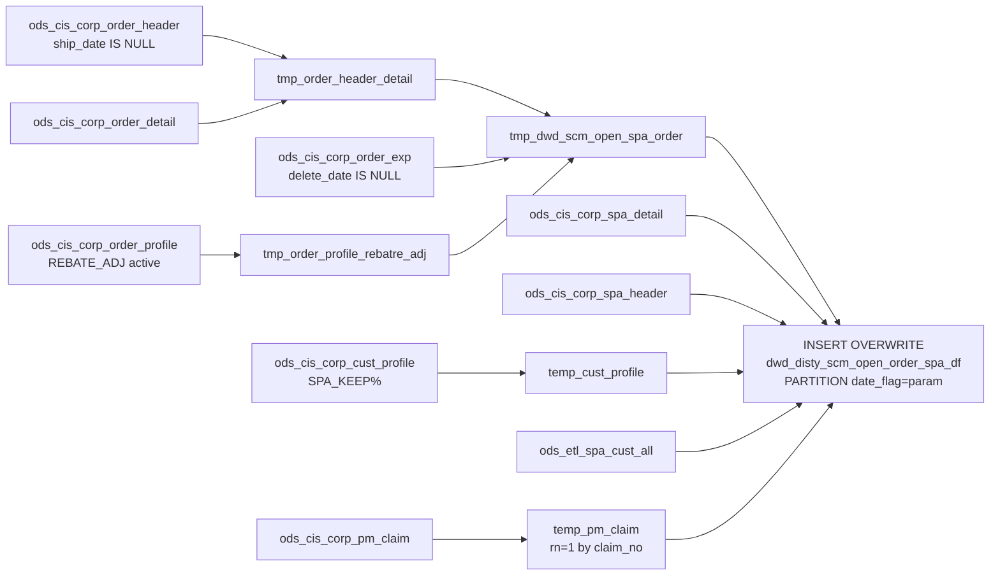

# DWD: SCM Open Order SPA Detail — Daily Snapshot (`dwd_disty_scm_open_order_spa_df`)

- artifact_type: etl_table
- artifact_id: dw_us.dwd_disty_scm_open_order_spa_df
- domain: order
- one_line_purpose: This job creates a **daily snapshot of all currently open (unshipped) order lines with their SPA (Special Pricing Agreement) and SCM (Supply Chain Management) detail**. For each open order line, it captures which SPA applies, the associated...
- layer_type: DWD
- source_kind: etl_sql
- evidence_source: source/etl/sql/order/source/etl/flows/public_order_tools/ingest/public_order_dw/script/dwd_disty_scm_open_order_spa_df.sql

---

## L1 Data Foundation

### Identity and physical mapping
- **Table:** `dw_us.dwd_disty_scm_open_order_spa_df`
- **Layer type:** DWD
- **Canonical / derived:** Derived / ETL-loaded (see L3)
- **Owner team:** not registered in metadata catalog

### Grain, scope, exclusions
- **Grain:** one row per `(order_type, order_no, order_line_no, expense line)` — an open order line + expense/SPA combination.
- **Scope:** See L2 business purpose / L3 filters
- **Partition:** `date_flag = '${date_flag}'` — literal run date; full overwrite of that partition representing all open orders at that point in time. - resolved from pipeline (see L4)
- **Natural key:** Not documented in repository
- **Exclusions:** Not documented in repository

#### Grain detail (preserved)

- **Grain:** one row per `(order_type, order_no, order_line_no, expense line)` — an open order line + expense/SPA combination.
- **Partition:** `date_flag = '${date_flag}'` — literal run date; full overwrite of that partition representing all open orders at that point in time.
- **Note:** A single order line can produce multiple rows if it has multiple expense/SPA records.

---

### Cross-engine presence
| Engine | Present | Canonical FQN | Notes |
|--------|---------|---------------|-------|
| Hive | yes | `dwd_disty_scm_open_order_spa_df` | ETL target / intermediate per evidence script |
| Vertica | pending | `dwd_disty_scm_open_order_spa_df` | Confirm via hive2vertica flow evidence / MCP |

### Physical schema reference

Pointer block only - full column catalog lives in WKB L1 storage JSON.

| Field | Value |
|-------|-------|
| **Authoritative catalog** | WKB L1 storage seed (not duplicated in this file) |
| **entity_id** | `dw_us.dwd_disty_scm_open_order_spa_df` |
| **l1_catalog_seed** | `target/storage/wkb/snapshots/_snapshot_id_template/l1_catalog/{engine}_{schema}_{table}.json` |
| **column_count** | pending (run ddl_seed_writer) |
| **partition_keys** | `date_flag = '${date_flag}'` |
| **ddl_source** | pending Bitbucket DDL / Vertica metadata ingest |
| **retrieval** | `python -m tools.wkb.indexing.run_query --query "order dwd_disty_scm_open_order_spa_df schema" --intent find_table_schema` |

### Lineage
| Object | Role |
|--------|------|
| `ods_${country_code}.ods_cis_corp_order_header` | Open order headers |
| `ods_${country_code}.ods_cis_corp_order_detail` | Open order lines |
| `ods_${country_code}.ods_cis_corp_order_exp` | Expense lines |
| `ods_${country_code}.ods_cis_corp_order_profile` | REBATE_ADJ profiles |
| `ods_${country_code}.ods_cis_corp_cust_profile` | Customer SPA keep % |
| `ods_${country_code}.ods_cis_corp_pm_claim` | PM claim records |
| `ods_${country_code}.ods_cis_corp_spa_detail` | SPA approved cost and rebate |
| `ods_${country_code}.ods_cis_corp_spa_header` | SPA type and description |
| `ods_${country_code}.ods_etl_spa_cust_all` | SPA customer keep % rules |
| `dw_${country_code}.dwd_disty_scm_open_order_spa_df` | **Target** — open order SPA detail snapshot |

---

### Freshness and load path
| Item | Value |
|------|-------|
| Load pattern | See L3 end-to-end / INSERT pattern in evidence script |
| Schedule | Not documented in repository |
| Parameters | `country_code`, `date_flag` |


---

## L2 Declarative Knowledge

### Business purpose
This job creates a **daily snapshot of all currently open (unshipped) order lines with their SPA (Special Pricing Agreement) and SCM (Supply Chain Management) detail**. For each open order line, it captures which SPA applies, the associated rebate adjustments and approved costs, the SPA keep percentages (both customer-level and SPA-rule-level), and PM claim approval references. The result supports SCM/SPA program tracking, rebate forecasting, and vendor claim management for orders that have not yet shipped.

---

### Audience and use cases
| Audience | How they benefit |
|----------|-----------------|
| **SCM / SPA program managers** | Complete picture of open order SPA attachments — which SPA applies, what the rebate/adjustment is, and what the approved cost is before the order ships. |
| **Vendor management** | `vendor_appr_ref_no`, `spa_type`, `spa_desc`, `approved_cost`, `rebate_amt` — vendor program tracking on open orders. |
| **Finance / FP&A** | `sales_adj_amt`, `unit_exp`, `extended_exp`, `customer_spa_keep`, `spa_keep` — rebate accrual and forecasting for open order book. |
| **Operations** | `order_qty`, `order_entry_date`, `invoice_date` — open order sizing and expected billing timeline. |

---

### Fact key resolution
- Natural key: Not documented in repository
- FK / label-on attributes: see L3 dimension join patterns and step-by-step logic.
- Negative assertion: do not treat descriptive labels as grain keys unless listed under natural key.

### Time field semantics
- **date_flag / partition columns:** `date_flag = '${date_flag}'` — literal run date; full overwrite of that partition representing all open orders at that point in time.
- Primary reporting filter should use the partition column(s) documented in L1; resolve values via L4.


### Metrics served

| Category | Column | Logical metric | Business reading |
|----------|--------|----------------|------------------|
| Measures | — | — | No measure columns mapped for this table. |

### Metric serving map

**Formula authority:** [`source/contracts/order/metric-index.md`](../../source/contracts/order/metric-index.md)

N/A — no measure columns mapped for this table.

### etl_metrics

No governed logical metrics from `source/contracts/order/metric-index.md` are mapped on this table.

---

### Metric serving map
N/A - not a `*_comb_mtd` / multi-period wide serving table (or map not present in legacy doc).


### Data products and column groups (preserved)

### Order identifiers

- `order_type`, `order_no`, `order_line_no`, `cust_no`, `sku_no`, `sku_no_exp`
- `order_qty` — ordered quantity (not yet shipped)

### SPA / SCM attributes

- `spa_no` — SPA number
- `spa_ref_no` — SPA reference number (from REBATE_ADJ profile)
- `scm_no` — SCM project number (from expense `project_no`)
- `spa_type` — SPA type classification (from SPA header)
- `spa_desc` — SPA description

### SPA financial attributes

- `sales_adj_amt` — sales adjustment amount from the REBATE_ADJ profile
- `unit_exp` — unit expense amount from the expense record
- `extended_exp` — extended expense amount
- `exp_code` — expense code
- `approved_cost` — approved cost from SPA detail (by SPA no + SKU)
- `rebate_amt` — rebate amount from SPA detail

### SPA keep percentages

- `customer_spa_keep` — the customer's SPA keep % (defaulting to 100 if not set)
- `spa_keep` — the SPA customer rule's keep % (from `ods_etl_spa_cust_all`; -1 customer code = applies to all)

### PM claim attributes

- `claim_type` — type of PM claim
- `vendor_appr_ref_no` — vendor approval reference number (only populated when `claim_type = 37`)

### Dates and audit

- `invoice_date` — expected invoice date
- `order_entry_date` — when the order was entered
- `etl_timestamp` — ETL run time (Pacific timezone)

---

### etl_metrics

#### `ods_cis_corp_spa_detail`
- **Source:** [metric-index.md](../../source/contracts/order/metric-index.md#ods_cis_corp_spa_detail)
- **Business definition:** `approved_cost`, `rebate_amt`
```sql
spa_no + sku_no_exp
```

#### `vendor_appr_ref_no`
- **Source:** [metric-index.md](../../source/contracts/order/metric-index.md#vendor_appr_ref_no)
- **Business definition:** Vendor approval reference — only populated for PM claim type 37.
```sql
CASE WHEN claim_type = 37 THEN pri_approv_ref_no ELSE NULL END
```


---

## L3 Procedural Knowledge

### Query and routing rules
**Business filters:** Use partition / date keys from L1 grain for reporting scope.
**Technical predicates (load only):** See Key filters and step-by-step logic below.

### Dimension join patterns
| Dimension FQN | Join keys | Purpose | Evidence |
|---------------|-----------|---------|----------|
| See step-by-step / base tables | See L3 steps | Dimension enrichment | `source/etl/sql/order/source/etl/flows/public_order_tools/ingest/public_order_dw/script/dwd_disty_scm_open_order_spa_df.sql` |

### Key filters and ETL business logic
### Step 1 — `tmp_order_header_detail`

**Filter:** `oh.ship_date IS NULL` — open/unshipped orders only.

**Output:** `order_type`, `order_no`, `order_line_no`, `cust_no` (= `to_acct_no`), `order_qty`, `sku_no`, `ship_date` (null), `invoice_date`, `order_entry_date`.

---

### Step 2 — `tmp_order_profile_rebatre_adj`

**Source:** `ods_cis_corp_order_profile` WHERE `profile_type = 'REBATE_ADJ'` AND `active = 'Y'`

**Output:** `order_no`, `order_type`, `order_line_no`, `profile_no` (expense line reference), `sales_adj_amt` (= `profile_f`), `spa_no` (= `profile_i`), `spa_ref_no` (= `profile_c`).

---

### Step 3 — `tmp_dwd_scm_open_spa_order`

**Source:** `tmp_order_header_detail` LEFT JOIN `ods_cis_corp_order_exp` (non-deleted) LEFT JOIN `tmp_order_profile_rebatre_adj`

**Join keys for REBATE_ADJ:** `he.order_expense_line_no = op.profile_no` — matches each expense line to its REBATE_ADJ profile entry.

**Output adds:** `scm_no` (= expense `project_no`), `spa_no`, `spa_ref_no`, `sales_adj_amt`, `exp_code`, `unit_exp`, `extended_exp`, `sku_no_exp` (= expense `sku_no`).

---

### Steps 4–5 — `temp_cust_profile` / `temp_pm_claim`

**`temp_cust_profile`:** `MAX(CASE WHEN profile_f IS NULL THEN 100 ELSE profile_f END)` per `cust_no` — defaults 100 when no keep % is configured.

**`temp_pm_claim`:** `ROW_NUMBER() OVER (PARTITION BY project_no ORDER BY claim_no)` — `rnk = 1` gives the first/earliest claim per SCM project.

---

### Step 6 — Final `INSERT OVERWRITE`

**Left joins:**

| ...

### Standard time-filter SQL
```sql
-- relative period filter using resolved partition value (see L4)
SELECT *
FROM dwd_disty_scm_open_order_spa_df
WHERE /* partition predicate */ date_flag = '${partition_value}';
```

### End-to-end flow
**Runtime parameters:** `country_code`, `date_flag`
**Target table:** `dw_${country_code}.dwd_disty_scm_open_order_spa_df`, partitioned by **`date_flag = '${date_flag}'`** (literal).

1. `tmp_order_header_detail` — open orders (ship_date IS NULL) from active ODS header + detail.
2. `tmp_order_profile_rebatre_adj` — active REBATE_ADJ profiles from active ODS order profile.
3. `tmp_dwd_scm_open_spa_order` — join header+detail to expenses and REBATE_ADJ profiles.
4. `temp_cust_profile` — customer SPA keep % (MAX, default 100).
5. `temp_pm_claim` — PM claim with ROW_NUMBER dedup (rnk=1 by claim_no).
6. **INSERT OVERWRITE** — final join to SPA detail, SPA header, customer keep %, SPA cust rule, PM claim.



---


#### High-level stages (preserved)

| Stage | Business meaning |
|-------|-----------------|
| **Open order base** | Reads all orders where `ship_date IS NULL` from the active order header, joined to order detail — these are the open/unshipped orders. |
| **REBATE_ADJ profiles** | Reads active `REBATE_ADJ` profiles from the order profile table — provides `spa_no`, `spa_ref_no`, and `sales_adj_amt` per expense line number. |
| **SCM/SPA enrichment** | Joins order lines to expenses and REBATE_ADJ profiles to produce one row per order line / expense combination with SCM project number, SPA reference, and expense amounts. |
| **Customer SPA keep %** | Reads the customer's SPA keep percentage from `ods_cis_corp_cust_profile` (`SPA_KEEP%` type); defaults to 100 if null. |
| **PM claim lookup** | Reads PM claim records with deduplication (first by `claim_no`); maps SCM project to claim type and vendor approval reference. |
| **Final assembly** | Joins to SPA detail (approved cost, rebate amount), SPA header (type, description), SPA customer rule (spa_keep %), and PM claim. Derives `vendor_appr_ref_no` when `claim_type = 37`. |

**Parameters:** `country_code`, `date_flag`

---


### Base tables register
| Object | Role in this job |
|--------|-----------------|
| `ods_${country_code}.ods_cis_corp_order_header` | Open order headers — `ship_date IS NULL` filter. Provides `order_type`, `order_no`, `to_acct_no` (cust_no), `ship_date`, `invoice_date`, `entry_datetime`. |
| `ods_${country_code}.ods_cis_corp_order_detail` | Open order lines — `order_qty`, `sku_no`. |
| `ods_${country_code}.ods_cis_corp_order_exp` | Order expense lines — `project_no` (scm_no), `unit_exp`, `extended_exp`, `exp_code`; filtered to `delete_date IS NULL`. |
| `ods_${country_code}.ods_cis_corp_order_profile` | Order profiles — `REBATE_ADJ` active profiles; provides `spa_no`, `spa_ref_no`, `sales_adj_amt`. |
| `ods_${country_code}.ods_cis_corp_cust_profile` | Customer SPA keep %; `profile_type LIKE 'SPA_KEEP%'`. |
| `ods_${country_code}.ods_cis_corp_pm_claim` | PM claim records — `claim_type`, `pri_approv_ref_no`, deduped by `claim_no`. |
| `ods_${country_code}.ods_cis_corp_spa_detail` | SPA detail — `approved_cost`, `rebate_amt` per (spa_no + sku_no). |
| `ods_${country_code}.ods_cis_corp_spa_header` | SPA header — `spa_type`, `spa_desc` per spa_no. |
| `ods_${country_code}.ods_etl_spa_cust_all` | SPA customer rules — `spa_keep` %; matched by `(cust_no = so.cust_no OR cust_no = -1)` and `spa_no`. |

---

### Step-by-step logic
### Step 1 — `tmp_order_header_detail`

**Filter:** `oh.ship_date IS NULL` — open/unshipped orders only.

**Output:** `order_type`, `order_no`, `order_line_no`, `cust_no` (= `to_acct_no`), `order_qty`, `sku_no`, `ship_date` (null), `invoice_date`, `order_entry_date`.

---

### Step 2 — `tmp_order_profile_rebatre_adj`

**Source:** `ods_cis_corp_order_profile` WHERE `profile_type = 'REBATE_ADJ'` AND `active = 'Y'`

**Output:** `order_no`, `order_type`, `order_line_no`, `profile_no` (expense line reference), `sales_adj_amt` (= `profile_f`), `spa_no` (= `profile_i`), `spa_ref_no` (= `profile_c`).

---

### Step 3 — `tmp_dwd_scm_open_spa_order`

**Source:** `tmp_order_header_detail` LEFT JOIN `ods_cis_corp_order_exp` (non-deleted) LEFT JOIN `tmp_order_profile_rebatre_adj`

**Join keys for REBATE_ADJ:** `he.order_expense_line_no = op.profile_no` — matches each expense line to its REBATE_ADJ profile entry.

**Output adds:** `scm_no` (= expense `project_no`), `spa_no`, `spa_ref_no`, `sales_adj_amt`, `exp_code`, `unit_exp`, `extended_exp`, `sku_no_exp` (= expense `sku_no`).

---

### Steps 4–5 — `temp_cust_profile` / `temp_pm_claim`

**`temp_cust_profile`:** `MAX(CASE WHEN profile_f IS NULL THEN 100 ELSE profile_f END)` per `cust_no` — defaults 100 when no keep % is configured.

**`temp_pm_claim`:** `ROW_NUMBER() OVER (PARTITION BY project_no ORDER BY claim_no)` — `rnk = 1` gives the first/earliest claim per SCM project.

---

### Step 6 — Final `INSERT OVERWRITE`

**Left joins:**

| Join | Keys | Columns added |
|------|------|---------------|
| `ods_cis_corp_spa_detail` | `spa_no + sku_no_exp` | `approved_cost`, `rebate_amt` |
| `ods_cis_corp_spa_header` | `spa_no` | `spa_type`, `spa_desc` |
| `temp_cust_profile` | `cust_no` | `customer_spa_keep` |
| `ods_etl_spa_cust_all` | `(cust_no = so.cust_no OR cust_no = -1) AND spa_no` | `spa_keep` |
| `temp_pm_claim` | `scm_no = project_no AND rnk = 1` | `claim_type`, `pri_approv_ref_no` |

**Derived column:**

| Column | Formula | Plain language |
|--------|---------|----------------|
| `vendor_appr_ref_no` | `CASE WHEN claim_type = 37 THEN pri_approv_ref_no ELSE NULL END` | Vendor approval reference — only populated for PM claim type 37. |

---

### Relationship map (embedded)

| from_fqn | to_fqn | cardinality | join_keys | provenance |
|----------|--------|-------------|-----------|------------|
| `ods_${country_code}.ods_cis_corp_order_header` | `ods_${country_code}.ods_cis_corp_order_detail` | many:1 | `oh.order_no` = `od.order_no`; `oh.order_type` = `od.order_type` | etl_sql (`source/etl/sql/order/public_order_scripts/public_order_dw/script/dwd_disty_scm_open_order_spa_df.sql:16`) |
| `hd` | `ods_${country_code}.ods_cis_corp_order_exp` | many:1 (LEFT) | `he.order_type` = `hd.order_type`; `he.order_no` = `hd.order_no`; `he.order_line_no` = `hd.order_line_no` | etl_sql (`source/etl/sql/order/public_order_scripts/public_order_dw/script/dwd_disty_scm_open_order_spa_df.sql:61`) |
| `ods_${country_code}.ods_cis_corp_order_exp` | `tmp_order_profile_rebatre_adj` | many:1 (LEFT) | `he.order_no` = `op.order_no`; `he.order_type` = `op.order_type`; `he.order_line_no` = `op.order_line_no`; `he.order_expense_line_no` = `op.profile_no` | etl_sql (`source/etl/sql/order/public_order_scripts/public_order_dw/script/dwd_disty_scm_open_order_spa_df.sql:66`) |
| `so` | `ods_${country_code}.ods_cis_corp_spa_detail` | many:1 (LEFT) | `so.spa_no` = `sd.spa_no`; `so.sku_no_exp` = `sd.sku_no` | etl_sql (`source/etl/sql/order/public_order_scripts/public_order_dw/script/dwd_disty_scm_open_order_spa_df.sql:125`) |
| `so` | `ods_${country_code}.ods_cis_corp_spa_header` | many:1 (LEFT) | `so.spa_no` = `sh.spa_no` | etl_sql (`source/etl/sql/order/public_order_scripts/public_order_dw/script/dwd_disty_scm_open_order_spa_df.sql:128`) |
| `so` | `temp_cust_profile` | many:1 (LEFT) | `so.cust_no` = `cp.cust_no` | etl_sql (`source/etl/sql/order/public_order_scripts/public_order_dw/script/dwd_disty_scm_open_order_spa_df.sql:131`) |
| `so` | `ods_${country_code}.ods_etl_spa_cust_all` | many:1 (LEFT) | `sc.cust_no` = `so.cust_no`; `sc.spa_no` = `sh.spa_no` | etl_sql (`source/etl/sql/order/public_order_scripts/public_order_dw/script/dwd_disty_scm_open_order_spa_df.sql:133`) |
| `so` | `temp_pm_claim` | many:1 (LEFT) | `so.scm_no` = `tpc.project_no` | etl_sql (`source/etl/sql/order/public_order_scripts/public_order_dw/script/dwd_disty_scm_open_order_spa_df.sql:136`) |

### Special logic (embedded)

Not documented in repository

### Column / field derivations (from ETL SQL)

| target_column | expression_sql | upstream_columns | upstream_tables | transform_kind | evidence |
|---------------|----------------|------------------|-----------------|----------------|----------|
| `order_type` | `so.order_type` | `order_type` | `tmp_dwd_scm_open_spa_order`, `ods_${country_code}.ods_cis_corp_spa_detail`, `ods_${country_code}.ods_cis_corp_spa_header`, `temp_cust_profile`, `ods_${country_code}.ods_etl_spa_cust_all`, `temp_pm_claim` | passthrough | `source/etl/sql/order/public_order_scripts/public_order_dw/script/dwd_disty_scm_open_order_spa_df.sql:96` |
| `order_no` | `so.order_no` | `order_no` | `tmp_dwd_scm_open_spa_order`, `ods_${country_code}.ods_cis_corp_spa_detail`, `ods_${country_code}.ods_cis_corp_spa_header`, `temp_cust_profile`, `ods_${country_code}.ods_etl_spa_cust_all`, `temp_pm_claim` | passthrough | `source/etl/sql/order/public_order_scripts/public_order_dw/script/dwd_disty_scm_open_order_spa_df.sql:97` |
| `order_line_no` | `so.order_line_no` | `order_line_no` | `tmp_dwd_scm_open_spa_order`, `ods_${country_code}.ods_cis_corp_spa_detail`, `ods_${country_code}.ods_cis_corp_spa_header`, `temp_cust_profile`, `ods_${country_code}.ods_etl_spa_cust_all`, `temp_pm_claim` | passthrough | `source/etl/sql/order/public_order_scripts/public_order_dw/script/dwd_disty_scm_open_order_spa_df.sql:98` |
| `spa_no` | `so.spa_no` | `spa_no` | `tmp_dwd_scm_open_spa_order`, `ods_${country_code}.ods_cis_corp_spa_detail`, `ods_${country_code}.ods_cis_corp_spa_header`, `temp_cust_profile`, `ods_${country_code}.ods_etl_spa_cust_all`, `temp_pm_claim` | passthrough | `source/etl/sql/order/public_order_scripts/public_order_dw/script/dwd_disty_scm_open_order_spa_df.sql:99` |
| `spa_ref_no` | `so.spa_ref_no` | `spa_ref_no` | `tmp_dwd_scm_open_spa_order`, `ods_${country_code}.ods_cis_corp_spa_detail`, `ods_${country_code}.ods_cis_corp_spa_header`, `temp_cust_profile`, `ods_${country_code}.ods_etl_spa_cust_all`, `temp_pm_claim` | passthrough | `source/etl/sql/order/public_order_scripts/public_order_dw/script/dwd_disty_scm_open_order_spa_df.sql:100` |
| `scm_no` | `so.scm_no` | `scm_no` | `tmp_dwd_scm_open_spa_order`, `ods_${country_code}.ods_cis_corp_spa_detail`, `ods_${country_code}.ods_cis_corp_spa_header`, `temp_cust_profile`, `ods_${country_code}.ods_etl_spa_cust_all`, `temp_pm_claim` | passthrough | `source/etl/sql/order/public_order_scripts/public_order_dw/script/dwd_disty_scm_open_order_spa_df.sql:101` |
| `cust_no` | `so.cust_no` | `cust_no` | `tmp_dwd_scm_open_spa_order`, `ods_${country_code}.ods_cis_corp_spa_detail`, `ods_${country_code}.ods_cis_corp_spa_header`, `temp_cust_profile`, `ods_${country_code}.ods_etl_spa_cust_all`, `temp_pm_claim` | passthrough | `source/etl/sql/order/public_order_scripts/public_order_dw/script/dwd_disty_scm_open_order_spa_df.sql:102` |
| `sku_no` | `so.sku_no` | `sku_no` | `tmp_dwd_scm_open_spa_order`, `ods_${country_code}.ods_cis_corp_spa_detail`, `ods_${country_code}.ods_cis_corp_spa_header`, `temp_cust_profile`, `ods_${country_code}.ods_etl_spa_cust_all`, `temp_pm_claim` | passthrough | `source/etl/sql/order/public_order_scripts/public_order_dw/script/dwd_disty_scm_open_order_spa_df.sql:103` |
| `sku_no_exp` | `so.sku_no_exp` | `sku_no_exp` | `tmp_dwd_scm_open_spa_order`, `ods_${country_code}.ods_cis_corp_spa_detail`, `ods_${country_code}.ods_cis_corp_spa_header`, `temp_cust_profile`, `ods_${country_code}.ods_etl_spa_cust_all`, `temp_pm_claim` | passthrough | `source/etl/sql/order/public_order_scripts/public_order_dw/script/dwd_disty_scm_open_order_spa_df.sql:104` |
| `order_qty` | `so.order_qty` | `order_qty` | `tmp_dwd_scm_open_spa_order`, `ods_${country_code}.ods_cis_corp_spa_detail`, `ods_${country_code}.ods_cis_corp_spa_header`, `temp_cust_profile`, `ods_${country_code}.ods_etl_spa_cust_all`, `temp_pm_claim` | passthrough | `source/etl/sql/order/public_order_scripts/public_order_dw/script/dwd_disty_scm_open_order_spa_df.sql:105` |
| `sales_adj_amt` | `so.sales_adj_amt` | `sales_adj_amt` | `tmp_dwd_scm_open_spa_order`, `ods_${country_code}.ods_cis_corp_spa_detail`, `ods_${country_code}.ods_cis_corp_spa_header`, `temp_cust_profile`, `ods_${country_code}.ods_etl_spa_cust_all`, `temp_pm_claim` | passthrough | `source/etl/sql/order/public_order_scripts/public_order_dw/script/dwd_disty_scm_open_order_spa_df.sql:106` |
| `unit_exp` | `so.unit_exp` | `unit_exp` | `tmp_dwd_scm_open_spa_order`, `ods_${country_code}.ods_cis_corp_spa_detail`, `ods_${country_code}.ods_cis_corp_spa_header`, `temp_cust_profile`, `ods_${country_code}.ods_etl_spa_cust_all`, `temp_pm_claim` | passthrough | `source/etl/sql/order/public_order_scripts/public_order_dw/script/dwd_disty_scm_open_order_spa_df.sql:107` |
| `extended_exp` | `so.extended_exp` | `extended_exp` | `tmp_dwd_scm_open_spa_order`, `ods_${country_code}.ods_cis_corp_spa_detail`, `ods_${country_code}.ods_cis_corp_spa_header`, `temp_cust_profile`, `ods_${country_code}.ods_etl_spa_cust_all`, `temp_pm_claim` | passthrough | `source/etl/sql/order/public_order_scripts/public_order_dw/script/dwd_disty_scm_open_order_spa_df.sql:108` |
| `exp_code` | `so.exp_code` | `exp_code` | `tmp_dwd_scm_open_spa_order`, `ods_${country_code}.ods_cis_corp_spa_detail`, `ods_${country_code}.ods_cis_corp_spa_header`, `temp_cust_profile`, `ods_${country_code}.ods_etl_spa_cust_all`, `temp_pm_claim` | passthrough | `source/etl/sql/order/public_order_scripts/public_order_dw/script/dwd_disty_scm_open_order_spa_df.sql:109` |
| `spa_type` | `sh.spa_type` | `spa_type` | `tmp_dwd_scm_open_spa_order`, `ods_${country_code}.ods_cis_corp_spa_detail`, `ods_${country_code}.ods_cis_corp_spa_header`, `temp_cust_profile`, `ods_${country_code}.ods_etl_spa_cust_all`, `temp_pm_claim` | passthrough | `source/etl/sql/order/public_order_scripts/public_order_dw/script/dwd_disty_scm_open_order_spa_df.sql:110` |
| `spa_desc` | `sh.spa_desc` | `spa_desc` | `tmp_dwd_scm_open_spa_order`, `ods_${country_code}.ods_cis_corp_spa_detail`, `ods_${country_code}.ods_cis_corp_spa_header`, `temp_cust_profile`, `ods_${country_code}.ods_etl_spa_cust_all`, `temp_pm_claim` | passthrough | `source/etl/sql/order/public_order_scripts/public_order_dw/script/dwd_disty_scm_open_order_spa_df.sql:111` |
| `claim_type` | `tpc.claim_type` | `claim_type` | `tmp_dwd_scm_open_spa_order`, `ods_${country_code}.ods_cis_corp_spa_detail`, `ods_${country_code}.ods_cis_corp_spa_header`, `temp_cust_profile`, `ods_${country_code}.ods_etl_spa_cust_all`, `temp_pm_claim` | passthrough | `source/etl/sql/order/public_order_scripts/public_order_dw/script/dwd_disty_scm_open_order_spa_df.sql:112` |
| `approved_cost` | `sd.approved_cost` | `approved_cost` | `tmp_dwd_scm_open_spa_order`, `ods_${country_code}.ods_cis_corp_spa_detail`, `ods_${country_code}.ods_cis_corp_spa_header`, `temp_cust_profile`, `ods_${country_code}.ods_etl_spa_cust_all`, `temp_pm_claim` | passthrough | `source/etl/sql/order/public_order_scripts/public_order_dw/script/dwd_disty_scm_open_order_spa_df.sql:113` |
| `rebate_amt` | `sd.rebate_amt` | `rebate_amt` | `tmp_dwd_scm_open_spa_order`, `ods_${country_code}.ods_cis_corp_spa_detail`, `ods_${country_code}.ods_cis_corp_spa_header`, `temp_cust_profile`, `ods_${country_code}.ods_etl_spa_cust_all`, `temp_pm_claim` | passthrough | `source/etl/sql/order/public_order_scripts/public_order_dw/script/dwd_disty_scm_open_order_spa_df.sql:114` |
| `spa_keep` | `sc.spa_keep` | `spa_keep` | `tmp_dwd_scm_open_spa_order`, `ods_${country_code}.ods_cis_corp_spa_detail`, `ods_${country_code}.ods_cis_corp_spa_header`, `temp_cust_profile`, `ods_${country_code}.ods_etl_spa_cust_all`, `temp_pm_claim` | passthrough | `source/etl/sql/order/public_order_scripts/public_order_dw/script/dwd_disty_scm_open_order_spa_df.sql:115` |
| `customer_spa_keep` | `cp.profile_f` | `profile_f` | `tmp_dwd_scm_open_spa_order`, `ods_${country_code}.ods_cis_corp_spa_detail`, `ods_${country_code}.ods_cis_corp_spa_header`, `temp_cust_profile`, `ods_${country_code}.ods_etl_spa_cust_all`, `temp_pm_claim` | rename | `source/etl/sql/order/public_order_scripts/public_order_dw/script/dwd_disty_scm_open_order_spa_df.sql:116` |
| `vendor_appr_ref_no` | `case when tpc.claim_type = 37 then tpc.pri_approv_ref_no else null end` | `claim_type`, `pri_approv_ref_no` | `tmp_dwd_scm_open_spa_order`, `ods_${country_code}.ods_cis_corp_spa_detail`, `ods_${country_code}.ods_cis_corp_spa_header`, `temp_cust_profile`, `ods_${country_code}.ods_etl_spa_cust_all`, `temp_pm_claim` | case | `source/etl/sql/order/public_order_scripts/public_order_dw/script/dwd_disty_scm_open_order_spa_df.sql:87` |
| `invoice_date` | `so.invoice_date` | `invoice_date` | `tmp_dwd_scm_open_spa_order`, `ods_${country_code}.ods_cis_corp_spa_detail`, `ods_${country_code}.ods_cis_corp_spa_header`, `temp_cust_profile`, `ods_${country_code}.ods_etl_spa_cust_all`, `temp_pm_claim` | passthrough | `source/etl/sql/order/public_order_scripts/public_order_dw/script/dwd_disty_scm_open_order_spa_df.sql:121` |
| `order_entry_date` | `so.order_entry_date` | `order_entry_date` | `tmp_dwd_scm_open_spa_order`, `ods_${country_code}.ods_cis_corp_spa_detail`, `ods_${country_code}.ods_cis_corp_spa_header`, `temp_cust_profile`, `ods_${country_code}.ods_etl_spa_cust_all`, `temp_pm_claim` | passthrough | `source/etl/sql/order/public_order_scripts/public_order_dw/script/dwd_disty_scm_open_order_spa_df.sql:122` |
| `etl_timestamp` | `from_utc_timestamp(current_timestamp(),'America/Los_Angeles')` | `from_utc_timestamp`, `current_timestamp`, `America`, `Los_Angeles` | `tmp_dwd_scm_open_spa_order`, `ods_${country_code}.ods_cis_corp_spa_detail`, `ods_${country_code}.ods_cis_corp_spa_header`, `temp_cust_profile`, `ods_${country_code}.ods_etl_spa_cust_all`, `temp_pm_claim` | arithmetic | `source/etl/sql/order/public_order_scripts/public_order_dw/script/dwd_disty_scm_open_order_spa_df.sql:123` |

### Sentinel and code values
| Value | Meaning |
|-------|---------|
| `ship_date IS NULL` | Open (unshipped) orders only — the defining filter for this table. |
| `profile_type = 'REBATE_ADJ'` AND `active = 'Y'` | Only active rebate adjustment profiles are used for SPA linkage. |
| `profile_type LIKE 'SPA_KEEP%'` | Customer SPA keep % profile type; defaults to 100 if `profile_f IS NULL`. |
| `SC.cust_no = -1` | SPA customer rule applying to all customers (wildcard/default). |
| `claim_type = 37` | PM claim type that warrants a `vendor_appr_ref_no`. |
| `rnk = 1` | First PM claim per SCM project (earliest by `claim_no`). |

---

---

## L4 Validation

### Resolved partition value
| Step | Source | How partition / date scope is determined |
|------|--------|------------------------------------------|
| 1 | evidence script / flow | See parameters in L1 Freshness and L3 filters - `source/etl/sql/order/source/etl/flows/public_order_tools/ingest/public_order_dw/script/dwd_disty_scm_open_order_spa_df.sql` |

**Plain language:** Partition and date scope follow Azkaban/bootstrap parameters documented in the source script and orchestrating flow; do not hardcode calendar literals.

### Data quality checks
- Prefer row-count-by-partition, metric sums, and grain duplicate checks (see Validation SQL).
- Additional checks from legacy caveats / operational notes when present.

### Validation SQL
```sql
-- 1) Row count by partition
SELECT ${partition_col}, COUNT(*) AS row_cnt
FROM dw_${country_code}.dwd_disty_scm_open_order_spa_df
WHERE ${partition_col} = '${partition_value}'
GROUP BY ${partition_col};

-- 2) Metric sum by business dimension (top deltas)
SELECT ${dim_key}, SUM(${metric}) AS metric_sum
FROM dw_${country_code}.dwd_disty_scm_open_order_spa_df
WHERE ${partition_col} = '${partition_value}'
GROUP BY ${dim_key}
ORDER BY ABS(SUM(${metric})) DESC
LIMIT 20;

-- 3) Grain duplicate check
SELECT ${grain_key_1}, ${grain_key_2}, ${grain_key_3}, ${partition_col}, COUNT(*) AS cnt
FROM dw_${country_code}.dwd_disty_scm_open_order_spa_df
WHERE ${partition_col} = '${partition_value}'
GROUP BY ${grain_key_1}, ${grain_key_2}, ${grain_key_3}, ${partition_col}
HAVING COUNT(*) > 1;
```

Replace placeholders from this file's Grain and keys / Data you can fetch sections, and use the resolved partition value from run scope.

### Caveats for interpretation
- **Full partition overwrite** — the `date_flag = '${date_flag}'` partition is completely replaced on each run. The table is a point-in-time snapshot of all open orders as of the run date.
- **One row per expense line** — a single order line with multiple expense records will produce multiple rows; aggregate by `(order_no, order_type, order_line_no)` before comparing to order-level metrics.
- **`customer_spa_keep` defaults to 100** — if no `SPA_KEEP%` profile exists for the customer, 100 is used (no keep reduction).
- **SPA customer wildcard (`cust_no = -1`)** — the LEFT JOIN to `ods_etl_spa_cust_all` can match the `-1` wildcard row, meaning an order not specifically covered by a SPA customer rule may still get a `spa_keep` value from the default rule.
- **Uses active ODS tables (not history/DWD)** — this is for open orders that have not yet been archived to history.

---

### Conflicts and open questions
- Schedule, owner, SLA: Not documented in repository (unless preserved schedule evidence above).
- Vertica MCP verification: pending unless confirmed in L5.


---

## L5 Runtime View

### Query path and engine preference
| Role | Hive object | Vertica object | Sync mode | Evidence | MCP verified |
|------|-------------|----------------|-----------|----------|--------------|
| **Query for reporting** | *See script lineage* | `dw_${country_code}.dwd_disty_scm_open_order_spa_df` | *Verify from flow* | *Add flow file:line* | pending |
| **Hive alternative** | `*` | `dw_${country_code}.dwd_disty_scm_open_order_spa_df` | - | *See dependencies* | - |
| **ETL internal** | staging/temp tables | *Not synced to Vertica* | - | *See step-by-step logic* | - |

Business users should query `dw_${country_code}.dwd_disty_scm_open_order_spa_df` in Vertica once MCP verification is completed for this document.

### Access constraints
- Country / company schema parameters may apply (`literal_country`, `company_no`, etc.).
- Hive-only staging objects are not reporting surfaces unless synced.

### Query risk profile
| Field | Value |
|-------|-------|
| requires_date_predicate | yes |
| scan_risk_tier | high |

---

## L6 Access and Consumption

### Primary consumers and use cases
| Audience | How they benefit |
|----------|-----------------|
| **SCM / SPA program managers** | Complete picture of open order SPA attachments — which SPA applies, what the rebate/adjustment is, and what the approved cost is before the order ships. |
| **Vendor management** | `vendor_appr_ref_no`, `spa_type`, `spa_desc`, `approved_cost`, `rebate_amt` — vendor program tracking on open orders. |
| **Finance / FP&A** | `sales_adj_amt`, `unit_exp`, `extended_exp`, `customer_spa_keep`, `spa_keep` — rebate accrual and forecasting for open order book. |
| **Operations** | `order_qty`, `order_entry_date`, `invoice_date` — open order sizing and expected billing timeline. |

---

### Representative query patterns
```sql
-- certified / illustrative lookup - replace predicates from L1/L4
SELECT *
FROM dwd_disty_scm_open_order_spa_df
WHERE date_flag = '${partition_value}'
LIMIT 100;
```

### Dependencies and notes
### Upstream objects (verified)

| Object | Usage | Evidence |
|--------|-------|----------|
| `ods_${country_code}.ods_cis_corp_order_header` | Open orders; `ship_date IS NULL` | `dwd_disty_scm_open_order_spa_df.sql:15,20` |
| `ods_${country_code}.ods_cis_corp_order_detail` | Open order line detail | `dwd_disty_scm_open_order_spa_df.sql:16` |
| `ods_${country_code}.ods_cis_corp_order_exp` | Expense lines; `delete_date IS NULL` | `dwd_disty_scm_open_order_spa_df.sql:61,65` |
| `ods_${country_code}.ods_cis_corp_order_profile` | REBATE_ADJ profiles | `dwd_disty_scm_open_order_spa_df.sql:34,35` |
| `ods_${country_code}.ods_cis_corp_pm_claim` | PM claim dedup | `dwd_disty_scm_open_order_spa_df.sql:90-92` |

### Downstream consumers (verified)

| Object / script | Evidence |
|-----------------|----------|
| None identified in repository. | — |

### Operational detail (verified)

- Partition overwrite: `INSERT OVERWRITE TABLE dw_${country_code}.dwd_disty_scm_open_order_spa_df PARTITION (date_flag='${date_flag}')` — `dwd_disty_scm_open_order_spa_df.sql:94`

### Not documented in repository

- Schedule, owner, SLA — not in scripts or configs

### Related scripts (verified)

- `dwd_disty_scm_shipped_order_spa_di.sql` — companion script for shipped orders; identical enrichment logic using DWD shipped tables instead of active ODS tables

---

*Document generated from `source/etl/sql/order/source/etl/flows/public_order_tools/ingest/public_order_dw/script/dwd_disty_scm_open_order_spa_df.sql`.*

#### Not documented in repository
- Owner, SLA (unless schedule evidence preserved above)
- Any dependency without `file:line` evidence in this document

---

*Document migrated to L1-L6 from legacy Knowledgebase content. Evidence: `source/etl/sql/order/source/etl/flows/public_order_tools/ingest/public_order_dw/script/dwd_disty_scm_open_order_spa_df.sql`.*
