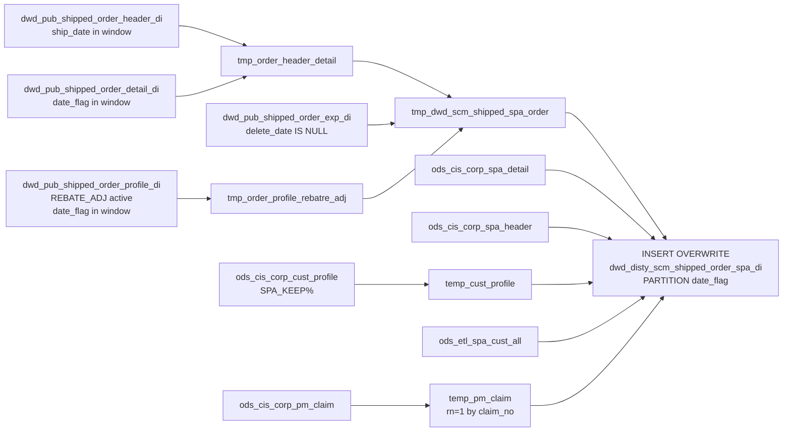

# DWD: SCM Shipped Order SPA Detail — Daily (`dwd_disty_scm_shipped_order_spa_di`)

- artifact_type: etl_table
- artifact_id: dw_us.dwd_disty_scm_shipped_order_spa_di
- domain: order
- one_line_purpose: This job is the **shipped-order counterpart** to `dwd_disty_scm_open_order_spa_df`. It captures SPA (Special Pricing Agreement) and SCM detail for **shipped** order lines within a date window, using the pre-built shipped order DWD tables ra...
- layer_type: DWD
- source_kind: etl_sql
- evidence_source: source/etl/sql/order/source/etl/flows/public_order_tools/ingest/public_order_dw/script/dwd_disty_scm_shipped_order_spa_di.sql

---

## L1 Data Foundation

### Identity and physical mapping
- **Table:** `dw_us.dwd_disty_scm_shipped_order_spa_di`
- **Layer type:** DWD
- **Canonical / derived:** Derived / ETL-loaded (see L3)
- **Owner team:** not registered in metadata catalog

### Grain, scope, exclusions
- **Grain:** one row per `(order_type, order_no, order_line_no, expense line, date_flag)` — a shipped order line + expense/SPA combination.
- **Scope:** See L2 business purpose / L3 filters
- **Partition:** `date_flag` — ship date (`to_date(ship_date)` from the shipped order header DWD table). - resolved from pipeline (see L4)
- **Natural key:** `order_type`, `order_no`, `order_line_no` within a `date_flag` partition (one row per expense combination).
- **Exclusions:** Not documented in repository

#### Grain detail (preserved)

- **Grain:** one row per `(order_type, order_no, order_line_no, expense line, date_flag)` — a shipped order line + expense/SPA combination.
- **Partition:** `date_flag` — ship date (`to_date(ship_date)` from the shipped order header DWD table).
- **Natural key:** `order_type`, `order_no`, `order_line_no` within a `date_flag` partition (one row per expense combination).

---

### Cross-engine presence
| Engine | Present | Canonical FQN | Notes |
|--------|---------|---------------|-------|
| Hive | yes | `dwd_disty_scm_shipped_order_spa_di` | ETL target / intermediate per evidence script |
| Vertica | pending | `dwd_disty_scm_shipped_order_spa_di` | Confirm via hive2vertica flow evidence / MCP |

### Physical schema reference

Pointer block only - full column catalog lives in WKB L1 storage JSON.

| Field | Value |
|-------|-------|
| **Authoritative catalog** | WKB L1 storage seed (not duplicated in this file) |
| **entity_id** | `dw_us.dwd_disty_scm_shipped_order_spa_di` |
| **l1_catalog_seed** | `target/storage/wkb/snapshots/_snapshot_id_template/l1_catalog/{engine}_{schema}_{table}.json` |
| **column_count** | pending (run ddl_seed_writer) |
| **partition_keys** | `date_flag, to_date(ship_date)` |
| **ddl_source** | pending Bitbucket DDL / Vertica metadata ingest |
| **retrieval** | `python -m tools.wkb.indexing.run_query --query "order dwd_disty_scm_shipped_order_spa_di schema" --intent find_table_schema` |

### Lineage
| Object | Role |
|--------|------|
| `dw_${country_code}.dwd_pub_shipped_order_header_di` | Shipped order headers |
| `dw_${country_code}.dwd_pub_shipped_order_detail_di` | Shipped order lines |
| `dw_${country_code}.dwd_pub_shipped_order_exp_di` | Shipped expense lines |
| `dw_${country_code}.dwd_pub_shipped_order_profile_di` | Shipped REBATE_ADJ profiles |
| `ods_${country_code}.ods_cis_corp_cust_profile` | Customer SPA keep % |
| `ods_${country_code}.ods_cis_corp_pm_claim` | PM claim records |
| `ods_${country_code}.ods_cis_corp_spa_detail` | SPA approved cost and rebate |
| `ods_${country_code}.ods_cis_corp_spa_header` | SPA type and description |
| `ods_${country_code}.ods_etl_spa_cust_all` | SPA customer keep % rules |
| `dw_${country_code}.dwd_disty_scm_shipped_order_spa_di` | **Target** — shipped order SPA detail |

---

### Freshness and load path
| Item | Value |
|------|-------|
| Load pattern | See L3 end-to-end / INSERT pattern in evidence script |
| Schedule | Not documented in repository |
| Parameters | `country_code`, `start_date`, `end_date` |


---

## L2 Declarative Knowledge

### Business purpose
This job is the **shipped-order counterpart** to `dwd_disty_scm_open_order_spa_df`. It captures SPA (Special Pricing Agreement) and SCM detail for **shipped** order lines within a date window, using the pre-built shipped order DWD tables rather than active ODS sources. For each shipped order line, it records which SPA applied, the rebate adjustments, approved costs, SPA keep percentages, PM claim references, and the actual ship date. This enables post-shipment SPA reconciliation, rebate claim processing, and vendor program reporting on completed orders.

---

### Audience and use cases
| Audience | How they benefit |
|----------|-----------------|
| **SCM / SPA program managers** | Post-shipment SPA attachment detail — confirms which SPA applied to shipped lines for rebate claim submission. |
| **Vendor management** | `vendor_appr_ref_no`, `approved_cost`, `rebate_amt` — vendor program settlement data for shipped orders. |
| **Finance / accounts payable** | `sales_adj_amt`, `unit_exp`, `extended_exp`, `customer_spa_keep`, `spa_keep` — actual rebate amounts on shipped revenue for accrual and billing. |
| **Operations** | `ship_date`, `invoice_date`, `order_qty` — fulfilment confirmation and billing timeline. |

---

### Fact key resolution
- Natural key: `order_type`, `order_no`, `order_line_no` within a `date_flag` partition (one row per expense combination).
- FK / label-on attributes: see L3 dimension join patterns and step-by-step logic.
- Negative assertion: do not treat descriptive labels as grain keys unless listed under natural key.

### Time field semantics
- **date_flag / partition columns:** `date_flag` — ship date (`to_date(ship_date)` from the shipped order header DWD table).
- Primary reporting filter should use the partition column(s) documented in L1; resolve values via L4.


### Metrics served

| Category | Column | Logical metric | Business reading |
|----------|--------|----------------|------------------|
| Measures | — | — | No measure columns mapped for this table. |

### Metric serving map

**Formula authority:** [`source/contracts/order/metric-index.md`](../../source/contracts/order/metric-index.md)

N/A — no measure columns mapped for this table.

### etl_metrics

No governed logical metrics from `source/contracts/order/metric-index.md` are mapped on this table.

---

### Metric serving map
N/A - not a `*_comb_mtd` / multi-period wide serving table (or map not present in legacy doc).


### Data products and column groups (preserved)

### Order identifiers

- `order_type`, `order_no`, `order_line_no`, `cust_no`, `sku_no`, `sku_no_exp`
- `order_qty` — ordered quantity

### SPA / SCM attributes

- `spa_no`, `spa_ref_no`, `scm_no`, `spa_type`, `spa_desc`
- `approved_cost` — vendor-approved SPA cost
- `rebate_amt` — SPA rebate amount per SKU

### Financial attributes

- `sales_adj_amt` — sales adjustment from REBATE_ADJ profile
- `unit_exp`, `extended_exp`, `exp_code` — expense line values
- `customer_spa_keep` — customer SPA keep % (default 100)
- `spa_keep` — SPA customer rule keep %

### PM claim attributes

- `claim_type` — PM claim type
- `vendor_appr_ref_no` — vendor approval reference (claim_type=37 only)

### Dates and audit

- `ship_date` — actual ship date of the order
- `invoice_date` — invoice date
- `order_entry_date` — order entry datetime
- `etl_timestamp` — ETL run time (Pacific)
- `date_flag` — partition date (= to_date(ship_date))

---

### etl_metrics

#### `vendor_appr_ref_no`
- **Source:** [metric-index.md](../../source/contracts/order/metric-index.md#vendor_appr_ref_no)
- **Business definition:** Vendor approval reference — only for claim_type 37.
```sql
CASE WHEN claim_type = 37 THEN pri_approv_ref_no ELSE NULL END
```


---

## L3 Procedural Knowledge

### Query and routing rules
**Business filters:** Use partition / date keys from L1 grain for reporting scope.
**Technical predicates (load only):** See Key filters and step-by-step logic below.

### Dimension join patterns
| Dimension FQN | Join keys | Purpose | Evidence |
|---------------|-----------|---------|----------|
| See step-by-step / base tables | See L3 steps | Dimension enrichment | `source/etl/sql/order/source/etl/flows/public_order_tools/ingest/public_order_dw/script/dwd_disty_scm_shipped_order_spa_di.sql` |

### Key filters and ETL business logic
### Step 1 — `tmp_order_header_detail`

**Source:** `dwd_pub_shipped_order_header_di` INNER JOIN `dwd_pub_shipped_order_detail_di`

**Filter:**
- Both tables: `date_flag >= '${start_date}' AND date_flag < '${end_date}'` — partition-level filter.
- Header: `oh.ship_date >= '${start_date}' AND oh.ship_date < '${end_date}'` — day-level ship date filter.

**Output adds:** `date_flag` = `to_date(oh.ship_date)` — the partition key inherited from the shipped header.

---

### Step 2 — `tmp_order_profile_rebatre_adj`

**Source:** `dwd_pub_shipped_order_profile_di`

**Filter:** `profile_type = 'REBATE_ADJ'` AND `active = 'Y'` AND `date_flag >= start_date AND date_flag < end_date`

Same output structure as open order SPA script.

---

### Step 3 — `tmp_dwd_scm_shipped_spa_order`

**Source:** `tmp_order_header_detail` LEFT JOIN `dwd_pub_shipped_order_exp_di` (date window + `delete_date IS NULL`) LEFT JOIN `tmp_order_profile_rebatre_adj`

**Join key (profile):** `he.order_expense_line_no = op.profile_no`

**Output adds:** `date_flag` from the header detail.

---

### Steps 4–5 — `temp_cust_profile` / `temp_pm_claim`

Identical logic to the open order SPA script. See `dwd_disty_scm_open_order_spa_df.md`.

---

### Step 6 — Final `INSERT OVERWRITE`

**Left joins and output columns:** Identical to open order SPA script. **Additional columns in shipped version:**

| Column | Source | Plain language |
|--------|--------|----------------|
| `ship_date` | `so.ship_date` | Actual ship date — pre...

### Standard time-filter SQL
```sql
-- relative period filter using resolved partition value (see L4)
SELECT *
FROM dwd_disty_scm_shipped_order_spa_di
WHERE /* partition predicate */ date_flag = '${partition_value}';
```

### End-to-end flow
**Runtime parameters:** `country_code`, `start_date`, `end_date`
**Target table:** `dw_${country_code}.dwd_disty_scm_shipped_order_spa_di`, partitioned by **`date_flag`** (dynamic — from ship date).

1. `tmp_order_header_detail` — shipped orders in window from DWD shipped tables, filter `ship_date >= start_date AND ship_date < end_date`.
2. `tmp_order_profile_rebatre_adj` — REBATE_ADJ active profiles from `dwd_pub_shipped_order_profile_di` (same window).
3. `tmp_dwd_scm_shipped_spa_order` — joins to `dwd_pub_shipped_order_exp_di` (same window) and REBATE_ADJ profiles.
4. `temp_cust_profile` — customer SPA keep %.
5. `temp_pm_claim` — PM claim dedup.
6. **INSERT OVERWRITE** — SPA detail, header, cust keep %, SPA cust rule, PM claim; includes `ship_date` and `date_flag`.



---


#### High-level stages (preserved)

| Stage | Business meaning |
|-------|-----------------|
| **Shipped order base** | Reads recently shipped orders from `dwd_pub_shipped_order_header_di` and `dwd_pub_shipped_order_detail_di` within the date window (ship_date in range). |
| **REBATE_ADJ profiles** | Reads active `REBATE_ADJ` profiles from `dwd_pub_shipped_order_profile_di` within the same window — provides SPA number, reference, and adjustment amount per expense line. |
| **SCM/SPA enrichment** | Joins shipped order lines to expenses from `dwd_pub_shipped_order_exp_di` and REBATE_ADJ profiles to produce one row per order line / expense combination. |
| **Customer SPA keep %** | Same logic as open order — reads `SPA_KEEP%` customer profile, defaults to 100 if null. |
| **PM claim lookup** | Same deduplication as open order — first PM claim per SCM project by `claim_no`. |
| **Final assembly** | Joins to SPA detail, SPA header, customer keep %, SPA customer rule, and PM claim. Includes actual `ship_date` and dynamic `date_flag`. |

**Parameters:** `country_code`, `start_date`, `end_date`

---


### Base tables register
| Object | Role in this job |
|--------|-----------------|
| `dw_${country_code}.dwd_pub_shipped_order_header_di` | **Shipped header source.** Filtered to `date_flag >= start_date AND date_flag < end_date` and `ship_date >= start_date AND ship_date < end_date`. Provides `order_type`, `order_no`, `to_acct_no` (cust_no), `ship_date`, `invoice_date`, `entry_datetime`. |
| `dw_${country_code}.dwd_pub_shipped_order_detail_di` | **Shipped line source.** Same date window filter. Provides `order_line_no`, `order_qty`, `sku_no`. |
| `dw_${country_code}.dwd_pub_shipped_order_exp_di` | **Shipped expense source.** Same date window filter. Provides `project_no` (scm_no), `unit_exp`, `extended_exp`, `exp_code`; filtered to `delete_date IS NULL`. |
| `dw_${country_code}.dwd_pub_shipped_order_profile_di` | **Shipped profile source.** Same date window. REBATE_ADJ active profiles. |
| `ods_${country_code}.ods_cis_corp_cust_profile` | Customer SPA keep %; `profile_type LIKE 'SPA_KEEP%'`. |
| `ods_${country_code}.ods_cis_corp_pm_claim` | PM claim records with dedup. |
| `ods_${country_code}.ods_cis_corp_spa_detail` | SPA approved cost and rebate per (spa_no + sku_no). |
| `ods_${country_code}.ods_cis_corp_spa_header` | SPA type and description. |
| `ods_${country_code}.ods_etl_spa_cust_all` | SPA customer keep % rules. |

---

### Step-by-step logic
### Step 1 — `tmp_order_header_detail`

**Source:** `dwd_pub_shipped_order_header_di` INNER JOIN `dwd_pub_shipped_order_detail_di`

**Filter:**
- Both tables: `date_flag >= '${start_date}' AND date_flag < '${end_date}'` — partition-level filter.
- Header: `oh.ship_date >= '${start_date}' AND oh.ship_date < '${end_date}'` — day-level ship date filter.

**Output adds:** `date_flag` = `to_date(oh.ship_date)` — the partition key inherited from the shipped header.

---

### Step 2 — `tmp_order_profile_rebatre_adj`

**Source:** `dwd_pub_shipped_order_profile_di`

**Filter:** `profile_type = 'REBATE_ADJ'` AND `active = 'Y'` AND `date_flag >= start_date AND date_flag < end_date`

Same output structure as open order SPA script.

---

### Step 3 — `tmp_dwd_scm_shipped_spa_order`

**Source:** `tmp_order_header_detail` LEFT JOIN `dwd_pub_shipped_order_exp_di` (date window + `delete_date IS NULL`) LEFT JOIN `tmp_order_profile_rebatre_adj`

**Join key (profile):** `he.order_expense_line_no = op.profile_no`

**Output adds:** `date_flag` from the header detail.

---

### Steps 4–5 — `temp_cust_profile` / `temp_pm_claim`

Identical logic to the open order SPA script. See `dwd_disty_scm_open_order_spa_df.md`.

---

### Step 6 — Final `INSERT OVERWRITE`

**Left joins and output columns:** Identical to open order SPA script. **Additional columns in shipped version:**

| Column | Source | Plain language |
|--------|--------|----------------|
| `ship_date` | `so.ship_date` | Actual ship date — present in shipped variant, absent in open order variant. |
| `date_flag` | `so.date_flag` | Dynamic ship date partition key — set from `to_date(ship_date)` in step 1. |

**Derived column:**

| Column | Formula | Plain language |
|--------|---------|----------------|
| `vendor_appr_ref_no` | `CASE WHEN claim_type = 37 THEN pri_approv_ref_no ELSE NULL END` | Vendor approval reference — only for claim_type 37. |

---

### Relationship map (embedded)

| from_fqn | to_fqn | cardinality | join_keys | provenance |
|----------|--------|-------------|-----------|------------|
| `dw_${country_code}.dwd_pub_shipped_order_header_di` | `ods_${country_code}.ods_etl_order_detail_all` | many:1 | — | etl_sql (`source/etl/sql/order/public_order_scripts/public_order_dw/script/dwd_disty_scm_shipped_order_spa_di.sql:17`) |
| `dw_${country_code}.dwd_pub_shipped_order_header_di` | `ods_${country_code}.ods_etl_order_exp_all` | many:1 (LEFT) | — | etl_sql (`source/etl/sql/order/public_order_scripts/public_order_dw/script/dwd_disty_scm_shipped_order_spa_di.sql:70`) |
| `ods_${country_code}.ods_etl_order_exp_all` | `tmp_order_profile_rebatre_adj` | many:1 (LEFT) | `he.order_no` = `op.order_no`; `he.order_type` = `op.order_type`; `he.order_line_no` = `op.order_line_no`; `he.order_expense_line_no` = `op.profile_no` | etl_sql (`source/etl/sql/order/public_order_scripts/public_order_dw/script/dwd_disty_scm_shipped_order_spa_di.sql:77`) |
| `so` | `ods_${country_code}.ods_cis_corp_spa_detail` | many:1 (LEFT) | `so.spa_no` = `sd.spa_no`; `so.sku_no_exp` = `sd.sku_no` | etl_sql (`source/etl/sql/order/public_order_scripts/public_order_dw/script/dwd_disty_scm_shipped_order_spa_di.sql:139`) |
| `so` | `ods_${country_code}.ods_cis_corp_spa_header` | many:1 (LEFT) | `so.spa_no` = `sh.spa_no` | etl_sql (`source/etl/sql/order/public_order_scripts/public_order_dw/script/dwd_disty_scm_shipped_order_spa_di.sql:142`) |
| `so` | `temp_cust_profile` | many:1 (LEFT) | `so.cust_no` = `cp.cust_no` | etl_sql (`source/etl/sql/order/public_order_scripts/public_order_dw/script/dwd_disty_scm_shipped_order_spa_di.sql:145`) |
| `so` | `ods_${country_code}.ods_etl_spa_cust_all` | many:1 (LEFT) | `sc.cust_no` = `so.cust_no`; `sc.spa_no` = `sh.spa_no` | etl_sql (`source/etl/sql/order/public_order_scripts/public_order_dw/script/dwd_disty_scm_shipped_order_spa_di.sql:147`) |
| `so` | `temp_pm_claim` | many:1 (LEFT) | `so.scm_no` = `tpc.project_no` | etl_sql (`source/etl/sql/order/public_order_scripts/public_order_dw/script/dwd_disty_scm_shipped_order_spa_di.sql:150`) |

### Special logic (embedded)

Not documented in repository

### Column / field derivations (from ETL SQL)

| target_column | expression_sql | upstream_columns | upstream_tables | transform_kind | evidence |
|---------------|----------------|------------------|-----------------|----------------|----------|
| `order_type` | `so.order_type` | `order_type` | `tmp_dwd_scm_shipped_spa_order`, `ods_${country_code}.ods_cis_corp_spa_detail`, `ods_${country_code}.ods_cis_corp_spa_header`, `temp_cust_profile`, `ods_${country_code}.ods_etl_spa_cust_all`, `temp_pm_claim` | passthrough | `source/etl/sql/order/public_order_scripts/public_order_dw/script/dwd_disty_scm_shipped_order_spa_di.sql:108` |
| `order_no` | `so.order_no` | `order_no` | `tmp_dwd_scm_shipped_spa_order`, `ods_${country_code}.ods_cis_corp_spa_detail`, `ods_${country_code}.ods_cis_corp_spa_header`, `temp_cust_profile`, `ods_${country_code}.ods_etl_spa_cust_all`, `temp_pm_claim` | passthrough | `source/etl/sql/order/public_order_scripts/public_order_dw/script/dwd_disty_scm_shipped_order_spa_di.sql:109` |
| `order_line_no` | `so.order_line_no` | `order_line_no` | `tmp_dwd_scm_shipped_spa_order`, `ods_${country_code}.ods_cis_corp_spa_detail`, `ods_${country_code}.ods_cis_corp_spa_header`, `temp_cust_profile`, `ods_${country_code}.ods_etl_spa_cust_all`, `temp_pm_claim` | passthrough | `source/etl/sql/order/public_order_scripts/public_order_dw/script/dwd_disty_scm_shipped_order_spa_di.sql:110` |
| `spa_no` | `so.spa_no` | `spa_no` | `tmp_dwd_scm_shipped_spa_order`, `ods_${country_code}.ods_cis_corp_spa_detail`, `ods_${country_code}.ods_cis_corp_spa_header`, `temp_cust_profile`, `ods_${country_code}.ods_etl_spa_cust_all`, `temp_pm_claim` | passthrough | `source/etl/sql/order/public_order_scripts/public_order_dw/script/dwd_disty_scm_shipped_order_spa_di.sql:111` |
| `spa_ref_no` | `so.spa_ref_no` | `spa_ref_no` | `tmp_dwd_scm_shipped_spa_order`, `ods_${country_code}.ods_cis_corp_spa_detail`, `ods_${country_code}.ods_cis_corp_spa_header`, `temp_cust_profile`, `ods_${country_code}.ods_etl_spa_cust_all`, `temp_pm_claim` | passthrough | `source/etl/sql/order/public_order_scripts/public_order_dw/script/dwd_disty_scm_shipped_order_spa_di.sql:112` |
| `scm_no` | `so.scm_no` | `scm_no` | `tmp_dwd_scm_shipped_spa_order`, `ods_${country_code}.ods_cis_corp_spa_detail`, `ods_${country_code}.ods_cis_corp_spa_header`, `temp_cust_profile`, `ods_${country_code}.ods_etl_spa_cust_all`, `temp_pm_claim` | passthrough | `source/etl/sql/order/public_order_scripts/public_order_dw/script/dwd_disty_scm_shipped_order_spa_di.sql:113` |
| `cust_no` | `so.cust_no` | `cust_no` | `tmp_dwd_scm_shipped_spa_order`, `ods_${country_code}.ods_cis_corp_spa_detail`, `ods_${country_code}.ods_cis_corp_spa_header`, `temp_cust_profile`, `ods_${country_code}.ods_etl_spa_cust_all`, `temp_pm_claim` | passthrough | `source/etl/sql/order/public_order_scripts/public_order_dw/script/dwd_disty_scm_shipped_order_spa_di.sql:114` |
| `sku_no` | `so.sku_no` | `sku_no` | `tmp_dwd_scm_shipped_spa_order`, `ods_${country_code}.ods_cis_corp_spa_detail`, `ods_${country_code}.ods_cis_corp_spa_header`, `temp_cust_profile`, `ods_${country_code}.ods_etl_spa_cust_all`, `temp_pm_claim` | passthrough | `source/etl/sql/order/public_order_scripts/public_order_dw/script/dwd_disty_scm_shipped_order_spa_di.sql:115` |
| `sku_no_exp` | `so.sku_no_exp` | `sku_no_exp` | `tmp_dwd_scm_shipped_spa_order`, `ods_${country_code}.ods_cis_corp_spa_detail`, `ods_${country_code}.ods_cis_corp_spa_header`, `temp_cust_profile`, `ods_${country_code}.ods_etl_spa_cust_all`, `temp_pm_claim` | passthrough | `source/etl/sql/order/public_order_scripts/public_order_dw/script/dwd_disty_scm_shipped_order_spa_di.sql:116` |
| `order_qty` | `so.order_qty` | `order_qty` | `tmp_dwd_scm_shipped_spa_order`, `ods_${country_code}.ods_cis_corp_spa_detail`, `ods_${country_code}.ods_cis_corp_spa_header`, `temp_cust_profile`, `ods_${country_code}.ods_etl_spa_cust_all`, `temp_pm_claim` | passthrough | `source/etl/sql/order/public_order_scripts/public_order_dw/script/dwd_disty_scm_shipped_order_spa_di.sql:117` |
| `sales_adj_amt` | `so.sales_adj_amt` | `sales_adj_amt` | `tmp_dwd_scm_shipped_spa_order`, `ods_${country_code}.ods_cis_corp_spa_detail`, `ods_${country_code}.ods_cis_corp_spa_header`, `temp_cust_profile`, `ods_${country_code}.ods_etl_spa_cust_all`, `temp_pm_claim` | passthrough | `source/etl/sql/order/public_order_scripts/public_order_dw/script/dwd_disty_scm_shipped_order_spa_di.sql:118` |
| `unit_exp` | `so.unit_exp` | `unit_exp` | `tmp_dwd_scm_shipped_spa_order`, `ods_${country_code}.ods_cis_corp_spa_detail`, `ods_${country_code}.ods_cis_corp_spa_header`, `temp_cust_profile`, `ods_${country_code}.ods_etl_spa_cust_all`, `temp_pm_claim` | passthrough | `source/etl/sql/order/public_order_scripts/public_order_dw/script/dwd_disty_scm_shipped_order_spa_di.sql:119` |
| `extended_exp` | `so.extended_exp` | `extended_exp` | `tmp_dwd_scm_shipped_spa_order`, `ods_${country_code}.ods_cis_corp_spa_detail`, `ods_${country_code}.ods_cis_corp_spa_header`, `temp_cust_profile`, `ods_${country_code}.ods_etl_spa_cust_all`, `temp_pm_claim` | passthrough | `source/etl/sql/order/public_order_scripts/public_order_dw/script/dwd_disty_scm_shipped_order_spa_di.sql:120` |
| `exp_code` | `so.exp_code` | `exp_code` | `tmp_dwd_scm_shipped_spa_order`, `ods_${country_code}.ods_cis_corp_spa_detail`, `ods_${country_code}.ods_cis_corp_spa_header`, `temp_cust_profile`, `ods_${country_code}.ods_etl_spa_cust_all`, `temp_pm_claim` | passthrough | `source/etl/sql/order/public_order_scripts/public_order_dw/script/dwd_disty_scm_shipped_order_spa_di.sql:121` |
| `spa_type` | `sh.spa_type` | `spa_type` | `tmp_dwd_scm_shipped_spa_order`, `ods_${country_code}.ods_cis_corp_spa_detail`, `ods_${country_code}.ods_cis_corp_spa_header`, `temp_cust_profile`, `ods_${country_code}.ods_etl_spa_cust_all`, `temp_pm_claim` | passthrough | `source/etl/sql/order/public_order_scripts/public_order_dw/script/dwd_disty_scm_shipped_order_spa_di.sql:122` |
| `spa_desc` | `sh.spa_desc` | `spa_desc` | `tmp_dwd_scm_shipped_spa_order`, `ods_${country_code}.ods_cis_corp_spa_detail`, `ods_${country_code}.ods_cis_corp_spa_header`, `temp_cust_profile`, `ods_${country_code}.ods_etl_spa_cust_all`, `temp_pm_claim` | passthrough | `source/etl/sql/order/public_order_scripts/public_order_dw/script/dwd_disty_scm_shipped_order_spa_di.sql:123` |
| `claim_type` | `tpc.claim_type` | `claim_type` | `tmp_dwd_scm_shipped_spa_order`, `ods_${country_code}.ods_cis_corp_spa_detail`, `ods_${country_code}.ods_cis_corp_spa_header`, `temp_cust_profile`, `ods_${country_code}.ods_etl_spa_cust_all`, `temp_pm_claim` | passthrough | `source/etl/sql/order/public_order_scripts/public_order_dw/script/dwd_disty_scm_shipped_order_spa_di.sql:124` |
| `approved_cost` | `sd.approved_cost` | `approved_cost` | `tmp_dwd_scm_shipped_spa_order`, `ods_${country_code}.ods_cis_corp_spa_detail`, `ods_${country_code}.ods_cis_corp_spa_header`, `temp_cust_profile`, `ods_${country_code}.ods_etl_spa_cust_all`, `temp_pm_claim` | passthrough | `source/etl/sql/order/public_order_scripts/public_order_dw/script/dwd_disty_scm_shipped_order_spa_di.sql:125` |
| `rebate_amt` | `sd.rebate_amt` | `rebate_amt` | `tmp_dwd_scm_shipped_spa_order`, `ods_${country_code}.ods_cis_corp_spa_detail`, `ods_${country_code}.ods_cis_corp_spa_header`, `temp_cust_profile`, `ods_${country_code}.ods_etl_spa_cust_all`, `temp_pm_claim` | passthrough | `source/etl/sql/order/public_order_scripts/public_order_dw/script/dwd_disty_scm_shipped_order_spa_di.sql:126` |
| `spa_keep` | `sc.spa_keep` | `spa_keep` | `tmp_dwd_scm_shipped_spa_order`, `ods_${country_code}.ods_cis_corp_spa_detail`, `ods_${country_code}.ods_cis_corp_spa_header`, `temp_cust_profile`, `ods_${country_code}.ods_etl_spa_cust_all`, `temp_pm_claim` | passthrough | `source/etl/sql/order/public_order_scripts/public_order_dw/script/dwd_disty_scm_shipped_order_spa_di.sql:127` |
| `customer_spa_keep` | `cp.profile_f` | `profile_f` | `tmp_dwd_scm_shipped_spa_order`, `ods_${country_code}.ods_cis_corp_spa_detail`, `ods_${country_code}.ods_cis_corp_spa_header`, `temp_cust_profile`, `ods_${country_code}.ods_etl_spa_cust_all`, `temp_pm_claim` | rename | `source/etl/sql/order/public_order_scripts/public_order_dw/script/dwd_disty_scm_shipped_order_spa_di.sql:128` |
| `vendor_appr_ref_no` | `case when tpc.claim_type = 37 then tpc.pri_approv_ref_no else null end` | `claim_type`, `pri_approv_ref_no` | `tmp_dwd_scm_shipped_spa_order`, `ods_${country_code}.ods_cis_corp_spa_detail`, `ods_${country_code}.ods_cis_corp_spa_header`, `temp_cust_profile`, `ods_${country_code}.ods_etl_spa_cust_all`, `temp_pm_claim` | case | `source/etl/sql/order/public_order_scripts/public_order_dw/script/dwd_disty_scm_shipped_order_spa_di.sql:89` |
| `ship_date` | `so.ship_date` | `ship_date` | `tmp_dwd_scm_shipped_spa_order`, `ods_${country_code}.ods_cis_corp_spa_detail`, `ods_${country_code}.ods_cis_corp_spa_header`, `temp_cust_profile`, `ods_${country_code}.ods_etl_spa_cust_all`, `temp_pm_claim` | passthrough | `source/etl/sql/order/public_order_scripts/public_order_dw/script/dwd_disty_scm_shipped_order_spa_di.sql:133` |
| `invoice_date` | `so.invoice_date` | `invoice_date` | `tmp_dwd_scm_shipped_spa_order`, `ods_${country_code}.ods_cis_corp_spa_detail`, `ods_${country_code}.ods_cis_corp_spa_header`, `temp_cust_profile`, `ods_${country_code}.ods_etl_spa_cust_all`, `temp_pm_claim` | passthrough | `source/etl/sql/order/public_order_scripts/public_order_dw/script/dwd_disty_scm_shipped_order_spa_di.sql:134` |
| `order_entry_date` | `so.order_entry_date` | `order_entry_date` | `tmp_dwd_scm_shipped_spa_order`, `ods_${country_code}.ods_cis_corp_spa_detail`, `ods_${country_code}.ods_cis_corp_spa_header`, `temp_cust_profile`, `ods_${country_code}.ods_etl_spa_cust_all`, `temp_pm_claim` | passthrough | `source/etl/sql/order/public_order_scripts/public_order_dw/script/dwd_disty_scm_shipped_order_spa_di.sql:135` |
| `etl_timestamp` | `from_utc_timestamp(current_timestamp(),'America/Los_Angeles')` | `from_utc_timestamp`, `current_timestamp`, `America`, `Los_Angeles` | `tmp_dwd_scm_shipped_spa_order`, `ods_${country_code}.ods_cis_corp_spa_detail`, `ods_${country_code}.ods_cis_corp_spa_header`, `temp_cust_profile`, `ods_${country_code}.ods_etl_spa_cust_all`, `temp_pm_claim` | arithmetic | `source/etl/sql/order/public_order_scripts/public_order_dw/script/dwd_disty_scm_shipped_order_spa_di.sql:136` |
| `date_flag` | `so.date_flag` | `date_flag` | `tmp_dwd_scm_shipped_spa_order`, `ods_${country_code}.ods_cis_corp_spa_detail`, `ods_${country_code}.ods_cis_corp_spa_header`, `temp_cust_profile`, `ods_${country_code}.ods_etl_spa_cust_all`, `temp_pm_claim` | passthrough | `source/etl/sql/order/public_order_scripts/public_order_dw/script/dwd_disty_scm_shipped_order_spa_di.sql:137` |

### Sentinel and code values
| Value | Meaning |
|-------|---------|
| `ship_date >= start_date AND ship_date < end_date` | Shipped order date window filter. |
| `profile_type = 'REBATE_ADJ'` AND `active = 'Y'` | Active rebate adjustment profiles only. |
| `profile_type LIKE 'SPA_KEEP%'` | Customer SPA keep %; defaults to 100 if null. |
| `SC.cust_no = -1` | SPA wildcard — applies to all customers. |
| `claim_type = 37` | PM claim type triggering `vendor_appr_ref_no`. |
| `rnk = 1` | First PM claim per SCM project. |
| `delete_date IS NULL` | Only non-deleted expense lines included. |

---

---

## L4 Validation

### Resolved partition value
| Step | Source | How partition / date scope is determined |
|------|--------|------------------------------------------|
| 1 | evidence script / flow | See parameters in L1 Freshness and L3 filters - `source/etl/sql/order/source/etl/flows/public_order_tools/ingest/public_order_dw/script/dwd_disty_scm_shipped_order_spa_di.sql` |

**Plain language:** Partition and date scope follow Azkaban/bootstrap parameters documented in the source script and orchestrating flow; do not hardcode calendar literals.

### Data quality checks
- Prefer row-count-by-partition, metric sums, and grain duplicate checks (see Validation SQL).
- Additional checks from legacy caveats / operational notes when present.

### Validation SQL
```sql
-- 1) Row count by partition
SELECT ${partition_col}, COUNT(*) AS row_cnt
FROM dw_${country_code}.dwd_disty_scm_shipped_order_spa_di
WHERE ${partition_col} = '${partition_value}'
GROUP BY ${partition_col};

-- 2) Metric sum by business dimension (top deltas)
SELECT ${dim_key}, SUM(${metric}) AS metric_sum
FROM dw_${country_code}.dwd_disty_scm_shipped_order_spa_di
WHERE ${partition_col} = '${partition_value}'
GROUP BY ${dim_key}
ORDER BY ABS(SUM(${metric})) DESC
LIMIT 20;

-- 3) Grain duplicate check
SELECT ${grain_key_1}, ${grain_key_2}, ${grain_key_3}, ${partition_col}, COUNT(*) AS cnt
FROM dw_${country_code}.dwd_disty_scm_shipped_order_spa_di
WHERE ${partition_col} = '${partition_value}'
GROUP BY ${grain_key_1}, ${grain_key_2}, ${grain_key_3}, ${partition_col}
HAVING COUNT(*) > 1;
```

Replace placeholders from this file's Grain and keys / Data you can fetch sections, and use the resolved partition value from run scope.

### Caveats for interpretation
- **All shipped sources are DWD tables** (`dwd_pub_shipped_order_*`) rather than raw ODS — these tables are pre-filtered rolling windows. Ensure the window parameters cover the required ship dates before querying.
- **Double date filter in step 1** — both `date_flag` (partition) and `ship_date` (column) are filtered to the same window. This is intentional to use partition pruning and then validate exact ship date at row level.
- **Same expense fan-out caveat as open order** — aggregate by order line before comparing to order-level metrics.
- **Partition is dynamic (`date_flag` = ship date)** — unlike the open order table which always writes to a single literal partition, this table spreads rows across multiple date partitions based on ship date.

---

### Conflicts and open questions
- Schedule, owner, SLA: Not documented in repository (unless preserved schedule evidence above).
- Vertica MCP verification: pending unless confirmed in L5.


#### Key differences from open order SPA job (preserved from legacy doc)

| Aspect | Open (`_df`) | Shipped (`_di`) |
|--------|-------------|-----------------|
| Order source | `ods_cis_corp_order_header/detail` (active, `ship_date IS NULL`) | `dwd_pub_shipped_order_header/detail_di` (shipped, date window) |
| Expense source | `ods_cis_corp_order_exp` | `dwd_pub_shipped_order_exp_di` |
| Profile source | `ods_cis_corp_order_profile` | `dwd_pub_shipped_order_profile_di` |
| Partition | Literal `date_flag='${date_flag}'` (full snapshot) | Dynamic `date_flag` = `to_date(ship_date)` |
| `ship_date` output | Not included (null in source) | Included |
| Parameters | `date_flag` | `start_date`, `end_date` |

---

---

## L5 Runtime View

### Query path and engine preference
| Role | Hive object | Vertica object | Sync mode | Evidence | MCP verified |
|------|-------------|----------------|-----------|----------|--------------|
| **Query for reporting** | *See script lineage* | `dw_${country_code}.dwd_disty_scm_shipped_order_spa_di` | *Verify from flow* | *Add flow file:line* | pending |
| **Hive alternative** | `*` | `dw_${country_code}.dwd_disty_scm_shipped_order_spa_di` | - | *See dependencies* | - |
| **ETL internal** | staging/temp tables | *Not synced to Vertica* | - | *See step-by-step logic* | - |

Business users should query `dw_${country_code}.dwd_disty_scm_shipped_order_spa_di` in Vertica once MCP verification is completed for this document.

### Access constraints
- Country / company schema parameters may apply (`literal_country`, `company_no`, etc.).
- Hive-only staging objects are not reporting surfaces unless synced.

### Query risk profile
| Field | Value |
|-------|-------|
| requires_date_predicate | yes |
| scan_risk_tier | high |

---

## L6 Access and Consumption

### Primary consumers and use cases
| Audience | How they benefit |
|----------|-----------------|
| **SCM / SPA program managers** | Post-shipment SPA attachment detail — confirms which SPA applied to shipped lines for rebate claim submission. |
| **Vendor management** | `vendor_appr_ref_no`, `approved_cost`, `rebate_amt` — vendor program settlement data for shipped orders. |
| **Finance / accounts payable** | `sales_adj_amt`, `unit_exp`, `extended_exp`, `customer_spa_keep`, `spa_keep` — actual rebate amounts on shipped revenue for accrual and billing. |
| **Operations** | `ship_date`, `invoice_date`, `order_qty` — fulfilment confirmation and billing timeline. |

---

### Representative query patterns
```sql
-- certified / illustrative lookup - replace predicates from L1/L4
SELECT *
FROM dwd_disty_scm_shipped_order_spa_di
WHERE date_flag = '${partition_value}'
LIMIT 100;
```

### Dependencies and notes
### Upstream objects (verified)

| Object | Usage | Evidence |
|--------|-------|----------|
| `dw_${country_code}.dwd_pub_shipped_order_header_di` | Shipped headers; date window | `dwd_disty_scm_shipped_order_spa_di.sql:18-19` |
| `dw_${country_code}.dwd_pub_shipped_order_detail_di` | Shipped order lines | `dwd_disty_scm_shipped_order_spa_di.sql:20-21` |
| `dw_${country_code}.dwd_pub_shipped_order_exp_di` | Shipped expense lines | `dwd_disty_scm_shipped_order_spa_di.sql:71-72` |
| `dw_${country_code}.dwd_pub_shipped_order_profile_di` | REBATE_ADJ profiles on shipped orders | `dwd_disty_scm_shipped_order_spa_di.sql:40` |
| `ods_${country_code}.ods_cis_corp_pm_claim` | PM claim dedup | `dwd_disty_scm_shipped_order_spa_di.sql:104` |

### Downstream consumers (verified)

| Object / script | Evidence |
|-----------------|----------|
| None identified in repository. | — |

### Operational detail (verified)

- Partition overwrite: `INSERT OVERWRITE TABLE dw_${country_code}.dwd_disty_scm_shipped_order_spa_di PARTITION (date_flag)` — `dwd_disty_scm_shipped_order_spa_di.sql:106`

### Not documented in repository

- Schedule, owner, SLA — not in scripts or configs

### Related scripts (verified)

- `dwd_disty_scm_open_order_spa_df.sql` — companion open-order SPA table; identical enrichment logic using active ODS tables — `source/etl/sql/order/source/etl/flows/public_order_tools/ingest/public_order_dw/script/dwd_disty_scm_open_order_spa_df.sql`
- `dwd_pub_shipped_order_header_di.sql` — prerequisite; must be current before this job runs — `source/etl/sql/order/source/etl/flows/public_order_tools/ingest/public_shipped_order_dw/script/dwd_pub_shipped_order_header_di.sql`

---

*Document generated from `source/etl/sql/order/source/etl/flows/public_order_tools/ingest/public_order_dw/script/dwd_disty_scm_shipped_order_spa_di.sql`.*

#### Not documented in repository
- Owner, SLA (unless schedule evidence preserved above)
- Any dependency without `file:line` evidence in this document

---

*Document migrated to L1-L6 from legacy Knowledgebase content. Evidence: `source/etl/sql/order/source/etl/flows/public_order_tools/ingest/public_order_dw/script/dwd_disty_scm_shipped_order_spa_di.sql`.*
