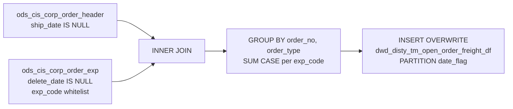

# DWD: TM Open Order Freight — Full Snapshot (`dwd_disty_tm_open_order_freight_df`)

- artifact_type: etl_table
- artifact_id: dw_us.dwd_disty_tm_open_order_freight_df
- domain: order
- one_line_purpose: Pivots eight header-level freight expense codes into order-grain columns for open (unshipped) CIS corp orders.
- layer_type: DWD
- source_kind: etl_sql
- evidence_source: source/etl/sql/order/public_order_scripts/public_order_dw/script/dwd_disty_tm_open_order_freight_df.sql

---

## L1 Data Foundation

### Identity and physical mapping
- **Table:** `dw_${country_code}.dwd_disty_tm_open_order_freight_df`
- **Layer type:** DWD
- **Canonical / derived:** Derived / ETL-loaded (see L3)
- **Owner team:** not registered in metadata catalog

### Grain, scope, exclusions
- **Grain:** one row per `(order_no, order_type)` within partition `date_flag` — open order aggregated across matching freight expense lines.
- **Scope:** Open CIS corp orders (`ship_date IS NULL`) with non-deleted header freight expenses in the eight-code whitelist.
- **Partition:** `date_flag` — fixed to pipeline parameter `'${date_flag}'` on INSERT (see L4).
- **Natural key:** `order_no`, `order_type` within a `date_flag` partition.
- **Exclusions:** Deleted expense rows (`delete_date IS NOT NULL`); shipped orders (`ship_date IS NOT NULL`); expense codes outside the whitelist.

### Cross-engine presence
| Engine | Present | Canonical FQN | Notes |
|--------|---------|---------------|-------|
| Hive | yes | `dw_${country_code}.dwd_disty_tm_open_order_freight_df` | ETL target |
| Vertica | yes | `dw_${country_code}.dwd_disty_tm_open_order_freight_df` | hive2vertica overwrite after load |

### Physical schema reference

| Field | Value |
|-------|-------|
| **Authoritative catalog** | WKB L1 storage seed (not duplicated in this file) |
| **entity_id** | `dw_us.dwd_disty_tm_open_order_freight_df` |
| **l1_catalog_seed** | `target/storage/wkb/snapshots/_snapshot_id_template/l1_catalog/{engine}_{schema}_{table}.json` |
| **column_count** | pending (run ddl_seed_writer) |
| **partition_keys** | `date_flag` |
| **ddl_source** | pending Bitbucket DDL / Vertica metadata ingest |
| **retrieval** | `python -m tools.wkb.indexing.run_query --query "order dwd_disty_tm_open_order_freight_df schema" --intent find_table_schema` |

### Lineage
- **upstream:** `ods_${country_code}.ods_cis_corp_order_header` — open-order scope (`ship_date IS NULL`) — `dwd_disty_tm_open_order_freight_df.sql:11,15`
- **upstream:** `ods_${country_code}.ods_cis_corp_order_exp` — header freight expense pivot source — `dwd_disty_tm_open_order_freight_df.sql:12-16`
- **downstream:** Vertica sync `hive2vertica-overwrite-dwd_disty_tm_open_order_freight_df` — `public_order_dw_us_level1.flow:489-497` (and regional level1 peers)

### Freshness and load path
| Item | Value |
|------|-------|
| Load pattern | `INSERT OVERWRITE` partition `date_flag='${date_flag}'` |
| Schedule | Not documented in repository |
| Parameters | `country_code`, `date_flag` |
| Orchestration | `public_order_dw_*_level1.flow` job `dwd_disty_tm_open_order_freight_df` |

---

## L2 Declarative Knowledge

### Business purpose
This job builds a **full-refresh open-order freight pivot**: for each open CIS corp order it sums eight freight-related header expense codes (`MOF`, `ASR`, `FDS`, `FRT`, `FADD`, `COD`, `FSC`, `FWD`) into dedicated columns. Downstream freight / logistics reporting can read order-level freight components without rescanning raw expense lines.

### Audience and use cases
| Audience | How they benefit |
|----------|-----------------|
| **Finance / operations** | Pre-pivoted freight charges on open orders. |
| **Logistics** | Distinct freight charge types (`FRT`, `FDS`, `FADD`, `FSC`, `FWD`, etc.) at order grain. |

### Fact key resolution
- Natural key: `order_no`, `order_type` within `date_flag`.
- Negative assertion: do not treat freight amount columns as grain keys.

### Time field semantics
- **date_flag:** partition key supplied by Azkaban `${date_flag}` at load time (not derived from order ship date — open orders have `ship_date IS NULL`).

### Metrics served
| Category | Columns | Business reading |
|----------|---------|------------------|
| Freight pivots | `MOF`, `ASR`, `FDS`, `FRT`, `FADD`, `COD`, `FSC`, `FWD` | Sum of `extended_exp` when matching `exp_code`; NULL if no matching expense |

### Metric serving map
N/A — not a `*_comb_mtd` / multi-period wide serving table.

### etl_metrics
No governed logical metrics from `source/contracts/order/metric-index.md` are calculated in this script (stored pivoted expense amounts only).

---

## L3 Procedural Knowledge

### Query and routing rules
**Business filters:** Open orders only; non-deleted expenses; eight freight codes; header freight (`exp_type` / `order_exp_type` conditions inside CASE).
**Technical predicates (load only):** Partition overwrite to `${date_flag}`.

### Dimension join patterns
| Dimension FQN | Join keys | Purpose | Evidence |
|---------------|-----------|---------|----------|
| None | — | No dimension tables in this ETL | `dwd_disty_tm_open_order_freight_df.sql:11-13` |

### Key filters and ETL business logic
- Open order only — `o.ship_date IS NULL` — `dwd_disty_tm_open_order_freight_df.sql:15`
- Active expense only — `he.delete_date IS NULL` — `dwd_disty_tm_open_order_freight_df.sql:14`
- Expense code whitelist — `he.exp_code IN ('MOF','ASR','FDS','FRT','FADD','COD','FSC','FWD')` — `dwd_disty_tm_open_order_freight_df.sql:16`
- Header join — `o.order_no = he.order_no AND o.order_type = he.order_type` — `dwd_disty_tm_open_order_freight_df.sql:13`
- **Special logic applied in this ETL:** CASE pivot requires `exp_type='F'` and `order_exp_type='HE'`; MOF–COD use `trim(he.exp_type)`, FSC/FWD compare `he.exp_type` without `trim` — `dwd_disty_tm_open_order_freight_df.sql:3-10`
- **Technical (load only):** `PARTITION (date_flag='${date_flag}')` — `dwd_disty_tm_open_order_freight_df.sql:1`

### Special logic (embedded)
Not documented in repository (`source/ref/order/special_logic.txt` not present).

### Standard time-filter SQL
```sql
SELECT *
FROM dw_${country_code}.dwd_disty_tm_open_order_freight_df
WHERE date_flag = '${date_flag}'
;
```

### End-to-end flow
1. Read open corp order headers (`ship_date IS NULL`).
2. INNER JOIN corp order expenses on `order_no` + `order_type`.
3. Filter non-deleted expenses in the eight-code whitelist.
4. GROUP BY `order_no`, `order_type`; pivot `extended_exp` into eight columns via SUM(CASE…).
5. INSERT OVERWRITE target partition `date_flag='${date_flag}'`.



### Base tables register
| Object | Role in this job |
|--------|-----------------|
| `ods_${country_code}.ods_cis_corp_order_header` | Open-order driver (`ship_date IS NULL`) |
| `ods_${country_code}.ods_cis_corp_order_exp` | Freight expense source (`extended_exp`, `exp_code`, `exp_type`, `order_exp_type`) |
| `dw_${country_code}.dwd_disty_tm_open_order_freight_df` | Target |

### Relationship map (embedded)
| from_fqn | to_fqn | cardinality | join_keys | provenance |
|----------|--------|-------------|-----------|------------|
| `ods_${country_code}.ods_cis_corp_order_header` | `ods_${country_code}.ods_cis_corp_order_exp` | 1:many | `order_no`, `order_type` | etl_sql |
| `ods_${country_code}.ods_cis_corp_order_exp` | `dw_${country_code}.dwd_disty_tm_open_order_freight_df` | many:1 (agg) | `order_no`, `order_type` | etl_sql |

### Step-by-step logic
#### Step 1 — Final `INSERT OVERWRITE` into `dwd_disty_tm_open_order_freight_df`
**Source:** `ods_cis_corp_order_header` `o` INNER JOIN `ods_cis_corp_order_exp` `he`.
**Filter:** `he.delete_date IS NULL`, `o.ship_date IS NULL`, `exp_code` in whitelist.
**Join keys:** `o.order_no = he.order_no AND o.order_type = he.order_type`.
**GROUP BY:** `he.order_no`, `he.order_type`.

### Column / field derivations (from ETL SQL)

| target_column | expression_sql | upstream_columns | upstream_tables | transform_kind | evidence |
|---------------|----------------|------------------|-----------------|----------------|----------|
| `order_no` | `he.order_no` | `order_no` | `ods_cis_corp_order_exp` | passthrough | `dwd_disty_tm_open_order_freight_df.sql:2` |
| `order_type` | `he.order_type` | `order_type` | `ods_cis_corp_order_exp` | passthrough | `dwd_disty_tm_open_order_freight_df.sql:2` |
| `MOF` | `SUM(CASE WHEN trim(he.exp_type)='F' AND he.order_exp_type='HE' AND he.exp_code='MOF' THEN he.extended_exp END)` | `exp_type`, `order_exp_type`, `exp_code`, `extended_exp` | `ods_cis_corp_order_exp` | case+agg | `dwd_disty_tm_open_order_freight_df.sql:3` |
| `ASR` | `SUM(CASE WHEN trim(he.exp_type)='F' AND he.order_exp_type='HE' AND he.exp_code='ASR' THEN he.extended_exp END)` | `exp_type`, `order_exp_type`, `exp_code`, `extended_exp` | `ods_cis_corp_order_exp` | case+agg | `dwd_disty_tm_open_order_freight_df.sql:4` |
| `FDS` | `SUM(CASE WHEN trim(he.exp_type)='F' AND he.order_exp_type='HE' AND he.exp_code='FDS' THEN he.extended_exp END)` | `exp_type`, `order_exp_type`, `exp_code`, `extended_exp` | `ods_cis_corp_order_exp` | case+agg | `dwd_disty_tm_open_order_freight_df.sql:5` |
| `FRT` | `SUM(CASE WHEN trim(he.exp_type)='F' AND he.order_exp_type='HE' AND he.exp_code='FRT' THEN he.extended_exp END)` | `exp_type`, `order_exp_type`, `exp_code`, `extended_exp` | `ods_cis_corp_order_exp` | case+agg | `dwd_disty_tm_open_order_freight_df.sql:6` |
| `FADD` | `SUM(CASE WHEN trim(he.exp_type)='F' AND he.order_exp_type='HE' AND he.exp_code='FADD' THEN he.extended_exp END)` | `exp_type`, `order_exp_type`, `exp_code`, `extended_exp` | `ods_cis_corp_order_exp` | case+agg | `dwd_disty_tm_open_order_freight_df.sql:7` |
| `COD` | `SUM(CASE WHEN trim(he.exp_type)='F' AND he.order_exp_type='HE' AND he.exp_code='COD' THEN he.extended_exp END)` | `exp_type`, `order_exp_type`, `exp_code`, `extended_exp` | `ods_cis_corp_order_exp` | case+agg | `dwd_disty_tm_open_order_freight_df.sql:8` |
| `FSC` | `SUM(CASE WHEN he.exp_type='F' AND he.order_exp_type='HE' AND he.exp_code='FSC' THEN he.extended_exp END)` | `exp_type`, `order_exp_type`, `exp_code`, `extended_exp` | `ods_cis_corp_order_exp` | case+agg | `dwd_disty_tm_open_order_freight_df.sql:9` |
| `FWD` | `SUM(CASE WHEN he.exp_type='F' AND he.order_exp_type='HE' AND he.exp_code='FWD' THEN he.extended_exp END)` | `exp_type`, `order_exp_type`, `exp_code`, `extended_exp` | `ods_cis_corp_order_exp` | case+agg | `dwd_disty_tm_open_order_freight_df.sql:10` |

### Sentinel and code values
| Value | Type | Meaning |
|-------|------|---------|
| `exp_type = 'F'` | business_filter | Freight-type expense (CASE) |
| `order_exp_type = 'HE'` | business_filter | Header-level expense (CASE) |
| `delete_date IS NULL` | business_filter | Non-deleted expense |
| `ship_date IS NULL` | business_filter | Open (unshipped) order |
| NULL freight column | data_quality_sentinel | No matching expense for that code |

---

## L4 Validation

### Resolved partition value
| Step | Source | How `[date_flag]` is determined |
|------|--------|---------------------------------|
| 1 | Azkaban / `gen_date_parameter` | Flow passes `query.parameter.date_flag: ${date_flag}` — `public_order_dw_us_level1.flow:375-381` |
| 2 | ETL INSERT | `PARTITION (date_flag='${date_flag}')` — `dwd_disty_tm_open_order_freight_df.sql:1` |

**Plain language:** Partition equals the job’s `${date_flag}` bootstrap parameter; do not hardcode calendar literals.

### Data quality checks
- Row count by `date_flag`.
- Non-null grain keys (`order_no`, `order_type`).
- Grain duplicate check on `(order_no, order_type, date_flag)`.

### Validation SQL
```sql
-- 1) row count by partition
SELECT date_flag, COUNT(*) AS row_cnt
FROM dw_${country_code}.dwd_disty_tm_open_order_freight_df
WHERE date_flag = '${date_flag}'
GROUP BY date_flag
;

-- 2) freight sum sample
SELECT order_type, SUM(COALESCE(FRT,0)) AS frt_sum, SUM(COALESCE(MOF,0)) AS mof_sum
FROM dw_${country_code}.dwd_disty_tm_open_order_freight_df
WHERE date_flag = '${date_flag}'
GROUP BY order_type
ORDER BY ABS(SUM(COALESCE(FRT,0))) DESC
LIMIT 20
;

-- 3) grain duplicate check
SELECT order_no, order_type, date_flag, COUNT(*) AS cnt
FROM dw_${country_code}.dwd_disty_tm_open_order_freight_df
WHERE date_flag = '${date_flag}'
GROUP BY order_no, order_type, date_flag
HAVING COUNT(*) > 1
;
```

### Caveats for interpretation
- Order-level grain — freight across expense lines is summed; line-level freight is not retained.
- NULL vs zero — NULL means no matching CASE row; use `COALESCE` when totaling.
- INNER JOIN to expenses — open orders with no whitelist freight expenses do not appear.
- MOF–COD CASE uses `trim(exp_type)`; FSC/FWD do not — inconsistent trim may affect edge rows.

### Conflicts and open questions
- Schedule, owner, SLA: Not documented in repository.
- Downstream Hive consumers of this table beyond Vertica sync: Not documented in repository.

---

## L5 Runtime View

### Query path and engine preference
| Role | Hive object | Vertica object | Sync mode | Evidence | MCP verified |
|------|-------------|----------------|-----------|----------|--------------|
| Reporting | `dw_${country_code}.dwd_disty_tm_open_order_freight_df` | same FQN | overwrite | `public_order_dw_us_level1.flow:489-497` | pending |
| ETL | same | — | INSERT OVERWRITE | `dwd_disty_tm_open_order_freight_df.sql:1` | — |

### Access constraints
- Country schema via `${country_code}`.
- Prefer Vertica for reporting after sync; always predicate on `date_flag`.

### Query risk profile
| Field | Value |
|-------|-------|
| requires_date_predicate | yes |
| scan_risk_tier | medium |

---

## L6 Access and Consumption

### Primary consumers and use cases
| Audience | How they benefit |
|----------|-----------------|
| **Finance / operations** | Open-order freight components without raw expense scans |
| **Logistics** | Carrier / surcharge breakdown on open orders |

### Representative query patterns
```sql
SELECT order_no, order_type, FRT, FSC, MOF, FADD
FROM dw_${country_code}.dwd_disty_tm_open_order_freight_df
WHERE date_flag = '${date_flag}'
LIMIT 100
;
```

### Dependencies and notes
### Upstream objects (verified)

| Object | Usage | Evidence |
|--------|-------|----------|
| `ods_${country_code}.ods_cis_corp_order_header` | Open-order scope | `dwd_disty_tm_open_order_freight_df.sql:11,15` |
| `ods_${country_code}.ods_cis_corp_order_exp` | Freight pivot source | `dwd_disty_tm_open_order_freight_df.sql:12-16` |

### Downstream consumers (verified)

| Object / script | Evidence |
|-----------------|----------|
| Vertica sync `hive2vertica-overwrite-dwd_disty_tm_open_order_freight_df` | `public_order_dw_us_level1.flow:489-497` |
| Other Hive SQL consumers | None identified in repository |

### Operational detail (verified)
- Partition overwrite: `INSERT OVERWRITE … PARTITION (date_flag='${date_flag}')` — `dwd_disty_tm_open_order_freight_df.sql:1`
- Level1 job path: `./public_order_dw/script/dwd_disty_tm_open_order_freight_df.sql` — `public_order_dw_us_level1.flow:381`

### Not documented in repository
- Schedule, owner, SLA
- Business glossary definitions for each freight `exp_code` beyond code literals in SQL
