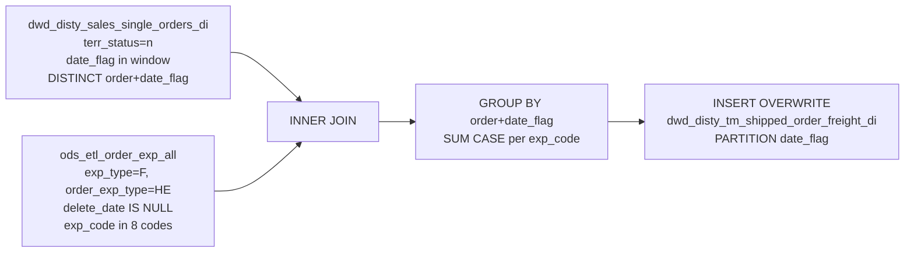

# DWD: TM Shipped Order Freight — Daily (`dwd_disty_tm_shipped_order_freight_di`)

- artifact_type: etl_table
- artifact_id: dw_us.dwd_disty_tm_shipped_order_freight_di
- domain: order
- one_line_purpose: This job produces a **pivoted freight cost table** for shipped single orders, turning eight specific freight-related expense codes into individual columns on one row per order. Rather than requiring downstream queries to parse and filter th...
- layer_type: DWD
- source_kind: etl_sql
- evidence_source: source/etl/sql/order/source/etl/flows/public_order_tools/ingest/public_order_dw/script/dwd_disty_tm_shipped_order_freight_di.sql

---

## L1 Data Foundation

### Identity and physical mapping
- **Table:** `dw_us.dwd_disty_tm_shipped_order_freight_di`
- **Layer type:** DWD
- **Canonical / derived:** Derived / ETL-loaded (see L3)
- **Owner team:** not registered in metadata catalog

### Grain, scope, exclusions
- **Grain:** one row per `(order_no, order_type, date_flag)` — a single shipped order aggregated across all its freight expense lines.
- **Scope:** See L2 business purpose / L3 filters
- **Partition:** `date_flag` — from `dwd_disty_sales_single_orders_di`. - resolved from pipeline (see L4)
- **Natural key:** `order_no`, `order_type` within a `date_flag` partition.
- **Exclusions:** Not documented in repository

#### Grain detail (preserved)

- **Grain:** one row per `(order_no, order_type, date_flag)` — a single shipped order aggregated across all its freight expense lines.
- **Partition:** `date_flag` — from `dwd_disty_sales_single_orders_di`.
- **Natural key:** `order_no`, `order_type` within a `date_flag` partition.
- **Note:** Grain is at **order level**, not order line level. All freight expense codes across every line of the order are summed into one row.

---

### Cross-engine presence
| Engine | Present | Canonical FQN | Notes |
|--------|---------|---------------|-------|
| Hive | yes | `dwd_disty_tm_shipped_order_freight_di` | ETL target / intermediate per evidence script |
| Vertica | pending | `dwd_disty_tm_shipped_order_freight_di` | Confirm via hive2vertica flow evidence / MCP |

### Physical schema reference

Pointer block only - full column catalog lives in WKB L1 storage JSON.

| Field | Value |
|-------|-------|
| **Authoritative catalog** | WKB L1 storage seed (not duplicated in this file) |
| **entity_id** | `dw_us.dwd_disty_tm_shipped_order_freight_di` |
| **l1_catalog_seed** | `target/storage/wkb/snapshots/_snapshot_id_template/l1_catalog/{engine}_{schema}_{table}.json` |
| **column_count** | pending (run ddl_seed_writer) |
| **partition_keys** | `date_flag, dwd_disty_sales_single_orders_di` |
| **ddl_source** | pending Bitbucket DDL / Vertica metadata ingest |
| **retrieval** | `python -m tools.wkb.indexing.run_query --query "order dwd_disty_tm_shipped_order_freight_di schema" --intent find_table_schema` |

### Lineage
| Object | Role |
|--------|------|
| `dw_${country_code}.dwd_disty_sales_single_orders_di` | Order scope filter and date_flag |
| `ods_${country_code}.ods_etl_order_exp_all` | Freight expense source |
| `dw_${country_code}.dwd_disty_tm_shipped_order_freight_di` | **Target** — pivoted freight cost per order |

---

### Freshness and load path
| Item | Value |
|------|-------|
| Load pattern | See L3 end-to-end / INSERT pattern in evidence script |
| Schedule | Not documented in repository |
| Parameters | `country_code`, `start_date`, `end_date` |


---

## L2 Declarative Knowledge

### Business purpose
This job produces a **pivoted freight cost table** for shipped single orders, turning eight specific freight-related expense codes into individual columns on one row per order. Rather than requiring downstream queries to parse and filter the raw expense lines, this table gives finance, logistics, and reporting teams a clean, pre-aggregated view of each freight charge type against the orders that incurred them within the date window.

---

### Audience and use cases
| Audience | How they benefit |
|----------|-----------------|
| **Finance / operations** | Pre-pivoted freight charges per order — no need to filter and aggregate raw expense lines in every report. |
| **Logistics / carrier management** | `FRT`, `FDS`, `FADD`, `FSC`, `FWD` — distinct freight charge types to analyse carrier cost by component. |
| **Profitability reporting** | `MOF` (margin-of-freight), `COD`, `ASR` — non-standard freight charges alongside standard freight for P&L attribution. |

---

### Fact key resolution
- Natural key: `order_no`, `order_type` within a `date_flag` partition.
- FK / label-on attributes: see L3 dimension join patterns and step-by-step logic.
- Negative assertion: do not treat descriptive labels as grain keys unless listed under natural key.

### Time field semantics
- **date_flag / partition columns:** `date_flag` — from `dwd_disty_sales_single_orders_di`.
- Primary reporting filter should use the partition column(s) documented in L1; resolve values via L4.


### Metrics served

| Category | Column | Logical metric | Business reading |
|----------|--------|----------------|------------------|
| Measures | — | — | No measure columns mapped for this table. |

### Metric serving map

**Formula authority:** [`source/contracts/order/metric-index.md`](../../source/contracts/order/metric-index.md)

N/A — no measure columns mapped for this table.

### etl_metrics

No governed logical metrics from `source/contracts/order/metric-index.md` are mapped on this table.

---

### Metric serving map
N/A - not a `*_comb_mtd` / multi-period wide serving table (or map not present in legacy doc).


### Data products and column groups (preserved)

### Identifiers

- `order_no`, `order_type` — order keys

### Freight expense columns (pivoted)

| Column | Expense code | Meaning |
|--------|-------------|---------|
| `MOF` | MOF | Margin-of-freight charge |
| `ASR` | ASR | Additional service/recovery charge |
| `FDS` | FDS | Freight delivery surcharge |
| `FRT` | FRT | Standard freight charge |
| `FADD` | FADD | Additional freight charge |
| `COD` | COD | Cash on delivery charge |
| `FSC` | FSC | Fuel surcharge |
| `FWD` | FWD | Freight weight differential |

All columns are `NULL` when no expense record of that type exists for the order (SUM of empty CASE = NULL).

---

### etl_metrics

N/A - no calculable ETL formulas extracted from this document (passthrough / stored measures only, or formulas not documented).

---

## L3 Procedural Knowledge

### Query and routing rules
**Business filters:** Use partition / date keys from L1 grain for reporting scope.
**Technical predicates (load only):** See Key filters and step-by-step logic below.

### Dimension join patterns
| Dimension FQN | Join keys | Purpose | Evidence |
|---------------|-----------|---------|----------|
| See step-by-step / base tables | See L3 steps | Dimension enrichment | `source/etl/sql/order/source/etl/flows/public_order_tools/ingest/public_order_dw/script/dwd_disty_tm_shipped_order_freight_di.sql` |

### Key filters and ETL business logic
### Step 1 — Final `INSERT OVERWRITE` into `dwd_disty_tm_shipped_order_freight_di`

**Driving subquery (`o`):**
- `SELECT DISTINCT order_no, order_type, date_flag FROM dwd_disty_sales_single_orders_di WHERE date_flag >= '${start_date}' AND date_flag < '${end_date}' AND terr_status = 'n'`

**INNER JOIN to `ods_etl_order_exp_all` (`he`):**
- Keys: `o.order_no = he.order_no AND o.order_type = he.order_type`
- Additional filter: `he.delete_date IS NULL` AND `he.exp_type = 'F'` AND `he.order_exp_type = 'HE'` AND `he.exp_code IN ('MOF','ASR','FDS','FRT','FADD','COD','FSC','FWD')`

**GROUP BY:** `he.order_no, he.order_type, o.date_flag`

**Derived columns:**

| Column | Formula | Plain language |
|--------|---------|----------------|
| `MOF` | `SUM(CASE WHEN exp_code = 'MOF' THEN extended_exp END)` | Total MOF freight charge for the order; NULL if no MOF expense exists. |
| `ASR` | `SUM(CASE WHEN exp_code = 'ASR' THEN extended_exp END)` | Total ASR charge; NULL if absent. |
| `FDS` | `SUM(CASE WHEN exp_code = 'FDS' THEN extended_exp END)` | Total freight delivery surcharge; NULL if absent. |
| `FRT` | `SUM(CASE WHEN exp_code = 'FRT' THEN extended_exp END)` | Total standard freight charge; NULL if absent. |
| `FADD` | `SUM(CASE WHEN exp_code = 'FADD' THEN extended_exp END)` | Total additional freight charge; NULL if absent. |
| `COD` | `SUM(CASE WHEN exp_code = 'COD' THEN extended_exp END)` | Total COD charge; NULL if absent. |
| `FSC` | `SUM(CASE WHEN exp_code = 'FSC' THEN extended_...

### Standard time-filter SQL
```sql
-- relative period filter using resolved partition value (see L4)
SELECT *
FROM dwd_disty_tm_shipped_order_freight_di
WHERE /* partition predicate */ date_flag = '${partition_value}';
```

### End-to-end flow
**Runtime parameters:** `country_code`, `start_date`, `end_date`
**Target table:** `dw_${country_code}.dwd_disty_tm_shipped_order_freight_di`, partitioned by **`date_flag`**.

1. Read DISTINCT `(order_no, order_type, date_flag)` from `dwd_disty_sales_single_orders_di` filtered to `terr_status='n'` and date window.
2. INNER JOIN to `ods_etl_order_exp_all` on `order_no + order_type`; filter to non-deleted, freight-type, header-level, 8-code whitelist.
3. GROUP BY `order_no, order_type, date_flag`; SUM `extended_exp` into 8 pivoted columns.
4. **INSERT OVERWRITE** into target partitioned by `date_flag`.



---


#### High-level stages (preserved)

| Stage | Business meaning |
|-------|-----------------|
| **Order scope** | Reads DISTINCT `(order_no, order_type, date_flag)` from single-order territory-normalized records within the date window. |
| **Freight expense join** | INNER JOINs to the order expense table, keeping only non-deleted rows with `exp_type='F'` (freight), `order_exp_type='HE'` (header-level expense), and expense codes limited to the 8 freight codes. |
| **Pivot / aggregation** | SUMs each expense code's `extended_exp` into a dedicated column per order. |

**Parameters:** `country_code`, `start_date`, `end_date`

---


### Base tables register
| Object | Role in this job |
|--------|-----------------|
| `dw_${country_code}.dwd_disty_sales_single_orders_di` | **Order scope.** Provides DISTINCT `(order_no, order_type, date_flag)` for territory-normalized orders in the date window. Acts as the driver that limits which orders' freight costs are included. |
| `ods_${country_code}.ods_etl_order_exp_all` | **Freight expense source.** Provides `extended_exp` and `exp_code`. Filtered to: `delete_date IS NULL`, `exp_type = 'F'`, `order_exp_type = 'HE'`, `exp_code IN ('MOF','ASR','FDS','FRT','FADD','COD','FSC','FWD')`. |

**Temporary tables (inside the job only):** Inline subquery for the order scope; no named temp tables.

---

### Step-by-step logic
### Step 1 — Final `INSERT OVERWRITE` into `dwd_disty_tm_shipped_order_freight_di`

**Driving subquery (`o`):**
- `SELECT DISTINCT order_no, order_type, date_flag FROM dwd_disty_sales_single_orders_di WHERE date_flag >= '${start_date}' AND date_flag < '${end_date}' AND terr_status = 'n'`

**INNER JOIN to `ods_etl_order_exp_all` (`he`):**
- Keys: `o.order_no = he.order_no AND o.order_type = he.order_type`
- Additional filter: `he.delete_date IS NULL` AND `he.exp_type = 'F'` AND `he.order_exp_type = 'HE'` AND `he.exp_code IN ('MOF','ASR','FDS','FRT','FADD','COD','FSC','FWD')`

**GROUP BY:** `he.order_no, he.order_type, o.date_flag`

**Derived columns:**

| Column | Formula | Plain language |
|--------|---------|----------------|
| `MOF` | `SUM(CASE WHEN exp_code = 'MOF' THEN extended_exp END)` | Total MOF freight charge for the order; NULL if no MOF expense exists. |
| `ASR` | `SUM(CASE WHEN exp_code = 'ASR' THEN extended_exp END)` | Total ASR charge; NULL if absent. |
| `FDS` | `SUM(CASE WHEN exp_code = 'FDS' THEN extended_exp END)` | Total freight delivery surcharge; NULL if absent. |
| `FRT` | `SUM(CASE WHEN exp_code = 'FRT' THEN extended_exp END)` | Total standard freight charge; NULL if absent. |
| `FADD` | `SUM(CASE WHEN exp_code = 'FADD' THEN extended_exp END)` | Total additional freight charge; NULL if absent. |
| `COD` | `SUM(CASE WHEN exp_code = 'COD' THEN extended_exp END)` | Total COD charge; NULL if absent. |
| `FSC` | `SUM(CASE WHEN exp_code = 'FSC' THEN extended_exp END)` | Total fuel surcharge; NULL if absent. |
| `FWD` | `SUM(CASE WHEN exp_code = 'FWD' THEN extended_exp END)` | Total freight weight differential; NULL if absent. |
| `date_flag` | `o.date_flag` | Partition date from the single-orders driving table. |

---

### Relationship map (embedded)

| from_fqn | to_fqn | cardinality | join_keys | provenance |
|----------|--------|-------------|-----------|------------|
| `o` | `ods_${country_code}.ods_etl_order_exp_all` | many:1 | `o.order_no` = `he.order_no`; `o.order_type` = `he.order_type` | etl_sql (`source/etl/sql/order/public_order_scripts/public_order_dw/script/dwd_disty_tm_shipped_order_freight_di.sql:16`) |

### Special logic (embedded)

Not documented in repository

### Column / field derivations (from ETL SQL)

| target_column | expression_sql | upstream_columns | upstream_tables | transform_kind | evidence |
|---------------|----------------|------------------|-----------------|----------------|----------|
| `order_no` | `he.order_no` | `order_no` | `dw_${country_code}.dwd_disty_sales_single_orders_di`, `ods_${country_code}.ods_etl_order_exp_all` | passthrough | `source/etl/sql/order/public_order_scripts/public_order_dw/script/dwd_disty_tm_shipped_order_freight_di.sql:2` |
| `order_type` | `he.order_type` | `order_type` | `dw_${country_code}.dwd_disty_sales_single_orders_di`, `ods_${country_code}.ods_etl_order_exp_all` | passthrough | `source/etl/sql/order/public_order_scripts/public_order_dw/script/dwd_disty_tm_shipped_order_freight_di.sql:2` |
| `MOF` | `SUM(CASE WHEN he.exp_type = 'F' and he.order_exp_type = 'HE' and he.exp_code = 'MOF' THEN he.extended_exp END)` | `exp_type`, `F`, `order_exp_type`, `HE`, `exp_code`, `MOF`, `extended_exp` | `dw_${country_code}.dwd_disty_sales_single_orders_di`, `ods_${country_code}.ods_etl_order_exp_all` | case | `source/etl/sql/order/public_order_scripts/public_order_dw/script/dwd_disty_tm_shipped_order_freight_di.sql:3` |
| `ASR` | `SUM(CASE WHEN he.exp_type = 'F' and he.order_exp_type = 'HE' and he.exp_code = 'ASR' THEN he.extended_exp END)` | `exp_type`, `F`, `order_exp_type`, `HE`, `exp_code`, `ASR`, `extended_exp` | `dw_${country_code}.dwd_disty_sales_single_orders_di`, `ods_${country_code}.ods_etl_order_exp_all` | case | `source/etl/sql/order/public_order_scripts/public_order_dw/script/dwd_disty_tm_shipped_order_freight_di.sql:3` |
| `FDS` | `SUM(CASE WHEN he.exp_type = 'F' and he.order_exp_type = 'HE' and he.exp_code = 'FDS' THEN he.extended_exp END)` | `exp_type`, `F`, `order_exp_type`, `HE`, `exp_code`, `FDS`, `extended_exp` | `dw_${country_code}.dwd_disty_sales_single_orders_di`, `ods_${country_code}.ods_etl_order_exp_all` | case | `source/etl/sql/order/public_order_scripts/public_order_dw/script/dwd_disty_tm_shipped_order_freight_di.sql:3` |
| `FRT` | `SUM(CASE WHEN he.exp_type = 'F' and he.order_exp_type = 'HE' and he.exp_code = 'FRT' THEN he.extended_exp END)` | `exp_type`, `F`, `order_exp_type`, `HE`, `exp_code`, `FRT`, `extended_exp` | `dw_${country_code}.dwd_disty_sales_single_orders_di`, `ods_${country_code}.ods_etl_order_exp_all` | case | `source/etl/sql/order/public_order_scripts/public_order_dw/script/dwd_disty_tm_shipped_order_freight_di.sql:3` |
| `FADD` | `SUM(CASE WHEN he.exp_type = 'F' and he.order_exp_type = 'HE' and he.exp_code = 'FADD' THEN he.extended_exp END)` | `exp_type`, `F`, `order_exp_type`, `HE`, `exp_code`, `FADD`, `extended_exp` | `dw_${country_code}.dwd_disty_sales_single_orders_di`, `ods_${country_code}.ods_etl_order_exp_all` | case | `source/etl/sql/order/public_order_scripts/public_order_dw/script/dwd_disty_tm_shipped_order_freight_di.sql:3` |
| `COD` | `SUM(CASE WHEN he.exp_type = 'F' and he.order_exp_type = 'HE' and he.exp_code = 'COD' THEN he.extended_exp END)` | `exp_type`, `F`, `order_exp_type`, `HE`, `exp_code`, `COD`, `extended_exp` | `dw_${country_code}.dwd_disty_sales_single_orders_di`, `ods_${country_code}.ods_etl_order_exp_all` | case | `source/etl/sql/order/public_order_scripts/public_order_dw/script/dwd_disty_tm_shipped_order_freight_di.sql:3` |
| `FSC` | `SUM(CASE WHEN he.exp_type = 'F' and he.order_exp_type = 'HE' and he.exp_code = 'FSC' THEN he.extended_exp END)` | `exp_type`, `F`, `order_exp_type`, `HE`, `exp_code`, `FSC`, `extended_exp` | `dw_${country_code}.dwd_disty_sales_single_orders_di`, `ods_${country_code}.ods_etl_order_exp_all` | case | `source/etl/sql/order/public_order_scripts/public_order_dw/script/dwd_disty_tm_shipped_order_freight_di.sql:3` |
| `FWD` | `SUM(CASE WHEN he.exp_type = 'F' and he.order_exp_type = 'HE' and he.exp_code = 'FWD' THEN he.extended_exp END)` | `exp_type`, `F`, `order_exp_type`, `HE`, `exp_code`, `FWD`, `extended_exp` | `dw_${country_code}.dwd_disty_sales_single_orders_di`, `ods_${country_code}.ods_etl_order_exp_all` | case | `source/etl/sql/order/public_order_scripts/public_order_dw/script/dwd_disty_tm_shipped_order_freight_di.sql:3` |
| `date_flag` | `o.date_flag` | `date_flag` | `dw_${country_code}.dwd_disty_sales_single_orders_di`, `ods_${country_code}.ods_etl_order_exp_all` | passthrough | `source/etl/sql/order/public_order_scripts/public_order_dw/script/dwd_disty_tm_shipped_order_freight_di.sql:11` |

### Sentinel and code values
| Value | Meaning |
|-------|---------|
| `exp_type = 'F'` | Freight-type expense (as opposed to rebate, surcharge, etc.). |
| `order_exp_type = 'HE'` | Header-level expense (as opposed to line-level `DE`). |
| `delete_date IS NULL` | Only active, non-deleted expense records. |
| `terr_status = 'n'` | Territory-normalized orders only — same filter as other analytics tables. |
| NULL column value | No expense record of that code exists for the order in this period. |

---

---

## L4 Validation

### Resolved partition value
| Step | Source | How partition / date scope is determined |
|------|--------|------------------------------------------|
| 1 | evidence script / flow | See parameters in L1 Freshness and L3 filters - `source/etl/sql/order/source/etl/flows/public_order_tools/ingest/public_order_dw/script/dwd_disty_tm_shipped_order_freight_di.sql` |

**Plain language:** Partition and date scope follow Azkaban/bootstrap parameters documented in the source script and orchestrating flow; do not hardcode calendar literals.

### Data quality checks
- Prefer row-count-by-partition, metric sums, and grain duplicate checks (see Validation SQL).
- Additional checks from legacy caveats / operational notes when present.

### Validation SQL
```sql
-- 1) Row count by partition
SELECT ${partition_col}, COUNT(*) AS row_cnt
FROM dw_${country_code}.dwd_disty_tm_shipped_order_freight_di
WHERE ${partition_col} = '${partition_value}'
GROUP BY ${partition_col};

-- 2) Metric sum by business dimension (top deltas)
SELECT ${dim_key}, SUM(${metric}) AS metric_sum
FROM dw_${country_code}.dwd_disty_tm_shipped_order_freight_di
WHERE ${partition_col} = '${partition_value}'
GROUP BY ${dim_key}
ORDER BY ABS(SUM(${metric})) DESC
LIMIT 20;

-- 3) Grain duplicate check
SELECT ${grain_key_1}, ${grain_key_2}, ${grain_key_3}, ${partition_col}, COUNT(*) AS cnt
FROM dw_${country_code}.dwd_disty_tm_shipped_order_freight_di
WHERE ${partition_col} = '${partition_value}'
GROUP BY ${grain_key_1}, ${grain_key_2}, ${grain_key_3}, ${partition_col}
HAVING COUNT(*) > 1;
```

Replace placeholders from this file's Grain and keys / Data you can fetch sections, and use the resolved partition value from run scope.

### Caveats for interpretation
- **Order-level grain** — all freight charges across all lines of the same order are summed. This table cannot distinguish freight charges applied at different line levels.
- **NULL vs zero** — a NULL column means no matching expense record existed; it is not the same as zero freight cost. Use `COALESCE(FRT, 0)` when summing across types.
- **INNER JOIN to expenses** — orders with no freight-type header expenses at all will not appear in this table, even if they appear in `dwd_disty_sales_single_orders_di`.
- **Only `exp_type='F'` and `order_exp_type='HE'`** — line-level freight expenses (if any) are excluded.

---

### Conflicts and open questions
- Schedule, owner, SLA: Not documented in repository (unless preserved schedule evidence above).
- Vertica MCP verification: pending unless confirmed in L5.


---

## L5 Runtime View

### Query path and engine preference
| Role | Hive object | Vertica object | Sync mode | Evidence | MCP verified |
|------|-------------|----------------|-----------|----------|--------------|
| **Query for reporting** | *See script lineage* | `dw_${country_code}.dwd_disty_tm_shipped_order_freight_di` | *Verify from flow* | *Add flow file:line* | pending |
| **Hive alternative** | `*` | `dw_${country_code}.dwd_disty_tm_shipped_order_freight_di` | - | *See dependencies* | - |
| **ETL internal** | staging/temp tables | *Not synced to Vertica* | - | *See step-by-step logic* | - |

Business users should query `dw_${country_code}.dwd_disty_tm_shipped_order_freight_di` in Vertica once MCP verification is completed for this document.

### Access constraints
- Country / company schema parameters may apply (`literal_country`, `company_no`, etc.).
- Hive-only staging objects are not reporting surfaces unless synced.

### Query risk profile
| Field | Value |
|-------|-------|
| requires_date_predicate | yes |
| scan_risk_tier | high |

---

## L6 Access and Consumption

### Primary consumers and use cases
| Audience | How they benefit |
|----------|-----------------|
| **Finance / operations** | Pre-pivoted freight charges per order — no need to filter and aggregate raw expense lines in every report. |
| **Logistics / carrier management** | `FRT`, `FDS`, `FADD`, `FSC`, `FWD` — distinct freight charge types to analyse carrier cost by component. |
| **Profitability reporting** | `MOF` (margin-of-freight), `COD`, `ASR` — non-standard freight charges alongside standard freight for P&L attribution. |

---

### Representative query patterns
```sql
-- certified / illustrative lookup - replace predicates from L1/L4
SELECT *
FROM dwd_disty_tm_shipped_order_freight_di
WHERE date_flag = '${partition_value}'
LIMIT 100;
```

### Dependencies and notes
### Upstream objects (verified)

| Object | Usage | Evidence |
|--------|-------|----------|
| `dw_${country_code}.dwd_disty_sales_single_orders_di` | Order scope; `terr_status='n'`; date window | `dwd_disty_tm_shipped_order_freight_di.sql:13-15` |
| `ods_${country_code}.ods_etl_order_exp_all` | Freight expense pivot source | `dwd_disty_tm_shipped_order_freight_di.sql:16-19` |

### Downstream consumers (verified)

| Object / script | Evidence |
|-----------------|----------|
| None identified in repository. | — |

### Operational detail (verified)

- Partition overwrite: `INSERT OVERWRITE TABLE dw_${country_code}.dwd_disty_tm_shipped_order_freight_di PARTITION (date_flag)` — `dwd_disty_tm_shipped_order_freight_di.sql:1`

### Not documented in repository

- Schedule, owner, SLA — not in scripts or configs

---

*Document generated from `source/etl/sql/order/source/etl/flows/public_order_tools/ingest/public_order_dw/script/dwd_disty_tm_shipped_order_freight_di.sql`.*

#### Not documented in repository
- Owner, SLA (unless schedule evidence preserved above)
- Any dependency without `file:line` evidence in this document

---

*Document migrated to L1-L6 from legacy Knowledgebase content. Evidence: `source/etl/sql/order/source/etl/flows/public_order_tools/ingest/public_order_dw/script/dwd_disty_tm_shipped_order_freight_di.sql`.*
