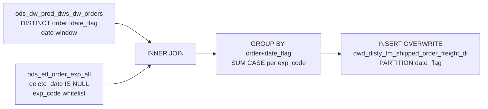

# DWD: TM Shipped Order Freight — HYVE Daily (`dwd_disty_tm_shipped_order_freight_di_hyve`)

- artifact_type: etl_table
- artifact_id: dw_hyus.dwd_disty_tm_shipped_order_freight_di
- domain: order
- one_line_purpose: HYVE-region load path that pivots eight header freight expense codes onto shipped orders driven from `ods_dw_prod_dws_dw_orders`.
- layer_type: DWD
- source_kind: etl_sql
- evidence_source: source/etl/sql/order/public_order_scripts/public_order_dw/script/dwd_disty_tm_shipped_order_freight_di_hyve.sql

---

## L1 Data Foundation

### Identity and physical mapping
- **Table:** `dw_${country_code}.dwd_disty_tm_shipped_order_freight_di` (same physical target as non-HYVE script `dwd_disty_tm_shipped_order_freight_di.sql`)
- **Layer type:** DWD
- **Canonical / derived:** Derived / ETL-loaded (HYVE script variant)
- **Owner team:** not registered in metadata catalog
- **Script variant note:** Invoked by HYVE country flows (`hyus`, `hyuk`, `hycn`, `hyww`) as job `dwd_disty_tm_shipped_order_freight_di` with this `_hyve.sql` path. Traditional disty regions use the non-`_hyve` script.

### Grain, scope, exclusions
- **Grain:** one row per `(order_no, order_type, date_flag)` — shipped order freight aggregated across matching expense lines.
- **Scope:** Orders present in `ods_dw_prod_dws_dw_orders` within `${start_date}` … `${end_date}`, joined to non-deleted expenses in the eight-code whitelist.
- **Partition:** `date_flag` — from driving ODS orders subquery (dynamic partition column).
- **Natural key:** `order_no`, `order_type` within `date_flag`.
- **Exclusions:** Deleted expenses; expense codes outside whitelist. No `terr_status` filter in this HYVE script (unlike US non-hyve script).

### Cross-engine presence
| Engine | Present | Canonical FQN | Notes |
|--------|---------|---------------|-------|
| Hive | yes | `dw_${country_code}.dwd_disty_tm_shipped_order_freight_di` | ETL target |
| Vertica | yes | same FQN | hive2vertica overwrite after load |

### Physical schema reference

| Field | Value |
|-------|-------|
| **Authoritative catalog** | WKB L1 storage seed (not duplicated in this file) |
| **entity_id** | `dw_hyus.dwd_disty_tm_shipped_order_freight_di` |
| **l1_catalog_seed** | `target/storage/wkb/snapshots/_snapshot_id_template/l1_catalog/{engine}_{schema}_{table}.json` |
| **column_count** | pending (run ddl_seed_writer) |
| **partition_keys** | `date_flag` |
| **ddl_source** | pending Bitbucket DDL / Vertica metadata ingest |
| **retrieval** | `python -m tools.wkb.indexing.run_query --query "order dwd_disty_tm_shipped_order_freight_di schema" --intent find_table_schema` |

### Lineage
- **upstream:** `ods_${country_code}.ods_dw_prod_dws_dw_orders` — DISTINCT order scope + `date_flag` — `dwd_disty_tm_shipped_order_freight_di_hyve.sql:13-14`
- **upstream:** `ods_${country_code}.ods_etl_order_exp_all` — freight expense pivot — `dwd_disty_tm_shipped_order_freight_di_hyve.sql:15-18`
- **downstream:** Vertica sync `hive2vertica-overwrite-dwd_disty_tm_shipped_order_freight_di` — `public_order_dw_hyus_level2.flow:330-339`

### Freshness and load path
| Item | Value |
|------|-------|
| Load pattern | `INSERT OVERWRITE` dynamic partition `date_flag` |
| Schedule | Not documented in repository |
| Parameters | `country_code`, `start_date`, `end_date` |
| Orchestration | HYVE `public_order_dw_*_level2.flow` / `*_m.flow` job `dwd_disty_tm_shipped_order_freight_di` |

---

## L2 Declarative Knowledge

### Business purpose
HYVE-region daily job that produces a **pivoted freight cost table** for shipped orders: eight freight expense codes become columns on one row per order and `date_flag`. Order scope comes from `ods_dw_prod_dws_dw_orders` (HYVE ODS product orders), not from `dwd_disty_sales_single_orders_di` used by the traditional disty script.

### Audience and use cases
| Audience | How they benefit |
|----------|-----------------|
| **Finance / operations** | Pre-pivoted freight charges per shipped order in HYVE schemas. |
| **Logistics** | Freight component breakdown (`FRT`, `FDS`, `FADD`, `FSC`, `FWD`, `MOF`, `COD`, `ASR`). |

### Fact key resolution
- Natural key: `order_no`, `order_type` within `date_flag`.
- Negative assertion: do not treat freight amount columns as grain keys.

### Time field semantics
- **date_flag:** from driving DISTINCT subquery on `ods_dw_prod_dws_dw_orders`; also the INSERT partition column.

### Metrics served
| Category | Columns | Business reading |
|----------|---------|------------------|
| Freight pivots | `MOF`, `ASR`, `FDS`, `FRT`, `FADD`, `COD`, `FSC`, `FWD` | Sum of `extended_exp` for matching header freight CASE |

### Metric serving map
N/A — not a `*_comb_mtd` / multi-period wide serving table.

### etl_metrics
No governed logical metrics from `source/contracts/order/metric-index.md` are calculated in this script.

---

## L3 Procedural Knowledge

### Query and routing rules
**Business filters:** Date window on ODS orders; non-deleted expenses; eight-code whitelist; CASE requires `exp_type='F'` and `order_exp_type='HE'`.
**Technical predicates (load only):** `date_flag >= '${start_date}' AND date_flag < '${end_date}'` on driving subquery.

### Dimension join patterns
| Dimension FQN | Join keys | Purpose | Evidence |
|---------------|-----------|---------|----------|
| None | — | No dimension tables | `dwd_disty_tm_shipped_order_freight_di_hyve.sql:12-16` |

### Key filters and ETL business logic
- Driving date window — `date_flag >= '${start_date}' AND date_flag < '${end_date}'` — `dwd_disty_tm_shipped_order_freight_di_hyve.sql:14`
- Active expense — `he.delete_date IS NULL` — `dwd_disty_tm_shipped_order_freight_di_hyve.sql:17`
- Code whitelist — `he.exp_code IN ('MOF','ASR','FDS','FRT','FADD','COD','FSC','FWD')` — `dwd_disty_tm_shipped_order_freight_di_hyve.sql:18`
- Join — `o.order_no = he.order_no AND o.order_type = he.order_type` — `dwd_disty_tm_shipped_order_freight_di_hyve.sql:16`
- **Special logic applied in this ETL:** SUM(CASE) pivot when `exp_type='F'` and `order_exp_type='HE'` per code — `dwd_disty_tm_shipped_order_freight_di_hyve.sql:3-10`
- **Difference vs non-HYVE script:** driver is `ods_dw_prod_dws_dw_orders` (no `terr_status='n'` filter); non-HYVE uses `dwd_disty_sales_single_orders_di` with `terr_status='n'`

### Special logic (embedded)
Not documented in repository (`source/ref/order/special_logic.txt` not present).

### Standard time-filter SQL
```sql
SELECT *
FROM dw_${country_code}.dwd_disty_tm_shipped_order_freight_di
WHERE date_flag >= '${start_date}'
  AND date_flag < '${end_date}'
;
```

### End-to-end flow
1. DISTINCT `(order_no, order_type, date_flag)` from `ods_dw_prod_dws_dw_orders` in date window.
2. INNER JOIN `ods_etl_order_exp_all` on order keys; filter non-deleted + whitelist.
3. GROUP BY `order_no`, `order_type`, `date_flag`; pivot eight freight columns.
4. INSERT OVERWRITE partitioned by `date_flag`.



### Base tables register
| Object | Role in this job |
|--------|-----------------|
| `ods_${country_code}.ods_dw_prod_dws_dw_orders` | Order scope + `date_flag` driver |
| `ods_${country_code}.ods_etl_order_exp_all` | Freight expense source |
| `dw_${country_code}.dwd_disty_tm_shipped_order_freight_di` | Target |

### Relationship map (embedded)
| from_fqn | to_fqn | cardinality | join_keys | provenance |
|----------|--------|-------------|-----------|------------|
| `ods_${country_code}.ods_dw_prod_dws_dw_orders` | `ods_${country_code}.ods_etl_order_exp_all` | 1:many | `order_no`, `order_type` | etl_sql |
| `ods_${country_code}.ods_etl_order_exp_all` | `dw_${country_code}.dwd_disty_tm_shipped_order_freight_di` | many:1 (agg) | `order_no`, `order_type`, `date_flag` | etl_sql |

### Step-by-step logic
#### Step 1 — Driving subquery `o`
**Source:** `SELECT DISTINCT order_no, order_type, date_flag FROM ods_dw_prod_dws_dw_orders WHERE date_flag >= '${start_date}' AND date_flag < '${end_date}'`.

#### Step 2 — Final INSERT
**INNER JOIN** `ods_etl_order_exp_all` `he` on order keys; filters as above; GROUP BY `he.order_no`, `he.order_type`, `o.date_flag`.

### Column / field derivations (from ETL SQL)

| target_column | expression_sql | upstream_columns | upstream_tables | transform_kind | evidence |
|---------------|----------------|------------------|-----------------|----------------|----------|
| `order_no` | `he.order_no` | `order_no` | `ods_etl_order_exp_all` | passthrough | `dwd_disty_tm_shipped_order_freight_di_hyve.sql:2` |
| `order_type` | `he.order_type` | `order_type` | `ods_etl_order_exp_all` | passthrough | `dwd_disty_tm_shipped_order_freight_di_hyve.sql:2` |
| `MOF` | `SUM(CASE WHEN he.exp_type='F' AND he.order_exp_type='HE' AND he.exp_code='MOF' THEN he.extended_exp END)` | `exp_type`, `order_exp_type`, `exp_code`, `extended_exp` | `ods_etl_order_exp_all` | case+agg | `dwd_disty_tm_shipped_order_freight_di_hyve.sql:3` |
| `ASR` | `SUM(CASE WHEN … exp_code='ASR' THEN he.extended_exp END)` | same | `ods_etl_order_exp_all` | case+agg | `dwd_disty_tm_shipped_order_freight_di_hyve.sql:4` |
| `FDS` | `SUM(CASE WHEN … exp_code='FDS' THEN he.extended_exp END)` | same | `ods_etl_order_exp_all` | case+agg | `dwd_disty_tm_shipped_order_freight_di_hyve.sql:5` |
| `FRT` | `SUM(CASE WHEN … exp_code='FRT' THEN he.extended_exp END)` | same | `ods_etl_order_exp_all` | case+agg | `dwd_disty_tm_shipped_order_freight_di_hyve.sql:6` |
| `FADD` | `SUM(CASE WHEN … exp_code='FADD' THEN he.extended_exp END)` | same | `ods_etl_order_exp_all` | case+agg | `dwd_disty_tm_shipped_order_freight_di_hyve.sql:7` |
| `COD` | `SUM(CASE WHEN … exp_code='COD' THEN he.extended_exp END)` | same | `ods_etl_order_exp_all` | case+agg | `dwd_disty_tm_shipped_order_freight_di_hyve.sql:8` |
| `FSC` | `SUM(CASE WHEN … exp_code='FSC' THEN he.extended_exp END)` | same | `ods_etl_order_exp_all` | case+agg | `dwd_disty_tm_shipped_order_freight_di_hyve.sql:9` |
| `FWD` | `SUM(CASE WHEN … exp_code='FWD' THEN he.extended_exp END)` | same | `ods_etl_order_exp_all` | case+agg | `dwd_disty_tm_shipped_order_freight_di_hyve.sql:10` |
| `date_flag` | `o.date_flag` | `date_flag` | `ods_dw_prod_dws_dw_orders` | passthrough | `dwd_disty_tm_shipped_order_freight_di_hyve.sql:11` |

### Sentinel and code values
| Value | Type | Meaning |
|-------|------|---------|
| `exp_type = 'F'` | business_filter | Freight-type expense (CASE) |
| `order_exp_type = 'HE'` | business_filter | Header-level expense (CASE) |
| `delete_date IS NULL` | business_filter | Non-deleted expense |
| NULL freight column | data_quality_sentinel | No matching expense for that code |

---

## L4 Validation

### Resolved partition value
| Step | Source | How `[date_flag]` is determined |
|------|--------|---------------------------------|
| 1 | Azkaban | Flow passes `start_date` / `end_date` — `public_order_dw_hyus_level2.flow:272-285` |
| 2 | Driving subquery | DISTINCT `date_flag` from ODS orders in window — `dwd_disty_tm_shipped_order_freight_di_hyve.sql:13-14` |
| 3 | INSERT | Dynamic `PARTITION (date_flag)` — `dwd_disty_tm_shipped_order_freight_di_hyve.sql:1` |

**Plain language:** Output partitions equal distinct order `date_flag` values inside the job date window.

### Data quality checks
- Row count by `date_flag`.
- Grain duplicate check on `(order_no, order_type, date_flag)`.
- Compare HYVE vs disty script scope if reconciling regions (different drivers).

### Validation SQL
```sql
-- 1) row count by partition
SELECT date_flag, COUNT(*) AS row_cnt
FROM dw_${country_code}.dwd_disty_tm_shipped_order_freight_di
WHERE date_flag >= '${start_date}' AND date_flag < '${end_date}'
GROUP BY date_flag
;

-- 2) freight sum by order_type
SELECT order_type, SUM(COALESCE(FRT,0)) AS frt_sum
FROM dw_${country_code}.dwd_disty_tm_shipped_order_freight_di
WHERE date_flag >= '${start_date}' AND date_flag < '${end_date}'
GROUP BY order_type
ORDER BY ABS(SUM(COALESCE(FRT,0))) DESC
LIMIT 20
;

-- 3) grain duplicate check
SELECT order_no, order_type, date_flag, COUNT(*) AS cnt
FROM dw_${country_code}.dwd_disty_tm_shipped_order_freight_di
WHERE date_flag >= '${start_date}' AND date_flag < '${end_date}'
GROUP BY order_no, order_type, date_flag
HAVING COUNT(*) > 1
;
```

### Caveats for interpretation
- Order-level grain; line-level freight not retained.
- NULL vs zero for missing expense codes.
- INNER JOIN drops orders with no matching whitelist expenses.
- HYVE driver differs from traditional disty script — do not assume identical populations across regions.

### Conflicts and open questions
- Same target table name as non-HYVE script; load path differs by region flow — confirmed in level2 flows.
- Schedule, owner, SLA: Not documented in repository.

---

## L5 Runtime View

### Query path and engine preference
| Role | Hive object | Vertica object | Sync mode | Evidence | MCP verified |
|------|-------------|----------------|-----------|----------|--------------|
| Reporting | `dw_${country_code}.dwd_disty_tm_shipped_order_freight_di` | same | overwrite | `public_order_dw_hyus_level2.flow:330-339` | pending |
| ETL (HYVE) | same | — | INSERT OVERWRITE | `_hyve.sql:1` | — |

### Access constraints
- Use HYVE country schemas (`hyus`, `hyuk`, `hycn`, `hyww`) when this script path is the loader.
- Always filter `date_flag`.

### Query risk profile
| Field | Value |
|-------|-------|
| requires_date_predicate | yes |
| scan_risk_tier | high |

---

## L6 Access and Consumption

### Primary consumers and use cases
| Audience | How they benefit |
|----------|-----------------|
| **Finance / operations** | Shipped-order freight pivots in HYVE |
| **Logistics** | Freight component analysis |

### Representative query patterns
```sql
SELECT order_no, order_type, date_flag, FRT, FSC, MOF
FROM dw_${country_code}.dwd_disty_tm_shipped_order_freight_di
WHERE date_flag >= '${start_date}' AND date_flag < '${end_date}'
LIMIT 100
;
```

### Dependencies and notes
### Upstream objects (verified)

| Object | Usage | Evidence |
|--------|-------|----------|
| `ods_${country_code}.ods_dw_prod_dws_dw_orders` | Order + date_flag driver | `dwd_disty_tm_shipped_order_freight_di_hyve.sql:13-14` |
| `ods_${country_code}.ods_etl_order_exp_all` | Expense pivot | `dwd_disty_tm_shipped_order_freight_di_hyve.sql:15-18` |

### Downstream consumers (verified)

| Object / script | Evidence |
|-----------------|----------|
| Vertica sync `hive2vertica-overwrite-dwd_disty_tm_shipped_order_freight_di` | `public_order_dw_hyus_level2.flow:330-339` |
| Other Hive SQL consumers | None identified in repository |

### Operational detail (verified)
- HYVE level2 script path: `./public_order_dw/script/dwd_disty_tm_shipped_order_freight_di_hyve.sql` — `public_order_dw_hyus_level2.flow:279`
- Also referenced in `public_order_dw_hyuk|hycn|hyww_level2.flow` and HYVE `*_m.flow` files

### Not documented in repository
- Schedule, owner, SLA
- Business definitions of freight codes beyond SQL literals
