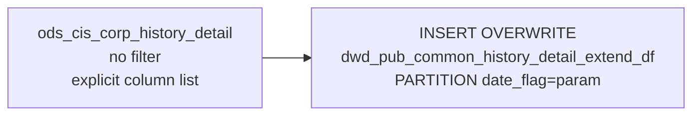

# DWD: History Order Detail Extended — Daily Snapshot (`dwd_pub_common_history_detail_extend_df`)

- artifact_type: etl_table
- artifact_id: dw_us.dwd_pub_common_history_detail_extend_df
- domain: order
- one_line_purpose: This job creates a **daily point-in-time snapshot of all settled/archived order line detail** from the history detail table. It is a full passthrough of `ods_cis_corp_history_detail` with an explicit column list — capturing every order line...
- layer_type: DWD
- source_kind: etl_sql
- evidence_source: source/etl/sql/order/source/etl/flows/public_order_tools/ingest/public_order_dw/script/dwd_pub_common_history_detail_extend_df.sql

---

## L1 Data Foundation

### Identity and physical mapping
- **Table:** `dw_us.dwd_pub_common_history_detail_extend_df`
- **Layer type:** DWD
- **Canonical / derived:** Derived / ETL-loaded (see L3)
- **Owner team:** not registered in metadata catalog

### Grain, scope, exclusions
- **Grain:** one row per `(order_type, order_no, order_line_no)` — a unique settled order line.
- **Scope:** See L2 business purpose / L3 filters
- **Partition:** `date_flag = '${date_flag}'` — literal run date; the entire partition is replaced on each run. - resolved from pipeline (see L4)
- **Natural key:** `order_type`, `order_no`, `order_line_no` within a `date_flag` partition.
- **Exclusions:** Not documented in repository

#### Grain detail (preserved)

- **Grain:** one row per `(order_type, order_no, order_line_no)` — a unique settled order line.
- **Partition:** `date_flag = '${date_flag}'` — literal run date; the entire partition is replaced on each run.
- **Natural key:** `order_type`, `order_no`, `order_line_no` within a `date_flag` partition.

---

### Cross-engine presence
| Engine | Present | Canonical FQN | Notes |
|--------|---------|---------------|-------|
| Hive | yes | `dwd_pub_common_history_detail_extend_df` | ETL target / intermediate per evidence script |
| Vertica | pending | `dwd_pub_common_history_detail_extend_df` | Confirm via hive2vertica flow evidence / MCP |

### Physical schema reference

Pointer block only - full column catalog lives in WKB L1 storage JSON.

| Field | Value |
|-------|-------|
| **Authoritative catalog** | WKB L1 storage seed (not duplicated in this file) |
| **entity_id** | `dw_us.dwd_pub_common_history_detail_extend_df` |
| **l1_catalog_seed** | `target/storage/wkb/snapshots/_snapshot_id_template/l1_catalog/{engine}_{schema}_{table}.json` |
| **column_count** | pending (run ddl_seed_writer) |
| **partition_keys** | `date_flag = '${date_flag}'` |
| **ddl_source** | pending Bitbucket DDL / Vertica metadata ingest |
| **retrieval** | `python -m tools.wkb.indexing.run_query --query "order dwd_pub_common_history_detail_extend_df schema" --intent find_table_schema` |

### Lineage
| Object | Role |
|--------|------|
| `ods_${country_code}.ods_cis_corp_history_detail` | Sole source — all history order line detail |
| `dw_${country_code}.dwd_pub_common_history_detail_extend_df` | **Target** — daily snapshot of history order line detail |

---

### Freshness and load path
| Item | Value |
|------|-------|
| Load pattern | See L3 end-to-end / INSERT pattern in evidence script |
| Schedule | Not documented in repository |
| Parameters | `country_code`, `date_flag` |


---

## L2 Declarative Knowledge

### Business purpose
This job creates a **daily point-in-time snapshot of all settled/archived order line detail** from the history detail table. It is a full passthrough of `ods_cis_corp_history_detail` with an explicit column list — capturing every order line attribute including quantities, pricing fields, cost fields, reference links, kit structure, GL account, and lifecycle dates. The snapshot provides a stable, dated copy of historical order line data for reconciliation, audit, and reporting workflows.

---

### Audience and use cases
| Audience | How they benefit |
|----------|-----------------|
| **Finance / reconciliation** | Dated snapshot of order line cost and price fields (`unit_cost`, `unit_price`, `claim_old_cost`, `claim_new_cost`, `sys_old_cost`, `sys_new_cost`) for cost basis auditing and variance analysis. |
| **Operations / fulfilment** | `order_qty`, `ship_qty`, `rec_qty`, `close_date`, `expected_date`, `rec_date` — complete order line fulfilment lifecycle fields. |
| **Product / procurement** | `vend_part_no`, `sku_no`, `loc_no`, `inv_type`, `gl_acct_no` — inventory and GL attribution per line. |
| **BI / reporting** | A stable, queryable daily copy of the history detail table without accessing the live ODS source. |

---

### Fact key resolution
- Natural key: `order_type`, `order_no`, `order_line_no` within a `date_flag` partition.
- FK / label-on attributes: see L3 dimension join patterns and step-by-step logic.
- Negative assertion: do not treat descriptive labels as grain keys unless listed under natural key.

### Time field semantics
- **date_flag / partition columns:** `date_flag = '${date_flag}'` — literal run date; the entire partition is replaced on each run.
- Primary reporting filter should use the partition column(s) documented in L1; resolve values via L4.


### Metrics served

| Category | Column | Logical metric | Business reading |
|----------|--------|----------------|------------------|
| Measures | — | — | No measure columns mapped for this table. |

### Metric serving map

**Formula authority:** [`source/contracts/order/metric-index.md`](../../source/contracts/order/metric-index.md)

N/A — no measure columns mapped for this table.

### etl_metrics

No governed logical metrics from `source/contracts/order/metric-index.md` are mapped on this table.

---

### Metric serving map
N/A - not a `*_comb_mtd` / multi-period wide serving table (or map not present in legacy doc).


### Data products and column groups (preserved)

### Identifiers

- `order_type`, `order_no`, `order_line_no`
- `int_ref_type`, `int_ref_no`, `int_ref_line_no` — internal reference chain (e.g. links back to the originating order)
- `ext_ref` — external reference number
- `kit_line_no`, `sub_kit_line_no` — kit structure (parent and sub-kit parent line numbers)
- `cc_loc_no` — cost centre location

### Product and inventory

- `sku_no`, `vend_part_no`, `loc_no`, `inv_type`, `gl_acct_no`

### Quantities

- `order_qty` — original ordered quantity
- `ship_qty` — shipped quantity
- `rec_qty` — received quantity

### Pricing and cost fields

- `unit_cost`, `unit_price` — actual line unit cost and price
- `sys_old_cost`, `sys_new_cost` — system cost before and after any adjustment
- `claim_old_cost`, `claim_new_cost` — claim cost before and after adjustment (contract/grid price)

### Dates and lifecycle

- `close_date`, `expected_date`, `rec_date` — order line close, expected delivery, and receipt dates
- `delete_date`, `delete_id` — soft-delete tracking
- `entry_datetime`, `entry_id` — creation metadata
- `release_id`, `release_date` — release control fields
- `dist_exp_date`, `prod_exp_date` — distributor and product expiration dates

### Other attributes

- `reqd_comp` — required completion indicator (trimmed)
- `pr_description` — purchase request description

---

### etl_metrics

N/A - no calculable ETL formulas extracted from this document (passthrough / stored measures only, or formulas not documented).

---

## L3 Procedural Knowledge

### Query and routing rules
**Business filters:** Use partition / date keys from L1 grain for reporting scope.
**Technical predicates (load only):** See Key filters and step-by-step logic below.

### Dimension join patterns
| Dimension FQN | Join keys | Purpose | Evidence |
|---------------|-----------|---------|----------|
| See step-by-step / base tables | See L3 steps | Dimension enrichment | `source/etl/sql/order/source/etl/flows/public_order_tools/ingest/public_order_dw/script/dwd_pub_common_history_detail_extend_df.sql` |

### Key filters and ETL business logic
### Step 1 — Final `INSERT OVERWRITE` into `dwd_pub_common_history_detail_extend_df`

**From:** `ods_${country_code}.ods_cis_corp_history_detail` (`d`)

**Filter:** None — all rows are loaded.

**Explicit pass-through columns:** `order_type`, `order_no`, `order_line_no`, `vend_part_no`, `loc_no`, `inv_type`, `sku_no`, `order_qty`, `ship_qty`, `rec_qty`, `unit_cost`, `unit_price`, `close_date`, `expected_date`, `rec_date`, `delete_date`, `entry_datetime`, `entry_id`, `int_ref_type`, `int_ref_no`, `int_ref_line_no`, `ext_ref`, `sys_old_cost`, `sys_new_cost`, `claim_old_cost`, `claim_new_cost`, `delete_id`, `kit_line_no`, `cc_loc_no`, `release_id`, `release_date`, `trim(d.reqd_comp)`, `dist_exp_date`, `prod_exp_date`, `pr_description`, `gl_acct_no`, `sub_kit_line_no`

**Note:** `reqd_comp` is trimmed — `trim(d.reqd_comp)` — all other columns are passed through without transformation.

---

### Standard time-filter SQL
```sql
-- relative period filter using resolved partition value (see L4)
SELECT *
FROM dwd_pub_common_history_detail_extend_df
WHERE /* partition predicate */ date_flag = '${partition_value}';
```

### End-to-end flow
**Runtime parameters:** `country_code`, `date_flag`
**Target table:** `dw_${country_code}.dwd_pub_common_history_detail_extend_df`, partitioned by **`date_flag = '${date_flag}'`** (literal).

1. Read all rows from `ods_cis_corp_history_detail` — no filter.
2. **INSERT OVERWRITE** into `dwd_pub_common_history_detail_extend_df PARTITION (date_flag='${date_flag}')`.



---


#### High-level stages (preserved)

| Stage | Business meaning |
|-------|-----------------|
| **Full passthrough with explicit column list** | Reads all rows from `ods_cis_corp_history_detail` and writes the full explicit column list into the daily partition. No filtering or transformation is applied. |
| **Daily partition overwrite** | Overwrites the `date_flag = '${date_flag}'` partition with the complete current state of the history detail table. |

**Parameters:** `country_code`, `date_flag`

---


### Base tables register
| Object | Role in this job |
|--------|-----------------|
| `ods_${country_code}.ods_cis_corp_history_detail` | **Sole source.** All settled/archived order line detail. All rows selected via an explicit column list; no row filter. |

**Temporary tables (inside the job only):** None.

---

### Step-by-step logic
### Step 1 — Final `INSERT OVERWRITE` into `dwd_pub_common_history_detail_extend_df`

**From:** `ods_${country_code}.ods_cis_corp_history_detail` (`d`)

**Filter:** None — all rows are loaded.

**Explicit pass-through columns:** `order_type`, `order_no`, `order_line_no`, `vend_part_no`, `loc_no`, `inv_type`, `sku_no`, `order_qty`, `ship_qty`, `rec_qty`, `unit_cost`, `unit_price`, `close_date`, `expected_date`, `rec_date`, `delete_date`, `entry_datetime`, `entry_id`, `int_ref_type`, `int_ref_no`, `int_ref_line_no`, `ext_ref`, `sys_old_cost`, `sys_new_cost`, `claim_old_cost`, `claim_new_cost`, `delete_id`, `kit_line_no`, `cc_loc_no`, `release_id`, `release_date`, `trim(d.reqd_comp)`, `dist_exp_date`, `prod_exp_date`, `pr_description`, `gl_acct_no`, `sub_kit_line_no`

**Note:** `reqd_comp` is trimmed — `trim(d.reqd_comp)` — all other columns are passed through without transformation.

---

### Relationship map (embedded)

| from_fqn | to_fqn | cardinality | join_keys | provenance |
|----------|--------|-------------|-----------|------------|
| `ods_${country_code}.ods_cis_corp_history_detail` | `ods_${country_code}.ods_cis_corp_history_detail` | 1:1 source scan | — (no JOIN; single FROM) | etl_sql (`source/etl/sql/order/public_order_scripts/public_order_dw/script/dwd_pub_common_history_detail_extend_df.sql:4`) |


### Special logic (embedded)

Not documented in repository

### Column / field derivations (from ETL SQL)

| target_column | expression_sql | upstream_columns | upstream_tables | transform_kind | evidence |
|---------------|----------------|------------------|-----------------|----------------|----------|
| `order_type` | `d.order_type` | `order_type` | `ods_${country_code}.ods_cis_corp_history_detail` | passthrough | `source/etl/sql/order/public_order_scripts/public_order_dw/script/dwd_pub_common_history_detail_extend_df.sql:2` |
| `order_no` | `d.order_no` | `order_no` | `ods_${country_code}.ods_cis_corp_history_detail` | passthrough | `source/etl/sql/order/public_order_scripts/public_order_dw/script/dwd_pub_common_history_detail_extend_df.sql:2` |
| `order_line_no` | `d.order_line_no` | `order_line_no` | `ods_${country_code}.ods_cis_corp_history_detail` | passthrough | `source/etl/sql/order/public_order_scripts/public_order_dw/script/dwd_pub_common_history_detail_extend_df.sql:2` |
| `vend_part_no` | `d.vend_part_no` | `vend_part_no` | `ods_${country_code}.ods_cis_corp_history_detail` | passthrough | `source/etl/sql/order/public_order_scripts/public_order_dw/script/dwd_pub_common_history_detail_extend_df.sql:2` |
| `loc_no` | `d.loc_no` | `loc_no` | `ods_${country_code}.ods_cis_corp_history_detail` | passthrough | `source/etl/sql/order/public_order_scripts/public_order_dw/script/dwd_pub_common_history_detail_extend_df.sql:2` |
| `inv_type` | `d.inv_type` | `inv_type` | `ods_${country_code}.ods_cis_corp_history_detail` | passthrough | `source/etl/sql/order/public_order_scripts/public_order_dw/script/dwd_pub_common_history_detail_extend_df.sql:2` |
| `sku_no` | `d.sku_no` | `sku_no` | `ods_${country_code}.ods_cis_corp_history_detail` | passthrough | `source/etl/sql/order/public_order_scripts/public_order_dw/script/dwd_pub_common_history_detail_extend_df.sql:2` |
| `order_qty` | `d.order_qty` | `order_qty` | `ods_${country_code}.ods_cis_corp_history_detail` | passthrough | `source/etl/sql/order/public_order_scripts/public_order_dw/script/dwd_pub_common_history_detail_extend_df.sql:2` |
| `ship_qty` | `d.ship_qty` | `ship_qty` | `ods_${country_code}.ods_cis_corp_history_detail` | passthrough | `source/etl/sql/order/public_order_scripts/public_order_dw/script/dwd_pub_common_history_detail_extend_df.sql:2` |
| `rec_qty` | `d.rec_qty` | `rec_qty` | `ods_${country_code}.ods_cis_corp_history_detail` | passthrough | `source/etl/sql/order/public_order_scripts/public_order_dw/script/dwd_pub_common_history_detail_extend_df.sql:2` |
| `unit_cost` | `d.unit_cost` | `unit_cost` | `ods_${country_code}.ods_cis_corp_history_detail` | passthrough | `source/etl/sql/order/public_order_scripts/public_order_dw/script/dwd_pub_common_history_detail_extend_df.sql:2` |
| `unit_price` | `d.unit_price` | `unit_price` | `ods_${country_code}.ods_cis_corp_history_detail` | passthrough | `source/etl/sql/order/public_order_scripts/public_order_dw/script/dwd_pub_common_history_detail_extend_df.sql:2` |
| `close_date` | `d.close_date` | `close_date` | `ods_${country_code}.ods_cis_corp_history_detail` | passthrough | `source/etl/sql/order/public_order_scripts/public_order_dw/script/dwd_pub_common_history_detail_extend_df.sql:2` |
| `expected_date` | `d.expected_date` | `expected_date` | `ods_${country_code}.ods_cis_corp_history_detail` | passthrough | `source/etl/sql/order/public_order_scripts/public_order_dw/script/dwd_pub_common_history_detail_extend_df.sql:2` |
| `rec_date` | `d.rec_date` | `rec_date` | `ods_${country_code}.ods_cis_corp_history_detail` | passthrough | `source/etl/sql/order/public_order_scripts/public_order_dw/script/dwd_pub_common_history_detail_extend_df.sql:2` |
| `delete_date` | `d.delete_date` | `delete_date` | `ods_${country_code}.ods_cis_corp_history_detail` | passthrough | `source/etl/sql/order/public_order_scripts/public_order_dw/script/dwd_pub_common_history_detail_extend_df.sql:2` |
| `entry_datetime` | `d.entry_datetime` | `entry_datetime` | `ods_${country_code}.ods_cis_corp_history_detail` | passthrough | `source/etl/sql/order/public_order_scripts/public_order_dw/script/dwd_pub_common_history_detail_extend_df.sql:2` |
| `entry_id` | `d.entry_id` | `entry_id` | `ods_${country_code}.ods_cis_corp_history_detail` | passthrough | `source/etl/sql/order/public_order_scripts/public_order_dw/script/dwd_pub_common_history_detail_extend_df.sql:2` |
| `int_ref_type` | `d.int_ref_type` | `int_ref_type` | `ods_${country_code}.ods_cis_corp_history_detail` | passthrough | `source/etl/sql/order/public_order_scripts/public_order_dw/script/dwd_pub_common_history_detail_extend_df.sql:2` |
| `int_ref_no` | `d.int_ref_no` | `int_ref_no` | `ods_${country_code}.ods_cis_corp_history_detail` | passthrough | `source/etl/sql/order/public_order_scripts/public_order_dw/script/dwd_pub_common_history_detail_extend_df.sql:2` |
| `int_ref_line_no` | `d.int_ref_line_no` | `int_ref_line_no` | `ods_${country_code}.ods_cis_corp_history_detail` | passthrough | `source/etl/sql/order/public_order_scripts/public_order_dw/script/dwd_pub_common_history_detail_extend_df.sql:2` |
| `ext_ref` | `d.ext_ref` | `ext_ref` | `ods_${country_code}.ods_cis_corp_history_detail` | passthrough | `source/etl/sql/order/public_order_scripts/public_order_dw/script/dwd_pub_common_history_detail_extend_df.sql:2` |
| `sys_old_cost` | `d.sys_old_cost` | `sys_old_cost` | `ods_${country_code}.ods_cis_corp_history_detail` | passthrough | `source/etl/sql/order/public_order_scripts/public_order_dw/script/dwd_pub_common_history_detail_extend_df.sql:2` |
| `sys_new_cost` | `d.sys_new_cost` | `sys_new_cost` | `ods_${country_code}.ods_cis_corp_history_detail` | passthrough | `source/etl/sql/order/public_order_scripts/public_order_dw/script/dwd_pub_common_history_detail_extend_df.sql:2` |
| `claim_old_cost` | `d.claim_old_cost` | `claim_old_cost` | `ods_${country_code}.ods_cis_corp_history_detail` | passthrough | `source/etl/sql/order/public_order_scripts/public_order_dw/script/dwd_pub_common_history_detail_extend_df.sql:2` |
| `claim_new_cost` | `d.claim_new_cost` | `claim_new_cost` | `ods_${country_code}.ods_cis_corp_history_detail` | passthrough | `source/etl/sql/order/public_order_scripts/public_order_dw/script/dwd_pub_common_history_detail_extend_df.sql:2` |
| `delete_id` | `d.delete_id` | `delete_id` | `ods_${country_code}.ods_cis_corp_history_detail` | passthrough | `source/etl/sql/order/public_order_scripts/public_order_dw/script/dwd_pub_common_history_detail_extend_df.sql:2` |
| `kit_line_no` | `d.kit_line_no` | `kit_line_no` | `ods_${country_code}.ods_cis_corp_history_detail` | passthrough | `source/etl/sql/order/public_order_scripts/public_order_dw/script/dwd_pub_common_history_detail_extend_df.sql:2` |
| `cc_loc_no` | `d.cc_loc_no` | `cc_loc_no` | `ods_${country_code}.ods_cis_corp_history_detail` | passthrough | `source/etl/sql/order/public_order_scripts/public_order_dw/script/dwd_pub_common_history_detail_extend_df.sql:2` |
| `release_id` | `d.release_id` | `release_id` | `ods_${country_code}.ods_cis_corp_history_detail` | passthrough | `source/etl/sql/order/public_order_scripts/public_order_dw/script/dwd_pub_common_history_detail_extend_df.sql:2` |
| `release_date` | `d.release_date` | `release_date` | `ods_${country_code}.ods_cis_corp_history_detail` | passthrough | `source/etl/sql/order/public_order_scripts/public_order_dw/script/dwd_pub_common_history_detail_extend_df.sql:2` |
| `reqd_comp` | `trim(d.reqd_comp)` | `reqd_comp` | `ods_${country_code}.ods_cis_corp_history_detail` | udf | `source/etl/sql/order/public_order_scripts/public_order_dw/script/dwd_pub_common_history_detail_extend_df.sql:2` |
| `dist_exp_date` | `d.dist_exp_date` | `dist_exp_date` | `ods_${country_code}.ods_cis_corp_history_detail` | passthrough | `source/etl/sql/order/public_order_scripts/public_order_dw/script/dwd_pub_common_history_detail_extend_df.sql:2` |
| `prod_exp_date` | `d.prod_exp_date` | `prod_exp_date` | `ods_${country_code}.ods_cis_corp_history_detail` | passthrough | `source/etl/sql/order/public_order_scripts/public_order_dw/script/dwd_pub_common_history_detail_extend_df.sql:2` |
| `pr_description` | `d.pr_description` | `pr_description` | `ods_${country_code}.ods_cis_corp_history_detail` | passthrough | `source/etl/sql/order/public_order_scripts/public_order_dw/script/dwd_pub_common_history_detail_extend_df.sql:2` |
| `gl_acct_no` | `d.gl_acct_no` | `gl_acct_no` | `ods_${country_code}.ods_cis_corp_history_detail` | passthrough | `source/etl/sql/order/public_order_scripts/public_order_dw/script/dwd_pub_common_history_detail_extend_df.sql:2` |
| `sub_kit_line_no` | `d.sub_kit_line_no` | `sub_kit_line_no` | `ods_${country_code}.ods_cis_corp_history_detail` | passthrough | `source/etl/sql/order/public_order_scripts/public_order_dw/script/dwd_pub_common_history_detail_extend_df.sql:2` |

### Sentinel and code values
| Value | Meaning |
|-------|---------|
| `kit_line_no IS NOT NULL` | This order line is a kit component — belongs to a bundled product order. |
| `sub_kit_line_no IS NOT NULL` | This line is nested within a sub-kit. |
| `delete_date IS NOT NULL` | Soft-deleted order detail line — record still exists but is marked as deleted. |
| `trim(reqd_comp)` | `reqd_comp` may have leading/trailing whitespace in the source; it is trimmed on load. |

---

---

## L4 Validation

### Resolved partition value
| Step | Source | How partition / date scope is determined |
|------|--------|------------------------------------------|
| 1 | evidence script / flow | See parameters in L1 Freshness and L3 filters - `source/etl/sql/order/source/etl/flows/public_order_tools/ingest/public_order_dw/script/dwd_pub_common_history_detail_extend_df.sql` |

**Plain language:** Partition and date scope follow Azkaban/bootstrap parameters documented in the source script and orchestrating flow; do not hardcode calendar literals.

### Data quality checks
- Prefer row-count-by-partition, metric sums, and grain duplicate checks (see Validation SQL).
- Additional checks from legacy caveats / operational notes when present.

### Validation SQL
```sql
-- 1) Row count by partition
SELECT ${partition_col}, COUNT(*) AS row_cnt
FROM dw_${country_code}.dwd_pub_common_history_detail_extend_df
WHERE ${partition_col} = '${partition_value}'
GROUP BY ${partition_col};

-- 2) Metric sum by business dimension (top deltas)
SELECT ${dim_key}, SUM(${metric}) AS metric_sum
FROM dw_${country_code}.dwd_pub_common_history_detail_extend_df
WHERE ${partition_col} = '${partition_value}'
GROUP BY ${dim_key}
ORDER BY ABS(SUM(${metric})) DESC
LIMIT 20;

-- 3) Grain duplicate check
SELECT ${grain_key_1}, ${grain_key_2}, ${grain_key_3}, ${partition_col}, COUNT(*) AS cnt
FROM dw_${country_code}.dwd_pub_common_history_detail_extend_df
WHERE ${partition_col} = '${partition_value}'
GROUP BY ${grain_key_1}, ${grain_key_2}, ${grain_key_3}, ${partition_col}
HAVING COUNT(*) > 1;
```

Replace placeholders from this file's Grain and keys / Data you can fetch sections, and use the resolved partition value from run scope.

### Caveats for interpretation
- **Full snapshot on every run** — the entire `ods_cis_corp_history_detail` table is loaded into the target partition each time. There is no incremental or date-range filter.
- **Includes deleted records** — rows with `delete_date IS NOT NULL` are included. Filter on `delete_date IS NULL` for active-only analysis.
- **Partition is a run-date marker** — `date_flag` is the job execution date parameter and does not correspond to the order's ship date, entry date, or any column in the source table.
- **Explicit column list** — unlike a `SELECT *`, the column list is fixed. New columns added to `ods_cis_corp_history_detail` will not automatically appear in this table.

---

### Conflicts and open questions
- Schedule, owner, SLA: Not documented in repository (unless preserved schedule evidence above).
- Vertica MCP verification: pending unless confirmed in L5.


---

## L5 Runtime View

### Query path and engine preference
| Role | Hive object | Vertica object | Sync mode | Evidence | MCP verified |
|------|-------------|----------------|-----------|----------|--------------|
| **Query for reporting** | *See script lineage* | `dw_${country_code}.dwd_pub_common_history_detail_extend_df` | *Verify from flow* | *Add flow file:line* | pending |
| **Hive alternative** | `*` | `dw_${country_code}.dwd_pub_common_history_detail_extend_df` | - | *See dependencies* | - |
| **ETL internal** | staging/temp tables | *Not synced to Vertica* | - | *See step-by-step logic* | - |

Business users should query `dw_${country_code}.dwd_pub_common_history_detail_extend_df` in Vertica once MCP verification is completed for this document.

### Access constraints
- Country / company schema parameters may apply (`literal_country`, `company_no`, etc.).
- Hive-only staging objects are not reporting surfaces unless synced.

### Query risk profile
| Field | Value |
|-------|-------|
| requires_date_predicate | yes |
| scan_risk_tier | high |

---

## L6 Access and Consumption

### Primary consumers and use cases
| Audience | How they benefit |
|----------|-----------------|
| **Finance / reconciliation** | Dated snapshot of order line cost and price fields (`unit_cost`, `unit_price`, `claim_old_cost`, `claim_new_cost`, `sys_old_cost`, `sys_new_cost`) for cost basis auditing and variance analysis. |
| **Operations / fulfilment** | `order_qty`, `ship_qty`, `rec_qty`, `close_date`, `expected_date`, `rec_date` — complete order line fulfilment lifecycle fields. |
| **Product / procurement** | `vend_part_no`, `sku_no`, `loc_no`, `inv_type`, `gl_acct_no` — inventory and GL attribution per line. |
| **BI / reporting** | A stable, queryable daily copy of the history detail table without accessing the live ODS source. |

---

### Representative query patterns
```sql
-- certified / illustrative lookup - replace predicates from L1/L4
SELECT *
FROM dwd_pub_common_history_detail_extend_df
WHERE date_flag = '${partition_value}'
LIMIT 100;
```

### Dependencies and notes
### Upstream objects (verified)

| Object | Usage | Evidence |
|--------|-------|----------|
| `ods_${country_code}.ods_cis_corp_history_detail` | All history order line detail; full table; explicit column list | `dwd_pub_common_history_detail_extend_df.sql:4` |

### Downstream consumers (verified)

| Object / script | Evidence |
|-----------------|----------|
| None identified in repository. | — |

### Operational detail (verified)

- Partition overwrite: `INSERT OVERWRITE TABLE dw_${country_code}.dwd_pub_common_history_detail_extend_df PARTITION (date_flag='${date_flag}')` — `dwd_pub_common_history_detail_extend_df.sql:1`

### Not documented in repository

- Schedule, owner, SLA — not in scripts or configs

---

*Document generated from `source/etl/sql/order/source/etl/flows/public_order_tools/ingest/public_order_dw/script/dwd_pub_common_history_detail_extend_df.sql`.*

#### Not documented in repository
- Owner, SLA (unless schedule evidence preserved above)
- Any dependency without `file:line` evidence in this document

---

*Document migrated to L1-L6 from legacy Knowledgebase content. Evidence: `source/etl/sql/order/source/etl/flows/public_order_tools/ingest/public_order_dw/script/dwd_pub_common_history_detail_extend_df.sql`.*
