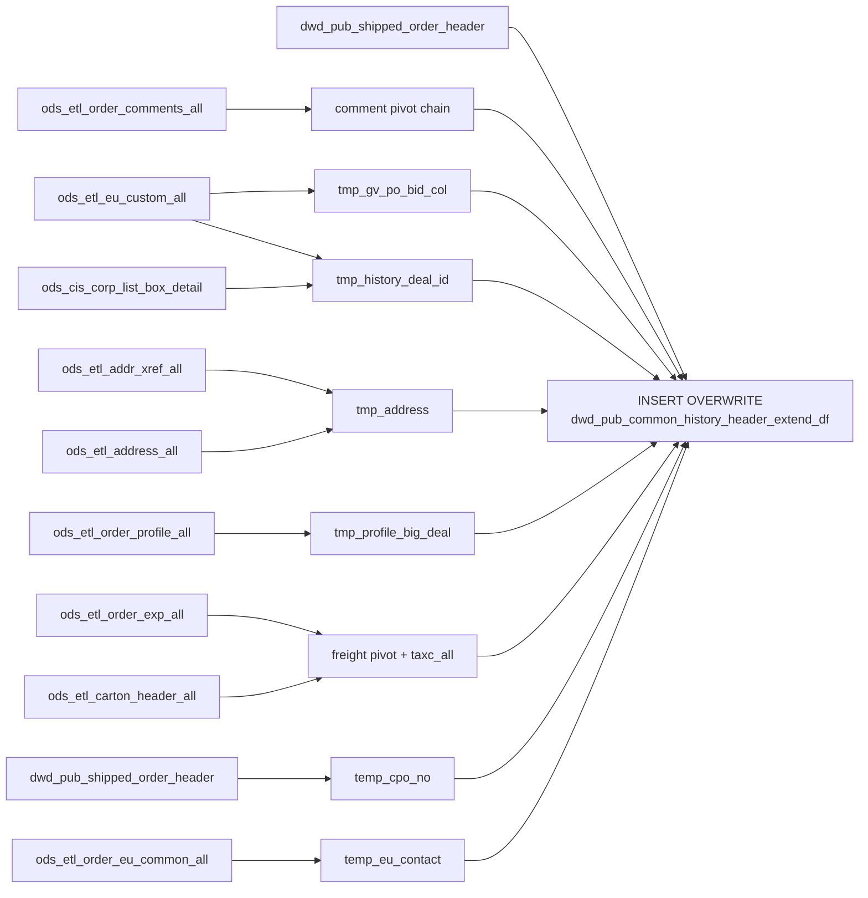

# DWD: History Order Header Extended — Daily Snapshot (`dwd_pub_common_history_header_extend_df`)

- artifact_type: etl_table
- artifact_id: dw_us.dwd_pub_common_history_header_extend_df
- domain: order
- one_line_purpose: This job produces a **richly enriched daily snapshot of all settled/archived order headers**, combining the base header record with GV (governance/end-user) data, sold-to customer info, order entry person name, comment fields (work load, In...
- layer_type: DWD
- source_kind: etl_sql
- evidence_source: source/etl/sql/order/source/etl/flows/public_order_tools/ingest/public_order_dw/script/dwd_pub_common_history_header_extend_df.sql

---

## L1 Data Foundation

### Identity and physical mapping
- **Table:** `dw_us.dwd_pub_common_history_header_extend_df`
- **Layer type:** DWD
- **Canonical / derived:** Derived / ETL-loaded (see L3)
- **Owner team:** not registered in metadata catalog

### Grain, scope, exclusions
- **Grain:** one row per `(order_type, order_no)` — a unique settled/shipped order.
- **Scope:** See L2 business purpose / L3 filters
- **Partition:** `date_flag = '${date_flag}'` — literal run date; full partition overwrite. - resolved from pipeline (see L4)
- **Natural key:** `order_type`, `order_no`.
- **Exclusions:** Not documented in repository

#### Grain detail (preserved)

- **Grain:** one row per `(order_type, order_no)` — a unique settled/shipped order.
- **Partition:** `date_flag = '${date_flag}'` — literal run date; full partition overwrite.
- **Natural key:** `order_type`, `order_no`.

---

### Cross-engine presence
| Engine | Present | Canonical FQN | Notes |
|--------|---------|---------------|-------|
| Hive | yes | `dwd_pub_common_history_header_extend_df` | ETL target / intermediate per evidence script |
| Vertica | pending | `dwd_pub_common_history_header_extend_df` | Confirm via hive2vertica flow evidence / MCP |

### Physical schema reference

Pointer block only - full column catalog lives in WKB L1 storage JSON.

| Field | Value |
|-------|-------|
| **Authoritative catalog** | WKB L1 storage seed (not duplicated in this file) |
| **entity_id** | `dw_us.dwd_pub_common_history_header_extend_df` |
| **l1_catalog_seed** | `target/storage/wkb/snapshots/_snapshot_id_template/l1_catalog/{engine}_{schema}_{table}.json` |
| **column_count** | pending (run ddl_seed_writer) |
| **partition_keys** | `date_flag = '${date_flag}'` |
| **ddl_source** | pending Bitbucket DDL / Vertica metadata ingest |
| **retrieval** | `python -m tools.wkb.indexing.run_query --query "order dwd_pub_common_history_header_extend_df schema" --intent find_table_schema` |

### Lineage
| Object | Role |
|--------|------|
| `dw_${country_code}.dwd_pub_shipped_order_header` | Primary source and CPO chain |
| `ods_${country_code}.ods_etl_order_comments_all` | Comment pivot |
| `ods_${country_code}.ods_etl_eu_custom_all` | GV PO BID and deal ID |
| `ods_${country_code}.ods_cis_corp_eu_custom_map` | EU custom map |
| `ods_${country_code}.ods_cis_corp_list_box_detail` | CEDM list box |
| `dim_${country_code}.dim_pub_list_box_detail` | TAXC list box |
| `ods_${country_code}.ods_etl_addr_xref_all` | Sold-to address xref |
| `ods_${country_code}.ods_etl_address_all` | Address detail |
| `ods_${country_code}.ods_etl_order_profile_all` | SPA_REF_NO for big deal fallback |
| `ods_${country_code}.ods_etl_order_exp_all` | Freight expense pivot and TAXC |
| `dim_${country_code}.dim_pub_list_box_detail` | TAXC code list for taxc_all |
| `ods_${country_code}.ods_etl_carton_header_all` | Tracking numbers |
| `ods_${country_code}.ods_cis_corp_history_gv` | GV user type and contract |
| `ods_${country_code}.ods_cis_corp_gv_user_type` | GV user type description |
| `ods_${country_code}.ods_etl_order_soldto_all` | Sold-to and sales model |
| `ods_${country_code}.ods_etl_customer_header_all` | Sold-to customer name |
| `ods_${country_code}.ods_cis_corp_manager` | Order entry name |
| `ods_${country_code}.ods_etl_order_eu_common_all` | EU company/address/contact + EU reseller contact |
| `dw_${country_code}.dwd_pub_common_history_header_extend_df` | **Target** |

---

### Freshness and load path
| Item | Value |
|------|-------|
| Load pattern | See L3 end-to-end / INSERT pattern in evidence script |
| Schedule | Not documented in repository |
| Parameters | `country_code`, `date_flag` |


---

## L2 Declarative Knowledge

### Business purpose
This job produces a **richly enriched daily snapshot of all settled/archived order headers**, combining the base header record with GV (governance/end-user) data, sold-to customer info, order entry person name, comment fields (work load, Intel IPD, general, contact, RS contact), EU entity detail, freight expense pivots, tracking numbers, big deal/CPO number, MSO linkage, and EU reseller contact. The result is the most complete historical order header view available — a single row per order carrying all operational, commercial, and compliance attributes needed for post-shipment reporting, channel analytics, and order audit.

---

### Audience and use cases
| Audience | How they benefit |
|----------|-----------------|
| **Finance / FP&A** | Full order-level financial totals (`total_order`, `total_cost`, `sales_total`, FX variants), freight charges (`frt`, `fds`, `fadd`, `mof`, `cod`, `tax`, `taxc_all`). |
| **Channel / sales** | `from_ref_type`, `sales_model`, `lol_reseller_no`, `big_deal_no`, `cpo_no`, `synnex_po_no`, `mso_no` — complete channel and deal structure. |
| **GV / compliance** | `gv_user_type`, `gv_user_typedesc`, `gv_user_name`, `gv_user_addr`, `gv_contract_no`, `gv_contact_name/phone` — GV entity for government/education reporting. |
| **EU / end-user tracking** | Full EU entity contact and address block, `eu_deal_id`, `GV_PO_BID_No`, EU reseller contact. |
| **Operations** | `track_no`, `ship_date`, `manifest_date`, `drop_ship`, `carrier_no`, `ship_method`. |
| **Customer service** | Sold-to customer name, address, contact phone/name/email, comment fields. |

---

### Fact key resolution
- Natural key: `order_type`, `order_no`.
- FK / label-on attributes: see L3 dimension join patterns and step-by-step logic.
- Negative assertion: do not treat descriptive labels as grain keys unless listed under natural key.

### Time field semantics
- **date_flag / partition columns:** `date_flag = '${date_flag}'` — literal run date; full partition overwrite.
- Primary reporting filter should use the partition column(s) documented in L1; resolve values via L4.


### Metrics served

| Category | Column | Logical metric | Business reading |
|----------|--------|----------------|------------------|
| Measures | — | — | No measure columns mapped for this table. |

### Metric serving map

**Formula authority:** [`source/contracts/order/metric-index.md`](../../source/contracts/order/metric-index.md)

N/A — no measure columns mapped for this table.

### etl_metrics

No governed logical metrics from `source/contracts/order/metric-index.md` are mapped on this table.

---

### Metric serving map
N/A - not a `*_comb_mtd` / multi-period wide serving table (or map not present in legacy doc).


### Data products and column groups (preserved)

### Order identifiers and channel

- `order_type`, `order_no`, `int_ref_no`, `int_ref_type`, `ext_ref`
- `synnex_po_no` — internal Synnex PO number (type-1 drop-ship only)
- `mso_no` — MSO number from the PO header
- `cpo_no` — CPO number (order_type 1/14 with int_ref_type=1: from linked source order; else from ext_ref)
- `from_ref_type`, `sales_model`, `lol_reseller_no` (only for sales_model 1/3)
- `big_deal_no` — from soldto or SPA_REF_NO profile fallback
- `special_handle`, `end_user_po`

### Customer / sold-to

- `to_acct_no` (to customer), `from_acct_no` (from location)
- `sold_to_cust_no`, `sold_to_cust_name`, `sold_to_street_address`, `cust_loc_no`

### Order entry person

- `order_entry_name` — `concat(firstname, ' ', lastname)` from manager table
- `entry_year` — `year(entry_datetime)`

### GV / governance

- `gv_user_type`, `gv_user_type_desc`, `gv_user_name`, `gv_user_addr`, `gv_user_po_box`, `gv_user_city`, `gv_user_state`, `gv_user_zip`, `gv_user_country`
- `gv_contract_no`, `gv_contact_name`, `gv_contact_phone`
- `GV_PO_BID_No` — GV purchase order bid number

### EU entity

- `eu_company_name`, `eu_country`, `eu_city`, `eu_state`, `eu_zip`, `eu_address1`, `eu_address2`
- `eu_contact_name`, `eu_contact_email`, `eu_contact_phone`
- `eu_deal_id`, `ec_eu_no`
- `eu_res_contact`, `eu_res_contact_phone`, `eu_res_contact_email` — EU reseller contact

### Comment fields (pivoted)

- `work_load` — WL comment (loc='1')
- `general_comment` — GE comment
- `intel_ipd` — II comment (loc='1')
- `RS_Contact` — L1 comment (loc='1')
- `ship_to_contactname` — SA/EM comment (loc='N')
- `ship_to_contact_email` — SA/EM comment (loc='A')
- `ship_to_contact_phone` — from soldto `ship_to_phone`

### Freight and tracking

- `frt`, `fds`, `fadd`, `mof`, `cod`, `tax` — pivoted freight expense amounts (0 if no matching expense)
- `taxc_all` — sum of all TAXC-category expense codes
- `track_no` — `*`-delimited concatenation of all tracking numbers

### Header financial totals

- `total_order`, `total_cost`, `sales_total`, `head_exp_total`, `detail_exp_total`, `detail_price_total`
- `fx_total_order`, `fx_total_cost`, `fx_sales_total`, `fx_head_exp_total`, `fx_detail_exp_total`, `fx_detail_price_total`
- `freight`, `sales_tax`, `total_weight`, `fx_currency`, `company_no`

---

### etl_metrics

#### `synnex_po_no`
- **Source:** [metric-index.md](../../source/contracts/order/metric-index.md#synnex_po_no)
- **Business definition:** Internal Synnex PO number for drop-ship type-1 orders.
```sql
CASE WHEN order_type=1 AND from_loc_no=98 AND from_inv_type IN(100,200) THEN int_ref_no ELSE NULL END
```

#### `cpo_no`
- **Source:** [metric-index.md](../../source/contracts/order/metric-index.md#cpo_no)
- **Business definition:** CPO number: resolved from source SO for CM orders, otherwise the order's own ext_ref.
```sql
CASE WHEN order_type IN(1,14) AND int_ref_type=1 THEN cn.cpo_no ELSE h.ext_ref END
```

#### `lol_reseller_no`
- **Source:** [metric-index.md](../../source/contracts/order/metric-index.md#lol_reseller_no)
- **Business definition:** LOL (line-of-line) reseller — only for agency/LOL sales models.
```sql
CASE WHEN sales_model IN(1,3) THEN reseller_cust_no ELSE NULL END
```

#### `big_deal_no`
- **Source:** [metric-index.md](../../source/contracts/order/metric-index.md#big_deal_no)
- **Business definition:** Big deal number: soldto field first, SPA_REF_NO profile fallback.
```sql
nvl(s.big_deal_no, tpb.profile_c)
```

#### `sold_to_street_address`
- **Source:** [metric-index.md](../../source/contracts/order/metric-index.md#sold_to_street_address)
- **Business definition:** Street address for the sold-to location.
```sql
max(concat(address1a, address1b))` per xref
```


---

## L3 Procedural Knowledge

### Query and routing rules
**Business filters:** Use partition / date keys from L1 grain for reporting scope.
**Technical predicates (load only):** See Key filters and step-by-step logic below.

### Dimension join patterns
| Dimension FQN | Join keys | Purpose | Evidence |
|---------------|-----------|---------|----------|
| See step-by-step / base tables | See L3 steps | Dimension enrichment | `source/etl/sql/order/source/etl/flows/public_order_tools/ingest/public_order_dw/script/dwd_pub_common_history_header_extend_df.sql` |

### Key filters and ETL business logic
### Steps 1–3 — Comment pivot chain

**`tmp_history_comments` (view):** Filters `ods_etl_order_comments_all` to comment types `WL, GE, II, EM, L1, SA`.

**`tmp_history_comments_col`:** Pivots per `(order_no, order_type)`:

| Output column | Comment type | Comment loc |
|---------------|-------------|-------------|
| `work_load` | WL | `'1'` |
| `general_comment` | GE | any |
| `intel_ipd` | II | `'1'` |
| `ship_to_contactname` | SA or EM | `'N'` |
| `ship_to_contact_email` | SA or EM | `'A'` |
| `RS_Contact` | L1 | `'1'` |

**`tmp_order_history_comments_col` (view):** UNION of `tmp_history_comments_col` and a direct query on `ods_etl_order_comments_all` (EM/SA types). Takes `MAX` of `ship_to_contactname` and `ship_to_contact_email` across both sources per order.

---

### Steps 4–5 — EU custom lookups

**`tmp_gv_po_bid_col`:** Joins `ods_etl_eu_custom_all` to `ods_cis_corp_eu_custom_map` where `map_data_desc = 'PBID'`, both not deleted. `MAX(trim(data_c))` per order = GV PO BID number.

**`tmp_history_deal_id`:** Joins EU custom to EU custom map to `ods_cis_corp_list_box_detail` where `list_box_code = 'CEDM'`, `code_desc = 'DEAL ID'`, `activeflag = 'Y'`, `delete_datetime IS NULL`. `MAX(data_c)` per order = deal ID.

---

### Step 6 — Freight expense pivot + tracking numbers

**`tmp_extended_exp` (view):** Pivots 6 codes from `ods_etl_order_exp_all` (`exp_type='F'`, `order_exp_type='HE'`, `delete_date IS NULL`) using `SUM(CASE WHEN ... THEN nvl(extended_exp,0) ELSE 0 END)` — *...

### Standard time-filter SQL
```sql
-- relative period filter using resolved partition value (see L4)
SELECT *
FROM dwd_pub_common_history_header_extend_df
WHERE /* partition predicate */ date_flag = '${partition_value}';
```

### End-to-end flow
**Runtime parameters:** `country_code`, `date_flag`
**Target table:** `dw_${country_code}.dwd_pub_common_history_header_extend_df`, partitioned by **`date_flag = '${date_flag}'`**.

1. Build comment pivot chain: `tmp_history_comments` → `tmp_history_comments_col` → `tmp_order_history_comments_col` (UNION with direct EM/SA query).
2. Build `tmp_gv_po_bid_col` — GV PO BID number via EU custom map (PBID).
3. Build `tmp_history_deal_id` — deal ID via EU custom map (CEDM/DEAL ID list box).
4. Build `tmp_address` — sold-to street address from addr_xref + address.
5. Build `tmp_profile_big_deal` — SPA_REF_NO order-level profile.
6. Build freight pivot chain: `tmp_extended_exp` + `tmp_extended_exp_taxc_all` + `tmp_etl_carton_header_all` → `tmp_ext_exp_track_no`.
7. Build `temp_cpo_no` — CPO number for order types 14/114 via shipped order header chain.
8. Build `temp_eu_contact` — EU reseller contact from order EU common.
9. **INSERT OVERWRITE** from `dwd_pub_shipped_order_header` with 15 LEFT JOINs.



---


#### High-level stages (preserved)

| Stage | Business meaning |
|-------|-----------------|
| **Comment pivot** | Aggregates six comment types (WL, GE, II, EM, L1, SA) into named columns: work_load, general_comment, intel_ipd, RS_Contact, ship_to_contactname, ship_to_contact_email. A UNION step ensures both `ods_etl_order_comments_all` sources (direct and historical) are covered for the ship-to contact fields. |
| **GV PO BID number** | Extracts GV PO BID numbers from EU custom fields (`map_data_desc='PBID'`). |
| **Deal ID** | Resolves the EU deal ID from EU custom fields via the `CEDM` list box (`code_desc='DEAL ID'`). |
| **Sold-to address** | Builds `sold_to_street_address` by concatenating address line 1a and 1b from the active ADDR_CUST cross-reference. |
| **Big deal number** | Reads the active SPA_REF_NO order-level profile as a fallback for `big_deal_no`. |
| **Freight expense pivot** | Pivots six freight codes (FRT, FADD, COD, FDS, MOF, TAX) into named columns per order, plus `taxc_all` (sum of all TAXC list-box expense codes). |
| **Tracking numbers** | Concatenates all tracking numbers from the carton header using `*` as separator. |
| **CPO number** | For CM/CM-return orders (types 14/114 with int_ref_type=1), resolves the CPO number from the source SO's `ext_ref` in `dwd_pub_shipped_order_header`. |
| **EU reseller contact** | Aggregates EU reseller contact details (phone, email, name) from the order EU common table. |
| **Final assembly** | Joins `dwd_pub_shipped_order_header` (base) to GV, soldto, customer, address, manager, comments, EU common, deal ID, big deal, freight/expense, CPO number, and EU contact tables. |

**Parameters:** `country_code`, `date_flag`

---


### Base tables register
| Object | Role in this job |
|--------|-----------------|
| `dw_${country_code}.dwd_pub_shipped_order_header` | **Primary source.** Unified shipped order header (active + history merged). All header fields. Used twice — once as primary (`h`), once for MSO chain (`h2`) and CPO number (`temp_cpo_no`). |
| `ods_${country_code}.ods_etl_order_comments_all` | Order comments — two uses: comment type filter for `tmp_history_comments` (WL/GE/II/EM/L1/SA) and direct EM/SA for `tmp_order_history_comments_col` UNION. |
| `ods_${country_code}.ods_etl_eu_custom_all` | EU custom field values — used for GV PO BID (PBID) and deal ID (CEDM/DEAL ID) lookups. |
| `ods_${country_code}.ods_cis_corp_eu_custom_map` | EU custom map — maps `eu_map_id + eu_map_line_no` to `map_data_desc` and code descriptors. |
| `ods_${country_code}.ods_cis_corp_list_box_detail` | List box detail — provides CEDM code lookups for deal ID and TAXC code list for `taxc_all`. |
| `dim_${country_code}.dim_pub_list_box_detail` | Dimension version of list box — used for TAXC code filter in `tmp_extended_exp_taxc_all`. |
| `ods_${country_code}.ods_etl_addr_xref_all` | Address cross-reference — resolves `xref_no + xref_seq` to `addr_no` for sold-to address. |
| `ods_${country_code}.ods_etl_address_all` | Address detail — `address1a`, `address1b` for `sold_to_street_address`. |
| `ods_${country_code}.ods_etl_order_profile_all` | Order profiles — `SPA_REF_NO` (order-level, active, no line_no) for big deal fallback. |
| `ods_${country_code}.ods_etl_order_exp_all` | Order expenses — freight pivot (FRT/FADD/COD/FDS/MOF/TAX) and TAXC total. |
| `ods_${country_code}.ods_etl_carton_header_all` | Carton headers — tracking numbers concatenated per order. |
| `ods_${country_code}.ods_cis_corp_history_gv` | GV order record — `gv_user_type`, `gv_contract_no`. |
| `ods_${country_code}.ods_cis_corp_gv_user_type` | GV user type dimension — `gv_user_typedesc`. |
| `ods_${country_code}.ods_etl_order_soldto_all` | Soldto data — `to_acct_no`, `sales_model`, `reseller_cust_no`, `special_handle`, `end_user_po`, `to_loc_no`, `big_deal_no`, `from_ref_type`, `ship_to_phone`. |
| `ods_${country_code}.ods_etl_customer_header_all` | Customer header — `cust_name` for sold-to customer. |
| `ods_${country_code}.ods_cis_corp_manager` | Manager table — `firstname`, `lastname` for `order_entry_name`. |
| `ods_${country_code}.ods_etl_order_eu_common_all` | EU common — EU company, address, contact; joined at `order_line_no=0` (header level) for EU fields; also used for EU reseller contact aggregate. |

---

### Step-by-step logic
### Steps 1–3 — Comment pivot chain

**`tmp_history_comments` (view):** Filters `ods_etl_order_comments_all` to comment types `WL, GE, II, EM, L1, SA`.

**`tmp_history_comments_col`:** Pivots per `(order_no, order_type)`:

| Output column | Comment type | Comment loc |
|---------------|-------------|-------------|
| `work_load` | WL | `'1'` |
| `general_comment` | GE | any |
| `intel_ipd` | II | `'1'` |
| `ship_to_contactname` | SA or EM | `'N'` |
| `ship_to_contact_email` | SA or EM | `'A'` |
| `RS_Contact` | L1 | `'1'` |

**`tmp_order_history_comments_col` (view):** UNION of `tmp_history_comments_col` and a direct query on `ods_etl_order_comments_all` (EM/SA types). Takes `MAX` of `ship_to_contactname` and `ship_to_contact_email` across both sources per order.

---

### Steps 4–5 — EU custom lookups

**`tmp_gv_po_bid_col`:** Joins `ods_etl_eu_custom_all` to `ods_cis_corp_eu_custom_map` where `map_data_desc = 'PBID'`, both not deleted. `MAX(trim(data_c))` per order = GV PO BID number.

**`tmp_history_deal_id`:** Joins EU custom to EU custom map to `ods_cis_corp_list_box_detail` where `list_box_code = 'CEDM'`, `code_desc = 'DEAL ID'`, `activeflag = 'Y'`, `delete_datetime IS NULL`. `MAX(data_c)` per order = deal ID.

---

### Step 6 — Freight expense pivot + tracking numbers

**`tmp_extended_exp` (view):** Pivots 6 codes from `ods_etl_order_exp_all` (`exp_type='F'`, `order_exp_type='HE'`, `delete_date IS NULL`) using `SUM(CASE WHEN ... THEN nvl(extended_exp,0) ELSE 0 END)` — **uses 0 not NULL** for missing codes.

**`tmp_extended_exp_taxc_all` (view):** Sums all expense lines where `exp_code IN (SELECT code_value FROM dim_pub_list_box_detail WHERE list_box_code='TAXC')` into `taxc_all`.

**`tmp_etl_carton_header_all` (view):** `concat_ws('*', collect_set(track_no))` per order — all tracking numbers joined by `*`.

**`tmp_ext_exp_track_no`:** LEFT JOINs the three above into one row per order.

---

### Step 7 — CPO number resolution (`temp_cpo_no`)

**Source:** `dwd_pub_shipped_order_header` (`a`) LEFT JOIN `dwd_pub_shipped_order_header` (`b`)

**Filter:** `a.order_type IN (14, 114)` AND `a.int_ref_type = 1`

**Join:** `a.int_ref_no = b.order_no AND a.int_ref_type = b.order_type AND b.order_type = 1`

**Output:** `cpo_no = b.ext_ref` — the CPO number is the `ext_ref` of the source SO (type 1) that this CM/CM-return order references.

---

### Final INSERT — key derived columns

| Column | Formula | Plain language |
|--------|---------|----------------|
| `synnex_po_no` | `CASE WHEN order_type=1 AND from_loc_no=98 AND from_inv_type IN(100,200) THEN int_ref_no ELSE NULL END` | Internal Synnex PO number for drop-ship type-1 orders. |
| `mso_no` | `h2.int_ref_no` — from PO header `h2` matching the drop-ship SO's int_ref_no | MSO reference number. |
| `cpo_no` | `CASE WHEN order_type IN(1,14) AND int_ref_type=1 THEN cn.cpo_no ELSE h.ext_ref END` | CPO number: resolved from source SO for CM orders, otherwise the order's own ext_ref. |
| `lol_reseller_no` | `CASE WHEN sales_model IN(1,3) THEN reseller_cust_no ELSE NULL END` | LOL (line-of-line) reseller — only for agency/LOL sales models. |
| `big_deal_no` | `nvl(s.big_deal_no, tpb.profile_c)` | Big deal number: soldto field first, SPA_REF_NO profile fallback. |
| `order_entry_name` | `concat(mgr.firstname, ' ', mgr.lastname)` | Full name of the order entry person from the manager table. |
| `entry_year` | `year(h.entry_datetime)` | Calendar year the order was entered. |
| `sold_to_street_address` | `max(concat(address1a, address1b))` per xref | Street address for the sold-to location. |

---

### Relationship map (embedded)

| from_fqn | to_fqn | cardinality | join_keys | provenance |
|----------|--------|-------------|-----------|------------|
| `dw_${country_code}.dwd_pub_shipped_order_header` | `ods_${country_code}.ods_cis_corp_eu_custom_map` | many:1 | `a.eu_map_id` = `b.eu_map_id`; `a.eu_map_line_no` = `b.eu_map_line_no` | etl_sql (`source/etl/sql/order/public_order_scripts/public_order_dw/script/dwd_pub_common_history_header_extend_df.sql:67`) |
| `ods_${country_code}.ods_etl_eu_custom_all` | `ods_${country_code}.ods_cis_corp_eu_custom_map` | many:1 | `ec.eu_map_id` = `ecm.eu_map_id`; `ec.eu_map_line_no` = `ecm.eu_map_line_no` | etl_sql (`source/etl/sql/order/public_order_scripts/public_order_dw/script/dwd_pub_common_history_header_extend_df.sql:82`) |
| `ods_${country_code}.ods_cis_corp_eu_custom_map` | `ods_${country_code}.ods_cis_corp_list_box_detail` | many:1 | `lbd.code_value` = `ecm.map_data_desc` | etl_sql (`source/etl/sql/order/public_order_scripts/public_order_dw/script/dwd_pub_common_history_header_extend_df.sql:86`) |
| `ods_${country_code}.ods_etl_addr_xref_all` | `ods_${country_code}.ods_etl_address_all` | many:1 | `ax.addr_no` = `addr.addr_no` | etl_sql (`source/etl/sql/order/public_order_scripts/public_order_dw/script/dwd_pub_common_history_header_extend_df.sql:104`) |
| `dw_${country_code}.dwd_pub_shipped_order_header` | `tmp_extended_exp_taxc_all` | many:1 (LEFT) | `a.order_type` = `b.order_type`; `a.order_no` = `b.order_no` | etl_sql (`source/etl/sql/order/public_order_scripts/public_order_dw/script/dwd_pub_common_history_header_extend_df.sql:176`) |
| `dw_${country_code}.dwd_pub_shipped_order_header` | `tmp_etl_carton_header_all` | many:1 (LEFT) | `a.order_type` = `c.order_type`; `a.order_no` = `c.order_no` | etl_sql (`source/etl/sql/order/public_order_scripts/public_order_dw/script/dwd_pub_common_history_header_extend_df.sql:179`) |
| `dw_${country_code}.dwd_pub_shipped_order_header` | `dw_${country_code}.dwd_pub_shipped_order_header` | many:1 (LEFT) | `a.int_ref_no` = `b.order_no`; `a.int_ref_type` = `b.order_type` | etl_sql (`source/etl/sql/order/public_order_scripts/public_order_dw/script/dwd_pub_common_history_header_extend_df.sql:190`) |
| `dw_${country_code}.dwd_pub_shipped_order_header` | `ods_${country_code}.ods_cis_corp_history_gv` | many:1 (LEFT) | `h.order_no` = `g.order_no`; `h.order_type` = `g.order_type` | etl_sql (`source/etl/sql/order/public_order_scripts/public_order_dw/script/dwd_pub_common_history_header_extend_df.sql:367`) |
| `dw_${country_code}.dwd_pub_shipped_order_header` | `tmp_gv_po_bid_col` | many:1 (LEFT) | `h.order_no` = `gpb.order_no`; `h.order_type` = `gpb.order_type` | etl_sql (`source/etl/sql/order/public_order_scripts/public_order_dw/script/dwd_pub_common_history_header_extend_df.sql:371`) |
| `ods_${country_code}.ods_cis_corp_history_gv` | `ods_${country_code}.ods_cis_corp_gv_user_type` | many:1 (LEFT) | `gut.gv_user_type` = `g.gv_user_type` | etl_sql (`source/etl/sql/order/public_order_scripts/public_order_dw/script/dwd_pub_common_history_header_extend_df.sql:375`) |
| `dw_${country_code}.dwd_pub_shipped_order_header` | `ods_${country_code}.ods_etl_order_soldto_all` | many:1 (LEFT) | `h.order_no` = `s.order_no`; `h.order_type` = `s.order_type` | etl_sql (`source/etl/sql/order/public_order_scripts/public_order_dw/script/dwd_pub_common_history_header_extend_df.sql:378`) |
| `ods_${country_code}.ods_etl_order_soldto_all` | `ods_${country_code}.ods_etl_customer_header_all` | many:1 (LEFT) | `s.to_acct_no` = `ch.cust_no` | etl_sql (`source/etl/sql/order/public_order_scripts/public_order_dw/script/dwd_pub_common_history_header_extend_df.sql:382`) |
| `ods_${country_code}.ods_etl_order_soldto_all` | `tmp_address` | many:1 (LEFT) | `s.to_acct_no` = `addr.xref_no`; `s.to_loc_no` = `addr.xref_seq` | etl_sql (`source/etl/sql/order/public_order_scripts/public_order_dw/script/dwd_pub_common_history_header_extend_df.sql:385`) |
| `dw_${country_code}.dwd_pub_shipped_order_header` | `ods_${country_code}.ods_cis_corp_manager` | many:1 (LEFT) | `mgr.userid` = `h.entry_id` | etl_sql (`source/etl/sql/order/public_order_scripts/public_order_dw/script/dwd_pub_common_history_header_extend_df.sql:388`) |
| `dw_${country_code}.dwd_pub_shipped_order_header` | `tmp_history_comments_col` | many:1 (LEFT) | `h.order_no` = `hc.order_no`; `h.order_type` = `hc.order_type` | etl_sql (`source/etl/sql/order/public_order_scripts/public_order_dw/script/dwd_pub_common_history_header_extend_df.sql:391`) |
| `dw_${country_code}.dwd_pub_shipped_order_header` | `tmp_order_history_comments_col` | many:1 (LEFT) | `h.order_no` = `ohc.order_no`; `h.order_type` = `ohc.order_type` | etl_sql (`source/etl/sql/order/public_order_scripts/public_order_dw/script/dwd_pub_common_history_header_extend_df.sql:395`) |
| `ods_${country_code}.ods_etl_order_comments_all` | `dw_${country_code}.dwd_pub_shipped_order_header` | many:1 (LEFT) | h2.order_no = (case when h.order_type = 1 and h.from_loc_no = 98 and h.from_inv_type in (100, 200) then h.int_ref_no else null end) and h2.order_type = 2 and... | etl_sql (`source/etl/sql/order/public_order_scripts/public_order_dw/script/dwd_pub_common_history_header_extend_df.sql:399`) |
| `dw_${country_code}.dwd_pub_shipped_order_header` | `ods_${country_code}.ods_etl_order_eu_common_all` | many:1 (LEFT) | `h.order_no` = `hec.order_no`; `h.order_type` = `hec.order_type` | etl_sql (`source/etl/sql/order/public_order_scripts/public_order_dw/script/dwd_pub_common_history_header_extend_df.sql:410`) |
| `dw_${country_code}.dwd_pub_shipped_order_header` | `tmp_history_deal_id` | many:1 (LEFT) | `h.order_no` = `hdi.order_no`; `h.order_type` = `hdi.order_type` | etl_sql (`source/etl/sql/order/public_order_scripts/public_order_dw/script/dwd_pub_common_history_header_extend_df.sql:415`) |
| `dw_${country_code}.dwd_pub_shipped_order_header` | `tmp_profile_big_deal` | many:1 (LEFT) | `h.order_no` = `tpb.order_no`; `h.order_type` = `tpb.order_type` | etl_sql (`source/etl/sql/order/public_order_scripts/public_order_dw/script/dwd_pub_common_history_header_extend_df.sql:419`) |
| `dw_${country_code}.dwd_pub_shipped_order_header` | `tmp_ext_exp_track_no` | many:1 (LEFT) | `h.order_type` = `exp.order_type`; `h.order_no` = `exp.order_no` | etl_sql (`source/etl/sql/order/public_order_scripts/public_order_dw/script/dwd_pub_common_history_header_extend_df.sql:422`) |
| `dw_${country_code}.dwd_pub_shipped_order_header` | `temp_cpo_no` | many:1 (LEFT) | `h.order_no` = `cn.order_no`; `h.order_type` = `cn.order_type` | etl_sql (`source/etl/sql/order/public_order_scripts/public_order_dw/script/dwd_pub_common_history_header_extend_df.sql:425`) |
| `dw_${country_code}.dwd_pub_shipped_order_header` | `temp_eu_contact` | many:1 (LEFT) | `h.order_no` = `tec.order_no`; `h.order_type` = `tec.order_type` | etl_sql (`source/etl/sql/order/public_order_scripts/public_order_dw/script/dwd_pub_common_history_header_extend_df.sql:428`) |

### Special logic (embedded)

Not documented in repository

### Column / field derivations (from ETL SQL)

| target_column | expression_sql | upstream_columns | upstream_tables | transform_kind | evidence |
|---------------|----------------|------------------|-----------------|----------------|----------|
| `order_type` | `h.order_type` | `order_type` | `dw_${country_code}.dwd_pub_shipped_order_header`, `ods_${country_code}.ods_cis_corp_history_gv`, `tmp_gv_po_bid_col`, `ods_${country_code}.ods_cis_corp_gv_user_type`, `ods_${country_code}.ods_etl_order_soldto_all`, `ods_${country_code}.ods_etl_customer_header_all`, `tmp_address`, `ods_${country_code}.ods_cis_corp_manager`, `tmp_history_comments_col`, `tmp_order_history_comments_col`, `ods_${country_code}.ods_etl_order_eu_common_all`, `tmp_history_deal_id` | passthrough | `source/etl/sql/order/public_order_scripts/public_order_dw/script/dwd_pub_common_history_header_extend_df.sql:212` |
| `order_no` | `h.order_no` | `order_no` | `dw_${country_code}.dwd_pub_shipped_order_header`, `ods_${country_code}.ods_cis_corp_history_gv`, `tmp_gv_po_bid_col`, `ods_${country_code}.ods_cis_corp_gv_user_type`, `ods_${country_code}.ods_etl_order_soldto_all`, `ods_${country_code}.ods_etl_customer_header_all`, `tmp_address`, `ods_${country_code}.ods_cis_corp_manager`, `tmp_history_comments_col`, `tmp_order_history_comments_col`, `ods_${country_code}.ods_etl_order_eu_common_all`, `tmp_history_deal_id` | passthrough | `source/etl/sql/order/public_order_scripts/public_order_dw/script/dwd_pub_common_history_header_extend_df.sql:213` |
| `from_acct_no` | `h.from_acct_no` | `from_acct_no` | `dw_${country_code}.dwd_pub_shipped_order_header`, `ods_${country_code}.ods_cis_corp_history_gv`, `tmp_gv_po_bid_col`, `ods_${country_code}.ods_cis_corp_gv_user_type`, `ods_${country_code}.ods_etl_order_soldto_all`, `ods_${country_code}.ods_etl_customer_header_all`, `tmp_address`, `ods_${country_code}.ods_cis_corp_manager`, `tmp_history_comments_col`, `tmp_order_history_comments_col`, `ods_${country_code}.ods_etl_order_eu_common_all`, `tmp_history_deal_id` | passthrough | `source/etl/sql/order/public_order_scripts/public_order_dw/script/dwd_pub_common_history_header_extend_df.sql:214` |
| `from_loc_no` | `h.from_loc_no` | `from_loc_no` | `dw_${country_code}.dwd_pub_shipped_order_header`, `ods_${country_code}.ods_cis_corp_history_gv`, `tmp_gv_po_bid_col`, `ods_${country_code}.ods_cis_corp_gv_user_type`, `ods_${country_code}.ods_etl_order_soldto_all`, `ods_${country_code}.ods_etl_customer_header_all`, `tmp_address`, `ods_${country_code}.ods_cis_corp_manager`, `tmp_history_comments_col`, `tmp_order_history_comments_col`, `ods_${country_code}.ods_etl_order_eu_common_all`, `tmp_history_deal_id` | passthrough | `source/etl/sql/order/public_order_scripts/public_order_dw/script/dwd_pub_common_history_header_extend_df.sql:215` |
| `from_contact_no` | `h.from_contact_no` | `from_contact_no` | `dw_${country_code}.dwd_pub_shipped_order_header`, `ods_${country_code}.ods_cis_corp_history_gv`, `tmp_gv_po_bid_col`, `ods_${country_code}.ods_cis_corp_gv_user_type`, `ods_${country_code}.ods_etl_order_soldto_all`, `ods_${country_code}.ods_etl_customer_header_all`, `tmp_address`, `ods_${country_code}.ods_cis_corp_manager`, `tmp_history_comments_col`, `tmp_order_history_comments_col`, `ods_${country_code}.ods_etl_order_eu_common_all`, `tmp_history_deal_id` | passthrough | `source/etl/sql/order/public_order_scripts/public_order_dw/script/dwd_pub_common_history_header_extend_df.sql:216` |
| `from_dept_no` | `h.from_dept_no` | `from_dept_no` | `dw_${country_code}.dwd_pub_shipped_order_header`, `ods_${country_code}.ods_cis_corp_history_gv`, `tmp_gv_po_bid_col`, `ods_${country_code}.ods_cis_corp_gv_user_type`, `ods_${country_code}.ods_etl_order_soldto_all`, `ods_${country_code}.ods_etl_customer_header_all`, `tmp_address`, `ods_${country_code}.ods_cis_corp_manager`, `tmp_history_comments_col`, `tmp_order_history_comments_col`, `ods_${country_code}.ods_etl_order_eu_common_all`, `tmp_history_deal_id` | passthrough | `source/etl/sql/order/public_order_scripts/public_order_dw/script/dwd_pub_common_history_header_extend_df.sql:217` |
| `from_inv_type` | `h.from_inv_type` | `from_inv_type` | `dw_${country_code}.dwd_pub_shipped_order_header`, `ods_${country_code}.ods_cis_corp_history_gv`, `tmp_gv_po_bid_col`, `ods_${country_code}.ods_cis_corp_gv_user_type`, `ods_${country_code}.ods_etl_order_soldto_all`, `ods_${country_code}.ods_etl_customer_header_all`, `tmp_address`, `ods_${country_code}.ods_cis_corp_manager`, `tmp_history_comments_col`, `tmp_order_history_comments_col`, `ods_${country_code}.ods_etl_order_eu_common_all`, `tmp_history_deal_id` | passthrough | `source/etl/sql/order/public_order_scripts/public_order_dw/script/dwd_pub_common_history_header_extend_df.sql:218` |
| `to_acct_no` | `h.to_acct_no` | `to_acct_no` | `dw_${country_code}.dwd_pub_shipped_order_header`, `ods_${country_code}.ods_cis_corp_history_gv`, `tmp_gv_po_bid_col`, `ods_${country_code}.ods_cis_corp_gv_user_type`, `ods_${country_code}.ods_etl_order_soldto_all`, `ods_${country_code}.ods_etl_customer_header_all`, `tmp_address`, `ods_${country_code}.ods_cis_corp_manager`, `tmp_history_comments_col`, `tmp_order_history_comments_col`, `ods_${country_code}.ods_etl_order_eu_common_all`, `tmp_history_deal_id` | passthrough | `source/etl/sql/order/public_order_scripts/public_order_dw/script/dwd_pub_common_history_header_extend_df.sql:219` |
| `to_loc_no` | `h.to_loc_no` | `to_loc_no` | `dw_${country_code}.dwd_pub_shipped_order_header`, `ods_${country_code}.ods_cis_corp_history_gv`, `tmp_gv_po_bid_col`, `ods_${country_code}.ods_cis_corp_gv_user_type`, `ods_${country_code}.ods_etl_order_soldto_all`, `ods_${country_code}.ods_etl_customer_header_all`, `tmp_address`, `ods_${country_code}.ods_cis_corp_manager`, `tmp_history_comments_col`, `tmp_order_history_comments_col`, `ods_${country_code}.ods_etl_order_eu_common_all`, `tmp_history_deal_id` | passthrough | `source/etl/sql/order/public_order_scripts/public_order_dw/script/dwd_pub_common_history_header_extend_df.sql:220` |
| `to_contact_no` | `h.to_contact_no` | `to_contact_no` | `dw_${country_code}.dwd_pub_shipped_order_header`, `ods_${country_code}.ods_cis_corp_history_gv`, `tmp_gv_po_bid_col`, `ods_${country_code}.ods_cis_corp_gv_user_type`, `ods_${country_code}.ods_etl_order_soldto_all`, `ods_${country_code}.ods_etl_customer_header_all`, `tmp_address`, `ods_${country_code}.ods_cis_corp_manager`, `tmp_history_comments_col`, `tmp_order_history_comments_col`, `ods_${country_code}.ods_etl_order_eu_common_all`, `tmp_history_deal_id` | passthrough | `source/etl/sql/order/public_order_scripts/public_order_dw/script/dwd_pub_common_history_header_extend_df.sql:221` |
| `to_dept_no` | `h.to_dept_no` | `to_dept_no` | `dw_${country_code}.dwd_pub_shipped_order_header`, `ods_${country_code}.ods_cis_corp_history_gv`, `tmp_gv_po_bid_col`, `ods_${country_code}.ods_cis_corp_gv_user_type`, `ods_${country_code}.ods_etl_order_soldto_all`, `ods_${country_code}.ods_etl_customer_header_all`, `tmp_address`, `ods_${country_code}.ods_cis_corp_manager`, `tmp_history_comments_col`, `tmp_order_history_comments_col`, `ods_${country_code}.ods_etl_order_eu_common_all`, `tmp_history_deal_id` | passthrough | `source/etl/sql/order/public_order_scripts/public_order_dw/script/dwd_pub_common_history_header_extend_df.sql:222` |
| `to_inv_type` | `h.to_inv_type` | `to_inv_type` | `dw_${country_code}.dwd_pub_shipped_order_header`, `ods_${country_code}.ods_cis_corp_history_gv`, `tmp_gv_po_bid_col`, `ods_${country_code}.ods_cis_corp_gv_user_type`, `ods_${country_code}.ods_etl_order_soldto_all`, `ods_${country_code}.ods_etl_customer_header_all`, `tmp_address`, `ods_${country_code}.ods_cis_corp_manager`, `tmp_history_comments_col`, `tmp_order_history_comments_col`, `ods_${country_code}.ods_etl_order_eu_common_all`, `tmp_history_deal_id` | passthrough | `source/etl/sql/order/public_order_scripts/public_order_dw/script/dwd_pub_common_history_header_extend_df.sql:223` |
| `ship_to_name` | `h.ship_to_name` | `ship_to_name` | `dw_${country_code}.dwd_pub_shipped_order_header`, `ods_${country_code}.ods_cis_corp_history_gv`, `tmp_gv_po_bid_col`, `ods_${country_code}.ods_cis_corp_gv_user_type`, `ods_${country_code}.ods_etl_order_soldto_all`, `ods_${country_code}.ods_etl_customer_header_all`, `tmp_address`, `ods_${country_code}.ods_cis_corp_manager`, `tmp_history_comments_col`, `tmp_order_history_comments_col`, `ods_${country_code}.ods_etl_order_eu_common_all`, `tmp_history_deal_id` | passthrough | `source/etl/sql/order/public_order_scripts/public_order_dw/script/dwd_pub_common_history_header_extend_df.sql:224` |
| `ship_to_addr` | `h.ship_to_addr` | `ship_to_addr` | `dw_${country_code}.dwd_pub_shipped_order_header`, `ods_${country_code}.ods_cis_corp_history_gv`, `tmp_gv_po_bid_col`, `ods_${country_code}.ods_cis_corp_gv_user_type`, `ods_${country_code}.ods_etl_order_soldto_all`, `ods_${country_code}.ods_etl_customer_header_all`, `tmp_address`, `ods_${country_code}.ods_cis_corp_manager`, `tmp_history_comments_col`, `tmp_order_history_comments_col`, `ods_${country_code}.ods_etl_order_eu_common_all`, `tmp_history_deal_id` | passthrough | `source/etl/sql/order/public_order_scripts/public_order_dw/script/dwd_pub_common_history_header_extend_df.sql:225` |
| `ship_to_po_box` | `h.ship_to_po_box` | `ship_to_po_box` | `dw_${country_code}.dwd_pub_shipped_order_header`, `ods_${country_code}.ods_cis_corp_history_gv`, `tmp_gv_po_bid_col`, `ods_${country_code}.ods_cis_corp_gv_user_type`, `ods_${country_code}.ods_etl_order_soldto_all`, `ods_${country_code}.ods_etl_customer_header_all`, `tmp_address`, `ods_${country_code}.ods_cis_corp_manager`, `tmp_history_comments_col`, `tmp_order_history_comments_col`, `ods_${country_code}.ods_etl_order_eu_common_all`, `tmp_history_deal_id` | passthrough | `source/etl/sql/order/public_order_scripts/public_order_dw/script/dwd_pub_common_history_header_extend_df.sql:226` |
| `ship_to_city` | `h.ship_to_city` | `ship_to_city` | `dw_${country_code}.dwd_pub_shipped_order_header`, `ods_${country_code}.ods_cis_corp_history_gv`, `tmp_gv_po_bid_col`, `ods_${country_code}.ods_cis_corp_gv_user_type`, `ods_${country_code}.ods_etl_order_soldto_all`, `ods_${country_code}.ods_etl_customer_header_all`, `tmp_address`, `ods_${country_code}.ods_cis_corp_manager`, `tmp_history_comments_col`, `tmp_order_history_comments_col`, `ods_${country_code}.ods_etl_order_eu_common_all`, `tmp_history_deal_id` | passthrough | `source/etl/sql/order/public_order_scripts/public_order_dw/script/dwd_pub_common_history_header_extend_df.sql:227` |
| `ship_to_state` | `h.ship_to_state` | `ship_to_state` | `dw_${country_code}.dwd_pub_shipped_order_header`, `ods_${country_code}.ods_cis_corp_history_gv`, `tmp_gv_po_bid_col`, `ods_${country_code}.ods_cis_corp_gv_user_type`, `ods_${country_code}.ods_etl_order_soldto_all`, `ods_${country_code}.ods_etl_customer_header_all`, `tmp_address`, `ods_${country_code}.ods_cis_corp_manager`, `tmp_history_comments_col`, `tmp_order_history_comments_col`, `ods_${country_code}.ods_etl_order_eu_common_all`, `tmp_history_deal_id` | passthrough | `source/etl/sql/order/public_order_scripts/public_order_dw/script/dwd_pub_common_history_header_extend_df.sql:228` |
| `ship_to_country` | `h.ship_to_country` | `ship_to_country` | `dw_${country_code}.dwd_pub_shipped_order_header`, `ods_${country_code}.ods_cis_corp_history_gv`, `tmp_gv_po_bid_col`, `ods_${country_code}.ods_cis_corp_gv_user_type`, `ods_${country_code}.ods_etl_order_soldto_all`, `ods_${country_code}.ods_etl_customer_header_all`, `tmp_address`, `ods_${country_code}.ods_cis_corp_manager`, `tmp_history_comments_col`, `tmp_order_history_comments_col`, `ods_${country_code}.ods_etl_order_eu_common_all`, `tmp_history_deal_id` | passthrough | `source/etl/sql/order/public_order_scripts/public_order_dw/script/dwd_pub_common_history_header_extend_df.sql:229` |
| `ship_to_zip` | `h.ship_to_zip` | `ship_to_zip` | `dw_${country_code}.dwd_pub_shipped_order_header`, `ods_${country_code}.ods_cis_corp_history_gv`, `tmp_gv_po_bid_col`, `ods_${country_code}.ods_cis_corp_gv_user_type`, `ods_${country_code}.ods_etl_order_soldto_all`, `ods_${country_code}.ods_etl_customer_header_all`, `tmp_address`, `ods_${country_code}.ods_cis_corp_manager`, `tmp_history_comments_col`, `tmp_order_history_comments_col`, `ods_${country_code}.ods_etl_order_eu_common_all`, `tmp_history_deal_id` | passthrough | `source/etl/sql/order/public_order_scripts/public_order_dw/script/dwd_pub_common_history_header_extend_df.sql:230` |
| `account_rep` | `h.account_rep` | `account_rep` | `dw_${country_code}.dwd_pub_shipped_order_header`, `ods_${country_code}.ods_cis_corp_history_gv`, `tmp_gv_po_bid_col`, `ods_${country_code}.ods_cis_corp_gv_user_type`, `ods_${country_code}.ods_etl_order_soldto_all`, `ods_${country_code}.ods_etl_customer_header_all`, `tmp_address`, `ods_${country_code}.ods_cis_corp_manager`, `tmp_history_comments_col`, `tmp_order_history_comments_col`, `ods_${country_code}.ods_etl_order_eu_common_all`, `tmp_history_deal_id` | passthrough | `source/etl/sql/order/public_order_scripts/public_order_dw/script/dwd_pub_common_history_header_extend_df.sql:231` |
| `mt_expense_code` | `trim(h.mt_expense_code)` | `mt_expense_code` | `dw_${country_code}.dwd_pub_shipped_order_header`, `ods_${country_code}.ods_cis_corp_history_gv`, `tmp_gv_po_bid_col`, `ods_${country_code}.ods_cis_corp_gv_user_type`, `ods_${country_code}.ods_etl_order_soldto_all`, `ods_${country_code}.ods_etl_customer_header_all`, `tmp_address`, `ods_${country_code}.ods_cis_corp_manager`, `tmp_history_comments_col`, `tmp_order_history_comments_col`, `ods_${country_code}.ods_etl_order_eu_common_all`, `tmp_history_deal_id` | udf | `source/etl/sql/order/public_order_scripts/public_order_dw/script/dwd_pub_common_history_header_extend_df.sql:232` |
| `int_ref_no` | `h.int_ref_no` | `int_ref_no` | `dw_${country_code}.dwd_pub_shipped_order_header`, `ods_${country_code}.ods_cis_corp_history_gv`, `tmp_gv_po_bid_col`, `ods_${country_code}.ods_cis_corp_gv_user_type`, `ods_${country_code}.ods_etl_order_soldto_all`, `ods_${country_code}.ods_etl_customer_header_all`, `tmp_address`, `ods_${country_code}.ods_cis_corp_manager`, `tmp_history_comments_col`, `tmp_order_history_comments_col`, `ods_${country_code}.ods_etl_order_eu_common_all`, `tmp_history_deal_id` | passthrough | `source/etl/sql/order/public_order_scripts/public_order_dw/script/dwd_pub_common_history_header_extend_df.sql:233` |
| `int_ref_type` | `h.int_ref_type` | `int_ref_type` | `dw_${country_code}.dwd_pub_shipped_order_header`, `ods_${country_code}.ods_cis_corp_history_gv`, `tmp_gv_po_bid_col`, `ods_${country_code}.ods_cis_corp_gv_user_type`, `ods_${country_code}.ods_etl_order_soldto_all`, `ods_${country_code}.ods_etl_customer_header_all`, `tmp_address`, `ods_${country_code}.ods_cis_corp_manager`, `tmp_history_comments_col`, `tmp_order_history_comments_col`, `ods_${country_code}.ods_etl_order_eu_common_all`, `tmp_history_deal_id` | passthrough | `source/etl/sql/order/public_order_scripts/public_order_dw/script/dwd_pub_common_history_header_extend_df.sql:234` |
| `ext_ref` | `h.ext_ref` | `ext_ref` | `dw_${country_code}.dwd_pub_shipped_order_header`, `ods_${country_code}.ods_cis_corp_history_gv`, `tmp_gv_po_bid_col`, `ods_${country_code}.ods_cis_corp_gv_user_type`, `ods_${country_code}.ods_etl_order_soldto_all`, `ods_${country_code}.ods_etl_customer_header_all`, `tmp_address`, `ods_${country_code}.ods_cis_corp_manager`, `tmp_history_comments_col`, `tmp_order_history_comments_col`, `ods_${country_code}.ods_etl_order_eu_common_all`, `tmp_history_deal_id` | passthrough | `source/etl/sql/order/public_order_scripts/public_order_dw/script/dwd_pub_common_history_header_extend_df.sql:235` |
| `issue_date` | `h.issue_date` | `issue_date` | `dw_${country_code}.dwd_pub_shipped_order_header`, `ods_${country_code}.ods_cis_corp_history_gv`, `tmp_gv_po_bid_col`, `ods_${country_code}.ods_cis_corp_gv_user_type`, `ods_${country_code}.ods_etl_order_soldto_all`, `ods_${country_code}.ods_etl_customer_header_all`, `tmp_address`, `ods_${country_code}.ods_cis_corp_manager`, `tmp_history_comments_col`, `tmp_order_history_comments_col`, `ods_${country_code}.ods_etl_order_eu_common_all`, `tmp_history_deal_id` | passthrough | `source/etl/sql/order/public_order_scripts/public_order_dw/script/dwd_pub_common_history_header_extend_df.sql:236` |
| `credit_rel_date` | `h.credit_rel_date` | `credit_rel_date` | `dw_${country_code}.dwd_pub_shipped_order_header`, `ods_${country_code}.ods_cis_corp_history_gv`, `tmp_gv_po_bid_col`, `ods_${country_code}.ods_cis_corp_gv_user_type`, `ods_${country_code}.ods_etl_order_soldto_all`, `ods_${country_code}.ods_etl_customer_header_all`, `tmp_address`, `ods_${country_code}.ods_cis_corp_manager`, `tmp_history_comments_col`, `tmp_order_history_comments_col`, `ods_${country_code}.ods_etl_order_eu_common_all`, `tmp_history_deal_id` | passthrough | `source/etl/sql/order/public_order_scripts/public_order_dw/script/dwd_pub_common_history_header_extend_df.sql:237` |
| `pick_date` | `h.pick_date` | `pick_date` | `dw_${country_code}.dwd_pub_shipped_order_header`, `ods_${country_code}.ods_cis_corp_history_gv`, `tmp_gv_po_bid_col`, `ods_${country_code}.ods_cis_corp_gv_user_type`, `ods_${country_code}.ods_etl_order_soldto_all`, `ods_${country_code}.ods_etl_customer_header_all`, `tmp_address`, `ods_${country_code}.ods_cis_corp_manager`, `tmp_history_comments_col`, `tmp_order_history_comments_col`, `ods_${country_code}.ods_etl_order_eu_common_all`, `tmp_history_deal_id` | passthrough | `source/etl/sql/order/public_order_scripts/public_order_dw/script/dwd_pub_common_history_header_extend_df.sql:238` |
| `manifest_date` | `h.manifest_date` | `manifest_date` | `dw_${country_code}.dwd_pub_shipped_order_header`, `ods_${country_code}.ods_cis_corp_history_gv`, `tmp_gv_po_bid_col`, `ods_${country_code}.ods_cis_corp_gv_user_type`, `ods_${country_code}.ods_etl_order_soldto_all`, `ods_${country_code}.ods_etl_customer_header_all`, `tmp_address`, `ods_${country_code}.ods_cis_corp_manager`, `tmp_history_comments_col`, `tmp_order_history_comments_col`, `ods_${country_code}.ods_etl_order_eu_common_all`, `tmp_history_deal_id` | passthrough | `source/etl/sql/order/public_order_scripts/public_order_dw/script/dwd_pub_common_history_header_extend_df.sql:239` |
| `ship_date` | `h.ship_date` | `ship_date` | `dw_${country_code}.dwd_pub_shipped_order_header`, `ods_${country_code}.ods_cis_corp_history_gv`, `tmp_gv_po_bid_col`, `ods_${country_code}.ods_cis_corp_gv_user_type`, `ods_${country_code}.ods_etl_order_soldto_all`, `ods_${country_code}.ods_etl_customer_header_all`, `tmp_address`, `ods_${country_code}.ods_cis_corp_manager`, `tmp_history_comments_col`, `tmp_order_history_comments_col`, `ods_${country_code}.ods_etl_order_eu_common_all`, `tmp_history_deal_id` | passthrough | `source/etl/sql/order/public_order_scripts/public_order_dw/script/dwd_pub_common_history_header_extend_df.sql:240` |
| `invoice_date` | `h.invoice_date` | `invoice_date` | `dw_${country_code}.dwd_pub_shipped_order_header`, `ods_${country_code}.ods_cis_corp_history_gv`, `tmp_gv_po_bid_col`, `ods_${country_code}.ods_cis_corp_gv_user_type`, `ods_${country_code}.ods_etl_order_soldto_all`, `ods_${country_code}.ods_etl_customer_header_all`, `tmp_address`, `ods_${country_code}.ods_cis_corp_manager`, `tmp_history_comments_col`, `tmp_order_history_comments_col`, `ods_${country_code}.ods_etl_order_eu_common_all`, `tmp_history_deal_id` | passthrough | `source/etl/sql/order/public_order_scripts/public_order_dw/script/dwd_pub_common_history_header_extend_df.sql:241` |
| `posting_date` | `h.posting_date` | `posting_date` | `dw_${country_code}.dwd_pub_shipped_order_header`, `ods_${country_code}.ods_cis_corp_history_gv`, `tmp_gv_po_bid_col`, `ods_${country_code}.ods_cis_corp_gv_user_type`, `ods_${country_code}.ods_etl_order_soldto_all`, `ods_${country_code}.ods_etl_customer_header_all`, `tmp_address`, `ods_${country_code}.ods_cis_corp_manager`, `tmp_history_comments_col`, `tmp_order_history_comments_col`, `ods_${country_code}.ods_etl_order_eu_common_all`, `tmp_history_deal_id` | passthrough | `source/etl/sql/order/public_order_scripts/public_order_dw/script/dwd_pub_common_history_header_extend_df.sql:242` |
| `expected_date` | `h.expected_date` | `expected_date` | `dw_${country_code}.dwd_pub_shipped_order_header`, `ods_${country_code}.ods_cis_corp_history_gv`, `tmp_gv_po_bid_col`, `ods_${country_code}.ods_cis_corp_gv_user_type`, `ods_${country_code}.ods_etl_order_soldto_all`, `ods_${country_code}.ods_etl_customer_header_all`, `tmp_address`, `ods_${country_code}.ods_cis_corp_manager`, `tmp_history_comments_col`, `tmp_order_history_comments_col`, `ods_${country_code}.ods_etl_order_eu_common_all`, `tmp_history_deal_id` | passthrough | `source/etl/sql/order/public_order_scripts/public_order_dw/script/dwd_pub_common_history_header_extend_df.sql:243` |
| `receiving_date` | `h.receiving_date` | `receiving_date` | `dw_${country_code}.dwd_pub_shipped_order_header`, `ods_${country_code}.ods_cis_corp_history_gv`, `tmp_gv_po_bid_col`, `ods_${country_code}.ods_cis_corp_gv_user_type`, `ods_${country_code}.ods_etl_order_soldto_all`, `ods_${country_code}.ods_etl_customer_header_all`, `tmp_address`, `ods_${country_code}.ods_cis_corp_manager`, `tmp_history_comments_col`, `tmp_order_history_comments_col`, `ods_${country_code}.ods_etl_order_eu_common_all`, `tmp_history_deal_id` | passthrough | `source/etl/sql/order/public_order_scripts/public_order_dw/script/dwd_pub_common_history_header_extend_df.sql:244` |
| `closed_date` | `h.closed_date` | `closed_date` | `dw_${country_code}.dwd_pub_shipped_order_header`, `ods_${country_code}.ods_cis_corp_history_gv`, `tmp_gv_po_bid_col`, `ods_${country_code}.ods_cis_corp_gv_user_type`, `ods_${country_code}.ods_etl_order_soldto_all`, `ods_${country_code}.ods_etl_customer_header_all`, `tmp_address`, `ods_${country_code}.ods_cis_corp_manager`, `tmp_history_comments_col`, `tmp_order_history_comments_col`, `ods_${country_code}.ods_etl_order_eu_common_all`, `tmp_history_deal_id` | passthrough | `source/etl/sql/order/public_order_scripts/public_order_dw/script/dwd_pub_common_history_header_extend_df.sql:245` |
| `printed_date` | `h.printed_date` | `printed_date` | `dw_${country_code}.dwd_pub_shipped_order_header`, `ods_${country_code}.ods_cis_corp_history_gv`, `tmp_gv_po_bid_col`, `ods_${country_code}.ods_cis_corp_gv_user_type`, `ods_${country_code}.ods_etl_order_soldto_all`, `ods_${country_code}.ods_etl_customer_header_all`, `tmp_address`, `ods_${country_code}.ods_cis_corp_manager`, `tmp_history_comments_col`, `tmp_order_history_comments_col`, `ods_${country_code}.ods_etl_order_eu_common_all`, `tmp_history_deal_id` | passthrough | `source/etl/sql/order/public_order_scripts/public_order_dw/script/dwd_pub_common_history_header_extend_df.sql:246` |
| `delete_date` | `h.delete_date` | `delete_date` | `dw_${country_code}.dwd_pub_shipped_order_header`, `ods_${country_code}.ods_cis_corp_history_gv`, `tmp_gv_po_bid_col`, `ods_${country_code}.ods_cis_corp_gv_user_type`, `ods_${country_code}.ods_etl_order_soldto_all`, `ods_${country_code}.ods_etl_customer_header_all`, `tmp_address`, `ods_${country_code}.ods_cis_corp_manager`, `tmp_history_comments_col`, `tmp_order_history_comments_col`, `ods_${country_code}.ods_etl_order_eu_common_all`, `tmp_history_deal_id` | passthrough | `source/etl/sql/order/public_order_scripts/public_order_dw/script/dwd_pub_common_history_header_extend_df.sql:247` |
| `terms_no` | `trim(h.terms_no)` | `terms_no` | `dw_${country_code}.dwd_pub_shipped_order_header`, `ods_${country_code}.ods_cis_corp_history_gv`, `tmp_gv_po_bid_col`, `ods_${country_code}.ods_cis_corp_gv_user_type`, `ods_${country_code}.ods_etl_order_soldto_all`, `ods_${country_code}.ods_etl_customer_header_all`, `tmp_address`, `ods_${country_code}.ods_cis_corp_manager`, `tmp_history_comments_col`, `tmp_order_history_comments_col`, `ods_${country_code}.ods_etl_order_eu_common_all`, `tmp_history_deal_id` | udf | `source/etl/sql/order/public_order_scripts/public_order_dw/script/dwd_pub_common_history_header_extend_df.sql:248` |
| `carrier_no` | `h.carrier_no` | `carrier_no` | `dw_${country_code}.dwd_pub_shipped_order_header`, `ods_${country_code}.ods_cis_corp_history_gv`, `tmp_gv_po_bid_col`, `ods_${country_code}.ods_cis_corp_gv_user_type`, `ods_${country_code}.ods_etl_order_soldto_all`, `ods_${country_code}.ods_etl_customer_header_all`, `tmp_address`, `ods_${country_code}.ods_cis_corp_manager`, `tmp_history_comments_col`, `tmp_order_history_comments_col`, `ods_${country_code}.ods_etl_order_eu_common_all`, `tmp_history_deal_id` | passthrough | `source/etl/sql/order/public_order_scripts/public_order_dw/script/dwd_pub_common_history_header_extend_df.sql:249` |
| `ship_method` | `trim(h.ship_method)` | `ship_method` | `dw_${country_code}.dwd_pub_shipped_order_header`, `ods_${country_code}.ods_cis_corp_history_gv`, `tmp_gv_po_bid_col`, `ods_${country_code}.ods_cis_corp_gv_user_type`, `ods_${country_code}.ods_etl_order_soldto_all`, `ods_${country_code}.ods_etl_customer_header_all`, `tmp_address`, `ods_${country_code}.ods_cis_corp_manager`, `tmp_history_comments_col`, `tmp_order_history_comments_col`, `ods_${country_code}.ods_etl_order_eu_common_all`, `tmp_history_deal_id` | udf | `source/etl/sql/order/public_order_scripts/public_order_dw/script/dwd_pub_common_history_header_extend_df.sql:250` |
| `freight` | `h.freight` | `freight` | `dw_${country_code}.dwd_pub_shipped_order_header`, `ods_${country_code}.ods_cis_corp_history_gv`, `tmp_gv_po_bid_col`, `ods_${country_code}.ods_cis_corp_gv_user_type`, `ods_${country_code}.ods_etl_order_soldto_all`, `ods_${country_code}.ods_etl_customer_header_all`, `tmp_address`, `ods_${country_code}.ods_cis_corp_manager`, `tmp_history_comments_col`, `tmp_order_history_comments_col`, `ods_${country_code}.ods_etl_order_eu_common_all`, `tmp_history_deal_id` | passthrough | `source/etl/sql/order/public_order_scripts/public_order_dw/script/dwd_pub_common_history_header_extend_df.sql:251` |
| `resale` | `h.resale` | `resale` | `dw_${country_code}.dwd_pub_shipped_order_header`, `ods_${country_code}.ods_cis_corp_history_gv`, `tmp_gv_po_bid_col`, `ods_${country_code}.ods_cis_corp_gv_user_type`, `ods_${country_code}.ods_etl_order_soldto_all`, `ods_${country_code}.ods_etl_customer_header_all`, `tmp_address`, `ods_${country_code}.ods_cis_corp_manager`, `tmp_history_comments_col`, `tmp_order_history_comments_col`, `ods_${country_code}.ods_etl_order_eu_common_all`, `tmp_history_deal_id` | passthrough | `source/etl/sql/order/public_order_scripts/public_order_dw/script/dwd_pub_common_history_header_extend_df.sql:252` |
| `sales_terr` | `h.sales_terr` | `sales_terr` | `dw_${country_code}.dwd_pub_shipped_order_header`, `ods_${country_code}.ods_cis_corp_history_gv`, `tmp_gv_po_bid_col`, `ods_${country_code}.ods_cis_corp_gv_user_type`, `ods_${country_code}.ods_etl_order_soldto_all`, `ods_${country_code}.ods_etl_customer_header_all`, `tmp_address`, `ods_${country_code}.ods_cis_corp_manager`, `tmp_history_comments_col`, `tmp_order_history_comments_col`, `ods_${country_code}.ods_etl_order_eu_common_all`, `tmp_history_deal_id` | passthrough | `source/etl/sql/order/public_order_scripts/public_order_dw/script/dwd_pub_common_history_header_extend_df.sql:253` |
| `credit_rel_code` | `h.credit_rel_code` | `credit_rel_code` | `dw_${country_code}.dwd_pub_shipped_order_header`, `ods_${country_code}.ods_cis_corp_history_gv`, `tmp_gv_po_bid_col`, `ods_${country_code}.ods_cis_corp_gv_user_type`, `ods_${country_code}.ods_etl_order_soldto_all`, `ods_${country_code}.ods_etl_customer_header_all`, `tmp_address`, `ods_${country_code}.ods_cis_corp_manager`, `tmp_history_comments_col`, `tmp_order_history_comments_col`, `ods_${country_code}.ods_etl_order_eu_common_all`, `tmp_history_deal_id` | passthrough | `source/etl/sql/order/public_order_scripts/public_order_dw/script/dwd_pub_common_history_header_extend_df.sql:254` |
| `it_cost_code` | `h.it_cost_code` | `it_cost_code` | `dw_${country_code}.dwd_pub_shipped_order_header`, `ods_${country_code}.ods_cis_corp_history_gv`, `tmp_gv_po_bid_col`, `ods_${country_code}.ods_cis_corp_gv_user_type`, `ods_${country_code}.ods_etl_order_soldto_all`, `ods_${country_code}.ods_etl_customer_header_all`, `tmp_address`, `ods_${country_code}.ods_cis_corp_manager`, `tmp_history_comments_col`, `tmp_order_history_comments_col`, `ods_${country_code}.ods_etl_order_eu_common_all`, `tmp_history_deal_id` | passthrough | `source/etl/sql/order/public_order_scripts/public_order_dw/script/dwd_pub_common_history_header_extend_df.sql:255` |
| `sales_tax` | `h.sales_tax` | `sales_tax` | `dw_${country_code}.dwd_pub_shipped_order_header`, `ods_${country_code}.ods_cis_corp_history_gv`, `tmp_gv_po_bid_col`, `ods_${country_code}.ods_cis_corp_gv_user_type`, `ods_${country_code}.ods_etl_order_soldto_all`, `ods_${country_code}.ods_etl_customer_header_all`, `tmp_address`, `ods_${country_code}.ods_cis_corp_manager`, `tmp_history_comments_col`, `tmp_order_history_comments_col`, `ods_${country_code}.ods_etl_order_eu_common_all`, `tmp_history_deal_id` | passthrough | `source/etl/sql/order/public_order_scripts/public_order_dw/script/dwd_pub_common_history_header_extend_df.sql:256` |
| `entry_datetime` | `h.entry_datetime` | `entry_datetime` | `dw_${country_code}.dwd_pub_shipped_order_header`, `ods_${country_code}.ods_cis_corp_history_gv`, `tmp_gv_po_bid_col`, `ods_${country_code}.ods_cis_corp_gv_user_type`, `ods_${country_code}.ods_etl_order_soldto_all`, `ods_${country_code}.ods_etl_customer_header_all`, `tmp_address`, `ods_${country_code}.ods_cis_corp_manager`, `tmp_history_comments_col`, `tmp_order_history_comments_col`, `ods_${country_code}.ods_etl_order_eu_common_all`, `tmp_history_deal_id` | passthrough | `source/etl/sql/order/public_order_scripts/public_order_dw/script/dwd_pub_common_history_header_extend_df.sql:257` |
| `entry_id` | `h.entry_id` | `entry_id` | `dw_${country_code}.dwd_pub_shipped_order_header`, `ods_${country_code}.ods_cis_corp_history_gv`, `tmp_gv_po_bid_col`, `ods_${country_code}.ods_cis_corp_gv_user_type`, `ods_${country_code}.ods_etl_order_soldto_all`, `ods_${country_code}.ods_etl_customer_header_all`, `tmp_address`, `ods_${country_code}.ods_cis_corp_manager`, `tmp_history_comments_col`, `tmp_order_history_comments_col`, `ods_${country_code}.ods_etl_order_eu_common_all`, `tmp_history_deal_id` | passthrough | `source/etl/sql/order/public_order_scripts/public_order_dw/script/dwd_pub_common_history_header_extend_df.sql:258` |
| `total_order` | `h.total_order` | `total_order` | `dw_${country_code}.dwd_pub_shipped_order_header`, `ods_${country_code}.ods_cis_corp_history_gv`, `tmp_gv_po_bid_col`, `ods_${country_code}.ods_cis_corp_gv_user_type`, `ods_${country_code}.ods_etl_order_soldto_all`, `ods_${country_code}.ods_etl_customer_header_all`, `tmp_address`, `ods_${country_code}.ods_cis_corp_manager`, `tmp_history_comments_col`, `tmp_order_history_comments_col`, `ods_${country_code}.ods_etl_order_eu_common_all`, `tmp_history_deal_id` | passthrough | `source/etl/sql/order/public_order_scripts/public_order_dw/script/dwd_pub_common_history_header_extend_df.sql:259` |
| `total_cost` | `h.total_cost` | `total_cost` | `dw_${country_code}.dwd_pub_shipped_order_header`, `ods_${country_code}.ods_cis_corp_history_gv`, `tmp_gv_po_bid_col`, `ods_${country_code}.ods_cis_corp_gv_user_type`, `ods_${country_code}.ods_etl_order_soldto_all`, `ods_${country_code}.ods_etl_customer_header_all`, `tmp_address`, `ods_${country_code}.ods_cis_corp_manager`, `tmp_history_comments_col`, `tmp_order_history_comments_col`, `ods_${country_code}.ods_etl_order_eu_common_all`, `tmp_history_deal_id` | passthrough | `source/etl/sql/order/public_order_scripts/public_order_dw/script/dwd_pub_common_history_header_extend_df.sql:260` |
| `sales_total` | `h.sales_total` | `sales_total` | `dw_${country_code}.dwd_pub_shipped_order_header`, `ods_${country_code}.ods_cis_corp_history_gv`, `tmp_gv_po_bid_col`, `ods_${country_code}.ods_cis_corp_gv_user_type`, `ods_${country_code}.ods_etl_order_soldto_all`, `ods_${country_code}.ods_etl_customer_header_all`, `tmp_address`, `ods_${country_code}.ods_cis_corp_manager`, `tmp_history_comments_col`, `tmp_order_history_comments_col`, `ods_${country_code}.ods_etl_order_eu_common_all`, `tmp_history_deal_id` | passthrough | `source/etl/sql/order/public_order_scripts/public_order_dw/script/dwd_pub_common_history_header_extend_df.sql:261` |
| `head_exp_total` | `h.head_exp_total` | `head_exp_total` | `dw_${country_code}.dwd_pub_shipped_order_header`, `ods_${country_code}.ods_cis_corp_history_gv`, `tmp_gv_po_bid_col`, `ods_${country_code}.ods_cis_corp_gv_user_type`, `ods_${country_code}.ods_etl_order_soldto_all`, `ods_${country_code}.ods_etl_customer_header_all`, `tmp_address`, `ods_${country_code}.ods_cis_corp_manager`, `tmp_history_comments_col`, `tmp_order_history_comments_col`, `ods_${country_code}.ods_etl_order_eu_common_all`, `tmp_history_deal_id` | passthrough | `source/etl/sql/order/public_order_scripts/public_order_dw/script/dwd_pub_common_history_header_extend_df.sql:262` |
| `sales_rel_date` | `h.sales_rel_date` | `sales_rel_date` | `dw_${country_code}.dwd_pub_shipped_order_header`, `ods_${country_code}.ods_cis_corp_history_gv`, `tmp_gv_po_bid_col`, `ods_${country_code}.ods_cis_corp_gv_user_type`, `ods_${country_code}.ods_etl_order_soldto_all`, `ods_${country_code}.ods_etl_customer_header_all`, `tmp_address`, `ods_${country_code}.ods_cis_corp_manager`, `tmp_history_comments_col`, `tmp_order_history_comments_col`, `ods_${country_code}.ods_etl_order_eu_common_all`, `tmp_history_deal_id` | passthrough | `source/etl/sql/order/public_order_scripts/public_order_dw/script/dwd_pub_common_history_header_extend_df.sql:263` |
| `delete_id` | `h.delete_id` | `delete_id` | `dw_${country_code}.dwd_pub_shipped_order_header`, `ods_${country_code}.ods_cis_corp_history_gv`, `tmp_gv_po_bid_col`, `ods_${country_code}.ods_cis_corp_gv_user_type`, `ods_${country_code}.ods_etl_order_soldto_all`, `ods_${country_code}.ods_etl_customer_header_all`, `tmp_address`, `ods_${country_code}.ods_cis_corp_manager`, `tmp_history_comments_col`, `tmp_order_history_comments_col`, `ods_${country_code}.ods_etl_order_eu_common_all`, `tmp_history_deal_id` | passthrough | `source/etl/sql/order/public_order_scripts/public_order_dw/script/dwd_pub_common_history_header_extend_df.sql:264` |
| `detail_exp_total` | `h.detail_exp_total` | `detail_exp_total` | `dw_${country_code}.dwd_pub_shipped_order_header`, `ods_${country_code}.ods_cis_corp_history_gv`, `tmp_gv_po_bid_col`, `ods_${country_code}.ods_cis_corp_gv_user_type`, `ods_${country_code}.ods_etl_order_soldto_all`, `ods_${country_code}.ods_etl_customer_header_all`, `tmp_address`, `ods_${country_code}.ods_cis_corp_manager`, `tmp_history_comments_col`, `tmp_order_history_comments_col`, `ods_${country_code}.ods_etl_order_eu_common_all`, `tmp_history_deal_id` | passthrough | `source/etl/sql/order/public_order_scripts/public_order_dw/script/dwd_pub_common_history_header_extend_df.sql:265` |
| `rma_disp_type` | `h.rma_disp_type` | `rma_disp_type` | `dw_${country_code}.dwd_pub_shipped_order_header`, `ods_${country_code}.ods_cis_corp_history_gv`, `tmp_gv_po_bid_col`, `ods_${country_code}.ods_cis_corp_gv_user_type`, `ods_${country_code}.ods_etl_order_soldto_all`, `ods_${country_code}.ods_etl_customer_header_all`, `tmp_address`, `ods_${country_code}.ods_cis_corp_manager`, `tmp_history_comments_col`, `tmp_order_history_comments_col`, `ods_${country_code}.ods_etl_order_eu_common_all`, `tmp_history_deal_id` | passthrough | `source/etl/sql/order/public_order_scripts/public_order_dw/script/dwd_pub_common_history_header_extend_df.sql:266` |
| `repick_id` | `h.repick_id` | `repick_id` | `dw_${country_code}.dwd_pub_shipped_order_header`, `ods_${country_code}.ods_cis_corp_history_gv`, `tmp_gv_po_bid_col`, `ods_${country_code}.ods_cis_corp_gv_user_type`, `ods_${country_code}.ods_etl_order_soldto_all`, `ods_${country_code}.ods_etl_customer_header_all`, `tmp_address`, `ods_${country_code}.ods_cis_corp_manager`, `tmp_history_comments_col`, `tmp_order_history_comments_col`, `ods_${country_code}.ods_etl_order_eu_common_all`, `tmp_history_deal_id` | passthrough | `source/etl/sql/order/public_order_scripts/public_order_dw/script/dwd_pub_common_history_header_extend_df.sql:267` |
| `repick_counter` | `h.repick_counter` | `repick_counter` | `dw_${country_code}.dwd_pub_shipped_order_header`, `ods_${country_code}.ods_cis_corp_history_gv`, `tmp_gv_po_bid_col`, `ods_${country_code}.ods_cis_corp_gv_user_type`, `ods_${country_code}.ods_etl_order_soldto_all`, `ods_${country_code}.ods_etl_customer_header_all`, `tmp_address`, `ods_${country_code}.ods_cis_corp_manager`, `tmp_history_comments_col`, `tmp_order_history_comments_col`, `ods_${country_code}.ods_etl_order_eu_common_all`, `tmp_history_deal_id` | passthrough | `source/etl/sql/order/public_order_scripts/public_order_dw/script/dwd_pub_common_history_header_extend_df.sql:268` |
| `invoice_id` | `h.invoice_id` | `invoice_id` | `dw_${country_code}.dwd_pub_shipped_order_header`, `ods_${country_code}.ods_cis_corp_history_gv`, `tmp_gv_po_bid_col`, `ods_${country_code}.ods_cis_corp_gv_user_type`, `ods_${country_code}.ods_etl_order_soldto_all`, `ods_${country_code}.ods_etl_customer_header_all`, `tmp_address`, `ods_${country_code}.ods_cis_corp_manager`, `tmp_history_comments_col`, `tmp_order_history_comments_col`, `ods_${country_code}.ods_etl_order_eu_common_all`, `tmp_history_deal_id` | passthrough | `source/etl/sql/order/public_order_scripts/public_order_dw/script/dwd_pub_common_history_header_extend_df.sql:269` |
| `invoice_counter` | `h.invoice_counter` | `invoice_counter` | `dw_${country_code}.dwd_pub_shipped_order_header`, `ods_${country_code}.ods_cis_corp_history_gv`, `tmp_gv_po_bid_col`, `ods_${country_code}.ods_cis_corp_gv_user_type`, `ods_${country_code}.ods_etl_order_soldto_all`, `ods_${country_code}.ods_etl_customer_header_all`, `tmp_address`, `ods_${country_code}.ods_cis_corp_manager`, `tmp_history_comments_col`, `tmp_order_history_comments_col`, `ods_${country_code}.ods_etl_order_eu_common_all`, `tmp_history_deal_id` | passthrough | `source/etl/sql/order/public_order_scripts/public_order_dw/script/dwd_pub_common_history_header_extend_df.sql:270` |
| `total_weight` | `h.total_weight` | `total_weight` | `dw_${country_code}.dwd_pub_shipped_order_header`, `ods_${country_code}.ods_cis_corp_history_gv`, `tmp_gv_po_bid_col`, `ods_${country_code}.ods_cis_corp_gv_user_type`, `ods_${country_code}.ods_etl_order_soldto_all`, `ods_${country_code}.ods_etl_customer_header_all`, `tmp_address`, `ods_${country_code}.ods_cis_corp_manager`, `tmp_history_comments_col`, `tmp_order_history_comments_col`, `ods_${country_code}.ods_etl_order_eu_common_all`, `tmp_history_deal_id` | passthrough | `source/etl/sql/order/public_order_scripts/public_order_dw/script/dwd_pub_common_history_header_extend_df.sql:271` |
| `hold_date` | `h.hold_date` | `hold_date` | `dw_${country_code}.dwd_pub_shipped_order_header`, `ods_${country_code}.ods_cis_corp_history_gv`, `tmp_gv_po_bid_col`, `ods_${country_code}.ods_cis_corp_gv_user_type`, `ods_${country_code}.ods_etl_order_soldto_all`, `ods_${country_code}.ods_etl_customer_header_all`, `tmp_address`, `ods_${country_code}.ods_cis_corp_manager`, `tmp_history_comments_col`, `tmp_order_history_comments_col`, `ods_${country_code}.ods_etl_order_eu_common_all`, `tmp_history_deal_id` | passthrough | `source/etl/sql/order/public_order_scripts/public_order_dw/script/dwd_pub_common_history_header_extend_df.sql:272` |
| `hold_id` | `h.hold_id` | `hold_id` | `dw_${country_code}.dwd_pub_shipped_order_header`, `ods_${country_code}.ods_cis_corp_history_gv`, `tmp_gv_po_bid_col`, `ods_${country_code}.ods_cis_corp_gv_user_type`, `ods_${country_code}.ods_etl_order_soldto_all`, `ods_${country_code}.ods_etl_customer_header_all`, `tmp_address`, `ods_${country_code}.ods_cis_corp_manager`, `tmp_history_comments_col`, `tmp_order_history_comments_col`, `ods_${country_code}.ods_etl_order_eu_common_all`, `tmp_history_deal_id` | passthrough | `source/etl/sql/order/public_order_scripts/public_order_dw/script/dwd_pub_common_history_header_extend_df.sql:273` |
| `drop_ship` | `trim(h.drop_ship)` | `drop_ship` | `dw_${country_code}.dwd_pub_shipped_order_header`, `ods_${country_code}.ods_cis_corp_history_gv`, `tmp_gv_po_bid_col`, `ods_${country_code}.ods_cis_corp_gv_user_type`, `ods_${country_code}.ods_etl_order_soldto_all`, `ods_${country_code}.ods_etl_customer_header_all`, `tmp_address`, `ods_${country_code}.ods_cis_corp_manager`, `tmp_history_comments_col`, `tmp_order_history_comments_col`, `ods_${country_code}.ods_etl_order_eu_common_all`, `tmp_history_deal_id` | udf | `source/etl/sql/order/public_order_scripts/public_order_dw/script/dwd_pub_common_history_header_extend_df.sql:274` |
| `detail_price_total` | `h.detail_price_total` | `detail_price_total` | `dw_${country_code}.dwd_pub_shipped_order_header`, `ods_${country_code}.ods_cis_corp_history_gv`, `tmp_gv_po_bid_col`, `ods_${country_code}.ods_cis_corp_gv_user_type`, `ods_${country_code}.ods_etl_order_soldto_all`, `ods_${country_code}.ods_etl_customer_header_all`, `tmp_address`, `ods_${country_code}.ods_cis_corp_manager`, `tmp_history_comments_col`, `tmp_order_history_comments_col`, `ods_${country_code}.ods_etl_order_eu_common_all`, `tmp_history_deal_id` | passthrough | `source/etl/sql/order/public_order_scripts/public_order_dw/script/dwd_pub_common_history_header_extend_df.sql:275` |
| `ship_to_loc` | `h.ship_to_loc` | `ship_to_loc` | `dw_${country_code}.dwd_pub_shipped_order_header`, `ods_${country_code}.ods_cis_corp_history_gv`, `tmp_gv_po_bid_col`, `ods_${country_code}.ods_cis_corp_gv_user_type`, `ods_${country_code}.ods_etl_order_soldto_all`, `ods_${country_code}.ods_etl_customer_header_all`, `tmp_address`, `ods_${country_code}.ods_cis_corp_manager`, `tmp_history_comments_col`, `tmp_order_history_comments_col`, `ods_${country_code}.ods_etl_order_eu_common_all`, `tmp_history_deal_id` | passthrough | `source/etl/sql/order/public_order_scripts/public_order_dw/script/dwd_pub_common_history_header_extend_df.sql:276` |
| `ship_to_loc_change` | `h.ship_to_loc_change` | `ship_to_loc_change` | `dw_${country_code}.dwd_pub_shipped_order_header`, `ods_${country_code}.ods_cis_corp_history_gv`, `tmp_gv_po_bid_col`, `ods_${country_code}.ods_cis_corp_gv_user_type`, `ods_${country_code}.ods_etl_order_soldto_all`, `ods_${country_code}.ods_etl_customer_header_all`, `tmp_address`, `ods_${country_code}.ods_cis_corp_manager`, `tmp_history_comments_col`, `tmp_order_history_comments_col`, `ods_${country_code}.ods_etl_order_eu_common_all`, `tmp_history_deal_id` | passthrough | `source/etl/sql/order/public_order_scripts/public_order_dw/script/dwd_pub_common_history_header_extend_df.sql:277` |
| `q_userid` | `h.q_userid` | `q_userid` | `dw_${country_code}.dwd_pub_shipped_order_header`, `ods_${country_code}.ods_cis_corp_history_gv`, `tmp_gv_po_bid_col`, `ods_${country_code}.ods_cis_corp_gv_user_type`, `ods_${country_code}.ods_etl_order_soldto_all`, `ods_${country_code}.ods_etl_customer_header_all`, `tmp_address`, `ods_${country_code}.ods_cis_corp_manager`, `tmp_history_comments_col`, `tmp_order_history_comments_col`, `ods_${country_code}.ods_etl_order_eu_common_all`, `tmp_history_deal_id` | passthrough | `source/etl/sql/order/public_order_scripts/public_order_dw/script/dwd_pub_common_history_header_extend_df.sql:278` |
| `label_printed` | `trim(h.label_printed)` | `label_printed` | `dw_${country_code}.dwd_pub_shipped_order_header`, `ods_${country_code}.ods_cis_corp_history_gv`, `tmp_gv_po_bid_col`, `ods_${country_code}.ods_cis_corp_gv_user_type`, `ods_${country_code}.ods_etl_order_soldto_all`, `ods_${country_code}.ods_etl_customer_header_all`, `tmp_address`, `ods_${country_code}.ods_cis_corp_manager`, `tmp_history_comments_col`, `tmp_order_history_comments_col`, `ods_${country_code}.ods_etl_order_eu_common_all`, `tmp_history_deal_id` | udf | `source/etl/sql/order/public_order_scripts/public_order_dw/script/dwd_pub_common_history_header_extend_df.sql:279` |
| `label_date` | `h.label_date` | `label_date` | `dw_${country_code}.dwd_pub_shipped_order_header`, `ods_${country_code}.ods_cis_corp_history_gv`, `tmp_gv_po_bid_col`, `ods_${country_code}.ods_cis_corp_gv_user_type`, `ods_${country_code}.ods_etl_order_soldto_all`, `ods_${country_code}.ods_etl_customer_header_all`, `tmp_address`, `ods_${country_code}.ods_cis_corp_manager`, `tmp_history_comments_col`, `tmp_order_history_comments_col`, `ods_${country_code}.ods_etl_order_eu_common_all`, `tmp_history_deal_id` | passthrough | `source/etl/sql/order/public_order_scripts/public_order_dw/script/dwd_pub_common_history_header_extend_df.sql:280` |
| `dist_exp_date` | `h.dist_exp_date` | `dist_exp_date` | `dw_${country_code}.dwd_pub_shipped_order_header`, `ods_${country_code}.ods_cis_corp_history_gv`, `tmp_gv_po_bid_col`, `ods_${country_code}.ods_cis_corp_gv_user_type`, `ods_${country_code}.ods_etl_order_soldto_all`, `ods_${country_code}.ods_etl_customer_header_all`, `tmp_address`, `ods_${country_code}.ods_cis_corp_manager`, `tmp_history_comments_col`, `tmp_order_history_comments_col`, `ods_${country_code}.ods_etl_order_eu_common_all`, `tmp_history_deal_id` | passthrough | `source/etl/sql/order/public_order_scripts/public_order_dw/script/dwd_pub_common_history_header_extend_df.sql:281` |
| `prod_exp_date` | `h.prod_exp_date` | `prod_exp_date` | `dw_${country_code}.dwd_pub_shipped_order_header`, `ods_${country_code}.ods_cis_corp_history_gv`, `tmp_gv_po_bid_col`, `ods_${country_code}.ods_cis_corp_gv_user_type`, `ods_${country_code}.ods_etl_order_soldto_all`, `ods_${country_code}.ods_etl_customer_header_all`, `tmp_address`, `ods_${country_code}.ods_cis_corp_manager`, `tmp_history_comments_col`, `tmp_order_history_comments_col`, `ods_${country_code}.ods_etl_order_eu_common_all`, `tmp_history_deal_id` | passthrough | `source/etl/sql/order/public_order_scripts/public_order_dw/script/dwd_pub_common_history_header_extend_df.sql:282` |
| `bol_date` | `h.bol_date` | `bol_date` | `dw_${country_code}.dwd_pub_shipped_order_header`, `ods_${country_code}.ods_cis_corp_history_gv`, `tmp_gv_po_bid_col`, `ods_${country_code}.ods_cis_corp_gv_user_type`, `ods_${country_code}.ods_etl_order_soldto_all`, `ods_${country_code}.ods_etl_customer_header_all`, `tmp_address`, `ods_${country_code}.ods_cis_corp_manager`, `tmp_history_comments_col`, `tmp_order_history_comments_col`, `ods_${country_code}.ods_etl_order_eu_common_all`, `tmp_history_deal_id` | passthrough | `source/etl/sql/order/public_order_scripts/public_order_dw/script/dwd_pub_common_history_header_extend_df.sql:283` |
| `bol_printed` | `trim(h.bol_printed)` | `bol_printed` | `dw_${country_code}.dwd_pub_shipped_order_header`, `ods_${country_code}.ods_cis_corp_history_gv`, `tmp_gv_po_bid_col`, `ods_${country_code}.ods_cis_corp_gv_user_type`, `ods_${country_code}.ods_etl_order_soldto_all`, `ods_${country_code}.ods_etl_customer_header_all`, `tmp_address`, `ods_${country_code}.ods_cis_corp_manager`, `tmp_history_comments_col`, `tmp_order_history_comments_col`, `ods_${country_code}.ods_etl_order_eu_common_all`, `tmp_history_deal_id` | udf | `source/etl/sql/order/public_order_scripts/public_order_dw/script/dwd_pub_common_history_header_extend_df.sql:284` |
| `qc_date` | `h.qc_date` | `qc_date` | `dw_${country_code}.dwd_pub_shipped_order_header`, `ods_${country_code}.ods_cis_corp_history_gv`, `tmp_gv_po_bid_col`, `ods_${country_code}.ods_cis_corp_gv_user_type`, `ods_${country_code}.ods_etl_order_soldto_all`, `ods_${country_code}.ods_etl_customer_header_all`, `tmp_address`, `ods_${country_code}.ods_cis_corp_manager`, `tmp_history_comments_col`, `tmp_order_history_comments_col`, `ods_${country_code}.ods_etl_order_eu_common_all`, `tmp_history_deal_id` | passthrough | `source/etl/sql/order/public_order_scripts/public_order_dw/script/dwd_pub_common_history_header_extend_df.sql:285` |
| `schedule_date` | `h.schedule_date` | `schedule_date` | `dw_${country_code}.dwd_pub_shipped_order_header`, `ods_${country_code}.ods_cis_corp_history_gv`, `tmp_gv_po_bid_col`, `ods_${country_code}.ods_cis_corp_gv_user_type`, `ods_${country_code}.ods_etl_order_soldto_all`, `ods_${country_code}.ods_etl_customer_header_all`, `tmp_address`, `ods_${country_code}.ods_cis_corp_manager`, `tmp_history_comments_col`, `tmp_order_history_comments_col`, `ods_${country_code}.ods_etl_order_eu_common_all`, `tmp_history_deal_id` | passthrough | `source/etl/sql/order/public_order_scripts/public_order_dw/script/dwd_pub_common_history_header_extend_df.sql:286` |
| `approval` | `h.approval` | `approval` | `dw_${country_code}.dwd_pub_shipped_order_header`, `ods_${country_code}.ods_cis_corp_history_gv`, `tmp_gv_po_bid_col`, `ods_${country_code}.ods_cis_corp_gv_user_type`, `ods_${country_code}.ods_etl_order_soldto_all`, `ods_${country_code}.ods_etl_customer_header_all`, `tmp_address`, `ods_${country_code}.ods_cis_corp_manager`, `tmp_history_comments_col`, `tmp_order_history_comments_col`, `ods_${country_code}.ods_etl_order_eu_common_all`, `tmp_history_deal_id` | passthrough | `source/etl/sql/order/public_order_scripts/public_order_dw/script/dwd_pub_common_history_header_extend_df.sql:287` |
| `fx_total_order` | `h.fx_total_order` | `fx_total_order` | `dw_${country_code}.dwd_pub_shipped_order_header`, `ods_${country_code}.ods_cis_corp_history_gv`, `tmp_gv_po_bid_col`, `ods_${country_code}.ods_cis_corp_gv_user_type`, `ods_${country_code}.ods_etl_order_soldto_all`, `ods_${country_code}.ods_etl_customer_header_all`, `tmp_address`, `ods_${country_code}.ods_cis_corp_manager`, `tmp_history_comments_col`, `tmp_order_history_comments_col`, `ods_${country_code}.ods_etl_order_eu_common_all`, `tmp_history_deal_id` | passthrough | `source/etl/sql/order/public_order_scripts/public_order_dw/script/dwd_pub_common_history_header_extend_df.sql:288` |
| `fx_total_cost` | `h.fx_total_cost` | `fx_total_cost` | `dw_${country_code}.dwd_pub_shipped_order_header`, `ods_${country_code}.ods_cis_corp_history_gv`, `tmp_gv_po_bid_col`, `ods_${country_code}.ods_cis_corp_gv_user_type`, `ods_${country_code}.ods_etl_order_soldto_all`, `ods_${country_code}.ods_etl_customer_header_all`, `tmp_address`, `ods_${country_code}.ods_cis_corp_manager`, `tmp_history_comments_col`, `tmp_order_history_comments_col`, `ods_${country_code}.ods_etl_order_eu_common_all`, `tmp_history_deal_id` | passthrough | `source/etl/sql/order/public_order_scripts/public_order_dw/script/dwd_pub_common_history_header_extend_df.sql:289` |
| `fx_sales_total` | `h.fx_sales_total` | `fx_sales_total` | `dw_${country_code}.dwd_pub_shipped_order_header`, `ods_${country_code}.ods_cis_corp_history_gv`, `tmp_gv_po_bid_col`, `ods_${country_code}.ods_cis_corp_gv_user_type`, `ods_${country_code}.ods_etl_order_soldto_all`, `ods_${country_code}.ods_etl_customer_header_all`, `tmp_address`, `ods_${country_code}.ods_cis_corp_manager`, `tmp_history_comments_col`, `tmp_order_history_comments_col`, `ods_${country_code}.ods_etl_order_eu_common_all`, `tmp_history_deal_id` | passthrough | `source/etl/sql/order/public_order_scripts/public_order_dw/script/dwd_pub_common_history_header_extend_df.sql:290` |
| `fx_head_exp_total` | `h.fx_head_exp_total` | `fx_head_exp_total` | `dw_${country_code}.dwd_pub_shipped_order_header`, `ods_${country_code}.ods_cis_corp_history_gv`, `tmp_gv_po_bid_col`, `ods_${country_code}.ods_cis_corp_gv_user_type`, `ods_${country_code}.ods_etl_order_soldto_all`, `ods_${country_code}.ods_etl_customer_header_all`, `tmp_address`, `ods_${country_code}.ods_cis_corp_manager`, `tmp_history_comments_col`, `tmp_order_history_comments_col`, `ods_${country_code}.ods_etl_order_eu_common_all`, `tmp_history_deal_id` | passthrough | `source/etl/sql/order/public_order_scripts/public_order_dw/script/dwd_pub_common_history_header_extend_df.sql:291` |

_Additional 64 columns parsed; see `python -m tools.ingest.sql_column_derivation` for full list._

### Sentinel and code values
| Value | Meaning |
|-------|---------|
| `comment_type = 'WL'` | Work load comment |
| `comment_type = 'GE'` | General comment |
| `comment_type = 'II'` | Intel IPD comment |
| `comment_type = 'L1'` | RS contact comment |
| `comment_type IN ('SA','EM')` | Ship-to contact name/email |
| `map_data_desc = 'PBID'` | GV PO BID number EU custom field |
| `list_box_code = 'CEDM'`, `code_desc = 'DEAL ID'` | EU deal ID EU custom field |
| `profile_type = 'SPA_REF_NO'` | Big deal reference in order profile |
| `order_line_no = 0` (EU common join) | Header-level EU common record |
| `sales_model IN (1, 3)` | LOL/agency sales models — only these expose `lol_reseller_no` |
| `order_type IN (14, 114)` | CM / CM-return orders — CPO number resolved from linked SO |
| `xref_type = 'ADDR_CUST'`, `active = 'Y'` | Active customer address cross-reference |
| `exp_type = 'F'`, `order_exp_type = 'HE'` | Header-level freight expense rows |

---

---

## L4 Validation

### Resolved partition value
| Step | Source | How partition / date scope is determined |
|------|--------|------------------------------------------|
| 1 | evidence script / flow | See parameters in L1 Freshness and L3 filters - `source/etl/sql/order/source/etl/flows/public_order_tools/ingest/public_order_dw/script/dwd_pub_common_history_header_extend_df.sql` |

**Plain language:** Partition and date scope follow Azkaban/bootstrap parameters documented in the source script and orchestrating flow; do not hardcode calendar literals.

### Data quality checks
- Prefer row-count-by-partition, metric sums, and grain duplicate checks (see Validation SQL).
- Additional checks from legacy caveats / operational notes when present.

### Validation SQL
```sql
-- 1) Row count by partition
SELECT ${partition_col}, COUNT(*) AS row_cnt
FROM dw_${country_code}.dwd_pub_common_history_header_extend_df
WHERE ${partition_col} = '${partition_value}'
GROUP BY ${partition_col};

-- 2) Metric sum by business dimension (top deltas)
SELECT ${dim_key}, SUM(${metric}) AS metric_sum
FROM dw_${country_code}.dwd_pub_common_history_header_extend_df
WHERE ${partition_col} = '${partition_value}'
GROUP BY ${dim_key}
ORDER BY ABS(SUM(${metric})) DESC
LIMIT 20;

-- 3) Grain duplicate check
SELECT ${grain_key_1}, ${grain_key_2}, ${grain_key_3}, ${partition_col}, COUNT(*) AS cnt
FROM dw_${country_code}.dwd_pub_common_history_header_extend_df
WHERE ${partition_col} = '${partition_value}'
GROUP BY ${grain_key_1}, ${grain_key_2}, ${grain_key_3}, ${partition_col}
HAVING COUNT(*) > 1;
```

Replace placeholders from this file's Grain and keys / Data you can fetch sections, and use the resolved partition value from run scope.

### Caveats for interpretation
- **Freight columns use 0 not NULL** — unlike `dwd_disty_tm_shipped_order_freight_di`, the freight pivot here initializes missing codes to 0 (via `nvl(extended_exp,0)`). No `COALESCE` needed when summing.
- **`mso_no` is only populated for drop-ship type-1 orders** — the self-join on `dwd_pub_shipped_order_header` navigates the SO→PO chain and returns `h2.int_ref_no` only when `h.order_type=1 AND from_loc_no=98 AND from_inv_type IN(100,200)`.
- **`big_deal_no` has two sources** — soldto table first, then the SPA_REF_NO profile fallback. Both can be non-null simultaneously; soldto wins.
- **EU common join at `order_line_no=0`** — only header-level EU common records are used for EU company/address/contact fields.
- **`ship_to_contact_email`/`ship_to_contactname` may come from two sources** — the UNION in `tmp_order_history_comments_col` combines historical comments (`ods_etl_order_comments_all`) with the original comments. `MAX` is taken so the non-null value survives.
- **Full partition overwrite** — `date_flag` is the run date, not the order ship date.

---

### Conflicts and open questions
- Schedule, owner, SLA: Not documented in repository (unless preserved schedule evidence above).
- Vertica MCP verification: pending unless confirmed in L5.


---

## L5 Runtime View

### Query path and engine preference
| Role | Hive object | Vertica object | Sync mode | Evidence | MCP verified |
|------|-------------|----------------|-----------|----------|--------------|
| **Query for reporting** | *See script lineage* | `dw_${country_code}.dwd_pub_common_history_header_extend_df` | *Verify from flow* | *Add flow file:line* | pending |
| **Hive alternative** | `*` | `dw_${country_code}.dwd_pub_common_history_header_extend_df` | - | *See dependencies* | - |
| **ETL internal** | staging/temp tables | *Not synced to Vertica* | - | *See step-by-step logic* | - |

Business users should query `dw_${country_code}.dwd_pub_common_history_header_extend_df` in Vertica once MCP verification is completed for this document.

### Access constraints
- Country / company schema parameters may apply (`literal_country`, `company_no`, etc.).
- Hive-only staging objects are not reporting surfaces unless synced.

### Query risk profile
| Field | Value |
|-------|-------|
| requires_date_predicate | yes |
| scan_risk_tier | high |

---

## L6 Access and Consumption

### Primary consumers and use cases
| Audience | How they benefit |
|----------|-----------------|
| **Finance / FP&A** | Full order-level financial totals (`total_order`, `total_cost`, `sales_total`, FX variants), freight charges (`frt`, `fds`, `fadd`, `mof`, `cod`, `tax`, `taxc_all`). |
| **Channel / sales** | `from_ref_type`, `sales_model`, `lol_reseller_no`, `big_deal_no`, `cpo_no`, `synnex_po_no`, `mso_no` — complete channel and deal structure. |
| **GV / compliance** | `gv_user_type`, `gv_user_typedesc`, `gv_user_name`, `gv_user_addr`, `gv_contract_no`, `gv_contact_name/phone` — GV entity for government/education reporting. |
| **EU / end-user tracking** | Full EU entity contact and address block, `eu_deal_id`, `GV_PO_BID_No`, EU reseller contact. |
| **Operations** | `track_no`, `ship_date`, `manifest_date`, `drop_ship`, `carrier_no`, `ship_method`. |
| **Customer service** | Sold-to customer name, address, contact phone/name/email, comment fields. |

---

### Representative query patterns
```sql
-- certified / illustrative lookup - replace predicates from L1/L4
SELECT *
FROM dwd_pub_common_history_header_extend_df
WHERE date_flag = '${partition_value}'
LIMIT 100;
```

### Dependencies and notes
### Upstream objects (verified)

| Object | Usage | Evidence |
|--------|-------|----------|
| `dw_${country_code}.dwd_pub_shipped_order_header` | Primary source; also used for MSO chain and CPO chain | `dwd_pub_common_history_header_extend_df.sql:366,189,399` |
| `ods_${country_code}.ods_etl_order_comments_all` | Comment pivot and direct EM/SA query | `dwd_pub_common_history_header_extend_df.sql:10,53` |
| `ods_${country_code}.ods_etl_eu_custom_all` | GV PO BID and deal ID | `dwd_pub_common_history_header_extend_df.sql:67,81` |
| `ods_${country_code}.ods_etl_order_exp_all` | Freight pivot and TAXC | `dwd_pub_common_history_header_extend_df.sql:132,145` |
| `ods_${country_code}.ods_etl_carton_header_all` | Tracking numbers | `dwd_pub_common_history_header_extend_df.sql:157` |
| `ods_${country_code}.ods_etl_order_eu_common_all` | EU common fields and EU reseller contact | `dwd_pub_common_history_header_extend_df.sql:205,410` |

### Downstream consumers (verified)

| Object / script | Evidence |
|-----------------|----------|
| None identified in repository. | — |

### Operational detail (verified)

- Partition overwrite: `INSERT OVERWRITE TABLE dw_${country_code}.dwd_pub_common_history_header_extend_df PARTITION (date_flag='${date_flag}')` — `dwd_pub_common_history_header_extend_df.sql:210`

### Not documented in repository

- Schedule, owner, SLA — not in scripts or configs

---

*Document generated from `source/etl/sql/order/source/etl/flows/public_order_tools/ingest/public_order_dw/script/dwd_pub_common_history_header_extend_df.sql`.*

#### Not documented in repository
- Owner, SLA (unless schedule evidence preserved above)
- Any dependency without `file:line` evidence in this document

---

*Document migrated to L1-L6 from legacy Knowledgebase content. Evidence: `source/etl/sql/order/source/etl/flows/public_order_tools/ingest/public_order_dw/script/dwd_pub_common_history_header_extend_df.sql`.*
