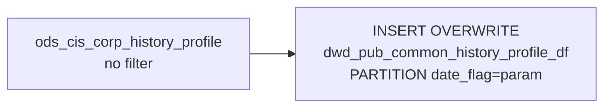

# DWD: History Order Profiles — Daily Snapshot (`dwd_pub_common_history_profile_df`)

- artifact_type: etl_table
- artifact_id: dw_us.dwd_pub_common_history_profile_df
- domain: order
- one_line_purpose: This job creates a **daily point-in-time snapshot of all settled/archived order profile records** from the history profile table. It is a full passthrough of `ods_cis_corp_history_profile` with no filtering, providing a stable dated copy of...
- layer_type: DWD
- source_kind: etl_sql
- evidence_source: source/etl/sql/order/source/etl/flows/public_order_tools/ingest/public_order_dw/script/dwd_pub_common_history_profile_df.sql

---

## L1 Data Foundation

### Identity and physical mapping
- **Table:** `dw_us.dwd_pub_common_history_profile_df`
- **Layer type:** DWD
- **Canonical / derived:** Derived / ETL-loaded (see L3)
- **Owner team:** not registered in metadata catalog

### Grain, scope, exclusions
- **Grain:** one row per `(order_type, order_no, profile_no)` — or more precisely per the natural grain of `ods_cis_corp_history_profile` which is `(order_type, order_no, order_line_no, profile_no)`.
- **Scope:** See L2 business purpose / L3 filters
- **Partition:** `date_flag = '${date_flag}'` — literal run date; full partition overwrite on each run. - resolved from pipeline (see L4)
- **Natural key:** Not documented in repository
- **Exclusions:** Not documented in repository

#### Grain detail (preserved)

- **Grain:** one row per `(order_type, order_no, profile_no)` — or more precisely per the natural grain of `ods_cis_corp_history_profile` which is `(order_type, order_no, order_line_no, profile_no)`.
- **Partition:** `date_flag = '${date_flag}'` — literal run date; full partition overwrite on each run.

---

### Cross-engine presence
| Engine | Present | Canonical FQN | Notes |
|--------|---------|---------------|-------|
| Hive | yes | `dwd_pub_common_history_profile_df` | ETL target / intermediate per evidence script |
| Vertica | pending | `dwd_pub_common_history_profile_df` | Confirm via hive2vertica flow evidence / MCP |

### Physical schema reference

Pointer block only - full column catalog lives in WKB L1 storage JSON.

| Field | Value |
|-------|-------|
| **Authoritative catalog** | WKB L1 storage seed (not duplicated in this file) |
| **entity_id** | `dw_us.dwd_pub_common_history_profile_df` |
| **l1_catalog_seed** | `target/storage/wkb/snapshots/_snapshot_id_template/l1_catalog/{engine}_{schema}_{table}.json` |
| **column_count** | pending (run ddl_seed_writer) |
| **partition_keys** | `date_flag = '${date_flag}'` |
| **ddl_source** | pending Bitbucket DDL / Vertica metadata ingest |
| **retrieval** | `python -m tools.wkb.indexing.run_query --query "order dwd_pub_common_history_profile_df schema" --intent find_table_schema` |

### Lineage
| Object | Role |
|--------|------|
| `ods_${country_code}.ods_cis_corp_history_profile` | Sole source |
| `dw_${country_code}.dwd_pub_common_history_profile_df` | **Target** — daily snapshot of history order profiles |

---

### Freshness and load path
| Item | Value |
|------|-------|
| Load pattern | See L3 end-to-end / INSERT pattern in evidence script |
| Schedule | Not documented in repository |
| Parameters | `country_code`, `date_flag` |


---

## L2 Declarative Knowledge

### Business purpose
This job creates a **daily point-in-time snapshot of all settled/archived order profile records** from the history profile table. It is a full passthrough of `ods_cis_corp_history_profile` with no filtering, providing a stable dated copy of every profile entry (pricing adjustments, SPA references, rebate exclusions, special cost overrides, and other profile types) attached to historical orders. The snapshot supports order pricing audit, SPA reconciliation, and downstream enrichment pipelines.

---

### Audience and use cases
| Audience | How they benefit |
|----------|-----------------|
| **Pricing / audit** | `profile_type`, `profile_c`, `profile_i`, `profile_f` — captures every pricing-related profile entry (ADJ_AMT, SYNPOPRICE, REBATE_ADJ, SPA_REF_NO, etc.) on settled orders for reconciliation. |
| **SPA / rebate management** | Profile records carry SPA numbers (`profile_i`), reference numbers (`profile_c`), and adjustment amounts (`profile_f`) that drive rebate claim processing. |
| **BI / reporting** | Stable daily copy of history profile data for downstream joins without querying the live ODS source. |

---

### Fact key resolution
- Natural key: Not documented in repository
- FK / label-on attributes: see L3 dimension join patterns and step-by-step logic.
- Negative assertion: do not treat descriptive labels as grain keys unless listed under natural key.

### Time field semantics
- **date_flag / partition columns:** `date_flag = '${date_flag}'` — literal run date; full partition overwrite on each run.
- Primary reporting filter should use the partition column(s) documented in L1; resolve values via L4.


### Metrics served

| Category | Column | Logical metric | Business reading |
|----------|--------|----------------|------------------|
| Measures | — | — | No measure columns mapped for this table. |

### Metric serving map

**Formula authority:** [`source/contracts/order/metric-index.md`](../../source/contracts/order/metric-index.md)

N/A — no measure columns mapped for this table.

### etl_metrics

No governed logical metrics from `source/contracts/order/metric-index.md` are mapped on this table.

---

### Metric serving map
N/A - not a `*_comb_mtd` / multi-period wide serving table (or map not present in legacy doc).


### Data products and column groups (preserved)

### Identifiers

- `order_type`, `order_no`, `order_line_no` — order line (NULL for header-level profiles)
- `profile_no` — profile record sequence number

### Profile classification

- `profile_type` — type of profile (e.g. `ADJ_AMT`, `SYNPOPRICE`, `REBATE_ADJ`, `SPA_REF_NO`, `EX_REBATE`, `CONTRNO`, `QUOTREQID`)
- `profile_cat` — category qualifier for the profile type (e.g. `CPOL`, `RBT`, `WFL`)
- `active` — whether the profile entry is currently active

### Profile values

- `profile_c` — character value field (e.g. SPA reference number, contract number, workflow request ID)
- `profile_i` — integer value field (e.g. SPA number, exclude rebate flag)
- `profile_f` — float/decimal value field (e.g. price adjustment amount, SPA keep %)
- `profile_d` — date value field

### Audit

- `entry_datetime`, `entry_id` — creation metadata

---

### etl_metrics

N/A - no calculable ETL formulas extracted from this document (passthrough / stored measures only, or formulas not documented).

---

## L3 Procedural Knowledge

### Query and routing rules
**Business filters:** Use partition / date keys from L1 grain for reporting scope.
**Technical predicates (load only):** See Key filters and step-by-step logic below.

### Dimension join patterns
| Dimension FQN | Join keys | Purpose | Evidence |
|---------------|-----------|---------|----------|
| See step-by-step / base tables | See L3 steps | Dimension enrichment | `source/etl/sql/order/source/etl/flows/public_order_tools/ingest/public_order_dw/script/dwd_pub_common_history_profile_df.sql` |

### Key filters and ETL business logic
### Step 1 — Final `INSERT OVERWRITE`

**From:** `ods_${country_code}.ods_cis_corp_history_profile`

**Filter:** None.

**Explicit pass-through columns:** `order_type`, `order_no`, `profile_no`, `profile_type`, `profile_cat`, `order_line_no`, `profile_c`, `profile_i`, `profile_f`, `profile_d`, `active`, `entry_datetime`, `entry_id`

---

### Standard time-filter SQL
```sql
-- relative period filter using resolved partition value (see L4)
SELECT *
FROM dwd_pub_common_history_profile_df
WHERE /* partition predicate */ date_flag = '${partition_value}';
```

### End-to-end flow
**Runtime parameters:** `country_code`, `date_flag`
**Target table:** `dw_${country_code}.dwd_pub_common_history_profile_df`, partitioned by **`date_flag = '${date_flag}'`** (literal).

1. Read all rows from `ods_cis_corp_history_profile` — no filter.
2. **INSERT OVERWRITE** into target partition with explicit column list.



---


#### High-level stages (preserved)

| Stage | Business meaning |
|-------|-----------------|
| **Full passthrough** | Reads all rows from `ods_cis_corp_history_profile` and writes them verbatim into the daily partition. No filtering or transformation applied. |
| **Daily partition overwrite** | Replaces the `date_flag = '${date_flag}'` partition with the full current state of the history profile table. |

**Parameters:** `country_code`, `date_flag`

---


### Base tables register
| Object | Role in this job |
|--------|-----------------|
| `ods_${country_code}.ods_cis_corp_history_profile` | **Sole source.** All settled/archived order profile records. All rows selected; explicit column list. |

**Temporary tables (inside the job only):** None.

---

### Step-by-step logic
### Step 1 — Final `INSERT OVERWRITE`

**From:** `ods_${country_code}.ods_cis_corp_history_profile`

**Filter:** None.

**Explicit pass-through columns:** `order_type`, `order_no`, `profile_no`, `profile_type`, `profile_cat`, `order_line_no`, `profile_c`, `profile_i`, `profile_f`, `profile_d`, `active`, `entry_datetime`, `entry_id`

---

### Relationship map (embedded)

| from_fqn | to_fqn | cardinality | join_keys | provenance |
|----------|--------|-------------|-----------|------------|
| `ods_${country_code}.ods_cis_corp_history_profile` | `ods_${country_code}.ods_cis_corp_history_profile` | 1:1 source scan | — (no JOIN; single FROM) | etl_sql (`source/etl/sql/order/public_order_scripts/public_order_dw/script/dwd_pub_common_history_profile_df.sql:3`) |


### Special logic (embedded)

Not documented in repository

### Column / field derivations (from ETL SQL)

| target_column | expression_sql | upstream_columns | upstream_tables | transform_kind | evidence |
|---------------|----------------|------------------|-----------------|----------------|----------|
| `order_type` | `order_type` | `order_type` | `ods_${country_code}.ods_cis_corp_history_profile` | passthrough | `source/etl/sql/order/public_order_scripts/public_order_dw/script/dwd_pub_common_history_profile_df.sql:2` |
| `order_no` | `order_no` | `order_no` | `ods_${country_code}.ods_cis_corp_history_profile` | passthrough | `source/etl/sql/order/public_order_scripts/public_order_dw/script/dwd_pub_common_history_profile_df.sql:2` |
| `profile_no` | `profile_no` | `profile_no` | `ods_${country_code}.ods_cis_corp_history_profile` | passthrough | `source/etl/sql/order/public_order_scripts/public_order_dw/script/dwd_pub_common_history_profile_df.sql:2` |
| `profile_type` | `profile_type` | `profile_type` | `ods_${country_code}.ods_cis_corp_history_profile` | passthrough | `source/etl/sql/order/public_order_scripts/public_order_dw/script/dwd_pub_common_history_profile_df.sql:2` |
| `profile_cat` | `profile_cat` | `profile_cat` | `ods_${country_code}.ods_cis_corp_history_profile` | passthrough | `source/etl/sql/order/public_order_scripts/public_order_dw/script/dwd_pub_common_history_profile_df.sql:2` |
| `order_line_no` | `order_line_no` | `order_line_no` | `ods_${country_code}.ods_cis_corp_history_profile` | passthrough | `source/etl/sql/order/public_order_scripts/public_order_dw/script/dwd_pub_common_history_profile_df.sql:2` |
| `profile_c` | `profile_c` | `profile_c` | `ods_${country_code}.ods_cis_corp_history_profile` | passthrough | `source/etl/sql/order/public_order_scripts/public_order_dw/script/dwd_pub_common_history_profile_df.sql:2` |
| `profile_i` | `profile_i` | `profile_i` | `ods_${country_code}.ods_cis_corp_history_profile` | passthrough | `source/etl/sql/order/public_order_scripts/public_order_dw/script/dwd_pub_common_history_profile_df.sql:2` |
| `profile_f` | `profile_f` | `profile_f` | `ods_${country_code}.ods_cis_corp_history_profile` | passthrough | `source/etl/sql/order/public_order_scripts/public_order_dw/script/dwd_pub_common_history_profile_df.sql:2` |
| `profile_d` | `profile_d` | `profile_d` | `ods_${country_code}.ods_cis_corp_history_profile` | passthrough | `source/etl/sql/order/public_order_scripts/public_order_dw/script/dwd_pub_common_history_profile_df.sql:1` |
| `active` | `active` | `active` | `ods_${country_code}.ods_cis_corp_history_profile` | passthrough | `source/etl/sql/order/public_order_scripts/public_order_dw/script/dwd_pub_common_history_profile_df.sql:2` |
| `entry_datetime` | `entry_datetime` | `entry_datetime` | `ods_${country_code}.ods_cis_corp_history_profile` | passthrough | `source/etl/sql/order/public_order_scripts/public_order_dw/script/dwd_pub_common_history_profile_df.sql:2` |
| `entry_id` | `entry_id` | `entry_id` | `ods_${country_code}.ods_cis_corp_history_profile` | passthrough | `source/etl/sql/order/public_order_scripts/public_order_dw/script/dwd_pub_common_history_profile_df.sql:2` |

### Sentinel and code values
| Value | Meaning |
|-------|---------|
| `profile_type = 'ADJ_AMT'` | Manual price adjustment entry |
| `profile_type = 'SYNPOPRICE'`, `profile_cat = 'CPOL'` | Special contract cost |
| `profile_type = 'REBATE_ADJ'` | SPA rebate adjustment — carries SPA number in `profile_i` and SPA ref in `profile_c` |
| `profile_type = 'EX_REBATE'`, `profile_cat = 'RBT'` | Exclude from rebate flag |
| `profile_type = 'SPA_REF_NO'` | SPA reference number (big deal) at order level |
| `profile_type = 'CONTRNO'`, `profile_cat = 'CPOL'` | Contract number |
| `profile_type = 'QUOTREQID'`, `profile_cat = 'WFL'` | Workflow quote request ID |
| `active = 'Y'` | Profile entry is currently active |
| `order_line_no IS NULL` | Header-level profile (applies to the whole order, not a specific line) |

---

---

## L4 Validation

### Resolved partition value
| Step | Source | How partition / date scope is determined |
|------|--------|------------------------------------------|
| 1 | evidence script / flow | See parameters in L1 Freshness and L3 filters - `source/etl/sql/order/source/etl/flows/public_order_tools/ingest/public_order_dw/script/dwd_pub_common_history_profile_df.sql` |

**Plain language:** Partition and date scope follow Azkaban/bootstrap parameters documented in the source script and orchestrating flow; do not hardcode calendar literals.

### Data quality checks
- Prefer row-count-by-partition, metric sums, and grain duplicate checks (see Validation SQL).
- Additional checks from legacy caveats / operational notes when present.

### Validation SQL
```sql
-- 1) Row count by partition
SELECT ${partition_col}, COUNT(*) AS row_cnt
FROM dw_${country_code}.dwd_pub_common_history_profile_df
WHERE ${partition_col} = '${partition_value}'
GROUP BY ${partition_col};

-- 2) Metric sum by business dimension (top deltas)
SELECT ${dim_key}, SUM(${metric}) AS metric_sum
FROM dw_${country_code}.dwd_pub_common_history_profile_df
WHERE ${partition_col} = '${partition_value}'
GROUP BY ${dim_key}
ORDER BY ABS(SUM(${metric})) DESC
LIMIT 20;

-- 3) Grain duplicate check
SELECT ${grain_key_1}, ${grain_key_2}, ${grain_key_3}, ${partition_col}, COUNT(*) AS cnt
FROM dw_${country_code}.dwd_pub_common_history_profile_df
WHERE ${partition_col} = '${partition_value}'
GROUP BY ${grain_key_1}, ${grain_key_2}, ${grain_key_3}, ${partition_col}
HAVING COUNT(*) > 1;
```

Replace placeholders from this file's Grain and keys / Data you can fetch sections, and use the resolved partition value from run scope.

### Caveats for interpretation
- **Full snapshot** — includes inactive records (`active = 'N'`). Filter `active = 'Y'` for active-only analysis.
- **Partition is the run date**, not the profile creation date or the order ship date.
- **Explicit column list** — new columns added to the source will not appear automatically.
- **`profile_d` (date value field) is included** — may be null for most profile types; only specific types use this field.

---

### Conflicts and open questions
- Schedule, owner, SLA: Not documented in repository (unless preserved schedule evidence above).
- Vertica MCP verification: pending unless confirmed in L5.


---

## L5 Runtime View

### Query path and engine preference
| Role | Hive object | Vertica object | Sync mode | Evidence | MCP verified |
|------|-------------|----------------|-----------|----------|--------------|
| **Query for reporting** | *See script lineage* | `dw_${country_code}.dwd_pub_common_history_profile_df` | *Verify from flow* | *Add flow file:line* | pending |
| **Hive alternative** | `*` | `dw_${country_code}.dwd_pub_common_history_profile_df` | - | *See dependencies* | - |
| **ETL internal** | staging/temp tables | *Not synced to Vertica* | - | *See step-by-step logic* | - |

Business users should query `dw_${country_code}.dwd_pub_common_history_profile_df` in Vertica once MCP verification is completed for this document.

### Access constraints
- Country / company schema parameters may apply (`literal_country`, `company_no`, etc.).
- Hive-only staging objects are not reporting surfaces unless synced.

### Query risk profile
| Field | Value |
|-------|-------|
| requires_date_predicate | yes |
| scan_risk_tier | high |

---

## L6 Access and Consumption

### Primary consumers and use cases
| Audience | How they benefit |
|----------|-----------------|
| **Pricing / audit** | `profile_type`, `profile_c`, `profile_i`, `profile_f` — captures every pricing-related profile entry (ADJ_AMT, SYNPOPRICE, REBATE_ADJ, SPA_REF_NO, etc.) on settled orders for reconciliation. |
| **SPA / rebate management** | Profile records carry SPA numbers (`profile_i`), reference numbers (`profile_c`), and adjustment amounts (`profile_f`) that drive rebate claim processing. |
| **BI / reporting** | Stable daily copy of history profile data for downstream joins without querying the live ODS source. |

---

### Representative query patterns
```sql
-- certified / illustrative lookup - replace predicates from L1/L4
SELECT *
FROM dwd_pub_common_history_profile_df
WHERE date_flag = '${partition_value}'
LIMIT 100;
```

### Dependencies and notes
### Upstream objects (verified)

| Object | Usage | Evidence |
|--------|-------|----------|
| `ods_${country_code}.ods_cis_corp_history_profile` | All history profile records; full table | `dwd_pub_common_history_profile_df.sql:2-3` |

### Downstream consumers (verified)

| Object / script | Evidence |
|-----------------|----------|
| None identified in repository. | — |

### Operational detail (verified)

- Partition overwrite: `INSERT OVERWRITE TABLE dw_${country_code}.dwd_pub_common_history_profile_df PARTITION (date_flag='${date_flag}')` — `dwd_pub_common_history_profile_df.sql:1`

### Not documented in repository

- Schedule, owner, SLA — not in scripts or configs

---

*Document generated from `source/etl/sql/order/source/etl/flows/public_order_tools/ingest/public_order_dw/script/dwd_pub_common_history_profile_df.sql`.*

#### Not documented in repository
- Owner, SLA (unless schedule evidence preserved above)
- Any dependency without `file:line` evidence in this document

---

*Document migrated to L1-L6 from legacy Knowledgebase content. Evidence: `source/etl/sql/order/source/etl/flows/public_order_tools/ingest/public_order_dw/script/dwd_pub_common_history_profile_df.sql`.*
