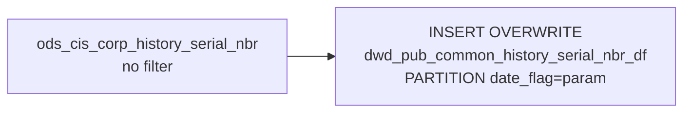

# DWD: History Serial Numbers — Daily Snapshot (`dwd_pub_common_history_serial_nbr_df`)

- artifact_type: etl_table
- artifact_id: dw_us.dwd_pub_common_history_serial_nbr_df
- domain: order
- one_line_purpose: This job creates a **daily point-in-time snapshot of all settled/archived order serial number records** from the history serial number table. It is a full passthrough of `ods_cis_corp_history_serial_nbr` with no filtering — capturing every ...
- layer_type: DWD
- source_kind: etl_sql
- evidence_source: source/etl/sql/order/source/etl/flows/public_order_tools/ingest/public_order_dw/script/dwd_pub_common_history_serial_nbr_df.sql

---

## L1 Data Foundation

### Identity and physical mapping
- **Table:** `dw_us.dwd_pub_common_history_serial_nbr_df`
- **Layer type:** DWD
- **Canonical / derived:** Derived / ETL-loaded (see L3)
- **Owner team:** not registered in metadata catalog

### Grain, scope, exclusions
- **Grain:** one row per `(order_type, order_no, order_line_no, ser_no)` — a unique serial number on a specific historical order line.
- **Scope:** See L2 business purpose / L3 filters
- **Partition:** `date_flag = '${date_flag}'` — literal run date; full partition overwrite on each run. - resolved from pipeline (see L4)
- **Natural key:** `order_type`, `order_no`, `order_line_no`, `ser_no`.
- **Exclusions:** Not documented in repository

#### Grain detail (preserved)

- **Grain:** one row per `(order_type, order_no, order_line_no, ser_no)` — a unique serial number on a specific historical order line.
- **Partition:** `date_flag = '${date_flag}'` — literal run date; full partition overwrite on each run.
- **Natural key:** `order_type`, `order_no`, `order_line_no`, `ser_no`.

---

### Cross-engine presence
| Engine | Present | Canonical FQN | Notes |
|--------|---------|---------------|-------|
| Hive | yes | `dwd_pub_common_history_serial_nbr_df` | ETL target / intermediate per evidence script |
| Vertica | pending | `dwd_pub_common_history_serial_nbr_df` | Confirm via hive2vertica flow evidence / MCP |

### Physical schema reference

Pointer block only - full column catalog lives in WKB L1 storage JSON.

| Field | Value |
|-------|-------|
| **Authoritative catalog** | WKB L1 storage seed (not duplicated in this file) |
| **entity_id** | `dw_us.dwd_pub_common_history_serial_nbr_df` |
| **l1_catalog_seed** | `target/storage/wkb/snapshots/_snapshot_id_template/l1_catalog/{engine}_{schema}_{table}.json` |
| **column_count** | pending (run ddl_seed_writer) |
| **partition_keys** | `date_flag = '${date_flag}'` |
| **ddl_source** | pending Bitbucket DDL / Vertica metadata ingest |
| **retrieval** | `python -m tools.wkb.indexing.run_query --query "order dwd_pub_common_history_serial_nbr_df schema" --intent find_table_schema` |

### Lineage
| Object | Role |
|--------|------|
| `ods_${country_code}.ods_cis_corp_history_serial_nbr` | Sole source — all history serial number records |
| `dw_${country_code}.dwd_pub_common_history_serial_nbr_df` | **Target** — daily snapshot of history serial numbers |

---

### Freshness and load path
| Item | Value |
|------|-------|
| Load pattern | See L3 end-to-end / INSERT pattern in evidence script |
| Schedule | Not documented in repository |
| Parameters | `country_code`, `date_flag` |


---

## L2 Declarative Knowledge

### Business purpose
This job creates a **daily point-in-time snapshot of all settled/archived order serial number records** from the history serial number table. It is a full passthrough of `ods_cis_corp_history_serial_nbr` with no filtering — capturing every device identifier (serial number, IMEI, ESN, MEID, ICCID, MAC address, asset tag) associated with historical order lines. The snapshot supports device tracking, warranty reconciliation, RMA matching, and compliance reporting on shipped/settled orders.

---

### Audience and use cases
| Audience | How they benefit |
|----------|-----------------|
| **Asset / warranty management** | `ser_no`, `asset_tag`, `mac_address`, `imei_no`, `esn_no`, `meid_no`, `iccid_no` — full device identifier suite for each serialised product line on settled orders. |
| **Operations / returns** | `load_no`, `carton_no`, `carton_line_no` — links the serial record to its physical carton and load for reverse logistics and RMA validation. |
| **Software / licensing** | `key_code`, `key_start_date`, `key_end_date` — software key details for licensed SKUs. |
| **Finance / audit** | Order-linked serialisation audit trail for serialised inventory valuation and compliance. |

---

### Fact key resolution
- Natural key: `order_type`, `order_no`, `order_line_no`, `ser_no`.
- FK / label-on attributes: see L3 dimension join patterns and step-by-step logic.
- Negative assertion: do not treat descriptive labels as grain keys unless listed under natural key.

### Time field semantics
- **date_flag / partition columns:** `date_flag = '${date_flag}'` — literal run date; full partition overwrite on each run.
- Primary reporting filter should use the partition column(s) documented in L1; resolve values via L4.


### Metrics served

| Category | Column | Logical metric | Business reading |
|----------|--------|----------------|------------------|
| Measures | — | — | No measure columns mapped for this table. |

### Metric serving map

**Formula authority:** [`source/contracts/order/metric-index.md`](../../source/contracts/order/metric-index.md)

N/A — no measure columns mapped for this table.

### etl_metrics

No governed logical metrics from `source/contracts/order/metric-index.md` are mapped on this table.

---

### Metric serving map
N/A - not a `*_comb_mtd` / multi-period wide serving table (or map not present in legacy doc).


### Data products and column groups (preserved)

### Order identifiers

- `order_type`, `order_no`, `order_line_no`

### Product identifiers

- `sku_no` — SKU number for the serialised product
- `inv_type` — inventory type
- `loc_no` — location/warehouse where the serial was recorded

### Device identifiers

- `ser_no` — serial number (primary device identifier)
- `imei_no` — IMEI (mobile/cellular devices)
- `esn_no` — ESN (electronic serial number, CDMA devices)
- `meid_no` — MEID (mobile equipment identifier)
- `iccid_no` — ICCID (SIM card identifier)
- `mac_address` — network MAC address
- `asset_tag` — asset management tag

### Carton / load tracking

- `load_no` — shipment load number
- `carton_no` — carton number within the load
- `carton_line_no` — line within the carton

### Software / licensing

- `key_code` — software license key
- `key_start_date` — license key validity start date
- `key_end_date` — license key validity end date

### Audit

- `entry_datetime`, `entry_id` — creation metadata

---

### etl_metrics

N/A - no calculable ETL formulas extracted from this document (passthrough / stored measures only, or formulas not documented).

---

## L3 Procedural Knowledge

### Query and routing rules
**Business filters:** Use partition / date keys from L1 grain for reporting scope.
**Technical predicates (load only):** See Key filters and step-by-step logic below.

### Dimension join patterns
| Dimension FQN | Join keys | Purpose | Evidence |
|---------------|-----------|---------|----------|
| See step-by-step / base tables | See L3 steps | Dimension enrichment | `source/etl/sql/order/source/etl/flows/public_order_tools/ingest/public_order_dw/script/dwd_pub_common_history_serial_nbr_df.sql` |

### Key filters and ETL business logic
### Step 1 — Final `INSERT OVERWRITE`

**From:** `ods_${country_code}.ods_cis_corp_history_serial_nbr`

**Filter:** None.

**Explicit pass-through columns:** `order_type`, `order_no`, `order_line_no`, `ser_no`, `sku_no`, `inv_type`, `loc_no`, `entry_datetime`, `entry_id`, `load_no`, `carton_no`, `carton_line_no`, `imei_no`, `esn_no`, `meid_no`, `iccid_no`, `mac_address`, `asset_tag`, `key_code`, `key_start_date`, `key_end_date`

---

### Standard time-filter SQL
```sql
-- relative period filter using resolved partition value (see L4)
SELECT *
FROM dwd_pub_common_history_serial_nbr_df
WHERE /* partition predicate */ date_flag = '${partition_value}';
```

### End-to-end flow
**Runtime parameters:** `country_code`, `date_flag`
**Target table:** `dw_${country_code}.dwd_pub_common_history_serial_nbr_df`, partitioned by **`date_flag = '${date_flag}'`** (literal).

1. Read all rows from `ods_cis_corp_history_serial_nbr` — no filter.
2. **INSERT OVERWRITE** into target with explicit 21-column list.



---


#### High-level stages (preserved)

| Stage | Business meaning |
|-------|-----------------|
| **Full passthrough** | Reads all rows from `ods_cis_corp_history_serial_nbr` and writes them verbatim into the daily partition. No filtering or transformation applied. |
| **Daily partition overwrite** | Replaces the `date_flag = '${date_flag}'` partition with the full current state of the history serial number table. |

**Parameters:** `country_code`, `date_flag`

---


### Base tables register
| Object | Role in this job |
|--------|-----------------|
| `ods_${country_code}.ods_cis_corp_history_serial_nbr` | **Sole source.** All settled/archived order serial number records. All rows selected; explicit column list. |

**Temporary tables (inside the job only):** None.

---

### Step-by-step logic
### Step 1 — Final `INSERT OVERWRITE`

**From:** `ods_${country_code}.ods_cis_corp_history_serial_nbr`

**Filter:** None.

**Explicit pass-through columns:** `order_type`, `order_no`, `order_line_no`, `ser_no`, `sku_no`, `inv_type`, `loc_no`, `entry_datetime`, `entry_id`, `load_no`, `carton_no`, `carton_line_no`, `imei_no`, `esn_no`, `meid_no`, `iccid_no`, `mac_address`, `asset_tag`, `key_code`, `key_start_date`, `key_end_date`

---

### Relationship map (embedded)

| from_fqn | to_fqn | cardinality | join_keys | provenance |
|----------|--------|-------------|-----------|------------|
| `ods_${country_code}.ods_cis_corp_history_serial_nbr` | `ods_${country_code}.ods_cis_corp_history_serial_nbr` | 1:1 source scan | — (no JOIN; single FROM) | etl_sql (`source/etl/sql/order/public_order_scripts/public_order_dw/script/dwd_pub_common_history_serial_nbr_df.sql:3`) |


### Special logic (embedded)

Not documented in repository

### Column / field derivations (from ETL SQL)

| target_column | expression_sql | upstream_columns | upstream_tables | transform_kind | evidence |
|---------------|----------------|------------------|-----------------|----------------|----------|
| `order_type` | `order_type` | `order_type` | `ods_${country_code}.ods_cis_corp_history_serial_nbr` | passthrough | `source/etl/sql/order/public_order_scripts/public_order_dw/script/dwd_pub_common_history_serial_nbr_df.sql:2` |
| `order_no` | `order_no` | `order_no` | `ods_${country_code}.ods_cis_corp_history_serial_nbr` | passthrough | `source/etl/sql/order/public_order_scripts/public_order_dw/script/dwd_pub_common_history_serial_nbr_df.sql:2` |
| `order_line_no` | `order_line_no` | `order_line_no` | `ods_${country_code}.ods_cis_corp_history_serial_nbr` | passthrough | `source/etl/sql/order/public_order_scripts/public_order_dw/script/dwd_pub_common_history_serial_nbr_df.sql:2` |
| `ser_no` | `ser_no` | `ser_no` | `ods_${country_code}.ods_cis_corp_history_serial_nbr` | passthrough | `source/etl/sql/order/public_order_scripts/public_order_dw/script/dwd_pub_common_history_serial_nbr_df.sql:2` |
| `sku_no` | `sku_no` | `sku_no` | `ods_${country_code}.ods_cis_corp_history_serial_nbr` | passthrough | `source/etl/sql/order/public_order_scripts/public_order_dw/script/dwd_pub_common_history_serial_nbr_df.sql:2` |
| `inv_type` | `inv_type` | `inv_type` | `ods_${country_code}.ods_cis_corp_history_serial_nbr` | passthrough | `source/etl/sql/order/public_order_scripts/public_order_dw/script/dwd_pub_common_history_serial_nbr_df.sql:2` |
| `loc_no` | `loc_no` | `loc_no` | `ods_${country_code}.ods_cis_corp_history_serial_nbr` | passthrough | `source/etl/sql/order/public_order_scripts/public_order_dw/script/dwd_pub_common_history_serial_nbr_df.sql:2` |
| `entry_datetime` | `entry_datetime` | `entry_datetime` | `ods_${country_code}.ods_cis_corp_history_serial_nbr` | passthrough | `source/etl/sql/order/public_order_scripts/public_order_dw/script/dwd_pub_common_history_serial_nbr_df.sql:2` |
| `entry_id` | `entry_id` | `entry_id` | `ods_${country_code}.ods_cis_corp_history_serial_nbr` | passthrough | `source/etl/sql/order/public_order_scripts/public_order_dw/script/dwd_pub_common_history_serial_nbr_df.sql:2` |
| `load_no` | `load_no` | `load_no` | `ods_${country_code}.ods_cis_corp_history_serial_nbr` | passthrough | `source/etl/sql/order/public_order_scripts/public_order_dw/script/dwd_pub_common_history_serial_nbr_df.sql:2` |
| `carton_no` | `carton_no` | `carton_no` | `ods_${country_code}.ods_cis_corp_history_serial_nbr` | passthrough | `source/etl/sql/order/public_order_scripts/public_order_dw/script/dwd_pub_common_history_serial_nbr_df.sql:2` |
| `carton_line_no` | `carton_line_no` | `carton_line_no` | `ods_${country_code}.ods_cis_corp_history_serial_nbr` | passthrough | `source/etl/sql/order/public_order_scripts/public_order_dw/script/dwd_pub_common_history_serial_nbr_df.sql:2` |
| `imei_no` | `imei_no` | `imei_no` | `ods_${country_code}.ods_cis_corp_history_serial_nbr` | passthrough | `source/etl/sql/order/public_order_scripts/public_order_dw/script/dwd_pub_common_history_serial_nbr_df.sql:2` |
| `esn_no` | `esn_no` | `esn_no` | `ods_${country_code}.ods_cis_corp_history_serial_nbr` | passthrough | `source/etl/sql/order/public_order_scripts/public_order_dw/script/dwd_pub_common_history_serial_nbr_df.sql:2` |
| `meid_no` | `meid_no` | `meid_no` | `ods_${country_code}.ods_cis_corp_history_serial_nbr` | passthrough | `source/etl/sql/order/public_order_scripts/public_order_dw/script/dwd_pub_common_history_serial_nbr_df.sql:2` |
| `iccid_no` | `iccid_no` | `iccid_no` | `ods_${country_code}.ods_cis_corp_history_serial_nbr` | passthrough | `source/etl/sql/order/public_order_scripts/public_order_dw/script/dwd_pub_common_history_serial_nbr_df.sql:2` |
| `mac_address` | `mac_address` | `mac_address` | `ods_${country_code}.ods_cis_corp_history_serial_nbr` | passthrough | `source/etl/sql/order/public_order_scripts/public_order_dw/script/dwd_pub_common_history_serial_nbr_df.sql:2` |
| `asset_tag` | `asset_tag` | `asset_tag` | `ods_${country_code}.ods_cis_corp_history_serial_nbr` | passthrough | `source/etl/sql/order/public_order_scripts/public_order_dw/script/dwd_pub_common_history_serial_nbr_df.sql:2` |
| `key_code` | `key_code` | `key_code` | `ods_${country_code}.ods_cis_corp_history_serial_nbr` | passthrough | `source/etl/sql/order/public_order_scripts/public_order_dw/script/dwd_pub_common_history_serial_nbr_df.sql:2` |
| `key_start_date` | `key_start_date` | `key_start_date` | `ods_${country_code}.ods_cis_corp_history_serial_nbr` | passthrough | `source/etl/sql/order/public_order_scripts/public_order_dw/script/dwd_pub_common_history_serial_nbr_df.sql:2` |
| `key_end_date` | `key_end_date` | `key_end_date` | `ods_${country_code}.ods_cis_corp_history_serial_nbr` | passthrough | `source/etl/sql/order/public_order_scripts/public_order_dw/script/dwd_pub_common_history_serial_nbr_df.sql:2` |

### Sentinel and code values
| Value | Meaning |
|-------|---------|
| `ser_no IS NOT NULL` | All rows in this table should have a serial number (it is the primary identifier). Filter `ser_no IS NOT NULL` to exclude BTO placeholder rows if any. |
| `carton_no = 'bto'` | BTO (Build-to-Order) placeholder carton — may indicate a non-standard serial record. |
| `key_end_date IS NOT NULL` | Only populated for software-licensed SKUs; most hardware rows will be NULL. |

---

---

## L4 Validation

### Resolved partition value
| Step | Source | How partition / date scope is determined |
|------|--------|------------------------------------------|
| 1 | evidence script / flow | See parameters in L1 Freshness and L3 filters - `source/etl/sql/order/source/etl/flows/public_order_tools/ingest/public_order_dw/script/dwd_pub_common_history_serial_nbr_df.sql` |

**Plain language:** Partition and date scope follow Azkaban/bootstrap parameters documented in the source script and orchestrating flow; do not hardcode calendar literals.

### Data quality checks
- Prefer row-count-by-partition, metric sums, and grain duplicate checks (see Validation SQL).
- Additional checks from legacy caveats / operational notes when present.

### Validation SQL
```sql
-- 1) Row count by partition
SELECT ${partition_col}, COUNT(*) AS row_cnt
FROM dw_${country_code}.dwd_pub_common_history_serial_nbr_df
WHERE ${partition_col} = '${partition_value}'
GROUP BY ${partition_col};

-- 2) Metric sum by business dimension (top deltas)
SELECT ${dim_key}, SUM(${metric}) AS metric_sum
FROM dw_${country_code}.dwd_pub_common_history_serial_nbr_df
WHERE ${partition_col} = '${partition_value}'
GROUP BY ${dim_key}
ORDER BY ABS(SUM(${metric})) DESC
LIMIT 20;

-- 3) Grain duplicate check
SELECT ${grain_key_1}, ${grain_key_2}, ${grain_key_3}, ${partition_col}, COUNT(*) AS cnt
FROM dw_${country_code}.dwd_pub_common_history_serial_nbr_df
WHERE ${partition_col} = '${partition_value}'
GROUP BY ${grain_key_1}, ${grain_key_2}, ${grain_key_3}, ${partition_col}
HAVING COUNT(*) > 1;
```

Replace placeholders from this file's Grain and keys / Data you can fetch sections, and use the resolved partition value from run scope.

### Caveats for interpretation
- **Full snapshot — no filter** — all rows including any BTO placeholder or null-serial rows are included. Filter `carton_no != 'bto'` and `ser_no IS NOT NULL` for analysis-ready serial records (as done in `dwd_disty_common_order_serial_no_di.sql`).
- **Partition is the run date**, not the order ship date or serial entry date.
- **Explicit column list** — new columns added to the source will not appear automatically.
- **Multiple device identifiers per row** — a single `ser_no` row may have IMEI, MAC, ICCID all set; each represents a different identifier for the same physical device.

---

### Conflicts and open questions
- Schedule, owner, SLA: Not documented in repository (unless preserved schedule evidence above).
- Vertica MCP verification: pending unless confirmed in L5.


---

## L5 Runtime View

### Query path and engine preference
| Role | Hive object | Vertica object | Sync mode | Evidence | MCP verified |
|------|-------------|----------------|-----------|----------|--------------|
| **Query for reporting** | *See script lineage* | `dw_${country_code}.dwd_pub_common_history_serial_nbr_df` | *Verify from flow* | *Add flow file:line* | pending |
| **Hive alternative** | `*` | `dw_${country_code}.dwd_pub_common_history_serial_nbr_df` | - | *See dependencies* | - |
| **ETL internal** | staging/temp tables | *Not synced to Vertica* | - | *See step-by-step logic* | - |

Business users should query `dw_${country_code}.dwd_pub_common_history_serial_nbr_df` in Vertica once MCP verification is completed for this document.

### Access constraints
- Country / company schema parameters may apply (`literal_country`, `company_no`, etc.).
- Hive-only staging objects are not reporting surfaces unless synced.

### Query risk profile
| Field | Value |
|-------|-------|
| requires_date_predicate | yes |
| scan_risk_tier | high |

---

## L6 Access and Consumption

### Primary consumers and use cases
| Audience | How they benefit |
|----------|-----------------|
| **Asset / warranty management** | `ser_no`, `asset_tag`, `mac_address`, `imei_no`, `esn_no`, `meid_no`, `iccid_no` — full device identifier suite for each serialised product line on settled orders. |
| **Operations / returns** | `load_no`, `carton_no`, `carton_line_no` — links the serial record to its physical carton and load for reverse logistics and RMA validation. |
| **Software / licensing** | `key_code`, `key_start_date`, `key_end_date` — software key details for licensed SKUs. |
| **Finance / audit** | Order-linked serialisation audit trail for serialised inventory valuation and compliance. |

---

### Representative query patterns
```sql
-- certified / illustrative lookup - replace predicates from L1/L4
SELECT *
FROM dwd_pub_common_history_serial_nbr_df
WHERE date_flag = '${partition_value}'
LIMIT 100;
```

### Dependencies and notes
### Upstream objects (verified)

| Object | Usage | Evidence |
|--------|-------|----------|
| `ods_${country_code}.ods_cis_corp_history_serial_nbr` | All history serial number records; full table | `dwd_pub_common_history_serial_nbr_df.sql:2-3` |

### Downstream consumers (verified)

| Object / script | Evidence |
|-----------------|----------|
| None identified in repository. | — |

### Operational detail (verified)

- Partition overwrite: `INSERT OVERWRITE TABLE dw_${country_code}.dwd_pub_common_history_serial_nbr_df PARTITION (date_flag='${date_flag}')` — `dwd_pub_common_history_serial_nbr_df.sql:1`

### Not documented in repository

- Schedule, owner, SLA — not in scripts or configs

---

*Document generated from `source/etl/sql/order/source/etl/flows/public_order_tools/ingest/public_order_dw/script/dwd_pub_common_history_serial_nbr_df.sql`.*

#### Not documented in repository
- Owner, SLA (unless schedule evidence preserved above)
- Any dependency without `file:line` evidence in this document

---

*Document migrated to L1-L6 from legacy Knowledgebase content. Evidence: `source/etl/sql/order/source/etl/flows/public_order_tools/ingest/public_order_dw/script/dwd_pub_common_history_serial_nbr_df.sql`.*
